# Opinion Poll by Verian for TV2, 27–31 May 2024

<a href="#voting-intentions">Voting Intentions</a> | <a href="#seats">Seats</a> | <a href="#coalitions">Coalitions</a> | <a href="#technical-information">Technical Information</a>

## Voting Intentions

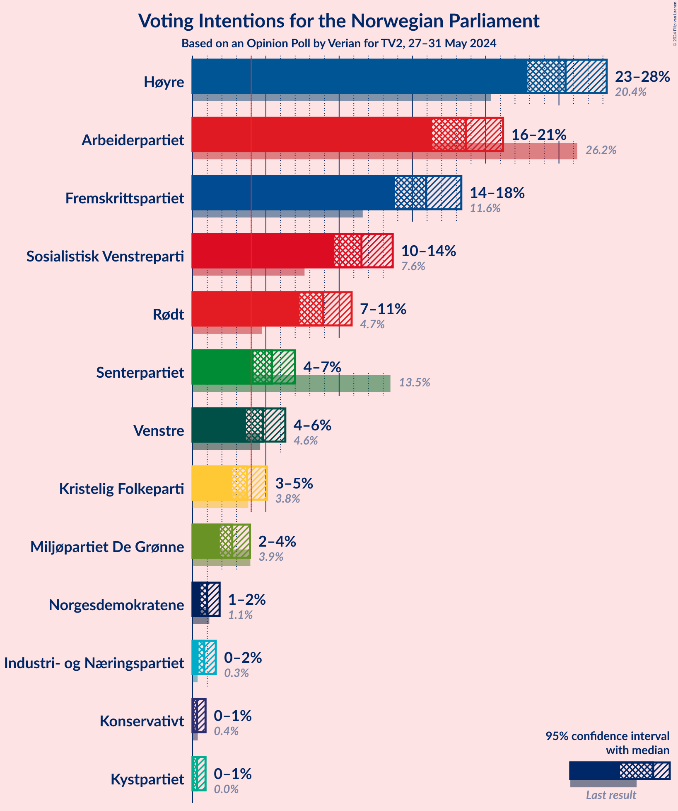

### Confidence Intervals

| Party | Last Result | Poll Result | 80% Confidence Interval | 90% Confidence Interval | 95% Confidence Interval | 99% Confidence Interval |
|:-----:|:-----------:|:-----------:|:-----------------------:|:-----------------------:|:-----------------------:|:-----------------------:|
| Høyre | 20.4% | 25.5% | 23.7–27.3% |23.3–27.8% |22.8–28.3% |22.0–29.1% |
| Arbeiderpartiet | 26.2% | 18.6% | 17.1–20.3% |16.7–20.8% |16.3–21.2% |15.6–22.0% |
| Fremskrittspartiet | 11.6% | 15.9% | 14.5–17.5% |14.1–18.0% |13.8–18.3% |13.1–19.1% |
| Sosialistisk Venstreparti | 7.6% | 11.5% | 10.3–12.9% |10.0–13.3% |9.7–13.7% |9.1–14.4% |
| Rødt | 4.7% | 8.9% | 7.8–10.2% |7.6–10.5% |7.3–10.9% |6.8–11.5% |
| Senterpartiet | 13.5% | 5.4% | 4.6–6.4% |4.4–6.7% |4.2–7.0% |3.8–7.5% |
| Venstre | 4.6% | 4.8% | 4.0–5.8% |3.8–6.1% |3.6–6.3% |3.3–6.8% |
| Kristelig Folkeparti | 3.8% | 3.7% | 3.0–4.6% |2.9–4.8% |2.7–5.1% |2.4–5.5% |
| Miljøpartiet De Grønne | 3.9% | 2.7% | 2.1–3.5% |2.0–3.7% |1.9–3.9% |1.6–4.3% |
| Norgesdemokratene | 1.1% | 1.0% | 0.7–1.5% |0.6–1.7% |0.5–1.8% |0.4–2.1% |
| Industri- og Næringspartiet | 0.3% | 0.8% | 0.5–1.3% |0.5–1.4% |0.4–1.6% |0.3–1.9% |
| Kystpartiet | 0.0% | 0.3% | 0.2–0.7% |0.1–0.8% |0.1–0.9% |0.1–1.1% |
| Konservativt | 0.4% | 0.3% | 0.2–0.7% |0.1–0.8% |0.1–0.9% |0.1–1.1% |

*Note:* The poll result column reflects the actual value used in the calculations. Published results may vary slightly, and in addition be rounded to fewer digits.

## Seats

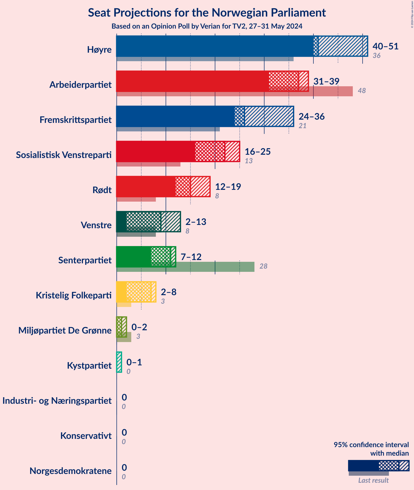

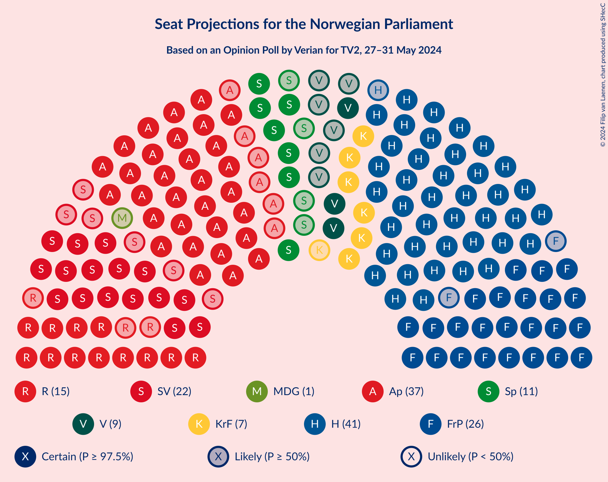

### Confidence Intervals

| Party | Last Result | Median | 80% Confidence Interval | 90% Confidence Interval | 95% Confidence Interval | 99% Confidence Interval |
|:-----:|:-----------:|:------:|:-----------------------:|:-----------------------:|:-----------------------:|:-----------------------:|
| <a href="#høyre">Høyre</a> | 36 | 41 | 40–49 |40–50 |40–51 |38–51 |
| <a href="#arbeiderpartiet">Arbeiderpartiet</a> | 48 | 37 | 31–38 |31–39 |31–39 |30–42 |
| <a href="#fremskrittspartiet">Fremskrittspartiet</a> | 21 | 26 | 25–32 |24–36 |24–36 |22–37 |
| <a href="#sosialistisk-venstreparti">Sosialistisk Venstreparti</a> | 13 | 22 | 17–22 |16–23 |16–25 |16–25 |
| <a href="#rødt">Rødt</a> | 8 | 15 | 14–17 |12–18 |12–19 |10–20 |
| <a href="#senterpartiet">Senterpartiet</a> | 28 | 11 | 8–11 |7–12 |7–12 |7–14 |
| <a href="#venstre">Venstre</a> | 8 | 9 | 8–11 |2–11 |2–13 |2–13 |
| <a href="#kristelig-folkeparti">Kristelig Folkeparti</a> | 3 | 7 | 2–7 |2–8 |2–8 |2–10 |
| <a href="#miljøpartiet-de-grønne">Miljøpartiet De Grønne</a> | 3 | 1 | 1–2 |0–2 |0–2 |0–7 |
| <a href="#norgesdemokratene">Norgesdemokratene</a> | 0 | 0 | 0 |0 |0 |0 |
| <a href="#industri--og-næringspartiet">Industri- og Næringspartiet</a> | 0 | 0 | 0 |0 |0 |0 |
| <a href="#kystpartiet">Kystpartiet</a> | 0 | 0 | 0–1 |0–1 |0–1 |0–1 |
| <a href="#konservativt">Konservativt</a> | 0 | 0 | 0 |0 |0 |0 |

### Høyre

*For a full overview of the results for this party, see the [Høyre](party-høyre.html) page.*

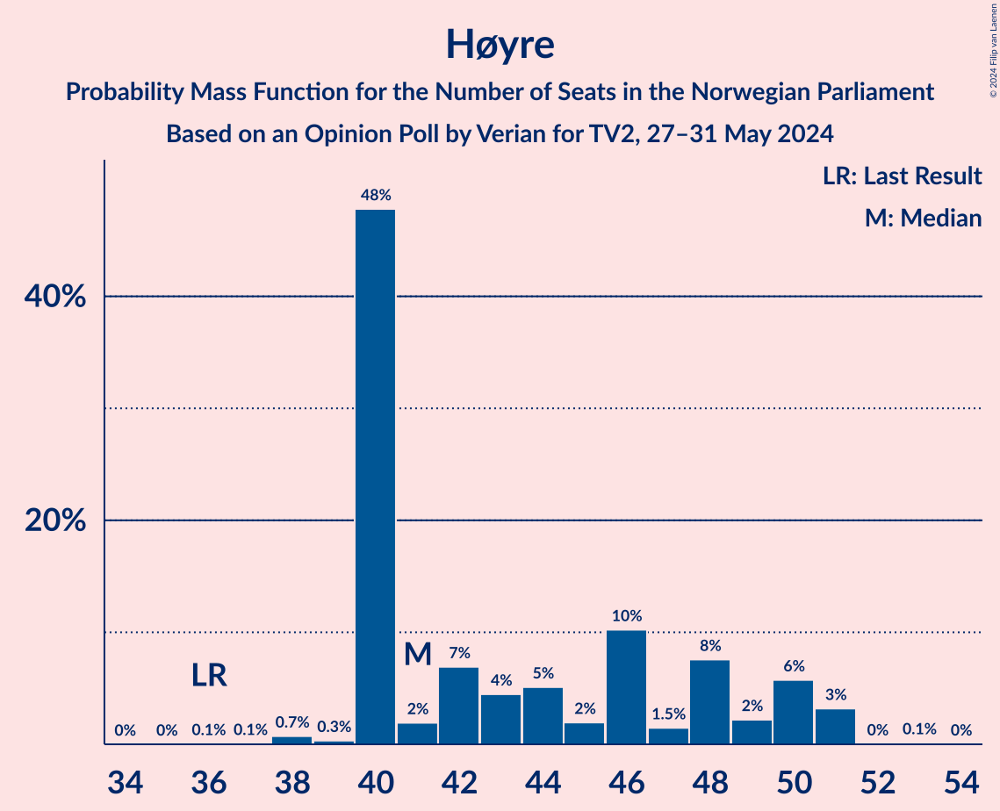

| Number of Seats | Probability | Accumulated | Special Marks |
|:---------------:|:-----------:|:-----------:|:-------------:|
| 36 | 0.1% | 100% | Last Result |
| 37 | 0.1% | 99.9% |  |
| 38 | 0.7% | 99.9% |  |
| 39 | 0.3% | 99.1% |  |
| 40 | 48% | 98.8% |  |
| 41 | 2% | 51% | Median |
| 42 | 7% | 49% |  |
| 43 | 4% | 42% |  |
| 44 | 5% | 38% |  |
| 45 | 2% | 33% |  |
| 46 | 10% | 31% |  |
| 47 | 1.5% | 20% |  |
| 48 | 8% | 19% |  |
| 49 | 2% | 11% |  |
| 50 | 6% | 9% |  |
| 51 | 3% | 3% |  |
| 52 | 0% | 0.2% |  |
| 53 | 0.1% | 0.2% |  |
| 54 | 0% | 0% |  |

### Arbeiderpartiet

*For a full overview of the results for this party, see the [Arbeiderpartiet](party-arbeiderpartiet.html) page.*

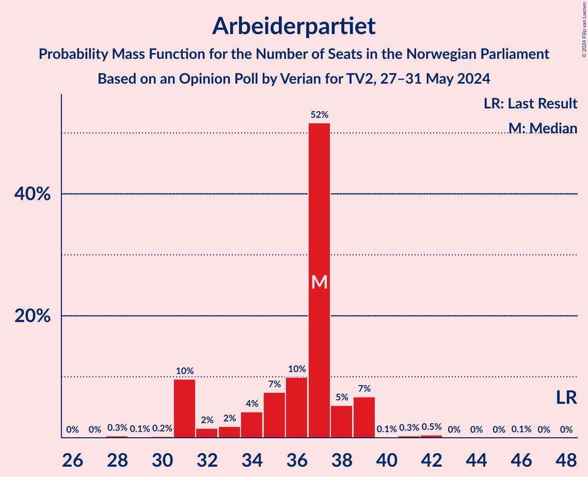

| Number of Seats | Probability | Accumulated | Special Marks |
|:---------------:|:-----------:|:-----------:|:-------------:|
| 28 | 0.3% | 100% |  |
| 29 | 0.1% | 99.7% |  |
| 30 | 0.2% | 99.5% |  |
| 31 | 10% | 99.3% |  |
| 32 | 2% | 90% |  |
| 33 | 2% | 88% |  |
| 34 | 4% | 86% |  |
| 35 | 7% | 82% |  |
| 36 | 10% | 75% |  |
| 37 | 52% | 65% | Median |
| 38 | 5% | 13% |  |
| 39 | 7% | 8% |  |
| 40 | 0.1% | 1.0% |  |
| 41 | 0.3% | 0.9% |  |
| 42 | 0.5% | 0.5% |  |
| 43 | 0% | 0.1% |  |
| 44 | 0% | 0.1% |  |
| 45 | 0% | 0.1% |  |
| 46 | 0.1% | 0.1% |  |
| 47 | 0% | 0% |  |
| 48 | 0% | 0% | Last Result |

### Fremskrittspartiet

*For a full overview of the results for this party, see the [Fremskrittspartiet](party-fremskrittspartiet.html) page.*

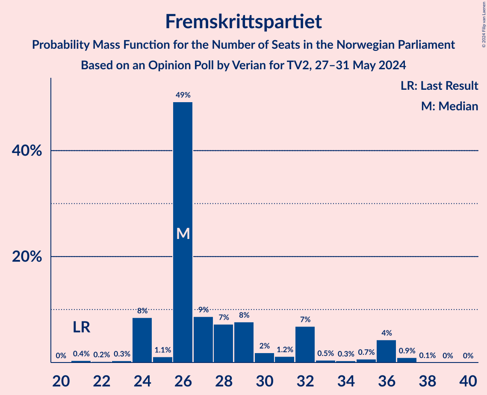

| Number of Seats | Probability | Accumulated | Special Marks |
|:---------------:|:-----------:|:-----------:|:-------------:|
| 21 | 0.4% | 100% | Last Result |
| 22 | 0.2% | 99.6% |  |
| 23 | 0.3% | 99.4% |  |
| 24 | 8% | 99.0% |  |
| 25 | 1.1% | 91% |  |
| 26 | 49% | 89% | Median |
| 27 | 9% | 40% |  |
| 28 | 7% | 32% |  |
| 29 | 8% | 24% |  |
| 30 | 2% | 17% |  |
| 31 | 1.2% | 15% |  |
| 32 | 7% | 14% |  |
| 33 | 0.5% | 7% |  |
| 34 | 0.3% | 6% |  |
| 35 | 0.7% | 6% |  |
| 36 | 4% | 5% |  |
| 37 | 0.9% | 1.0% |  |
| 38 | 0.1% | 0.1% |  |
| 39 | 0% | 0% |  |

### Sosialistisk Venstreparti

*For a full overview of the results for this party, see the [Sosialistisk Venstreparti](party-sosialistiskvenstreparti.html) page.*

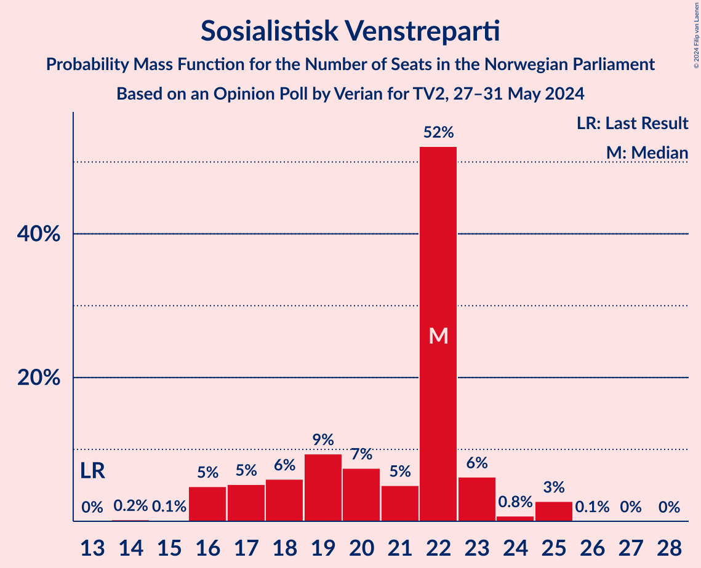

| Number of Seats | Probability | Accumulated | Special Marks |
|:---------------:|:-----------:|:-----------:|:-------------:|
| 13 | 0% | 100% | Last Result |
| 14 | 0.2% | 100% |  |
| 15 | 0.1% | 99.8% |  |
| 16 | 5% | 99.6% |  |
| 17 | 5% | 95% |  |
| 18 | 6% | 90% |  |
| 19 | 9% | 84% |  |
| 20 | 7% | 74% |  |
| 21 | 5% | 67% |  |
| 22 | 52% | 62% | Median |
| 23 | 6% | 10% |  |
| 24 | 0.8% | 4% |  |
| 25 | 3% | 3% |  |
| 26 | 0.1% | 0.1% |  |
| 27 | 0% | 0.1% |  |
| 28 | 0% | 0% |  |

### Rødt

*For a full overview of the results for this party, see the [Rødt](party-rødt.html) page.*

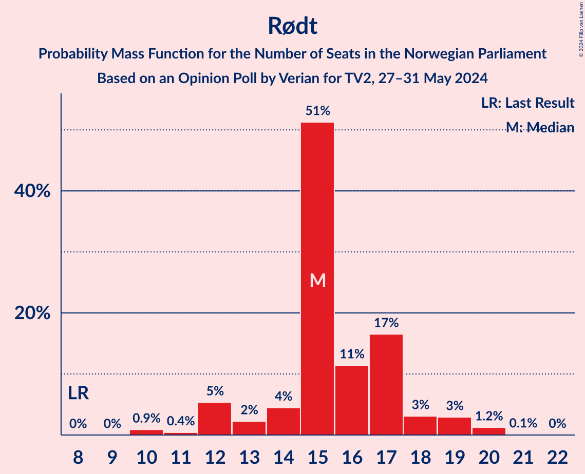

| Number of Seats | Probability | Accumulated | Special Marks |
|:---------------:|:-----------:|:-----------:|:-------------:|
| 8 | 0% | 100% | Last Result |
| 9 | 0% | 100% |  |
| 10 | 0.9% | 100% |  |
| 11 | 0.4% | 99.1% |  |
| 12 | 5% | 98.7% |  |
| 13 | 2% | 93% |  |
| 14 | 4% | 91% |  |
| 15 | 51% | 87% | Median |
| 16 | 11% | 35% |  |
| 17 | 17% | 24% |  |
| 18 | 3% | 7% |  |
| 19 | 3% | 4% |  |
| 20 | 1.2% | 1.4% |  |
| 21 | 0.1% | 0.1% |  |
| 22 | 0% | 0% |  |

### Senterpartiet

*For a full overview of the results for this party, see the [Senterpartiet](party-senterpartiet.html) page.*

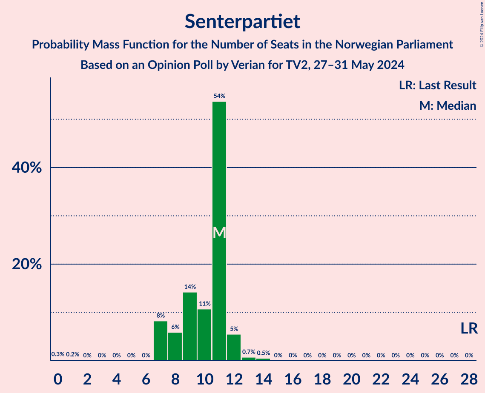

| Number of Seats | Probability | Accumulated | Special Marks |
|:---------------:|:-----------:|:-----------:|:-------------:|
| 0 | 0.3% | 100% |  |
| 1 | 0.2% | 99.7% |  |
| 2 | 0% | 99.5% |  |
| 3 | 0% | 99.5% |  |
| 4 | 0% | 99.5% |  |
| 5 | 0% | 99.5% |  |
| 6 | 0% | 99.5% |  |
| 7 | 8% | 99.5% |  |
| 8 | 6% | 91% |  |
| 9 | 14% | 85% |  |
| 10 | 11% | 71% |  |
| 11 | 54% | 60% | Median |
| 12 | 5% | 7% |  |
| 13 | 0.7% | 1.3% |  |
| 14 | 0.5% | 0.5% |  |
| 15 | 0% | 0% |  |
| 16 | 0% | 0% |  |
| 17 | 0% | 0% |  |
| 18 | 0% | 0% |  |
| 19 | 0% | 0% |  |
| 20 | 0% | 0% |  |
| 21 | 0% | 0% |  |
| 22 | 0% | 0% |  |
| 23 | 0% | 0% |  |
| 24 | 0% | 0% |  |
| 25 | 0% | 0% |  |
| 26 | 0% | 0% |  |
| 27 | 0% | 0% |  |
| 28 | 0% | 0% | Last Result |

### Venstre

*For a full overview of the results for this party, see the [Venstre](party-venstre.html) page.*

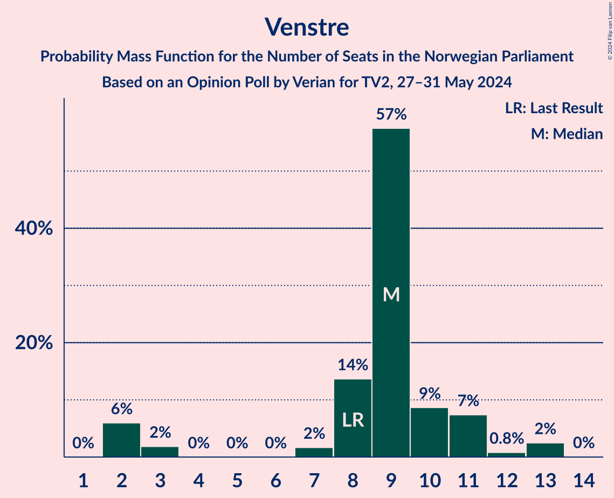

| Number of Seats | Probability | Accumulated | Special Marks |
|:---------------:|:-----------:|:-----------:|:-------------:|
| 2 | 6% | 100% |  |
| 3 | 2% | 94% |  |
| 4 | 0% | 92% |  |
| 5 | 0% | 92% |  |
| 6 | 0% | 92% |  |
| 7 | 2% | 92% |  |
| 8 | 14% | 91% | Last Result |
| 9 | 57% | 77% | Median |
| 10 | 9% | 19% |  |
| 11 | 7% | 11% |  |
| 12 | 0.8% | 3% |  |
| 13 | 2% | 3% |  |
| 14 | 0% | 0% |  |

### Kristelig Folkeparti

*For a full overview of the results for this party, see the [Kristelig Folkeparti](party-kristeligfolkeparti.html) page.*

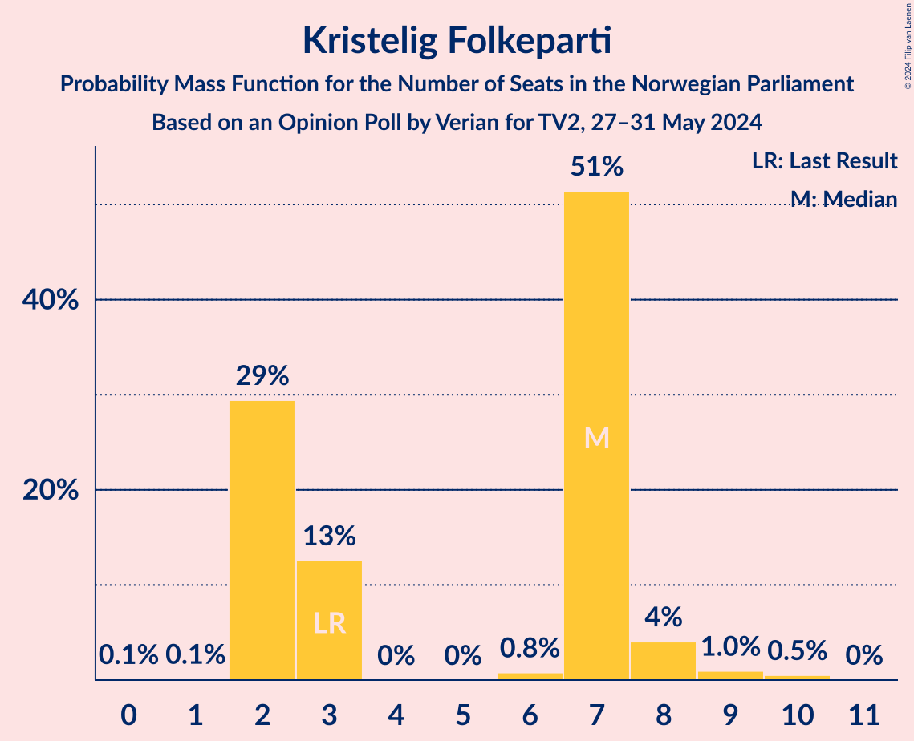

| Number of Seats | Probability | Accumulated | Special Marks |
|:---------------:|:-----------:|:-----------:|:-------------:|
| 0 | 0.1% | 100% |  |
| 1 | 0.1% | 99.9% |  |
| 2 | 29% | 99.8% |  |
| 3 | 13% | 70% | Last Result |
| 4 | 0% | 58% |  |
| 5 | 0% | 58% |  |
| 6 | 0.8% | 58% |  |
| 7 | 51% | 57% | Median |
| 8 | 4% | 6% |  |
| 9 | 1.0% | 2% |  |
| 10 | 0.5% | 0.5% |  |
| 11 | 0% | 0% |  |

### Miljøpartiet De Grønne

*For a full overview of the results for this party, see the [Miljøpartiet De Grønne](party-miljøpartietdegrønne.html) page.*

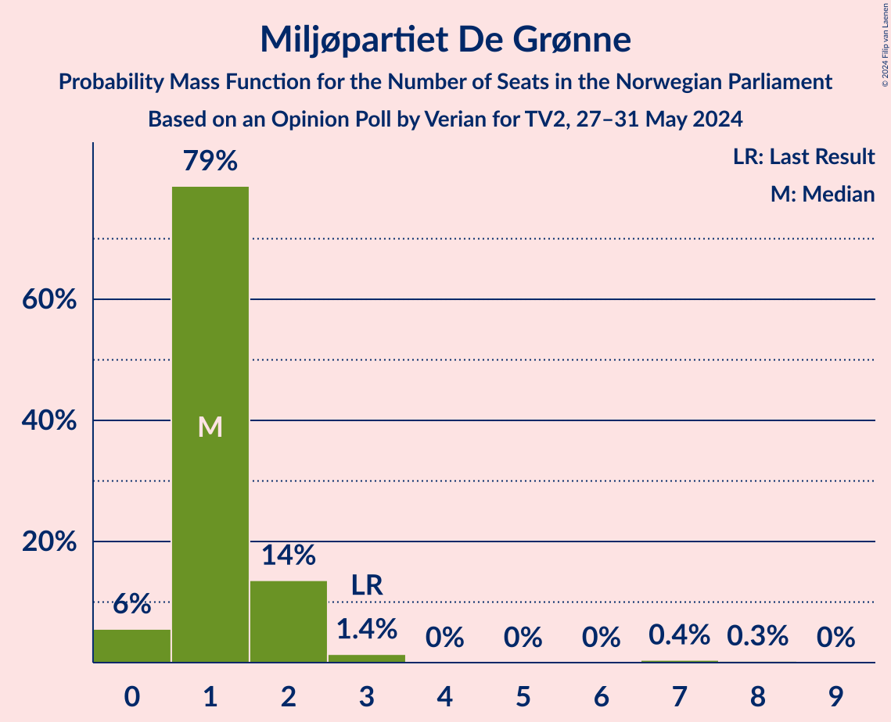

| Number of Seats | Probability | Accumulated | Special Marks |
|:---------------:|:-----------:|:-----------:|:-------------:|
| 0 | 6% | 100% |  |
| 1 | 79% | 94% | Median |
| 2 | 14% | 16% |  |
| 3 | 1.4% | 2% | Last Result |
| 4 | 0% | 0.7% |  |
| 5 | 0% | 0.7% |  |
| 6 | 0% | 0.7% |  |
| 7 | 0.4% | 0.7% |  |
| 8 | 0.3% | 0.3% |  |
| 9 | 0% | 0% |  |

### Norgesdemokratene

*For a full overview of the results for this party, see the [Norgesdemokratene](party-norgesdemokratene.html) page.*

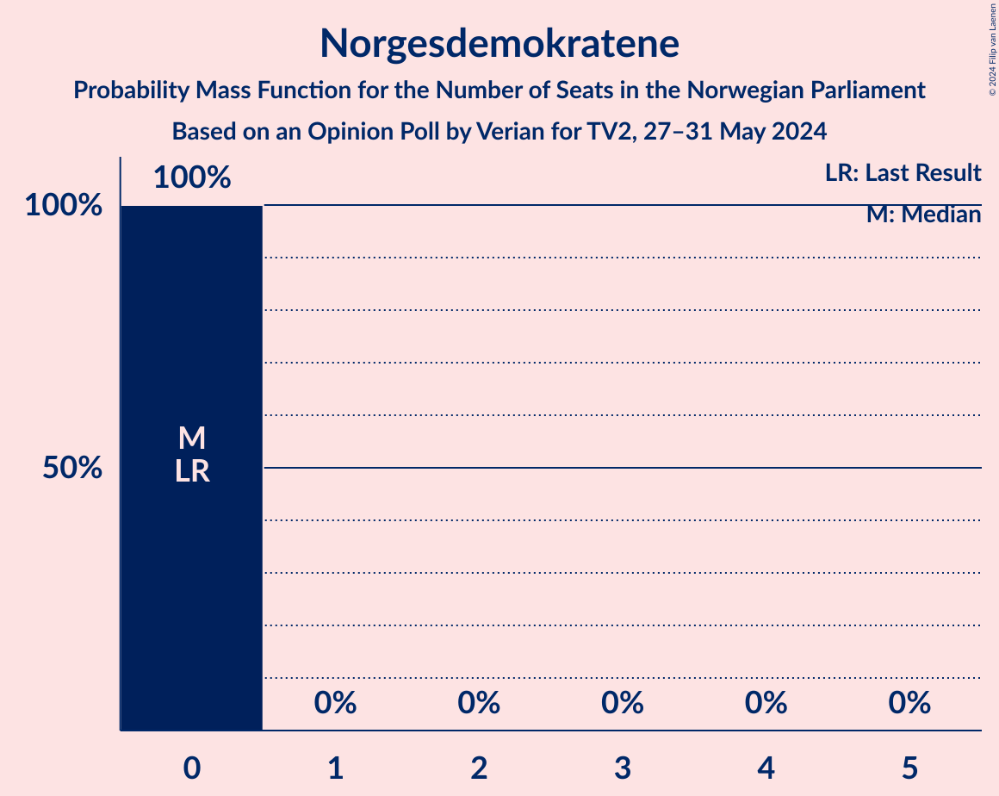

| Number of Seats | Probability | Accumulated | Special Marks |
|:---------------:|:-----------:|:-----------:|:-------------:|
| 0 | 100% | 100% | Last Result, Median |

### Industri- og Næringspartiet

*For a full overview of the results for this party, see the [Industri- og Næringspartiet](party-industri-ognæringspartiet.html) page.*

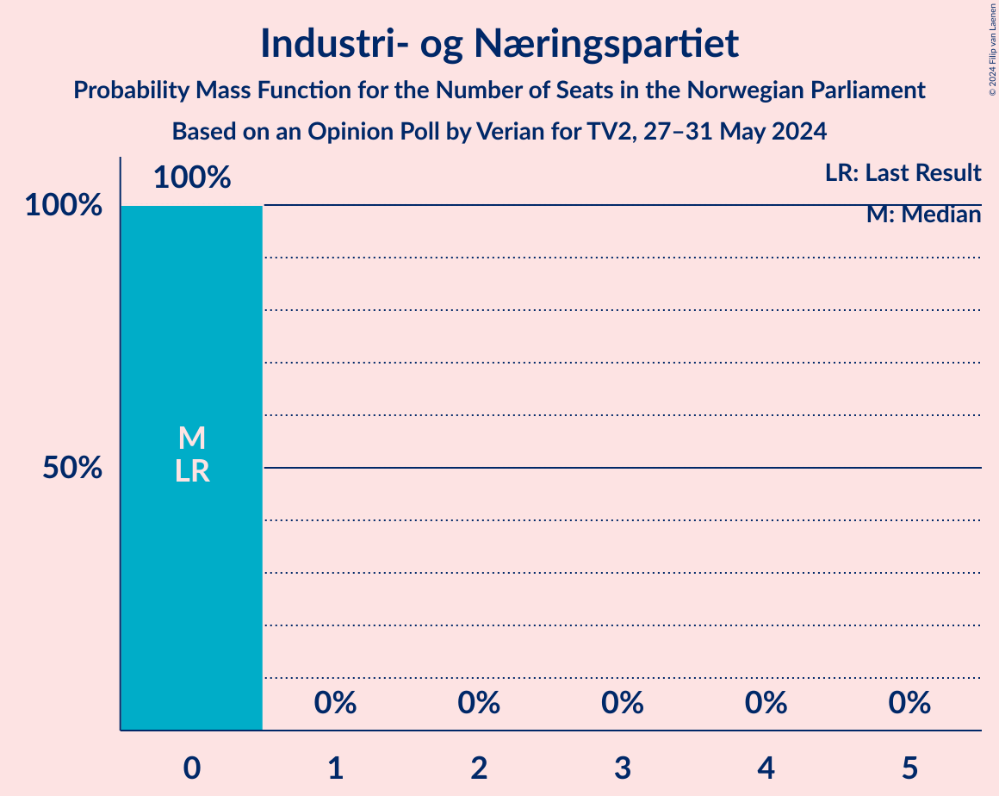

| Number of Seats | Probability | Accumulated | Special Marks |
|:---------------:|:-----------:|:-----------:|:-------------:|
| 0 | 100% | 100% | Last Result, Median |

### Kystpartiet

*For a full overview of the results for this party, see the [Kystpartiet](party-kystpartiet.html) page.*

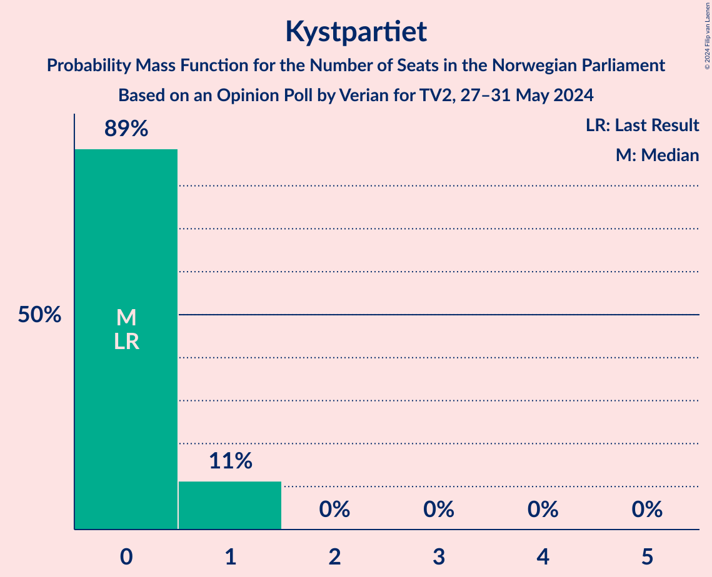

| Number of Seats | Probability | Accumulated | Special Marks |
|:---------------:|:-----------:|:-----------:|:-------------:|
| 0 | 89% | 100% | Last Result, Median |
| 1 | 11% | 11% |  |
| 2 | 0% | 0% |  |

### Konservativt

*For a full overview of the results for this party, see the [Konservativt](party-konservativt.html) page.*

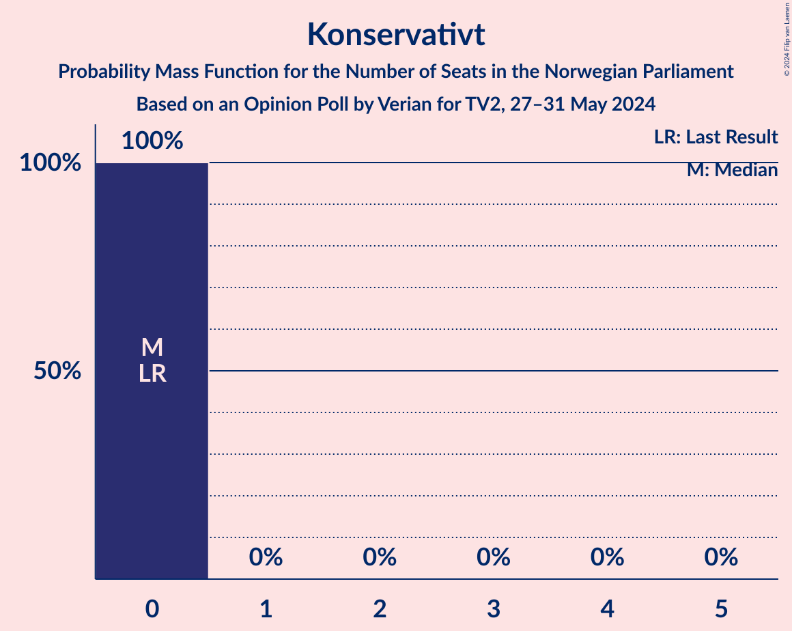

| Number of Seats | Probability | Accumulated | Special Marks |
|:---------------:|:-----------:|:-----------:|:-------------:|
| 0 | 100% | 100% | Last Result, Median |

## Coalitions

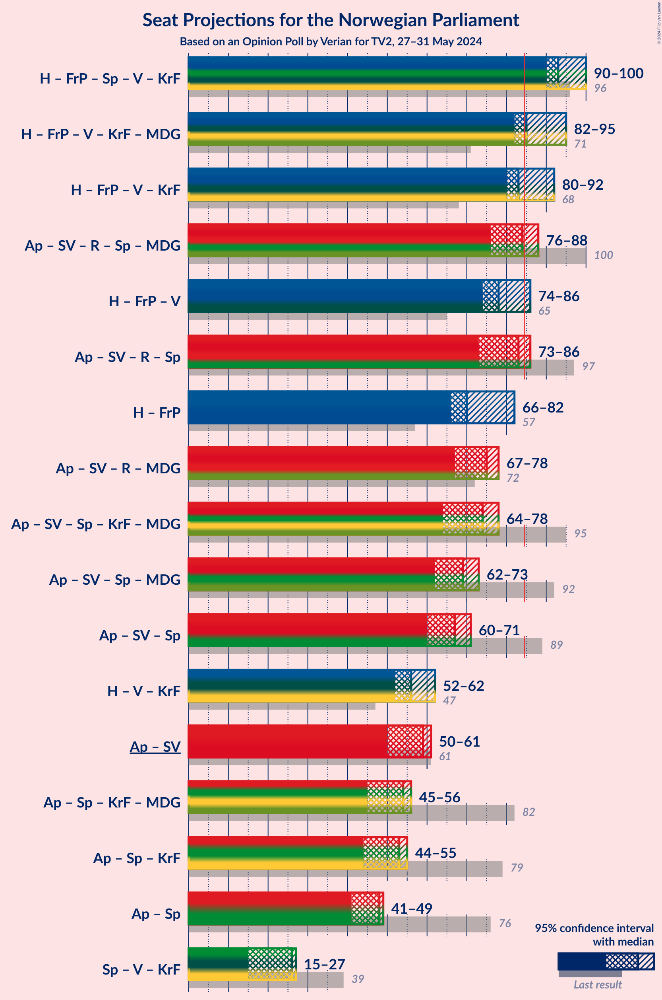

### Confidence Intervals

| Coalition | Last Result | Median | Majority? | 80% Confidence Interval | 90% Confidence Interval | 95% Confidence Interval | 99% Confidence Interval |
|:---------:|:-----------:|:------:|:---------:|:-----------------------:|:-----------------------:|:-----------------------:|:-----------------------:|
| Høyre – Fremskrittspartiet – Senterpartiet – Venstre – Kristelig Folkeparti | 96 | 93 | 99.9% | 93–98 | 91–100 | 90–100 | 88–103 |
| Høyre – Fremskrittspartiet – Venstre – Kristelig Folkeparti – Miljøpartiet De Grønne | 71 | 85 | 50% | 83–89 | 83–91 | 82–95 | 79–95 |
| Høyre – Fremskrittspartiet – Venstre – Kristelig Folkeparti | 68 | 83 | 39% | 82–88 | 82–90 | 80–92 | 78–94 |
| Arbeiderpartiet – Sosialistisk Venstreparti – Rødt – Senterpartiet – Miljøpartiet De Grønne | 100 | 84 | 50% | 80–86 | 78–86 | 76–88 | 74–90 |
| Høyre – Fremskrittspartiet – Venstre | 65 | 78 | 16% | 75–85 | 75–85 | 74–86 | 73–90 |
| Arbeiderpartiet – Sosialistisk Venstreparti – Rødt – Senterpartiet | 97 | 83 | 48% | 79–85 | 76–85 | 73–86 | 72–89 |
| Høyre – Fremskrittspartiet | 57 | 70 | 0% | 66–76 | 66–77 | 66–82 | 66–83 |
| Arbeiderpartiet – Sosialistisk Venstreparti – Rødt – Miljøpartiet De Grønne | 72 | 75 | 0% | 70–75 | 68–77 | 67–78 | 65–80 |
| Arbeiderpartiet – Sosialistisk Venstreparti – Senterpartiet – Kristelig Folkeparti – Miljøpartiet De Grønne | 95 | 74 | 0% | 68–78 | 67–78 | 64–78 | 63–79 |
| Arbeiderpartiet – Sosialistisk Venstreparti – Senterpartiet – Miljøpartiet De Grønne | 92 | 69 | 0% | 63–71 | 62–71 | 62–73 | 58–75 |
| Arbeiderpartiet – Sosialistisk Venstreparti – Senterpartiet | 89 | 67 | 0% | 62–70 | 61–70 | 60–71 | 57–74 |
| Høyre – Venstre – Kristelig Folkeparti | 47 | 56 | 0% | 54–61 | 52–61 | 52–62 | 48–65 |
| Arbeiderpartiet – Sosialistisk Venstreparti | 61 | 59 | 0% | 52–59 | 51–59 | 50–61 | 48–63 |
| Arbeiderpartiet – Senterpartiet – Kristelig Folkeparti – Miljøpartiet De Grønne | 82 | 54 | 0% | 46–56 | 45–56 | 45–56 | 44–59 |
| Arbeiderpartiet – Senterpartiet – Kristelig Folkeparti | 79 | 53 | 0% | 46–55 | 44–55 | 44–55 | 42–57 |
| Arbeiderpartiet – Senterpartiet | 76 | 48 | 0% | 43–48 | 42–49 | 41–49 | 38–51 |
| Senterpartiet – Venstre – Kristelig Folkeparti | 39 | 26 | 0% | 19–27 | 15–27 | 15–27 | 13–30 |

### Høyre – Fremskrittspartiet – Senterpartiet – Venstre – Kristelig Folkeparti

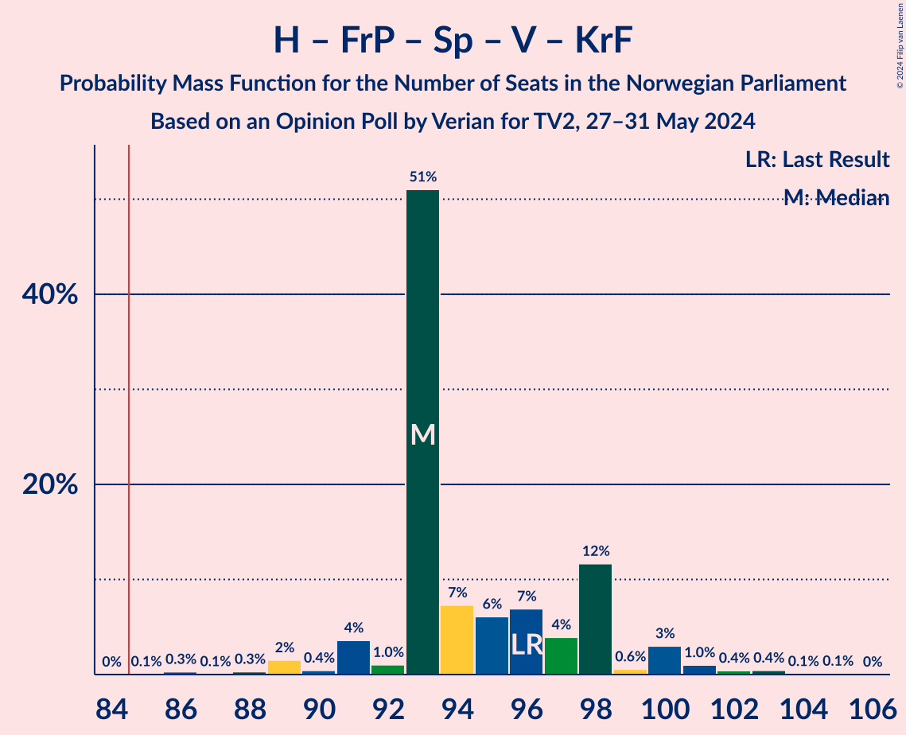

| Number of Seats | Probability | Accumulated | Special Marks |
|:---------------:|:-----------:|:-----------:|:-------------:|
| 84 | 0% | 100% |  |
| 85 | 0.1% | 99.9% | Majority |
| 86 | 0.3% | 99.9% |  |
| 87 | 0.1% | 99.6% |  |
| 88 | 0.3% | 99.5% |  |
| 89 | 2% | 99.2% |  |
| 90 | 0.4% | 98% |  |
| 91 | 4% | 97% |  |
| 92 | 1.0% | 94% |  |
| 93 | 51% | 93% |  |
| 94 | 7% | 42% | Median |
| 95 | 6% | 34% |  |
| 96 | 7% | 28% | Last Result |
| 97 | 4% | 21% |  |
| 98 | 12% | 17% |  |
| 99 | 0.6% | 6% |  |
| 100 | 3% | 5% |  |
| 101 | 1.0% | 2% |  |
| 102 | 0.4% | 1.1% |  |
| 103 | 0.4% | 0.7% |  |
| 104 | 0.1% | 0.2% |  |
| 105 | 0.1% | 0.1% |  |
| 106 | 0% | 0% |  |

### Høyre – Fremskrittspartiet – Venstre – Kristelig Folkeparti – Miljøpartiet De Grønne

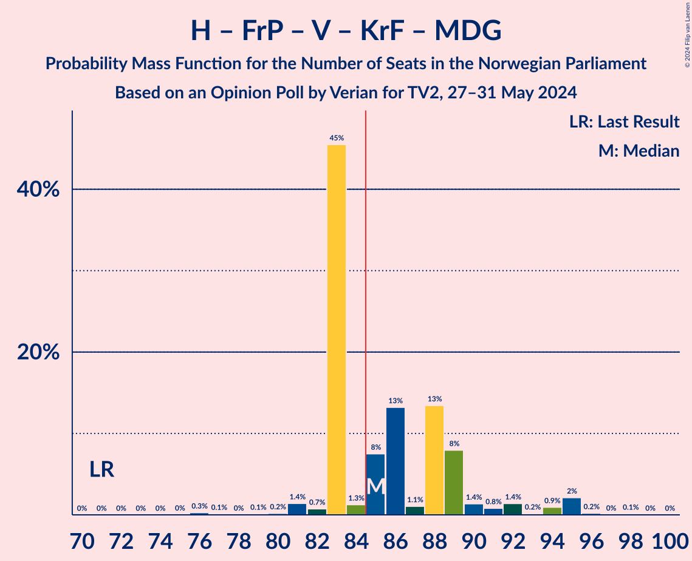

| Number of Seats | Probability | Accumulated | Special Marks |
|:---------------:|:-----------:|:-----------:|:-------------:|
| 71 | 0% | 100% | Last Result |
| 72 | 0% | 100% |  |
| 73 | 0% | 100% |  |
| 74 | 0% | 100% |  |
| 75 | 0% | 100% |  |
| 76 | 0.3% | 100% |  |
| 77 | 0.1% | 99.7% |  |
| 78 | 0% | 99.6% |  |
| 79 | 0.1% | 99.6% |  |
| 80 | 0.2% | 99.4% |  |
| 81 | 1.4% | 99.2% |  |
| 82 | 0.7% | 98% |  |
| 83 | 45% | 97% |  |
| 84 | 1.3% | 52% | Median |
| 85 | 8% | 50% | Majority |
| 86 | 13% | 43% |  |
| 87 | 1.1% | 30% |  |
| 88 | 13% | 29% |  |
| 89 | 8% | 15% |  |
| 90 | 1.4% | 7% |  |
| 91 | 0.8% | 6% |  |
| 92 | 1.4% | 5% |  |
| 93 | 0.2% | 4% |  |
| 94 | 0.9% | 3% |  |
| 95 | 2% | 3% |  |
| 96 | 0.2% | 0.4% |  |
| 97 | 0% | 0.2% |  |
| 98 | 0.1% | 0.2% |  |
| 99 | 0% | 0% |  |

### Høyre – Fremskrittspartiet – Venstre – Kristelig Folkeparti

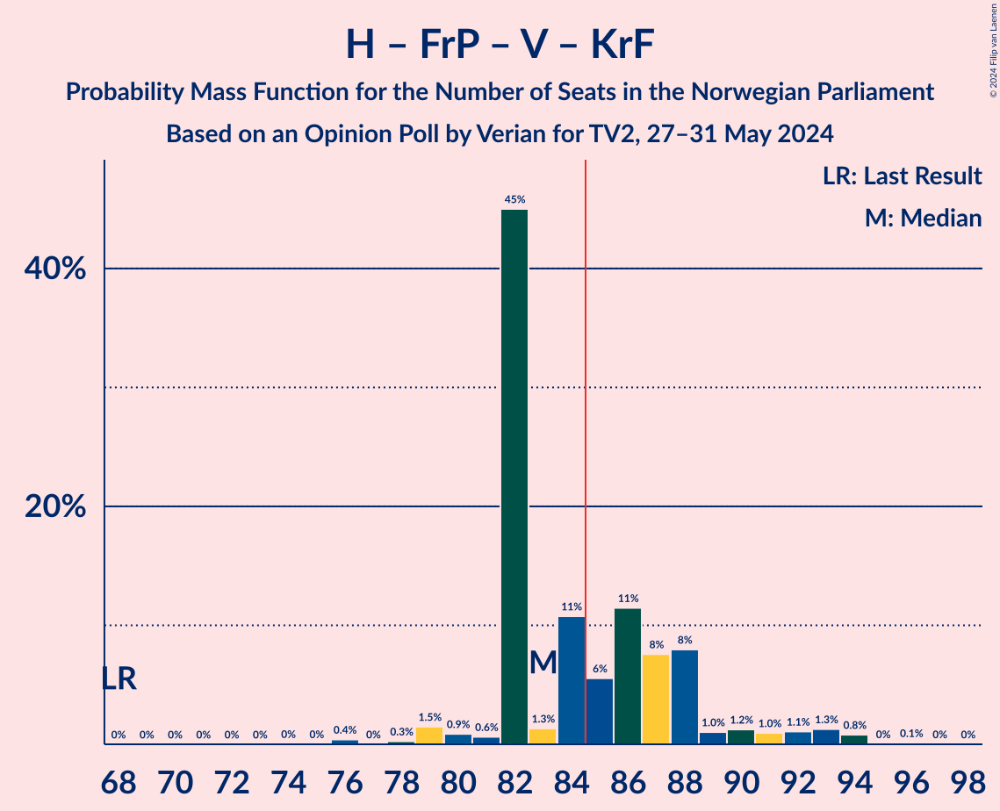

| Number of Seats | Probability | Accumulated | Special Marks |
|:---------------:|:-----------:|:-----------:|:-------------:|
| 68 | 0% | 100% | Last Result |
| 69 | 0% | 100% |  |
| 70 | 0% | 100% |  |
| 71 | 0% | 100% |  |
| 72 | 0% | 100% |  |
| 73 | 0% | 100% |  |
| 74 | 0% | 100% |  |
| 75 | 0% | 100% |  |
| 76 | 0.4% | 99.9% |  |
| 77 | 0% | 99.5% |  |
| 78 | 0.3% | 99.5% |  |
| 79 | 1.5% | 99.3% |  |
| 80 | 0.9% | 98% |  |
| 81 | 0.6% | 97% |  |
| 82 | 45% | 96% |  |
| 83 | 1.3% | 51% | Median |
| 84 | 11% | 50% |  |
| 85 | 6% | 39% | Majority |
| 86 | 11% | 34% |  |
| 87 | 8% | 22% |  |
| 88 | 8% | 15% |  |
| 89 | 1.0% | 7% |  |
| 90 | 1.2% | 6% |  |
| 91 | 1.0% | 4% |  |
| 92 | 1.1% | 3% |  |
| 93 | 1.3% | 2% |  |
| 94 | 0.8% | 1.0% |  |
| 95 | 0% | 0.2% |  |
| 96 | 0.1% | 0.2% |  |
| 97 | 0% | 0% |  |

### Arbeiderpartiet – Sosialistisk Venstreparti – Rødt – Senterpartiet – Miljøpartiet De Grønne

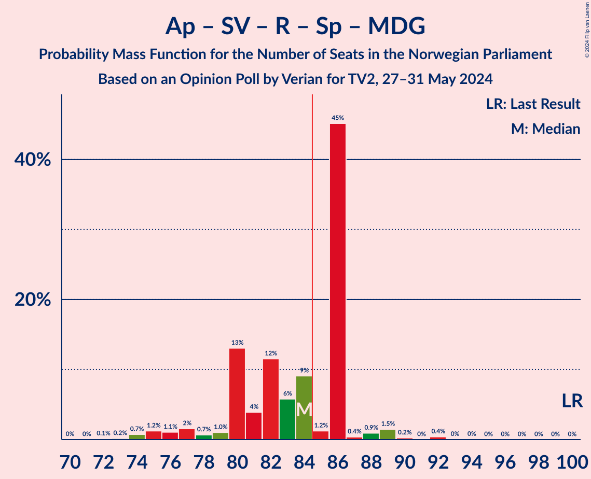

| Number of Seats | Probability | Accumulated | Special Marks |
|:---------------:|:-----------:|:-----------:|:-------------:|
| 72 | 0.1% | 100% |  |
| 73 | 0.2% | 99.8% |  |
| 74 | 0.7% | 99.7% |  |
| 75 | 1.2% | 98.9% |  |
| 76 | 1.1% | 98% |  |
| 77 | 2% | 97% |  |
| 78 | 0.7% | 95% |  |
| 79 | 1.0% | 94% |  |
| 80 | 13% | 93% |  |
| 81 | 4% | 80% |  |
| 82 | 12% | 76% |  |
| 83 | 6% | 65% |  |
| 84 | 9% | 59% |  |
| 85 | 1.2% | 50% | Majority |
| 86 | 45% | 49% | Median |
| 87 | 0.4% | 4% |  |
| 88 | 0.9% | 3% |  |
| 89 | 1.5% | 2% |  |
| 90 | 0.2% | 0.7% |  |
| 91 | 0% | 0.5% |  |
| 92 | 0.4% | 0.5% |  |
| 93 | 0% | 0.1% |  |
| 94 | 0% | 0% |  |
| 95 | 0% | 0% |  |
| 96 | 0% | 0% |  |
| 97 | 0% | 0% |  |
| 98 | 0% | 0% |  |
| 99 | 0% | 0% |  |
| 100 | 0% | 0% | Last Result |

### Høyre – Fremskrittspartiet – Venstre

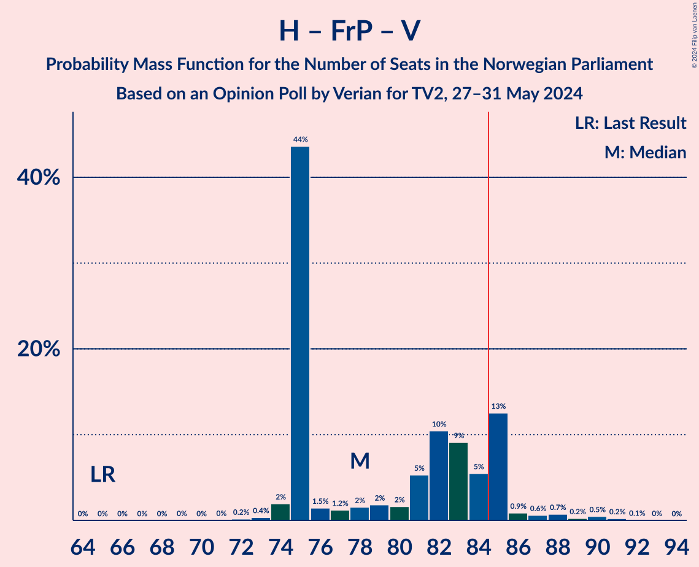

| Number of Seats | Probability | Accumulated | Special Marks |
|:---------------:|:-----------:|:-----------:|:-------------:|
| 65 | 0% | 100% | Last Result |
| 66 | 0% | 100% |  |
| 67 | 0% | 100% |  |
| 68 | 0% | 100% |  |
| 69 | 0% | 100% |  |
| 70 | 0% | 100% |  |
| 71 | 0% | 100% |  |
| 72 | 0.2% | 99.9% |  |
| 73 | 0.4% | 99.8% |  |
| 74 | 2% | 99.4% |  |
| 75 | 44% | 97% |  |
| 76 | 1.5% | 54% | Median |
| 77 | 1.2% | 52% |  |
| 78 | 2% | 51% |  |
| 79 | 2% | 50% |  |
| 80 | 2% | 48% |  |
| 81 | 5% | 46% |  |
| 82 | 10% | 41% |  |
| 83 | 9% | 30% |  |
| 84 | 5% | 21% |  |
| 85 | 13% | 16% | Majority |
| 86 | 0.9% | 3% |  |
| 87 | 0.6% | 2% |  |
| 88 | 0.7% | 2% |  |
| 89 | 0.2% | 1.0% |  |
| 90 | 0.5% | 0.8% |  |
| 91 | 0.2% | 0.3% |  |
| 92 | 0.1% | 0.1% |  |
| 93 | 0% | 0% |  |

### Arbeiderpartiet – Sosialistisk Venstreparti – Rødt – Senterpartiet

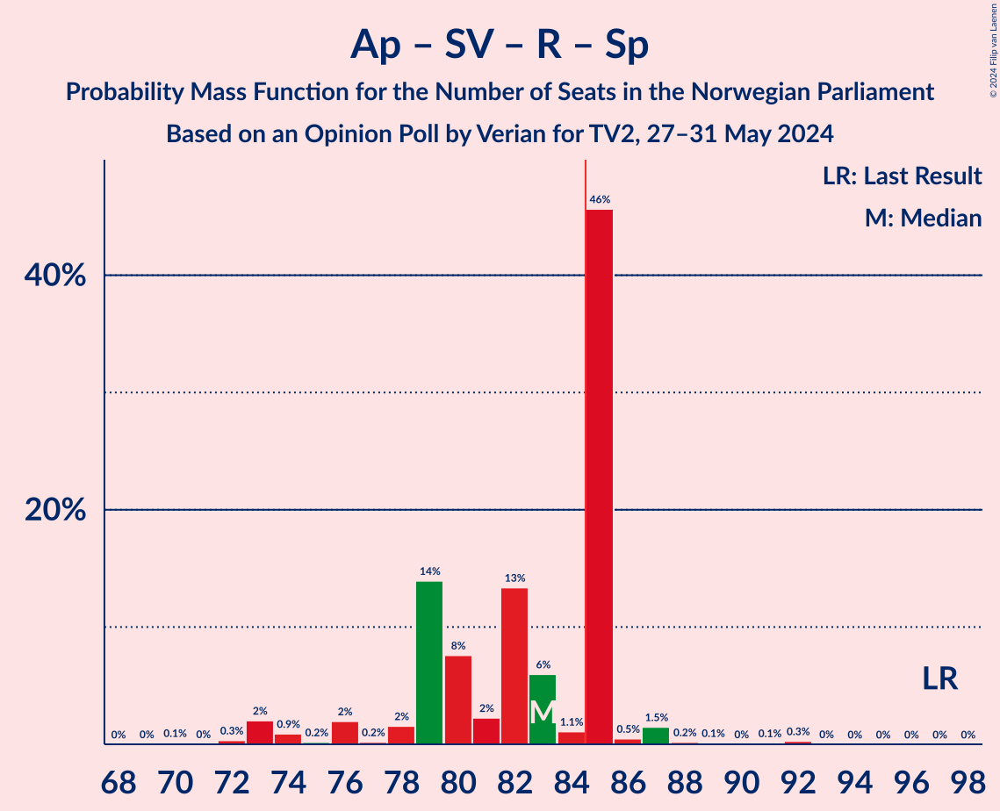

| Number of Seats | Probability | Accumulated | Special Marks |
|:---------------:|:-----------:|:-----------:|:-------------:|
| 70 | 0.1% | 100% |  |
| 71 | 0% | 99.8% |  |
| 72 | 0.3% | 99.8% |  |
| 73 | 2% | 99.5% |  |
| 74 | 0.9% | 97% |  |
| 75 | 0.2% | 97% |  |
| 76 | 2% | 96% |  |
| 77 | 0.2% | 94% |  |
| 78 | 2% | 94% |  |
| 79 | 14% | 93% |  |
| 80 | 8% | 79% |  |
| 81 | 2% | 71% |  |
| 82 | 13% | 69% |  |
| 83 | 6% | 55% |  |
| 84 | 1.1% | 49% |  |
| 85 | 46% | 48% | Median, Majority |
| 86 | 0.5% | 3% |  |
| 87 | 1.5% | 2% |  |
| 88 | 0.2% | 0.8% |  |
| 89 | 0.1% | 0.6% |  |
| 90 | 0% | 0.4% |  |
| 91 | 0.1% | 0.4% |  |
| 92 | 0.3% | 0.3% |  |
| 93 | 0% | 0% |  |
| 94 | 0% | 0% |  |
| 95 | 0% | 0% |  |
| 96 | 0% | 0% |  |
| 97 | 0% | 0% | Last Result |

### Høyre – Fremskrittspartiet

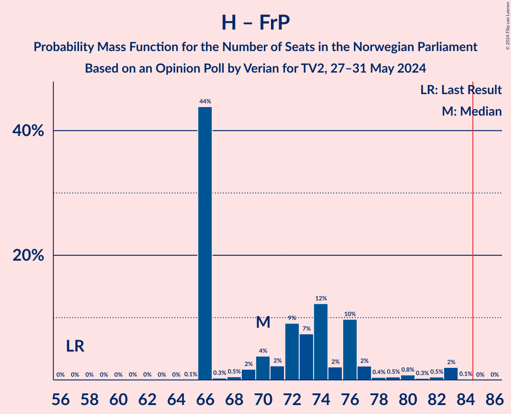

| Number of Seats | Probability | Accumulated | Special Marks |
|:---------------:|:-----------:|:-----------:|:-------------:|
| 57 | 0% | 100% | Last Result |
| 58 | 0% | 100% |  |
| 59 | 0% | 100% |  |
| 60 | 0% | 100% |  |
| 61 | 0% | 100% |  |
| 62 | 0% | 100% |  |
| 63 | 0% | 100% |  |
| 64 | 0% | 99.9% |  |
| 65 | 0.1% | 99.9% |  |
| 66 | 44% | 99.9% |  |
| 67 | 0.3% | 56% | Median |
| 68 | 0.5% | 56% |  |
| 69 | 2% | 55% |  |
| 70 | 4% | 53% |  |
| 71 | 2% | 50% |  |
| 72 | 9% | 47% |  |
| 73 | 7% | 38% |  |
| 74 | 12% | 31% |  |
| 75 | 2% | 19% |  |
| 76 | 10% | 17% |  |
| 77 | 2% | 7% |  |
| 78 | 0.4% | 5% |  |
| 79 | 0.5% | 4% |  |
| 80 | 0.8% | 4% |  |
| 81 | 0.3% | 3% |  |
| 82 | 0.5% | 3% |  |
| 83 | 2% | 2% |  |
| 84 | 0.1% | 0.2% |  |
| 85 | 0% | 0% | Majority |

### Arbeiderpartiet – Sosialistisk Venstreparti – Rødt – Miljøpartiet De Grønne

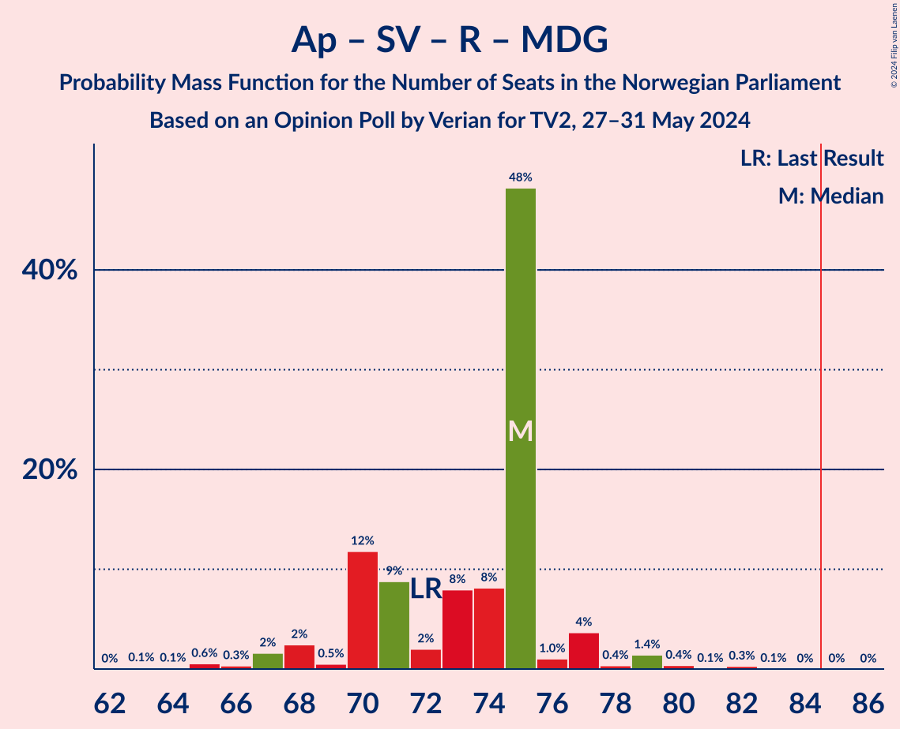

| Number of Seats | Probability | Accumulated | Special Marks |
|:---------------:|:-----------:|:-----------:|:-------------:|
| 63 | 0.1% | 100% |  |
| 64 | 0.1% | 99.9% |  |
| 65 | 0.6% | 99.8% |  |
| 66 | 0.3% | 99.2% |  |
| 67 | 2% | 98.9% |  |
| 68 | 2% | 97% |  |
| 69 | 0.5% | 95% |  |
| 70 | 12% | 94% |  |
| 71 | 9% | 82% |  |
| 72 | 2% | 74% | Last Result |
| 73 | 8% | 72% |  |
| 74 | 8% | 64% |  |
| 75 | 48% | 56% | Median |
| 76 | 1.0% | 7% |  |
| 77 | 4% | 6% |  |
| 78 | 0.4% | 3% |  |
| 79 | 1.4% | 2% |  |
| 80 | 0.4% | 0.9% |  |
| 81 | 0.1% | 0.5% |  |
| 82 | 0.3% | 0.4% |  |
| 83 | 0.1% | 0.1% |  |
| 84 | 0% | 0.1% |  |
| 85 | 0% | 0% | Majority |

### Arbeiderpartiet – Sosialistisk Venstreparti – Senterpartiet – Kristelig Folkeparti – Miljøpartiet De Grønne

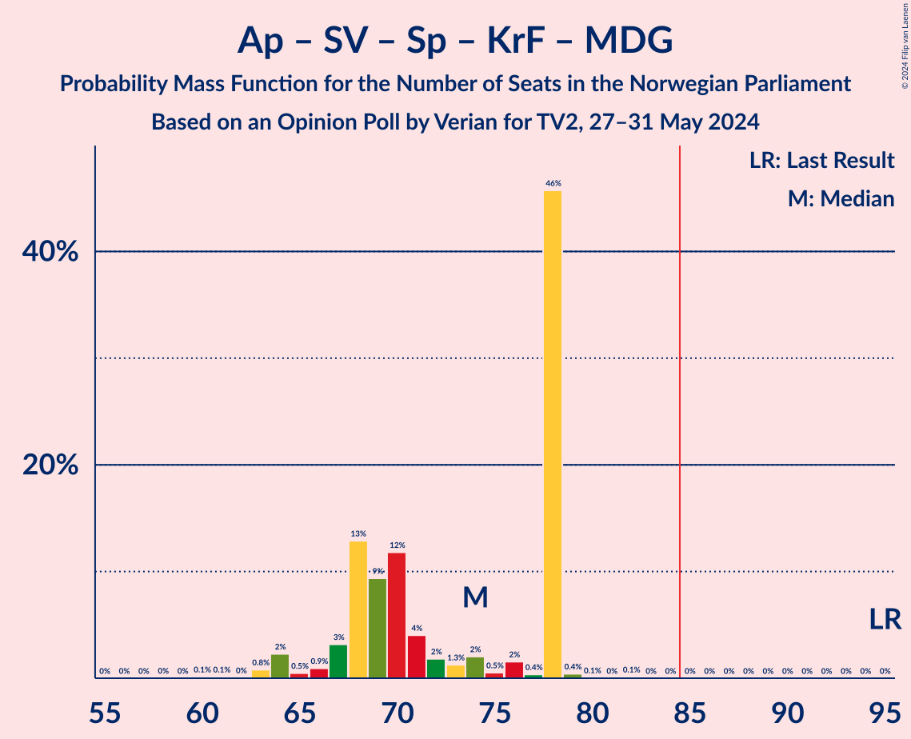

| Number of Seats | Probability | Accumulated | Special Marks |
|:---------------:|:-----------:|:-----------:|:-------------:|
| 60 | 0.1% | 100% |  |
| 61 | 0.1% | 99.8% |  |
| 62 | 0% | 99.7% |  |
| 63 | 0.8% | 99.6% |  |
| 64 | 2% | 98.8% |  |
| 65 | 0.5% | 97% |  |
| 66 | 0.9% | 96% |  |
| 67 | 3% | 95% |  |
| 68 | 13% | 92% |  |
| 69 | 9% | 79% |  |
| 70 | 12% | 70% |  |
| 71 | 4% | 58% |  |
| 72 | 2% | 54% |  |
| 73 | 1.3% | 52% |  |
| 74 | 2% | 51% |  |
| 75 | 0.5% | 49% |  |
| 76 | 2% | 48% |  |
| 77 | 0.4% | 47% |  |
| 78 | 46% | 46% | Median |
| 79 | 0.4% | 0.6% |  |
| 80 | 0.1% | 0.2% |  |
| 81 | 0% | 0.1% |  |
| 82 | 0.1% | 0.1% |  |
| 83 | 0% | 0% |  |
| 84 | 0% | 0% |  |
| 85 | 0% | 0% | Majority |
| 86 | 0% | 0% |  |
| 87 | 0% | 0% |  |
| 88 | 0% | 0% |  |
| 89 | 0% | 0% |  |
| 90 | 0% | 0% |  |
| 91 | 0% | 0% |  |
| 92 | 0% | 0% |  |
| 93 | 0% | 0% |  |
| 94 | 0% | 0% |  |
| 95 | 0% | 0% | Last Result |

### Arbeiderpartiet – Sosialistisk Venstreparti – Senterpartiet – Miljøpartiet De Grønne

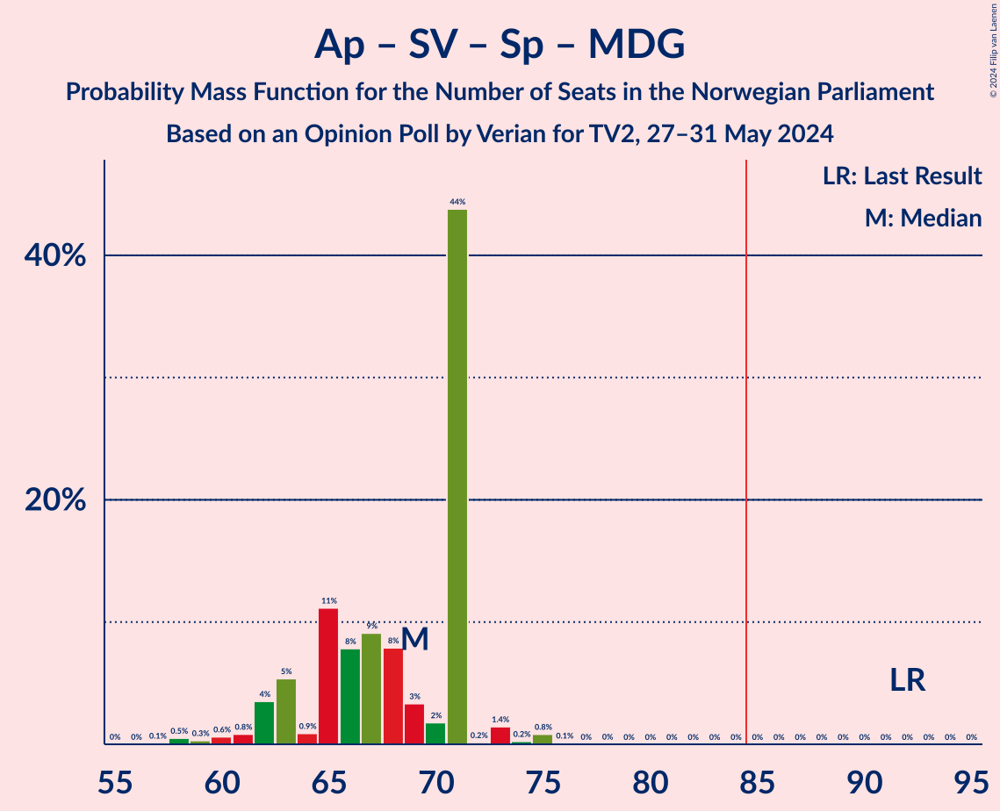

| Number of Seats | Probability | Accumulated | Special Marks |
|:---------------:|:-----------:|:-----------:|:-------------:|
| 56 | 0% | 100% |  |
| 57 | 0.1% | 99.9% |  |
| 58 | 0.5% | 99.8% |  |
| 59 | 0.3% | 99.3% |  |
| 60 | 0.6% | 99.0% |  |
| 61 | 0.8% | 98% |  |
| 62 | 4% | 98% |  |
| 63 | 5% | 94% |  |
| 64 | 0.9% | 89% |  |
| 65 | 11% | 88% |  |
| 66 | 8% | 77% |  |
| 67 | 9% | 69% |  |
| 68 | 8% | 60% |  |
| 69 | 3% | 52% |  |
| 70 | 2% | 48% |  |
| 71 | 44% | 47% | Median |
| 72 | 0.2% | 3% |  |
| 73 | 1.4% | 3% |  |
| 74 | 0.2% | 1.2% |  |
| 75 | 0.8% | 1.0% |  |
| 76 | 0.1% | 0.2% |  |
| 77 | 0% | 0% |  |
| 78 | 0% | 0% |  |
| 79 | 0% | 0% |  |
| 80 | 0% | 0% |  |
| 81 | 0% | 0% |  |
| 82 | 0% | 0% |  |
| 83 | 0% | 0% |  |
| 84 | 0% | 0% |  |
| 85 | 0% | 0% | Majority |
| 86 | 0% | 0% |  |
| 87 | 0% | 0% |  |
| 88 | 0% | 0% |  |
| 89 | 0% | 0% |  |
| 90 | 0% | 0% |  |
| 91 | 0% | 0% |  |
| 92 | 0% | 0% | Last Result |

### Arbeiderpartiet – Sosialistisk Venstreparti – Senterpartiet

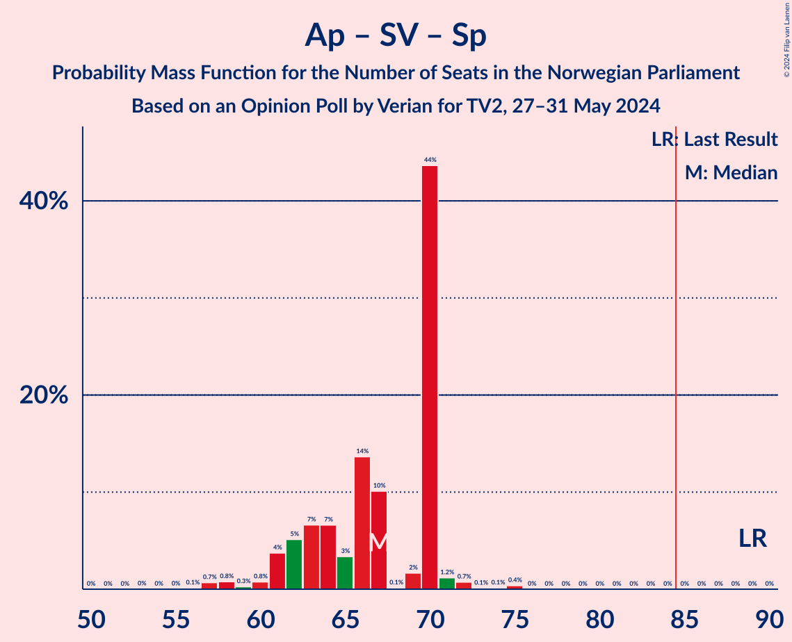

| Number of Seats | Probability | Accumulated | Special Marks |
|:---------------:|:-----------:|:-----------:|:-------------:|
| 54 | 0% | 100% |  |
| 55 | 0% | 99.9% |  |
| 56 | 0.1% | 99.9% |  |
| 57 | 0.7% | 99.8% |  |
| 58 | 0.8% | 99.1% |  |
| 59 | 0.3% | 98% |  |
| 60 | 0.8% | 98% |  |
| 61 | 4% | 97% |  |
| 62 | 5% | 94% |  |
| 63 | 7% | 88% |  |
| 64 | 7% | 82% |  |
| 65 | 3% | 75% |  |
| 66 | 14% | 72% |  |
| 67 | 10% | 58% |  |
| 68 | 0.1% | 48% |  |
| 69 | 2% | 48% |  |
| 70 | 44% | 46% | Median |
| 71 | 1.2% | 3% |  |
| 72 | 0.7% | 1.4% |  |
| 73 | 0.1% | 0.6% |  |
| 74 | 0.1% | 0.5% |  |
| 75 | 0.4% | 0.4% |  |
| 76 | 0% | 0% |  |
| 77 | 0% | 0% |  |
| 78 | 0% | 0% |  |
| 79 | 0% | 0% |  |
| 80 | 0% | 0% |  |
| 81 | 0% | 0% |  |
| 82 | 0% | 0% |  |
| 83 | 0% | 0% |  |
| 84 | 0% | 0% |  |
| 85 | 0% | 0% | Majority |
| 86 | 0% | 0% |  |
| 87 | 0% | 0% |  |
| 88 | 0% | 0% |  |
| 89 | 0% | 0% | Last Result |

### Høyre – Venstre – Kristelig Folkeparti

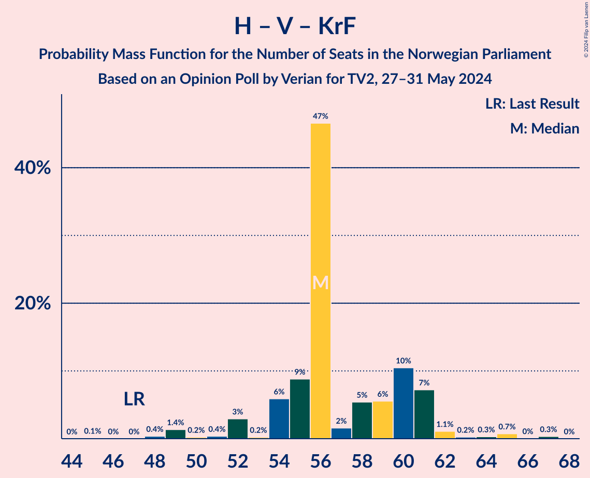

| Number of Seats | Probability | Accumulated | Special Marks |
|:---------------:|:-----------:|:-----------:|:-------------:|
| 45 | 0.1% | 100% |  |
| 46 | 0% | 99.9% |  |
| 47 | 0% | 99.9% | Last Result |
| 48 | 0.4% | 99.9% |  |
| 49 | 1.4% | 99.5% |  |
| 50 | 0.2% | 98% |  |
| 51 | 0.4% | 98% |  |
| 52 | 3% | 98% |  |
| 53 | 0.2% | 95% |  |
| 54 | 6% | 94% |  |
| 55 | 9% | 88% |  |
| 56 | 47% | 80% |  |
| 57 | 2% | 33% | Median |
| 58 | 5% | 31% |  |
| 59 | 6% | 26% |  |
| 60 | 10% | 20% |  |
| 61 | 7% | 10% |  |
| 62 | 1.1% | 3% |  |
| 63 | 0.2% | 2% |  |
| 64 | 0.3% | 1.4% |  |
| 65 | 0.7% | 1.1% |  |
| 66 | 0% | 0.4% |  |
| 67 | 0.3% | 0.4% |  |
| 68 | 0% | 0% |  |

### Arbeiderpartiet – Sosialistisk Venstreparti

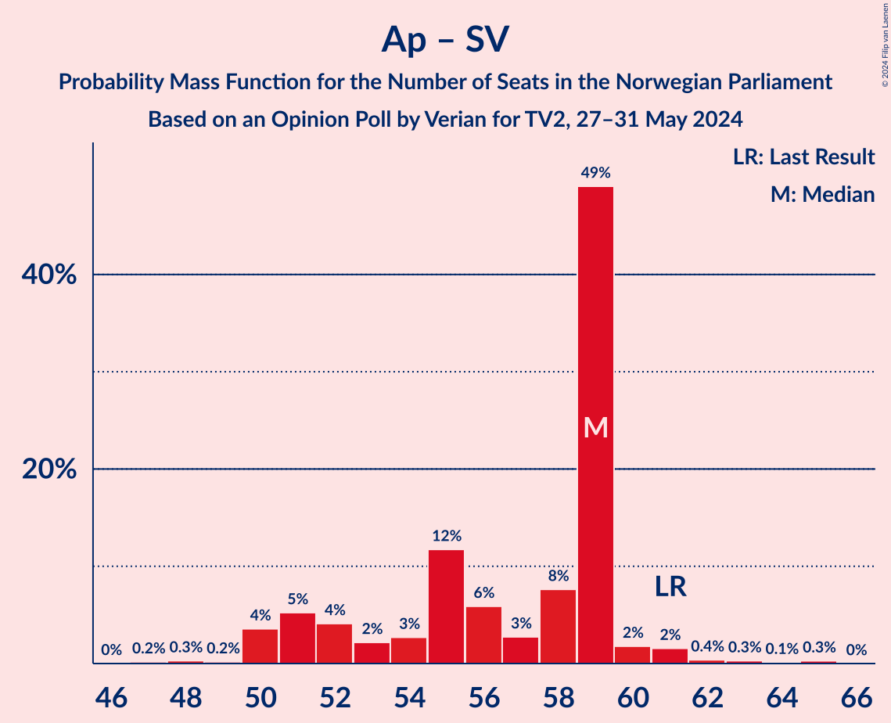

| Number of Seats | Probability | Accumulated | Special Marks |
|:---------------:|:-----------:|:-----------:|:-------------:|
| 47 | 0.2% | 100% |  |
| 48 | 0.3% | 99.8% |  |
| 49 | 0.2% | 99.5% |  |
| 50 | 4% | 99.3% |  |
| 51 | 5% | 96% |  |
| 52 | 4% | 91% |  |
| 53 | 2% | 86% |  |
| 54 | 3% | 84% |  |
| 55 | 12% | 82% |  |
| 56 | 6% | 70% |  |
| 57 | 3% | 64% |  |
| 58 | 8% | 61% |  |
| 59 | 49% | 54% | Median |
| 60 | 2% | 4% |  |
| 61 | 2% | 3% | Last Result |
| 62 | 0.4% | 1.1% |  |
| 63 | 0.3% | 0.7% |  |
| 64 | 0.1% | 0.4% |  |
| 65 | 0.3% | 0.3% |  |
| 66 | 0% | 0% |  |

### Arbeiderpartiet – Senterpartiet – Kristelig Folkeparti – Miljøpartiet De Grønne

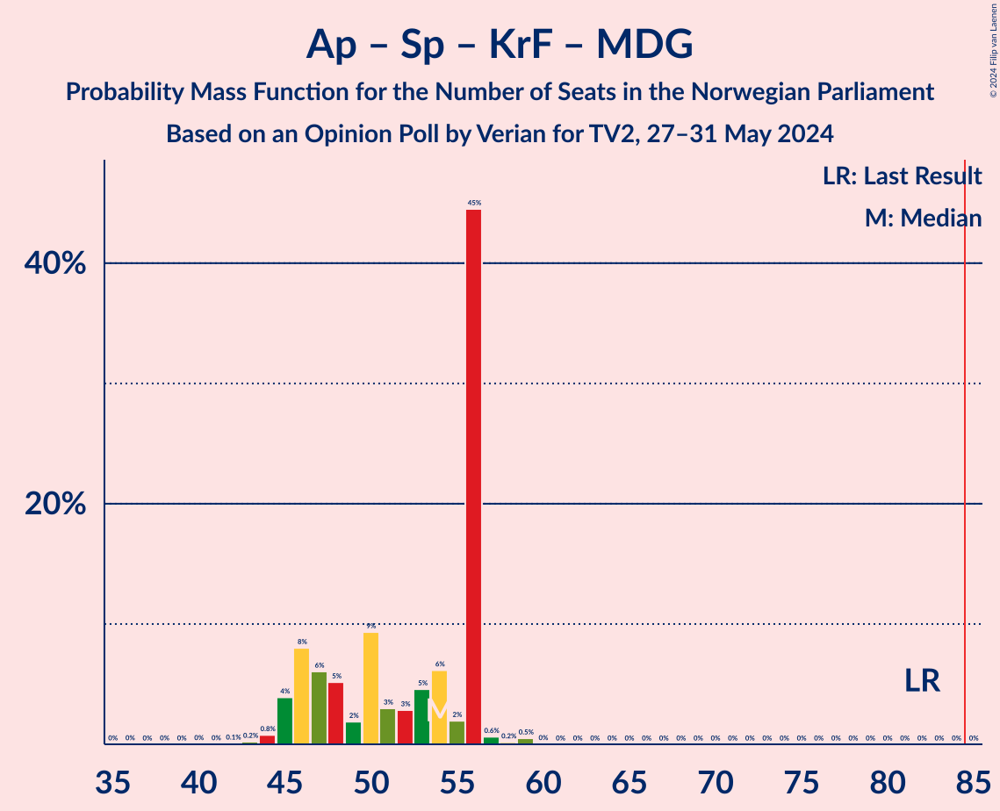

| Number of Seats | Probability | Accumulated | Special Marks |
|:---------------:|:-----------:|:-----------:|:-------------:|
| 38 | 0% | 100% |  |
| 39 | 0% | 99.9% |  |
| 40 | 0% | 99.9% |  |
| 41 | 0% | 99.9% |  |
| 42 | 0.1% | 99.9% |  |
| 43 | 0.2% | 99.8% |  |
| 44 | 0.8% | 99.6% |  |
| 45 | 4% | 98.8% |  |
| 46 | 8% | 95% |  |
| 47 | 6% | 87% |  |
| 48 | 5% | 81% |  |
| 49 | 2% | 76% |  |
| 50 | 9% | 74% |  |
| 51 | 3% | 64% |  |
| 52 | 3% | 61% |  |
| 53 | 5% | 59% |  |
| 54 | 6% | 54% |  |
| 55 | 2% | 48% |  |
| 56 | 45% | 46% | Median |
| 57 | 0.6% | 1.4% |  |
| 58 | 0.2% | 0.7% |  |
| 59 | 0.5% | 0.6% |  |
| 60 | 0% | 0.1% |  |
| 61 | 0% | 0% |  |
| 62 | 0% | 0% |  |
| 63 | 0% | 0% |  |
| 64 | 0% | 0% |  |
| 65 | 0% | 0% |  |
| 66 | 0% | 0% |  |
| 67 | 0% | 0% |  |
| 68 | 0% | 0% |  |
| 69 | 0% | 0% |  |
| 70 | 0% | 0% |  |
| 71 | 0% | 0% |  |
| 72 | 0% | 0% |  |
| 73 | 0% | 0% |  |
| 74 | 0% | 0% |  |
| 75 | 0% | 0% |  |
| 76 | 0% | 0% |  |
| 77 | 0% | 0% |  |
| 78 | 0% | 0% |  |
| 79 | 0% | 0% |  |
| 80 | 0% | 0% |  |
| 81 | 0% | 0% |  |
| 82 | 0% | 0% | Last Result |

### Arbeiderpartiet – Senterpartiet – Kristelig Folkeparti

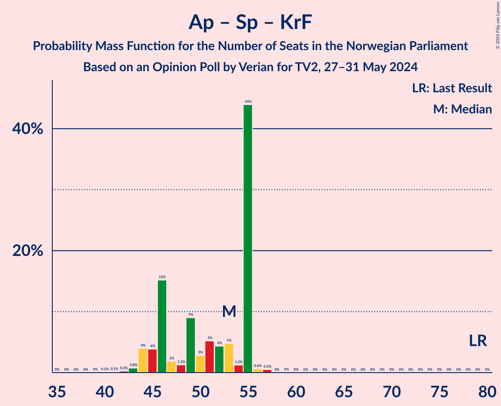

| Number of Seats | Probability | Accumulated | Special Marks |
|:---------------:|:-----------:|:-----------:|:-------------:|
| 36 | 0% | 100% |  |
| 37 | 0% | 99.9% |  |
| 38 | 0% | 99.9% |  |
| 39 | 0% | 99.9% |  |
| 40 | 0.1% | 99.9% |  |
| 41 | 0.1% | 99.8% |  |
| 42 | 0.3% | 99.7% |  |
| 43 | 0.8% | 99.4% |  |
| 44 | 4% | 98.7% |  |
| 45 | 4% | 95% |  |
| 46 | 15% | 91% |  |
| 47 | 2% | 76% |  |
| 48 | 1.3% | 74% |  |
| 49 | 9% | 73% |  |
| 50 | 3% | 64% |  |
| 51 | 5% | 61% |  |
| 52 | 4% | 56% |  |
| 53 | 5% | 51% |  |
| 54 | 1.2% | 46% |  |
| 55 | 44% | 45% | Median |
| 56 | 0.6% | 1.2% |  |
| 57 | 0.5% | 0.5% |  |
| 58 | 0% | 0% |  |
| 59 | 0% | 0% |  |
| 60 | 0% | 0% |  |
| 61 | 0% | 0% |  |
| 62 | 0% | 0% |  |
| 63 | 0% | 0% |  |
| 64 | 0% | 0% |  |
| 65 | 0% | 0% |  |
| 66 | 0% | 0% |  |
| 67 | 0% | 0% |  |
| 68 | 0% | 0% |  |
| 69 | 0% | 0% |  |
| 70 | 0% | 0% |  |
| 71 | 0% | 0% |  |
| 72 | 0% | 0% |  |
| 73 | 0% | 0% |  |
| 74 | 0% | 0% |  |
| 75 | 0% | 0% |  |
| 76 | 0% | 0% |  |
| 77 | 0% | 0% |  |
| 78 | 0% | 0% |  |
| 79 | 0% | 0% | Last Result |

### Arbeiderpartiet – Senterpartiet

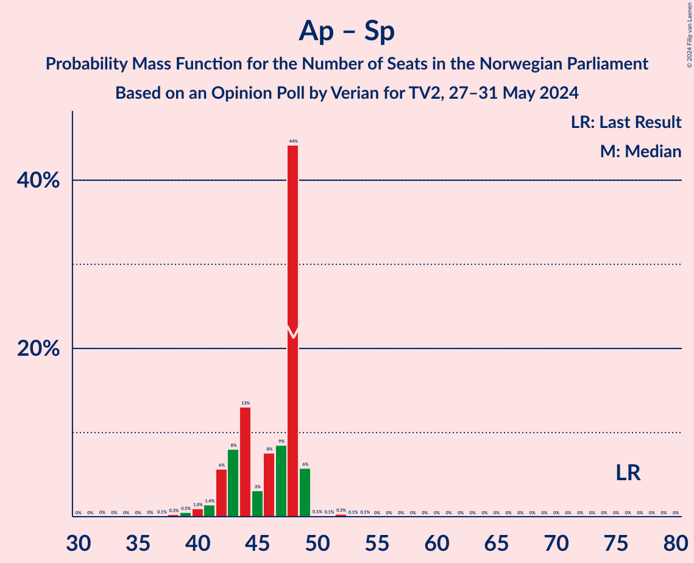

| Number of Seats | Probability | Accumulated | Special Marks |
|:---------------:|:-----------:|:-----------:|:-------------:|
| 33 | 0% | 100% |  |
| 34 | 0% | 99.9% |  |
| 35 | 0% | 99.9% |  |
| 36 | 0% | 99.9% |  |
| 37 | 0.1% | 99.9% |  |
| 38 | 0.3% | 99.8% |  |
| 39 | 0.5% | 99.5% |  |
| 40 | 1.0% | 99.0% |  |
| 41 | 1.4% | 98% |  |
| 42 | 6% | 97% |  |
| 43 | 8% | 91% |  |
| 44 | 13% | 83% |  |
| 45 | 3% | 70% |  |
| 46 | 8% | 67% |  |
| 47 | 9% | 59% |  |
| 48 | 44% | 51% | Median |
| 49 | 6% | 6% |  |
| 50 | 0.1% | 0.7% |  |
| 51 | 0.1% | 0.6% |  |
| 52 | 0.3% | 0.5% |  |
| 53 | 0.1% | 0.1% |  |
| 54 | 0.1% | 0.1% |  |
| 55 | 0% | 0% |  |
| 56 | 0% | 0% |  |
| 57 | 0% | 0% |  |
| 58 | 0% | 0% |  |
| 59 | 0% | 0% |  |
| 60 | 0% | 0% |  |
| 61 | 0% | 0% |  |
| 62 | 0% | 0% |  |
| 63 | 0% | 0% |  |
| 64 | 0% | 0% |  |
| 65 | 0% | 0% |  |
| 66 | 0% | 0% |  |
| 67 | 0% | 0% |  |
| 68 | 0% | 0% |  |
| 69 | 0% | 0% |  |
| 70 | 0% | 0% |  |
| 71 | 0% | 0% |  |
| 72 | 0% | 0% |  |
| 73 | 0% | 0% |  |
| 74 | 0% | 0% |  |
| 75 | 0% | 0% |  |
| 76 | 0% | 0% | Last Result |

### Senterpartiet – Venstre – Kristelig Folkeparti

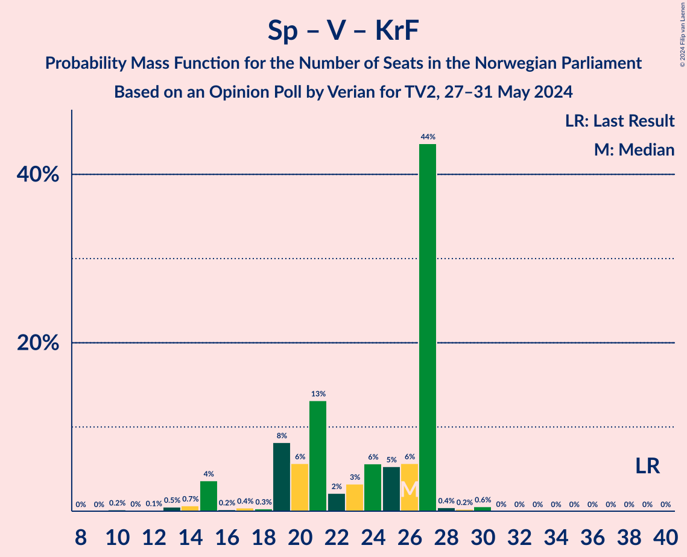

| Number of Seats | Probability | Accumulated | Special Marks |
|:---------------:|:-----------:|:-----------:|:-------------:|
| 10 | 0.2% | 100% |  |
| 11 | 0% | 99.8% |  |
| 12 | 0.1% | 99.8% |  |
| 13 | 0.5% | 99.6% |  |
| 14 | 0.7% | 99.1% |  |
| 15 | 4% | 98% |  |
| 16 | 0.2% | 95% |  |
| 17 | 0.4% | 95% |  |
| 18 | 0.3% | 94% |  |
| 19 | 8% | 94% |  |
| 20 | 6% | 86% |  |
| 21 | 13% | 80% |  |
| 22 | 2% | 67% |  |
| 23 | 3% | 65% |  |
| 24 | 6% | 62% |  |
| 25 | 5% | 56% |  |
| 26 | 6% | 51% |  |
| 27 | 44% | 45% | Median |
| 28 | 0.4% | 1.3% |  |
| 29 | 0.2% | 0.8% |  |
| 30 | 0.6% | 0.6% |  |
| 31 | 0% | 0% |  |
| 32 | 0% | 0% |  |
| 33 | 0% | 0% |  |
| 34 | 0% | 0% |  |
| 35 | 0% | 0% |  |
| 36 | 0% | 0% |  |
| 37 | 0% | 0% |  |
| 38 | 0% | 0% |  |
| 39 | 0% | 0% | Last Result |

## Technical Information

### Opinion Poll

+ **Polling firm:** Verian
+ **Commissioner(s):** TV2
+ **Fieldwork period:** 27–31 May 2024

### Calculations

+ **Sample size:** 998
+ **Simulations done:** 1,048,576
+ **Error estimate:** 5.09%

