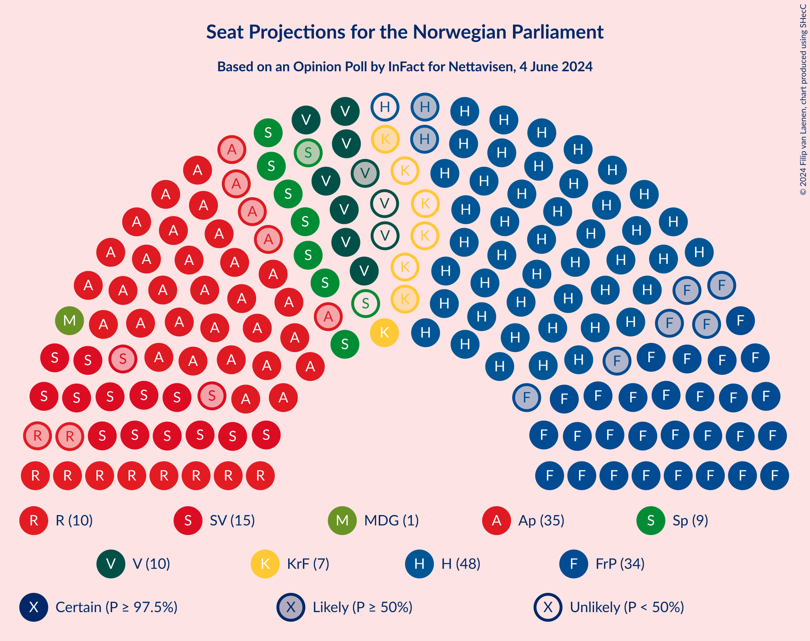
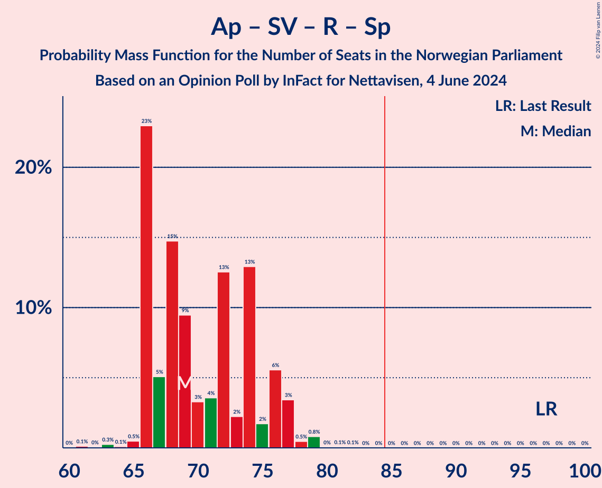
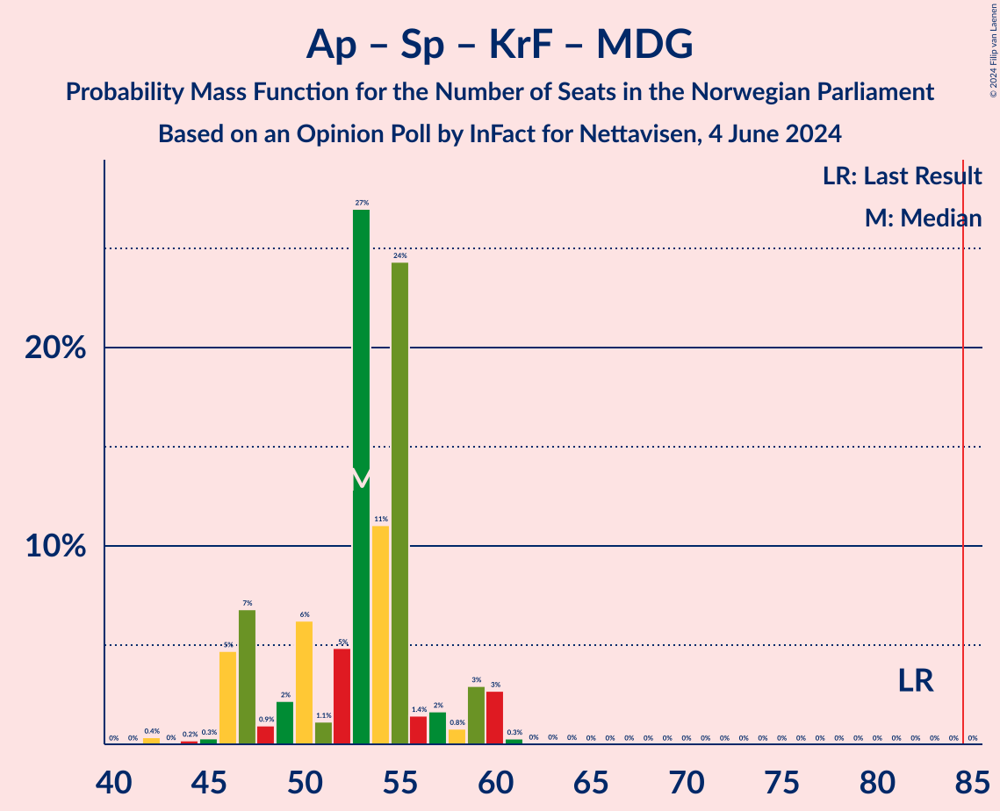

# Opinion Poll by InFact for Nettavisen, 4 June 2024

<a href="#voting-intentions">Voting Intentions</a> | <a href="#seats">Seats</a> | <a href="#coalitions">Coalitions</a> | <a href="#technical-information">Technical Information</a>

## Voting Intentions

### Confidence Intervals

| Party | Last Result | Poll Result | 80% Confidence Interval | 90% Confidence Interval | 95% Confidence Interval | 99% Confidence Interval |
|:-----:|:-----------:|:-----------:|:-----------------------:|:-----------------------:|:-----------------------:|:-----------------------:|
| Høyre | 20.4% | 25.4% | 23.7–27.1% |23.3–27.6% |22.9–28.0% |22.1–28.9% |
| Arbeiderpartiet | 26.2% | 18.9% | 17.4–20.5% |17.0–20.9% |16.7–21.3% |16.0–22.1% |
| Fremskrittspartiet | 11.6% | 17.8% | 16.4–19.4% |16.0–19.8% |15.6–20.2% |15.0–20.9% |
| Sosialistisk Venstreparti | 7.6% | 8.8% | 7.7–10.0% |7.5–10.3% |7.2–10.6% |6.8–11.2% |
| Rødt | 4.7% | 6.0% | 5.2–7.1% |5.0–7.3% |4.8–7.6% |4.4–8.1% |
| Venstre | 4.6% | 5.8% | 5.0–6.9% |4.8–7.1% |4.6–7.4% |4.2–7.9% |
| Senterpartiet | 13.5% | 5.7% | 4.8–6.7% |4.6–7.0% |4.4–7.2% |4.1–7.7% |
| Kristelig Folkeparti | 3.8% | 3.9% | 3.3–4.8% |3.1–5.0% |2.9–5.3% |2.6–5.7% |
| Miljøpartiet De Grønne | 3.9% | 3.0% | 2.4–3.8% |2.3–4.0% |2.1–4.2% |1.9–4.6% |
| Industri- og Næringspartiet | 0.3% | 2.5% | 2.0–3.2% |1.8–3.4% |1.7–3.6% |1.5–3.9% |
| Konservativt | 0.4% | 0.7% | 0.5–1.2% |0.4–1.3% |0.4–1.4% |0.3–1.7% |
| Pensjonistpartiet | 0.6% | 0.4% | 0.2–0.7% |0.2–0.8% |0.1–0.9% |0.1–1.2% |
| Norgesdemokratene | 1.1% | 0.3% | 0.2–0.6% |0.1–0.7% |0.1–0.8% |0.1–1.0% |

*Note:* The poll result column reflects the actual value used in the calculations. Published results may vary slightly, and in addition be rounded to fewer digits.

## Seats

### Confidence Intervals

| Party | Last Result | Median | 80% Confidence Interval | 90% Confidence Interval | 95% Confidence Interval | 99% Confidence Interval |
|:-----:|:-----------:|:------:|:-----------------------:|:-----------------------:|:-----------------------:|:-----------------------:|
| <a href="#høyre">Høyre</a> | 36 | 45 | 40–49 |40–50 |40–50 |39–51 |
| <a href="#arbeiderpartiet">Arbeiderpartiet</a> | 48 | 35 | 32–39 |32–40 |30–41 |30–44 |
| <a href="#fremskrittspartiet">Fremskrittspartiet</a> | 21 | 34 | 30–37 |29–37 |28–37 |28–38 |
| <a href="#sosialistisk-venstreparti">Sosialistisk Venstreparti</a> | 13 | 15 | 14–17 |13–18 |13–18 |11–19 |
| <a href="#rødt">Rødt</a> | 8 | 10 | 9–11 |9–12 |8–12 |8–15 |
| <a href="#venstre">Venstre</a> | 8 | 10 | 9–11 |8–12 |8–12 |8–13 |
| <a href="#senterpartiet">Senterpartiet</a> | 28 | 9 | 8–11 |7–12 |7–12 |7–15 |
| <a href="#kristelig-folkeparti">Kristelig Folkeparti</a> | 3 | 7 | 2–9 |2–9 |2–9 |1–9 |
| <a href="#miljøpartiet-de-grønne">Miljøpartiet De Grønne</a> | 3 | 1 | 1–3 |1–7 |1–7 |1–7 |
| <a href="#industri--og-næringspartiet">Industri- og Næringspartiet</a> | 0 | 0 | 0–2 |0–2 |0–2 |0–6 |
| <a href="#konservativt">Konservativt</a> | 0 | 0 | 0 |0 |0 |0 |
| <a href="#pensjonistpartiet">Pensjonistpartiet</a> | 0 | 0 | 0 |0 |0 |0 |
| <a href="#norgesdemokratene">Norgesdemokratene</a> | 0 | 0 | 0 |0 |0 |0 |

### Høyre

*For a full overview of the results for this party, see the [Høyre](party-høyre.html) page.*

| Number of Seats | Probability | Accumulated | Special Marks |
|:---------------:|:-----------:|:-----------:|:-------------:|
| 36 | 0% | 100% | Last Result |
| 37 | 0% | 100% |  |
| 38 | 0.2% | 100% |  |
| 39 | 0.5% | 99.7% |  |
| 40 | 19% | 99.2% |  |
| 41 | 8% | 80% |  |
| 42 | 0.9% | 72% |  |
| 43 | 3% | 71% |  |
| 44 | 11% | 69% |  |
| 45 | 8% | 58% | Median |
| 46 | 0.5% | 50% |  |
| 47 | 8% | 49% |  |
| 48 | 29% | 42% |  |
| 49 | 7% | 13% |  |
| 50 | 5% | 6% |  |
| 51 | 0.7% | 0.8% |  |
| 52 | 0% | 0% |  |

### Arbeiderpartiet

*For a full overview of the results for this party, see the [Arbeiderpartiet](party-arbeiderpartiet.html) page.*

| Number of Seats | Probability | Accumulated | Special Marks |
|:---------------:|:-----------:|:-----------:|:-------------:|
| 30 | 4% | 100% |  |
| 31 | 0.4% | 96% |  |
| 32 | 6% | 96% |  |
| 33 | 4% | 90% |  |
| 34 | 7% | 85% |  |
| 35 | 34% | 78% | Median |
| 36 | 20% | 45% |  |
| 37 | 6% | 25% |  |
| 38 | 5% | 18% |  |
| 39 | 7% | 13% |  |
| 40 | 3% | 6% |  |
| 41 | 0.6% | 3% |  |
| 42 | 0.3% | 2% |  |
| 43 | 1.3% | 2% |  |
| 44 | 0.4% | 0.5% |  |
| 45 | 0.1% | 0.1% |  |
| 46 | 0% | 0% |  |
| 47 | 0% | 0% |  |
| 48 | 0% | 0% | Last Result |

### Fremskrittspartiet

*For a full overview of the results for this party, see the [Fremskrittspartiet](party-fremskrittspartiet.html) page.*

| Number of Seats | Probability | Accumulated | Special Marks |
|:---------------:|:-----------:|:-----------:|:-------------:|
| 21 | 0% | 100% | Last Result |
| 22 | 0% | 100% |  |
| 23 | 0% | 100% |  |
| 24 | 0% | 100% |  |
| 25 | 0% | 100% |  |
| 26 | 0.1% | 99.9% |  |
| 27 | 0.2% | 99.8% |  |
| 28 | 4% | 99.6% |  |
| 29 | 1.3% | 95% |  |
| 30 | 8% | 94% |  |
| 31 | 2% | 86% |  |
| 32 | 7% | 83% |  |
| 33 | 5% | 76% |  |
| 34 | 28% | 71% | Median |
| 35 | 2% | 43% |  |
| 36 | 26% | 41% |  |
| 37 | 15% | 15% |  |
| 38 | 0.2% | 0.6% |  |
| 39 | 0.1% | 0.4% |  |
| 40 | 0.2% | 0.3% |  |
| 41 | 0.1% | 0.1% |  |
| 42 | 0% | 0.1% |  |
| 43 | 0% | 0% |  |

### Sosialistisk Venstreparti

*For a full overview of the results for this party, see the [Sosialistisk Venstreparti](party-sosialistiskvenstreparti.html) page.*

| Number of Seats | Probability | Accumulated | Special Marks |
|:---------------:|:-----------:|:-----------:|:-------------:|
| 10 | 0% | 100% |  |
| 11 | 0.6% | 99.9% |  |
| 12 | 0.7% | 99.3% |  |
| 13 | 8% | 98.7% | Last Result |
| 14 | 33% | 90% |  |
| 15 | 15% | 58% | Median |
| 16 | 16% | 43% |  |
| 17 | 18% | 27% |  |
| 18 | 7% | 9% |  |
| 19 | 1.1% | 2% |  |
| 20 | 0.3% | 0.5% |  |
| 21 | 0% | 0.2% |  |
| 22 | 0.2% | 0.2% |  |
| 23 | 0% | 0% |  |

### Rødt

*For a full overview of the results for this party, see the [Rødt](party-rødt.html) page.*

| Number of Seats | Probability | Accumulated | Special Marks |
|:---------------:|:-----------:|:-----------:|:-------------:|
| 7 | 0.2% | 100% |  |
| 8 | 3% | 99.8% | Last Result |
| 9 | 35% | 97% |  |
| 10 | 30% | 62% | Median |
| 11 | 24% | 32% |  |
| 12 | 5% | 8% |  |
| 13 | 1.1% | 2% |  |
| 14 | 0.6% | 1.4% |  |
| 15 | 0.8% | 0.8% |  |
| 16 | 0% | 0% |  |

### Venstre

*For a full overview of the results for this party, see the [Venstre](party-venstre.html) page.*

| Number of Seats | Probability | Accumulated | Special Marks |
|:---------------:|:-----------:|:-----------:|:-------------:|
| 3 | 0.1% | 100% |  |
| 4 | 0% | 99.9% |  |
| 5 | 0% | 99.9% |  |
| 6 | 0.3% | 99.9% |  |
| 7 | 0.2% | 99.7% |  |
| 8 | 7% | 99.5% | Last Result |
| 9 | 28% | 93% |  |
| 10 | 41% | 64% | Median |
| 11 | 16% | 23% |  |
| 12 | 6% | 8% |  |
| 13 | 0.9% | 1.3% |  |
| 14 | 0.4% | 0.4% |  |
| 15 | 0% | 0% |  |

### Senterpartiet

*For a full overview of the results for this party, see the [Senterpartiet](party-senterpartiet.html) page.*

| Number of Seats | Probability | Accumulated | Special Marks |
|:---------------:|:-----------:|:-----------:|:-------------:|
| 6 | 0% | 100% |  |
| 7 | 8% | 99.9% |  |
| 8 | 40% | 92% |  |
| 9 | 7% | 52% | Median |
| 10 | 20% | 45% |  |
| 11 | 18% | 25% |  |
| 12 | 5% | 7% |  |
| 13 | 1.3% | 2% |  |
| 14 | 0.3% | 0.8% |  |
| 15 | 0.5% | 0.5% |  |
| 16 | 0% | 0% |  |
| 17 | 0% | 0% |  |
| 18 | 0% | 0% |  |
| 19 | 0% | 0% |  |
| 20 | 0% | 0% |  |
| 21 | 0% | 0% |  |
| 22 | 0% | 0% |  |
| 23 | 0% | 0% |  |
| 24 | 0% | 0% |  |
| 25 | 0% | 0% |  |
| 26 | 0% | 0% |  |
| 27 | 0% | 0% |  |
| 28 | 0% | 0% | Last Result |

### Kristelig Folkeparti

*For a full overview of the results for this party, see the [Kristelig Folkeparti](party-kristeligfolkeparti.html) page.*

| Number of Seats | Probability | Accumulated | Special Marks |
|:---------------:|:-----------:|:-----------:|:-------------:|
| 1 | 0.7% | 100% |  |
| 2 | 15% | 99.3% |  |
| 3 | 14% | 84% | Last Result |
| 4 | 0% | 70% |  |
| 5 | 0% | 70% |  |
| 6 | 2% | 70% |  |
| 7 | 34% | 68% | Median |
| 8 | 8% | 34% |  |
| 9 | 26% | 26% |  |
| 10 | 0.4% | 0.4% |  |
| 11 | 0% | 0% |  |

### Miljøpartiet De Grønne

*For a full overview of the results for this party, see the [Miljøpartiet De Grønne](party-miljøpartietdegrønne.html) page.*

| Number of Seats | Probability | Accumulated | Special Marks |
|:---------------:|:-----------:|:-----------:|:-------------:|
| 0 | 0.1% | 100% |  |
| 1 | 61% | 99.9% | Median |
| 2 | 23% | 39% |  |
| 3 | 8% | 16% | Last Result |
| 4 | 0% | 8% |  |
| 5 | 0% | 8% |  |
| 6 | 0.4% | 8% |  |
| 7 | 8% | 8% |  |
| 8 | 0.2% | 0.2% |  |
| 9 | 0% | 0% |  |

### Industri- og Næringspartiet

*For a full overview of the results for this party, see the [Industri- og Næringspartiet](party-industri-ognæringspartiet.html) page.*

| Number of Seats | Probability | Accumulated | Special Marks |
|:---------------:|:-----------:|:-----------:|:-------------:|
| 0 | 58% | 100% | Last Result, Median |
| 1 | 15% | 42% |  |
| 2 | 26% | 27% |  |
| 3 | 0.4% | 1.1% |  |
| 4 | 0% | 0.6% |  |
| 5 | 0% | 0.6% |  |
| 6 | 0.3% | 0.6% |  |
| 7 | 0.3% | 0.3% |  |
| 8 | 0% | 0% |  |

### Konservativt

*For a full overview of the results for this party, see the [Konservativt](party-konservativt.html) page.*

| Number of Seats | Probability | Accumulated | Special Marks |
|:---------------:|:-----------:|:-----------:|:-------------:|
| 0 | 100% | 100% | Last Result, Median |

### Pensjonistpartiet

*For a full overview of the results for this party, see the [Pensjonistpartiet](party-pensjonistpartiet.html) page.*

| Number of Seats | Probability | Accumulated | Special Marks |
|:---------------:|:-----------:|:-----------:|:-------------:|
| 0 | 100% | 100% | Last Result, Median |

### Norgesdemokratene

*For a full overview of the results for this party, see the [Norgesdemokratene](party-norgesdemokratene.html) page.*

| Number of Seats | Probability | Accumulated | Special Marks |
|:---------------:|:-----------:|:-----------:|:-------------:|
| 0 | 100% | 100% | Last Result, Median |

## Coalitions

### Confidence Intervals

| Coalition | Last Result | Median | Majority? | 80% Confidence Interval | 90% Confidence Interval | 95% Confidence Interval | 99% Confidence Interval |
|:---------:|:-----------:|:------:|:---------:|:-----------------------:|:-----------------------:|:-----------------------:|:-----------------------:|
| Høyre – Fremskrittspartiet – Venstre – Senterpartiet – Kristelig Folkeparti | 96 | 104 | 100% | 100–109 | 100–109 | 98–109 | 95–112 |
| Høyre – Fremskrittspartiet – Venstre – Kristelig Folkeparti – Miljøpartiet De Grønne | 71 | 97 | 100% | 92–102 | 91–102 | 91–102 | 87–103 |
| Høyre – Fremskrittspartiet – Venstre – Kristelig Folkeparti | 68 | 94 | 99.9% | 91–101 | 90–101 | 89–101 | 86–101 |
| Høyre – Fremskrittspartiet – Venstre | 65 | 89 | 92% | 85–92 | 83–96 | 83–96 | 81–96 |
| Høyre – Fremskrittspartiet | 57 | 79 | 0.9% | 76–82 | 74–84 | 73–84 | 71–85 |
| Arbeiderpartiet – Sosialistisk Venstreparti – Rødt – Senterpartiet – Miljøpartiet De Grønne | 100 | 72 | 0% | 67–77 | 67–78 | 67–78 | 66–81 |
| Arbeiderpartiet – Sosialistisk Venstreparti – Rødt – Senterpartiet | 97 | 69 | 0% | 66–76 | 66–76 | 66–77 | 64–79 |
| Arbeiderpartiet – Sosialistisk Venstreparti – Senterpartiet – Kristelig Folkeparti – Miljøpartiet De Grønne | 95 | 68 | 0% | 65–72 | 61–73 | 61–73 | 59–75 |
| Arbeiderpartiet – Sosialistisk Venstreparti – Rødt – Miljøpartiet De Grønne | 72 | 62 | 0% | 59–67 | 58–67 | 58–68 | 56–71 |
| Arbeiderpartiet – Sosialistisk Venstreparti – Senterpartiet – Miljøpartiet De Grønne | 92 | 62 | 0% | 58–66 | 58–67 | 58–67 | 56–69 |
| Høyre – Venstre – Kristelig Folkeparti | 47 | 62 | 0% | 56–67 | 55–67 | 55–67 | 53–67 |
| Arbeiderpartiet – Sosialistisk Venstreparti – Senterpartiet | 89 | 59 | 0% | 57–65 | 57–65 | 57–65 | 54–68 |
| Arbeiderpartiet – Senterpartiet – Kristelig Folkeparti – Miljøpartiet De Grønne | 82 | 53 | 0% | 47–55 | 46–59 | 46–60 | 44–60 |
| Arbeiderpartiet – Senterpartiet – Kristelig Folkeparti | 79 | 52 | 0% | 46–53 | 45–56 | 45–58 | 43–58 |
| Arbeiderpartiet – Sosialistisk Venstreparti | 61 | 50 | 0% | 48–55 | 47–55 | 47–56 | 45–58 |
| Arbeiderpartiet – Senterpartiet | 76 | 45 | 0% | 42–50 | 42–50 | 41–51 | 39–52 |
| Venstre – Senterpartiet – Kristelig Folkeparti | 39 | 26 | 0% | 20–28 | 19–29 | 19–29 | 19–32 |

### Høyre – Fremskrittspartiet – Venstre – Senterpartiet – Kristelig Folkeparti

| Number of Seats | Probability | Accumulated | Special Marks |
|:---------------:|:-----------:|:-----------:|:-------------:|
| 95 | 0.7% | 100% |  |
| 96 | 0.2% | 99.3% | Last Result |
| 97 | 0.7% | 99.0% |  |
| 98 | 2% | 98% |  |
| 99 | 1.0% | 97% |  |
| 100 | 6% | 96% |  |
| 101 | 18% | 90% |  |
| 102 | 13% | 72% |  |
| 103 | 7% | 59% |  |
| 104 | 8% | 53% |  |
| 105 | 2% | 45% | Median |
| 106 | 1.3% | 42% |  |
| 107 | 8% | 41% |  |
| 108 | 9% | 33% |  |
| 109 | 23% | 24% |  |
| 110 | 0.3% | 1.0% |  |
| 111 | 0% | 0.7% |  |
| 112 | 0.4% | 0.6% |  |
| 113 | 0.3% | 0.3% |  |
| 114 | 0% | 0% |  |

### Høyre – Fremskrittspartiet – Venstre – Kristelig Folkeparti – Miljøpartiet De Grønne

| Number of Seats | Probability | Accumulated | Special Marks |
|:---------------:|:-----------:|:-----------:|:-------------:|
| 71 | 0% | 100% | Last Result |
| 72 | 0% | 100% |  |
| 73 | 0% | 100% |  |
| 74 | 0% | 100% |  |
| 75 | 0% | 100% |  |
| 76 | 0% | 100% |  |
| 77 | 0% | 100% |  |
| 78 | 0% | 100% |  |
| 79 | 0% | 100% |  |
| 80 | 0% | 100% |  |
| 81 | 0% | 100% |  |
| 82 | 0% | 100% |  |
| 83 | 0% | 100% |  |
| 84 | 0% | 100% |  |
| 85 | 0% | 100% | Majority |
| 86 | 0.1% | 100% |  |
| 87 | 0.5% | 99.9% |  |
| 88 | 0.4% | 99.4% |  |
| 89 | 0.3% | 99.0% |  |
| 90 | 0.8% | 98.7% |  |
| 91 | 5% | 98% |  |
| 92 | 5% | 93% |  |
| 93 | 0.5% | 88% |  |
| 94 | 19% | 87% |  |
| 95 | 9% | 69% |  |
| 96 | 0.4% | 60% |  |
| 97 | 14% | 59% | Median |
| 98 | 5% | 46% |  |
| 99 | 11% | 41% |  |
| 100 | 5% | 29% |  |
| 101 | 0.6% | 24% |  |
| 102 | 23% | 23% |  |
| 103 | 0.3% | 0.7% |  |
| 104 | 0% | 0.3% |  |
| 105 | 0.2% | 0.3% |  |
| 106 | 0% | 0% |  |

### Høyre – Fremskrittspartiet – Venstre – Kristelig Folkeparti

| Number of Seats | Probability | Accumulated | Special Marks |
|:---------------:|:-----------:|:-----------:|:-------------:|
| 68 | 0% | 100% | Last Result |
| 69 | 0% | 100% |  |
| 70 | 0% | 100% |  |
| 71 | 0% | 100% |  |
| 72 | 0% | 100% |  |
| 73 | 0% | 100% |  |
| 74 | 0% | 100% |  |
| 75 | 0% | 100% |  |
| 76 | 0% | 100% |  |
| 77 | 0% | 100% |  |
| 78 | 0% | 100% |  |
| 79 | 0% | 100% |  |
| 80 | 0% | 100% |  |
| 81 | 0% | 100% |  |
| 82 | 0% | 100% |  |
| 83 | 0% | 100% |  |
| 84 | 0.1% | 100% |  |
| 85 | 0.2% | 99.9% | Majority |
| 86 | 0.6% | 99.7% |  |
| 87 | 0.4% | 99.1% |  |
| 88 | 0.7% | 98.7% |  |
| 89 | 2% | 98% |  |
| 90 | 4% | 96% |  |
| 91 | 5% | 92% |  |
| 92 | 19% | 87% |  |
| 93 | 8% | 67% |  |
| 94 | 14% | 59% |  |
| 95 | 1.3% | 45% |  |
| 96 | 6% | 44% | Median |
| 97 | 8% | 38% |  |
| 98 | 1.5% | 30% |  |
| 99 | 5% | 28% |  |
| 100 | 0% | 23% |  |
| 101 | 23% | 23% |  |
| 102 | 0.3% | 0.4% |  |
| 103 | 0% | 0.1% |  |
| 104 | 0% | 0% |  |

### Høyre – Fremskrittspartiet – Venstre

| Number of Seats | Probability | Accumulated | Special Marks |
|:---------------:|:-----------:|:-----------:|:-------------:|
| 65 | 0% | 100% | Last Result |
| 66 | 0% | 100% |  |
| 67 | 0% | 100% |  |
| 68 | 0% | 100% |  |
| 69 | 0% | 100% |  |
| 70 | 0% | 100% |  |
| 71 | 0% | 100% |  |
| 72 | 0% | 100% |  |
| 73 | 0% | 100% |  |
| 74 | 0% | 100% |  |
| 75 | 0% | 100% |  |
| 76 | 0% | 100% |  |
| 77 | 0% | 100% |  |
| 78 | 0.3% | 100% |  |
| 79 | 0% | 99.7% |  |
| 80 | 0% | 99.6% |  |
| 81 | 0.1% | 99.6% |  |
| 82 | 0.4% | 99.5% |  |
| 83 | 5% | 99.0% |  |
| 84 | 2% | 94% |  |
| 85 | 13% | 92% | Majority |
| 86 | 1.0% | 79% |  |
| 87 | 17% | 78% |  |
| 88 | 0.8% | 61% |  |
| 89 | 15% | 60% | Median |
| 90 | 7% | 45% |  |
| 91 | 7% | 38% |  |
| 92 | 23% | 32% |  |
| 93 | 2% | 9% |  |
| 94 | 0.5% | 7% |  |
| 95 | 0.5% | 6% |  |
| 96 | 5% | 6% |  |
| 97 | 0.2% | 0.2% |  |
| 98 | 0% | 0% |  |

### Høyre – Fremskrittspartiet

| Number of Seats | Probability | Accumulated | Special Marks |
|:---------------:|:-----------:|:-----------:|:-------------:|
| 57 | 0% | 100% | Last Result |
| 58 | 0% | 100% |  |
| 59 | 0% | 100% |  |
| 60 | 0% | 100% |  |
| 61 | 0% | 100% |  |
| 62 | 0% | 100% |  |
| 63 | 0% | 100% |  |
| 64 | 0% | 100% |  |
| 65 | 0% | 100% |  |
| 66 | 0% | 100% |  |
| 67 | 0% | 100% |  |
| 68 | 0.3% | 100% |  |
| 69 | 0.1% | 99.7% |  |
| 70 | 0% | 99.6% |  |
| 71 | 0.2% | 99.6% |  |
| 72 | 0.4% | 99.4% |  |
| 73 | 2% | 99.0% |  |
| 74 | 4% | 97% |  |
| 75 | 3% | 93% |  |
| 76 | 19% | 90% |  |
| 77 | 1.1% | 71% |  |
| 78 | 15% | 70% |  |
| 79 | 5% | 55% | Median |
| 80 | 6% | 50% |  |
| 81 | 13% | 44% |  |
| 82 | 22% | 31% |  |
| 83 | 3% | 10% |  |
| 84 | 6% | 7% |  |
| 85 | 0.7% | 0.9% | Majority |
| 86 | 0.1% | 0.2% |  |
| 87 | 0% | 0.1% |  |
| 88 | 0% | 0% |  |

### Arbeiderpartiet – Sosialistisk Venstreparti – Rødt – Senterpartiet – Miljøpartiet De Grønne

| Number of Seats | Probability | Accumulated | Special Marks |
|:---------------:|:-----------:|:-----------:|:-------------:|
| 63 | 0.1% | 100% |  |
| 64 | 0% | 99.9% |  |
| 65 | 0% | 99.8% |  |
| 66 | 0.3% | 99.8% |  |
| 67 | 23% | 99.5% |  |
| 68 | 0.9% | 77% |  |
| 69 | 13% | 76% |  |
| 70 | 1.1% | 63% | Median |
| 71 | 3% | 62% |  |
| 72 | 10% | 59% |  |
| 73 | 14% | 49% |  |
| 74 | 1.0% | 35% |  |
| 75 | 8% | 34% |  |
| 76 | 15% | 26% |  |
| 77 | 6% | 12% |  |
| 78 | 3% | 6% |  |
| 79 | 0.9% | 2% |  |
| 80 | 0.9% | 1.4% |  |
| 81 | 0.3% | 0.5% |  |
| 82 | 0.1% | 0.3% |  |
| 83 | 0.1% | 0.1% |  |
| 84 | 0% | 0% |  |
| 85 | 0% | 0% | Majority |
| 86 | 0% | 0% |  |
| 87 | 0% | 0% |  |
| 88 | 0% | 0% |  |
| 89 | 0% | 0% |  |
| 90 | 0% | 0% |  |
| 91 | 0% | 0% |  |
| 92 | 0% | 0% |  |
| 93 | 0% | 0% |  |
| 94 | 0% | 0% |  |
| 95 | 0% | 0% |  |
| 96 | 0% | 0% |  |
| 97 | 0% | 0% |  |
| 98 | 0% | 0% |  |
| 99 | 0% | 0% |  |
| 100 | 0% | 0% | Last Result |

### Arbeiderpartiet – Sosialistisk Venstreparti – Rødt – Senterpartiet

| Number of Seats | Probability | Accumulated | Special Marks |
|:---------------:|:-----------:|:-----------:|:-------------:|
| 61 | 0.1% | 100% |  |
| 62 | 0% | 99.9% |  |
| 63 | 0.3% | 99.8% |  |
| 64 | 0.1% | 99.6% |  |
| 65 | 0.5% | 99.5% |  |
| 66 | 23% | 99.0% |  |
| 67 | 5% | 76% |  |
| 68 | 15% | 71% |  |
| 69 | 9% | 56% | Median |
| 70 | 3% | 47% |  |
| 71 | 4% | 43% |  |
| 72 | 13% | 40% |  |
| 73 | 2% | 27% |  |
| 74 | 13% | 25% |  |
| 75 | 2% | 12% |  |
| 76 | 6% | 10% |  |
| 77 | 3% | 5% |  |
| 78 | 0.5% | 1.4% |  |
| 79 | 0.8% | 1.0% |  |
| 80 | 0% | 0.2% |  |
| 81 | 0.1% | 0.1% |  |
| 82 | 0.1% | 0.1% |  |
| 83 | 0% | 0% |  |
| 84 | 0% | 0% |  |
| 85 | 0% | 0% | Majority |
| 86 | 0% | 0% |  |
| 87 | 0% | 0% |  |
| 88 | 0% | 0% |  |
| 89 | 0% | 0% |  |
| 90 | 0% | 0% |  |
| 91 | 0% | 0% |  |
| 92 | 0% | 0% |  |
| 93 | 0% | 0% |  |
| 94 | 0% | 0% |  |
| 95 | 0% | 0% |  |
| 96 | 0% | 0% |  |
| 97 | 0% | 0% | Last Result |

### Arbeiderpartiet – Sosialistisk Venstreparti – Senterpartiet – Kristelig Folkeparti – Miljøpartiet De Grønne

| Number of Seats | Probability | Accumulated | Special Marks |
|:---------------:|:-----------:|:-----------:|:-------------:|
| 58 | 0.3% | 100% |  |
| 59 | 0.4% | 99.7% |  |
| 60 | 0.2% | 99.3% |  |
| 61 | 5% | 99.1% |  |
| 62 | 1.2% | 94% |  |
| 63 | 0.7% | 93% |  |
| 64 | 0.8% | 93% |  |
| 65 | 6% | 92% |  |
| 66 | 2% | 86% |  |
| 67 | 27% | 83% | Median |
| 68 | 15% | 56% |  |
| 69 | 8% | 41% |  |
| 70 | 11% | 32% |  |
| 71 | 2% | 22% |  |
| 72 | 12% | 19% |  |
| 73 | 5% | 7% |  |
| 74 | 0.2% | 2% |  |
| 75 | 2% | 2% |  |
| 76 | 0.1% | 0.1% |  |
| 77 | 0% | 0% |  |
| 78 | 0% | 0% |  |
| 79 | 0% | 0% |  |
| 80 | 0% | 0% |  |
| 81 | 0% | 0% |  |
| 82 | 0% | 0% |  |
| 83 | 0% | 0% |  |
| 84 | 0% | 0% |  |
| 85 | 0% | 0% | Majority |
| 86 | 0% | 0% |  |
| 87 | 0% | 0% |  |
| 88 | 0% | 0% |  |
| 89 | 0% | 0% |  |
| 90 | 0% | 0% |  |
| 91 | 0% | 0% |  |
| 92 | 0% | 0% |  |
| 93 | 0% | 0% |  |
| 94 | 0% | 0% |  |
| 95 | 0% | 0% | Last Result |

### Arbeiderpartiet – Sosialistisk Venstreparti – Rødt – Miljøpartiet De Grønne

| Number of Seats | Probability | Accumulated | Special Marks |
|:---------------:|:-----------:|:-----------:|:-------------:|
| 53 | 0.1% | 100% |  |
| 54 | 0% | 99.9% |  |
| 55 | 0.3% | 99.9% |  |
| 56 | 0.4% | 99.6% |  |
| 57 | 0.1% | 99.2% |  |
| 58 | 8% | 99.2% |  |
| 59 | 24% | 91% |  |
| 60 | 3% | 67% |  |
| 61 | 5% | 64% | Median |
| 62 | 9% | 58% |  |
| 63 | 2% | 49% |  |
| 64 | 0.7% | 47% |  |
| 65 | 12% | 46% |  |
| 66 | 19% | 34% |  |
| 67 | 11% | 15% |  |
| 68 | 2% | 4% |  |
| 69 | 0.7% | 2% |  |
| 70 | 0.2% | 1.4% |  |
| 71 | 1.0% | 1.2% |  |
| 72 | 0.2% | 0.2% | Last Result |
| 73 | 0% | 0.1% |  |
| 74 | 0% | 0% |  |

### Arbeiderpartiet – Sosialistisk Venstreparti – Senterpartiet – Miljøpartiet De Grønne

| Number of Seats | Probability | Accumulated | Special Marks |
|:---------------:|:-----------:|:-----------:|:-------------:|
| 54 | 0.1% | 100% |  |
| 55 | 0% | 99.9% |  |
| 56 | 0.4% | 99.9% |  |
| 57 | 1.0% | 99.5% |  |
| 58 | 26% | 98% |  |
| 59 | 1.5% | 72% |  |
| 60 | 9% | 71% | Median |
| 61 | 4% | 61% |  |
| 62 | 8% | 57% |  |
| 63 | 15% | 49% |  |
| 64 | 2% | 35% |  |
| 65 | 18% | 32% |  |
| 66 | 8% | 14% |  |
| 67 | 4% | 6% |  |
| 68 | 0.3% | 1.4% |  |
| 69 | 0.7% | 1.1% |  |
| 70 | 0.4% | 0.4% |  |
| 71 | 0% | 0.1% |  |
| 72 | 0% | 0% |  |
| 73 | 0% | 0% |  |
| 74 | 0% | 0% |  |
| 75 | 0% | 0% |  |
| 76 | 0% | 0% |  |
| 77 | 0% | 0% |  |
| 78 | 0% | 0% |  |
| 79 | 0% | 0% |  |
| 80 | 0% | 0% |  |
| 81 | 0% | 0% |  |
| 82 | 0% | 0% |  |
| 83 | 0% | 0% |  |
| 84 | 0% | 0% |  |
| 85 | 0% | 0% | Majority |
| 86 | 0% | 0% |  |
| 87 | 0% | 0% |  |
| 88 | 0% | 0% |  |
| 89 | 0% | 0% |  |
| 90 | 0% | 0% |  |
| 91 | 0% | 0% |  |
| 92 | 0% | 0% | Last Result |

### Høyre – Venstre – Kristelig Folkeparti

| Number of Seats | Probability | Accumulated | Special Marks |
|:---------------:|:-----------:|:-----------:|:-------------:|
| 47 | 0% | 100% | Last Result |
| 48 | 0% | 100% |  |
| 49 | 0% | 100% |  |
| 50 | 0% | 100% |  |
| 51 | 0% | 100% |  |
| 52 | 0.1% | 100% |  |
| 53 | 0.5% | 99.9% |  |
| 54 | 1.2% | 99.4% |  |
| 55 | 6% | 98% |  |
| 56 | 14% | 92% |  |
| 57 | 5% | 78% |  |
| 58 | 8% | 74% |  |
| 59 | 3% | 65% |  |
| 60 | 0.8% | 62% |  |
| 61 | 11% | 61% |  |
| 62 | 9% | 50% | Median |
| 63 | 9% | 41% |  |
| 64 | 7% | 32% |  |
| 65 | 3% | 25% |  |
| 66 | 0.3% | 22% |  |
| 67 | 22% | 22% |  |
| 68 | 0.1% | 0.1% |  |
| 69 | 0% | 0% |  |

### Arbeiderpartiet – Sosialistisk Venstreparti – Senterpartiet

| Number of Seats | Probability | Accumulated | Special Marks |
|:---------------:|:-----------:|:-----------:|:-------------:|
| 51 | 0% | 100% |  |
| 52 | 0% | 99.9% |  |
| 53 | 0.1% | 99.9% |  |
| 54 | 0.4% | 99.9% |  |
| 55 | 0.6% | 99.5% |  |
| 56 | 1.2% | 98.9% |  |
| 57 | 26% | 98% |  |
| 58 | 12% | 71% |  |
| 59 | 12% | 60% | Median |
| 60 | 6% | 47% |  |
| 61 | 0.8% | 42% |  |
| 62 | 15% | 41% |  |
| 63 | 14% | 26% |  |
| 64 | 1.2% | 12% |  |
| 65 | 10% | 11% |  |
| 66 | 0.6% | 2% |  |
| 67 | 0.4% | 1.0% |  |
| 68 | 0.6% | 0.6% |  |
| 69 | 0% | 0.1% |  |
| 70 | 0% | 0% |  |
| 71 | 0% | 0% |  |
| 72 | 0% | 0% |  |
| 73 | 0% | 0% |  |
| 74 | 0% | 0% |  |
| 75 | 0% | 0% |  |
| 76 | 0% | 0% |  |
| 77 | 0% | 0% |  |
| 78 | 0% | 0% |  |
| 79 | 0% | 0% |  |
| 80 | 0% | 0% |  |
| 81 | 0% | 0% |  |
| 82 | 0% | 0% |  |
| 83 | 0% | 0% |  |
| 84 | 0% | 0% |  |
| 85 | 0% | 0% | Majority |
| 86 | 0% | 0% |  |
| 87 | 0% | 0% |  |
| 88 | 0% | 0% |  |
| 89 | 0% | 0% | Last Result |

### Arbeiderpartiet – Senterpartiet – Kristelig Folkeparti – Miljøpartiet De Grønne

| Number of Seats | Probability | Accumulated | Special Marks |
|:---------------:|:-----------:|:-----------:|:-------------:|
| 42 | 0.4% | 100% |  |
| 43 | 0% | 99.6% |  |
| 44 | 0.2% | 99.6% |  |
| 45 | 0.3% | 99.4% |  |
| 46 | 5% | 99.1% |  |
| 47 | 7% | 94% |  |
| 48 | 0.9% | 88% |  |
| 49 | 2% | 87% |  |
| 50 | 6% | 84% |  |
| 51 | 1.1% | 78% |  |
| 52 | 5% | 77% | Median |
| 53 | 27% | 72% |  |
| 54 | 11% | 45% |  |
| 55 | 24% | 34% |  |
| 56 | 1.4% | 10% |  |
| 57 | 2% | 8% |  |
| 58 | 0.8% | 7% |  |
| 59 | 3% | 6% |  |
| 60 | 3% | 3% |  |
| 61 | 0.3% | 0.4% |  |
| 62 | 0% | 0.1% |  |
| 63 | 0% | 0.1% |  |
| 64 | 0% | 0% |  |
| 65 | 0% | 0% |  |
| 66 | 0% | 0% |  |
| 67 | 0% | 0% |  |
| 68 | 0% | 0% |  |
| 69 | 0% | 0% |  |
| 70 | 0% | 0% |  |
| 71 | 0% | 0% |  |
| 72 | 0% | 0% |  |
| 73 | 0% | 0% |  |
| 74 | 0% | 0% |  |
| 75 | 0% | 0% |  |
| 76 | 0% | 0% |  |
| 77 | 0% | 0% |  |
| 78 | 0% | 0% |  |
| 79 | 0% | 0% |  |
| 80 | 0% | 0% |  |
| 81 | 0% | 0% |  |
| 82 | 0% | 0% | Last Result |

### Arbeiderpartiet – Senterpartiet – Kristelig Folkeparti

| Number of Seats | Probability | Accumulated | Special Marks |
|:---------------:|:-----------:|:-----------:|:-------------:|
| 41 | 0.4% | 100% |  |
| 42 | 0% | 99.6% |  |
| 43 | 0.2% | 99.6% |  |
| 44 | 0.3% | 99.4% |  |
| 45 | 5% | 99.1% |  |
| 46 | 8% | 94% |  |
| 47 | 0.6% | 86% |  |
| 48 | 13% | 86% |  |
| 49 | 1.2% | 73% |  |
| 50 | 1.3% | 72% |  |
| 51 | 5% | 71% | Median |
| 52 | 35% | 66% |  |
| 53 | 22% | 31% |  |
| 54 | 2% | 8% |  |
| 55 | 0.8% | 6% |  |
| 56 | 1.0% | 6% |  |
| 57 | 0.6% | 5% |  |
| 58 | 4% | 4% |  |
| 59 | 0% | 0.1% |  |
| 60 | 0% | 0.1% |  |
| 61 | 0% | 0% |  |
| 62 | 0% | 0% |  |
| 63 | 0% | 0% |  |
| 64 | 0% | 0% |  |
| 65 | 0% | 0% |  |
| 66 | 0% | 0% |  |
| 67 | 0% | 0% |  |
| 68 | 0% | 0% |  |
| 69 | 0% | 0% |  |
| 70 | 0% | 0% |  |
| 71 | 0% | 0% |  |
| 72 | 0% | 0% |  |
| 73 | 0% | 0% |  |
| 74 | 0% | 0% |  |
| 75 | 0% | 0% |  |
| 76 | 0% | 0% |  |
| 77 | 0% | 0% |  |
| 78 | 0% | 0% |  |
| 79 | 0% | 0% | Last Result |

### Arbeiderpartiet – Sosialistisk Venstreparti

| Number of Seats | Probability | Accumulated | Special Marks |
|:---------------:|:-----------:|:-----------:|:-------------:|
| 44 | 0.2% | 100% |  |
| 45 | 1.0% | 99.7% |  |
| 46 | 0.7% | 98.8% |  |
| 47 | 4% | 98% |  |
| 48 | 5% | 94% |  |
| 49 | 38% | 89% |  |
| 50 | 8% | 51% | Median |
| 51 | 2% | 43% |  |
| 52 | 2% | 40% |  |
| 53 | 18% | 38% |  |
| 54 | 9% | 20% |  |
| 55 | 7% | 11% |  |
| 56 | 2% | 3% |  |
| 57 | 0.1% | 1.1% |  |
| 58 | 0.8% | 1.1% |  |
| 59 | 0.2% | 0.3% |  |
| 60 | 0% | 0.1% |  |
| 61 | 0.1% | 0.1% | Last Result |
| 62 | 0% | 0% |  |

### Arbeiderpartiet – Senterpartiet

| Number of Seats | Probability | Accumulated | Special Marks |
|:---------------:|:-----------:|:-----------:|:-------------:|
| 38 | 0.1% | 100% |  |
| 39 | 0.4% | 99.8% |  |
| 40 | 0.4% | 99.5% |  |
| 41 | 4% | 99.1% |  |
| 42 | 6% | 95% |  |
| 43 | 28% | 89% |  |
| 44 | 11% | 62% | Median |
| 45 | 17% | 51% |  |
| 46 | 20% | 34% |  |
| 47 | 2% | 14% |  |
| 48 | 0.8% | 12% |  |
| 49 | 1.0% | 11% |  |
| 50 | 5% | 10% |  |
| 51 | 3% | 5% |  |
| 52 | 2% | 2% |  |
| 53 | 0.1% | 0.1% |  |
| 54 | 0% | 0.1% |  |
| 55 | 0% | 0% |  |
| 56 | 0% | 0% |  |
| 57 | 0% | 0% |  |
| 58 | 0% | 0% |  |
| 59 | 0% | 0% |  |
| 60 | 0% | 0% |  |
| 61 | 0% | 0% |  |
| 62 | 0% | 0% |  |
| 63 | 0% | 0% |  |
| 64 | 0% | 0% |  |
| 65 | 0% | 0% |  |
| 66 | 0% | 0% |  |
| 67 | 0% | 0% |  |
| 68 | 0% | 0% |  |
| 69 | 0% | 0% |  |
| 70 | 0% | 0% |  |
| 71 | 0% | 0% |  |
| 72 | 0% | 0% |  |
| 73 | 0% | 0% |  |
| 74 | 0% | 0% |  |
| 75 | 0% | 0% |  |
| 76 | 0% | 0% | Last Result |

### Venstre – Senterpartiet – Kristelig Folkeparti

| Number of Seats | Probability | Accumulated | Special Marks |
|:---------------:|:-----------:|:-----------:|:-------------:|
| 18 | 0.1% | 100% |  |
| 19 | 6% | 99.9% |  |
| 20 | 7% | 94% |  |
| 21 | 1.0% | 88% |  |
| 22 | 5% | 87% |  |
| 23 | 12% | 82% |  |
| 24 | 1.3% | 70% |  |
| 25 | 7% | 69% |  |
| 26 | 15% | 62% | Median |
| 27 | 25% | 47% |  |
| 28 | 12% | 22% |  |
| 29 | 7% | 10% |  |
| 30 | 0.7% | 2% |  |
| 31 | 1.0% | 2% |  |
| 32 | 0.5% | 0.7% |  |
| 33 | 0.2% | 0.2% |  |
| 34 | 0% | 0.1% |  |
| 35 | 0% | 0% |  |
| 36 | 0% | 0% |  |
| 37 | 0% | 0% |  |
| 38 | 0% | 0% |  |
| 39 | 0% | 0% | Last Result |

## Technical Information

### Opinion Poll

+ **Polling firm:** InFact
+ **Commissioner(s):** Nettavisen
+ **Fieldwork period:** 4 June 2024

### Calculations

+ **Sample size:** 1096
+ **Simulations done:** 1,048,576
+ **Error estimate:** 1.95%

