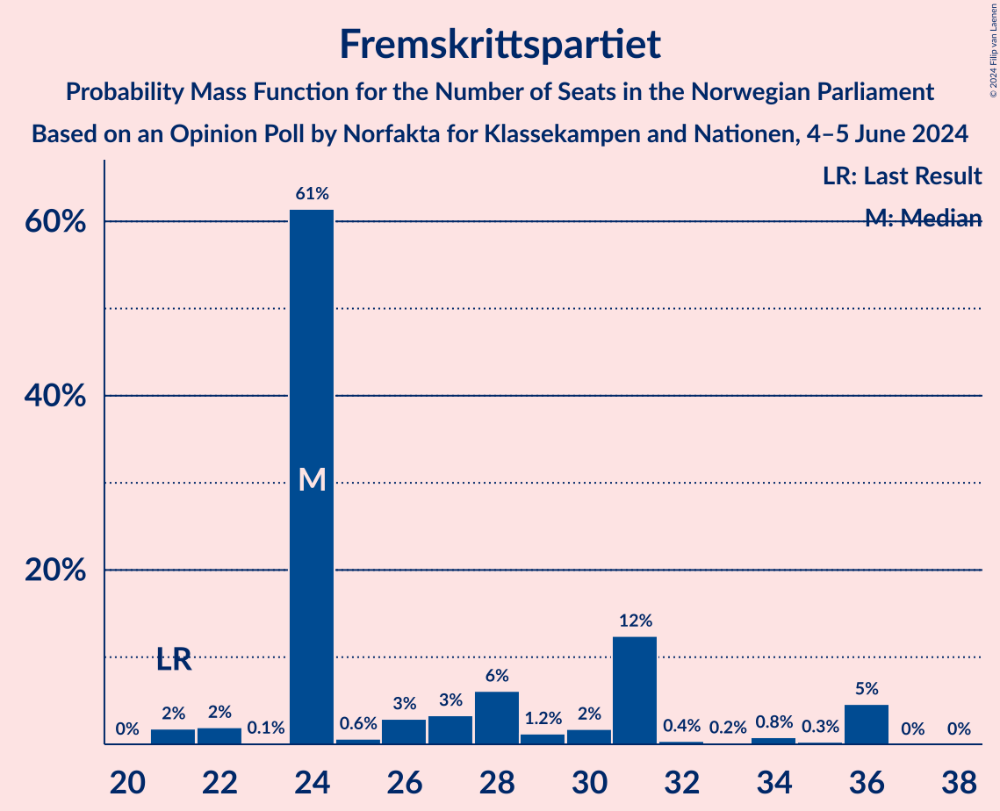
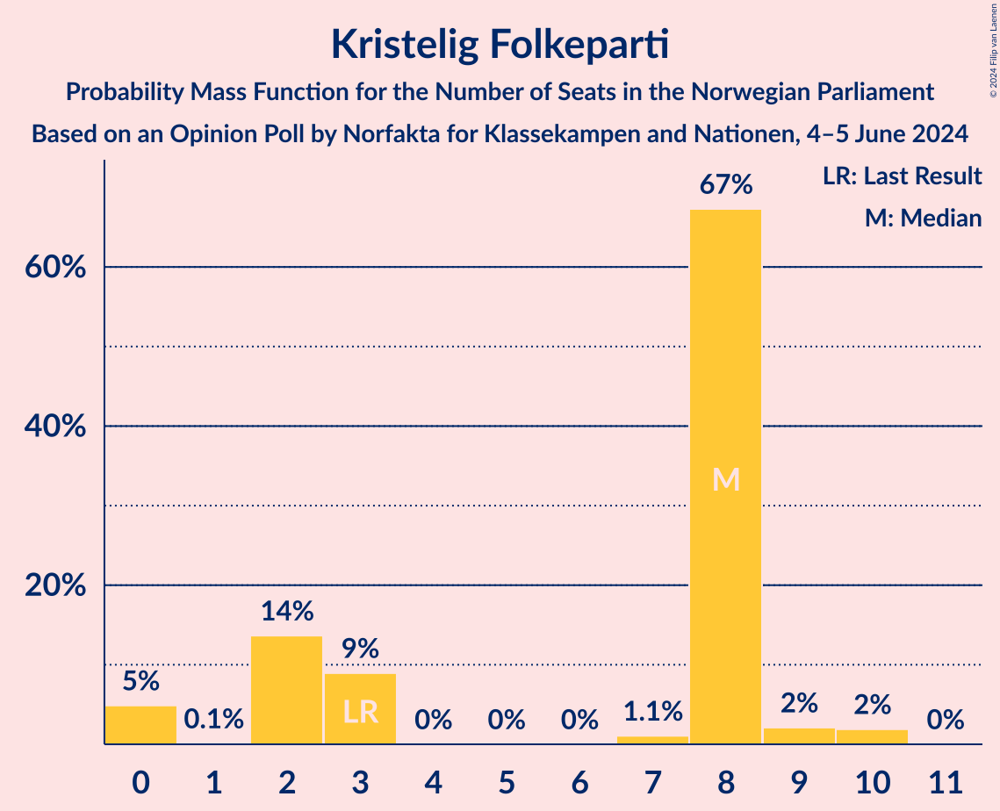

# Opinion Poll by Norfakta for Klassekampen and Nationen, 4–5 June 2024

<a href="#voting-intentions">Voting Intentions</a> | <a href="#seats">Seats</a> | <a href="#coalitions">Coalitions</a> | <a href="#technical-information">Technical Information</a>

## Voting Intentions

### Confidence Intervals

| Party | Last Result | Poll Result | 80% Confidence Interval | 90% Confidence Interval | 95% Confidence Interval | 99% Confidence Interval |
|:-----:|:-----------:|:-----------:|:-----------------------:|:-----------------------:|:-----------------------:|:-----------------------:|
| Høyre | 20.4% | 23.4% | 21.6–25.4% |21.1–26.0% |20.6–26.5% |19.8–27.5% |
| Arbeiderpartiet | 26.2% | 19.0% | 17.3–20.8% |16.8–21.4% |16.4–21.8% |15.6–22.7% |
| Fremskrittspartiet | 11.6% | 15.7% | 14.2–17.5% |13.7–18.0% |13.4–18.4% |12.6–19.3% |
| Sosialistisk Venstreparti | 7.6% | 9.9% | 8.6–11.3% |8.3–11.8% |8.0–12.1% |7.4–12.9% |
| Rødt | 4.7% | 8.0% | 6.9–9.3% |6.6–9.7% |6.3–10.1% |5.8–10.8% |
| Senterpartiet | 13.5% | 7.5% | 6.4–8.8% |6.1–9.2% |5.9–9.5% |5.4–10.2% |
| Venstre | 4.6% | 5.9% | 4.9–7.1% |4.6–7.4% |4.4–7.7% |4.0–8.3% |
| Kristelig Folkeparti | 3.8% | 3.5% | 2.8–4.5% |2.6–4.8% |2.4–5.0% |2.1–5.5% |
| Miljøpartiet De Grønne | 3.9% | 3.4% | 2.7–4.3% |2.5–4.6% |2.3–4.9% |2.0–5.4% |
| Industri- og Næringspartiet | 0.3% | 1.4% | 1.0–2.1% |0.9–2.3% |0.8–2.4% |0.6–2.8% |
| Liberalistene | 0.2% | 1.0% | 0.7–1.6% |0.6–1.8% |0.5–2.0% |0.4–2.3% |
| Norgesdemokratene | 1.1% | 0.7% | 0.5–1.3% |0.4–1.5% |0.4–1.6% |0.2–2.0% |
| Pensjonistpartiet | 0.6% | 0.2% | 0.1–0.7% |0.1–0.8% |0.1–0.9% |0.0–1.2% |
| Kystpartiet | 0.0% | 0.1% | 0.1–0.5% |0.0–0.6% |0.0–0.7% |0.0–0.9% |
| Konservativt | 0.4% | 0.1% | 0.1–0.5% |0.0–0.6% |0.0–0.7% |0.0–0.9% |

*Note:* The poll result column reflects the actual value used in the calculations. Published results may vary slightly, and in addition be rounded to fewer digits.

## Seats

### Confidence Intervals

| Party | Last Result | Median | 80% Confidence Interval | 90% Confidence Interval | 95% Confidence Interval | 99% Confidence Interval |
|:-----:|:-----------:|:------:|:-----------------------:|:-----------------------:|:-----------------------:|:-----------------------:|
| <a href="#høyre">Høyre</a> | 36 | 44 | 40–44 |40–45 |38–47 |37–47 |
| <a href="#arbeiderpartiet">Arbeiderpartiet</a> | 48 | 33 | 33–35 |32–36 |32–37 |31–41 |
| <a href="#fremskrittspartiet">Fremskrittspartiet</a> | 21 | 24 | 24–31 |24–34 |22–36 |21–36 |
| <a href="#sosialistisk-venstreparti">Sosialistisk Venstreparti</a> | 13 | 18 | 16–21 |14–22 |14–23 |12–23 |
| <a href="#rødt">Rødt</a> | 8 | 16 | 13–16 |12–16 |10–16 |9–18 |
| <a href="#senterpartiet">Senterpartiet</a> | 28 | 14 | 12–15 |11–16 |10–16 |10–17 |
| <a href="#venstre">Venstre</a> | 8 | 8 | 8–10 |2–11 |2–12 |2–13 |
| <a href="#kristelig-folkeparti">Kristelig Folkeparti</a> | 3 | 8 | 2–8 |2–8 |0–9 |0–10 |
| <a href="#miljøpartiet-de-grønne">Miljøpartiet De Grønne</a> | 3 | 3 | 2–7 |1–8 |1–9 |1–9 |
| <a href="#industri--og-næringspartiet">Industri- og Næringspartiet</a> | 0 | 0 | 0 |0 |0 |0–2 |
| <a href="#liberalistene">Liberalistene</a> | 0 | 0 | 0 |0 |0 |0 |
| <a href="#norgesdemokratene">Norgesdemokratene</a> | 0 | 0 | 0 |0 |0 |0 |
| <a href="#pensjonistpartiet">Pensjonistpartiet</a> | 0 | 0 | 0 |0 |0 |0 |
| <a href="#kystpartiet">Kystpartiet</a> | 0 | 0 | 0 |0 |0 |0–1 |
| <a href="#konservativt">Konservativt</a> | 0 | 0 | 0 |0 |0 |0 |

### Høyre

*For a full overview of the results for this party, see the [Høyre](party-høyre.html) page.*

| Number of Seats | Probability | Accumulated | Special Marks |
|:---------------:|:-----------:|:-----------:|:-------------:|
| 33 | 0.1% | 100% |  |
| 34 | 0.1% | 99.9% |  |
| 35 | 0.1% | 99.8% |  |
| 36 | 0.2% | 99.7% | Last Result |
| 37 | 0.2% | 99.5% |  |
| 38 | 4% | 99.3% |  |
| 39 | 0.5% | 96% |  |
| 40 | 7% | 95% |  |
| 41 | 10% | 88% |  |
| 42 | 4% | 78% |  |
| 43 | 3% | 74% |  |
| 44 | 63% | 71% | Median |
| 45 | 4% | 8% |  |
| 46 | 1.1% | 5% |  |
| 47 | 3% | 4% |  |
| 48 | 0.1% | 0.2% |  |
| 49 | 0.1% | 0.2% |  |
| 50 | 0% | 0.1% |  |
| 51 | 0% | 0.1% |  |
| 52 | 0% | 0.1% |  |
| 53 | 0% | 0.1% |  |
| 54 | 0% | 0% |  |

### Arbeiderpartiet

*For a full overview of the results for this party, see the [Arbeiderpartiet](party-arbeiderpartiet.html) page.*

| Number of Seats | Probability | Accumulated | Special Marks |
|:---------------:|:-----------:|:-----------:|:-------------:|
| 28 | 0.1% | 100% |  |
| 29 | 0% | 99.9% |  |
| 30 | 0% | 99.9% |  |
| 31 | 0.8% | 99.9% |  |
| 32 | 5% | 99.0% |  |
| 33 | 69% | 95% | Median |
| 34 | 4% | 26% |  |
| 35 | 12% | 21% |  |
| 36 | 4% | 9% |  |
| 37 | 3% | 5% |  |
| 38 | 0.1% | 2% |  |
| 39 | 1.0% | 2% |  |
| 40 | 0.2% | 1.1% |  |
| 41 | 0.8% | 0.9% |  |
| 42 | 0% | 0.1% |  |
| 43 | 0% | 0.1% |  |
| 44 | 0% | 0% |  |
| 45 | 0% | 0% |  |
| 46 | 0% | 0% |  |
| 47 | 0% | 0% |  |
| 48 | 0% | 0% | Last Result |

### Fremskrittspartiet

*For a full overview of the results for this party, see the [Fremskrittspartiet](party-fremskrittspartiet.html) page.*

| Number of Seats | Probability | Accumulated | Special Marks |
|:---------------:|:-----------:|:-----------:|:-------------:|
| 21 | 2% | 100% | Last Result |
| 22 | 2% | 98% |  |
| 23 | 0.1% | 96% |  |
| 24 | 61% | 96% | Median |
| 25 | 0.6% | 35% |  |
| 26 | 3% | 34% |  |
| 27 | 3% | 31% |  |
| 28 | 6% | 28% |  |
| 29 | 1.2% | 22% |  |
| 30 | 2% | 20% |  |
| 31 | 12% | 19% |  |
| 32 | 0.4% | 6% |  |
| 33 | 0.2% | 6% |  |
| 34 | 0.8% | 6% |  |
| 35 | 0.3% | 5% |  |
| 36 | 5% | 5% |  |
| 37 | 0% | 0% |  |

### Sosialistisk Venstreparti

*For a full overview of the results for this party, see the [Sosialistisk Venstreparti](party-sosialistiskvenstreparti.html) page.*

| Number of Seats | Probability | Accumulated | Special Marks |
|:---------------:|:-----------:|:-----------:|:-------------:|
| 12 | 0.7% | 100% |  |
| 13 | 0.1% | 99.3% | Last Result |
| 14 | 6% | 99.2% |  |
| 15 | 1.3% | 93% |  |
| 16 | 6% | 92% |  |
| 17 | 6% | 86% |  |
| 18 | 65% | 80% | Median |
| 19 | 2% | 15% |  |
| 20 | 0.4% | 13% |  |
| 21 | 5% | 13% |  |
| 22 | 5% | 8% |  |
| 23 | 3% | 3% |  |
| 24 | 0.1% | 0.1% |  |
| 25 | 0% | 0% |  |

### Rødt

*For a full overview of the results for this party, see the [Rødt](party-rødt.html) page.*

| Number of Seats | Probability | Accumulated | Special Marks |
|:---------------:|:-----------:|:-----------:|:-------------:|
| 8 | 0% | 100% | Last Result |
| 9 | 1.2% | 100% |  |
| 10 | 2% | 98.8% |  |
| 11 | 0.6% | 97% |  |
| 12 | 4% | 96% |  |
| 13 | 5% | 92% |  |
| 14 | 10% | 87% |  |
| 15 | 12% | 77% |  |
| 16 | 64% | 66% | Median |
| 17 | 1.0% | 2% |  |
| 18 | 0.3% | 0.8% |  |
| 19 | 0.4% | 0.5% |  |
| 20 | 0% | 0.1% |  |
| 21 | 0% | 0% |  |

### Senterpartiet

*For a full overview of the results for this party, see the [Senterpartiet](party-senterpartiet.html) page.*

| Number of Seats | Probability | Accumulated | Special Marks |
|:---------------:|:-----------:|:-----------:|:-------------:|
| 9 | 0.1% | 100% |  |
| 10 | 4% | 99.9% |  |
| 11 | 4% | 96% |  |
| 12 | 3% | 92% |  |
| 13 | 6% | 89% |  |
| 14 | 69% | 83% | Median |
| 15 | 9% | 14% |  |
| 16 | 4% | 5% |  |
| 17 | 0.7% | 0.9% |  |
| 18 | 0% | 0.2% |  |
| 19 | 0% | 0.1% |  |
| 20 | 0.1% | 0.1% |  |
| 21 | 0% | 0% |  |
| 22 | 0% | 0% |  |
| 23 | 0% | 0% |  |
| 24 | 0% | 0% |  |
| 25 | 0% | 0% |  |
| 26 | 0% | 0% |  |
| 27 | 0% | 0% |  |
| 28 | 0% | 0% | Last Result |

### Venstre

*For a full overview of the results for this party, see the [Venstre](party-venstre.html) page.*

| Number of Seats | Probability | Accumulated | Special Marks |
|:---------------:|:-----------:|:-----------:|:-------------:|
| 2 | 5% | 100% |  |
| 3 | 0.1% | 95% |  |
| 4 | 0% | 95% |  |
| 5 | 0% | 95% |  |
| 6 | 0% | 95% |  |
| 7 | 0.6% | 95% |  |
| 8 | 72% | 94% | Last Result, Median |
| 9 | 5% | 23% |  |
| 10 | 10% | 17% |  |
| 11 | 4% | 7% |  |
| 12 | 2% | 3% |  |
| 13 | 0.8% | 1.1% |  |
| 14 | 0% | 0.3% |  |
| 15 | 0.2% | 0.3% |  |
| 16 | 0.1% | 0.1% |  |
| 17 | 0% | 0% |  |

### Kristelig Folkeparti

*For a full overview of the results for this party, see the [Kristelig Folkeparti](party-kristeligfolkeparti.html) page.*

| Number of Seats | Probability | Accumulated | Special Marks |
|:---------------:|:-----------:|:-----------:|:-------------:|
| 0 | 5% | 100% |  |
| 1 | 0.1% | 95% |  |
| 2 | 14% | 95% |  |
| 3 | 9% | 81% | Last Result |
| 4 | 0% | 72% |  |
| 5 | 0% | 72% |  |
| 6 | 0% | 72% |  |
| 7 | 1.1% | 72% |  |
| 8 | 67% | 71% | Median |
| 9 | 2% | 4% |  |
| 10 | 2% | 2% |  |
| 11 | 0% | 0% |  |

### Miljøpartiet De Grønne

*For a full overview of the results for this party, see the [Miljøpartiet De Grønne](party-miljøpartietdegrønne.html) page.*

| Number of Seats | Probability | Accumulated | Special Marks |
|:---------------:|:-----------:|:-----------:|:-------------:|
| 1 | 9% | 100% |  |
| 2 | 10% | 91% |  |
| 3 | 62% | 80% | Last Result, Median |
| 4 | 0% | 18% |  |
| 5 | 0% | 18% |  |
| 6 | 3% | 18% |  |
| 7 | 7% | 15% |  |
| 8 | 5% | 8% |  |
| 9 | 3% | 3% |  |
| 10 | 0% | 0% |  |

### Industri- og Næringspartiet

*For a full overview of the results for this party, see the [Industri- og Næringspartiet](party-industri-ognæringspartiet.html) page.*

| Number of Seats | Probability | Accumulated | Special Marks |
|:---------------:|:-----------:|:-----------:|:-------------:|
| 0 | 99.3% | 100% | Last Result, Median |
| 1 | 0.1% | 0.7% |  |
| 2 | 0.6% | 0.6% |  |
| 3 | 0% | 0% |  |

### Liberalistene

*For a full overview of the results for this party, see the [Liberalistene](party-liberalistene.html) page.*

| Number of Seats | Probability | Accumulated | Special Marks |
|:---------------:|:-----------:|:-----------:|:-------------:|
| 0 | 100% | 100% | Last Result, Median |

### Norgesdemokratene

*For a full overview of the results for this party, see the [Norgesdemokratene](party-norgesdemokratene.html) page.*

| Number of Seats | Probability | Accumulated | Special Marks |
|:---------------:|:-----------:|:-----------:|:-------------:|
| 0 | 100% | 100% | Last Result, Median |

### Pensjonistpartiet

*For a full overview of the results for this party, see the [Pensjonistpartiet](party-pensjonistpartiet.html) page.*

| Number of Seats | Probability | Accumulated | Special Marks |
|:---------------:|:-----------:|:-----------:|:-------------:|
| 0 | 100% | 100% | Last Result, Median |

### Kystpartiet

*For a full overview of the results for this party, see the [Kystpartiet](party-kystpartiet.html) page.*

| Number of Seats | Probability | Accumulated | Special Marks |
|:---------------:|:-----------:|:-----------:|:-------------:|
| 0 | 98% | 100% | Last Result, Median |
| 1 | 2% | 2% |  |
| 2 | 0% | 0% |  |

### Konservativt

*For a full overview of the results for this party, see the [Konservativt](party-konservativt.html) page.*

| Number of Seats | Probability | Accumulated | Special Marks |
|:---------------:|:-----------:|:-----------:|:-------------:|
| 0 | 100% | 100% | Last Result, Median |

## Coalitions

### Confidence Intervals

| Coalition | Last Result | Median | Majority? | 80% Confidence Interval | 90% Confidence Interval | 95% Confidence Interval | 99% Confidence Interval |
|:---------:|:-----------:|:------:|:---------:|:-----------------------:|:-----------------------:|:-----------------------:|:-----------------------:|
| Høyre – Fremskrittspartiet – Senterpartiet – Venstre – Kristelig Folkeparti | 96 | 98 | 100% | 95–101 | 94–103 | 91–104 | 90–104 |
| Høyre – Fremskrittspartiet – Venstre – Kristelig Folkeparti – Miljøpartiet De Grønne | 71 | 87 | 85% | 84–92 | 83–95 | 82–96 | 81–96 |
| Høyre – Fremskrittspartiet – Venstre – Kristelig Folkeparti | 68 | 84 | 14% | 80–87 | 80–90 | 78–91 | 75–94 |
| Arbeiderpartiet – Sosialistisk Venstreparti – Rødt – Senterpartiet – Miljøpartiet De Grønne | 100 | 84 | 23% | 81–88 | 78–88 | 76–90 | 74–93 |
| Arbeiderpartiet – Sosialistisk Venstreparti – Rødt – Senterpartiet | 97 | 81 | 9% | 76–84 | 73–85 | 72–86 | 72–87 |
| Høyre – Fremskrittspartiet – Venstre | 65 | 76 | 4% | 76–82 | 75–83 | 72–86 | 70–88 |
| Arbeiderpartiet – Sosialistisk Venstreparti – Senterpartiet – Kristelig Folkeparti – Miljøpartiet De Grønne | 95 | 76 | 0% | 73–77 | 69–80 | 68–80 | 66–83 |
| Høyre – Fremskrittspartiet | 57 | 68 | 0% | 68–73 | 67–76 | 65–78 | 62–78 |
| Arbeiderpartiet – Sosialistisk Venstreparti – Rødt – Miljøpartiet De Grønne | 72 | 70 | 0% | 68–73 | 65–74 | 64–77 | 64–78 |
| Arbeiderpartiet – Sosialistisk Venstreparti – Senterpartiet – Miljøpartiet De Grønne | 92 | 68 | 0% | 68–73 | 66–74 | 61–76 | 60–77 |
| Arbeiderpartiet – Sosialistisk Venstreparti – Senterpartiet | 89 | 65 | 0% | 63–70 | 60–71 | 59–71 | 59–71 |
| Arbeiderpartiet – Senterpartiet – Kristelig Folkeparti – Miljøpartiet De Grønne | 82 | 58 | 0% | 52–60 | 50–63 | 50–65 | 48–69 |
| Høyre – Venstre – Kristelig Folkeparti | 47 | 60 | 0% | 51–60 | 49–61 | 49–63 | 47–63 |
| Arbeiderpartiet – Senterpartiet – Kristelig Folkeparti | 79 | 55 | 0% | 50–55 | 48–55 | 47–60 | 46–63 |
| Arbeiderpartiet – Sosialistisk Venstreparti | 61 | 51 | 0% | 49–56 | 49–57 | 47–57 | 47–58 |
| Arbeiderpartiet – Senterpartiet | 76 | 47 | 0% | 46–50 | 46–51 | 43–52 | 42–56 |
| Senterpartiet – Venstre – Kristelig Folkeparti | 39 | 30 | 0% | 24–30 | 20–31 | 16–33 | 16–33 |

### Høyre – Fremskrittspartiet – Senterpartiet – Venstre – Kristelig Folkeparti

| Number of Seats | Probability | Accumulated | Special Marks |
|:---------------:|:-----------:|:-----------:|:-------------:|
| 89 | 0.1% | 100% |  |
| 90 | 2% | 99.9% |  |
| 91 | 2% | 98% |  |
| 92 | 0.3% | 96% |  |
| 93 | 0.2% | 95% |  |
| 94 | 3% | 95% |  |
| 95 | 7% | 92% |  |
| 96 | 8% | 85% | Last Result |
| 97 | 0.6% | 77% |  |
| 98 | 65% | 76% | Median |
| 99 | 0.8% | 11% |  |
| 100 | 0.2% | 10% |  |
| 101 | 3% | 10% |  |
| 102 | 0.3% | 7% |  |
| 103 | 3% | 6% |  |
| 104 | 3% | 3% |  |
| 105 | 0.1% | 0.3% |  |
| 106 | 0.1% | 0.2% |  |
| 107 | 0.1% | 0.2% |  |
| 108 | 0% | 0% |  |

### Høyre – Fremskrittspartiet – Venstre – Kristelig Folkeparti – Miljøpartiet De Grønne

| Number of Seats | Probability | Accumulated | Special Marks |
|:---------------:|:-----------:|:-----------:|:-------------:|
| 71 | 0% | 100% | Last Result |
| 72 | 0% | 100% |  |
| 73 | 0% | 100% |  |
| 74 | 0% | 100% |  |
| 75 | 0% | 100% |  |
| 76 | 0% | 100% |  |
| 77 | 0% | 100% |  |
| 78 | 0% | 100% |  |
| 79 | 0.1% | 100% |  |
| 80 | 0.2% | 99.9% |  |
| 81 | 0.3% | 99.7% |  |
| 82 | 4% | 99.5% |  |
| 83 | 5% | 95% |  |
| 84 | 5% | 90% |  |
| 85 | 1.5% | 85% | Majority |
| 86 | 3% | 84% |  |
| 87 | 63% | 81% | Median |
| 88 | 1.0% | 18% |  |
| 89 | 0.6% | 17% |  |
| 90 | 4% | 16% |  |
| 91 | 0.2% | 12% |  |
| 92 | 3% | 11% |  |
| 93 | 0% | 9% |  |
| 94 | 2% | 9% |  |
| 95 | 2% | 6% |  |
| 96 | 4% | 4% |  |
| 97 | 0% | 0.1% |  |
| 98 | 0.1% | 0.1% |  |
| 99 | 0% | 0% |  |

### Høyre – Fremskrittspartiet – Venstre – Kristelig Folkeparti

| Number of Seats | Probability | Accumulated | Special Marks |
|:---------------:|:-----------:|:-----------:|:-------------:|
| 68 | 0% | 100% | Last Result |
| 69 | 0% | 100% |  |
| 70 | 0% | 100% |  |
| 71 | 0% | 100% |  |
| 72 | 0% | 100% |  |
| 73 | 0% | 100% |  |
| 74 | 0% | 100% |  |
| 75 | 2% | 100% |  |
| 76 | 0% | 98% |  |
| 77 | 0.2% | 98% |  |
| 78 | 2% | 98% |  |
| 79 | 0.2% | 95% |  |
| 80 | 6% | 95% |  |
| 81 | 0.5% | 89% |  |
| 82 | 11% | 89% |  |
| 83 | 0.7% | 78% |  |
| 84 | 63% | 77% | Median |
| 85 | 3% | 14% | Majority |
| 86 | 0.8% | 11% |  |
| 87 | 3% | 11% |  |
| 88 | 1.3% | 8% |  |
| 89 | 0.8% | 7% |  |
| 90 | 3% | 6% |  |
| 91 | 0.1% | 3% |  |
| 92 | 0% | 2% |  |
| 93 | 0% | 2% |  |
| 94 | 2% | 2% |  |
| 95 | 0% | 0.1% |  |
| 96 | 0% | 0.1% |  |
| 97 | 0.1% | 0.1% |  |
| 98 | 0% | 0% |  |

### Arbeiderpartiet – Sosialistisk Venstreparti – Rødt – Senterpartiet – Miljøpartiet De Grønne

| Number of Seats | Probability | Accumulated | Special Marks |
|:---------------:|:-----------:|:-----------:|:-------------:|
| 71 | 0.1% | 100% |  |
| 72 | 0% | 99.9% |  |
| 73 | 0% | 99.9% |  |
| 74 | 2% | 99.9% |  |
| 75 | 0% | 98% |  |
| 76 | 0.2% | 98% |  |
| 77 | 0.1% | 97% |  |
| 78 | 3% | 97% |  |
| 79 | 1.3% | 94% |  |
| 80 | 0.7% | 93% |  |
| 81 | 3% | 92% |  |
| 82 | 1.3% | 89% |  |
| 83 | 4% | 88% |  |
| 84 | 61% | 85% | Median |
| 85 | 1.3% | 23% | Majority |
| 86 | 11% | 22% |  |
| 87 | 0.4% | 11% |  |
| 88 | 6% | 11% |  |
| 89 | 0.3% | 5% |  |
| 90 | 2% | 5% |  |
| 91 | 0.2% | 2% |  |
| 92 | 0% | 2% |  |
| 93 | 2% | 2% |  |
| 94 | 0% | 0% |  |
| 95 | 0% | 0% |  |
| 96 | 0% | 0% |  |
| 97 | 0% | 0% |  |
| 98 | 0% | 0% |  |
| 99 | 0% | 0% |  |
| 100 | 0% | 0% | Last Result |

### Arbeiderpartiet – Sosialistisk Venstreparti – Rødt – Senterpartiet

| Number of Seats | Probability | Accumulated | Special Marks |
|:---------------:|:-----------:|:-----------:|:-------------:|
| 70 | 0.1% | 100% |  |
| 71 | 0% | 99.9% |  |
| 72 | 4% | 99.9% |  |
| 73 | 2% | 96% |  |
| 74 | 2% | 94% |  |
| 75 | 0.1% | 91% |  |
| 76 | 3% | 91% |  |
| 77 | 0.8% | 89% |  |
| 78 | 4% | 88% |  |
| 79 | 0.7% | 84% |  |
| 80 | 1.4% | 83% |  |
| 81 | 63% | 82% | Median |
| 82 | 3% | 19% |  |
| 83 | 0.8% | 15% |  |
| 84 | 5% | 15% |  |
| 85 | 5% | 9% | Majority |
| 86 | 4% | 5% |  |
| 87 | 0.1% | 0.5% |  |
| 88 | 0.3% | 0.4% |  |
| 89 | 0% | 0.1% |  |
| 90 | 0% | 0% |  |
| 91 | 0% | 0% |  |
| 92 | 0% | 0% |  |
| 93 | 0% | 0% |  |
| 94 | 0% | 0% |  |
| 95 | 0% | 0% |  |
| 96 | 0% | 0% |  |
| 97 | 0% | 0% | Last Result |

### Høyre – Fremskrittspartiet – Venstre

| Number of Seats | Probability | Accumulated | Special Marks |
|:---------------:|:-----------:|:-----------:|:-------------:|
| 65 | 0% | 100% | Last Result |
| 66 | 0% | 100% |  |
| 67 | 0% | 100% |  |
| 68 | 0.1% | 100% |  |
| 69 | 0% | 99.9% |  |
| 70 | 2% | 99.9% |  |
| 71 | 0% | 98% |  |
| 72 | 2% | 98% |  |
| 73 | 0.1% | 96% |  |
| 74 | 0.2% | 96% |  |
| 75 | 2% | 96% |  |
| 76 | 61% | 94% | Median |
| 77 | 0.8% | 32% |  |
| 78 | 2% | 31% |  |
| 79 | 1.1% | 29% |  |
| 80 | 15% | 28% |  |
| 81 | 0.8% | 14% |  |
| 82 | 6% | 13% |  |
| 83 | 2% | 6% |  |
| 84 | 0.2% | 5% |  |
| 85 | 1.1% | 4% | Majority |
| 86 | 2% | 3% |  |
| 87 | 0.6% | 1.1% |  |
| 88 | 0.2% | 0.5% |  |
| 89 | 0.1% | 0.3% |  |
| 90 | 0.1% | 0.2% |  |
| 91 | 0% | 0.1% |  |
| 92 | 0.1% | 0.1% |  |
| 93 | 0% | 0% |  |

### Arbeiderpartiet – Sosialistisk Venstreparti – Senterpartiet – Kristelig Folkeparti – Miljøpartiet De Grønne

| Number of Seats | Probability | Accumulated | Special Marks |
|:---------------:|:-----------:|:-----------:|:-------------:|
| 61 | 0.1% | 100% |  |
| 62 | 0% | 99.9% |  |
| 63 | 0.1% | 99.9% |  |
| 64 | 0.1% | 99.8% |  |
| 65 | 0.1% | 99.7% |  |
| 66 | 0.4% | 99.6% |  |
| 67 | 0.8% | 99.2% |  |
| 68 | 3% | 98% |  |
| 69 | 1.1% | 95% |  |
| 70 | 0.1% | 94% |  |
| 71 | 0.2% | 94% |  |
| 72 | 4% | 94% |  |
| 73 | 7% | 90% |  |
| 74 | 8% | 83% |  |
| 75 | 3% | 75% |  |
| 76 | 61% | 72% | Median |
| 77 | 0.6% | 10% |  |
| 78 | 2% | 10% |  |
| 79 | 0.3% | 7% |  |
| 80 | 5% | 7% |  |
| 81 | 0% | 2% |  |
| 82 | 0.1% | 2% |  |
| 83 | 2% | 2% |  |
| 84 | 0% | 0% |  |
| 85 | 0% | 0% | Majority |
| 86 | 0% | 0% |  |
| 87 | 0% | 0% |  |
| 88 | 0% | 0% |  |
| 89 | 0% | 0% |  |
| 90 | 0% | 0% |  |
| 91 | 0% | 0% |  |
| 92 | 0% | 0% |  |
| 93 | 0% | 0% |  |
| 94 | 0% | 0% |  |
| 95 | 0% | 0% | Last Result |

### Høyre – Fremskrittspartiet

| Number of Seats | Probability | Accumulated | Special Marks |
|:---------------:|:-----------:|:-----------:|:-------------:|
| 57 | 0% | 100% | Last Result |
| 58 | 0% | 100% |  |
| 59 | 0% | 100% |  |
| 60 | 0% | 100% |  |
| 61 | 0% | 100% |  |
| 62 | 2% | 100% |  |
| 63 | 0.2% | 98% |  |
| 64 | 0.3% | 98% |  |
| 65 | 2% | 98% |  |
| 66 | 0.6% | 96% |  |
| 67 | 0.2% | 95% |  |
| 68 | 63% | 95% | Median |
| 69 | 3% | 32% |  |
| 70 | 3% | 28% |  |
| 71 | 5% | 26% |  |
| 72 | 9% | 20% |  |
| 73 | 2% | 11% |  |
| 74 | 4% | 10% |  |
| 75 | 0.5% | 6% |  |
| 76 | 2% | 5% |  |
| 77 | 0% | 3% |  |
| 78 | 3% | 3% |  |
| 79 | 0.1% | 0.2% |  |
| 80 | 0% | 0.1% |  |
| 81 | 0.1% | 0.1% |  |
| 82 | 0% | 0% |  |

### Arbeiderpartiet – Sosialistisk Venstreparti – Rødt – Miljøpartiet De Grønne

| Number of Seats | Probability | Accumulated | Special Marks |
|:---------------:|:-----------:|:-----------:|:-------------:|
| 61 | 0.1% | 100% |  |
| 62 | 0.1% | 99.8% |  |
| 63 | 0.1% | 99.7% |  |
| 64 | 3% | 99.7% |  |
| 65 | 3% | 97% |  |
| 66 | 0.3% | 93% |  |
| 67 | 3% | 93% |  |
| 68 | 0.7% | 90% |  |
| 69 | 2% | 90% |  |
| 70 | 64% | 88% | Median |
| 71 | 0.3% | 23% |  |
| 72 | 9% | 23% | Last Result |
| 73 | 6% | 14% |  |
| 74 | 3% | 8% |  |
| 75 | 0.2% | 5% |  |
| 76 | 0.4% | 5% |  |
| 77 | 2% | 4% |  |
| 78 | 2% | 2% |  |
| 79 | 0.1% | 0.1% |  |
| 80 | 0% | 0% |  |

### Arbeiderpartiet – Sosialistisk Venstreparti – Senterpartiet – Miljøpartiet De Grønne

| Number of Seats | Probability | Accumulated | Special Marks |
|:---------------:|:-----------:|:-----------:|:-------------:|
| 57 | 0.1% | 100% |  |
| 58 | 0% | 99.9% |  |
| 59 | 0.1% | 99.9% |  |
| 60 | 2% | 99.8% |  |
| 61 | 0.1% | 98% |  |
| 62 | 0.1% | 97% |  |
| 63 | 0.4% | 97% |  |
| 64 | 0.8% | 97% |  |
| 65 | 0.2% | 96% |  |
| 66 | 4% | 96% |  |
| 67 | 0.5% | 92% |  |
| 68 | 62% | 91% | Median |
| 69 | 3% | 29% |  |
| 70 | 1.4% | 27% |  |
| 71 | 5% | 25% |  |
| 72 | 6% | 20% |  |
| 73 | 10% | 15% |  |
| 74 | 0.2% | 5% |  |
| 75 | 2% | 5% |  |
| 76 | 0.2% | 3% |  |
| 77 | 2% | 2% |  |
| 78 | 0% | 0.1% |  |
| 79 | 0% | 0.1% |  |
| 80 | 0.1% | 0.1% |  |
| 81 | 0% | 0% |  |
| 82 | 0% | 0% |  |
| 83 | 0% | 0% |  |
| 84 | 0% | 0% |  |
| 85 | 0% | 0% | Majority |
| 86 | 0% | 0% |  |
| 87 | 0% | 0% |  |
| 88 | 0% | 0% |  |
| 89 | 0% | 0% |  |
| 90 | 0% | 0% |  |
| 91 | 0% | 0% |  |
| 92 | 0% | 0% | Last Result |

### Arbeiderpartiet – Sosialistisk Venstreparti – Senterpartiet

| Number of Seats | Probability | Accumulated | Special Marks |
|:---------------:|:-----------:|:-----------:|:-------------:|
| 56 | 0.1% | 100% |  |
| 57 | 0.2% | 99.9% |  |
| 58 | 0.1% | 99.7% |  |
| 59 | 2% | 99.6% |  |
| 60 | 3% | 97% |  |
| 61 | 0.8% | 94% |  |
| 62 | 3% | 93% |  |
| 63 | 1.0% | 90% |  |
| 64 | 3% | 89% |  |
| 65 | 64% | 86% | Median |
| 66 | 3% | 22% |  |
| 67 | 2% | 19% |  |
| 68 | 3% | 17% |  |
| 69 | 4% | 14% |  |
| 70 | 1.1% | 10% |  |
| 71 | 9% | 9% |  |
| 72 | 0.2% | 0.4% |  |
| 73 | 0% | 0.2% |  |
| 74 | 0.1% | 0.1% |  |
| 75 | 0.1% | 0.1% |  |
| 76 | 0% | 0% |  |
| 77 | 0% | 0% |  |
| 78 | 0% | 0% |  |
| 79 | 0% | 0% |  |
| 80 | 0% | 0% |  |
| 81 | 0% | 0% |  |
| 82 | 0% | 0% |  |
| 83 | 0% | 0% |  |
| 84 | 0% | 0% |  |
| 85 | 0% | 0% | Majority |
| 86 | 0% | 0% |  |
| 87 | 0% | 0% |  |
| 88 | 0% | 0% |  |
| 89 | 0% | 0% | Last Result |

### Arbeiderpartiet – Senterpartiet – Kristelig Folkeparti – Miljøpartiet De Grønne

| Number of Seats | Probability | Accumulated | Special Marks |
|:---------------:|:-----------:|:-----------:|:-------------:|
| 46 | 0.1% | 100% |  |
| 47 | 0.2% | 99.9% |  |
| 48 | 1.3% | 99.7% |  |
| 49 | 0.7% | 98% |  |
| 50 | 3% | 98% |  |
| 51 | 2% | 94% |  |
| 52 | 9% | 92% |  |
| 53 | 0.2% | 83% |  |
| 54 | 0.2% | 83% |  |
| 55 | 1.0% | 83% |  |
| 56 | 3% | 82% |  |
| 57 | 1.4% | 79% |  |
| 58 | 62% | 78% | Median |
| 59 | 3% | 16% |  |
| 60 | 5% | 13% |  |
| 61 | 0.2% | 8% |  |
| 62 | 2% | 7% |  |
| 63 | 2% | 5% |  |
| 64 | 0.2% | 3% |  |
| 65 | 0.7% | 3% |  |
| 66 | 0.5% | 2% |  |
| 67 | 0% | 2% |  |
| 68 | 0% | 2% |  |
| 69 | 2% | 2% |  |
| 70 | 0% | 0% |  |
| 71 | 0% | 0% |  |
| 72 | 0% | 0% |  |
| 73 | 0% | 0% |  |
| 74 | 0% | 0% |  |
| 75 | 0% | 0% |  |
| 76 | 0% | 0% |  |
| 77 | 0% | 0% |  |
| 78 | 0% | 0% |  |
| 79 | 0% | 0% |  |
| 80 | 0% | 0% |  |
| 81 | 0% | 0% |  |
| 82 | 0% | 0% | Last Result |

### Høyre – Venstre – Kristelig Folkeparti

| Number of Seats | Probability | Accumulated | Special Marks |
|:---------------:|:-----------:|:-----------:|:-------------:|
| 46 | 0% | 100% |  |
| 47 | 2% | 99.9% | Last Result |
| 48 | 0% | 98% |  |
| 49 | 7% | 98% |  |
| 50 | 0.3% | 91% |  |
| 51 | 8% | 91% |  |
| 52 | 1.2% | 83% |  |
| 53 | 0.2% | 82% |  |
| 54 | 4% | 82% |  |
| 55 | 0.9% | 78% |  |
| 56 | 3% | 77% |  |
| 57 | 0.4% | 74% |  |
| 58 | 4% | 74% |  |
| 59 | 3% | 70% |  |
| 60 | 62% | 67% | Median |
| 61 | 2% | 6% |  |
| 62 | 0.1% | 4% |  |
| 63 | 3% | 4% |  |
| 64 | 0.3% | 0.3% |  |
| 65 | 0% | 0% |  |

### Arbeiderpartiet – Senterpartiet – Kristelig Folkeparti

| Number of Seats | Probability | Accumulated | Special Marks |
|:---------------:|:-----------:|:-----------:|:-------------:|
| 45 | 0.2% | 100% |  |
| 46 | 2% | 99.8% |  |
| 47 | 0.7% | 98% |  |
| 48 | 4% | 97% |  |
| 49 | 3% | 94% |  |
| 50 | 7% | 91% |  |
| 51 | 8% | 85% |  |
| 52 | 2% | 77% |  |
| 53 | 0.2% | 74% |  |
| 54 | 6% | 74% |  |
| 55 | 63% | 68% | Median |
| 56 | 2% | 5% |  |
| 57 | 0.3% | 3% |  |
| 58 | 0.1% | 3% |  |
| 59 | 0.1% | 3% |  |
| 60 | 0.1% | 3% |  |
| 61 | 0.1% | 2% |  |
| 62 | 2% | 2% |  |
| 63 | 0.6% | 0.6% |  |
| 64 | 0% | 0% |  |
| 65 | 0% | 0% |  |
| 66 | 0% | 0% |  |
| 67 | 0% | 0% |  |
| 68 | 0% | 0% |  |
| 69 | 0% | 0% |  |
| 70 | 0% | 0% |  |
| 71 | 0% | 0% |  |
| 72 | 0% | 0% |  |
| 73 | 0% | 0% |  |
| 74 | 0% | 0% |  |
| 75 | 0% | 0% |  |
| 76 | 0% | 0% |  |
| 77 | 0% | 0% |  |
| 78 | 0% | 0% |  |
| 79 | 0% | 0% | Last Result |

### Arbeiderpartiet – Sosialistisk Venstreparti

| Number of Seats | Probability | Accumulated | Special Marks |
|:---------------:|:-----------:|:-----------:|:-------------:|
| 44 | 0.2% | 100% |  |
| 45 | 0% | 99.8% |  |
| 46 | 0.1% | 99.7% |  |
| 47 | 3% | 99.6% |  |
| 48 | 0.5% | 96% |  |
| 49 | 6% | 96% |  |
| 50 | 3% | 90% |  |
| 51 | 66% | 87% | Median |
| 52 | 1.0% | 21% |  |
| 53 | 3% | 20% |  |
| 54 | 3% | 17% |  |
| 55 | 0.7% | 14% |  |
| 56 | 4% | 13% |  |
| 57 | 8% | 9% |  |
| 58 | 1.0% | 1.2% |  |
| 59 | 0% | 0.2% |  |
| 60 | 0.1% | 0.1% |  |
| 61 | 0% | 0.1% | Last Result |
| 62 | 0% | 0% |  |

### Arbeiderpartiet – Senterpartiet

| Number of Seats | Probability | Accumulated | Special Marks |
|:---------------:|:-----------:|:-----------:|:-------------:|
| 38 | 0.1% | 100% |  |
| 39 | 0% | 99.9% |  |
| 40 | 0% | 99.9% |  |
| 41 | 0% | 99.9% |  |
| 42 | 2% | 99.9% |  |
| 43 | 1.4% | 98% |  |
| 44 | 0.4% | 96% |  |
| 45 | 0.4% | 96% |  |
| 46 | 11% | 96% |  |
| 47 | 62% | 85% | Median |
| 48 | 1.2% | 22% |  |
| 49 | 10% | 21% |  |
| 50 | 4% | 11% |  |
| 51 | 2% | 7% |  |
| 52 | 3% | 5% |  |
| 53 | 0.6% | 2% |  |
| 54 | 0.5% | 1.2% |  |
| 55 | 0.1% | 0.8% |  |
| 56 | 0.6% | 0.6% |  |
| 57 | 0.1% | 0.1% |  |
| 58 | 0% | 0% |  |
| 59 | 0% | 0% |  |
| 60 | 0% | 0% |  |
| 61 | 0% | 0% |  |
| 62 | 0% | 0% |  |
| 63 | 0% | 0% |  |
| 64 | 0% | 0% |  |
| 65 | 0% | 0% |  |
| 66 | 0% | 0% |  |
| 67 | 0% | 0% |  |
| 68 | 0% | 0% |  |
| 69 | 0% | 0% |  |
| 70 | 0% | 0% |  |
| 71 | 0% | 0% |  |
| 72 | 0% | 0% |  |
| 73 | 0% | 0% |  |
| 74 | 0% | 0% |  |
| 75 | 0% | 0% |  |
| 76 | 0% | 0% | Last Result |

### Senterpartiet – Venstre – Kristelig Folkeparti

| Number of Seats | Probability | Accumulated | Special Marks |
|:---------------:|:-----------:|:-----------:|:-------------:|
| 16 | 3% | 100% |  |
| 17 | 0% | 97% |  |
| 18 | 0% | 97% |  |
| 19 | 0.1% | 97% |  |
| 20 | 2% | 97% |  |
| 21 | 0.8% | 95% |  |
| 22 | 2% | 94% |  |
| 23 | 0.1% | 92% |  |
| 24 | 10% | 92% |  |
| 25 | 2% | 82% |  |
| 26 | 3% | 80% |  |
| 27 | 0.4% | 77% |  |
| 28 | 3% | 77% |  |
| 29 | 4% | 74% |  |
| 30 | 62% | 71% | Median |
| 31 | 4% | 8% |  |
| 32 | 0.2% | 4% |  |
| 33 | 4% | 4% |  |
| 34 | 0.2% | 0.3% |  |
| 35 | 0.1% | 0.1% |  |
| 36 | 0% | 0.1% |  |
| 37 | 0% | 0% |  |
| 38 | 0% | 0% |  |
| 39 | 0% | 0% | Last Result |

## Technical Information

### Opinion Poll

+ **Polling firm:** Norfakta
+ **Commissioner(s):** Klassekampen and Nationen
+ **Fieldwork period:** 4–5 June 2024

### Calculations

+ **Sample size:** 802
+ **Simulations done:** 1,048,576
+ **Error estimate:** 4.05%

