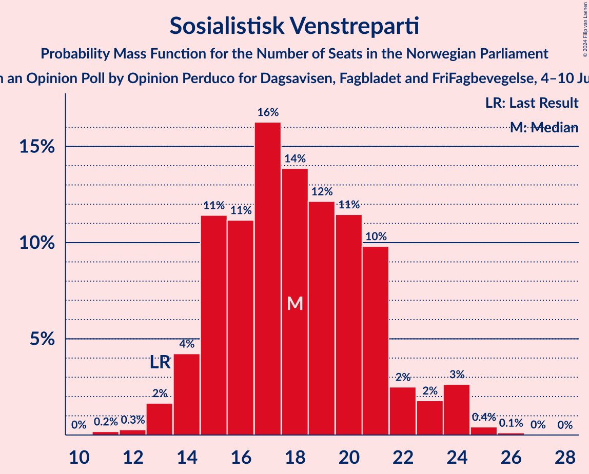
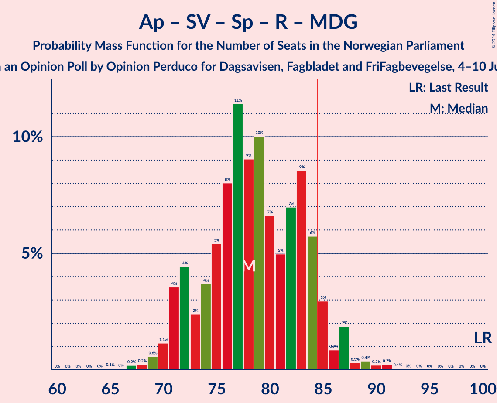

# Opinion Poll by Opinion Perduco for Dagsavisen, Fagbladet and FriFagbevegelse, 4–10 June 2024

<a href="#voting-intentions">Voting Intentions</a> | <a href="#seats">Seats</a> | <a href="#coalitions">Coalitions</a> | <a href="#technical-information">Technical Information</a>

## Voting Intentions

### Confidence Intervals

| Party | Last Result | Poll Result | 80% Confidence Interval | 90% Confidence Interval | 95% Confidence Interval | 99% Confidence Interval |
|:-----:|:-----------:|:-----------:|:-----------------------:|:-----------------------:|:-----------------------:|:-----------------------:|
| Arbeiderpartiet | 26.2% | 19.9% | 18.1–21.8% |17.6–22.4% |17.2–22.9% |16.3–23.9% |
| Høyre | 20.4% | 19.9% | 18.1–21.8% |17.6–22.4% |17.2–22.9% |16.3–23.9% |
| Fremskrittspartiet | 11.6% | 19.3% | 17.6–21.3% |17.1–21.8% |16.7–22.3% |15.9–23.3% |
| Sosialistisk Venstreparti | 7.6% | 10.8% | 9.5–12.4% |9.1–12.8% |8.8–13.2% |8.2–14.0% |
| Senterpartiet | 13.5% | 7.2% | 6.1–8.6% |5.8–8.9% |5.6–9.3% |5.1–10.0% |
| Venstre | 4.6% | 6.5% | 5.5–7.8% |5.2–8.2% |5.0–8.5% |4.5–9.2% |
| Rødt | 4.7% | 5.1% | 4.2–6.2% |3.9–6.6% |3.7–6.9% |3.3–7.5% |
| Miljøpartiet De Grønne | 3.9% | 3.6% | 2.9–4.6% |2.7–4.9% |2.5–5.2% |2.2–5.7% |
| Kristelig Folkeparti | 3.8% | 3.3% | 2.6–4.3% |2.4–4.6% |2.3–4.9% |2.0–5.4% |

*Note:* The poll result column reflects the actual value used in the calculations. Published results may vary slightly, and in addition be rounded to fewer digits.

## Seats

### Confidence Intervals

| Party | Last Result | Median | 80% Confidence Interval | 90% Confidence Interval | 95% Confidence Interval | 99% Confidence Interval |
|:-----:|:-----------:|:------:|:-----------------------:|:-----------------------:|:-----------------------:|:-----------------------:|
| <a href="#arbeiderpartiet">Arbeiderpartiet</a> | 48 | 36 | 33–39 |32–41 |32–42 |30–44 |
| <a href="#høyre">Høyre</a> | 36 | 34 | 31–38 |30–39 |29–40 |28–42 |
| <a href="#fremskrittspartiet">Fremskrittspartiet</a> | 21 | 36 | 32–39 |31–40 |30–41 |28–43 |
| <a href="#sosialistisk-venstreparti">Sosialistisk Venstreparti</a> | 13 | 18 | 15–21 |14–22 |14–24 |13–25 |
| <a href="#senterpartiet">Senterpartiet</a> | 28 | 12 | 11–14 |10–15 |9–15 |8–17 |
| <a href="#venstre">Venstre</a> | 8 | 10 | 9–13 |8–14 |8–14 |7–15 |
| <a href="#rødt">Rødt</a> | 8 | 8 | 6–10 |1–11 |1–12 |1–13 |
| <a href="#miljøpartiet-de-grønne">Miljøpartiet De Grønne</a> | 3 | 2 | 1–7 |1–8 |1–8 |1–9 |
| <a href="#kristelig-folkeparti">Kristelig Folkeparti</a> | 3 | 2 | 2–7 |1–7 |0–8 |0–9 |

### Arbeiderpartiet

*For a full overview of the results for this party, see the [Arbeiderpartiet](party-arbeiderpartiet.html) page.*

| Number of Seats | Probability | Accumulated | Special Marks |
|:---------------:|:-----------:|:-----------:|:-------------:|
| 29 | 0.1% | 100% |  |
| 30 | 0.7% | 99.9% |  |
| 31 | 1.4% | 99.2% |  |
| 32 | 5% | 98% |  |
| 33 | 7% | 93% |  |
| 34 | 7% | 87% |  |
| 35 | 13% | 80% |  |
| 36 | 20% | 66% | Median |
| 37 | 10% | 46% |  |
| 38 | 15% | 37% |  |
| 39 | 12% | 22% |  |
| 40 | 4% | 10% |  |
| 41 | 3% | 6% |  |
| 42 | 1.3% | 3% |  |
| 43 | 0.9% | 2% |  |
| 44 | 0.4% | 0.7% |  |
| 45 | 0.2% | 0.3% |  |
| 46 | 0.1% | 0.1% |  |
| 47 | 0% | 0% |  |
| 48 | 0% | 0% | Last Result |

### Høyre

*For a full overview of the results for this party, see the [Høyre](party-høyre.html) page.*

| Number of Seats | Probability | Accumulated | Special Marks |
|:---------------:|:-----------:|:-----------:|:-------------:|
| 25 | 0% | 100% |  |
| 26 | 0.1% | 99.9% |  |
| 27 | 0.3% | 99.9% |  |
| 28 | 0.3% | 99.6% |  |
| 29 | 2% | 99.3% |  |
| 30 | 2% | 97% |  |
| 31 | 5% | 95% |  |
| 32 | 13% | 89% |  |
| 33 | 13% | 76% |  |
| 34 | 15% | 62% | Median |
| 35 | 15% | 47% |  |
| 36 | 10% | 32% | Last Result |
| 37 | 6% | 22% |  |
| 38 | 7% | 16% |  |
| 39 | 5% | 8% |  |
| 40 | 2% | 3% |  |
| 41 | 0.6% | 1.2% |  |
| 42 | 0.4% | 0.6% |  |
| 43 | 0.1% | 0.2% |  |
| 44 | 0% | 0.1% |  |
| 45 | 0% | 0% |  |

### Fremskrittspartiet

*For a full overview of the results for this party, see the [Fremskrittspartiet](party-fremskrittspartiet.html) page.*

| Number of Seats | Probability | Accumulated | Special Marks |
|:---------------:|:-----------:|:-----------:|:-------------:|
| 21 | 0% | 100% | Last Result |
| 22 | 0% | 100% |  |
| 23 | 0% | 100% |  |
| 24 | 0% | 100% |  |
| 25 | 0% | 100% |  |
| 26 | 0.1% | 100% |  |
| 27 | 0.2% | 99.9% |  |
| 28 | 0.5% | 99.8% |  |
| 29 | 1.4% | 99.3% |  |
| 30 | 2% | 98% |  |
| 31 | 5% | 96% |  |
| 32 | 4% | 91% |  |
| 33 | 6% | 87% |  |
| 34 | 10% | 82% |  |
| 35 | 15% | 72% |  |
| 36 | 8% | 57% | Median |
| 37 | 16% | 49% |  |
| 38 | 13% | 33% |  |
| 39 | 12% | 20% |  |
| 40 | 4% | 9% |  |
| 41 | 2% | 4% |  |
| 42 | 1.4% | 2% |  |
| 43 | 0.6% | 0.7% |  |
| 44 | 0% | 0.1% |  |
| 45 | 0% | 0% |  |

### Sosialistisk Venstreparti

*For a full overview of the results for this party, see the [Sosialistisk Venstreparti](party-sosialistiskvenstreparti.html) page.*

| Number of Seats | Probability | Accumulated | Special Marks |
|:---------------:|:-----------:|:-----------:|:-------------:|
| 11 | 0.2% | 100% |  |
| 12 | 0.3% | 99.8% |  |
| 13 | 2% | 99.5% | Last Result |
| 14 | 4% | 98% |  |
| 15 | 11% | 94% |  |
| 16 | 11% | 82% |  |
| 17 | 16% | 71% |  |
| 18 | 14% | 55% | Median |
| 19 | 12% | 41% |  |
| 20 | 11% | 29% |  |
| 21 | 10% | 17% |  |
| 22 | 2% | 7% |  |
| 23 | 2% | 5% |  |
| 24 | 3% | 3% |  |
| 25 | 0.4% | 0.6% |  |
| 26 | 0.1% | 0.2% |  |
| 27 | 0% | 0% |  |

### Senterpartiet

*For a full overview of the results for this party, see the [Senterpartiet](party-senterpartiet.html) page.*

| Number of Seats | Probability | Accumulated | Special Marks |
|:---------------:|:-----------:|:-----------:|:-------------:|
| 7 | 0.2% | 100% |  |
| 8 | 1.1% | 99.7% |  |
| 9 | 3% | 98.6% |  |
| 10 | 5% | 95% |  |
| 11 | 17% | 91% |  |
| 12 | 26% | 73% | Median |
| 13 | 21% | 48% |  |
| 14 | 21% | 27% |  |
| 15 | 5% | 6% |  |
| 16 | 0.8% | 1.5% |  |
| 17 | 0.6% | 0.7% |  |
| 18 | 0.1% | 0.1% |  |
| 19 | 0% | 0.1% |  |
| 20 | 0% | 0% |  |
| 21 | 0% | 0% |  |
| 22 | 0% | 0% |  |
| 23 | 0% | 0% |  |
| 24 | 0% | 0% |  |
| 25 | 0% | 0% |  |
| 26 | 0% | 0% |  |
| 27 | 0% | 0% |  |
| 28 | 0% | 0% | Last Result |

### Venstre

*For a full overview of the results for this party, see the [Venstre](party-venstre.html) page.*

| Number of Seats | Probability | Accumulated | Special Marks |
|:---------------:|:-----------:|:-----------:|:-------------:|
| 3 | 0.1% | 100% |  |
| 4 | 0% | 99.9% |  |
| 5 | 0% | 99.9% |  |
| 6 | 0.1% | 99.9% |  |
| 7 | 1.3% | 99.8% |  |
| 8 | 7% | 98.6% | Last Result |
| 9 | 15% | 91% |  |
| 10 | 28% | 76% | Median |
| 11 | 18% | 48% |  |
| 12 | 15% | 31% |  |
| 13 | 11% | 16% |  |
| 14 | 3% | 5% |  |
| 15 | 1.3% | 2% |  |
| 16 | 0.2% | 0.3% |  |
| 17 | 0.1% | 0.1% |  |
| 18 | 0% | 0% |  |

### Rødt

*For a full overview of the results for this party, see the [Rødt](party-rødt.html) page.*

| Number of Seats | Probability | Accumulated | Special Marks |
|:---------------:|:-----------:|:-----------:|:-------------:|
| 1 | 8% | 100% |  |
| 2 | 0.1% | 92% |  |
| 3 | 0% | 92% |  |
| 4 | 0% | 92% |  |
| 5 | 0.1% | 92% |  |
| 6 | 4% | 92% |  |
| 7 | 17% | 88% |  |
| 8 | 28% | 71% | Last Result, Median |
| 9 | 24% | 43% |  |
| 10 | 10% | 19% |  |
| 11 | 6% | 9% |  |
| 12 | 2% | 3% |  |
| 13 | 0.7% | 0.7% |  |
| 14 | 0% | 0% |  |

### Miljøpartiet De Grønne

*For a full overview of the results for this party, see the [Miljøpartiet De Grønne](party-miljøpartietdegrønne.html) page.*

| Number of Seats | Probability | Accumulated | Special Marks |
|:---------------:|:-----------:|:-----------:|:-------------:|
| 1 | 17% | 100% |  |
| 2 | 36% | 83% | Median |
| 3 | 13% | 48% | Last Result |
| 4 | 0% | 35% |  |
| 5 | 0.1% | 35% |  |
| 6 | 9% | 35% |  |
| 7 | 17% | 26% |  |
| 8 | 7% | 9% |  |
| 9 | 1.2% | 1.5% |  |
| 10 | 0.3% | 0.3% |  |
| 11 | 0% | 0% |  |

### Kristelig Folkeparti

*For a full overview of the results for this party, see the [Kristelig Folkeparti](party-kristeligfolkeparti.html) page.*

| Number of Seats | Probability | Accumulated | Special Marks |
|:---------------:|:-----------:|:-----------:|:-------------:|
| 0 | 3% | 100% |  |
| 1 | 6% | 97% |  |
| 2 | 50% | 90% | Median |
| 3 | 19% | 41% | Last Result |
| 4 | 0% | 22% |  |
| 5 | 0% | 22% |  |
| 6 | 10% | 22% |  |
| 7 | 9% | 12% |  |
| 8 | 2% | 4% |  |
| 9 | 1.2% | 1.3% |  |
| 10 | 0.1% | 0.1% |  |
| 11 | 0% | 0% |  |

## Coalitions

### Confidence Intervals

| Coalition | Last Result | Median | Majority? | 80% Confidence Interval | 90% Confidence Interval | 95% Confidence Interval | 99% Confidence Interval |
|:---------:|:-----------:|:------:|:---------:|:-----------------------:|:-----------------------:|:-----------------------:|:-----------------------:|
| Høyre – Fremskrittspartiet – Senterpartiet – Venstre – Kristelig Folkeparti | 96 | 97 | 100% | 92–101 | 90–103 | 90–104 | 88–106 |
| Høyre – Fremskrittspartiet – Venstre – Miljøpartiet De Grønne – Kristelig Folkeparti | 71 | 88 | 72% | 82–93 | 81–95 | 81–96 | 79–99 |
| Høyre – Fremskrittspartiet – Venstre – Kristelig Folkeparti | 68 | 84 | 47% | 79–89 | 78–91 | 77–92 | 75–95 |
| Høyre – Fremskrittspartiet – Venstre | 65 | 81 | 16% | 76–86 | 75–88 | 74–89 | 73–91 |
| Arbeiderpartiet – Sosialistisk Venstreparti – Senterpartiet – Rødt – Miljøpartiet De Grønne | 100 | 78 | 7% | 72–84 | 71–85 | 71–87 | 68–90 |
| Arbeiderpartiet – Sosialistisk Venstreparti – Senterpartiet – Rødt | 97 | 75 | 1.0% | 69–80 | 68–82 | 67–83 | 64–85 |
| Arbeiderpartiet – Sosialistisk Venstreparti – Senterpartiet – Miljøpartiet De Grønne – Kristelig Folkeparti | 95 | 74 | 0.6% | 69–78 | 67–79 | 67–81 | 65–85 |
| Høyre – Fremskrittspartiet | 57 | 70 | 0% | 67–75 | 65–76 | 65–78 | 63–79 |
| Arbeiderpartiet – Sosialistisk Venstreparti – Senterpartiet – Miljøpartiet De Grønne | 92 | 71 | 0.1% | 65–75 | 64–76 | 63–78 | 62–81 |
| Arbeiderpartiet – Sosialistisk Venstreparti – Senterpartiet | 89 | 67 | 0% | 62–72 | 61–73 | 60–74 | 57–76 |
| Arbeiderpartiet – Sosialistisk Venstreparti – Rødt – Miljøpartiet De Grønne | 72 | 66 | 0% | 61–72 | 59–73 | 59–74 | 56–77 |
| Arbeiderpartiet – Senterpartiet – Miljøpartiet De Grønne – Kristelig Folkeparti | 82 | 55 | 0% | 51–61 | 49–62 | 48–63 | 46–66 |
| Arbeiderpartiet – Sosialistisk Venstreparti | 61 | 55 | 0% | 50–59 | 49–60 | 48–61 | 46–64 |
| Arbeiderpartiet – Senterpartiet – Kristelig Folkeparti | 79 | 52 | 0% | 48–56 | 46–58 | 45–59 | 43–61 |
| Høyre – Venstre – Kristelig Folkeparti | 47 | 48 | 0% | 44–53 | 43–54 | 41–56 | 41–59 |
| Arbeiderpartiet – Senterpartiet | 76 | 49 | 0% | 45–52 | 43–54 | 43–55 | 41–57 |
| Senterpartiet – Venstre – Kristelig Folkeparti | 39 | 26 | 0% | 23–30 | 21–31 | 21–33 | 19–35 |

### Høyre – Fremskrittspartiet – Senterpartiet – Venstre – Kristelig Folkeparti

| Number of Seats | Probability | Accumulated | Special Marks |
|:---------------:|:-----------:|:-----------:|:-------------:|
| 85 | 0% | 100% | Majority |
| 86 | 0.1% | 99.9% |  |
| 87 | 0.1% | 99.9% |  |
| 88 | 0.3% | 99.8% |  |
| 89 | 2% | 99.4% |  |
| 90 | 4% | 98% |  |
| 91 | 1.4% | 94% |  |
| 92 | 5% | 92% |  |
| 93 | 6% | 87% |  |
| 94 | 6% | 81% | Median |
| 95 | 8% | 75% |  |
| 96 | 16% | 66% | Last Result |
| 97 | 13% | 51% |  |
| 98 | 9% | 38% |  |
| 99 | 7% | 28% |  |
| 100 | 5% | 21% |  |
| 101 | 6% | 16% |  |
| 102 | 4% | 10% |  |
| 103 | 3% | 6% |  |
| 104 | 1.3% | 3% |  |
| 105 | 0.5% | 1.3% |  |
| 106 | 0.3% | 0.8% |  |
| 107 | 0.2% | 0.5% |  |
| 108 | 0.1% | 0.3% |  |
| 109 | 0.1% | 0.2% |  |
| 110 | 0.1% | 0.1% |  |
| 111 | 0% | 0% |  |

### Høyre – Fremskrittspartiet – Venstre – Miljøpartiet De Grønne – Kristelig Folkeparti

| Number of Seats | Probability | Accumulated | Special Marks |
|:---------------:|:-----------:|:-----------:|:-------------:|
| 71 | 0% | 100% | Last Result |
| 72 | 0% | 100% |  |
| 73 | 0% | 100% |  |
| 74 | 0% | 100% |  |
| 75 | 0% | 100% |  |
| 76 | 0% | 100% |  |
| 77 | 0.2% | 99.9% |  |
| 78 | 0.1% | 99.7% |  |
| 79 | 0.4% | 99.6% |  |
| 80 | 0.7% | 99.2% |  |
| 81 | 5% | 98.5% |  |
| 82 | 4% | 93% |  |
| 83 | 4% | 89% |  |
| 84 | 14% | 86% | Median |
| 85 | 7% | 72% | Majority |
| 86 | 5% | 65% |  |
| 87 | 6% | 59% |  |
| 88 | 6% | 53% |  |
| 89 | 6% | 47% |  |
| 90 | 6% | 41% |  |
| 91 | 10% | 35% |  |
| 92 | 10% | 25% |  |
| 93 | 7% | 14% |  |
| 94 | 2% | 7% |  |
| 95 | 2% | 5% |  |
| 96 | 1.3% | 3% |  |
| 97 | 1.0% | 2% |  |
| 98 | 0.5% | 1.0% |  |
| 99 | 0.2% | 0.5% |  |
| 100 | 0.1% | 0.3% |  |
| 101 | 0.1% | 0.2% |  |
| 102 | 0.1% | 0.1% |  |
| 103 | 0% | 0% |  |

### Høyre – Fremskrittspartiet – Venstre – Kristelig Folkeparti

| Number of Seats | Probability | Accumulated | Special Marks |
|:---------------:|:-----------:|:-----------:|:-------------:|
| 68 | 0% | 100% | Last Result |
| 69 | 0% | 100% |  |
| 70 | 0% | 100% |  |
| 71 | 0% | 100% |  |
| 72 | 0% | 100% |  |
| 73 | 0.1% | 100% |  |
| 74 | 0.1% | 99.9% |  |
| 75 | 0.7% | 99.8% |  |
| 76 | 0.4% | 99.2% |  |
| 77 | 2% | 98.7% |  |
| 78 | 5% | 97% |  |
| 79 | 5% | 92% |  |
| 80 | 4% | 87% |  |
| 81 | 7% | 82% |  |
| 82 | 8% | 75% | Median |
| 83 | 10% | 68% |  |
| 84 | 11% | 58% |  |
| 85 | 14% | 47% | Majority |
| 86 | 7% | 33% |  |
| 87 | 4% | 27% |  |
| 88 | 6% | 23% |  |
| 89 | 8% | 17% |  |
| 90 | 3% | 9% |  |
| 91 | 3% | 6% |  |
| 92 | 2% | 4% |  |
| 93 | 0.5% | 2% |  |
| 94 | 0.5% | 1.0% |  |
| 95 | 0.3% | 0.5% |  |
| 96 | 0.1% | 0.3% |  |
| 97 | 0.1% | 0.2% |  |
| 98 | 0% | 0.1% |  |
| 99 | 0% | 0% |  |

### Høyre – Fremskrittspartiet – Venstre

| Number of Seats | Probability | Accumulated | Special Marks |
|:---------------:|:-----------:|:-----------:|:-------------:|
| 65 | 0% | 100% | Last Result |
| 66 | 0% | 100% |  |
| 67 | 0% | 100% |  |
| 68 | 0% | 100% |  |
| 69 | 0% | 100% |  |
| 70 | 0.1% | 100% |  |
| 71 | 0.1% | 99.9% |  |
| 72 | 0.2% | 99.8% |  |
| 73 | 1.2% | 99.6% |  |
| 74 | 1.0% | 98% |  |
| 75 | 3% | 97% |  |
| 76 | 6% | 95% |  |
| 77 | 6% | 89% |  |
| 78 | 5% | 83% |  |
| 79 | 11% | 78% |  |
| 80 | 8% | 67% | Median |
| 81 | 14% | 59% |  |
| 82 | 12% | 45% |  |
| 83 | 9% | 33% |  |
| 84 | 8% | 24% |  |
| 85 | 5% | 16% | Majority |
| 86 | 4% | 11% |  |
| 87 | 2% | 8% |  |
| 88 | 2% | 5% |  |
| 89 | 2% | 4% |  |
| 90 | 1.3% | 2% |  |
| 91 | 0.6% | 1.0% |  |
| 92 | 0.2% | 0.4% |  |
| 93 | 0% | 0.2% |  |
| 94 | 0.1% | 0.1% |  |
| 95 | 0% | 0% |  |

### Arbeiderpartiet – Sosialistisk Venstreparti – Senterpartiet – Rødt – Miljøpartiet De Grønne

| Number of Seats | Probability | Accumulated | Special Marks |
|:---------------:|:-----------:|:-----------:|:-------------:|
| 65 | 0.1% | 100% |  |
| 66 | 0% | 99.9% |  |
| 67 | 0.2% | 99.9% |  |
| 68 | 0.2% | 99.7% |  |
| 69 | 0.6% | 99.4% |  |
| 70 | 1.1% | 98.9% |  |
| 71 | 4% | 98% |  |
| 72 | 4% | 94% |  |
| 73 | 2% | 90% |  |
| 74 | 4% | 87% |  |
| 75 | 5% | 84% |  |
| 76 | 8% | 78% | Median |
| 77 | 11% | 70% |  |
| 78 | 9% | 59% |  |
| 79 | 10% | 50% |  |
| 80 | 7% | 40% |  |
| 81 | 5% | 33% |  |
| 82 | 7% | 28% |  |
| 83 | 9% | 21% |  |
| 84 | 6% | 13% |  |
| 85 | 3% | 7% | Majority |
| 86 | 0.9% | 4% |  |
| 87 | 2% | 3% |  |
| 88 | 0.3% | 1.2% |  |
| 89 | 0.4% | 0.9% |  |
| 90 | 0.2% | 0.5% |  |
| 91 | 0.2% | 0.3% |  |
| 92 | 0.1% | 0.1% |  |
| 93 | 0% | 0% |  |
| 94 | 0% | 0% |  |
| 95 | 0% | 0% |  |
| 96 | 0% | 0% |  |
| 97 | 0% | 0% |  |
| 98 | 0% | 0% |  |
| 99 | 0% | 0% |  |
| 100 | 0% | 0% | Last Result |

### Arbeiderpartiet – Sosialistisk Venstreparti – Senterpartiet – Rødt

| Number of Seats | Probability | Accumulated | Special Marks |
|:---------------:|:-----------:|:-----------:|:-------------:|
| 62 | 0% | 100% |  |
| 63 | 0.3% | 99.9% |  |
| 64 | 0.2% | 99.7% |  |
| 65 | 0.7% | 99.5% |  |
| 66 | 0.7% | 98.7% |  |
| 67 | 2% | 98% |  |
| 68 | 3% | 96% |  |
| 69 | 5% | 93% |  |
| 70 | 9% | 89% |  |
| 71 | 6% | 80% |  |
| 72 | 5% | 74% |  |
| 73 | 7% | 69% |  |
| 74 | 6% | 62% | Median |
| 75 | 7% | 56% |  |
| 76 | 9% | 49% |  |
| 77 | 16% | 40% |  |
| 78 | 3% | 24% |  |
| 79 | 5% | 21% |  |
| 80 | 6% | 16% |  |
| 81 | 3% | 9% |  |
| 82 | 2% | 6% |  |
| 83 | 2% | 4% |  |
| 84 | 0.9% | 2% |  |
| 85 | 0.6% | 1.0% | Majority |
| 86 | 0.1% | 0.4% |  |
| 87 | 0.2% | 0.2% |  |
| 88 | 0% | 0.1% |  |
| 89 | 0% | 0% |  |
| 90 | 0% | 0% |  |
| 91 | 0% | 0% |  |
| 92 | 0% | 0% |  |
| 93 | 0% | 0% |  |
| 94 | 0% | 0% |  |
| 95 | 0% | 0% |  |
| 96 | 0% | 0% |  |
| 97 | 0% | 0% | Last Result |

### Arbeiderpartiet – Sosialistisk Venstreparti – Senterpartiet – Miljøpartiet De Grønne – Kristelig Folkeparti

| Number of Seats | Probability | Accumulated | Special Marks |
|:---------------:|:-----------:|:-----------:|:-------------:|
| 62 | 0% | 100% |  |
| 63 | 0.1% | 99.9% |  |
| 64 | 0.2% | 99.9% |  |
| 65 | 0.6% | 99.6% |  |
| 66 | 0.5% | 99.0% |  |
| 67 | 4% | 98.5% |  |
| 68 | 5% | 95% |  |
| 69 | 7% | 90% |  |
| 70 | 7% | 83% | Median |
| 71 | 8% | 77% |  |
| 72 | 5% | 68% |  |
| 73 | 9% | 64% |  |
| 74 | 4% | 54% |  |
| 75 | 12% | 50% |  |
| 76 | 13% | 37% |  |
| 77 | 10% | 25% |  |
| 78 | 8% | 15% |  |
| 79 | 2% | 7% |  |
| 80 | 2% | 5% |  |
| 81 | 1.0% | 3% |  |
| 82 | 0.5% | 2% |  |
| 83 | 0.2% | 1.1% |  |
| 84 | 0.3% | 0.9% |  |
| 85 | 0.3% | 0.6% | Majority |
| 86 | 0.1% | 0.3% |  |
| 87 | 0% | 0.2% |  |
| 88 | 0.1% | 0.1% |  |
| 89 | 0% | 0% |  |
| 90 | 0% | 0% |  |
| 91 | 0% | 0% |  |
| 92 | 0% | 0% |  |
| 93 | 0% | 0% |  |
| 94 | 0% | 0% |  |
| 95 | 0% | 0% | Last Result |

### Høyre – Fremskrittspartiet

| Number of Seats | Probability | Accumulated | Special Marks |
|:---------------:|:-----------:|:-----------:|:-------------:|
| 57 | 0% | 100% | Last Result |
| 58 | 0% | 100% |  |
| 59 | 0% | 100% |  |
| 60 | 0.1% | 100% |  |
| 61 | 0.1% | 99.9% |  |
| 62 | 0.3% | 99.8% |  |
| 63 | 0.7% | 99.6% |  |
| 64 | 1.2% | 98.8% |  |
| 65 | 3% | 98% |  |
| 66 | 4% | 94% |  |
| 67 | 12% | 90% |  |
| 68 | 7% | 78% |  |
| 69 | 13% | 71% |  |
| 70 | 9% | 58% | Median |
| 71 | 11% | 49% |  |
| 72 | 11% | 38% |  |
| 73 | 9% | 27% |  |
| 74 | 5% | 18% |  |
| 75 | 5% | 13% |  |
| 76 | 3% | 8% |  |
| 77 | 1.5% | 4% |  |
| 78 | 2% | 3% |  |
| 79 | 0.8% | 1.1% |  |
| 80 | 0.1% | 0.3% |  |
| 81 | 0.1% | 0.1% |  |
| 82 | 0% | 0% |  |

### Arbeiderpartiet – Sosialistisk Venstreparti – Senterpartiet – Miljøpartiet De Grønne

| Number of Seats | Probability | Accumulated | Special Marks |
|:---------------:|:-----------:|:-----------:|:-------------:|
| 59 | 0.1% | 100% |  |
| 60 | 0.1% | 99.9% |  |
| 61 | 0.2% | 99.8% |  |
| 62 | 0.7% | 99.6% |  |
| 63 | 3% | 98.9% |  |
| 64 | 3% | 96% |  |
| 65 | 3% | 93% |  |
| 66 | 5% | 90% |  |
| 67 | 6% | 85% |  |
| 68 | 6% | 79% | Median |
| 69 | 14% | 73% |  |
| 70 | 7% | 59% |  |
| 71 | 11% | 52% |  |
| 72 | 3% | 41% |  |
| 73 | 10% | 38% |  |
| 74 | 13% | 28% |  |
| 75 | 6% | 15% |  |
| 76 | 5% | 9% |  |
| 77 | 2% | 5% |  |
| 78 | 1.3% | 3% |  |
| 79 | 0.4% | 1.3% |  |
| 80 | 0.3% | 0.9% |  |
| 81 | 0.2% | 0.5% |  |
| 82 | 0.2% | 0.3% |  |
| 83 | 0.1% | 0.2% |  |
| 84 | 0% | 0.1% |  |
| 85 | 0% | 0.1% | Majority |
| 86 | 0% | 0% |  |
| 87 | 0% | 0% |  |
| 88 | 0% | 0% |  |
| 89 | 0% | 0% |  |
| 90 | 0% | 0% |  |
| 91 | 0% | 0% |  |
| 92 | 0% | 0% | Last Result |

### Arbeiderpartiet – Sosialistisk Venstreparti – Senterpartiet

| Number of Seats | Probability | Accumulated | Special Marks |
|:---------------:|:-----------:|:-----------:|:-------------:|
| 56 | 0% | 100% |  |
| 57 | 0.4% | 99.9% |  |
| 58 | 0.3% | 99.5% |  |
| 59 | 0.8% | 99.2% |  |
| 60 | 2% | 98% |  |
| 61 | 4% | 97% |  |
| 62 | 5% | 92% |  |
| 63 | 9% | 87% |  |
| 64 | 8% | 78% |  |
| 65 | 4% | 70% |  |
| 66 | 11% | 66% | Median |
| 67 | 12% | 56% |  |
| 68 | 8% | 44% |  |
| 69 | 10% | 36% |  |
| 70 | 6% | 26% |  |
| 71 | 8% | 20% |  |
| 72 | 6% | 12% |  |
| 73 | 2% | 5% |  |
| 74 | 1.0% | 3% |  |
| 75 | 1.0% | 2% |  |
| 76 | 0.7% | 1.0% |  |
| 77 | 0.1% | 0.4% |  |
| 78 | 0.2% | 0.3% |  |
| 79 | 0% | 0.1% |  |
| 80 | 0% | 0% |  |
| 81 | 0% | 0% |  |
| 82 | 0% | 0% |  |
| 83 | 0% | 0% |  |
| 84 | 0% | 0% |  |
| 85 | 0% | 0% | Majority |
| 86 | 0% | 0% |  |
| 87 | 0% | 0% |  |
| 88 | 0% | 0% |  |
| 89 | 0% | 0% | Last Result |

### Arbeiderpartiet – Sosialistisk Venstreparti – Rødt – Miljøpartiet De Grønne

| Number of Seats | Probability | Accumulated | Special Marks |
|:---------------:|:-----------:|:-----------:|:-------------:|
| 54 | 0.1% | 100% |  |
| 55 | 0.1% | 99.9% |  |
| 56 | 0.3% | 99.7% |  |
| 57 | 0.6% | 99.5% |  |
| 58 | 1.3% | 98.9% |  |
| 59 | 3% | 98% |  |
| 60 | 2% | 95% |  |
| 61 | 7% | 93% |  |
| 62 | 5% | 86% |  |
| 63 | 4% | 80% |  |
| 64 | 9% | 77% | Median |
| 65 | 16% | 68% |  |
| 66 | 8% | 51% |  |
| 67 | 8% | 43% |  |
| 68 | 6% | 35% |  |
| 69 | 7% | 29% |  |
| 70 | 5% | 22% |  |
| 71 | 7% | 18% |  |
| 72 | 4% | 11% | Last Result |
| 73 | 4% | 7% |  |
| 74 | 1.5% | 3% |  |
| 75 | 0.4% | 1.4% |  |
| 76 | 0.4% | 1.0% |  |
| 77 | 0.2% | 0.6% |  |
| 78 | 0.2% | 0.4% |  |
| 79 | 0.1% | 0.2% |  |
| 80 | 0.1% | 0.1% |  |
| 81 | 0% | 0% |  |

### Arbeiderpartiet – Senterpartiet – Miljøpartiet De Grønne – Kristelig Folkeparti

| Number of Seats | Probability | Accumulated | Special Marks |
|:---------------:|:-----------:|:-----------:|:-------------:|
| 44 | 0.1% | 100% |  |
| 45 | 0.1% | 99.9% |  |
| 46 | 0.4% | 99.8% |  |
| 47 | 1.0% | 99.4% |  |
| 48 | 3% | 98% |  |
| 49 | 2% | 96% |  |
| 50 | 3% | 94% |  |
| 51 | 4% | 91% |  |
| 52 | 7% | 87% | Median |
| 53 | 8% | 80% |  |
| 54 | 8% | 72% |  |
| 55 | 16% | 65% |  |
| 56 | 11% | 49% |  |
| 57 | 5% | 38% |  |
| 58 | 6% | 33% |  |
| 59 | 11% | 28% |  |
| 60 | 7% | 17% |  |
| 61 | 5% | 11% |  |
| 62 | 3% | 6% |  |
| 63 | 1.1% | 3% |  |
| 64 | 0.6% | 2% |  |
| 65 | 0.6% | 1.4% |  |
| 66 | 0.4% | 0.7% |  |
| 67 | 0.2% | 0.3% |  |
| 68 | 0% | 0.1% |  |
| 69 | 0% | 0.1% |  |
| 70 | 0% | 0% |  |
| 71 | 0% | 0% |  |
| 72 | 0% | 0% |  |
| 73 | 0% | 0% |  |
| 74 | 0% | 0% |  |
| 75 | 0% | 0% |  |
| 76 | 0% | 0% |  |
| 77 | 0% | 0% |  |
| 78 | 0% | 0% |  |
| 79 | 0% | 0% |  |
| 80 | 0% | 0% |  |
| 81 | 0% | 0% |  |
| 82 | 0% | 0% | Last Result |

### Arbeiderpartiet – Sosialistisk Venstreparti

| Number of Seats | Probability | Accumulated | Special Marks |
|:---------------:|:-----------:|:-----------:|:-------------:|
| 45 | 0% | 100% |  |
| 46 | 0.5% | 99.9% |  |
| 47 | 0.9% | 99.4% |  |
| 48 | 2% | 98.5% |  |
| 49 | 4% | 96% |  |
| 50 | 5% | 93% |  |
| 51 | 8% | 88% |  |
| 52 | 9% | 79% |  |
| 53 | 9% | 70% |  |
| 54 | 10% | 62% | Median |
| 55 | 12% | 51% |  |
| 56 | 13% | 40% |  |
| 57 | 7% | 27% |  |
| 58 | 4% | 20% |  |
| 59 | 10% | 16% |  |
| 60 | 3% | 6% |  |
| 61 | 0.7% | 3% | Last Result |
| 62 | 1.2% | 2% |  |
| 63 | 0.6% | 1.2% |  |
| 64 | 0.3% | 0.6% |  |
| 65 | 0.2% | 0.3% |  |
| 66 | 0.1% | 0.1% |  |
| 67 | 0% | 0% |  |

### Arbeiderpartiet – Senterpartiet – Kristelig Folkeparti

| Number of Seats | Probability | Accumulated | Special Marks |
|:---------------:|:-----------:|:-----------:|:-------------:|
| 42 | 0.3% | 100% |  |
| 43 | 0.2% | 99.7% |  |
| 44 | 0.5% | 99.5% |  |
| 45 | 2% | 99.0% |  |
| 46 | 3% | 97% |  |
| 47 | 2% | 94% |  |
| 48 | 8% | 91% |  |
| 49 | 4% | 83% |  |
| 50 | 10% | 79% | Median |
| 51 | 9% | 69% |  |
| 52 | 17% | 60% |  |
| 53 | 11% | 43% |  |
| 54 | 12% | 32% |  |
| 55 | 6% | 20% |  |
| 56 | 4% | 13% |  |
| 57 | 4% | 9% |  |
| 58 | 2% | 6% |  |
| 59 | 2% | 3% |  |
| 60 | 0.8% | 1.4% |  |
| 61 | 0.3% | 0.7% |  |
| 62 | 0.1% | 0.4% |  |
| 63 | 0.1% | 0.3% |  |
| 64 | 0.1% | 0.2% |  |
| 65 | 0% | 0% |  |
| 66 | 0% | 0% |  |
| 67 | 0% | 0% |  |
| 68 | 0% | 0% |  |
| 69 | 0% | 0% |  |
| 70 | 0% | 0% |  |
| 71 | 0% | 0% |  |
| 72 | 0% | 0% |  |
| 73 | 0% | 0% |  |
| 74 | 0% | 0% |  |
| 75 | 0% | 0% |  |
| 76 | 0% | 0% |  |
| 77 | 0% | 0% |  |
| 78 | 0% | 0% |  |
| 79 | 0% | 0% | Last Result |

### Høyre – Venstre – Kristelig Folkeparti

| Number of Seats | Probability | Accumulated | Special Marks |
|:---------------:|:-----------:|:-----------:|:-------------:|
| 37 | 0% | 100% |  |
| 38 | 0% | 99.9% |  |
| 39 | 0.2% | 99.9% |  |
| 40 | 0.2% | 99.7% |  |
| 41 | 3% | 99.5% |  |
| 42 | 0.8% | 97% |  |
| 43 | 4% | 96% |  |
| 44 | 8% | 92% |  |
| 45 | 6% | 84% |  |
| 46 | 11% | 78% | Median |
| 47 | 10% | 67% | Last Result |
| 48 | 10% | 57% |  |
| 49 | 8% | 47% |  |
| 50 | 14% | 40% |  |
| 51 | 8% | 25% |  |
| 52 | 6% | 17% |  |
| 53 | 5% | 11% |  |
| 54 | 2% | 6% |  |
| 55 | 1.2% | 4% |  |
| 56 | 0.8% | 3% |  |
| 57 | 0.5% | 2% |  |
| 58 | 0.4% | 1.3% |  |
| 59 | 0.5% | 0.9% |  |
| 60 | 0.3% | 0.4% |  |
| 61 | 0% | 0.1% |  |
| 62 | 0% | 0% |  |

### Arbeiderpartiet – Senterpartiet

| Number of Seats | Probability | Accumulated | Special Marks |
|:---------------:|:-----------:|:-----------:|:-------------:|
| 40 | 0.1% | 100% |  |
| 41 | 0.5% | 99.9% |  |
| 42 | 1.3% | 99.4% |  |
| 43 | 3% | 98% |  |
| 44 | 3% | 95% |  |
| 45 | 7% | 92% |  |
| 46 | 7% | 85% |  |
| 47 | 7% | 78% |  |
| 48 | 15% | 71% | Median |
| 49 | 11% | 56% |  |
| 50 | 17% | 46% |  |
| 51 | 9% | 29% |  |
| 52 | 11% | 20% |  |
| 53 | 4% | 9% |  |
| 54 | 2% | 5% |  |
| 55 | 1.0% | 3% |  |
| 56 | 1.3% | 2% |  |
| 57 | 0.5% | 0.7% |  |
| 58 | 0.1% | 0.2% |  |
| 59 | 0.1% | 0.1% |  |
| 60 | 0% | 0% |  |
| 61 | 0% | 0% |  |
| 62 | 0% | 0% |  |
| 63 | 0% | 0% |  |
| 64 | 0% | 0% |  |
| 65 | 0% | 0% |  |
| 66 | 0% | 0% |  |
| 67 | 0% | 0% |  |
| 68 | 0% | 0% |  |
| 69 | 0% | 0% |  |
| 70 | 0% | 0% |  |
| 71 | 0% | 0% |  |
| 72 | 0% | 0% |  |
| 73 | 0% | 0% |  |
| 74 | 0% | 0% |  |
| 75 | 0% | 0% |  |
| 76 | 0% | 0% | Last Result |

### Senterpartiet – Venstre – Kristelig Folkeparti

| Number of Seats | Probability | Accumulated | Special Marks |
|:---------------:|:-----------:|:-----------:|:-------------:|
| 17 | 0.1% | 100% |  |
| 18 | 0.3% | 99.9% |  |
| 19 | 0.8% | 99.6% |  |
| 20 | 1.3% | 98.8% |  |
| 21 | 3% | 98% |  |
| 22 | 4% | 94% |  |
| 23 | 9% | 90% |  |
| 24 | 10% | 81% | Median |
| 25 | 15% | 71% |  |
| 26 | 9% | 56% |  |
| 27 | 13% | 47% |  |
| 28 | 14% | 34% |  |
| 29 | 8% | 20% |  |
| 30 | 4% | 12% |  |
| 31 | 4% | 8% |  |
| 32 | 2% | 4% |  |
| 33 | 2% | 3% |  |
| 34 | 0.4% | 0.9% |  |
| 35 | 0.2% | 0.5% |  |
| 36 | 0.2% | 0.3% |  |
| 37 | 0% | 0.1% |  |
| 38 | 0% | 0% |  |
| 39 | 0% | 0% | Last Result |

## Technical Information

### Opinion Poll

+ **Polling firm:** Opinion Perduco
+ **Commissioner(s):** Dagsavisen, Fagbladet and FriFagbevegelse
+ **Fieldwork period:** 4–10 June 2024

### Calculations

+ **Sample size:** 750
+ **Simulations done:** 1,048,576
+ **Error estimate:** 1.63%

