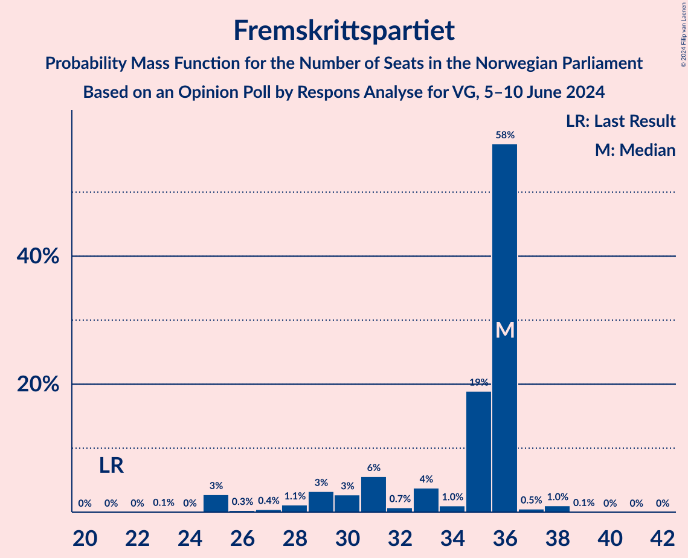
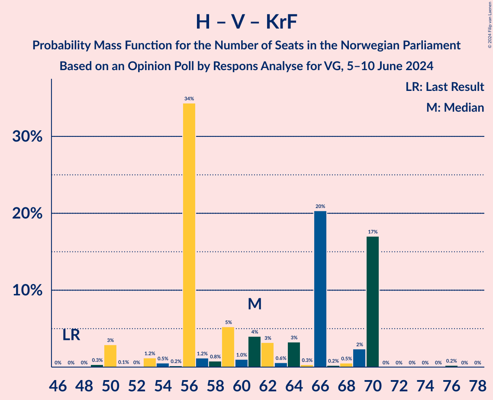

# Opinion Poll by Respons Analyse for VG, 5–10 June 2024

<a href="#voting-intentions">Voting Intentions</a> | <a href="#seats">Seats</a> | <a href="#coalitions">Coalitions</a> | <a href="#technical-information">Technical Information</a>

## Voting Intentions

### Confidence Intervals

| Party | Last Result | Poll Result | 80% Confidence Interval | 90% Confidence Interval | 95% Confidence Interval | 99% Confidence Interval |
|:-----:|:-----------:|:-----------:|:-----------------------:|:-----------------------:|:-----------------------:|:-----------------------:|
| Høyre | 20.4% | 26.2% | 24.2–28.3% |23.6–28.9% |23.1–29.5% |22.2–30.5% |
| Arbeiderpartiet | 26.2% | 19.9% | 18.1–21.9% |17.6–22.4% |17.1–22.9% |16.3–23.9% |
| Fremskrittspartiet | 11.6% | 17.5% | 15.8–19.4% |15.3–20.0% |14.9–20.5% |14.2–21.4% |
| Sosialistisk Venstreparti | 7.6% | 8.5% | 7.3–10.0% |7.0–10.4% |6.7–10.7% |6.1–11.5% |
| Senterpartiet | 13.5% | 7.5% | 6.4–8.9% |6.1–9.3% |5.8–9.7% |5.3–10.4% |
| Venstre | 4.6% | 5.9% | 4.9–7.2% |4.6–7.5% |4.4–7.8% |4.0–8.5% |
| Rødt | 4.7% | 5.5% | 4.5–6.7% |4.3–7.1% |4.1–7.4% |3.6–8.0% |
| Kristelig Folkeparti | 3.8% | 3.7% | 2.9–4.8% |2.7–5.1% |2.5–5.3% |2.2–5.9% |
| Miljøpartiet De Grønne | 3.9% | 3.0% | 2.3–4.0% |2.1–4.3% |2.0–4.5% |1.7–5.0% |
| Industri- og Næringspartiet | 0.3% | 0.5% | 0.3–1.1% |0.3–1.2% |0.2–1.4% |0.1–1.7% |
| Norgesdemokratene | 1.1% | 0.3% | 0.1–0.7% |0.1–0.9% |0.1–1.0% |0.0–1.3% |
| Pensjonistpartiet | 0.6% | 0.3% | 0.1–0.7% |0.1–0.9% |0.1–1.0% |0.0–1.3% |
| Liberalistene | 0.2% | 0.1% | 0.1–0.5% |0.0–0.7% |0.0–0.8% |0.0–1.0% |
| Konservativt | 0.4% | 0.1% | 0.1–0.5% |0.0–0.7% |0.0–0.8% |0.0–1.0% |

*Note:* The poll result column reflects the actual value used in the calculations. Published results may vary slightly, and in addition be rounded to fewer digits.

## Seats

### Confidence Intervals

| Party | Last Result | Median | 80% Confidence Interval | 90% Confidence Interval | 95% Confidence Interval | 99% Confidence Interval |
|:-----:|:-----------:|:------:|:-----------------------:|:-----------------------:|:-----------------------:|:-----------------------:|
| <a href="#høyre">Høyre</a> | 36 | 46 | 44–54 |42–54 |38–54 |38–55 |
| <a href="#arbeiderpartiet">Arbeiderpartiet</a> | 48 | 35 | 31–38 |31–41 |31–43 |28–45 |
| <a href="#fremskrittspartiet">Fremskrittspartiet</a> | 21 | 36 | 30–36 |29–36 |25–36 |25–38 |
| <a href="#sosialistisk-venstreparti">Sosialistisk Venstreparti</a> | 13 | 15 | 11–18 |11–18 |11–19 |10–20 |
| <a href="#senterpartiet">Senterpartiet</a> | 28 | 11 | 10–13 |10–15 |9–16 |9–18 |
| <a href="#venstre">Venstre</a> | 8 | 9 | 9–11 |9–12 |8–12 |7–14 |
| <a href="#rødt">Rødt</a> | 8 | 9 | 7–11 |7–11 |7–12 |1–14 |
| <a href="#kristelig-folkeparti">Kristelig Folkeparti</a> | 3 | 3 | 2–9 |2–9 |1–10 |1–11 |
| <a href="#miljøpartiet-de-grønne">Miljøpartiet De Grønne</a> | 3 | 1 | 1–2 |1–7 |1–8 |1–8 |
| <a href="#industri--og-næringspartiet">Industri- og Næringspartiet</a> | 0 | 0 | 0 |0 |0 |0 |
| <a href="#norgesdemokratene">Norgesdemokratene</a> | 0 | 0 | 0 |0 |0 |0 |
| <a href="#pensjonistpartiet">Pensjonistpartiet</a> | 0 | 0 | 0 |0 |0 |0 |
| <a href="#liberalistene">Liberalistene</a> | 0 | 0 | 0 |0 |0 |0 |
| <a href="#konservativt">Konservativt</a> | 0 | 0 | 0 |0 |0 |0 |

### Høyre

*For a full overview of the results for this party, see the [Høyre](party-høyre.html) page.*

| Number of Seats | Probability | Accumulated | Special Marks |
|:---------------:|:-----------:|:-----------:|:-------------:|
| 36 | 0.1% | 100% | Last Result |
| 37 | 0.2% | 99.9% |  |
| 38 | 3% | 99.7% |  |
| 39 | 0.1% | 97% |  |
| 40 | 0.4% | 97% |  |
| 41 | 1.1% | 96% |  |
| 42 | 1.4% | 95% |  |
| 43 | 1.5% | 94% |  |
| 44 | 4% | 92% |  |
| 45 | 34% | 88% |  |
| 46 | 27% | 54% | Median |
| 47 | 3% | 28% |  |
| 48 | 3% | 25% |  |
| 49 | 1.1% | 21% |  |
| 50 | 2% | 20% |  |
| 51 | 0.1% | 19% |  |
| 52 | 0.3% | 19% |  |
| 53 | 0.3% | 18% |  |
| 54 | 17% | 18% |  |
| 55 | 0.7% | 0.7% |  |
| 56 | 0% | 0% |  |

### Arbeiderpartiet

*For a full overview of the results for this party, see the [Arbeiderpartiet](party-arbeiderpartiet.html) page.*

| Number of Seats | Probability | Accumulated | Special Marks |
|:---------------:|:-----------:|:-----------:|:-------------:|
| 28 | 0.6% | 100% |  |
| 29 | 0.6% | 99.4% |  |
| 30 | 0.4% | 98.8% |  |
| 31 | 21% | 98% |  |
| 32 | 2% | 78% |  |
| 33 | 20% | 75% |  |
| 34 | 0.8% | 55% |  |
| 35 | 4% | 54% | Median |
| 36 | 3% | 50% |  |
| 37 | 4% | 47% |  |
| 38 | 36% | 43% |  |
| 39 | 0.8% | 8% |  |
| 40 | 1.1% | 7% |  |
| 41 | 1.5% | 6% |  |
| 42 | 0.2% | 4% |  |
| 43 | 3% | 4% |  |
| 44 | 0.2% | 0.8% |  |
| 45 | 0.5% | 0.6% |  |
| 46 | 0.1% | 0.1% |  |
| 47 | 0% | 0% |  |
| 48 | 0% | 0% | Last Result |

### Fremskrittspartiet

*For a full overview of the results for this party, see the [Fremskrittspartiet](party-fremskrittspartiet.html) page.*

| Number of Seats | Probability | Accumulated | Special Marks |
|:---------------:|:-----------:|:-----------:|:-------------:|
| 21 | 0% | 100% | Last Result |
| 22 | 0% | 100% |  |
| 23 | 0.1% | 100% |  |
| 24 | 0% | 99.8% |  |
| 25 | 3% | 99.8% |  |
| 26 | 0.3% | 97% |  |
| 27 | 0.4% | 97% |  |
| 28 | 1.1% | 96% |  |
| 29 | 3% | 95% |  |
| 30 | 3% | 92% |  |
| 31 | 6% | 89% |  |
| 32 | 0.7% | 84% |  |
| 33 | 4% | 83% |  |
| 34 | 1.0% | 79% |  |
| 35 | 19% | 78% |  |
| 36 | 58% | 59% | Median |
| 37 | 0.5% | 2% |  |
| 38 | 1.0% | 1.2% |  |
| 39 | 0.1% | 0.2% |  |
| 40 | 0% | 0.1% |  |
| 41 | 0% | 0% |  |

### Sosialistisk Venstreparti

*For a full overview of the results for this party, see the [Sosialistisk Venstreparti](party-sosialistiskvenstreparti.html) page.*

| Number of Seats | Probability | Accumulated | Special Marks |
|:---------------:|:-----------:|:-----------:|:-------------:|
| 10 | 0.5% | 100% |  |
| 11 | 21% | 99.5% |  |
| 12 | 2% | 78% |  |
| 13 | 24% | 76% | Last Result |
| 14 | 2% | 52% |  |
| 15 | 3% | 50% | Median |
| 16 | 35% | 47% |  |
| 17 | 2% | 12% |  |
| 18 | 7% | 11% |  |
| 19 | 3% | 4% |  |
| 20 | 0.6% | 0.9% |  |
| 21 | 0.2% | 0.2% |  |
| 22 | 0.1% | 0.1% |  |
| 23 | 0% | 0% |  |

### Senterpartiet

*For a full overview of the results for this party, see the [Senterpartiet](party-senterpartiet.html) page.*

| Number of Seats | Probability | Accumulated | Special Marks |
|:---------------:|:-----------:|:-----------:|:-------------:|
| 8 | 0.3% | 100% |  |
| 9 | 4% | 99.7% |  |
| 10 | 34% | 96% |  |
| 11 | 20% | 61% | Median |
| 12 | 21% | 41% |  |
| 13 | 11% | 21% |  |
| 14 | 4% | 10% |  |
| 15 | 3% | 5% |  |
| 16 | 2% | 3% |  |
| 17 | 0.6% | 1.1% |  |
| 18 | 0.2% | 0.5% |  |
| 19 | 0.2% | 0.3% |  |
| 20 | 0.1% | 0.1% |  |
| 21 | 0% | 0% |  |
| 22 | 0% | 0% |  |
| 23 | 0% | 0% |  |
| 24 | 0% | 0% |  |
| 25 | 0% | 0% |  |
| 26 | 0% | 0% |  |
| 27 | 0% | 0% |  |
| 28 | 0% | 0% | Last Result |

### Venstre

*For a full overview of the results for this party, see the [Venstre](party-venstre.html) page.*

| Number of Seats | Probability | Accumulated | Special Marks |
|:---------------:|:-----------:|:-----------:|:-------------:|
| 3 | 0.2% | 100% |  |
| 4 | 0% | 99.8% |  |
| 5 | 0% | 99.8% |  |
| 6 | 0% | 99.8% |  |
| 7 | 0.8% | 99.8% |  |
| 8 | 4% | 99.0% | Last Result |
| 9 | 53% | 95% | Median |
| 10 | 9% | 43% |  |
| 11 | 27% | 33% |  |
| 12 | 4% | 6% |  |
| 13 | 0.8% | 2% |  |
| 14 | 1.0% | 1.4% |  |
| 15 | 0% | 0.4% |  |
| 16 | 0.4% | 0.4% |  |
| 17 | 0% | 0% |  |

### Rødt

*For a full overview of the results for this party, see the [Rødt](party-rødt.html) page.*

| Number of Seats | Probability | Accumulated | Special Marks |
|:---------------:|:-----------:|:-----------:|:-------------:|
| 1 | 1.0% | 100% |  |
| 2 | 0% | 99.0% |  |
| 3 | 0% | 99.0% |  |
| 4 | 0% | 99.0% |  |
| 5 | 0% | 99.0% |  |
| 6 | 0% | 99.0% |  |
| 7 | 18% | 99.0% |  |
| 8 | 29% | 81% | Last Result |
| 9 | 4% | 52% | Median |
| 10 | 2% | 48% |  |
| 11 | 41% | 45% |  |
| 12 | 2% | 4% |  |
| 13 | 0.7% | 2% |  |
| 14 | 1.4% | 2% |  |
| 15 | 0.2% | 0.2% |  |
| 16 | 0% | 0% |  |

### Kristelig Folkeparti

*For a full overview of the results for this party, see the [Kristelig Folkeparti](party-kristeligfolkeparti.html) page.*

| Number of Seats | Probability | Accumulated | Special Marks |
|:---------------:|:-----------:|:-----------:|:-------------:|
| 0 | 0.3% | 100% |  |
| 1 | 3% | 99.7% |  |
| 2 | 46% | 97% |  |
| 3 | 2% | 51% | Last Result, Median |
| 4 | 0% | 48% |  |
| 5 | 0% | 48% |  |
| 6 | 0.1% | 48% |  |
| 7 | 21% | 48% |  |
| 8 | 3% | 27% |  |
| 9 | 21% | 24% |  |
| 10 | 2% | 3% |  |
| 11 | 2% | 2% |  |
| 12 | 0% | 0% |  |

### Miljøpartiet De Grønne

*For a full overview of the results for this party, see the [Miljøpartiet De Grønne](party-miljøpartietdegrønne.html) page.*

| Number of Seats | Probability | Accumulated | Special Marks |
|:---------------:|:-----------:|:-----------:|:-------------:|
| 0 | 0.3% | 100% |  |
| 1 | 65% | 99.7% | Median |
| 2 | 28% | 35% |  |
| 3 | 1.4% | 8% | Last Result |
| 4 | 0% | 6% |  |
| 5 | 0% | 6% |  |
| 6 | 0.6% | 6% |  |
| 7 | 2% | 6% |  |
| 8 | 3% | 4% |  |
| 9 | 0.1% | 0.3% |  |
| 10 | 0.2% | 0.2% |  |
| 11 | 0% | 0% |  |

### Industri- og Næringspartiet

*For a full overview of the results for this party, see the [Industri- og Næringspartiet](party-industri-ognæringspartiet.html) page.*

| Number of Seats | Probability | Accumulated | Special Marks |
|:---------------:|:-----------:|:-----------:|:-------------:|
| 0 | 100% | 100% | Last Result, Median |

### Norgesdemokratene

*For a full overview of the results for this party, see the [Norgesdemokratene](party-norgesdemokratene.html) page.*

| Number of Seats | Probability | Accumulated | Special Marks |
|:---------------:|:-----------:|:-----------:|:-------------:|
| 0 | 100% | 100% | Last Result, Median |

### Pensjonistpartiet

*For a full overview of the results for this party, see the [Pensjonistpartiet](party-pensjonistpartiet.html) page.*

| Number of Seats | Probability | Accumulated | Special Marks |
|:---------------:|:-----------:|:-----------:|:-------------:|
| 0 | 100% | 100% | Last Result, Median |

### Liberalistene

*For a full overview of the results for this party, see the [Liberalistene](party-liberalistene.html) page.*

| Number of Seats | Probability | Accumulated | Special Marks |
|:---------------:|:-----------:|:-----------:|:-------------:|
| 0 | 100% | 100% | Last Result, Median |

### Konservativt

*For a full overview of the results for this party, see the [Konservativt](party-konservativt.html) page.*

| Number of Seats | Probability | Accumulated | Special Marks |
|:---------------:|:-----------:|:-----------:|:-------------:|
| 0 | 100% | 100% | Last Result, Median |

## Coalitions

### Confidence Intervals

| Coalition | Last Result | Median | Majority? | 80% Confidence Interval | 90% Confidence Interval | 95% Confidence Interval | 99% Confidence Interval |
|:---------:|:-----------:|:------:|:---------:|:-----------------------:|:-----------------------:|:-----------------------:|:-----------------------:|
| Høyre – Fremskrittspartiet – Senterpartiet – Venstre – Kristelig Folkeparti | 96 | 104 | 100% | 102–116 | 100–116 | 99–116 | 97–116 |
| Høyre – Fremskrittspartiet – Venstre – Kristelig Folkeparti – Miljøpartiet De Grønne | 71 | 94 | 99.6% | 91–106 | 87–106 | 87–106 | 86–106 |
| Høyre – Fremskrittspartiet – Venstre – Kristelig Folkeparti | 68 | 92 | 99.2% | 90–105 | 86–105 | 86–105 | 82–105 |
| Høyre – Fremskrittspartiet – Venstre | 65 | 90 | 92% | 85–98 | 84–98 | 84–98 | 80–98 |
| Høyre – Fremskrittspartiet | 57 | 81 | 18% | 75–89 | 74–89 | 73–89 | 69–89 |
| Arbeiderpartiet – Sosialistisk Venstreparti – Senterpartiet – Rødt – Miljøpartiet De Grønne | 100 | 76 | 0.6% | 63–78 | 63–82 | 63–83 | 63–86 |
| Arbeiderpartiet – Sosialistisk Venstreparti – Senterpartiet – Rødt | 97 | 74 | 0.3% | 62–77 | 62–81 | 62–82 | 62–82 |
| Arbeiderpartiet – Sosialistisk Venstreparti – Senterpartiet – Kristelig Folkeparti – Miljøpartiet De Grønne | 95 | 67 | 0% | 63–72 | 63–76 | 63–77 | 63–80 |
| Arbeiderpartiet – Sosialistisk Venstreparti – Senterpartiet – Miljøpartiet De Grønne | 92 | 65 | 0% | 56–69 | 56–72 | 56–75 | 56–75 |
| Arbeiderpartiet – Sosialistisk Venstreparti – Senterpartiet | 89 | 63 | 0% | 55–66 | 55–70 | 55–74 | 54–74 |
| Arbeiderpartiet – Sosialistisk Venstreparti – Rødt – Miljøpartiet De Grønne | 72 | 64 | 0% | 52–66 | 52–68 | 52–70 | 52–71 |
| Høyre – Venstre – Kristelig Folkeparti | 47 | 61 | 0% | 56–70 | 54–70 | 50–70 | 50–70 |
| Arbeiderpartiet – Senterpartiet – Kristelig Folkeparti – Miljøpartiet De Grønne | 82 | 52 | 0% | 51–59 | 51–61 | 51–62 | 48–69 |
| Arbeiderpartiet – Sosialistisk Venstreparti | 61 | 51 | 0% | 44–54 | 44–56 | 44–61 | 42–61 |
| Arbeiderpartiet – Senterpartiet – Kristelig Folkeparti | 79 | 51 | 0% | 50–56 | 49–58 | 48–59 | 46–68 |
| Arbeiderpartiet – Senterpartiet | 76 | 48 | 0% | 43–51 | 43–54 | 42–56 | 41–61 |
| Senterpartiet – Venstre – Kristelig Folkeparti | 39 | 27 | 0% | 21–32 | 21–32 | 21–32 | 21–35 |

### Høyre – Fremskrittspartiet – Senterpartiet – Venstre – Kristelig Folkeparti

| Number of Seats | Probability | Accumulated | Special Marks |
|:---------------:|:-----------:|:-----------:|:-------------:|
| 93 | 0.1% | 100% |  |
| 94 | 0% | 99.8% |  |
| 95 | 0.1% | 99.8% |  |
| 96 | 0% | 99.7% | Last Result |
| 97 | 0.6% | 99.7% |  |
| 98 | 0.2% | 99.1% |  |
| 99 | 4% | 98.9% |  |
| 100 | 2% | 95% |  |
| 101 | 0.2% | 93% |  |
| 102 | 34% | 93% |  |
| 103 | 6% | 58% |  |
| 104 | 3% | 52% |  |
| 105 | 4% | 50% | Median |
| 106 | 0.3% | 46% |  |
| 107 | 0.8% | 46% |  |
| 108 | 4% | 45% |  |
| 109 | 2% | 41% |  |
| 110 | 0.1% | 40% |  |
| 111 | 0.6% | 40% |  |
| 112 | 0.3% | 39% |  |
| 113 | 0.5% | 39% |  |
| 114 | 21% | 38% |  |
| 115 | 0.1% | 17% |  |
| 116 | 17% | 17% |  |
| 117 | 0% | 0.2% |  |
| 118 | 0.1% | 0.2% |  |
| 119 | 0% | 0% |  |

### Høyre – Fremskrittspartiet – Venstre – Kristelig Folkeparti – Miljøpartiet De Grønne

| Number of Seats | Probability | Accumulated | Special Marks |
|:---------------:|:-----------:|:-----------:|:-------------:|
| 71 | 0% | 100% | Last Result |
| 72 | 0% | 100% |  |
| 73 | 0% | 100% |  |
| 74 | 0% | 100% |  |
| 75 | 0% | 100% |  |
| 76 | 0% | 100% |  |
| 77 | 0% | 100% |  |
| 78 | 0% | 100% |  |
| 79 | 0% | 100% |  |
| 80 | 0% | 100% |  |
| 81 | 0% | 100% |  |
| 82 | 0.2% | 100% |  |
| 83 | 0.1% | 99.8% |  |
| 84 | 0.1% | 99.7% |  |
| 85 | 0% | 99.6% | Majority |
| 86 | 0.2% | 99.6% |  |
| 87 | 6% | 99.4% |  |
| 88 | 1.0% | 94% |  |
| 89 | 0.5% | 93% |  |
| 90 | 0.9% | 92% |  |
| 91 | 5% | 91% |  |
| 92 | 1.4% | 86% |  |
| 93 | 34% | 85% |  |
| 94 | 1.3% | 51% |  |
| 95 | 0.2% | 50% | Median |
| 96 | 0.5% | 49% |  |
| 97 | 0.8% | 49% |  |
| 98 | 0.4% | 48% |  |
| 99 | 2% | 48% |  |
| 100 | 4% | 45% |  |
| 101 | 1.1% | 42% |  |
| 102 | 0.4% | 41% |  |
| 103 | 2% | 40% |  |
| 104 | 20% | 39% |  |
| 105 | 0.3% | 19% |  |
| 106 | 18% | 18% |  |
| 107 | 0.1% | 0.2% |  |
| 108 | 0% | 0% |  |

### Høyre – Fremskrittspartiet – Venstre – Kristelig Folkeparti

| Number of Seats | Probability | Accumulated | Special Marks |
|:---------------:|:-----------:|:-----------:|:-------------:|
| 68 | 0% | 100% | Last Result |
| 69 | 0% | 100% |  |
| 70 | 0% | 100% |  |
| 71 | 0% | 100% |  |
| 72 | 0% | 100% |  |
| 73 | 0% | 100% |  |
| 74 | 0% | 100% |  |
| 75 | 0% | 100% |  |
| 76 | 0% | 100% |  |
| 77 | 0% | 100% |  |
| 78 | 0% | 100% |  |
| 79 | 0% | 100% |  |
| 80 | 0% | 100% |  |
| 81 | 0.2% | 99.9% |  |
| 82 | 0.3% | 99.8% |  |
| 83 | 0.1% | 99.4% |  |
| 84 | 0.2% | 99.4% |  |
| 85 | 0.1% | 99.2% | Majority |
| 86 | 6% | 99.1% |  |
| 87 | 1.3% | 94% |  |
| 88 | 0.9% | 92% |  |
| 89 | 0.7% | 91% |  |
| 90 | 6% | 91% |  |
| 91 | 1.2% | 85% |  |
| 92 | 36% | 84% |  |
| 93 | 0.3% | 47% |  |
| 94 | 0.3% | 47% | Median |
| 95 | 2% | 47% |  |
| 96 | 1.0% | 45% |  |
| 97 | 2% | 44% |  |
| 98 | 2% | 42% |  |
| 99 | 2% | 40% |  |
| 100 | 0.3% | 38% |  |
| 101 | 0.3% | 37% |  |
| 102 | 20% | 37% |  |
| 103 | 0.2% | 17% |  |
| 104 | 0% | 17% |  |
| 105 | 17% | 17% |  |
| 106 | 0% | 0% |  |

### Høyre – Fremskrittspartiet – Venstre

| Number of Seats | Probability | Accumulated | Special Marks |
|:---------------:|:-----------:|:-----------:|:-------------:|
| 65 | 0% | 100% | Last Result |
| 66 | 0% | 100% |  |
| 67 | 0% | 100% |  |
| 68 | 0% | 100% |  |
| 69 | 0% | 100% |  |
| 70 | 0% | 100% |  |
| 71 | 0% | 100% |  |
| 72 | 0% | 100% |  |
| 73 | 0% | 100% |  |
| 74 | 0% | 100% |  |
| 75 | 0% | 100% |  |
| 76 | 0% | 99.9% |  |
| 77 | 0% | 99.9% |  |
| 78 | 0% | 99.9% |  |
| 79 | 0.2% | 99.9% |  |
| 80 | 0.8% | 99.7% |  |
| 81 | 0.3% | 98.9% |  |
| 82 | 0.7% | 98.6% |  |
| 83 | 0.2% | 98% |  |
| 84 | 5% | 98% |  |
| 85 | 4% | 92% | Majority |
| 86 | 0.3% | 89% |  |
| 87 | 4% | 89% |  |
| 88 | 8% | 85% |  |
| 89 | 1.1% | 77% |  |
| 90 | 35% | 76% |  |
| 91 | 0.7% | 42% | Median |
| 92 | 1.5% | 41% |  |
| 93 | 21% | 39% |  |
| 94 | 0.3% | 19% |  |
| 95 | 0% | 18% |  |
| 96 | 0.7% | 18% |  |
| 97 | 0.6% | 18% |  |
| 98 | 17% | 17% |  |
| 99 | 0% | 0.1% |  |
| 100 | 0% | 0% |  |

### Høyre – Fremskrittspartiet

| Number of Seats | Probability | Accumulated | Special Marks |
|:---------------:|:-----------:|:-----------:|:-------------:|
| 57 | 0% | 100% | Last Result |
| 58 | 0% | 100% |  |
| 59 | 0% | 100% |  |
| 60 | 0% | 100% |  |
| 61 | 0% | 100% |  |
| 62 | 0% | 100% |  |
| 63 | 0% | 100% |  |
| 64 | 0% | 100% |  |
| 65 | 0% | 100% |  |
| 66 | 0% | 100% |  |
| 67 | 0% | 99.9% |  |
| 68 | 0.2% | 99.9% |  |
| 69 | 0.7% | 99.7% |  |
| 70 | 0.1% | 99.0% |  |
| 71 | 0.2% | 98.9% |  |
| 72 | 0.5% | 98.7% |  |
| 73 | 3% | 98% |  |
| 74 | 5% | 95% |  |
| 75 | 2% | 90% |  |
| 76 | 2% | 88% |  |
| 77 | 5% | 87% |  |
| 78 | 0.4% | 81% |  |
| 79 | 3% | 81% |  |
| 80 | 3% | 78% |  |
| 81 | 35% | 74% |  |
| 82 | 20% | 39% | Median |
| 83 | 0.3% | 19% |  |
| 84 | 0.4% | 19% |  |
| 85 | 0.7% | 18% | Majority |
| 86 | 0% | 18% |  |
| 87 | 0.5% | 18% |  |
| 88 | 0% | 17% |  |
| 89 | 17% | 17% |  |
| 90 | 0% | 0% |  |

### Arbeiderpartiet – Sosialistisk Venstreparti – Senterpartiet – Rødt – Miljøpartiet De Grønne

| Number of Seats | Probability | Accumulated | Special Marks |
|:---------------:|:-----------:|:-----------:|:-------------:|
| 63 | 17% | 100% |  |
| 64 | 0% | 83% |  |
| 65 | 0.2% | 83% |  |
| 66 | 20% | 83% |  |
| 67 | 0.3% | 63% |  |
| 68 | 0.3% | 63% |  |
| 69 | 2% | 62% |  |
| 70 | 2% | 60% |  |
| 71 | 2% | 58% | Median |
| 72 | 0.9% | 56% |  |
| 73 | 2% | 55% |  |
| 74 | 0.4% | 53% |  |
| 75 | 0.3% | 53% |  |
| 76 | 36% | 53% |  |
| 77 | 1.3% | 16% |  |
| 78 | 6% | 15% |  |
| 79 | 0.6% | 9% |  |
| 80 | 0.9% | 9% |  |
| 81 | 0.6% | 8% |  |
| 82 | 3% | 7% |  |
| 83 | 3% | 4% |  |
| 84 | 0.2% | 0.8% |  |
| 85 | 0% | 0.6% | Majority |
| 86 | 0.4% | 0.6% |  |
| 87 | 0.1% | 0.2% |  |
| 88 | 0% | 0.1% |  |
| 89 | 0% | 0.1% |  |
| 90 | 0% | 0% |  |
| 91 | 0% | 0% |  |
| 92 | 0% | 0% |  |
| 93 | 0% | 0% |  |
| 94 | 0% | 0% |  |
| 95 | 0% | 0% |  |
| 96 | 0% | 0% |  |
| 97 | 0% | 0% |  |
| 98 | 0% | 0% |  |
| 99 | 0% | 0% |  |
| 100 | 0% | 0% | Last Result |

### Arbeiderpartiet – Sosialistisk Venstreparti – Senterpartiet – Rødt

| Number of Seats | Probability | Accumulated | Special Marks |
|:---------------:|:-----------:|:-----------:|:-------------:|
| 61 | 0.1% | 100% |  |
| 62 | 18% | 99.8% |  |
| 63 | 0.3% | 82% |  |
| 64 | 20% | 81% |  |
| 65 | 2% | 61% |  |
| 66 | 0.4% | 60% |  |
| 67 | 1.1% | 59% |  |
| 68 | 4% | 58% |  |
| 69 | 2% | 55% |  |
| 70 | 0.2% | 52% | Median |
| 71 | 0.9% | 52% |  |
| 72 | 0.4% | 51% |  |
| 73 | 0.4% | 51% |  |
| 74 | 1.3% | 50% |  |
| 75 | 34% | 49% |  |
| 76 | 1.3% | 15% |  |
| 77 | 5% | 14% |  |
| 78 | 0.8% | 9% |  |
| 79 | 0.6% | 8% |  |
| 80 | 0.5% | 7% |  |
| 81 | 3% | 7% |  |
| 82 | 3% | 4% |  |
| 83 | 0% | 0.4% |  |
| 84 | 0.1% | 0.4% |  |
| 85 | 0.1% | 0.3% | Majority |
| 86 | 0.2% | 0.2% |  |
| 87 | 0% | 0% |  |
| 88 | 0% | 0% |  |
| 89 | 0% | 0% |  |
| 90 | 0% | 0% |  |
| 91 | 0% | 0% |  |
| 92 | 0% | 0% |  |
| 93 | 0% | 0% |  |
| 94 | 0% | 0% |  |
| 95 | 0% | 0% |  |
| 96 | 0% | 0% |  |
| 97 | 0% | 0% | Last Result |

### Arbeiderpartiet – Sosialistisk Venstreparti – Senterpartiet – Kristelig Folkeparti – Miljøpartiet De Grønne

| Number of Seats | Probability | Accumulated | Special Marks |
|:---------------:|:-----------:|:-----------:|:-------------:|
| 57 | 0% | 100% |  |
| 58 | 0% | 99.9% |  |
| 59 | 0% | 99.9% |  |
| 60 | 0% | 99.9% |  |
| 61 | 0.1% | 99.9% |  |
| 62 | 0.3% | 99.8% |  |
| 63 | 17% | 99.5% |  |
| 64 | 1.3% | 83% |  |
| 65 | 0.1% | 81% | Median |
| 66 | 0.8% | 81% |  |
| 67 | 54% | 80% |  |
| 68 | 3% | 27% |  |
| 69 | 4% | 23% |  |
| 70 | 2% | 19% |  |
| 71 | 2% | 17% |  |
| 72 | 5% | 15% |  |
| 73 | 2% | 10% |  |
| 74 | 0.4% | 8% |  |
| 75 | 2% | 7% |  |
| 76 | 0.7% | 5% |  |
| 77 | 3% | 5% |  |
| 78 | 0.2% | 1.4% |  |
| 79 | 0.3% | 1.1% |  |
| 80 | 0.6% | 0.8% |  |
| 81 | 0% | 0.2% |  |
| 82 | 0.1% | 0.2% |  |
| 83 | 0.1% | 0.1% |  |
| 84 | 0% | 0% |  |
| 85 | 0% | 0% | Majority |
| 86 | 0% | 0% |  |
| 87 | 0% | 0% |  |
| 88 | 0% | 0% |  |
| 89 | 0% | 0% |  |
| 90 | 0% | 0% |  |
| 91 | 0% | 0% |  |
| 92 | 0% | 0% |  |
| 93 | 0% | 0% |  |
| 94 | 0% | 0% |  |
| 95 | 0% | 0% | Last Result |

### Arbeiderpartiet – Sosialistisk Venstreparti – Senterpartiet – Miljøpartiet De Grønne

| Number of Seats | Probability | Accumulated | Special Marks |
|:---------------:|:-----------:|:-----------:|:-------------:|
| 56 | 17% | 100% |  |
| 57 | 0.3% | 83% |  |
| 58 | 20% | 83% |  |
| 59 | 0.4% | 63% |  |
| 60 | 2% | 63% |  |
| 61 | 2% | 61% |  |
| 62 | 2% | 59% | Median |
| 63 | 2% | 57% |  |
| 64 | 0.8% | 55% |  |
| 65 | 36% | 55% |  |
| 66 | 2% | 18% |  |
| 67 | 6% | 17% |  |
| 68 | 0.8% | 11% |  |
| 69 | 1.3% | 10% |  |
| 70 | 1.1% | 9% |  |
| 71 | 3% | 8% |  |
| 72 | 0.3% | 5% |  |
| 73 | 0.9% | 5% |  |
| 74 | 0.5% | 4% |  |
| 75 | 3% | 3% |  |
| 76 | 0% | 0.3% |  |
| 77 | 0.1% | 0.2% |  |
| 78 | 0% | 0.1% |  |
| 79 | 0% | 0.1% |  |
| 80 | 0% | 0% |  |
| 81 | 0% | 0% |  |
| 82 | 0% | 0% |  |
| 83 | 0% | 0% |  |
| 84 | 0% | 0% |  |
| 85 | 0% | 0% | Majority |
| 86 | 0% | 0% |  |
| 87 | 0% | 0% |  |
| 88 | 0% | 0% |  |
| 89 | 0% | 0% |  |
| 90 | 0% | 0% |  |
| 91 | 0% | 0% |  |
| 92 | 0% | 0% | Last Result |

### Arbeiderpartiet – Sosialistisk Venstreparti – Senterpartiet

| Number of Seats | Probability | Accumulated | Special Marks |
|:---------------:|:-----------:|:-----------:|:-------------:|
| 54 | 1.2% | 100% |  |
| 55 | 17% | 98.7% |  |
| 56 | 20% | 81% |  |
| 57 | 2% | 62% |  |
| 58 | 2% | 60% |  |
| 59 | 3% | 58% |  |
| 60 | 1.2% | 55% |  |
| 61 | 2% | 54% | Median |
| 62 | 1.1% | 52% |  |
| 63 | 1.3% | 51% |  |
| 64 | 35% | 50% |  |
| 65 | 1.0% | 15% |  |
| 66 | 5% | 14% |  |
| 67 | 1.0% | 9% |  |
| 68 | 0.7% | 8% |  |
| 69 | 0.9% | 8% |  |
| 70 | 3% | 7% |  |
| 71 | 0.1% | 4% |  |
| 72 | 0.6% | 4% |  |
| 73 | 0.4% | 3% |  |
| 74 | 3% | 3% |  |
| 75 | 0% | 0.2% |  |
| 76 | 0.1% | 0.2% |  |
| 77 | 0% | 0.1% |  |
| 78 | 0% | 0% |  |
| 79 | 0% | 0% |  |
| 80 | 0% | 0% |  |
| 81 | 0% | 0% |  |
| 82 | 0% | 0% |  |
| 83 | 0% | 0% |  |
| 84 | 0% | 0% |  |
| 85 | 0% | 0% | Majority |
| 86 | 0% | 0% |  |
| 87 | 0% | 0% |  |
| 88 | 0% | 0% |  |
| 89 | 0% | 0% | Last Result |

### Arbeiderpartiet – Sosialistisk Venstreparti – Rødt – Miljøpartiet De Grønne

| Number of Seats | Probability | Accumulated | Special Marks |
|:---------------:|:-----------:|:-----------:|:-------------:|
| 50 | 0.1% | 100% |  |
| 51 | 0% | 99.8% |  |
| 52 | 17% | 99.8% |  |
| 53 | 0% | 83% |  |
| 54 | 21% | 83% |  |
| 55 | 0.6% | 62% |  |
| 56 | 0.1% | 61% |  |
| 57 | 0.8% | 61% |  |
| 58 | 0.1% | 60% |  |
| 59 | 2% | 60% |  |
| 60 | 3% | 59% | Median |
| 61 | 0.9% | 55% |  |
| 62 | 0.2% | 54% |  |
| 63 | 4% | 54% |  |
| 64 | 3% | 50% |  |
| 65 | 6% | 48% |  |
| 66 | 35% | 42% |  |
| 67 | 0.3% | 7% |  |
| 68 | 2% | 7% |  |
| 69 | 0.6% | 5% |  |
| 70 | 3% | 4% |  |
| 71 | 0.6% | 0.9% |  |
| 72 | 0% | 0.3% | Last Result |
| 73 | 0.1% | 0.3% |  |
| 74 | 0% | 0.2% |  |
| 75 | 0.2% | 0.2% |  |
| 76 | 0% | 0% |  |

### Høyre – Venstre – Kristelig Folkeparti

| Number of Seats | Probability | Accumulated | Special Marks |
|:---------------:|:-----------:|:-----------:|:-------------:|
| 47 | 0% | 100% | Last Result |
| 48 | 0% | 100% |  |
| 49 | 0.3% | 100% |  |
| 50 | 3% | 99.6% |  |
| 51 | 0.1% | 97% |  |
| 52 | 0% | 97% |  |
| 53 | 1.2% | 97% |  |
| 54 | 0.5% | 95% |  |
| 55 | 0.2% | 95% |  |
| 56 | 34% | 95% |  |
| 57 | 1.2% | 60% |  |
| 58 | 0.8% | 59% | Median |
| 59 | 5% | 58% |  |
| 60 | 1.0% | 53% |  |
| 61 | 4% | 52% |  |
| 62 | 3% | 48% |  |
| 63 | 0.6% | 45% |  |
| 64 | 3% | 44% |  |
| 65 | 0.3% | 41% |  |
| 66 | 20% | 41% |  |
| 67 | 0.2% | 20% |  |
| 68 | 0.5% | 20% |  |
| 69 | 2% | 20% |  |
| 70 | 17% | 17% |  |
| 71 | 0% | 0.3% |  |
| 72 | 0% | 0.3% |  |
| 73 | 0% | 0.2% |  |
| 74 | 0% | 0.2% |  |
| 75 | 0% | 0.2% |  |
| 76 | 0.2% | 0.2% |  |
| 77 | 0% | 0% |  |

### Arbeiderpartiet – Senterpartiet – Kristelig Folkeparti – Miljøpartiet De Grønne

| Number of Seats | Probability | Accumulated | Special Marks |
|:---------------:|:-----------:|:-----------:|:-------------:|
| 44 | 0.1% | 100% |  |
| 45 | 0% | 99.9% |  |
| 46 | 0% | 99.9% |  |
| 47 | 0% | 99.9% |  |
| 48 | 0.8% | 99.9% |  |
| 49 | 0.4% | 99.1% |  |
| 50 | 0.1% | 98.7% | Median |
| 51 | 39% | 98.6% |  |
| 52 | 17% | 60% |  |
| 53 | 4% | 43% |  |
| 54 | 21% | 39% |  |
| 55 | 3% | 18% |  |
| 56 | 0.5% | 15% |  |
| 57 | 2% | 14% |  |
| 58 | 0.9% | 12% |  |
| 59 | 4% | 11% |  |
| 60 | 2% | 7% |  |
| 61 | 2% | 6% |  |
| 62 | 2% | 4% |  |
| 63 | 0.1% | 2% |  |
| 64 | 0.4% | 2% |  |
| 65 | 0% | 1.2% |  |
| 66 | 0.3% | 1.1% |  |
| 67 | 0% | 0.9% |  |
| 68 | 0.1% | 0.8% |  |
| 69 | 0.7% | 0.8% |  |
| 70 | 0.1% | 0.1% |  |
| 71 | 0% | 0% |  |
| 72 | 0% | 0% |  |
| 73 | 0% | 0% |  |
| 74 | 0% | 0% |  |
| 75 | 0% | 0% |  |
| 76 | 0% | 0% |  |
| 77 | 0% | 0% |  |
| 78 | 0% | 0% |  |
| 79 | 0% | 0% |  |
| 80 | 0% | 0% |  |
| 81 | 0% | 0% |  |
| 82 | 0% | 0% | Last Result |

### Arbeiderpartiet – Sosialistisk Venstreparti

| Number of Seats | Probability | Accumulated | Special Marks |
|:---------------:|:-----------:|:-----------:|:-------------:|
| 42 | 0.5% | 100% |  |
| 43 | 0.3% | 99.5% |  |
| 44 | 38% | 99.2% |  |
| 45 | 2% | 61% |  |
| 46 | 2% | 59% |  |
| 47 | 2% | 57% |  |
| 48 | 2% | 55% |  |
| 49 | 0.5% | 53% |  |
| 50 | 2% | 53% | Median |
| 51 | 1.4% | 51% |  |
| 52 | 2% | 49% |  |
| 53 | 5% | 48% |  |
| 54 | 35% | 43% |  |
| 55 | 0.7% | 8% |  |
| 56 | 4% | 7% |  |
| 57 | 0.1% | 4% |  |
| 58 | 0.4% | 4% |  |
| 59 | 0% | 3% |  |
| 60 | 0% | 3% |  |
| 61 | 3% | 3% | Last Result |
| 62 | 0% | 0.1% |  |
| 63 | 0.1% | 0.1% |  |
| 64 | 0% | 0% |  |

### Arbeiderpartiet – Senterpartiet – Kristelig Folkeparti

| Number of Seats | Probability | Accumulated | Special Marks |
|:---------------:|:-----------:|:-----------:|:-------------:|
| 44 | 0% | 100% |  |
| 45 | 0% | 99.9% |  |
| 46 | 0.8% | 99.9% |  |
| 47 | 0% | 99.1% |  |
| 48 | 2% | 99.0% |  |
| 49 | 2% | 97% | Median |
| 50 | 38% | 95% |  |
| 51 | 19% | 57% |  |
| 52 | 24% | 38% |  |
| 53 | 0.8% | 14% |  |
| 54 | 3% | 14% |  |
| 55 | 0.3% | 11% |  |
| 56 | 2% | 10% |  |
| 57 | 0.4% | 9% |  |
| 58 | 5% | 8% |  |
| 59 | 2% | 4% |  |
| 60 | 0.7% | 2% |  |
| 61 | 0.3% | 1.3% |  |
| 62 | 0.2% | 1.0% |  |
| 63 | 0.2% | 0.9% |  |
| 64 | 0% | 0.6% |  |
| 65 | 0% | 0.6% |  |
| 66 | 0% | 0.6% |  |
| 67 | 0% | 0.6% |  |
| 68 | 0.5% | 0.6% |  |
| 69 | 0% | 0% |  |
| 70 | 0% | 0% |  |
| 71 | 0% | 0% |  |
| 72 | 0% | 0% |  |
| 73 | 0% | 0% |  |
| 74 | 0% | 0% |  |
| 75 | 0% | 0% |  |
| 76 | 0% | 0% |  |
| 77 | 0% | 0% |  |
| 78 | 0% | 0% |  |
| 79 | 0% | 0% | Last Result |

### Arbeiderpartiet – Senterpartiet

| Number of Seats | Probability | Accumulated | Special Marks |
|:---------------:|:-----------:|:-----------:|:-------------:|
| 41 | 1.4% | 100% |  |
| 42 | 2% | 98.6% |  |
| 43 | 21% | 97% |  |
| 44 | 18% | 76% |  |
| 45 | 0.5% | 59% |  |
| 46 | 3% | 58% | Median |
| 47 | 2% | 55% |  |
| 48 | 38% | 53% |  |
| 49 | 3% | 15% |  |
| 50 | 1.0% | 12% |  |
| 51 | 3% | 11% |  |
| 52 | 2% | 8% |  |
| 53 | 0.5% | 6% |  |
| 54 | 1.1% | 5% |  |
| 55 | 0.1% | 4% |  |
| 56 | 3% | 4% |  |
| 57 | 0.2% | 1.1% |  |
| 58 | 0.1% | 1.0% |  |
| 59 | 0.1% | 0.9% |  |
| 60 | 0.1% | 0.7% |  |
| 61 | 0.6% | 0.6% |  |
| 62 | 0% | 0% |  |
| 63 | 0% | 0% |  |
| 64 | 0% | 0% |  |
| 65 | 0% | 0% |  |
| 66 | 0% | 0% |  |
| 67 | 0% | 0% |  |
| 68 | 0% | 0% |  |
| 69 | 0% | 0% |  |
| 70 | 0% | 0% |  |
| 71 | 0% | 0% |  |
| 72 | 0% | 0% |  |
| 73 | 0% | 0% |  |
| 74 | 0% | 0% |  |
| 75 | 0% | 0% |  |
| 76 | 0% | 0% | Last Result |

### Senterpartiet – Venstre – Kristelig Folkeparti

| Number of Seats | Probability | Accumulated | Special Marks |
|:---------------:|:-----------:|:-----------:|:-------------:|
| 18 | 0% | 100% |  |
| 19 | 0% | 99.9% |  |
| 20 | 0% | 99.9% |  |
| 21 | 34% | 99.9% |  |
| 22 | 0.6% | 66% |  |
| 23 | 0.3% | 65% | Median |
| 24 | 3% | 65% |  |
| 25 | 4% | 62% |  |
| 26 | 5% | 59% |  |
| 27 | 22% | 54% |  |
| 28 | 2% | 32% |  |
| 29 | 1.5% | 30% |  |
| 30 | 2% | 29% |  |
| 31 | 4% | 26% |  |
| 32 | 20% | 22% |  |
| 33 | 0.5% | 2% |  |
| 34 | 1.1% | 2% |  |
| 35 | 0.2% | 0.6% |  |
| 36 | 0.4% | 0.4% |  |
| 37 | 0% | 0.1% |  |
| 38 | 0% | 0% |  |
| 39 | 0% | 0% | Last Result |

## Technical Information

### Opinion Poll

+ **Polling firm:** Respons Analyse
+ **Commissioner(s):** VG
+ **Fieldwork period:** 5–10 June 2024

### Calculations

+ **Sample size:** 730
+ **Simulations done:** 1,048,576
+ **Error estimate:** 5.18%

