# Opinion Poll by Norstat for Aftenposten and NRK, 11–15 June 2024

<a href="#voting-intentions">Voting Intentions</a> | <a href="#seats">Seats</a> | <a href="#coalitions">Coalitions</a> | <a href="#technical-information">Technical Information</a>

## Voting Intentions

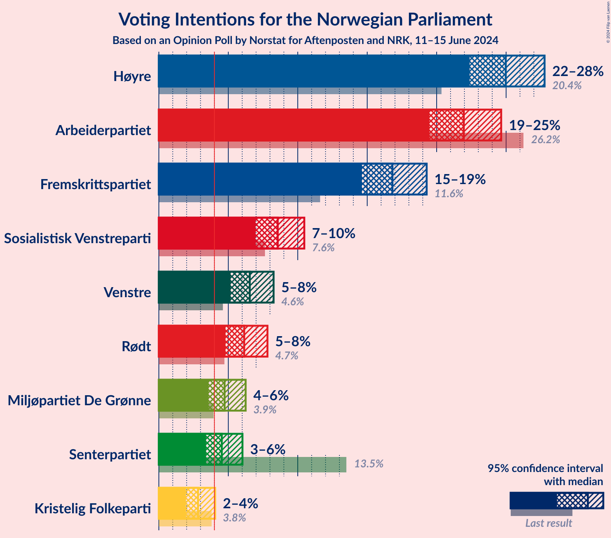

### Confidence Intervals

| Party | Last Result | Poll Result | 80% Confidence Interval | 90% Confidence Interval | 95% Confidence Interval | 99% Confidence Interval |
|:-----:|:-----------:|:-----------:|:-----------------------:|:-----------------------:|:-----------------------:|:-----------------------:|
| Høyre | 20.4% | 25.0% | 23.3–26.8% |22.8–27.3% |22.4–27.8% |21.6–28.7% |
| Arbeiderpartiet | 26.2% | 22.0% | 20.3–23.7% |19.9–24.2% |19.5–24.6% |18.7–25.5% |
| Fremskrittspartiet | 11.6% | 16.8% | 15.4–18.4% |15.0–18.9% |14.6–19.3% |13.9–20.1% |
| Sosialistisk Venstreparti | 7.6% | 8.6% | 7.5–9.8% |7.2–10.2% |7.0–10.5% |6.5–11.1% |
| Venstre | 4.6% | 6.5% | 5.6–7.7% |5.4–8.0% |5.2–8.3% |4.8–8.8% |
| Rødt | 4.7% | 6.1% | 5.3–7.2% |5.0–7.5% |4.8–7.8% |4.4–8.4% |
| Miljøpartiet De Grønne | 3.9% | 4.7% | 4.0–5.7% |3.7–6.0% |3.6–6.2% |3.2–6.8% |
| Senterpartiet | 13.5% | 4.5% | 3.8–5.5% |3.6–5.8% |3.4–6.0% |3.1–6.5% |
| Kristelig Folkeparti | 3.8% | 2.8% | 2.2–3.6% |2.1–3.9% |2.0–4.1% |1.7–4.5% |

*Note:* The poll result column reflects the actual value used in the calculations. Published results may vary slightly, and in addition be rounded to fewer digits.

## Seats

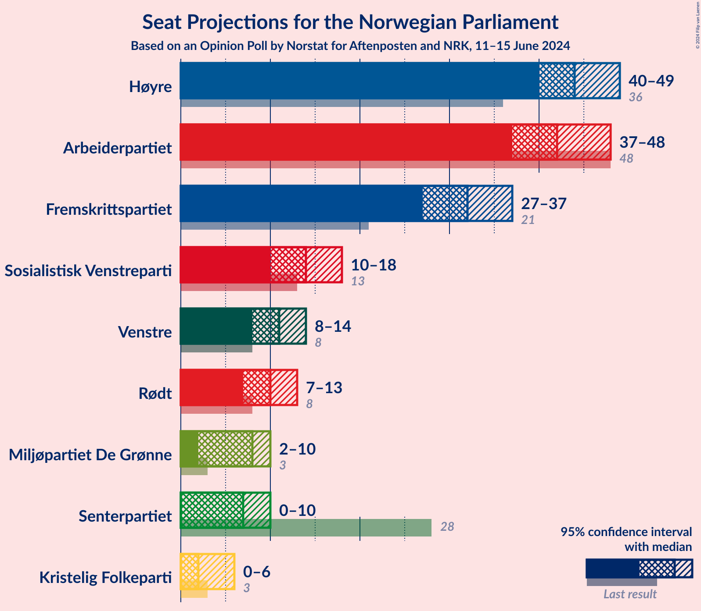

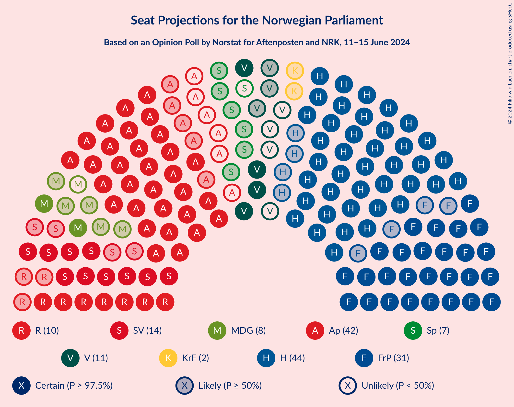

### Confidence Intervals

| Party | Last Result | Median | 80% Confidence Interval | 90% Confidence Interval | 95% Confidence Interval | 99% Confidence Interval |
|:-----:|:-----------:|:------:|:-----------------------:|:-----------------------:|:-----------------------:|:-----------------------:|
| <a href="#høyre">Høyre</a> | 36 | 44 | 41–47 |40–49 |40–49 |38–50 |
| <a href="#arbeiderpartiet">Arbeiderpartiet</a> | 48 | 42 | 38–46 |37–47 |37–48 |35–49 |
| <a href="#fremskrittspartiet">Fremskrittspartiet</a> | 21 | 32 | 29–35 |28–36 |27–37 |24–38 |
| <a href="#sosialistisk-venstreparti">Sosialistisk Venstreparti</a> | 13 | 14 | 11–17 |11–17 |10–18 |10–19 |
| <a href="#venstre">Venstre</a> | 8 | 11 | 9–13 |8–13 |8–14 |7–15 |
| <a href="#rødt">Rødt</a> | 8 | 10 | 8–12 |8–13 |7–13 |7–14 |
| <a href="#miljøpartiet-de-grønne">Miljøpartiet De Grønne</a> | 3 | 8 | 3–9 |2–10 |2–10 |2–11 |
| <a href="#senterpartiet">Senterpartiet</a> | 28 | 7 | 1–9 |0–9 |0–10 |0–11 |
| <a href="#kristelig-folkeparti">Kristelig Folkeparti</a> | 3 | 2 | 0–3 |0–3 |0–6 |0–7 |

### Høyre

*For a full overview of the results for this party, see the [Høyre](party-høyre.html) page.*

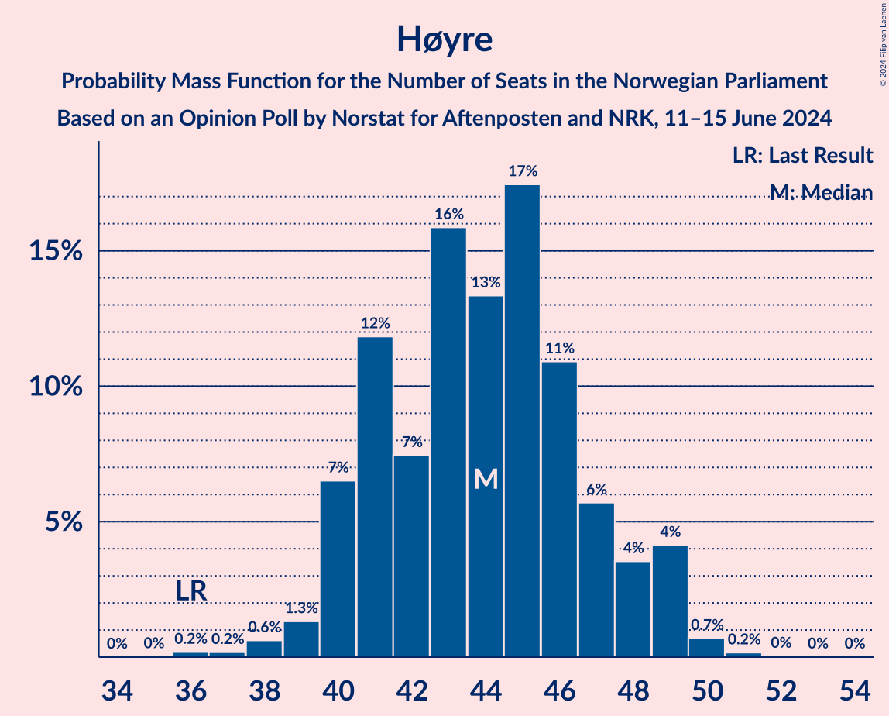

| Number of Seats | Probability | Accumulated | Special Marks |
|:---------------:|:-----------:|:-----------:|:-------------:|
| 36 | 0.2% | 100% | Last Result |
| 37 | 0.2% | 99.8% |  |
| 38 | 0.6% | 99.6% |  |
| 39 | 1.3% | 99.0% |  |
| 40 | 7% | 98% |  |
| 41 | 12% | 91% |  |
| 42 | 7% | 79% |  |
| 43 | 16% | 72% |  |
| 44 | 13% | 56% | Median |
| 45 | 17% | 43% |  |
| 46 | 11% | 25% |  |
| 47 | 6% | 14% |  |
| 48 | 4% | 9% |  |
| 49 | 4% | 5% |  |
| 50 | 0.7% | 0.9% |  |
| 51 | 0.2% | 0.2% |  |
| 52 | 0% | 0.1% |  |
| 53 | 0% | 0% |  |

### Arbeiderpartiet

*For a full overview of the results for this party, see the [Arbeiderpartiet](party-arbeiderpartiet.html) page.*

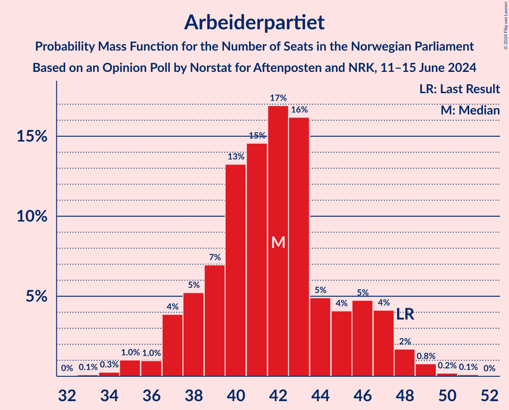

| Number of Seats | Probability | Accumulated | Special Marks |
|:---------------:|:-----------:|:-----------:|:-------------:|
| 33 | 0.1% | 100% |  |
| 34 | 0.3% | 99.9% |  |
| 35 | 1.0% | 99.6% |  |
| 36 | 1.0% | 98.6% |  |
| 37 | 4% | 98% |  |
| 38 | 5% | 94% |  |
| 39 | 7% | 89% |  |
| 40 | 13% | 82% |  |
| 41 | 15% | 68% |  |
| 42 | 17% | 54% | Median |
| 43 | 16% | 37% |  |
| 44 | 5% | 21% |  |
| 45 | 4% | 16% |  |
| 46 | 5% | 12% |  |
| 47 | 4% | 7% |  |
| 48 | 2% | 3% | Last Result |
| 49 | 0.8% | 1.1% |  |
| 50 | 0.2% | 0.3% |  |
| 51 | 0.1% | 0.1% |  |
| 52 | 0% | 0% |  |

### Fremskrittspartiet

*For a full overview of the results for this party, see the [Fremskrittspartiet](party-fremskrittspartiet.html) page.*

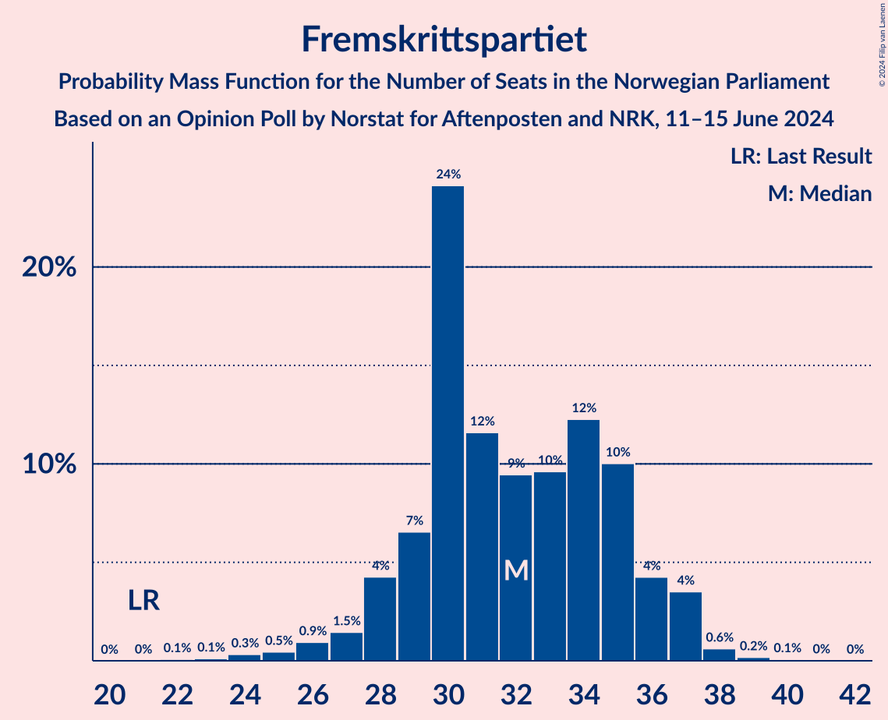

| Number of Seats | Probability | Accumulated | Special Marks |
|:---------------:|:-----------:|:-----------:|:-------------:|
| 21 | 0% | 100% | Last Result |
| 22 | 0.1% | 100% |  |
| 23 | 0.1% | 99.9% |  |
| 24 | 0.3% | 99.8% |  |
| 25 | 0.5% | 99.5% |  |
| 26 | 0.9% | 99.0% |  |
| 27 | 1.5% | 98% |  |
| 28 | 4% | 97% |  |
| 29 | 7% | 92% |  |
| 30 | 24% | 86% |  |
| 31 | 12% | 62% |  |
| 32 | 9% | 50% | Median |
| 33 | 10% | 41% |  |
| 34 | 12% | 31% |  |
| 35 | 10% | 19% |  |
| 36 | 4% | 9% |  |
| 37 | 4% | 4% |  |
| 38 | 0.6% | 0.9% |  |
| 39 | 0.2% | 0.3% |  |
| 40 | 0.1% | 0.1% |  |
| 41 | 0% | 0% |  |

### Sosialistisk Venstreparti

*For a full overview of the results for this party, see the [Sosialistisk Venstreparti](party-sosialistiskvenstreparti.html) page.*

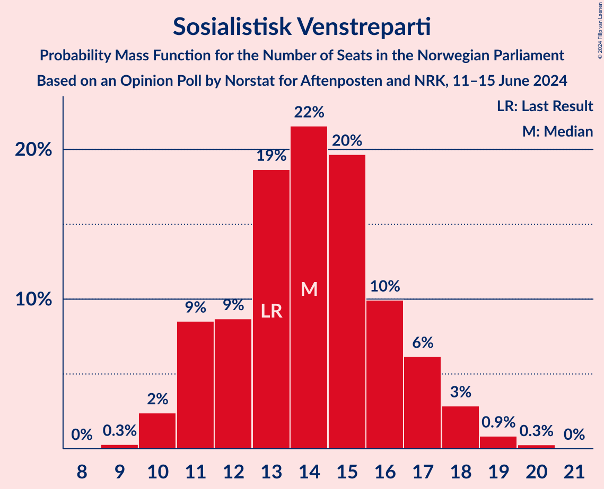

| Number of Seats | Probability | Accumulated | Special Marks |
|:---------------:|:-----------:|:-----------:|:-------------:|
| 9 | 0.3% | 100% |  |
| 10 | 2% | 99.7% |  |
| 11 | 9% | 97% |  |
| 12 | 9% | 89% |  |
| 13 | 19% | 80% | Last Result |
| 14 | 22% | 61% | Median |
| 15 | 20% | 40% |  |
| 16 | 10% | 20% |  |
| 17 | 6% | 10% |  |
| 18 | 3% | 4% |  |
| 19 | 0.9% | 1.2% |  |
| 20 | 0.3% | 0.3% |  |
| 21 | 0% | 0% |  |

### Venstre

*For a full overview of the results for this party, see the [Venstre](party-venstre.html) page.*

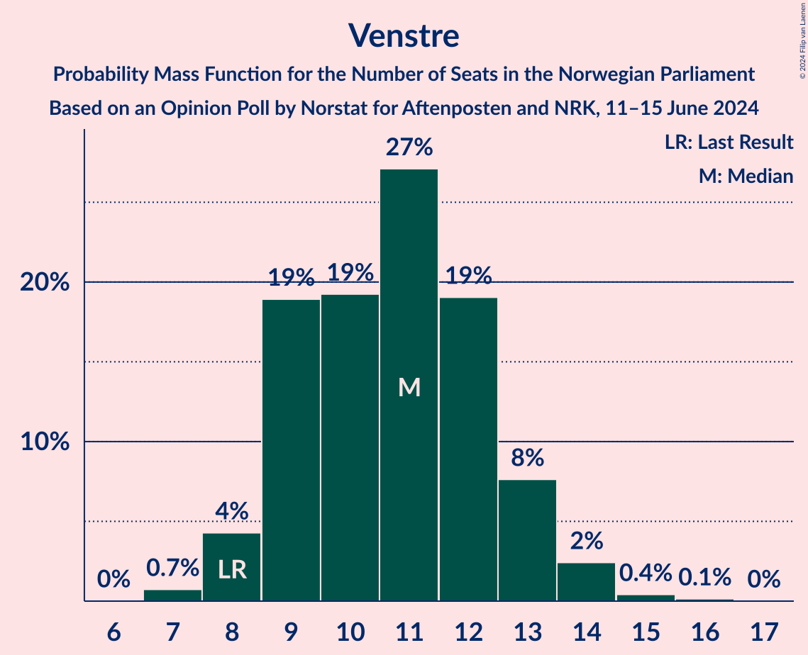

| Number of Seats | Probability | Accumulated | Special Marks |
|:---------------:|:-----------:|:-----------:|:-------------:|
| 7 | 0.7% | 100% |  |
| 8 | 4% | 99.2% | Last Result |
| 9 | 19% | 95% |  |
| 10 | 19% | 76% |  |
| 11 | 27% | 57% | Median |
| 12 | 19% | 30% |  |
| 13 | 8% | 11% |  |
| 14 | 2% | 3% |  |
| 15 | 0.4% | 0.6% |  |
| 16 | 0.1% | 0.2% |  |
| 17 | 0% | 0% |  |

### Rødt

*For a full overview of the results for this party, see the [Rødt](party-rødt.html) page.*

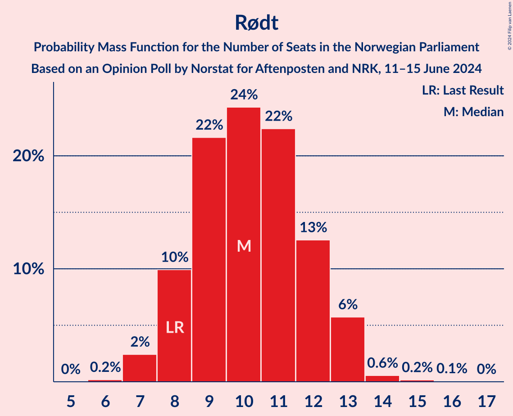

| Number of Seats | Probability | Accumulated | Special Marks |
|:---------------:|:-----------:|:-----------:|:-------------:|
| 6 | 0.2% | 100% |  |
| 7 | 2% | 99.8% |  |
| 8 | 10% | 97% | Last Result |
| 9 | 22% | 87% |  |
| 10 | 24% | 66% | Median |
| 11 | 22% | 41% |  |
| 12 | 13% | 19% |  |
| 13 | 6% | 7% |  |
| 14 | 0.6% | 0.8% |  |
| 15 | 0.2% | 0.2% |  |
| 16 | 0.1% | 0.1% |  |
| 17 | 0% | 0% |  |

### Miljøpartiet De Grønne

*For a full overview of the results for this party, see the [Miljøpartiet De Grønne](party-miljøpartietdegrønne.html) page.*

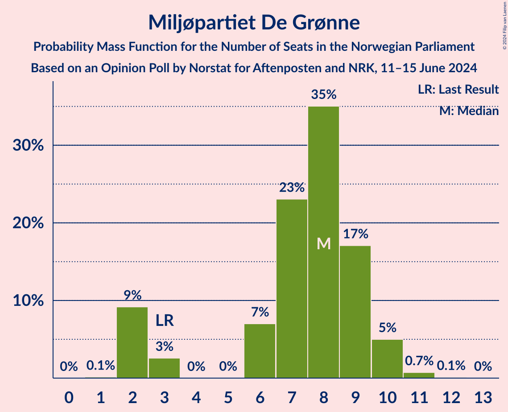

| Number of Seats | Probability | Accumulated | Special Marks |
|:---------------:|:-----------:|:-----------:|:-------------:|
| 1 | 0.1% | 100% |  |
| 2 | 9% | 99.9% |  |
| 3 | 3% | 91% | Last Result |
| 4 | 0% | 88% |  |
| 5 | 0% | 88% |  |
| 6 | 7% | 88% |  |
| 7 | 23% | 81% |  |
| 8 | 35% | 58% | Median |
| 9 | 17% | 23% |  |
| 10 | 5% | 6% |  |
| 11 | 0.7% | 0.9% |  |
| 12 | 0.1% | 0.1% |  |
| 13 | 0% | 0% |  |

### Senterpartiet

*For a full overview of the results for this party, see the [Senterpartiet](party-senterpartiet.html) page.*

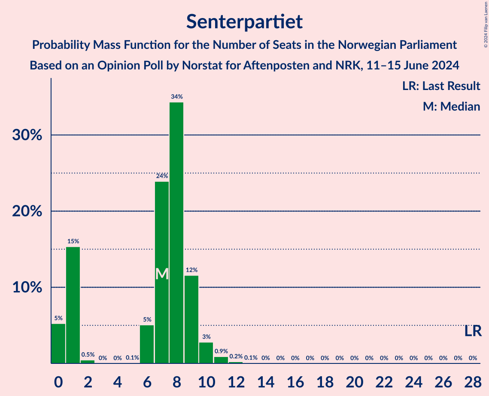

| Number of Seats | Probability | Accumulated | Special Marks |
|:---------------:|:-----------:|:-----------:|:-------------:|
| 0 | 5% | 100% |  |
| 1 | 15% | 95% |  |
| 2 | 0.5% | 79% |  |
| 3 | 0% | 79% |  |
| 4 | 0% | 79% |  |
| 5 | 0.1% | 79% |  |
| 6 | 5% | 79% |  |
| 7 | 24% | 74% | Median |
| 8 | 34% | 50% |  |
| 9 | 12% | 16% |  |
| 10 | 3% | 4% |  |
| 11 | 0.9% | 1.2% |  |
| 12 | 0.2% | 0.3% |  |
| 13 | 0.1% | 0.1% |  |
| 14 | 0% | 0% |  |
| 15 | 0% | 0% |  |
| 16 | 0% | 0% |  |
| 17 | 0% | 0% |  |
| 18 | 0% | 0% |  |
| 19 | 0% | 0% |  |
| 20 | 0% | 0% |  |
| 21 | 0% | 0% |  |
| 22 | 0% | 0% |  |
| 23 | 0% | 0% |  |
| 24 | 0% | 0% |  |
| 25 | 0% | 0% |  |
| 26 | 0% | 0% |  |
| 27 | 0% | 0% |  |
| 28 | 0% | 0% | Last Result |

### Kristelig Folkeparti

*For a full overview of the results for this party, see the [Kristelig Folkeparti](party-kristeligfolkeparti.html) page.*

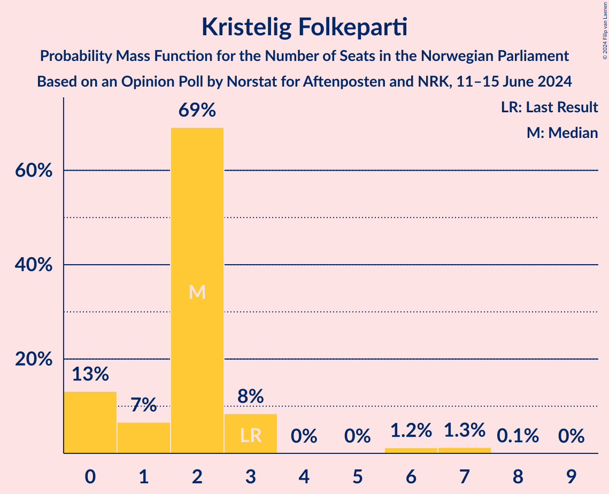

| Number of Seats | Probability | Accumulated | Special Marks |
|:---------------:|:-----------:|:-----------:|:-------------:|
| 0 | 13% | 100% |  |
| 1 | 7% | 87% |  |
| 2 | 69% | 80% | Median |
| 3 | 8% | 11% | Last Result |
| 4 | 0% | 3% |  |
| 5 | 0% | 3% |  |
| 6 | 1.2% | 3% |  |
| 7 | 1.3% | 1.4% |  |
| 8 | 0.1% | 0.1% |  |
| 9 | 0% | 0% |  |

## Coalitions

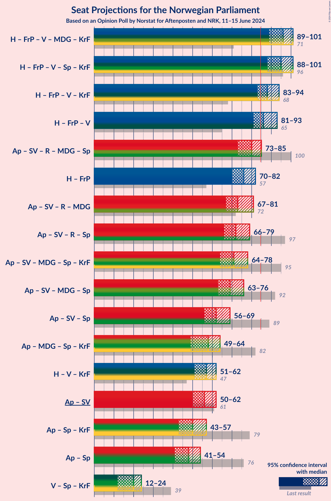

### Confidence Intervals

| Coalition | Last Result | Median | Majority? | 80% Confidence Interval | 90% Confidence Interval | 95% Confidence Interval | 99% Confidence Interval |
|:---------:|:-----------:|:------:|:---------:|:-----------------------:|:-----------------------:|:-----------------------:|:-----------------------:|
| Høyre – Fremskrittspartiet – Venstre – Miljøpartiet De Grønne – Kristelig Folkeparti | 71 | 96 | 100% | 92–99 | 90–100 | 89–101 | 87–104 |
| Høyre – Fremskrittspartiet – Venstre – Senterpartiet – Kristelig Folkeparti | 96 | 95 | 99.8% | 90–99 | 89–100 | 88–101 | 85–103 |
| Høyre – Fremskrittspartiet – Venstre – Kristelig Folkeparti | 68 | 88 | 93% | 85–92 | 84–93 | 83–94 | 81–97 |
| Høyre – Fremskrittspartiet – Venstre | 65 | 86 | 76% | 83–90 | 82–91 | 81–93 | 79–95 |
| Arbeiderpartiet – Sosialistisk Venstreparti – Rødt – Miljøpartiet De Grønne – Senterpartiet | 100 | 80 | 5% | 76–83 | 74–84 | 73–85 | 70–88 |
| Høyre – Fremskrittspartiet | 57 | 76 | 0.1% | 72–80 | 71–81 | 70–82 | 68–83 |
| Arbeiderpartiet – Sosialistisk Venstreparti – Rødt – Miljøpartiet De Grønne | 72 | 73 | 0.2% | 69–78 | 68–80 | 67–81 | 65–83 |
| Arbeiderpartiet – Sosialistisk Venstreparti – Rødt – Senterpartiet | 97 | 72 | 0% | 68–76 | 67–78 | 66–79 | 64–81 |
| Arbeiderpartiet – Sosialistisk Venstreparti – Miljøpartiet De Grønne – Senterpartiet – Kristelig Folkeparti | 95 | 71 | 0% | 67–75 | 66–77 | 64–78 | 61–80 |
| Arbeiderpartiet – Sosialistisk Venstreparti – Miljøpartiet De Grønne – Senterpartiet | 92 | 69 | 0% | 65–73 | 64–75 | 63–76 | 60–78 |
| Arbeiderpartiet – Sosialistisk Venstreparti – Senterpartiet | 89 | 62 | 0% | 58–66 | 57–68 | 56–69 | 54–71 |
| Arbeiderpartiet – Miljøpartiet De Grønne – Senterpartiet – Kristelig Folkeparti | 82 | 58 | 0% | 52–61 | 51–63 | 49–64 | 46–66 |
| Høyre – Venstre – Kristelig Folkeparti | 47 | 57 | 0% | 52–60 | 51–61 | 51–62 | 49–65 |
| Arbeiderpartiet – Sosialistisk Venstreparti | 61 | 56 | 0% | 52–60 | 51–61 | 50–62 | 48–64 |
| Arbeiderpartiet – Senterpartiet – Kristelig Folkeparti | 79 | 50 | 0% | 45–54 | 44–56 | 43–57 | 41–59 |
| Arbeiderpartiet – Senterpartiet | 76 | 48 | 0% | 44–52 | 42–54 | 41–54 | 39–56 |
| Venstre – Senterpartiet – Kristelig Folkeparti | 39 | 20 | 0% | 14–22 | 13–23 | 12–24 | 11–25 |

### Høyre – Fremskrittspartiet – Venstre – Miljøpartiet De Grønne – Kristelig Folkeparti

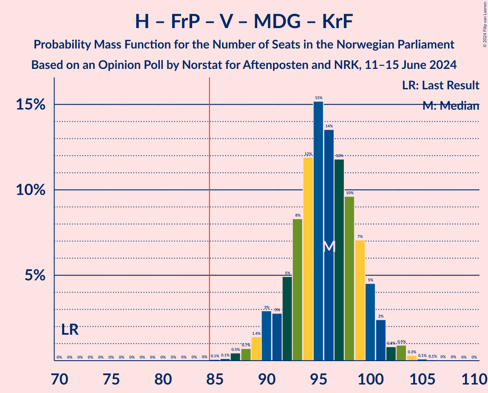

| Number of Seats | Probability | Accumulated | Special Marks |
|:---------------:|:-----------:|:-----------:|:-------------:|
| 71 | 0% | 100% | Last Result |
| 72 | 0% | 100% |  |
| 73 | 0% | 100% |  |
| 74 | 0% | 100% |  |
| 75 | 0% | 100% |  |
| 76 | 0% | 100% |  |
| 77 | 0% | 100% |  |
| 78 | 0% | 100% |  |
| 79 | 0% | 100% |  |
| 80 | 0% | 100% |  |
| 81 | 0% | 100% |  |
| 82 | 0% | 100% |  |
| 83 | 0% | 100% |  |
| 84 | 0% | 100% |  |
| 85 | 0.1% | 100% | Majority |
| 86 | 0.1% | 99.9% |  |
| 87 | 0.5% | 99.8% |  |
| 88 | 0.7% | 99.3% |  |
| 89 | 1.4% | 98.6% |  |
| 90 | 3% | 97% |  |
| 91 | 3% | 94% |  |
| 92 | 5% | 92% |  |
| 93 | 8% | 87% |  |
| 94 | 12% | 78% |  |
| 95 | 15% | 66% |  |
| 96 | 14% | 51% |  |
| 97 | 12% | 38% | Median |
| 98 | 10% | 26% |  |
| 99 | 7% | 16% |  |
| 100 | 5% | 9% |  |
| 101 | 2% | 5% |  |
| 102 | 0.8% | 2% |  |
| 103 | 0.9% | 1.4% |  |
| 104 | 0.3% | 0.5% |  |
| 105 | 0.1% | 0.2% |  |
| 106 | 0.1% | 0.1% |  |
| 107 | 0% | 0.1% |  |
| 108 | 0% | 0% |  |

### Høyre – Fremskrittspartiet – Venstre – Senterpartiet – Kristelig Folkeparti

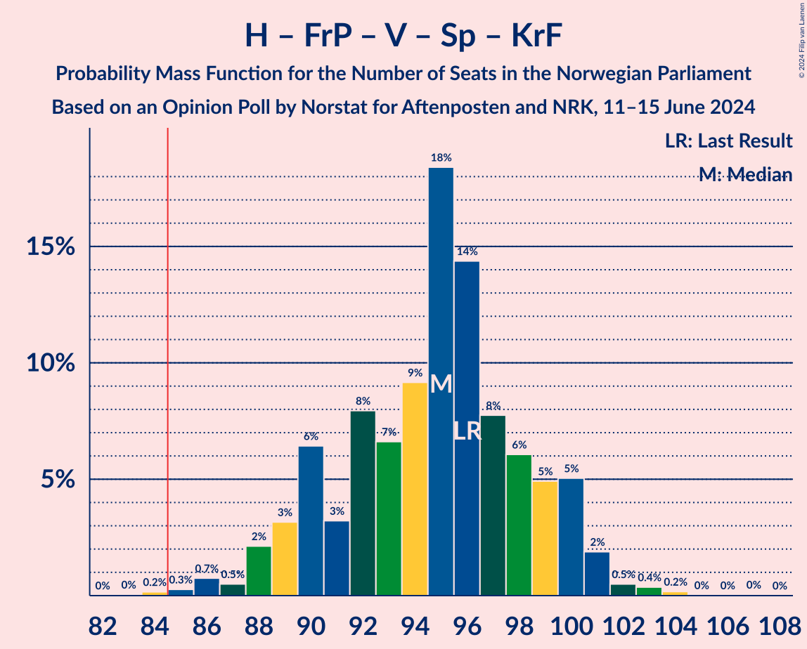

| Number of Seats | Probability | Accumulated | Special Marks |
|:---------------:|:-----------:|:-----------:|:-------------:|
| 83 | 0% | 100% |  |
| 84 | 0.2% | 99.9% |  |
| 85 | 0.3% | 99.8% | Majority |
| 86 | 0.7% | 99.5% |  |
| 87 | 0.5% | 98.7% |  |
| 88 | 2% | 98% |  |
| 89 | 3% | 96% |  |
| 90 | 6% | 93% |  |
| 91 | 3% | 87% |  |
| 92 | 8% | 83% |  |
| 93 | 7% | 75% |  |
| 94 | 9% | 69% |  |
| 95 | 18% | 60% |  |
| 96 | 14% | 41% | Last Result, Median |
| 97 | 8% | 27% |  |
| 98 | 6% | 19% |  |
| 99 | 5% | 13% |  |
| 100 | 5% | 8% |  |
| 101 | 2% | 3% |  |
| 102 | 0.5% | 1.1% |  |
| 103 | 0.4% | 0.6% |  |
| 104 | 0.2% | 0.3% |  |
| 105 | 0% | 0.1% |  |
| 106 | 0% | 0.1% |  |
| 107 | 0% | 0.1% |  |
| 108 | 0% | 0% |  |

### Høyre – Fremskrittspartiet – Venstre – Kristelig Folkeparti

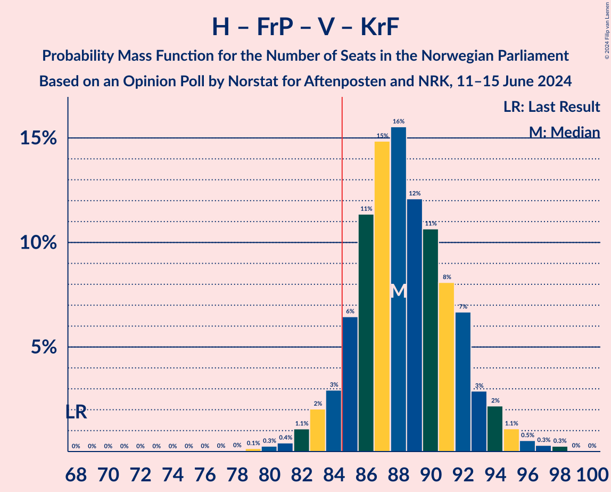

| Number of Seats | Probability | Accumulated | Special Marks |
|:---------------:|:-----------:|:-----------:|:-------------:|
| 68 | 0% | 100% | Last Result |
| 69 | 0% | 100% |  |
| 70 | 0% | 100% |  |
| 71 | 0% | 100% |  |
| 72 | 0% | 100% |  |
| 73 | 0% | 100% |  |
| 74 | 0% | 100% |  |
| 75 | 0% | 100% |  |
| 76 | 0% | 100% |  |
| 77 | 0% | 100% |  |
| 78 | 0% | 100% |  |
| 79 | 0.1% | 99.9% |  |
| 80 | 0.3% | 99.8% |  |
| 81 | 0.4% | 99.5% |  |
| 82 | 1.1% | 99.1% |  |
| 83 | 2% | 98% |  |
| 84 | 3% | 96% |  |
| 85 | 6% | 93% | Majority |
| 86 | 11% | 87% |  |
| 87 | 15% | 75% |  |
| 88 | 16% | 60% |  |
| 89 | 12% | 45% | Median |
| 90 | 11% | 33% |  |
| 91 | 8% | 22% |  |
| 92 | 7% | 14% |  |
| 93 | 3% | 7% |  |
| 94 | 2% | 4% |  |
| 95 | 1.1% | 2% |  |
| 96 | 0.5% | 1.2% |  |
| 97 | 0.3% | 0.6% |  |
| 98 | 0.3% | 0.3% |  |
| 99 | 0% | 0.1% |  |
| 100 | 0% | 0% |  |

### Høyre – Fremskrittspartiet – Venstre

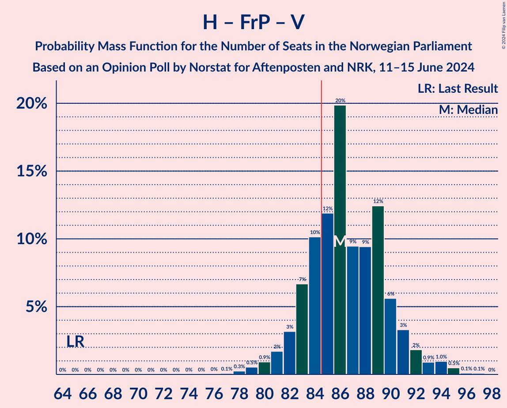

| Number of Seats | Probability | Accumulated | Special Marks |
|:---------------:|:-----------:|:-----------:|:-------------:|
| 65 | 0% | 100% | Last Result |
| 66 | 0% | 100% |  |
| 67 | 0% | 100% |  |
| 68 | 0% | 100% |  |
| 69 | 0% | 100% |  |
| 70 | 0% | 100% |  |
| 71 | 0% | 100% |  |
| 72 | 0% | 100% |  |
| 73 | 0% | 100% |  |
| 74 | 0% | 100% |  |
| 75 | 0% | 100% |  |
| 76 | 0% | 100% |  |
| 77 | 0.1% | 99.9% |  |
| 78 | 0.3% | 99.8% |  |
| 79 | 0.5% | 99.6% |  |
| 80 | 0.9% | 99.1% |  |
| 81 | 2% | 98% |  |
| 82 | 3% | 96% |  |
| 83 | 7% | 93% |  |
| 84 | 10% | 87% |  |
| 85 | 12% | 76% | Majority |
| 86 | 20% | 65% |  |
| 87 | 9% | 45% | Median |
| 88 | 9% | 35% |  |
| 89 | 12% | 26% |  |
| 90 | 6% | 13% |  |
| 91 | 3% | 8% |  |
| 92 | 2% | 4% |  |
| 93 | 0.9% | 3% |  |
| 94 | 1.0% | 2% |  |
| 95 | 0.5% | 0.7% |  |
| 96 | 0.1% | 0.2% |  |
| 97 | 0.1% | 0.1% |  |
| 98 | 0% | 0% |  |

### Arbeiderpartiet – Sosialistisk Venstreparti – Rødt – Miljøpartiet De Grønne – Senterpartiet

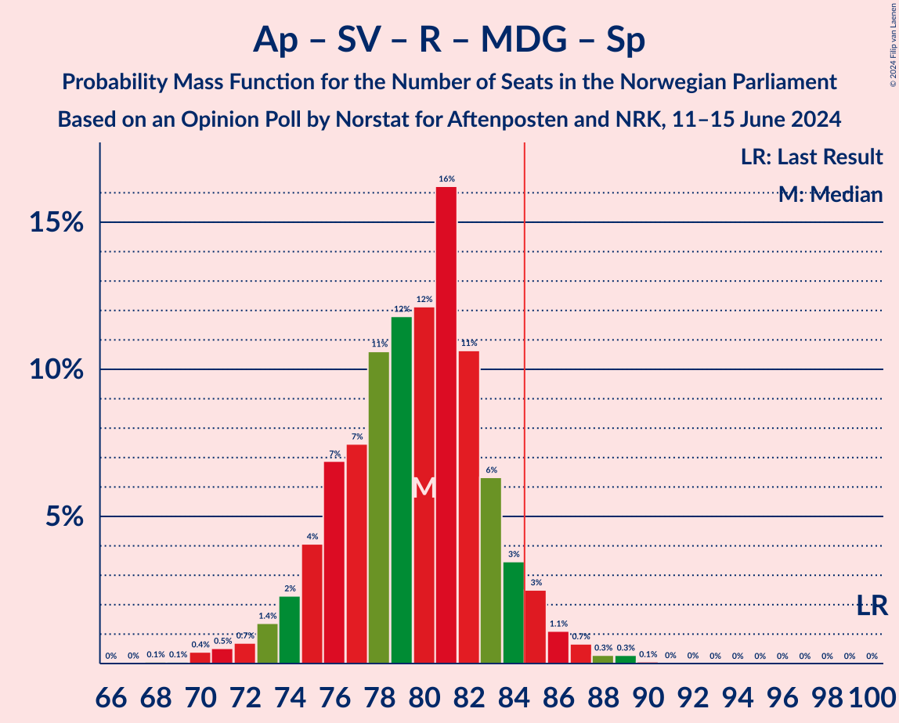

| Number of Seats | Probability | Accumulated | Special Marks |
|:---------------:|:-----------:|:-----------:|:-------------:|
| 68 | 0.1% | 100% |  |
| 69 | 0.1% | 99.9% |  |
| 70 | 0.4% | 99.9% |  |
| 71 | 0.5% | 99.5% |  |
| 72 | 0.7% | 98.9% |  |
| 73 | 1.4% | 98% |  |
| 74 | 2% | 97% |  |
| 75 | 4% | 95% |  |
| 76 | 7% | 91% |  |
| 77 | 7% | 84% |  |
| 78 | 11% | 76% |  |
| 79 | 12% | 66% |  |
| 80 | 12% | 54% |  |
| 81 | 16% | 42% | Median |
| 82 | 11% | 25% |  |
| 83 | 6% | 15% |  |
| 84 | 3% | 8% |  |
| 85 | 3% | 5% | Majority |
| 86 | 1.1% | 2% |  |
| 87 | 0.7% | 1.4% |  |
| 88 | 0.3% | 0.7% |  |
| 89 | 0.3% | 0.4% |  |
| 90 | 0.1% | 0.1% |  |
| 91 | 0% | 0.1% |  |
| 92 | 0% | 0% |  |
| 93 | 0% | 0% |  |
| 94 | 0% | 0% |  |
| 95 | 0% | 0% |  |
| 96 | 0% | 0% |  |
| 97 | 0% | 0% |  |
| 98 | 0% | 0% |  |
| 99 | 0% | 0% |  |
| 100 | 0% | 0% | Last Result |

### Høyre – Fremskrittspartiet

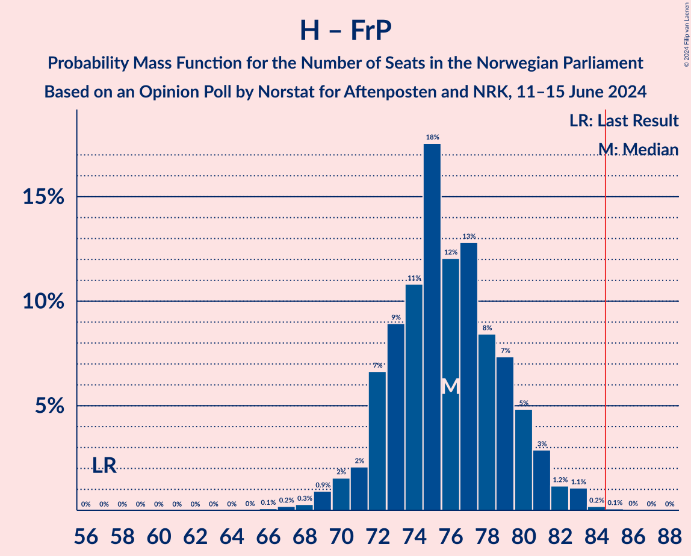

| Number of Seats | Probability | Accumulated | Special Marks |
|:---------------:|:-----------:|:-----------:|:-------------:|
| 57 | 0% | 100% | Last Result |
| 58 | 0% | 100% |  |
| 59 | 0% | 100% |  |
| 60 | 0% | 100% |  |
| 61 | 0% | 100% |  |
| 62 | 0% | 100% |  |
| 63 | 0% | 100% |  |
| 64 | 0% | 100% |  |
| 65 | 0% | 100% |  |
| 66 | 0.1% | 100% |  |
| 67 | 0.2% | 99.9% |  |
| 68 | 0.3% | 99.7% |  |
| 69 | 0.9% | 99.4% |  |
| 70 | 2% | 98.5% |  |
| 71 | 2% | 97% |  |
| 72 | 7% | 95% |  |
| 73 | 9% | 88% |  |
| 74 | 11% | 79% |  |
| 75 | 18% | 68% |  |
| 76 | 12% | 51% | Median |
| 77 | 13% | 39% |  |
| 78 | 8% | 26% |  |
| 79 | 7% | 18% |  |
| 80 | 5% | 10% |  |
| 81 | 3% | 5% |  |
| 82 | 1.2% | 3% |  |
| 83 | 1.1% | 1.4% |  |
| 84 | 0.2% | 0.3% |  |
| 85 | 0.1% | 0.1% | Majority |
| 86 | 0% | 0.1% |  |
| 87 | 0% | 0% |  |

### Arbeiderpartiet – Sosialistisk Venstreparti – Rødt – Miljøpartiet De Grønne

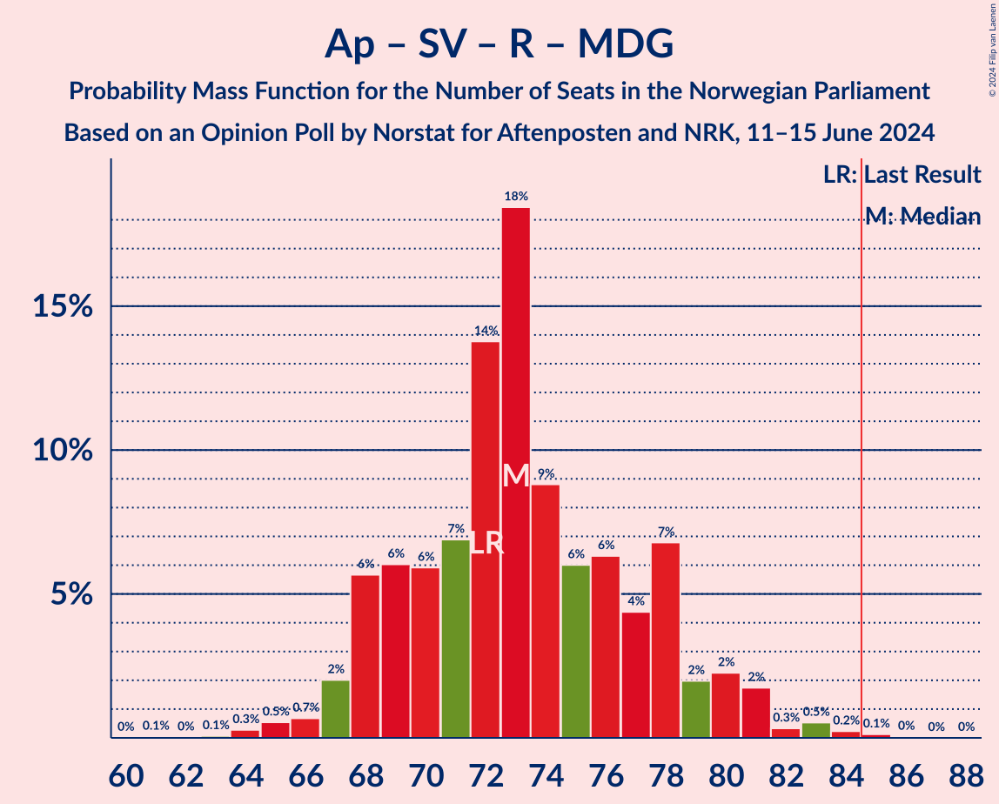

| Number of Seats | Probability | Accumulated | Special Marks |
|:---------------:|:-----------:|:-----------:|:-------------:|
| 61 | 0.1% | 100% |  |
| 62 | 0% | 99.9% |  |
| 63 | 0.1% | 99.9% |  |
| 64 | 0.3% | 99.8% |  |
| 65 | 0.5% | 99.6% |  |
| 66 | 0.7% | 99.0% |  |
| 67 | 2% | 98% |  |
| 68 | 6% | 96% |  |
| 69 | 6% | 91% |  |
| 70 | 6% | 85% |  |
| 71 | 7% | 79% |  |
| 72 | 14% | 72% | Last Result |
| 73 | 18% | 58% |  |
| 74 | 9% | 40% | Median |
| 75 | 6% | 31% |  |
| 76 | 6% | 25% |  |
| 77 | 4% | 18% |  |
| 78 | 7% | 14% |  |
| 79 | 2% | 7% |  |
| 80 | 2% | 5% |  |
| 81 | 2% | 3% |  |
| 82 | 0.3% | 1.3% |  |
| 83 | 0.5% | 1.0% |  |
| 84 | 0.2% | 0.4% |  |
| 85 | 0.1% | 0.2% | Majority |
| 86 | 0% | 0.1% |  |
| 87 | 0% | 0% |  |

### Arbeiderpartiet – Sosialistisk Venstreparti – Rødt – Senterpartiet

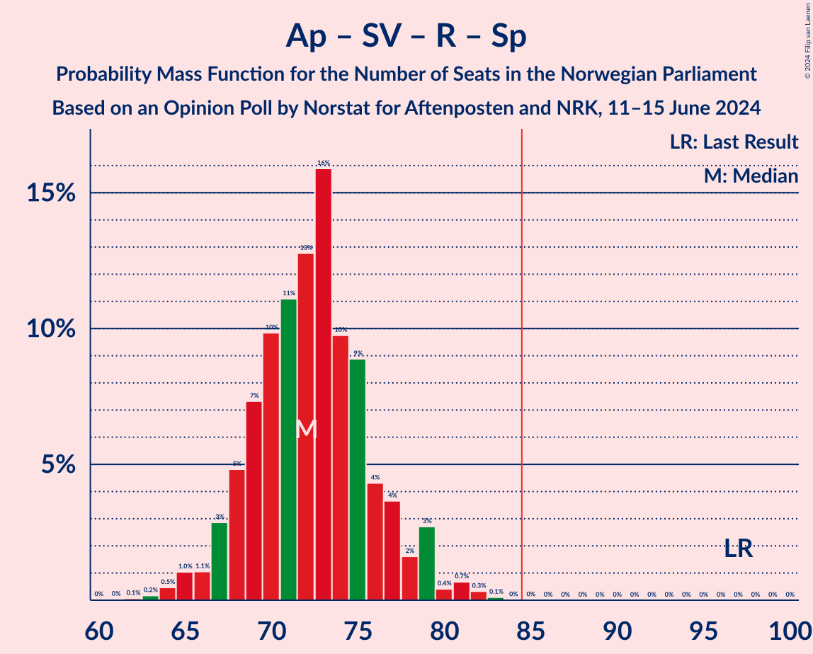

| Number of Seats | Probability | Accumulated | Special Marks |
|:---------------:|:-----------:|:-----------:|:-------------:|
| 61 | 0% | 100% |  |
| 62 | 0.1% | 99.9% |  |
| 63 | 0.2% | 99.9% |  |
| 64 | 0.5% | 99.7% |  |
| 65 | 1.0% | 99.2% |  |
| 66 | 1.1% | 98% |  |
| 67 | 3% | 97% |  |
| 68 | 5% | 94% |  |
| 69 | 7% | 89% |  |
| 70 | 10% | 82% |  |
| 71 | 11% | 72% |  |
| 72 | 13% | 61% |  |
| 73 | 16% | 48% | Median |
| 74 | 10% | 33% |  |
| 75 | 9% | 23% |  |
| 76 | 4% | 14% |  |
| 77 | 4% | 10% |  |
| 78 | 2% | 6% |  |
| 79 | 3% | 4% |  |
| 80 | 0.4% | 2% |  |
| 81 | 0.7% | 1.2% |  |
| 82 | 0.3% | 0.5% |  |
| 83 | 0.1% | 0.2% |  |
| 84 | 0% | 0% |  |
| 85 | 0% | 0% | Majority |
| 86 | 0% | 0% |  |
| 87 | 0% | 0% |  |
| 88 | 0% | 0% |  |
| 89 | 0% | 0% |  |
| 90 | 0% | 0% |  |
| 91 | 0% | 0% |  |
| 92 | 0% | 0% |  |
| 93 | 0% | 0% |  |
| 94 | 0% | 0% |  |
| 95 | 0% | 0% |  |
| 96 | 0% | 0% |  |
| 97 | 0% | 0% | Last Result |

### Arbeiderpartiet – Sosialistisk Venstreparti – Miljøpartiet De Grønne – Senterpartiet – Kristelig Folkeparti

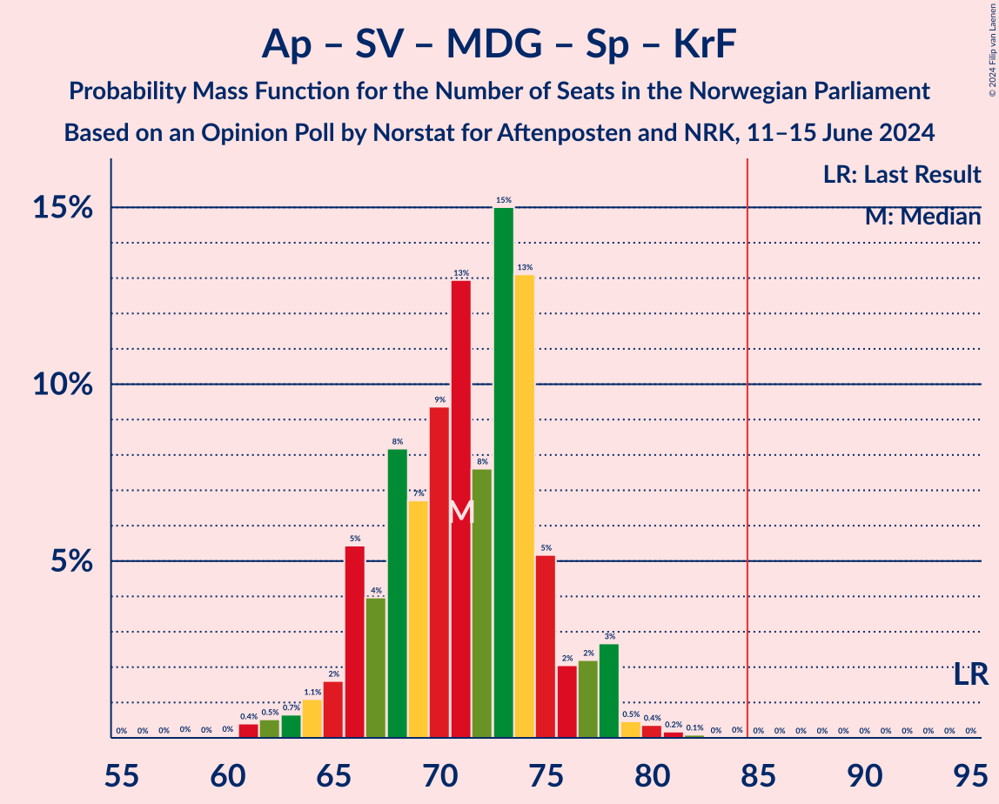

| Number of Seats | Probability | Accumulated | Special Marks |
|:---------------:|:-----------:|:-----------:|:-------------:|
| 58 | 0% | 100% |  |
| 59 | 0% | 99.9% |  |
| 60 | 0% | 99.9% |  |
| 61 | 0.4% | 99.9% |  |
| 62 | 0.5% | 99.5% |  |
| 63 | 0.7% | 98.9% |  |
| 64 | 1.1% | 98% |  |
| 65 | 2% | 97% |  |
| 66 | 5% | 96% |  |
| 67 | 4% | 90% |  |
| 68 | 8% | 86% |  |
| 69 | 7% | 78% |  |
| 70 | 9% | 71% |  |
| 71 | 13% | 62% |  |
| 72 | 8% | 49% |  |
| 73 | 15% | 41% | Median |
| 74 | 13% | 26% |  |
| 75 | 5% | 13% |  |
| 76 | 2% | 8% |  |
| 77 | 2% | 6% |  |
| 78 | 3% | 4% |  |
| 79 | 0.5% | 1.1% |  |
| 80 | 0.4% | 0.7% |  |
| 81 | 0.2% | 0.3% |  |
| 82 | 0.1% | 0.1% |  |
| 83 | 0% | 0% |  |
| 84 | 0% | 0% |  |
| 85 | 0% | 0% | Majority |
| 86 | 0% | 0% |  |
| 87 | 0% | 0% |  |
| 88 | 0% | 0% |  |
| 89 | 0% | 0% |  |
| 90 | 0% | 0% |  |
| 91 | 0% | 0% |  |
| 92 | 0% | 0% |  |
| 93 | 0% | 0% |  |
| 94 | 0% | 0% |  |
| 95 | 0% | 0% | Last Result |

### Arbeiderpartiet – Sosialistisk Venstreparti – Miljøpartiet De Grønne – Senterpartiet

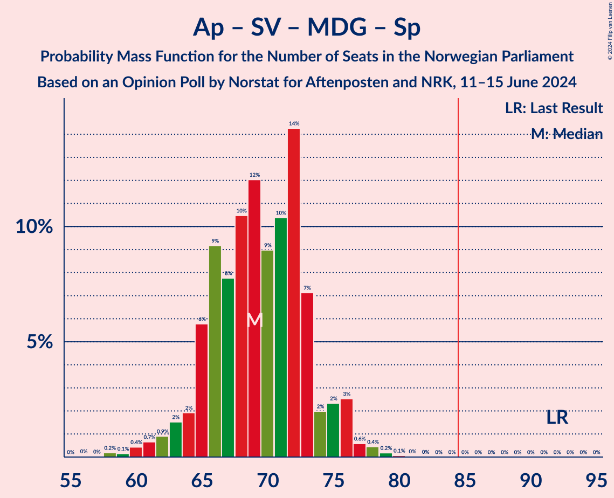

| Number of Seats | Probability | Accumulated | Special Marks |
|:---------------:|:-----------:|:-----------:|:-------------:|
| 57 | 0% | 100% |  |
| 58 | 0.2% | 99.9% |  |
| 59 | 0.1% | 99.7% |  |
| 60 | 0.4% | 99.6% |  |
| 61 | 0.7% | 99.2% |  |
| 62 | 0.9% | 98.5% |  |
| 63 | 2% | 98% |  |
| 64 | 2% | 96% |  |
| 65 | 6% | 94% |  |
| 66 | 9% | 88% |  |
| 67 | 8% | 79% |  |
| 68 | 10% | 71% |  |
| 69 | 12% | 61% |  |
| 70 | 9% | 49% |  |
| 71 | 10% | 40% | Median |
| 72 | 14% | 30% |  |
| 73 | 7% | 15% |  |
| 74 | 2% | 8% |  |
| 75 | 2% | 6% |  |
| 76 | 3% | 4% |  |
| 77 | 0.6% | 1.3% |  |
| 78 | 0.4% | 0.8% |  |
| 79 | 0.2% | 0.3% |  |
| 80 | 0.1% | 0.1% |  |
| 81 | 0% | 0.1% |  |
| 82 | 0% | 0% |  |
| 83 | 0% | 0% |  |
| 84 | 0% | 0% |  |
| 85 | 0% | 0% | Majority |
| 86 | 0% | 0% |  |
| 87 | 0% | 0% |  |
| 88 | 0% | 0% |  |
| 89 | 0% | 0% |  |
| 90 | 0% | 0% |  |
| 91 | 0% | 0% |  |
| 92 | 0% | 0% | Last Result |

### Arbeiderpartiet – Sosialistisk Venstreparti – Senterpartiet

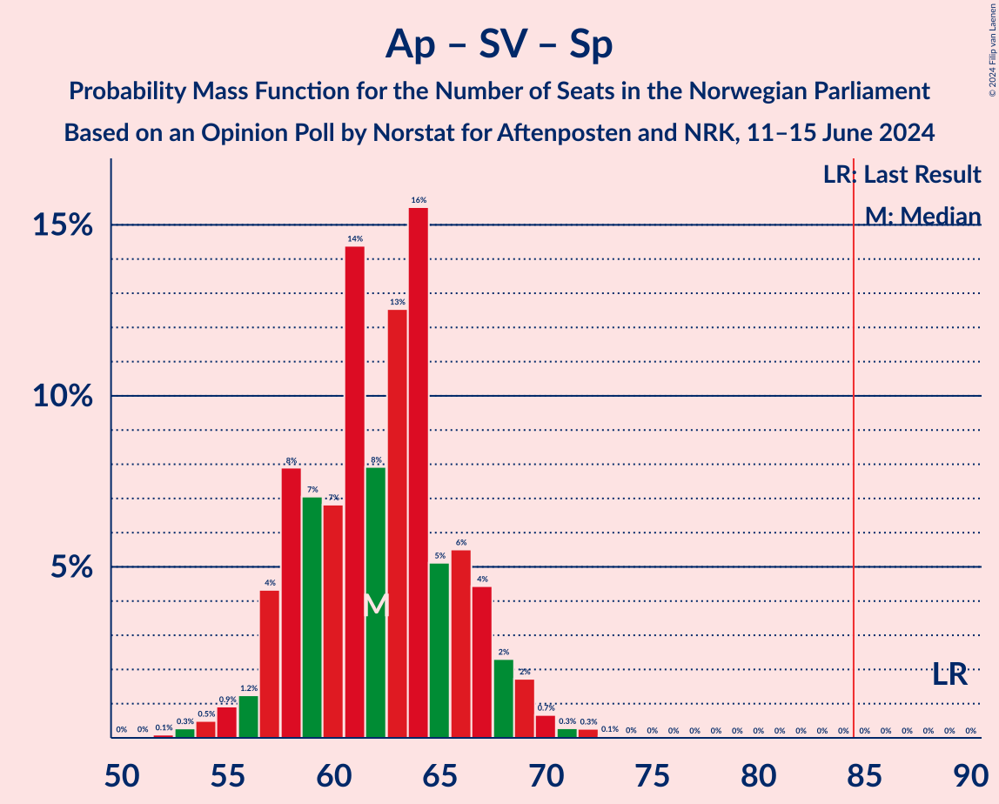

| Number of Seats | Probability | Accumulated | Special Marks |
|:---------------:|:-----------:|:-----------:|:-------------:|
| 50 | 0% | 100% |  |
| 51 | 0% | 99.9% |  |
| 52 | 0.1% | 99.9% |  |
| 53 | 0.3% | 99.8% |  |
| 54 | 0.5% | 99.5% |  |
| 55 | 0.9% | 99.0% |  |
| 56 | 1.2% | 98% |  |
| 57 | 4% | 97% |  |
| 58 | 8% | 93% |  |
| 59 | 7% | 85% |  |
| 60 | 7% | 78% |  |
| 61 | 14% | 71% |  |
| 62 | 8% | 56% |  |
| 63 | 13% | 48% | Median |
| 64 | 16% | 36% |  |
| 65 | 5% | 20% |  |
| 66 | 6% | 15% |  |
| 67 | 4% | 10% |  |
| 68 | 2% | 5% |  |
| 69 | 2% | 3% |  |
| 70 | 0.7% | 1.3% |  |
| 71 | 0.3% | 0.6% |  |
| 72 | 0.3% | 0.3% |  |
| 73 | 0.1% | 0.1% |  |
| 74 | 0% | 0% |  |
| 75 | 0% | 0% |  |
| 76 | 0% | 0% |  |
| 77 | 0% | 0% |  |
| 78 | 0% | 0% |  |
| 79 | 0% | 0% |  |
| 80 | 0% | 0% |  |
| 81 | 0% | 0% |  |
| 82 | 0% | 0% |  |
| 83 | 0% | 0% |  |
| 84 | 0% | 0% |  |
| 85 | 0% | 0% | Majority |
| 86 | 0% | 0% |  |
| 87 | 0% | 0% |  |
| 88 | 0% | 0% |  |
| 89 | 0% | 0% | Last Result |

### Arbeiderpartiet – Miljøpartiet De Grønne – Senterpartiet – Kristelig Folkeparti

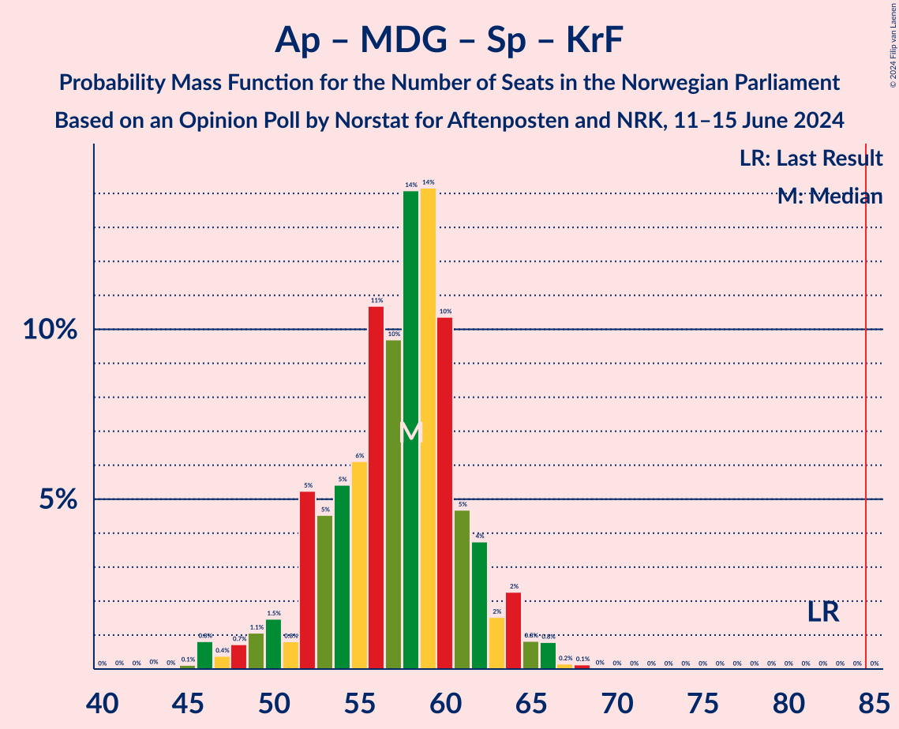

| Number of Seats | Probability | Accumulated | Special Marks |
|:---------------:|:-----------:|:-----------:|:-------------:|
| 43 | 0% | 100% |  |
| 44 | 0% | 99.9% |  |
| 45 | 0.1% | 99.9% |  |
| 46 | 0.8% | 99.8% |  |
| 47 | 0.4% | 99.0% |  |
| 48 | 0.7% | 98.6% |  |
| 49 | 1.1% | 98% |  |
| 50 | 1.5% | 97% |  |
| 51 | 0.8% | 95% |  |
| 52 | 5% | 95% |  |
| 53 | 5% | 89% |  |
| 54 | 5% | 85% |  |
| 55 | 6% | 79% |  |
| 56 | 11% | 73% |  |
| 57 | 10% | 62% |  |
| 58 | 14% | 53% |  |
| 59 | 14% | 39% | Median |
| 60 | 10% | 25% |  |
| 61 | 5% | 14% |  |
| 62 | 4% | 9% |  |
| 63 | 2% | 6% |  |
| 64 | 2% | 4% |  |
| 65 | 0.8% | 2% |  |
| 66 | 0.8% | 1.1% |  |
| 67 | 0.2% | 0.3% |  |
| 68 | 0.1% | 0.2% |  |
| 69 | 0% | 0% |  |
| 70 | 0% | 0% |  |
| 71 | 0% | 0% |  |
| 72 | 0% | 0% |  |
| 73 | 0% | 0% |  |
| 74 | 0% | 0% |  |
| 75 | 0% | 0% |  |
| 76 | 0% | 0% |  |
| 77 | 0% | 0% |  |
| 78 | 0% | 0% |  |
| 79 | 0% | 0% |  |
| 80 | 0% | 0% |  |
| 81 | 0% | 0% |  |
| 82 | 0% | 0% | Last Result |

### Høyre – Venstre – Kristelig Folkeparti

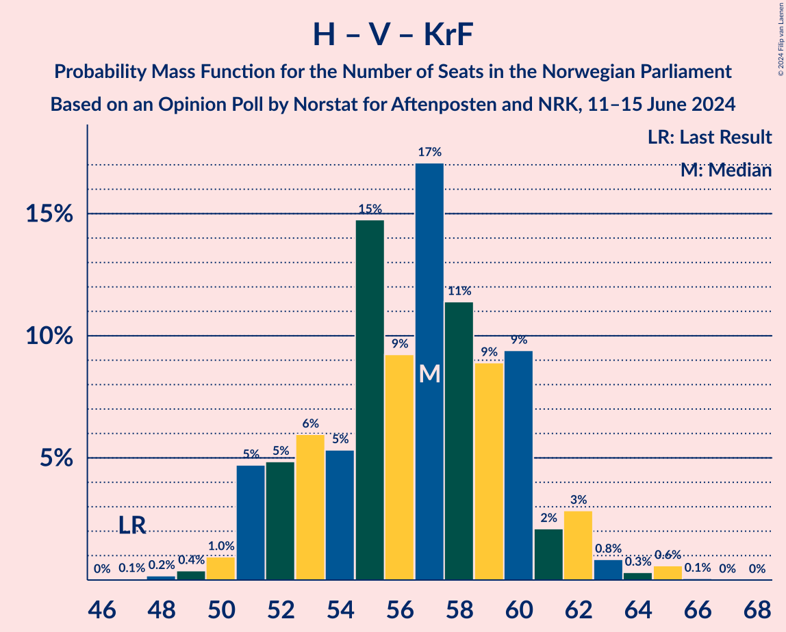

| Number of Seats | Probability | Accumulated | Special Marks |
|:---------------:|:-----------:|:-----------:|:-------------:|
| 47 | 0.1% | 100% | Last Result |
| 48 | 0.2% | 99.9% |  |
| 49 | 0.4% | 99.8% |  |
| 50 | 1.0% | 99.4% |  |
| 51 | 5% | 98% |  |
| 52 | 5% | 94% |  |
| 53 | 6% | 89% |  |
| 54 | 5% | 83% |  |
| 55 | 15% | 78% |  |
| 56 | 9% | 63% |  |
| 57 | 17% | 54% | Median |
| 58 | 11% | 36% |  |
| 59 | 9% | 25% |  |
| 60 | 9% | 16% |  |
| 61 | 2% | 7% |  |
| 62 | 3% | 5% |  |
| 63 | 0.8% | 2% |  |
| 64 | 0.3% | 1.0% |  |
| 65 | 0.6% | 0.7% |  |
| 66 | 0.1% | 0.1% |  |
| 67 | 0% | 0% |  |

### Arbeiderpartiet – Sosialistisk Venstreparti

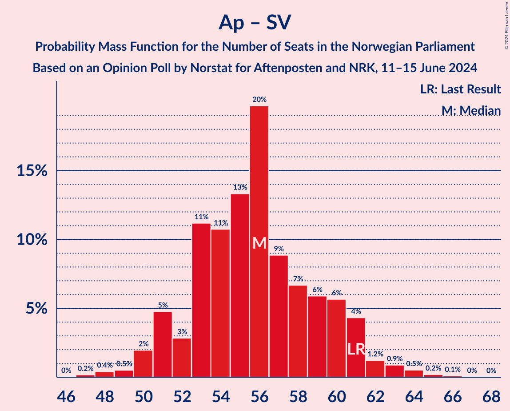

| Number of Seats | Probability | Accumulated | Special Marks |
|:---------------:|:-----------:|:-----------:|:-------------:|
| 47 | 0.2% | 100% |  |
| 48 | 0.4% | 99.8% |  |
| 49 | 0.5% | 99.4% |  |
| 50 | 2% | 98.9% |  |
| 51 | 5% | 97% |  |
| 52 | 3% | 92% |  |
| 53 | 11% | 89% |  |
| 54 | 11% | 78% |  |
| 55 | 13% | 67% |  |
| 56 | 20% | 54% | Median |
| 57 | 9% | 34% |  |
| 58 | 7% | 25% |  |
| 59 | 6% | 19% |  |
| 60 | 6% | 13% |  |
| 61 | 4% | 7% | Last Result |
| 62 | 1.2% | 3% |  |
| 63 | 0.9% | 2% |  |
| 64 | 0.5% | 0.8% |  |
| 65 | 0.2% | 0.3% |  |
| 66 | 0.1% | 0.1% |  |
| 67 | 0% | 0% |  |

### Arbeiderpartiet – Senterpartiet – Kristelig Folkeparti

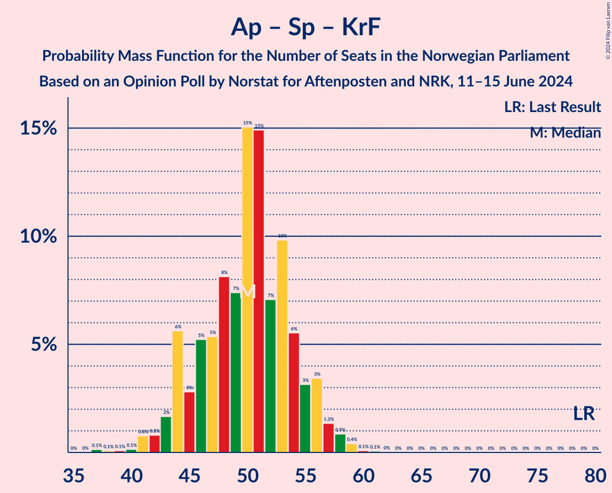

| Number of Seats | Probability | Accumulated | Special Marks |
|:---------------:|:-----------:|:-----------:|:-------------:|
| 37 | 0.1% | 100% |  |
| 38 | 0.1% | 99.8% |  |
| 39 | 0.1% | 99.8% |  |
| 40 | 0.1% | 99.7% |  |
| 41 | 0.8% | 99.5% |  |
| 42 | 0.8% | 98.8% |  |
| 43 | 2% | 98% |  |
| 44 | 6% | 96% |  |
| 45 | 3% | 91% |  |
| 46 | 5% | 88% |  |
| 47 | 5% | 83% |  |
| 48 | 8% | 77% |  |
| 49 | 7% | 69% |  |
| 50 | 15% | 62% |  |
| 51 | 15% | 47% | Median |
| 52 | 7% | 32% |  |
| 53 | 10% | 25% |  |
| 54 | 6% | 15% |  |
| 55 | 3% | 9% |  |
| 56 | 3% | 6% |  |
| 57 | 1.3% | 3% |  |
| 58 | 0.9% | 1.4% |  |
| 59 | 0.4% | 0.6% |  |
| 60 | 0.1% | 0.2% |  |
| 61 | 0.1% | 0.1% |  |
| 62 | 0% | 0% |  |
| 63 | 0% | 0% |  |
| 64 | 0% | 0% |  |
| 65 | 0% | 0% |  |
| 66 | 0% | 0% |  |
| 67 | 0% | 0% |  |
| 68 | 0% | 0% |  |
| 69 | 0% | 0% |  |
| 70 | 0% | 0% |  |
| 71 | 0% | 0% |  |
| 72 | 0% | 0% |  |
| 73 | 0% | 0% |  |
| 74 | 0% | 0% |  |
| 75 | 0% | 0% |  |
| 76 | 0% | 0% |  |
| 77 | 0% | 0% |  |
| 78 | 0% | 0% |  |
| 79 | 0% | 0% | Last Result |

### Arbeiderpartiet – Senterpartiet

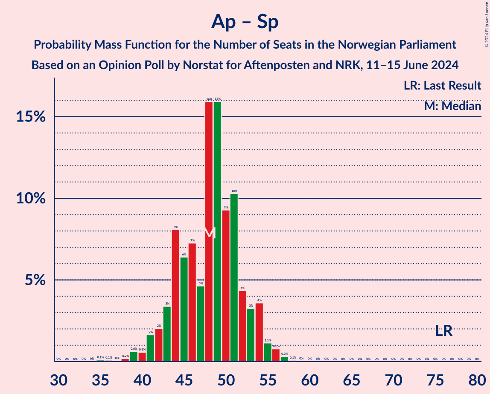

| Number of Seats | Probability | Accumulated | Special Marks |
|:---------------:|:-----------:|:-----------:|:-------------:|
| 35 | 0.1% | 100% |  |
| 36 | 0.1% | 99.9% |  |
| 37 | 0% | 99.8% |  |
| 38 | 0.2% | 99.8% |  |
| 39 | 0.6% | 99.6% |  |
| 40 | 0.6% | 99.0% |  |
| 41 | 2% | 98% |  |
| 42 | 2% | 97% |  |
| 43 | 3% | 95% |  |
| 44 | 8% | 91% |  |
| 45 | 6% | 83% |  |
| 46 | 7% | 77% |  |
| 47 | 5% | 70% |  |
| 48 | 16% | 65% |  |
| 49 | 16% | 49% | Median |
| 50 | 9% | 33% |  |
| 51 | 10% | 24% |  |
| 52 | 4% | 14% |  |
| 53 | 3% | 9% |  |
| 54 | 4% | 6% |  |
| 55 | 1.1% | 2% |  |
| 56 | 0.8% | 1.2% |  |
| 57 | 0.3% | 0.4% |  |
| 58 | 0.1% | 0.1% |  |
| 59 | 0% | 0% |  |
| 60 | 0% | 0% |  |
| 61 | 0% | 0% |  |
| 62 | 0% | 0% |  |
| 63 | 0% | 0% |  |
| 64 | 0% | 0% |  |
| 65 | 0% | 0% |  |
| 66 | 0% | 0% |  |
| 67 | 0% | 0% |  |
| 68 | 0% | 0% |  |
| 69 | 0% | 0% |  |
| 70 | 0% | 0% |  |
| 71 | 0% | 0% |  |
| 72 | 0% | 0% |  |
| 73 | 0% | 0% |  |
| 74 | 0% | 0% |  |
| 75 | 0% | 0% |  |
| 76 | 0% | 0% | Last Result |

### Venstre – Senterpartiet – Kristelig Folkeparti

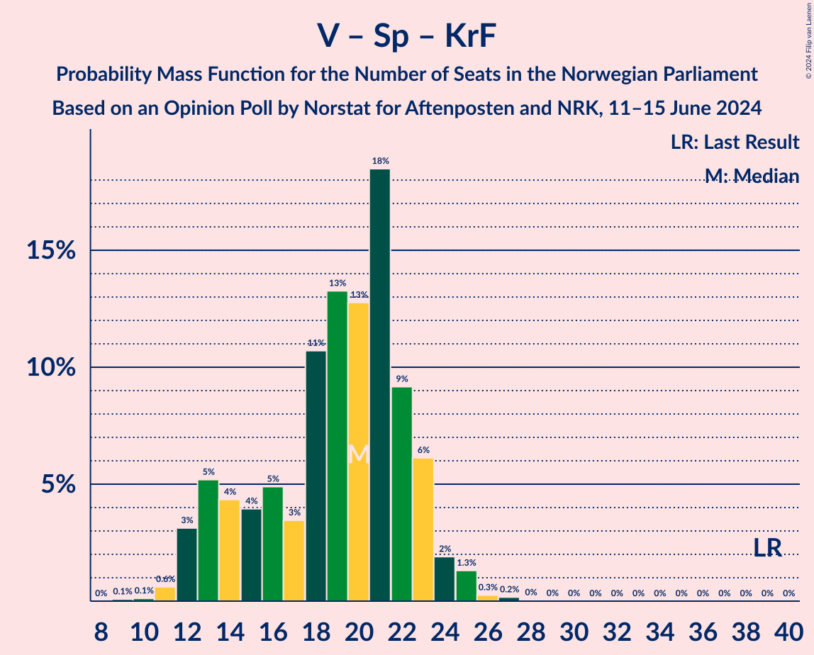

| Number of Seats | Probability | Accumulated | Special Marks |
|:---------------:|:-----------:|:-----------:|:-------------:|
| 9 | 0.1% | 100% |  |
| 10 | 0.1% | 99.9% |  |
| 11 | 0.6% | 99.8% |  |
| 12 | 3% | 99.2% |  |
| 13 | 5% | 96% |  |
| 14 | 4% | 91% |  |
| 15 | 4% | 87% |  |
| 16 | 5% | 83% |  |
| 17 | 3% | 78% |  |
| 18 | 11% | 74% |  |
| 19 | 13% | 64% |  |
| 20 | 13% | 50% | Median |
| 21 | 18% | 37% |  |
| 22 | 9% | 19% |  |
| 23 | 6% | 10% |  |
| 24 | 2% | 4% |  |
| 25 | 1.3% | 2% |  |
| 26 | 0.3% | 0.5% |  |
| 27 | 0.2% | 0.2% |  |
| 28 | 0% | 0.1% |  |
| 29 | 0% | 0% |  |
| 30 | 0% | 0% |  |
| 31 | 0% | 0% |  |
| 32 | 0% | 0% |  |
| 33 | 0% | 0% |  |
| 34 | 0% | 0% |  |
| 35 | 0% | 0% |  |
| 36 | 0% | 0% |  |
| 37 | 0% | 0% |  |
| 38 | 0% | 0% |  |
| 39 | 0% | 0% | Last Result |

## Technical Information

### Opinion Poll

+ **Polling firm:** Norstat
+ **Commissioner(s):** Aftenposten and NRK
+ **Fieldwork period:** 11–15 June 2024

### Calculations

+ **Sample size:** 993
+ **Simulations done:** 1,048,576
+ **Error estimate:** 1.55%

