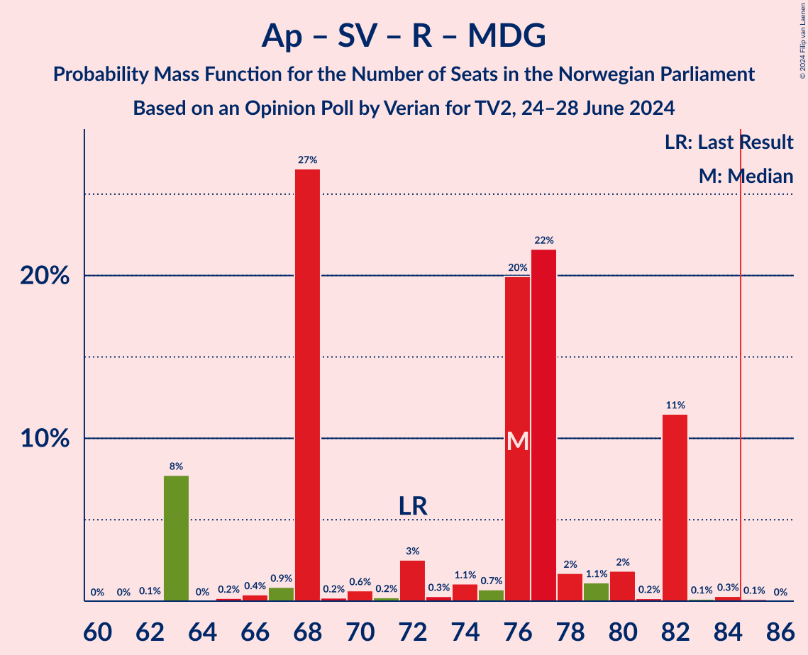

# Opinion Poll by Verian for TV2, 24–28 June 2024

<a href="#voting-intentions">Voting Intentions</a> | <a href="#seats">Seats</a> | <a href="#coalitions">Coalitions</a> | <a href="#technical-information">Technical Information</a>

## Voting Intentions

### Confidence Intervals

| Party | Last Result | Poll Result | 80% Confidence Interval | 90% Confidence Interval | 95% Confidence Interval | 99% Confidence Interval |
|:-----:|:-----------:|:-----------:|:-----------------------:|:-----------------------:|:-----------------------:|:-----------------------:|
| Høyre | 20.4% | 24.8% | 23.2–26.7% |22.7–27.2% |22.3–27.6% |21.5–28.5% |
| Arbeiderpartiet | 26.2% | 22.4% | 20.8–24.2% |20.3–24.7% |20.0–25.1% |19.2–26.0% |
| Fremskrittspartiet | 11.6% | 15.7% | 14.3–17.3% |13.9–17.7% |13.6–18.1% |13.0–18.9% |
| Sosialistisk Venstreparti | 7.6% | 11.0% | 9.8–12.4% |9.5–12.8% |9.2–13.1% |8.7–13.8% |
| Venstre | 4.6% | 5.9% | 5.0–7.0% |4.8–7.3% |4.6–7.6% |4.2–8.1% |
| Rødt | 4.7% | 4.9% | 4.1–5.9% |3.9–6.2% |3.7–6.4% |3.4–7.0% |
| Senterpartiet | 13.5% | 4.5% | 3.8–5.5% |3.6–5.7% |3.4–6.0% |3.1–6.5% |
| Miljøpartiet De Grønne | 3.9% | 3.8% | 3.1–4.7% |2.9–5.0% |2.8–5.2% |2.5–5.7% |
| Kristelig Folkeparti | 3.8% | 3.5% | 2.9–4.4% |2.7–4.6% |2.5–4.8% |2.3–5.3% |
| Industri- og Næringspartiet | 0.3% | 1.5% | 1.1–2.1% |1.0–2.3% |0.9–2.5% |0.7–2.8% |
| Norgesdemokratene | 1.1% | 0.9% | 0.6–1.4% |0.5–1.6% |0.5–1.7% |0.4–2.0% |
| Pensjonistpartiet | 0.6% | 0.7% | 0.5–1.2% |0.4–1.3% |0.3–1.4% |0.2–1.7% |
| Konservativt | 0.4% | 0.1% | 0.0–0.4% |0.0–0.5% |0.0–0.6% |0.0–0.7% |

*Note:* The poll result column reflects the actual value used in the calculations. Published results may vary slightly, and in addition be rounded to fewer digits.

## Seats

### Confidence Intervals

| Party | Last Result | Median | 80% Confidence Interval | 90% Confidence Interval | 95% Confidence Interval | 99% Confidence Interval |
|:-----:|:-----------:|:------:|:-----------------------:|:-----------------------:|:-----------------------:|:-----------------------:|
| <a href="#høyre">Høyre</a> | 36 | 45 | 40–48 |40–48 |40–48 |38–50 |
| <a href="#arbeiderpartiet">Arbeiderpartiet</a> | 48 | 41 | 40–47 |40–47 |40–47 |39–49 |
| <a href="#fremskrittspartiet">Fremskrittspartiet</a> | 21 | 30 | 23–32 |23–32 |23–32 |23–34 |
| <a href="#sosialistisk-venstreparti">Sosialistisk Venstreparti</a> | 13 | 19 | 18–26 |17–26 |17–26 |15–26 |
| <a href="#venstre">Venstre</a> | 8 | 10 | 10–13 |9–13 |9–13 |8–14 |
| <a href="#rødt">Rødt</a> | 8 | 8 | 1–11 |1–11 |1–11 |1–12 |
| <a href="#senterpartiet">Senterpartiet</a> | 28 | 8 | 0–9 |0–9 |0–10 |0–11 |
| <a href="#miljøpartiet-de-grønne">Miljøpartiet De Grønne</a> | 3 | 2 | 2–7 |2–8 |1–8 |1–10 |
| <a href="#kristelig-folkeparti">Kristelig Folkeparti</a> | 3 | 3 | 2–8 |2–8 |2–8 |2–8 |
| <a href="#industri--og-næringspartiet">Industri- og Næringspartiet</a> | 0 | 0 | 0 |0 |0 |0–1 |
| <a href="#norgesdemokratene">Norgesdemokratene</a> | 0 | 0 | 0 |0 |0 |0 |
| <a href="#pensjonistpartiet">Pensjonistpartiet</a> | 0 | 0 | 0 |0 |0 |0 |
| <a href="#konservativt">Konservativt</a> | 0 | 0 | 0 |0 |0 |0 |

### Høyre

*For a full overview of the results for this party, see the [Høyre](party-høyre.html) page.*

| Number of Seats | Probability | Accumulated | Special Marks |
|:---------------:|:-----------:|:-----------:|:-------------:|
| 36 | 0.1% | 100% | Last Result |
| 37 | 0% | 99.9% |  |
| 38 | 1.4% | 99.9% |  |
| 39 | 0.1% | 98% |  |
| 40 | 19% | 98% |  |
| 41 | 1.1% | 80% |  |
| 42 | 2% | 78% |  |
| 43 | 0.7% | 76% |  |
| 44 | 5% | 76% |  |
| 45 | 33% | 71% | Median |
| 46 | 25% | 37% |  |
| 47 | 2% | 12% |  |
| 48 | 8% | 10% |  |
| 49 | 0.4% | 2% |  |
| 50 | 1.2% | 1.2% |  |
| 51 | 0.1% | 0.1% |  |
| 52 | 0% | 0% |  |

### Arbeiderpartiet

*For a full overview of the results for this party, see the [Arbeiderpartiet](party-arbeiderpartiet.html) page.*

| Number of Seats | Probability | Accumulated | Special Marks |
|:---------------:|:-----------:|:-----------:|:-------------:|
| 35 | 0% | 100% |  |
| 36 | 0% | 99.9% |  |
| 37 | 0.1% | 99.9% |  |
| 38 | 0.3% | 99.8% |  |
| 39 | 1.1% | 99.5% |  |
| 40 | 48% | 98% |  |
| 41 | 20% | 50% | Median |
| 42 | 11% | 30% |  |
| 43 | 0.3% | 19% |  |
| 44 | 2% | 18% |  |
| 45 | 1.1% | 16% |  |
| 46 | 0.1% | 15% |  |
| 47 | 15% | 15% |  |
| 48 | 0.1% | 0.6% | Last Result |
| 49 | 0.4% | 0.5% |  |
| 50 | 0.1% | 0.1% |  |
| 51 | 0% | 0% |  |

### Fremskrittspartiet

*For a full overview of the results for this party, see the [Fremskrittspartiet](party-fremskrittspartiet.html) page.*

| Number of Seats | Probability | Accumulated | Special Marks |
|:---------------:|:-----------:|:-----------:|:-------------:|
| 21 | 0% | 100% | Last Result |
| 22 | 0.1% | 100% |  |
| 23 | 12% | 99.9% |  |
| 24 | 2% | 88% |  |
| 25 | 20% | 85% |  |
| 26 | 0.1% | 65% |  |
| 27 | 8% | 65% |  |
| 28 | 1.0% | 57% |  |
| 29 | 4% | 56% |  |
| 30 | 28% | 52% | Median |
| 31 | 3% | 24% |  |
| 32 | 19% | 21% |  |
| 33 | 1.0% | 2% |  |
| 34 | 0.4% | 0.9% |  |
| 35 | 0.3% | 0.4% |  |
| 36 | 0.1% | 0.1% |  |
| 37 | 0% | 0% |  |

### Sosialistisk Venstreparti

*For a full overview of the results for this party, see the [Sosialistisk Venstreparti](party-sosialistiskvenstreparti.html) page.*

| Number of Seats | Probability | Accumulated | Special Marks |
|:---------------:|:-----------:|:-----------:|:-------------:|
| 13 | 0% | 100% | Last Result |
| 14 | 0.3% | 99.9% |  |
| 15 | 0.2% | 99.6% |  |
| 16 | 2% | 99.4% |  |
| 17 | 3% | 98% |  |
| 18 | 39% | 95% |  |
| 19 | 27% | 56% | Median |
| 20 | 2% | 28% |  |
| 21 | 2% | 26% |  |
| 22 | 3% | 24% |  |
| 23 | 2% | 22% |  |
| 24 | 0.6% | 20% |  |
| 25 | 0.1% | 19% |  |
| 26 | 19% | 19% |  |
| 27 | 0% | 0% |  |

### Venstre

*For a full overview of the results for this party, see the [Venstre](party-venstre.html) page.*

| Number of Seats | Probability | Accumulated | Special Marks |
|:---------------:|:-----------:|:-----------:|:-------------:|
| 3 | 0.1% | 100% |  |
| 4 | 0% | 99.9% |  |
| 5 | 0% | 99.9% |  |
| 6 | 0.1% | 99.9% |  |
| 7 | 0% | 99.8% |  |
| 8 | 0.6% | 99.8% | Last Result |
| 9 | 4% | 99.2% |  |
| 10 | 75% | 95% | Median |
| 11 | 6% | 20% |  |
| 12 | 3% | 14% |  |
| 13 | 10% | 11% |  |
| 14 | 0.6% | 0.8% |  |
| 15 | 0.2% | 0.3% |  |
| 16 | 0% | 0% |  |

### Rødt

*For a full overview of the results for this party, see the [Rødt](party-rødt.html) page.*

| Number of Seats | Probability | Accumulated | Special Marks |
|:---------------:|:-----------:|:-----------:|:-------------:|
| 1 | 11% | 100% |  |
| 2 | 0% | 89% |  |
| 3 | 0% | 89% |  |
| 4 | 0% | 89% |  |
| 5 | 0% | 89% |  |
| 6 | 0% | 89% |  |
| 7 | 26% | 89% |  |
| 8 | 23% | 63% | Last Result, Median |
| 9 | 2% | 40% |  |
| 10 | 17% | 38% |  |
| 11 | 20% | 20% |  |
| 12 | 0.7% | 0.8% |  |
| 13 | 0% | 0% |  |

### Senterpartiet

*For a full overview of the results for this party, see the [Senterpartiet](party-senterpartiet.html) page.*

| Number of Seats | Probability | Accumulated | Special Marks |
|:---------------:|:-----------:|:-----------:|:-------------:|
| 0 | 15% | 100% |  |
| 1 | 1.1% | 85% |  |
| 2 | 0% | 84% |  |
| 3 | 0% | 84% |  |
| 4 | 0% | 84% |  |
| 5 | 0% | 84% |  |
| 6 | 0% | 84% |  |
| 7 | 1.2% | 84% |  |
| 8 | 46% | 82% | Median |
| 9 | 32% | 36% |  |
| 10 | 4% | 5% |  |
| 11 | 0.5% | 0.9% |  |
| 12 | 0.2% | 0.3% |  |
| 13 | 0% | 0.1% |  |
| 14 | 0.1% | 0.1% |  |
| 15 | 0% | 0% |  |
| 16 | 0% | 0% |  |
| 17 | 0% | 0% |  |
| 18 | 0% | 0% |  |
| 19 | 0% | 0% |  |
| 20 | 0% | 0% |  |
| 21 | 0% | 0% |  |
| 22 | 0% | 0% |  |
| 23 | 0% | 0% |  |
| 24 | 0% | 0% |  |
| 25 | 0% | 0% |  |
| 26 | 0% | 0% |  |
| 27 | 0% | 0% |  |
| 28 | 0% | 0% | Last Result |

### Miljøpartiet De Grønne

*For a full overview of the results for this party, see the [Miljøpartiet De Grønne](party-miljøpartietdegrønne.html) page.*

| Number of Seats | Probability | Accumulated | Special Marks |
|:---------------:|:-----------:|:-----------:|:-------------:|
| 1 | 4% | 100% |  |
| 2 | 57% | 96% | Median |
| 3 | 0.3% | 39% | Last Result |
| 4 | 0% | 39% |  |
| 5 | 0% | 39% |  |
| 6 | 0% | 39% |  |
| 7 | 34% | 39% |  |
| 8 | 4% | 5% |  |
| 9 | 1.2% | 2% |  |
| 10 | 0.5% | 0.5% |  |
| 11 | 0% | 0% |  |

### Kristelig Folkeparti

*For a full overview of the results for this party, see the [Kristelig Folkeparti](party-kristeligfolkeparti.html) page.*

| Number of Seats | Probability | Accumulated | Special Marks |
|:---------------:|:-----------:|:-----------:|:-------------:|
| 1 | 0.4% | 100% |  |
| 2 | 46% | 99.6% |  |
| 3 | 7% | 53% | Last Result, Median |
| 4 | 0% | 47% |  |
| 5 | 0% | 47% |  |
| 6 | 24% | 47% |  |
| 7 | 3% | 23% |  |
| 8 | 19% | 19% |  |
| 9 | 0% | 0.1% |  |
| 10 | 0% | 0% |  |

### Industri- og Næringspartiet

*For a full overview of the results for this party, see the [Industri- og Næringspartiet](party-industri-ognæringspartiet.html) page.*

| Number of Seats | Probability | Accumulated | Special Marks |
|:---------------:|:-----------:|:-----------:|:-------------:|
| 0 | 98% | 100% | Last Result, Median |
| 1 | 2% | 2% |  |
| 2 | 0.1% | 0.1% |  |
| 3 | 0% | 0% |  |

### Norgesdemokratene

*For a full overview of the results for this party, see the [Norgesdemokratene](party-norgesdemokratene.html) page.*

| Number of Seats | Probability | Accumulated | Special Marks |
|:---------------:|:-----------:|:-----------:|:-------------:|
| 0 | 100% | 100% | Last Result, Median |

### Pensjonistpartiet

*For a full overview of the results for this party, see the [Pensjonistpartiet](party-pensjonistpartiet.html) page.*

| Number of Seats | Probability | Accumulated | Special Marks |
|:---------------:|:-----------:|:-----------:|:-------------:|
| 0 | 100% | 100% | Last Result, Median |

### Konservativt

*For a full overview of the results for this party, see the [Konservativt](party-konservativt.html) page.*

| Number of Seats | Probability | Accumulated | Special Marks |
|:---------------:|:-----------:|:-----------:|:-------------:|
| 0 | 100% | 100% | Last Result, Median |

## Coalitions

### Confidence Intervals

| Coalition | Last Result | Median | Majority? | 80% Confidence Interval | 90% Confidence Interval | 95% Confidence Interval | 99% Confidence Interval |
|:---------:|:-----------:|:------:|:---------:|:-----------------------:|:-----------------------:|:-----------------------:|:-----------------------:|
| Høyre – Fremskrittspartiet – Venstre – Senterpartiet – Kristelig Folkeparti | 96 | 92 | 99.9% | 86–100 | 86–105 | 86–105 | 86–105 |
| Høyre – Fremskrittspartiet – Venstre – Miljøpartiet De Grønne – Kristelig Folkeparti | 71 | 93 | 80% | 84–98 | 84–98 | 84–99 | 83–99 |
| Høyre – Fremskrittspartiet – Venstre – Kristelig Folkeparti | 68 | 86 | 57% | 82–92 | 82–96 | 82–96 | 78–96 |
| Høyre – Fremskrittspartiet – Venstre | 65 | 82 | 41% | 78–88 | 78–88 | 78–89 | 76–91 |
| Arbeiderpartiet – Sosialistisk Venstreparti – Rødt – Senterpartiet – Miljøpartiet De Grønne | 100 | 82 | 25% | 76–86 | 72–86 | 72–86 | 72–90 |
| Arbeiderpartiet – Sosialistisk Venstreparti – Rødt – Senterpartiet | 97 | 75 | 1.1% | 70–84 | 70–84 | 69–84 | 69–85 |
| Arbeiderpartiet – Sosialistisk Venstreparti – Senterpartiet – Miljøpartiet De Grønne – Kristelig Folkeparti | 95 | 76 | 0.2% | 75–80 | 73–80 | 70–82 | 69–84 |
| Arbeiderpartiet – Sosialistisk Venstreparti – Rødt – Miljøpartiet De Grønne | 72 | 76 | 0.1% | 68–82 | 63–82 | 63–82 | 63–83 |
| Arbeiderpartiet – Sosialistisk Venstreparti – Senterpartiet – Miljøpartiet De Grønne | 92 | 73 | 0% | 69–78 | 69–78 | 67–78 | 66–81 |
| Høyre – Fremskrittspartiet | 57 | 72 | 0% | 68–76 | 68–76 | 68–77 | 66–80 |
| Arbeiderpartiet – Sosialistisk Venstreparti – Senterpartiet | 89 | 67 | 0% | 65–76 | 65–76 | 65–76 | 59–76 |
| Høyre – Venstre – Kristelig Folkeparti | 47 | 60 | 0% | 52–63 | 52–69 | 52–69 | 49–69 |
| Arbeiderpartiet – Sosialistisk Venstreparti | 61 | 59 | 0% | 58–67 | 58–67 | 57–67 | 57–69 |
| Arbeiderpartiet – Senterpartiet – Miljøpartiet De Grønne – Kristelig Folkeparti | 82 | 56 | 0% | 54–62 | 53–62 | 51–63 | 46–65 |
| Arbeiderpartiet – Senterpartiet – Kristelig Folkeparti | 79 | 53 | 0% | 50–58 | 50–59 | 48–59 | 43–63 |
| Arbeiderpartiet – Senterpartiet | 76 | 48 | 0% | 47–51 | 47–52 | 43–54 | 40–56 |
| Venstre – Senterpartiet – Kristelig Folkeparti | 39 | 21 | 0% | 18–26 | 18–30 | 13–30 | 11–30 |

### Høyre – Fremskrittspartiet – Venstre – Senterpartiet – Kristelig Folkeparti

| Number of Seats | Probability | Accumulated | Special Marks |
|:---------------:|:-----------:|:-----------:|:-------------:|
| 84 | 0.1% | 100% |  |
| 85 | 0.3% | 99.9% | Majority |
| 86 | 12% | 99.5% |  |
| 87 | 0.2% | 88% |  |
| 88 | 2% | 88% |  |
| 89 | 0.9% | 86% |  |
| 90 | 2% | 85% |  |
| 91 | 22% | 83% |  |
| 92 | 19% | 62% |  |
| 93 | 2% | 43% |  |
| 94 | 0.6% | 41% |  |
| 95 | 0.9% | 40% |  |
| 96 | 3% | 39% | Last Result, Median |
| 97 | 0.4% | 37% |  |
| 98 | 0.3% | 36% |  |
| 99 | 0.3% | 36% |  |
| 100 | 26% | 36% |  |
| 101 | 1.1% | 10% |  |
| 102 | 0.4% | 8% |  |
| 103 | 0.2% | 8% |  |
| 104 | 0% | 8% |  |
| 105 | 8% | 8% |  |
| 106 | 0.1% | 0.1% |  |
| 107 | 0% | 0% |  |

### Høyre – Fremskrittspartiet – Venstre – Miljøpartiet De Grønne – Kristelig Folkeparti

| Number of Seats | Probability | Accumulated | Special Marks |
|:---------------:|:-----------:|:-----------:|:-------------:|
| 71 | 0% | 100% | Last Result |
| 72 | 0% | 100% |  |
| 73 | 0% | 100% |  |
| 74 | 0% | 100% |  |
| 75 | 0% | 100% |  |
| 76 | 0% | 100% |  |
| 77 | 0% | 100% |  |
| 78 | 0% | 100% |  |
| 79 | 0% | 100% |  |
| 80 | 0.1% | 100% |  |
| 81 | 0% | 99.9% |  |
| 82 | 0% | 99.9% |  |
| 83 | 0.9% | 99.9% |  |
| 84 | 19% | 99.0% |  |
| 85 | 2% | 80% | Majority |
| 86 | 0.5% | 78% |  |
| 87 | 0% | 77% |  |
| 88 | 1.3% | 77% |  |
| 89 | 2% | 76% |  |
| 90 | 0% | 73% | Median |
| 91 | 19% | 73% |  |
| 92 | 0.7% | 55% |  |
| 93 | 16% | 54% |  |
| 94 | 25% | 38% |  |
| 95 | 1.4% | 13% |  |
| 96 | 0.2% | 12% |  |
| 97 | 0.9% | 11% |  |
| 98 | 8% | 10% |  |
| 99 | 2% | 3% |  |
| 100 | 0.1% | 0.4% |  |
| 101 | 0% | 0.3% |  |
| 102 | 0% | 0.3% |  |
| 103 | 0.2% | 0.2% |  |
| 104 | 0% | 0% |  |

### Høyre – Fremskrittspartiet – Venstre – Kristelig Folkeparti

| Number of Seats | Probability | Accumulated | Special Marks |
|:---------------:|:-----------:|:-----------:|:-------------:|
| 68 | 0% | 100% | Last Result |
| 69 | 0% | 100% |  |
| 70 | 0% | 100% |  |
| 71 | 0% | 100% |  |
| 72 | 0% | 100% |  |
| 73 | 0% | 100% |  |
| 74 | 0% | 100% |  |
| 75 | 0% | 100% |  |
| 76 | 0% | 100% |  |
| 77 | 0.1% | 100% |  |
| 78 | 0.4% | 99.9% |  |
| 79 | 0% | 99.5% |  |
| 80 | 0% | 99.4% |  |
| 81 | 2% | 99.4% |  |
| 82 | 20% | 98% |  |
| 83 | 0.8% | 78% |  |
| 84 | 20% | 77% |  |
| 85 | 1.0% | 57% | Majority |
| 86 | 14% | 56% |  |
| 87 | 0.3% | 42% |  |
| 88 | 2% | 42% | Median |
| 89 | 1.0% | 39% |  |
| 90 | 0.2% | 38% |  |
| 91 | 4% | 38% |  |
| 92 | 25% | 34% |  |
| 93 | 0.9% | 9% |  |
| 94 | 0.1% | 8% |  |
| 95 | 0.2% | 8% |  |
| 96 | 8% | 8% |  |
| 97 | 0.1% | 0.2% |  |
| 98 | 0.1% | 0.1% |  |
| 99 | 0% | 0% |  |

### Høyre – Fremskrittspartiet – Venstre

| Number of Seats | Probability | Accumulated | Special Marks |
|:---------------:|:-----------:|:-----------:|:-------------:|
| 65 | 0% | 100% | Last Result |
| 66 | 0% | 100% |  |
| 67 | 0% | 100% |  |
| 68 | 0% | 100% |  |
| 69 | 0% | 100% |  |
| 70 | 0% | 100% |  |
| 71 | 0% | 100% |  |
| 72 | 0% | 100% |  |
| 73 | 0% | 99.9% |  |
| 74 | 0.1% | 99.9% |  |
| 75 | 0.2% | 99.8% |  |
| 76 | 0.1% | 99.6% |  |
| 77 | 2% | 99.5% |  |
| 78 | 12% | 98% |  |
| 79 | 2% | 86% |  |
| 80 | 20% | 84% |  |
| 81 | 1.5% | 64% |  |
| 82 | 18% | 63% |  |
| 83 | 0.9% | 44% |  |
| 84 | 3% | 43% |  |
| 85 | 2% | 41% | Median, Majority |
| 86 | 25% | 39% |  |
| 87 | 0.1% | 14% |  |
| 88 | 10% | 14% |  |
| 89 | 2% | 4% |  |
| 90 | 0.4% | 1.5% |  |
| 91 | 0.9% | 1.1% |  |
| 92 | 0% | 0.2% |  |
| 93 | 0.1% | 0.1% |  |
| 94 | 0% | 0.1% |  |
| 95 | 0% | 0% |  |

### Arbeiderpartiet – Sosialistisk Venstreparti – Rødt – Senterpartiet – Miljøpartiet De Grønne

| Number of Seats | Probability | Accumulated | Special Marks |
|:---------------:|:-----------:|:-----------:|:-------------:|
| 70 | 0.1% | 100% |  |
| 71 | 0.3% | 99.9% |  |
| 72 | 8% | 99.6% |  |
| 73 | 0.2% | 92% |  |
| 74 | 0.1% | 92% |  |
| 75 | 0.9% | 92% |  |
| 76 | 25% | 91% |  |
| 77 | 4% | 66% |  |
| 78 | 0.4% | 62% | Median |
| 79 | 0.8% | 62% |  |
| 80 | 2% | 61% |  |
| 81 | 0.9% | 59% |  |
| 82 | 14% | 58% |  |
| 83 | 0.6% | 44% |  |
| 84 | 19% | 43% |  |
| 85 | 2% | 25% | Majority |
| 86 | 20% | 23% |  |
| 87 | 2% | 2% |  |
| 88 | 0% | 0.6% |  |
| 89 | 0% | 0.6% |  |
| 90 | 0.2% | 0.5% |  |
| 91 | 0.3% | 0.4% |  |
| 92 | 0% | 0% |  |
| 93 | 0% | 0% |  |
| 94 | 0% | 0% |  |
| 95 | 0% | 0% |  |
| 96 | 0% | 0% |  |
| 97 | 0% | 0% |  |
| 98 | 0% | 0% |  |
| 99 | 0% | 0% |  |
| 100 | 0% | 0% | Last Result |

### Arbeiderpartiet – Sosialistisk Venstreparti – Rødt – Senterpartiet

| Number of Seats | Probability | Accumulated | Special Marks |
|:---------------:|:-----------:|:-----------:|:-------------:|
| 64 | 0.2% | 100% |  |
| 65 | 0% | 99.8% |  |
| 66 | 0% | 99.8% |  |
| 67 | 0% | 99.7% |  |
| 68 | 0.1% | 99.7% |  |
| 69 | 2% | 99.6% |  |
| 70 | 8% | 97% |  |
| 71 | 1.0% | 90% |  |
| 72 | 0.1% | 89% |  |
| 73 | 1.1% | 89% |  |
| 74 | 25% | 87% |  |
| 75 | 16% | 62% |  |
| 76 | 0.9% | 46% | Median |
| 77 | 19% | 45% |  |
| 78 | 0.1% | 27% |  |
| 79 | 2% | 27% |  |
| 80 | 2% | 25% |  |
| 81 | 0.1% | 23% |  |
| 82 | 0.3% | 23% |  |
| 83 | 0.8% | 23% |  |
| 84 | 21% | 22% |  |
| 85 | 0.9% | 1.1% | Majority |
| 86 | 0% | 0.1% |  |
| 87 | 0% | 0.1% |  |
| 88 | 0.1% | 0.1% |  |
| 89 | 0% | 0% |  |
| 90 | 0% | 0% |  |
| 91 | 0% | 0% |  |
| 92 | 0% | 0% |  |
| 93 | 0% | 0% |  |
| 94 | 0% | 0% |  |
| 95 | 0% | 0% |  |
| 96 | 0% | 0% |  |
| 97 | 0% | 0% | Last Result |

### Arbeiderpartiet – Sosialistisk Venstreparti – Senterpartiet – Miljøpartiet De Grønne – Kristelig Folkeparti

| Number of Seats | Probability | Accumulated | Special Marks |
|:---------------:|:-----------:|:-----------:|:-------------:|
| 65 | 0% | 100% |  |
| 66 | 0% | 99.9% |  |
| 67 | 0.1% | 99.9% |  |
| 68 | 0.2% | 99.8% |  |
| 69 | 1.4% | 99.7% |  |
| 70 | 0.8% | 98% |  |
| 71 | 0.2% | 97% |  |
| 72 | 0.5% | 97% |  |
| 73 | 2% | 97% | Median |
| 74 | 0.7% | 95% |  |
| 75 | 42% | 94% |  |
| 76 | 4% | 52% |  |
| 77 | 2% | 48% |  |
| 78 | 0.7% | 47% |  |
| 79 | 11% | 46% |  |
| 80 | 31% | 35% |  |
| 81 | 0.8% | 3% |  |
| 82 | 2% | 3% |  |
| 83 | 0.2% | 0.8% |  |
| 84 | 0.4% | 0.6% |  |
| 85 | 0% | 0.2% | Majority |
| 86 | 0.1% | 0.2% |  |
| 87 | 0% | 0.1% |  |
| 88 | 0% | 0.1% |  |
| 89 | 0% | 0.1% |  |
| 90 | 0% | 0% |  |
| 91 | 0% | 0% |  |
| 92 | 0% | 0% |  |
| 93 | 0% | 0% |  |
| 94 | 0% | 0% |  |
| 95 | 0% | 0% | Last Result |

### Arbeiderpartiet – Sosialistisk Venstreparti – Rødt – Miljøpartiet De Grønne

| Number of Seats | Probability | Accumulated | Special Marks |
|:---------------:|:-----------:|:-----------:|:-------------:|
| 62 | 0.1% | 100% |  |
| 63 | 8% | 99.9% |  |
| 64 | 0% | 92% |  |
| 65 | 0.2% | 92% |  |
| 66 | 0.4% | 92% |  |
| 67 | 0.9% | 92% |  |
| 68 | 27% | 91% |  |
| 69 | 0.2% | 64% |  |
| 70 | 0.6% | 64% | Median |
| 71 | 0.2% | 63% |  |
| 72 | 3% | 63% | Last Result |
| 73 | 0.3% | 61% |  |
| 74 | 1.1% | 60% |  |
| 75 | 0.7% | 59% |  |
| 76 | 20% | 58% |  |
| 77 | 22% | 39% |  |
| 78 | 2% | 17% |  |
| 79 | 1.1% | 15% |  |
| 80 | 2% | 14% |  |
| 81 | 0.2% | 12% |  |
| 82 | 11% | 12% |  |
| 83 | 0.1% | 0.6% |  |
| 84 | 0.3% | 0.4% |  |
| 85 | 0.1% | 0.1% | Majority |
| 86 | 0% | 0% |  |

### Arbeiderpartiet – Sosialistisk Venstreparti – Senterpartiet – Miljøpartiet De Grønne

| Number of Seats | Probability | Accumulated | Special Marks |
|:---------------:|:-----------:|:-----------:|:-------------:|
| 62 | 0% | 100% |  |
| 63 | 0.1% | 99.9% |  |
| 64 | 0.2% | 99.8% |  |
| 65 | 0.1% | 99.6% |  |
| 66 | 0.1% | 99.6% |  |
| 67 | 2% | 99.5% |  |
| 68 | 0% | 97% |  |
| 69 | 24% | 97% |  |
| 70 | 3% | 73% | Median |
| 71 | 8% | 70% |  |
| 72 | 12% | 62% |  |
| 73 | 18% | 50% |  |
| 74 | 4% | 32% |  |
| 75 | 4% | 28% |  |
| 76 | 3% | 25% |  |
| 77 | 1.1% | 22% |  |
| 78 | 20% | 21% |  |
| 79 | 0.1% | 0.8% |  |
| 80 | 0% | 0.6% |  |
| 81 | 0.4% | 0.6% |  |
| 82 | 0.1% | 0.2% |  |
| 83 | 0% | 0.1% |  |
| 84 | 0.1% | 0.1% |  |
| 85 | 0% | 0% | Majority |
| 86 | 0% | 0% |  |
| 87 | 0% | 0% |  |
| 88 | 0% | 0% |  |
| 89 | 0% | 0% |  |
| 90 | 0% | 0% |  |
| 91 | 0% | 0% |  |
| 92 | 0% | 0% | Last Result |

### Høyre – Fremskrittspartiet

| Number of Seats | Probability | Accumulated | Special Marks |
|:---------------:|:-----------:|:-----------:|:-------------:|
| 57 | 0% | 100% | Last Result |
| 58 | 0% | 100% |  |
| 59 | 0% | 100% |  |
| 60 | 0% | 100% |  |
| 61 | 0% | 100% |  |
| 62 | 0.1% | 100% |  |
| 63 | 0% | 99.9% |  |
| 64 | 0% | 99.9% |  |
| 65 | 0.1% | 99.9% |  |
| 66 | 2% | 99.8% |  |
| 67 | 0.5% | 98% |  |
| 68 | 12% | 98% |  |
| 69 | 2% | 86% |  |
| 70 | 21% | 84% |  |
| 71 | 0.4% | 63% |  |
| 72 | 18% | 62% |  |
| 73 | 3% | 45% |  |
| 74 | 0.1% | 41% |  |
| 75 | 13% | 41% | Median |
| 76 | 25% | 28% |  |
| 77 | 0.9% | 3% |  |
| 78 | 0.2% | 2% |  |
| 79 | 0.9% | 2% |  |
| 80 | 1.2% | 1.4% |  |
| 81 | 0% | 0.2% |  |
| 82 | 0.1% | 0.2% |  |
| 83 | 0.1% | 0.1% |  |
| 84 | 0% | 0% |  |

### Arbeiderpartiet – Sosialistisk Venstreparti – Senterpartiet

| Number of Seats | Probability | Accumulated | Special Marks |
|:---------------:|:-----------:|:-----------:|:-------------:|
| 58 | 0% | 100% |  |
| 59 | 0.7% | 99.9% |  |
| 60 | 0% | 99.2% |  |
| 61 | 0.1% | 99.2% |  |
| 62 | 0.2% | 99.1% |  |
| 63 | 0.3% | 98.8% |  |
| 64 | 0.2% | 98.5% |  |
| 65 | 14% | 98% |  |
| 66 | 19% | 85% |  |
| 67 | 27% | 66% |  |
| 68 | 3% | 39% | Median |
| 69 | 10% | 36% |  |
| 70 | 0.2% | 26% |  |
| 71 | 0.9% | 25% |  |
| 72 | 0.8% | 24% |  |
| 73 | 2% | 24% |  |
| 74 | 2% | 22% |  |
| 75 | 1.1% | 20% |  |
| 76 | 19% | 19% |  |
| 77 | 0% | 0.1% |  |
| 78 | 0% | 0.1% |  |
| 79 | 0% | 0.1% |  |
| 80 | 0.1% | 0.1% |  |
| 81 | 0% | 0% |  |
| 82 | 0% | 0% |  |
| 83 | 0% | 0% |  |
| 84 | 0% | 0% |  |
| 85 | 0% | 0% | Majority |
| 86 | 0% | 0% |  |
| 87 | 0% | 0% |  |
| 88 | 0% | 0% |  |
| 89 | 0% | 0% | Last Result |

### Høyre – Venstre – Kristelig Folkeparti

| Number of Seats | Probability | Accumulated | Special Marks |
|:---------------:|:-----------:|:-----------:|:-------------:|
| 47 | 0% | 100% | Last Result |
| 48 | 0% | 100% |  |
| 49 | 0.8% | 100% |  |
| 50 | 0.1% | 99.2% |  |
| 51 | 0.1% | 99.2% |  |
| 52 | 19% | 99.1% |  |
| 53 | 0.3% | 80% |  |
| 54 | 0.7% | 80% |  |
| 55 | 0.5% | 79% |  |
| 56 | 0.3% | 79% |  |
| 57 | 22% | 79% |  |
| 58 | 3% | 56% | Median |
| 59 | 0.8% | 53% |  |
| 60 | 5% | 52% |  |
| 61 | 2% | 47% |  |
| 62 | 25% | 45% |  |
| 63 | 11% | 20% |  |
| 64 | 0.2% | 9% |  |
| 65 | 0.1% | 8% |  |
| 66 | 0.4% | 8% |  |
| 67 | 0% | 8% |  |
| 68 | 0% | 8% |  |
| 69 | 8% | 8% |  |
| 70 | 0% | 0% |  |

### Arbeiderpartiet – Sosialistisk Venstreparti

| Number of Seats | Probability | Accumulated | Special Marks |
|:---------------:|:-----------:|:-----------:|:-------------:|
| 53 | 0.1% | 100% |  |
| 54 | 0.2% | 99.9% |  |
| 55 | 0.1% | 99.7% |  |
| 56 | 0.1% | 99.6% |  |
| 57 | 3% | 99.5% |  |
| 58 | 20% | 96% |  |
| 59 | 27% | 77% |  |
| 60 | 8% | 50% | Median |
| 61 | 0.9% | 41% | Last Result |
| 62 | 0.3% | 41% |  |
| 63 | 0.9% | 40% |  |
| 64 | 2% | 39% |  |
| 65 | 16% | 38% |  |
| 66 | 0.7% | 22% |  |
| 67 | 19% | 21% |  |
| 68 | 0.1% | 2% |  |
| 69 | 2% | 2% |  |
| 70 | 0.1% | 0.2% |  |
| 71 | 0.1% | 0.1% |  |
| 72 | 0% | 0% |  |

### Arbeiderpartiet – Senterpartiet – Miljøpartiet De Grønne – Kristelig Folkeparti

| Number of Seats | Probability | Accumulated | Special Marks |
|:---------------:|:-----------:|:-----------:|:-------------:|
| 44 | 0% | 100% |  |
| 45 | 0% | 99.9% |  |
| 46 | 1.3% | 99.9% |  |
| 47 | 0% | 98.6% |  |
| 48 | 0% | 98.5% |  |
| 49 | 0% | 98.5% |  |
| 50 | 0.2% | 98% |  |
| 51 | 2% | 98% |  |
| 52 | 0.1% | 96% |  |
| 53 | 1.0% | 96% |  |
| 54 | 19% | 95% | Median |
| 55 | 0.8% | 76% |  |
| 56 | 25% | 75% |  |
| 57 | 19% | 50% |  |
| 58 | 2% | 31% |  |
| 59 | 3% | 29% |  |
| 60 | 3% | 26% |  |
| 61 | 9% | 23% |  |
| 62 | 12% | 14% |  |
| 63 | 0.2% | 3% |  |
| 64 | 1.4% | 2% |  |
| 65 | 0.4% | 0.9% |  |
| 66 | 0.3% | 0.5% |  |
| 67 | 0.1% | 0.2% |  |
| 68 | 0% | 0.1% |  |
| 69 | 0% | 0.1% |  |
| 70 | 0% | 0% |  |
| 71 | 0% | 0% |  |
| 72 | 0% | 0% |  |
| 73 | 0% | 0% |  |
| 74 | 0% | 0% |  |
| 75 | 0% | 0% |  |
| 76 | 0% | 0% |  |
| 77 | 0% | 0% |  |
| 78 | 0% | 0% |  |
| 79 | 0% | 0% |  |
| 80 | 0% | 0% |  |
| 81 | 0% | 0% |  |
| 82 | 0% | 0% | Last Result |

### Arbeiderpartiet – Senterpartiet – Kristelig Folkeparti

| Number of Seats | Probability | Accumulated | Special Marks |
|:---------------:|:-----------:|:-----------:|:-------------:|
| 42 | 0% | 100% |  |
| 43 | 0.7% | 99.9% |  |
| 44 | 1.4% | 99.2% |  |
| 45 | 0.1% | 98% |  |
| 46 | 0% | 98% |  |
| 47 | 0.1% | 98% |  |
| 48 | 0.4% | 98% |  |
| 49 | 0.3% | 97% |  |
| 50 | 20% | 97% |  |
| 51 | 2% | 77% |  |
| 52 | 25% | 75% | Median |
| 53 | 1.2% | 51% |  |
| 54 | 25% | 49% |  |
| 55 | 12% | 24% |  |
| 56 | 1.3% | 12% |  |
| 57 | 0.7% | 11% |  |
| 58 | 0.2% | 10% |  |
| 59 | 8% | 10% |  |
| 60 | 0.1% | 2% |  |
| 61 | 0% | 1.4% |  |
| 62 | 0.1% | 1.4% |  |
| 63 | 1.3% | 1.3% |  |
| 64 | 0% | 0% |  |
| 65 | 0% | 0% |  |
| 66 | 0% | 0% |  |
| 67 | 0% | 0% |  |
| 68 | 0% | 0% |  |
| 69 | 0% | 0% |  |
| 70 | 0% | 0% |  |
| 71 | 0% | 0% |  |
| 72 | 0% | 0% |  |
| 73 | 0% | 0% |  |
| 74 | 0% | 0% |  |
| 75 | 0% | 0% |  |
| 76 | 0% | 0% |  |
| 77 | 0% | 0% |  |
| 78 | 0% | 0% |  |
| 79 | 0% | 0% | Last Result |

### Arbeiderpartiet – Senterpartiet

| Number of Seats | Probability | Accumulated | Special Marks |
|:---------------:|:-----------:|:-----------:|:-------------:|
| 40 | 0.7% | 100% |  |
| 41 | 0.1% | 99.2% |  |
| 42 | 1.5% | 99.2% |  |
| 43 | 0.3% | 98% |  |
| 44 | 0% | 97% |  |
| 45 | 0.3% | 97% |  |
| 46 | 0.6% | 97% |  |
| 47 | 13% | 96% |  |
| 48 | 43% | 83% |  |
| 49 | 4% | 40% | Median |
| 50 | 23% | 37% |  |
| 51 | 8% | 14% |  |
| 52 | 2% | 5% |  |
| 53 | 0.3% | 3% |  |
| 54 | 1.4% | 3% |  |
| 55 | 0.2% | 2% |  |
| 56 | 1.3% | 1.5% |  |
| 57 | 0% | 0.1% |  |
| 58 | 0% | 0.1% |  |
| 59 | 0.1% | 0.1% |  |
| 60 | 0% | 0% |  |
| 61 | 0% | 0% |  |
| 62 | 0% | 0% |  |
| 63 | 0% | 0% |  |
| 64 | 0% | 0% |  |
| 65 | 0% | 0% |  |
| 66 | 0% | 0% |  |
| 67 | 0% | 0% |  |
| 68 | 0% | 0% |  |
| 69 | 0% | 0% |  |
| 70 | 0% | 0% |  |
| 71 | 0% | 0% |  |
| 72 | 0% | 0% |  |
| 73 | 0% | 0% |  |
| 74 | 0% | 0% |  |
| 75 | 0% | 0% |  |
| 76 | 0% | 0% | Last Result |

### Venstre – Senterpartiet – Kristelig Folkeparti

| Number of Seats | Probability | Accumulated | Special Marks |
|:---------------:|:-----------:|:-----------:|:-------------:|
| 11 | 1.2% | 100% |  |
| 12 | 0% | 98.8% |  |
| 13 | 2% | 98.8% |  |
| 14 | 0.1% | 97% |  |
| 15 | 0.9% | 97% |  |
| 16 | 0% | 96% |  |
| 17 | 0.3% | 96% |  |
| 18 | 12% | 96% |  |
| 19 | 2% | 84% |  |
| 20 | 19% | 82% |  |
| 21 | 21% | 63% | Median |
| 22 | 1.1% | 42% |  |
| 23 | 3% | 41% |  |
| 24 | 25% | 38% |  |
| 25 | 2% | 13% |  |
| 26 | 0.9% | 10% |  |
| 27 | 2% | 10% |  |
| 28 | 0.1% | 8% |  |
| 29 | 0% | 8% |  |
| 30 | 8% | 8% |  |
| 31 | 0% | 0% |  |
| 32 | 0% | 0% |  |
| 33 | 0% | 0% |  |
| 34 | 0% | 0% |  |
| 35 | 0% | 0% |  |
| 36 | 0% | 0% |  |
| 37 | 0% | 0% |  |
| 38 | 0% | 0% |  |
| 39 | 0% | 0% | Last Result |

## Technical Information

### Opinion Poll

+ **Polling firm:** Verian
+ **Commissioner(s):** TV2
+ **Fieldwork period:** 24–28 June 2024

### Calculations

+ **Sample size:** 998
+ **Simulations done:** 1,048,576
+ **Error estimate:** 3.76%

