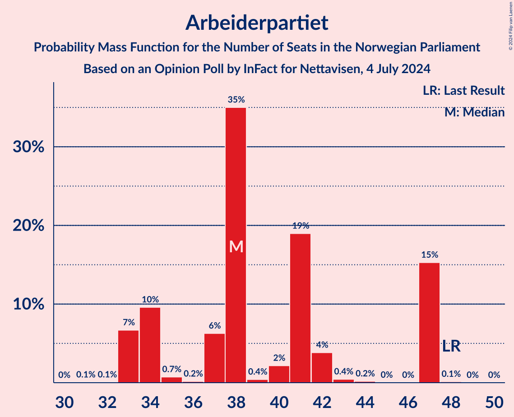
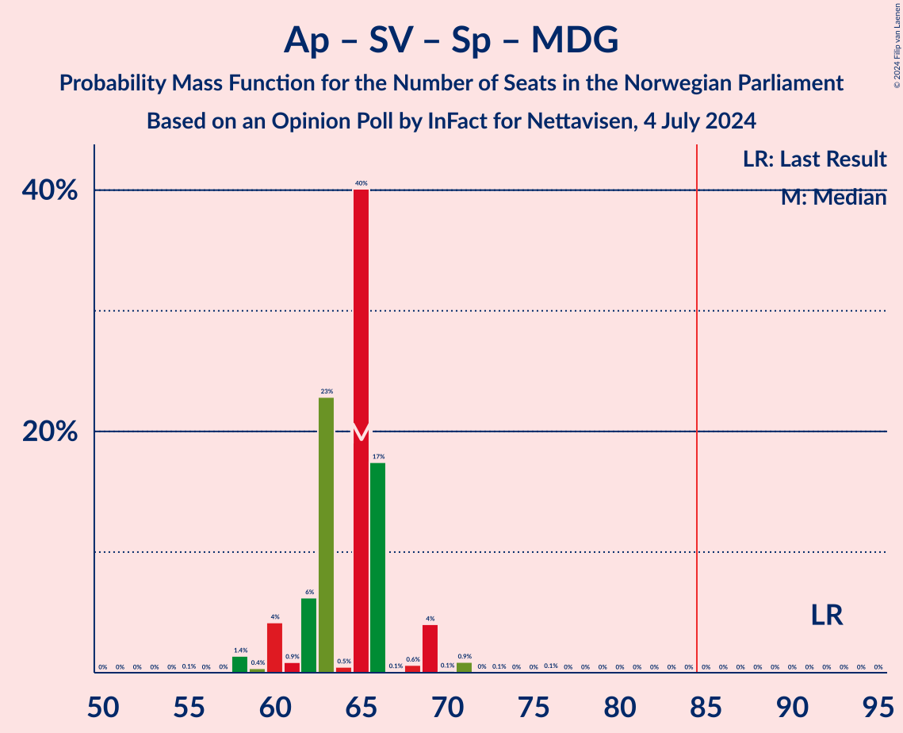

# Opinion Poll by InFact for Nettavisen, 4 July 2024

<a href="#voting-intentions">Voting Intentions</a> | <a href="#seats">Seats</a> | <a href="#coalitions">Coalitions</a> | <a href="#technical-information">Technical Information</a>

## Voting Intentions

### Confidence Intervals

| Party | Last Result | Poll Result | 80% Confidence Interval | 90% Confidence Interval | 95% Confidence Interval | 99% Confidence Interval |
|:-----:|:-----------:|:-----------:|:-----------------------:|:-----------------------:|:-----------------------:|:-----------------------:|
| Høyre | 20.4% | 22.4% | 20.8–24.1% |20.3–24.6% |20.0–25.0% |19.2–25.8% |
| Fremskrittspartiet | 11.6% | 20.7% | 19.1–22.3% |18.7–22.8% |18.4–23.2% |17.6–24.0% |
| Arbeiderpartiet | 26.2% | 20.4% | 18.9–22.1% |18.4–22.5% |18.1–22.9% |17.4–23.7% |
| Sosialistisk Venstreparti | 7.6% | 8.4% | 7.4–9.6% |7.1–9.9% |6.8–10.2% |6.4–10.8% |
| Venstre | 4.6% | 5.9% | 5.1–7.0% |4.8–7.3% |4.6–7.5% |4.3–8.0% |
| Rødt | 4.7% | 5.4% | 4.6–6.4% |4.3–6.6% |4.2–6.9% |3.8–7.4% |
| Senterpartiet | 13.5% | 5.1% | 4.3–6.1% |4.1–6.3% |3.9–6.6% |3.6–7.1% |
| Kristelig Folkeparti | 3.8% | 4.2% | 3.5–5.1% |3.3–5.4% |3.2–5.6% |2.9–6.1% |
| Miljøpartiet De Grønne | 3.9% | 3.7% | 3.0–4.5% |2.8–4.8% |2.7–5.0% |2.4–5.4% |
| Industri- og Næringspartiet | 0.3% | 1.7% | 1.3–2.3% |1.2–2.5% |1.1–2.7% |0.9–3.0% |
| Norgesdemokratene | 1.1% | 0.9% | 0.7–1.4% |0.6–1.6% |0.5–1.7% |0.4–2.0% |
| Konservativt | 0.4% | 0.4% | 0.2–0.8% |0.2–0.9% |0.2–1.0% |0.1–1.2% |
| Liberalistene | 0.2% | 0.1% | 0.0–0.4% |0.0–0.5% |0.0–0.5% |0.0–0.7% |
| Pensjonistpartiet | 0.6% | 0.1% | 0.0–0.4% |0.0–0.5% |0.0–0.5% |0.0–0.7% |

*Note:* The poll result column reflects the actual value used in the calculations. Published results may vary slightly, and in addition be rounded to fewer digits.

## Seats

### Confidence Intervals

| Party | Last Result | Median | 80% Confidence Interval | 90% Confidence Interval | 95% Confidence Interval | 99% Confidence Interval |
|:-----:|:-----------:|:------:|:-----------------------:|:-----------------------:|:-----------------------:|:-----------------------:|
| <a href="#høyre">Høyre</a> | 36 | 41 | 39–41 |37–41 |36–41 |35–45 |
| <a href="#fremskrittspartiet">Fremskrittspartiet</a> | 21 | 38 | 35–42 |35–42 |35–42 |34–46 |
| <a href="#arbeiderpartiet">Arbeiderpartiet</a> | 48 | 38 | 34–47 |33–47 |33–47 |33–47 |
| <a href="#sosialistisk-venstreparti">Sosialistisk Venstreparti</a> | 13 | 13 | 12–16 |12–16 |12–16 |11–18 |
| <a href="#venstre">Venstre</a> | 8 | 9 | 8–13 |8–13 |8–13 |8–13 |
| <a href="#rødt">Rødt</a> | 8 | 9 | 7–10 |7–10 |7–10 |7–12 |
| <a href="#senterpartiet">Senterpartiet</a> | 28 | 8 | 1–12 |1–12 |1–12 |1–12 |
| <a href="#kristelig-folkeparti">Kristelig Folkeparti</a> | 3 | 8 | 3–8 |2–8 |2–8 |2–9 |
| <a href="#miljøpartiet-de-grønne">Miljøpartiet De Grønne</a> | 3 | 2 | 2–7 |2–7 |2–7 |1–8 |
| <a href="#industri--og-næringspartiet">Industri- og Næringspartiet</a> | 0 | 0 | 0 |0 |0 |0 |
| <a href="#norgesdemokratene">Norgesdemokratene</a> | 0 | 0 | 0 |0 |0 |0 |
| <a href="#konservativt">Konservativt</a> | 0 | 0 | 0 |0 |0 |0 |
| <a href="#liberalistene">Liberalistene</a> | 0 | 0 | 0 |0 |0 |0 |
| <a href="#pensjonistpartiet">Pensjonistpartiet</a> | 0 | 0 | 0 |0 |0 |0 |

### Høyre

*For a full overview of the results for this party, see the [Høyre](party-høyre.html) page.*

| Number of Seats | Probability | Accumulated | Special Marks |
|:---------------:|:-----------:|:-----------:|:-------------:|
| 33 | 0.2% | 100% |  |
| 34 | 0.1% | 99.8% |  |
| 35 | 2% | 99.7% |  |
| 36 | 0.4% | 98% | Last Result |
| 37 | 3% | 97% |  |
| 38 | 0.2% | 94% |  |
| 39 | 16% | 94% |  |
| 40 | 17% | 77% |  |
| 41 | 58% | 60% | Median |
| 42 | 0.2% | 2% |  |
| 43 | 0.3% | 2% |  |
| 44 | 0.1% | 2% |  |
| 45 | 2% | 2% |  |
| 46 | 0% | 0% |  |

### Fremskrittspartiet

*For a full overview of the results for this party, see the [Fremskrittspartiet](party-fremskrittspartiet.html) page.*

| Number of Seats | Probability | Accumulated | Special Marks |
|:---------------:|:-----------:|:-----------:|:-------------:|
| 21 | 0% | 100% | Last Result |
| 22 | 0% | 100% |  |
| 23 | 0% | 100% |  |
| 24 | 0% | 100% |  |
| 25 | 0% | 100% |  |
| 26 | 0% | 100% |  |
| 27 | 0% | 100% |  |
| 28 | 0% | 100% |  |
| 29 | 0% | 100% |  |
| 30 | 0% | 100% |  |
| 31 | 0.4% | 100% |  |
| 32 | 0% | 99.6% |  |
| 33 | 0% | 99.6% |  |
| 34 | 0.2% | 99.6% |  |
| 35 | 11% | 99.4% |  |
| 36 | 19% | 89% |  |
| 37 | 6% | 70% |  |
| 38 | 23% | 64% | Median |
| 39 | 15% | 41% |  |
| 40 | 7% | 25% |  |
| 41 | 3% | 19% |  |
| 42 | 13% | 15% |  |
| 43 | 0.4% | 2% |  |
| 44 | 0.1% | 2% |  |
| 45 | 0.2% | 2% |  |
| 46 | 1.4% | 1.4% |  |
| 47 | 0% | 0% |  |

### Arbeiderpartiet

*For a full overview of the results for this party, see the [Arbeiderpartiet](party-arbeiderpartiet.html) page.*

| Number of Seats | Probability | Accumulated | Special Marks |
|:---------------:|:-----------:|:-----------:|:-------------:|
| 31 | 0.1% | 100% |  |
| 32 | 0.1% | 99.9% |  |
| 33 | 7% | 99.9% |  |
| 34 | 10% | 93% |  |
| 35 | 0.7% | 84% |  |
| 36 | 0.2% | 83% |  |
| 37 | 6% | 83% |  |
| 38 | 35% | 76% | Median |
| 39 | 0.4% | 41% |  |
| 40 | 2% | 41% |  |
| 41 | 19% | 39% |  |
| 42 | 4% | 20% |  |
| 43 | 0.4% | 16% |  |
| 44 | 0.2% | 16% |  |
| 45 | 0% | 15% |  |
| 46 | 0% | 15% |  |
| 47 | 15% | 15% |  |
| 48 | 0.1% | 0.1% | Last Result |
| 49 | 0% | 0% |  |

### Sosialistisk Venstreparti

*For a full overview of the results for this party, see the [Sosialistisk Venstreparti](party-sosialistiskvenstreparti.html) page.*

| Number of Seats | Probability | Accumulated | Special Marks |
|:---------------:|:-----------:|:-----------:|:-------------:|
| 9 | 0.2% | 100% |  |
| 10 | 0.1% | 99.8% |  |
| 11 | 2% | 99.7% |  |
| 12 | 36% | 98% |  |
| 13 | 28% | 61% | Last Result, Median |
| 14 | 5% | 33% |  |
| 15 | 10% | 28% |  |
| 16 | 17% | 18% |  |
| 17 | 0.1% | 1.3% |  |
| 18 | 0.8% | 1.2% |  |
| 19 | 0.4% | 0.5% |  |
| 20 | 0% | 0% |  |

### Venstre

*For a full overview of the results for this party, see the [Venstre](party-venstre.html) page.*

| Number of Seats | Probability | Accumulated | Special Marks |
|:---------------:|:-----------:|:-----------:|:-------------:|
| 7 | 0.4% | 100% |  |
| 8 | 35% | 99.5% | Last Result |
| 9 | 21% | 64% | Median |
| 10 | 10% | 43% |  |
| 11 | 2% | 33% |  |
| 12 | 11% | 31% |  |
| 13 | 19% | 20% |  |
| 14 | 0.4% | 0.4% |  |
| 15 | 0% | 0% |  |

### Rødt

*For a full overview of the results for this party, see the [Rødt](party-rødt.html) page.*

| Number of Seats | Probability | Accumulated | Special Marks |
|:---------------:|:-----------:|:-----------:|:-------------:|
| 1 | 0.1% | 100% |  |
| 2 | 0% | 99.9% |  |
| 3 | 0% | 99.9% |  |
| 4 | 0% | 99.9% |  |
| 5 | 0% | 99.9% |  |
| 6 | 0% | 99.9% |  |
| 7 | 14% | 99.9% |  |
| 8 | 23% | 86% | Last Result |
| 9 | 51% | 63% | Median |
| 10 | 11% | 12% |  |
| 11 | 0.4% | 1.2% |  |
| 12 | 0.5% | 0.8% |  |
| 13 | 0.2% | 0.2% |  |
| 14 | 0% | 0% |  |

### Senterpartiet

*For a full overview of the results for this party, see the [Senterpartiet](party-senterpartiet.html) page.*

| Number of Seats | Probability | Accumulated | Special Marks |
|:---------------:|:-----------:|:-----------:|:-------------:|
| 1 | 16% | 100% |  |
| 2 | 0% | 84% |  |
| 3 | 0% | 84% |  |
| 4 | 0% | 84% |  |
| 5 | 0% | 84% |  |
| 6 | 0.5% | 84% |  |
| 7 | 19% | 84% |  |
| 8 | 24% | 65% | Median |
| 9 | 26% | 41% |  |
| 10 | 0.7% | 15% |  |
| 11 | 4% | 14% |  |
| 12 | 10% | 10% |  |
| 13 | 0% | 0% |  |
| 14 | 0% | 0% |  |
| 15 | 0% | 0% |  |
| 16 | 0% | 0% |  |
| 17 | 0% | 0% |  |
| 18 | 0% | 0% |  |
| 19 | 0% | 0% |  |
| 20 | 0% | 0% |  |
| 21 | 0% | 0% |  |
| 22 | 0% | 0% |  |
| 23 | 0% | 0% |  |
| 24 | 0% | 0% |  |
| 25 | 0% | 0% |  |
| 26 | 0% | 0% |  |
| 27 | 0% | 0% |  |
| 28 | 0% | 0% | Last Result |

### Kristelig Folkeparti

*For a full overview of the results for this party, see the [Kristelig Folkeparti](party-kristeligfolkeparti.html) page.*

| Number of Seats | Probability | Accumulated | Special Marks |
|:---------------:|:-----------:|:-----------:|:-------------:|
| 1 | 0.2% | 100% |  |
| 2 | 5% | 99.8% |  |
| 3 | 17% | 95% | Last Result |
| 4 | 0% | 78% |  |
| 5 | 0% | 78% |  |
| 6 | 0% | 78% |  |
| 7 | 20% | 78% |  |
| 8 | 55% | 58% | Median |
| 9 | 2% | 2% |  |
| 10 | 0.2% | 0.2% |  |
| 11 | 0% | 0% |  |

### Miljøpartiet De Grønne

*For a full overview of the results for this party, see the [Miljøpartiet De Grønne](party-miljøpartietdegrønne.html) page.*

| Number of Seats | Probability | Accumulated | Special Marks |
|:---------------:|:-----------:|:-----------:|:-------------:|
| 1 | 2% | 100% |  |
| 2 | 51% | 98% | Median |
| 3 | 4% | 48% | Last Result |
| 4 | 0% | 44% |  |
| 5 | 0% | 44% |  |
| 6 | 13% | 44% |  |
| 7 | 30% | 31% |  |
| 8 | 0.7% | 1.1% |  |
| 9 | 0.4% | 0.5% |  |
| 10 | 0% | 0% |  |

### Industri- og Næringspartiet

*For a full overview of the results for this party, see the [Industri- og Næringspartiet](party-industri-ognæringspartiet.html) page.*

| Number of Seats | Probability | Accumulated | Special Marks |
|:---------------:|:-----------:|:-----------:|:-------------:|
| 0 | 99.9% | 100% | Last Result, Median |
| 1 | 0.1% | 0.1% |  |
| 2 | 0.1% | 0.1% |  |
| 3 | 0% | 0% |  |

### Norgesdemokratene

*For a full overview of the results for this party, see the [Norgesdemokratene](party-norgesdemokratene.html) page.*

| Number of Seats | Probability | Accumulated | Special Marks |
|:---------------:|:-----------:|:-----------:|:-------------:|
| 0 | 100% | 100% | Last Result, Median |

### Konservativt

*For a full overview of the results for this party, see the [Konservativt](party-konservativt.html) page.*

| Number of Seats | Probability | Accumulated | Special Marks |
|:---------------:|:-----------:|:-----------:|:-------------:|
| 0 | 100% | 100% | Last Result, Median |

### Liberalistene

*For a full overview of the results for this party, see the [Liberalistene](party-liberalistene.html) page.*

| Number of Seats | Probability | Accumulated | Special Marks |
|:---------------:|:-----------:|:-----------:|:-------------:|
| 0 | 100% | 100% | Last Result, Median |

### Pensjonistpartiet

*For a full overview of the results for this party, see the [Pensjonistpartiet](party-pensjonistpartiet.html) page.*

| Number of Seats | Probability | Accumulated | Special Marks |
|:---------------:|:-----------:|:-----------:|:-------------:|
| 0 | 100% | 100% | Last Result, Median |

## Coalitions

### Confidence Intervals

| Coalition | Last Result | Median | Majority? | 80% Confidence Interval | 90% Confidence Interval | 95% Confidence Interval | 99% Confidence Interval |
|:---------:|:-----------:|:------:|:---------:|:-----------------------:|:-----------------------:|:-----------------------:|:-----------------------:|
| Høyre – Fremskrittspartiet – Venstre – Senterpartiet – Kristelig Folkeparti | 96 | 103 | 100% | 95–107 | 95–107 | 95–107 | 94–109 |
| Høyre – Fremskrittspartiet – Venstre – Kristelig Folkeparti – Miljøpartiet De Grønne | 71 | 99 | 100% | 96–104 | 93–104 | 93–104 | 91–104 |
| Høyre – Fremskrittspartiet – Venstre – Kristelig Folkeparti | 68 | 95 | 100% | 94–98 | 91–99 | 90–99 | 87–101 |
| Høyre – Fremskrittspartiet – Venstre | 65 | 87 | 98% | 86–91 | 86–91 | 86–91 | 82–93 |
| Høyre – Fremskrittspartiet | 57 | 78 | 0.1% | 75–83 | 75–83 | 75–83 | 71–83 |
| Arbeiderpartiet – Sosialistisk Venstreparti – Rødt – Senterpartiet – Miljøpartiet De Grønne | 100 | 73 | 0% | 70–75 | 69–77 | 69–78 | 67–81 |
| Arbeiderpartiet – Sosialistisk Venstreparti – Rødt – Senterpartiet | 97 | 69 | 0% | 64–73 | 64–75 | 64–75 | 64–77 |
| Arbeiderpartiet – Sosialistisk Venstreparti – Senterpartiet – Kristelig Folkeparti – Miljøpartiet De Grønne | 95 | 71 | 0% | 69–73 | 68–73 | 67–74 | 66–78 |
| Arbeiderpartiet – Sosialistisk Venstreparti – Rødt – Miljøpartiet De Grønne | 72 | 65 | 0% | 61–74 | 61–74 | 61–74 | 59–74 |
| Arbeiderpartiet – Sosialistisk Venstreparti – Senterpartiet – Miljøpartiet De Grønne | 92 | 65 | 0% | 62–66 | 60–69 | 60–69 | 58–71 |
| Arbeiderpartiet – Sosialistisk Venstreparti – Senterpartiet | 89 | 60 | 0% | 57–64 | 55–66 | 55–66 | 55–69 |
| Arbeiderpartiet – Sosialistisk Venstreparti | 61 | 50 | 0% | 49–63 | 46–63 | 46–63 | 46–63 |
| Høyre – Venstre – Kristelig Folkeparti | 47 | 57 | 0% | 55–60 | 53–60 | 49–62 | 49–62 |
| Arbeiderpartiet – Senterpartiet – Kristelig Folkeparti – Miljøpartiet De Grønne | 82 | 58 | 0% | 53–61 | 53–61 | 53–61 | 52–65 |
| Arbeiderpartiet – Senterpartiet – Kristelig Folkeparti | 79 | 54 | 0% | 51–58 | 49–58 | 49–58 | 46–60 |
| Arbeiderpartiet – Senterpartiet | 76 | 46 | 0% | 44–50 | 42–51 | 42–53 | 41–54 |
| Venstre – Senterpartiet – Kristelig Folkeparti | 39 | 24 | 0% | 17–30 | 17–32 | 17–32 | 17–32 |

### Høyre – Fremskrittspartiet – Venstre – Senterpartiet – Kristelig Folkeparti

| Number of Seats | Probability | Accumulated | Special Marks |
|:---------------:|:-----------:|:-----------:|:-------------:|
| 92 | 0.1% | 100% |  |
| 93 | 0% | 99.9% |  |
| 94 | 0.3% | 99.8% |  |
| 95 | 15% | 99.5% |  |
| 96 | 0% | 84% | Last Result |
| 97 | 0.1% | 84% |  |
| 98 | 0.4% | 84% |  |
| 99 | 1.1% | 84% |  |
| 100 | 2% | 82% |  |
| 101 | 4% | 81% |  |
| 102 | 0.8% | 77% |  |
| 103 | 40% | 76% |  |
| 104 | 0.8% | 36% | Median |
| 105 | 13% | 35% |  |
| 106 | 10% | 22% |  |
| 107 | 10% | 12% |  |
| 108 | 0.2% | 2% |  |
| 109 | 1.4% | 1.5% |  |
| 110 | 0.1% | 0.1% |  |
| 111 | 0% | 0% |  |

### Høyre – Fremskrittspartiet – Venstre – Kristelig Folkeparti – Miljøpartiet De Grønne

| Number of Seats | Probability | Accumulated | Special Marks |
|:---------------:|:-----------:|:-----------:|:-------------:|
| 71 | 0% | 100% | Last Result |
| 72 | 0% | 100% |  |
| 73 | 0% | 100% |  |
| 74 | 0% | 100% |  |
| 75 | 0% | 100% |  |
| 76 | 0% | 100% |  |
| 77 | 0% | 100% |  |
| 78 | 0% | 100% |  |
| 79 | 0% | 100% |  |
| 80 | 0% | 100% |  |
| 81 | 0% | 100% |  |
| 82 | 0% | 100% |  |
| 83 | 0% | 100% |  |
| 84 | 0% | 100% |  |
| 85 | 0% | 100% | Majority |
| 86 | 0% | 100% |  |
| 87 | 0% | 100% |  |
| 88 | 0.1% | 100% |  |
| 89 | 0.2% | 99.9% |  |
| 90 | 0.1% | 99.7% |  |
| 91 | 0.4% | 99.5% |  |
| 92 | 1.4% | 99.1% |  |
| 93 | 3% | 98% |  |
| 94 | 0.3% | 95% |  |
| 95 | 0.1% | 94% |  |
| 96 | 34% | 94% |  |
| 97 | 10% | 61% |  |
| 98 | 0.2% | 51% | Median |
| 99 | 1.1% | 50% |  |
| 100 | 2% | 49% |  |
| 101 | 4% | 47% |  |
| 102 | 22% | 43% |  |
| 103 | 2% | 21% |  |
| 104 | 19% | 19% |  |
| 105 | 0.1% | 0.5% |  |
| 106 | 0.1% | 0.4% |  |
| 107 | 0.3% | 0.4% |  |
| 108 | 0% | 0.1% |  |
| 109 | 0% | 0% |  |

### Høyre – Fremskrittspartiet – Venstre – Kristelig Folkeparti

| Number of Seats | Probability | Accumulated | Special Marks |
|:---------------:|:-----------:|:-----------:|:-------------:|
| 68 | 0% | 100% | Last Result |
| 69 | 0% | 100% |  |
| 70 | 0% | 100% |  |
| 71 | 0% | 100% |  |
| 72 | 0% | 100% |  |
| 73 | 0% | 100% |  |
| 74 | 0% | 100% |  |
| 75 | 0% | 100% |  |
| 76 | 0% | 100% |  |
| 77 | 0% | 100% |  |
| 78 | 0% | 100% |  |
| 79 | 0% | 100% |  |
| 80 | 0% | 100% |  |
| 81 | 0% | 100% |  |
| 82 | 0% | 100% |  |
| 83 | 0% | 100% |  |
| 84 | 0% | 100% |  |
| 85 | 0.2% | 100% | Majority |
| 86 | 0.1% | 99.8% |  |
| 87 | 0.4% | 99.7% |  |
| 88 | 0.2% | 99.3% |  |
| 89 | 0.5% | 99.2% |  |
| 90 | 4% | 98.7% |  |
| 91 | 1.0% | 95% |  |
| 92 | 0.1% | 94% |  |
| 93 | 2% | 94% |  |
| 94 | 34% | 92% |  |
| 95 | 32% | 58% |  |
| 96 | 0.2% | 26% | Median |
| 97 | 7% | 26% |  |
| 98 | 14% | 19% |  |
| 99 | 4% | 6% |  |
| 100 | 0.1% | 2% |  |
| 101 | 1.4% | 2% |  |
| 102 | 0.1% | 0.1% |  |
| 103 | 0% | 0% |  |

### Høyre – Fremskrittspartiet – Venstre

| Number of Seats | Probability | Accumulated | Special Marks |
|:---------------:|:-----------:|:-----------:|:-------------:|
| 65 | 0% | 100% | Last Result |
| 66 | 0% | 100% |  |
| 67 | 0% | 100% |  |
| 68 | 0% | 100% |  |
| 69 | 0% | 100% |  |
| 70 | 0% | 100% |  |
| 71 | 0% | 100% |  |
| 72 | 0% | 100% |  |
| 73 | 0% | 100% |  |
| 74 | 0% | 100% |  |
| 75 | 0% | 100% |  |
| 76 | 0% | 100% |  |
| 77 | 0% | 100% |  |
| 78 | 0% | 100% |  |
| 79 | 0% | 100% |  |
| 80 | 0.4% | 100% |  |
| 81 | 0% | 99.6% |  |
| 82 | 0.2% | 99.6% |  |
| 83 | 0.7% | 99.3% |  |
| 84 | 0.5% | 98.6% |  |
| 85 | 0.2% | 98% | Majority |
| 86 | 19% | 98% |  |
| 87 | 32% | 79% |  |
| 88 | 3% | 47% | Median |
| 89 | 0.7% | 44% |  |
| 90 | 7% | 43% |  |
| 91 | 34% | 36% |  |
| 92 | 2% | 2% |  |
| 93 | 0.3% | 0.5% |  |
| 94 | 0.1% | 0.2% |  |
| 95 | 0.1% | 0.1% |  |
| 96 | 0% | 0% |  |

### Høyre – Fremskrittspartiet

| Number of Seats | Probability | Accumulated | Special Marks |
|:---------------:|:-----------:|:-----------:|:-------------:|
| 57 | 0% | 100% | Last Result |
| 58 | 0% | 100% |  |
| 59 | 0% | 100% |  |
| 60 | 0% | 100% |  |
| 61 | 0% | 100% |  |
| 62 | 0% | 100% |  |
| 63 | 0% | 100% |  |
| 64 | 0% | 100% |  |
| 65 | 0% | 100% |  |
| 66 | 0% | 100% |  |
| 67 | 0% | 100% |  |
| 68 | 0% | 100% |  |
| 69 | 0% | 100% |  |
| 70 | 0.2% | 100% |  |
| 71 | 0.4% | 99.8% |  |
| 72 | 0% | 99.4% |  |
| 73 | 1.0% | 99.4% |  |
| 74 | 0.5% | 98% |  |
| 75 | 10% | 98% |  |
| 76 | 0.7% | 88% |  |
| 77 | 19% | 87% |  |
| 78 | 22% | 68% |  |
| 79 | 23% | 46% | Median |
| 80 | 6% | 23% |  |
| 81 | 2% | 17% |  |
| 82 | 2% | 15% |  |
| 83 | 13% | 13% |  |
| 84 | 0.3% | 0.4% |  |
| 85 | 0% | 0.1% | Majority |
| 86 | 0.1% | 0.1% |  |
| 87 | 0% | 0% |  |

### Arbeiderpartiet – Sosialistisk Venstreparti – Rødt – Senterpartiet – Miljøpartiet De Grønne

| Number of Seats | Probability | Accumulated | Special Marks |
|:---------------:|:-----------:|:-----------:|:-------------:|
| 65 | 0% | 100% |  |
| 66 | 0.1% | 99.9% |  |
| 67 | 1.4% | 99.9% |  |
| 68 | 0.1% | 98% |  |
| 69 | 4% | 98% |  |
| 70 | 14% | 94% | Median |
| 71 | 7% | 81% |  |
| 72 | 0.2% | 74% |  |
| 73 | 32% | 74% |  |
| 74 | 19% | 42% |  |
| 75 | 17% | 23% |  |
| 76 | 0.1% | 6% |  |
| 77 | 1.0% | 6% |  |
| 78 | 4% | 5% |  |
| 79 | 0.5% | 1.3% |  |
| 80 | 0.2% | 0.8% |  |
| 81 | 0.3% | 0.7% |  |
| 82 | 0.1% | 0.3% |  |
| 83 | 0.1% | 0.2% |  |
| 84 | 0.1% | 0.1% |  |
| 85 | 0% | 0% | Majority |
| 86 | 0% | 0% |  |
| 87 | 0% | 0% |  |
| 88 | 0% | 0% |  |
| 89 | 0% | 0% |  |
| 90 | 0% | 0% |  |
| 91 | 0% | 0% |  |
| 92 | 0% | 0% |  |
| 93 | 0% | 0% |  |
| 94 | 0% | 0% |  |
| 95 | 0% | 0% |  |
| 96 | 0% | 0% |  |
| 97 | 0% | 0% |  |
| 98 | 0% | 0% |  |
| 99 | 0% | 0% |  |
| 100 | 0% | 0% | Last Result |

### Arbeiderpartiet – Sosialistisk Venstreparti – Rødt – Senterpartiet

| Number of Seats | Probability | Accumulated | Special Marks |
|:---------------:|:-----------:|:-----------:|:-------------:|
| 60 | 0% | 100% |  |
| 61 | 0.3% | 99.9% |  |
| 62 | 0.1% | 99.6% |  |
| 63 | 0.1% | 99.6% |  |
| 64 | 19% | 99.5% |  |
| 65 | 2% | 81% |  |
| 66 | 22% | 79% |  |
| 67 | 4% | 57% |  |
| 68 | 2% | 53% | Median |
| 69 | 1.1% | 51% |  |
| 70 | 0.2% | 50% |  |
| 71 | 10% | 49% |  |
| 72 | 18% | 39% |  |
| 73 | 15% | 21% |  |
| 74 | 0.2% | 6% |  |
| 75 | 3% | 5% |  |
| 76 | 1.3% | 2% |  |
| 77 | 0.5% | 1.0% |  |
| 78 | 0.1% | 0.5% |  |
| 79 | 0.2% | 0.3% |  |
| 80 | 0.1% | 0.1% |  |
| 81 | 0% | 0% |  |
| 82 | 0% | 0% |  |
| 83 | 0% | 0% |  |
| 84 | 0% | 0% |  |
| 85 | 0% | 0% | Majority |
| 86 | 0% | 0% |  |
| 87 | 0% | 0% |  |
| 88 | 0% | 0% |  |
| 89 | 0% | 0% |  |
| 90 | 0% | 0% |  |
| 91 | 0% | 0% |  |
| 92 | 0% | 0% |  |
| 93 | 0% | 0% |  |
| 94 | 0% | 0% |  |
| 95 | 0% | 0% |  |
| 96 | 0% | 0% |  |
| 97 | 0% | 0% | Last Result |

### Arbeiderpartiet – Sosialistisk Venstreparti – Senterpartiet – Kristelig Folkeparti – Miljøpartiet De Grønne

| Number of Seats | Probability | Accumulated | Special Marks |
|:---------------:|:-----------:|:-----------:|:-------------:|
| 62 | 0.1% | 100% |  |
| 63 | 0.1% | 99.9% |  |
| 64 | 0% | 99.8% |  |
| 65 | 0.2% | 99.8% |  |
| 66 | 0.2% | 99.6% |  |
| 67 | 2% | 99.4% |  |
| 68 | 6% | 97% |  |
| 69 | 22% | 91% | Median |
| 70 | 13% | 69% |  |
| 71 | 13% | 56% |  |
| 72 | 0.4% | 43% |  |
| 73 | 40% | 43% |  |
| 74 | 2% | 3% |  |
| 75 | 0.1% | 1.4% |  |
| 76 | 0.1% | 1.3% |  |
| 77 | 0.7% | 1.3% |  |
| 78 | 0.4% | 0.5% |  |
| 79 | 0.1% | 0.1% |  |
| 80 | 0% | 0% |  |
| 81 | 0% | 0% |  |
| 82 | 0% | 0% |  |
| 83 | 0% | 0% |  |
| 84 | 0% | 0% |  |
| 85 | 0% | 0% | Majority |
| 86 | 0% | 0% |  |
| 87 | 0% | 0% |  |
| 88 | 0% | 0% |  |
| 89 | 0% | 0% |  |
| 90 | 0% | 0% |  |
| 91 | 0% | 0% |  |
| 92 | 0% | 0% |  |
| 93 | 0% | 0% |  |
| 94 | 0% | 0% |  |
| 95 | 0% | 0% | Last Result |

### Arbeiderpartiet – Sosialistisk Venstreparti – Rødt – Miljøpartiet De Grønne

| Number of Seats | Probability | Accumulated | Special Marks |
|:---------------:|:-----------:|:-----------:|:-------------:|
| 58 | 0.1% | 100% |  |
| 59 | 1.4% | 99.9% |  |
| 60 | 0.2% | 98.5% |  |
| 61 | 10% | 98% |  |
| 62 | 10% | 88% | Median |
| 63 | 13% | 78% |  |
| 64 | 0.8% | 65% |  |
| 65 | 40% | 64% |  |
| 66 | 0.8% | 24% |  |
| 67 | 4% | 23% |  |
| 68 | 2% | 19% |  |
| 69 | 1.1% | 18% |  |
| 70 | 0.4% | 16% |  |
| 71 | 0.1% | 16% |  |
| 72 | 0% | 16% | Last Result |
| 73 | 0.2% | 16% |  |
| 74 | 16% | 16% |  |
| 75 | 0% | 0.2% |  |
| 76 | 0% | 0.2% |  |
| 77 | 0.1% | 0.1% |  |
| 78 | 0% | 0% |  |

### Arbeiderpartiet – Sosialistisk Venstreparti – Senterpartiet – Miljøpartiet De Grønne

| Number of Seats | Probability | Accumulated | Special Marks |
|:---------------:|:-----------:|:-----------:|:-------------:|
| 55 | 0.1% | 100% |  |
| 56 | 0% | 99.9% |  |
| 57 | 0% | 99.9% |  |
| 58 | 1.4% | 99.9% |  |
| 59 | 0.4% | 98.5% |  |
| 60 | 4% | 98% |  |
| 61 | 0.9% | 94% | Median |
| 62 | 6% | 93% |  |
| 63 | 23% | 87% |  |
| 64 | 0.5% | 64% |  |
| 65 | 40% | 64% |  |
| 66 | 17% | 23% |  |
| 67 | 0.1% | 6% |  |
| 68 | 0.6% | 6% |  |
| 69 | 4% | 5% |  |
| 70 | 0.1% | 1.3% |  |
| 71 | 0.9% | 1.1% |  |
| 72 | 0% | 0.2% |  |
| 73 | 0.1% | 0.2% |  |
| 74 | 0% | 0.1% |  |
| 75 | 0% | 0.1% |  |
| 76 | 0.1% | 0.1% |  |
| 77 | 0% | 0% |  |
| 78 | 0% | 0% |  |
| 79 | 0% | 0% |  |
| 80 | 0% | 0% |  |
| 81 | 0% | 0% |  |
| 82 | 0% | 0% |  |
| 83 | 0% | 0% |  |
| 84 | 0% | 0% |  |
| 85 | 0% | 0% | Majority |
| 86 | 0% | 0% |  |
| 87 | 0% | 0% |  |
| 88 | 0% | 0% |  |
| 89 | 0% | 0% |  |
| 90 | 0% | 0% |  |
| 91 | 0% | 0% |  |
| 92 | 0% | 0% | Last Result |

### Arbeiderpartiet – Sosialistisk Venstreparti – Senterpartiet

| Number of Seats | Probability | Accumulated | Special Marks |
|:---------------:|:-----------:|:-----------:|:-------------:|
| 53 | 0.1% | 100% |  |
| 54 | 0.4% | 99.9% |  |
| 55 | 6% | 99.5% |  |
| 56 | 2% | 93% |  |
| 57 | 13% | 91% |  |
| 58 | 26% | 78% |  |
| 59 | 2% | 53% | Median |
| 60 | 0.8% | 50% |  |
| 61 | 10% | 49% |  |
| 62 | 0.3% | 40% |  |
| 63 | 18% | 39% |  |
| 64 | 16% | 21% |  |
| 65 | 0.3% | 5% |  |
| 66 | 3% | 5% |  |
| 67 | 0.5% | 2% |  |
| 68 | 0.8% | 2% |  |
| 69 | 0.9% | 0.9% |  |
| 70 | 0% | 0% |  |
| 71 | 0% | 0% |  |
| 72 | 0% | 0% |  |
| 73 | 0% | 0% |  |
| 74 | 0% | 0% |  |
| 75 | 0% | 0% |  |
| 76 | 0% | 0% |  |
| 77 | 0% | 0% |  |
| 78 | 0% | 0% |  |
| 79 | 0% | 0% |  |
| 80 | 0% | 0% |  |
| 81 | 0% | 0% |  |
| 82 | 0% | 0% |  |
| 83 | 0% | 0% |  |
| 84 | 0% | 0% |  |
| 85 | 0% | 0% | Majority |
| 86 | 0% | 0% |  |
| 87 | 0% | 0% |  |
| 88 | 0% | 0% |  |
| 89 | 0% | 0% | Last Result |

### Arbeiderpartiet – Sosialistisk Venstreparti

| Number of Seats | Probability | Accumulated | Special Marks |
|:---------------:|:-----------:|:-----------:|:-------------:|
| 45 | 0.1% | 100% |  |
| 46 | 6% | 99.9% |  |
| 47 | 0.2% | 94% |  |
| 48 | 2% | 94% |  |
| 49 | 10% | 91% |  |
| 50 | 35% | 81% |  |
| 51 | 5% | 47% | Median |
| 52 | 2% | 42% |  |
| 53 | 0.3% | 40% |  |
| 54 | 18% | 40% |  |
| 55 | 4% | 22% |  |
| 56 | 0.3% | 18% |  |
| 57 | 1.2% | 18% |  |
| 58 | 0.2% | 16% |  |
| 59 | 0.2% | 16% |  |
| 60 | 0.6% | 16% |  |
| 61 | 0% | 15% | Last Result |
| 62 | 0.1% | 15% |  |
| 63 | 15% | 15% |  |
| 64 | 0% | 0% |  |

### Høyre – Venstre – Kristelig Folkeparti

| Number of Seats | Probability | Accumulated | Special Marks |
|:---------------:|:-----------:|:-----------:|:-------------:|
| 46 | 0.3% | 100% |  |
| 47 | 0% | 99.7% | Last Result |
| 48 | 0.2% | 99.7% |  |
| 49 | 3% | 99.5% |  |
| 50 | 0.4% | 97% |  |
| 51 | 0.2% | 96% |  |
| 52 | 0.1% | 96% |  |
| 53 | 1.1% | 96% |  |
| 54 | 0.5% | 95% |  |
| 55 | 18% | 94% |  |
| 56 | 15% | 76% |  |
| 57 | 28% | 62% |  |
| 58 | 19% | 34% | Median |
| 59 | 0.3% | 15% |  |
| 60 | 10% | 15% |  |
| 61 | 0.3% | 4% |  |
| 62 | 4% | 4% |  |
| 63 | 0% | 0% |  |

### Arbeiderpartiet – Senterpartiet – Kristelig Folkeparti – Miljøpartiet De Grønne

| Number of Seats | Probability | Accumulated | Special Marks |
|:---------------:|:-----------:|:-----------:|:-------------:|
| 48 | 0.1% | 100% |  |
| 49 | 0% | 99.9% |  |
| 50 | 0% | 99.8% |  |
| 51 | 0.2% | 99.8% |  |
| 52 | 0.9% | 99.6% |  |
| 53 | 16% | 98.7% |  |
| 54 | 4% | 83% |  |
| 55 | 0.4% | 79% |  |
| 56 | 20% | 78% | Median |
| 57 | 0.5% | 58% |  |
| 58 | 16% | 58% |  |
| 59 | 0.3% | 42% |  |
| 60 | 19% | 42% |  |
| 61 | 23% | 24% |  |
| 62 | 0.1% | 0.9% |  |
| 63 | 0.2% | 0.8% |  |
| 64 | 0% | 0.6% |  |
| 65 | 0.5% | 0.5% |  |
| 66 | 0% | 0% |  |
| 67 | 0% | 0% |  |
| 68 | 0% | 0% |  |
| 69 | 0% | 0% |  |
| 70 | 0% | 0% |  |
| 71 | 0% | 0% |  |
| 72 | 0% | 0% |  |
| 73 | 0% | 0% |  |
| 74 | 0% | 0% |  |
| 75 | 0% | 0% |  |
| 76 | 0% | 0% |  |
| 77 | 0% | 0% |  |
| 78 | 0% | 0% |  |
| 79 | 0% | 0% |  |
| 80 | 0% | 0% |  |
| 81 | 0% | 0% |  |
| 82 | 0% | 0% | Last Result |

### Arbeiderpartiet – Senterpartiet – Kristelig Folkeparti

| Number of Seats | Probability | Accumulated | Special Marks |
|:---------------:|:-----------:|:-----------:|:-------------:|
| 44 | 0.4% | 100% |  |
| 45 | 0% | 99.6% |  |
| 46 | 0.2% | 99.5% |  |
| 47 | 0.1% | 99.3% |  |
| 48 | 0.3% | 99.2% |  |
| 49 | 8% | 98.9% |  |
| 50 | 0% | 91% |  |
| 51 | 17% | 91% |  |
| 52 | 17% | 74% |  |
| 53 | 0.8% | 57% |  |
| 54 | 33% | 57% | Median |
| 55 | 3% | 23% |  |
| 56 | 0.2% | 20% |  |
| 57 | 0.5% | 20% |  |
| 58 | 18% | 20% |  |
| 59 | 0.3% | 1.5% |  |
| 60 | 0.7% | 1.1% |  |
| 61 | 0% | 0.4% |  |
| 62 | 0% | 0.4% |  |
| 63 | 0.4% | 0.4% |  |
| 64 | 0% | 0% |  |
| 65 | 0% | 0% |  |
| 66 | 0% | 0% |  |
| 67 | 0% | 0% |  |
| 68 | 0% | 0% |  |
| 69 | 0% | 0% |  |
| 70 | 0% | 0% |  |
| 71 | 0% | 0% |  |
| 72 | 0% | 0% |  |
| 73 | 0% | 0% |  |
| 74 | 0% | 0% |  |
| 75 | 0% | 0% |  |
| 76 | 0% | 0% |  |
| 77 | 0% | 0% |  |
| 78 | 0% | 0% |  |
| 79 | 0% | 0% | Last Result |

### Arbeiderpartiet – Senterpartiet

| Number of Seats | Probability | Accumulated | Special Marks |
|:---------------:|:-----------:|:-----------:|:-------------:|
| 38 | 0% | 100% |  |
| 39 | 0.1% | 99.9% |  |
| 40 | 0% | 99.9% |  |
| 41 | 0.4% | 99.8% |  |
| 42 | 6% | 99.5% |  |
| 43 | 0.7% | 93% |  |
| 44 | 4% | 92% |  |
| 45 | 15% | 88% |  |
| 46 | 32% | 73% | Median |
| 47 | 2% | 41% |  |
| 48 | 16% | 40% |  |
| 49 | 0.4% | 24% |  |
| 50 | 18% | 24% |  |
| 51 | 0.6% | 5% |  |
| 52 | 0.8% | 4% |  |
| 53 | 3% | 4% |  |
| 54 | 0.7% | 0.8% |  |
| 55 | 0.1% | 0.1% |  |
| 56 | 0% | 0% |  |
| 57 | 0% | 0% |  |
| 58 | 0% | 0% |  |
| 59 | 0% | 0% |  |
| 60 | 0% | 0% |  |
| 61 | 0% | 0% |  |
| 62 | 0% | 0% |  |
| 63 | 0% | 0% |  |
| 64 | 0% | 0% |  |
| 65 | 0% | 0% |  |
| 66 | 0% | 0% |  |
| 67 | 0% | 0% |  |
| 68 | 0% | 0% |  |
| 69 | 0% | 0% |  |
| 70 | 0% | 0% |  |
| 71 | 0% | 0% |  |
| 72 | 0% | 0% |  |
| 73 | 0% | 0% |  |
| 74 | 0% | 0% |  |
| 75 | 0% | 0% |  |
| 76 | 0% | 0% | Last Result |

### Venstre – Senterpartiet – Kristelig Folkeparti

| Number of Seats | Probability | Accumulated | Special Marks |
|:---------------:|:-----------:|:-----------:|:-------------:|
| 16 | 0% | 100% |  |
| 17 | 15% | 99.9% |  |
| 18 | 2% | 85% |  |
| 19 | 0.2% | 82% |  |
| 20 | 0.5% | 82% |  |
| 21 | 0.6% | 82% |  |
| 22 | 13% | 81% |  |
| 23 | 3% | 68% |  |
| 24 | 23% | 65% |  |
| 25 | 0.4% | 42% | Median |
| 26 | 24% | 42% |  |
| 27 | 0% | 18% |  |
| 28 | 6% | 17% |  |
| 29 | 0.8% | 11% |  |
| 30 | 1.0% | 11% |  |
| 31 | 0% | 10% |  |
| 32 | 10% | 10% |  |
| 33 | 0% | 0% |  |
| 34 | 0% | 0% |  |
| 35 | 0% | 0% |  |
| 36 | 0% | 0% |  |
| 37 | 0% | 0% |  |
| 38 | 0% | 0% |  |
| 39 | 0% | 0% | Last Result |

## Technical Information

### Opinion Poll

+ **Polling firm:** InFact
+ **Commissioner(s):** Nettavisen
+ **Fieldwork period:** 4 July 2024

### Calculations

+ **Sample size:** 1064
+ **Simulations done:** 1,048,576
+ **Error estimate:** 1.68%

