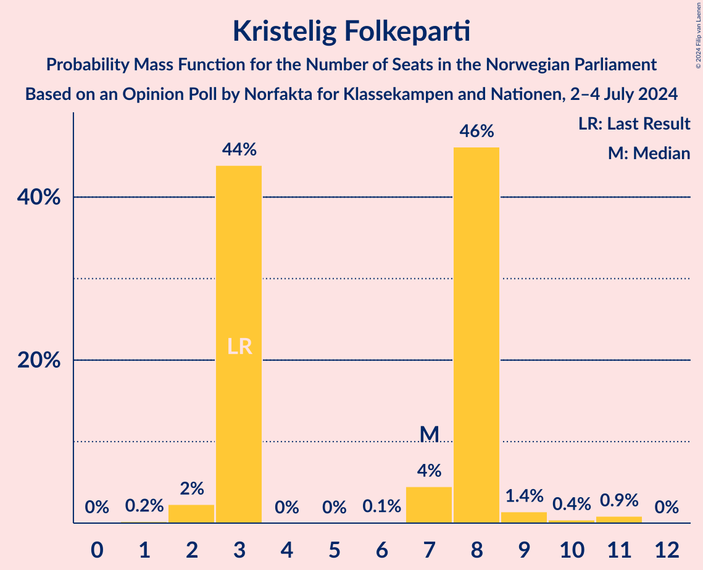

# Opinion Poll by Norfakta for Klassekampen and Nationen, 2–4 July 2024

<a href="#voting-intentions">Voting Intentions</a> | <a href="#seats">Seats</a> | <a href="#coalitions">Coalitions</a> | <a href="#technical-information">Technical Information</a>

## Voting Intentions

### Confidence Intervals

| Party | Last Result | Poll Result | 80% Confidence Interval | 90% Confidence Interval | 95% Confidence Interval | 99% Confidence Interval |
|:-----:|:-----------:|:-----------:|:-----------------------:|:-----------------------:|:-----------------------:|:-----------------------:|
| Høyre | 20.4% | 27.5% | 25.5–29.6% |24.9–30.2% |24.4–30.7% |23.5–31.8% |
| Arbeiderpartiet | 26.2% | 20.6% | 18.8–22.6% |18.3–23.1% |17.9–23.6% |17.1–24.6% |
| Fremskrittspartiet | 11.6% | 13.0% | 11.5–14.6% |11.1–15.1% |10.8–15.5% |10.1–16.4% |
| Sosialistisk Venstreparti | 7.6% | 8.9% | 7.7–10.4% |7.4–10.8% |7.1–11.2% |6.6–11.9% |
| Rødt | 4.7% | 6.0% | 5.0–7.2% |4.7–7.6% |4.5–7.9% |4.1–8.5% |
| Venstre | 4.6% | 4.9% | 4.1–6.1% |3.8–6.4% |3.6–6.7% |3.2–7.3% |
| Senterpartiet | 13.5% | 4.7% | 3.8–5.8% |3.6–6.1% |3.4–6.4% |3.0–7.0% |
| Kristelig Folkeparti | 3.8% | 4.1% | 3.4–5.2% |3.1–5.5% |2.9–5.8% |2.6–6.4% |
| Miljøpartiet De Grønne | 3.9% | 3.8% | 3.0–4.8% |2.8–5.1% |2.6–5.3% |2.3–5.9% |
| Norgesdemokratene | 1.1% | 1.7% | 1.2–2.5% |1.1–2.7% |1.0–2.9% |0.8–3.3% |
| Industri- og Næringspartiet | 0.3% | 1.2% | 0.8–1.8% |0.7–2.0% |0.6–2.2% |0.5–2.6% |
| Kystpartiet | 0.0% | 0.6% | 0.4–1.2% |0.3–1.4% |0.3–1.5% |0.2–1.8% |
| Pensjonistpartiet | 0.6% | 0.6% | 0.4–1.2% |0.3–1.4% |0.3–1.5% |0.2–1.8% |
| Liberalistene | 0.2% | 0.1% | 0.1–0.5% |0.0–0.6% |0.0–0.7% |0.0–1.0% |

*Note:* The poll result column reflects the actual value used in the calculations. Published results may vary slightly, and in addition be rounded to fewer digits.

## Seats

### Confidence Intervals

| Party | Last Result | Median | 80% Confidence Interval | 90% Confidence Interval | 95% Confidence Interval | 99% Confidence Interval |
|:-----:|:-----------:|:------:|:-----------------------:|:-----------------------:|:-----------------------:|:-----------------------:|
| <a href="#høyre">Høyre</a> | 36 | 50 | 47–53 |47–53 |46–54 |45–59 |
| <a href="#arbeiderpartiet">Arbeiderpartiet</a> | 48 | 39 | 35–48 |35–48 |35–48 |34–50 |
| <a href="#fremskrittspartiet">Fremskrittspartiet</a> | 21 | 25 | 22–32 |22–32 |19–32 |19–32 |
| <a href="#sosialistisk-venstreparti">Sosialistisk Venstreparti</a> | 13 | 15 | 13–18 |13–18 |12–18 |12–21 |
| <a href="#rødt">Rødt</a> | 8 | 10 | 9–12 |8–12 |8–13 |8–14 |
| <a href="#venstre">Venstre</a> | 8 | 10 | 8–10 |8–11 |7–12 |2–13 |
| <a href="#senterpartiet">Senterpartiet</a> | 28 | 7 | 1–10 |1–11 |1–11 |0–13 |
| <a href="#kristelig-folkeparti">Kristelig Folkeparti</a> | 3 | 7 | 3–8 |3–8 |2–9 |2–11 |
| <a href="#miljøpartiet-de-grønne">Miljøpartiet De Grønne</a> | 3 | 3 | 2–7 |2–7 |2–8 |1–9 |
| <a href="#norgesdemokratene">Norgesdemokratene</a> | 0 | 0 | 0 |0 |0 |0 |
| <a href="#industri--og-næringspartiet">Industri- og Næringspartiet</a> | 0 | 0 | 0 |0 |0 |0–2 |
| <a href="#kystpartiet">Kystpartiet</a> | 0 | 0 | 0–1 |0–1 |0–2 |0–2 |
| <a href="#pensjonistpartiet">Pensjonistpartiet</a> | 0 | 0 | 0 |0 |0 |0 |
| <a href="#liberalistene">Liberalistene</a> | 0 | 0 | 0 |0 |0 |0 |

### Høyre

*For a full overview of the results for this party, see the [Høyre](party-høyre.html) page.*

| Number of Seats | Probability | Accumulated | Special Marks |
|:---------------:|:-----------:|:-----------:|:-------------:|
| 36 | 0% | 100% | Last Result |
| 37 | 0% | 100% |  |
| 38 | 0% | 100% |  |
| 39 | 0% | 100% |  |
| 40 | 0% | 100% |  |
| 41 | 0% | 100% |  |
| 42 | 0% | 100% |  |
| 43 | 0.1% | 100% |  |
| 44 | 0.4% | 99.9% |  |
| 45 | 0.5% | 99.5% |  |
| 46 | 2% | 99.0% |  |
| 47 | 10% | 97% |  |
| 48 | 3% | 87% |  |
| 49 | 7% | 83% |  |
| 50 | 37% | 76% | Median |
| 51 | 17% | 39% |  |
| 52 | 2% | 23% |  |
| 53 | 17% | 21% |  |
| 54 | 2% | 4% |  |
| 55 | 1.0% | 2% |  |
| 56 | 0.1% | 0.7% |  |
| 57 | 0.1% | 0.6% |  |
| 58 | 0% | 0.5% |  |
| 59 | 0.1% | 0.5% |  |
| 60 | 0% | 0.4% |  |
| 61 | 0.3% | 0.4% |  |
| 62 | 0.1% | 0.1% |  |
| 63 | 0% | 0% |  |

### Arbeiderpartiet

*For a full overview of the results for this party, see the [Arbeiderpartiet](party-arbeiderpartiet.html) page.*

| Number of Seats | Probability | Accumulated | Special Marks |
|:---------------:|:-----------:|:-----------:|:-------------:|
| 33 | 0% | 100% |  |
| 34 | 0.5% | 99.9% |  |
| 35 | 17% | 99.5% |  |
| 36 | 1.2% | 82% |  |
| 37 | 0.3% | 81% |  |
| 38 | 9% | 81% |  |
| 39 | 38% | 72% | Median |
| 40 | 3% | 34% |  |
| 41 | 7% | 31% |  |
| 42 | 1.0% | 24% |  |
| 43 | 5% | 23% |  |
| 44 | 0.4% | 18% |  |
| 45 | 0.2% | 18% |  |
| 46 | 0.3% | 18% |  |
| 47 | 0.5% | 17% |  |
| 48 | 16% | 17% | Last Result |
| 49 | 0.4% | 1.4% |  |
| 50 | 0.8% | 1.0% |  |
| 51 | 0.2% | 0.3% |  |
| 52 | 0.1% | 0.1% |  |
| 53 | 0% | 0% |  |

### Fremskrittspartiet

*For a full overview of the results for this party, see the [Fremskrittspartiet](party-fremskrittspartiet.html) page.*

| Number of Seats | Probability | Accumulated | Special Marks |
|:---------------:|:-----------:|:-----------:|:-------------:|
| 17 | 0% | 100% |  |
| 18 | 0.4% | 99.9% |  |
| 19 | 3% | 99.5% |  |
| 20 | 0.7% | 96% |  |
| 21 | 0.7% | 96% | Last Result |
| 22 | 6% | 95% |  |
| 23 | 1.3% | 89% |  |
| 24 | 29% | 88% |  |
| 25 | 37% | 59% | Median |
| 26 | 4% | 23% |  |
| 27 | 0.3% | 19% |  |
| 28 | 2% | 19% |  |
| 29 | 0.3% | 17% |  |
| 30 | 0.1% | 17% |  |
| 31 | 0.4% | 17% |  |
| 32 | 16% | 16% |  |
| 33 | 0% | 0% |  |

### Sosialistisk Venstreparti

*For a full overview of the results for this party, see the [Sosialistisk Venstreparti](party-sosialistiskvenstreparti.html) page.*

| Number of Seats | Probability | Accumulated | Special Marks |
|:---------------:|:-----------:|:-----------:|:-------------:|
| 10 | 0.2% | 100% |  |
| 11 | 0.2% | 99.8% |  |
| 12 | 2% | 99.6% |  |
| 13 | 35% | 97% | Last Result |
| 14 | 3% | 62% |  |
| 15 | 20% | 59% | Median |
| 16 | 20% | 40% |  |
| 17 | 9% | 20% |  |
| 18 | 10% | 11% |  |
| 19 | 0.5% | 1.5% |  |
| 20 | 0.4% | 1.0% |  |
| 21 | 0.3% | 0.7% |  |
| 22 | 0.1% | 0.4% |  |
| 23 | 0.1% | 0.3% |  |
| 24 | 0% | 0.2% |  |
| 25 | 0.1% | 0.1% |  |
| 26 | 0% | 0% |  |

### Rødt

*For a full overview of the results for this party, see the [Rødt](party-rødt.html) page.*

| Number of Seats | Probability | Accumulated | Special Marks |
|:---------------:|:-----------:|:-----------:|:-------------:|
| 1 | 0.1% | 100% |  |
| 2 | 0% | 99.9% |  |
| 3 | 0% | 99.9% |  |
| 4 | 0% | 99.9% |  |
| 5 | 0% | 99.9% |  |
| 6 | 0% | 99.9% |  |
| 7 | 0.1% | 99.9% |  |
| 8 | 8% | 99.8% | Last Result |
| 9 | 37% | 92% |  |
| 10 | 11% | 55% | Median |
| 11 | 3% | 44% |  |
| 12 | 36% | 41% |  |
| 13 | 4% | 5% |  |
| 14 | 0.7% | 0.9% |  |
| 15 | 0.1% | 0.2% |  |
| 16 | 0.1% | 0.1% |  |
| 17 | 0% | 0% |  |

### Venstre

*For a full overview of the results for this party, see the [Venstre](party-venstre.html) page.*

| Number of Seats | Probability | Accumulated | Special Marks |
|:---------------:|:-----------:|:-----------:|:-------------:|
| 2 | 0.5% | 100% |  |
| 3 | 1.3% | 99.5% |  |
| 4 | 0% | 98% |  |
| 5 | 0% | 98% |  |
| 6 | 0.1% | 98% |  |
| 7 | 2% | 98% |  |
| 8 | 25% | 96% | Last Result |
| 9 | 12% | 70% |  |
| 10 | 53% | 58% | Median |
| 11 | 0.7% | 6% |  |
| 12 | 3% | 5% |  |
| 13 | 2% | 2% |  |
| 14 | 0% | 0% |  |

### Senterpartiet

*For a full overview of the results for this party, see the [Senterpartiet](party-senterpartiet.html) page.*

| Number of Seats | Probability | Accumulated | Special Marks |
|:---------------:|:-----------:|:-----------:|:-------------:|
| 0 | 1.0% | 100% |  |
| 1 | 16% | 99.0% |  |
| 2 | 0.5% | 83% |  |
| 3 | 0.1% | 82% |  |
| 4 | 0% | 82% |  |
| 5 | 0% | 82% |  |
| 6 | 0.1% | 82% |  |
| 7 | 38% | 82% | Median |
| 8 | 10% | 44% |  |
| 9 | 19% | 34% |  |
| 10 | 5% | 15% |  |
| 11 | 8% | 10% |  |
| 12 | 0.2% | 2% |  |
| 13 | 2% | 2% |  |
| 14 | 0.1% | 0.1% |  |
| 15 | 0% | 0% |  |
| 16 | 0% | 0% |  |
| 17 | 0% | 0% |  |
| 18 | 0% | 0% |  |
| 19 | 0% | 0% |  |
| 20 | 0% | 0% |  |
| 21 | 0% | 0% |  |
| 22 | 0% | 0% |  |
| 23 | 0% | 0% |  |
| 24 | 0% | 0% |  |
| 25 | 0% | 0% |  |
| 26 | 0% | 0% |  |
| 27 | 0% | 0% |  |
| 28 | 0% | 0% | Last Result |

### Kristelig Folkeparti

*For a full overview of the results for this party, see the [Kristelig Folkeparti](party-kristeligfolkeparti.html) page.*

| Number of Seats | Probability | Accumulated | Special Marks |
|:---------------:|:-----------:|:-----------:|:-------------:|
| 1 | 0.2% | 100% |  |
| 2 | 2% | 99.8% |  |
| 3 | 44% | 97% | Last Result |
| 4 | 0% | 54% |  |
| 5 | 0% | 54% |  |
| 6 | 0.1% | 54% |  |
| 7 | 4% | 53% | Median |
| 8 | 46% | 49% |  |
| 9 | 1.4% | 3% |  |
| 10 | 0.4% | 1.3% |  |
| 11 | 0.9% | 0.9% |  |
| 12 | 0% | 0% |  |

### Miljøpartiet De Grønne

*For a full overview of the results for this party, see the [Miljøpartiet De Grønne](party-miljøpartietdegrønne.html) page.*

| Number of Seats | Probability | Accumulated | Special Marks |
|:---------------:|:-----------:|:-----------:|:-------------:|
| 1 | 2% | 100% |  |
| 2 | 39% | 98% |  |
| 3 | 18% | 60% | Last Result, Median |
| 4 | 0% | 42% |  |
| 5 | 0% | 42% |  |
| 6 | 0.2% | 42% |  |
| 7 | 37% | 42% |  |
| 8 | 2% | 4% |  |
| 9 | 2% | 2% |  |
| 10 | 0.1% | 0.1% |  |
| 11 | 0% | 0% |  |

### Norgesdemokratene

*For a full overview of the results for this party, see the [Norgesdemokratene](party-norgesdemokratene.html) page.*

| Number of Seats | Probability | Accumulated | Special Marks |
|:---------------:|:-----------:|:-----------:|:-------------:|
| 0 | 100% | 100% | Last Result, Median |

### Industri- og Næringspartiet

*For a full overview of the results for this party, see the [Industri- og Næringspartiet](party-industri-ognæringspartiet.html) page.*

| Number of Seats | Probability | Accumulated | Special Marks |
|:---------------:|:-----------:|:-----------:|:-------------:|
| 0 | 99.4% | 100% | Last Result, Median |
| 1 | 0% | 0.6% |  |
| 2 | 0.5% | 0.5% |  |
| 3 | 0% | 0% |  |

### Kystpartiet

*For a full overview of the results for this party, see the [Kystpartiet](party-kystpartiet.html) page.*

| Number of Seats | Probability | Accumulated | Special Marks |
|:---------------:|:-----------:|:-----------:|:-------------:|
| 0 | 82% | 100% | Last Result, Median |
| 1 | 13% | 18% |  |
| 2 | 4% | 4% |  |
| 3 | 0.5% | 0.5% |  |
| 4 | 0% | 0% |  |

### Pensjonistpartiet

*For a full overview of the results for this party, see the [Pensjonistpartiet](party-pensjonistpartiet.html) page.*

| Number of Seats | Probability | Accumulated | Special Marks |
|:---------------:|:-----------:|:-----------:|:-------------:|
| 0 | 100% | 100% | Last Result, Median |

### Liberalistene

*For a full overview of the results for this party, see the [Liberalistene](party-liberalistene.html) page.*

| Number of Seats | Probability | Accumulated | Special Marks |
|:---------------:|:-----------:|:-----------:|:-------------:|
| 0 | 100% | 100% | Last Result, Median |

## Coalitions

### Confidence Intervals

| Coalition | Last Result | Median | Majority? | 80% Confidence Interval | 90% Confidence Interval | 95% Confidence Interval | 99% Confidence Interval |
|:---------:|:-----------:|:------:|:---------:|:-----------------------:|:-----------------------:|:-----------------------:|:-----------------------:|
| Høyre – Fremskrittspartiet – Venstre – Senterpartiet – Kristelig Folkeparti | 96 | 100 | 99.2% | 91–103 | 91–103 | 90–103 | 84–106 |
| Høyre – Fremskrittspartiet – Venstre – Kristelig Folkeparti – Miljøpartiet De Grønne | 71 | 96 | 98% | 89–100 | 87–100 | 87–100 | 83–103 |
| Høyre – Fremskrittspartiet – Venstre – Kristelig Folkeparti | 68 | 93 | 95% | 85–94 | 84–94 | 82–94 | 76–98 |
| Høyre – Fremskrittspartiet – Venstre | 65 | 85 | 75% | 79–91 | 79–91 | 77–91 | 72–91 |
| Arbeiderpartiet – Sosialistisk Venstreparti – Rødt – Senterpartiet – Miljøpartiet De Grønne | 100 | 75 | 3% | 74–81 | 74–83 | 74–86 | 69–92 |
| Høyre – Fremskrittspartiet | 57 | 75 | 0.3% | 71–83 | 70–83 | 69–83 | 66–83 |
| Arbeiderpartiet – Sosialistisk Venstreparti – Rødt – Senterpartiet | 97 | 72 | 0.9% | 68–78 | 68–80 | 68–81 | 64–85 |
| Arbeiderpartiet – Sosialistisk Venstreparti – Senterpartiet – Kristelig Folkeparti – Miljøpartiet De Grønne | 95 | 74 | 0.1% | 65–78 | 65–81 | 65–81 | 65–83 |
| Arbeiderpartiet – Sosialistisk Venstreparti – Rødt – Miljøpartiet De Grønne | 72 | 68 | 0% | 65–77 | 65–77 | 65–77 | 61–84 |
| Arbeiderpartiet – Sosialistisk Venstreparti – Senterpartiet – Miljøpartiet De Grønne | 92 | 66 | 0% | 62–73 | 62–73 | 62–74 | 59–80 |
| Arbeiderpartiet – Sosialistisk Venstreparti – Senterpartiet | 89 | 60 | 0% | 59–70 | 59–70 | 59–70 | 54–75 |
| Høyre – Venstre – Kristelig Folkeparti | 47 | 66 | 0% | 62–68 | 60–70 | 58–70 | 57–73 |
| Arbeiderpartiet – Senterpartiet – Kristelig Folkeparti – Miljøpartiet De Grønne | 82 | 58 | 0% | 49–62 | 49–63 | 49–66 | 48–68 |
| Arbeiderpartiet – Sosialistisk Venstreparti | 61 | 52 | 0% | 51–63 | 51–63 | 51–63 | 48–66 |
| Arbeiderpartiet – Senterpartiet – Kristelig Folkeparti | 79 | 54 | 0% | 47–58 | 47–60 | 47–60 | 44–62 |
| Arbeiderpartiet – Senterpartiet | 76 | 46 | 0% | 44–52 | 44–53 | 44–53 | 40–58 |
| Venstre – Senterpartiet – Kristelig Folkeparti | 39 | 24 | 0% | 14–26 | 14–27 | 14–28 | 14–29 |

### Høyre – Fremskrittspartiet – Venstre – Senterpartiet – Kristelig Folkeparti

| Number of Seats | Probability | Accumulated | Special Marks |
|:---------------:|:-----------:|:-----------:|:-------------:|
| 84 | 0.8% | 100% |  |
| 85 | 0.2% | 99.2% | Majority |
| 86 | 0.2% | 99.0% |  |
| 87 | 0.2% | 98.8% |  |
| 88 | 0.1% | 98.6% |  |
| 89 | 0.6% | 98.5% |  |
| 90 | 0.5% | 98% |  |
| 91 | 16% | 97% |  |
| 92 | 1.2% | 81% |  |
| 93 | 2% | 80% |  |
| 94 | 3% | 78% |  |
| 95 | 6% | 76% |  |
| 96 | 4% | 70% | Last Result |
| 97 | 1.4% | 66% |  |
| 98 | 8% | 64% |  |
| 99 | 2% | 56% | Median |
| 100 | 35% | 54% |  |
| 101 | 0.3% | 19% |  |
| 102 | 0.2% | 19% |  |
| 103 | 17% | 19% |  |
| 104 | 0% | 2% |  |
| 105 | 0.2% | 1.5% |  |
| 106 | 0.9% | 1.3% |  |
| 107 | 0.3% | 0.4% |  |
| 108 | 0% | 0.1% |  |
| 109 | 0% | 0.1% |  |
| 110 | 0% | 0.1% |  |
| 111 | 0% | 0.1% |  |
| 112 | 0.1% | 0.1% |  |
| 113 | 0% | 0% |  |

### Høyre – Fremskrittspartiet – Venstre – Kristelig Folkeparti – Miljøpartiet De Grønne

| Number of Seats | Probability | Accumulated | Special Marks |
|:---------------:|:-----------:|:-----------:|:-------------:|
| 71 | 0% | 100% | Last Result |
| 72 | 0% | 100% |  |
| 73 | 0% | 100% |  |
| 74 | 0% | 100% |  |
| 75 | 0% | 100% |  |
| 76 | 0% | 100% |  |
| 77 | 0% | 100% |  |
| 78 | 0% | 100% |  |
| 79 | 0% | 100% |  |
| 80 | 0% | 100% |  |
| 81 | 0.2% | 100% |  |
| 82 | 0.2% | 99.8% |  |
| 83 | 0.7% | 99.5% |  |
| 84 | 0.8% | 98.8% |  |
| 85 | 0% | 98% | Majority |
| 86 | 0.4% | 98% |  |
| 87 | 5% | 98% |  |
| 88 | 0.4% | 93% |  |
| 89 | 3% | 92% |  |
| 90 | 6% | 89% |  |
| 91 | 6% | 83% |  |
| 92 | 17% | 77% |  |
| 93 | 1.4% | 60% |  |
| 94 | 1.5% | 58% |  |
| 95 | 2% | 57% | Median |
| 96 | 17% | 55% |  |
| 97 | 0.7% | 38% |  |
| 98 | 0.5% | 37% |  |
| 99 | 0% | 37% |  |
| 100 | 35% | 37% |  |
| 101 | 0.8% | 1.5% |  |
| 102 | 0.1% | 0.7% |  |
| 103 | 0.2% | 0.6% |  |
| 104 | 0.2% | 0.4% |  |
| 105 | 0.1% | 0.2% |  |
| 106 | 0.1% | 0.1% |  |
| 107 | 0% | 0% |  |

### Høyre – Fremskrittspartiet – Venstre – Kristelig Folkeparti

| Number of Seats | Probability | Accumulated | Special Marks |
|:---------------:|:-----------:|:-----------:|:-------------:|
| 68 | 0% | 100% | Last Result |
| 69 | 0% | 100% |  |
| 70 | 0% | 100% |  |
| 71 | 0% | 100% |  |
| 72 | 0% | 100% |  |
| 73 | 0% | 100% |  |
| 74 | 0% | 100% |  |
| 75 | 0.1% | 100% |  |
| 76 | 0.6% | 99.9% |  |
| 77 | 0% | 99.3% |  |
| 78 | 0.1% | 99.3% |  |
| 79 | 0.4% | 99.2% |  |
| 80 | 0.1% | 98.9% |  |
| 81 | 0.7% | 98.7% |  |
| 82 | 1.1% | 98% |  |
| 83 | 0.4% | 97% |  |
| 84 | 2% | 96% |  |
| 85 | 6% | 95% | Majority |
| 86 | 3% | 89% |  |
| 87 | 7% | 86% |  |
| 88 | 3% | 79% |  |
| 89 | 3% | 76% |  |
| 90 | 17% | 73% |  |
| 91 | 0.3% | 56% |  |
| 92 | 3% | 56% | Median |
| 93 | 35% | 53% |  |
| 94 | 16% | 18% |  |
| 95 | 0% | 2% |  |
| 96 | 0% | 2% |  |
| 97 | 0.5% | 2% |  |
| 98 | 0.8% | 1.3% |  |
| 99 | 0.1% | 0.4% |  |
| 100 | 0% | 0.3% |  |
| 101 | 0.2% | 0.3% |  |
| 102 | 0.1% | 0.1% |  |
| 103 | 0% | 0% |  |

### Høyre – Fremskrittspartiet – Venstre

| Number of Seats | Probability | Accumulated | Special Marks |
|:---------------:|:-----------:|:-----------:|:-------------:|
| 65 | 0% | 100% | Last Result |
| 66 | 0% | 100% |  |
| 67 | 0% | 100% |  |
| 68 | 0% | 100% |  |
| 69 | 0.2% | 100% |  |
| 70 | 0% | 99.8% |  |
| 71 | 0% | 99.8% |  |
| 72 | 0.3% | 99.8% |  |
| 73 | 0.7% | 99.5% |  |
| 74 | 0% | 98.8% |  |
| 75 | 0.4% | 98.8% |  |
| 76 | 0.8% | 98% |  |
| 77 | 0.5% | 98% |  |
| 78 | 0.6% | 97% |  |
| 79 | 11% | 96% |  |
| 80 | 0.2% | 85% |  |
| 81 | 3% | 85% |  |
| 82 | 5% | 82% |  |
| 83 | 0.7% | 77% |  |
| 84 | 2% | 77% |  |
| 85 | 38% | 75% | Median, Majority |
| 86 | 2% | 37% |  |
| 87 | 17% | 35% |  |
| 88 | 0.3% | 18% |  |
| 89 | 0% | 18% |  |
| 90 | 0.4% | 18% |  |
| 91 | 17% | 18% |  |
| 92 | 0% | 0.2% |  |
| 93 | 0% | 0.1% |  |
| 94 | 0% | 0.1% |  |
| 95 | 0% | 0.1% |  |
| 96 | 0% | 0.1% |  |
| 97 | 0% | 0.1% |  |
| 98 | 0% | 0.1% |  |
| 99 | 0.1% | 0.1% |  |
| 100 | 0% | 0% |  |

### Arbeiderpartiet – Sosialistisk Venstreparti – Rødt – Senterpartiet – Miljøpartiet De Grønne

| Number of Seats | Probability | Accumulated | Special Marks |
|:---------------:|:-----------:|:-----------:|:-------------:|
| 66 | 0.1% | 100% |  |
| 67 | 0.2% | 99.9% |  |
| 68 | 0% | 99.7% |  |
| 69 | 1.0% | 99.6% |  |
| 70 | 0.1% | 98.7% |  |
| 71 | 0.6% | 98.6% |  |
| 72 | 0% | 98% |  |
| 73 | 0.3% | 98% |  |
| 74 | 21% | 98% | Median |
| 75 | 35% | 77% |  |
| 76 | 0.3% | 41% |  |
| 77 | 0.8% | 41% |  |
| 78 | 18% | 40% |  |
| 79 | 2% | 22% |  |
| 80 | 3% | 21% |  |
| 81 | 8% | 17% |  |
| 82 | 4% | 9% |  |
| 83 | 2% | 6% |  |
| 84 | 0.6% | 4% |  |
| 85 | 0.2% | 3% | Majority |
| 86 | 2% | 3% |  |
| 87 | 0.3% | 1.3% |  |
| 88 | 0% | 1.0% |  |
| 89 | 0.2% | 1.0% |  |
| 90 | 0% | 0.7% |  |
| 91 | 0% | 0.7% |  |
| 92 | 0.6% | 0.7% |  |
| 93 | 0% | 0% |  |
| 94 | 0% | 0% |  |
| 95 | 0% | 0% |  |
| 96 | 0% | 0% |  |
| 97 | 0% | 0% |  |
| 98 | 0% | 0% |  |
| 99 | 0% | 0% |  |
| 100 | 0% | 0% | Last Result |

### Høyre – Fremskrittspartiet

| Number of Seats | Probability | Accumulated | Special Marks |
|:---------------:|:-----------:|:-----------:|:-------------:|
| 57 | 0% | 100% | Last Result |
| 58 | 0% | 100% |  |
| 59 | 0% | 100% |  |
| 60 | 0% | 100% |  |
| 61 | 0% | 100% |  |
| 62 | 0% | 100% |  |
| 63 | 0.1% | 100% |  |
| 64 | 0.3% | 99.9% |  |
| 65 | 0.1% | 99.6% |  |
| 66 | 0.7% | 99.6% |  |
| 67 | 0.9% | 98.9% |  |
| 68 | 0.1% | 98% |  |
| 69 | 0.8% | 98% |  |
| 70 | 4% | 97% |  |
| 71 | 8% | 93% |  |
| 72 | 3% | 85% |  |
| 73 | 7% | 82% |  |
| 74 | 0.8% | 74% |  |
| 75 | 36% | 74% | Median |
| 76 | 2% | 37% |  |
| 77 | 16% | 36% |  |
| 78 | 1.0% | 19% |  |
| 79 | 0.2% | 18% |  |
| 80 | 0.3% | 18% |  |
| 81 | 0.3% | 18% |  |
| 82 | 0.1% | 18% |  |
| 83 | 17% | 18% |  |
| 84 | 0.1% | 0.4% |  |
| 85 | 0% | 0.3% | Majority |
| 86 | 0% | 0.3% |  |
| 87 | 0.1% | 0.3% |  |
| 88 | 0.3% | 0.3% |  |
| 89 | 0% | 0% |  |

### Arbeiderpartiet – Sosialistisk Venstreparti – Rødt – Senterpartiet

| Number of Seats | Probability | Accumulated | Special Marks |
|:---------------:|:-----------:|:-----------:|:-------------:|
| 62 | 0.1% | 100% |  |
| 63 | 0.1% | 99.9% |  |
| 64 | 0.3% | 99.8% |  |
| 65 | 0.2% | 99.5% |  |
| 66 | 1.0% | 99.3% |  |
| 67 | 0.5% | 98% |  |
| 68 | 35% | 98% |  |
| 69 | 0.1% | 63% |  |
| 70 | 0.9% | 63% |  |
| 71 | 5% | 62% | Median |
| 72 | 18% | 57% |  |
| 73 | 2% | 39% |  |
| 74 | 0.3% | 38% |  |
| 75 | 0.4% | 38% |  |
| 76 | 18% | 37% |  |
| 77 | 5% | 19% |  |
| 78 | 7% | 14% |  |
| 79 | 0.1% | 8% |  |
| 80 | 5% | 8% |  |
| 81 | 0.2% | 3% |  |
| 82 | 0.7% | 2% |  |
| 83 | 0.4% | 2% |  |
| 84 | 0.3% | 1.2% |  |
| 85 | 0.6% | 0.9% | Majority |
| 86 | 0% | 0.2% |  |
| 87 | 0.2% | 0.2% |  |
| 88 | 0% | 0% |  |
| 89 | 0% | 0% |  |
| 90 | 0% | 0% |  |
| 91 | 0% | 0% |  |
| 92 | 0% | 0% |  |
| 93 | 0% | 0% |  |
| 94 | 0% | 0% |  |
| 95 | 0% | 0% |  |
| 96 | 0% | 0% |  |
| 97 | 0% | 0% | Last Result |

### Arbeiderpartiet – Sosialistisk Venstreparti – Senterpartiet – Kristelig Folkeparti – Miljøpartiet De Grønne

| Number of Seats | Probability | Accumulated | Special Marks |
|:---------------:|:-----------:|:-----------:|:-------------:|
| 62 | 0.1% | 100% |  |
| 63 | 0% | 99.9% |  |
| 64 | 0.1% | 99.8% |  |
| 65 | 16% | 99.8% |  |
| 66 | 1.1% | 84% |  |
| 67 | 0.5% | 82% |  |
| 68 | 0.2% | 82% |  |
| 69 | 16% | 82% |  |
| 70 | 6% | 66% |  |
| 71 | 4% | 60% | Median |
| 72 | 0.8% | 56% |  |
| 73 | 2% | 55% |  |
| 74 | 35% | 54% |  |
| 75 | 4% | 19% |  |
| 76 | 2% | 14% |  |
| 77 | 0.7% | 12% |  |
| 78 | 2% | 12% |  |
| 79 | 0.8% | 10% |  |
| 80 | 0.8% | 9% |  |
| 81 | 7% | 8% |  |
| 82 | 0% | 1.3% |  |
| 83 | 1.0% | 1.3% |  |
| 84 | 0.2% | 0.3% |  |
| 85 | 0% | 0.1% | Majority |
| 86 | 0% | 0.1% |  |
| 87 | 0% | 0% |  |
| 88 | 0% | 0% |  |
| 89 | 0% | 0% |  |
| 90 | 0% | 0% |  |
| 91 | 0% | 0% |  |
| 92 | 0% | 0% |  |
| 93 | 0% | 0% |  |
| 94 | 0% | 0% |  |
| 95 | 0% | 0% | Last Result |

### Arbeiderpartiet – Sosialistisk Venstreparti – Rødt – Miljøpartiet De Grønne

| Number of Seats | Probability | Accumulated | Special Marks |
|:---------------:|:-----------:|:-----------:|:-------------:|
| 56 | 0.1% | 100% |  |
| 57 | 0% | 99.9% |  |
| 58 | 0% | 99.9% |  |
| 59 | 0% | 99.9% |  |
| 60 | 0% | 99.9% |  |
| 61 | 1.1% | 99.9% |  |
| 62 | 0.1% | 98.8% |  |
| 63 | 0.2% | 98.6% |  |
| 64 | 0.1% | 98% |  |
| 65 | 17% | 98% |  |
| 66 | 3% | 81% |  |
| 67 | 2% | 78% | Median |
| 68 | 35% | 76% |  |
| 69 | 2% | 41% |  |
| 70 | 6% | 39% |  |
| 71 | 2% | 33% |  |
| 72 | 8% | 30% | Last Result |
| 73 | 2% | 22% |  |
| 74 | 0.8% | 20% |  |
| 75 | 0.6% | 19% |  |
| 76 | 0.1% | 19% |  |
| 77 | 17% | 19% |  |
| 78 | 0.4% | 2% |  |
| 79 | 0.2% | 2% |  |
| 80 | 0.2% | 1.3% |  |
| 81 | 0% | 1.2% |  |
| 82 | 0.2% | 1.1% |  |
| 83 | 0.1% | 0.9% |  |
| 84 | 0.8% | 0.8% |  |
| 85 | 0% | 0% | Majority |

### Arbeiderpartiet – Sosialistisk Venstreparti – Senterpartiet – Miljøpartiet De Grønne

| Number of Seats | Probability | Accumulated | Special Marks |
|:---------------:|:-----------:|:-----------:|:-------------:|
| 56 | 0.2% | 100% |  |
| 57 | 0% | 99.7% |  |
| 58 | 0% | 99.7% |  |
| 59 | 1.0% | 99.7% |  |
| 60 | 0% | 98.7% |  |
| 61 | 0.2% | 98.6% |  |
| 62 | 19% | 98% |  |
| 63 | 0.2% | 80% |  |
| 64 | 3% | 80% | Median |
| 65 | 0.7% | 77% |  |
| 66 | 51% | 76% |  |
| 67 | 4% | 25% |  |
| 68 | 2% | 21% |  |
| 69 | 0.8% | 19% |  |
| 70 | 2% | 18% |  |
| 71 | 1.1% | 16% |  |
| 72 | 4% | 15% |  |
| 73 | 7% | 10% |  |
| 74 | 0.5% | 3% |  |
| 75 | 1.1% | 2% |  |
| 76 | 0% | 1.4% |  |
| 77 | 0% | 1.4% |  |
| 78 | 0.4% | 1.3% |  |
| 79 | 0.2% | 0.9% |  |
| 80 | 0.6% | 0.7% |  |
| 81 | 0% | 0.1% |  |
| 82 | 0% | 0% |  |
| 83 | 0% | 0% |  |
| 84 | 0% | 0% |  |
| 85 | 0% | 0% | Majority |
| 86 | 0% | 0% |  |
| 87 | 0% | 0% |  |
| 88 | 0% | 0% |  |
| 89 | 0% | 0% |  |
| 90 | 0% | 0% |  |
| 91 | 0% | 0% |  |
| 92 | 0% | 0% | Last Result |

### Arbeiderpartiet – Sosialistisk Venstreparti – Senterpartiet

| Number of Seats | Probability | Accumulated | Special Marks |
|:---------------:|:-----------:|:-----------:|:-------------:|
| 52 | 0.2% | 100% |  |
| 53 | 0.2% | 99.8% |  |
| 54 | 0.1% | 99.6% |  |
| 55 | 0% | 99.4% |  |
| 56 | 0.9% | 99.4% |  |
| 57 | 0.6% | 98.5% |  |
| 58 | 0.1% | 98% |  |
| 59 | 37% | 98% |  |
| 60 | 16% | 61% |  |
| 61 | 3% | 44% | Median |
| 62 | 2% | 41% |  |
| 63 | 0.7% | 40% |  |
| 64 | 21% | 39% |  |
| 65 | 0.6% | 18% |  |
| 66 | 2% | 17% |  |
| 67 | 2% | 15% |  |
| 68 | 0.4% | 13% |  |
| 69 | 0.4% | 12% |  |
| 70 | 10% | 12% |  |
| 71 | 0.6% | 2% |  |
| 72 | 0.1% | 1.4% |  |
| 73 | 0.7% | 1.3% |  |
| 74 | 0% | 0.7% |  |
| 75 | 0.4% | 0.6% |  |
| 76 | 0% | 0.2% |  |
| 77 | 0.2% | 0.2% |  |
| 78 | 0% | 0% |  |
| 79 | 0% | 0% |  |
| 80 | 0% | 0% |  |
| 81 | 0% | 0% |  |
| 82 | 0% | 0% |  |
| 83 | 0% | 0% |  |
| 84 | 0% | 0% |  |
| 85 | 0% | 0% | Majority |
| 86 | 0% | 0% |  |
| 87 | 0% | 0% |  |
| 88 | 0% | 0% |  |
| 89 | 0% | 0% | Last Result |

### Høyre – Venstre – Kristelig Folkeparti

| Number of Seats | Probability | Accumulated | Special Marks |
|:---------------:|:-----------:|:-----------:|:-------------:|
| 47 | 0% | 100% | Last Result |
| 48 | 0% | 100% |  |
| 49 | 0% | 100% |  |
| 50 | 0% | 100% |  |
| 51 | 0% | 100% |  |
| 52 | 0% | 100% |  |
| 53 | 0% | 100% |  |
| 54 | 0% | 100% |  |
| 55 | 0.1% | 99.9% |  |
| 56 | 0.1% | 99.9% |  |
| 57 | 0.8% | 99.7% |  |
| 58 | 2% | 98.9% |  |
| 59 | 0.6% | 97% |  |
| 60 | 2% | 96% |  |
| 61 | 4% | 94% |  |
| 62 | 19% | 91% |  |
| 63 | 7% | 71% |  |
| 64 | 4% | 64% |  |
| 65 | 2% | 60% |  |
| 66 | 17% | 58% |  |
| 67 | 0.2% | 41% | Median |
| 68 | 35% | 41% |  |
| 69 | 0.2% | 6% |  |
| 70 | 4% | 5% |  |
| 71 | 0.7% | 1.3% |  |
| 72 | 0.1% | 0.6% |  |
| 73 | 0.3% | 0.6% |  |
| 74 | 0% | 0.3% |  |
| 75 | 0% | 0.2% |  |
| 76 | 0.2% | 0.2% |  |
| 77 | 0% | 0% |  |

### Arbeiderpartiet – Senterpartiet – Kristelig Folkeparti – Miljøpartiet De Grønne

| Number of Seats | Probability | Accumulated | Special Marks |
|:---------------:|:-----------:|:-----------:|:-------------:|
| 45 | 0.2% | 100% |  |
| 46 | 0% | 99.7% |  |
| 47 | 0.1% | 99.7% |  |
| 48 | 0.2% | 99.6% |  |
| 49 | 16% | 99.4% |  |
| 50 | 0.1% | 83% |  |
| 51 | 0.2% | 83% |  |
| 52 | 3% | 83% |  |
| 53 | 2% | 80% |  |
| 54 | 16% | 79% |  |
| 55 | 1.4% | 62% |  |
| 56 | 7% | 61% | Median |
| 57 | 0.3% | 54% |  |
| 58 | 4% | 54% |  |
| 59 | 1.5% | 50% |  |
| 60 | 2% | 48% |  |
| 61 | 36% | 46% |  |
| 62 | 0.1% | 10% |  |
| 63 | 6% | 10% |  |
| 64 | 0.5% | 4% |  |
| 65 | 0.4% | 3% |  |
| 66 | 0.6% | 3% |  |
| 67 | 1.3% | 2% |  |
| 68 | 0.6% | 0.8% |  |
| 69 | 0% | 0.2% |  |
| 70 | 0.1% | 0.1% |  |
| 71 | 0% | 0% |  |
| 72 | 0% | 0% |  |
| 73 | 0% | 0% |  |
| 74 | 0% | 0% |  |
| 75 | 0% | 0% |  |
| 76 | 0% | 0% |  |
| 77 | 0% | 0% |  |
| 78 | 0% | 0% |  |
| 79 | 0% | 0% |  |
| 80 | 0% | 0% |  |
| 81 | 0% | 0% |  |
| 82 | 0% | 0% | Last Result |

### Arbeiderpartiet – Sosialistisk Venstreparti

| Number of Seats | Probability | Accumulated | Special Marks |
|:---------------:|:-----------:|:-----------:|:-------------:|
| 46 | 0.1% | 100% |  |
| 47 | 0.1% | 99.9% |  |
| 48 | 0.8% | 99.8% |  |
| 49 | 0.4% | 99.0% |  |
| 50 | 0.1% | 98.6% |  |
| 51 | 17% | 98.5% |  |
| 52 | 37% | 82% |  |
| 53 | 4% | 45% |  |
| 54 | 2% | 41% | Median |
| 55 | 1.3% | 38% |  |
| 56 | 6% | 37% |  |
| 57 | 2% | 31% |  |
| 58 | 0.6% | 29% |  |
| 59 | 6% | 29% |  |
| 60 | 4% | 23% |  |
| 61 | 0.4% | 19% | Last Result |
| 62 | 0.3% | 18% |  |
| 63 | 16% | 18% |  |
| 64 | 1.0% | 2% |  |
| 65 | 0.8% | 1.5% |  |
| 66 | 0.4% | 0.7% |  |
| 67 | 0.2% | 0.2% |  |
| 68 | 0% | 0% |  |

### Arbeiderpartiet – Senterpartiet – Kristelig Folkeparti

| Number of Seats | Probability | Accumulated | Special Marks |
|:---------------:|:-----------:|:-----------:|:-------------:|
| 40 | 0.1% | 100% |  |
| 41 | 0% | 99.9% |  |
| 42 | 0% | 99.8% |  |
| 43 | 0.2% | 99.8% |  |
| 44 | 0.2% | 99.6% |  |
| 45 | 0.1% | 99.4% |  |
| 46 | 0.2% | 99.4% |  |
| 47 | 16% | 99.1% |  |
| 48 | 0.9% | 83% |  |
| 49 | 2% | 82% |  |
| 50 | 2% | 80% |  |
| 51 | 3% | 78% |  |
| 52 | 16% | 75% |  |
| 53 | 7% | 59% | Median |
| 54 | 36% | 52% |  |
| 55 | 0.5% | 17% |  |
| 56 | 4% | 16% |  |
| 57 | 2% | 12% |  |
| 58 | 1.4% | 11% |  |
| 59 | 0.7% | 9% |  |
| 60 | 7% | 9% |  |
| 61 | 0.7% | 1.5% |  |
| 62 | 0.3% | 0.8% |  |
| 63 | 0.1% | 0.5% |  |
| 64 | 0.2% | 0.3% |  |
| 65 | 0.1% | 0.2% |  |
| 66 | 0% | 0.1% |  |
| 67 | 0.1% | 0.1% |  |
| 68 | 0% | 0% |  |
| 69 | 0% | 0% |  |
| 70 | 0% | 0% |  |
| 71 | 0% | 0% |  |
| 72 | 0% | 0% |  |
| 73 | 0% | 0% |  |
| 74 | 0% | 0% |  |
| 75 | 0% | 0% |  |
| 76 | 0% | 0% |  |
| 77 | 0% | 0% |  |
| 78 | 0% | 0% |  |
| 79 | 0% | 0% | Last Result |

### Arbeiderpartiet – Senterpartiet

| Number of Seats | Probability | Accumulated | Special Marks |
|:---------------:|:-----------:|:-----------:|:-------------:|
| 37 | 0.4% | 100% |  |
| 38 | 0% | 99.6% |  |
| 39 | 0% | 99.6% |  |
| 40 | 0.1% | 99.6% |  |
| 41 | 0.8% | 99.5% |  |
| 42 | 0.3% | 98.7% |  |
| 43 | 0.1% | 98% |  |
| 44 | 17% | 98% |  |
| 45 | 3% | 81% |  |
| 46 | 40% | 78% | Median |
| 47 | 2% | 38% |  |
| 48 | 2% | 36% |  |
| 49 | 17% | 33% |  |
| 50 | 2% | 17% |  |
| 51 | 1.2% | 14% |  |
| 52 | 7% | 13% |  |
| 53 | 4% | 6% |  |
| 54 | 0.4% | 2% |  |
| 55 | 0.1% | 2% |  |
| 56 | 0.8% | 2% |  |
| 57 | 0% | 0.9% |  |
| 58 | 0.6% | 0.9% |  |
| 59 | 0.1% | 0.3% |  |
| 60 | 0% | 0.2% |  |
| 61 | 0.2% | 0.2% |  |
| 62 | 0% | 0% |  |
| 63 | 0% | 0% |  |
| 64 | 0% | 0% |  |
| 65 | 0% | 0% |  |
| 66 | 0% | 0% |  |
| 67 | 0% | 0% |  |
| 68 | 0% | 0% |  |
| 69 | 0% | 0% |  |
| 70 | 0% | 0% |  |
| 71 | 0% | 0% |  |
| 72 | 0% | 0% |  |
| 73 | 0% | 0% |  |
| 74 | 0% | 0% |  |
| 75 | 0% | 0% |  |
| 76 | 0% | 0% | Last Result |

### Venstre – Senterpartiet – Kristelig Folkeparti

| Number of Seats | Probability | Accumulated | Special Marks |
|:---------------:|:-----------:|:-----------:|:-------------:|
| 5 | 0.2% | 100% |  |
| 6 | 0% | 99.7% |  |
| 7 | 0% | 99.7% |  |
| 8 | 0% | 99.7% |  |
| 9 | 0% | 99.7% |  |
| 10 | 0% | 99.7% |  |
| 11 | 0% | 99.7% |  |
| 12 | 0.1% | 99.7% |  |
| 13 | 0% | 99.6% |  |
| 14 | 16% | 99.5% |  |
| 15 | 0.6% | 83% |  |
| 16 | 0.4% | 83% |  |
| 17 | 0.2% | 82% |  |
| 18 | 2% | 82% |  |
| 19 | 0.6% | 80% |  |
| 20 | 16% | 79% |  |
| 21 | 2% | 63% |  |
| 22 | 4% | 61% |  |
| 23 | 4% | 57% |  |
| 24 | 4% | 53% | Median |
| 25 | 38% | 49% |  |
| 26 | 0.9% | 10% |  |
| 27 | 6% | 10% |  |
| 28 | 2% | 3% |  |
| 29 | 0.7% | 1.1% |  |
| 30 | 0.3% | 0.4% |  |
| 31 | 0% | 0.1% |  |
| 32 | 0% | 0% |  |
| 33 | 0% | 0% |  |
| 34 | 0% | 0% |  |
| 35 | 0% | 0% |  |
| 36 | 0% | 0% |  |
| 37 | 0% | 0% |  |
| 38 | 0% | 0% |  |
| 39 | 0% | 0% | Last Result |

## Technical Information

### Opinion Poll

+ **Polling firm:** Norfakta
+ **Commissioner(s):** Klassekampen and Nationen
+ **Fieldwork period:** 2–4 July 2024

### Calculations

+ **Sample size:** 772
+ **Simulations done:** 1,048,576
+ **Error estimate:** 4.05%

