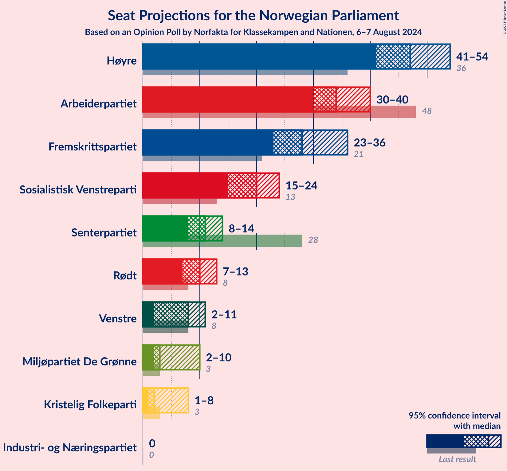
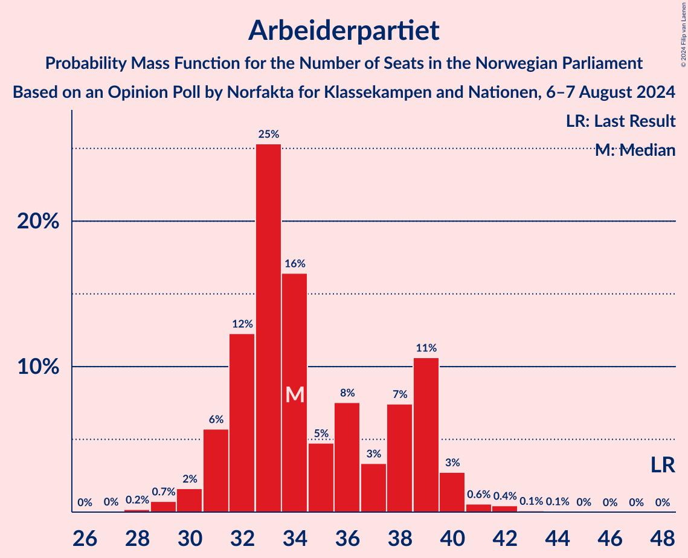
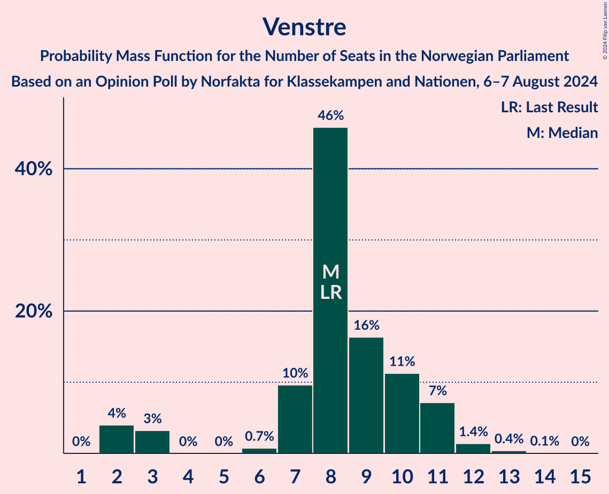
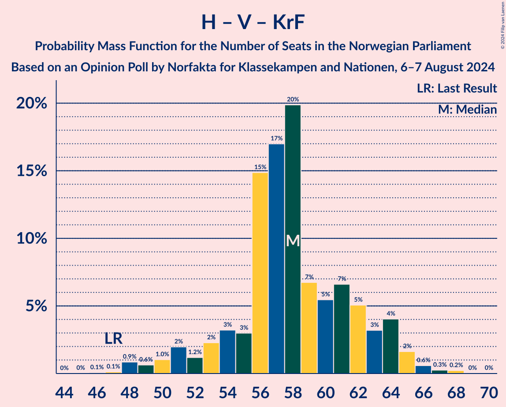

# Opinion Poll by Norfakta for Klassekampen and Nationen, 6–7 August 2024

<a href="#voting-intentions">Voting Intentions</a> | <a href="#seats">Seats</a> | <a href="#coalitions">Coalitions</a> | <a href="#technical-information">Technical Information</a>

## Voting Intentions

### Confidence Intervals

| Party | Last Result | Poll Result | 80% Confidence Interval | 90% Confidence Interval | 95% Confidence Interval | 99% Confidence Interval |
|:-----:|:-----------:|:-----------:|:-----------------------:|:-----------------------:|:-----------------------:|:-----------------------:|
| Høyre | 20.4% | 26.3% | 24.4–28.4% |23.8–29.0% |23.3–29.6% |22.4–30.6% |
| Arbeiderpartiet | 26.2% | 18.4% | 16.7–20.3% |16.2–20.9% |15.8–21.3% |15.1–22.3% |
| Fremskrittspartiet | 11.6% | 15.3% | 13.7–17.1% |13.3–17.6% |12.9–18.0% |12.2–18.9% |
| Sosialistisk Venstreparti | 7.6% | 11.3% | 9.9–12.9% |9.6–13.3% |9.2–13.7% |8.6–14.5% |
| Senterpartiet | 13.5% | 6.2% | 5.2–7.5% |5.0–7.8% |4.7–8.2% |4.3–8.8% |
| Rødt | 4.7% | 5.6% | 4.6–6.8% |4.4–7.1% |4.2–7.4% |3.8–8.1% |
| Venstre | 4.6% | 4.8% | 3.9–5.9% |3.7–6.3% |3.5–6.6% |3.1–7.1% |
| Miljøpartiet De Grønne | 3.9% | 4.2% | 3.4–5.2% |3.1–5.5% |3.0–5.8% |2.6–6.4% |
| Kristelig Folkeparti | 3.8% | 3.2% | 2.6–4.2% |2.4–4.5% |2.2–4.8% |1.9–5.3% |
| Industri- og Næringspartiet | 0.3% | 1.4% | 1.0–2.1% |0.9–2.4% |0.8–2.5% |0.6–2.9% |

*Note:* The poll result column reflects the actual value used in the calculations. Published results may vary slightly, and in addition be rounded to fewer digits.

## Seats

### Confidence Intervals

| Party | Last Result | Median | 80% Confidence Interval | 90% Confidence Interval | 95% Confidence Interval | 99% Confidence Interval |
|:-----:|:-----------:|:------:|:-----------------------:|:-----------------------:|:-----------------------:|:-----------------------:|
| <a href="#høyre">Høyre</a> | 36 | 47 | 44–49 |42–52 |41–54 |40–55 |
| <a href="#arbeiderpartiet">Arbeiderpartiet</a> | 48 | 34 | 32–39 |31–39 |30–40 |29–42 |
| <a href="#fremskrittspartiet">Fremskrittspartiet</a> | 21 | 28 | 24–33 |23–35 |23–36 |22–36 |
| <a href="#sosialistisk-venstreparti">Sosialistisk Venstreparti</a> | 13 | 20 | 17–22 |16–23 |15–24 |14–25 |
| <a href="#senterpartiet">Senterpartiet</a> | 28 | 11 | 9–13 |8–14 |8–14 |7–15 |
| <a href="#rødt">Rødt</a> | 8 | 10 | 8–12 |7–12 |7–13 |1–14 |
| <a href="#venstre">Venstre</a> | 8 | 8 | 7–10 |3–11 |2–11 |2–12 |
| <a href="#miljøpartiet-de-grønne">Miljøpartiet De Grønne</a> | 3 | 3 | 2–9 |2–10 |2–10 |1–10 |
| <a href="#kristelig-folkeparti">Kristelig Folkeparti</a> | 3 | 2 | 2–7 |2–8 |1–8 |0–9 |
| <a href="#industri--og-næringspartiet">Industri- og Næringspartiet</a> | 0 | 0 | 0 |0 |0 |0–2 |

### Høyre

*For a full overview of the results for this party, see the [Høyre](party-høyre.html) page.*

| Number of Seats | Probability | Accumulated | Special Marks |
|:---------------:|:-----------:|:-----------:|:-------------:|
| 36 | 0% | 100% | Last Result |
| 37 | 0% | 100% |  |
| 38 | 0% | 100% |  |
| 39 | 0.2% | 99.9% |  |
| 40 | 2% | 99.7% |  |
| 41 | 2% | 98% |  |
| 42 | 1.1% | 96% |  |
| 43 | 2% | 95% |  |
| 44 | 5% | 93% |  |
| 45 | 14% | 87% |  |
| 46 | 18% | 74% |  |
| 47 | 25% | 55% | Median |
| 48 | 11% | 30% |  |
| 49 | 10% | 19% |  |
| 50 | 2% | 9% |  |
| 51 | 2% | 7% |  |
| 52 | 1.2% | 6% |  |
| 53 | 2% | 4% |  |
| 54 | 1.5% | 3% |  |
| 55 | 1.1% | 1.2% |  |
| 56 | 0.1% | 0.1% |  |
| 57 | 0% | 0.1% |  |
| 58 | 0% | 0% |  |

### Arbeiderpartiet

*For a full overview of the results for this party, see the [Arbeiderpartiet](party-arbeiderpartiet.html) page.*

| Number of Seats | Probability | Accumulated | Special Marks |
|:---------------:|:-----------:|:-----------:|:-------------:|
| 27 | 0% | 100% |  |
| 28 | 0.2% | 99.9% |  |
| 29 | 0.7% | 99.8% |  |
| 30 | 2% | 99.0% |  |
| 31 | 6% | 97% |  |
| 32 | 12% | 92% |  |
| 33 | 25% | 79% |  |
| 34 | 16% | 54% | Median |
| 35 | 5% | 38% |  |
| 36 | 8% | 33% |  |
| 37 | 3% | 25% |  |
| 38 | 7% | 22% |  |
| 39 | 11% | 15% |  |
| 40 | 3% | 4% |  |
| 41 | 0.6% | 1.2% |  |
| 42 | 0.4% | 0.6% |  |
| 43 | 0.1% | 0.2% |  |
| 44 | 0.1% | 0.1% |  |
| 45 | 0% | 0% |  |
| 46 | 0% | 0% |  |
| 47 | 0% | 0% |  |
| 48 | 0% | 0% | Last Result |

### Fremskrittspartiet

*For a full overview of the results for this party, see the [Fremskrittspartiet](party-fremskrittspartiet.html) page.*

| Number of Seats | Probability | Accumulated | Special Marks |
|:---------------:|:-----------:|:-----------:|:-------------:|
| 20 | 0.1% | 100% |  |
| 21 | 0.2% | 99.9% | Last Result |
| 22 | 1.2% | 99.7% |  |
| 23 | 4% | 98.6% |  |
| 24 | 6% | 94% |  |
| 25 | 6% | 88% |  |
| 26 | 9% | 81% |  |
| 27 | 15% | 73% |  |
| 28 | 10% | 57% | Median |
| 29 | 10% | 47% |  |
| 30 | 7% | 38% |  |
| 31 | 3% | 30% |  |
| 32 | 17% | 27% |  |
| 33 | 2% | 10% |  |
| 34 | 1.4% | 8% |  |
| 35 | 1.3% | 6% |  |
| 36 | 5% | 5% |  |
| 37 | 0.2% | 0.2% |  |
| 38 | 0.1% | 0.1% |  |
| 39 | 0% | 0% |  |

### Sosialistisk Venstreparti

*For a full overview of the results for this party, see the [Sosialistisk Venstreparti](party-sosialistiskvenstreparti.html) page.*

| Number of Seats | Probability | Accumulated | Special Marks |
|:---------------:|:-----------:|:-----------:|:-------------:|
| 13 | 0.2% | 100% | Last Result |
| 14 | 0.6% | 99.8% |  |
| 15 | 2% | 99.2% |  |
| 16 | 3% | 97% |  |
| 17 | 8% | 95% |  |
| 18 | 12% | 87% |  |
| 19 | 15% | 75% |  |
| 20 | 19% | 60% | Median |
| 21 | 6% | 41% |  |
| 22 | 28% | 35% |  |
| 23 | 3% | 7% |  |
| 24 | 2% | 3% |  |
| 25 | 1.2% | 2% |  |
| 26 | 0.1% | 0.4% |  |
| 27 | 0.3% | 0.3% |  |
| 28 | 0% | 0.1% |  |
| 29 | 0% | 0% |  |

### Senterpartiet

*For a full overview of the results for this party, see the [Senterpartiet](party-senterpartiet.html) page.*

| Number of Seats | Probability | Accumulated | Special Marks |
|:---------------:|:-----------:|:-----------:|:-------------:|
| 1 | 0.1% | 100% |  |
| 2 | 0% | 99.9% |  |
| 3 | 0% | 99.9% |  |
| 4 | 0% | 99.9% |  |
| 5 | 0% | 99.9% |  |
| 6 | 0.3% | 99.9% |  |
| 7 | 2% | 99.6% |  |
| 8 | 4% | 98% |  |
| 9 | 14% | 93% |  |
| 10 | 13% | 79% |  |
| 11 | 20% | 66% | Median |
| 12 | 18% | 47% |  |
| 13 | 20% | 29% |  |
| 14 | 7% | 9% |  |
| 15 | 2% | 2% |  |
| 16 | 0.4% | 0.5% |  |
| 17 | 0.1% | 0.1% |  |
| 18 | 0% | 0% |  |
| 19 | 0% | 0% |  |
| 20 | 0% | 0% |  |
| 21 | 0% | 0% |  |
| 22 | 0% | 0% |  |
| 23 | 0% | 0% |  |
| 24 | 0% | 0% |  |
| 25 | 0% | 0% |  |
| 26 | 0% | 0% |  |
| 27 | 0% | 0% |  |
| 28 | 0% | 0% | Last Result |

### Rødt

*For a full overview of the results for this party, see the [Rødt](party-rødt.html) page.*

| Number of Seats | Probability | Accumulated | Special Marks |
|:---------------:|:-----------:|:-----------:|:-------------:|
| 1 | 1.3% | 100% |  |
| 2 | 0% | 98.7% |  |
| 3 | 0% | 98.7% |  |
| 4 | 0% | 98.7% |  |
| 5 | 0% | 98.7% |  |
| 6 | 0.8% | 98.7% |  |
| 7 | 4% | 98% |  |
| 8 | 7% | 94% | Last Result |
| 9 | 19% | 87% |  |
| 10 | 36% | 68% | Median |
| 11 | 19% | 32% |  |
| 12 | 8% | 13% |  |
| 13 | 3% | 4% |  |
| 14 | 0.6% | 1.0% |  |
| 15 | 0.3% | 0.4% |  |
| 16 | 0% | 0.1% |  |
| 17 | 0% | 0% |  |

### Venstre

*For a full overview of the results for this party, see the [Venstre](party-venstre.html) page.*

| Number of Seats | Probability | Accumulated | Special Marks |
|:---------------:|:-----------:|:-----------:|:-------------:|
| 2 | 4% | 100% |  |
| 3 | 3% | 96% |  |
| 4 | 0% | 93% |  |
| 5 | 0% | 93% |  |
| 6 | 0.7% | 93% |  |
| 7 | 10% | 92% |  |
| 8 | 46% | 82% | Last Result, Median |
| 9 | 16% | 37% |  |
| 10 | 11% | 20% |  |
| 11 | 7% | 9% |  |
| 12 | 1.4% | 2% |  |
| 13 | 0.4% | 0.5% |  |
| 14 | 0.1% | 0.1% |  |
| 15 | 0% | 0% |  |

### Miljøpartiet De Grønne

*For a full overview of the results for this party, see the [Miljøpartiet De Grønne](party-miljøpartietdegrønne.html) page.*

| Number of Seats | Probability | Accumulated | Special Marks |
|:---------------:|:-----------:|:-----------:|:-------------:|
| 1 | 1.2% | 100% |  |
| 2 | 43% | 98.8% |  |
| 3 | 14% | 55% | Last Result, Median |
| 4 | 0% | 41% |  |
| 5 | 0% | 41% |  |
| 6 | 2% | 41% |  |
| 7 | 10% | 40% |  |
| 8 | 6% | 29% |  |
| 9 | 15% | 23% |  |
| 10 | 7% | 8% |  |
| 11 | 0.2% | 0.3% |  |
| 12 | 0.1% | 0.2% |  |
| 13 | 0% | 0% |  |

### Kristelig Folkeparti

*For a full overview of the results for this party, see the [Kristelig Folkeparti](party-kristeligfolkeparti.html) page.*

| Number of Seats | Probability | Accumulated | Special Marks |
|:---------------:|:-----------:|:-----------:|:-------------:|
| 0 | 2% | 100% |  |
| 1 | 2% | 98% |  |
| 2 | 54% | 97% | Median |
| 3 | 28% | 42% | Last Result |
| 4 | 0% | 15% |  |
| 5 | 0% | 15% |  |
| 6 | 2% | 15% |  |
| 7 | 6% | 12% |  |
| 8 | 5% | 6% |  |
| 9 | 0.8% | 1.2% |  |
| 10 | 0.4% | 0.4% |  |
| 11 | 0% | 0% |  |

### Industri- og Næringspartiet

*For a full overview of the results for this party, see the [Industri- og Næringspartiet](party-industri-ognæringspartiet.html) page.*

| Number of Seats | Probability | Accumulated | Special Marks |
|:---------------:|:-----------:|:-----------:|:-------------:|
| 0 | 98% | 100% | Last Result, Median |
| 1 | 0.6% | 2% |  |
| 2 | 1.2% | 1.3% |  |
| 3 | 0% | 0% |  |

## Coalitions

### Confidence Intervals

| Coalition | Last Result | Median | Majority? | 80% Confidence Interval | 90% Confidence Interval | 95% Confidence Interval | 99% Confidence Interval |
|:---------:|:-----------:|:------:|:---------:|:-----------------------:|:-----------------------:|:-----------------------:|:-----------------------:|
| Høyre – Fremskrittspartiet – Senterpartiet – Venstre – Kristelig Folkeparti | 96 | 98 | 99.9% | 93–103 | 91–105 | 90–105 | 87–108 |
| Høyre – Fremskrittspartiet – Venstre – Miljøpartiet De Grønne – Kristelig Folkeparti | 71 | 92 | 95% | 87–96 | 85–97 | 84–100 | 79–102 |
| Høyre – Fremskrittspartiet – Venstre – Kristelig Folkeparti | 68 | 86 | 65% | 82–91 | 80–93 | 78–93 | 76–98 |
| Høyre – Fremskrittspartiet – Venstre | 65 | 84 | 40% | 78–89 | 77–91 | 75–91 | 72–95 |
| Arbeiderpartiet – Sosialistisk Venstreparti – Senterpartiet – Rødt – Miljøpartiet De Grønne | 100 | 80 | 24% | 75–86 | 74–87 | 72–89 | 70–92 |
| Høyre – Fremskrittspartiet | 57 | 76 | 0.9% | 70–81 | 69–81 | 68–83 | 65–87 |
| Arbeiderpartiet – Sosialistisk Venstreparti – Senterpartiet – Rødt | 97 | 76 | 0.6% | 71–80 | 69–82 | 67–83 | 65–85 |
| Arbeiderpartiet – Sosialistisk Venstreparti – Senterpartiet – Miljøpartiet De Grønne – Kristelig Folkeparti | 95 | 74 | 0.7% | 68–78 | 68–80 | 67–82 | 63–85 |
| Arbeiderpartiet – Sosialistisk Venstreparti – Senterpartiet – Miljøpartiet De Grønne | 92 | 70 | 0.1% | 66–76 | 65–77 | 63–79 | 61–82 |
| Arbeiderpartiet – Sosialistisk Venstreparti – Rødt – Miljøpartiet De Grønne | 72 | 69 | 0% | 63–74 | 63–76 | 61–77 | 59–80 |
| Arbeiderpartiet – Sosialistisk Venstreparti – Senterpartiet | 89 | 66 | 0% | 62–70 | 60–72 | 59–73 | 56–74 |
| Høyre – Venstre – Kristelig Folkeparti | 47 | 58 | 0% | 54–62 | 52–64 | 50–65 | 48–67 |
| Arbeiderpartiet – Senterpartiet – Miljøpartiet De Grønne – Kristelig Folkeparti | 82 | 53 | 0% | 49–59 | 48–61 | 47–62 | 45–65 |
| Arbeiderpartiet – Sosialistisk Venstreparti | 61 | 55 | 0% | 51–60 | 50–61 | 49–61 | 47–63 |
| Arbeiderpartiet – Senterpartiet – Kristelig Folkeparti | 79 | 48 | 0% | 45–54 | 44–55 | 43–56 | 41–59 |
| Arbeiderpartiet – Senterpartiet | 76 | 46 | 0% | 42–49 | 41–51 | 41–52 | 38–53 |
| Senterpartiet – Venstre – Kristelig Folkeparti | 39 | 22 | 0% | 19–26 | 17–27 | 15–29 | 13–31 |

### Høyre – Fremskrittspartiet – Senterpartiet – Venstre – Kristelig Folkeparti

| Number of Seats | Probability | Accumulated | Special Marks |
|:---------------:|:-----------:|:-----------:|:-------------:|
| 84 | 0.1% | 100% |  |
| 85 | 0.1% | 99.9% | Majority |
| 86 | 0.1% | 99.8% |  |
| 87 | 0.2% | 99.7% |  |
| 88 | 0.8% | 99.4% |  |
| 89 | 1.0% | 98.6% |  |
| 90 | 2% | 98% |  |
| 91 | 2% | 96% |  |
| 92 | 3% | 94% |  |
| 93 | 2% | 90% |  |
| 94 | 9% | 88% |  |
| 95 | 10% | 79% |  |
| 96 | 13% | 68% | Last Result, Median |
| 97 | 5% | 55% |  |
| 98 | 7% | 51% |  |
| 99 | 4% | 43% |  |
| 100 | 6% | 39% |  |
| 101 | 18% | 33% |  |
| 102 | 3% | 15% |  |
| 103 | 4% | 13% |  |
| 104 | 1.1% | 9% |  |
| 105 | 6% | 7% |  |
| 106 | 0.6% | 2% |  |
| 107 | 0.2% | 1.1% |  |
| 108 | 0.7% | 0.9% |  |
| 109 | 0.1% | 0.2% |  |
| 110 | 0% | 0.1% |  |
| 111 | 0% | 0% |  |

### Høyre – Fremskrittspartiet – Venstre – Miljøpartiet De Grønne – Kristelig Folkeparti

| Number of Seats | Probability | Accumulated | Special Marks |
|:---------------:|:-----------:|:-----------:|:-------------:|
| 71 | 0% | 100% | Last Result |
| 72 | 0% | 100% |  |
| 73 | 0% | 100% |  |
| 74 | 0% | 100% |  |
| 75 | 0% | 100% |  |
| 76 | 0% | 100% |  |
| 77 | 0% | 100% |  |
| 78 | 0% | 99.9% |  |
| 79 | 0.6% | 99.9% |  |
| 80 | 0.2% | 99.3% |  |
| 81 | 0.4% | 99.1% |  |
| 82 | 0.2% | 98.7% |  |
| 83 | 0.6% | 98% |  |
| 84 | 3% | 98% |  |
| 85 | 2% | 95% | Majority |
| 86 | 3% | 93% |  |
| 87 | 4% | 90% |  |
| 88 | 9% | 86% | Median |
| 89 | 7% | 77% |  |
| 90 | 4% | 70% |  |
| 91 | 6% | 66% |  |
| 92 | 32% | 60% |  |
| 93 | 5% | 28% |  |
| 94 | 3% | 23% |  |
| 95 | 8% | 20% |  |
| 96 | 3% | 12% |  |
| 97 | 4% | 9% |  |
| 98 | 2% | 5% |  |
| 99 | 0.7% | 3% |  |
| 100 | 1.3% | 3% |  |
| 101 | 0.6% | 1.3% |  |
| 102 | 0.2% | 0.6% |  |
| 103 | 0.4% | 0.5% |  |
| 104 | 0.1% | 0.1% |  |
| 105 | 0% | 0% |  |

### Høyre – Fremskrittspartiet – Venstre – Kristelig Folkeparti

| Number of Seats | Probability | Accumulated | Special Marks |
|:---------------:|:-----------:|:-----------:|:-------------:|
| 68 | 0% | 100% | Last Result |
| 69 | 0% | 100% |  |
| 70 | 0% | 100% |  |
| 71 | 0% | 100% |  |
| 72 | 0.1% | 100% |  |
| 73 | 0.1% | 99.9% |  |
| 74 | 0.1% | 99.9% |  |
| 75 | 0.1% | 99.7% |  |
| 76 | 0.7% | 99.6% |  |
| 77 | 1.0% | 98.9% |  |
| 78 | 1.4% | 98% |  |
| 79 | 1.2% | 96% |  |
| 80 | 2% | 95% |  |
| 81 | 2% | 93% |  |
| 82 | 9% | 91% |  |
| 83 | 10% | 82% |  |
| 84 | 6% | 71% |  |
| 85 | 4% | 65% | Median, Majority |
| 86 | 12% | 61% |  |
| 87 | 5% | 49% |  |
| 88 | 5% | 44% |  |
| 89 | 5% | 39% |  |
| 90 | 20% | 34% |  |
| 91 | 5% | 15% |  |
| 92 | 1.5% | 10% |  |
| 93 | 6% | 8% |  |
| 94 | 0.6% | 2% |  |
| 95 | 0.4% | 2% |  |
| 96 | 0.2% | 1.3% |  |
| 97 | 0.6% | 1.1% |  |
| 98 | 0.4% | 0.5% |  |
| 99 | 0% | 0.1% |  |
| 100 | 0% | 0% |  |

### Høyre – Fremskrittspartiet – Venstre

| Number of Seats | Probability | Accumulated | Special Marks |
|:---------------:|:-----------:|:-----------:|:-------------:|
| 65 | 0% | 100% | Last Result |
| 66 | 0% | 100% |  |
| 67 | 0% | 100% |  |
| 68 | 0% | 100% |  |
| 69 | 0% | 100% |  |
| 70 | 0.1% | 100% |  |
| 71 | 0.2% | 99.9% |  |
| 72 | 0.2% | 99.7% |  |
| 73 | 0.2% | 99.5% |  |
| 74 | 0.9% | 99.2% |  |
| 75 | 1.3% | 98% |  |
| 76 | 2% | 97% |  |
| 77 | 1.5% | 95% |  |
| 78 | 4% | 94% |  |
| 79 | 4% | 90% |  |
| 80 | 12% | 86% |  |
| 81 | 11% | 74% |  |
| 82 | 8% | 63% |  |
| 83 | 4% | 55% | Median |
| 84 | 11% | 51% |  |
| 85 | 3% | 40% | Majority |
| 86 | 5% | 37% |  |
| 87 | 18% | 32% |  |
| 88 | 2% | 15% |  |
| 89 | 5% | 13% |  |
| 90 | 1.4% | 8% |  |
| 91 | 5% | 6% |  |
| 92 | 0.6% | 2% |  |
| 93 | 0.4% | 1.0% |  |
| 94 | 0.1% | 0.6% |  |
| 95 | 0% | 0.5% |  |
| 96 | 0.5% | 0.5% |  |
| 97 | 0% | 0% |  |

### Arbeiderpartiet – Sosialistisk Venstreparti – Senterpartiet – Rødt – Miljøpartiet De Grønne

| Number of Seats | Probability | Accumulated | Special Marks |
|:---------------:|:-----------:|:-----------:|:-------------:|
| 66 | 0% | 100% |  |
| 67 | 0% | 99.9% |  |
| 68 | 0% | 99.9% |  |
| 69 | 0.1% | 99.9% |  |
| 70 | 0.6% | 99.7% |  |
| 71 | 1.0% | 99.2% |  |
| 72 | 0.9% | 98% |  |
| 73 | 0.9% | 97% |  |
| 74 | 3% | 96% |  |
| 75 | 7% | 94% |  |
| 76 | 2% | 87% |  |
| 77 | 6% | 85% |  |
| 78 | 22% | 79% | Median |
| 79 | 4% | 57% |  |
| 80 | 5% | 53% |  |
| 81 | 3% | 48% |  |
| 82 | 11% | 45% |  |
| 83 | 5% | 33% |  |
| 84 | 5% | 29% |  |
| 85 | 10% | 24% | Majority |
| 86 | 8% | 14% |  |
| 87 | 2% | 6% |  |
| 88 | 2% | 4% |  |
| 89 | 1.0% | 3% |  |
| 90 | 0.7% | 2% |  |
| 91 | 0.4% | 1.1% |  |
| 92 | 0.5% | 0.6% |  |
| 93 | 0.1% | 0.2% |  |
| 94 | 0% | 0.1% |  |
| 95 | 0.1% | 0.1% |  |
| 96 | 0% | 0% |  |
| 97 | 0% | 0% |  |
| 98 | 0% | 0% |  |
| 99 | 0% | 0% |  |
| 100 | 0% | 0% | Last Result |

### Høyre – Fremskrittspartiet

| Number of Seats | Probability | Accumulated | Special Marks |
|:---------------:|:-----------:|:-----------:|:-------------:|
| 57 | 0% | 100% | Last Result |
| 58 | 0% | 100% |  |
| 59 | 0% | 100% |  |
| 60 | 0% | 100% |  |
| 61 | 0% | 100% |  |
| 62 | 0% | 100% |  |
| 63 | 0% | 100% |  |
| 64 | 0.1% | 99.9% |  |
| 65 | 0.3% | 99.8% |  |
| 66 | 1.0% | 99.5% |  |
| 67 | 0.8% | 98.5% |  |
| 68 | 0.6% | 98% |  |
| 69 | 3% | 97% |  |
| 70 | 5% | 94% |  |
| 71 | 8% | 89% |  |
| 72 | 8% | 81% |  |
| 73 | 12% | 73% |  |
| 74 | 5% | 61% |  |
| 75 | 3% | 56% | Median |
| 76 | 13% | 53% |  |
| 77 | 4% | 40% |  |
| 78 | 7% | 36% |  |
| 79 | 16% | 29% |  |
| 80 | 3% | 13% |  |
| 81 | 6% | 10% |  |
| 82 | 1.1% | 4% |  |
| 83 | 0.5% | 3% |  |
| 84 | 1.3% | 2% |  |
| 85 | 0.3% | 0.9% | Majority |
| 86 | 0.1% | 0.7% |  |
| 87 | 0.5% | 0.5% |  |
| 88 | 0% | 0% |  |

### Arbeiderpartiet – Sosialistisk Venstreparti – Senterpartiet – Rødt

| Number of Seats | Probability | Accumulated | Special Marks |
|:---------------:|:-----------:|:-----------:|:-------------:|
| 62 | 0% | 100% |  |
| 63 | 0.1% | 99.9% |  |
| 64 | 0.2% | 99.8% |  |
| 65 | 0.7% | 99.6% |  |
| 66 | 0.8% | 98.9% |  |
| 67 | 0.7% | 98% |  |
| 68 | 2% | 97% |  |
| 69 | 2% | 95% |  |
| 70 | 2% | 94% |  |
| 71 | 4% | 92% |  |
| 72 | 6% | 87% |  |
| 73 | 8% | 82% |  |
| 74 | 3% | 74% |  |
| 75 | 5% | 71% | Median |
| 76 | 32% | 65% |  |
| 77 | 6% | 33% |  |
| 78 | 4% | 27% |  |
| 79 | 5% | 23% |  |
| 80 | 9% | 18% |  |
| 81 | 4% | 10% |  |
| 82 | 3% | 6% |  |
| 83 | 1.5% | 3% |  |
| 84 | 0.7% | 1.2% |  |
| 85 | 0.3% | 0.6% | Majority |
| 86 | 0.1% | 0.3% |  |
| 87 | 0.1% | 0.2% |  |
| 88 | 0% | 0.1% |  |
| 89 | 0.1% | 0.1% |  |
| 90 | 0% | 0% |  |
| 91 | 0% | 0% |  |
| 92 | 0% | 0% |  |
| 93 | 0% | 0% |  |
| 94 | 0% | 0% |  |
| 95 | 0% | 0% |  |
| 96 | 0% | 0% |  |
| 97 | 0% | 0% | Last Result |

### Arbeiderpartiet – Sosialistisk Venstreparti – Senterpartiet – Miljøpartiet De Grønne – Kristelig Folkeparti

| Number of Seats | Probability | Accumulated | Special Marks |
|:---------------:|:-----------:|:-----------:|:-------------:|
| 61 | 0.1% | 100% |  |
| 62 | 0.1% | 99.9% |  |
| 63 | 0.8% | 99.8% |  |
| 64 | 0.3% | 99.1% |  |
| 65 | 0.3% | 98.8% |  |
| 66 | 0.7% | 98% |  |
| 67 | 2% | 98% |  |
| 68 | 8% | 96% |  |
| 69 | 2% | 88% |  |
| 70 | 8% | 86% | Median |
| 71 | 18% | 79% |  |
| 72 | 4% | 60% |  |
| 73 | 4% | 57% |  |
| 74 | 11% | 53% |  |
| 75 | 5% | 42% |  |
| 76 | 13% | 37% |  |
| 77 | 4% | 25% |  |
| 78 | 12% | 21% |  |
| 79 | 2% | 9% |  |
| 80 | 2% | 7% |  |
| 81 | 2% | 5% |  |
| 82 | 1.1% | 3% |  |
| 83 | 0.5% | 2% |  |
| 84 | 0.4% | 1.1% |  |
| 85 | 0.4% | 0.7% | Majority |
| 86 | 0.2% | 0.4% |  |
| 87 | 0.1% | 0.2% |  |
| 88 | 0.1% | 0.1% |  |
| 89 | 0% | 0% |  |
| 90 | 0% | 0% |  |
| 91 | 0% | 0% |  |
| 92 | 0% | 0% |  |
| 93 | 0% | 0% |  |
| 94 | 0% | 0% |  |
| 95 | 0% | 0% | Last Result |

### Arbeiderpartiet – Sosialistisk Venstreparti – Senterpartiet – Miljøpartiet De Grønne

| Number of Seats | Probability | Accumulated | Special Marks |
|:---------------:|:-----------:|:-----------:|:-------------:|
| 58 | 0% | 100% |  |
| 59 | 0.1% | 99.9% |  |
| 60 | 0.1% | 99.9% |  |
| 61 | 0.8% | 99.8% |  |
| 62 | 0.7% | 99.0% |  |
| 63 | 1.1% | 98% |  |
| 64 | 0.8% | 97% |  |
| 65 | 4% | 96% |  |
| 66 | 8% | 93% |  |
| 67 | 4% | 84% |  |
| 68 | 20% | 80% | Median |
| 69 | 5% | 60% |  |
| 70 | 7% | 55% |  |
| 71 | 6% | 48% |  |
| 72 | 8% | 42% |  |
| 73 | 5% | 34% |  |
| 74 | 12% | 29% |  |
| 75 | 3% | 17% |  |
| 76 | 8% | 14% |  |
| 77 | 1.5% | 6% |  |
| 78 | 2% | 5% |  |
| 79 | 1.4% | 3% |  |
| 80 | 0.9% | 2% |  |
| 81 | 0.2% | 0.9% |  |
| 82 | 0.3% | 0.7% |  |
| 83 | 0.3% | 0.4% |  |
| 84 | 0% | 0.1% |  |
| 85 | 0% | 0.1% | Majority |
| 86 | 0% | 0% |  |
| 87 | 0% | 0% |  |
| 88 | 0% | 0% |  |
| 89 | 0% | 0% |  |
| 90 | 0% | 0% |  |
| 91 | 0% | 0% |  |
| 92 | 0% | 0% | Last Result |

### Arbeiderpartiet – Sosialistisk Venstreparti – Rødt – Miljøpartiet De Grønne

| Number of Seats | Probability | Accumulated | Special Marks |
|:---------------:|:-----------:|:-----------:|:-------------:|
| 56 | 0% | 100% |  |
| 57 | 0% | 99.9% |  |
| 58 | 0.1% | 99.9% |  |
| 59 | 0.3% | 99.8% |  |
| 60 | 0.7% | 99.5% |  |
| 61 | 2% | 98.8% |  |
| 62 | 1.2% | 96% |  |
| 63 | 6% | 95% |  |
| 64 | 2% | 89% |  |
| 65 | 5% | 87% |  |
| 66 | 4% | 82% |  |
| 67 | 18% | 78% | Median |
| 68 | 6% | 60% |  |
| 69 | 4% | 54% |  |
| 70 | 7% | 50% |  |
| 71 | 5% | 43% |  |
| 72 | 13% | 38% | Last Result |
| 73 | 9% | 25% |  |
| 74 | 9% | 16% |  |
| 75 | 1.5% | 7% |  |
| 76 | 1.4% | 5% |  |
| 77 | 2% | 4% |  |
| 78 | 0.7% | 2% |  |
| 79 | 0.6% | 1.2% |  |
| 80 | 0.4% | 0.6% |  |
| 81 | 0.2% | 0.2% |  |
| 82 | 0% | 0.1% |  |
| 83 | 0% | 0% |  |

### Arbeiderpartiet – Sosialistisk Venstreparti – Senterpartiet

| Number of Seats | Probability | Accumulated | Special Marks |
|:---------------:|:-----------:|:-----------:|:-------------:|
| 54 | 0.1% | 100% |  |
| 55 | 0% | 99.9% |  |
| 56 | 0.6% | 99.8% |  |
| 57 | 0.3% | 99.2% |  |
| 58 | 1.2% | 98.9% |  |
| 59 | 2% | 98% |  |
| 60 | 4% | 96% |  |
| 61 | 2% | 93% |  |
| 62 | 3% | 91% |  |
| 63 | 6% | 88% |  |
| 64 | 13% | 82% |  |
| 65 | 11% | 69% | Median |
| 66 | 27% | 59% |  |
| 67 | 7% | 32% |  |
| 68 | 4% | 25% |  |
| 69 | 5% | 21% |  |
| 70 | 8% | 16% |  |
| 71 | 3% | 8% |  |
| 72 | 2% | 6% |  |
| 73 | 2% | 3% |  |
| 74 | 0.4% | 0.9% |  |
| 75 | 0.1% | 0.5% |  |
| 76 | 0.2% | 0.4% |  |
| 77 | 0.1% | 0.2% |  |
| 78 | 0% | 0.1% |  |
| 79 | 0% | 0.1% |  |
| 80 | 0% | 0% |  |
| 81 | 0% | 0% |  |
| 82 | 0% | 0% |  |
| 83 | 0% | 0% |  |
| 84 | 0% | 0% |  |
| 85 | 0% | 0% | Majority |
| 86 | 0% | 0% |  |
| 87 | 0% | 0% |  |
| 88 | 0% | 0% |  |
| 89 | 0% | 0% | Last Result |

### Høyre – Venstre – Kristelig Folkeparti

| Number of Seats | Probability | Accumulated | Special Marks |
|:---------------:|:-----------:|:-----------:|:-------------:|
| 46 | 0.1% | 100% |  |
| 47 | 0.1% | 99.9% | Last Result |
| 48 | 0.9% | 99.8% |  |
| 49 | 0.6% | 98.9% |  |
| 50 | 1.0% | 98% |  |
| 51 | 2% | 97% |  |
| 52 | 1.2% | 95% |  |
| 53 | 2% | 94% |  |
| 54 | 3% | 92% |  |
| 55 | 3% | 89% |  |
| 56 | 15% | 86% |  |
| 57 | 17% | 71% | Median |
| 58 | 20% | 54% |  |
| 59 | 7% | 34% |  |
| 60 | 5% | 27% |  |
| 61 | 7% | 22% |  |
| 62 | 5% | 15% |  |
| 63 | 3% | 10% |  |
| 64 | 4% | 7% |  |
| 65 | 2% | 3% |  |
| 66 | 0.6% | 1.1% |  |
| 67 | 0.3% | 0.5% |  |
| 68 | 0.2% | 0.3% |  |
| 69 | 0% | 0.1% |  |
| 70 | 0% | 0% |  |

### Arbeiderpartiet – Senterpartiet – Miljøpartiet De Grønne – Kristelig Folkeparti

| Number of Seats | Probability | Accumulated | Special Marks |
|:---------------:|:-----------:|:-----------:|:-------------:|
| 43 | 0.1% | 100% |  |
| 44 | 0.3% | 99.9% |  |
| 45 | 0.5% | 99.6% |  |
| 46 | 1.0% | 99.1% |  |
| 47 | 2% | 98% |  |
| 48 | 3% | 96% |  |
| 49 | 19% | 93% |  |
| 50 | 7% | 74% | Median |
| 51 | 4% | 67% |  |
| 52 | 10% | 63% |  |
| 53 | 7% | 53% |  |
| 54 | 5% | 46% |  |
| 55 | 5% | 41% |  |
| 56 | 5% | 36% |  |
| 57 | 2% | 31% |  |
| 58 | 15% | 29% |  |
| 59 | 6% | 14% |  |
| 60 | 3% | 8% |  |
| 61 | 2% | 5% |  |
| 62 | 0.7% | 3% |  |
| 63 | 1.4% | 2% |  |
| 64 | 0.5% | 1.0% |  |
| 65 | 0.3% | 0.6% |  |
| 66 | 0.1% | 0.3% |  |
| 67 | 0.1% | 0.2% |  |
| 68 | 0% | 0.1% |  |
| 69 | 0% | 0% |  |
| 70 | 0% | 0% |  |
| 71 | 0% | 0% |  |
| 72 | 0% | 0% |  |
| 73 | 0% | 0% |  |
| 74 | 0% | 0% |  |
| 75 | 0% | 0% |  |
| 76 | 0% | 0% |  |
| 77 | 0% | 0% |  |
| 78 | 0% | 0% |  |
| 79 | 0% | 0% |  |
| 80 | 0% | 0% |  |
| 81 | 0% | 0% |  |
| 82 | 0% | 0% | Last Result |

### Arbeiderpartiet – Sosialistisk Venstreparti

| Number of Seats | Probability | Accumulated | Special Marks |
|:---------------:|:-----------:|:-----------:|:-------------:|
| 45 | 0.1% | 100% |  |
| 46 | 0.1% | 99.9% |  |
| 47 | 0.8% | 99.8% |  |
| 48 | 0.8% | 99.0% |  |
| 49 | 2% | 98% |  |
| 50 | 5% | 96% |  |
| 51 | 4% | 91% |  |
| 52 | 19% | 87% |  |
| 53 | 6% | 68% |  |
| 54 | 9% | 62% | Median |
| 55 | 21% | 53% |  |
| 56 | 10% | 33% |  |
| 57 | 6% | 23% |  |
| 58 | 3% | 17% |  |
| 59 | 4% | 15% |  |
| 60 | 3% | 11% |  |
| 61 | 6% | 8% | Last Result |
| 62 | 0.7% | 1.5% |  |
| 63 | 0.3% | 0.7% |  |
| 64 | 0.3% | 0.4% |  |
| 65 | 0.1% | 0.2% |  |
| 66 | 0.1% | 0.1% |  |
| 67 | 0% | 0% |  |

### Arbeiderpartiet – Senterpartiet – Kristelig Folkeparti

| Number of Seats | Probability | Accumulated | Special Marks |
|:---------------:|:-----------:|:-----------:|:-------------:|
| 39 | 0.1% | 100% |  |
| 40 | 0.4% | 99.9% |  |
| 41 | 0.5% | 99.5% |  |
| 42 | 1.1% | 99.0% |  |
| 43 | 3% | 98% |  |
| 44 | 3% | 95% |  |
| 45 | 2% | 92% |  |
| 46 | 5% | 90% |  |
| 47 | 25% | 85% | Median |
| 48 | 13% | 59% |  |
| 49 | 11% | 47% |  |
| 50 | 10% | 36% |  |
| 51 | 9% | 27% |  |
| 52 | 3% | 18% |  |
| 53 | 4% | 14% |  |
| 54 | 4% | 10% |  |
| 55 | 2% | 7% |  |
| 56 | 3% | 5% |  |
| 57 | 0.4% | 1.4% |  |
| 58 | 0.4% | 1.0% |  |
| 59 | 0.3% | 0.6% |  |
| 60 | 0.2% | 0.4% |  |
| 61 | 0.1% | 0.1% |  |
| 62 | 0% | 0% |  |
| 63 | 0% | 0% |  |
| 64 | 0% | 0% |  |
| 65 | 0% | 0% |  |
| 66 | 0% | 0% |  |
| 67 | 0% | 0% |  |
| 68 | 0% | 0% |  |
| 69 | 0% | 0% |  |
| 70 | 0% | 0% |  |
| 71 | 0% | 0% |  |
| 72 | 0% | 0% |  |
| 73 | 0% | 0% |  |
| 74 | 0% | 0% |  |
| 75 | 0% | 0% |  |
| 76 | 0% | 0% |  |
| 77 | 0% | 0% |  |
| 78 | 0% | 0% |  |
| 79 | 0% | 0% | Last Result |

### Arbeiderpartiet – Senterpartiet

| Number of Seats | Probability | Accumulated | Special Marks |
|:---------------:|:-----------:|:-----------:|:-------------:|
| 36 | 0% | 100% |  |
| 37 | 0.2% | 99.9% |  |
| 38 | 0.3% | 99.7% |  |
| 39 | 0.7% | 99.5% |  |
| 40 | 1.2% | 98.8% |  |
| 41 | 4% | 98% |  |
| 42 | 4% | 93% |  |
| 43 | 2% | 89% |  |
| 44 | 23% | 87% |  |
| 45 | 10% | 64% | Median |
| 46 | 14% | 54% |  |
| 47 | 12% | 39% |  |
| 48 | 13% | 28% |  |
| 49 | 5% | 14% |  |
| 50 | 3% | 9% |  |
| 51 | 3% | 6% |  |
| 52 | 0.8% | 3% |  |
| 53 | 1.3% | 2% |  |
| 54 | 0.2% | 0.4% |  |
| 55 | 0.2% | 0.2% |  |
| 56 | 0% | 0% |  |
| 57 | 0% | 0% |  |
| 58 | 0% | 0% |  |
| 59 | 0% | 0% |  |
| 60 | 0% | 0% |  |
| 61 | 0% | 0% |  |
| 62 | 0% | 0% |  |
| 63 | 0% | 0% |  |
| 64 | 0% | 0% |  |
| 65 | 0% | 0% |  |
| 66 | 0% | 0% |  |
| 67 | 0% | 0% |  |
| 68 | 0% | 0% |  |
| 69 | 0% | 0% |  |
| 70 | 0% | 0% |  |
| 71 | 0% | 0% |  |
| 72 | 0% | 0% |  |
| 73 | 0% | 0% |  |
| 74 | 0% | 0% |  |
| 75 | 0% | 0% |  |
| 76 | 0% | 0% | Last Result |

### Senterpartiet – Venstre – Kristelig Folkeparti

| Number of Seats | Probability | Accumulated | Special Marks |
|:---------------:|:-----------:|:-----------:|:-------------:|
| 12 | 0.1% | 100% |  |
| 13 | 0.6% | 99.8% |  |
| 14 | 0.8% | 99.2% |  |
| 15 | 1.0% | 98% |  |
| 16 | 0.8% | 97% |  |
| 17 | 3% | 97% |  |
| 18 | 2% | 94% |  |
| 19 | 10% | 92% |  |
| 20 | 6% | 82% |  |
| 21 | 5% | 76% | Median |
| 22 | 24% | 71% |  |
| 23 | 17% | 48% |  |
| 24 | 10% | 31% |  |
| 25 | 7% | 21% |  |
| 26 | 6% | 14% |  |
| 27 | 3% | 8% |  |
| 28 | 2% | 5% |  |
| 29 | 0.8% | 3% |  |
| 30 | 0.7% | 2% |  |
| 31 | 1.0% | 1.5% |  |
| 32 | 0.1% | 0.5% |  |
| 33 | 0.4% | 0.4% |  |
| 34 | 0% | 0% |  |
| 35 | 0% | 0% |  |
| 36 | 0% | 0% |  |
| 37 | 0% | 0% |  |
| 38 | 0% | 0% |  |
| 39 | 0% | 0% | Last Result |

## Technical Information

### Opinion Poll

+ **Polling firm:** Norfakta
+ **Commissioner(s):** Klassekampen and Nationen
+ **Fieldwork period:** 6–7 August 2024

### Calculations

+ **Sample size:** 771
+ **Simulations done:** 1,048,576
+ **Error estimate:** 2.27%

