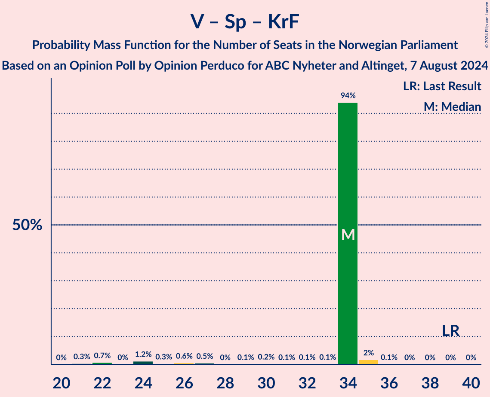

# Opinion Poll by Opinion Perduco for ABC Nyheter and Altinget, 7 August 2024

<a href="#voting-intentions">Voting Intentions</a> | <a href="#seats">Seats</a> | <a href="#coalitions">Coalitions</a> | <a href="#technical-information">Technical Information</a>

## Voting Intentions

### Confidence Intervals

| Party | Last Result | Poll Result | 80% Confidence Interval | 90% Confidence Interval | 95% Confidence Interval | 99% Confidence Interval |
|:-----:|:-----------:|:-----------:|:-----------------------:|:-----------------------:|:-----------------------:|:-----------------------:|
| Høyre | 20.4% | 26.8% | 24.8–29.0% |24.3–29.6% |23.8–30.1% |22.9–31.2% |
| Arbeiderpartiet | 26.2% | 21.2% | 19.4–23.2% |18.9–23.7% |18.4–24.2% |17.6–25.2% |
| Fremskrittspartiet | 11.6% | 15.0% | 13.4–16.8% |13.0–17.3% |12.6–17.7% |11.9–18.6% |
| Sosialistisk Venstreparti | 7.6% | 7.0% | 5.9–8.3% |5.6–8.7% |5.4–9.0% |4.9–9.7% |
| Venstre | 4.6% | 6.8% | 5.8–8.2% |5.5–8.5% |5.3–8.9% |4.8–9.5% |
| Rødt | 4.7% | 5.9% | 5.0–7.2% |4.7–7.5% |4.5–7.8% |4.0–8.5% |
| Senterpartiet | 13.5% | 5.8% | 4.8–7.0% |4.6–7.4% |4.3–7.7% |3.9–8.3% |
| Kristelig Folkeparti | 3.8% | 4.6% | 3.8–5.7% |3.5–6.1% |3.3–6.3% |3.0–6.9% |
| Miljøpartiet De Grønne | 3.9% | 3.2% | 2.5–4.1% |2.3–4.4% |2.1–4.7% |1.8–5.2% |
| Industri- og Næringspartiet | 0.3% | 1.4% | 1.0–2.2% |0.9–2.4% |0.8–2.6% |0.6–3.0% |
| Norgesdemokratene | 1.1% | 0.8% | 0.5–1.4% |0.4–1.6% |0.4–1.7% |0.3–2.1% |
| Konservativt | 0.4% | 0.4% | 0.2–0.9% |0.2–1.0% |0.1–1.2% |0.1–1.4% |
| Pensjonistpartiet | 0.6% | 0.4% | 0.2–0.9% |0.2–1.0% |0.1–1.2% |0.1–1.4% |
| Liberalistene | 0.2% | 0.3% | 0.1–0.7% |0.1–0.8% |0.1–1.0% |0.0–1.2% |

*Note:* The poll result column reflects the actual value used in the calculations. Published results may vary slightly, and in addition be rounded to fewer digits.

## Seats

### Confidence Intervals

| Party | Last Result | Median | 80% Confidence Interval | 90% Confidence Interval | 95% Confidence Interval | 99% Confidence Interval |
|:-----:|:-----------:|:------:|:-----------------------:|:-----------------------:|:-----------------------:|:-----------------------:|
| <a href="#høyre">Høyre</a> | 36 | 48 | 48 |48 |46–48 |43–53 |
| <a href="#arbeiderpartiet">Arbeiderpartiet</a> | 48 | 38 | 38 |38–39 |38–43 |35–44 |
| <a href="#fremskrittspartiet">Fremskrittspartiet</a> | 21 | 26 | 26 |26 |26–28 |24–37 |
| <a href="#sosialistisk-venstreparti">Sosialistisk Venstreparti</a> | 13 | 13 | 13 |13 |11–13 |8–14 |
| <a href="#venstre">Venstre</a> | 8 | 13 | 13 |13 |11–13 |9–14 |
| <a href="#rødt">Rødt</a> | 8 | 8 | 8 |8 |8–10 |8–12 |
| <a href="#senterpartiet">Senterpartiet</a> | 28 | 13 | 13 |13 |9–13 |7–14 |
| <a href="#kristelig-folkeparti">Kristelig Folkeparti</a> | 3 | 8 | 8 |8 |6–8 |2–9 |
| <a href="#miljøpartiet-de-grønne">Miljøpartiet De Grønne</a> | 3 | 1 | 1 |1 |1 |1–6 |
| <a href="#industri--og-næringspartiet">Industri- og Næringspartiet</a> | 0 | 0 | 0 |0 |0 |0–1 |
| <a href="#norgesdemokratene">Norgesdemokratene</a> | 0 | 0 | 0 |0 |0 |0 |
| <a href="#konservativt">Konservativt</a> | 0 | 0 | 0 |0 |0 |0 |
| <a href="#pensjonistpartiet">Pensjonistpartiet</a> | 0 | 0 | 0 |0 |0 |0 |
| <a href="#liberalistene">Liberalistene</a> | 0 | 0 | 0 |0 |0 |0 |

### Høyre

*For a full overview of the results for this party, see the [Høyre](party-høyre.html) page.*

| Number of Seats | Probability | Accumulated | Special Marks |
|:---------------:|:-----------:|:-----------:|:-------------:|
| 36 | 0% | 100% | Last Result |
| 37 | 0% | 100% |  |
| 38 | 0% | 100% |  |
| 39 | 0% | 100% |  |
| 40 | 0% | 100% |  |
| 41 | 0% | 100% |  |
| 42 | 0% | 99.9% |  |
| 43 | 0.9% | 99.9% |  |
| 44 | 0.3% | 99.0% |  |
| 45 | 0% | 98.7% |  |
| 46 | 2% | 98.6% |  |
| 47 | 0.8% | 97% |  |
| 48 | 95% | 96% | Median |
| 49 | 0.3% | 2% |  |
| 50 | 0.3% | 1.3% |  |
| 51 | 0.4% | 1.0% |  |
| 52 | 0.1% | 0.7% |  |
| 53 | 0.1% | 0.6% |  |
| 54 | 0% | 0.5% |  |
| 55 | 0% | 0.5% |  |
| 56 | 0.5% | 0.5% |  |
| 57 | 0% | 0% |  |

### Arbeiderpartiet

*For a full overview of the results for this party, see the [Arbeiderpartiet](party-arbeiderpartiet.html) page.*

| Number of Seats | Probability | Accumulated | Special Marks |
|:---------------:|:-----------:|:-----------:|:-------------:|
| 33 | 0.2% | 100% |  |
| 34 | 0.1% | 99.8% |  |
| 35 | 0.6% | 99.8% |  |
| 36 | 0.1% | 99.1% |  |
| 37 | 0.1% | 99.0% |  |
| 38 | 94% | 98.9% | Median |
| 39 | 0.4% | 5% |  |
| 40 | 0.4% | 5% |  |
| 41 | 0.7% | 4% |  |
| 42 | 0.3% | 4% |  |
| 43 | 1.2% | 3% |  |
| 44 | 2% | 2% |  |
| 45 | 0.3% | 0.3% |  |
| 46 | 0% | 0.1% |  |
| 47 | 0% | 0% |  |
| 48 | 0% | 0% | Last Result |

### Fremskrittspartiet

*For a full overview of the results for this party, see the [Fremskrittspartiet](party-fremskrittspartiet.html) page.*

| Number of Seats | Probability | Accumulated | Special Marks |
|:---------------:|:-----------:|:-----------:|:-------------:|
| 21 | 0.1% | 100% | Last Result |
| 22 | 0.1% | 99.8% |  |
| 23 | 0% | 99.8% |  |
| 24 | 0.3% | 99.7% |  |
| 25 | 2% | 99.4% |  |
| 26 | 94% | 98% | Median |
| 27 | 1.2% | 4% |  |
| 28 | 0.3% | 3% |  |
| 29 | 0.6% | 2% |  |
| 30 | 0.1% | 2% |  |
| 31 | 0.4% | 2% |  |
| 32 | 0.3% | 1.2% |  |
| 33 | 0% | 0.9% |  |
| 34 | 0% | 0.9% |  |
| 35 | 0% | 0.8% |  |
| 36 | 0.1% | 0.8% |  |
| 37 | 0.7% | 0.7% |  |
| 38 | 0% | 0% |  |

### Sosialistisk Venstreparti

*For a full overview of the results for this party, see the [Sosialistisk Venstreparti](party-sosialistiskvenstreparti.html) page.*

| Number of Seats | Probability | Accumulated | Special Marks |
|:---------------:|:-----------:|:-----------:|:-------------:|
| 8 | 1.3% | 100% |  |
| 9 | 0.3% | 98.7% |  |
| 10 | 0.8% | 98% |  |
| 11 | 0.7% | 98% |  |
| 12 | 2% | 97% |  |
| 13 | 94% | 95% | Last Result, Median |
| 14 | 0.4% | 0.8% |  |
| 15 | 0.3% | 0.3% |  |
| 16 | 0% | 0.1% |  |
| 17 | 0% | 0.1% |  |
| 18 | 0% | 0.1% |  |
| 19 | 0% | 0.1% |  |
| 20 | 0.1% | 0.1% |  |
| 21 | 0% | 0% |  |

### Venstre

*For a full overview of the results for this party, see the [Venstre](party-venstre.html) page.*

| Number of Seats | Probability | Accumulated | Special Marks |
|:---------------:|:-----------:|:-----------:|:-------------:|
| 8 | 0.2% | 100% | Last Result |
| 9 | 0.5% | 99.8% |  |
| 10 | 0.6% | 99.3% |  |
| 11 | 1.4% | 98.7% |  |
| 12 | 2% | 97% |  |
| 13 | 94% | 96% | Median |
| 14 | 1.3% | 2% |  |
| 15 | 0.1% | 0.4% |  |
| 16 | 0% | 0.3% |  |
| 17 | 0% | 0.2% |  |
| 18 | 0.2% | 0.2% |  |
| 19 | 0% | 0% |  |

### Rødt

*For a full overview of the results for this party, see the [Rødt](party-rødt.html) page.*

| Number of Seats | Probability | Accumulated | Special Marks |
|:---------------:|:-----------:|:-----------:|:-------------:|
| 1 | 0.1% | 100% |  |
| 2 | 0% | 99.9% |  |
| 3 | 0% | 99.9% |  |
| 4 | 0% | 99.9% |  |
| 5 | 0% | 99.9% |  |
| 6 | 0% | 99.9% |  |
| 7 | 0.2% | 99.9% |  |
| 8 | 95% | 99.7% | Last Result, Median |
| 9 | 2% | 5% |  |
| 10 | 0.9% | 3% |  |
| 11 | 0.5% | 2% |  |
| 12 | 0.9% | 1.1% |  |
| 13 | 0% | 0.2% |  |
| 14 | 0.2% | 0.2% |  |
| 15 | 0% | 0% |  |

### Senterpartiet

*For a full overview of the results for this party, see the [Senterpartiet](party-senterpartiet.html) page.*

| Number of Seats | Probability | Accumulated | Special Marks |
|:---------------:|:-----------:|:-----------:|:-------------:|
| 1 | 0.3% | 100% |  |
| 2 | 0% | 99.7% |  |
| 3 | 0% | 99.7% |  |
| 4 | 0% | 99.7% |  |
| 5 | 0% | 99.7% |  |
| 6 | 0% | 99.7% |  |
| 7 | 0.6% | 99.7% |  |
| 8 | 0.2% | 99.1% |  |
| 9 | 1.5% | 98.9% |  |
| 10 | 0.8% | 97% |  |
| 11 | 0.1% | 97% |  |
| 12 | 0.2% | 97% |  |
| 13 | 96% | 96% | Median |
| 14 | 0.4% | 0.6% |  |
| 15 | 0% | 0.1% |  |
| 16 | 0.1% | 0.1% |  |
| 17 | 0% | 0% |  |
| 18 | 0% | 0% |  |
| 19 | 0% | 0% |  |
| 20 | 0% | 0% |  |
| 21 | 0% | 0% |  |
| 22 | 0% | 0% |  |
| 23 | 0% | 0% |  |
| 24 | 0% | 0% |  |
| 25 | 0% | 0% |  |
| 26 | 0% | 0% |  |
| 27 | 0% | 0% |  |
| 28 | 0% | 0% | Last Result |

### Kristelig Folkeparti

*For a full overview of the results for this party, see the [Kristelig Folkeparti](party-kristeligfolkeparti.html) page.*

| Number of Seats | Probability | Accumulated | Special Marks |
|:---------------:|:-----------:|:-----------:|:-------------:|
| 2 | 0.8% | 100% |  |
| 3 | 2% | 99.2% | Last Result |
| 4 | 0% | 98% |  |
| 5 | 0% | 98% |  |
| 6 | 0.4% | 98% |  |
| 7 | 0.6% | 97% |  |
| 8 | 96% | 97% | Median |
| 9 | 0.6% | 0.9% |  |
| 10 | 0.1% | 0.2% |  |
| 11 | 0% | 0.1% |  |
| 12 | 0.1% | 0.1% |  |
| 13 | 0% | 0% |  |

### Miljøpartiet De Grønne

*For a full overview of the results for this party, see the [Miljøpartiet De Grønne](party-miljøpartietdegrønne.html) page.*

| Number of Seats | Probability | Accumulated | Special Marks |
|:---------------:|:-----------:|:-----------:|:-------------:|
| 1 | 98% | 100% | Median |
| 2 | 0.8% | 2% |  |
| 3 | 0.6% | 1.4% | Last Result |
| 4 | 0% | 0.8% |  |
| 5 | 0% | 0.8% |  |
| 6 | 0.3% | 0.8% |  |
| 7 | 0.2% | 0.4% |  |
| 8 | 0.1% | 0.2% |  |
| 9 | 0.2% | 0.2% |  |
| 10 | 0% | 0% |  |

### Industri- og Næringspartiet

*For a full overview of the results for this party, see the [Industri- og Næringspartiet](party-industri-ognæringspartiet.html) page.*

| Number of Seats | Probability | Accumulated | Special Marks |
|:---------------:|:-----------:|:-----------:|:-------------:|
| 0 | 99.2% | 100% | Last Result, Median |
| 1 | 0.4% | 0.8% |  |
| 2 | 0.4% | 0.4% |  |
| 3 | 0% | 0% |  |

### Norgesdemokratene

*For a full overview of the results for this party, see the [Norgesdemokratene](party-norgesdemokratene.html) page.*

| Number of Seats | Probability | Accumulated | Special Marks |
|:---------------:|:-----------:|:-----------:|:-------------:|
| 0 | 100% | 100% | Last Result, Median |

### Konservativt

*For a full overview of the results for this party, see the [Konservativt](party-konservativt.html) page.*

| Number of Seats | Probability | Accumulated | Special Marks |
|:---------------:|:-----------:|:-----------:|:-------------:|
| 0 | 100% | 100% | Last Result, Median |

### Pensjonistpartiet

*For a full overview of the results for this party, see the [Pensjonistpartiet](party-pensjonistpartiet.html) page.*

| Number of Seats | Probability | Accumulated | Special Marks |
|:---------------:|:-----------:|:-----------:|:-------------:|
| 0 | 100% | 100% | Last Result, Median |

### Liberalistene

*For a full overview of the results for this party, see the [Liberalistene](party-liberalistene.html) page.*

| Number of Seats | Probability | Accumulated | Special Marks |
|:---------------:|:-----------:|:-----------:|:-------------:|
| 0 | 100% | 100% | Last Result, Median |

## Coalitions

### Confidence Intervals

| Coalition | Last Result | Median | Majority? | 80% Confidence Interval | 90% Confidence Interval | 95% Confidence Interval | 99% Confidence Interval |
|:---------:|:-----------:|:------:|:---------:|:-----------------------:|:-----------------------:|:-----------------------:|:-----------------------:|
| Høyre – Fremskrittspartiet – Venstre – Senterpartiet – Kristelig Folkeparti | 96 | 108 | 100% | 108 | 107–108 | 104–108 | 99–109 |
| Høyre – Fremskrittspartiet – Venstre – Kristelig Folkeparti – Miljøpartiet De Grønne | 71 | 96 | 100% | 96 | 96 | 94–96 | 90–102 |
| Høyre – Fremskrittspartiet – Venstre – Kristelig Folkeparti | 68 | 95 | 100% | 95 | 95 | 93–95 | 89–98 |
| Høyre – Fremskrittspartiet – Venstre | 65 | 87 | 98.7% | 87 | 87 | 85–88 | 82–94 |
| Høyre – Fremskrittspartiet | 57 | 74 | 0% | 74 | 74 | 73–77 | 71–83 |
| Arbeiderpartiet – Sosialistisk Venstreparti – Rødt – Senterpartiet – Miljøpartiet De Grønne | 100 | 73 | 0% | 73 | 73 | 73–75 | 70–78 |
| Arbeiderpartiet – Sosialistisk Venstreparti – Rødt – Senterpartiet | 97 | 72 | 0% | 72 | 72 | 72–74 | 66–76 |
| Arbeiderpartiet – Sosialistisk Venstreparti – Senterpartiet – Kristelig Folkeparti – Miljøpartiet De Grønne | 95 | 73 | 0% | 73 | 73 | 70–73 | 62–76 |
| Høyre – Venstre – Kristelig Folkeparti | 47 | 69 | 0% | 69 | 68–69 | 64–69 | 58–69 |
| Arbeiderpartiet – Sosialistisk Venstreparti – Senterpartiet – Miljøpartiet De Grønne | 92 | 65 | 0% | 65 | 65 | 65–66 | 60–68 |
| Arbeiderpartiet – Sosialistisk Venstreparti – Senterpartiet | 89 | 64 | 0% | 64 | 64 | 64 | 57–67 |
| Arbeiderpartiet – Sosialistisk Venstreparti – Rødt – Miljøpartiet De Grønne | 72 | 60 | 0% | 60 | 60–61 | 60–64 | 59–69 |
| Arbeiderpartiet – Senterpartiet – Kristelig Folkeparti – Miljøpartiet De Grønne | 82 | 60 | 0% | 60 | 60 | 58–61 | 51–66 |
| Arbeiderpartiet – Senterpartiet – Kristelig Folkeparti | 79 | 59 | 0% | 59 | 59 | 55–59 | 50–65 |
| Arbeiderpartiet – Sosialistisk Venstreparti | 61 | 51 | 0% | 51 | 51 | 51–54 | 46–57 |
| Arbeiderpartiet – Senterpartiet | 76 | 51 | 0% | 51 | 51 | 51–52 | 47–57 |
| Venstre – Senterpartiet – Kristelig Folkeparti | 39 | 34 | 0% | 34 | 34 | 25–34 | 22–35 |

### Høyre – Fremskrittspartiet – Venstre – Senterpartiet – Kristelig Folkeparti

| Number of Seats | Probability | Accumulated | Special Marks |
|:---------------:|:-----------:|:-----------:|:-------------:|
| 96 | 0% | 100% | Last Result |
| 97 | 0.2% | 99.9% |  |
| 98 | 0.1% | 99.7% |  |
| 99 | 0.9% | 99.6% |  |
| 100 | 0.1% | 98.7% |  |
| 101 | 0.6% | 98.6% |  |
| 102 | 0.2% | 98% |  |
| 103 | 0.3% | 98% |  |
| 104 | 0.9% | 98% |  |
| 105 | 0.1% | 97% |  |
| 106 | 1.4% | 97% |  |
| 107 | 0.5% | 95% |  |
| 108 | 94% | 95% | Median |
| 109 | 0.5% | 0.7% |  |
| 110 | 0.1% | 0.2% |  |
| 111 | 0.1% | 0.1% |  |
| 112 | 0% | 0% |  |

### Høyre – Fremskrittspartiet – Venstre – Kristelig Folkeparti – Miljøpartiet De Grønne

| Number of Seats | Probability | Accumulated | Special Marks |
|:---------------:|:-----------:|:-----------:|:-------------:|
| 71 | 0% | 100% | Last Result |
| 72 | 0% | 100% |  |
| 73 | 0% | 100% |  |
| 74 | 0% | 100% |  |
| 75 | 0% | 100% |  |
| 76 | 0% | 100% |  |
| 77 | 0% | 100% |  |
| 78 | 0% | 100% |  |
| 79 | 0% | 100% |  |
| 80 | 0% | 100% |  |
| 81 | 0% | 100% |  |
| 82 | 0% | 100% |  |
| 83 | 0% | 100% |  |
| 84 | 0% | 100% |  |
| 85 | 0% | 100% | Majority |
| 86 | 0% | 100% |  |
| 87 | 0% | 100% |  |
| 88 | 0% | 100% |  |
| 89 | 0.1% | 99.9% |  |
| 90 | 0.5% | 99.8% |  |
| 91 | 0.1% | 99.4% |  |
| 92 | 0.3% | 99.3% |  |
| 93 | 0.6% | 99.0% |  |
| 94 | 1.3% | 98% |  |
| 95 | 0.1% | 97% |  |
| 96 | 95% | 97% | Median |
| 97 | 0.6% | 2% |  |
| 98 | 0.3% | 1.3% |  |
| 99 | 0.1% | 1.0% |  |
| 100 | 0.1% | 0.9% |  |
| 101 | 0.3% | 0.8% |  |
| 102 | 0.4% | 0.5% |  |
| 103 | 0% | 0.2% |  |
| 104 | 0.1% | 0.1% |  |
| 105 | 0% | 0% |  |

### Høyre – Fremskrittspartiet – Venstre – Kristelig Folkeparti

| Number of Seats | Probability | Accumulated | Special Marks |
|:---------------:|:-----------:|:-----------:|:-------------:|
| 68 | 0% | 100% | Last Result |
| 69 | 0% | 100% |  |
| 70 | 0% | 100% |  |
| 71 | 0% | 100% |  |
| 72 | 0% | 100% |  |
| 73 | 0% | 100% |  |
| 74 | 0% | 100% |  |
| 75 | 0% | 100% |  |
| 76 | 0% | 100% |  |
| 77 | 0% | 100% |  |
| 78 | 0% | 100% |  |
| 79 | 0% | 100% |  |
| 80 | 0% | 100% |  |
| 81 | 0% | 100% |  |
| 82 | 0% | 100% |  |
| 83 | 0% | 100% |  |
| 84 | 0% | 100% |  |
| 85 | 0% | 100% | Majority |
| 86 | 0.1% | 100% |  |
| 87 | 0.1% | 99.9% |  |
| 88 | 0% | 99.8% |  |
| 89 | 0.7% | 99.8% |  |
| 90 | 0.7% | 99.1% |  |
| 91 | 0.4% | 98% |  |
| 92 | 0.1% | 98% |  |
| 93 | 2% | 98% |  |
| 94 | 0% | 96% |  |
| 95 | 95% | 96% | Median |
| 96 | 1.0% | 2% |  |
| 97 | 0.2% | 0.7% |  |
| 98 | 0.1% | 0.5% |  |
| 99 | 0.1% | 0.5% |  |
| 100 | 0.3% | 0.4% |  |
| 101 | 0% | 0.1% |  |
| 102 | 0% | 0% |  |

### Høyre – Fremskrittspartiet – Venstre

| Number of Seats | Probability | Accumulated | Special Marks |
|:---------------:|:-----------:|:-----------:|:-------------:|
| 65 | 0% | 100% | Last Result |
| 66 | 0% | 100% |  |
| 67 | 0% | 100% |  |
| 68 | 0% | 100% |  |
| 69 | 0% | 100% |  |
| 70 | 0% | 100% |  |
| 71 | 0% | 100% |  |
| 72 | 0% | 100% |  |
| 73 | 0% | 100% |  |
| 74 | 0% | 100% |  |
| 75 | 0% | 100% |  |
| 76 | 0% | 100% |  |
| 77 | 0% | 100% |  |
| 78 | 0.1% | 99.9% |  |
| 79 | 0.1% | 99.9% |  |
| 80 | 0.1% | 99.8% |  |
| 81 | 0.1% | 99.7% |  |
| 82 | 0.2% | 99.6% |  |
| 83 | 0.1% | 99.4% |  |
| 84 | 0.6% | 99.4% |  |
| 85 | 1.3% | 98.7% | Majority |
| 86 | 0.5% | 97% |  |
| 87 | 94% | 97% | Median |
| 88 | 0.5% | 3% |  |
| 89 | 0.4% | 2% |  |
| 90 | 0.1% | 2% |  |
| 91 | 0.1% | 2% |  |
| 92 | 0.8% | 2% |  |
| 93 | 0.1% | 0.8% |  |
| 94 | 0.5% | 0.7% |  |
| 95 | 0% | 0.3% |  |
| 96 | 0% | 0.3% |  |
| 97 | 0.2% | 0.2% |  |
| 98 | 0% | 0% |  |

### Høyre – Fremskrittspartiet

| Number of Seats | Probability | Accumulated | Special Marks |
|:---------------:|:-----------:|:-----------:|:-------------:|
| 57 | 0% | 100% | Last Result |
| 58 | 0% | 100% |  |
| 59 | 0% | 100% |  |
| 60 | 0% | 100% |  |
| 61 | 0% | 100% |  |
| 62 | 0% | 100% |  |
| 63 | 0% | 100% |  |
| 64 | 0% | 100% |  |
| 65 | 0% | 100% |  |
| 66 | 0% | 99.9% |  |
| 67 | 0% | 99.9% |  |
| 68 | 0.2% | 99.9% |  |
| 69 | 0% | 99.7% |  |
| 70 | 0% | 99.7% |  |
| 71 | 1.4% | 99.6% |  |
| 72 | 0.4% | 98% |  |
| 73 | 0.4% | 98% |  |
| 74 | 94% | 97% | Median |
| 75 | 0.4% | 3% |  |
| 76 | 0.1% | 3% |  |
| 77 | 0.5% | 3% |  |
| 78 | 0.6% | 2% |  |
| 79 | 0.4% | 2% |  |
| 80 | 0.8% | 1.5% |  |
| 81 | 0.1% | 0.6% |  |
| 82 | 0% | 0.6% |  |
| 83 | 0.5% | 0.6% |  |
| 84 | 0% | 0% |  |

### Arbeiderpartiet – Sosialistisk Venstreparti – Rødt – Senterpartiet – Miljøpartiet De Grønne

| Number of Seats | Probability | Accumulated | Special Marks |
|:---------------:|:-----------:|:-----------:|:-------------:|
| 67 | 0% | 100% |  |
| 68 | 0.3% | 99.9% |  |
| 69 | 0.1% | 99.6% |  |
| 70 | 0.1% | 99.6% |  |
| 71 | 0.2% | 99.5% |  |
| 72 | 1.0% | 99.3% |  |
| 73 | 95% | 98% | Median |
| 74 | 0% | 4% |  |
| 75 | 2% | 4% |  |
| 76 | 0.1% | 2% |  |
| 77 | 1.1% | 2% |  |
| 78 | 0.4% | 0.9% |  |
| 79 | 0.3% | 0.5% |  |
| 80 | 0% | 0.2% |  |
| 81 | 0.1% | 0.2% |  |
| 82 | 0% | 0.1% |  |
| 83 | 0% | 0% |  |
| 84 | 0% | 0% |  |
| 85 | 0% | 0% | Majority |
| 86 | 0% | 0% |  |
| 87 | 0% | 0% |  |
| 88 | 0% | 0% |  |
| 89 | 0% | 0% |  |
| 90 | 0% | 0% |  |
| 91 | 0% | 0% |  |
| 92 | 0% | 0% |  |
| 93 | 0% | 0% |  |
| 94 | 0% | 0% |  |
| 95 | 0% | 0% |  |
| 96 | 0% | 0% |  |
| 97 | 0% | 0% |  |
| 98 | 0% | 0% |  |
| 99 | 0% | 0% |  |
| 100 | 0% | 0% | Last Result |

### Arbeiderpartiet – Sosialistisk Venstreparti – Rødt – Senterpartiet

| Number of Seats | Probability | Accumulated | Special Marks |
|:---------------:|:-----------:|:-----------:|:-------------:|
| 64 | 0.1% | 100% |  |
| 65 | 0% | 99.9% |  |
| 66 | 0.4% | 99.8% |  |
| 67 | 0.2% | 99.5% |  |
| 68 | 0.1% | 99.2% |  |
| 69 | 0.1% | 99.1% |  |
| 70 | 0.3% | 99.0% |  |
| 71 | 0.6% | 98.7% |  |
| 72 | 95% | 98% | Median |
| 73 | 0.1% | 3% |  |
| 74 | 2% | 3% |  |
| 75 | 0.2% | 1.3% |  |
| 76 | 0.7% | 1.1% |  |
| 77 | 0.1% | 0.3% |  |
| 78 | 0.1% | 0.2% |  |
| 79 | 0.1% | 0.1% |  |
| 80 | 0% | 0% |  |
| 81 | 0% | 0% |  |
| 82 | 0% | 0% |  |
| 83 | 0% | 0% |  |
| 84 | 0% | 0% |  |
| 85 | 0% | 0% | Majority |
| 86 | 0% | 0% |  |
| 87 | 0% | 0% |  |
| 88 | 0% | 0% |  |
| 89 | 0% | 0% |  |
| 90 | 0% | 0% |  |
| 91 | 0% | 0% |  |
| 92 | 0% | 0% |  |
| 93 | 0% | 0% |  |
| 94 | 0% | 0% |  |
| 95 | 0% | 0% |  |
| 96 | 0% | 0% |  |
| 97 | 0% | 0% | Last Result |

### Arbeiderpartiet – Sosialistisk Venstreparti – Senterpartiet – Kristelig Folkeparti – Miljøpartiet De Grønne

| Number of Seats | Probability | Accumulated | Special Marks |
|:---------------:|:-----------:|:-----------:|:-------------:|
| 61 | 0.2% | 100% |  |
| 62 | 0.5% | 99.8% |  |
| 63 | 0% | 99.3% |  |
| 64 | 0.1% | 99.3% |  |
| 65 | 0% | 99.2% |  |
| 66 | 0% | 99.2% |  |
| 67 | 0.3% | 99.2% |  |
| 68 | 1.0% | 98.9% |  |
| 69 | 0.4% | 98% |  |
| 70 | 0.1% | 98% |  |
| 71 | 0.5% | 97% |  |
| 72 | 0.4% | 97% |  |
| 73 | 94% | 97% | Median |
| 74 | 1.5% | 2% |  |
| 75 | 0.2% | 0.7% |  |
| 76 | 0.1% | 0.6% |  |
| 77 | 0% | 0.4% |  |
| 78 | 0.1% | 0.4% |  |
| 79 | 0.1% | 0.3% |  |
| 80 | 0.1% | 0.1% |  |
| 81 | 0% | 0% |  |
| 82 | 0% | 0% |  |
| 83 | 0% | 0% |  |
| 84 | 0% | 0% |  |
| 85 | 0% | 0% | Majority |
| 86 | 0% | 0% |  |
| 87 | 0% | 0% |  |
| 88 | 0% | 0% |  |
| 89 | 0% | 0% |  |
| 90 | 0% | 0% |  |
| 91 | 0% | 0% |  |
| 92 | 0% | 0% |  |
| 93 | 0% | 0% |  |
| 94 | 0% | 0% |  |
| 95 | 0% | 0% | Last Result |

### Høyre – Venstre – Kristelig Folkeparti

| Number of Seats | Probability | Accumulated | Special Marks |
|:---------------:|:-----------:|:-----------:|:-------------:|
| 47 | 0% | 100% | Last Result |
| 48 | 0% | 100% |  |
| 49 | 0% | 100% |  |
| 50 | 0% | 100% |  |
| 51 | 0% | 100% |  |
| 52 | 0% | 100% |  |
| 53 | 0% | 100% |  |
| 54 | 0% | 100% |  |
| 55 | 0% | 100% |  |
| 56 | 0% | 100% |  |
| 57 | 0% | 100% |  |
| 58 | 0.8% | 100% |  |
| 59 | 0% | 99.2% |  |
| 60 | 0.4% | 99.2% |  |
| 61 | 0.2% | 98.8% |  |
| 62 | 0% | 98.6% |  |
| 63 | 0.7% | 98.6% |  |
| 64 | 0.3% | 98% |  |
| 65 | 0.5% | 97% |  |
| 66 | 0.1% | 97% |  |
| 67 | 0.1% | 97% |  |
| 68 | 2% | 97% |  |
| 69 | 95% | 95% | Median |
| 70 | 0% | 0.4% |  |
| 71 | 0.1% | 0.4% |  |
| 72 | 0.2% | 0.3% |  |
| 73 | 0% | 0.1% |  |
| 74 | 0% | 0% |  |

### Arbeiderpartiet – Sosialistisk Venstreparti – Senterpartiet – Miljøpartiet De Grønne

| Number of Seats | Probability | Accumulated | Special Marks |
|:---------------:|:-----------:|:-----------:|:-------------:|
| 56 | 0% | 100% |  |
| 57 | 0% | 99.9% |  |
| 58 | 0.2% | 99.9% |  |
| 59 | 0.1% | 99.7% |  |
| 60 | 0.7% | 99.6% |  |
| 61 | 0.2% | 98.9% |  |
| 62 | 0.1% | 98.7% |  |
| 63 | 0% | 98.6% |  |
| 64 | 0.5% | 98.6% |  |
| 65 | 95% | 98% | Median |
| 66 | 2% | 3% |  |
| 67 | 0.6% | 2% |  |
| 68 | 0.5% | 0.9% |  |
| 69 | 0.1% | 0.5% |  |
| 70 | 0.2% | 0.4% |  |
| 71 | 0% | 0.2% |  |
| 72 | 0.1% | 0.1% |  |
| 73 | 0% | 0% |  |
| 74 | 0% | 0% |  |
| 75 | 0% | 0% |  |
| 76 | 0% | 0% |  |
| 77 | 0% | 0% |  |
| 78 | 0% | 0% |  |
| 79 | 0% | 0% |  |
| 80 | 0% | 0% |  |
| 81 | 0% | 0% |  |
| 82 | 0% | 0% |  |
| 83 | 0% | 0% |  |
| 84 | 0% | 0% |  |
| 85 | 0% | 0% | Majority |
| 86 | 0% | 0% |  |
| 87 | 0% | 0% |  |
| 88 | 0% | 0% |  |
| 89 | 0% | 0% |  |
| 90 | 0% | 0% |  |
| 91 | 0% | 0% |  |
| 92 | 0% | 0% | Last Result |

### Arbeiderpartiet – Sosialistisk Venstreparti – Senterpartiet

| Number of Seats | Probability | Accumulated | Special Marks |
|:---------------:|:-----------:|:-----------:|:-------------:|
| 53 | 0.1% | 100% |  |
| 54 | 0.1% | 99.9% |  |
| 55 | 0% | 99.9% |  |
| 56 | 0% | 99.9% |  |
| 57 | 0.4% | 99.8% |  |
| 58 | 0.4% | 99.4% |  |
| 59 | 0.6% | 99.0% |  |
| 60 | 0% | 98% |  |
| 61 | 0.4% | 98% |  |
| 62 | 0.1% | 98% |  |
| 63 | 0.3% | 98% |  |
| 64 | 95% | 98% | Median |
| 65 | 1.4% | 2% |  |
| 66 | 0.1% | 0.9% |  |
| 67 | 0.5% | 0.7% |  |
| 68 | 0% | 0.2% |  |
| 69 | 0.1% | 0.2% |  |
| 70 | 0.1% | 0.1% |  |
| 71 | 0% | 0% |  |
| 72 | 0% | 0% |  |
| 73 | 0% | 0% |  |
| 74 | 0% | 0% |  |
| 75 | 0% | 0% |  |
| 76 | 0% | 0% |  |
| 77 | 0% | 0% |  |
| 78 | 0% | 0% |  |
| 79 | 0% | 0% |  |
| 80 | 0% | 0% |  |
| 81 | 0% | 0% |  |
| 82 | 0% | 0% |  |
| 83 | 0% | 0% |  |
| 84 | 0% | 0% |  |
| 85 | 0% | 0% | Majority |
| 86 | 0% | 0% |  |
| 87 | 0% | 0% |  |
| 88 | 0% | 0% |  |
| 89 | 0% | 0% | Last Result |

### Arbeiderpartiet – Sosialistisk Venstreparti – Rødt – Miljøpartiet De Grønne

| Number of Seats | Probability | Accumulated | Special Marks |
|:---------------:|:-----------:|:-----------:|:-------------:|
| 57 | 0% | 100% |  |
| 58 | 0.2% | 99.9% |  |
| 59 | 0.5% | 99.8% |  |
| 60 | 94% | 99.3% | Median |
| 61 | 0.5% | 5% |  |
| 62 | 1.4% | 5% |  |
| 63 | 0.1% | 3% |  |
| 64 | 0.9% | 3% |  |
| 65 | 0.3% | 2% |  |
| 66 | 0.2% | 2% |  |
| 67 | 1.0% | 2% |  |
| 68 | 0.4% | 1.0% |  |
| 69 | 0.2% | 0.6% |  |
| 70 | 0.1% | 0.4% |  |
| 71 | 0.3% | 0.3% |  |
| 72 | 0% | 0.1% | Last Result |
| 73 | 0% | 0% |  |

### Arbeiderpartiet – Senterpartiet – Kristelig Folkeparti – Miljøpartiet De Grønne

| Number of Seats | Probability | Accumulated | Special Marks |
|:---------------:|:-----------:|:-----------:|:-------------:|
| 46 | 0.2% | 100% |  |
| 47 | 0% | 99.8% |  |
| 48 | 0% | 99.8% |  |
| 49 | 0% | 99.8% |  |
| 50 | 0% | 99.8% |  |
| 51 | 0.5% | 99.8% |  |
| 52 | 0% | 99.3% |  |
| 53 | 0.1% | 99.3% |  |
| 54 | 0% | 99.1% |  |
| 55 | 0% | 99.1% |  |
| 56 | 0.9% | 99.1% |  |
| 57 | 0.6% | 98% |  |
| 58 | 0.4% | 98% |  |
| 59 | 0.3% | 97% |  |
| 60 | 94% | 97% | Median |
| 61 | 0.2% | 3% |  |
| 62 | 0.2% | 2% |  |
| 63 | 0.3% | 2% |  |
| 64 | 0.2% | 2% |  |
| 65 | 0% | 2% |  |
| 66 | 1.3% | 2% |  |
| 67 | 0.1% | 0.3% |  |
| 68 | 0.1% | 0.3% |  |
| 69 | 0.1% | 0.1% |  |
| 70 | 0% | 0% |  |
| 71 | 0% | 0% |  |
| 72 | 0% | 0% |  |
| 73 | 0% | 0% |  |
| 74 | 0% | 0% |  |
| 75 | 0% | 0% |  |
| 76 | 0% | 0% |  |
| 77 | 0% | 0% |  |
| 78 | 0% | 0% |  |
| 79 | 0% | 0% |  |
| 80 | 0% | 0% |  |
| 81 | 0% | 0% |  |
| 82 | 0% | 0% | Last Result |

### Arbeiderpartiet – Senterpartiet – Kristelig Folkeparti

| Number of Seats | Probability | Accumulated | Special Marks |
|:---------------:|:-----------:|:-----------:|:-------------:|
| 45 | 0.3% | 100% |  |
| 46 | 0% | 99.7% |  |
| 47 | 0% | 99.7% |  |
| 48 | 0% | 99.7% |  |
| 49 | 0% | 99.7% |  |
| 50 | 0.5% | 99.7% |  |
| 51 | 0.1% | 99.2% |  |
| 52 | 0.1% | 99.2% |  |
| 53 | 0.2% | 99.1% |  |
| 54 | 0.5% | 98.9% |  |
| 55 | 1.2% | 98% |  |
| 56 | 0.2% | 97% |  |
| 57 | 0.5% | 97% |  |
| 58 | 0.2% | 96% |  |
| 59 | 94% | 96% | Median |
| 60 | 0.1% | 2% |  |
| 61 | 0.1% | 2% |  |
| 62 | 0.3% | 2% |  |
| 63 | 0.1% | 2% |  |
| 64 | 0% | 2% |  |
| 65 | 1.4% | 2% |  |
| 66 | 0.1% | 0.1% |  |
| 67 | 0% | 0% |  |
| 68 | 0% | 0% |  |
| 69 | 0% | 0% |  |
| 70 | 0% | 0% |  |
| 71 | 0% | 0% |  |
| 72 | 0% | 0% |  |
| 73 | 0% | 0% |  |
| 74 | 0% | 0% |  |
| 75 | 0% | 0% |  |
| 76 | 0% | 0% |  |
| 77 | 0% | 0% |  |
| 78 | 0% | 0% |  |
| 79 | 0% | 0% | Last Result |

### Arbeiderpartiet – Sosialistisk Venstreparti

| Number of Seats | Probability | Accumulated | Special Marks |
|:---------------:|:-----------:|:-----------:|:-------------:|
| 44 | 0.2% | 100% |  |
| 45 | 0% | 99.8% |  |
| 46 | 0.5% | 99.8% |  |
| 47 | 0.2% | 99.3% |  |
| 48 | 0.2% | 99.1% |  |
| 49 | 0.2% | 98.9% |  |
| 50 | 0.2% | 98.8% |  |
| 51 | 94% | 98.6% | Median |
| 52 | 2% | 4% |  |
| 53 | 0.1% | 3% |  |
| 54 | 0.4% | 3% |  |
| 55 | 1.2% | 2% |  |
| 56 | 0.3% | 1.1% |  |
| 57 | 0.5% | 0.7% |  |
| 58 | 0.1% | 0.2% |  |
| 59 | 0.1% | 0.1% |  |
| 60 | 0% | 0% |  |
| 61 | 0% | 0% | Last Result |

### Arbeiderpartiet – Senterpartiet

| Number of Seats | Probability | Accumulated | Special Marks |
|:---------------:|:-----------:|:-----------:|:-------------:|
| 42 | 0.3% | 100% |  |
| 43 | 0% | 99.7% |  |
| 44 | 0% | 99.7% |  |
| 45 | 0% | 99.6% |  |
| 46 | 0% | 99.6% |  |
| 47 | 0.4% | 99.6% |  |
| 48 | 0.9% | 99.2% |  |
| 49 | 0.4% | 98% |  |
| 50 | 0.2% | 98% |  |
| 51 | 94% | 98% | Median |
| 52 | 1.3% | 4% |  |
| 53 | 0.4% | 2% |  |
| 54 | 0.4% | 2% |  |
| 55 | 0.1% | 2% |  |
| 56 | 0% | 2% |  |
| 57 | 1.4% | 1.5% |  |
| 58 | 0.1% | 0.1% |  |
| 59 | 0% | 0% |  |
| 60 | 0% | 0% |  |
| 61 | 0% | 0% |  |
| 62 | 0% | 0% |  |
| 63 | 0% | 0% |  |
| 64 | 0% | 0% |  |
| 65 | 0% | 0% |  |
| 66 | 0% | 0% |  |
| 67 | 0% | 0% |  |
| 68 | 0% | 0% |  |
| 69 | 0% | 0% |  |
| 70 | 0% | 0% |  |
| 71 | 0% | 0% |  |
| 72 | 0% | 0% |  |
| 73 | 0% | 0% |  |
| 74 | 0% | 0% |  |
| 75 | 0% | 0% |  |
| 76 | 0% | 0% | Last Result |

### Venstre – Senterpartiet – Kristelig Folkeparti

| Number of Seats | Probability | Accumulated | Special Marks |
|:---------------:|:-----------:|:-----------:|:-------------:|
| 21 | 0.3% | 100% |  |
| 22 | 0.7% | 99.7% |  |
| 23 | 0% | 98.9% |  |
| 24 | 1.2% | 98.9% |  |
| 25 | 0.3% | 98% |  |
| 26 | 0.6% | 97% |  |
| 27 | 0.5% | 97% |  |
| 28 | 0% | 96% |  |
| 29 | 0.1% | 96% |  |
| 30 | 0.2% | 96% |  |
| 31 | 0.1% | 96% |  |
| 32 | 0.1% | 96% |  |
| 33 | 0.1% | 96% |  |
| 34 | 94% | 96% | Median |
| 35 | 2% | 2% |  |
| 36 | 0.1% | 0.1% |  |
| 37 | 0% | 0% |  |
| 38 | 0% | 0% |  |
| 39 | 0% | 0% | Last Result |

## Technical Information

### Opinion Poll

+ **Polling firm:** Opinion Perduco
+ **Commissioner(s):** ABC Nyheter and Altinget
+ **Fieldwork period:** 7 August 2024

### Calculations

+ **Sample size:** 760
+ **Simulations done:** 1,048,576
+ **Error estimate:** 3.14%

