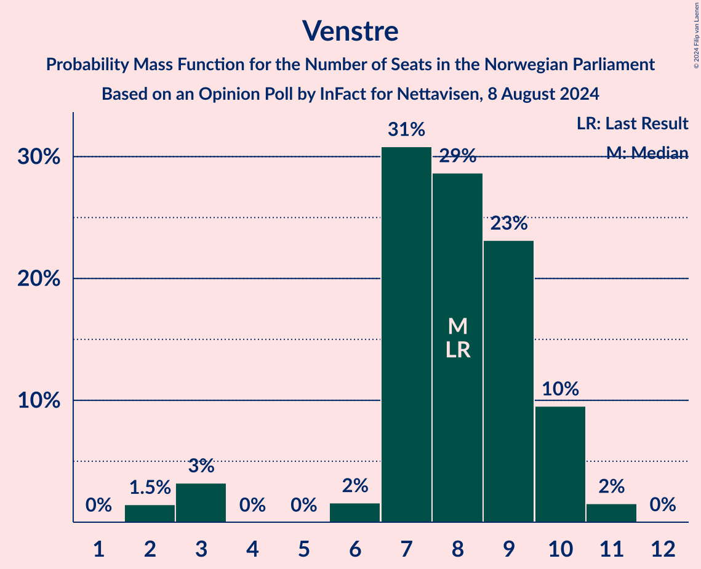

# Opinion Poll by InFact for Nettavisen, 8 August 2024

<a href="#voting-intentions">Voting Intentions</a> | <a href="#seats">Seats</a> | <a href="#coalitions">Coalitions</a> | <a href="#technical-information">Technical Information</a>

## Voting Intentions

### Confidence Intervals

| Party | Last Result | Poll Result | 80% Confidence Interval | 90% Confidence Interval | 95% Confidence Interval | 99% Confidence Interval |
|:-----:|:-----------:|:-----------:|:-----------------------:|:-----------------------:|:-----------------------:|:-----------------------:|
| Høyre | 20.4% | 22.2% | 20.6–23.8% |20.2–24.3% |19.8–24.7% |19.1–25.5% |
| Arbeiderpartiet | 26.2% | 22.0% | 20.4–23.6% |20.0–24.1% |19.6–24.5% |18.9–25.3% |
| Fremskrittspartiet | 11.6% | 18.5% | 17.0–20.0% |16.6–20.5% |16.3–20.9% |15.6–21.6% |
| Sosialistisk Venstreparti | 7.6% | 7.6% | 6.6–8.7% |6.4–9.0% |6.1–9.3% |5.7–9.8% |
| Rødt | 4.7% | 6.1% | 5.3–7.1% |5.1–7.4% |4.9–7.7% |4.5–8.2% |
| Senterpartiet | 13.5% | 6.0% | 5.2–7.1% |5.0–7.3% |4.8–7.6% |4.4–8.1% |
| Venstre | 4.6% | 4.6% | 3.9–5.5% |3.7–5.8% |3.5–6.0% |3.2–6.5% |
| Miljøpartiet De Grønne | 3.9% | 4.1% | 3.5–5.0% |3.3–5.3% |3.1–5.5% |2.8–5.9% |
| Kristelig Folkeparti | 3.8% | 3.3% | 2.7–4.1% |2.6–4.4% |2.4–4.6% |2.2–5.0% |
| Industri- og Næringspartiet | 0.3% | 2.9% | 2.3–3.6% |2.2–3.9% |2.0–4.1% |1.8–4.4% |
| Norgesdemokratene | 1.1% | 1.0% | 0.7–1.5% |0.6–1.6% |0.5–1.8% |0.4–2.0% |
| Konservativt | 0.4% | 0.3% | 0.2–0.6% |0.1–0.7% |0.1–0.8% |0.1–1.0% |
| Liberalistene | 0.2% | 0.1% | 0.0–0.4% |0.0–0.4% |0.0–0.5% |0.0–0.7% |
| Pensjonistpartiet | 0.6% | 0.1% | 0.0–0.4% |0.0–0.4% |0.0–0.5% |0.0–0.7% |

*Note:* The poll result column reflects the actual value used in the calculations. Published results may vary slightly, and in addition be rounded to fewer digits.

## Seats

### Confidence Intervals

| Party | Last Result | Median | 80% Confidence Interval | 90% Confidence Interval | 95% Confidence Interval | 99% Confidence Interval |
|:-----:|:-----------:|:------:|:-----------------------:|:-----------------------:|:-----------------------:|:-----------------------:|
| <a href="#høyre">Høyre</a> | 36 | 42 | 34–46 |34–46 |34–47 |33–47 |
| <a href="#arbeiderpartiet">Arbeiderpartiet</a> | 48 | 40 | 36–43 |36–45 |36–46 |35–48 |
| <a href="#fremskrittspartiet">Fremskrittspartiet</a> | 21 | 33 | 32–38 |32–38 |32–39 |29–41 |
| <a href="#sosialistisk-venstreparti">Sosialistisk Venstreparti</a> | 13 | 14 | 11–16 |10–16 |10–16 |9–17 |
| <a href="#rødt">Rødt</a> | 8 | 10 | 9–13 |7–13 |7–13 |7–14 |
| <a href="#senterpartiet">Senterpartiet</a> | 28 | 9 | 8–14 |8–15 |8–15 |7–15 |
| <a href="#venstre">Venstre</a> | 8 | 8 | 7–10 |6–10 |3–10 |2–11 |
| <a href="#miljøpartiet-de-grønne">Miljøpartiet De Grønne</a> | 3 | 7 | 2–9 |2–9 |2–9 |1–10 |
| <a href="#kristelig-folkeparti">Kristelig Folkeparti</a> | 3 | 2 | 2–7 |1–7 |0–7 |0–8 |
| <a href="#industri--og-næringspartiet">Industri- og Næringspartiet</a> | 0 | 2 | 0–3 |0–3 |0–3 |0–8 |
| <a href="#norgesdemokratene">Norgesdemokratene</a> | 0 | 0 | 0 |0 |0 |0 |
| <a href="#konservativt">Konservativt</a> | 0 | 0 | 0 |0 |0 |0 |
| <a href="#liberalistene">Liberalistene</a> | 0 | 0 | 0 |0 |0 |0 |
| <a href="#pensjonistpartiet">Pensjonistpartiet</a> | 0 | 0 | 0 |0 |0 |0 |

### Høyre

*For a full overview of the results for this party, see the [Høyre](party-høyre.html) page.*

| Number of Seats | Probability | Accumulated | Special Marks |
|:---------------:|:-----------:|:-----------:|:-------------:|
| 32 | 0.2% | 100% |  |
| 33 | 0.4% | 99.8% |  |
| 34 | 21% | 99.4% |  |
| 35 | 18% | 79% |  |
| 36 | 3% | 61% | Last Result |
| 37 | 1.3% | 58% |  |
| 38 | 1.0% | 56% |  |
| 39 | 2% | 55% |  |
| 40 | 1.2% | 53% |  |
| 41 | 2% | 52% |  |
| 42 | 6% | 51% | Median |
| 43 | 2% | 45% |  |
| 44 | 2% | 43% |  |
| 45 | 28% | 41% |  |
| 46 | 8% | 13% |  |
| 47 | 5% | 5% |  |
| 48 | 0.1% | 0.1% |  |
| 49 | 0% | 0% |  |

### Arbeiderpartiet

*For a full overview of the results for this party, see the [Arbeiderpartiet](party-arbeiderpartiet.html) page.*

| Number of Seats | Probability | Accumulated | Special Marks |
|:---------------:|:-----------:|:-----------:|:-------------:|
| 34 | 0.3% | 100% |  |
| 35 | 0.4% | 99.6% |  |
| 36 | 12% | 99.3% |  |
| 37 | 13% | 87% |  |
| 38 | 0.8% | 74% |  |
| 39 | 4% | 73% |  |
| 40 | 27% | 69% | Median |
| 41 | 6% | 42% |  |
| 42 | 16% | 35% |  |
| 43 | 11% | 19% |  |
| 44 | 0.7% | 8% |  |
| 45 | 3% | 7% |  |
| 46 | 3% | 5% |  |
| 47 | 1.0% | 2% |  |
| 48 | 0.5% | 0.9% | Last Result |
| 49 | 0.4% | 0.4% |  |
| 50 | 0% | 0% |  |

### Fremskrittspartiet

*For a full overview of the results for this party, see the [Fremskrittspartiet](party-fremskrittspartiet.html) page.*

| Number of Seats | Probability | Accumulated | Special Marks |
|:---------------:|:-----------:|:-----------:|:-------------:|
| 21 | 0% | 100% | Last Result |
| 22 | 0% | 100% |  |
| 23 | 0% | 100% |  |
| 24 | 0% | 100% |  |
| 25 | 0% | 100% |  |
| 26 | 0% | 100% |  |
| 27 | 0.3% | 100% |  |
| 28 | 0% | 99.7% |  |
| 29 | 0.3% | 99.7% |  |
| 30 | 0.1% | 99.4% |  |
| 31 | 1.3% | 99.3% |  |
| 32 | 47% | 98% |  |
| 33 | 5% | 51% | Median |
| 34 | 3% | 45% |  |
| 35 | 7% | 42% |  |
| 36 | 11% | 35% |  |
| 37 | 14% | 24% |  |
| 38 | 6% | 10% |  |
| 39 | 2% | 4% |  |
| 40 | 0.3% | 2% |  |
| 41 | 2% | 2% |  |
| 42 | 0% | 0.1% |  |
| 43 | 0% | 0% |  |

### Sosialistisk Venstreparti

*For a full overview of the results for this party, see the [Sosialistisk Venstreparti](party-sosialistiskvenstreparti.html) page.*

| Number of Seats | Probability | Accumulated | Special Marks |
|:---------------:|:-----------:|:-----------:|:-------------:|
| 8 | 0.1% | 100% |  |
| 9 | 1.1% | 99.9% |  |
| 10 | 5% | 98.8% |  |
| 11 | 4% | 94% |  |
| 12 | 8% | 89% |  |
| 13 | 21% | 81% | Last Result |
| 14 | 26% | 60% | Median |
| 15 | 2% | 34% |  |
| 16 | 31% | 32% |  |
| 17 | 1.1% | 1.2% |  |
| 18 | 0.1% | 0.1% |  |
| 19 | 0% | 0% |  |

### Rødt

*For a full overview of the results for this party, see the [Rødt](party-rødt.html) page.*

| Number of Seats | Probability | Accumulated | Special Marks |
|:---------------:|:-----------:|:-----------:|:-------------:|
| 6 | 0.1% | 100% |  |
| 7 | 5% | 99.9% |  |
| 8 | 2% | 95% | Last Result |
| 9 | 29% | 92% |  |
| 10 | 18% | 64% | Median |
| 11 | 3% | 45% |  |
| 12 | 28% | 43% |  |
| 13 | 13% | 15% |  |
| 14 | 0.9% | 1.2% |  |
| 15 | 0.3% | 0.3% |  |
| 16 | 0% | 0% |  |

### Senterpartiet

*For a full overview of the results for this party, see the [Senterpartiet](party-senterpartiet.html) page.*

| Number of Seats | Probability | Accumulated | Special Marks |
|:---------------:|:-----------:|:-----------:|:-------------:|
| 1 | 0.1% | 100% |  |
| 2 | 0% | 99.9% |  |
| 3 | 0% | 99.9% |  |
| 4 | 0% | 99.9% |  |
| 5 | 0% | 99.9% |  |
| 6 | 0.1% | 99.9% |  |
| 7 | 1.1% | 99.8% |  |
| 8 | 11% | 98.7% |  |
| 9 | 40% | 87% | Median |
| 10 | 2% | 47% |  |
| 11 | 18% | 45% |  |
| 12 | 5% | 28% |  |
| 13 | 2% | 22% |  |
| 14 | 12% | 21% |  |
| 15 | 8% | 8% |  |
| 16 | 0% | 0.1% |  |
| 17 | 0.1% | 0.1% |  |
| 18 | 0% | 0% |  |
| 19 | 0% | 0% |  |
| 20 | 0% | 0% |  |
| 21 | 0% | 0% |  |
| 22 | 0% | 0% |  |
| 23 | 0% | 0% |  |
| 24 | 0% | 0% |  |
| 25 | 0% | 0% |  |
| 26 | 0% | 0% |  |
| 27 | 0% | 0% |  |
| 28 | 0% | 0% | Last Result |

### Venstre

*For a full overview of the results for this party, see the [Venstre](party-venstre.html) page.*

| Number of Seats | Probability | Accumulated | Special Marks |
|:---------------:|:-----------:|:-----------:|:-------------:|
| 2 | 1.5% | 100% |  |
| 3 | 3% | 98.5% |  |
| 4 | 0% | 95% |  |
| 5 | 0% | 95% |  |
| 6 | 2% | 95% |  |
| 7 | 31% | 94% |  |
| 8 | 29% | 63% | Last Result, Median |
| 9 | 23% | 34% |  |
| 10 | 10% | 11% |  |
| 11 | 2% | 2% |  |
| 12 | 0% | 0% |  |

### Miljøpartiet De Grønne

*For a full overview of the results for this party, see the [Miljøpartiet De Grønne](party-miljøpartietdegrønne.html) page.*

| Number of Seats | Probability | Accumulated | Special Marks |
|:---------------:|:-----------:|:-----------:|:-------------:|
| 1 | 0.8% | 100% |  |
| 2 | 18% | 99.2% |  |
| 3 | 15% | 81% | Last Result |
| 4 | 0% | 67% |  |
| 5 | 0% | 67% |  |
| 6 | 2% | 67% |  |
| 7 | 19% | 65% | Median |
| 8 | 28% | 45% |  |
| 9 | 16% | 18% |  |
| 10 | 1.2% | 1.4% |  |
| 11 | 0.2% | 0.2% |  |
| 12 | 0% | 0% |  |

### Kristelig Folkeparti

*For a full overview of the results for this party, see the [Kristelig Folkeparti](party-kristeligfolkeparti.html) page.*

| Number of Seats | Probability | Accumulated | Special Marks |
|:---------------:|:-----------:|:-----------:|:-------------:|
| 0 | 4% | 100% |  |
| 1 | 3% | 96% |  |
| 2 | 51% | 93% | Median |
| 3 | 20% | 42% | Last Result |
| 4 | 0% | 22% |  |
| 5 | 0% | 22% |  |
| 6 | 1.3% | 22% |  |
| 7 | 19% | 20% |  |
| 8 | 1.0% | 1.3% |  |
| 9 | 0.4% | 0.4% |  |
| 10 | 0% | 0% |  |

### Industri- og Næringspartiet

*For a full overview of the results for this party, see the [Industri- og Næringspartiet](party-industri-ognæringspartiet.html) page.*

| Number of Seats | Probability | Accumulated | Special Marks |
|:---------------:|:-----------:|:-----------:|:-------------:|
| 0 | 38% | 100% | Last Result |
| 1 | 2% | 62% |  |
| 2 | 45% | 60% | Median |
| 3 | 14% | 15% |  |
| 4 | 0% | 1.1% |  |
| 5 | 0% | 1.1% |  |
| 6 | 0.1% | 1.1% |  |
| 7 | 0.3% | 0.9% |  |
| 8 | 0.6% | 0.6% |  |
| 9 | 0% | 0% |  |

### Norgesdemokratene

*For a full overview of the results for this party, see the [Norgesdemokratene](party-norgesdemokratene.html) page.*

| Number of Seats | Probability | Accumulated | Special Marks |
|:---------------:|:-----------:|:-----------:|:-------------:|
| 0 | 100% | 100% | Last Result, Median |

### Konservativt

*For a full overview of the results for this party, see the [Konservativt](party-konservativt.html) page.*

| Number of Seats | Probability | Accumulated | Special Marks |
|:---------------:|:-----------:|:-----------:|:-------------:|
| 0 | 100% | 100% | Last Result, Median |

### Liberalistene

*For a full overview of the results for this party, see the [Liberalistene](party-liberalistene.html) page.*

| Number of Seats | Probability | Accumulated | Special Marks |
|:---------------:|:-----------:|:-----------:|:-------------:|
| 0 | 100% | 100% | Last Result, Median |

### Pensjonistpartiet

*For a full overview of the results for this party, see the [Pensjonistpartiet](party-pensjonistpartiet.html) page.*

| Number of Seats | Probability | Accumulated | Special Marks |
|:---------------:|:-----------:|:-----------:|:-------------:|
| 0 | 100% | 100% | Last Result, Median |

## Coalitions

### Confidence Intervals

| Coalition | Last Result | Median | Majority? | 80% Confidence Interval | 90% Confidence Interval | 95% Confidence Interval | 99% Confidence Interval |
|:---------:|:-----------:|:------:|:---------:|:-----------------------:|:-----------------------:|:-----------------------:|:-----------------------:|
| Høyre – Fremskrittspartiet – Senterpartiet – Venstre – Kristelig Folkeparti | 96 | 95 | 100% | 91–101 | 91–104 | 90–104 | 87–104 |
| Høyre – Fremskrittspartiet – Venstre – Miljøpartiet De Grønne – Kristelig Folkeparti | 71 | 93 | 98.8% | 86–94 | 85–96 | 85–98 | 81–98 |
| Høyre – Fremskrittspartiet – Venstre – Kristelig Folkeparti | 68 | 86 | 71% | 77–90 | 77–91 | 77–91 | 76–92 |
| Høyre – Fremskrittspartiet – Venstre | 65 | 83 | 22% | 75–86 | 75–89 | 75–89 | 73–91 |
| Arbeiderpartiet – Sosialistisk Venstreparti – Rødt – Senterpartiet – Miljøpartiet De Grønne | 100 | 82 | 17% | 76–88 | 75–88 | 75–88 | 72–90 |
| Arbeiderpartiet – Sosialistisk Venstreparti – Rødt – Senterpartiet | 97 | 74 | 0.5% | 72–81 | 69–81 | 68–81 | 68–85 |
| Arbeiderpartiet – Sosialistisk Venstreparti – Senterpartiet – Miljøpartiet De Grønne – Kristelig Folkeparti | 95 | 74 | 0.1% | 70–80 | 67–80 | 67–80 | 65–83 |
| Høyre – Fremskrittspartiet | 57 | 77 | 0% | 67–78 | 67–80 | 67–80 | 67–83 |
| Arbeiderpartiet – Sosialistisk Venstreparti – Senterpartiet – Miljøpartiet De Grønne | 92 | 70 | 0% | 66–78 | 66–78 | 64–78 | 62–81 |
| Arbeiderpartiet – Sosialistisk Venstreparti – Rødt – Miljøpartiet De Grønne | 72 | 72 | 0% | 66–74 | 64–74 | 64–77 | 63–80 |
| Arbeiderpartiet – Sosialistisk Venstreparti – Senterpartiet | 89 | 65 | 0% | 60–69 | 60–69 | 60–69 | 58–73 |
| Arbeiderpartiet – Senterpartiet – Miljøpartiet De Grønne – Kristelig Folkeparti | 82 | 59 | 0% | 57–67 | 54–67 | 53–67 | 52–70 |
| Arbeiderpartiet – Senterpartiet – Kristelig Folkeparti | 79 | 53 | 0% | 51–58 | 51–58 | 51–60 | 48–63 |
| Arbeiderpartiet – Sosialistisk Venstreparti | 61 | 55 | 0% | 51–57 | 49–57 | 49–58 | 49–62 |
| Høyre – Venstre – Kristelig Folkeparti | 47 | 51 | 0% | 45–57 | 45–57 | 45–58 | 42–58 |
| Arbeiderpartiet – Senterpartiet | 76 | 49 | 0% | 46–56 | 46–56 | 46–57 | 45–60 |
| Senterpartiet – Venstre – Kristelig Folkeparti | 39 | 23 | 0% | 18–26 | 17–26 | 15–26 | 12–26 |

### Høyre – Fremskrittspartiet – Senterpartiet – Venstre – Kristelig Folkeparti

| Number of Seats | Probability | Accumulated | Special Marks |
|:---------------:|:-----------:|:-----------:|:-------------:|
| 85 | 0% | 100% | Majority |
| 86 | 0% | 99.9% |  |
| 87 | 0.5% | 99.9% |  |
| 88 | 0.8% | 99.4% |  |
| 89 | 0.6% | 98.6% |  |
| 90 | 1.0% | 98% |  |
| 91 | 13% | 97% |  |
| 92 | 0.8% | 84% |  |
| 93 | 2% | 84% |  |
| 94 | 10% | 81% | Median |
| 95 | 26% | 71% |  |
| 96 | 14% | 45% | Last Result |
| 97 | 1.0% | 31% |  |
| 98 | 6% | 30% |  |
| 99 | 13% | 23% |  |
| 100 | 0.4% | 11% |  |
| 101 | 2% | 10% |  |
| 102 | 0.8% | 9% |  |
| 103 | 0% | 8% |  |
| 104 | 8% | 8% |  |
| 105 | 0% | 0% |  |

### Høyre – Fremskrittspartiet – Venstre – Miljøpartiet De Grønne – Kristelig Folkeparti

| Number of Seats | Probability | Accumulated | Special Marks |
|:---------------:|:-----------:|:-----------:|:-------------:|
| 71 | 0% | 100% | Last Result |
| 72 | 0% | 100% |  |
| 73 | 0% | 100% |  |
| 74 | 0% | 100% |  |
| 75 | 0% | 100% |  |
| 76 | 0% | 100% |  |
| 77 | 0% | 100% |  |
| 78 | 0% | 100% |  |
| 79 | 0% | 100% |  |
| 80 | 0.3% | 100% |  |
| 81 | 0.3% | 99.7% |  |
| 82 | 0.2% | 99.4% |  |
| 83 | 0.1% | 99.3% |  |
| 84 | 0.4% | 99.2% |  |
| 85 | 9% | 98.8% | Majority |
| 86 | 13% | 90% |  |
| 87 | 0.8% | 77% |  |
| 88 | 5% | 76% |  |
| 89 | 0.9% | 71% |  |
| 90 | 2% | 71% |  |
| 91 | 6% | 69% |  |
| 92 | 10% | 63% | Median |
| 93 | 5% | 53% |  |
| 94 | 41% | 48% |  |
| 95 | 0.4% | 8% |  |
| 96 | 3% | 7% |  |
| 97 | 0.1% | 5% |  |
| 98 | 5% | 5% |  |
| 99 | 0.1% | 0.2% |  |
| 100 | 0.1% | 0.1% |  |
| 101 | 0% | 0.1% |  |
| 102 | 0% | 0% |  |

### Høyre – Fremskrittspartiet – Venstre – Kristelig Folkeparti

| Number of Seats | Probability | Accumulated | Special Marks |
|:---------------:|:-----------:|:-----------:|:-------------:|
| 68 | 0% | 100% | Last Result |
| 69 | 0% | 100% |  |
| 70 | 0% | 100% |  |
| 71 | 0% | 100% |  |
| 72 | 0.2% | 100% |  |
| 73 | 0% | 99.8% |  |
| 74 | 0.1% | 99.8% |  |
| 75 | 0.2% | 99.7% |  |
| 76 | 0.2% | 99.5% |  |
| 77 | 12% | 99.4% |  |
| 78 | 0.1% | 87% |  |
| 79 | 0.7% | 87% |  |
| 80 | 1.1% | 86% |  |
| 81 | 0.2% | 85% |  |
| 82 | 1.0% | 85% |  |
| 83 | 10% | 84% |  |
| 84 | 2% | 74% |  |
| 85 | 3% | 71% | Median, Majority |
| 86 | 30% | 69% |  |
| 87 | 14% | 39% |  |
| 88 | 5% | 25% |  |
| 89 | 8% | 20% |  |
| 90 | 4% | 12% |  |
| 91 | 6% | 7% |  |
| 92 | 0.8% | 1.0% |  |
| 93 | 0% | 0.3% |  |
| 94 | 0.1% | 0.2% |  |
| 95 | 0% | 0.1% |  |
| 96 | 0.1% | 0.1% |  |
| 97 | 0% | 0% |  |

### Høyre – Fremskrittspartiet – Venstre

| Number of Seats | Probability | Accumulated | Special Marks |
|:---------------:|:-----------:|:-----------:|:-------------:|
| 65 | 0% | 100% | Last Result |
| 66 | 0% | 100% |  |
| 67 | 0% | 100% |  |
| 68 | 0% | 100% |  |
| 69 | 0% | 100% |  |
| 70 | 0.2% | 100% |  |
| 71 | 0% | 99.8% |  |
| 72 | 0.1% | 99.8% |  |
| 73 | 0.4% | 99.7% |  |
| 74 | 0.3% | 99.3% |  |
| 75 | 12% | 99.1% |  |
| 76 | 0.8% | 87% |  |
| 77 | 0.8% | 86% |  |
| 78 | 2% | 85% |  |
| 79 | 0.3% | 83% |  |
| 80 | 22% | 83% |  |
| 81 | 5% | 61% |  |
| 82 | 2% | 56% |  |
| 83 | 4% | 54% | Median |
| 84 | 28% | 49% |  |
| 85 | 1.1% | 22% | Majority |
| 86 | 11% | 21% |  |
| 87 | 2% | 9% |  |
| 88 | 0.8% | 8% |  |
| 89 | 6% | 7% |  |
| 90 | 0.1% | 0.7% |  |
| 91 | 0.1% | 0.6% |  |
| 92 | 0.5% | 0.5% |  |
| 93 | 0% | 0% |  |

### Arbeiderpartiet – Sosialistisk Venstreparti – Rødt – Senterpartiet – Miljøpartiet De Grønne

| Number of Seats | Probability | Accumulated | Special Marks |
|:---------------:|:-----------:|:-----------:|:-------------:|
| 71 | 0.1% | 100% |  |
| 72 | 0.5% | 99.8% |  |
| 73 | 0.2% | 99.4% |  |
| 74 | 0.6% | 99.1% |  |
| 75 | 5% | 98.6% |  |
| 76 | 5% | 93% |  |
| 77 | 0.5% | 89% |  |
| 78 | 5% | 88% |  |
| 79 | 21% | 83% |  |
| 80 | 5% | 62% | Median |
| 81 | 2% | 57% |  |
| 82 | 27% | 55% |  |
| 83 | 10% | 28% |  |
| 84 | 0.6% | 18% |  |
| 85 | 2% | 17% | Majority |
| 86 | 0.8% | 15% |  |
| 87 | 0.5% | 15% |  |
| 88 | 13% | 14% |  |
| 89 | 0.3% | 1.0% |  |
| 90 | 0.3% | 0.8% |  |
| 91 | 0.2% | 0.4% |  |
| 92 | 0.1% | 0.2% |  |
| 93 | 0% | 0.1% |  |
| 94 | 0% | 0% |  |
| 95 | 0% | 0% |  |
| 96 | 0% | 0% |  |
| 97 | 0% | 0% |  |
| 98 | 0% | 0% |  |
| 99 | 0% | 0% |  |
| 100 | 0% | 0% | Last Result |

### Arbeiderpartiet – Sosialistisk Venstreparti – Rødt – Senterpartiet

| Number of Seats | Probability | Accumulated | Special Marks |
|:---------------:|:-----------:|:-----------:|:-------------:|
| 65 | 0% | 100% |  |
| 66 | 0% | 99.9% |  |
| 67 | 0% | 99.9% |  |
| 68 | 5% | 99.9% |  |
| 69 | 0.7% | 95% |  |
| 70 | 3% | 95% |  |
| 71 | 0.3% | 92% |  |
| 72 | 14% | 92% |  |
| 73 | 3% | 78% | Median |
| 74 | 30% | 75% |  |
| 75 | 6% | 46% |  |
| 76 | 9% | 40% |  |
| 77 | 0.9% | 32% |  |
| 78 | 6% | 31% |  |
| 79 | 13% | 24% |  |
| 80 | 1.2% | 11% |  |
| 81 | 9% | 10% |  |
| 82 | 0.3% | 1.2% |  |
| 83 | 0.3% | 0.9% |  |
| 84 | 0.1% | 0.6% |  |
| 85 | 0.2% | 0.5% | Majority |
| 86 | 0.2% | 0.3% |  |
| 87 | 0.1% | 0.1% |  |
| 88 | 0% | 0% |  |
| 89 | 0% | 0% |  |
| 90 | 0% | 0% |  |
| 91 | 0% | 0% |  |
| 92 | 0% | 0% |  |
| 93 | 0% | 0% |  |
| 94 | 0% | 0% |  |
| 95 | 0% | 0% |  |
| 96 | 0% | 0% |  |
| 97 | 0% | 0% | Last Result |

### Arbeiderpartiet – Sosialistisk Venstreparti – Senterpartiet – Miljøpartiet De Grønne – Kristelig Folkeparti

| Number of Seats | Probability | Accumulated | Special Marks |
|:---------------:|:-----------:|:-----------:|:-------------:|
| 64 | 0.5% | 100% |  |
| 65 | 2% | 99.5% |  |
| 66 | 0% | 98% |  |
| 67 | 4% | 98% |  |
| 68 | 0.6% | 93% |  |
| 69 | 0.6% | 93% |  |
| 70 | 12% | 92% |  |
| 71 | 2% | 80% |  |
| 72 | 3% | 78% | Median |
| 73 | 16% | 76% |  |
| 74 | 13% | 59% |  |
| 75 | 28% | 46% |  |
| 76 | 1.2% | 18% |  |
| 77 | 2% | 17% |  |
| 78 | 0.5% | 15% |  |
| 79 | 0.2% | 15% |  |
| 80 | 13% | 15% |  |
| 81 | 0.3% | 2% |  |
| 82 | 0.7% | 1.3% |  |
| 83 | 0.5% | 0.6% |  |
| 84 | 0.1% | 0.2% |  |
| 85 | 0% | 0.1% | Majority |
| 86 | 0% | 0% |  |
| 87 | 0% | 0% |  |
| 88 | 0% | 0% |  |
| 89 | 0% | 0% |  |
| 90 | 0% | 0% |  |
| 91 | 0% | 0% |  |
| 92 | 0% | 0% |  |
| 93 | 0% | 0% |  |
| 94 | 0% | 0% |  |
| 95 | 0% | 0% | Last Result |

### Høyre – Fremskrittspartiet

| Number of Seats | Probability | Accumulated | Special Marks |
|:---------------:|:-----------:|:-----------:|:-------------:|
| 57 | 0% | 100% | Last Result |
| 58 | 0% | 100% |  |
| 59 | 0% | 100% |  |
| 60 | 0% | 100% |  |
| 61 | 0% | 100% |  |
| 62 | 0% | 100% |  |
| 63 | 0% | 100% |  |
| 64 | 0% | 100% |  |
| 65 | 0% | 100% |  |
| 66 | 0.2% | 99.9% |  |
| 67 | 12% | 99.8% |  |
| 68 | 0.5% | 88% |  |
| 69 | 1.2% | 87% |  |
| 70 | 9% | 86% |  |
| 71 | 13% | 77% |  |
| 72 | 0.2% | 64% |  |
| 73 | 7% | 64% |  |
| 74 | 0.5% | 57% |  |
| 75 | 4% | 57% | Median |
| 76 | 3% | 53% |  |
| 77 | 32% | 50% |  |
| 78 | 9% | 18% |  |
| 79 | 0.9% | 9% |  |
| 80 | 7% | 8% |  |
| 81 | 0.4% | 2% |  |
| 82 | 0.4% | 1.1% |  |
| 83 | 0.2% | 0.7% |  |
| 84 | 0.5% | 0.5% |  |
| 85 | 0% | 0% | Majority |

### Arbeiderpartiet – Sosialistisk Venstreparti – Senterpartiet – Miljøpartiet De Grønne

| Number of Seats | Probability | Accumulated | Special Marks |
|:---------------:|:-----------:|:-----------:|:-------------:|
| 61 | 0.1% | 100% |  |
| 62 | 0.4% | 99.9% |  |
| 63 | 0.9% | 99.5% |  |
| 64 | 2% | 98.5% |  |
| 65 | 1.1% | 97% |  |
| 66 | 7% | 96% |  |
| 67 | 24% | 89% |  |
| 68 | 5% | 65% |  |
| 69 | 2% | 60% |  |
| 70 | 11% | 58% | Median |
| 71 | 1.3% | 47% |  |
| 72 | 0.5% | 46% |  |
| 73 | 27% | 45% |  |
| 74 | 2% | 18% |  |
| 75 | 1.0% | 16% |  |
| 76 | 1.0% | 15% |  |
| 77 | 0.9% | 14% |  |
| 78 | 12% | 13% |  |
| 79 | 0.1% | 0.9% |  |
| 80 | 0.3% | 0.9% |  |
| 81 | 0.4% | 0.5% |  |
| 82 | 0% | 0.1% |  |
| 83 | 0% | 0% |  |
| 84 | 0% | 0% |  |
| 85 | 0% | 0% | Majority |
| 86 | 0% | 0% |  |
| 87 | 0% | 0% |  |
| 88 | 0% | 0% |  |
| 89 | 0% | 0% |  |
| 90 | 0% | 0% |  |
| 91 | 0% | 0% |  |
| 92 | 0% | 0% | Last Result |

### Arbeiderpartiet – Sosialistisk Venstreparti – Rødt – Miljøpartiet De Grønne

| Number of Seats | Probability | Accumulated | Special Marks |
|:---------------:|:-----------:|:-----------:|:-------------:|
| 61 | 0.4% | 100% |  |
| 62 | 0% | 99.6% |  |
| 63 | 0.3% | 99.6% |  |
| 64 | 8% | 99.3% |  |
| 65 | 0.8% | 91% |  |
| 66 | 1.0% | 90% |  |
| 67 | 12% | 90% |  |
| 68 | 7% | 78% |  |
| 69 | 1.3% | 71% |  |
| 70 | 14% | 70% |  |
| 71 | 1.2% | 56% | Median |
| 72 | 9% | 55% | Last Result |
| 73 | 27% | 46% |  |
| 74 | 14% | 19% |  |
| 75 | 1.2% | 4% |  |
| 76 | 0.5% | 3% |  |
| 77 | 0.7% | 3% |  |
| 78 | 0.7% | 2% |  |
| 79 | 0.2% | 1.3% |  |
| 80 | 0.9% | 1.1% |  |
| 81 | 0.2% | 0.2% |  |
| 82 | 0% | 0.1% |  |
| 83 | 0% | 0% |  |

### Arbeiderpartiet – Sosialistisk Venstreparti – Senterpartiet

| Number of Seats | Probability | Accumulated | Special Marks |
|:---------------:|:-----------:|:-----------:|:-------------:|
| 56 | 0.1% | 100% |  |
| 57 | 0% | 99.9% |  |
| 58 | 0.4% | 99.8% |  |
| 59 | 0.2% | 99.4% |  |
| 60 | 16% | 99.2% |  |
| 61 | 5% | 83% |  |
| 62 | 3% | 78% |  |
| 63 | 6% | 75% | Median |
| 64 | 10% | 69% |  |
| 65 | 30% | 59% |  |
| 66 | 1.2% | 29% |  |
| 67 | 2% | 28% |  |
| 68 | 10% | 26% |  |
| 69 | 13% | 15% |  |
| 70 | 0.6% | 2% |  |
| 71 | 0.5% | 2% |  |
| 72 | 0.3% | 1.2% |  |
| 73 | 0.6% | 1.0% |  |
| 74 | 0.2% | 0.4% |  |
| 75 | 0.2% | 0.2% |  |
| 76 | 0% | 0% |  |
| 77 | 0% | 0% |  |
| 78 | 0% | 0% |  |
| 79 | 0% | 0% |  |
| 80 | 0% | 0% |  |
| 81 | 0% | 0% |  |
| 82 | 0% | 0% |  |
| 83 | 0% | 0% |  |
| 84 | 0% | 0% |  |
| 85 | 0% | 0% | Majority |
| 86 | 0% | 0% |  |
| 87 | 0% | 0% |  |
| 88 | 0% | 0% |  |
| 89 | 0% | 0% | Last Result |

### Arbeiderpartiet – Senterpartiet – Miljøpartiet De Grønne – Kristelig Folkeparti

| Number of Seats | Probability | Accumulated | Special Marks |
|:---------------:|:-----------:|:-----------:|:-------------:|
| 50 | 0.3% | 100% |  |
| 51 | 0% | 99.6% |  |
| 52 | 0.6% | 99.6% |  |
| 53 | 4% | 99.1% |  |
| 54 | 0.7% | 96% |  |
| 55 | 0.6% | 95% |  |
| 56 | 1.1% | 94% |  |
| 57 | 13% | 93% |  |
| 58 | 5% | 80% | Median |
| 59 | 35% | 75% |  |
| 60 | 14% | 39% |  |
| 61 | 2% | 25% |  |
| 62 | 0.7% | 23% |  |
| 63 | 5% | 23% |  |
| 64 | 2% | 17% |  |
| 65 | 0.9% | 16% |  |
| 66 | 0.7% | 15% |  |
| 67 | 12% | 14% |  |
| 68 | 0.7% | 2% |  |
| 69 | 0.3% | 1.1% |  |
| 70 | 0.7% | 0.8% |  |
| 71 | 0% | 0.1% |  |
| 72 | 0% | 0.1% |  |
| 73 | 0.1% | 0.1% |  |
| 74 | 0% | 0% |  |
| 75 | 0% | 0% |  |
| 76 | 0% | 0% |  |
| 77 | 0% | 0% |  |
| 78 | 0% | 0% |  |
| 79 | 0% | 0% |  |
| 80 | 0% | 0% |  |
| 81 | 0% | 0% |  |
| 82 | 0% | 0% | Last Result |

### Arbeiderpartiet – Senterpartiet – Kristelig Folkeparti

| Number of Seats | Probability | Accumulated | Special Marks |
|:---------------:|:-----------:|:-----------:|:-------------:|
| 47 | 0.4% | 100% |  |
| 48 | 0.2% | 99.6% |  |
| 49 | 0.8% | 99.4% |  |
| 50 | 1.0% | 98.6% |  |
| 51 | 34% | 98% | Median |
| 52 | 2% | 64% |  |
| 53 | 13% | 62% |  |
| 54 | 14% | 50% |  |
| 55 | 4% | 35% |  |
| 56 | 2% | 31% |  |
| 57 | 11% | 29% |  |
| 58 | 14% | 18% |  |
| 59 | 2% | 5% |  |
| 60 | 1.3% | 3% |  |
| 61 | 0.5% | 2% |  |
| 62 | 0.4% | 1.0% |  |
| 63 | 0.5% | 0.7% |  |
| 64 | 0% | 0.2% |  |
| 65 | 0.1% | 0.2% |  |
| 66 | 0% | 0% |  |
| 67 | 0% | 0% |  |
| 68 | 0% | 0% |  |
| 69 | 0% | 0% |  |
| 70 | 0% | 0% |  |
| 71 | 0% | 0% |  |
| 72 | 0% | 0% |  |
| 73 | 0% | 0% |  |
| 74 | 0% | 0% |  |
| 75 | 0% | 0% |  |
| 76 | 0% | 0% |  |
| 77 | 0% | 0% |  |
| 78 | 0% | 0% |  |
| 79 | 0% | 0% | Last Result |

### Arbeiderpartiet – Sosialistisk Venstreparti

| Number of Seats | Probability | Accumulated | Special Marks |
|:---------------:|:-----------:|:-----------:|:-------------:|
| 47 | 0.1% | 100% |  |
| 48 | 0.1% | 99.8% |  |
| 49 | 9% | 99.7% |  |
| 50 | 0.2% | 91% |  |
| 51 | 14% | 90% |  |
| 52 | 7% | 76% |  |
| 53 | 10% | 69% |  |
| 54 | 1.4% | 59% | Median |
| 55 | 14% | 58% |  |
| 56 | 28% | 44% |  |
| 57 | 12% | 15% |  |
| 58 | 1.5% | 3% |  |
| 59 | 0.3% | 2% |  |
| 60 | 0.3% | 2% |  |
| 61 | 0.8% | 1.4% | Last Result |
| 62 | 0.4% | 0.6% |  |
| 63 | 0.2% | 0.3% |  |
| 64 | 0% | 0.1% |  |
| 65 | 0.1% | 0.1% |  |
| 66 | 0% | 0% |  |

### Høyre – Venstre – Kristelig Folkeparti

| Number of Seats | Probability | Accumulated | Special Marks |
|:---------------:|:-----------:|:-----------:|:-------------:|
| 38 | 0.1% | 100% |  |
| 39 | 0% | 99.9% |  |
| 40 | 0.3% | 99.8% |  |
| 41 | 0% | 99.5% |  |
| 42 | 0.1% | 99.5% |  |
| 43 | 0.1% | 99.4% |  |
| 44 | 2% | 99.3% |  |
| 45 | 13% | 98% |  |
| 46 | 0.7% | 84% |  |
| 47 | 9% | 84% | Last Result |
| 48 | 3% | 75% |  |
| 49 | 2% | 72% |  |
| 50 | 17% | 70% |  |
| 51 | 7% | 53% |  |
| 52 | 1.2% | 46% | Median |
| 53 | 0.7% | 45% |  |
| 54 | 28% | 44% |  |
| 55 | 1.3% | 16% |  |
| 56 | 2% | 15% |  |
| 57 | 8% | 13% |  |
| 58 | 4% | 5% |  |
| 59 | 0% | 0.4% |  |
| 60 | 0% | 0.3% |  |
| 61 | 0% | 0.3% |  |
| 62 | 0% | 0.3% |  |
| 63 | 0.3% | 0.3% |  |
| 64 | 0% | 0% |  |

### Arbeiderpartiet – Senterpartiet

| Number of Seats | Probability | Accumulated | Special Marks |
|:---------------:|:-----------:|:-----------:|:-------------:|
| 44 | 0% | 100% |  |
| 45 | 0.5% | 99.9% |  |
| 46 | 13% | 99.5% |  |
| 47 | 5% | 87% |  |
| 48 | 0.8% | 82% |  |
| 49 | 31% | 81% | Median |
| 50 | 4% | 49% |  |
| 51 | 13% | 46% |  |
| 52 | 2% | 33% |  |
| 53 | 2% | 31% |  |
| 54 | 11% | 29% |  |
| 55 | 0.9% | 18% |  |
| 56 | 14% | 17% |  |
| 57 | 1.1% | 3% |  |
| 58 | 0.6% | 1.4% |  |
| 59 | 0% | 0.8% |  |
| 60 | 0.5% | 0.8% |  |
| 61 | 0.2% | 0.3% |  |
| 62 | 0.1% | 0.1% |  |
| 63 | 0% | 0% |  |
| 64 | 0% | 0% |  |
| 65 | 0% | 0% |  |
| 66 | 0% | 0% |  |
| 67 | 0% | 0% |  |
| 68 | 0% | 0% |  |
| 69 | 0% | 0% |  |
| 70 | 0% | 0% |  |
| 71 | 0% | 0% |  |
| 72 | 0% | 0% |  |
| 73 | 0% | 0% |  |
| 74 | 0% | 0% |  |
| 75 | 0% | 0% |  |
| 76 | 0% | 0% | Last Result |

### Senterpartiet – Venstre – Kristelig Folkeparti

| Number of Seats | Probability | Accumulated | Special Marks |
|:---------------:|:-----------:|:-----------:|:-------------:|
| 6 | 0.1% | 100% |  |
| 7 | 0% | 99.9% |  |
| 8 | 0% | 99.9% |  |
| 9 | 0% | 99.9% |  |
| 10 | 0% | 99.9% |  |
| 11 | 0% | 99.9% |  |
| 12 | 1.0% | 99.9% |  |
| 13 | 0.1% | 99.0% |  |
| 14 | 0.1% | 98.9% |  |
| 15 | 2% | 98.8% |  |
| 16 | 1.0% | 97% |  |
| 17 | 2% | 96% |  |
| 18 | 27% | 95% |  |
| 19 | 6% | 67% | Median |
| 20 | 3% | 61% |  |
| 21 | 5% | 59% |  |
| 22 | 2% | 54% |  |
| 23 | 5% | 51% |  |
| 24 | 21% | 47% |  |
| 25 | 13% | 25% |  |
| 26 | 12% | 13% |  |
| 27 | 0% | 0.4% |  |
| 28 | 0.3% | 0.4% |  |
| 29 | 0% | 0.1% |  |
| 30 | 0% | 0% |  |
| 31 | 0% | 0% |  |
| 32 | 0% | 0% |  |
| 33 | 0% | 0% |  |
| 34 | 0% | 0% |  |
| 35 | 0% | 0% |  |
| 36 | 0% | 0% |  |
| 37 | 0% | 0% |  |
| 38 | 0% | 0% |  |
| 39 | 0% | 0% | Last Result |

## Technical Information

### Opinion Poll

+ **Polling firm:** InFact
+ **Commissioner(s):** Nettavisen
+ **Fieldwork period:** 8 August 2024

### Calculations

+ **Sample size:** 1110
+ **Simulations done:** 1,048,576
+ **Error estimate:** 4.77%

