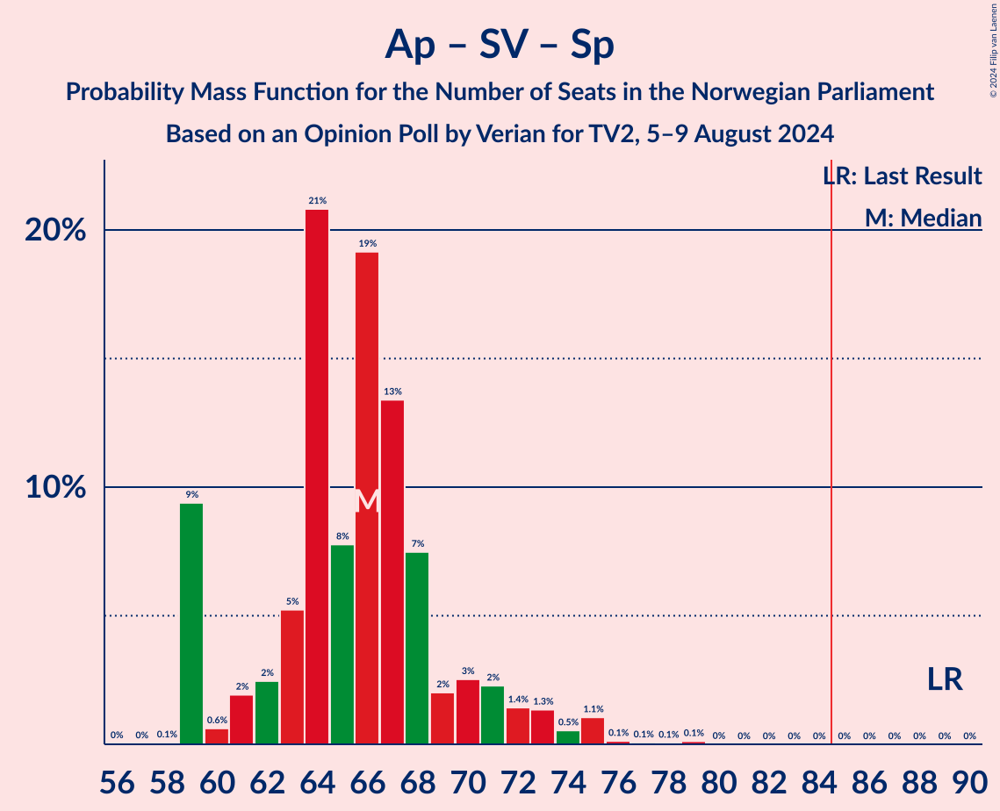

# Opinion Poll by Verian for TV2, 5–9 August 2024

<a href="#voting-intentions">Voting Intentions</a> | <a href="#seats">Seats</a> | <a href="#coalitions">Coalitions</a> | <a href="#technical-information">Technical Information</a>

## Voting Intentions

### Confidence Intervals

| Party | Last Result | Poll Result | 80% Confidence Interval | 90% Confidence Interval | 95% Confidence Interval | 99% Confidence Interval |
|:-----:|:-----------:|:-----------:|:-----------------------:|:-----------------------:|:-----------------------:|:-----------------------:|
| Høyre | 20.4% | 24.4% | 22.7–26.2% |22.2–26.7% |21.8–27.2% |21.0–28.0% |
| Arbeiderpartiet | 26.2% | 21.1% | 19.5–22.8% |19.1–23.3% |18.7–23.7% |17.9–24.6% |
| Fremskrittspartiet | 11.6% | 16.3% | 14.9–17.9% |14.5–18.3% |14.1–18.7% |13.5–19.5% |
| Sosialistisk Venstreparti | 7.6% | 10.3% | 9.2–11.6% |8.8–12.0% |8.6–12.3% |8.0–13.0% |
| Senterpartiet | 13.5% | 5.9% | 5.0–7.0% |4.8–7.3% |4.6–7.5% |4.2–8.1% |
| Venstre | 4.6% | 5.0% | 4.2–6.0% |4.0–6.3% |3.8–6.5% |3.5–7.1% |
| Kristelig Folkeparti | 3.8% | 4.7% | 3.9–5.7% |3.7–6.0% |3.6–6.2% |3.2–6.7% |
| Miljøpartiet De Grønne | 3.9% | 4.5% | 3.8–5.5% |3.6–5.7% |3.4–6.0% |3.0–6.5% |
| Rødt | 4.7% | 3.8% | 3.1–4.7% |2.9–5.0% |2.8–5.2% |2.5–5.6% |
| Industri- og Næringspartiet | 0.3% | 1.7% | 1.3–2.4% |1.2–2.5% |1.1–2.7% |0.9–3.1% |
| Norgesdemokratene | 1.1% | 0.7% | 0.5–1.2% |0.4–1.3% |0.3–1.4% |0.2–1.7% |

*Note:* The poll result column reflects the actual value used in the calculations. Published results may vary slightly, and in addition be rounded to fewer digits.

## Seats

### Confidence Intervals

| Party | Last Result | Median | 80% Confidence Interval | 90% Confidence Interval | 95% Confidence Interval | 99% Confidence Interval |
|:-----:|:-----------:|:------:|:-----------------------:|:-----------------------:|:-----------------------:|:-----------------------:|
| <a href="#høyre">Høyre</a> | 36 | 46 | 40–49 |40–49 |39–50 |37–53 |
| <a href="#arbeiderpartiet">Arbeiderpartiet</a> | 48 | 39 | 36–41 |35–43 |34–43 |32–45 |
| <a href="#fremskrittspartiet">Fremskrittspartiet</a> | 21 | 31 | 27–34 |26–34 |24–35 |23–36 |
| <a href="#sosialistisk-venstreparti">Sosialistisk Venstreparti</a> | 13 | 17 | 14–19 |14–20 |14–21 |13–22 |
| <a href="#senterpartiet">Senterpartiet</a> | 28 | 9 | 8–12 |8–13 |7–14 |7–14 |
| <a href="#venstre">Venstre</a> | 8 | 8 | 8–10 |7–11 |3–11 |3–13 |
| <a href="#kristelig-folkeparti">Kristelig Folkeparti</a> | 3 | 8 | 3–9 |3–11 |2–11 |2–11 |
| <a href="#miljøpartiet-de-grønne">Miljøpartiet De Grønne</a> | 3 | 8 | 6–9 |3–10 |2–11 |2–11 |
| <a href="#rødt">Rødt</a> | 8 | 1 | 1–8 |1–8 |1–9 |1–9 |
| <a href="#industri--og-næringspartiet">Industri- og Næringspartiet</a> | 0 | 0 | 0–1 |0–2 |0–2 |0–2 |
| <a href="#norgesdemokratene">Norgesdemokratene</a> | 0 | 0 | 0 |0 |0 |0 |

### Høyre

*For a full overview of the results for this party, see the [Høyre](party-høyre.html) page.*

| Number of Seats | Probability | Accumulated | Special Marks |
|:---------------:|:-----------:|:-----------:|:-------------:|
| 35 | 0% | 100% |  |
| 36 | 0.2% | 99.9% | Last Result |
| 37 | 0.6% | 99.8% |  |
| 38 | 0.6% | 99.2% |  |
| 39 | 2% | 98.5% |  |
| 40 | 26% | 96% |  |
| 41 | 2% | 70% |  |
| 42 | 8% | 68% |  |
| 43 | 2% | 60% |  |
| 44 | 3% | 58% |  |
| 45 | 3% | 55% |  |
| 46 | 24% | 51% | Median |
| 47 | 5% | 28% |  |
| 48 | 6% | 23% |  |
| 49 | 12% | 17% |  |
| 50 | 3% | 5% |  |
| 51 | 0.1% | 2% |  |
| 52 | 0.2% | 1.5% |  |
| 53 | 1.2% | 1.2% |  |
| 54 | 0% | 0% |  |

### Arbeiderpartiet

*For a full overview of the results for this party, see the [Arbeiderpartiet](party-arbeiderpartiet.html) page.*

| Number of Seats | Probability | Accumulated | Special Marks |
|:---------------:|:-----------:|:-----------:|:-------------:|
| 32 | 0.5% | 100% |  |
| 33 | 1.0% | 99.4% |  |
| 34 | 1.4% | 98% |  |
| 35 | 4% | 97% |  |
| 36 | 12% | 94% |  |
| 37 | 3% | 82% |  |
| 38 | 12% | 79% |  |
| 39 | 21% | 67% | Median |
| 40 | 12% | 46% |  |
| 41 | 25% | 34% |  |
| 42 | 3% | 9% |  |
| 43 | 4% | 6% |  |
| 44 | 1.2% | 2% |  |
| 45 | 0.8% | 1.2% |  |
| 46 | 0.2% | 0.4% |  |
| 47 | 0.1% | 0.2% |  |
| 48 | 0% | 0% | Last Result |

### Fremskrittspartiet

*For a full overview of the results for this party, see the [Fremskrittspartiet](party-fremskrittspartiet.html) page.*

| Number of Seats | Probability | Accumulated | Special Marks |
|:---------------:|:-----------:|:-----------:|:-------------:|
| 21 | 0.1% | 100% | Last Result |
| 22 | 0.1% | 99.9% |  |
| 23 | 0.5% | 99.8% |  |
| 24 | 2% | 99.3% |  |
| 25 | 1.2% | 97% |  |
| 26 | 5% | 96% |  |
| 27 | 3% | 91% |  |
| 28 | 6% | 88% |  |
| 29 | 9% | 82% |  |
| 30 | 9% | 72% |  |
| 31 | 28% | 63% | Median |
| 32 | 5% | 36% |  |
| 33 | 20% | 30% |  |
| 34 | 6% | 10% |  |
| 35 | 2% | 4% |  |
| 36 | 2% | 2% |  |
| 37 | 0.3% | 0.4% |  |
| 38 | 0.1% | 0.1% |  |
| 39 | 0.1% | 0.1% |  |
| 40 | 0% | 0% |  |

### Sosialistisk Venstreparti

*For a full overview of the results for this party, see the [Sosialistisk Venstreparti](party-sosialistiskvenstreparti.html) page.*

| Number of Seats | Probability | Accumulated | Special Marks |
|:---------------:|:-----------:|:-----------:|:-------------:|
| 11 | 0.1% | 100% |  |
| 12 | 0.2% | 99.9% |  |
| 13 | 1.2% | 99.7% | Last Result |
| 14 | 30% | 98.6% |  |
| 15 | 8% | 69% |  |
| 16 | 7% | 61% |  |
| 17 | 11% | 54% | Median |
| 18 | 21% | 44% |  |
| 19 | 14% | 22% |  |
| 20 | 4% | 8% |  |
| 21 | 2% | 4% |  |
| 22 | 1.4% | 2% |  |
| 23 | 0.4% | 0.5% |  |
| 24 | 0.1% | 0.1% |  |
| 25 | 0% | 0% |  |

### Senterpartiet

*For a full overview of the results for this party, see the [Senterpartiet](party-senterpartiet.html) page.*

| Number of Seats | Probability | Accumulated | Special Marks |
|:---------------:|:-----------:|:-----------:|:-------------:|
| 0 | 0.1% | 100% |  |
| 1 | 0.1% | 99.9% |  |
| 2 | 0.1% | 99.9% |  |
| 3 | 0% | 99.8% |  |
| 4 | 0% | 99.8% |  |
| 5 | 0% | 99.8% |  |
| 6 | 0.2% | 99.8% |  |
| 7 | 3% | 99.6% |  |
| 8 | 9% | 96% |  |
| 9 | 51% | 87% | Median |
| 10 | 19% | 36% |  |
| 11 | 6% | 18% |  |
| 12 | 4% | 11% |  |
| 13 | 4% | 7% |  |
| 14 | 3% | 3% |  |
| 15 | 0.3% | 0.3% |  |
| 16 | 0% | 0% |  |
| 17 | 0% | 0% |  |
| 18 | 0% | 0% |  |
| 19 | 0% | 0% |  |
| 20 | 0% | 0% |  |
| 21 | 0% | 0% |  |
| 22 | 0% | 0% |  |
| 23 | 0% | 0% |  |
| 24 | 0% | 0% |  |
| 25 | 0% | 0% |  |
| 26 | 0% | 0% |  |
| 27 | 0% | 0% |  |
| 28 | 0% | 0% | Last Result |

### Venstre

*For a full overview of the results for this party, see the [Venstre](party-venstre.html) page.*

| Number of Seats | Probability | Accumulated | Special Marks |
|:---------------:|:-----------:|:-----------:|:-------------:|
| 2 | 0.4% | 100% |  |
| 3 | 3% | 99.6% |  |
| 4 | 0% | 97% |  |
| 5 | 0% | 97% |  |
| 6 | 0.7% | 97% |  |
| 7 | 5% | 96% |  |
| 8 | 51% | 91% | Last Result, Median |
| 9 | 21% | 40% |  |
| 10 | 12% | 19% |  |
| 11 | 5% | 7% |  |
| 12 | 0.7% | 2% |  |
| 13 | 0.8% | 0.8% |  |
| 14 | 0% | 0% |  |

### Kristelig Folkeparti

*For a full overview of the results for this party, see the [Kristelig Folkeparti](party-kristeligfolkeparti.html) page.*

| Number of Seats | Probability | Accumulated | Special Marks |
|:---------------:|:-----------:|:-----------:|:-------------:|
| 2 | 4% | 100% |  |
| 3 | 7% | 96% | Last Result |
| 4 | 0% | 89% |  |
| 5 | 0% | 89% |  |
| 6 | 0.7% | 89% |  |
| 7 | 22% | 88% |  |
| 8 | 32% | 66% | Median |
| 9 | 24% | 34% |  |
| 10 | 4% | 10% |  |
| 11 | 5% | 5% |  |
| 12 | 0.2% | 0.2% |  |
| 13 | 0.1% | 0.1% |  |
| 14 | 0% | 0% |  |

### Miljøpartiet De Grønne

*For a full overview of the results for this party, see the [Miljøpartiet De Grønne](party-miljøpartietdegrønne.html) page.*

| Number of Seats | Probability | Accumulated | Special Marks |
|:---------------:|:-----------:|:-----------:|:-------------:|
| 1 | 0.1% | 100% |  |
| 2 | 3% | 99.9% |  |
| 3 | 6% | 96% | Last Result |
| 4 | 0% | 90% |  |
| 5 | 0% | 90% |  |
| 6 | 0.9% | 90% |  |
| 7 | 27% | 89% |  |
| 8 | 44% | 62% | Median |
| 9 | 10% | 18% |  |
| 10 | 5% | 8% |  |
| 11 | 2% | 3% |  |
| 12 | 0.2% | 0.3% |  |
| 13 | 0% | 0% |  |

### Rødt

*For a full overview of the results for this party, see the [Rødt](party-rødt.html) page.*

| Number of Seats | Probability | Accumulated | Special Marks |
|:---------------:|:-----------:|:-----------:|:-------------:|
| 0 | 0.1% | 100% |  |
| 1 | 53% | 99.9% | Median |
| 2 | 0.1% | 47% |  |
| 3 | 0% | 47% |  |
| 4 | 0% | 47% |  |
| 5 | 0% | 47% |  |
| 6 | 14% | 47% |  |
| 7 | 22% | 33% |  |
| 8 | 7% | 12% | Last Result |
| 9 | 4% | 4% |  |
| 10 | 0.2% | 0.3% |  |
| 11 | 0% | 0.1% |  |
| 12 | 0% | 0% |  |

### Industri- og Næringspartiet

*For a full overview of the results for this party, see the [Industri- og Næringspartiet](party-industri-ognæringspartiet.html) page.*

| Number of Seats | Probability | Accumulated | Special Marks |
|:---------------:|:-----------:|:-----------:|:-------------:|
| 0 | 90% | 100% | Last Result, Median |
| 1 | 2% | 10% |  |
| 2 | 8% | 8% |  |
| 3 | 0% | 0% |  |

### Norgesdemokratene

*For a full overview of the results for this party, see the [Norgesdemokratene](party-norgesdemokratene.html) page.*

| Number of Seats | Probability | Accumulated | Special Marks |
|:---------------:|:-----------:|:-----------:|:-------------:|
| 0 | 100% | 100% | Last Result, Median |

## Coalitions

### Confidence Intervals

| Coalition | Last Result | Median | Majority? | 80% Confidence Interval | 90% Confidence Interval | 95% Confidence Interval | 99% Confidence Interval |
|:---------:|:-----------:|:------:|:---------:|:-----------------------:|:-----------------------:|:-----------------------:|:-----------------------:|
| Høyre – Fremskrittspartiet – Senterpartiet – Venstre – Kristelig Folkeparti | 96 | 102 | 100% | 95–104 | 94–107 | 93–108 | 91–110 |
| Høyre – Fremskrittspartiet – Venstre – Kristelig Folkeparti – Miljøpartiet De Grønne | 71 | 99 | 100% | 93–103 | 92–103 | 91–104 | 88–108 |
| Høyre – Fremskrittspartiet – Venstre – Kristelig Folkeparti | 68 | 91 | 91% | 85–95 | 84–97 | 83–99 | 81–100 |
| Høyre – Fremskrittspartiet – Venstre | 65 | 83 | 43% | 78–88 | 77–90 | 76–90 | 73–96 |
| Arbeiderpartiet – Sosialistisk Venstreparti – Senterpartiet – Kristelig Folkeparti – Miljøpartiet De Grønne | 95 | 80 | 13% | 73–85 | 73–86 | 73–88 | 71–91 |
| Arbeiderpartiet – Sosialistisk Venstreparti – Senterpartiet – Miljøpartiet De Grønne – Rødt | 100 | 76 | 3% | 73–82 | 71–84 | 69–85 | 68–87 |
| Høyre – Fremskrittspartiet | 57 | 75 | 1.3% | 70–80 | 69–80 | 68–82 | 65–86 |
| Arbeiderpartiet – Sosialistisk Venstreparti – Senterpartiet – Miljøpartiet De Grønne | 92 | 73 | 0.1% | 67–77 | 66–79 | 66–81 | 65–83 |
| Arbeiderpartiet – Sosialistisk Venstreparti – Senterpartiet – Rødt | 97 | 68 | 0% | 65–75 | 65–76 | 64–77 | 60–80 |
| Arbeiderpartiet – Sosialistisk Venstreparti – Miljøpartiet De Grønne – Rødt | 72 | 66 | 0% | 63–73 | 61–74 | 60–74 | 58–76 |
| Arbeiderpartiet – Sosialistisk Venstreparti – Senterpartiet | 89 | 66 | 0% | 60–69 | 59–71 | 59–73 | 59–75 |
| Arbeiderpartiet – Senterpartiet – Kristelig Folkeparti – Miljøpartiet De Grønne | 82 | 65 | 0% | 59–67 | 58–68 | 57–70 | 53–73 |
| Høyre – Venstre – Kristelig Folkeparti | 47 | 61 | 0% | 55–65 | 55–67 | 53–67 | 51–71 |
| Arbeiderpartiet – Senterpartiet – Kristelig Folkeparti | 79 | 57 | 0% | 52–59 | 51–60 | 50–63 | 48–65 |
| Arbeiderpartiet – Sosialistisk Venstreparti | 61 | 56 | 0% | 51–59 | 50–61 | 50–62 | 50–65 |
| Arbeiderpartiet – Senterpartiet | 76 | 49 | 0% | 45–51 | 45–52 | 44–54 | 42–57 |
| Senterpartiet – Venstre – Kristelig Folkeparti | 39 | 25 | 0% | 23–30 | 22–31 | 21–32 | 19–34 |

### Høyre – Fremskrittspartiet – Senterpartiet – Venstre – Kristelig Folkeparti

| Number of Seats | Probability | Accumulated | Special Marks |
|:---------------:|:-----------:|:-----------:|:-------------:|
| 88 | 0.1% | 100% |  |
| 89 | 0.1% | 99.9% |  |
| 90 | 0.2% | 99.9% |  |
| 91 | 0.2% | 99.6% |  |
| 92 | 0.3% | 99.4% |  |
| 93 | 3% | 99.1% |  |
| 94 | 6% | 96% |  |
| 95 | 3% | 91% |  |
| 96 | 4% | 88% | Last Result |
| 97 | 13% | 84% |  |
| 98 | 3% | 71% |  |
| 99 | 7% | 68% |  |
| 100 | 5% | 61% |  |
| 101 | 6% | 57% |  |
| 102 | 9% | 51% | Median |
| 103 | 4% | 41% |  |
| 104 | 28% | 38% |  |
| 105 | 3% | 10% |  |
| 106 | 1.2% | 6% |  |
| 107 | 1.2% | 5% |  |
| 108 | 2% | 4% |  |
| 109 | 0.6% | 2% |  |
| 110 | 1.4% | 2% |  |
| 111 | 0.1% | 0.1% |  |
| 112 | 0% | 0.1% |  |
| 113 | 0% | 0.1% |  |
| 114 | 0% | 0% |  |

### Høyre – Fremskrittspartiet – Venstre – Kristelig Folkeparti – Miljøpartiet De Grønne

| Number of Seats | Probability | Accumulated | Special Marks |
|:---------------:|:-----------:|:-----------:|:-------------:|
| 71 | 0% | 100% | Last Result |
| 72 | 0% | 100% |  |
| 73 | 0% | 100% |  |
| 74 | 0% | 100% |  |
| 75 | 0% | 100% |  |
| 76 | 0% | 100% |  |
| 77 | 0% | 100% |  |
| 78 | 0% | 100% |  |
| 79 | 0% | 100% |  |
| 80 | 0% | 100% |  |
| 81 | 0% | 100% |  |
| 82 | 0% | 100% |  |
| 83 | 0% | 100% |  |
| 84 | 0% | 100% |  |
| 85 | 0.1% | 100% | Majority |
| 86 | 0.1% | 99.9% |  |
| 87 | 0.3% | 99.9% |  |
| 88 | 0.4% | 99.6% |  |
| 89 | 0.6% | 99.2% |  |
| 90 | 0.7% | 98.6% |  |
| 91 | 2% | 98% |  |
| 92 | 4% | 95% |  |
| 93 | 5% | 91% |  |
| 94 | 4% | 86% |  |
| 95 | 3% | 82% |  |
| 96 | 14% | 79% |  |
| 97 | 2% | 65% |  |
| 98 | 11% | 63% |  |
| 99 | 4% | 52% |  |
| 100 | 6% | 47% |  |
| 101 | 6% | 41% | Median |
| 102 | 14% | 35% |  |
| 103 | 18% | 21% |  |
| 104 | 0.7% | 3% |  |
| 105 | 0.7% | 2% |  |
| 106 | 0.6% | 2% |  |
| 107 | 0.4% | 1.0% |  |
| 108 | 0.6% | 0.6% |  |
| 109 | 0% | 0% |  |

### Høyre – Fremskrittspartiet – Venstre – Kristelig Folkeparti

| Number of Seats | Probability | Accumulated | Special Marks |
|:---------------:|:-----------:|:-----------:|:-------------:|
| 68 | 0% | 100% | Last Result |
| 69 | 0% | 100% |  |
| 70 | 0% | 100% |  |
| 71 | 0% | 100% |  |
| 72 | 0% | 100% |  |
| 73 | 0% | 100% |  |
| 74 | 0% | 100% |  |
| 75 | 0% | 100% |  |
| 76 | 0% | 100% |  |
| 77 | 0% | 100% |  |
| 78 | 0.1% | 100% |  |
| 79 | 0.2% | 99.8% |  |
| 80 | 0.1% | 99.7% |  |
| 81 | 0.5% | 99.6% |  |
| 82 | 0.5% | 99.0% |  |
| 83 | 1.3% | 98% |  |
| 84 | 6% | 97% |  |
| 85 | 3% | 91% | Majority |
| 86 | 3% | 88% |  |
| 87 | 3% | 84% |  |
| 88 | 14% | 82% |  |
| 89 | 2% | 68% |  |
| 90 | 4% | 65% |  |
| 91 | 13% | 61% |  |
| 92 | 4% | 48% |  |
| 93 | 9% | 44% | Median |
| 94 | 1.2% | 35% |  |
| 95 | 28% | 34% |  |
| 96 | 0.8% | 6% |  |
| 97 | 2% | 5% |  |
| 98 | 0.5% | 4% |  |
| 99 | 3% | 3% |  |
| 100 | 0.6% | 0.7% |  |
| 101 | 0% | 0.1% |  |
| 102 | 0% | 0.1% |  |
| 103 | 0% | 0.1% |  |
| 104 | 0% | 0% |  |

### Høyre – Fremskrittspartiet – Venstre

| Number of Seats | Probability | Accumulated | Special Marks |
|:---------------:|:-----------:|:-----------:|:-------------:|
| 65 | 0% | 100% | Last Result |
| 66 | 0% | 100% |  |
| 67 | 0% | 100% |  |
| 68 | 0% | 100% |  |
| 69 | 0% | 100% |  |
| 70 | 0.1% | 100% |  |
| 71 | 0% | 99.9% |  |
| 72 | 0.3% | 99.9% |  |
| 73 | 0.2% | 99.6% |  |
| 74 | 0.9% | 99.4% |  |
| 75 | 0.7% | 98% |  |
| 76 | 0.9% | 98% |  |
| 77 | 5% | 97% |  |
| 78 | 4% | 92% |  |
| 79 | 12% | 88% |  |
| 80 | 3% | 76% |  |
| 81 | 4% | 73% |  |
| 82 | 9% | 69% |  |
| 83 | 14% | 60% |  |
| 84 | 3% | 45% |  |
| 85 | 3% | 43% | Median, Majority |
| 86 | 4% | 40% |  |
| 87 | 18% | 36% |  |
| 88 | 12% | 17% |  |
| 89 | 0.4% | 6% |  |
| 90 | 3% | 5% |  |
| 91 | 0.7% | 2% |  |
| 92 | 0.1% | 2% |  |
| 93 | 0.1% | 2% |  |
| 94 | 0.2% | 1.4% |  |
| 95 | 0% | 1.2% |  |
| 96 | 1.2% | 1.2% |  |
| 97 | 0% | 0% |  |

### Arbeiderpartiet – Sosialistisk Venstreparti – Senterpartiet – Kristelig Folkeparti – Miljøpartiet De Grønne

| Number of Seats | Probability | Accumulated | Special Marks |
|:---------------:|:-----------:|:-----------:|:-------------:|
| 69 | 0.1% | 100% |  |
| 70 | 0% | 99.9% |  |
| 71 | 1.2% | 99.9% |  |
| 72 | 0.2% | 98.7% |  |
| 73 | 9% | 98% |  |
| 74 | 0.4% | 89% |  |
| 75 | 2% | 89% |  |
| 76 | 3% | 87% |  |
| 77 | 6% | 85% |  |
| 78 | 6% | 79% |  |
| 79 | 6% | 73% |  |
| 80 | 19% | 67% |  |
| 81 | 6% | 49% | Median |
| 82 | 4% | 43% |  |
| 83 | 16% | 39% |  |
| 84 | 9% | 22% |  |
| 85 | 6% | 13% | Majority |
| 86 | 3% | 7% |  |
| 87 | 2% | 4% |  |
| 88 | 1.1% | 3% |  |
| 89 | 0.6% | 2% |  |
| 90 | 0.3% | 1.0% |  |
| 91 | 0.6% | 0.8% |  |
| 92 | 0.1% | 0.2% |  |
| 93 | 0.1% | 0.1% |  |
| 94 | 0% | 0% |  |
| 95 | 0% | 0% | Last Result |

### Arbeiderpartiet – Sosialistisk Venstreparti – Senterpartiet – Miljøpartiet De Grønne – Rødt

| Number of Seats | Probability | Accumulated | Special Marks |
|:---------------:|:-----------:|:-----------:|:-------------:|
| 65 | 0% | 100% |  |
| 66 | 0% | 99.9% |  |
| 67 | 0% | 99.9% |  |
| 68 | 0.6% | 99.9% |  |
| 69 | 3% | 99.3% |  |
| 70 | 0.6% | 97% |  |
| 71 | 2% | 96% |  |
| 72 | 0.7% | 94% |  |
| 73 | 28% | 94% |  |
| 74 | 1.2% | 66% | Median |
| 75 | 13% | 65% |  |
| 76 | 4% | 52% |  |
| 77 | 9% | 47% |  |
| 78 | 4% | 38% |  |
| 79 | 3% | 35% |  |
| 80 | 14% | 31% |  |
| 81 | 2% | 17% |  |
| 82 | 6% | 15% |  |
| 83 | 0.6% | 9% |  |
| 84 | 6% | 9% |  |
| 85 | 1.2% | 3% | Majority |
| 86 | 0.4% | 1.4% |  |
| 87 | 0.6% | 1.0% |  |
| 88 | 0.1% | 0.4% |  |
| 89 | 0.2% | 0.3% |  |
| 90 | 0.1% | 0.1% |  |
| 91 | 0% | 0% |  |
| 92 | 0% | 0% |  |
| 93 | 0% | 0% |  |
| 94 | 0% | 0% |  |
| 95 | 0% | 0% |  |
| 96 | 0% | 0% |  |
| 97 | 0% | 0% |  |
| 98 | 0% | 0% |  |
| 99 | 0% | 0% |  |
| 100 | 0% | 0% | Last Result |

### Høyre – Fremskrittspartiet

| Number of Seats | Probability | Accumulated | Special Marks |
|:---------------:|:-----------:|:-----------:|:-------------:|
| 57 | 0% | 100% | Last Result |
| 58 | 0% | 100% |  |
| 59 | 0% | 100% |  |
| 60 | 0% | 100% |  |
| 61 | 0% | 100% |  |
| 62 | 0.1% | 99.9% |  |
| 63 | 0.1% | 99.8% |  |
| 64 | 0.1% | 99.7% |  |
| 65 | 0.3% | 99.6% |  |
| 66 | 1.1% | 99.3% |  |
| 67 | 0.5% | 98% |  |
| 68 | 1.2% | 98% |  |
| 69 | 5% | 96% |  |
| 70 | 5% | 92% |  |
| 71 | 13% | 87% |  |
| 72 | 8% | 74% |  |
| 73 | 7% | 66% |  |
| 74 | 9% | 59% |  |
| 75 | 5% | 50% |  |
| 76 | 3% | 45% |  |
| 77 | 5% | 42% | Median |
| 78 | 3% | 37% |  |
| 79 | 18% | 34% |  |
| 80 | 11% | 16% |  |
| 81 | 0.9% | 5% |  |
| 82 | 2% | 4% |  |
| 83 | 0.3% | 2% |  |
| 84 | 0.1% | 1.3% |  |
| 85 | 0% | 1.3% | Majority |
| 86 | 1.2% | 1.2% |  |
| 87 | 0% | 0% |  |

### Arbeiderpartiet – Sosialistisk Venstreparti – Senterpartiet – Miljøpartiet De Grønne

| Number of Seats | Probability | Accumulated | Special Marks |
|:---------------:|:-----------:|:-----------:|:-------------:|
| 63 | 0.1% | 100% |  |
| 64 | 0.3% | 99.9% |  |
| 65 | 0.2% | 99.6% |  |
| 66 | 9% | 99.4% |  |
| 67 | 2% | 90% |  |
| 68 | 4% | 89% |  |
| 69 | 3% | 85% |  |
| 70 | 6% | 82% |  |
| 71 | 3% | 76% |  |
| 72 | 20% | 72% |  |
| 73 | 3% | 53% | Median |
| 74 | 25% | 49% |  |
| 75 | 5% | 25% |  |
| 76 | 3% | 19% |  |
| 77 | 7% | 17% |  |
| 78 | 3% | 10% |  |
| 79 | 3% | 7% |  |
| 80 | 0.8% | 4% |  |
| 81 | 1.3% | 3% |  |
| 82 | 0.4% | 2% |  |
| 83 | 1.1% | 1.5% |  |
| 84 | 0.3% | 0.4% |  |
| 85 | 0.1% | 0.1% | Majority |
| 86 | 0% | 0% |  |
| 87 | 0% | 0% |  |
| 88 | 0% | 0% |  |
| 89 | 0% | 0% |  |
| 90 | 0% | 0% |  |
| 91 | 0% | 0% |  |
| 92 | 0% | 0% | Last Result |

### Arbeiderpartiet – Sosialistisk Venstreparti – Senterpartiet – Rødt

| Number of Seats | Probability | Accumulated | Special Marks |
|:---------------:|:-----------:|:-----------:|:-------------:|
| 60 | 0.6% | 100% |  |
| 61 | 0.4% | 99.4% |  |
| 62 | 0.6% | 99.0% |  |
| 63 | 0.8% | 98% |  |
| 64 | 0.7% | 98% |  |
| 65 | 18% | 97% |  |
| 66 | 14% | 79% | Median |
| 67 | 7% | 65% |  |
| 68 | 9% | 58% |  |
| 69 | 5% | 49% |  |
| 70 | 7% | 44% |  |
| 71 | 3% | 37% |  |
| 72 | 15% | 34% |  |
| 73 | 2% | 19% |  |
| 74 | 4% | 17% |  |
| 75 | 7% | 13% |  |
| 76 | 3% | 6% |  |
| 77 | 1.2% | 3% |  |
| 78 | 0.6% | 2% |  |
| 79 | 0.8% | 2% |  |
| 80 | 0.4% | 0.7% |  |
| 81 | 0.2% | 0.4% |  |
| 82 | 0% | 0.1% |  |
| 83 | 0% | 0.1% |  |
| 84 | 0% | 0% |  |
| 85 | 0% | 0% | Majority |
| 86 | 0% | 0% |  |
| 87 | 0% | 0% |  |
| 88 | 0% | 0% |  |
| 89 | 0% | 0% |  |
| 90 | 0% | 0% |  |
| 91 | 0% | 0% |  |
| 92 | 0% | 0% |  |
| 93 | 0% | 0% |  |
| 94 | 0% | 0% |  |
| 95 | 0% | 0% |  |
| 96 | 0% | 0% |  |
| 97 | 0% | 0% | Last Result |

### Arbeiderpartiet – Sosialistisk Venstreparti – Miljøpartiet De Grønne – Rødt

| Number of Seats | Probability | Accumulated | Special Marks |
|:---------------:|:-----------:|:-----------:|:-------------:|
| 55 | 0% | 100% |  |
| 56 | 0% | 99.9% |  |
| 57 | 0.1% | 99.9% |  |
| 58 | 1.4% | 99.8% |  |
| 59 | 0.7% | 98% |  |
| 60 | 2% | 98% |  |
| 61 | 1.3% | 96% |  |
| 62 | 1.5% | 95% |  |
| 63 | 3% | 93% |  |
| 64 | 28% | 90% |  |
| 65 | 7% | 62% | Median |
| 66 | 9% | 55% |  |
| 67 | 3% | 45% |  |
| 68 | 4% | 43% |  |
| 69 | 8% | 39% |  |
| 70 | 4% | 32% |  |
| 71 | 13% | 28% |  |
| 72 | 4% | 15% | Last Result |
| 73 | 2% | 10% |  |
| 74 | 6% | 8% |  |
| 75 | 0.9% | 2% |  |
| 76 | 0.5% | 1.0% |  |
| 77 | 0.2% | 0.5% |  |
| 78 | 0.1% | 0.3% |  |
| 79 | 0.1% | 0.2% |  |
| 80 | 0.1% | 0.1% |  |
| 81 | 0% | 0% |  |

### Arbeiderpartiet – Sosialistisk Venstreparti – Senterpartiet

| Number of Seats | Probability | Accumulated | Special Marks |
|:---------------:|:-----------:|:-----------:|:-------------:|
| 56 | 0% | 100% |  |
| 57 | 0% | 99.9% |  |
| 58 | 0.1% | 99.9% |  |
| 59 | 9% | 99.8% |  |
| 60 | 0.6% | 90% |  |
| 61 | 2% | 90% |  |
| 62 | 2% | 88% |  |
| 63 | 5% | 85% |  |
| 64 | 21% | 80% |  |
| 65 | 8% | 59% | Median |
| 66 | 19% | 52% |  |
| 67 | 13% | 32% |  |
| 68 | 7% | 19% |  |
| 69 | 2% | 12% |  |
| 70 | 3% | 10% |  |
| 71 | 2% | 7% |  |
| 72 | 1.4% | 5% |  |
| 73 | 1.3% | 3% |  |
| 74 | 0.5% | 2% |  |
| 75 | 1.1% | 1.4% |  |
| 76 | 0.1% | 0.4% |  |
| 77 | 0.1% | 0.3% |  |
| 78 | 0.1% | 0.2% |  |
| 79 | 0.1% | 0.1% |  |
| 80 | 0% | 0% |  |
| 81 | 0% | 0% |  |
| 82 | 0% | 0% |  |
| 83 | 0% | 0% |  |
| 84 | 0% | 0% |  |
| 85 | 0% | 0% | Majority |
| 86 | 0% | 0% |  |
| 87 | 0% | 0% |  |
| 88 | 0% | 0% |  |
| 89 | 0% | 0% | Last Result |

### Arbeiderpartiet – Senterpartiet – Kristelig Folkeparti – Miljøpartiet De Grønne

| Number of Seats | Probability | Accumulated | Special Marks |
|:---------------:|:-----------:|:-----------:|:-------------:|
| 53 | 1.2% | 100% |  |
| 54 | 0.1% | 98.7% |  |
| 55 | 0.2% | 98.6% |  |
| 56 | 0.4% | 98% |  |
| 57 | 2% | 98% |  |
| 58 | 3% | 96% |  |
| 59 | 11% | 94% |  |
| 60 | 4% | 83% |  |
| 61 | 2% | 79% |  |
| 62 | 3% | 77% |  |
| 63 | 11% | 74% |  |
| 64 | 7% | 63% | Median |
| 65 | 20% | 56% |  |
| 66 | 20% | 36% |  |
| 67 | 9% | 16% |  |
| 68 | 2% | 7% |  |
| 69 | 1.3% | 5% |  |
| 70 | 2% | 4% |  |
| 71 | 0.7% | 2% |  |
| 72 | 0.6% | 1.3% |  |
| 73 | 0.4% | 0.7% |  |
| 74 | 0.2% | 0.2% |  |
| 75 | 0% | 0.1% |  |
| 76 | 0% | 0% |  |
| 77 | 0% | 0% |  |
| 78 | 0% | 0% |  |
| 79 | 0% | 0% |  |
| 80 | 0% | 0% |  |
| 81 | 0% | 0% |  |
| 82 | 0% | 0% | Last Result |

### Høyre – Venstre – Kristelig Folkeparti

| Number of Seats | Probability | Accumulated | Special Marks |
|:---------------:|:-----------:|:-----------:|:-------------:|
| 47 | 0% | 100% | Last Result |
| 48 | 0.1% | 100% |  |
| 49 | 0.1% | 99.8% |  |
| 50 | 0.1% | 99.8% |  |
| 51 | 0.4% | 99.6% |  |
| 52 | 0.6% | 99.3% |  |
| 53 | 2% | 98.7% |  |
| 54 | 2% | 97% |  |
| 55 | 6% | 95% |  |
| 56 | 3% | 89% |  |
| 57 | 19% | 86% |  |
| 58 | 3% | 67% |  |
| 59 | 5% | 65% |  |
| 60 | 7% | 60% |  |
| 61 | 3% | 53% |  |
| 62 | 20% | 50% | Median |
| 63 | 6% | 30% |  |
| 64 | 12% | 24% |  |
| 65 | 2% | 12% |  |
| 66 | 3% | 9% |  |
| 67 | 4% | 6% |  |
| 68 | 0.7% | 2% |  |
| 69 | 0% | 1.0% |  |
| 70 | 0.1% | 1.0% |  |
| 71 | 0.9% | 0.9% |  |
| 72 | 0% | 0% |  |

### Arbeiderpartiet – Senterpartiet – Kristelig Folkeparti

| Number of Seats | Probability | Accumulated | Special Marks |
|:---------------:|:-----------:|:-----------:|:-------------:|
| 45 | 0.1% | 100% |  |
| 46 | 0% | 99.9% |  |
| 47 | 0.1% | 99.9% |  |
| 48 | 0.5% | 99.8% |  |
| 49 | 0.5% | 99.4% |  |
| 50 | 3% | 98.9% |  |
| 51 | 2% | 96% |  |
| 52 | 11% | 95% |  |
| 53 | 5% | 84% |  |
| 54 | 3% | 79% |  |
| 55 | 3% | 76% |  |
| 56 | 14% | 74% | Median |
| 57 | 19% | 60% |  |
| 58 | 25% | 40% |  |
| 59 | 8% | 16% |  |
| 60 | 3% | 8% |  |
| 61 | 1.1% | 5% |  |
| 62 | 1.3% | 4% |  |
| 63 | 1.0% | 3% |  |
| 64 | 1.0% | 1.5% |  |
| 65 | 0.4% | 0.5% |  |
| 66 | 0.1% | 0.2% |  |
| 67 | 0.1% | 0.1% |  |
| 68 | 0% | 0% |  |
| 69 | 0% | 0% |  |
| 70 | 0% | 0% |  |
| 71 | 0% | 0% |  |
| 72 | 0% | 0% |  |
| 73 | 0% | 0% |  |
| 74 | 0% | 0% |  |
| 75 | 0% | 0% |  |
| 76 | 0% | 0% |  |
| 77 | 0% | 0% |  |
| 78 | 0% | 0% |  |
| 79 | 0% | 0% | Last Result |

### Arbeiderpartiet – Sosialistisk Venstreparti

| Number of Seats | Probability | Accumulated | Special Marks |
|:---------------:|:-----------:|:-----------:|:-------------:|
| 48 | 0% | 100% |  |
| 49 | 0.2% | 99.9% |  |
| 50 | 10% | 99.7% |  |
| 51 | 0.9% | 90% |  |
| 52 | 3% | 89% |  |
| 53 | 2% | 86% |  |
| 54 | 6% | 84% |  |
| 55 | 28% | 78% |  |
| 56 | 5% | 51% | Median |
| 57 | 28% | 46% |  |
| 58 | 6% | 18% |  |
| 59 | 4% | 12% |  |
| 60 | 2% | 8% |  |
| 61 | 2% | 7% | Last Result |
| 62 | 2% | 4% |  |
| 63 | 0.8% | 2% |  |
| 64 | 0.5% | 1.2% |  |
| 65 | 0.3% | 0.7% |  |
| 66 | 0.4% | 0.4% |  |
| 67 | 0% | 0.1% |  |
| 68 | 0% | 0% |  |

### Arbeiderpartiet – Senterpartiet

| Number of Seats | Probability | Accumulated | Special Marks |
|:---------------:|:-----------:|:-----------:|:-------------:|
| 40 | 0.1% | 100% |  |
| 41 | 0.1% | 99.9% |  |
| 42 | 0.9% | 99.8% |  |
| 43 | 0.3% | 98.9% |  |
| 44 | 1.4% | 98.6% |  |
| 45 | 9% | 97% |  |
| 46 | 3% | 88% |  |
| 47 | 7% | 85% |  |
| 48 | 26% | 78% | Median |
| 49 | 9% | 52% |  |
| 50 | 30% | 43% |  |
| 51 | 4% | 13% |  |
| 52 | 4% | 9% |  |
| 53 | 1.3% | 5% |  |
| 54 | 1.4% | 4% |  |
| 55 | 0.5% | 2% |  |
| 56 | 0.9% | 2% |  |
| 57 | 0.5% | 0.7% |  |
| 58 | 0.2% | 0.2% |  |
| 59 | 0% | 0% |  |
| 60 | 0% | 0% |  |
| 61 | 0% | 0% |  |
| 62 | 0% | 0% |  |
| 63 | 0% | 0% |  |
| 64 | 0% | 0% |  |
| 65 | 0% | 0% |  |
| 66 | 0% | 0% |  |
| 67 | 0% | 0% |  |
| 68 | 0% | 0% |  |
| 69 | 0% | 0% |  |
| 70 | 0% | 0% |  |
| 71 | 0% | 0% |  |
| 72 | 0% | 0% |  |
| 73 | 0% | 0% |  |
| 74 | 0% | 0% |  |
| 75 | 0% | 0% |  |
| 76 | 0% | 0% | Last Result |

### Senterpartiet – Venstre – Kristelig Folkeparti

| Number of Seats | Probability | Accumulated | Special Marks |
|:---------------:|:-----------:|:-----------:|:-------------:|
| 14 | 0% | 100% |  |
| 15 | 0.1% | 99.9% |  |
| 16 | 0% | 99.9% |  |
| 17 | 0.1% | 99.9% |  |
| 18 | 0.2% | 99.8% |  |
| 19 | 0.3% | 99.6% |  |
| 20 | 0.5% | 99.4% |  |
| 21 | 3% | 98.9% |  |
| 22 | 4% | 95% |  |
| 23 | 8% | 91% |  |
| 24 | 13% | 84% |  |
| 25 | 29% | 71% | Median |
| 26 | 15% | 41% |  |
| 27 | 5% | 26% |  |
| 28 | 7% | 22% |  |
| 29 | 2% | 14% |  |
| 30 | 6% | 12% |  |
| 31 | 3% | 7% |  |
| 32 | 1.4% | 4% |  |
| 33 | 2% | 2% |  |
| 34 | 0.6% | 1.0% |  |
| 35 | 0.1% | 0.3% |  |
| 36 | 0.2% | 0.2% |  |
| 37 | 0% | 0% |  |
| 38 | 0% | 0% |  |
| 39 | 0% | 0% | Last Result |

## Technical Information

### Opinion Poll

+ **Polling firm:** Verian
+ **Commissioner(s):** TV2
+ **Fieldwork period:** 5–9 August 2024

### Calculations

+ **Sample size:** 1000
+ **Simulations done:** 1,048,576
+ **Error estimate:** 2.91%

