# Opinion Poll by Norstat for Dagbladet and Vårt Land, 5–10 August 2024

<a href="#voting-intentions">Voting Intentions</a> | <a href="#seats">Seats</a> | <a href="#coalitions">Coalitions</a> | <a href="#technical-information">Technical Information</a>

## Voting Intentions

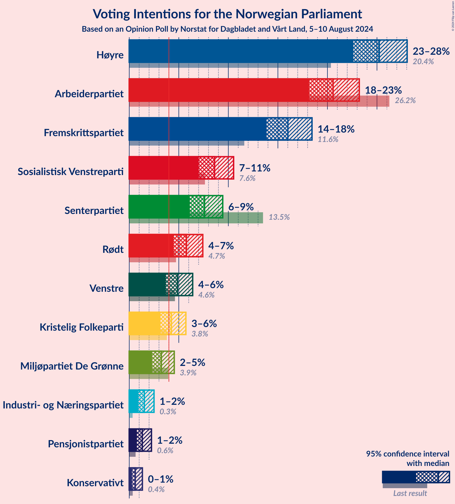

### Confidence Intervals

| Party | Last Result | Poll Result | 80% Confidence Interval | 90% Confidence Interval | 95% Confidence Interval | 99% Confidence Interval |
|:-----:|:-----------:|:-----------:|:-----------------------:|:-----------------------:|:-----------------------:|:-----------------------:|
| Høyre | 20.4% | 25.2% | 23.5–27.1% |23.0–27.6% |22.6–28.0% |21.8–28.9% |
| Arbeiderpartiet | 26.2% | 20.6% | 19.0–22.3% |18.5–22.8% |18.2–23.2% |17.4–24.1% |
| Fremskrittspartiet | 11.6% | 16.0% | 14.6–17.6% |14.2–18.0% |13.9–18.4% |13.2–19.2% |
| Sosialistisk Venstreparti | 7.6% | 8.6% | 7.6–9.9% |7.3–10.2% |7.0–10.5% |6.5–11.2% |
| Senterpartiet | 13.5% | 7.6% | 6.6–8.8% |6.3–9.1% |6.1–9.4% |5.7–10.0% |
| Rødt | 4.7% | 5.8% | 4.9–6.8% |4.7–7.1% |4.5–7.4% |4.1–8.0% |
| Venstre | 4.6% | 4.9% | 4.1–5.9% |3.9–6.1% |3.7–6.4% |3.3–6.9% |
| Kristelig Folkeparti | 3.8% | 4.3% | 3.5–5.2% |3.3–5.5% |3.2–5.7% |2.9–6.2% |
| Miljøpartiet De Grønne | 3.9% | 3.2% | 2.6–4.1% |2.5–4.3% |2.3–4.5% |2.0–5.0% |
| Industri- og Næringspartiet | 0.3% | 1.5% | 1.1–2.1% |1.0–2.3% |0.9–2.5% |0.8–2.8% |
| Pensjonistpartiet | 0.6% | 1.3% | 1.0–1.9% |0.9–2.1% |0.8–2.2% |0.6–2.6% |
| Konservativt | 0.4% | 0.6% | 0.4–1.1% |0.3–1.2% |0.3–1.3% |0.2–1.6% |

*Note:* The poll result column reflects the actual value used in the calculations. Published results may vary slightly, and in addition be rounded to fewer digits.

## Seats

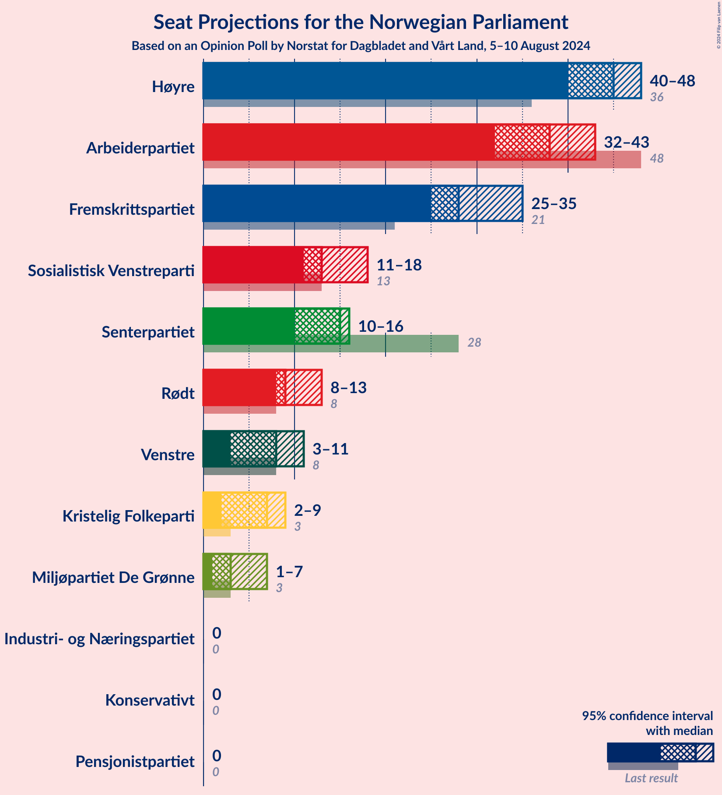

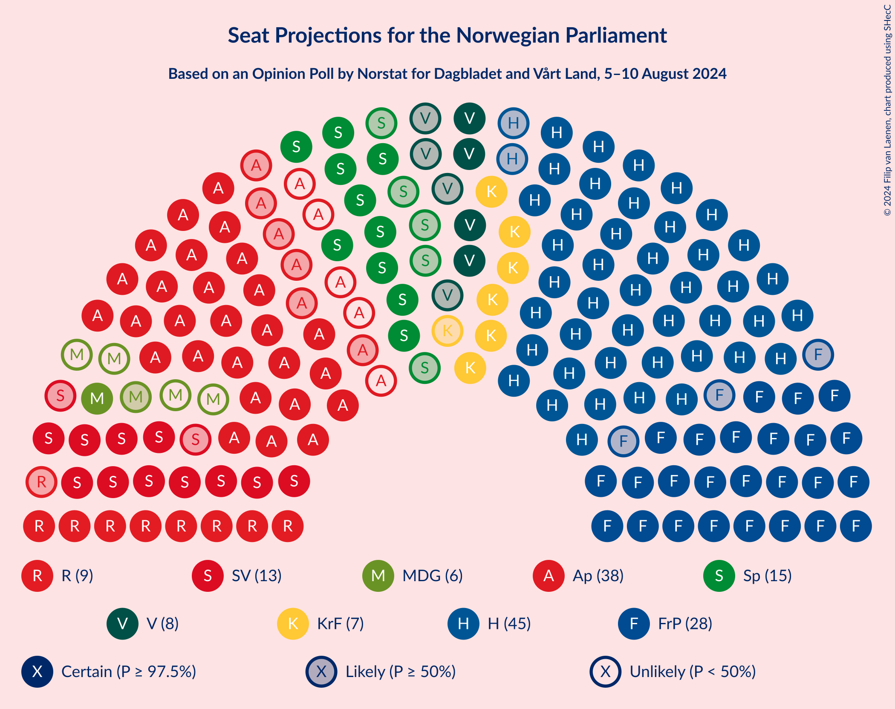

### Confidence Intervals

| Party | Last Result | Median | 80% Confidence Interval | 90% Confidence Interval | 95% Confidence Interval | 99% Confidence Interval |
|:-----:|:-----------:|:------:|:-----------------------:|:-----------------------:|:-----------------------:|:-----------------------:|
| <a href="#høyre">Høyre</a> | 36 | 45 | 42–48 |42–48 |40–48 |39–51 |
| <a href="#arbeiderpartiet">Arbeiderpartiet</a> | 48 | 38 | 35–41 |34–41 |32–43 |32–45 |
| <a href="#fremskrittspartiet">Fremskrittspartiet</a> | 21 | 28 | 26–32 |26–34 |25–35 |23–36 |
| <a href="#sosialistisk-venstreparti">Sosialistisk Venstreparti</a> | 13 | 13 | 12–18 |11–18 |11–18 |11–20 |
| <a href="#senterpartiet">Senterpartiet</a> | 28 | 15 | 11–15 |10–15 |10–16 |9–18 |
| <a href="#rødt">Rødt</a> | 8 | 9 | 9–12 |8–12 |8–13 |7–14 |
| <a href="#venstre">Venstre</a> | 8 | 8 | 7–9 |7–10 |3–11 |2–12 |
| <a href="#kristelig-folkeparti">Kristelig Folkeparti</a> | 3 | 7 | 3–9 |3–9 |2–9 |2–11 |
| <a href="#miljøpartiet-de-grønne">Miljøpartiet De Grønne</a> | 3 | 3 | 1–6 |1–7 |1–7 |1–8 |
| <a href="#industri--og-næringspartiet">Industri- og Næringspartiet</a> | 0 | 0 | 0 |0 |0 |0–2 |
| <a href="#pensjonistpartiet">Pensjonistpartiet</a> | 0 | 0 | 0 |0 |0 |0–1 |
| <a href="#konservativt">Konservativt</a> | 0 | 0 | 0 |0 |0 |0 |

### Høyre

*For a full overview of the results for this party, see the [Høyre](party-høyre.html) page.*

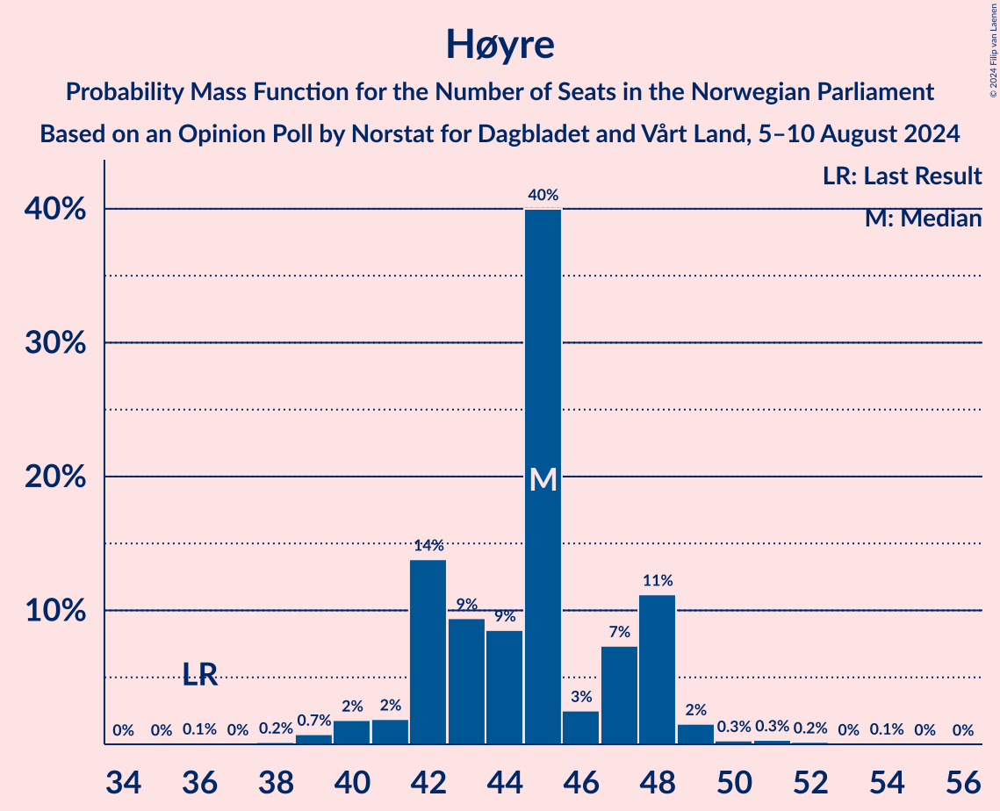

| Number of Seats | Probability | Accumulated | Special Marks |
|:---------------:|:-----------:|:-----------:|:-------------:|
| 36 | 0.1% | 100% | Last Result |
| 37 | 0% | 99.9% |  |
| 38 | 0.2% | 99.9% |  |
| 39 | 0.7% | 99.7% |  |
| 40 | 2% | 99.0% |  |
| 41 | 2% | 97% |  |
| 42 | 14% | 95% |  |
| 43 | 9% | 81% |  |
| 44 | 9% | 72% |  |
| 45 | 40% | 64% | Median |
| 46 | 3% | 24% |  |
| 47 | 7% | 21% |  |
| 48 | 11% | 14% |  |
| 49 | 2% | 2% |  |
| 50 | 0.3% | 0.9% |  |
| 51 | 0.3% | 0.6% |  |
| 52 | 0.2% | 0.3% |  |
| 53 | 0% | 0.1% |  |
| 54 | 0.1% | 0.1% |  |
| 55 | 0% | 0% |  |

### Arbeiderpartiet

*For a full overview of the results for this party, see the [Arbeiderpartiet](party-arbeiderpartiet.html) page.*

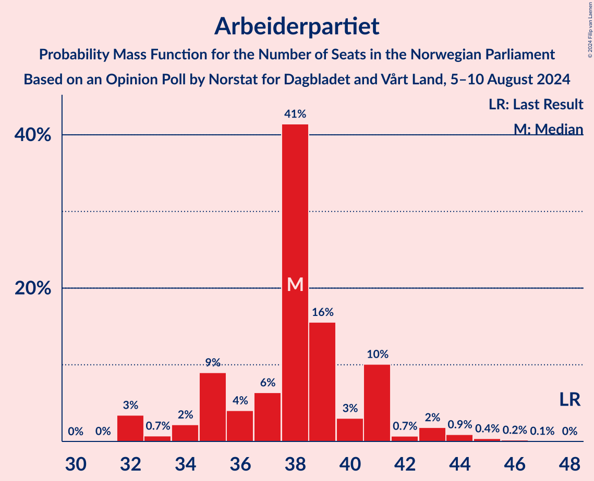

| Number of Seats | Probability | Accumulated | Special Marks |
|:---------------:|:-----------:|:-----------:|:-------------:|
| 32 | 3% | 100% |  |
| 33 | 0.7% | 97% |  |
| 34 | 2% | 96% |  |
| 35 | 9% | 94% |  |
| 36 | 4% | 85% |  |
| 37 | 6% | 81% |  |
| 38 | 41% | 74% | Median |
| 39 | 16% | 33% |  |
| 40 | 3% | 17% |  |
| 41 | 10% | 14% |  |
| 42 | 0.7% | 4% |  |
| 43 | 2% | 3% |  |
| 44 | 0.9% | 2% |  |
| 45 | 0.4% | 0.7% |  |
| 46 | 0.2% | 0.3% |  |
| 47 | 0.1% | 0.1% |  |
| 48 | 0% | 0% | Last Result |

### Fremskrittspartiet

*For a full overview of the results for this party, see the [Fremskrittspartiet](party-fremskrittspartiet.html) page.*

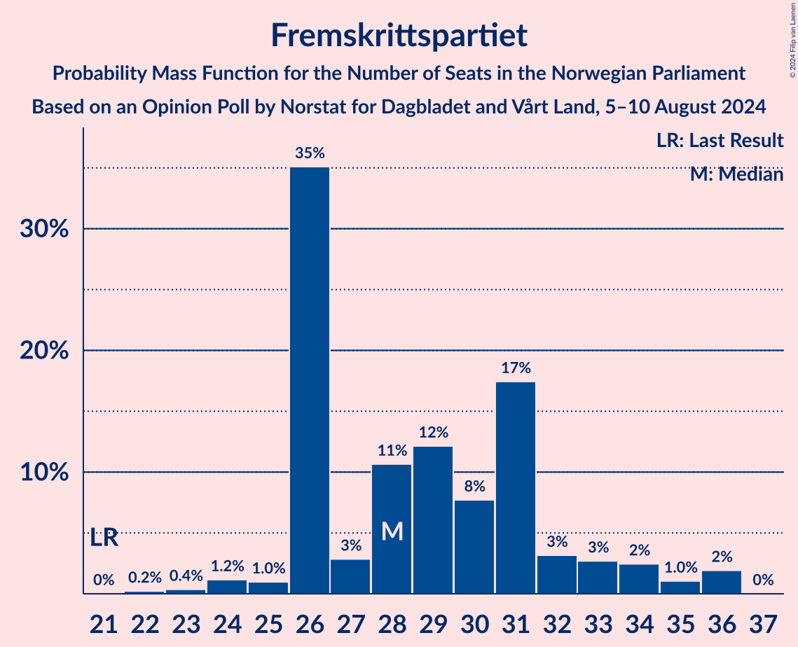

| Number of Seats | Probability | Accumulated | Special Marks |
|:---------------:|:-----------:|:-----------:|:-------------:|
| 21 | 0% | 100% | Last Result |
| 22 | 0.2% | 100% |  |
| 23 | 0.4% | 99.7% |  |
| 24 | 1.2% | 99.4% |  |
| 25 | 1.0% | 98% |  |
| 26 | 35% | 97% |  |
| 27 | 3% | 62% |  |
| 28 | 11% | 59% | Median |
| 29 | 12% | 49% |  |
| 30 | 8% | 36% |  |
| 31 | 17% | 29% |  |
| 32 | 3% | 11% |  |
| 33 | 3% | 8% |  |
| 34 | 2% | 5% |  |
| 35 | 1.0% | 3% |  |
| 36 | 2% | 2% |  |
| 37 | 0% | 0% |  |

### Sosialistisk Venstreparti

*For a full overview of the results for this party, see the [Sosialistisk Venstreparti](party-sosialistiskvenstreparti.html) page.*

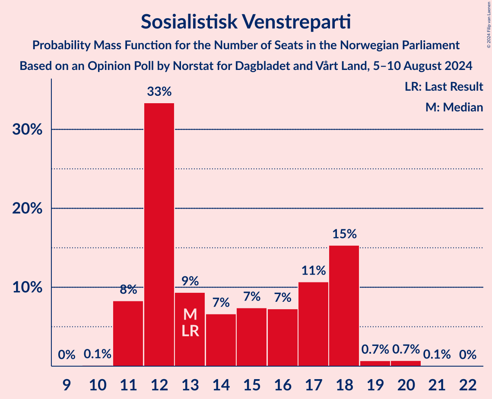

| Number of Seats | Probability | Accumulated | Special Marks |
|:---------------:|:-----------:|:-----------:|:-------------:|
| 10 | 0.1% | 100% |  |
| 11 | 8% | 99.9% |  |
| 12 | 33% | 92% |  |
| 13 | 9% | 58% | Last Result, Median |
| 14 | 7% | 49% |  |
| 15 | 7% | 42% |  |
| 16 | 7% | 35% |  |
| 17 | 11% | 28% |  |
| 18 | 15% | 17% |  |
| 19 | 0.7% | 2% |  |
| 20 | 0.7% | 0.8% |  |
| 21 | 0.1% | 0.1% |  |
| 22 | 0% | 0% |  |

### Senterpartiet

*For a full overview of the results for this party, see the [Senterpartiet](party-senterpartiet.html) page.*

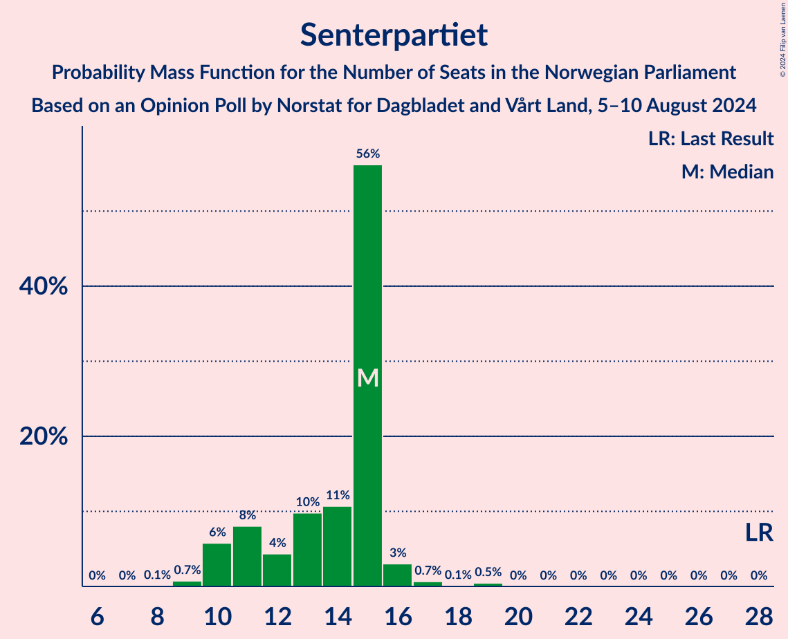

| Number of Seats | Probability | Accumulated | Special Marks |
|:---------------:|:-----------:|:-----------:|:-------------:|
| 8 | 0.1% | 100% |  |
| 9 | 0.7% | 99.9% |  |
| 10 | 6% | 99.2% |  |
| 11 | 8% | 93% |  |
| 12 | 4% | 85% |  |
| 13 | 10% | 81% |  |
| 14 | 11% | 71% |  |
| 15 | 56% | 60% | Median |
| 16 | 3% | 4% |  |
| 17 | 0.7% | 1.2% |  |
| 18 | 0.1% | 0.6% |  |
| 19 | 0.5% | 0.5% |  |
| 20 | 0% | 0% |  |
| 21 | 0% | 0% |  |
| 22 | 0% | 0% |  |
| 23 | 0% | 0% |  |
| 24 | 0% | 0% |  |
| 25 | 0% | 0% |  |
| 26 | 0% | 0% |  |
| 27 | 0% | 0% |  |
| 28 | 0% | 0% | Last Result |

### Rødt

*For a full overview of the results for this party, see the [Rødt](party-rødt.html) page.*

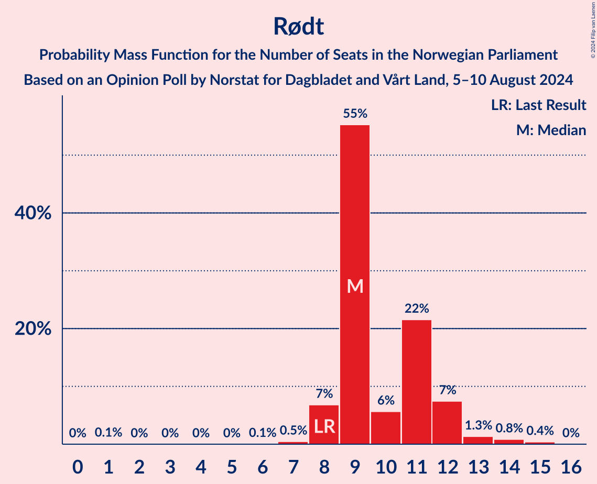

| Number of Seats | Probability | Accumulated | Special Marks |
|:---------------:|:-----------:|:-----------:|:-------------:|
| 1 | 0.1% | 100% |  |
| 2 | 0% | 99.9% |  |
| 3 | 0% | 99.9% |  |
| 4 | 0% | 99.9% |  |
| 5 | 0% | 99.9% |  |
| 6 | 0.1% | 99.9% |  |
| 7 | 0.5% | 99.8% |  |
| 8 | 7% | 99.4% | Last Result |
| 9 | 55% | 93% | Median |
| 10 | 6% | 37% |  |
| 11 | 22% | 32% |  |
| 12 | 7% | 10% |  |
| 13 | 1.3% | 3% |  |
| 14 | 0.8% | 1.3% |  |
| 15 | 0.4% | 0.4% |  |
| 16 | 0% | 0% |  |

### Venstre

*For a full overview of the results for this party, see the [Venstre](party-venstre.html) page.*

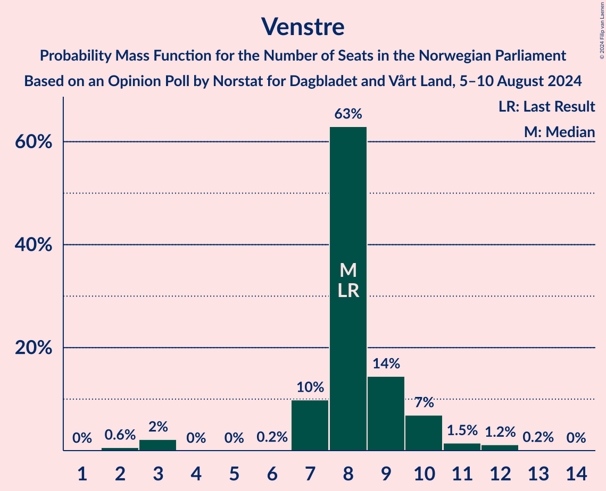

| Number of Seats | Probability | Accumulated | Special Marks |
|:---------------:|:-----------:|:-----------:|:-------------:|
| 2 | 0.6% | 100% |  |
| 3 | 2% | 99.4% |  |
| 4 | 0% | 97% |  |
| 5 | 0% | 97% |  |
| 6 | 0.2% | 97% |  |
| 7 | 10% | 97% |  |
| 8 | 63% | 87% | Last Result, Median |
| 9 | 14% | 24% |  |
| 10 | 7% | 10% |  |
| 11 | 1.5% | 3% |  |
| 12 | 1.2% | 1.4% |  |
| 13 | 0.2% | 0.2% |  |
| 14 | 0% | 0% |  |

### Kristelig Folkeparti

*For a full overview of the results for this party, see the [Kristelig Folkeparti](party-kristeligfolkeparti.html) page.*

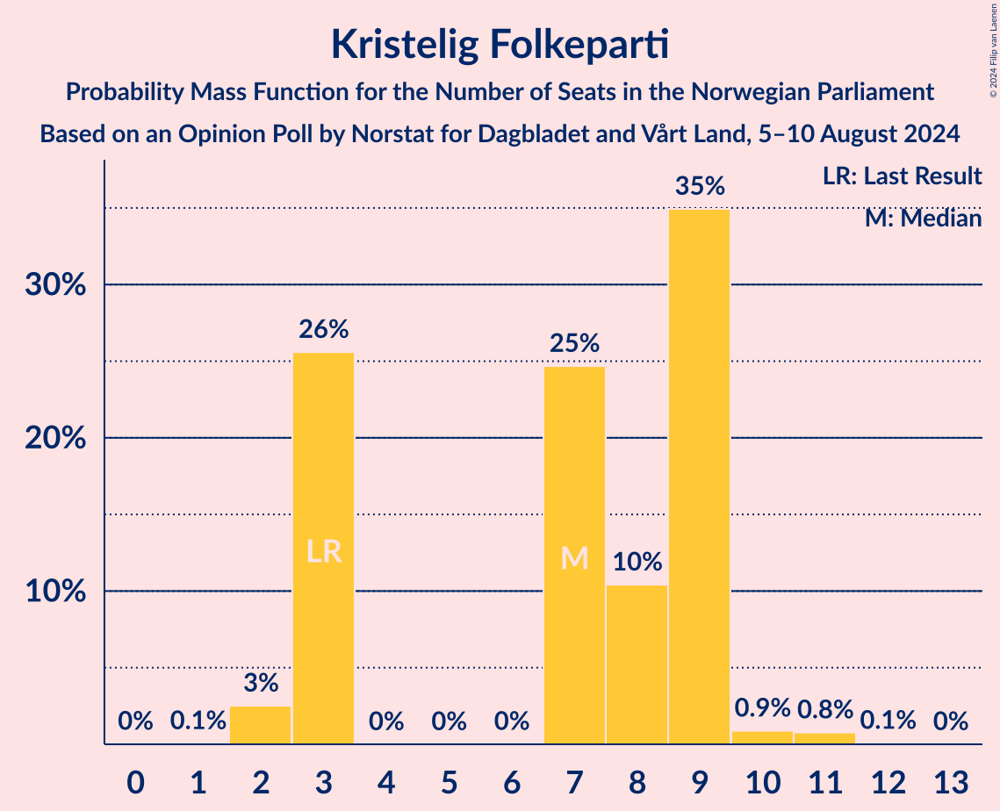

| Number of Seats | Probability | Accumulated | Special Marks |
|:---------------:|:-----------:|:-----------:|:-------------:|
| 1 | 0.1% | 100% |  |
| 2 | 3% | 99.9% |  |
| 3 | 26% | 97% | Last Result |
| 4 | 0% | 72% |  |
| 5 | 0% | 72% |  |
| 6 | 0% | 72% |  |
| 7 | 25% | 72% | Median |
| 8 | 10% | 47% |  |
| 9 | 35% | 37% |  |
| 10 | 0.9% | 2% |  |
| 11 | 0.8% | 0.9% |  |
| 12 | 0.1% | 0.1% |  |
| 13 | 0% | 0% |  |

### Miljøpartiet De Grønne

*For a full overview of the results for this party, see the [Miljøpartiet De Grønne](party-miljøpartietdegrønne.html) page.*

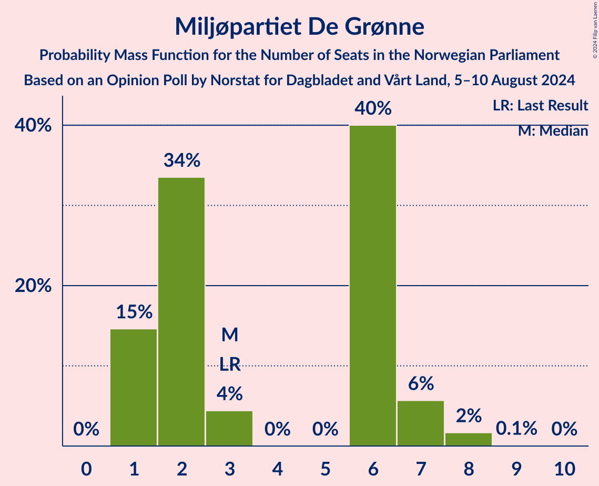

| Number of Seats | Probability | Accumulated | Special Marks |
|:---------------:|:-----------:|:-----------:|:-------------:|
| 1 | 15% | 100% |  |
| 2 | 34% | 85% |  |
| 3 | 4% | 52% | Last Result, Median |
| 4 | 0% | 47% |  |
| 5 | 0% | 47% |  |
| 6 | 40% | 47% |  |
| 7 | 6% | 7% |  |
| 8 | 2% | 2% |  |
| 9 | 0.1% | 0.1% |  |
| 10 | 0% | 0% |  |

### Industri- og Næringspartiet

*For a full overview of the results for this party, see the [Industri- og Næringspartiet](party-industri-ognæringspartiet.html) page.*

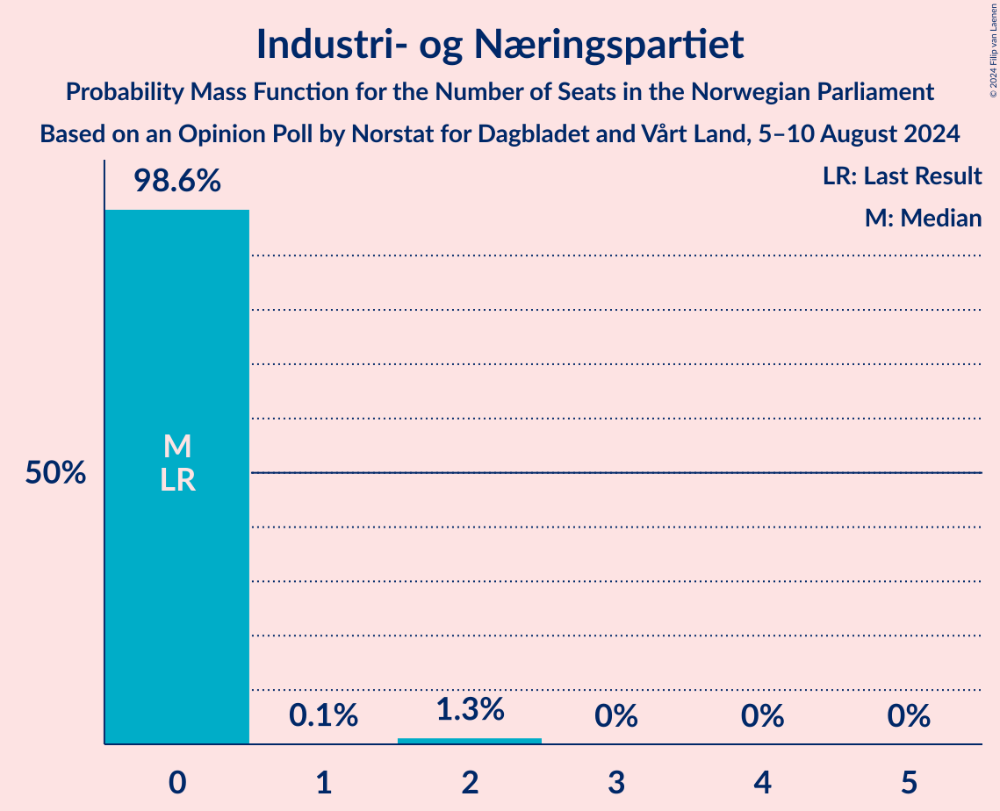

| Number of Seats | Probability | Accumulated | Special Marks |
|:---------------:|:-----------:|:-----------:|:-------------:|
| 0 | 98.6% | 100% | Last Result, Median |
| 1 | 0.1% | 1.4% |  |
| 2 | 1.3% | 1.3% |  |
| 3 | 0% | 0% |  |

### Pensjonistpartiet

*For a full overview of the results for this party, see the [Pensjonistpartiet](party-pensjonistpartiet.html) page.*

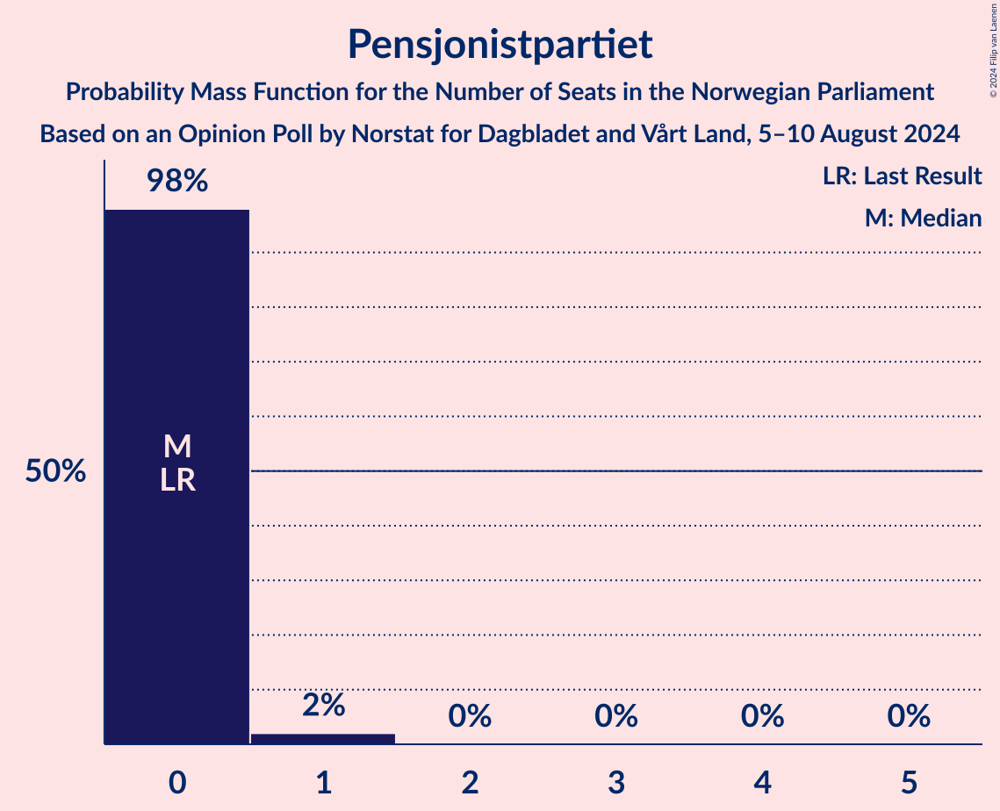

| Number of Seats | Probability | Accumulated | Special Marks |
|:---------------:|:-----------:|:-----------:|:-------------:|
| 0 | 98% | 100% | Last Result, Median |
| 1 | 2% | 2% |  |
| 2 | 0% | 0% |  |

### Konservativt

*For a full overview of the results for this party, see the [Konservativt](party-konservativt.html) page.*

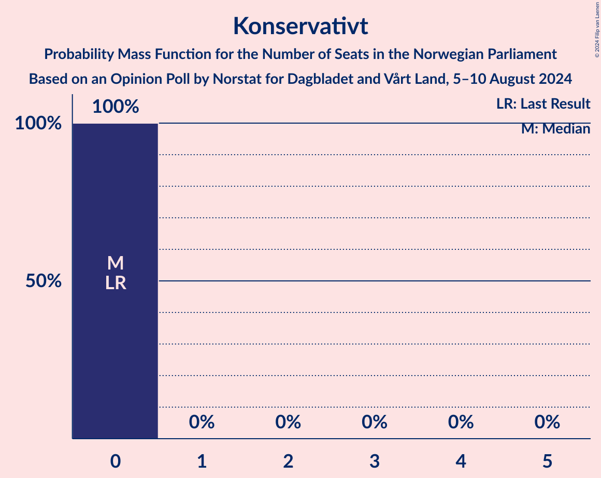

| Number of Seats | Probability | Accumulated | Special Marks |
|:---------------:|:-----------:|:-----------:|:-------------:|
| 0 | 100% | 100% | Last Result, Median |

## Coalitions

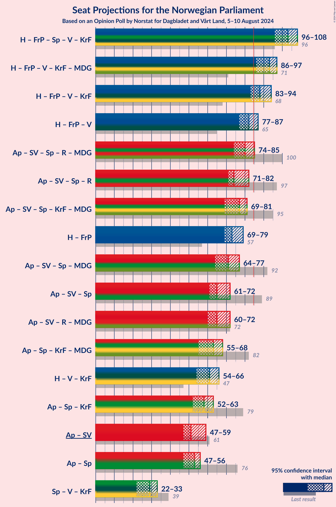

### Confidence Intervals

| Coalition | Last Result | Median | Majority? | 80% Confidence Interval | 90% Confidence Interval | 95% Confidence Interval | 99% Confidence Interval |
|:---------:|:-----------:|:------:|:---------:|:-----------------------:|:-----------------------:|:-----------------------:|:-----------------------:|
| Høyre – Fremskrittspartiet – Senterpartiet – Venstre – Kristelig Folkeparti | 96 | 103 | 100% | 98–105 | 96–107 | 96–108 | 94–109 |
| Høyre – Fremskrittspartiet – Venstre – Kristelig Folkeparti – Miljøpartiet De Grønne | 71 | 93 | 98% | 87–96 | 86–97 | 86–97 | 83–99 |
| Høyre – Fremskrittspartiet – Venstre – Kristelig Folkeparti | 68 | 88 | 92% | 85–91 | 83–93 | 83–94 | 80–96 |
| Høyre – Fremskrittspartiet – Venstre | 65 | 82 | 13% | 79–85 | 78–87 | 77–87 | 74–91 |
| Arbeiderpartiet – Sosialistisk Venstreparti – Senterpartiet – Rødt – Miljøpartiet De Grønne | 100 | 80 | 7% | 77–83 | 75–85 | 74–85 | 72–88 |
| Arbeiderpartiet – Sosialistisk Venstreparti – Senterpartiet – Rødt | 97 | 74 | 1.2% | 72–81 | 71–82 | 71–82 | 68–86 |
| Arbeiderpartiet – Sosialistisk Venstreparti – Senterpartiet – Kristelig Folkeparti – Miljøpartiet De Grønne | 95 | 77 | 0.3% | 73–80 | 71–80 | 69–81 | 67–84 |
| Høyre – Fremskrittspartiet | 57 | 73 | 0.1% | 71–77 | 70–78 | 69–79 | 67–81 |
| Arbeiderpartiet – Sosialistisk Venstreparti – Senterpartiet – Miljøpartiet De Grønne | 92 | 71 | 0% | 66–74 | 64–76 | 64–77 | 61–77 |
| Arbeiderpartiet – Sosialistisk Venstreparti – Senterpartiet | 89 | 65 | 0% | 62–71 | 62–72 | 61–72 | 59–76 |
| Arbeiderpartiet – Sosialistisk Venstreparti – Rødt – Miljøpartiet De Grønne | 72 | 65 | 0% | 63–70 | 61–72 | 60–72 | 59–74 |
| Arbeiderpartiet – Senterpartiet – Kristelig Folkeparti – Miljøpartiet De Grønne | 82 | 63 | 0% | 56–68 | 56–68 | 55–68 | 52–69 |
| Høyre – Venstre – Kristelig Folkeparti | 47 | 61 | 0% | 54–63 | 54–64 | 54–66 | 52–67 |
| Arbeiderpartiet – Senterpartiet – Kristelig Folkeparti | 79 | 58 | 0% | 55–62 | 54–62 | 52–63 | 50–65 |
| Arbeiderpartiet – Sosialistisk Venstreparti | 61 | 51 | 0% | 49–57 | 48–59 | 47–59 | 46–60 |
| Arbeiderpartiet – Senterpartiet | 76 | 53 | 0% | 49–54 | 47–54 | 47–56 | 45–60 |
| Senterpartiet – Venstre – Kristelig Folkeparti | 39 | 29 | 0% | 24–32 | 22–33 | 22–33 | 21–35 |

### Høyre – Fremskrittspartiet – Senterpartiet – Venstre – Kristelig Folkeparti

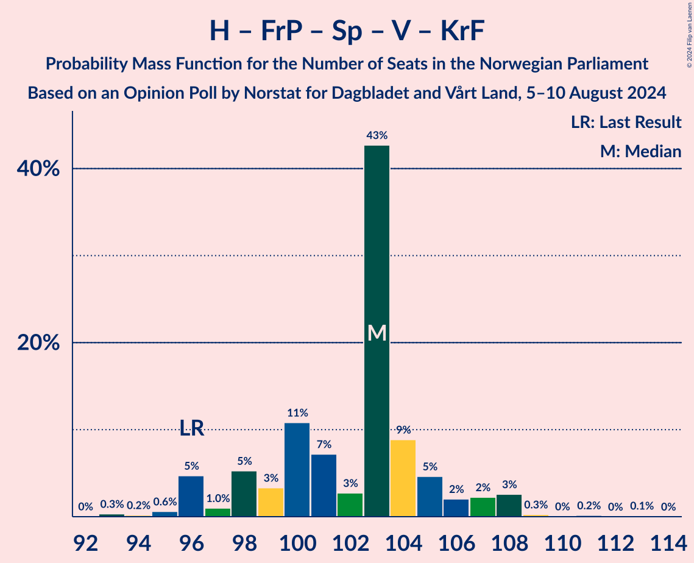

| Number of Seats | Probability | Accumulated | Special Marks |
|:---------------:|:-----------:|:-----------:|:-------------:|
| 92 | 0% | 100% |  |
| 93 | 0.3% | 99.9% |  |
| 94 | 0.2% | 99.6% |  |
| 95 | 0.6% | 99.4% |  |
| 96 | 5% | 98.8% | Last Result |
| 97 | 1.0% | 94% |  |
| 98 | 5% | 93% |  |
| 99 | 3% | 88% |  |
| 100 | 11% | 84% |  |
| 101 | 7% | 74% |  |
| 102 | 3% | 66% |  |
| 103 | 43% | 64% | Median |
| 104 | 9% | 21% |  |
| 105 | 5% | 12% |  |
| 106 | 2% | 8% |  |
| 107 | 2% | 5% |  |
| 108 | 3% | 3% |  |
| 109 | 0.3% | 0.6% |  |
| 110 | 0% | 0.4% |  |
| 111 | 0.2% | 0.3% |  |
| 112 | 0% | 0.2% |  |
| 113 | 0.1% | 0.1% |  |
| 114 | 0% | 0% |  |

### Høyre – Fremskrittspartiet – Venstre – Kristelig Folkeparti – Miljøpartiet De Grønne

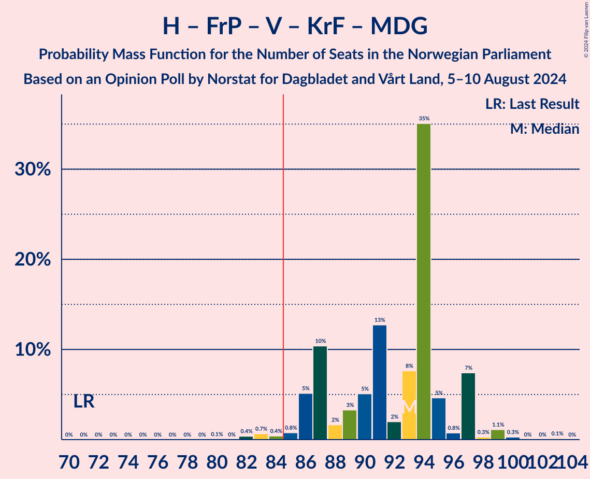

| Number of Seats | Probability | Accumulated | Special Marks |
|:---------------:|:-----------:|:-----------:|:-------------:|
| 71 | 0% | 100% | Last Result |
| 72 | 0% | 100% |  |
| 73 | 0% | 100% |  |
| 74 | 0% | 100% |  |
| 75 | 0% | 100% |  |
| 76 | 0% | 100% |  |
| 77 | 0% | 100% |  |
| 78 | 0% | 100% |  |
| 79 | 0% | 100% |  |
| 80 | 0.1% | 100% |  |
| 81 | 0% | 99.9% |  |
| 82 | 0.4% | 99.9% |  |
| 83 | 0.7% | 99.5% |  |
| 84 | 0.4% | 98.9% |  |
| 85 | 0.8% | 98% | Majority |
| 86 | 5% | 98% |  |
| 87 | 10% | 93% |  |
| 88 | 2% | 82% |  |
| 89 | 3% | 81% |  |
| 90 | 5% | 77% |  |
| 91 | 13% | 72% | Median |
| 92 | 2% | 59% |  |
| 93 | 8% | 57% |  |
| 94 | 35% | 50% |  |
| 95 | 5% | 15% |  |
| 96 | 0.8% | 10% |  |
| 97 | 7% | 9% |  |
| 98 | 0.3% | 2% |  |
| 99 | 1.1% | 2% |  |
| 100 | 0.3% | 0.5% |  |
| 101 | 0% | 0.2% |  |
| 102 | 0% | 0.2% |  |
| 103 | 0.1% | 0.1% |  |
| 104 | 0% | 0% |  |

### Høyre – Fremskrittspartiet – Venstre – Kristelig Folkeparti

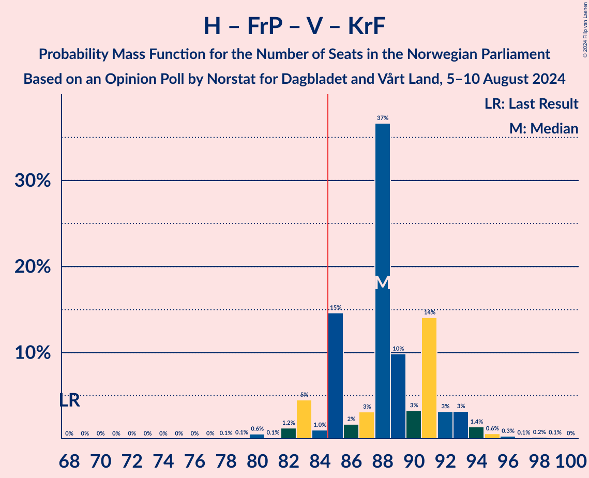

| Number of Seats | Probability | Accumulated | Special Marks |
|:---------------:|:-----------:|:-----------:|:-------------:|
| 68 | 0% | 100% | Last Result |
| 69 | 0% | 100% |  |
| 70 | 0% | 100% |  |
| 71 | 0% | 100% |  |
| 72 | 0% | 100% |  |
| 73 | 0% | 100% |  |
| 74 | 0% | 100% |  |
| 75 | 0% | 100% |  |
| 76 | 0% | 100% |  |
| 77 | 0% | 100% |  |
| 78 | 0.1% | 100% |  |
| 79 | 0.1% | 99.9% |  |
| 80 | 0.6% | 99.8% |  |
| 81 | 0.1% | 99.2% |  |
| 82 | 1.2% | 99.1% |  |
| 83 | 5% | 98% |  |
| 84 | 1.0% | 93% |  |
| 85 | 15% | 92% | Majority |
| 86 | 2% | 78% |  |
| 87 | 3% | 76% |  |
| 88 | 37% | 73% | Median |
| 89 | 10% | 36% |  |
| 90 | 3% | 26% |  |
| 91 | 14% | 23% |  |
| 92 | 3% | 9% |  |
| 93 | 3% | 6% |  |
| 94 | 1.4% | 3% |  |
| 95 | 0.6% | 1.3% |  |
| 96 | 0.3% | 0.7% |  |
| 97 | 0.1% | 0.4% |  |
| 98 | 0.2% | 0.3% |  |
| 99 | 0.1% | 0.2% |  |
| 100 | 0% | 0% |  |

### Høyre – Fremskrittspartiet – Venstre

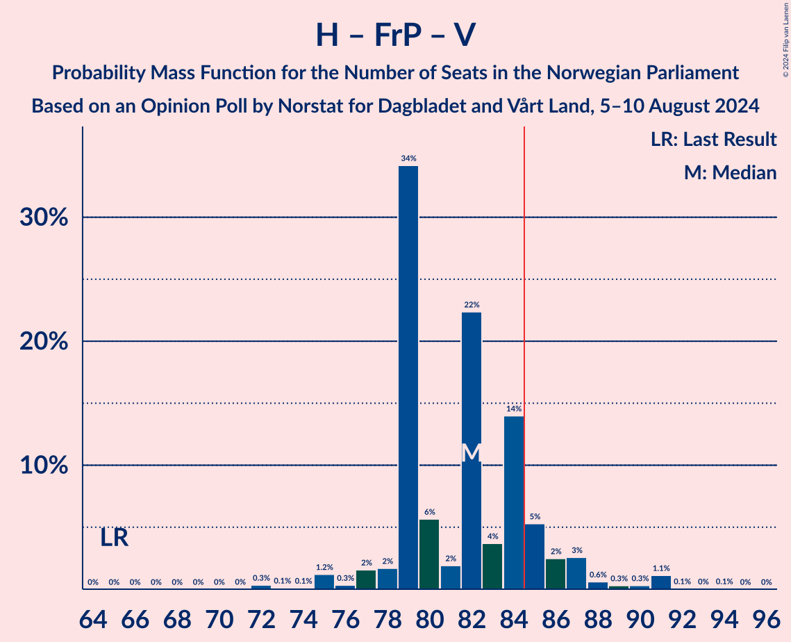

| Number of Seats | Probability | Accumulated | Special Marks |
|:---------------:|:-----------:|:-----------:|:-------------:|
| 65 | 0% | 100% | Last Result |
| 66 | 0% | 100% |  |
| 67 | 0% | 100% |  |
| 68 | 0% | 100% |  |
| 69 | 0% | 100% |  |
| 70 | 0% | 100% |  |
| 71 | 0% | 100% |  |
| 72 | 0.3% | 100% |  |
| 73 | 0.1% | 99.6% |  |
| 74 | 0.1% | 99.5% |  |
| 75 | 1.2% | 99.4% |  |
| 76 | 0.3% | 98% |  |
| 77 | 2% | 98% |  |
| 78 | 2% | 96% |  |
| 79 | 34% | 95% |  |
| 80 | 6% | 60% |  |
| 81 | 2% | 55% | Median |
| 82 | 22% | 53% |  |
| 83 | 4% | 31% |  |
| 84 | 14% | 27% |  |
| 85 | 5% | 13% | Majority |
| 86 | 2% | 8% |  |
| 87 | 3% | 5% |  |
| 88 | 0.6% | 2% |  |
| 89 | 0.3% | 2% |  |
| 90 | 0.3% | 2% |  |
| 91 | 1.1% | 1.3% |  |
| 92 | 0.1% | 0.2% |  |
| 93 | 0% | 0.1% |  |
| 94 | 0.1% | 0.1% |  |
| 95 | 0% | 0% |  |

### Arbeiderpartiet – Sosialistisk Venstreparti – Senterpartiet – Rødt – Miljøpartiet De Grønne

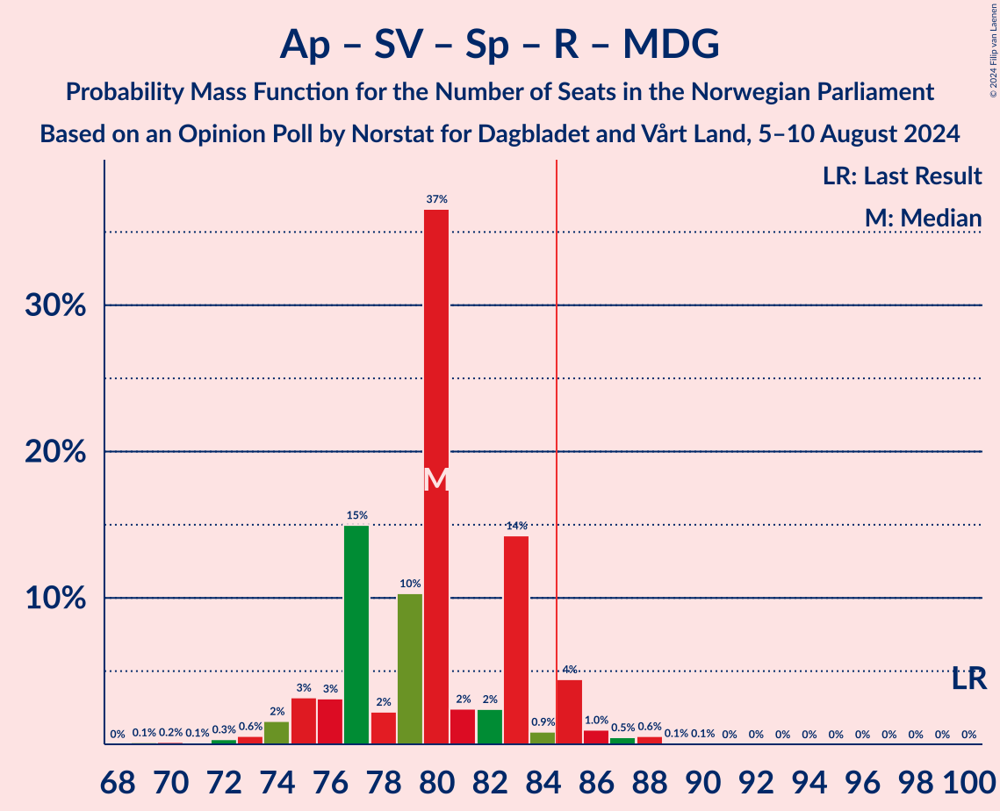

| Number of Seats | Probability | Accumulated | Special Marks |
|:---------------:|:-----------:|:-----------:|:-------------:|
| 69 | 0.1% | 100% |  |
| 70 | 0.2% | 99.8% |  |
| 71 | 0.1% | 99.7% |  |
| 72 | 0.3% | 99.6% |  |
| 73 | 0.6% | 99.2% |  |
| 74 | 2% | 98.7% |  |
| 75 | 3% | 97% |  |
| 76 | 3% | 94% |  |
| 77 | 15% | 91% |  |
| 78 | 2% | 76% | Median |
| 79 | 10% | 74% |  |
| 80 | 37% | 63% |  |
| 81 | 2% | 27% |  |
| 82 | 2% | 24% |  |
| 83 | 14% | 22% |  |
| 84 | 0.9% | 8% |  |
| 85 | 4% | 7% | Majority |
| 86 | 1.0% | 2% |  |
| 87 | 0.5% | 1.2% |  |
| 88 | 0.6% | 0.8% |  |
| 89 | 0.1% | 0.2% |  |
| 90 | 0.1% | 0.1% |  |
| 91 | 0% | 0% |  |
| 92 | 0% | 0% |  |
| 93 | 0% | 0% |  |
| 94 | 0% | 0% |  |
| 95 | 0% | 0% |  |
| 96 | 0% | 0% |  |
| 97 | 0% | 0% |  |
| 98 | 0% | 0% |  |
| 99 | 0% | 0% |  |
| 100 | 0% | 0% | Last Result |

### Arbeiderpartiet – Sosialistisk Venstreparti – Senterpartiet – Rødt

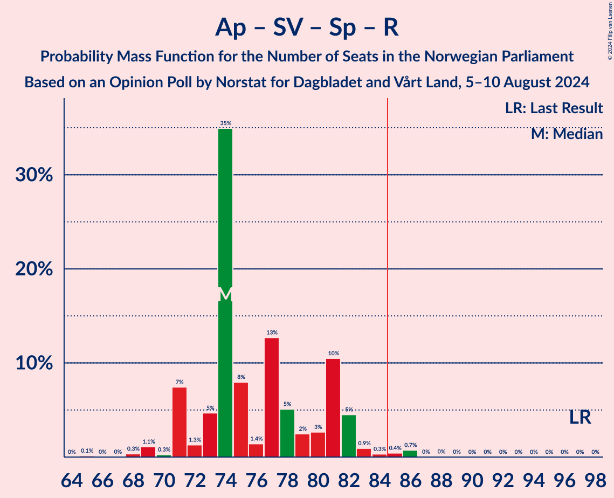

| Number of Seats | Probability | Accumulated | Special Marks |
|:---------------:|:-----------:|:-----------:|:-------------:|
| 65 | 0.1% | 100% |  |
| 66 | 0% | 99.9% |  |
| 67 | 0% | 99.8% |  |
| 68 | 0.3% | 99.8% |  |
| 69 | 1.1% | 99.5% |  |
| 70 | 0.3% | 98% |  |
| 71 | 7% | 98% |  |
| 72 | 1.3% | 91% |  |
| 73 | 5% | 89% |  |
| 74 | 35% | 85% |  |
| 75 | 8% | 50% | Median |
| 76 | 1.4% | 42% |  |
| 77 | 13% | 40% |  |
| 78 | 5% | 28% |  |
| 79 | 2% | 23% |  |
| 80 | 3% | 20% |  |
| 81 | 10% | 17% |  |
| 82 | 5% | 7% |  |
| 83 | 0.9% | 2% |  |
| 84 | 0.3% | 2% |  |
| 85 | 0.4% | 1.2% | Majority |
| 86 | 0.7% | 0.8% |  |
| 87 | 0% | 0.1% |  |
| 88 | 0% | 0.1% |  |
| 89 | 0% | 0% |  |
| 90 | 0% | 0% |  |
| 91 | 0% | 0% |  |
| 92 | 0% | 0% |  |
| 93 | 0% | 0% |  |
| 94 | 0% | 0% |  |
| 95 | 0% | 0% |  |
| 96 | 0% | 0% |  |
| 97 | 0% | 0% | Last Result |

### Arbeiderpartiet – Sosialistisk Venstreparti – Senterpartiet – Kristelig Folkeparti – Miljøpartiet De Grønne

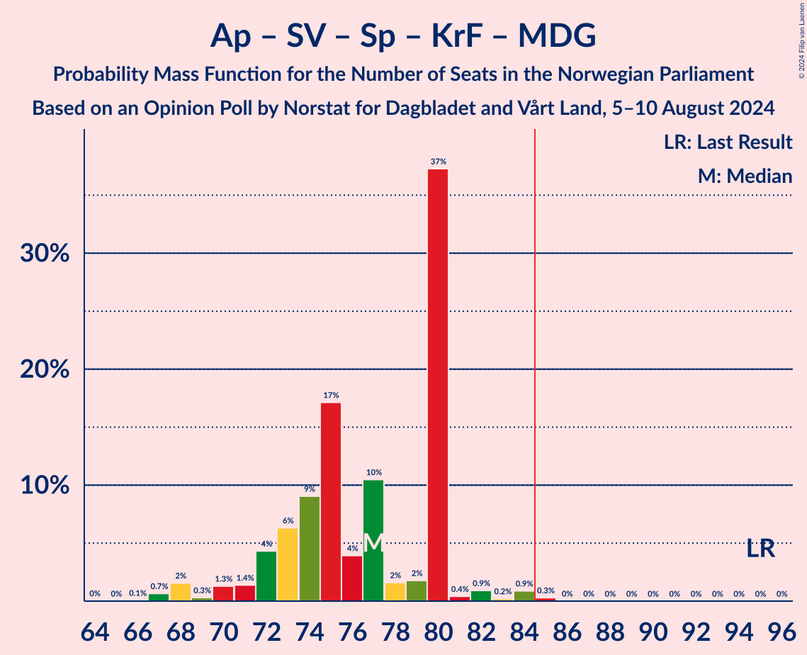

| Number of Seats | Probability | Accumulated | Special Marks |
|:---------------:|:-----------:|:-----------:|:-------------:|
| 64 | 0% | 100% |  |
| 65 | 0% | 99.9% |  |
| 66 | 0.1% | 99.9% |  |
| 67 | 0.7% | 99.8% |  |
| 68 | 2% | 99.2% |  |
| 69 | 0.3% | 98% |  |
| 70 | 1.3% | 97% |  |
| 71 | 1.4% | 96% |  |
| 72 | 4% | 95% |  |
| 73 | 6% | 90% |  |
| 74 | 9% | 84% |  |
| 75 | 17% | 75% |  |
| 76 | 4% | 58% | Median |
| 77 | 10% | 54% |  |
| 78 | 2% | 43% |  |
| 79 | 2% | 42% |  |
| 80 | 37% | 40% |  |
| 81 | 0.4% | 3% |  |
| 82 | 0.9% | 2% |  |
| 83 | 0.2% | 1.4% |  |
| 84 | 0.9% | 1.2% |  |
| 85 | 0.3% | 0.3% | Majority |
| 86 | 0% | 0% |  |
| 87 | 0% | 0% |  |
| 88 | 0% | 0% |  |
| 89 | 0% | 0% |  |
| 90 | 0% | 0% |  |
| 91 | 0% | 0% |  |
| 92 | 0% | 0% |  |
| 93 | 0% | 0% |  |
| 94 | 0% | 0% |  |
| 95 | 0% | 0% | Last Result |

### Høyre – Fremskrittspartiet

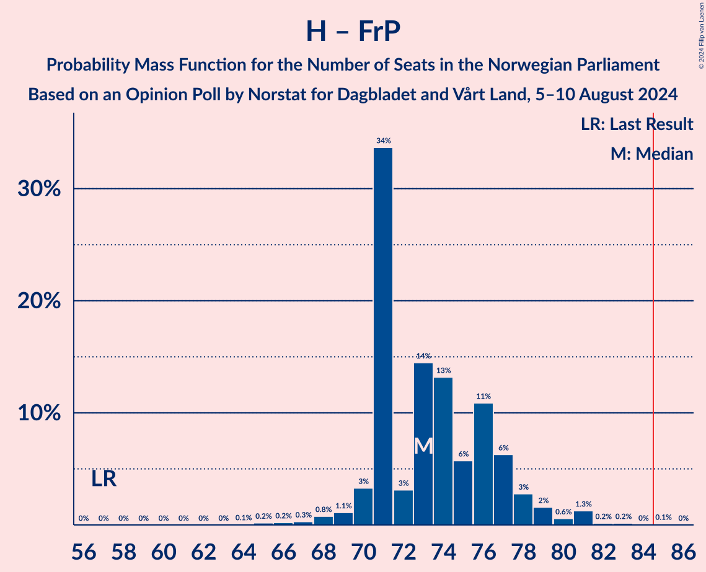

| Number of Seats | Probability | Accumulated | Special Marks |
|:---------------:|:-----------:|:-----------:|:-------------:|
| 57 | 0% | 100% | Last Result |
| 58 | 0% | 100% |  |
| 59 | 0% | 100% |  |
| 60 | 0% | 100% |  |
| 61 | 0% | 100% |  |
| 62 | 0% | 100% |  |
| 63 | 0% | 100% |  |
| 64 | 0.1% | 100% |  |
| 65 | 0.2% | 99.9% |  |
| 66 | 0.2% | 99.7% |  |
| 67 | 0.3% | 99.5% |  |
| 68 | 0.8% | 99.2% |  |
| 69 | 1.1% | 98% |  |
| 70 | 3% | 97% |  |
| 71 | 34% | 94% |  |
| 72 | 3% | 60% |  |
| 73 | 14% | 57% | Median |
| 74 | 13% | 43% |  |
| 75 | 6% | 30% |  |
| 76 | 11% | 24% |  |
| 77 | 6% | 13% |  |
| 78 | 3% | 7% |  |
| 79 | 2% | 4% |  |
| 80 | 0.6% | 2% |  |
| 81 | 1.3% | 2% |  |
| 82 | 0.2% | 0.4% |  |
| 83 | 0.2% | 0.3% |  |
| 84 | 0% | 0.1% |  |
| 85 | 0.1% | 0.1% | Majority |
| 86 | 0% | 0% |  |

### Arbeiderpartiet – Sosialistisk Venstreparti – Senterpartiet – Miljøpartiet De Grønne

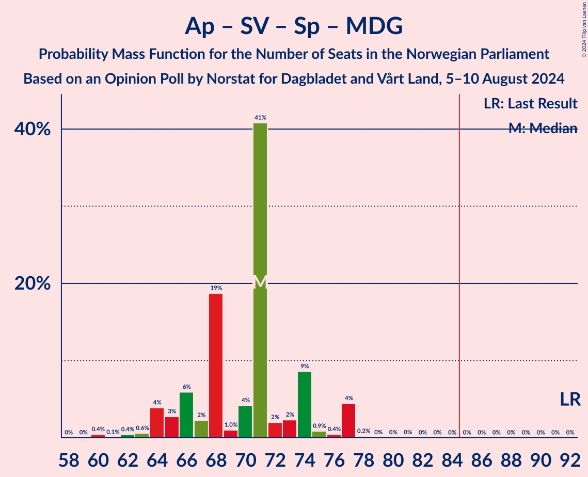

| Number of Seats | Probability | Accumulated | Special Marks |
|:---------------:|:-----------:|:-----------:|:-------------:|
| 60 | 0.4% | 100% |  |
| 61 | 0.1% | 99.5% |  |
| 62 | 0.4% | 99.5% |  |
| 63 | 0.6% | 99.0% |  |
| 64 | 4% | 98% |  |
| 65 | 3% | 95% |  |
| 66 | 6% | 92% |  |
| 67 | 2% | 86% |  |
| 68 | 19% | 84% |  |
| 69 | 1.0% | 65% | Median |
| 70 | 4% | 64% |  |
| 71 | 41% | 60% |  |
| 72 | 2% | 19% |  |
| 73 | 2% | 17% |  |
| 74 | 9% | 15% |  |
| 75 | 0.9% | 6% |  |
| 76 | 0.4% | 5% |  |
| 77 | 4% | 5% |  |
| 78 | 0.2% | 0.3% |  |
| 79 | 0% | 0.1% |  |
| 80 | 0% | 0.1% |  |
| 81 | 0% | 0% |  |
| 82 | 0% | 0% |  |
| 83 | 0% | 0% |  |
| 84 | 0% | 0% |  |
| 85 | 0% | 0% | Majority |
| 86 | 0% | 0% |  |
| 87 | 0% | 0% |  |
| 88 | 0% | 0% |  |
| 89 | 0% | 0% |  |
| 90 | 0% | 0% |  |
| 91 | 0% | 0% |  |
| 92 | 0% | 0% | Last Result |

### Arbeiderpartiet – Sosialistisk Venstreparti – Senterpartiet

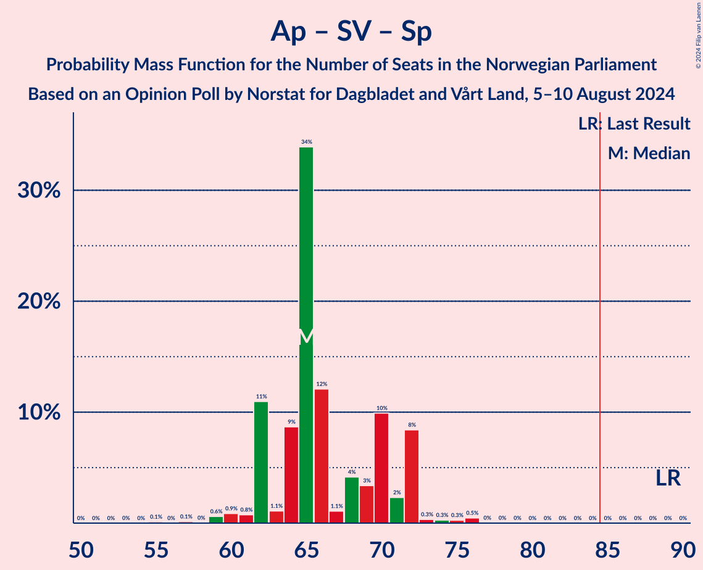

| Number of Seats | Probability | Accumulated | Special Marks |
|:---------------:|:-----------:|:-----------:|:-------------:|
| 55 | 0.1% | 100% |  |
| 56 | 0% | 99.9% |  |
| 57 | 0.1% | 99.9% |  |
| 58 | 0% | 99.7% |  |
| 59 | 0.6% | 99.7% |  |
| 60 | 0.9% | 99.1% |  |
| 61 | 0.8% | 98% |  |
| 62 | 11% | 97% |  |
| 63 | 1.1% | 86% |  |
| 64 | 9% | 85% |  |
| 65 | 34% | 77% |  |
| 66 | 12% | 43% | Median |
| 67 | 1.1% | 31% |  |
| 68 | 4% | 30% |  |
| 69 | 3% | 25% |  |
| 70 | 10% | 22% |  |
| 71 | 2% | 12% |  |
| 72 | 8% | 10% |  |
| 73 | 0.3% | 1.4% |  |
| 74 | 0.3% | 1.1% |  |
| 75 | 0.3% | 0.8% |  |
| 76 | 0.5% | 0.5% |  |
| 77 | 0% | 0.1% |  |
| 78 | 0% | 0% |  |
| 79 | 0% | 0% |  |
| 80 | 0% | 0% |  |
| 81 | 0% | 0% |  |
| 82 | 0% | 0% |  |
| 83 | 0% | 0% |  |
| 84 | 0% | 0% |  |
| 85 | 0% | 0% | Majority |
| 86 | 0% | 0% |  |
| 87 | 0% | 0% |  |
| 88 | 0% | 0% |  |
| 89 | 0% | 0% | Last Result |

### Arbeiderpartiet – Sosialistisk Venstreparti – Rødt – Miljøpartiet De Grønne

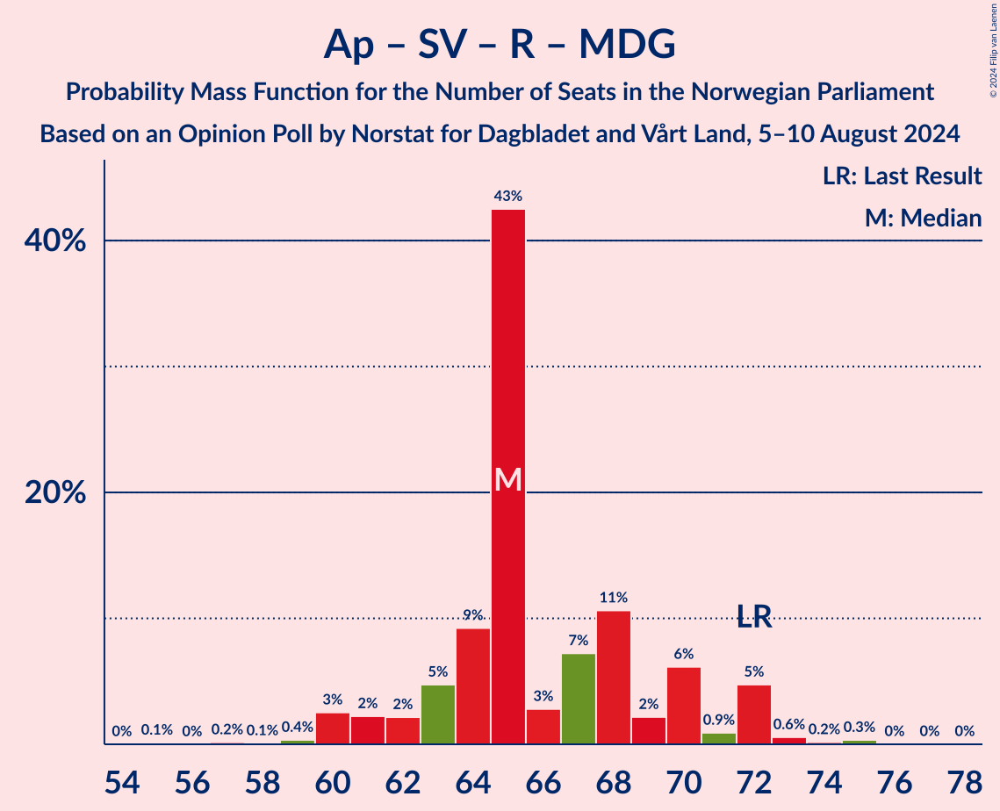

| Number of Seats | Probability | Accumulated | Special Marks |
|:---------------:|:-----------:|:-----------:|:-------------:|
| 55 | 0.1% | 100% |  |
| 56 | 0% | 99.8% |  |
| 57 | 0.2% | 99.8% |  |
| 58 | 0.1% | 99.7% |  |
| 59 | 0.4% | 99.6% |  |
| 60 | 3% | 99.2% |  |
| 61 | 2% | 97% |  |
| 62 | 2% | 94% |  |
| 63 | 5% | 92% | Median |
| 64 | 9% | 88% |  |
| 65 | 43% | 78% |  |
| 66 | 3% | 36% |  |
| 67 | 7% | 33% |  |
| 68 | 11% | 26% |  |
| 69 | 2% | 15% |  |
| 70 | 6% | 13% |  |
| 71 | 0.9% | 7% |  |
| 72 | 5% | 6% | Last Result |
| 73 | 0.6% | 1.2% |  |
| 74 | 0.2% | 0.6% |  |
| 75 | 0.3% | 0.4% |  |
| 76 | 0% | 0.1% |  |
| 77 | 0% | 0.1% |  |
| 78 | 0% | 0% |  |

### Arbeiderpartiet – Senterpartiet – Kristelig Folkeparti – Miljøpartiet De Grønne

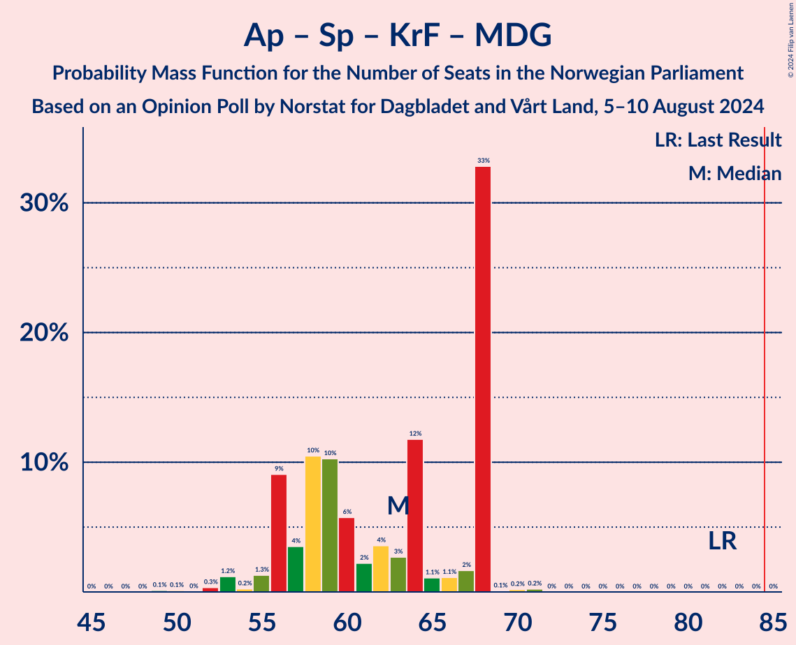

| Number of Seats | Probability | Accumulated | Special Marks |
|:---------------:|:-----------:|:-----------:|:-------------:|
| 49 | 0.1% | 100% |  |
| 50 | 0.1% | 99.9% |  |
| 51 | 0% | 99.8% |  |
| 52 | 0.3% | 99.7% |  |
| 53 | 1.2% | 99.4% |  |
| 54 | 0.2% | 98% |  |
| 55 | 1.3% | 98% |  |
| 56 | 9% | 97% |  |
| 57 | 4% | 88% |  |
| 58 | 10% | 84% |  |
| 59 | 10% | 74% |  |
| 60 | 6% | 63% |  |
| 61 | 2% | 58% |  |
| 62 | 4% | 55% |  |
| 63 | 3% | 52% | Median |
| 64 | 12% | 49% |  |
| 65 | 1.1% | 37% |  |
| 66 | 1.1% | 36% |  |
| 67 | 2% | 35% |  |
| 68 | 33% | 33% |  |
| 69 | 0.1% | 0.5% |  |
| 70 | 0.2% | 0.5% |  |
| 71 | 0.2% | 0.3% |  |
| 72 | 0% | 0% |  |
| 73 | 0% | 0% |  |
| 74 | 0% | 0% |  |
| 75 | 0% | 0% |  |
| 76 | 0% | 0% |  |
| 77 | 0% | 0% |  |
| 78 | 0% | 0% |  |
| 79 | 0% | 0% |  |
| 80 | 0% | 0% |  |
| 81 | 0% | 0% |  |
| 82 | 0% | 0% | Last Result |

### Høyre – Venstre – Kristelig Folkeparti

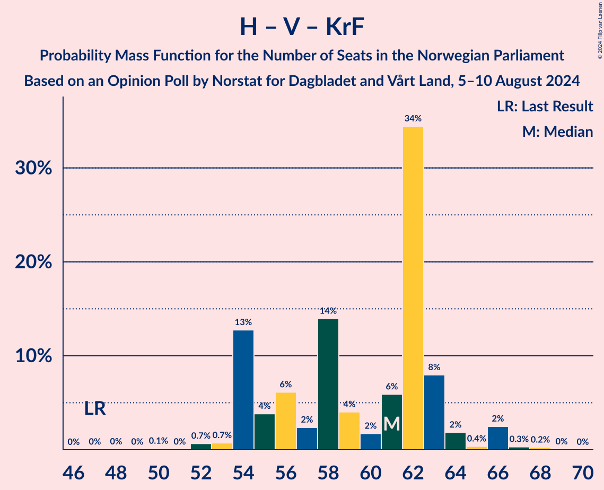

| Number of Seats | Probability | Accumulated | Special Marks |
|:---------------:|:-----------:|:-----------:|:-------------:|
| 47 | 0% | 100% | Last Result |
| 48 | 0% | 100% |  |
| 49 | 0% | 99.9% |  |
| 50 | 0.1% | 99.9% |  |
| 51 | 0% | 99.8% |  |
| 52 | 0.7% | 99.7% |  |
| 53 | 0.7% | 99.1% |  |
| 54 | 13% | 98% |  |
| 55 | 4% | 86% |  |
| 56 | 6% | 82% |  |
| 57 | 2% | 76% |  |
| 58 | 14% | 73% |  |
| 59 | 4% | 59% |  |
| 60 | 2% | 55% | Median |
| 61 | 6% | 54% |  |
| 62 | 34% | 48% |  |
| 63 | 8% | 13% |  |
| 64 | 2% | 5% |  |
| 65 | 0.4% | 3% |  |
| 66 | 2% | 3% |  |
| 67 | 0.3% | 0.6% |  |
| 68 | 0.2% | 0.3% |  |
| 69 | 0% | 0.1% |  |
| 70 | 0% | 0% |  |

### Arbeiderpartiet – Senterpartiet – Kristelig Folkeparti

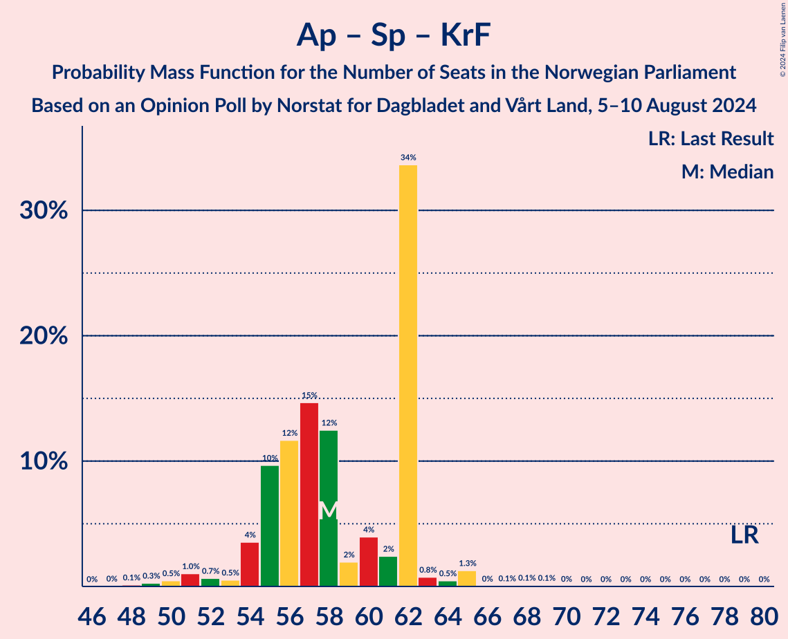

| Number of Seats | Probability | Accumulated | Special Marks |
|:---------------:|:-----------:|:-----------:|:-------------:|
| 48 | 0.1% | 100% |  |
| 49 | 0.3% | 99.8% |  |
| 50 | 0.5% | 99.6% |  |
| 51 | 1.0% | 99.1% |  |
| 52 | 0.7% | 98% |  |
| 53 | 0.5% | 97% |  |
| 54 | 4% | 97% |  |
| 55 | 10% | 93% |  |
| 56 | 12% | 84% |  |
| 57 | 15% | 72% |  |
| 58 | 12% | 57% |  |
| 59 | 2% | 45% |  |
| 60 | 4% | 43% | Median |
| 61 | 2% | 39% |  |
| 62 | 34% | 36% |  |
| 63 | 0.8% | 3% |  |
| 64 | 0.5% | 2% |  |
| 65 | 1.3% | 2% |  |
| 66 | 0% | 0.3% |  |
| 67 | 0.1% | 0.3% |  |
| 68 | 0.1% | 0.2% |  |
| 69 | 0.1% | 0.1% |  |
| 70 | 0% | 0% |  |
| 71 | 0% | 0% |  |
| 72 | 0% | 0% |  |
| 73 | 0% | 0% |  |
| 74 | 0% | 0% |  |
| 75 | 0% | 0% |  |
| 76 | 0% | 0% |  |
| 77 | 0% | 0% |  |
| 78 | 0% | 0% |  |
| 79 | 0% | 0% | Last Result |

### Arbeiderpartiet – Sosialistisk Venstreparti

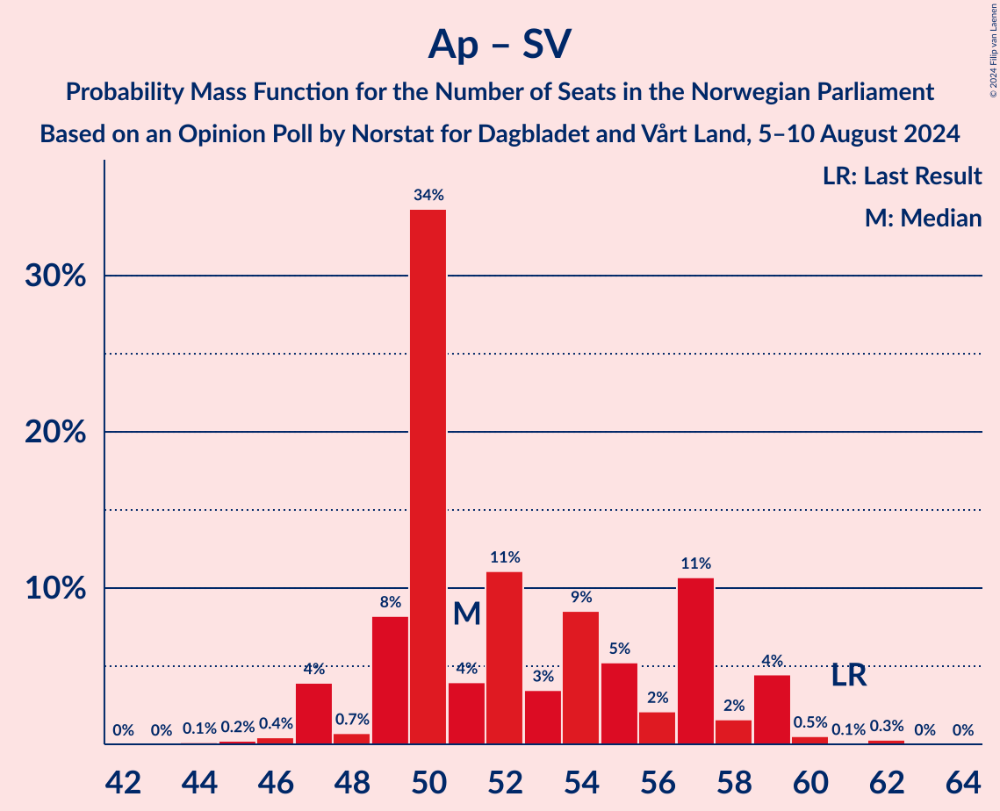

| Number of Seats | Probability | Accumulated | Special Marks |
|:---------------:|:-----------:|:-----------:|:-------------:|
| 44 | 0.1% | 100% |  |
| 45 | 0.2% | 99.9% |  |
| 46 | 0.4% | 99.6% |  |
| 47 | 4% | 99.2% |  |
| 48 | 0.7% | 95% |  |
| 49 | 8% | 95% |  |
| 50 | 34% | 86% |  |
| 51 | 4% | 52% | Median |
| 52 | 11% | 48% |  |
| 53 | 3% | 37% |  |
| 54 | 9% | 34% |  |
| 55 | 5% | 25% |  |
| 56 | 2% | 20% |  |
| 57 | 11% | 18% |  |
| 58 | 2% | 7% |  |
| 59 | 4% | 5% |  |
| 60 | 0.5% | 0.9% |  |
| 61 | 0.1% | 0.4% | Last Result |
| 62 | 0.3% | 0.3% |  |
| 63 | 0% | 0.1% |  |
| 64 | 0% | 0% |  |

### Arbeiderpartiet – Senterpartiet

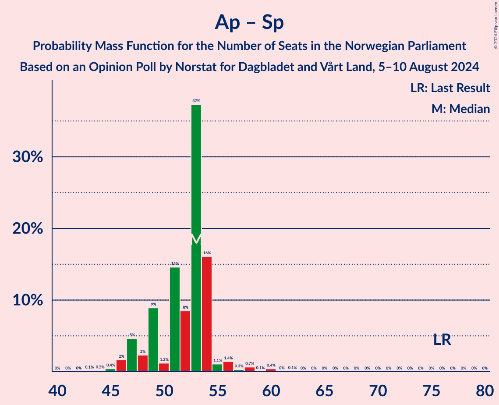

| Number of Seats | Probability | Accumulated | Special Marks |
|:---------------:|:-----------:|:-----------:|:-------------:|
| 43 | 0.1% | 100% |  |
| 44 | 0.2% | 99.8% |  |
| 45 | 0.4% | 99.7% |  |
| 46 | 2% | 99.3% |  |
| 47 | 5% | 98% |  |
| 48 | 2% | 93% |  |
| 49 | 9% | 91% |  |
| 50 | 1.2% | 82% |  |
| 51 | 15% | 81% |  |
| 52 | 8% | 66% |  |
| 53 | 37% | 57% | Median |
| 54 | 16% | 20% |  |
| 55 | 1.1% | 4% |  |
| 56 | 1.4% | 3% |  |
| 57 | 0.3% | 2% |  |
| 58 | 0.7% | 1.2% |  |
| 59 | 0.1% | 0.6% |  |
| 60 | 0.4% | 0.5% |  |
| 61 | 0% | 0.1% |  |
| 62 | 0.1% | 0.1% |  |
| 63 | 0% | 0% |  |
| 64 | 0% | 0% |  |
| 65 | 0% | 0% |  |
| 66 | 0% | 0% |  |
| 67 | 0% | 0% |  |
| 68 | 0% | 0% |  |
| 69 | 0% | 0% |  |
| 70 | 0% | 0% |  |
| 71 | 0% | 0% |  |
| 72 | 0% | 0% |  |
| 73 | 0% | 0% |  |
| 74 | 0% | 0% |  |
| 75 | 0% | 0% |  |
| 76 | 0% | 0% | Last Result |

### Senterpartiet – Venstre – Kristelig Folkeparti

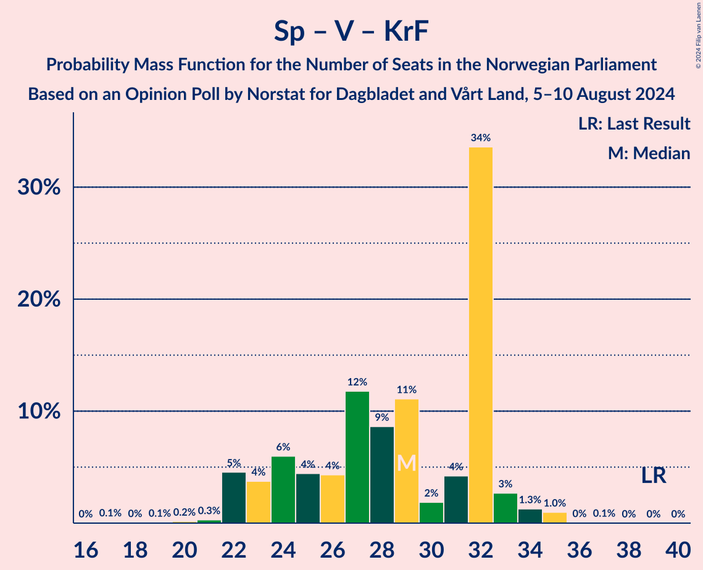

| Number of Seats | Probability | Accumulated | Special Marks |
|:---------------:|:-----------:|:-----------:|:-------------:|
| 17 | 0.1% | 100% |  |
| 18 | 0% | 99.9% |  |
| 19 | 0.1% | 99.9% |  |
| 20 | 0.2% | 99.8% |  |
| 21 | 0.3% | 99.6% |  |
| 22 | 5% | 99.3% |  |
| 23 | 4% | 95% |  |
| 24 | 6% | 91% |  |
| 25 | 4% | 85% |  |
| 26 | 4% | 81% |  |
| 27 | 12% | 76% |  |
| 28 | 9% | 64% |  |
| 29 | 11% | 56% |  |
| 30 | 2% | 45% | Median |
| 31 | 4% | 43% |  |
| 32 | 34% | 39% |  |
| 33 | 3% | 5% |  |
| 34 | 1.3% | 2% |  |
| 35 | 1.0% | 1.1% |  |
| 36 | 0% | 0.1% |  |
| 37 | 0.1% | 0.1% |  |
| 38 | 0% | 0% |  |
| 39 | 0% | 0% | Last Result |

## Technical Information

### Opinion Poll

+ **Polling firm:** Norstat
+ **Commissioner(s):** Dagbladet and Vårt Land
+ **Fieldwork period:** 5–10 August 2024

### Calculations

+ **Sample size:** 987
+ **Simulations done:** 1,048,576
+ **Error estimate:** 2.04%

