# Opinion Poll by Opinion Perduco for Dagsavisen, Fagbladet and FriFagbevegelse, 6–12 August 2024

<a href="#voting-intentions">Voting Intentions</a> | <a href="#seats">Seats</a> | <a href="#coalitions">Coalitions</a> | <a href="#technical-information">Technical Information</a>

## Voting Intentions

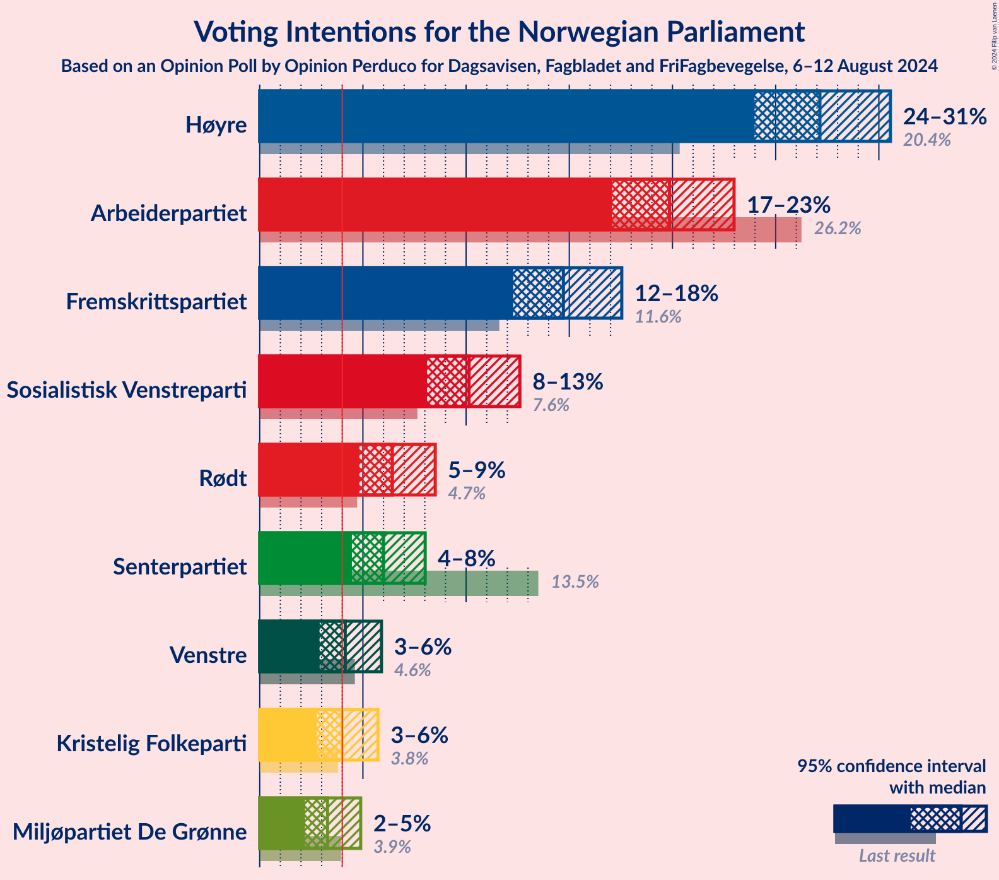

### Confidence Intervals

| Party | Last Result | Poll Result | 80% Confidence Interval | 90% Confidence Interval | 95% Confidence Interval | 99% Confidence Interval |
|:-----:|:-----------:|:-----------:|:-----------------------:|:-----------------------:|:-----------------------:|:-----------------------:|
| Høyre | 20.4% | 27.1% | 25.1–29.4% |24.5–30.0% |24.0–30.6% |23.0–31.7% |
| Arbeiderpartiet | 26.2% | 19.9% | 18.0–21.9% |17.5–22.5% |17.1–23.0% |16.2–24.0% |
| Fremskrittspartiet | 11.6% | 14.7% | 13.1–16.6% |12.7–17.1% |12.3–17.5% |11.6–18.5% |
| Sosialistisk Venstreparti | 7.6% | 10.1% | 8.8–11.8% |8.4–12.2% |8.1–12.6% |7.5–13.4% |
| Rødt | 4.7% | 6.4% | 5.4–7.8% |5.1–8.2% |4.8–8.5% |4.4–9.2% |
| Senterpartiet | 13.5% | 6.0% | 5.0–7.3% |4.7–7.7% |4.5–8.0% |4.0–8.7% |
| Venstre | 4.6% | 4.1% | 3.3–5.3% |3.1–5.6% |2.9–5.9% |2.5–6.5% |
| Kristelig Folkeparti | 3.8% | 4.0% | 3.2–5.1% |3.0–5.4% |2.8–5.7% |2.4–6.3% |
| Miljøpartiet De Grønne | 3.9% | 3.3% | 2.6–4.3% |2.4–4.6% |2.2–4.9% |1.9–5.4% |

*Note:* The poll result column reflects the actual value used in the calculations. Published results may vary slightly, and in addition be rounded to fewer digits.

## Seats

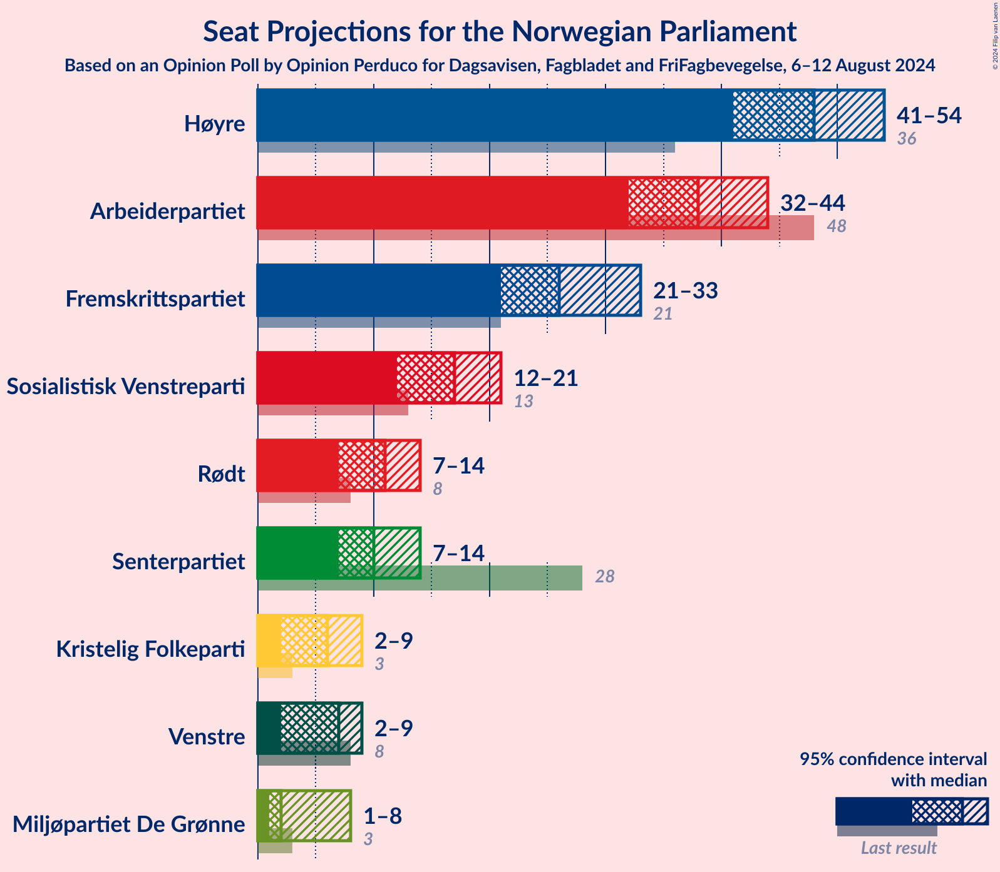

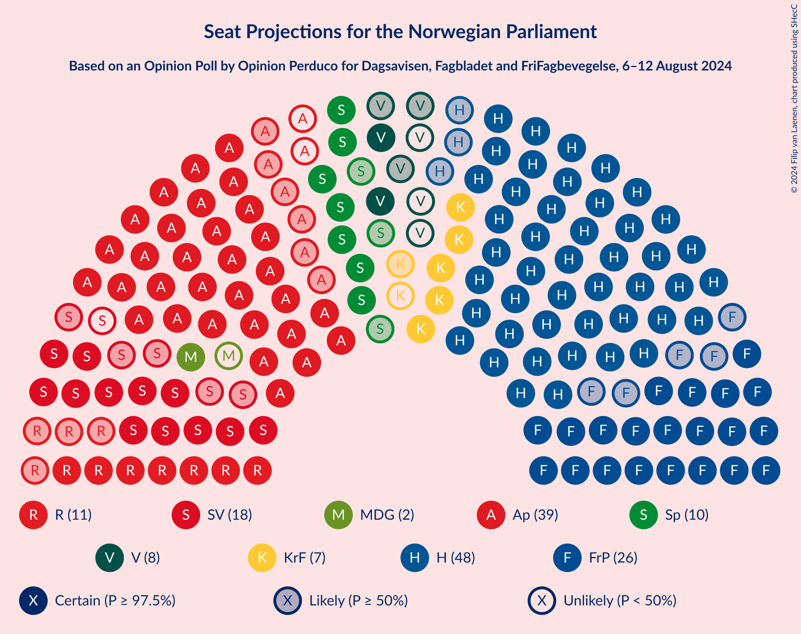

### Confidence Intervals

| Party | Last Result | Median | 80% Confidence Interval | 90% Confidence Interval | 95% Confidence Interval | 99% Confidence Interval |
|:-----:|:-----------:|:------:|:-----------------------:|:-----------------------:|:-----------------------:|:-----------------------:|
| <a href="#høyre">Høyre</a> | 36 | 48 | 44–52 |43–53 |41–54 |40–56 |
| <a href="#arbeiderpartiet">Arbeiderpartiet</a> | 48 | 38 | 34–41 |33–42 |32–44 |31–46 |
| <a href="#fremskrittspartiet">Fremskrittspartiet</a> | 21 | 26 | 23–31 |22–33 |21–33 |19–35 |
| <a href="#sosialistisk-venstreparti">Sosialistisk Venstreparti</a> | 13 | 17 | 14–20 |13–21 |12–21 |11–24 |
| <a href="#rødt">Rødt</a> | 8 | 11 | 8–13 |8–14 |7–14 |7–16 |
| <a href="#senterpartiet">Senterpartiet</a> | 28 | 10 | 7–13 |7–14 |7–14 |1–15 |
| <a href="#venstre">Venstre</a> | 8 | 7 | 2–9 |2–9 |2–9 |2–11 |
| <a href="#kristelig-folkeparti">Kristelig Folkeparti</a> | 3 | 6 | 2–8 |2–9 |2–9 |2–10 |
| <a href="#miljøpartiet-de-grønne">Miljøpartiet De Grønne</a> | 3 | 2 | 1–6 |1–7 |1–8 |1–9 |

### Høyre

*For a full overview of the results for this party, see the [Høyre](party-høyre.html) page.*

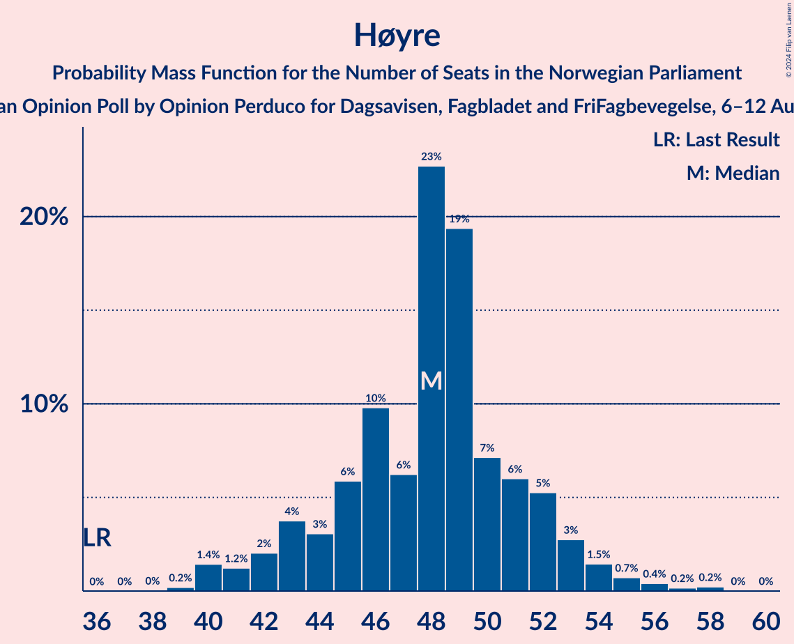

| Number of Seats | Probability | Accumulated | Special Marks |
|:---------------:|:-----------:|:-----------:|:-------------:|
| 36 | 0% | 100% | Last Result |
| 37 | 0% | 100% |  |
| 38 | 0% | 100% |  |
| 39 | 0.2% | 100% |  |
| 40 | 1.4% | 99.8% |  |
| 41 | 1.2% | 98% |  |
| 42 | 2% | 97% |  |
| 43 | 4% | 95% |  |
| 44 | 3% | 91% |  |
| 45 | 6% | 88% |  |
| 46 | 10% | 82% |  |
| 47 | 6% | 73% |  |
| 48 | 23% | 66% | Median |
| 49 | 19% | 44% |  |
| 50 | 7% | 24% |  |
| 51 | 6% | 17% |  |
| 52 | 5% | 11% |  |
| 53 | 3% | 6% |  |
| 54 | 1.5% | 3% |  |
| 55 | 0.7% | 2% |  |
| 56 | 0.4% | 0.9% |  |
| 57 | 0.2% | 0.4% |  |
| 58 | 0.2% | 0.3% |  |
| 59 | 0% | 0.1% |  |
| 60 | 0% | 0% |  |

### Arbeiderpartiet

*For a full overview of the results for this party, see the [Arbeiderpartiet](party-arbeiderpartiet.html) page.*

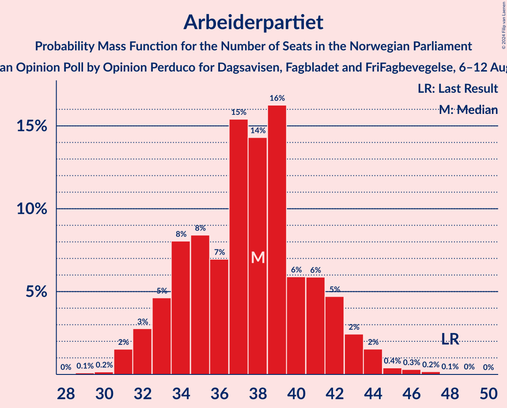

| Number of Seats | Probability | Accumulated | Special Marks |
|:---------------:|:-----------:|:-----------:|:-------------:|
| 29 | 0.1% | 100% |  |
| 30 | 0.2% | 99.9% |  |
| 31 | 2% | 99.7% |  |
| 32 | 3% | 98% |  |
| 33 | 5% | 95% |  |
| 34 | 8% | 91% |  |
| 35 | 8% | 83% |  |
| 36 | 7% | 74% |  |
| 37 | 15% | 67% |  |
| 38 | 14% | 52% | Median |
| 39 | 16% | 38% |  |
| 40 | 6% | 21% |  |
| 41 | 6% | 16% |  |
| 42 | 5% | 10% |  |
| 43 | 2% | 5% |  |
| 44 | 2% | 3% |  |
| 45 | 0.4% | 1.0% |  |
| 46 | 0.3% | 0.6% |  |
| 47 | 0.2% | 0.3% |  |
| 48 | 0.1% | 0.1% | Last Result |
| 49 | 0% | 0.1% |  |
| 50 | 0% | 0% |  |

### Fremskrittspartiet

*For a full overview of the results for this party, see the [Fremskrittspartiet](party-fremskrittspartiet.html) page.*

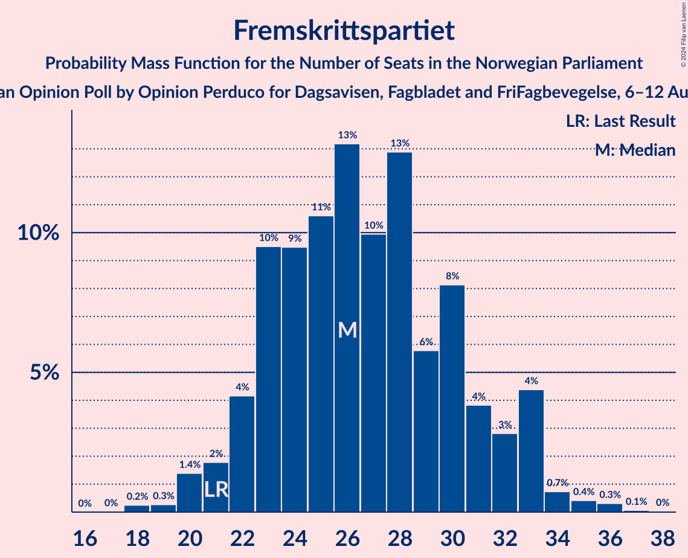

| Number of Seats | Probability | Accumulated | Special Marks |
|:---------------:|:-----------:|:-----------:|:-------------:|
| 18 | 0.2% | 100% |  |
| 19 | 0.3% | 99.7% |  |
| 20 | 1.4% | 99.5% |  |
| 21 | 2% | 98% | Last Result |
| 22 | 4% | 96% |  |
| 23 | 10% | 92% |  |
| 24 | 9% | 83% |  |
| 25 | 11% | 73% |  |
| 26 | 13% | 63% | Median |
| 27 | 10% | 49% |  |
| 28 | 13% | 39% |  |
| 29 | 6% | 27% |  |
| 30 | 8% | 21% |  |
| 31 | 4% | 13% |  |
| 32 | 3% | 9% |  |
| 33 | 4% | 6% |  |
| 34 | 0.7% | 2% |  |
| 35 | 0.4% | 0.8% |  |
| 36 | 0.3% | 0.4% |  |
| 37 | 0.1% | 0.1% |  |
| 38 | 0% | 0% |  |

### Sosialistisk Venstreparti

*For a full overview of the results for this party, see the [Sosialistisk Venstreparti](party-sosialistiskvenstreparti.html) page.*

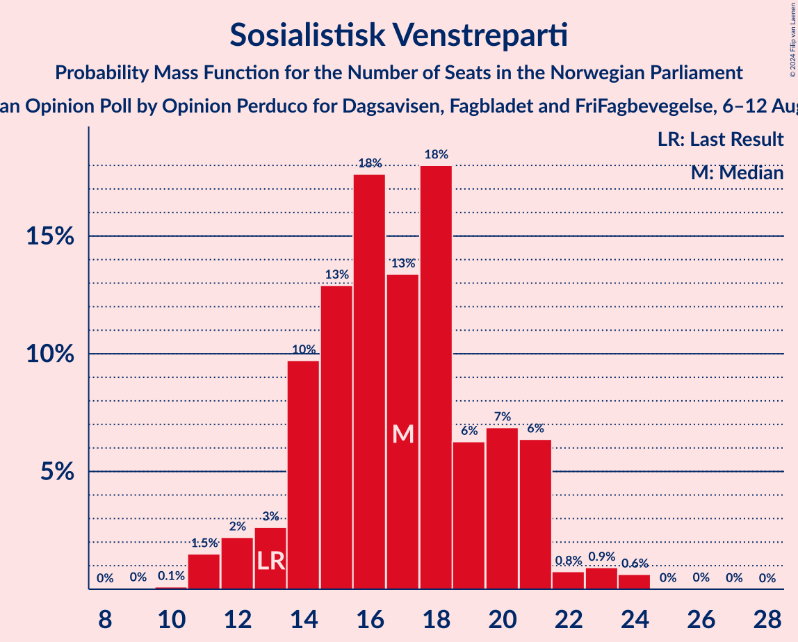

| Number of Seats | Probability | Accumulated | Special Marks |
|:---------------:|:-----------:|:-----------:|:-------------:|
| 9 | 0% | 100% |  |
| 10 | 0.1% | 99.9% |  |
| 11 | 1.5% | 99.8% |  |
| 12 | 2% | 98% |  |
| 13 | 3% | 96% | Last Result |
| 14 | 10% | 94% |  |
| 15 | 13% | 84% |  |
| 16 | 18% | 71% |  |
| 17 | 13% | 53% | Median |
| 18 | 18% | 40% |  |
| 19 | 6% | 22% |  |
| 20 | 7% | 16% |  |
| 21 | 6% | 9% |  |
| 22 | 0.8% | 2% |  |
| 23 | 0.9% | 2% |  |
| 24 | 0.6% | 0.7% |  |
| 25 | 0% | 0.1% |  |
| 26 | 0% | 0.1% |  |
| 27 | 0% | 0% |  |

### Rødt

*For a full overview of the results for this party, see the [Rødt](party-rødt.html) page.*

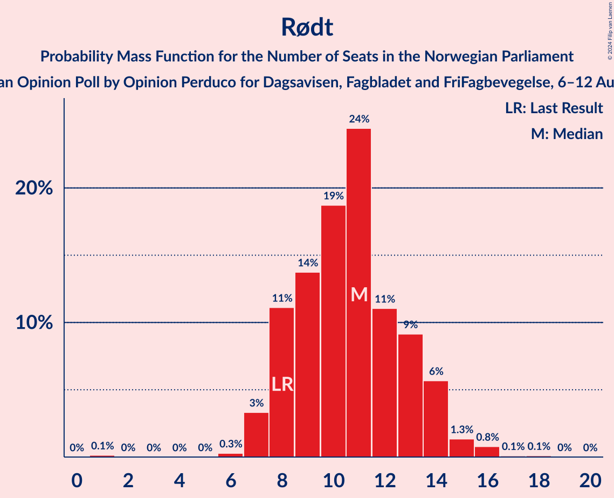

| Number of Seats | Probability | Accumulated | Special Marks |
|:---------------:|:-----------:|:-----------:|:-------------:|
| 1 | 0.1% | 100% |  |
| 2 | 0% | 99.9% |  |
| 3 | 0% | 99.9% |  |
| 4 | 0% | 99.9% |  |
| 5 | 0% | 99.9% |  |
| 6 | 0.3% | 99.8% |  |
| 7 | 3% | 99.6% |  |
| 8 | 11% | 96% | Last Result |
| 9 | 14% | 85% |  |
| 10 | 19% | 71% |  |
| 11 | 24% | 53% | Median |
| 12 | 11% | 28% |  |
| 13 | 9% | 17% |  |
| 14 | 6% | 8% |  |
| 15 | 1.3% | 2% |  |
| 16 | 0.8% | 1.0% |  |
| 17 | 0.1% | 0.2% |  |
| 18 | 0.1% | 0.1% |  |
| 19 | 0% | 0% |  |

### Senterpartiet

*For a full overview of the results for this party, see the [Senterpartiet](party-senterpartiet.html) page.*

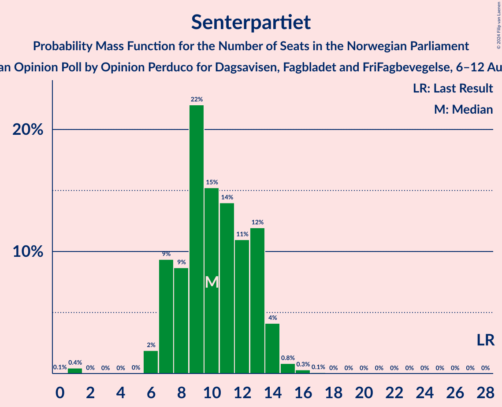

| Number of Seats | Probability | Accumulated | Special Marks |
|:---------------:|:-----------:|:-----------:|:-------------:|
| 0 | 0.1% | 100% |  |
| 1 | 0.4% | 99.9% |  |
| 2 | 0% | 99.5% |  |
| 3 | 0% | 99.5% |  |
| 4 | 0% | 99.5% |  |
| 5 | 0% | 99.5% |  |
| 6 | 2% | 99.4% |  |
| 7 | 9% | 98% |  |
| 8 | 9% | 88% |  |
| 9 | 22% | 80% |  |
| 10 | 15% | 57% | Median |
| 11 | 14% | 42% |  |
| 12 | 11% | 28% |  |
| 13 | 12% | 17% |  |
| 14 | 4% | 5% |  |
| 15 | 0.8% | 1.2% |  |
| 16 | 0.3% | 0.4% |  |
| 17 | 0.1% | 0.1% |  |
| 18 | 0% | 0% |  |
| 19 | 0% | 0% |  |
| 20 | 0% | 0% |  |
| 21 | 0% | 0% |  |
| 22 | 0% | 0% |  |
| 23 | 0% | 0% |  |
| 24 | 0% | 0% |  |
| 25 | 0% | 0% |  |
| 26 | 0% | 0% |  |
| 27 | 0% | 0% |  |
| 28 | 0% | 0% | Last Result |

### Venstre

*For a full overview of the results for this party, see the [Venstre](party-venstre.html) page.*

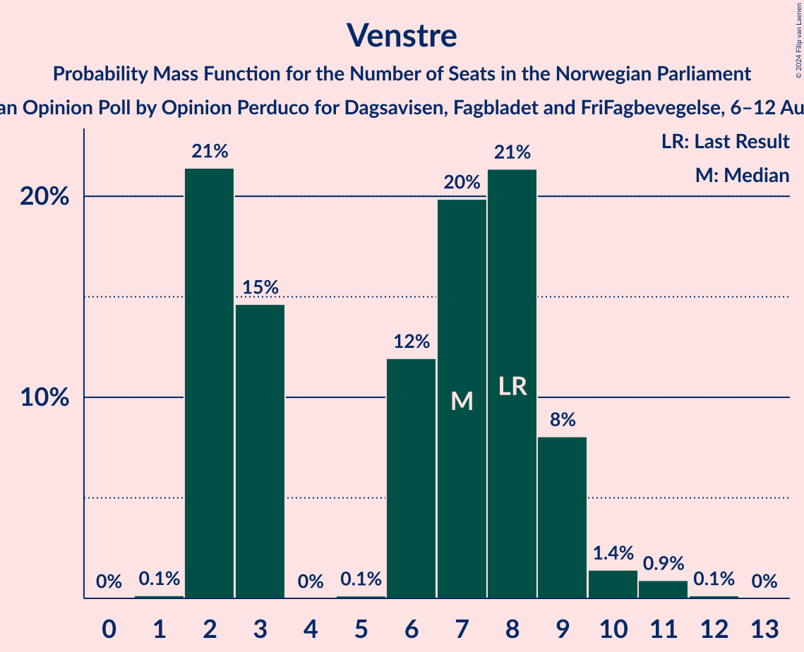

| Number of Seats | Probability | Accumulated | Special Marks |
|:---------------:|:-----------:|:-----------:|:-------------:|
| 1 | 0.1% | 100% |  |
| 2 | 21% | 99.9% |  |
| 3 | 15% | 78% |  |
| 4 | 0% | 64% |  |
| 5 | 0.1% | 64% |  |
| 6 | 12% | 64% |  |
| 7 | 20% | 52% | Median |
| 8 | 21% | 32% | Last Result |
| 9 | 8% | 11% |  |
| 10 | 1.4% | 2% |  |
| 11 | 0.9% | 1.1% |  |
| 12 | 0.1% | 0.2% |  |
| 13 | 0% | 0% |  |

### Kristelig Folkeparti

*For a full overview of the results for this party, see the [Kristelig Folkeparti](party-kristeligfolkeparti.html) page.*

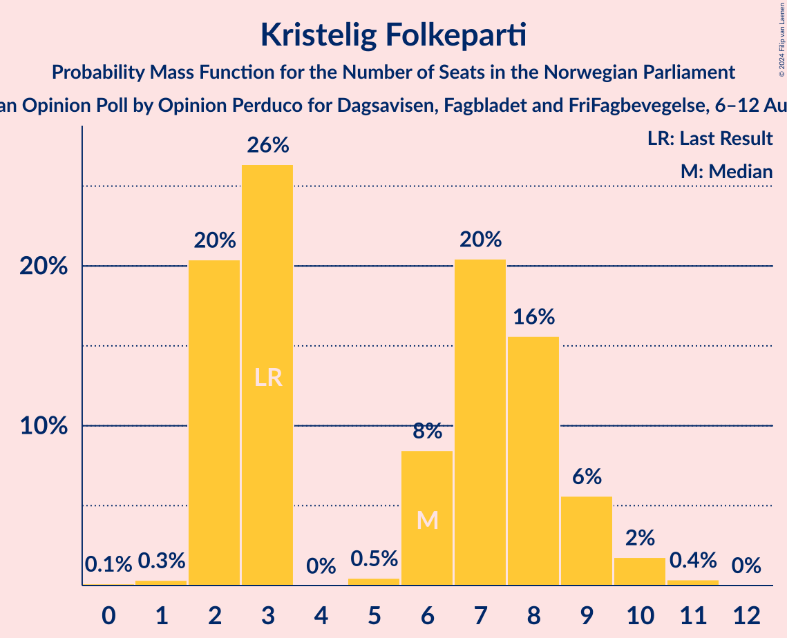

| Number of Seats | Probability | Accumulated | Special Marks |
|:---------------:|:-----------:|:-----------:|:-------------:|
| 0 | 0.1% | 100% |  |
| 1 | 0.3% | 99.9% |  |
| 2 | 20% | 99.5% |  |
| 3 | 26% | 79% | Last Result |
| 4 | 0% | 53% |  |
| 5 | 0.5% | 53% |  |
| 6 | 8% | 52% | Median |
| 7 | 20% | 44% |  |
| 8 | 16% | 23% |  |
| 9 | 6% | 8% |  |
| 10 | 2% | 2% |  |
| 11 | 0.4% | 0.4% |  |
| 12 | 0% | 0% |  |

### Miljøpartiet De Grønne

*For a full overview of the results for this party, see the [Miljøpartiet De Grønne](party-miljøpartietdegrønne.html) page.*

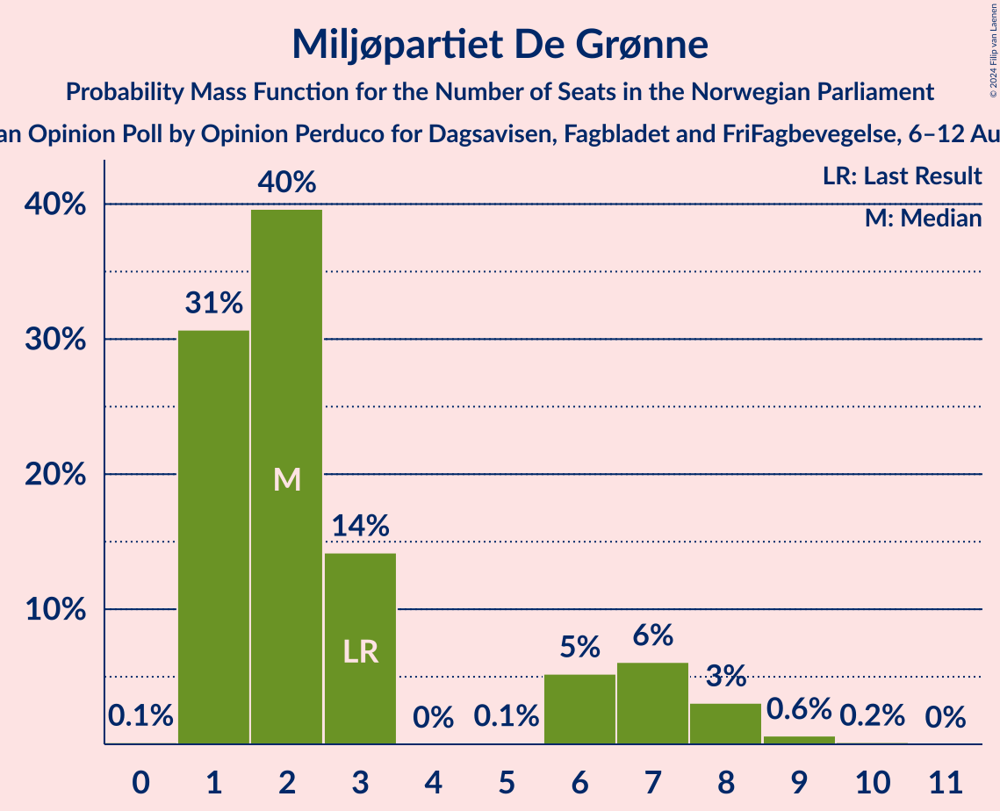

| Number of Seats | Probability | Accumulated | Special Marks |
|:---------------:|:-----------:|:-----------:|:-------------:|
| 0 | 0.1% | 100% |  |
| 1 | 31% | 99.9% |  |
| 2 | 40% | 69% | Median |
| 3 | 14% | 30% | Last Result |
| 4 | 0% | 15% |  |
| 5 | 0.1% | 15% |  |
| 6 | 5% | 15% |  |
| 7 | 6% | 10% |  |
| 8 | 3% | 4% |  |
| 9 | 0.6% | 0.8% |  |
| 10 | 0.2% | 0.2% |  |
| 11 | 0% | 0% |  |

## Coalitions

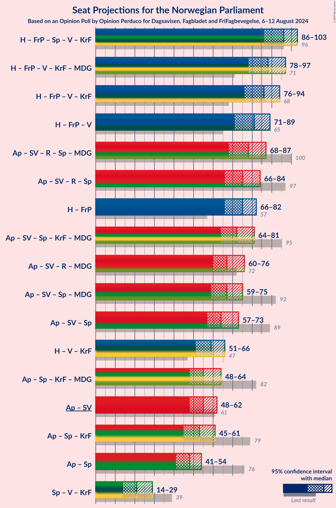

### Confidence Intervals

| Coalition | Last Result | Median | Majority? | 80% Confidence Interval | 90% Confidence Interval | 95% Confidence Interval | 99% Confidence Interval |
|:---------:|:-----------:|:------:|:---------:|:-----------------------:|:-----------------------:|:-----------------------:|:-----------------------:|
| Høyre – Fremskrittspartiet – Senterpartiet – Venstre – Kristelig Folkeparti | 96 | 96 | 99.3% | 89–101 | 88–103 | 86–103 | 84–107 |
| Høyre – Fremskrittspartiet – Venstre – Kristelig Folkeparti – Miljøpartiet De Grønne | 71 | 88 | 78% | 81–95 | 79–96 | 78–97 | 76–100 |
| Høyre – Fremskrittspartiet – Venstre – Kristelig Folkeparti | 68 | 86 | 58% | 78–92 | 77–94 | 76–94 | 74–96 |
| Høyre – Fremskrittspartiet – Venstre | 65 | 81 | 19% | 74–87 | 73–88 | 71–89 | 68–91 |
| Arbeiderpartiet – Sosialistisk Venstreparti – Rødt – Senterpartiet – Miljøpartiet De Grønne | 100 | 78 | 11% | 71–85 | 69–86 | 68–87 | 66–91 |
| Arbeiderpartiet – Sosialistisk Venstreparti – Rødt – Senterpartiet | 97 | 75 | 2% | 68–82 | 67–83 | 66–84 | 64–87 |
| Høyre – Fremskrittspartiet | 57 | 75 | 0.9% | 69–80 | 67–82 | 66–82 | 64–85 |
| Arbeiderpartiet – Sosialistisk Venstreparti – Senterpartiet – Kristelig Folkeparti – Miljøpartiet De Grønne | 95 | 72 | 0.5% | 66–79 | 65–81 | 64–81 | 61–84 |
| Arbeiderpartiet – Sosialistisk Venstreparti – Rødt – Miljøpartiet De Grønne | 72 | 67 | 0% | 61–73 | 60–75 | 60–76 | 57–79 |
| Arbeiderpartiet – Sosialistisk Venstreparti – Senterpartiet – Miljøpartiet De Grønne | 92 | 67 | 0% | 61–73 | 60–75 | 59–75 | 57–79 |
| Arbeiderpartiet – Sosialistisk Venstreparti – Senterpartiet | 89 | 64 | 0% | 59–71 | 57–71 | 57–73 | 54–74 |
| Høyre – Venstre – Kristelig Folkeparti | 47 | 59 | 0% | 53–64 | 51–65 | 51–66 | 48–68 |
| Arbeiderpartiet – Senterpartiet – Kristelig Folkeparti – Miljøpartiet De Grønne | 82 | 55 | 0% | 50–61 | 49–63 | 48–64 | 45–67 |
| Arbeiderpartiet – Sosialistisk Venstreparti | 61 | 55 | 0% | 50–59 | 48–60 | 48–62 | 46–64 |
| Arbeiderpartiet – Senterpartiet – Kristelig Folkeparti | 79 | 53 | 0% | 48–58 | 47–60 | 45–61 | 43–63 |
| Arbeiderpartiet – Senterpartiet | 76 | 48 | 0% | 44–52 | 42–53 | 41–54 | 39–56 |
| Senterpartiet – Venstre – Kristelig Folkeparti | 39 | 21 | 0% | 16–26 | 15–27 | 14–29 | 12–31 |

### Høyre – Fremskrittspartiet – Senterpartiet – Venstre – Kristelig Folkeparti

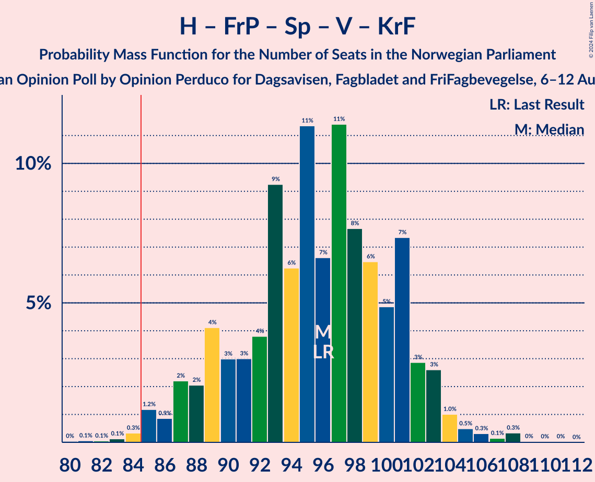

| Number of Seats | Probability | Accumulated | Special Marks |
|:---------------:|:-----------:|:-----------:|:-------------:|
| 80 | 0% | 100% |  |
| 81 | 0.1% | 99.9% |  |
| 82 | 0.1% | 99.9% |  |
| 83 | 0.1% | 99.8% |  |
| 84 | 0.3% | 99.7% |  |
| 85 | 1.2% | 99.3% | Majority |
| 86 | 0.9% | 98% |  |
| 87 | 2% | 97% |  |
| 88 | 2% | 95% |  |
| 89 | 4% | 93% |  |
| 90 | 3% | 89% |  |
| 91 | 3% | 86% |  |
| 92 | 4% | 83% |  |
| 93 | 9% | 79% |  |
| 94 | 6% | 70% |  |
| 95 | 11% | 64% |  |
| 96 | 7% | 52% | Last Result |
| 97 | 11% | 46% | Median |
| 98 | 8% | 34% |  |
| 99 | 6% | 27% |  |
| 100 | 5% | 20% |  |
| 101 | 7% | 15% |  |
| 102 | 3% | 8% |  |
| 103 | 3% | 5% |  |
| 104 | 1.0% | 2% |  |
| 105 | 0.5% | 1.4% |  |
| 106 | 0.3% | 0.9% |  |
| 107 | 0.1% | 0.6% |  |
| 108 | 0.3% | 0.4% |  |
| 109 | 0% | 0.1% |  |
| 110 | 0% | 0.1% |  |
| 111 | 0% | 0% |  |

### Høyre – Fremskrittspartiet – Venstre – Kristelig Folkeparti – Miljøpartiet De Grønne

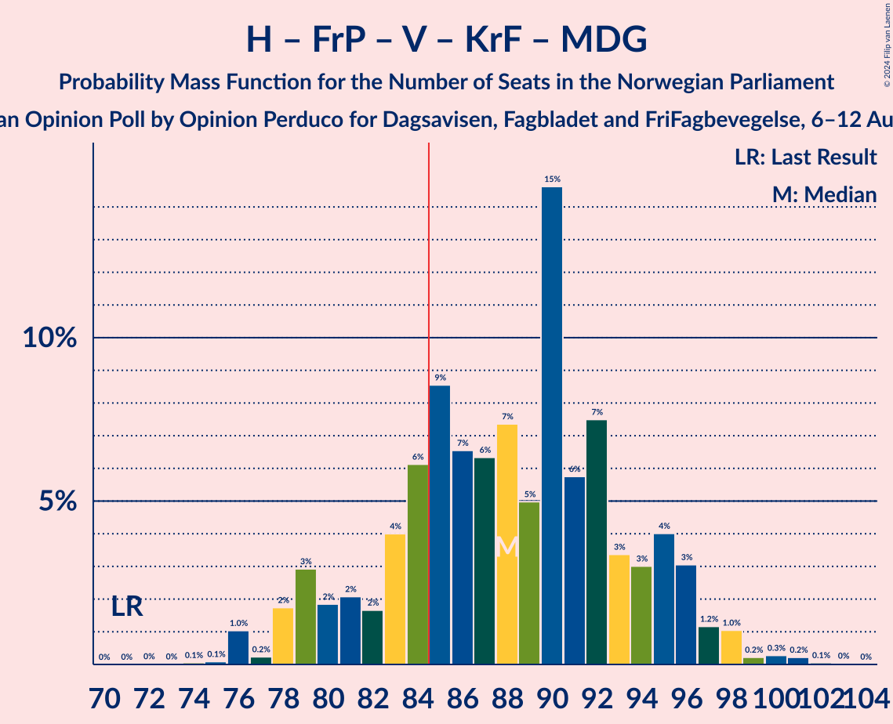

| Number of Seats | Probability | Accumulated | Special Marks |
|:---------------:|:-----------:|:-----------:|:-------------:|
| 71 | 0% | 100% | Last Result |
| 72 | 0% | 100% |  |
| 73 | 0% | 100% |  |
| 74 | 0.1% | 100% |  |
| 75 | 0.1% | 99.9% |  |
| 76 | 1.0% | 99.8% |  |
| 77 | 0.2% | 98.8% |  |
| 78 | 2% | 98.5% |  |
| 79 | 3% | 97% |  |
| 80 | 2% | 94% |  |
| 81 | 2% | 92% |  |
| 82 | 2% | 90% |  |
| 83 | 4% | 88% |  |
| 84 | 6% | 84% |  |
| 85 | 9% | 78% | Majority |
| 86 | 7% | 70% |  |
| 87 | 6% | 63% |  |
| 88 | 7% | 57% |  |
| 89 | 5% | 49% | Median |
| 90 | 15% | 44% |  |
| 91 | 6% | 30% |  |
| 92 | 7% | 24% |  |
| 93 | 3% | 16% |  |
| 94 | 3% | 13% |  |
| 95 | 4% | 10% |  |
| 96 | 3% | 6% |  |
| 97 | 1.2% | 3% |  |
| 98 | 1.0% | 2% |  |
| 99 | 0.2% | 0.8% |  |
| 100 | 0.3% | 0.6% |  |
| 101 | 0.2% | 0.3% |  |
| 102 | 0.1% | 0.1% |  |
| 103 | 0% | 0.1% |  |
| 104 | 0% | 0% |  |

### Høyre – Fremskrittspartiet – Venstre – Kristelig Folkeparti

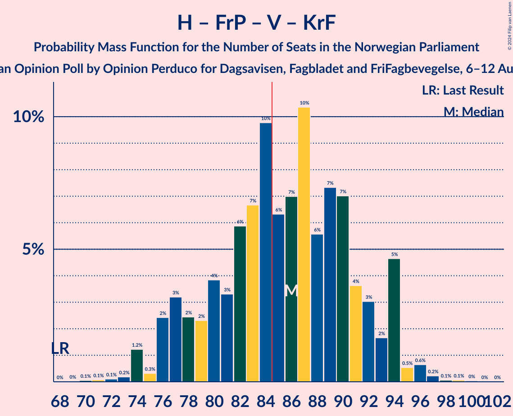

| Number of Seats | Probability | Accumulated | Special Marks |
|:---------------:|:-----------:|:-----------:|:-------------:|
| 68 | 0% | 100% | Last Result |
| 69 | 0% | 100% |  |
| 70 | 0.1% | 100% |  |
| 71 | 0.1% | 99.9% |  |
| 72 | 0.1% | 99.9% |  |
| 73 | 0.2% | 99.7% |  |
| 74 | 1.2% | 99.6% |  |
| 75 | 0.3% | 98% |  |
| 76 | 2% | 98% |  |
| 77 | 3% | 96% |  |
| 78 | 2% | 92% |  |
| 79 | 2% | 90% |  |
| 80 | 4% | 88% |  |
| 81 | 3% | 84% |  |
| 82 | 6% | 80% |  |
| 83 | 7% | 75% |  |
| 84 | 10% | 68% |  |
| 85 | 6% | 58% | Majority |
| 86 | 7% | 52% |  |
| 87 | 10% | 45% | Median |
| 88 | 6% | 34% |  |
| 89 | 7% | 29% |  |
| 90 | 7% | 22% |  |
| 91 | 4% | 15% |  |
| 92 | 3% | 11% |  |
| 93 | 2% | 8% |  |
| 94 | 5% | 6% |  |
| 95 | 0.5% | 2% |  |
| 96 | 0.6% | 1.1% |  |
| 97 | 0.2% | 0.4% |  |
| 98 | 0.1% | 0.2% |  |
| 99 | 0.1% | 0.1% |  |
| 100 | 0% | 0.1% |  |
| 101 | 0% | 0% |  |

### Høyre – Fremskrittspartiet – Venstre

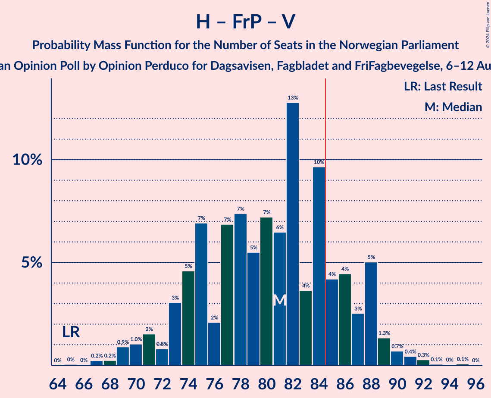

| Number of Seats | Probability | Accumulated | Special Marks |
|:---------------:|:-----------:|:-----------:|:-------------:|
| 65 | 0% | 100% | Last Result |
| 66 | 0% | 99.9% |  |
| 67 | 0.2% | 99.9% |  |
| 68 | 0.2% | 99.7% |  |
| 69 | 0.9% | 99.5% |  |
| 70 | 1.0% | 98.6% |  |
| 71 | 2% | 98% |  |
| 72 | 0.8% | 96% |  |
| 73 | 3% | 95% |  |
| 74 | 5% | 92% |  |
| 75 | 7% | 88% |  |
| 76 | 2% | 81% |  |
| 77 | 7% | 79% |  |
| 78 | 7% | 72% |  |
| 79 | 5% | 64% |  |
| 80 | 7% | 59% |  |
| 81 | 6% | 52% | Median |
| 82 | 13% | 45% |  |
| 83 | 4% | 32% |  |
| 84 | 10% | 29% |  |
| 85 | 4% | 19% | Majority |
| 86 | 4% | 15% |  |
| 87 | 3% | 10% |  |
| 88 | 5% | 8% |  |
| 89 | 1.3% | 3% |  |
| 90 | 0.7% | 2% |  |
| 91 | 0.4% | 0.9% |  |
| 92 | 0.3% | 0.4% |  |
| 93 | 0.1% | 0.2% |  |
| 94 | 0% | 0.1% |  |
| 95 | 0.1% | 0.1% |  |
| 96 | 0% | 0% |  |

### Arbeiderpartiet – Sosialistisk Venstreparti – Rødt – Senterpartiet – Miljøpartiet De Grønne

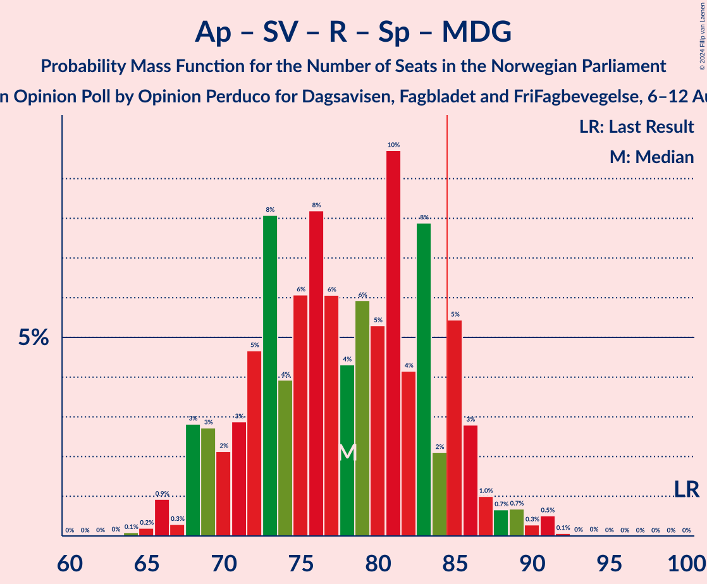

| Number of Seats | Probability | Accumulated | Special Marks |
|:---------------:|:-----------:|:-----------:|:-------------:|
| 64 | 0.1% | 100% |  |
| 65 | 0.2% | 99.9% |  |
| 66 | 0.9% | 99.7% |  |
| 67 | 0.3% | 98.7% |  |
| 68 | 3% | 98% |  |
| 69 | 3% | 96% |  |
| 70 | 2% | 93% |  |
| 71 | 3% | 91% |  |
| 72 | 5% | 88% |  |
| 73 | 8% | 83% |  |
| 74 | 4% | 75% |  |
| 75 | 6% | 71% |  |
| 76 | 8% | 65% |  |
| 77 | 6% | 57% |  |
| 78 | 4% | 51% | Median |
| 79 | 6% | 47% |  |
| 80 | 5% | 41% |  |
| 81 | 10% | 35% |  |
| 82 | 4% | 26% |  |
| 83 | 8% | 21% |  |
| 84 | 2% | 14% |  |
| 85 | 5% | 11% | Majority |
| 86 | 3% | 6% |  |
| 87 | 1.0% | 3% |  |
| 88 | 0.7% | 2% |  |
| 89 | 0.7% | 2% |  |
| 90 | 0.3% | 0.9% |  |
| 91 | 0.5% | 0.6% |  |
| 92 | 0.1% | 0.1% |  |
| 93 | 0% | 0.1% |  |
| 94 | 0% | 0% |  |
| 95 | 0% | 0% |  |
| 96 | 0% | 0% |  |
| 97 | 0% | 0% |  |
| 98 | 0% | 0% |  |
| 99 | 0% | 0% |  |
| 100 | 0% | 0% | Last Result |

### Arbeiderpartiet – Sosialistisk Venstreparti – Rødt – Senterpartiet

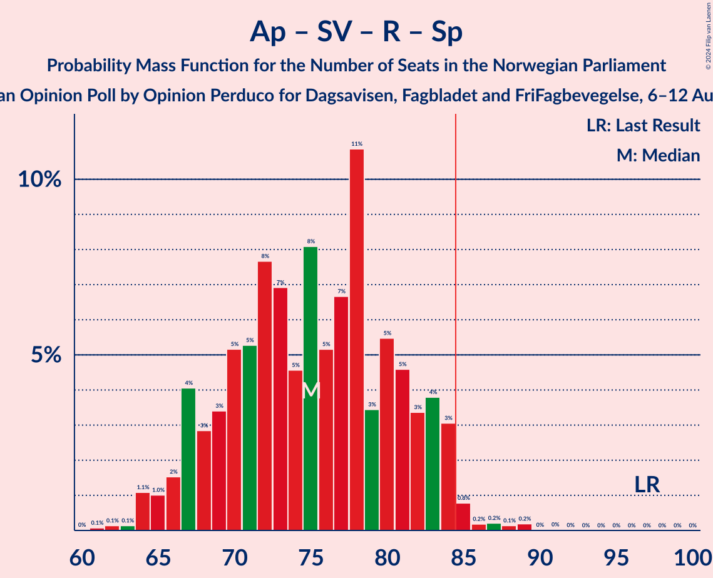

| Number of Seats | Probability | Accumulated | Special Marks |
|:---------------:|:-----------:|:-----------:|:-------------:|
| 61 | 0.1% | 100% |  |
| 62 | 0.1% | 99.9% |  |
| 63 | 0.1% | 99.8% |  |
| 64 | 1.1% | 99.6% |  |
| 65 | 1.0% | 98.5% |  |
| 66 | 2% | 98% |  |
| 67 | 4% | 96% |  |
| 68 | 3% | 92% |  |
| 69 | 3% | 89% |  |
| 70 | 5% | 86% |  |
| 71 | 5% | 81% |  |
| 72 | 8% | 75% |  |
| 73 | 7% | 68% |  |
| 74 | 5% | 61% |  |
| 75 | 8% | 56% |  |
| 76 | 5% | 48% | Median |
| 77 | 7% | 43% |  |
| 78 | 11% | 36% |  |
| 79 | 3% | 25% |  |
| 80 | 5% | 22% |  |
| 81 | 5% | 16% |  |
| 82 | 3% | 12% |  |
| 83 | 4% | 8% |  |
| 84 | 3% | 5% |  |
| 85 | 0.8% | 2% | Majority |
| 86 | 0.2% | 0.8% |  |
| 87 | 0.2% | 0.6% |  |
| 88 | 0.1% | 0.4% |  |
| 89 | 0.2% | 0.2% |  |
| 90 | 0% | 0.1% |  |
| 91 | 0% | 0% |  |
| 92 | 0% | 0% |  |
| 93 | 0% | 0% |  |
| 94 | 0% | 0% |  |
| 95 | 0% | 0% |  |
| 96 | 0% | 0% |  |
| 97 | 0% | 0% | Last Result |

### Høyre – Fremskrittspartiet

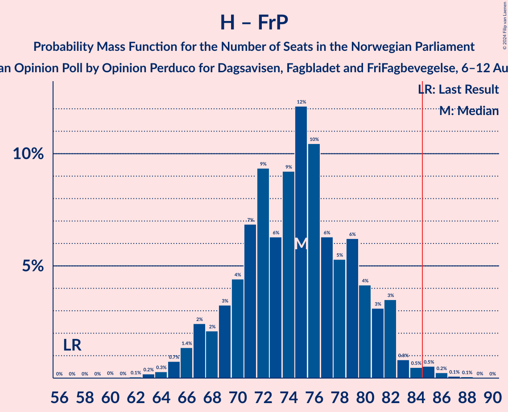

| Number of Seats | Probability | Accumulated | Special Marks |
|:---------------:|:-----------:|:-----------:|:-------------:|
| 57 | 0% | 100% | Last Result |
| 58 | 0% | 100% |  |
| 59 | 0% | 100% |  |
| 60 | 0% | 100% |  |
| 61 | 0% | 100% |  |
| 62 | 0.1% | 100% |  |
| 63 | 0.2% | 99.9% |  |
| 64 | 0.3% | 99.7% |  |
| 65 | 0.7% | 99.4% |  |
| 66 | 1.4% | 98.7% |  |
| 67 | 2% | 97% |  |
| 68 | 2% | 95% |  |
| 69 | 3% | 93% |  |
| 70 | 4% | 90% |  |
| 71 | 7% | 85% |  |
| 72 | 9% | 78% |  |
| 73 | 6% | 69% |  |
| 74 | 9% | 63% | Median |
| 75 | 12% | 53% |  |
| 76 | 10% | 41% |  |
| 77 | 6% | 31% |  |
| 78 | 5% | 25% |  |
| 79 | 6% | 19% |  |
| 80 | 4% | 13% |  |
| 81 | 3% | 9% |  |
| 82 | 3% | 6% |  |
| 83 | 0.8% | 2% |  |
| 84 | 0.5% | 1.4% |  |
| 85 | 0.5% | 0.9% | Majority |
| 86 | 0.2% | 0.4% |  |
| 87 | 0.1% | 0.2% |  |
| 88 | 0.1% | 0.1% |  |
| 89 | 0% | 0% |  |

### Arbeiderpartiet – Sosialistisk Venstreparti – Senterpartiet – Kristelig Folkeparti – Miljøpartiet De Grønne

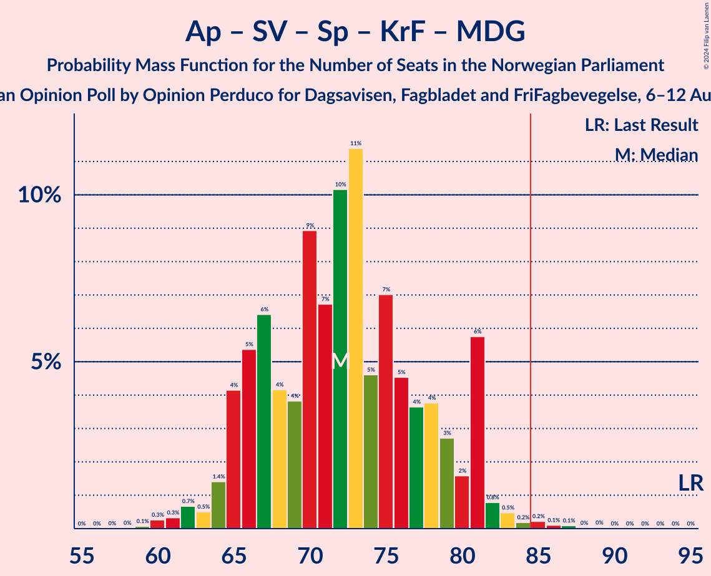

| Number of Seats | Probability | Accumulated | Special Marks |
|:---------------:|:-----------:|:-----------:|:-------------:|
| 59 | 0.1% | 100% |  |
| 60 | 0.3% | 99.9% |  |
| 61 | 0.3% | 99.6% |  |
| 62 | 0.7% | 99.3% |  |
| 63 | 0.5% | 98.6% |  |
| 64 | 1.4% | 98% |  |
| 65 | 4% | 97% |  |
| 66 | 5% | 93% |  |
| 67 | 6% | 87% |  |
| 68 | 4% | 81% |  |
| 69 | 4% | 77% |  |
| 70 | 9% | 73% |  |
| 71 | 7% | 64% |  |
| 72 | 10% | 57% |  |
| 73 | 11% | 47% | Median |
| 74 | 5% | 36% |  |
| 75 | 7% | 31% |  |
| 76 | 5% | 24% |  |
| 77 | 4% | 19% |  |
| 78 | 4% | 16% |  |
| 79 | 3% | 12% |  |
| 80 | 2% | 9% |  |
| 81 | 6% | 8% |  |
| 82 | 0.8% | 2% |  |
| 83 | 0.5% | 1.1% |  |
| 84 | 0.2% | 0.7% |  |
| 85 | 0.2% | 0.5% | Majority |
| 86 | 0.1% | 0.2% |  |
| 87 | 0.1% | 0.1% |  |
| 88 | 0% | 0.1% |  |
| 89 | 0% | 0% |  |
| 90 | 0% | 0% |  |
| 91 | 0% | 0% |  |
| 92 | 0% | 0% |  |
| 93 | 0% | 0% |  |
| 94 | 0% | 0% |  |
| 95 | 0% | 0% | Last Result |

### Arbeiderpartiet – Sosialistisk Venstreparti – Rødt – Miljøpartiet De Grønne

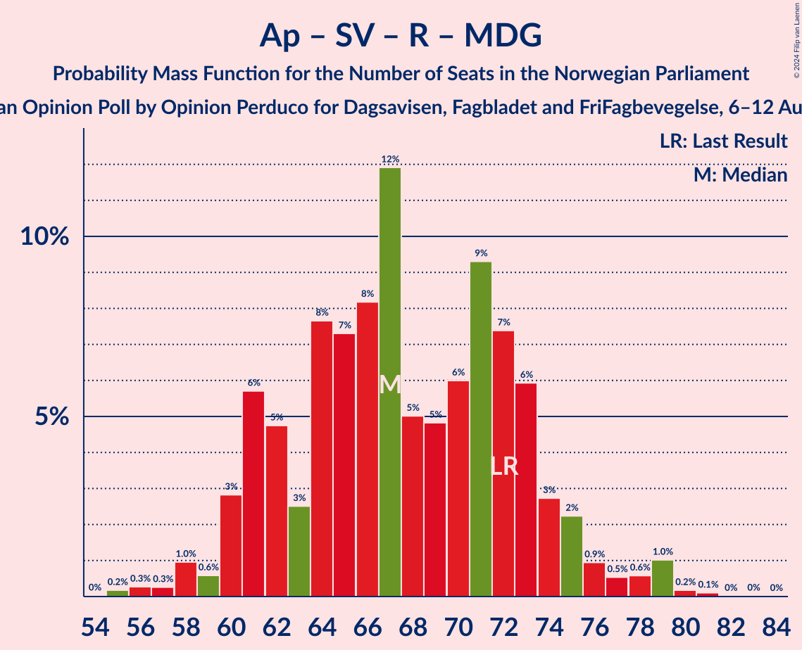

| Number of Seats | Probability | Accumulated | Special Marks |
|:---------------:|:-----------:|:-----------:|:-------------:|
| 55 | 0.2% | 100% |  |
| 56 | 0.3% | 99.8% |  |
| 57 | 0.3% | 99.5% |  |
| 58 | 1.0% | 99.2% |  |
| 59 | 0.6% | 98% |  |
| 60 | 3% | 98% |  |
| 61 | 6% | 95% |  |
| 62 | 5% | 89% |  |
| 63 | 3% | 84% |  |
| 64 | 8% | 82% |  |
| 65 | 7% | 74% |  |
| 66 | 8% | 67% |  |
| 67 | 12% | 59% |  |
| 68 | 5% | 47% | Median |
| 69 | 5% | 42% |  |
| 70 | 6% | 37% |  |
| 71 | 9% | 31% |  |
| 72 | 7% | 22% | Last Result |
| 73 | 6% | 14% |  |
| 74 | 3% | 8% |  |
| 75 | 2% | 6% |  |
| 76 | 0.9% | 3% |  |
| 77 | 0.5% | 2% |  |
| 78 | 0.6% | 2% |  |
| 79 | 1.0% | 1.4% |  |
| 80 | 0.2% | 0.3% |  |
| 81 | 0.1% | 0.2% |  |
| 82 | 0% | 0.1% |  |
| 83 | 0% | 0% |  |

### Arbeiderpartiet – Sosialistisk Venstreparti – Senterpartiet – Miljøpartiet De Grønne

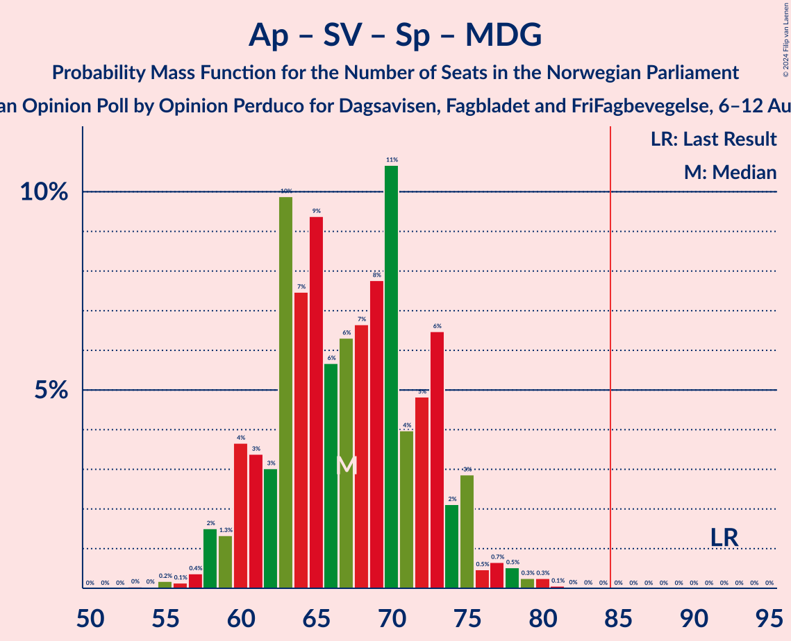

| Number of Seats | Probability | Accumulated | Special Marks |
|:---------------:|:-----------:|:-----------:|:-------------:|
| 54 | 0% | 100% |  |
| 55 | 0.2% | 99.9% |  |
| 56 | 0.1% | 99.7% |  |
| 57 | 0.4% | 99.6% |  |
| 58 | 2% | 99.2% |  |
| 59 | 1.3% | 98% |  |
| 60 | 4% | 96% |  |
| 61 | 3% | 93% |  |
| 62 | 3% | 89% |  |
| 63 | 10% | 86% |  |
| 64 | 7% | 76% |  |
| 65 | 9% | 69% |  |
| 66 | 6% | 60% |  |
| 67 | 6% | 54% | Median |
| 68 | 7% | 48% |  |
| 69 | 8% | 41% |  |
| 70 | 11% | 33% |  |
| 71 | 4% | 23% |  |
| 72 | 5% | 19% |  |
| 73 | 6% | 14% |  |
| 74 | 2% | 7% |  |
| 75 | 3% | 5% |  |
| 76 | 0.5% | 2% |  |
| 77 | 0.7% | 2% |  |
| 78 | 0.5% | 1.1% |  |
| 79 | 0.3% | 0.6% |  |
| 80 | 0.3% | 0.3% |  |
| 81 | 0.1% | 0.1% |  |
| 82 | 0% | 0% |  |
| 83 | 0% | 0% |  |
| 84 | 0% | 0% |  |
| 85 | 0% | 0% | Majority |
| 86 | 0% | 0% |  |
| 87 | 0% | 0% |  |
| 88 | 0% | 0% |  |
| 89 | 0% | 0% |  |
| 90 | 0% | 0% |  |
| 91 | 0% | 0% |  |
| 92 | 0% | 0% | Last Result |

### Arbeiderpartiet – Sosialistisk Venstreparti – Senterpartiet

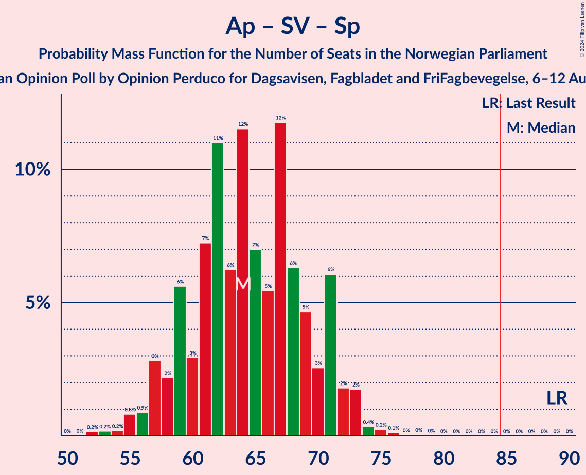

| Number of Seats | Probability | Accumulated | Special Marks |
|:---------------:|:-----------:|:-----------:|:-------------:|
| 52 | 0.2% | 100% |  |
| 53 | 0.2% | 99.8% |  |
| 54 | 0.2% | 99.6% |  |
| 55 | 0.8% | 99.4% |  |
| 56 | 0.9% | 98.6% |  |
| 57 | 3% | 98% |  |
| 58 | 2% | 95% |  |
| 59 | 6% | 93% |  |
| 60 | 3% | 87% |  |
| 61 | 7% | 84% |  |
| 62 | 11% | 77% |  |
| 63 | 6% | 66% |  |
| 64 | 12% | 60% |  |
| 65 | 7% | 48% | Median |
| 66 | 5% | 41% |  |
| 67 | 12% | 36% |  |
| 68 | 6% | 24% |  |
| 69 | 5% | 18% |  |
| 70 | 3% | 13% |  |
| 71 | 6% | 10% |  |
| 72 | 2% | 4% |  |
| 73 | 2% | 3% |  |
| 74 | 0.4% | 0.8% |  |
| 75 | 0.2% | 0.5% |  |
| 76 | 0.1% | 0.2% |  |
| 77 | 0% | 0.1% |  |
| 78 | 0% | 0.1% |  |
| 79 | 0% | 0% |  |
| 80 | 0% | 0% |  |
| 81 | 0% | 0% |  |
| 82 | 0% | 0% |  |
| 83 | 0% | 0% |  |
| 84 | 0% | 0% |  |
| 85 | 0% | 0% | Majority |
| 86 | 0% | 0% |  |
| 87 | 0% | 0% |  |
| 88 | 0% | 0% |  |
| 89 | 0% | 0% | Last Result |

### Høyre – Venstre – Kristelig Folkeparti

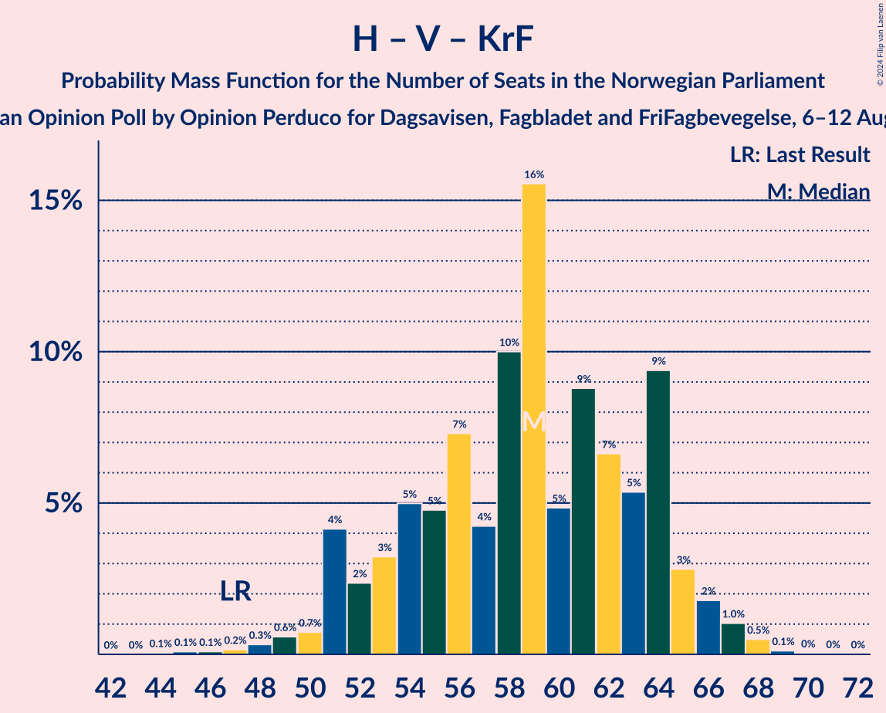

| Number of Seats | Probability | Accumulated | Special Marks |
|:---------------:|:-----------:|:-----------:|:-------------:|
| 44 | 0.1% | 100% |  |
| 45 | 0.1% | 99.9% |  |
| 46 | 0.1% | 99.9% |  |
| 47 | 0.2% | 99.8% | Last Result |
| 48 | 0.3% | 99.6% |  |
| 49 | 0.6% | 99.3% |  |
| 50 | 0.7% | 98.7% |  |
| 51 | 4% | 98% |  |
| 52 | 2% | 94% |  |
| 53 | 3% | 91% |  |
| 54 | 5% | 88% |  |
| 55 | 5% | 83% |  |
| 56 | 7% | 78% |  |
| 57 | 4% | 71% |  |
| 58 | 10% | 67% |  |
| 59 | 16% | 57% |  |
| 60 | 5% | 41% |  |
| 61 | 9% | 37% | Median |
| 62 | 7% | 28% |  |
| 63 | 5% | 21% |  |
| 64 | 9% | 16% |  |
| 65 | 3% | 6% |  |
| 66 | 2% | 4% |  |
| 67 | 1.0% | 2% |  |
| 68 | 0.5% | 0.7% |  |
| 69 | 0.1% | 0.2% |  |
| 70 | 0% | 0.1% |  |
| 71 | 0% | 0.1% |  |
| 72 | 0% | 0% |  |

### Arbeiderpartiet – Senterpartiet – Kristelig Folkeparti – Miljøpartiet De Grønne

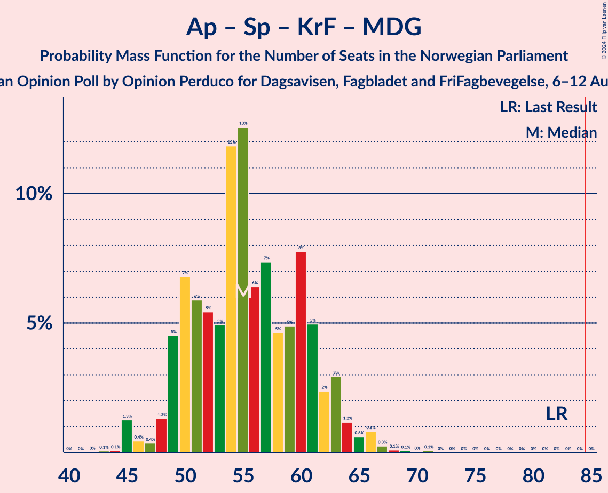

| Number of Seats | Probability | Accumulated | Special Marks |
|:---------------:|:-----------:|:-----------:|:-------------:|
| 43 | 0.1% | 100% |  |
| 44 | 0.1% | 99.9% |  |
| 45 | 1.3% | 99.8% |  |
| 46 | 0.4% | 98.6% |  |
| 47 | 0.4% | 98% |  |
| 48 | 1.3% | 98% |  |
| 49 | 5% | 96% |  |
| 50 | 7% | 92% |  |
| 51 | 6% | 85% |  |
| 52 | 5% | 79% |  |
| 53 | 5% | 74% |  |
| 54 | 12% | 69% |  |
| 55 | 13% | 57% |  |
| 56 | 6% | 44% | Median |
| 57 | 7% | 38% |  |
| 58 | 5% | 31% |  |
| 59 | 5% | 26% |  |
| 60 | 8% | 21% |  |
| 61 | 5% | 13% |  |
| 62 | 2% | 8% |  |
| 63 | 3% | 6% |  |
| 64 | 1.2% | 3% |  |
| 65 | 0.6% | 2% |  |
| 66 | 0.8% | 1.3% |  |
| 67 | 0.3% | 0.5% |  |
| 68 | 0.1% | 0.3% |  |
| 69 | 0.1% | 0.2% |  |
| 70 | 0% | 0.1% |  |
| 71 | 0.1% | 0.1% |  |
| 72 | 0% | 0% |  |
| 73 | 0% | 0% |  |
| 74 | 0% | 0% |  |
| 75 | 0% | 0% |  |
| 76 | 0% | 0% |  |
| 77 | 0% | 0% |  |
| 78 | 0% | 0% |  |
| 79 | 0% | 0% |  |
| 80 | 0% | 0% |  |
| 81 | 0% | 0% |  |
| 82 | 0% | 0% | Last Result |

### Arbeiderpartiet – Sosialistisk Venstreparti

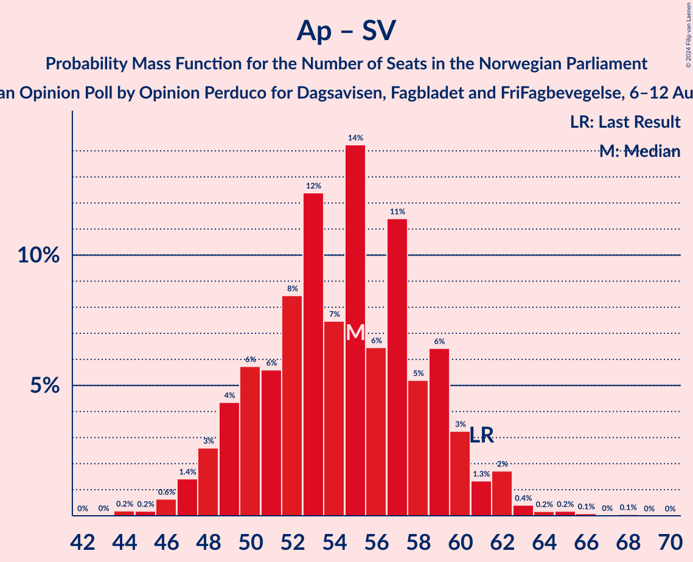

| Number of Seats | Probability | Accumulated | Special Marks |
|:---------------:|:-----------:|:-----------:|:-------------:|
| 44 | 0.2% | 100% |  |
| 45 | 0.2% | 99.8% |  |
| 46 | 0.6% | 99.6% |  |
| 47 | 1.4% | 99.0% |  |
| 48 | 3% | 98% |  |
| 49 | 4% | 95% |  |
| 50 | 6% | 91% |  |
| 51 | 6% | 85% |  |
| 52 | 8% | 79% |  |
| 53 | 12% | 71% |  |
| 54 | 7% | 58% |  |
| 55 | 14% | 51% | Median |
| 56 | 6% | 37% |  |
| 57 | 11% | 30% |  |
| 58 | 5% | 19% |  |
| 59 | 6% | 14% |  |
| 60 | 3% | 7% |  |
| 61 | 1.3% | 4% | Last Result |
| 62 | 2% | 3% |  |
| 63 | 0.4% | 0.9% |  |
| 64 | 0.2% | 0.5% |  |
| 65 | 0.2% | 0.3% |  |
| 66 | 0.1% | 0.2% |  |
| 67 | 0% | 0.1% |  |
| 68 | 0.1% | 0.1% |  |
| 69 | 0% | 0% |  |

### Arbeiderpartiet – Senterpartiet – Kristelig Folkeparti

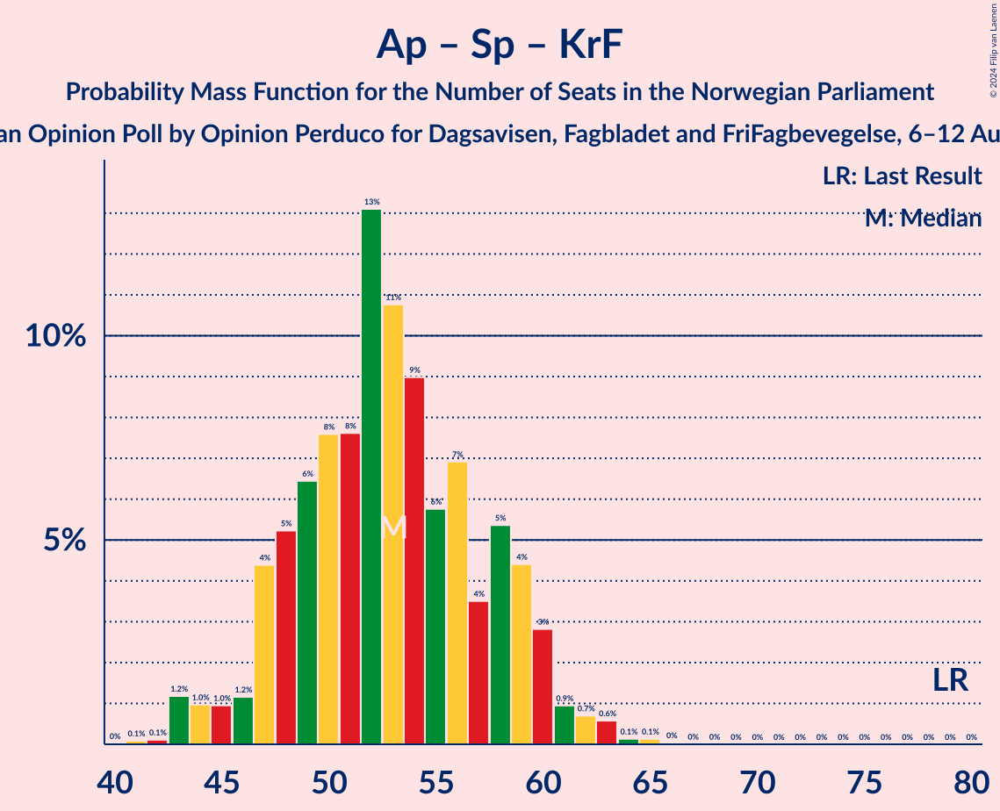

| Number of Seats | Probability | Accumulated | Special Marks |
|:---------------:|:-----------:|:-----------:|:-------------:|
| 41 | 0.1% | 100% |  |
| 42 | 0.1% | 99.9% |  |
| 43 | 1.2% | 99.8% |  |
| 44 | 1.0% | 98.6% |  |
| 45 | 1.0% | 98% |  |
| 46 | 1.2% | 97% |  |
| 47 | 4% | 95% |  |
| 48 | 5% | 91% |  |
| 49 | 6% | 86% |  |
| 50 | 8% | 79% |  |
| 51 | 8% | 72% |  |
| 52 | 13% | 64% |  |
| 53 | 11% | 51% |  |
| 54 | 9% | 40% | Median |
| 55 | 6% | 31% |  |
| 56 | 7% | 26% |  |
| 57 | 4% | 19% |  |
| 58 | 5% | 15% |  |
| 59 | 4% | 10% |  |
| 60 | 3% | 5% |  |
| 61 | 0.9% | 3% |  |
| 62 | 0.7% | 2% |  |
| 63 | 0.6% | 0.9% |  |
| 64 | 0.1% | 0.3% |  |
| 65 | 0.1% | 0.2% |  |
| 66 | 0% | 0.1% |  |
| 67 | 0% | 0% |  |
| 68 | 0% | 0% |  |
| 69 | 0% | 0% |  |
| 70 | 0% | 0% |  |
| 71 | 0% | 0% |  |
| 72 | 0% | 0% |  |
| 73 | 0% | 0% |  |
| 74 | 0% | 0% |  |
| 75 | 0% | 0% |  |
| 76 | 0% | 0% |  |
| 77 | 0% | 0% |  |
| 78 | 0% | 0% |  |
| 79 | 0% | 0% | Last Result |

### Arbeiderpartiet – Senterpartiet

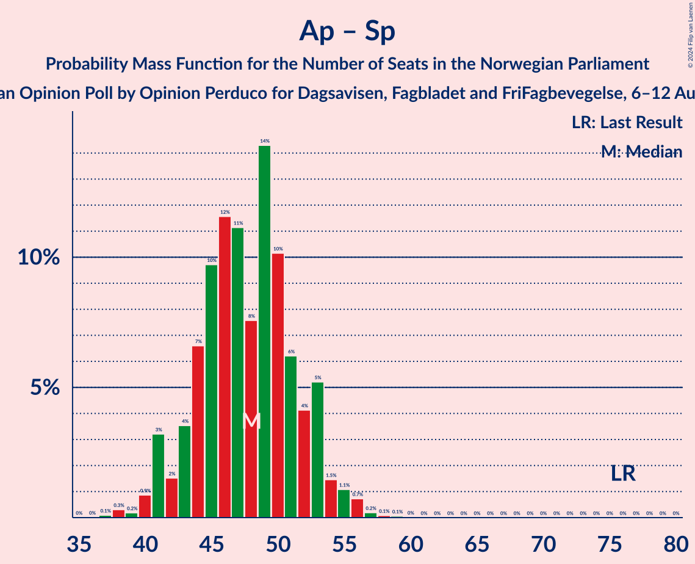

| Number of Seats | Probability | Accumulated | Special Marks |
|:---------------:|:-----------:|:-----------:|:-------------:|
| 37 | 0.1% | 100% |  |
| 38 | 0.3% | 99.9% |  |
| 39 | 0.2% | 99.6% |  |
| 40 | 0.9% | 99.4% |  |
| 41 | 3% | 98.5% |  |
| 42 | 2% | 95% |  |
| 43 | 4% | 94% |  |
| 44 | 7% | 90% |  |
| 45 | 10% | 84% |  |
| 46 | 12% | 74% |  |
| 47 | 11% | 62% |  |
| 48 | 8% | 51% | Median |
| 49 | 14% | 44% |  |
| 50 | 10% | 29% |  |
| 51 | 6% | 19% |  |
| 52 | 4% | 13% |  |
| 53 | 5% | 9% |  |
| 54 | 1.5% | 4% |  |
| 55 | 1.1% | 2% |  |
| 56 | 0.7% | 1.1% |  |
| 57 | 0.2% | 0.4% |  |
| 58 | 0.1% | 0.2% |  |
| 59 | 0.1% | 0.1% |  |
| 60 | 0% | 0% |  |
| 61 | 0% | 0% |  |
| 62 | 0% | 0% |  |
| 63 | 0% | 0% |  |
| 64 | 0% | 0% |  |
| 65 | 0% | 0% |  |
| 66 | 0% | 0% |  |
| 67 | 0% | 0% |  |
| 68 | 0% | 0% |  |
| 69 | 0% | 0% |  |
| 70 | 0% | 0% |  |
| 71 | 0% | 0% |  |
| 72 | 0% | 0% |  |
| 73 | 0% | 0% |  |
| 74 | 0% | 0% |  |
| 75 | 0% | 0% |  |
| 76 | 0% | 0% | Last Result |

### Senterpartiet – Venstre – Kristelig Folkeparti

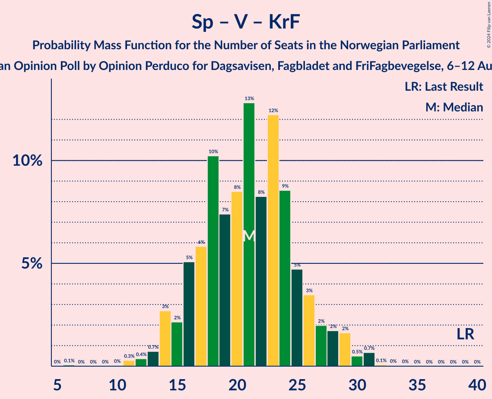

| Number of Seats | Probability | Accumulated | Special Marks |
|:---------------:|:-----------:|:-----------:|:-------------:|
| 6 | 0.1% | 100% |  |
| 7 | 0% | 99.9% |  |
| 8 | 0% | 99.9% |  |
| 9 | 0% | 99.9% |  |
| 10 | 0% | 99.9% |  |
| 11 | 0.3% | 99.9% |  |
| 12 | 0.4% | 99.6% |  |
| 13 | 0.7% | 99.2% |  |
| 14 | 3% | 98.5% |  |
| 15 | 2% | 96% |  |
| 16 | 5% | 94% |  |
| 17 | 6% | 89% |  |
| 18 | 10% | 83% |  |
| 19 | 7% | 73% |  |
| 20 | 8% | 65% |  |
| 21 | 13% | 57% |  |
| 22 | 8% | 44% |  |
| 23 | 12% | 36% | Median |
| 24 | 9% | 23% |  |
| 25 | 5% | 15% |  |
| 26 | 3% | 10% |  |
| 27 | 2% | 7% |  |
| 28 | 2% | 5% |  |
| 29 | 2% | 3% |  |
| 30 | 0.5% | 1.3% |  |
| 31 | 0.7% | 0.8% |  |
| 32 | 0.1% | 0.1% |  |
| 33 | 0% | 0.1% |  |
| 34 | 0% | 0% |  |
| 35 | 0% | 0% |  |
| 36 | 0% | 0% |  |
| 37 | 0% | 0% |  |
| 38 | 0% | 0% |  |
| 39 | 0% | 0% | Last Result |

## Technical Information

### Opinion Poll

+ **Polling firm:** Opinion Perduco
+ **Commissioner(s):** Dagsavisen, Fagbladet and FriFagbevegelse
+ **Fieldwork period:** 6–12 August 2024

### Calculations

+ **Sample size:** 700
+ **Simulations done:** 1,048,576
+ **Error estimate:** 1.91%

