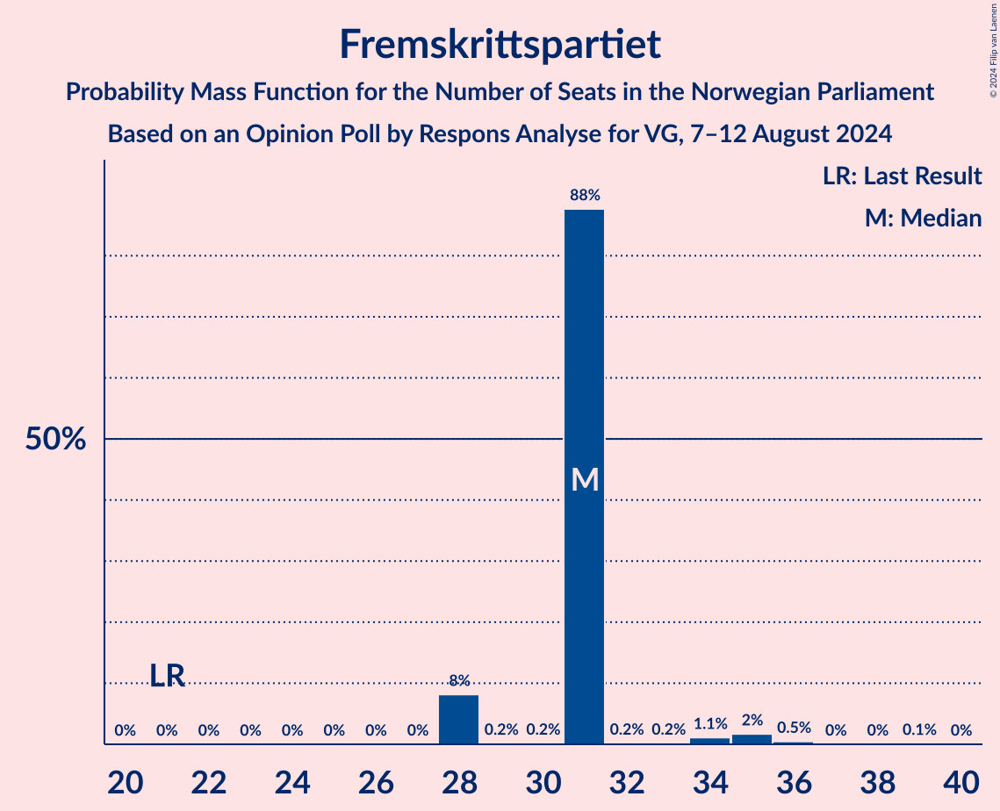
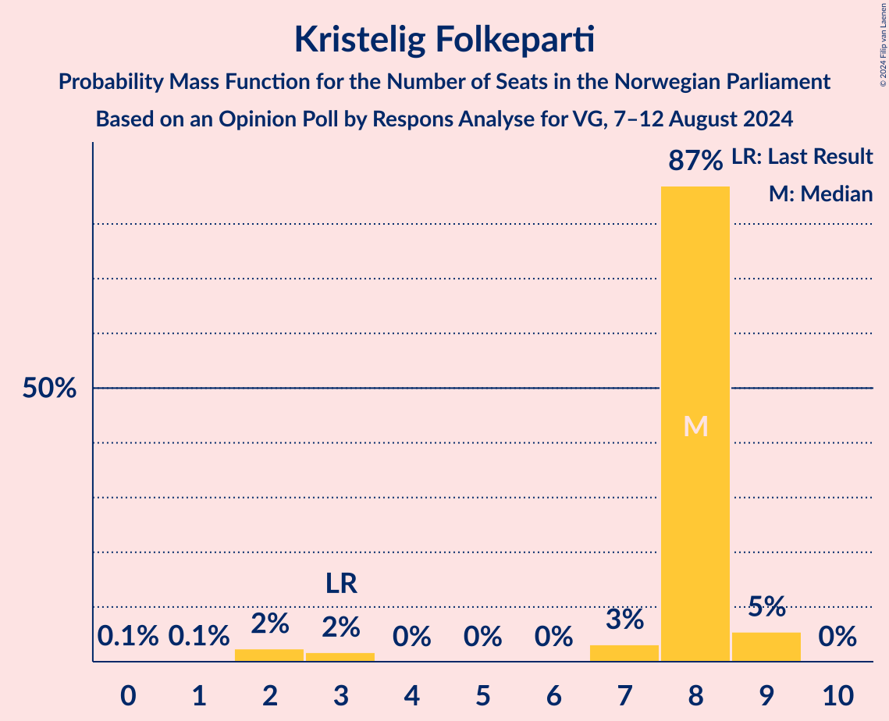
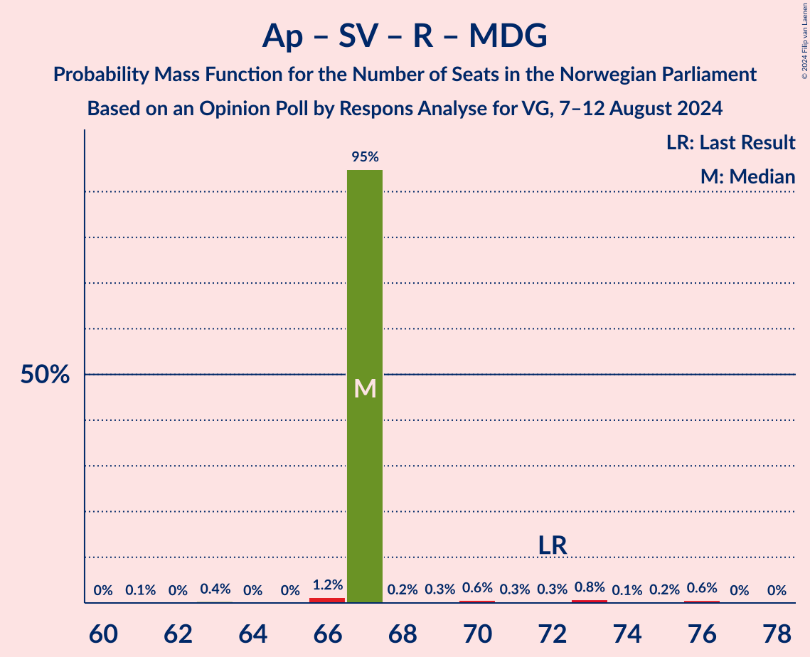

# Opinion Poll by Respons Analyse for VG, 7–12 August 2024

<a href="#voting-intentions">Voting Intentions</a> | <a href="#seats">Seats</a> | <a href="#coalitions">Coalitions</a> | <a href="#technical-information">Technical Information</a>

## Voting Intentions

### Confidence Intervals

| Party | Last Result | Poll Result | 80% Confidence Interval | 90% Confidence Interval | 95% Confidence Interval | 99% Confidence Interval |
|:-----:|:-----------:|:-----------:|:-----------------------:|:-----------------------:|:-----------------------:|:-----------------------:|
| Høyre | 20.4% | 24.5% | 22.8–26.3% |22.3–26.8% |21.9–27.3% |21.1–28.2% |
| Arbeiderpartiet | 26.2% | 22.0% | 20.4–23.7% |19.9–24.2% |19.5–24.7% |18.8–25.5% |
| Fremskrittspartiet | 11.6% | 17.5% | 16.0–19.1% |15.6–19.6% |15.3–20.0% |14.6–20.8% |
| Sosialistisk Venstreparti | 7.6% | 10.0% | 8.9–11.3% |8.6–11.7% |8.3–12.0% |7.8–12.7% |
| Rødt | 4.7% | 5.7% | 4.9–6.8% |4.6–7.1% |4.4–7.3% |4.1–7.9% |
| Senterpartiet | 13.5% | 5.4% | 4.6–6.4% |4.3–6.7% |4.2–7.0% |3.8–7.5% |
| Venstre | 4.6% | 5.3% | 4.5–6.3% |4.3–6.6% |4.1–6.9% |3.7–7.4% |
| Kristelig Folkeparti | 3.8% | 3.3% | 2.7–4.1% |2.5–4.4% |2.4–4.6% |2.1–5.0% |
| Miljøpartiet De Grønne | 3.9% | 2.3% | 1.8–3.0% |1.6–3.2% |1.5–3.4% |1.3–3.8% |
| Industri- og Næringspartiet | 0.3% | 1.2% | 0.9–1.8% |0.8–1.9% |0.7–2.1% |0.5–2.4% |
| Norgesdemokratene | 1.1% | 0.9% | 0.6–1.4% |0.5–1.6% |0.5–1.7% |0.4–2.0% |
| Liberalistene | 0.2% | 0.6% | 0.4–1.1% |0.3–1.2% |0.3–1.3% |0.2–1.6% |
| Pensjonistpartiet | 0.6% | 0.5% | 0.3–0.9% |0.3–1.1% |0.2–1.2% |0.2–1.4% |
| Kystpartiet | 0.0% | 0.3% | 0.2–0.7% |0.1–0.8% |0.1–0.9% |0.1–1.1% |
| Konservativt | 0.4% | 0.3% | 0.2–0.7% |0.1–0.8% |0.1–0.9% |0.1–1.1% |

*Note:* The poll result column reflects the actual value used in the calculations. Published results may vary slightly, and in addition be rounded to fewer digits.

## Seats

### Confidence Intervals

| Party | Last Result | Median | 80% Confidence Interval | 90% Confidence Interval | 95% Confidence Interval | 99% Confidence Interval |
|:-----:|:-----------:|:------:|:-----------------------:|:-----------------------:|:-----------------------:|:-----------------------:|
| <a href="#høyre">Høyre</a> | 36 | 44 | 39–47 |38–47 |38–49 |38–53 |
| <a href="#arbeiderpartiet">Arbeiderpartiet</a> | 48 | 43 | 38–46 |38–49 |34–49 |33–49 |
| <a href="#fremskrittspartiet">Fremskrittspartiet</a> | 21 | 34 | 28–36 |28–36 |28–38 |28–40 |
| <a href="#sosialistisk-venstreparti">Sosialistisk Venstreparti</a> | 13 | 16 | 14–19 |11–20 |11–22 |11–22 |
| <a href="#rødt">Rødt</a> | 8 | 10 | 9–12 |9–12 |8–13 |1–14 |
| <a href="#senterpartiet">Senterpartiet</a> | 28 | 9 | 8–12 |8–12 |8–12 |0–15 |
| <a href="#venstre">Venstre</a> | 8 | 8 | 3–11 |3–13 |3–13 |2–13 |
| <a href="#kristelig-folkeparti">Kristelig Folkeparti</a> | 3 | 3 | 2–7 |0–8 |0–8 |0–8 |
| <a href="#miljøpartiet-de-grønne">Miljøpartiet De Grønne</a> | 3 | 1 | 1–2 |0–2 |0–2 |0–2 |
| <a href="#industri--og-næringspartiet">Industri- og Næringspartiet</a> | 0 | 0 | 0 |0 |0 |0 |
| <a href="#norgesdemokratene">Norgesdemokratene</a> | 0 | 0 | 0 |0 |0 |0 |
| <a href="#liberalistene">Liberalistene</a> | 0 | 0 | 0 |0 |0 |0 |
| <a href="#pensjonistpartiet">Pensjonistpartiet</a> | 0 | 0 | 0 |0 |0 |0 |
| <a href="#kystpartiet">Kystpartiet</a> | 0 | 0 | 0–1 |0–1 |0–1 |0–2 |
| <a href="#konservativt">Konservativt</a> | 0 | 0 | 0 |0 |0 |0 |

### Høyre

*For a full overview of the results for this party, see the [Høyre](party-høyre.html) page.*

| Number of Seats | Probability | Accumulated | Special Marks |
|:---------------:|:-----------:|:-----------:|:-------------:|
| 36 | 0% | 100% | Last Result |
| 37 | 0% | 100% |  |
| 38 | 7% | 100% |  |
| 39 | 26% | 93% |  |
| 40 | 2% | 67% |  |
| 41 | 1.4% | 66% |  |
| 42 | 2% | 64% |  |
| 43 | 2% | 62% |  |
| 44 | 37% | 60% | Median |
| 45 | 0.3% | 24% |  |
| 46 | 5% | 23% |  |
| 47 | 14% | 18% |  |
| 48 | 1.2% | 4% |  |
| 49 | 2% | 3% |  |
| 50 | 0% | 0.6% |  |
| 51 | 0% | 0.6% |  |
| 52 | 0% | 0.6% |  |
| 53 | 0.6% | 0.6% |  |
| 54 | 0% | 0% |  |

### Arbeiderpartiet

*For a full overview of the results for this party, see the [Arbeiderpartiet](party-arbeiderpartiet.html) page.*

| Number of Seats | Probability | Accumulated | Special Marks |
|:---------------:|:-----------:|:-----------:|:-------------:|
| 33 | 1.2% | 100% |  |
| 34 | 2% | 98.8% |  |
| 35 | 0.3% | 96% |  |
| 36 | 0% | 96% |  |
| 37 | 0.9% | 96% |  |
| 38 | 7% | 95% |  |
| 39 | 0.5% | 88% |  |
| 40 | 4% | 88% |  |
| 41 | 25% | 84% |  |
| 42 | 7% | 59% |  |
| 43 | 16% | 52% | Median |
| 44 | 1.4% | 36% |  |
| 45 | 0% | 35% |  |
| 46 | 26% | 34% |  |
| 47 | 0.2% | 9% |  |
| 48 | 1.2% | 9% | Last Result |
| 49 | 7% | 7% |  |
| 50 | 0% | 0.1% |  |
| 51 | 0.1% | 0.1% |  |
| 52 | 0% | 0% |  |

### Fremskrittspartiet

*For a full overview of the results for this party, see the [Fremskrittspartiet](party-fremskrittspartiet.html) page.*

| Number of Seats | Probability | Accumulated | Special Marks |
|:---------------:|:-----------:|:-----------:|:-------------:|
| 21 | 0% | 100% | Last Result |
| 22 | 0% | 100% |  |
| 23 | 0% | 100% |  |
| 24 | 0% | 100% |  |
| 25 | 0% | 100% |  |
| 26 | 0% | 100% |  |
| 27 | 0% | 100% |  |
| 28 | 13% | 99.9% |  |
| 29 | 0% | 87% |  |
| 30 | 0.7% | 87% |  |
| 31 | 8% | 87% |  |
| 32 | 11% | 79% |  |
| 33 | 6% | 68% |  |
| 34 | 26% | 61% | Median |
| 35 | 7% | 35% |  |
| 36 | 25% | 29% |  |
| 37 | 0.7% | 3% |  |
| 38 | 0.9% | 3% |  |
| 39 | 0.9% | 2% |  |
| 40 | 0.8% | 0.8% |  |
| 41 | 0% | 0% |  |

### Sosialistisk Venstreparti

*For a full overview of the results for this party, see the [Sosialistisk Venstreparti](party-sosialistiskvenstreparti.html) page.*

| Number of Seats | Probability | Accumulated | Special Marks |
|:---------------:|:-----------:|:-----------:|:-------------:|
| 11 | 7% | 100% |  |
| 12 | 0.2% | 93% |  |
| 13 | 0.4% | 93% | Last Result |
| 14 | 6% | 92% |  |
| 15 | 9% | 87% |  |
| 16 | 31% | 77% | Median |
| 17 | 29% | 46% |  |
| 18 | 2% | 17% |  |
| 19 | 8% | 15% |  |
| 20 | 2% | 7% |  |
| 21 | 2% | 5% |  |
| 22 | 3% | 3% |  |
| 23 | 0.1% | 0.1% |  |
| 24 | 0% | 0% |  |

### Rødt

*For a full overview of the results for this party, see the [Rødt](party-rødt.html) page.*

| Number of Seats | Probability | Accumulated | Special Marks |
|:---------------:|:-----------:|:-----------:|:-------------:|
| 1 | 1.0% | 100% |  |
| 2 | 0% | 99.0% |  |
| 3 | 0% | 99.0% |  |
| 4 | 0% | 99.0% |  |
| 5 | 0% | 99.0% |  |
| 6 | 0% | 99.0% |  |
| 7 | 0.1% | 99.0% |  |
| 8 | 3% | 98.9% | Last Result |
| 9 | 14% | 96% |  |
| 10 | 32% | 82% | Median |
| 11 | 38% | 50% |  |
| 12 | 7% | 12% |  |
| 13 | 2% | 5% |  |
| 14 | 2% | 2% |  |
| 15 | 0.1% | 0.1% |  |
| 16 | 0.1% | 0.1% |  |
| 17 | 0% | 0% |  |

### Senterpartiet

*For a full overview of the results for this party, see the [Senterpartiet](party-senterpartiet.html) page.*

| Number of Seats | Probability | Accumulated | Special Marks |
|:---------------:|:-----------:|:-----------:|:-------------:|
| 0 | 1.2% | 100% |  |
| 1 | 0% | 98.8% |  |
| 2 | 0% | 98.8% |  |
| 3 | 0% | 98.7% |  |
| 4 | 0% | 98.7% |  |
| 5 | 0% | 98.7% |  |
| 6 | 0% | 98.7% |  |
| 7 | 0.1% | 98.7% |  |
| 8 | 47% | 98.6% |  |
| 9 | 3% | 52% | Median |
| 10 | 2% | 49% |  |
| 11 | 33% | 47% |  |
| 12 | 12% | 13% |  |
| 13 | 0.6% | 1.2% |  |
| 14 | 0% | 0.6% |  |
| 15 | 0.6% | 0.6% |  |
| 16 | 0% | 0% |  |
| 17 | 0% | 0% |  |
| 18 | 0% | 0% |  |
| 19 | 0% | 0% |  |
| 20 | 0% | 0% |  |
| 21 | 0% | 0% |  |
| 22 | 0% | 0% |  |
| 23 | 0% | 0% |  |
| 24 | 0% | 0% |  |
| 25 | 0% | 0% |  |
| 26 | 0% | 0% |  |
| 27 | 0% | 0% |  |
| 28 | 0% | 0% | Last Result |

### Venstre

*For a full overview of the results for this party, see the [Venstre](party-venstre.html) page.*

| Number of Seats | Probability | Accumulated | Special Marks |
|:---------------:|:-----------:|:-----------:|:-------------:|
| 2 | 0.7% | 100% |  |
| 3 | 27% | 99.3% |  |
| 4 | 0% | 73% |  |
| 5 | 0% | 73% |  |
| 6 | 0% | 73% |  |
| 7 | 7% | 73% |  |
| 8 | 27% | 66% | Last Result, Median |
| 9 | 11% | 39% |  |
| 10 | 2% | 27% |  |
| 11 | 17% | 25% |  |
| 12 | 0.1% | 8% |  |
| 13 | 8% | 8% |  |
| 14 | 0% | 0% |  |

### Kristelig Folkeparti

*For a full overview of the results for this party, see the [Kristelig Folkeparti](party-kristeligfolkeparti.html) page.*

| Number of Seats | Probability | Accumulated | Special Marks |
|:---------------:|:-----------:|:-----------:|:-------------:|
| 0 | 6% | 100% |  |
| 1 | 1.0% | 94% |  |
| 2 | 23% | 93% |  |
| 3 | 38% | 70% | Last Result, Median |
| 4 | 0% | 32% |  |
| 5 | 0% | 32% |  |
| 6 | 0% | 32% |  |
| 7 | 26% | 32% |  |
| 8 | 6% | 6% |  |
| 9 | 0.1% | 0.2% |  |
| 10 | 0% | 0% |  |

### Miljøpartiet De Grønne

*For a full overview of the results for this party, see the [Miljøpartiet De Grønne](party-miljøpartietdegrønne.html) page.*

| Number of Seats | Probability | Accumulated | Special Marks |
|:---------------:|:-----------:|:-----------:|:-------------:|
| 0 | 8% | 100% |  |
| 1 | 47% | 92% | Median |
| 2 | 45% | 45% |  |
| 3 | 0% | 0% | Last Result |

### Industri- og Næringspartiet

*For a full overview of the results for this party, see the [Industri- og Næringspartiet](party-industri-ognæringspartiet.html) page.*

| Number of Seats | Probability | Accumulated | Special Marks |
|:---------------:|:-----------:|:-----------:|:-------------:|
| 0 | 99.6% | 100% | Last Result, Median |
| 1 | 0.1% | 0.4% |  |
| 2 | 0.3% | 0.3% |  |
| 3 | 0% | 0% |  |

### Norgesdemokratene

*For a full overview of the results for this party, see the [Norgesdemokratene](party-norgesdemokratene.html) page.*

| Number of Seats | Probability | Accumulated | Special Marks |
|:---------------:|:-----------:|:-----------:|:-------------:|
| 0 | 100% | 100% | Last Result, Median |

### Liberalistene

*For a full overview of the results for this party, see the [Liberalistene](party-liberalistene.html) page.*

| Number of Seats | Probability | Accumulated | Special Marks |
|:---------------:|:-----------:|:-----------:|:-------------:|
| 0 | 100% | 100% | Last Result, Median |

### Pensjonistpartiet

*For a full overview of the results for this party, see the [Pensjonistpartiet](party-pensjonistpartiet.html) page.*

| Number of Seats | Probability | Accumulated | Special Marks |
|:---------------:|:-----------:|:-----------:|:-------------:|
| 0 | 100% | 100% | Last Result, Median |

### Kystpartiet

*For a full overview of the results for this party, see the [Kystpartiet](party-kystpartiet.html) page.*

| Number of Seats | Probability | Accumulated | Special Marks |
|:---------------:|:-----------:|:-----------:|:-------------:|
| 0 | 89% | 100% | Last Result, Median |
| 1 | 10% | 11% |  |
| 2 | 0.5% | 0.6% |  |
| 3 | 0% | 0% |  |

### Konservativt

*For a full overview of the results for this party, see the [Konservativt](party-konservativt.html) page.*

| Number of Seats | Probability | Accumulated | Special Marks |
|:---------------:|:-----------:|:-----------:|:-------------:|
| 0 | 100% | 100% | Last Result, Median |

## Coalitions

### Confidence Intervals

| Coalition | Last Result | Median | Majority? | 80% Confidence Interval | 90% Confidence Interval | 95% Confidence Interval | 99% Confidence Interval |
|:---------:|:-----------:|:------:|:---------:|:-----------------------:|:-----------------------:|:-----------------------:|:-----------------------:|
| Høyre – Fremskrittspartiet – Senterpartiet – Venstre – Kristelig Folkeparti | 96 | 98 | 100% | 94–101 | 94–101 | 92–104 | 85–108 |
| Høyre – Fremskrittspartiet – Venstre – Kristelig Folkeparti – Miljøpartiet De Grønne | 71 | 91 | 73% | 84–93 | 84–94 | 84–94 | 84–100 |
| Høyre – Fremskrittspartiet – Venstre – Kristelig Folkeparti | 68 | 89 | 71% | 83–92 | 83–93 | 83–93 | 83–99 |
| Høyre – Fremskrittspartiet – Venstre | 65 | 86 | 52% | 76–89 | 76–91 | 76–91 | 76–94 |
| Arbeiderpartiet – Sosialistisk Venstreparti – Rødt – Senterpartiet – Miljøpartiet De Grønne | 100 | 79 | 27% | 76–86 | 74–86 | 74–86 | 69–86 |
| Arbeiderpartiet – Sosialistisk Venstreparti – Rødt – Senterpartiet | 97 | 77 | 27% | 74–85 | 74–85 | 74–85 | 68–85 |
| Arbeiderpartiet – Sosialistisk Venstreparti – Senterpartiet – Kristelig Folkeparti – Miljøpartiet De Grønne | 95 | 74 | 0% | 70–82 | 64–82 | 64–82 | 62–82 |
| Høyre – Fremskrittspartiet | 57 | 77 | 0.9% | 72–80 | 72–80 | 72–81 | 72–86 |
| Arbeiderpartiet – Sosialistisk Venstreparti – Rødt – Miljøpartiet De Grønne | 72 | 70 | 0% | 67–75 | 66–75 | 64–75 | 60–84 |
| Arbeiderpartiet – Sosialistisk Venstreparti – Senterpartiet – Miljøpartiet De Grønne | 92 | 69 | 0% | 66–75 | 62–75 | 62–75 | 60–78 |
| Arbeiderpartiet – Sosialistisk Venstreparti – Senterpartiet | 89 | 68 | 0% | 64–74 | 62–74 | 62–74 | 60–77 |
| Arbeiderpartiet – Sosialistisk Venstreparti | 61 | 58 | 0% | 55–63 | 54–63 | 54–66 | 50–70 |
| Arbeiderpartiet – Senterpartiet – Kristelig Folkeparti – Miljøpartiet De Grønne | 82 | 58 | 0% | 51–65 | 48–65 | 48–65 | 45–65 |
| Arbeiderpartiet – Senterpartiet – Kristelig Folkeparti | 79 | 57 | 0% | 49–64 | 48–64 | 48–64 | 45–64 |
| Høyre – Venstre – Kristelig Folkeparti | 47 | 55 | 0% | 49–60 | 49–61 | 49–61 | 49–65 |
| Arbeiderpartiet – Senterpartiet | 76 | 54 | 0% | 47–57 | 46–57 | 46–57 | 43–58 |
| Senterpartiet – Venstre – Kristelig Folkeparti | 39 | 21 | 0% | 19–25 | 19–25 | 17–26 | 10–27 |

### Høyre – Fremskrittspartiet – Senterpartiet – Venstre – Kristelig Folkeparti

| Number of Seats | Probability | Accumulated | Special Marks |
|:---------------:|:-----------:|:-----------:|:-------------:|
| 85 | 1.2% | 100% | Majority |
| 86 | 0% | 98.8% |  |
| 87 | 0% | 98.8% |  |
| 88 | 0% | 98.7% |  |
| 89 | 0% | 98.7% |  |
| 90 | 0.1% | 98.7% |  |
| 91 | 0% | 98.6% |  |
| 92 | 2% | 98.6% |  |
| 93 | 0.1% | 97% |  |
| 94 | 27% | 97% |  |
| 95 | 1.1% | 70% |  |
| 96 | 0% | 68% | Last Result |
| 97 | 15% | 68% |  |
| 98 | 4% | 53% | Median |
| 99 | 33% | 49% |  |
| 100 | 6% | 17% |  |
| 101 | 7% | 10% |  |
| 102 | 0.6% | 3% |  |
| 103 | 0% | 3% |  |
| 104 | 0.4% | 3% |  |
| 105 | 0% | 2% |  |
| 106 | 2% | 2% |  |
| 107 | 0% | 0.6% |  |
| 108 | 0.6% | 0.6% |  |
| 109 | 0% | 0% |  |

### Høyre – Fremskrittspartiet – Venstre – Kristelig Folkeparti – Miljøpartiet De Grønne

| Number of Seats | Probability | Accumulated | Special Marks |
|:---------------:|:-----------:|:-----------:|:-------------:|
| 71 | 0% | 100% | Last Result |
| 72 | 0% | 100% |  |
| 73 | 0% | 100% |  |
| 74 | 0% | 100% |  |
| 75 | 0% | 100% |  |
| 76 | 0% | 100% |  |
| 77 | 0% | 100% |  |
| 78 | 0% | 100% |  |
| 79 | 0% | 100% |  |
| 80 | 0% | 100% |  |
| 81 | 0% | 99.9% |  |
| 82 | 0.1% | 99.9% |  |
| 83 | 0% | 99.8% |  |
| 84 | 27% | 99.8% |  |
| 85 | 2% | 73% | Majority |
| 86 | 1.3% | 71% |  |
| 87 | 15% | 70% |  |
| 88 | 3% | 55% |  |
| 89 | 0.6% | 51% |  |
| 90 | 0.2% | 50% | Median |
| 91 | 2% | 50% |  |
| 92 | 9% | 48% |  |
| 93 | 32% | 39% |  |
| 94 | 5% | 7% |  |
| 95 | 0% | 2% |  |
| 96 | 1.2% | 2% |  |
| 97 | 0% | 0.6% |  |
| 98 | 0% | 0.6% |  |
| 99 | 0% | 0.6% |  |
| 100 | 0.1% | 0.6% |  |
| 101 | 0.4% | 0.4% |  |
| 102 | 0% | 0% |  |

### Høyre – Fremskrittspartiet – Venstre – Kristelig Folkeparti

| Number of Seats | Probability | Accumulated | Special Marks |
|:---------------:|:-----------:|:-----------:|:-------------:|
| 68 | 0% | 100% | Last Result |
| 69 | 0% | 100% |  |
| 70 | 0% | 100% |  |
| 71 | 0% | 100% |  |
| 72 | 0% | 100% |  |
| 73 | 0% | 100% |  |
| 74 | 0% | 100% |  |
| 75 | 0% | 100% |  |
| 76 | 0% | 100% |  |
| 77 | 0% | 100% |  |
| 78 | 0% | 100% |  |
| 79 | 0% | 100% |  |
| 80 | 0% | 99.9% |  |
| 81 | 0.1% | 99.9% |  |
| 82 | 0% | 99.8% |  |
| 83 | 29% | 99.8% |  |
| 84 | 0.1% | 71% |  |
| 85 | 10% | 71% | Majority |
| 86 | 8% | 61% |  |
| 87 | 1.2% | 52% |  |
| 88 | 0.6% | 51% |  |
| 89 | 1.0% | 50% | Median |
| 90 | 1.4% | 49% |  |
| 91 | 34% | 48% |  |
| 92 | 7% | 14% |  |
| 93 | 6% | 8% |  |
| 94 | 0% | 2% |  |
| 95 | 0% | 2% |  |
| 96 | 1.2% | 2% |  |
| 97 | 0% | 0.6% |  |
| 98 | 0% | 0.6% |  |
| 99 | 0.1% | 0.6% |  |
| 100 | 0.4% | 0.4% |  |
| 101 | 0% | 0% |  |

### Høyre – Fremskrittspartiet – Venstre

| Number of Seats | Probability | Accumulated | Special Marks |
|:---------------:|:-----------:|:-----------:|:-------------:|
| 65 | 0% | 100% | Last Result |
| 66 | 0% | 100% |  |
| 67 | 0% | 100% |  |
| 68 | 0% | 100% |  |
| 69 | 0% | 100% |  |
| 70 | 0% | 100% |  |
| 71 | 0% | 100% |  |
| 72 | 0% | 100% |  |
| 73 | 0% | 100% |  |
| 74 | 0% | 100% |  |
| 75 | 0% | 100% |  |
| 76 | 26% | 100% |  |
| 77 | 0% | 74% |  |
| 78 | 0% | 74% |  |
| 79 | 0.2% | 74% |  |
| 80 | 2% | 74% |  |
| 81 | 2% | 72% |  |
| 82 | 0% | 71% |  |
| 83 | 13% | 71% |  |
| 84 | 6% | 58% |  |
| 85 | 1.1% | 52% | Majority |
| 86 | 7% | 51% | Median |
| 87 | 0.8% | 45% |  |
| 88 | 34% | 44% |  |
| 89 | 2% | 10% |  |
| 90 | 0.7% | 8% |  |
| 91 | 6% | 8% |  |
| 92 | 0% | 2% |  |
| 93 | 0.4% | 2% |  |
| 94 | 1.2% | 1.2% |  |
| 95 | 0% | 0% |  |

### Arbeiderpartiet – Sosialistisk Venstreparti – Rødt – Senterpartiet – Miljøpartiet De Grønne

| Number of Seats | Probability | Accumulated | Special Marks |
|:---------------:|:-----------:|:-----------:|:-------------:|
| 68 | 0.4% | 100% |  |
| 69 | 0.1% | 99.6% |  |
| 70 | 0% | 99.4% |  |
| 71 | 1.2% | 99.4% |  |
| 72 | 0% | 98% |  |
| 73 | 0% | 98% |  |
| 74 | 6% | 98% |  |
| 75 | 0% | 92% |  |
| 76 | 6% | 92% |  |
| 77 | 27% | 85% |  |
| 78 | 8% | 58% |  |
| 79 | 1.0% | 50% | Median |
| 80 | 0.6% | 49% |  |
| 81 | 1.1% | 49% |  |
| 82 | 2% | 48% |  |
| 83 | 15% | 45% |  |
| 84 | 3% | 30% |  |
| 85 | 0% | 27% | Majority |
| 86 | 27% | 27% |  |
| 87 | 0.1% | 0.2% |  |
| 88 | 0% | 0.1% |  |
| 89 | 0% | 0.1% |  |
| 90 | 0% | 0% |  |
| 91 | 0% | 0% |  |
| 92 | 0% | 0% |  |
| 93 | 0% | 0% |  |
| 94 | 0% | 0% |  |
| 95 | 0% | 0% |  |
| 96 | 0% | 0% |  |
| 97 | 0% | 0% |  |
| 98 | 0% | 0% |  |
| 99 | 0% | 0% |  |
| 100 | 0% | 0% | Last Result |

### Arbeiderpartiet – Sosialistisk Venstreparti – Rødt – Senterpartiet

| Number of Seats | Probability | Accumulated | Special Marks |
|:---------------:|:-----------:|:-----------:|:-------------:|
| 67 | 0.4% | 100% |  |
| 68 | 0.1% | 99.6% |  |
| 69 | 0% | 99.4% |  |
| 70 | 0% | 99.4% |  |
| 71 | 1.2% | 99.4% |  |
| 72 | 0% | 98% |  |
| 73 | 0% | 98% |  |
| 74 | 12% | 98% |  |
| 75 | 26% | 86% |  |
| 76 | 2% | 60% |  |
| 77 | 8% | 58% |  |
| 78 | 0.3% | 50% | Median |
| 79 | 0.6% | 49% |  |
| 80 | 3% | 49% |  |
| 81 | 9% | 45% |  |
| 82 | 8% | 36% |  |
| 83 | 1.3% | 29% |  |
| 84 | 0% | 27% |  |
| 85 | 27% | 27% | Majority |
| 86 | 0.1% | 0.2% |  |
| 87 | 0% | 0.1% |  |
| 88 | 0% | 0.1% |  |
| 89 | 0% | 0% |  |
| 90 | 0% | 0% |  |
| 91 | 0% | 0% |  |
| 92 | 0% | 0% |  |
| 93 | 0% | 0% |  |
| 94 | 0% | 0% |  |
| 95 | 0% | 0% |  |
| 96 | 0% | 0% |  |
| 97 | 0% | 0% | Last Result |

### Arbeiderpartiet – Sosialistisk Venstreparti – Senterpartiet – Kristelig Folkeparti – Miljøpartiet De Grønne

| Number of Seats | Probability | Accumulated | Special Marks |
|:---------------:|:-----------:|:-----------:|:-------------:|
| 62 | 1.2% | 100% |  |
| 63 | 0% | 98.8% |  |
| 64 | 6% | 98.8% |  |
| 65 | 0.1% | 93% |  |
| 66 | 0.2% | 93% |  |
| 67 | 0.4% | 93% |  |
| 68 | 2% | 92% |  |
| 69 | 0.6% | 91% |  |
| 70 | 26% | 90% |  |
| 71 | 3% | 64% |  |
| 72 | 9% | 61% | Median |
| 73 | 1.3% | 52% |  |
| 74 | 21% | 51% |  |
| 75 | 2% | 30% |  |
| 76 | 0% | 28% |  |
| 77 | 0.4% | 28% |  |
| 78 | 0.6% | 28% |  |
| 79 | 0.1% | 27% |  |
| 80 | 1.5% | 27% |  |
| 81 | 0% | 26% |  |
| 82 | 26% | 26% |  |
| 83 | 0% | 0% |  |
| 84 | 0% | 0% |  |
| 85 | 0% | 0% | Majority |
| 86 | 0% | 0% |  |
| 87 | 0% | 0% |  |
| 88 | 0% | 0% |  |
| 89 | 0% | 0% |  |
| 90 | 0% | 0% |  |
| 91 | 0% | 0% |  |
| 92 | 0% | 0% |  |
| 93 | 0% | 0% |  |
| 94 | 0% | 0% |  |
| 95 | 0% | 0% | Last Result |

### Høyre – Fremskrittspartiet

| Number of Seats | Probability | Accumulated | Special Marks |
|:---------------:|:-----------:|:-----------:|:-------------:|
| 57 | 0% | 100% | Last Result |
| 58 | 0% | 100% |  |
| 59 | 0% | 100% |  |
| 60 | 0% | 100% |  |
| 61 | 0% | 100% |  |
| 62 | 0% | 100% |  |
| 63 | 0% | 100% |  |
| 64 | 0% | 100% |  |
| 65 | 0% | 100% |  |
| 66 | 0% | 100% |  |
| 67 | 0% | 100% |  |
| 68 | 0% | 100% |  |
| 69 | 0% | 99.9% |  |
| 70 | 0.1% | 99.9% |  |
| 71 | 0.1% | 99.8% |  |
| 72 | 13% | 99.7% |  |
| 73 | 34% | 87% |  |
| 74 | 0.2% | 53% |  |
| 75 | 1.3% | 53% |  |
| 76 | 1.2% | 52% |  |
| 77 | 6% | 51% |  |
| 78 | 2% | 45% | Median |
| 79 | 8% | 43% |  |
| 80 | 31% | 34% |  |
| 81 | 1.2% | 3% |  |
| 82 | 0% | 2% |  |
| 83 | 0% | 2% |  |
| 84 | 1.0% | 2% |  |
| 85 | 0% | 0.9% | Majority |
| 86 | 0.9% | 0.9% |  |
| 87 | 0% | 0% |  |

### Arbeiderpartiet – Sosialistisk Venstreparti – Rødt – Miljøpartiet De Grønne

| Number of Seats | Probability | Accumulated | Special Marks |
|:---------------:|:-----------:|:-----------:|:-------------:|
| 60 | 0.6% | 100% |  |
| 61 | 1.2% | 99.4% |  |
| 62 | 0.6% | 98% |  |
| 63 | 0% | 98% |  |
| 64 | 0.7% | 98% |  |
| 65 | 0% | 97% |  |
| 66 | 6% | 97% |  |
| 67 | 1.4% | 91% |  |
| 68 | 6% | 89% |  |
| 69 | 26% | 83% |  |
| 70 | 10% | 57% | Median |
| 71 | 9% | 47% |  |
| 72 | 6% | 37% | Last Result |
| 73 | 1.1% | 32% |  |
| 74 | 0% | 30% |  |
| 75 | 29% | 30% |  |
| 76 | 0% | 1.4% |  |
| 77 | 0% | 1.4% |  |
| 78 | 0.1% | 1.4% |  |
| 79 | 0% | 1.3% |  |
| 80 | 0% | 1.3% |  |
| 81 | 0% | 1.3% |  |
| 82 | 0% | 1.3% |  |
| 83 | 0% | 1.2% |  |
| 84 | 1.2% | 1.2% |  |
| 85 | 0% | 0% | Majority |

### Arbeiderpartiet – Sosialistisk Venstreparti – Senterpartiet – Miljøpartiet De Grønne

| Number of Seats | Probability | Accumulated | Special Marks |
|:---------------:|:-----------:|:-----------:|:-------------:|
| 58 | 0.1% | 100% |  |
| 59 | 0% | 99.9% |  |
| 60 | 1.2% | 99.9% |  |
| 61 | 0% | 98.7% |  |
| 62 | 6% | 98.7% |  |
| 63 | 0.1% | 93% |  |
| 64 | 0.1% | 93% |  |
| 65 | 0.5% | 93% |  |
| 66 | 7% | 92% |  |
| 67 | 27% | 85% |  |
| 68 | 4% | 59% |  |
| 69 | 7% | 55% | Median |
| 70 | 2% | 48% |  |
| 71 | 1.4% | 46% |  |
| 72 | 11% | 45% |  |
| 73 | 0% | 34% |  |
| 74 | 6% | 34% |  |
| 75 | 26% | 28% |  |
| 76 | 0.6% | 2% |  |
| 77 | 0% | 1.5% |  |
| 78 | 1.4% | 1.5% |  |
| 79 | 0% | 0.1% |  |
| 80 | 0% | 0% |  |
| 81 | 0% | 0% |  |
| 82 | 0% | 0% |  |
| 83 | 0% | 0% |  |
| 84 | 0% | 0% |  |
| 85 | 0% | 0% | Majority |
| 86 | 0% | 0% |  |
| 87 | 0% | 0% |  |
| 88 | 0% | 0% |  |
| 89 | 0% | 0% |  |
| 90 | 0% | 0% |  |
| 91 | 0% | 0% |  |
| 92 | 0% | 0% | Last Result |

### Arbeiderpartiet – Sosialistisk Venstreparti – Senterpartiet

| Number of Seats | Probability | Accumulated | Special Marks |
|:---------------:|:-----------:|:-----------:|:-------------:|
| 57 | 0.1% | 100% |  |
| 58 | 0% | 99.9% |  |
| 59 | 0% | 99.9% |  |
| 60 | 1.2% | 99.8% |  |
| 61 | 0% | 98.6% |  |
| 62 | 6% | 98.6% |  |
| 63 | 0.2% | 93% |  |
| 64 | 7% | 93% |  |
| 65 | 25% | 86% |  |
| 66 | 4% | 61% |  |
| 67 | 1.3% | 57% |  |
| 68 | 7% | 55% | Median |
| 69 | 2% | 48% |  |
| 70 | 12% | 46% |  |
| 71 | 0% | 34% |  |
| 72 | 0% | 34% |  |
| 73 | 6% | 34% |  |
| 74 | 26% | 28% |  |
| 75 | 0.6% | 2% |  |
| 76 | 0% | 1.5% |  |
| 77 | 1.4% | 1.5% |  |
| 78 | 0% | 0.1% |  |
| 79 | 0% | 0% |  |
| 80 | 0% | 0% |  |
| 81 | 0% | 0% |  |
| 82 | 0% | 0% |  |
| 83 | 0% | 0% |  |
| 84 | 0% | 0% |  |
| 85 | 0% | 0% | Majority |
| 86 | 0% | 0% |  |
| 87 | 0% | 0% |  |
| 88 | 0% | 0% |  |
| 89 | 0% | 0% | Last Result |

### Arbeiderpartiet – Sosialistisk Venstreparti

| Number of Seats | Probability | Accumulated | Special Marks |
|:---------------:|:-----------:|:-----------:|:-------------:|
| 48 | 0.1% | 100% |  |
| 49 | 0% | 99.9% |  |
| 50 | 1.2% | 99.9% |  |
| 51 | 0% | 98.7% |  |
| 52 | 0% | 98.6% |  |
| 53 | 0.1% | 98.6% |  |
| 54 | 8% | 98.6% |  |
| 55 | 2% | 91% |  |
| 56 | 6% | 89% |  |
| 57 | 26% | 83% |  |
| 58 | 11% | 56% |  |
| 59 | 0.2% | 45% | Median |
| 60 | 8% | 45% |  |
| 61 | 3% | 37% | Last Result |
| 62 | 6% | 34% |  |
| 63 | 26% | 29% |  |
| 64 | 0% | 3% |  |
| 65 | 0% | 3% |  |
| 66 | 1.4% | 3% |  |
| 67 | 0.1% | 1.3% |  |
| 68 | 0% | 1.3% |  |
| 69 | 0% | 1.3% |  |
| 70 | 1.2% | 1.3% |  |
| 71 | 0% | 0% |  |

### Arbeiderpartiet – Senterpartiet – Kristelig Folkeparti – Miljøpartiet De Grønne

| Number of Seats | Probability | Accumulated | Special Marks |
|:---------------:|:-----------:|:-----------:|:-------------:|
| 45 | 1.2% | 100% |  |
| 46 | 0.3% | 98.8% |  |
| 47 | 0.1% | 98% |  |
| 48 | 6% | 98% |  |
| 49 | 0.1% | 93% |  |
| 50 | 1.0% | 93% |  |
| 51 | 5% | 92% |  |
| 52 | 0.2% | 87% |  |
| 53 | 2% | 87% |  |
| 54 | 28% | 84% |  |
| 55 | 6% | 57% |  |
| 56 | 0% | 51% | Median |
| 57 | 0.5% | 50% |  |
| 58 | 1.5% | 50% |  |
| 59 | 9% | 49% |  |
| 60 | 5% | 39% |  |
| 61 | 8% | 34% |  |
| 62 | 0% | 26% |  |
| 63 | 0.1% | 26% |  |
| 64 | 0% | 26% |  |
| 65 | 26% | 26% |  |
| 66 | 0% | 0% |  |
| 67 | 0% | 0% |  |
| 68 | 0% | 0% |  |
| 69 | 0% | 0% |  |
| 70 | 0% | 0% |  |
| 71 | 0% | 0% |  |
| 72 | 0% | 0% |  |
| 73 | 0% | 0% |  |
| 74 | 0% | 0% |  |
| 75 | 0% | 0% |  |
| 76 | 0% | 0% |  |
| 77 | 0% | 0% |  |
| 78 | 0% | 0% |  |
| 79 | 0% | 0% |  |
| 80 | 0% | 0% |  |
| 81 | 0% | 0% |  |
| 82 | 0% | 0% | Last Result |

### Arbeiderpartiet – Senterpartiet – Kristelig Folkeparti

| Number of Seats | Probability | Accumulated | Special Marks |
|:---------------:|:-----------:|:-----------:|:-------------:|
| 44 | 0% | 100% |  |
| 45 | 1.5% | 99.9% |  |
| 46 | 0% | 98% |  |
| 47 | 0.1% | 98% |  |
| 48 | 6% | 98% |  |
| 49 | 4% | 93% |  |
| 50 | 1.2% | 89% |  |
| 51 | 0.8% | 87% |  |
| 52 | 29% | 87% |  |
| 53 | 0.7% | 58% |  |
| 54 | 6% | 57% |  |
| 55 | 0% | 50% | Median |
| 56 | 0.5% | 50% |  |
| 57 | 11% | 50% |  |
| 58 | 5% | 39% |  |
| 59 | 0% | 34% |  |
| 60 | 8% | 34% |  |
| 61 | 0% | 26% |  |
| 62 | 0.1% | 26% |  |
| 63 | 0% | 26% |  |
| 64 | 26% | 26% |  |
| 65 | 0.2% | 0.2% |  |
| 66 | 0% | 0% |  |
| 67 | 0% | 0% |  |
| 68 | 0% | 0% |  |
| 69 | 0% | 0% |  |
| 70 | 0% | 0% |  |
| 71 | 0% | 0% |  |
| 72 | 0% | 0% |  |
| 73 | 0% | 0% |  |
| 74 | 0% | 0% |  |
| 75 | 0% | 0% |  |
| 76 | 0% | 0% |  |
| 77 | 0% | 0% |  |
| 78 | 0% | 0% |  |
| 79 | 0% | 0% | Last Result |

### Høyre – Venstre – Kristelig Folkeparti

| Number of Seats | Probability | Accumulated | Special Marks |
|:---------------:|:-----------:|:-----------:|:-------------:|
| 47 | 0% | 100% | Last Result |
| 48 | 0% | 100% |  |
| 49 | 27% | 100% |  |
| 50 | 0% | 73% |  |
| 51 | 8% | 73% |  |
| 52 | 2% | 65% |  |
| 53 | 2% | 63% |  |
| 54 | 1.2% | 62% |  |
| 55 | 26% | 60% | Median |
| 56 | 0.2% | 35% |  |
| 57 | 10% | 35% |  |
| 58 | 2% | 25% |  |
| 59 | 8% | 22% |  |
| 60 | 6% | 14% |  |
| 61 | 5% | 8% |  |
| 62 | 0.5% | 2% |  |
| 63 | 0% | 2% |  |
| 64 | 1.2% | 2% |  |
| 65 | 0.6% | 0.6% |  |
| 66 | 0% | 0% |  |

### Arbeiderpartiet – Senterpartiet

| Number of Seats | Probability | Accumulated | Special Marks |
|:---------------:|:-----------:|:-----------:|:-------------:|
| 43 | 2% | 100% |  |
| 44 | 0% | 98% |  |
| 45 | 0% | 98% |  |
| 46 | 8% | 98% |  |
| 47 | 1.3% | 90% |  |
| 48 | 3% | 89% |  |
| 49 | 27% | 86% |  |
| 50 | 8% | 59% |  |
| 51 | 0% | 51% |  |
| 52 | 0.1% | 51% | Median |
| 53 | 0.1% | 51% |  |
| 54 | 6% | 51% |  |
| 55 | 11% | 44% |  |
| 56 | 0% | 34% |  |
| 57 | 33% | 34% |  |
| 58 | 0.8% | 0.8% |  |
| 59 | 0% | 0% |  |
| 60 | 0% | 0% |  |
| 61 | 0% | 0% |  |
| 62 | 0% | 0% |  |
| 63 | 0% | 0% |  |
| 64 | 0% | 0% |  |
| 65 | 0% | 0% |  |
| 66 | 0% | 0% |  |
| 67 | 0% | 0% |  |
| 68 | 0% | 0% |  |
| 69 | 0% | 0% |  |
| 70 | 0% | 0% |  |
| 71 | 0% | 0% |  |
| 72 | 0% | 0% |  |
| 73 | 0% | 0% |  |
| 74 | 0% | 0% |  |
| 75 | 0% | 0% |  |
| 76 | 0% | 0% | Last Result |

### Senterpartiet – Venstre – Kristelig Folkeparti

| Number of Seats | Probability | Accumulated | Special Marks |
|:---------------:|:-----------:|:-----------:|:-------------:|
| 10 | 1.2% | 100% |  |
| 11 | 0% | 98.8% |  |
| 12 | 0.9% | 98.8% |  |
| 13 | 0% | 98% |  |
| 14 | 0% | 98% |  |
| 15 | 0% | 98% |  |
| 16 | 0% | 98% |  |
| 17 | 0.6% | 98% |  |
| 18 | 0.1% | 97% |  |
| 19 | 28% | 97% |  |
| 20 | 8% | 69% | Median |
| 21 | 32% | 61% |  |
| 22 | 1.5% | 29% |  |
| 23 | 7% | 27% |  |
| 24 | 7% | 21% |  |
| 25 | 10% | 14% |  |
| 26 | 2% | 3% |  |
| 27 | 0.7% | 1.0% |  |
| 28 | 0% | 0.4% |  |
| 29 | 0.2% | 0.4% |  |
| 30 | 0.1% | 0.2% |  |
| 31 | 0% | 0% |  |
| 32 | 0% | 0% |  |
| 33 | 0% | 0% |  |
| 34 | 0% | 0% |  |
| 35 | 0% | 0% |  |
| 36 | 0% | 0% |  |
| 37 | 0% | 0% |  |
| 38 | 0% | 0% |  |
| 39 | 0% | 0% | Last Result |

## Technical Information

### Opinion Poll

+ **Polling firm:** Respons Analyse
+ **Commissioner(s):** VG
+ **Fieldwork period:** 7–12 August 2024

### Calculations

+ **Sample size:** 1000
+ **Simulations done:** 131,072
+ **Error estimate:** 3.22%

