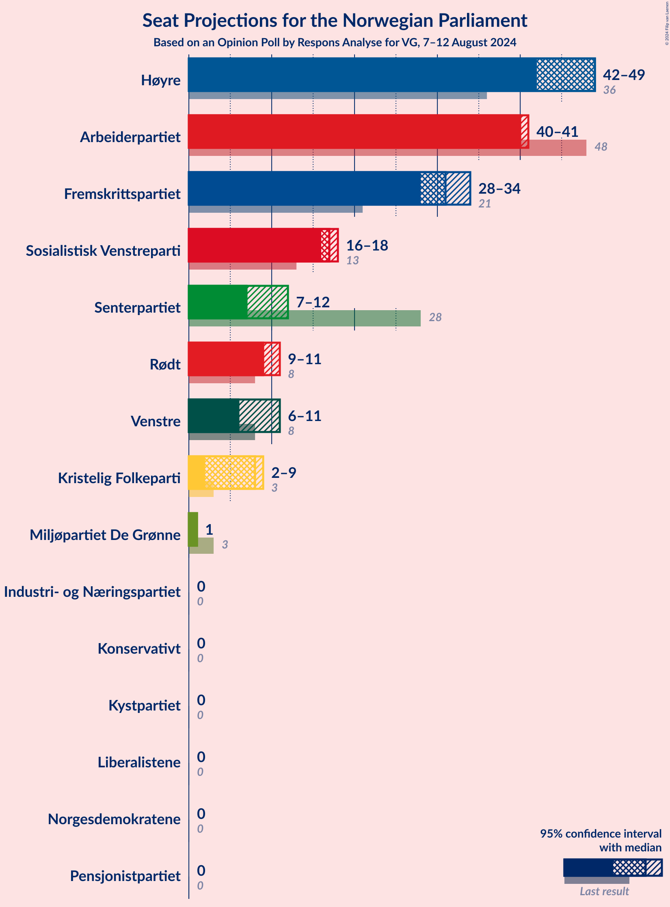
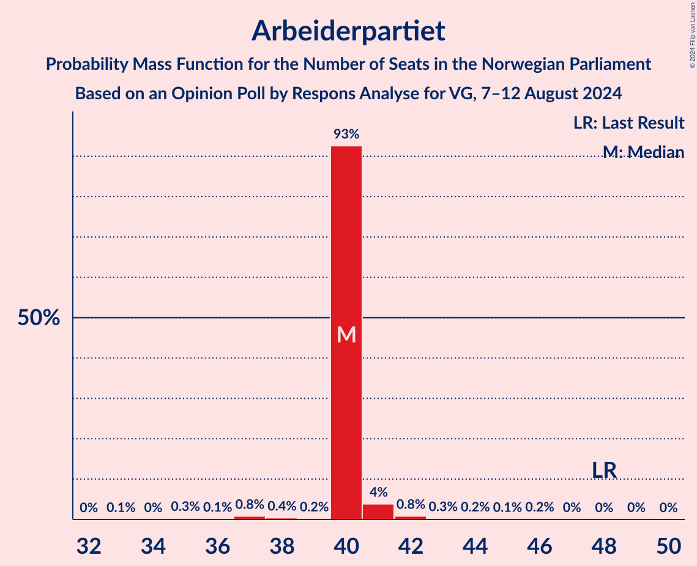
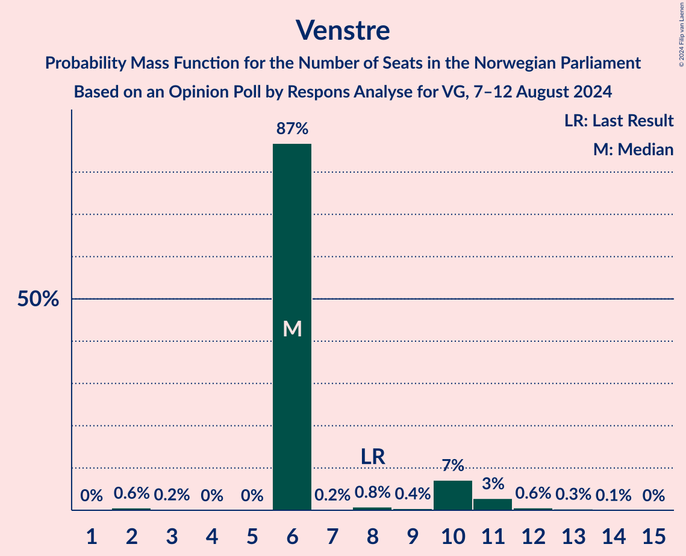
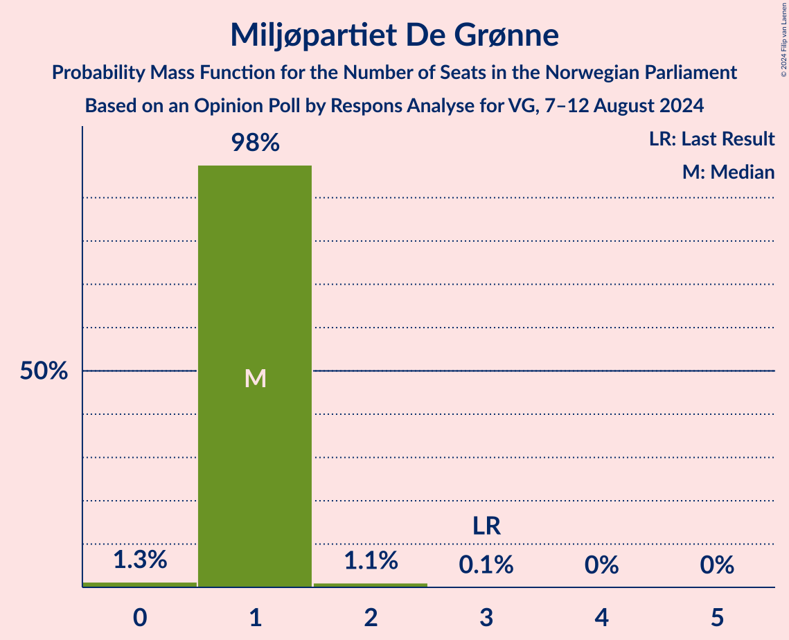
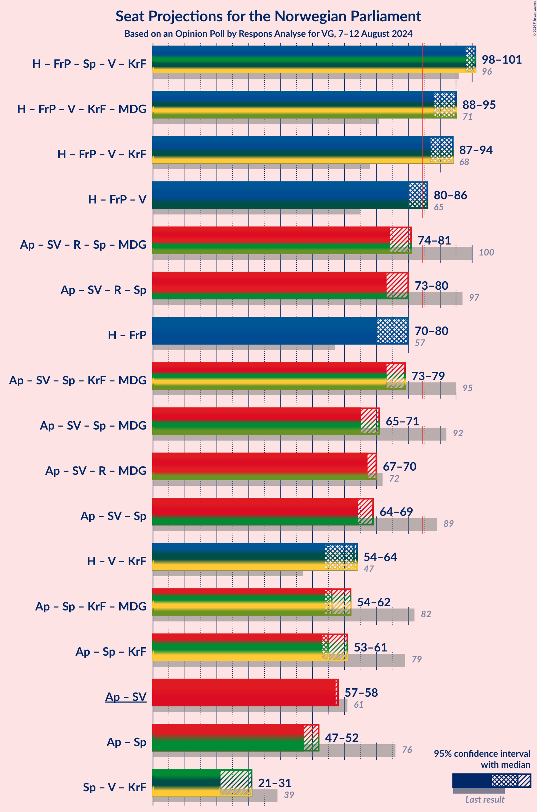
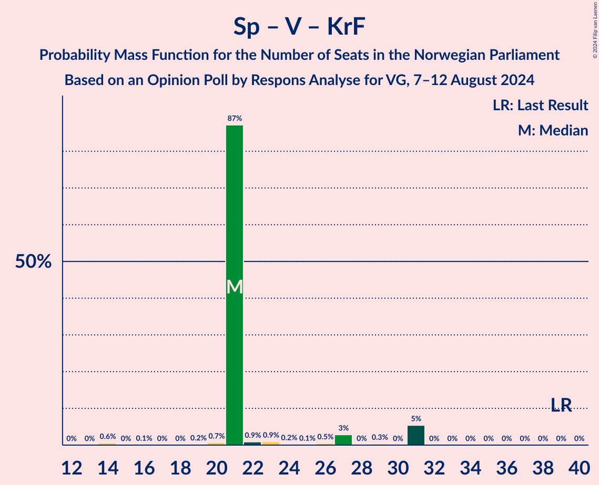

# Opinion Poll by Respons Analyse for VG, 7–12 August 2024

<a href="#voting-intentions">Voting Intentions</a> | <a href="#seats">Seats</a> | <a href="#coalitions">Coalitions</a> | <a href="#technical-information">Technical Information</a>

## Voting Intentions

### Confidence Intervals

| Party | Last Result | Poll Result | 80% Confidence Interval | 90% Confidence Interval | 95% Confidence Interval | 99% Confidence Interval |
|:-----:|:-----------:|:-----------:|:-----------------------:|:-----------------------:|:-----------------------:|:-----------------------:|
| Høyre | 20.4% | 24.5% | 22.8–26.3% |22.3–26.8% |21.9–27.3% |21.1–28.2% |
| Arbeiderpartiet | 26.2% | 22.0% | 20.4–23.7% |19.9–24.2% |19.5–24.7% |18.8–25.5% |
| Fremskrittspartiet | 11.6% | 17.5% | 16.0–19.1% |15.6–19.6% |15.3–20.0% |14.6–20.8% |
| Sosialistisk Venstreparti | 7.6% | 10.0% | 8.9–11.3% |8.6–11.7% |8.3–12.0% |7.8–12.7% |
| Rødt | 4.7% | 5.7% | 4.9–6.8% |4.6–7.1% |4.4–7.3% |4.1–7.9% |
| Senterpartiet | 13.5% | 5.4% | 4.6–6.4% |4.3–6.7% |4.2–7.0% |3.8–7.5% |
| Venstre | 4.6% | 5.3% | 4.5–6.3% |4.3–6.6% |4.1–6.9% |3.7–7.4% |
| Kristelig Folkeparti | 3.8% | 3.3% | 2.7–4.1% |2.5–4.4% |2.4–4.6% |2.1–5.0% |
| Miljøpartiet De Grønne | 3.9% | 2.3% | 1.8–3.0% |1.6–3.2% |1.5–3.4% |1.3–3.8% |
| Industri- og Næringspartiet | 0.3% | 1.2% | 0.9–1.8% |0.8–1.9% |0.7–2.1% |0.5–2.4% |
| Norgesdemokratene | 1.1% | 0.9% | 0.6–1.4% |0.5–1.6% |0.5–1.7% |0.4–2.0% |
| Liberalistene | 0.2% | 0.6% | 0.4–1.1% |0.3–1.2% |0.3–1.3% |0.2–1.6% |
| Pensjonistpartiet | 0.6% | 0.5% | 0.3–0.9% |0.3–1.1% |0.2–1.2% |0.2–1.4% |
| Kystpartiet | 0.0% | 0.3% | 0.2–0.7% |0.1–0.8% |0.1–0.9% |0.1–1.1% |
| Konservativt | 0.4% | 0.3% | 0.2–0.7% |0.1–0.8% |0.1–0.9% |0.1–1.1% |

*Note:* The poll result column reflects the actual value used in the calculations. Published results may vary slightly, and in addition be rounded to fewer digits.

## Seats

### Confidence Intervals

| Party | Last Result | Median | 80% Confidence Interval | 90% Confidence Interval | 95% Confidence Interval | 99% Confidence Interval |
|:-----:|:-----------:|:------:|:-----------------------:|:-----------------------:|:-----------------------:|:-----------------------:|
| <a href="#høyre">Høyre</a> | 36 | 49 | 46–49 |42–49 |42–49 |38–49 |
| <a href="#arbeiderpartiet">Arbeiderpartiet</a> | 48 | 40 | 40 |40–41 |40–41 |36–44 |
| <a href="#fremskrittspartiet">Fremskrittspartiet</a> | 21 | 31 | 31 |28–31 |28–34 |28–36 |
| <a href="#sosialistisk-venstreparti">Sosialistisk Venstreparti</a> | 13 | 17 | 17 |17 |16–18 |16–23 |
| <a href="#rødt">Rødt</a> | 8 | 9 | 9 |9 |9–11 |8–12 |
| <a href="#senterpartiet">Senterpartiet</a> | 28 | 7 | 7–9 |7–12 |7–12 |7–12 |
| <a href="#venstre">Venstre</a> | 8 | 6 | 6–10 |6–10 |6–11 |2–12 |
| <a href="#kristelig-folkeparti">Kristelig Folkeparti</a> | 3 | 8 | 8 |7–9 |2–9 |2–9 |
| <a href="#miljøpartiet-de-grønne">Miljøpartiet De Grønne</a> | 3 | 1 | 1 |1 |1 |0–2 |
| <a href="#industri--og-næringspartiet">Industri- og Næringspartiet</a> | 0 | 0 | 0 |0 |0 |0 |
| <a href="#norgesdemokratene">Norgesdemokratene</a> | 0 | 0 | 0 |0 |0 |0 |
| <a href="#liberalistene">Liberalistene</a> | 0 | 0 | 0 |0 |0 |0 |
| <a href="#pensjonistpartiet">Pensjonistpartiet</a> | 0 | 0 | 0 |0 |0 |0 |
| <a href="#kystpartiet">Kystpartiet</a> | 0 | 0 | 0 |0 |0 |0–1 |
| <a href="#konservativt">Konservativt</a> | 0 | 0 | 0 |0 |0 |0 |

### Høyre

*For a full overview of the results for this party, see the [Høyre](party-høyre.html) page.*

| Number of Seats | Probability | Accumulated | Special Marks |
|:---------------:|:-----------:|:-----------:|:-------------:|
| 36 | 0% | 100% | Last Result |
| 37 | 0% | 100% |  |
| 38 | 1.2% | 100% |  |
| 39 | 0.2% | 98.8% |  |
| 40 | 0.6% | 98.6% |  |
| 41 | 0.2% | 98% |  |
| 42 | 6% | 98% |  |
| 43 | 0.8% | 92% |  |
| 44 | 0.4% | 91% |  |
| 45 | 0.2% | 91% |  |
| 46 | 3% | 91% |  |
| 47 | 0.9% | 88% |  |
| 48 | 0.3% | 87% |  |
| 49 | 87% | 87% | Median |
| 50 | 0% | 0.1% |  |
| 51 | 0% | 0% |  |

### Arbeiderpartiet

*For a full overview of the results for this party, see the [Arbeiderpartiet](party-arbeiderpartiet.html) page.*

| Number of Seats | Probability | Accumulated | Special Marks |
|:---------------:|:-----------:|:-----------:|:-------------:|
| 33 | 0.1% | 100% |  |
| 34 | 0% | 99.9% |  |
| 35 | 0.3% | 99.9% |  |
| 36 | 0.1% | 99.6% |  |
| 37 | 0.8% | 99.5% |  |
| 38 | 0.4% | 98.7% |  |
| 39 | 0.2% | 98% |  |
| 40 | 93% | 98% | Median |
| 41 | 4% | 5% |  |
| 42 | 0.8% | 2% |  |
| 43 | 0.3% | 0.8% |  |
| 44 | 0.2% | 0.5% |  |
| 45 | 0.1% | 0.4% |  |
| 46 | 0.2% | 0.3% |  |
| 47 | 0% | 0.1% |  |
| 48 | 0% | 0.1% | Last Result |
| 49 | 0% | 0.1% |  |
| 50 | 0% | 0% |  |

### Fremskrittspartiet

*For a full overview of the results for this party, see the [Fremskrittspartiet](party-fremskrittspartiet.html) page.*

| Number of Seats | Probability | Accumulated | Special Marks |
|:---------------:|:-----------:|:-----------:|:-------------:|
| 21 | 0% | 100% | Last Result |
| 22 | 0% | 100% |  |
| 23 | 0% | 100% |  |
| 24 | 0% | 100% |  |
| 25 | 0% | 100% |  |
| 26 | 0% | 100% |  |
| 27 | 0% | 100% |  |
| 28 | 8% | 100% |  |
| 29 | 0.2% | 92% |  |
| 30 | 0.2% | 92% |  |
| 31 | 88% | 91% | Median |
| 32 | 0.2% | 4% |  |
| 33 | 0.2% | 4% |  |
| 34 | 1.1% | 3% |  |
| 35 | 2% | 2% |  |
| 36 | 0.5% | 0.7% |  |
| 37 | 0% | 0.2% |  |
| 38 | 0% | 0.2% |  |
| 39 | 0.1% | 0.1% |  |
| 40 | 0% | 0% |  |

### Sosialistisk Venstreparti

*For a full overview of the results for this party, see the [Sosialistisk Venstreparti](party-sosialistiskvenstreparti.html) page.*

| Number of Seats | Probability | Accumulated | Special Marks |
|:---------------:|:-----------:|:-----------:|:-------------:|
| 12 | 0% | 100% |  |
| 13 | 0% | 99.9% | Last Result |
| 14 | 0.1% | 99.9% |  |
| 15 | 0.1% | 99.8% |  |
| 16 | 3% | 99.6% |  |
| 17 | 94% | 96% | Median |
| 18 | 1.4% | 3% |  |
| 19 | 0.3% | 1.3% |  |
| 20 | 0.1% | 1.0% |  |
| 21 | 0.2% | 0.9% |  |
| 22 | 0.1% | 0.6% |  |
| 23 | 0.6% | 0.6% |  |
| 24 | 0% | 0% |  |

### Rødt

*For a full overview of the results for this party, see the [Rødt](party-rødt.html) page.*

| Number of Seats | Probability | Accumulated | Special Marks |
|:---------------:|:-----------:|:-----------:|:-------------:|
| 1 | 0.2% | 100% |  |
| 2 | 0% | 99.8% |  |
| 3 | 0% | 99.8% |  |
| 4 | 0% | 99.8% |  |
| 5 | 0% | 99.8% |  |
| 6 | 0% | 99.8% |  |
| 7 | 0% | 99.8% |  |
| 8 | 0.4% | 99.8% | Last Result |
| 9 | 95% | 99.4% | Median |
| 10 | 0.7% | 4% |  |
| 11 | 2% | 4% |  |
| 12 | 1.2% | 2% |  |
| 13 | 0.2% | 0.3% |  |
| 14 | 0.1% | 0.1% |  |
| 15 | 0% | 0% |  |

### Senterpartiet

*For a full overview of the results for this party, see the [Senterpartiet](party-senterpartiet.html) page.*

| Number of Seats | Probability | Accumulated | Special Marks |
|:---------------:|:-----------:|:-----------:|:-------------:|
| 7 | 87% | 100% | Median |
| 8 | 0.5% | 13% |  |
| 9 | 4% | 13% |  |
| 10 | 0.8% | 8% |  |
| 11 | 1.1% | 7% |  |
| 12 | 6% | 6% |  |
| 13 | 0.1% | 0.2% |  |
| 14 | 0% | 0.1% |  |
| 15 | 0.1% | 0.1% |  |
| 16 | 0% | 0% |  |
| 17 | 0% | 0% |  |
| 18 | 0% | 0% |  |
| 19 | 0% | 0% |  |
| 20 | 0% | 0% |  |
| 21 | 0% | 0% |  |
| 22 | 0% | 0% |  |
| 23 | 0% | 0% |  |
| 24 | 0% | 0% |  |
| 25 | 0% | 0% |  |
| 26 | 0% | 0% |  |
| 27 | 0% | 0% |  |
| 28 | 0% | 0% | Last Result |

### Venstre

*For a full overview of the results for this party, see the [Venstre](party-venstre.html) page.*

| Number of Seats | Probability | Accumulated | Special Marks |
|:---------------:|:-----------:|:-----------:|:-------------:|
| 2 | 0.6% | 100% |  |
| 3 | 0.2% | 99.4% |  |
| 4 | 0% | 99.2% |  |
| 5 | 0% | 99.2% |  |
| 6 | 87% | 99.2% | Median |
| 7 | 0.2% | 12% |  |
| 8 | 0.8% | 12% | Last Result |
| 9 | 0.4% | 11% |  |
| 10 | 7% | 11% |  |
| 11 | 3% | 4% |  |
| 12 | 0.6% | 1.0% |  |
| 13 | 0.3% | 0.4% |  |
| 14 | 0.1% | 0.1% |  |
| 15 | 0% | 0% |  |

### Kristelig Folkeparti

*For a full overview of the results for this party, see the [Kristelig Folkeparti](party-kristeligfolkeparti.html) page.*

| Number of Seats | Probability | Accumulated | Special Marks |
|:---------------:|:-----------:|:-----------:|:-------------:|
| 0 | 0.1% | 100% |  |
| 1 | 0.1% | 99.9% |  |
| 2 | 2% | 99.7% |  |
| 3 | 2% | 97% | Last Result |
| 4 | 0% | 96% |  |
| 5 | 0% | 96% |  |
| 6 | 0% | 96% |  |
| 7 | 3% | 96% |  |
| 8 | 87% | 92% | Median |
| 9 | 5% | 5% |  |
| 10 | 0% | 0% |  |

### Miljøpartiet De Grønne

*For a full overview of the results for this party, see the [Miljøpartiet De Grønne](party-miljøpartietdegrønne.html) page.*

| Number of Seats | Probability | Accumulated | Special Marks |
|:---------------:|:-----------:|:-----------:|:-------------:|
| 0 | 1.3% | 100% |  |
| 1 | 98% | 98.7% | Median |
| 2 | 1.1% | 1.1% |  |
| 3 | 0.1% | 0.1% | Last Result |
| 4 | 0% | 0% |  |

### Industri- og Næringspartiet

*For a full overview of the results for this party, see the [Industri- og Næringspartiet](party-industri-ognæringspartiet.html) page.*

| Number of Seats | Probability | Accumulated | Special Marks |
|:---------------:|:-----------:|:-----------:|:-------------:|
| 0 | 100% | 100% | Last Result, Median |

### Norgesdemokratene

*For a full overview of the results for this party, see the [Norgesdemokratene](party-norgesdemokratene.html) page.*

| Number of Seats | Probability | Accumulated | Special Marks |
|:---------------:|:-----------:|:-----------:|:-------------:|
| 0 | 100% | 100% | Last Result, Median |

### Liberalistene

*For a full overview of the results for this party, see the [Liberalistene](party-liberalistene.html) page.*

| Number of Seats | Probability | Accumulated | Special Marks |
|:---------------:|:-----------:|:-----------:|:-------------:|
| 0 | 100% | 100% | Last Result, Median |

### Pensjonistpartiet

*For a full overview of the results for this party, see the [Pensjonistpartiet](party-pensjonistpartiet.html) page.*

| Number of Seats | Probability | Accumulated | Special Marks |
|:---------------:|:-----------:|:-----------:|:-------------:|
| 0 | 100% | 100% | Last Result, Median |

### Kystpartiet

*For a full overview of the results for this party, see the [Kystpartiet](party-kystpartiet.html) page.*

| Number of Seats | Probability | Accumulated | Special Marks |
|:---------------:|:-----------:|:-----------:|:-------------:|
| 0 | 98.6% | 100% | Last Result, Median |
| 1 | 1.2% | 1.4% |  |
| 2 | 0.2% | 0.2% |  |
| 3 | 0% | 0% |  |

### Konservativt

*For a full overview of the results for this party, see the [Konservativt](party-konservativt.html) page.*

| Number of Seats | Probability | Accumulated | Special Marks |
|:---------------:|:-----------:|:-----------:|:-------------:|
| 0 | 100% | 100% | Last Result, Median |

## Coalitions

### Confidence Intervals

| Coalition | Last Result | Median | Majority? | 80% Confidence Interval | 90% Confidence Interval | 95% Confidence Interval | 99% Confidence Interval |
|:---------:|:-----------:|:------:|:---------:|:-----------------------:|:-----------------------:|:-----------------------:|:-----------------------:|
| Høyre – Fremskrittspartiet – Senterpartiet – Venstre – Kristelig Folkeparti | 96 | 101 | 100% | 101 | 101 | 98–101 | 92–104 |
| Høyre – Fremskrittspartiet – Venstre – Kristelig Folkeparti – Miljøpartiet De Grønne | 71 | 95 | 99.2% | 93–95 | 90–95 | 88–95 | 84–95 |
| Høyre – Fremskrittspartiet – Venstre – Kristelig Folkeparti | 68 | 94 | 99.1% | 92–94 | 89–94 | 87–94 | 83–94 |
| Høyre – Fremskrittspartiet – Venstre | 65 | 86 | 92% | 85–86 | 80–86 | 80–86 | 80–90 |
| Arbeiderpartiet – Sosialistisk Venstreparti – Rødt – Senterpartiet – Miljøpartiet De Grønne | 100 | 74 | 0.9% | 74–76 | 74–79 | 74–81 | 74–85 |
| Arbeiderpartiet – Sosialistisk Venstreparti – Rødt – Senterpartiet | 97 | 73 | 0.2% | 73–75 | 73–78 | 73–80 | 73–84 |
| Høyre – Fremskrittspartiet | 57 | 80 | 0% | 75–80 | 70–80 | 70–80 | 70–80 |
| Arbeiderpartiet – Sosialistisk Venstreparti – Senterpartiet – Kristelig Folkeparti – Miljøpartiet De Grønne | 95 | 73 | 0% | 73–74 | 73–79 | 73–79 | 67–79 |
| Arbeiderpartiet – Sosialistisk Venstreparti – Senterpartiet – Miljøpartiet De Grønne | 92 | 65 | 0% | 65–67 | 65–70 | 65–71 | 64–74 |
| Arbeiderpartiet – Sosialistisk Venstreparti – Rødt – Miljøpartiet De Grønne | 72 | 67 | 0% | 67 | 67 | 67–70 | 64–76 |
| Arbeiderpartiet – Sosialistisk Venstreparti – Senterpartiet | 89 | 64 | 0% | 64–66 | 64–69 | 64–69 | 63–73 |
| Høyre – Venstre – Kristelig Folkeparti | 47 | 63 | 0% | 61–63 | 61–63 | 54–64 | 51–64 |
| Arbeiderpartiet – Senterpartiet – Kristelig Folkeparti – Miljøpartiet De Grønne | 82 | 56 | 0% | 56 | 56–62 | 54–62 | 49–62 |
| Arbeiderpartiet – Senterpartiet – Kristelig Folkeparti | 79 | 55 | 0% | 55 | 55–61 | 53–61 | 48–61 |
| Arbeiderpartiet – Sosialistisk Venstreparti | 61 | 57 | 0% | 57 | 57 | 57–58 | 54–64 |
| Arbeiderpartiet – Senterpartiet | 76 | 47 | 0% | 47–50 | 47–52 | 47–52 | 46–54 |
| Senterpartiet – Venstre – Kristelig Folkeparti | 39 | 21 | 0% | 21–23 | 21–31 | 21–31 | 14–31 |

### Høyre – Fremskrittspartiet – Senterpartiet – Venstre – Kristelig Folkeparti

| Number of Seats | Probability | Accumulated | Special Marks |
|:---------------:|:-----------:|:-----------:|:-------------:|
| 92 | 0.6% | 100% |  |
| 93 | 0.1% | 99.4% |  |
| 94 | 0.2% | 99.3% |  |
| 95 | 0.9% | 99.1% |  |
| 96 | 0.1% | 98% | Last Result |
| 97 | 0.4% | 98% |  |
| 98 | 0.5% | 98% |  |
| 99 | 0.3% | 97% |  |
| 100 | 0.2% | 97% |  |
| 101 | 96% | 97% | Median |
| 102 | 0.4% | 1.0% |  |
| 103 | 0.1% | 0.6% |  |
| 104 | 0% | 0.5% |  |
| 105 | 0.4% | 0.5% |  |
| 106 | 0.1% | 0.1% |  |
| 107 | 0% | 0% |  |

### Høyre – Fremskrittspartiet – Venstre – Kristelig Folkeparti – Miljøpartiet De Grønne

| Number of Seats | Probability | Accumulated | Special Marks |
|:---------------:|:-----------:|:-----------:|:-------------:|
| 71 | 0% | 100% | Last Result |
| 72 | 0% | 100% |  |
| 73 | 0% | 100% |  |
| 74 | 0% | 100% |  |
| 75 | 0% | 100% |  |
| 76 | 0% | 100% |  |
| 77 | 0% | 100% |  |
| 78 | 0% | 100% |  |
| 79 | 0% | 100% |  |
| 80 | 0% | 100% |  |
| 81 | 0% | 100% |  |
| 82 | 0% | 100% |  |
| 83 | 0% | 100% |  |
| 84 | 0.7% | 99.9% |  |
| 85 | 0.2% | 99.2% | Majority |
| 86 | 0.2% | 99.0% |  |
| 87 | 0.6% | 98.8% |  |
| 88 | 0.8% | 98% |  |
| 89 | 0.1% | 97% |  |
| 90 | 6% | 97% |  |
| 91 | 0.3% | 91% |  |
| 92 | 0.1% | 91% |  |
| 93 | 3% | 91% |  |
| 94 | 0% | 87% |  |
| 95 | 87% | 87% | Median |
| 96 | 0.2% | 0.5% |  |
| 97 | 0.3% | 0.3% |  |
| 98 | 0% | 0% |  |

### Høyre – Fremskrittspartiet – Venstre – Kristelig Folkeparti

| Number of Seats | Probability | Accumulated | Special Marks |
|:---------------:|:-----------:|:-----------:|:-------------:|
| 68 | 0% | 100% | Last Result |
| 69 | 0% | 100% |  |
| 70 | 0% | 100% |  |
| 71 | 0% | 100% |  |
| 72 | 0% | 100% |  |
| 73 | 0% | 100% |  |
| 74 | 0% | 100% |  |
| 75 | 0% | 100% |  |
| 76 | 0% | 100% |  |
| 77 | 0% | 100% |  |
| 78 | 0% | 100% |  |
| 79 | 0% | 100% |  |
| 80 | 0% | 100% |  |
| 81 | 0% | 100% |  |
| 82 | 0% | 99.9% |  |
| 83 | 0.8% | 99.9% |  |
| 84 | 0% | 99.1% |  |
| 85 | 0.4% | 99.1% | Majority |
| 86 | 1.2% | 98.7% |  |
| 87 | 0.2% | 98% |  |
| 88 | 0.1% | 97% |  |
| 89 | 5% | 97% |  |
| 90 | 1.0% | 92% |  |
| 91 | 0.3% | 91% |  |
| 92 | 3% | 90% |  |
| 93 | 0.1% | 87% |  |
| 94 | 87% | 87% | Median |
| 95 | 0.1% | 0.5% |  |
| 96 | 0.3% | 0.3% |  |
| 97 | 0% | 0% |  |

### Høyre – Fremskrittspartiet – Venstre

| Number of Seats | Probability | Accumulated | Special Marks |
|:---------------:|:-----------:|:-----------:|:-------------:|
| 65 | 0% | 100% | Last Result |
| 66 | 0% | 100% |  |
| 67 | 0% | 100% |  |
| 68 | 0% | 100% |  |
| 69 | 0% | 100% |  |
| 70 | 0% | 100% |  |
| 71 | 0% | 100% |  |
| 72 | 0% | 100% |  |
| 73 | 0% | 100% |  |
| 74 | 0% | 100% |  |
| 75 | 0% | 100% |  |
| 76 | 0.2% | 100% |  |
| 77 | 0% | 99.8% |  |
| 78 | 0% | 99.8% |  |
| 79 | 0% | 99.8% |  |
| 80 | 6% | 99.8% |  |
| 81 | 0.1% | 94% |  |
| 82 | 0.1% | 94% |  |
| 83 | 1.1% | 94% |  |
| 84 | 0.5% | 92% |  |
| 85 | 3% | 92% | Majority |
| 86 | 87% | 89% | Median |
| 87 | 0.1% | 2% |  |
| 88 | 1.1% | 2% |  |
| 89 | 0.4% | 0.9% |  |
| 90 | 0.3% | 0.6% |  |
| 91 | 0% | 0.3% |  |
| 92 | 0.1% | 0.2% |  |
| 93 | 0% | 0.1% |  |
| 94 | 0.1% | 0.1% |  |
| 95 | 0% | 0% |  |

### Arbeiderpartiet – Sosialistisk Venstreparti – Rødt – Senterpartiet – Miljøpartiet De Grønne

| Number of Seats | Probability | Accumulated | Special Marks |
|:---------------:|:-----------:|:-----------:|:-------------:|
| 72 | 0.3% | 100% |  |
| 73 | 0% | 99.6% |  |
| 74 | 87% | 99.6% | Median |
| 75 | 0% | 13% |  |
| 76 | 3% | 13% |  |
| 77 | 0.9% | 10% |  |
| 78 | 0.4% | 9% |  |
| 79 | 5% | 8% |  |
| 80 | 0.1% | 3% |  |
| 81 | 0.2% | 3% |  |
| 82 | 1.5% | 2% |  |
| 83 | 0.1% | 1.0% |  |
| 84 | 0% | 0.9% |  |
| 85 | 0.6% | 0.9% | Majority |
| 86 | 0.2% | 0.2% |  |
| 87 | 0% | 0.1% |  |
| 88 | 0% | 0% |  |
| 89 | 0% | 0% |  |
| 90 | 0% | 0% |  |
| 91 | 0% | 0% |  |
| 92 | 0% | 0% |  |
| 93 | 0% | 0% |  |
| 94 | 0% | 0% |  |
| 95 | 0% | 0% |  |
| 96 | 0% | 0% |  |
| 97 | 0% | 0% |  |
| 98 | 0% | 0% |  |
| 99 | 0% | 0% |  |
| 100 | 0% | 0% | Last Result |

### Arbeiderpartiet – Sosialistisk Venstreparti – Rødt – Senterpartiet

| Number of Seats | Probability | Accumulated | Special Marks |
|:---------------:|:-----------:|:-----------:|:-------------:|
| 71 | 0.4% | 100% |  |
| 72 | 0% | 99.6% |  |
| 73 | 87% | 99.6% | Median |
| 74 | 0.1% | 13% |  |
| 75 | 3% | 13% |  |
| 76 | 0.1% | 9% |  |
| 77 | 1.0% | 9% |  |
| 78 | 6% | 8% |  |
| 79 | 0.1% | 3% |  |
| 80 | 0.8% | 3% |  |
| 81 | 0.7% | 2% |  |
| 82 | 0.3% | 1.1% |  |
| 83 | 0% | 0.9% |  |
| 84 | 0.6% | 0.8% |  |
| 85 | 0.2% | 0.2% | Majority |
| 86 | 0% | 0% |  |
| 87 | 0% | 0% |  |
| 88 | 0% | 0% |  |
| 89 | 0% | 0% |  |
| 90 | 0% | 0% |  |
| 91 | 0% | 0% |  |
| 92 | 0% | 0% |  |
| 93 | 0% | 0% |  |
| 94 | 0% | 0% |  |
| 95 | 0% | 0% |  |
| 96 | 0% | 0% |  |
| 97 | 0% | 0% | Last Result |

### Høyre – Fremskrittspartiet

| Number of Seats | Probability | Accumulated | Special Marks |
|:---------------:|:-----------:|:-----------:|:-------------:|
| 57 | 0% | 100% | Last Result |
| 58 | 0% | 100% |  |
| 59 | 0% | 100% |  |
| 60 | 0% | 100% |  |
| 61 | 0% | 100% |  |
| 62 | 0% | 100% |  |
| 63 | 0% | 100% |  |
| 64 | 0% | 100% |  |
| 65 | 0% | 100% |  |
| 66 | 0% | 100% |  |
| 67 | 0% | 100% |  |
| 68 | 0% | 100% |  |
| 69 | 0% | 100% |  |
| 70 | 5% | 99.9% |  |
| 71 | 0% | 94% |  |
| 72 | 0.5% | 94% |  |
| 73 | 0.9% | 94% |  |
| 74 | 3% | 93% |  |
| 75 | 0.3% | 90% |  |
| 76 | 0.3% | 90% |  |
| 77 | 0.2% | 89% |  |
| 78 | 1.5% | 89% |  |
| 79 | 0.3% | 88% |  |
| 80 | 87% | 88% | Median |
| 81 | 0.1% | 0.5% |  |
| 82 | 0.3% | 0.4% |  |
| 83 | 0% | 0.1% |  |
| 84 | 0.1% | 0.1% |  |
| 85 | 0% | 0% | Majority |

### Arbeiderpartiet – Sosialistisk Venstreparti – Senterpartiet – Kristelig Folkeparti – Miljøpartiet De Grønne

| Number of Seats | Probability | Accumulated | Special Marks |
|:---------------:|:-----------:|:-----------:|:-------------:|
| 65 | 0% | 100% |  |
| 66 | 0.4% | 99.9% |  |
| 67 | 0.8% | 99.6% |  |
| 68 | 0.1% | 98.8% |  |
| 69 | 0% | 98.6% |  |
| 70 | 0.3% | 98.6% |  |
| 71 | 0.5% | 98% |  |
| 72 | 0.2% | 98% |  |
| 73 | 87% | 98% | Median |
| 74 | 4% | 10% |  |
| 75 | 0.1% | 7% |  |
| 76 | 0.1% | 6% |  |
| 77 | 0.6% | 6% |  |
| 78 | 0% | 6% |  |
| 79 | 6% | 6% |  |
| 80 | 0.1% | 0.2% |  |
| 81 | 0% | 0.2% |  |
| 82 | 0.1% | 0.2% |  |
| 83 | 0% | 0% |  |
| 84 | 0% | 0% |  |
| 85 | 0% | 0% | Majority |
| 86 | 0% | 0% |  |
| 87 | 0% | 0% |  |
| 88 | 0% | 0% |  |
| 89 | 0% | 0% |  |
| 90 | 0% | 0% |  |
| 91 | 0% | 0% |  |
| 92 | 0% | 0% |  |
| 93 | 0% | 0% |  |
| 94 | 0% | 0% |  |
| 95 | 0% | 0% | Last Result |

### Arbeiderpartiet – Sosialistisk Venstreparti – Senterpartiet – Miljøpartiet De Grønne

| Number of Seats | Probability | Accumulated | Special Marks |
|:---------------:|:-----------:|:-----------:|:-------------:|
| 62 | 0% | 100% |  |
| 63 | 0% | 99.9% |  |
| 64 | 0.6% | 99.9% |  |
| 65 | 88% | 99.3% | Median |
| 66 | 0.2% | 12% |  |
| 67 | 3% | 11% |  |
| 68 | 0.2% | 9% |  |
| 69 | 0.2% | 8% |  |
| 70 | 5% | 8% |  |
| 71 | 1.4% | 3% |  |
| 72 | 0.3% | 1.3% |  |
| 73 | 0% | 1.0% |  |
| 74 | 0.6% | 0.9% |  |
| 75 | 0.1% | 0.3% |  |
| 76 | 0.1% | 0.2% |  |
| 77 | 0.1% | 0.1% |  |
| 78 | 0% | 0% |  |
| 79 | 0% | 0% |  |
| 80 | 0% | 0% |  |
| 81 | 0% | 0% |  |
| 82 | 0% | 0% |  |
| 83 | 0% | 0% |  |
| 84 | 0% | 0% |  |
| 85 | 0% | 0% | Majority |
| 86 | 0% | 0% |  |
| 87 | 0% | 0% |  |
| 88 | 0% | 0% |  |
| 89 | 0% | 0% |  |
| 90 | 0% | 0% |  |
| 91 | 0% | 0% |  |
| 92 | 0% | 0% | Last Result |

### Arbeiderpartiet – Sosialistisk Venstreparti – Rødt – Miljøpartiet De Grønne

| Number of Seats | Probability | Accumulated | Special Marks |
|:---------------:|:-----------:|:-----------:|:-------------:|
| 61 | 0.1% | 100% |  |
| 62 | 0% | 99.9% |  |
| 63 | 0.4% | 99.9% |  |
| 64 | 0% | 99.5% |  |
| 65 | 0% | 99.5% |  |
| 66 | 1.2% | 99.5% |  |
| 67 | 95% | 98% | Median |
| 68 | 0.2% | 3% |  |
| 69 | 0.3% | 3% |  |
| 70 | 0.6% | 3% |  |
| 71 | 0.3% | 2% |  |
| 72 | 0.3% | 2% | Last Result |
| 73 | 0.8% | 2% |  |
| 74 | 0.1% | 0.9% |  |
| 75 | 0.2% | 0.8% |  |
| 76 | 0.6% | 0.6% |  |
| 77 | 0% | 0% |  |

### Arbeiderpartiet – Sosialistisk Venstreparti – Senterpartiet

| Number of Seats | Probability | Accumulated | Special Marks |
|:---------------:|:-----------:|:-----------:|:-------------:|
| 62 | 0% | 100% |  |
| 63 | 0.6% | 99.9% |  |
| 64 | 87% | 99.3% | Median |
| 65 | 1.0% | 12% |  |
| 66 | 3% | 11% |  |
| 67 | 0.1% | 9% |  |
| 68 | 0.3% | 8% |  |
| 69 | 6% | 8% |  |
| 70 | 0.7% | 2% |  |
| 71 | 0.2% | 1.3% |  |
| 72 | 0.2% | 1.1% |  |
| 73 | 0.7% | 0.9% |  |
| 74 | 0.1% | 0.3% |  |
| 75 | 0% | 0.1% |  |
| 76 | 0.1% | 0.1% |  |
| 77 | 0% | 0% |  |
| 78 | 0% | 0% |  |
| 79 | 0% | 0% |  |
| 80 | 0% | 0% |  |
| 81 | 0% | 0% |  |
| 82 | 0% | 0% |  |
| 83 | 0% | 0% |  |
| 84 | 0% | 0% |  |
| 85 | 0% | 0% | Majority |
| 86 | 0% | 0% |  |
| 87 | 0% | 0% |  |
| 88 | 0% | 0% |  |
| 89 | 0% | 0% | Last Result |

### Høyre – Venstre – Kristelig Folkeparti

| Number of Seats | Probability | Accumulated | Special Marks |
|:---------------:|:-----------:|:-----------:|:-------------:|
| 47 | 0% | 100% | Last Result |
| 48 | 0% | 100% |  |
| 49 | 0.1% | 100% |  |
| 50 | 0.1% | 99.8% |  |
| 51 | 0.9% | 99.8% |  |
| 52 | 1.1% | 98.8% |  |
| 53 | 0% | 98% |  |
| 54 | 0.3% | 98% |  |
| 55 | 1.0% | 97% |  |
| 56 | 0.2% | 96% |  |
| 57 | 0.2% | 96% |  |
| 58 | 0.4% | 96% |  |
| 59 | 0.1% | 96% |  |
| 60 | 0.3% | 95% |  |
| 61 | 6% | 95% |  |
| 62 | 0% | 90% |  |
| 63 | 87% | 90% | Median |
| 64 | 3% | 3% |  |
| 65 | 0% | 0% |  |

### Arbeiderpartiet – Senterpartiet – Kristelig Folkeparti – Miljøpartiet De Grønne

| Number of Seats | Probability | Accumulated | Special Marks |
|:---------------:|:-----------:|:-----------:|:-------------:|
| 47 | 0.1% | 100% |  |
| 48 | 0.3% | 99.9% |  |
| 49 | 0% | 99.5% |  |
| 50 | 0.8% | 99.5% |  |
| 51 | 0.2% | 98.7% |  |
| 52 | 0% | 98.6% |  |
| 53 | 0.2% | 98.5% |  |
| 54 | 0.8% | 98% |  |
| 55 | 0.6% | 97% |  |
| 56 | 88% | 97% | Median |
| 57 | 0% | 9% |  |
| 58 | 3% | 9% |  |
| 59 | 0.1% | 6% |  |
| 60 | 0% | 6% |  |
| 61 | 0.1% | 6% |  |
| 62 | 5% | 6% |  |
| 63 | 0.1% | 0.3% |  |
| 64 | 0% | 0.2% |  |
| 65 | 0.2% | 0.2% |  |
| 66 | 0% | 0% |  |
| 67 | 0% | 0% |  |
| 68 | 0% | 0% |  |
| 69 | 0% | 0% |  |
| 70 | 0% | 0% |  |
| 71 | 0% | 0% |  |
| 72 | 0% | 0% |  |
| 73 | 0% | 0% |  |
| 74 | 0% | 0% |  |
| 75 | 0% | 0% |  |
| 76 | 0% | 0% |  |
| 77 | 0% | 0% |  |
| 78 | 0% | 0% |  |
| 79 | 0% | 0% |  |
| 80 | 0% | 0% |  |
| 81 | 0% | 0% |  |
| 82 | 0% | 0% | Last Result |

### Arbeiderpartiet – Senterpartiet – Kristelig Folkeparti

| Number of Seats | Probability | Accumulated | Special Marks |
|:---------------:|:-----------:|:-----------:|:-------------:|
| 46 | 0.1% | 100% |  |
| 47 | 0.3% | 99.9% |  |
| 48 | 0.1% | 99.5% |  |
| 49 | 0.1% | 99.5% |  |
| 50 | 0.8% | 99.4% |  |
| 51 | 0.1% | 98.6% |  |
| 52 | 0.4% | 98% |  |
| 53 | 0.6% | 98% |  |
| 54 | 1.2% | 97% |  |
| 55 | 87% | 96% | Median |
| 56 | 0.2% | 9% |  |
| 57 | 3% | 9% |  |
| 58 | 0% | 6% |  |
| 59 | 0% | 6% |  |
| 60 | 0.1% | 6% |  |
| 61 | 5% | 6% |  |
| 62 | 0.1% | 0.3% |  |
| 63 | 0% | 0.2% |  |
| 64 | 0.2% | 0.2% |  |
| 65 | 0% | 0% |  |
| 66 | 0% | 0% |  |
| 67 | 0% | 0% |  |
| 68 | 0% | 0% |  |
| 69 | 0% | 0% |  |
| 70 | 0% | 0% |  |
| 71 | 0% | 0% |  |
| 72 | 0% | 0% |  |
| 73 | 0% | 0% |  |
| 74 | 0% | 0% |  |
| 75 | 0% | 0% |  |
| 76 | 0% | 0% |  |
| 77 | 0% | 0% |  |
| 78 | 0% | 0% |  |
| 79 | 0% | 0% | Last Result |

### Arbeiderpartiet – Sosialistisk Venstreparti

| Number of Seats | Probability | Accumulated | Special Marks |
|:---------------:|:-----------:|:-----------:|:-------------:|
| 52 | 0.1% | 100% |  |
| 53 | 0.3% | 99.9% |  |
| 54 | 1.1% | 99.6% |  |
| 55 | 0.1% | 98% |  |
| 56 | 0.3% | 98% |  |
| 57 | 95% | 98% | Median |
| 58 | 0.7% | 3% |  |
| 59 | 0.2% | 2% |  |
| 60 | 0.8% | 2% |  |
| 61 | 0.3% | 1.4% | Last Result |
| 62 | 0.2% | 1.1% |  |
| 63 | 0.2% | 0.9% |  |
| 64 | 0.6% | 0.7% |  |
| 65 | 0% | 0.1% |  |
| 66 | 0% | 0% |  |

### Arbeiderpartiet – Senterpartiet

| Number of Seats | Probability | Accumulated | Special Marks |
|:---------------:|:-----------:|:-----------:|:-------------:|
| 44 | 0% | 100% |  |
| 45 | 0.4% | 99.9% |  |
| 46 | 0.1% | 99.6% |  |
| 47 | 87% | 99.5% | Median |
| 48 | 0.8% | 12% |  |
| 49 | 0.4% | 11% |  |
| 50 | 3% | 11% |  |
| 51 | 0.8% | 8% |  |
| 52 | 6% | 7% |  |
| 53 | 0.6% | 1.3% |  |
| 54 | 0.3% | 0.7% |  |
| 55 | 0.1% | 0.4% |  |
| 56 | 0% | 0.3% |  |
| 57 | 0.2% | 0.3% |  |
| 58 | 0.1% | 0.1% |  |
| 59 | 0% | 0% |  |
| 60 | 0% | 0% |  |
| 61 | 0% | 0% |  |
| 62 | 0% | 0% |  |
| 63 | 0% | 0% |  |
| 64 | 0% | 0% |  |
| 65 | 0% | 0% |  |
| 66 | 0% | 0% |  |
| 67 | 0% | 0% |  |
| 68 | 0% | 0% |  |
| 69 | 0% | 0% |  |
| 70 | 0% | 0% |  |
| 71 | 0% | 0% |  |
| 72 | 0% | 0% |  |
| 73 | 0% | 0% |  |
| 74 | 0% | 0% |  |
| 75 | 0% | 0% |  |
| 76 | 0% | 0% | Last Result |

### Senterpartiet – Venstre – Kristelig Folkeparti

| Number of Seats | Probability | Accumulated | Special Marks |
|:---------------:|:-----------:|:-----------:|:-------------:|
| 14 | 0.6% | 100% |  |
| 15 | 0% | 99.4% |  |
| 16 | 0.1% | 99.4% |  |
| 17 | 0% | 99.3% |  |
| 18 | 0% | 99.3% |  |
| 19 | 0.2% | 99.3% |  |
| 20 | 0.7% | 99.1% |  |
| 21 | 87% | 98% | Median |
| 22 | 0.9% | 11% |  |
| 23 | 0.9% | 10% |  |
| 24 | 0.2% | 9% |  |
| 25 | 0.1% | 9% |  |
| 26 | 0.5% | 9% |  |
| 27 | 3% | 9% |  |
| 28 | 0% | 6% |  |
| 29 | 0.3% | 6% |  |
| 30 | 0% | 5% |  |
| 31 | 5% | 5% |  |
| 32 | 0% | 0% |  |
| 33 | 0% | 0% |  |
| 34 | 0% | 0% |  |
| 35 | 0% | 0% |  |
| 36 | 0% | 0% |  |
| 37 | 0% | 0% |  |
| 38 | 0% | 0% |  |
| 39 | 0% | 0% | Last Result |

## Technical Information

### Opinion Poll

+ **Polling firm:** Respons Analyse
+ **Commissioner(s):** VG
+ **Fieldwork period:** 7–12 August 2024

### Calculations

+ **Sample size:** 1000
+ **Simulations done:** 1,048,576
+ **Error estimate:** 3.26%

