# Opinion Poll by Verian for TV2, 26–30 August 2024

<a href="#voting-intentions">Voting Intentions</a> | <a href="#seats">Seats</a> | <a href="#coalitions">Coalitions</a> | <a href="#technical-information">Technical Information</a>

## Voting Intentions

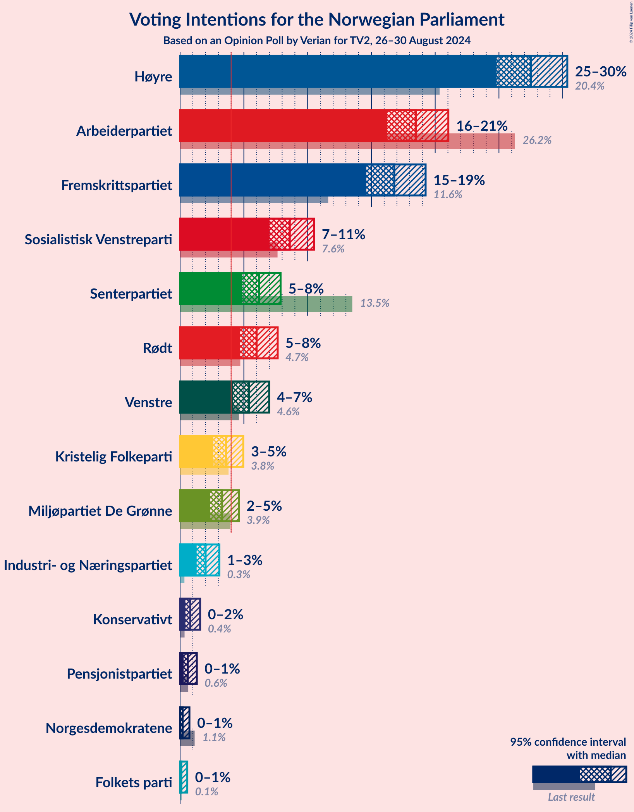

### Confidence Intervals

| Party | Last Result | Poll Result | 80% Confidence Interval | 90% Confidence Interval | 95% Confidence Interval | 99% Confidence Interval |
|:-----:|:-----------:|:-----------:|:-----------------------:|:-----------------------:|:-----------------------:|:-----------------------:|
| Høyre | 20.4% | 27.5% | 25.7–29.4% |25.2–29.9% |24.8–30.4% |24.0–31.3% |
| Arbeiderpartiet | 26.2% | 18.5% | 17.0–20.1% |16.6–20.6% |16.2–21.0% |15.5–21.8% |
| Fremskrittspartiet | 11.6% | 16.8% | 15.4–18.4% |15.0–18.9% |14.6–19.3% |13.9–20.0% |
| Sosialistisk Venstreparti | 7.6% | 8.6% | 7.6–9.8% |7.3–10.2% |7.0–10.5% |6.5–11.1% |
| Senterpartiet | 13.5% | 6.2% | 5.3–7.3% |5.1–7.6% |4.9–7.9% |4.5–8.4% |
| Rødt | 4.7% | 6.0% | 5.1–7.1% |4.9–7.4% |4.7–7.7% |4.3–8.2% |
| Venstre | 4.6% | 5.4% | 4.6–6.4% |4.3–6.7% |4.2–7.0% |3.8–7.5% |
| Kristelig Folkeparti | 3.8% | 3.6% | 2.9–4.5% |2.8–4.7% |2.6–5.0% |2.3–5.4% |
| Miljøpartiet De Grønne | 3.9% | 3.3% | 2.7–4.1% |2.5–4.4% |2.4–4.6% |2.1–5.0% |
| Industri- og Næringspartiet | 0.3% | 2.0% | 1.5–2.7% |1.4–2.9% |1.3–3.1% |1.1–3.4% |
| Konservativt | 0.4% | 0.8% | 0.5–1.3% |0.5–1.4% |0.4–1.6% |0.3–1.9% |
| Pensjonistpartiet | 0.6% | 0.6% | 0.4–1.1% |0.3–1.2% |0.3–1.3% |0.2–1.6% |
| Norgesdemokratene | 1.1% | 0.2% | 0.1–0.5% |0.1–0.6% |0.1–0.7% |0.0–0.9% |
| Folkets parti | 0.1% | 0.1% | 0.0–0.4% |0.0–0.5% |0.0–0.6% |0.0–0.7% |

*Note:* The poll result column reflects the actual value used in the calculations. Published results may vary slightly, and in addition be rounded to fewer digits.

## Seats

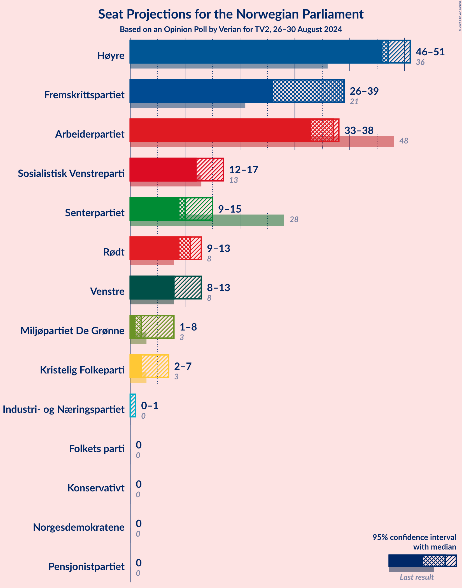

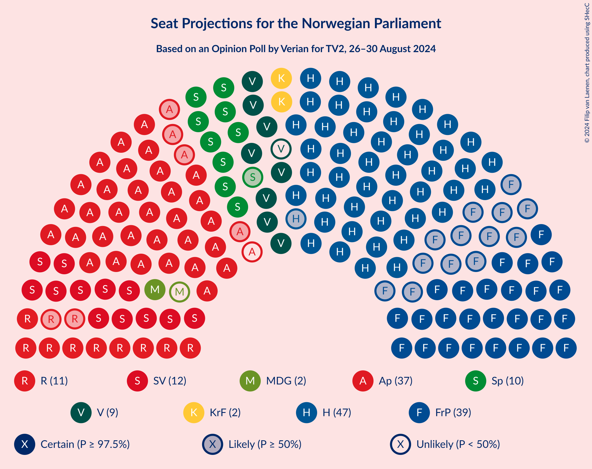

### Confidence Intervals

| Party | Last Result | Median | 80% Confidence Interval | 90% Confidence Interval | 95% Confidence Interval | 99% Confidence Interval |
|:-----:|:-----------:|:------:|:-----------------------:|:-----------------------:|:-----------------------:|:-----------------------:|
| <a href="#høyre">Høyre</a> | 36 | 47 | 47–50 |47–51 |46–51 |44–54 |
| <a href="#arbeiderpartiet">Arbeiderpartiet</a> | 48 | 37 | 34–37 |33–37 |33–38 |30–40 |
| <a href="#fremskrittspartiet">Fremskrittspartiet</a> | 21 | 39 | 27–39 |27–39 |26–39 |26–39 |
| <a href="#sosialistisk-venstreparti">Sosialistisk Venstreparti</a> | 13 | 12 | 12–16 |12–17 |12–17 |11–20 |
| <a href="#senterpartiet">Senterpartiet</a> | 28 | 10 | 10–14 |10–14 |9–15 |8–15 |
| <a href="#rødt">Rødt</a> | 8 | 11 | 10–13 |9–13 |9–13 |7–14 |
| <a href="#venstre">Venstre</a> | 8 | 8 | 8–12 |8–12 |8–13 |7–14 |
| <a href="#kristelig-folkeparti">Kristelig Folkeparti</a> | 3 | 2 | 2–3 |2–7 |2–7 |0–8 |
| <a href="#miljøpartiet-de-grønne">Miljøpartiet De Grønne</a> | 3 | 2 | 1–3 |1–7 |1–8 |1–8 |
| <a href="#industri--og-næringspartiet">Industri- og Næringspartiet</a> | 0 | 0 | 0 |0 |0–1 |0–2 |
| <a href="#konservativt">Konservativt</a> | 0 | 0 | 0 |0 |0 |0 |
| <a href="#pensjonistpartiet">Pensjonistpartiet</a> | 0 | 0 | 0 |0 |0 |0 |
| <a href="#norgesdemokratene">Norgesdemokratene</a> | 0 | 0 | 0 |0 |0 |0 |
| <a href="#folkets-parti">Folkets parti</a> | 0 | 0 | 0 |0 |0 |0 |

### Høyre

*For a full overview of the results for this party, see the [Høyre](party-høyre.html) page.*

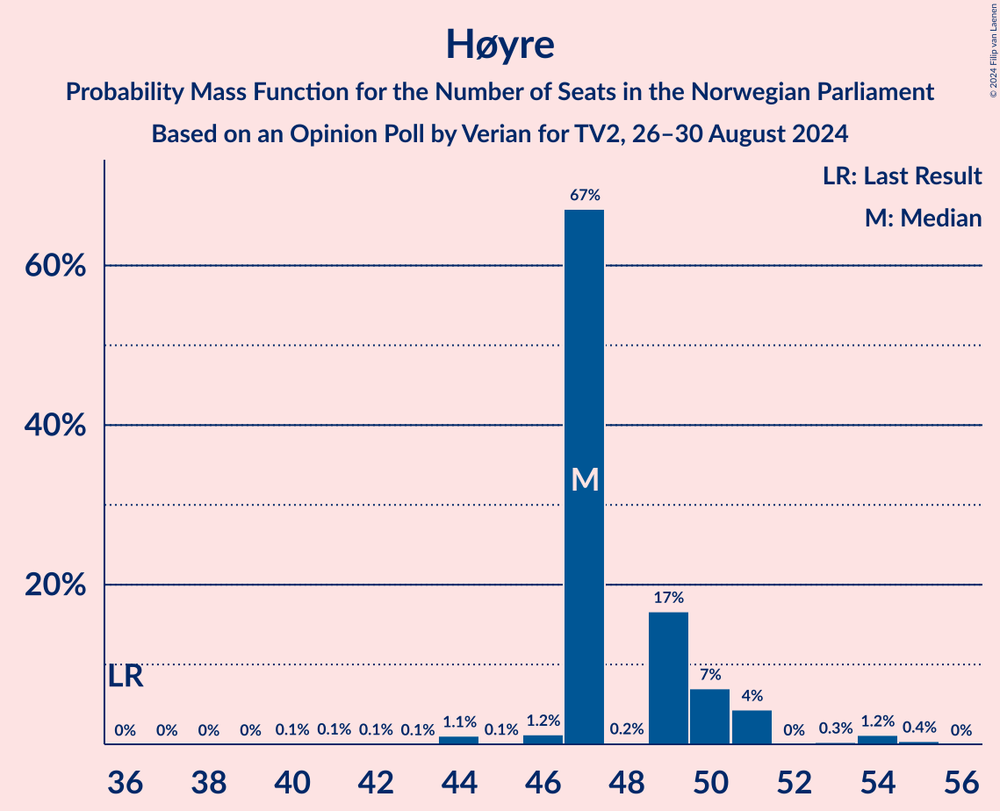

| Number of Seats | Probability | Accumulated | Special Marks |
|:---------------:|:-----------:|:-----------:|:-------------:|
| 36 | 0% | 100% | Last Result |
| 37 | 0% | 100% |  |
| 38 | 0% | 100% |  |
| 39 | 0% | 100% |  |
| 40 | 0.1% | 100% |  |
| 41 | 0.1% | 99.9% |  |
| 42 | 0.1% | 99.7% |  |
| 43 | 0.1% | 99.6% |  |
| 44 | 1.1% | 99.6% |  |
| 45 | 0.1% | 98.5% |  |
| 46 | 1.2% | 98% |  |
| 47 | 67% | 97% | Median |
| 48 | 0.2% | 30% |  |
| 49 | 17% | 30% |  |
| 50 | 7% | 13% |  |
| 51 | 4% | 6% |  |
| 52 | 0% | 2% |  |
| 53 | 0.3% | 2% |  |
| 54 | 1.2% | 2% |  |
| 55 | 0.4% | 0.4% |  |
| 56 | 0% | 0% |  |

### Arbeiderpartiet

*For a full overview of the results for this party, see the [Arbeiderpartiet](party-arbeiderpartiet.html) page.*

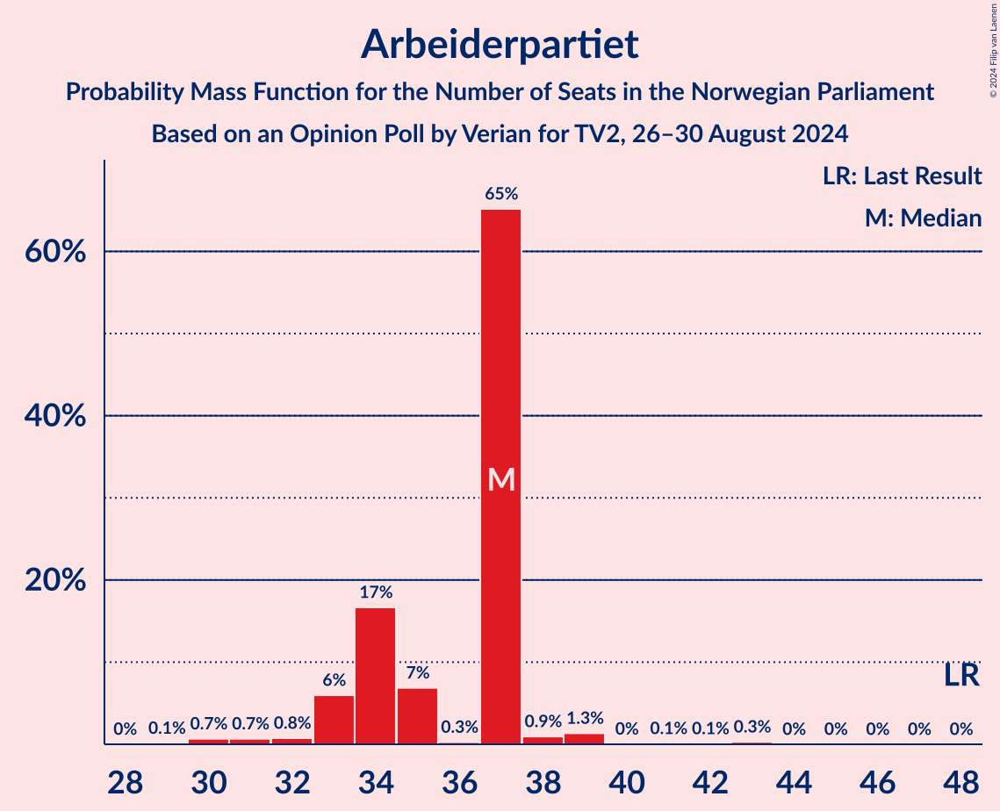

| Number of Seats | Probability | Accumulated | Special Marks |
|:---------------:|:-----------:|:-----------:|:-------------:|
| 29 | 0.1% | 100% |  |
| 30 | 0.7% | 99.8% |  |
| 31 | 0.7% | 99.2% |  |
| 32 | 0.8% | 98.5% |  |
| 33 | 6% | 98% |  |
| 34 | 17% | 92% |  |
| 35 | 7% | 75% |  |
| 36 | 0.3% | 68% |  |
| 37 | 65% | 68% | Median |
| 38 | 0.9% | 3% |  |
| 39 | 1.3% | 2% |  |
| 40 | 0% | 0.5% |  |
| 41 | 0.1% | 0.5% |  |
| 42 | 0.1% | 0.4% |  |
| 43 | 0.3% | 0.3% |  |
| 44 | 0% | 0% |  |
| 45 | 0% | 0% |  |
| 46 | 0% | 0% |  |
| 47 | 0% | 0% |  |
| 48 | 0% | 0% | Last Result |

### Fremskrittspartiet

*For a full overview of the results for this party, see the [Fremskrittspartiet](party-fremskrittspartiet.html) page.*

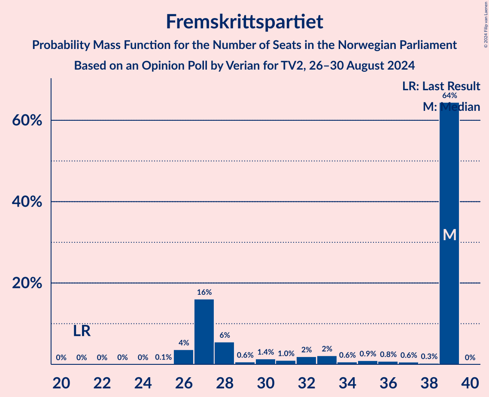

| Number of Seats | Probability | Accumulated | Special Marks |
|:---------------:|:-----------:|:-----------:|:-------------:|
| 21 | 0% | 100% | Last Result |
| 22 | 0% | 100% |  |
| 23 | 0% | 100% |  |
| 24 | 0% | 100% |  |
| 25 | 0.1% | 99.9% |  |
| 26 | 4% | 99.8% |  |
| 27 | 16% | 96% |  |
| 28 | 6% | 80% |  |
| 29 | 0.6% | 75% |  |
| 30 | 1.4% | 74% |  |
| 31 | 1.0% | 73% |  |
| 32 | 2% | 72% |  |
| 33 | 2% | 70% |  |
| 34 | 0.6% | 68% |  |
| 35 | 0.9% | 67% |  |
| 36 | 0.8% | 66% |  |
| 37 | 0.6% | 65% |  |
| 38 | 0.3% | 65% |  |
| 39 | 64% | 64% | Median |
| 40 | 0% | 0% |  |

### Sosialistisk Venstreparti

*For a full overview of the results for this party, see the [Sosialistisk Venstreparti](party-sosialistiskvenstreparti.html) page.*

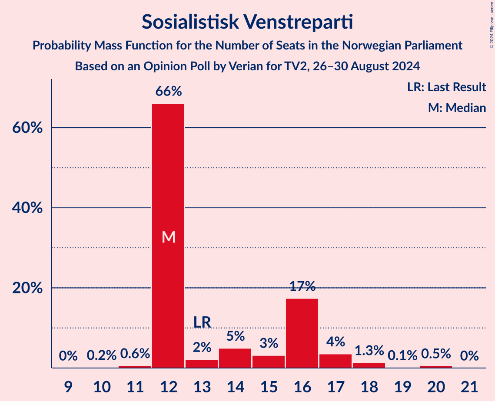

| Number of Seats | Probability | Accumulated | Special Marks |
|:---------------:|:-----------:|:-----------:|:-------------:|
| 10 | 0.2% | 100% |  |
| 11 | 0.6% | 99.8% |  |
| 12 | 66% | 99.2% | Median |
| 13 | 2% | 33% | Last Result |
| 14 | 5% | 31% |  |
| 15 | 3% | 26% |  |
| 16 | 17% | 23% |  |
| 17 | 4% | 6% |  |
| 18 | 1.3% | 2% |  |
| 19 | 0.1% | 0.7% |  |
| 20 | 0.5% | 0.6% |  |
| 21 | 0% | 0% |  |

### Senterpartiet

*For a full overview of the results for this party, see the [Senterpartiet](party-senterpartiet.html) page.*

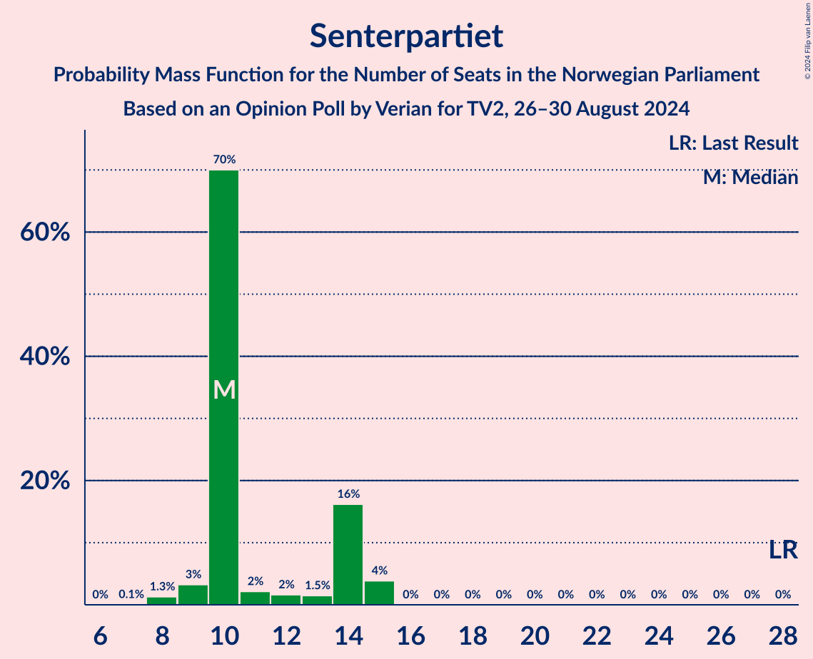

| Number of Seats | Probability | Accumulated | Special Marks |
|:---------------:|:-----------:|:-----------:|:-------------:|
| 7 | 0.1% | 100% |  |
| 8 | 1.3% | 99.9% |  |
| 9 | 3% | 98.6% |  |
| 10 | 70% | 95% | Median |
| 11 | 2% | 25% |  |
| 12 | 2% | 23% |  |
| 13 | 1.5% | 22% |  |
| 14 | 16% | 20% |  |
| 15 | 4% | 4% |  |
| 16 | 0% | 0% |  |
| 17 | 0% | 0% |  |
| 18 | 0% | 0% |  |
| 19 | 0% | 0% |  |
| 20 | 0% | 0% |  |
| 21 | 0% | 0% |  |
| 22 | 0% | 0% |  |
| 23 | 0% | 0% |  |
| 24 | 0% | 0% |  |
| 25 | 0% | 0% |  |
| 26 | 0% | 0% |  |
| 27 | 0% | 0% |  |
| 28 | 0% | 0% | Last Result |

### Rødt

*For a full overview of the results for this party, see the [Rødt](party-rødt.html) page.*

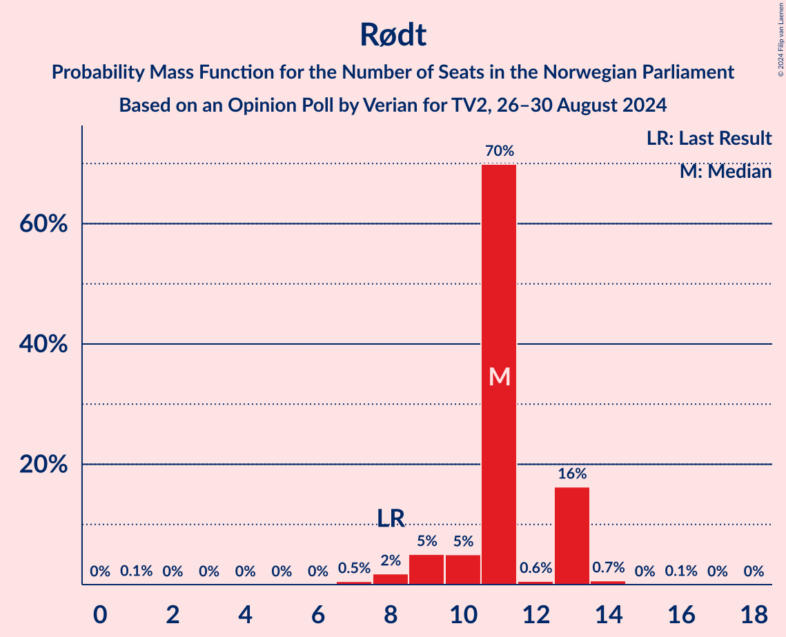

| Number of Seats | Probability | Accumulated | Special Marks |
|:---------------:|:-----------:|:-----------:|:-------------:|
| 1 | 0.1% | 100% |  |
| 2 | 0% | 99.9% |  |
| 3 | 0% | 99.9% |  |
| 4 | 0% | 99.9% |  |
| 5 | 0% | 99.9% |  |
| 6 | 0% | 99.9% |  |
| 7 | 0.5% | 99.9% |  |
| 8 | 2% | 99.3% | Last Result |
| 9 | 5% | 98% |  |
| 10 | 5% | 92% |  |
| 11 | 70% | 87% | Median |
| 12 | 0.6% | 18% |  |
| 13 | 16% | 17% |  |
| 14 | 0.7% | 0.7% |  |
| 15 | 0% | 0.1% |  |
| 16 | 0.1% | 0.1% |  |
| 17 | 0% | 0% |  |

### Venstre

*For a full overview of the results for this party, see the [Venstre](party-venstre.html) page.*

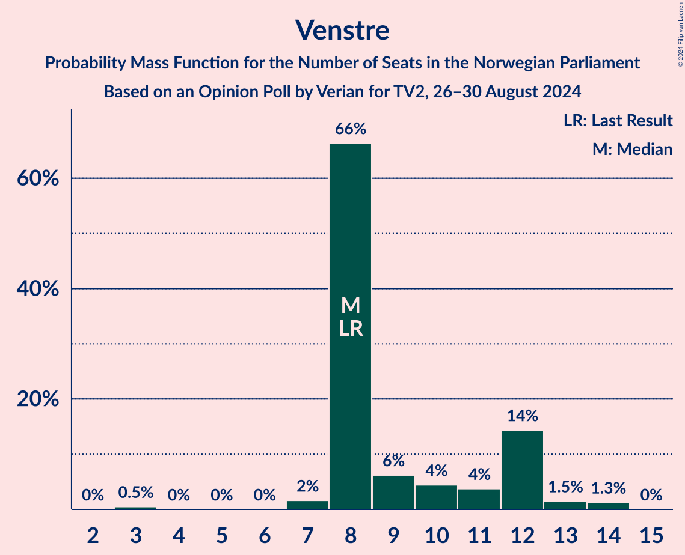

| Number of Seats | Probability | Accumulated | Special Marks |
|:---------------:|:-----------:|:-----------:|:-------------:|
| 3 | 0.5% | 100% |  |
| 4 | 0% | 99.5% |  |
| 5 | 0% | 99.5% |  |
| 6 | 0% | 99.5% |  |
| 7 | 2% | 99.5% |  |
| 8 | 66% | 98% | Last Result, Median |
| 9 | 6% | 31% |  |
| 10 | 4% | 25% |  |
| 11 | 4% | 21% |  |
| 12 | 14% | 17% |  |
| 13 | 1.5% | 3% |  |
| 14 | 1.3% | 1.3% |  |
| 15 | 0% | 0% |  |

### Kristelig Folkeparti

*For a full overview of the results for this party, see the [Kristelig Folkeparti](party-kristeligfolkeparti.html) page.*

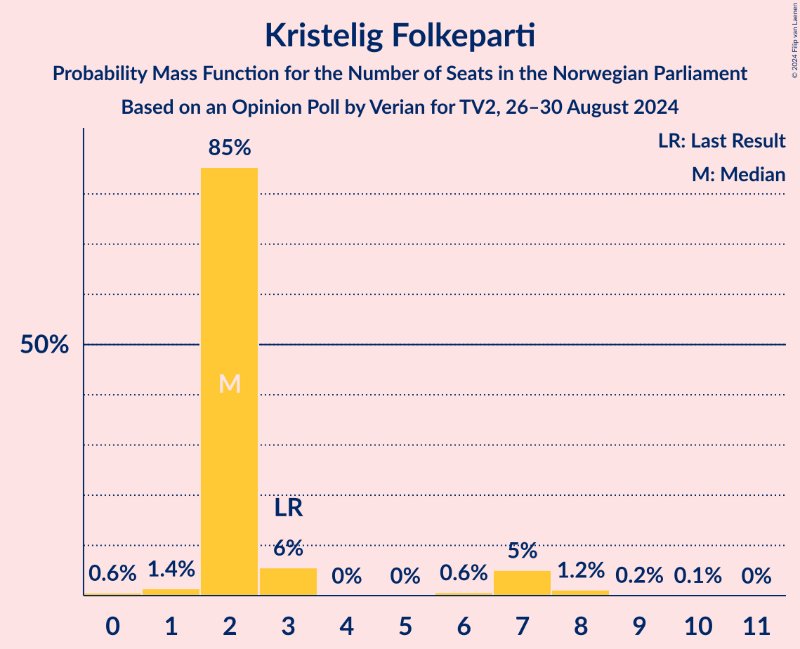

| Number of Seats | Probability | Accumulated | Special Marks |
|:---------------:|:-----------:|:-----------:|:-------------:|
| 0 | 0.6% | 100% |  |
| 1 | 1.4% | 99.4% |  |
| 2 | 85% | 98% | Median |
| 3 | 6% | 13% | Last Result |
| 4 | 0% | 7% |  |
| 5 | 0% | 7% |  |
| 6 | 0.6% | 7% |  |
| 7 | 5% | 6% |  |
| 8 | 1.2% | 1.4% |  |
| 9 | 0.2% | 0.3% |  |
| 10 | 0.1% | 0.1% |  |
| 11 | 0% | 0% |  |

### Miljøpartiet De Grønne

*For a full overview of the results for this party, see the [Miljøpartiet De Grønne](party-miljøpartietdegrønne.html) page.*

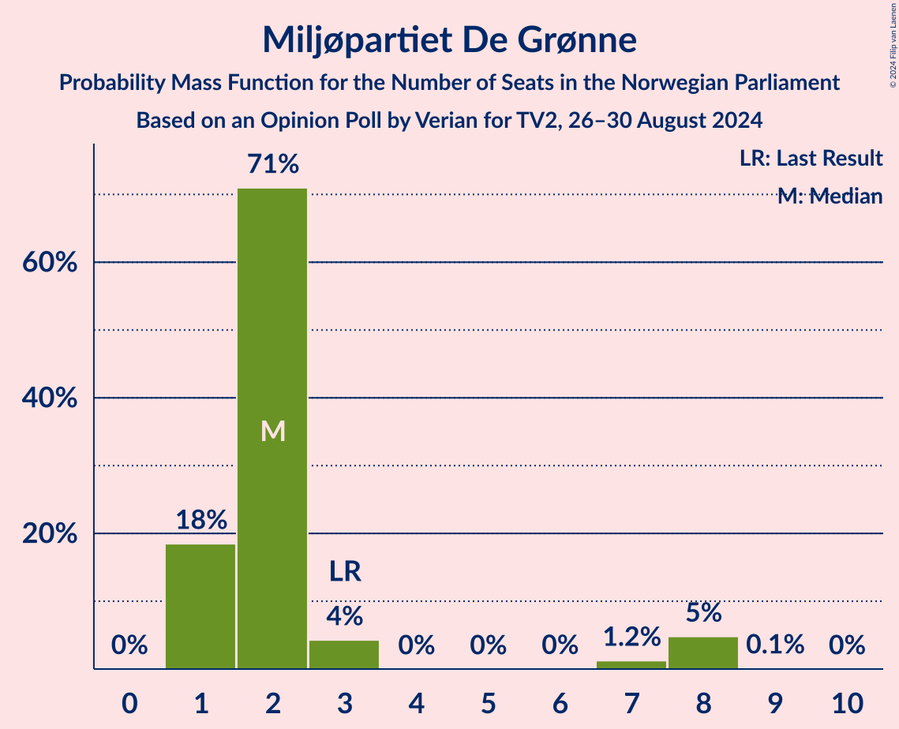

| Number of Seats | Probability | Accumulated | Special Marks |
|:---------------:|:-----------:|:-----------:|:-------------:|
| 1 | 18% | 100% |  |
| 2 | 71% | 81% | Median |
| 3 | 4% | 11% | Last Result |
| 4 | 0% | 6% |  |
| 5 | 0% | 6% |  |
| 6 | 0% | 6% |  |
| 7 | 1.2% | 6% |  |
| 8 | 5% | 5% |  |
| 9 | 0.1% | 0.1% |  |
| 10 | 0% | 0% |  |

### Industri- og Næringspartiet

*For a full overview of the results for this party, see the [Industri- og Næringspartiet](party-industri-ognæringspartiet.html) page.*

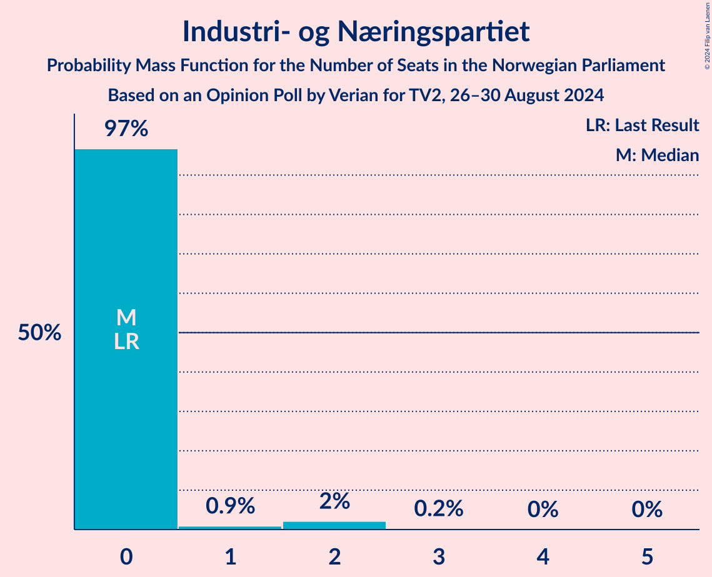

| Number of Seats | Probability | Accumulated | Special Marks |
|:---------------:|:-----------:|:-----------:|:-------------:|
| 0 | 97% | 100% | Last Result, Median |
| 1 | 0.9% | 3% |  |
| 2 | 2% | 2% |  |
| 3 | 0.2% | 0.2% |  |
| 4 | 0% | 0% |  |

### Konservativt

*For a full overview of the results for this party, see the [Konservativt](party-konservativt.html) page.*

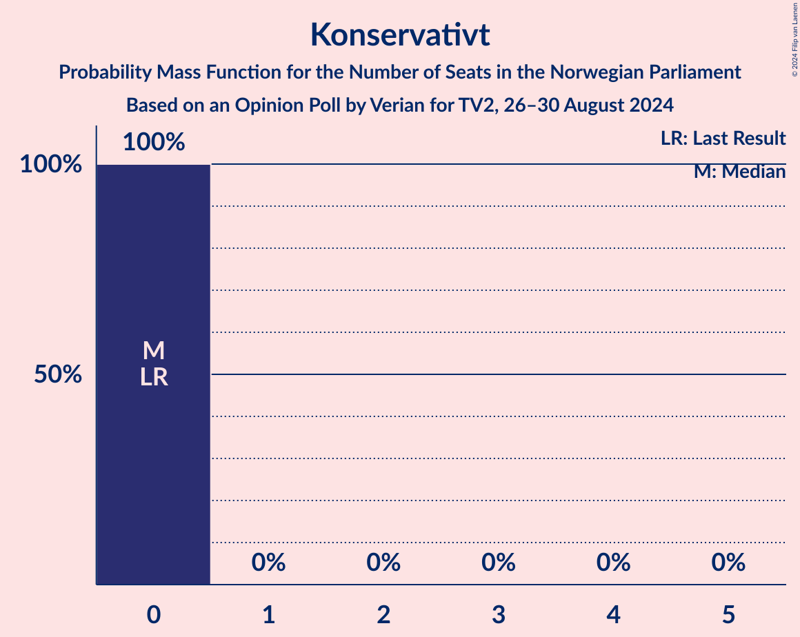

| Number of Seats | Probability | Accumulated | Special Marks |
|:---------------:|:-----------:|:-----------:|:-------------:|
| 0 | 100% | 100% | Last Result, Median |

### Pensjonistpartiet

*For a full overview of the results for this party, see the [Pensjonistpartiet](party-pensjonistpartiet.html) page.*

| Number of Seats | Probability | Accumulated | Special Marks |
|:---------------:|:-----------:|:-----------:|:-------------:|
| 0 | 100% | 100% | Last Result, Median |

### Norgesdemokratene

*For a full overview of the results for this party, see the [Norgesdemokratene](party-norgesdemokratene.html) page.*

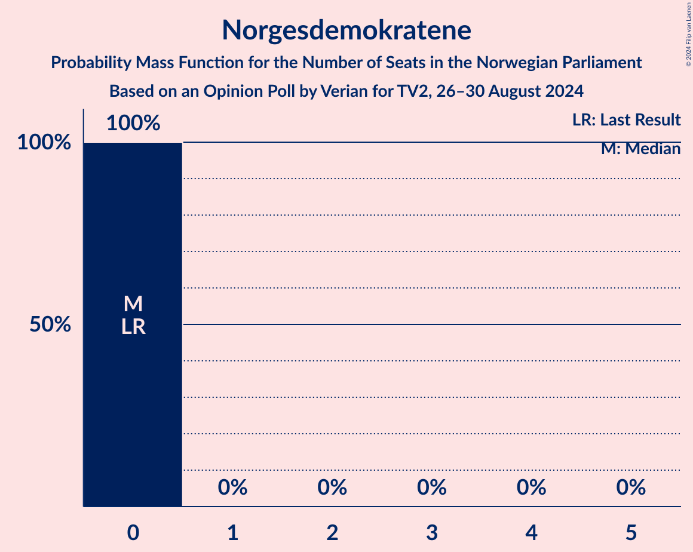

| Number of Seats | Probability | Accumulated | Special Marks |
|:---------------:|:-----------:|:-----------:|:-------------:|
| 0 | 100% | 100% | Last Result, Median |

### Folkets parti

*For a full overview of the results for this party, see the [Folkets parti](party-folketsparti.html) page.*

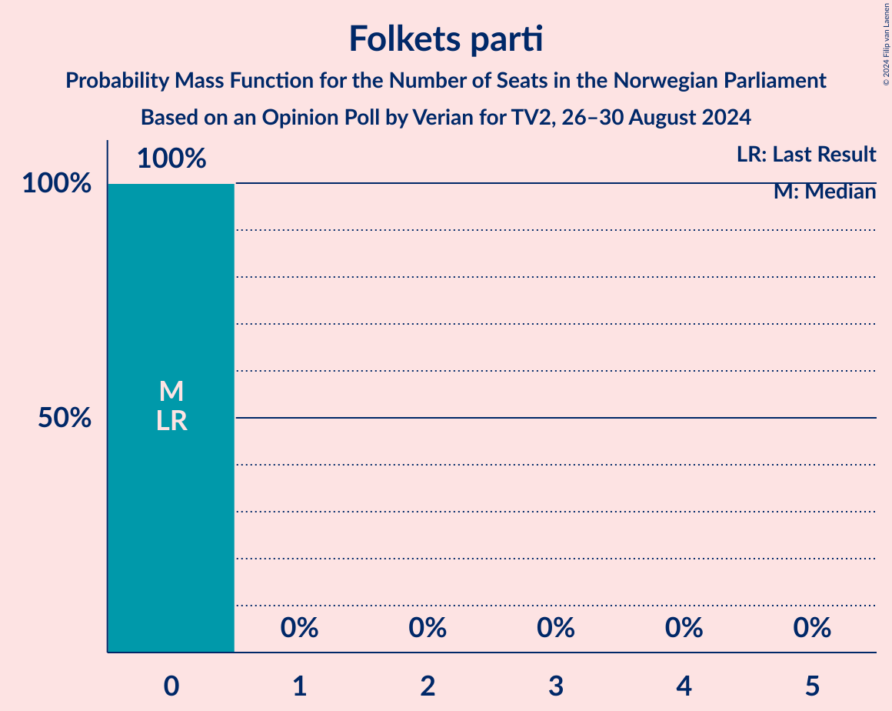

| Number of Seats | Probability | Accumulated | Special Marks |
|:---------------:|:-----------:|:-----------:|:-------------:|
| 0 | 100% | 100% | Last Result, Median |

## Coalitions

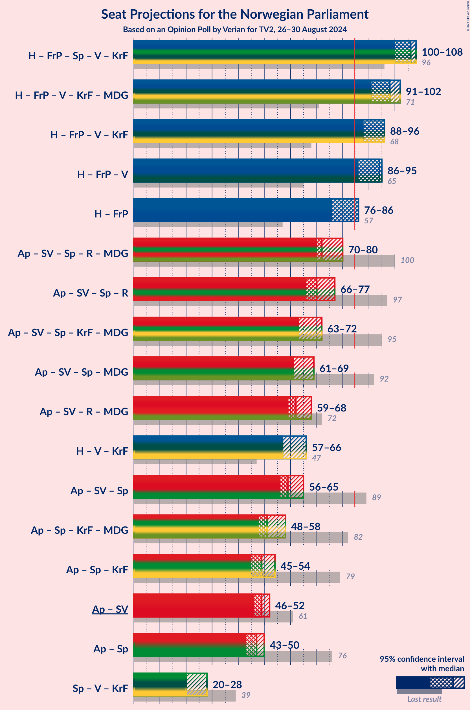

### Confidence Intervals

| Coalition | Last Result | Median | Majority? | 80% Confidence Interval | 90% Confidence Interval | 95% Confidence Interval | 99% Confidence Interval |
|:---------:|:-----------:|:------:|:---------:|:-----------------------:|:-----------------------:|:-----------------------:|:-----------------------:|
| Høyre – Fremskrittspartiet – Senterpartiet – Venstre – Kristelig Folkeparti | 96 | 106 | 100% | 104–106 | 102–106 | 100–108 | 98–111 |
| Høyre – Fremskrittspartiet – Venstre – Kristelig Folkeparti – Miljøpartiet De Grønne | 71 | 98 | 100% | 91–98 | 91–102 | 91–102 | 88–104 |
| Høyre – Fremskrittspartiet – Venstre – Kristelig Folkeparti | 68 | 96 | 100% | 90–96 | 90–96 | 88–96 | 85–102 |
| Høyre – Fremskrittspartiet – Venstre | 65 | 94 | 98% | 88–94 | 87–94 | 86–95 | 82–97 |
| Høyre – Fremskrittspartiet | 57 | 86 | 67% | 76–86 | 76–86 | 76–86 | 74–87 |
| Arbeiderpartiet – Sosialistisk Venstreparti – Senterpartiet – Rødt – Miljøpartiet De Grønne | 100 | 72 | 0% | 72–78 | 72–78 | 70–80 | 66–83 |
| Arbeiderpartiet – Sosialistisk Venstreparti – Senterpartiet – Rødt | 97 | 70 | 0% | 69–77 | 66–77 | 66–77 | 64–80 |
| Arbeiderpartiet – Sosialistisk Venstreparti – Senterpartiet – Kristelig Folkeparti – Miljøpartiet De Grønne | 95 | 63 | 0% | 63–69 | 63–72 | 63–72 | 60–73 |
| Arbeiderpartiet – Sosialistisk Venstreparti – Senterpartiet – Miljøpartiet De Grønne | 92 | 61 | 0% | 61–65 | 61–67 | 61–69 | 56–70 |
| Arbeiderpartiet – Sosialistisk Venstreparti – Rødt – Miljøpartiet De Grønne | 72 | 62 | 0% | 62–64 | 62–66 | 59–68 | 56–69 |
| Høyre – Venstre – Kristelig Folkeparti | 47 | 57 | 0% | 57–64 | 57–66 | 57–66 | 55–67 |
| Arbeiderpartiet – Sosialistisk Venstreparti – Senterpartiet | 89 | 59 | 0% | 59–64 | 57–65 | 56–65 | 54–68 |
| Arbeiderpartiet – Senterpartiet – Kristelig Folkeparti – Miljøpartiet De Grønne | 82 | 51 | 0% | 51–54 | 50–58 | 48–58 | 46–60 |
| Arbeiderpartiet – Senterpartiet – Kristelig Folkeparti | 79 | 49 | 0% | 49–50 | 47–52 | 45–54 | 45–57 |
| Arbeiderpartiet – Sosialistisk Venstreparti | 61 | 49 | 0% | 49–50 | 47–52 | 46–52 | 45–58 |
| Arbeiderpartiet – Senterpartiet | 76 | 47 | 0% | 44–48 | 43–49 | 43–50 | 39–54 |
| Senterpartiet – Venstre – Kristelig Folkeparti | 39 | 20 | 0% | 20–28 | 20–28 | 20–28 | 19–31 |

### Høyre – Fremskrittspartiet – Senterpartiet – Venstre – Kristelig Folkeparti

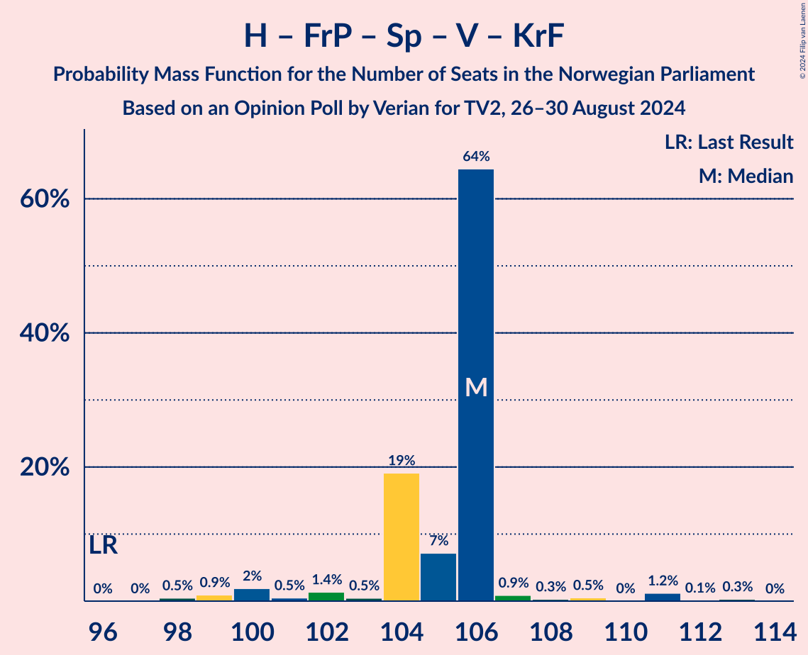

| Number of Seats | Probability | Accumulated | Special Marks |
|:---------------:|:-----------:|:-----------:|:-------------:|
| 96 | 0% | 100% | Last Result |
| 97 | 0% | 99.9% |  |
| 98 | 0.5% | 99.9% |  |
| 99 | 0.9% | 99.4% |  |
| 100 | 2% | 98% |  |
| 101 | 0.5% | 97% |  |
| 102 | 1.4% | 96% |  |
| 103 | 0.5% | 95% |  |
| 104 | 19% | 94% |  |
| 105 | 7% | 75% |  |
| 106 | 64% | 68% | Median |
| 107 | 0.9% | 3% |  |
| 108 | 0.3% | 3% |  |
| 109 | 0.5% | 2% |  |
| 110 | 0% | 2% |  |
| 111 | 1.2% | 2% |  |
| 112 | 0.1% | 0.5% |  |
| 113 | 0.3% | 0.3% |  |
| 114 | 0% | 0% |  |

### Høyre – Fremskrittspartiet – Venstre – Kristelig Folkeparti – Miljøpartiet De Grønne

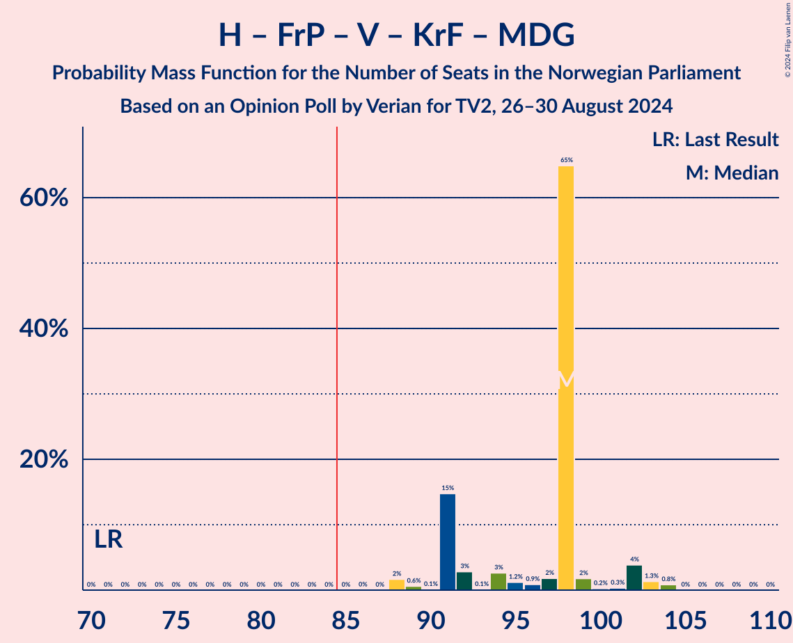

| Number of Seats | Probability | Accumulated | Special Marks |
|:---------------:|:-----------:|:-----------:|:-------------:|
| 71 | 0% | 100% | Last Result |
| 72 | 0% | 100% |  |
| 73 | 0% | 100% |  |
| 74 | 0% | 100% |  |
| 75 | 0% | 100% |  |
| 76 | 0% | 100% |  |
| 77 | 0% | 100% |  |
| 78 | 0% | 100% |  |
| 79 | 0% | 100% |  |
| 80 | 0% | 100% |  |
| 81 | 0% | 100% |  |
| 82 | 0% | 100% |  |
| 83 | 0% | 100% |  |
| 84 | 0% | 100% |  |
| 85 | 0% | 100% | Majority |
| 86 | 0% | 100% |  |
| 87 | 0% | 100% |  |
| 88 | 2% | 100% |  |
| 89 | 0.6% | 98% |  |
| 90 | 0.1% | 98% |  |
| 91 | 15% | 98% |  |
| 92 | 3% | 83% |  |
| 93 | 0.1% | 80% |  |
| 94 | 3% | 80% |  |
| 95 | 1.2% | 77% |  |
| 96 | 0.9% | 76% |  |
| 97 | 2% | 75% |  |
| 98 | 65% | 73% | Median |
| 99 | 2% | 8% |  |
| 100 | 0.2% | 7% |  |
| 101 | 0.3% | 6% |  |
| 102 | 4% | 6% |  |
| 103 | 1.3% | 2% |  |
| 104 | 0.8% | 0.9% |  |
| 105 | 0% | 0.1% |  |
| 106 | 0% | 0% |  |

### Høyre – Fremskrittspartiet – Venstre – Kristelig Folkeparti

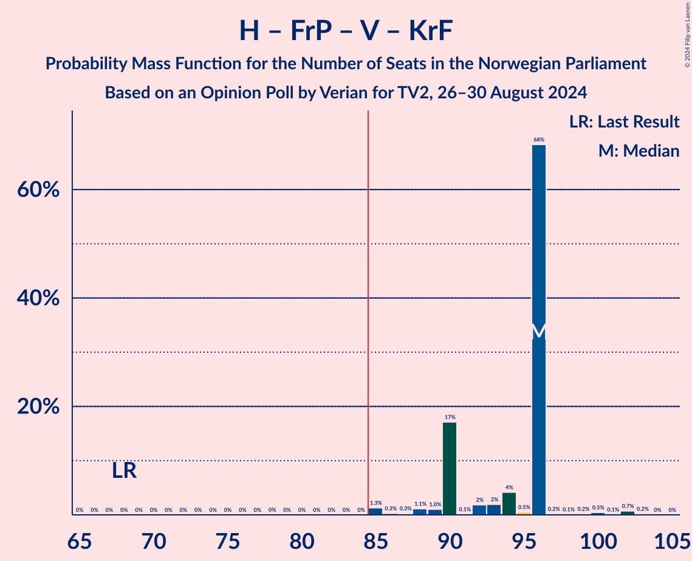

| Number of Seats | Probability | Accumulated | Special Marks |
|:---------------:|:-----------:|:-----------:|:-------------:|
| 68 | 0% | 100% | Last Result |
| 69 | 0% | 100% |  |
| 70 | 0% | 100% |  |
| 71 | 0% | 100% |  |
| 72 | 0% | 100% |  |
| 73 | 0% | 100% |  |
| 74 | 0% | 100% |  |
| 75 | 0% | 100% |  |
| 76 | 0% | 100% |  |
| 77 | 0% | 100% |  |
| 78 | 0% | 100% |  |
| 79 | 0% | 100% |  |
| 80 | 0% | 100% |  |
| 81 | 0% | 100% |  |
| 82 | 0% | 100% |  |
| 83 | 0% | 100% |  |
| 84 | 0% | 100% |  |
| 85 | 1.3% | 100% | Majority |
| 86 | 0.3% | 98.7% |  |
| 87 | 0.3% | 98% |  |
| 88 | 1.1% | 98% |  |
| 89 | 1.0% | 97% |  |
| 90 | 17% | 96% |  |
| 91 | 0.1% | 79% |  |
| 92 | 2% | 79% |  |
| 93 | 2% | 77% |  |
| 94 | 4% | 75% |  |
| 95 | 0.5% | 71% |  |
| 96 | 68% | 70% | Median |
| 97 | 0.2% | 2% |  |
| 98 | 0.1% | 2% |  |
| 99 | 0.2% | 2% |  |
| 100 | 0.5% | 1.4% |  |
| 101 | 0.1% | 1.0% |  |
| 102 | 0.7% | 0.9% |  |
| 103 | 0.2% | 0.2% |  |
| 104 | 0% | 0% |  |

### Høyre – Fremskrittspartiet – Venstre

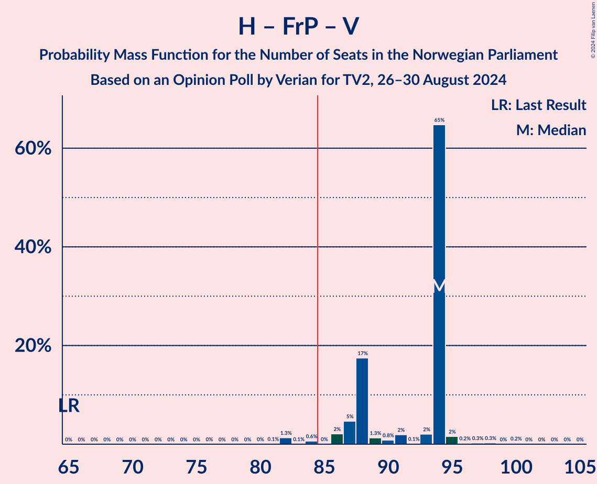

| Number of Seats | Probability | Accumulated | Special Marks |
|:---------------:|:-----------:|:-----------:|:-------------:|
| 65 | 0% | 100% | Last Result |
| 66 | 0% | 100% |  |
| 67 | 0% | 100% |  |
| 68 | 0% | 100% |  |
| 69 | 0% | 100% |  |
| 70 | 0% | 100% |  |
| 71 | 0% | 100% |  |
| 72 | 0% | 100% |  |
| 73 | 0% | 100% |  |
| 74 | 0% | 100% |  |
| 75 | 0% | 100% |  |
| 76 | 0% | 100% |  |
| 77 | 0% | 100% |  |
| 78 | 0% | 100% |  |
| 79 | 0% | 100% |  |
| 80 | 0% | 100% |  |
| 81 | 0.1% | 99.9% |  |
| 82 | 1.3% | 99.8% |  |
| 83 | 0.1% | 98.5% |  |
| 84 | 0.6% | 98% |  |
| 85 | 0% | 98% | Majority |
| 86 | 2% | 98% |  |
| 87 | 5% | 96% |  |
| 88 | 17% | 91% |  |
| 89 | 1.3% | 74% |  |
| 90 | 0.8% | 72% |  |
| 91 | 2% | 71% |  |
| 92 | 0.1% | 69% |  |
| 93 | 2% | 69% |  |
| 94 | 65% | 67% | Median |
| 95 | 2% | 3% |  |
| 96 | 0.2% | 0.9% |  |
| 97 | 0.3% | 0.7% |  |
| 98 | 0.3% | 0.5% |  |
| 99 | 0% | 0.2% |  |
| 100 | 0.2% | 0.2% |  |
| 101 | 0% | 0% |  |

### Høyre – Fremskrittspartiet

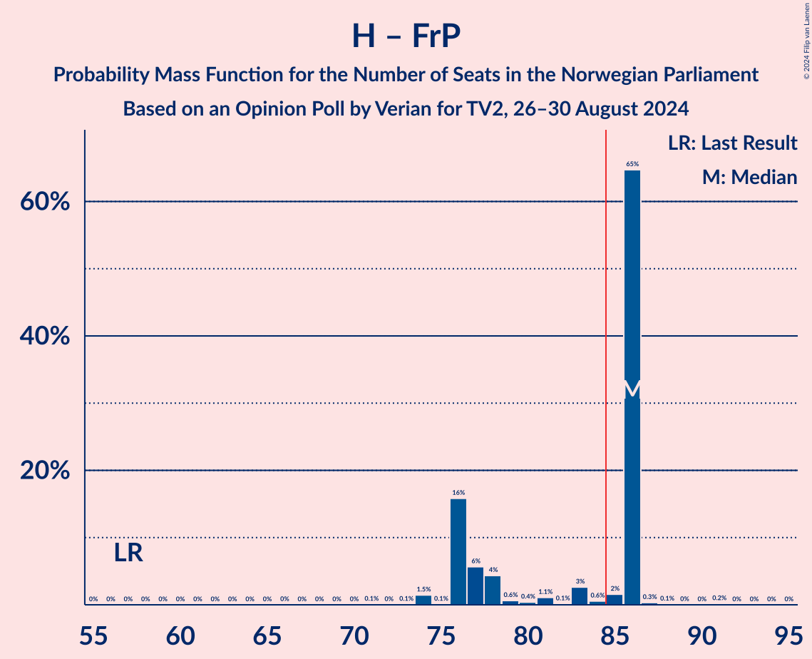

| Number of Seats | Probability | Accumulated | Special Marks |
|:---------------:|:-----------:|:-----------:|:-------------:|
| 57 | 0% | 100% | Last Result |
| 58 | 0% | 100% |  |
| 59 | 0% | 100% |  |
| 60 | 0% | 100% |  |
| 61 | 0% | 100% |  |
| 62 | 0% | 100% |  |
| 63 | 0% | 100% |  |
| 64 | 0% | 100% |  |
| 65 | 0% | 100% |  |
| 66 | 0% | 100% |  |
| 67 | 0% | 100% |  |
| 68 | 0% | 100% |  |
| 69 | 0% | 100% |  |
| 70 | 0% | 100% |  |
| 71 | 0.1% | 100% |  |
| 72 | 0% | 99.9% |  |
| 73 | 0.1% | 99.9% |  |
| 74 | 1.5% | 99.8% |  |
| 75 | 0.1% | 98% |  |
| 76 | 16% | 98% |  |
| 77 | 6% | 82% |  |
| 78 | 4% | 77% |  |
| 79 | 0.6% | 72% |  |
| 80 | 0.4% | 72% |  |
| 81 | 1.1% | 71% |  |
| 82 | 0.1% | 70% |  |
| 83 | 3% | 70% |  |
| 84 | 0.6% | 67% |  |
| 85 | 2% | 67% | Majority |
| 86 | 65% | 65% | Median |
| 87 | 0.3% | 0.6% |  |
| 88 | 0.1% | 0.3% |  |
| 89 | 0% | 0.2% |  |
| 90 | 0% | 0.2% |  |
| 91 | 0.2% | 0.2% |  |
| 92 | 0% | 0% |  |

### Arbeiderpartiet – Sosialistisk Venstreparti – Senterpartiet – Rødt – Miljøpartiet De Grønne

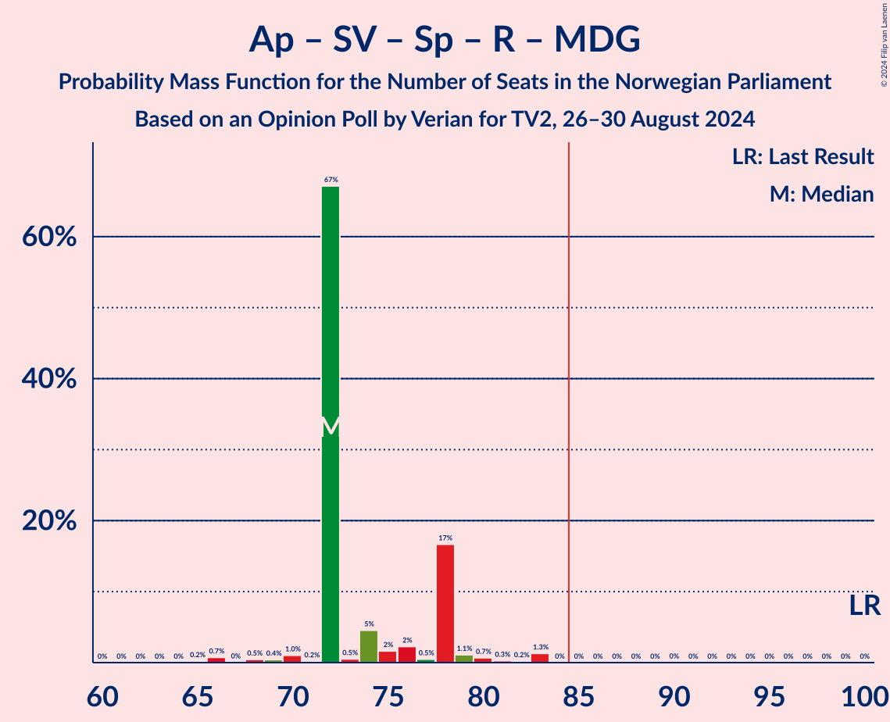

| Number of Seats | Probability | Accumulated | Special Marks |
|:---------------:|:-----------:|:-----------:|:-------------:|
| 65 | 0.2% | 100% |  |
| 66 | 0.7% | 99.8% |  |
| 67 | 0% | 99.0% |  |
| 68 | 0.5% | 99.0% |  |
| 69 | 0.4% | 98.5% |  |
| 70 | 1.0% | 98% |  |
| 71 | 0.2% | 97% |  |
| 72 | 67% | 97% | Median |
| 73 | 0.5% | 30% |  |
| 74 | 5% | 29% |  |
| 75 | 2% | 25% |  |
| 76 | 2% | 23% |  |
| 77 | 0.5% | 21% |  |
| 78 | 17% | 20% |  |
| 79 | 1.1% | 4% |  |
| 80 | 0.7% | 3% |  |
| 81 | 0.3% | 2% |  |
| 82 | 0.2% | 2% |  |
| 83 | 1.3% | 1.3% |  |
| 84 | 0% | 0% |  |
| 85 | 0% | 0% | Majority |
| 86 | 0% | 0% |  |
| 87 | 0% | 0% |  |
| 88 | 0% | 0% |  |
| 89 | 0% | 0% |  |
| 90 | 0% | 0% |  |
| 91 | 0% | 0% |  |
| 92 | 0% | 0% |  |
| 93 | 0% | 0% |  |
| 94 | 0% | 0% |  |
| 95 | 0% | 0% |  |
| 96 | 0% | 0% |  |
| 97 | 0% | 0% |  |
| 98 | 0% | 0% |  |
| 99 | 0% | 0% |  |
| 100 | 0% | 0% | Last Result |

### Arbeiderpartiet – Sosialistisk Venstreparti – Senterpartiet – Rødt

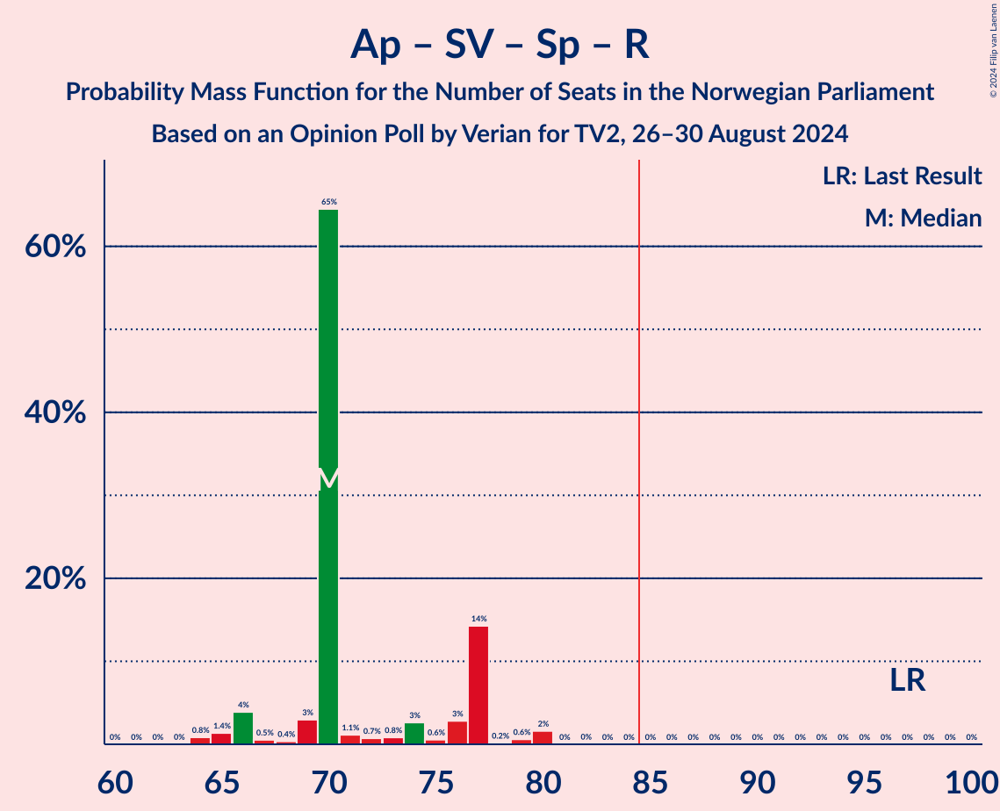

| Number of Seats | Probability | Accumulated | Special Marks |
|:---------------:|:-----------:|:-----------:|:-------------:|
| 63 | 0% | 100% |  |
| 64 | 0.8% | 99.9% |  |
| 65 | 1.4% | 99.1% |  |
| 66 | 4% | 98% |  |
| 67 | 0.5% | 94% |  |
| 68 | 0.4% | 93% |  |
| 69 | 3% | 93% |  |
| 70 | 65% | 90% | Median |
| 71 | 1.1% | 25% |  |
| 72 | 0.7% | 24% |  |
| 73 | 0.8% | 24% |  |
| 74 | 3% | 23% |  |
| 75 | 0.6% | 20% |  |
| 76 | 3% | 20% |  |
| 77 | 14% | 17% |  |
| 78 | 0.2% | 2% |  |
| 79 | 0.6% | 2% |  |
| 80 | 2% | 2% |  |
| 81 | 0% | 0% |  |
| 82 | 0% | 0% |  |
| 83 | 0% | 0% |  |
| 84 | 0% | 0% |  |
| 85 | 0% | 0% | Majority |
| 86 | 0% | 0% |  |
| 87 | 0% | 0% |  |
| 88 | 0% | 0% |  |
| 89 | 0% | 0% |  |
| 90 | 0% | 0% |  |
| 91 | 0% | 0% |  |
| 92 | 0% | 0% |  |
| 93 | 0% | 0% |  |
| 94 | 0% | 0% |  |
| 95 | 0% | 0% |  |
| 96 | 0% | 0% |  |
| 97 | 0% | 0% | Last Result |

### Arbeiderpartiet – Sosialistisk Venstreparti – Senterpartiet – Kristelig Folkeparti – Miljøpartiet De Grønne

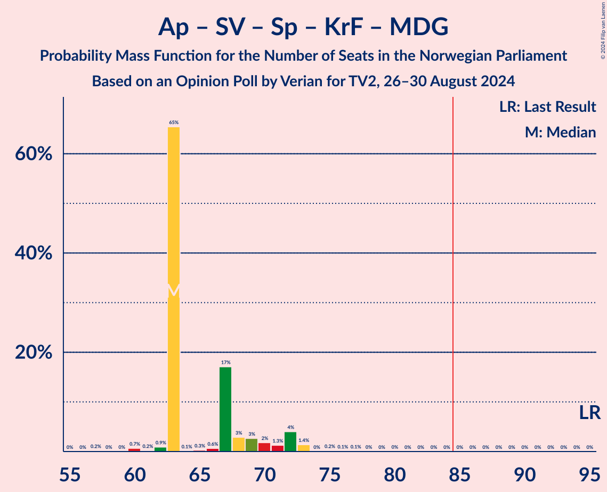

| Number of Seats | Probability | Accumulated | Special Marks |
|:---------------:|:-----------:|:-----------:|:-------------:|
| 57 | 0.2% | 100% |  |
| 58 | 0% | 99.8% |  |
| 59 | 0% | 99.8% |  |
| 60 | 0.7% | 99.8% |  |
| 61 | 0.2% | 99.1% |  |
| 62 | 0.9% | 98.9% |  |
| 63 | 65% | 98% | Median |
| 64 | 0.1% | 33% |  |
| 65 | 0.3% | 32% |  |
| 66 | 0.6% | 32% |  |
| 67 | 17% | 32% |  |
| 68 | 3% | 14% |  |
| 69 | 3% | 12% |  |
| 70 | 2% | 9% |  |
| 71 | 1.3% | 7% |  |
| 72 | 4% | 6% |  |
| 73 | 1.4% | 2% |  |
| 74 | 0% | 0.4% |  |
| 75 | 0.2% | 0.4% |  |
| 76 | 0.1% | 0.2% |  |
| 77 | 0.1% | 0.1% |  |
| 78 | 0% | 0.1% |  |
| 79 | 0% | 0% |  |
| 80 | 0% | 0% |  |
| 81 | 0% | 0% |  |
| 82 | 0% | 0% |  |
| 83 | 0% | 0% |  |
| 84 | 0% | 0% |  |
| 85 | 0% | 0% | Majority |
| 86 | 0% | 0% |  |
| 87 | 0% | 0% |  |
| 88 | 0% | 0% |  |
| 89 | 0% | 0% |  |
| 90 | 0% | 0% |  |
| 91 | 0% | 0% |  |
| 92 | 0% | 0% |  |
| 93 | 0% | 0% |  |
| 94 | 0% | 0% |  |
| 95 | 0% | 0% | Last Result |

### Arbeiderpartiet – Sosialistisk Venstreparti – Senterpartiet – Miljøpartiet De Grønne

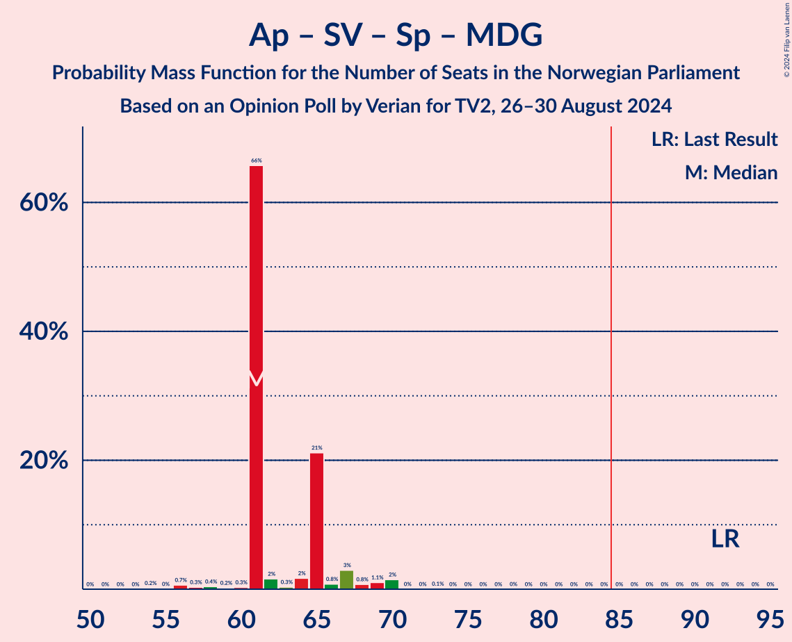

| Number of Seats | Probability | Accumulated | Special Marks |
|:---------------:|:-----------:|:-----------:|:-------------:|
| 54 | 0.2% | 100% |  |
| 55 | 0% | 99.8% |  |
| 56 | 0.7% | 99.8% |  |
| 57 | 0.3% | 99.1% |  |
| 58 | 0.4% | 98.8% |  |
| 59 | 0.2% | 98% |  |
| 60 | 0.3% | 98% |  |
| 61 | 66% | 98% | Median |
| 62 | 2% | 32% |  |
| 63 | 0.3% | 30% |  |
| 64 | 2% | 30% |  |
| 65 | 21% | 28% |  |
| 66 | 0.8% | 7% |  |
| 67 | 3% | 6% |  |
| 68 | 0.8% | 3% |  |
| 69 | 1.1% | 3% |  |
| 70 | 2% | 2% |  |
| 71 | 0% | 0.2% |  |
| 72 | 0% | 0.1% |  |
| 73 | 0.1% | 0.1% |  |
| 74 | 0% | 0% |  |
| 75 | 0% | 0% |  |
| 76 | 0% | 0% |  |
| 77 | 0% | 0% |  |
| 78 | 0% | 0% |  |
| 79 | 0% | 0% |  |
| 80 | 0% | 0% |  |
| 81 | 0% | 0% |  |
| 82 | 0% | 0% |  |
| 83 | 0% | 0% |  |
| 84 | 0% | 0% |  |
| 85 | 0% | 0% | Majority |
| 86 | 0% | 0% |  |
| 87 | 0% | 0% |  |
| 88 | 0% | 0% |  |
| 89 | 0% | 0% |  |
| 90 | 0% | 0% |  |
| 91 | 0% | 0% |  |
| 92 | 0% | 0% | Last Result |

### Arbeiderpartiet – Sosialistisk Venstreparti – Rødt – Miljøpartiet De Grønne

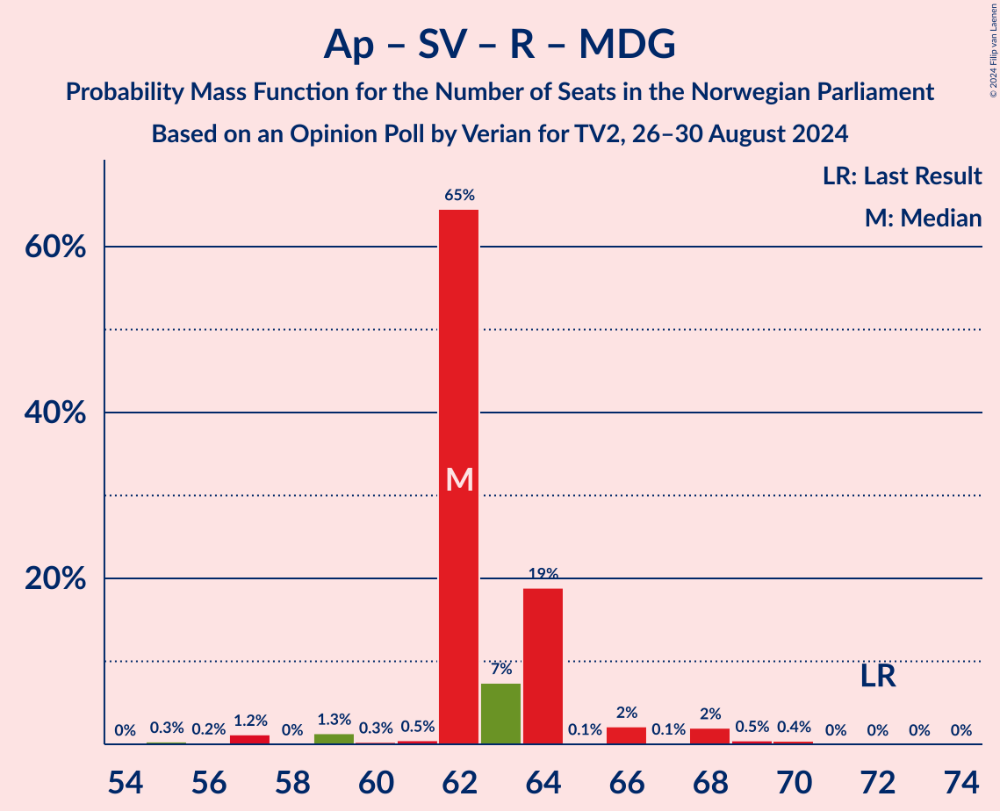

| Number of Seats | Probability | Accumulated | Special Marks |
|:---------------:|:-----------:|:-----------:|:-------------:|
| 55 | 0.3% | 100% |  |
| 56 | 0.2% | 99.7% |  |
| 57 | 1.2% | 99.5% |  |
| 58 | 0% | 98% |  |
| 59 | 1.3% | 98% |  |
| 60 | 0.3% | 97% |  |
| 61 | 0.5% | 97% |  |
| 62 | 65% | 96% | Median |
| 63 | 7% | 32% |  |
| 64 | 19% | 24% |  |
| 65 | 0.1% | 5% |  |
| 66 | 2% | 5% |  |
| 67 | 0.1% | 3% |  |
| 68 | 2% | 3% |  |
| 69 | 0.5% | 1.0% |  |
| 70 | 0.4% | 0.5% |  |
| 71 | 0% | 0.1% |  |
| 72 | 0% | 0.1% | Last Result |
| 73 | 0% | 0% |  |

### Høyre – Venstre – Kristelig Folkeparti

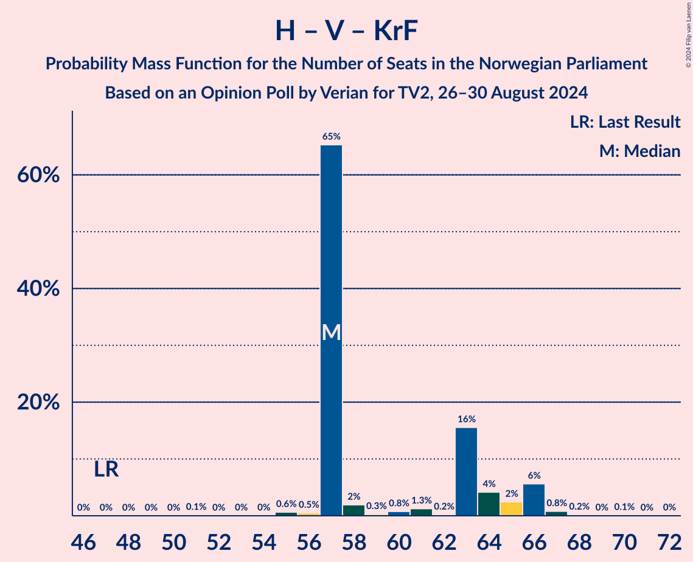

| Number of Seats | Probability | Accumulated | Special Marks |
|:---------------:|:-----------:|:-----------:|:-------------:|
| 47 | 0% | 100% | Last Result |
| 48 | 0% | 100% |  |
| 49 | 0% | 100% |  |
| 50 | 0% | 100% |  |
| 51 | 0.1% | 100% |  |
| 52 | 0% | 99.9% |  |
| 53 | 0% | 99.9% |  |
| 54 | 0% | 99.8% |  |
| 55 | 0.6% | 99.8% |  |
| 56 | 0.5% | 99.2% |  |
| 57 | 65% | 98.7% | Median |
| 58 | 2% | 33% |  |
| 59 | 0.3% | 31% |  |
| 60 | 0.8% | 31% |  |
| 61 | 1.3% | 30% |  |
| 62 | 0.2% | 29% |  |
| 63 | 16% | 29% |  |
| 64 | 4% | 13% |  |
| 65 | 2% | 9% |  |
| 66 | 6% | 7% |  |
| 67 | 0.8% | 1.2% |  |
| 68 | 0.2% | 0.4% |  |
| 69 | 0% | 0.2% |  |
| 70 | 0.1% | 0.2% |  |
| 71 | 0% | 0% |  |

### Arbeiderpartiet – Sosialistisk Venstreparti – Senterpartiet

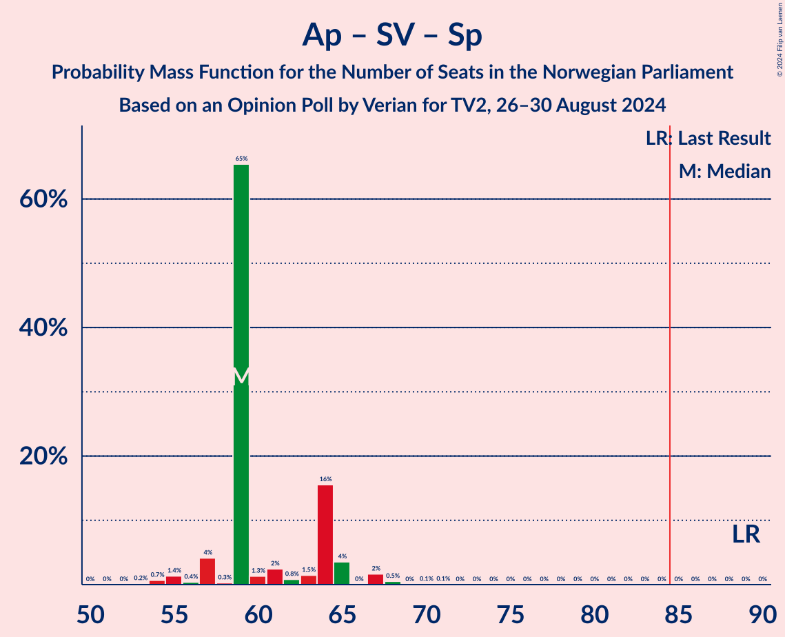

| Number of Seats | Probability | Accumulated | Special Marks |
|:---------------:|:-----------:|:-----------:|:-------------:|
| 53 | 0.2% | 100% |  |
| 54 | 0.7% | 99.8% |  |
| 55 | 1.4% | 99.1% |  |
| 56 | 0.4% | 98% |  |
| 57 | 4% | 97% |  |
| 58 | 0.3% | 93% |  |
| 59 | 65% | 93% | Median |
| 60 | 1.3% | 28% |  |
| 61 | 2% | 26% |  |
| 62 | 0.8% | 24% |  |
| 63 | 1.5% | 23% |  |
| 64 | 16% | 21% |  |
| 65 | 4% | 6% |  |
| 66 | 0% | 2% |  |
| 67 | 2% | 2% |  |
| 68 | 0.5% | 0.7% |  |
| 69 | 0% | 0.1% |  |
| 70 | 0.1% | 0.1% |  |
| 71 | 0.1% | 0.1% |  |
| 72 | 0% | 0% |  |
| 73 | 0% | 0% |  |
| 74 | 0% | 0% |  |
| 75 | 0% | 0% |  |
| 76 | 0% | 0% |  |
| 77 | 0% | 0% |  |
| 78 | 0% | 0% |  |
| 79 | 0% | 0% |  |
| 80 | 0% | 0% |  |
| 81 | 0% | 0% |  |
| 82 | 0% | 0% |  |
| 83 | 0% | 0% |  |
| 84 | 0% | 0% |  |
| 85 | 0% | 0% | Majority |
| 86 | 0% | 0% |  |
| 87 | 0% | 0% |  |
| 88 | 0% | 0% |  |
| 89 | 0% | 0% | Last Result |

### Arbeiderpartiet – Senterpartiet – Kristelig Folkeparti – Miljøpartiet De Grønne

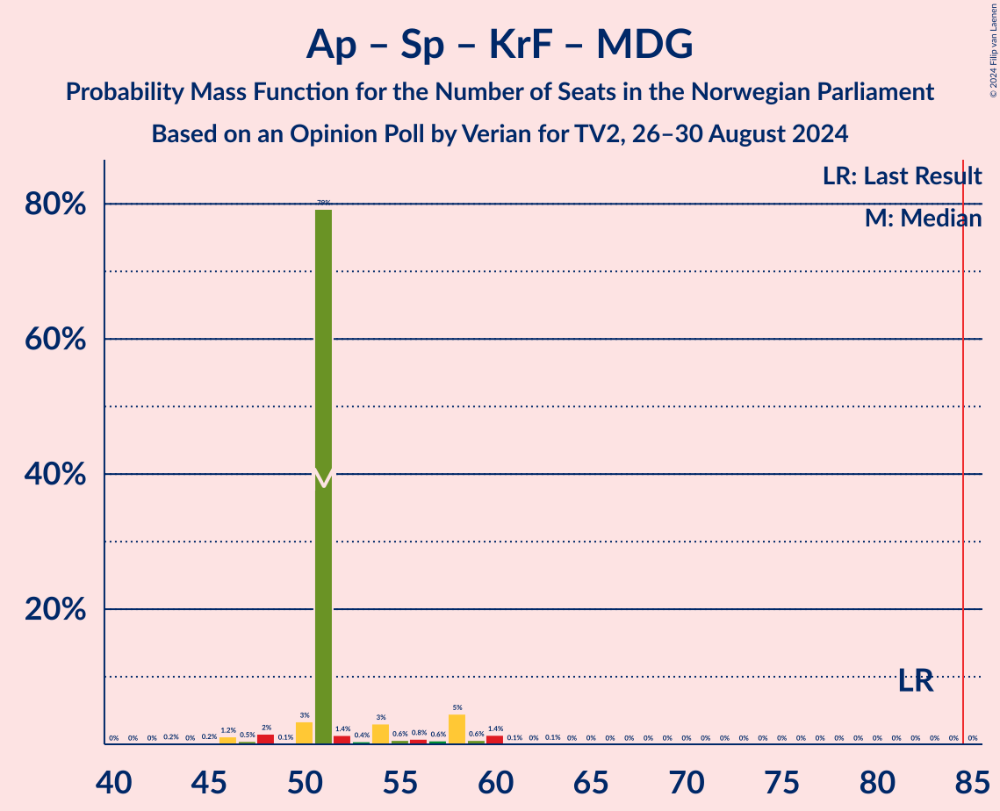

| Number of Seats | Probability | Accumulated | Special Marks |
|:---------------:|:-----------:|:-----------:|:-------------:|
| 43 | 0.2% | 100% |  |
| 44 | 0% | 99.8% |  |
| 45 | 0.2% | 99.8% |  |
| 46 | 1.2% | 99.6% |  |
| 47 | 0.5% | 98% |  |
| 48 | 2% | 98% |  |
| 49 | 0.1% | 96% |  |
| 50 | 3% | 96% |  |
| 51 | 79% | 93% | Median |
| 52 | 1.4% | 14% |  |
| 53 | 0.4% | 12% |  |
| 54 | 3% | 12% |  |
| 55 | 0.6% | 9% |  |
| 56 | 0.8% | 8% |  |
| 57 | 0.6% | 7% |  |
| 58 | 5% | 7% |  |
| 59 | 0.6% | 2% |  |
| 60 | 1.4% | 2% |  |
| 61 | 0.1% | 0.2% |  |
| 62 | 0% | 0.2% |  |
| 63 | 0.1% | 0.1% |  |
| 64 | 0% | 0% |  |
| 65 | 0% | 0% |  |
| 66 | 0% | 0% |  |
| 67 | 0% | 0% |  |
| 68 | 0% | 0% |  |
| 69 | 0% | 0% |  |
| 70 | 0% | 0% |  |
| 71 | 0% | 0% |  |
| 72 | 0% | 0% |  |
| 73 | 0% | 0% |  |
| 74 | 0% | 0% |  |
| 75 | 0% | 0% |  |
| 76 | 0% | 0% |  |
| 77 | 0% | 0% |  |
| 78 | 0% | 0% |  |
| 79 | 0% | 0% |  |
| 80 | 0% | 0% |  |
| 81 | 0% | 0% |  |
| 82 | 0% | 0% | Last Result |

### Arbeiderpartiet – Senterpartiet – Kristelig Folkeparti

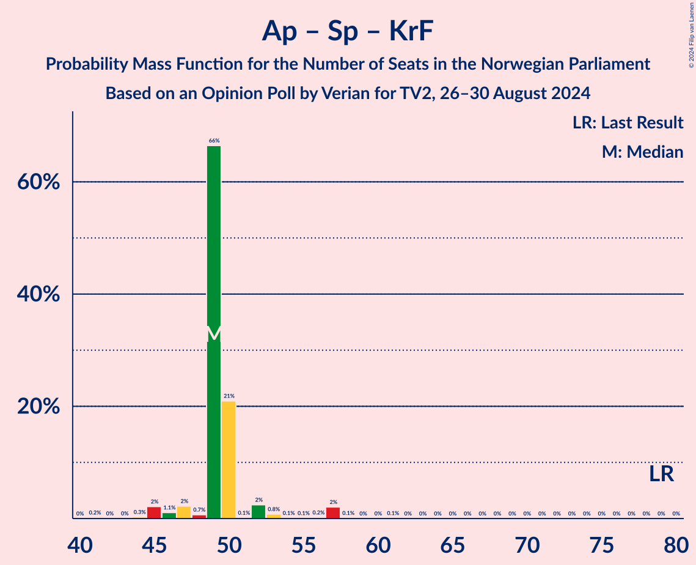

| Number of Seats | Probability | Accumulated | Special Marks |
|:---------------:|:-----------:|:-----------:|:-------------:|
| 41 | 0.2% | 100% |  |
| 42 | 0% | 99.8% |  |
| 43 | 0% | 99.8% |  |
| 44 | 0.3% | 99.8% |  |
| 45 | 2% | 99.5% |  |
| 46 | 1.1% | 97% |  |
| 47 | 2% | 96% |  |
| 48 | 0.7% | 94% |  |
| 49 | 66% | 93% | Median |
| 50 | 21% | 27% |  |
| 51 | 0.1% | 6% |  |
| 52 | 2% | 6% |  |
| 53 | 0.8% | 3% |  |
| 54 | 0.1% | 3% |  |
| 55 | 0.1% | 2% |  |
| 56 | 0.2% | 2% |  |
| 57 | 2% | 2% |  |
| 58 | 0.1% | 0.2% |  |
| 59 | 0% | 0.1% |  |
| 60 | 0% | 0.1% |  |
| 61 | 0.1% | 0.1% |  |
| 62 | 0% | 0% |  |
| 63 | 0% | 0% |  |
| 64 | 0% | 0% |  |
| 65 | 0% | 0% |  |
| 66 | 0% | 0% |  |
| 67 | 0% | 0% |  |
| 68 | 0% | 0% |  |
| 69 | 0% | 0% |  |
| 70 | 0% | 0% |  |
| 71 | 0% | 0% |  |
| 72 | 0% | 0% |  |
| 73 | 0% | 0% |  |
| 74 | 0% | 0% |  |
| 75 | 0% | 0% |  |
| 76 | 0% | 0% |  |
| 77 | 0% | 0% |  |
| 78 | 0% | 0% |  |
| 79 | 0% | 0% | Last Result |

### Arbeiderpartiet – Sosialistisk Venstreparti

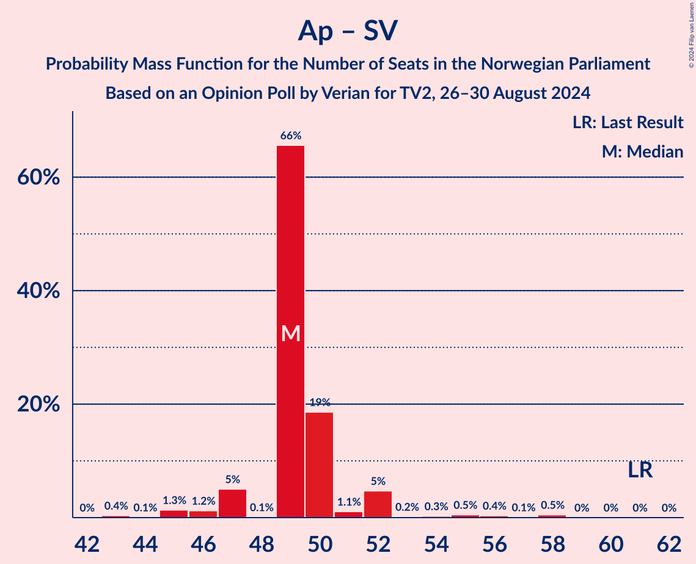

| Number of Seats | Probability | Accumulated | Special Marks |
|:---------------:|:-----------:|:-----------:|:-------------:|
| 43 | 0.4% | 100% |  |
| 44 | 0.1% | 99.6% |  |
| 45 | 1.3% | 99.6% |  |
| 46 | 1.2% | 98% |  |
| 47 | 5% | 97% |  |
| 48 | 0.1% | 92% |  |
| 49 | 66% | 92% | Median |
| 50 | 19% | 26% |  |
| 51 | 1.1% | 8% |  |
| 52 | 5% | 7% |  |
| 53 | 0.2% | 2% |  |
| 54 | 0.3% | 2% |  |
| 55 | 0.5% | 1.5% |  |
| 56 | 0.4% | 1.0% |  |
| 57 | 0.1% | 0.6% |  |
| 58 | 0.5% | 0.5% |  |
| 59 | 0% | 0% |  |
| 60 | 0% | 0% |  |
| 61 | 0% | 0% | Last Result |

### Arbeiderpartiet – Senterpartiet

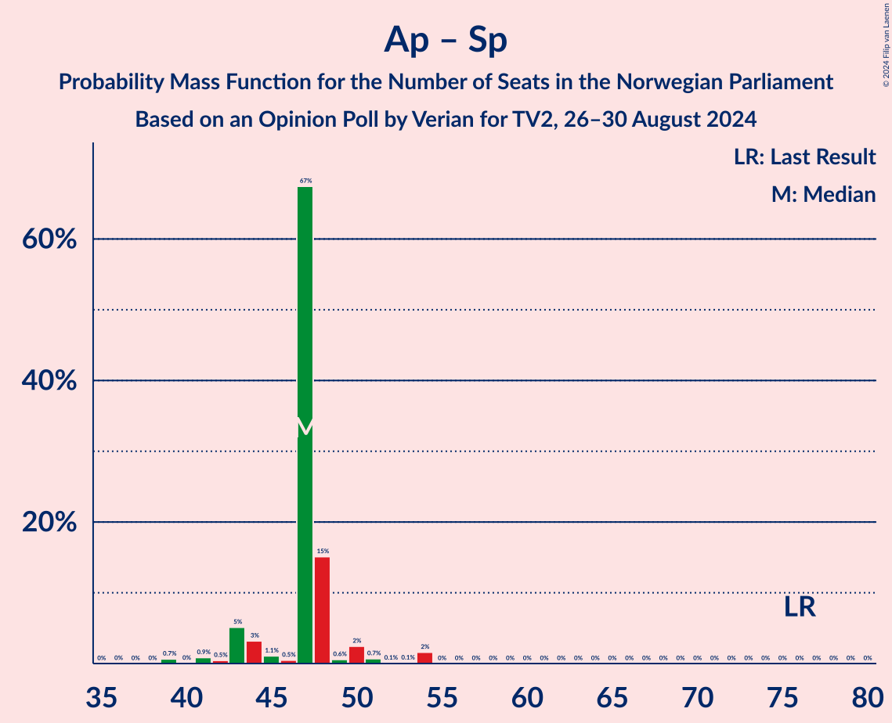

| Number of Seats | Probability | Accumulated | Special Marks |
|:---------------:|:-----------:|:-----------:|:-------------:|
| 39 | 0.7% | 100% |  |
| 40 | 0% | 99.3% |  |
| 41 | 0.9% | 99.3% |  |
| 42 | 0.5% | 98% |  |
| 43 | 5% | 98% |  |
| 44 | 3% | 93% |  |
| 45 | 1.1% | 90% |  |
| 46 | 0.5% | 89% |  |
| 47 | 67% | 88% | Median |
| 48 | 15% | 21% |  |
| 49 | 0.6% | 5% |  |
| 50 | 2% | 5% |  |
| 51 | 0.7% | 2% |  |
| 52 | 0.1% | 2% |  |
| 53 | 0.1% | 2% |  |
| 54 | 2% | 2% |  |
| 55 | 0% | 0% |  |
| 56 | 0% | 0% |  |
| 57 | 0% | 0% |  |
| 58 | 0% | 0% |  |
| 59 | 0% | 0% |  |
| 60 | 0% | 0% |  |
| 61 | 0% | 0% |  |
| 62 | 0% | 0% |  |
| 63 | 0% | 0% |  |
| 64 | 0% | 0% |  |
| 65 | 0% | 0% |  |
| 66 | 0% | 0% |  |
| 67 | 0% | 0% |  |
| 68 | 0% | 0% |  |
| 69 | 0% | 0% |  |
| 70 | 0% | 0% |  |
| 71 | 0% | 0% |  |
| 72 | 0% | 0% |  |
| 73 | 0% | 0% |  |
| 74 | 0% | 0% |  |
| 75 | 0% | 0% |  |
| 76 | 0% | 0% | Last Result |

### Senterpartiet – Venstre – Kristelig Folkeparti

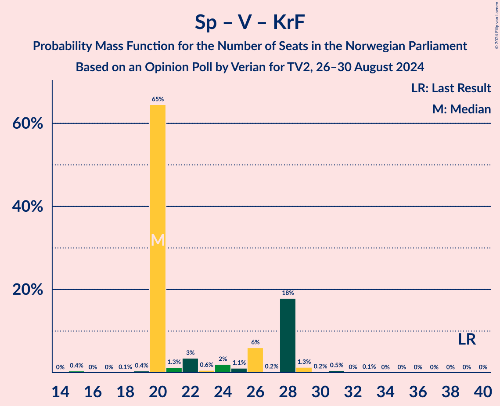

| Number of Seats | Probability | Accumulated | Special Marks |
|:---------------:|:-----------:|:-----------:|:-------------:|
| 15 | 0.4% | 100% |  |
| 16 | 0% | 99.6% |  |
| 17 | 0% | 99.6% |  |
| 18 | 0.1% | 99.6% |  |
| 19 | 0.4% | 99.5% |  |
| 20 | 65% | 99.1% | Median |
| 21 | 1.3% | 35% |  |
| 22 | 3% | 33% |  |
| 23 | 0.6% | 30% |  |
| 24 | 2% | 29% |  |
| 25 | 1.1% | 27% |  |
| 26 | 6% | 26% |  |
| 27 | 0.2% | 20% |  |
| 28 | 18% | 20% |  |
| 29 | 1.3% | 2% |  |
| 30 | 0.2% | 0.9% |  |
| 31 | 0.5% | 0.7% |  |
| 32 | 0% | 0.2% |  |
| 33 | 0.1% | 0.1% |  |
| 34 | 0% | 0% |  |
| 35 | 0% | 0% |  |
| 36 | 0% | 0% |  |
| 37 | 0% | 0% |  |
| 38 | 0% | 0% |  |
| 39 | 0% | 0% | Last Result |

## Technical Information

### Opinion Poll

+ **Polling firm:** Verian
+ **Commissioner(s):** TV2
+ **Fieldwork period:** 26–30 August 2024

### Calculations

+ **Sample size:** 1000
+ **Simulations done:** 1,048,576
+ **Error estimate:** 4.56%

