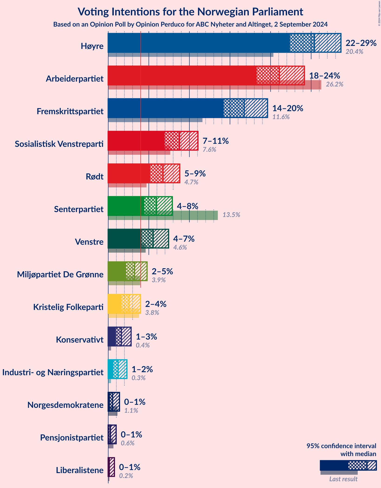
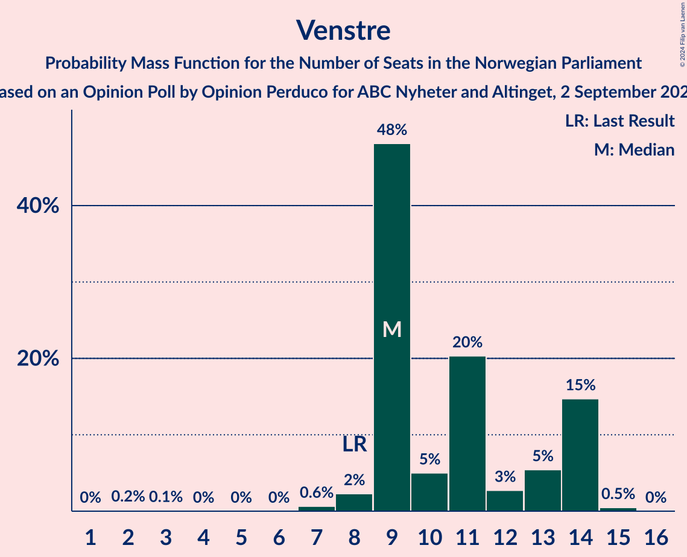

# Opinion Poll by Opinion Perduco for ABC Nyheter and Altinget, 2 September 2024

<a href="#voting-intentions">Voting Intentions</a> | <a href="#seats">Seats</a> | <a href="#coalitions">Coalitions</a> | <a href="#technical-information">Technical Information</a>

## Voting Intentions

### Confidence Intervals

| Party | Last Result | Poll Result | 80% Confidence Interval | 90% Confidence Interval | 95% Confidence Interval | 99% Confidence Interval |
|:-----:|:-----------:|:-----------:|:-----------------------:|:-----------------------:|:-----------------------:|:-----------------------:|
| Høyre | 20.4% | 25.4% | 23.4–27.5% |22.9–28.2% |22.4–28.7% |21.5–29.7% |
| Arbeiderpartiet | 26.2% | 21.1% | 19.3–23.1% |18.7–23.7% |18.3–24.2% |17.4–25.2% |
| Fremskrittspartiet | 11.6% | 16.8% | 15.1–18.6% |14.6–19.2% |14.2–19.6% |13.5–20.6% |
| Sosialistisk Venstreparti | 7.6% | 8.8% | 7.6–10.3% |7.2–10.7% |7.0–11.1% |6.4–11.8% |
| Rødt | 4.7% | 6.8% | 5.7–8.1% |5.4–8.5% |5.2–8.8% |4.7–9.5% |
| Senterpartiet | 13.5% | 5.9% | 5.0–7.2% |4.7–7.6% |4.5–7.9% |4.0–8.6% |
| Venstre | 4.6% | 5.5% | 4.6–6.8% |4.3–7.1% |4.1–7.4% |3.7–8.1% |
| Miljøpartiet De Grønne | 3.9% | 3.2% | 2.5–4.3% |2.3–4.5% |2.2–4.8% |1.9–5.3% |
| Kristelig Folkeparti | 3.8% | 2.6% | 2.0–3.5% |1.8–3.7% |1.6–4.0% |1.4–4.5% |
| Konservativt | 0.4% | 1.6% | 1.2–2.4% |1.0–2.6% |0.9–2.8% |0.7–3.2% |
| Industri- og Næringspartiet | 0.3% | 1.2% | 0.8–1.9% |0.7–2.1% |0.6–2.3% |0.5–2.7% |
| Norgesdemokratene | 1.1% | 0.5% | 0.3–1.1% |0.3–1.2% |0.2–1.4% |0.1–1.7% |
| Pensjonistpartiet | 0.6% | 0.3% | 0.1–0.7% |0.1–0.9% |0.1–1.0% |0.0–1.2% |
| Liberalistene | 0.2% | 0.1% | 0.1–0.5% |0.0–0.6% |0.0–0.8% |0.0–1.0% |

*Note:* The poll result column reflects the actual value used in the calculations. Published results may vary slightly, and in addition be rounded to fewer digits.

## Seats

### Confidence Intervals

| Party | Last Result | Median | 80% Confidence Interval | 90% Confidence Interval | 95% Confidence Interval | 99% Confidence Interval |
|:-----:|:-----------:|:------:|:-----------------------:|:-----------------------:|:-----------------------:|:-----------------------:|
| <a href="#høyre">Høyre</a> | 36 | 43 | 42–50 |41–50 |41–50 |37–50 |
| <a href="#arbeiderpartiet">Arbeiderpartiet</a> | 48 | 39 | 35–41 |35–44 |34–45 |33–51 |
| <a href="#fremskrittspartiet">Fremskrittspartiet</a> | 21 | 30 | 23–35 |23–35 |22–35 |22–41 |
| <a href="#sosialistisk-venstreparti">Sosialistisk Venstreparti</a> | 13 | 17 | 14–18 |12–20 |11–20 |10–20 |
| <a href="#rødt">Rødt</a> | 8 | 14 | 10–17 |10–17 |10–17 |8–17 |
| <a href="#senterpartiet">Senterpartiet</a> | 28 | 14 | 8–15 |8–15 |8–15 |1–15 |
| <a href="#venstre">Venstre</a> | 8 | 9 | 9–14 |9–14 |8–14 |7–14 |
| <a href="#miljøpartiet-de-grønne">Miljøpartiet De Grønne</a> | 3 | 2 | 1–7 |1–7 |1–8 |1–8 |
| <a href="#kristelig-folkeparti">Kristelig Folkeparti</a> | 3 | 2 | 0–2 |0–3 |0–3 |0–7 |
| <a href="#konservativt">Konservativt</a> | 0 | 0 | 0 |0 |0 |0 |
| <a href="#industri--og-næringspartiet">Industri- og Næringspartiet</a> | 0 | 0 | 0 |0 |0 |0–2 |
| <a href="#norgesdemokratene">Norgesdemokratene</a> | 0 | 0 | 0 |0 |0 |0 |
| <a href="#pensjonistpartiet">Pensjonistpartiet</a> | 0 | 0 | 0 |0 |0 |0 |
| <a href="#liberalistene">Liberalistene</a> | 0 | 0 | 0 |0 |0 |0 |

### Høyre

*For a full overview of the results for this party, see the [Høyre](party-høyre.html) page.*

| Number of Seats | Probability | Accumulated | Special Marks |
|:---------------:|:-----------:|:-----------:|:-------------:|
| 36 | 0% | 100% | Last Result |
| 37 | 0.7% | 99.9% |  |
| 38 | 0.1% | 99.2% |  |
| 39 | 0.3% | 99.1% |  |
| 40 | 0.6% | 98.8% |  |
| 41 | 6% | 98% |  |
| 42 | 26% | 92% |  |
| 43 | 29% | 66% | Median |
| 44 | 1.3% | 37% |  |
| 45 | 13% | 35% |  |
| 46 | 2% | 22% |  |
| 47 | 7% | 21% |  |
| 48 | 1.1% | 13% |  |
| 49 | 1.3% | 12% |  |
| 50 | 11% | 11% |  |
| 51 | 0.1% | 0.2% |  |
| 52 | 0% | 0.1% |  |
| 53 | 0% | 0.1% |  |
| 54 | 0% | 0% |  |

### Arbeiderpartiet

*For a full overview of the results for this party, see the [Arbeiderpartiet](party-arbeiderpartiet.html) page.*

| Number of Seats | Probability | Accumulated | Special Marks |
|:---------------:|:-----------:|:-----------:|:-------------:|
| 32 | 0.1% | 100% |  |
| 33 | 0.5% | 99.9% |  |
| 34 | 3% | 99.4% |  |
| 35 | 14% | 97% |  |
| 36 | 14% | 83% |  |
| 37 | 2% | 68% |  |
| 38 | 8% | 66% |  |
| 39 | 29% | 59% | Median |
| 40 | 8% | 30% |  |
| 41 | 15% | 22% |  |
| 42 | 0.6% | 7% |  |
| 43 | 0.1% | 6% |  |
| 44 | 4% | 6% |  |
| 45 | 0.3% | 3% |  |
| 46 | 0.2% | 2% |  |
| 47 | 0.9% | 2% |  |
| 48 | 0% | 1.1% | Last Result |
| 49 | 0.1% | 1.1% |  |
| 50 | 0% | 1.0% |  |
| 51 | 1.0% | 1.0% |  |
| 52 | 0% | 0% |  |

### Fremskrittspartiet

*For a full overview of the results for this party, see the [Fremskrittspartiet](party-fremskrittspartiet.html) page.*

| Number of Seats | Probability | Accumulated | Special Marks |
|:---------------:|:-----------:|:-----------:|:-------------:|
| 21 | 0% | 100% | Last Result |
| 22 | 3% | 100% |  |
| 23 | 10% | 97% |  |
| 24 | 0.1% | 87% |  |
| 25 | 5% | 87% |  |
| 26 | 1.1% | 82% |  |
| 27 | 7% | 81% |  |
| 28 | 3% | 74% |  |
| 29 | 2% | 71% |  |
| 30 | 29% | 69% | Median |
| 31 | 20% | 40% |  |
| 32 | 2% | 20% |  |
| 33 | 0.9% | 18% |  |
| 34 | 0.4% | 17% |  |
| 35 | 14% | 17% |  |
| 36 | 0.1% | 2% |  |
| 37 | 0.9% | 2% |  |
| 38 | 0.2% | 1.4% |  |
| 39 | 0.1% | 1.2% |  |
| 40 | 0.5% | 1.1% |  |
| 41 | 0.6% | 0.6% |  |
| 42 | 0% | 0% |  |

### Sosialistisk Venstreparti

*For a full overview of the results for this party, see the [Sosialistisk Venstreparti](party-sosialistiskvenstreparti.html) page.*

| Number of Seats | Probability | Accumulated | Special Marks |
|:---------------:|:-----------:|:-----------:|:-------------:|
| 10 | 1.0% | 100% |  |
| 11 | 2% | 99.0% |  |
| 12 | 2% | 97% |  |
| 13 | 0.6% | 95% | Last Result |
| 14 | 8% | 94% |  |
| 15 | 19% | 87% |  |
| 16 | 12% | 68% |  |
| 17 | 44% | 56% | Median |
| 18 | 5% | 11% |  |
| 19 | 0.7% | 6% |  |
| 20 | 5% | 6% |  |
| 21 | 0.1% | 0.1% |  |
| 22 | 0% | 0.1% |  |
| 23 | 0% | 0% |  |

### Rødt

*For a full overview of the results for this party, see the [Rødt](party-rødt.html) page.*

| Number of Seats | Probability | Accumulated | Special Marks |
|:---------------:|:-----------:|:-----------:|:-------------:|
| 7 | 0% | 100% |  |
| 8 | 1.0% | 99.9% | Last Result |
| 9 | 0.2% | 99.0% |  |
| 10 | 17% | 98.8% |  |
| 11 | 4% | 82% |  |
| 12 | 12% | 78% |  |
| 13 | 10% | 66% |  |
| 14 | 30% | 56% | Median |
| 15 | 14% | 26% |  |
| 16 | 0.1% | 12% |  |
| 17 | 12% | 12% |  |
| 18 | 0% | 0.1% |  |
| 19 | 0% | 0% |  |

### Senterpartiet

*For a full overview of the results for this party, see the [Senterpartiet](party-senterpartiet.html) page.*

| Number of Seats | Probability | Accumulated | Special Marks |
|:---------------:|:-----------:|:-----------:|:-------------:|
| 0 | 0.1% | 100% |  |
| 1 | 0.8% | 99.9% |  |
| 2 | 0% | 99.1% |  |
| 3 | 0% | 99.1% |  |
| 4 | 0% | 99.1% |  |
| 5 | 0% | 99.1% |  |
| 6 | 0% | 99.1% |  |
| 7 | 2% | 99.1% |  |
| 8 | 8% | 98% |  |
| 9 | 6% | 90% |  |
| 10 | 26% | 84% |  |
| 11 | 1.2% | 58% |  |
| 12 | 1.4% | 57% |  |
| 13 | 4% | 55% |  |
| 14 | 17% | 52% | Median |
| 15 | 34% | 34% |  |
| 16 | 0.1% | 0.2% |  |
| 17 | 0% | 0.1% |  |
| 18 | 0% | 0.1% |  |
| 19 | 0.1% | 0.1% |  |
| 20 | 0% | 0% |  |
| 21 | 0% | 0% |  |
| 22 | 0% | 0% |  |
| 23 | 0% | 0% |  |
| 24 | 0% | 0% |  |
| 25 | 0% | 0% |  |
| 26 | 0% | 0% |  |
| 27 | 0% | 0% |  |
| 28 | 0% | 0% | Last Result |

### Venstre

*For a full overview of the results for this party, see the [Venstre](party-venstre.html) page.*

| Number of Seats | Probability | Accumulated | Special Marks |
|:---------------:|:-----------:|:-----------:|:-------------:|
| 2 | 0.2% | 100% |  |
| 3 | 0.1% | 99.8% |  |
| 4 | 0% | 99.8% |  |
| 5 | 0% | 99.8% |  |
| 6 | 0% | 99.8% |  |
| 7 | 0.6% | 99.8% |  |
| 8 | 2% | 99.1% | Last Result |
| 9 | 48% | 97% | Median |
| 10 | 5% | 49% |  |
| 11 | 20% | 44% |  |
| 12 | 3% | 23% |  |
| 13 | 5% | 21% |  |
| 14 | 15% | 15% |  |
| 15 | 0.5% | 0.5% |  |
| 16 | 0% | 0% |  |

### Miljøpartiet De Grønne

*For a full overview of the results for this party, see the [Miljøpartiet De Grønne](party-miljøpartietdegrønne.html) page.*

| Number of Seats | Probability | Accumulated | Special Marks |
|:---------------:|:-----------:|:-----------:|:-------------:|
| 1 | 47% | 100% |  |
| 2 | 33% | 53% | Median |
| 3 | 10% | 20% | Last Result |
| 4 | 0% | 11% |  |
| 5 | 0% | 11% |  |
| 6 | 0% | 11% |  |
| 7 | 7% | 11% |  |
| 8 | 3% | 3% |  |
| 9 | 0.1% | 0.3% |  |
| 10 | 0.1% | 0.2% |  |
| 11 | 0.1% | 0.1% |  |
| 12 | 0% | 0% |  |

### Kristelig Folkeparti

*For a full overview of the results for this party, see the [Kristelig Folkeparti](party-kristeligfolkeparti.html) page.*

| Number of Seats | Probability | Accumulated | Special Marks |
|:---------------:|:-----------:|:-----------:|:-------------:|
| 0 | 36% | 100% |  |
| 1 | 0.9% | 64% |  |
| 2 | 58% | 64% | Median |
| 3 | 4% | 5% | Last Result |
| 4 | 0% | 0.9% |  |
| 5 | 0% | 0.9% |  |
| 6 | 0% | 0.9% |  |
| 7 | 0.6% | 0.9% |  |
| 8 | 0.2% | 0.2% |  |
| 9 | 0% | 0.1% |  |
| 10 | 0.1% | 0.1% |  |
| 11 | 0% | 0% |  |

### Konservativt

*For a full overview of the results for this party, see the [Konservativt](party-konservativt.html) page.*

| Number of Seats | Probability | Accumulated | Special Marks |
|:---------------:|:-----------:|:-----------:|:-------------:|
| 0 | 99.7% | 100% | Last Result, Median |
| 1 | 0% | 0.3% |  |
| 2 | 0.3% | 0.3% |  |
| 3 | 0.1% | 0.1% |  |
| 4 | 0% | 0% |  |

### Industri- og Næringspartiet

*For a full overview of the results for this party, see the [Industri- og Næringspartiet](party-industri-ognæringspartiet.html) page.*

| Number of Seats | Probability | Accumulated | Special Marks |
|:---------------:|:-----------:|:-----------:|:-------------:|
| 0 | 99.3% | 100% | Last Result, Median |
| 1 | 0.1% | 0.7% |  |
| 2 | 0.7% | 0.7% |  |
| 3 | 0% | 0% |  |

### Norgesdemokratene

*For a full overview of the results for this party, see the [Norgesdemokratene](party-norgesdemokratene.html) page.*

| Number of Seats | Probability | Accumulated | Special Marks |
|:---------------:|:-----------:|:-----------:|:-------------:|
| 0 | 100% | 100% | Last Result, Median |

### Pensjonistpartiet

*For a full overview of the results for this party, see the [Pensjonistpartiet](party-pensjonistpartiet.html) page.*

| Number of Seats | Probability | Accumulated | Special Marks |
|:---------------:|:-----------:|:-----------:|:-------------:|
| 0 | 100% | 100% | Last Result, Median |

### Liberalistene

*For a full overview of the results for this party, see the [Liberalistene](party-liberalistene.html) page.*

| Number of Seats | Probability | Accumulated | Special Marks |
|:---------------:|:-----------:|:-----------:|:-------------:|
| 0 | 100% | 100% | Last Result, Median |

## Coalitions

### Confidence Intervals

| Coalition | Last Result | Median | Majority? | 80% Confidence Interval | 90% Confidence Interval | 95% Confidence Interval | 99% Confidence Interval |
|:---------:|:-----------:|:------:|:---------:|:-----------------------:|:-----------------------:|:-----------------------:|:-----------------------:|
| Høyre – Fremskrittspartiet – Senterpartiet – Venstre – Kristelig Folkeparti | 96 | 97 | 100% | 93–103 | 91–104 | 90–106 | 88–108 |
| Høyre – Fremskrittspartiet – Venstre – Miljøpartiet De Grønne – Kristelig Folkeparti | 71 | 88 | 68% | 83–92 | 83–94 | 80–96 | 80–100 |
| Høyre – Fremskrittspartiet – Venstre – Kristelig Folkeparti | 68 | 85 | 55% | 82–90 | 82–92 | 77–94 | 77–99 |
| Høyre – Fremskrittspartiet – Venstre | 65 | 83 | 37% | 82–88 | 81–89 | 77–92 | 77–98 |
| Arbeiderpartiet – Sosialistisk Venstreparti – Rødt – Senterpartiet – Miljøpartiet De Grønne | 100 | 83 | 35% | 78–86 | 76–86 | 75–91 | 69–91 |
| Arbeiderpartiet – Sosialistisk Venstreparti – Rødt – Senterpartiet | 97 | 80 | 32% | 76–85 | 74–85 | 72–88 | 68–88 |
| Høyre – Fremskrittspartiet | 57 | 73 | 0.9% | 72–77 | 70–80 | 67–81 | 67–87 |
| Arbeiderpartiet – Sosialistisk Venstreparti – Senterpartiet – Miljøpartiet De Grønne – Kristelig Folkeparti | 95 | 72 | 0% | 63–73 | 63–76 | 63–78 | 61–79 |
| Arbeiderpartiet – Sosialistisk Venstreparti – Rødt – Miljøpartiet De Grønne | 72 | 71 | 0% | 65–75 | 64–77 | 62–78 | 60–81 |
| Arbeiderpartiet – Sosialistisk Venstreparti – Senterpartiet – Miljøpartiet De Grønne | 92 | 70 | 0% | 61–72 | 61–75 | 61–78 | 58–78 |
| Arbeiderpartiet – Sosialistisk Venstreparti – Senterpartiet | 89 | 67 | 0% | 60–71 | 60–71 | 59–75 | 57–75 |
| Høyre – Venstre – Kristelig Folkeparti | 47 | 55 | 0% | 52–61 | 52–61 | 52–62 | 49–66 |
| Arbeiderpartiet – Sosialistisk Venstreparti | 61 | 56 | 0% | 50–61 | 50–61 | 47–62 | 45–66 |
| Arbeiderpartiet – Senterpartiet – Miljøpartiet De Grønne – Kristelig Folkeparti | 82 | 55 | 0% | 48–58 | 48–60 | 48–60 | 48–65 |
| Arbeiderpartiet – Senterpartiet – Kristelig Folkeparti | 79 | 53 | 0% | 47–55 | 47–56 | 47–57 | 46–60 |
| Arbeiderpartiet – Senterpartiet | 76 | 51 | 0% | 45–54 | 45–54 | 45–57 | 44–58 |
| Senterpartiet – Venstre – Kristelig Folkeparti | 39 | 24 | 0% | 21–30 | 21–30 | 18–30 | 14–30 |

### Høyre – Fremskrittspartiet – Senterpartiet – Venstre – Kristelig Folkeparti

| Number of Seats | Probability | Accumulated | Special Marks |
|:---------------:|:-----------:|:-----------:|:-------------:|
| 85 | 0.4% | 100% | Majority |
| 86 | 0% | 99.6% |  |
| 87 | 0.1% | 99.6% |  |
| 88 | 0.2% | 99.6% |  |
| 89 | 0% | 99.3% |  |
| 90 | 4% | 99.3% |  |
| 91 | 0.1% | 95% |  |
| 92 | 2% | 95% |  |
| 93 | 6% | 93% |  |
| 94 | 15% | 87% |  |
| 95 | 0.5% | 72% |  |
| 96 | 1.2% | 72% | Last Result |
| 97 | 29% | 71% |  |
| 98 | 1.3% | 42% | Median |
| 99 | 1.1% | 41% |  |
| 100 | 18% | 39% |  |
| 101 | 1.1% | 22% |  |
| 102 | 0.4% | 21% |  |
| 103 | 15% | 20% |  |
| 104 | 1.0% | 5% |  |
| 105 | 1.5% | 4% |  |
| 106 | 2% | 3% |  |
| 107 | 0.2% | 0.8% |  |
| 108 | 0.6% | 0.6% |  |
| 109 | 0% | 0% |  |

### Høyre – Fremskrittspartiet – Venstre – Miljøpartiet De Grønne – Kristelig Folkeparti

| Number of Seats | Probability | Accumulated | Special Marks |
|:---------------:|:-----------:|:-----------:|:-------------:|
| 71 | 0% | 100% | Last Result |
| 72 | 0% | 100% |  |
| 73 | 0% | 100% |  |
| 74 | 0% | 100% |  |
| 75 | 0% | 100% |  |
| 76 | 0% | 100% |  |
| 77 | 0% | 100% |  |
| 78 | 0% | 100% |  |
| 79 | 0% | 100% |  |
| 80 | 3% | 99.9% |  |
| 81 | 0.4% | 97% |  |
| 82 | 0% | 96% |  |
| 83 | 28% | 96% |  |
| 84 | 0.2% | 68% |  |
| 85 | 0.1% | 68% | Majority |
| 86 | 10% | 68% | Median |
| 87 | 6% | 58% |  |
| 88 | 6% | 52% |  |
| 89 | 0.6% | 46% |  |
| 90 | 3% | 45% |  |
| 91 | 28% | 42% |  |
| 92 | 5% | 14% |  |
| 93 | 0.4% | 9% |  |
| 94 | 4% | 8% |  |
| 95 | 0.6% | 4% |  |
| 96 | 2% | 3% |  |
| 97 | 0.4% | 1.3% |  |
| 98 | 0.1% | 0.8% |  |
| 99 | 0.1% | 0.8% |  |
| 100 | 0.6% | 0.7% |  |
| 101 | 0% | 0.1% |  |
| 102 | 0% | 0% |  |

### Høyre – Fremskrittspartiet – Venstre – Kristelig Folkeparti

| Number of Seats | Probability | Accumulated | Special Marks |
|:---------------:|:-----------:|:-----------:|:-------------:|
| 68 | 0% | 100% | Last Result |
| 69 | 0% | 100% |  |
| 70 | 0% | 100% |  |
| 71 | 0% | 100% |  |
| 72 | 0% | 100% |  |
| 73 | 0% | 100% |  |
| 74 | 0.4% | 100% |  |
| 75 | 0% | 99.6% |  |
| 76 | 0% | 99.6% |  |
| 77 | 3% | 99.6% |  |
| 78 | 0.2% | 96% |  |
| 79 | 0.1% | 96% |  |
| 80 | 0.2% | 96% |  |
| 81 | 0.3% | 96% |  |
| 82 | 30% | 95% |  |
| 83 | 0.2% | 66% |  |
| 84 | 11% | 66% | Median |
| 85 | 16% | 55% | Majority |
| 86 | 0.5% | 38% |  |
| 87 | 1.0% | 38% |  |
| 88 | 0.7% | 37% |  |
| 89 | 16% | 36% |  |
| 90 | 13% | 20% |  |
| 91 | 0.4% | 7% |  |
| 92 | 3% | 6% |  |
| 93 | 0.7% | 3% |  |
| 94 | 0.5% | 3% |  |
| 95 | 1.5% | 2% |  |
| 96 | 0% | 0.7% |  |
| 97 | 0% | 0.6% |  |
| 98 | 0% | 0.6% |  |
| 99 | 0.6% | 0.6% |  |
| 100 | 0% | 0% |  |

### Høyre – Fremskrittspartiet – Venstre

| Number of Seats | Probability | Accumulated | Special Marks |
|:---------------:|:-----------:|:-----------:|:-------------:|
| 65 | 0% | 100% | Last Result |
| 66 | 0% | 100% |  |
| 67 | 0% | 100% |  |
| 68 | 0% | 100% |  |
| 69 | 0% | 100% |  |
| 70 | 0% | 100% |  |
| 71 | 0% | 100% |  |
| 72 | 0% | 100% |  |
| 73 | 0% | 100% |  |
| 74 | 0.4% | 100% |  |
| 75 | 0% | 99.6% |  |
| 76 | 0.1% | 99.6% |  |
| 77 | 3% | 99.5% |  |
| 78 | 0.4% | 96% |  |
| 79 | 0.3% | 96% |  |
| 80 | 0.1% | 95% |  |
| 81 | 0.3% | 95% |  |
| 82 | 41% | 95% | Median |
| 83 | 17% | 54% |  |
| 84 | 0.4% | 38% |  |
| 85 | 0.9% | 37% | Majority |
| 86 | 0.6% | 36% |  |
| 87 | 15% | 36% |  |
| 88 | 13% | 21% |  |
| 89 | 3% | 8% |  |
| 90 | 2% | 5% |  |
| 91 | 0.3% | 3% |  |
| 92 | 2% | 3% |  |
| 93 | 0% | 0.9% |  |
| 94 | 0.1% | 0.9% |  |
| 95 | 0.2% | 0.8% |  |
| 96 | 0% | 0.6% |  |
| 97 | 0% | 0.6% |  |
| 98 | 0.6% | 0.6% |  |
| 99 | 0% | 0% |  |

### Arbeiderpartiet – Sosialistisk Venstreparti – Rødt – Senterpartiet – Miljøpartiet De Grønne

| Number of Seats | Probability | Accumulated | Special Marks |
|:---------------:|:-----------:|:-----------:|:-------------:|
| 69 | 0.6% | 100% |  |
| 70 | 0% | 99.4% |  |
| 71 | 0% | 99.4% |  |
| 72 | 0% | 99.3% |  |
| 73 | 2% | 99.3% |  |
| 74 | 0% | 98% |  |
| 75 | 1.2% | 98% |  |
| 76 | 3% | 97% |  |
| 77 | 0.7% | 94% |  |
| 78 | 13% | 93% |  |
| 79 | 15% | 80% |  |
| 80 | 1.4% | 65% |  |
| 81 | 2% | 63% |  |
| 82 | 0.3% | 62% |  |
| 83 | 16% | 61% |  |
| 84 | 11% | 45% |  |
| 85 | 0.3% | 35% | Majority |
| 86 | 30% | 34% | Median |
| 87 | 0% | 5% |  |
| 88 | 0.4% | 4% |  |
| 89 | 0.1% | 4% |  |
| 90 | 0.2% | 4% |  |
| 91 | 3% | 4% |  |
| 92 | 0% | 0.4% |  |
| 93 | 0% | 0.4% |  |
| 94 | 0% | 0.4% |  |
| 95 | 0.4% | 0.4% |  |
| 96 | 0% | 0% |  |
| 97 | 0% | 0% |  |
| 98 | 0% | 0% |  |
| 99 | 0% | 0% |  |
| 100 | 0% | 0% | Last Result |

### Arbeiderpartiet – Sosialistisk Venstreparti – Rødt – Senterpartiet

| Number of Seats | Probability | Accumulated | Special Marks |
|:---------------:|:-----------:|:-----------:|:-------------:|
| 67 | 0% | 100% |  |
| 68 | 0.6% | 99.9% |  |
| 69 | 0.3% | 99.3% |  |
| 70 | 0% | 99.0% |  |
| 71 | 0.3% | 99.0% |  |
| 72 | 2% | 98.7% |  |
| 73 | 0.3% | 97% |  |
| 74 | 5% | 96% |  |
| 75 | 0.3% | 92% |  |
| 76 | 5% | 91% |  |
| 77 | 28% | 86% |  |
| 78 | 3% | 58% |  |
| 79 | 1.5% | 56% |  |
| 80 | 7% | 54% |  |
| 81 | 6% | 48% |  |
| 82 | 10% | 42% |  |
| 83 | 0.2% | 32% |  |
| 84 | 0.1% | 32% | Median |
| 85 | 28% | 32% | Majority |
| 86 | 0% | 4% |  |
| 87 | 0% | 4% |  |
| 88 | 4% | 4% |  |
| 89 | 0% | 0.1% |  |
| 90 | 0% | 0% |  |
| 91 | 0% | 0% |  |
| 92 | 0% | 0% |  |
| 93 | 0% | 0% |  |
| 94 | 0% | 0% |  |
| 95 | 0% | 0% |  |
| 96 | 0% | 0% |  |
| 97 | 0% | 0% | Last Result |

### Høyre – Fremskrittspartiet

| Number of Seats | Probability | Accumulated | Special Marks |
|:---------------:|:-----------:|:-----------:|:-------------:|
| 57 | 0% | 100% | Last Result |
| 58 | 0% | 100% |  |
| 59 | 0% | 100% |  |
| 60 | 0% | 100% |  |
| 61 | 0% | 100% |  |
| 62 | 0.4% | 100% |  |
| 63 | 0% | 99.6% |  |
| 64 | 0% | 99.6% |  |
| 65 | 0% | 99.6% |  |
| 66 | 0.1% | 99.6% |  |
| 67 | 4% | 99.5% |  |
| 68 | 0.2% | 96% |  |
| 69 | 0.1% | 96% |  |
| 70 | 5% | 96% |  |
| 71 | 0.6% | 91% |  |
| 72 | 6% | 90% |  |
| 73 | 54% | 84% | Median |
| 74 | 7% | 30% |  |
| 75 | 0.3% | 23% |  |
| 76 | 4% | 22% |  |
| 77 | 12% | 19% |  |
| 78 | 0.8% | 7% |  |
| 79 | 0.3% | 6% |  |
| 80 | 2% | 6% |  |
| 81 | 2% | 4% |  |
| 82 | 0.8% | 2% |  |
| 83 | 0% | 1.5% |  |
| 84 | 0.5% | 1.4% |  |
| 85 | 0.2% | 0.9% | Majority |
| 86 | 0% | 0.7% |  |
| 87 | 0.6% | 0.6% |  |
| 88 | 0% | 0% |  |

### Arbeiderpartiet – Sosialistisk Venstreparti – Senterpartiet – Miljøpartiet De Grønne – Kristelig Folkeparti

| Number of Seats | Probability | Accumulated | Special Marks |
|:---------------:|:-----------:|:-----------:|:-------------:|
| 60 | 0.1% | 100% |  |
| 61 | 1.3% | 99.9% |  |
| 62 | 0.6% | 98.6% |  |
| 63 | 12% | 98% |  |
| 64 | 2% | 86% |  |
| 65 | 1.1% | 84% |  |
| 66 | 0.1% | 83% |  |
| 67 | 2% | 83% |  |
| 68 | 3% | 81% |  |
| 69 | 0.9% | 79% |  |
| 70 | 1.1% | 78% |  |
| 71 | 23% | 77% |  |
| 72 | 36% | 54% |  |
| 73 | 10% | 18% |  |
| 74 | 0.2% | 8% | Median |
| 75 | 2% | 8% |  |
| 76 | 0.8% | 5% |  |
| 77 | 0.4% | 5% |  |
| 78 | 4% | 4% |  |
| 79 | 0.2% | 0.7% |  |
| 80 | 0.1% | 0.5% |  |
| 81 | 0% | 0.4% |  |
| 82 | 0.4% | 0.4% |  |
| 83 | 0% | 0% |  |
| 84 | 0% | 0% |  |
| 85 | 0% | 0% | Majority |
| 86 | 0% | 0% |  |
| 87 | 0% | 0% |  |
| 88 | 0% | 0% |  |
| 89 | 0% | 0% |  |
| 90 | 0% | 0% |  |
| 91 | 0% | 0% |  |
| 92 | 0% | 0% |  |
| 93 | 0% | 0% |  |
| 94 | 0% | 0% |  |
| 95 | 0% | 0% | Last Result |

### Arbeiderpartiet – Sosialistisk Venstreparti – Rødt – Miljøpartiet De Grønne

| Number of Seats | Probability | Accumulated | Special Marks |
|:---------------:|:-----------:|:-----------:|:-------------:|
| 60 | 0.6% | 100% |  |
| 61 | 0% | 99.4% |  |
| 62 | 2% | 99.3% |  |
| 63 | 1.5% | 97% |  |
| 64 | 1.0% | 96% |  |
| 65 | 15% | 95% |  |
| 66 | 0.4% | 80% |  |
| 67 | 1.1% | 79% |  |
| 68 | 18% | 78% |  |
| 69 | 0.5% | 60% |  |
| 70 | 2% | 60% |  |
| 71 | 29% | 58% |  |
| 72 | 1.2% | 29% | Last Result, Median |
| 73 | 0.6% | 28% |  |
| 74 | 15% | 28% |  |
| 75 | 6% | 13% |  |
| 76 | 2% | 7% |  |
| 77 | 0.2% | 5% |  |
| 78 | 3% | 5% |  |
| 79 | 0.9% | 1.5% |  |
| 80 | 0% | 0.6% |  |
| 81 | 0.2% | 0.6% |  |
| 82 | 0% | 0.4% |  |
| 83 | 0% | 0.4% |  |
| 84 | 0.4% | 0.4% |  |
| 85 | 0% | 0% | Majority |

### Arbeiderpartiet – Sosialistisk Venstreparti – Senterpartiet – Miljøpartiet De Grønne

| Number of Seats | Probability | Accumulated | Special Marks |
|:---------------:|:-----------:|:-----------:|:-------------:|
| 58 | 1.3% | 100% |  |
| 59 | 0.1% | 98.7% |  |
| 60 | 0% | 98.7% |  |
| 61 | 14% | 98.6% |  |
| 62 | 0.2% | 84% |  |
| 63 | 1.3% | 84% |  |
| 64 | 0.1% | 83% |  |
| 65 | 2% | 83% |  |
| 66 | 1.4% | 81% |  |
| 67 | 2% | 80% |  |
| 68 | 1.5% | 78% |  |
| 69 | 24% | 77% |  |
| 70 | 8% | 53% |  |
| 71 | 10% | 45% |  |
| 72 | 28% | 35% | Median |
| 73 | 0.8% | 7% |  |
| 74 | 0.2% | 6% |  |
| 75 | 2% | 6% |  |
| 76 | 0.4% | 4% |  |
| 77 | 0.1% | 4% |  |
| 78 | 3% | 4% |  |
| 79 | 0.1% | 0.4% |  |
| 80 | 0% | 0.4% |  |
| 81 | 0% | 0.4% |  |
| 82 | 0.4% | 0.4% |  |
| 83 | 0% | 0% |  |
| 84 | 0% | 0% |  |
| 85 | 0% | 0% | Majority |
| 86 | 0% | 0% |  |
| 87 | 0% | 0% |  |
| 88 | 0% | 0% |  |
| 89 | 0% | 0% |  |
| 90 | 0% | 0% |  |
| 91 | 0% | 0% |  |
| 92 | 0% | 0% | Last Result |

### Arbeiderpartiet – Sosialistisk Venstreparti – Senterpartiet

| Number of Seats | Probability | Accumulated | Special Marks |
|:---------------:|:-----------:|:-----------:|:-------------:|
| 56 | 0% | 100% |  |
| 57 | 1.5% | 99.9% |  |
| 58 | 0.1% | 98% |  |
| 59 | 2% | 98% |  |
| 60 | 13% | 96% |  |
| 61 | 0% | 83% |  |
| 62 | 2% | 83% |  |
| 63 | 1.3% | 81% |  |
| 64 | 7% | 80% |  |
| 65 | 0.8% | 73% |  |
| 66 | 2% | 72% |  |
| 67 | 32% | 70% |  |
| 68 | 0.4% | 39% |  |
| 69 | 6% | 38% |  |
| 70 | 0.2% | 32% | Median |
| 71 | 28% | 32% |  |
| 72 | 0.1% | 4% |  |
| 73 | 0% | 4% |  |
| 74 | 0.3% | 4% |  |
| 75 | 4% | 4% |  |
| 76 | 0% | 0% |  |
| 77 | 0% | 0% |  |
| 78 | 0% | 0% |  |
| 79 | 0% | 0% |  |
| 80 | 0% | 0% |  |
| 81 | 0% | 0% |  |
| 82 | 0% | 0% |  |
| 83 | 0% | 0% |  |
| 84 | 0% | 0% |  |
| 85 | 0% | 0% | Majority |
| 86 | 0% | 0% |  |
| 87 | 0% | 0% |  |
| 88 | 0% | 0% |  |
| 89 | 0% | 0% | Last Result |

### Høyre – Venstre – Kristelig Folkeparti

| Number of Seats | Probability | Accumulated | Special Marks |
|:---------------:|:-----------:|:-----------:|:-------------:|
| 45 | 0.1% | 100% |  |
| 46 | 0% | 99.9% |  |
| 47 | 0.3% | 99.9% | Last Result |
| 48 | 0% | 99.6% |  |
| 49 | 0.7% | 99.6% |  |
| 50 | 0.1% | 98.9% |  |
| 51 | 0.4% | 98.8% |  |
| 52 | 28% | 98% |  |
| 53 | 0.3% | 70% |  |
| 54 | 8% | 70% | Median |
| 55 | 15% | 61% |  |
| 56 | 2% | 46% |  |
| 57 | 3% | 44% |  |
| 58 | 21% | 41% |  |
| 59 | 0.6% | 20% |  |
| 60 | 5% | 20% |  |
| 61 | 11% | 14% |  |
| 62 | 0.4% | 3% |  |
| 63 | 1.3% | 2% |  |
| 64 | 0.1% | 1.2% |  |
| 65 | 0.1% | 1.1% |  |
| 66 | 1.0% | 1.0% |  |
| 67 | 0% | 0% |  |

### Arbeiderpartiet – Sosialistisk Venstreparti

| Number of Seats | Probability | Accumulated | Special Marks |
|:---------------:|:-----------:|:-----------:|:-------------:|
| 45 | 2% | 100% |  |
| 46 | 0% | 98% |  |
| 47 | 2% | 98% |  |
| 48 | 0% | 97% |  |
| 49 | 0.5% | 96% |  |
| 50 | 12% | 96% |  |
| 51 | 0.8% | 84% |  |
| 52 | 9% | 83% |  |
| 53 | 15% | 75% |  |
| 54 | 3% | 60% |  |
| 55 | 6% | 57% |  |
| 56 | 28% | 52% | Median |
| 57 | 12% | 23% |  |
| 58 | 0.6% | 11% |  |
| 59 | 0.3% | 11% |  |
| 60 | 0.1% | 11% |  |
| 61 | 5% | 10% | Last Result |
| 62 | 3% | 5% |  |
| 63 | 0.2% | 1.5% |  |
| 64 | 0.4% | 1.2% |  |
| 65 | 0% | 0.8% |  |
| 66 | 0.8% | 0.8% |  |
| 67 | 0% | 0% |  |

### Arbeiderpartiet – Senterpartiet – Miljøpartiet De Grønne – Kristelig Folkeparti

| Number of Seats | Probability | Accumulated | Special Marks |
|:---------------:|:-----------:|:-----------:|:-------------:|
| 43 | 0.1% | 100% |  |
| 44 | 0% | 99.9% |  |
| 45 | 0% | 99.9% |  |
| 46 | 0% | 99.9% |  |
| 47 | 0% | 99.9% |  |
| 48 | 13% | 99.9% |  |
| 49 | 3% | 87% |  |
| 50 | 1.5% | 84% |  |
| 51 | 0.1% | 83% |  |
| 52 | 0.4% | 83% |  |
| 53 | 8% | 82% |  |
| 54 | 15% | 75% |  |
| 55 | 39% | 59% |  |
| 56 | 1.1% | 21% |  |
| 57 | 0.7% | 20% | Median |
| 58 | 12% | 19% |  |
| 59 | 1.4% | 7% |  |
| 60 | 4% | 6% |  |
| 61 | 0.7% | 2% |  |
| 62 | 0.2% | 1.3% |  |
| 63 | 0.1% | 1.0% |  |
| 64 | 0.2% | 0.9% |  |
| 65 | 0.6% | 0.7% |  |
| 66 | 0% | 0.1% |  |
| 67 | 0.1% | 0.1% |  |
| 68 | 0% | 0% |  |
| 69 | 0% | 0% |  |
| 70 | 0% | 0% |  |
| 71 | 0% | 0% |  |
| 72 | 0% | 0% |  |
| 73 | 0% | 0% |  |
| 74 | 0% | 0% |  |
| 75 | 0% | 0% |  |
| 76 | 0% | 0% |  |
| 77 | 0% | 0% |  |
| 78 | 0% | 0% |  |
| 79 | 0% | 0% |  |
| 80 | 0% | 0% |  |
| 81 | 0% | 0% |  |
| 82 | 0% | 0% | Last Result |

### Arbeiderpartiet – Senterpartiet – Kristelig Folkeparti

| Number of Seats | Probability | Accumulated | Special Marks |
|:---------------:|:-----------:|:-----------:|:-------------:|
| 42 | 0.1% | 100% |  |
| 43 | 0% | 99.9% |  |
| 44 | 0.1% | 99.9% |  |
| 45 | 0% | 99.8% |  |
| 46 | 0.4% | 99.8% |  |
| 47 | 13% | 99.5% |  |
| 48 | 4% | 86% |  |
| 49 | 1.4% | 83% |  |
| 50 | 2% | 81% |  |
| 51 | 12% | 79% |  |
| 52 | 15% | 67% |  |
| 53 | 11% | 52% |  |
| 54 | 29% | 41% |  |
| 55 | 6% | 11% | Median |
| 56 | 0.8% | 5% |  |
| 57 | 3% | 5% |  |
| 58 | 0.5% | 1.2% |  |
| 59 | 0.1% | 0.7% |  |
| 60 | 0.1% | 0.6% |  |
| 61 | 0.1% | 0.5% |  |
| 62 | 0.1% | 0.4% |  |
| 63 | 0% | 0.3% |  |
| 64 | 0.2% | 0.2% |  |
| 65 | 0% | 0% |  |
| 66 | 0% | 0% |  |
| 67 | 0% | 0% |  |
| 68 | 0% | 0% |  |
| 69 | 0% | 0% |  |
| 70 | 0% | 0% |  |
| 71 | 0% | 0% |  |
| 72 | 0% | 0% |  |
| 73 | 0% | 0% |  |
| 74 | 0% | 0% |  |
| 75 | 0% | 0% |  |
| 76 | 0% | 0% |  |
| 77 | 0% | 0% |  |
| 78 | 0% | 0% |  |
| 79 | 0% | 0% | Last Result |

### Arbeiderpartiet – Senterpartiet

| Number of Seats | Probability | Accumulated | Special Marks |
|:---------------:|:-----------:|:-----------:|:-------------:|
| 41 | 0.1% | 100% |  |
| 42 | 0.1% | 99.9% |  |
| 43 | 0% | 99.9% |  |
| 44 | 0.4% | 99.8% |  |
| 45 | 13% | 99.4% |  |
| 46 | 3% | 86% |  |
| 47 | 2% | 83% |  |
| 48 | 2% | 81% |  |
| 49 | 11% | 79% |  |
| 50 | 17% | 68% |  |
| 51 | 10% | 51% |  |
| 52 | 1.2% | 41% |  |
| 53 | 6% | 39% | Median |
| 54 | 29% | 33% |  |
| 55 | 0.3% | 5% |  |
| 56 | 0.1% | 4% |  |
| 57 | 3% | 4% |  |
| 58 | 0.5% | 0.8% |  |
| 59 | 0% | 0.3% |  |
| 60 | 0% | 0.3% |  |
| 61 | 0% | 0.3% |  |
| 62 | 0.3% | 0.3% |  |
| 63 | 0% | 0% |  |
| 64 | 0% | 0% |  |
| 65 | 0% | 0% |  |
| 66 | 0% | 0% |  |
| 67 | 0% | 0% |  |
| 68 | 0% | 0% |  |
| 69 | 0% | 0% |  |
| 70 | 0% | 0% |  |
| 71 | 0% | 0% |  |
| 72 | 0% | 0% |  |
| 73 | 0% | 0% |  |
| 74 | 0% | 0% |  |
| 75 | 0% | 0% |  |
| 76 | 0% | 0% | Last Result |

### Senterpartiet – Venstre – Kristelig Folkeparti

| Number of Seats | Probability | Accumulated | Special Marks |
|:---------------:|:-----------:|:-----------:|:-------------:|
| 11 | 0.1% | 100% |  |
| 12 | 0% | 99.9% |  |
| 13 | 0% | 99.8% |  |
| 14 | 1.0% | 99.8% |  |
| 15 | 0% | 98.8% |  |
| 16 | 0% | 98.8% |  |
| 17 | 1.2% | 98.8% |  |
| 18 | 0.2% | 98% |  |
| 19 | 2% | 97% |  |
| 20 | 0.5% | 96% |  |
| 21 | 17% | 95% |  |
| 22 | 1.5% | 78% |  |
| 23 | 17% | 76% |  |
| 24 | 34% | 60% |  |
| 25 | 0.8% | 25% | Median |
| 26 | 8% | 24% |  |
| 27 | 0.6% | 17% |  |
| 28 | 2% | 16% |  |
| 29 | 0.4% | 14% |  |
| 30 | 14% | 14% |  |
| 31 | 0.1% | 0.3% |  |
| 32 | 0.2% | 0.3% |  |
| 33 | 0.1% | 0.1% |  |
| 34 | 0% | 0% |  |
| 35 | 0% | 0% |  |
| 36 | 0% | 0% |  |
| 37 | 0% | 0% |  |
| 38 | 0% | 0% |  |
| 39 | 0% | 0% | Last Result |

## Technical Information

### Opinion Poll

+ **Polling firm:** Opinion Perduco
+ **Commissioner(s):** ABC Nyheter and Altinget
+ **Fieldwork period:** 2 September 2024

### Calculations

+ **Sample size:** 740
+ **Simulations done:** 1,048,576
+ **Error estimate:** 2.67%

