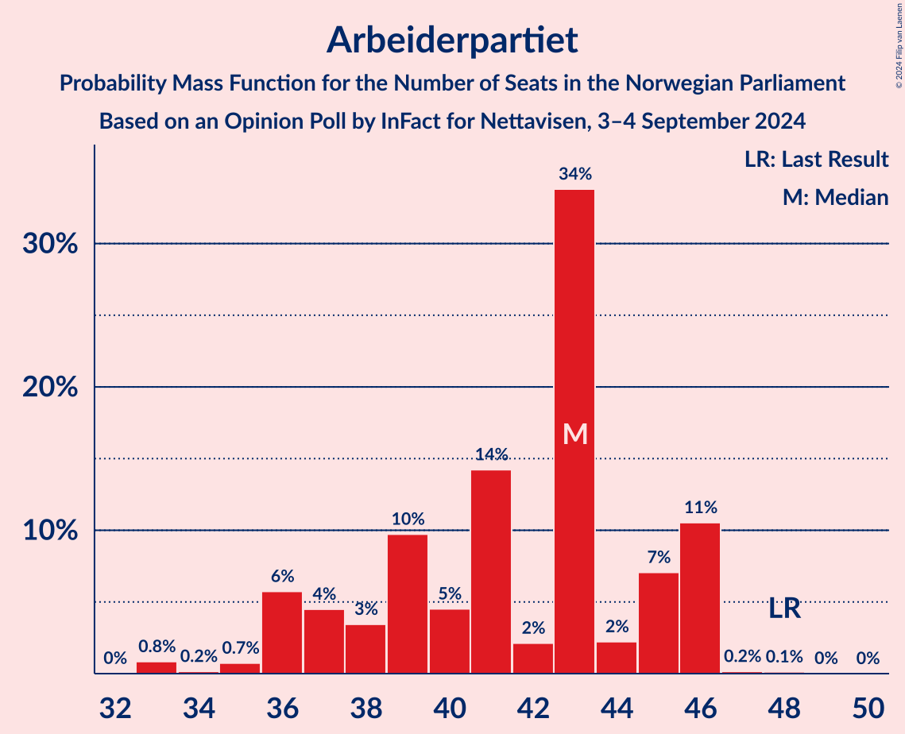
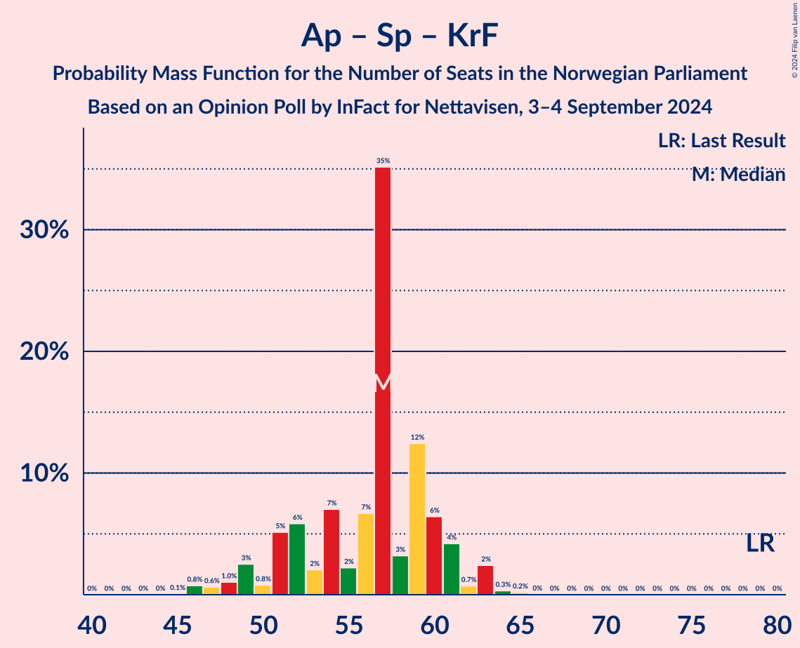

# Opinion Poll by InFact for Nettavisen, 3–4 September 2024

<a href="#voting-intentions">Voting Intentions</a> | <a href="#seats">Seats</a> | <a href="#coalitions">Coalitions</a> | <a href="#technical-information">Technical Information</a>

## Voting Intentions

### Confidence Intervals

| Party | Last Result | Poll Result | 80% Confidence Interval | 90% Confidence Interval | 95% Confidence Interval | 99% Confidence Interval |
|:-----:|:-----------:|:-----------:|:-----------------------:|:-----------------------:|:-----------------------:|:-----------------------:|
| Fremskrittspartiet | 11.6% | 21.9% | 20.4–23.5% |20.0–24.0% |19.6–24.4% |18.9–25.2% |
| Arbeiderpartiet | 26.2% | 21.4% | 19.9–23.0% |19.5–23.5% |19.1–23.9% |18.5–24.6% |
| Høyre | 20.4% | 21.0% | 19.5–22.6% |19.1–23.0% |18.7–23.4% |18.0–24.2% |
| Sosialistisk Venstreparti | 7.6% | 8.2% | 7.3–9.3% |7.0–9.7% |6.8–9.9% |6.3–10.5% |
| Senterpartiet | 13.5% | 6.1% | 5.3–7.1% |5.0–7.4% |4.8–7.6% |4.5–8.1% |
| Rødt | 4.7% | 5.5% | 4.7–6.4% |4.5–6.7% |4.3–7.0% |4.0–7.4% |
| Venstre | 4.6% | 4.2% | 3.5–5.1% |3.3–5.3% |3.2–5.5% |2.9–5.9% |
| Miljøpartiet De Grønne | 3.9% | 3.9% | 3.3–4.8% |3.1–5.0% |3.0–5.2% |2.7–5.7% |
| Kristelig Folkeparti | 3.8% | 3.7% | 3.1–4.5% |2.9–4.7% |2.7–4.9% |2.5–5.3% |
| Industri- og Næringspartiet | 0.3% | 2.3% | 1.8–3.0% |1.7–3.2% |1.6–3.4% |1.4–3.7% |
| Konservativt | 0.4% | 0.5% | 0.3–0.9% |0.3–1.0% |0.2–1.1% |0.2–1.3% |
| Pensjonistpartiet | 0.6% | 0.3% | 0.2–0.7% |0.2–0.8% |0.1–0.9% |0.1–1.1% |
| Liberalistene | 0.2% | 0.1% | 0.0–0.3% |0.0–0.4% |0.0–0.5% |0.0–0.6% |

*Note:* The poll result column reflects the actual value used in the calculations. Published results may vary slightly, and in addition be rounded to fewer digits.

## Seats

### Confidence Intervals

| Party | Last Result | Median | 80% Confidence Interval | 90% Confidence Interval | 95% Confidence Interval | 99% Confidence Interval |
|:-----:|:-----------:|:------:|:-----------------------:|:-----------------------:|:-----------------------:|:-----------------------:|
| <a href="#fremskrittspartiet">Fremskrittspartiet</a> | 21 | 42 | 38–44 |37–46 |36–47 |35–49 |
| <a href="#arbeiderpartiet">Arbeiderpartiet</a> | 48 | 43 | 37–46 |36–46 |36–46 |33–46 |
| <a href="#høyre">Høyre</a> | 36 | 35 | 34–40 |32–41 |32–43 |31–46 |
| <a href="#sosialistisk-venstreparti">Sosialistisk Venstreparti</a> | 13 | 14 | 11–18 |11–18 |10–19 |9–19 |
| <a href="#senterpartiet">Senterpartiet</a> | 28 | 12 | 10–12 |8–13 |8–14 |6–15 |
| <a href="#rødt">Rødt</a> | 8 | 10 | 8–12 |8–12 |7–12 |1–15 |
| <a href="#venstre">Venstre</a> | 8 | 3 | 2–9 |2–9 |2–10 |2–11 |
| <a href="#miljøpartiet-de-grønne">Miljøpartiet De Grønne</a> | 3 | 3 | 2–8 |1–9 |1–9 |1–10 |
| <a href="#kristelig-folkeparti">Kristelig Folkeparti</a> | 3 | 2 | 2–8 |2–8 |2–9 |1–10 |
| <a href="#industri--og-næringspartiet">Industri- og Næringspartiet</a> | 0 | 0 | 0–2 |0–2 |0–2 |0–3 |
| <a href="#konservativt">Konservativt</a> | 0 | 0 | 0 |0 |0 |0 |
| <a href="#pensjonistpartiet">Pensjonistpartiet</a> | 0 | 0 | 0 |0 |0 |0 |
| <a href="#liberalistene">Liberalistene</a> | 0 | 0 | 0 |0 |0 |0 |

### Fremskrittspartiet

*For a full overview of the results for this party, see the [Fremskrittspartiet](party-fremskrittspartiet.html) page.*

| Number of Seats | Probability | Accumulated | Special Marks |
|:---------------:|:-----------:|:-----------:|:-------------:|
| 21 | 0% | 100% | Last Result |
| 22 | 0% | 100% |  |
| 23 | 0% | 100% |  |
| 24 | 0% | 100% |  |
| 25 | 0% | 100% |  |
| 26 | 0% | 100% |  |
| 27 | 0% | 100% |  |
| 28 | 0% | 100% |  |
| 29 | 0% | 100% |  |
| 30 | 0% | 100% |  |
| 31 | 0% | 100% |  |
| 32 | 0% | 100% |  |
| 33 | 0% | 100% |  |
| 34 | 0.2% | 100% |  |
| 35 | 0.5% | 99.8% |  |
| 36 | 3% | 99.2% |  |
| 37 | 2% | 96% |  |
| 38 | 8% | 94% |  |
| 39 | 8% | 86% |  |
| 40 | 15% | 78% |  |
| 41 | 9% | 62% |  |
| 42 | 4% | 53% | Median |
| 43 | 2% | 49% |  |
| 44 | 38% | 47% |  |
| 45 | 4% | 9% |  |
| 46 | 2% | 5% |  |
| 47 | 1.2% | 3% |  |
| 48 | 0.1% | 2% |  |
| 49 | 2% | 2% |  |
| 50 | 0% | 0% |  |

### Arbeiderpartiet

*For a full overview of the results for this party, see the [Arbeiderpartiet](party-arbeiderpartiet.html) page.*

| Number of Seats | Probability | Accumulated | Special Marks |
|:---------------:|:-----------:|:-----------:|:-------------:|
| 33 | 0.8% | 100% |  |
| 34 | 0.2% | 99.1% |  |
| 35 | 0.7% | 99.0% |  |
| 36 | 6% | 98% |  |
| 37 | 4% | 92% |  |
| 38 | 3% | 88% |  |
| 39 | 10% | 85% |  |
| 40 | 5% | 75% |  |
| 41 | 14% | 70% |  |
| 42 | 2% | 56% |  |
| 43 | 34% | 54% | Median |
| 44 | 2% | 20% |  |
| 45 | 7% | 18% |  |
| 46 | 11% | 11% |  |
| 47 | 0.2% | 0.3% |  |
| 48 | 0.1% | 0.2% | Last Result |
| 49 | 0% | 0% |  |

### Høyre

*For a full overview of the results for this party, see the [Høyre](party-høyre.html) page.*

| Number of Seats | Probability | Accumulated | Special Marks |
|:---------------:|:-----------:|:-----------:|:-------------:|
| 30 | 0.2% | 100% |  |
| 31 | 0.5% | 99.8% |  |
| 32 | 6% | 99.3% |  |
| 33 | 2% | 93% |  |
| 34 | 36% | 91% |  |
| 35 | 13% | 55% | Median |
| 36 | 8% | 42% | Last Result |
| 37 | 8% | 34% |  |
| 38 | 11% | 26% |  |
| 39 | 3% | 15% |  |
| 40 | 3% | 11% |  |
| 41 | 4% | 9% |  |
| 42 | 0.7% | 4% |  |
| 43 | 1.1% | 3% |  |
| 44 | 0.1% | 2% |  |
| 45 | 0.3% | 2% |  |
| 46 | 2% | 2% |  |
| 47 | 0% | 0% |  |

### Sosialistisk Venstreparti

*For a full overview of the results for this party, see the [Sosialistisk Venstreparti](party-sosialistiskvenstreparti.html) page.*

| Number of Seats | Probability | Accumulated | Special Marks |
|:---------------:|:-----------:|:-----------:|:-------------:|
| 9 | 0.6% | 100% |  |
| 10 | 2% | 99.4% |  |
| 11 | 15% | 97% |  |
| 12 | 6% | 83% |  |
| 13 | 5% | 77% | Last Result |
| 14 | 39% | 72% | Median |
| 15 | 9% | 33% |  |
| 16 | 9% | 24% |  |
| 17 | 4% | 15% |  |
| 18 | 6% | 11% |  |
| 19 | 5% | 5% |  |
| 20 | 0.1% | 0.1% |  |
| 21 | 0.1% | 0.1% |  |
| 22 | 0% | 0% |  |

### Senterpartiet

*For a full overview of the results for this party, see the [Senterpartiet](party-senterpartiet.html) page.*

| Number of Seats | Probability | Accumulated | Special Marks |
|:---------------:|:-----------:|:-----------:|:-------------:|
| 6 | 0.5% | 100% |  |
| 7 | 0.9% | 99.4% |  |
| 8 | 4% | 98% |  |
| 9 | 4% | 94% |  |
| 10 | 14% | 90% |  |
| 11 | 18% | 76% |  |
| 12 | 51% | 58% | Median |
| 13 | 4% | 8% |  |
| 14 | 3% | 4% |  |
| 15 | 0.8% | 0.9% |  |
| 16 | 0.1% | 0.1% |  |
| 17 | 0% | 0% |  |
| 18 | 0% | 0% |  |
| 19 | 0% | 0% |  |
| 20 | 0% | 0% |  |
| 21 | 0% | 0% |  |
| 22 | 0% | 0% |  |
| 23 | 0% | 0% |  |
| 24 | 0% | 0% |  |
| 25 | 0% | 0% |  |
| 26 | 0% | 0% |  |
| 27 | 0% | 0% |  |
| 28 | 0% | 0% | Last Result |

### Rødt

*For a full overview of the results for this party, see the [Rødt](party-rødt.html) page.*

| Number of Seats | Probability | Accumulated | Special Marks |
|:---------------:|:-----------:|:-----------:|:-------------:|
| 1 | 2% | 100% |  |
| 2 | 0% | 98% |  |
| 3 | 0% | 98% |  |
| 4 | 0% | 98% |  |
| 5 | 0% | 98% |  |
| 6 | 0.6% | 98% |  |
| 7 | 2% | 98% |  |
| 8 | 14% | 96% | Last Result |
| 9 | 17% | 82% |  |
| 10 | 15% | 65% | Median |
| 11 | 35% | 50% |  |
| 12 | 14% | 15% |  |
| 13 | 0.6% | 1.5% |  |
| 14 | 0.3% | 0.9% |  |
| 15 | 0.5% | 0.5% |  |
| 16 | 0% | 0% |  |

### Venstre

*For a full overview of the results for this party, see the [Venstre](party-venstre.html) page.*

| Number of Seats | Probability | Accumulated | Special Marks |
|:---------------:|:-----------:|:-----------:|:-------------:|
| 2 | 10% | 100% |  |
| 3 | 43% | 90% | Median |
| 4 | 0% | 47% |  |
| 5 | 0% | 47% |  |
| 6 | 1.2% | 47% |  |
| 7 | 17% | 46% |  |
| 8 | 13% | 29% | Last Result |
| 9 | 13% | 16% |  |
| 10 | 3% | 3% |  |
| 11 | 0.6% | 0.6% |  |
| 12 | 0% | 0% |  |

### Miljøpartiet De Grønne

*For a full overview of the results for this party, see the [Miljøpartiet De Grønne](party-miljøpartietdegrønne.html) page.*

| Number of Seats | Probability | Accumulated | Special Marks |
|:---------------:|:-----------:|:-----------:|:-------------:|
| 1 | 7% | 100% |  |
| 2 | 22% | 93% |  |
| 3 | 50% | 71% | Last Result, Median |
| 4 | 0% | 21% |  |
| 5 | 0% | 21% |  |
| 6 | 0.7% | 21% |  |
| 7 | 7% | 20% |  |
| 8 | 6% | 14% |  |
| 9 | 6% | 7% |  |
| 10 | 0.8% | 1.0% |  |
| 11 | 0.2% | 0.2% |  |
| 12 | 0% | 0% |  |

### Kristelig Folkeparti

*For a full overview of the results for this party, see the [Kristelig Folkeparti](party-kristeligfolkeparti.html) page.*

| Number of Seats | Probability | Accumulated | Special Marks |
|:---------------:|:-----------:|:-----------:|:-------------:|
| 0 | 0.3% | 100% |  |
| 1 | 0.8% | 99.7% |  |
| 2 | 52% | 98.8% | Median |
| 3 | 28% | 47% | Last Result |
| 4 | 0% | 19% |  |
| 5 | 0% | 19% |  |
| 6 | 2% | 19% |  |
| 7 | 4% | 18% |  |
| 8 | 10% | 13% |  |
| 9 | 2% | 4% |  |
| 10 | 2% | 2% |  |
| 11 | 0.1% | 0.1% |  |
| 12 | 0% | 0% |  |

### Industri- og Næringspartiet

*For a full overview of the results for this party, see the [Industri- og Næringspartiet](party-industri-ognæringspartiet.html) page.*

| Number of Seats | Probability | Accumulated | Special Marks |
|:---------------:|:-----------:|:-----------:|:-------------:|
| 0 | 55% | 100% | Last Result, Median |
| 1 | 3% | 45% |  |
| 2 | 41% | 42% |  |
| 3 | 1.5% | 2% |  |
| 4 | 0% | 0.2% |  |
| 5 | 0% | 0.2% |  |
| 6 | 0% | 0.2% |  |
| 7 | 0.1% | 0.2% |  |
| 8 | 0% | 0% |  |

### Konservativt

*For a full overview of the results for this party, see the [Konservativt](party-konservativt.html) page.*

| Number of Seats | Probability | Accumulated | Special Marks |
|:---------------:|:-----------:|:-----------:|:-------------:|
| 0 | 100% | 100% | Last Result, Median |

### Pensjonistpartiet

*For a full overview of the results for this party, see the [Pensjonistpartiet](party-pensjonistpartiet.html) page.*

| Number of Seats | Probability | Accumulated | Special Marks |
|:---------------:|:-----------:|:-----------:|:-------------:|
| 0 | 100% | 100% | Last Result, Median |

### Liberalistene

*For a full overview of the results for this party, see the [Liberalistene](party-liberalistene.html) page.*

| Number of Seats | Probability | Accumulated | Special Marks |
|:---------------:|:-----------:|:-----------:|:-------------:|
| 0 | 100% | 100% | Last Result, Median |

## Coalitions

### Confidence Intervals

| Coalition | Last Result | Median | Majority? | 80% Confidence Interval | 90% Confidence Interval | 95% Confidence Interval | 99% Confidence Interval |
|:---------:|:-----------:|:------:|:---------:|:-----------------------:|:-----------------------:|:-----------------------:|:-----------------------:|
| Fremskrittspartiet – Høyre – Senterpartiet – Venstre – Kristelig Folkeparti | 96 | 98 | 100% | 95–103 | 92–105 | 92–106 | 91–109 |
| Fremskrittspartiet – Høyre – Venstre – Miljøpartiet De Grønne – Kristelig Folkeparti | 71 | 90 | 99.2% | 86–96 | 86–97 | 86–100 | 83–101 |
| Fremskrittspartiet – Høyre – Venstre – Kristelig Folkeparti | 68 | 86 | 55% | 83–92 | 81–95 | 81–95 | 79–98 |
| Fremskrittspartiet – Høyre – Venstre | 65 | 81 | 30% | 79–89 | 78–91 | 78–92 | 75–92 |
| Arbeiderpartiet – Sosialistisk Venstreparti – Senterpartiet – Rødt – Miljøpartiet De Grønne | 100 | 82 | 9% | 75–84 | 73–87 | 73–87 | 69–88 |
| Fremskrittspartiet – Høyre | 57 | 78 | 5% | 74–83 | 72–85 | 72–86 | 70–86 |
| Arbeiderpartiet – Sosialistisk Venstreparti – Senterpartiet – Miljøpartiet De Grønne – Kristelig Folkeparti | 95 | 74 | 0.4% | 70–79 | 68–80 | 67–81 | 65–84 |
| Arbeiderpartiet – Sosialistisk Venstreparti – Senterpartiet – Rødt | 97 | 79 | 0.7% | 71–80 | 70–80 | 67–81 | 65–85 |
| Arbeiderpartiet – Sosialistisk Venstreparti – Senterpartiet – Miljøpartiet De Grønne | 92 | 72 | 0% | 66–75 | 65–77 | 64–77 | 62–79 |
| Arbeiderpartiet – Sosialistisk Venstreparti – Rødt – Miljøpartiet De Grønne | 72 | 71 | 0% | 65–72 | 63–76 | 61–76 | 59–76 |
| Arbeiderpartiet – Sosialistisk Venstreparti – Senterpartiet | 89 | 68 | 0% | 63–69 | 61–71 | 59–72 | 56–72 |
| Arbeiderpartiet – Senterpartiet – Miljøpartiet De Grønne – Kristelig Folkeparti | 82 | 60 | 0% | 55–64 | 53–65 | 51–66 | 51–71 |
| Arbeiderpartiet – Senterpartiet – Kristelig Folkeparti | 79 | 57 | 0% | 51–60 | 49–61 | 48–63 | 46–64 |
| Arbeiderpartiet – Sosialistisk Venstreparti | 61 | 57 | 0% | 53–57 | 51–58 | 49–60 | 47–60 |
| Arbeiderpartiet – Senterpartiet | 76 | 54 | 0% | 48–56 | 47–57 | 46–58 | 44–58 |
| Høyre – Venstre – Kristelig Folkeparti | 47 | 45 | 0% | 39–50 | 39–53 | 39–55 | 38–56 |
| Senterpartiet – Venstre – Kristelig Folkeparti | 39 | 20 | 0% | 16–25 | 15–27 | 15–29 | 14–30 |

### Fremskrittspartiet – Høyre – Senterpartiet – Venstre – Kristelig Folkeparti

| Number of Seats | Probability | Accumulated | Special Marks |
|:---------------:|:-----------:|:-----------:|:-------------:|
| 88 | 0.1% | 100% |  |
| 89 | 0% | 99.9% |  |
| 90 | 0.1% | 99.9% |  |
| 91 | 0.5% | 99.8% |  |
| 92 | 5% | 99.3% |  |
| 93 | 2% | 95% |  |
| 94 | 2% | 93% | Median |
| 95 | 33% | 91% |  |
| 96 | 5% | 58% | Last Result |
| 97 | 2% | 52% |  |
| 98 | 15% | 50% |  |
| 99 | 7% | 36% |  |
| 100 | 12% | 29% |  |
| 101 | 2% | 17% |  |
| 102 | 4% | 15% |  |
| 103 | 3% | 11% |  |
| 104 | 1.3% | 9% |  |
| 105 | 3% | 7% |  |
| 106 | 2% | 4% |  |
| 107 | 0.5% | 2% |  |
| 108 | 1.4% | 2% |  |
| 109 | 0% | 0.5% |  |
| 110 | 0% | 0.5% |  |
| 111 | 0.4% | 0.5% |  |
| 112 | 0% | 0% |  |

### Fremskrittspartiet – Høyre – Venstre – Miljøpartiet De Grønne – Kristelig Folkeparti

| Number of Seats | Probability | Accumulated | Special Marks |
|:---------------:|:-----------:|:-----------:|:-------------:|
| 71 | 0% | 100% | Last Result |
| 72 | 0% | 100% |  |
| 73 | 0% | 100% |  |
| 74 | 0% | 100% |  |
| 75 | 0% | 100% |  |
| 76 | 0% | 100% |  |
| 77 | 0% | 100% |  |
| 78 | 0% | 100% |  |
| 79 | 0% | 100% |  |
| 80 | 0% | 100% |  |
| 81 | 0% | 100% |  |
| 82 | 0.2% | 100% |  |
| 83 | 0.6% | 99.8% |  |
| 84 | 0.1% | 99.2% |  |
| 85 | 0.3% | 99.2% | Median, Majority |
| 86 | 32% | 98.9% |  |
| 87 | 0.6% | 67% |  |
| 88 | 5% | 67% |  |
| 89 | 7% | 61% |  |
| 90 | 15% | 54% |  |
| 91 | 2% | 39% |  |
| 92 | 12% | 36% |  |
| 93 | 6% | 24% |  |
| 94 | 4% | 18% |  |
| 95 | 0.8% | 15% |  |
| 96 | 5% | 14% |  |
| 97 | 5% | 9% |  |
| 98 | 0.6% | 4% |  |
| 99 | 0.7% | 4% |  |
| 100 | 0.9% | 3% |  |
| 101 | 2% | 2% |  |
| 102 | 0.2% | 0.4% |  |
| 103 | 0.1% | 0.2% |  |
| 104 | 0.1% | 0.1% |  |
| 105 | 0% | 0% |  |

### Fremskrittspartiet – Høyre – Venstre – Kristelig Folkeparti

| Number of Seats | Probability | Accumulated | Special Marks |
|:---------------:|:-----------:|:-----------:|:-------------:|
| 68 | 0% | 100% | Last Result |
| 69 | 0% | 100% |  |
| 70 | 0% | 100% |  |
| 71 | 0% | 100% |  |
| 72 | 0% | 100% |  |
| 73 | 0% | 100% |  |
| 74 | 0% | 100% |  |
| 75 | 0% | 100% |  |
| 76 | 0% | 100% |  |
| 77 | 0% | 100% |  |
| 78 | 0% | 100% |  |
| 79 | 0.5% | 99.9% |  |
| 80 | 0.1% | 99.4% |  |
| 81 | 6% | 99.2% |  |
| 82 | 0.6% | 93% | Median |
| 83 | 32% | 92% |  |
| 84 | 5% | 60% |  |
| 85 | 0.8% | 55% | Majority |
| 86 | 9% | 54% |  |
| 87 | 4% | 44% |  |
| 88 | 11% | 41% |  |
| 89 | 10% | 30% |  |
| 90 | 3% | 20% |  |
| 91 | 6% | 17% |  |
| 92 | 1.4% | 11% |  |
| 93 | 1.4% | 10% |  |
| 94 | 1.2% | 8% |  |
| 95 | 6% | 7% |  |
| 96 | 0.8% | 1.4% |  |
| 97 | 0.1% | 0.6% |  |
| 98 | 0.4% | 0.5% |  |
| 99 | 0.1% | 0.1% |  |
| 100 | 0% | 0% |  |

### Fremskrittspartiet – Høyre – Venstre

| Number of Seats | Probability | Accumulated | Special Marks |
|:---------------:|:-----------:|:-----------:|:-------------:|
| 65 | 0% | 100% | Last Result |
| 66 | 0% | 100% |  |
| 67 | 0% | 100% |  |
| 68 | 0% | 100% |  |
| 69 | 0% | 100% |  |
| 70 | 0% | 100% |  |
| 71 | 0% | 100% |  |
| 72 | 0% | 100% |  |
| 73 | 0.2% | 100% |  |
| 74 | 0% | 99.8% |  |
| 75 | 0.3% | 99.8% |  |
| 76 | 0.6% | 99.5% |  |
| 77 | 0.5% | 98.9% |  |
| 78 | 5% | 98% |  |
| 79 | 6% | 93% |  |
| 80 | 0.8% | 87% | Median |
| 81 | 38% | 86% |  |
| 82 | 3% | 48% |  |
| 83 | 8% | 45% |  |
| 84 | 6% | 37% |  |
| 85 | 9% | 30% | Majority |
| 86 | 3% | 22% |  |
| 87 | 6% | 19% |  |
| 88 | 2% | 12% |  |
| 89 | 4% | 11% |  |
| 90 | 0.8% | 7% |  |
| 91 | 1.5% | 6% |  |
| 92 | 4% | 4% |  |
| 93 | 0.1% | 0.1% |  |
| 94 | 0% | 0.1% |  |
| 95 | 0% | 0% |  |

### Arbeiderpartiet – Sosialistisk Venstreparti – Senterpartiet – Rødt – Miljøpartiet De Grønne

| Number of Seats | Probability | Accumulated | Special Marks |
|:---------------:|:-----------:|:-----------:|:-------------:|
| 68 | 0.5% | 100% |  |
| 69 | 0% | 99.5% |  |
| 70 | 0% | 99.5% |  |
| 71 | 0.2% | 99.5% |  |
| 72 | 0.9% | 99.2% |  |
| 73 | 7% | 98% |  |
| 74 | 1.3% | 92% |  |
| 75 | 3% | 91% |  |
| 76 | 2% | 88% |  |
| 77 | 5% | 86% |  |
| 78 | 3% | 81% |  |
| 79 | 10% | 78% |  |
| 80 | 4% | 68% |  |
| 81 | 9% | 64% |  |
| 82 | 5% | 55% | Median |
| 83 | 37% | 49% |  |
| 84 | 4% | 12% |  |
| 85 | 1.1% | 9% | Majority |
| 86 | 0.6% | 8% |  |
| 87 | 6% | 7% |  |
| 88 | 0.6% | 0.9% |  |
| 89 | 0.2% | 0.3% |  |
| 90 | 0% | 0.1% |  |
| 91 | 0% | 0% |  |
| 92 | 0% | 0% |  |
| 93 | 0% | 0% |  |
| 94 | 0% | 0% |  |
| 95 | 0% | 0% |  |
| 96 | 0% | 0% |  |
| 97 | 0% | 0% |  |
| 98 | 0% | 0% |  |
| 99 | 0% | 0% |  |
| 100 | 0% | 0% | Last Result |

### Fremskrittspartiet – Høyre

| Number of Seats | Probability | Accumulated | Special Marks |
|:---------------:|:-----------:|:-----------:|:-------------:|
| 57 | 0% | 100% | Last Result |
| 58 | 0% | 100% |  |
| 59 | 0% | 100% |  |
| 60 | 0% | 100% |  |
| 61 | 0% | 100% |  |
| 62 | 0% | 100% |  |
| 63 | 0% | 100% |  |
| 64 | 0% | 100% |  |
| 65 | 0% | 100% |  |
| 66 | 0% | 100% |  |
| 67 | 0% | 100% |  |
| 68 | 0% | 100% |  |
| 69 | 0.1% | 99.9% |  |
| 70 | 0.4% | 99.8% |  |
| 71 | 2% | 99.4% |  |
| 72 | 3% | 98% |  |
| 73 | 2% | 94% |  |
| 74 | 3% | 92% |  |
| 75 | 13% | 89% |  |
| 76 | 5% | 76% |  |
| 77 | 6% | 71% | Median |
| 78 | 41% | 65% |  |
| 79 | 8% | 24% |  |
| 80 | 2% | 16% |  |
| 81 | 1.1% | 14% |  |
| 82 | 2% | 13% |  |
| 83 | 4% | 11% |  |
| 84 | 1.0% | 6% |  |
| 85 | 2% | 5% | Majority |
| 86 | 3% | 3% |  |
| 87 | 0.2% | 0.3% |  |
| 88 | 0% | 0% |  |

### Arbeiderpartiet – Sosialistisk Venstreparti – Senterpartiet – Miljøpartiet De Grønne – Kristelig Folkeparti

| Number of Seats | Probability | Accumulated | Special Marks |
|:---------------:|:-----------:|:-----------:|:-------------:|
| 64 | 0.1% | 100% |  |
| 65 | 0.8% | 99.9% |  |
| 66 | 0% | 99.1% |  |
| 67 | 2% | 99.0% |  |
| 68 | 2% | 97% |  |
| 69 | 2% | 95% |  |
| 70 | 4% | 92% |  |
| 71 | 4% | 89% |  |
| 72 | 8% | 85% |  |
| 73 | 8% | 77% |  |
| 74 | 38% | 69% | Median |
| 75 | 3% | 31% |  |
| 76 | 7% | 28% |  |
| 77 | 2% | 21% |  |
| 78 | 7% | 19% |  |
| 79 | 5% | 12% |  |
| 80 | 4% | 7% |  |
| 81 | 1.1% | 3% |  |
| 82 | 0.6% | 1.5% |  |
| 83 | 0.4% | 0.9% |  |
| 84 | 0.1% | 0.5% |  |
| 85 | 0.4% | 0.4% | Majority |
| 86 | 0% | 0.1% |  |
| 87 | 0% | 0% |  |
| 88 | 0% | 0% |  |
| 89 | 0% | 0% |  |
| 90 | 0% | 0% |  |
| 91 | 0% | 0% |  |
| 92 | 0% | 0% |  |
| 93 | 0% | 0% |  |
| 94 | 0% | 0% |  |
| 95 | 0% | 0% | Last Result |

### Arbeiderpartiet – Sosialistisk Venstreparti – Senterpartiet – Rødt

| Number of Seats | Probability | Accumulated | Special Marks |
|:---------------:|:-----------:|:-----------:|:-------------:|
| 64 | 0.1% | 100% |  |
| 65 | 0.5% | 99.9% |  |
| 66 | 0.8% | 99.4% |  |
| 67 | 1.3% | 98.5% |  |
| 68 | 0.9% | 97% |  |
| 69 | 0.3% | 96% |  |
| 70 | 2% | 96% |  |
| 71 | 5% | 94% |  |
| 72 | 5% | 89% |  |
| 73 | 3% | 85% |  |
| 74 | 3% | 82% |  |
| 75 | 4% | 79% |  |
| 76 | 13% | 74% |  |
| 77 | 2% | 61% |  |
| 78 | 8% | 59% |  |
| 79 | 9% | 51% | Median |
| 80 | 37% | 42% |  |
| 81 | 3% | 5% |  |
| 82 | 0.3% | 2% |  |
| 83 | 0.4% | 1.2% |  |
| 84 | 0.1% | 0.8% |  |
| 85 | 0.7% | 0.7% | Majority |
| 86 | 0% | 0% |  |
| 87 | 0% | 0% |  |
| 88 | 0% | 0% |  |
| 89 | 0% | 0% |  |
| 90 | 0% | 0% |  |
| 91 | 0% | 0% |  |
| 92 | 0% | 0% |  |
| 93 | 0% | 0% |  |
| 94 | 0% | 0% |  |
| 95 | 0% | 0% |  |
| 96 | 0% | 0% |  |
| 97 | 0% | 0% | Last Result |

### Arbeiderpartiet – Sosialistisk Venstreparti – Senterpartiet – Miljøpartiet De Grønne

| Number of Seats | Probability | Accumulated | Special Marks |
|:---------------:|:-----------:|:-----------:|:-------------:|
| 61 | 0.2% | 100% |  |
| 62 | 0.8% | 99.8% |  |
| 63 | 0.8% | 99.0% |  |
| 64 | 3% | 98% |  |
| 65 | 3% | 95% |  |
| 66 | 4% | 92% |  |
| 67 | 2% | 88% |  |
| 68 | 6% | 86% |  |
| 69 | 11% | 80% |  |
| 70 | 5% | 68% |  |
| 71 | 10% | 63% |  |
| 72 | 34% | 53% | Median |
| 73 | 5% | 19% |  |
| 74 | 2% | 14% |  |
| 75 | 5% | 12% |  |
| 76 | 0.5% | 7% |  |
| 77 | 5% | 7% |  |
| 78 | 1.1% | 2% |  |
| 79 | 0.5% | 0.9% |  |
| 80 | 0.4% | 0.4% |  |
| 81 | 0% | 0% |  |
| 82 | 0% | 0% |  |
| 83 | 0% | 0% |  |
| 84 | 0% | 0% |  |
| 85 | 0% | 0% | Majority |
| 86 | 0% | 0% |  |
| 87 | 0% | 0% |  |
| 88 | 0% | 0% |  |
| 89 | 0% | 0% |  |
| 90 | 0% | 0% |  |
| 91 | 0% | 0% |  |
| 92 | 0% | 0% | Last Result |

### Arbeiderpartiet – Sosialistisk Venstreparti – Rødt – Miljøpartiet De Grønne

| Number of Seats | Probability | Accumulated | Special Marks |
|:---------------:|:-----------:|:-----------:|:-------------:|
| 55 | 0.4% | 100% |  |
| 56 | 0% | 99.6% |  |
| 57 | 0% | 99.6% |  |
| 58 | 0% | 99.5% |  |
| 59 | 0.1% | 99.5% |  |
| 60 | 1.4% | 99.5% |  |
| 61 | 0.9% | 98% |  |
| 62 | 2% | 97% |  |
| 63 | 3% | 95% |  |
| 64 | 0.9% | 92% |  |
| 65 | 3% | 91% |  |
| 66 | 5% | 88% |  |
| 67 | 4% | 82% |  |
| 68 | 10% | 79% |  |
| 69 | 3% | 68% |  |
| 70 | 7% | 65% | Median |
| 71 | 44% | 58% |  |
| 72 | 4% | 14% | Last Result |
| 73 | 2% | 9% |  |
| 74 | 1.1% | 7% |  |
| 75 | 1.0% | 6% |  |
| 76 | 5% | 5% |  |
| 77 | 0.2% | 0.3% |  |
| 78 | 0% | 0.1% |  |
| 79 | 0% | 0.1% |  |
| 80 | 0% | 0% |  |

### Arbeiderpartiet – Sosialistisk Venstreparti – Senterpartiet

| Number of Seats | Probability | Accumulated | Special Marks |
|:---------------:|:-----------:|:-----------:|:-------------:|
| 56 | 0.6% | 100% |  |
| 57 | 0.2% | 99.4% |  |
| 58 | 0.3% | 99.2% |  |
| 59 | 2% | 98.8% |  |
| 60 | 1.1% | 97% |  |
| 61 | 2% | 96% |  |
| 62 | 2% | 94% |  |
| 63 | 7% | 92% |  |
| 64 | 4% | 86% |  |
| 65 | 3% | 81% |  |
| 66 | 7% | 79% |  |
| 67 | 14% | 72% |  |
| 68 | 17% | 58% |  |
| 69 | 32% | 41% | Median |
| 70 | 3% | 9% |  |
| 71 | 2% | 6% |  |
| 72 | 3% | 3% |  |
| 73 | 0.2% | 0.3% |  |
| 74 | 0.1% | 0.1% |  |
| 75 | 0% | 0% |  |
| 76 | 0% | 0% |  |
| 77 | 0% | 0% |  |
| 78 | 0% | 0% |  |
| 79 | 0% | 0% |  |
| 80 | 0% | 0% |  |
| 81 | 0% | 0% |  |
| 82 | 0% | 0% |  |
| 83 | 0% | 0% |  |
| 84 | 0% | 0% |  |
| 85 | 0% | 0% | Majority |
| 86 | 0% | 0% |  |
| 87 | 0% | 0% |  |
| 88 | 0% | 0% |  |
| 89 | 0% | 0% | Last Result |

### Arbeiderpartiet – Senterpartiet – Miljøpartiet De Grønne – Kristelig Folkeparti

| Number of Seats | Probability | Accumulated | Special Marks |
|:---------------:|:-----------:|:-----------:|:-------------:|
| 49 | 0.1% | 100% |  |
| 50 | 0.1% | 99.9% |  |
| 51 | 3% | 99.7% |  |
| 52 | 1.0% | 97% |  |
| 53 | 3% | 96% |  |
| 54 | 2% | 93% |  |
| 55 | 8% | 92% |  |
| 56 | 2% | 84% |  |
| 57 | 1.1% | 82% |  |
| 58 | 2% | 81% |  |
| 59 | 3% | 79% |  |
| 60 | 34% | 76% | Median |
| 61 | 10% | 41% |  |
| 62 | 7% | 31% |  |
| 63 | 13% | 24% |  |
| 64 | 4% | 11% |  |
| 65 | 4% | 8% |  |
| 66 | 2% | 4% |  |
| 67 | 0.2% | 2% |  |
| 68 | 0.3% | 1.4% |  |
| 69 | 0.5% | 1.1% |  |
| 70 | 0.1% | 0.6% |  |
| 71 | 0.1% | 0.5% |  |
| 72 | 0% | 0.4% |  |
| 73 | 0.3% | 0.3% |  |
| 74 | 0% | 0% |  |
| 75 | 0% | 0% |  |
| 76 | 0% | 0% |  |
| 77 | 0% | 0% |  |
| 78 | 0% | 0% |  |
| 79 | 0% | 0% |  |
| 80 | 0% | 0% |  |
| 81 | 0% | 0% |  |
| 82 | 0% | 0% | Last Result |

### Arbeiderpartiet – Senterpartiet – Kristelig Folkeparti

| Number of Seats | Probability | Accumulated | Special Marks |
|:---------------:|:-----------:|:-----------:|:-------------:|
| 45 | 0.1% | 100% |  |
| 46 | 0.8% | 99.9% |  |
| 47 | 0.6% | 99.1% |  |
| 48 | 1.0% | 98.5% |  |
| 49 | 3% | 97% |  |
| 50 | 0.8% | 95% |  |
| 51 | 5% | 94% |  |
| 52 | 6% | 89% |  |
| 53 | 2% | 83% |  |
| 54 | 7% | 81% |  |
| 55 | 2% | 74% |  |
| 56 | 7% | 72% |  |
| 57 | 35% | 65% | Median |
| 58 | 3% | 30% |  |
| 59 | 12% | 27% |  |
| 60 | 6% | 14% |  |
| 61 | 4% | 8% |  |
| 62 | 0.7% | 4% |  |
| 63 | 2% | 3% |  |
| 64 | 0.3% | 0.6% |  |
| 65 | 0.2% | 0.2% |  |
| 66 | 0% | 0% |  |
| 67 | 0% | 0% |  |
| 68 | 0% | 0% |  |
| 69 | 0% | 0% |  |
| 70 | 0% | 0% |  |
| 71 | 0% | 0% |  |
| 72 | 0% | 0% |  |
| 73 | 0% | 0% |  |
| 74 | 0% | 0% |  |
| 75 | 0% | 0% |  |
| 76 | 0% | 0% |  |
| 77 | 0% | 0% |  |
| 78 | 0% | 0% |  |
| 79 | 0% | 0% | Last Result |

### Arbeiderpartiet – Sosialistisk Venstreparti

| Number of Seats | Probability | Accumulated | Special Marks |
|:---------------:|:-----------:|:-----------:|:-------------:|
| 46 | 0.1% | 100% |  |
| 47 | 0.6% | 99.9% |  |
| 48 | 1.5% | 99.3% |  |
| 49 | 1.3% | 98% |  |
| 50 | 1.1% | 96% |  |
| 51 | 2% | 95% |  |
| 52 | 4% | 94% |  |
| 53 | 5% | 90% |  |
| 54 | 5% | 85% |  |
| 55 | 10% | 81% |  |
| 56 | 12% | 70% |  |
| 57 | 51% | 58% | Median |
| 58 | 2% | 7% |  |
| 59 | 0.7% | 5% |  |
| 60 | 4% | 4% |  |
| 61 | 0.1% | 0.3% | Last Result |
| 62 | 0.1% | 0.2% |  |
| 63 | 0.1% | 0.1% |  |
| 64 | 0% | 0% |  |

### Arbeiderpartiet – Senterpartiet

| Number of Seats | Probability | Accumulated | Special Marks |
|:---------------:|:-----------:|:-----------:|:-------------:|
| 43 | 0.2% | 100% |  |
| 44 | 1.1% | 99.8% |  |
| 45 | 0.6% | 98.7% |  |
| 46 | 1.4% | 98% |  |
| 47 | 3% | 97% |  |
| 48 | 5% | 93% |  |
| 49 | 5% | 89% |  |
| 50 | 8% | 84% |  |
| 51 | 7% | 76% |  |
| 52 | 8% | 69% |  |
| 53 | 10% | 62% |  |
| 54 | 2% | 52% |  |
| 55 | 34% | 50% | Median |
| 56 | 8% | 16% |  |
| 57 | 5% | 8% |  |
| 58 | 3% | 3% |  |
| 59 | 0.2% | 0.3% |  |
| 60 | 0% | 0% |  |
| 61 | 0% | 0% |  |
| 62 | 0% | 0% |  |
| 63 | 0% | 0% |  |
| 64 | 0% | 0% |  |
| 65 | 0% | 0% |  |
| 66 | 0% | 0% |  |
| 67 | 0% | 0% |  |
| 68 | 0% | 0% |  |
| 69 | 0% | 0% |  |
| 70 | 0% | 0% |  |
| 71 | 0% | 0% |  |
| 72 | 0% | 0% |  |
| 73 | 0% | 0% |  |
| 74 | 0% | 0% |  |
| 75 | 0% | 0% |  |
| 76 | 0% | 0% | Last Result |

### Høyre – Venstre – Kristelig Folkeparti

| Number of Seats | Probability | Accumulated | Special Marks |
|:---------------:|:-----------:|:-----------:|:-------------:|
| 37 | 0.2% | 100% |  |
| 38 | 0.4% | 99.8% |  |
| 39 | 31% | 99.4% |  |
| 40 | 5% | 68% | Median |
| 41 | 0.4% | 63% |  |
| 42 | 0.8% | 63% |  |
| 43 | 3% | 62% |  |
| 44 | 6% | 59% |  |
| 45 | 7% | 53% |  |
| 46 | 6% | 46% |  |
| 47 | 5% | 40% | Last Result |
| 48 | 14% | 35% |  |
| 49 | 5% | 21% |  |
| 50 | 7% | 16% |  |
| 51 | 1.2% | 9% |  |
| 52 | 2% | 8% |  |
| 53 | 2% | 6% |  |
| 54 | 0.6% | 4% |  |
| 55 | 1.0% | 3% |  |
| 56 | 2% | 2% |  |
| 57 | 0% | 0.1% |  |
| 58 | 0% | 0.1% |  |
| 59 | 0% | 0% |  |

### Senterpartiet – Venstre – Kristelig Folkeparti

| Number of Seats | Probability | Accumulated | Special Marks |
|:---------------:|:-----------:|:-----------:|:-------------:|
| 13 | 0.2% | 100% |  |
| 14 | 0.8% | 99.8% |  |
| 15 | 5% | 98.9% |  |
| 16 | 4% | 94% |  |
| 17 | 33% | 90% | Median |
| 18 | 2% | 57% |  |
| 19 | 3% | 55% |  |
| 20 | 14% | 52% |  |
| 21 | 7% | 38% |  |
| 22 | 3% | 31% |  |
| 23 | 10% | 28% |  |
| 24 | 7% | 18% |  |
| 25 | 4% | 11% |  |
| 26 | 0.8% | 7% |  |
| 27 | 2% | 7% |  |
| 28 | 0.4% | 4% |  |
| 29 | 3% | 4% |  |
| 30 | 1.4% | 1.4% |  |
| 31 | 0% | 0% |  |
| 32 | 0% | 0% |  |
| 33 | 0% | 0% |  |
| 34 | 0% | 0% |  |
| 35 | 0% | 0% |  |
| 36 | 0% | 0% |  |
| 37 | 0% | 0% |  |
| 38 | 0% | 0% |  |
| 39 | 0% | 0% | Last Result |

## Technical Information

### Opinion Poll

+ **Polling firm:** InFact
+ **Commissioner(s):** Nettavisen
+ **Fieldwork period:** 3–4 September 2024

### Calculations

+ **Sample size:** 1168
+ **Simulations done:** 1,048,576
+ **Error estimate:** 2.16%

