# Opinion Poll by Norfakta for Klassekampen and Nationen, 3–4 September 2024

<a href="#voting-intentions">Voting Intentions</a> | <a href="#seats">Seats</a> | <a href="#coalitions">Coalitions</a> | <a href="#technical-information">Technical Information</a>

## Voting Intentions

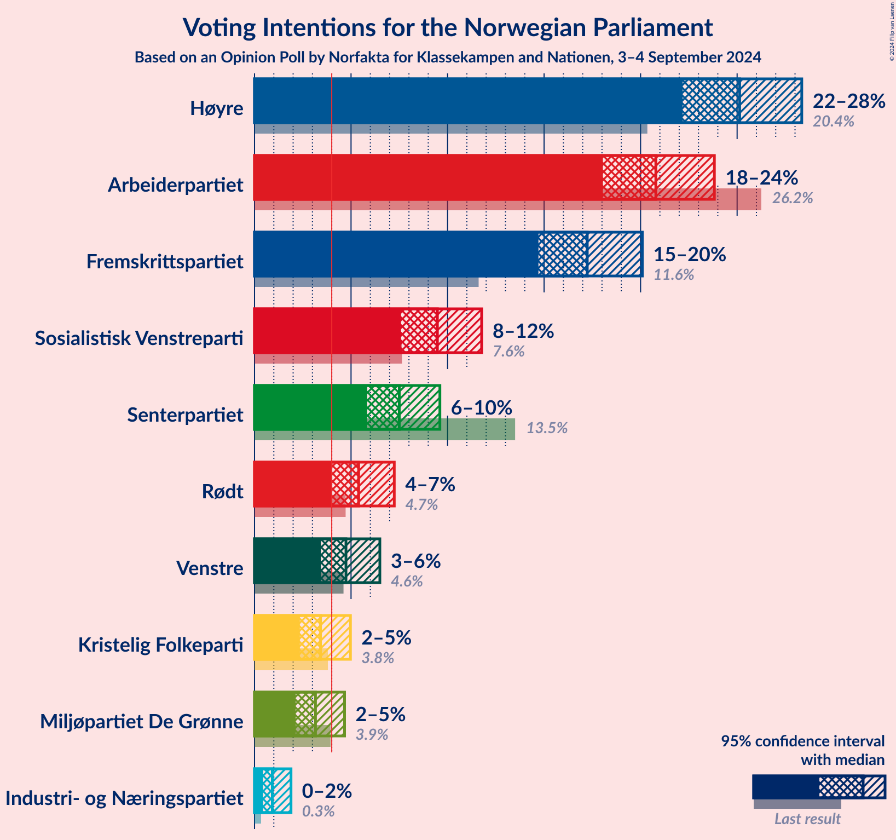

### Confidence Intervals

| Party | Last Result | Poll Result | 80% Confidence Interval | 90% Confidence Interval | 95% Confidence Interval | 99% Confidence Interval |
|:-----:|:-----------:|:-----------:|:-----------------------:|:-----------------------:|:-----------------------:|:-----------------------:|
| Høyre | 20.4% | 25.1% | 23.2–27.2% |22.6–27.8% |22.2–28.3% |21.3–29.4% |
| Arbeiderpartiet | 26.2% | 20.8% | 19.0–22.8% |18.5–23.3% |18.0–23.8% |17.2–24.8% |
| Fremskrittspartiet | 11.6% | 17.2% | 15.6–19.1% |15.1–19.6% |14.7–20.1% |13.9–21.0% |
| Sosialistisk Venstreparti | 7.6% | 9.5% | 8.2–11.0% |7.9–11.4% |7.6–11.8% |7.0–12.5% |
| Senterpartiet | 13.5% | 7.5% | 6.4–8.9% |6.1–9.3% |5.8–9.6% |5.3–10.3% |
| Rødt | 4.7% | 5.4% | 4.5–6.6% |4.2–6.9% |4.0–7.2% |3.6–7.9% |
| Venstre | 4.6% | 4.7% | 3.9–5.9% |3.6–6.2% |3.4–6.5% |3.1–7.1% |
| Kristelig Folkeparti | 3.8% | 3.4% | 2.7–4.4% |2.5–4.7% |2.3–5.0% |2.0–5.5% |
| Miljøpartiet De Grønne | 3.9% | 3.2% | 2.5–4.1% |2.3–4.4% |2.1–4.7% |1.8–5.2% |
| Industri- og Næringspartiet | 0.3% | 0.9% | 0.6–1.6% |0.5–1.7% |0.4–1.9% |0.3–2.2% |

*Note:* The poll result column reflects the actual value used in the calculations. Published results may vary slightly, and in addition be rounded to fewer digits.

## Seats

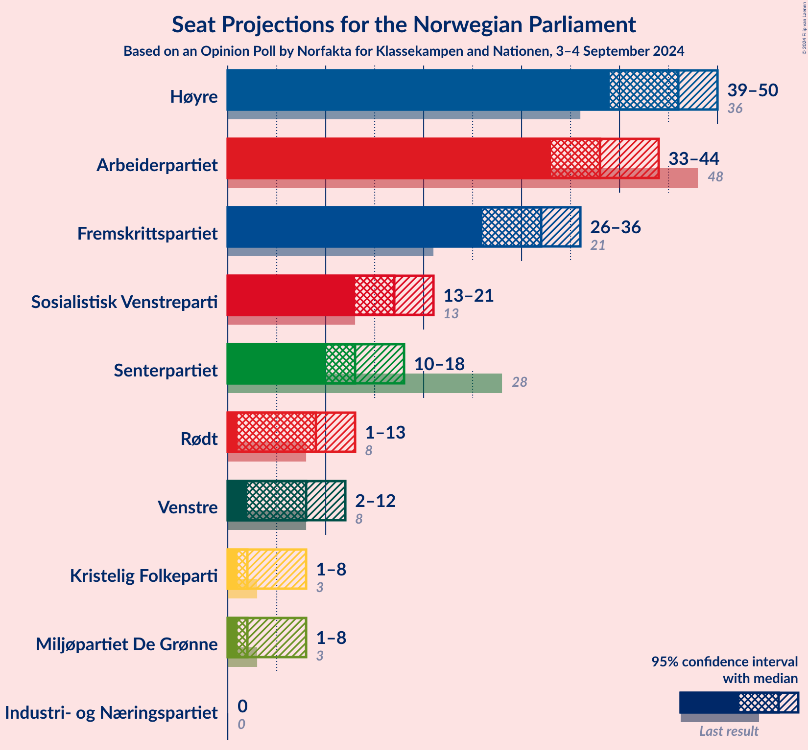

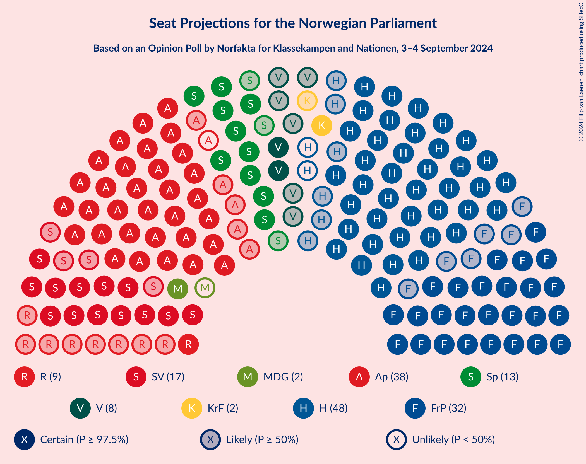

### Confidence Intervals

| Party | Last Result | Median | 80% Confidence Interval | 90% Confidence Interval | 95% Confidence Interval | 99% Confidence Interval |
|:-----:|:-----------:|:------:|:-----------------------:|:-----------------------:|:-----------------------:|:-----------------------:|
| <a href="#høyre">Høyre</a> | 36 | 46 | 41–48 |40–49 |39–50 |37–53 |
| <a href="#arbeiderpartiet">Arbeiderpartiet</a> | 48 | 38 | 35–42 |34–44 |33–44 |31–45 |
| <a href="#fremskrittspartiet">Fremskrittspartiet</a> | 21 | 32 | 28–35 |27–36 |26–36 |24–38 |
| <a href="#sosialistisk-venstreparti">Sosialistisk Venstreparti</a> | 13 | 17 | 15–19 |14–21 |13–21 |12–22 |
| <a href="#senterpartiet">Senterpartiet</a> | 28 | 13 | 11–16 |11–18 |10–18 |9–18 |
| <a href="#rødt">Rødt</a> | 8 | 9 | 8–12 |7–12 |1–13 |1–14 |
| <a href="#venstre">Venstre</a> | 8 | 8 | 3–10 |3–11 |2–12 |2–13 |
| <a href="#kristelig-folkeparti">Kristelig Folkeparti</a> | 3 | 2 | 2–7 |1–8 |1–8 |0–10 |
| <a href="#miljøpartiet-de-grønne">Miljøpartiet De Grønne</a> | 3 | 2 | 1–7 |1–8 |1–8 |1–9 |
| <a href="#industri--og-næringspartiet">Industri- og Næringspartiet</a> | 0 | 0 | 0 |0 |0 |0 |

### Høyre

*For a full overview of the results for this party, see the [Høyre](party-høyre.html) page.*

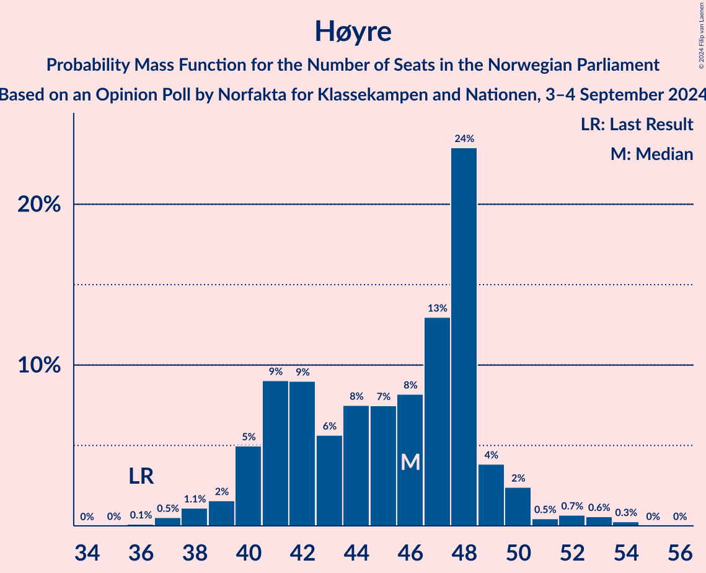

| Number of Seats | Probability | Accumulated | Special Marks |
|:---------------:|:-----------:|:-----------:|:-------------:|
| 36 | 0.1% | 100% | Last Result |
| 37 | 0.5% | 99.8% |  |
| 38 | 1.1% | 99.3% |  |
| 39 | 2% | 98% |  |
| 40 | 5% | 97% |  |
| 41 | 9% | 92% |  |
| 42 | 9% | 83% |  |
| 43 | 6% | 74% |  |
| 44 | 8% | 68% |  |
| 45 | 7% | 60% |  |
| 46 | 8% | 53% | Median |
| 47 | 13% | 45% |  |
| 48 | 24% | 32% |  |
| 49 | 4% | 8% |  |
| 50 | 2% | 4% |  |
| 51 | 0.5% | 2% |  |
| 52 | 0.7% | 2% |  |
| 53 | 0.6% | 0.9% |  |
| 54 | 0.3% | 0.3% |  |
| 55 | 0% | 0.1% |  |
| 56 | 0% | 0% |  |

### Arbeiderpartiet

*For a full overview of the results for this party, see the [Arbeiderpartiet](party-arbeiderpartiet.html) page.*

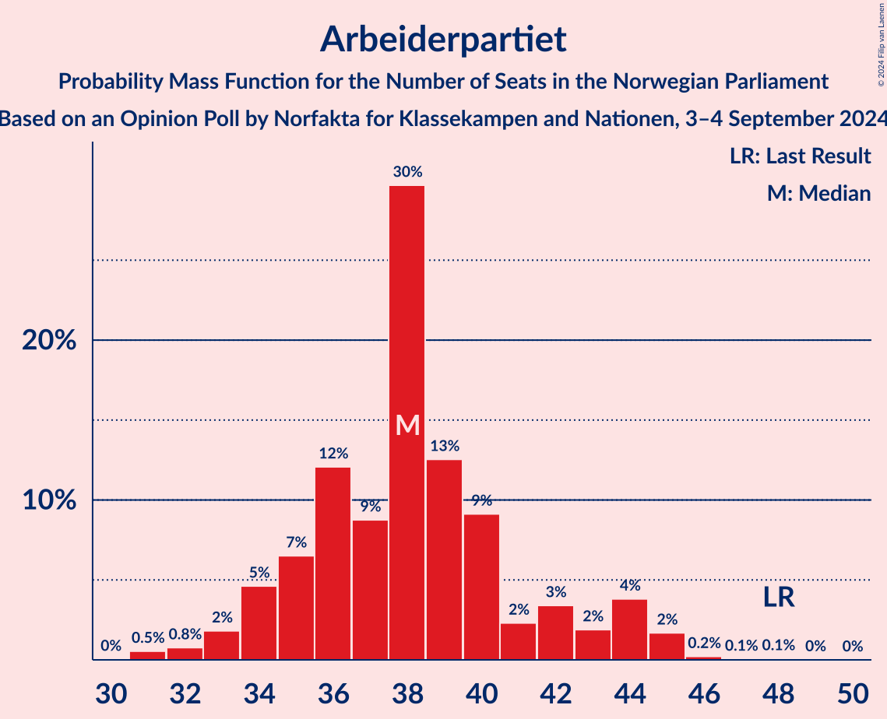

| Number of Seats | Probability | Accumulated | Special Marks |
|:---------------:|:-----------:|:-----------:|:-------------:|
| 30 | 0% | 100% |  |
| 31 | 0.5% | 99.9% |  |
| 32 | 0.8% | 99.4% |  |
| 33 | 2% | 98.6% |  |
| 34 | 5% | 97% |  |
| 35 | 7% | 92% |  |
| 36 | 12% | 86% |  |
| 37 | 9% | 74% |  |
| 38 | 30% | 65% | Median |
| 39 | 13% | 35% |  |
| 40 | 9% | 23% |  |
| 41 | 2% | 13% |  |
| 42 | 3% | 11% |  |
| 43 | 2% | 8% |  |
| 44 | 4% | 6% |  |
| 45 | 2% | 2% |  |
| 46 | 0.2% | 0.4% |  |
| 47 | 0.1% | 0.2% |  |
| 48 | 0.1% | 0.1% | Last Result |
| 49 | 0% | 0% |  |

### Fremskrittspartiet

*For a full overview of the results for this party, see the [Fremskrittspartiet](party-fremskrittspartiet.html) page.*

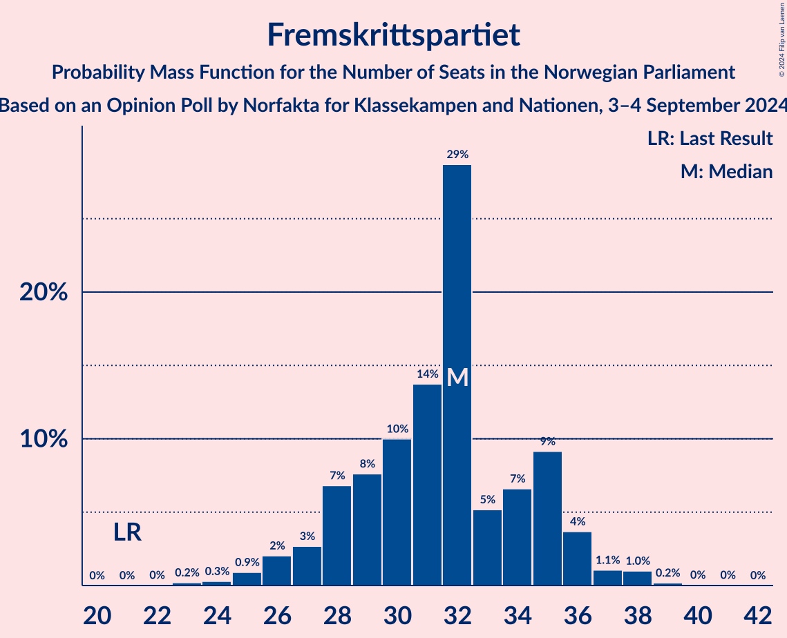

| Number of Seats | Probability | Accumulated | Special Marks |
|:---------------:|:-----------:|:-----------:|:-------------:|
| 21 | 0% | 100% | Last Result |
| 22 | 0% | 100% |  |
| 23 | 0.2% | 100% |  |
| 24 | 0.3% | 99.8% |  |
| 25 | 0.9% | 99.5% |  |
| 26 | 2% | 98.6% |  |
| 27 | 3% | 97% |  |
| 28 | 7% | 94% |  |
| 29 | 8% | 87% |  |
| 30 | 10% | 79% |  |
| 31 | 14% | 69% |  |
| 32 | 29% | 56% | Median |
| 33 | 5% | 27% |  |
| 34 | 7% | 22% |  |
| 35 | 9% | 15% |  |
| 36 | 4% | 6% |  |
| 37 | 1.1% | 2% |  |
| 38 | 1.0% | 1.3% |  |
| 39 | 0.2% | 0.3% |  |
| 40 | 0% | 0.1% |  |
| 41 | 0% | 0.1% |  |
| 42 | 0% | 0% |  |

### Sosialistisk Venstreparti

*For a full overview of the results for this party, see the [Sosialistisk Venstreparti](party-sosialistiskvenstreparti.html) page.*

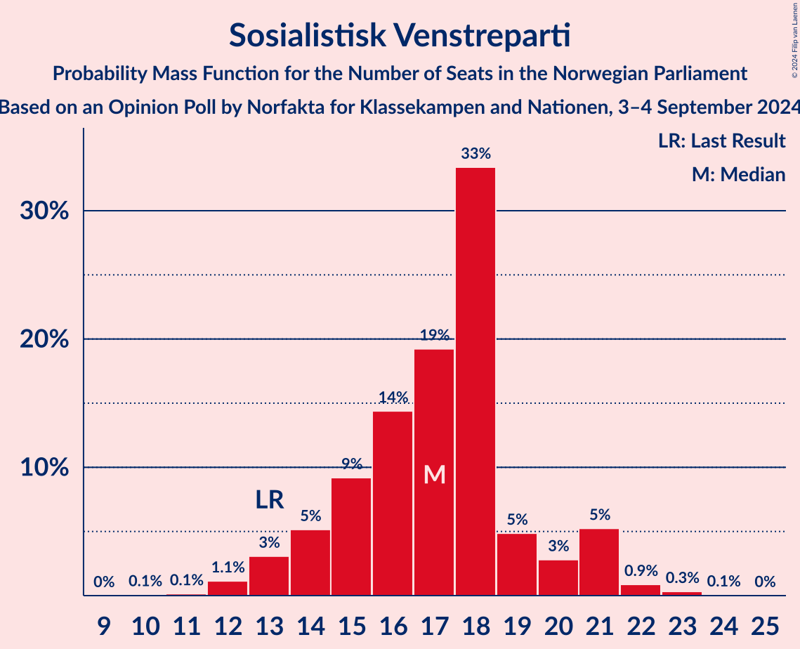

| Number of Seats | Probability | Accumulated | Special Marks |
|:---------------:|:-----------:|:-----------:|:-------------:|
| 10 | 0.1% | 100% |  |
| 11 | 0.1% | 99.9% |  |
| 12 | 1.1% | 99.8% |  |
| 13 | 3% | 98.6% | Last Result |
| 14 | 5% | 96% |  |
| 15 | 9% | 90% |  |
| 16 | 14% | 81% |  |
| 17 | 19% | 67% | Median |
| 18 | 33% | 48% |  |
| 19 | 5% | 14% |  |
| 20 | 3% | 9% |  |
| 21 | 5% | 7% |  |
| 22 | 0.9% | 1.3% |  |
| 23 | 0.3% | 0.4% |  |
| 24 | 0.1% | 0.1% |  |
| 25 | 0% | 0% |  |

### Senterpartiet

*For a full overview of the results for this party, see the [Senterpartiet](party-senterpartiet.html) page.*

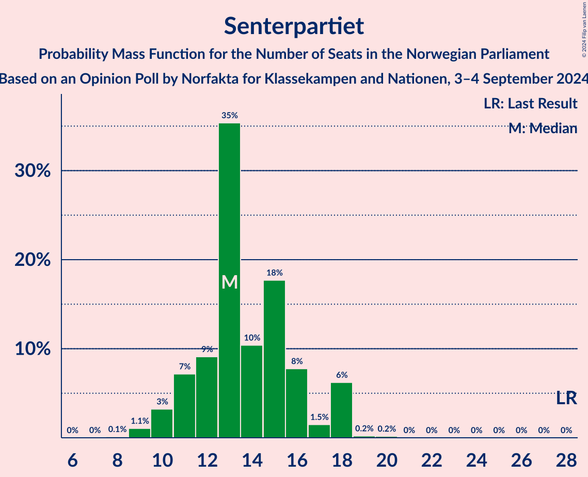

| Number of Seats | Probability | Accumulated | Special Marks |
|:---------------:|:-----------:|:-----------:|:-------------:|
| 8 | 0.1% | 100% |  |
| 9 | 1.1% | 99.9% |  |
| 10 | 3% | 98.8% |  |
| 11 | 7% | 96% |  |
| 12 | 9% | 88% |  |
| 13 | 35% | 79% | Median |
| 14 | 10% | 44% |  |
| 15 | 18% | 34% |  |
| 16 | 8% | 16% |  |
| 17 | 1.5% | 8% |  |
| 18 | 6% | 7% |  |
| 19 | 0.2% | 0.4% |  |
| 20 | 0.2% | 0.2% |  |
| 21 | 0% | 0% |  |
| 22 | 0% | 0% |  |
| 23 | 0% | 0% |  |
| 24 | 0% | 0% |  |
| 25 | 0% | 0% |  |
| 26 | 0% | 0% |  |
| 27 | 0% | 0% |  |
| 28 | 0% | 0% | Last Result |

### Rødt

*For a full overview of the results for this party, see the [Rødt](party-rødt.html) page.*

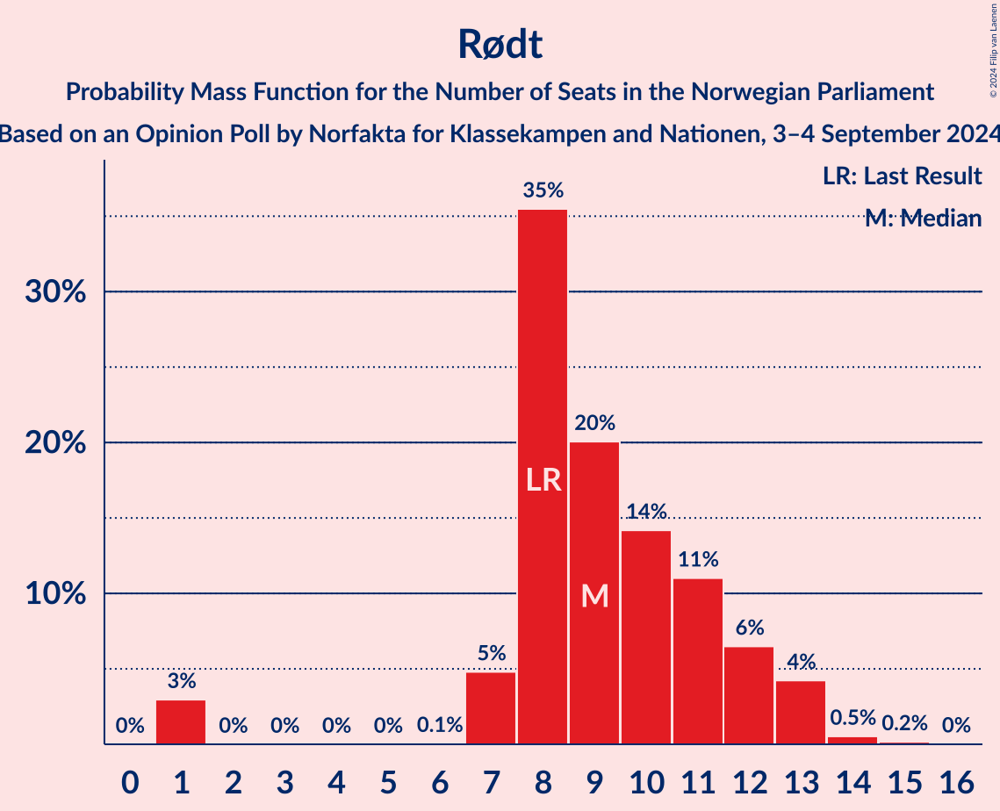

| Number of Seats | Probability | Accumulated | Special Marks |
|:---------------:|:-----------:|:-----------:|:-------------:|
| 1 | 3% | 100% |  |
| 2 | 0% | 97% |  |
| 3 | 0% | 97% |  |
| 4 | 0% | 97% |  |
| 5 | 0% | 97% |  |
| 6 | 0.1% | 97% |  |
| 7 | 5% | 97% |  |
| 8 | 35% | 92% | Last Result |
| 9 | 20% | 57% | Median |
| 10 | 14% | 37% |  |
| 11 | 11% | 22% |  |
| 12 | 6% | 11% |  |
| 13 | 4% | 5% |  |
| 14 | 0.5% | 0.7% |  |
| 15 | 0.2% | 0.2% |  |
| 16 | 0% | 0% |  |

### Venstre

*For a full overview of the results for this party, see the [Venstre](party-venstre.html) page.*

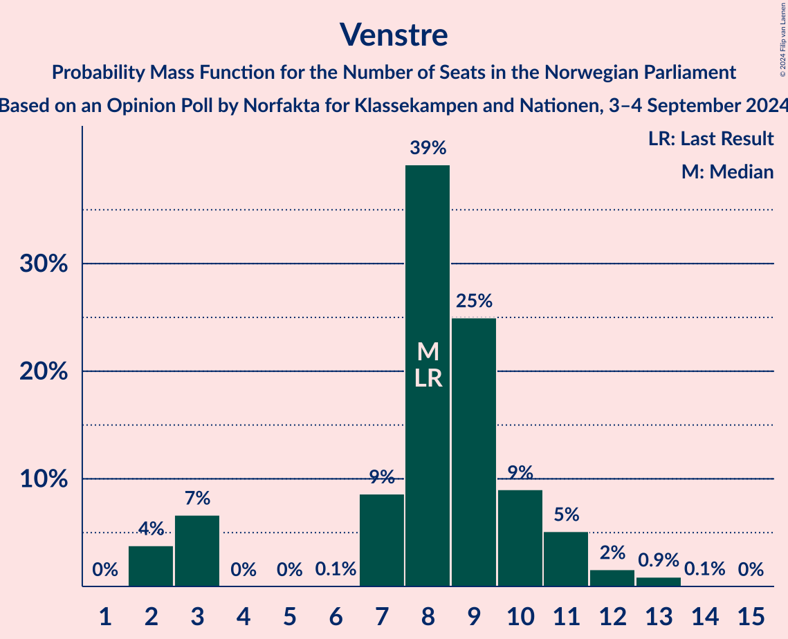

| Number of Seats | Probability | Accumulated | Special Marks |
|:---------------:|:-----------:|:-----------:|:-------------:|
| 2 | 4% | 100% |  |
| 3 | 7% | 96% |  |
| 4 | 0% | 90% |  |
| 5 | 0% | 90% |  |
| 6 | 0.1% | 90% |  |
| 7 | 9% | 89% |  |
| 8 | 39% | 81% | Last Result, Median |
| 9 | 25% | 42% |  |
| 10 | 9% | 17% |  |
| 11 | 5% | 8% |  |
| 12 | 2% | 3% |  |
| 13 | 0.9% | 1.0% |  |
| 14 | 0.1% | 0.1% |  |
| 15 | 0% | 0% |  |

### Kristelig Folkeparti

*For a full overview of the results for this party, see the [Kristelig Folkeparti](party-kristeligfolkeparti.html) page.*

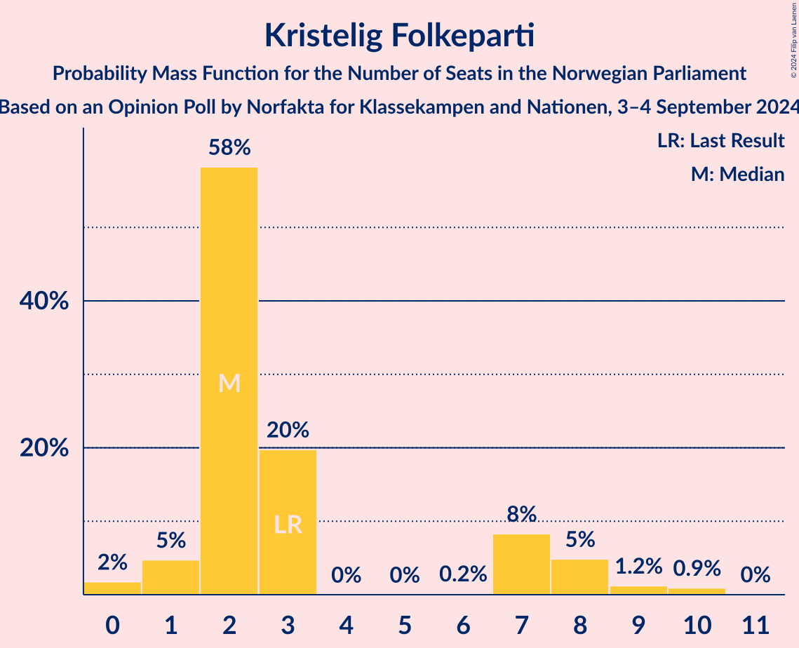

| Number of Seats | Probability | Accumulated | Special Marks |
|:---------------:|:-----------:|:-----------:|:-------------:|
| 0 | 2% | 100% |  |
| 1 | 5% | 98% |  |
| 2 | 58% | 94% | Median |
| 3 | 20% | 35% | Last Result |
| 4 | 0% | 15% |  |
| 5 | 0% | 15% |  |
| 6 | 0.2% | 15% |  |
| 7 | 8% | 15% |  |
| 8 | 5% | 7% |  |
| 9 | 1.2% | 2% |  |
| 10 | 0.9% | 1.0% |  |
| 11 | 0% | 0% |  |

### Miljøpartiet De Grønne

*For a full overview of the results for this party, see the [Miljøpartiet De Grønne](party-miljøpartietdegrønne.html) page.*

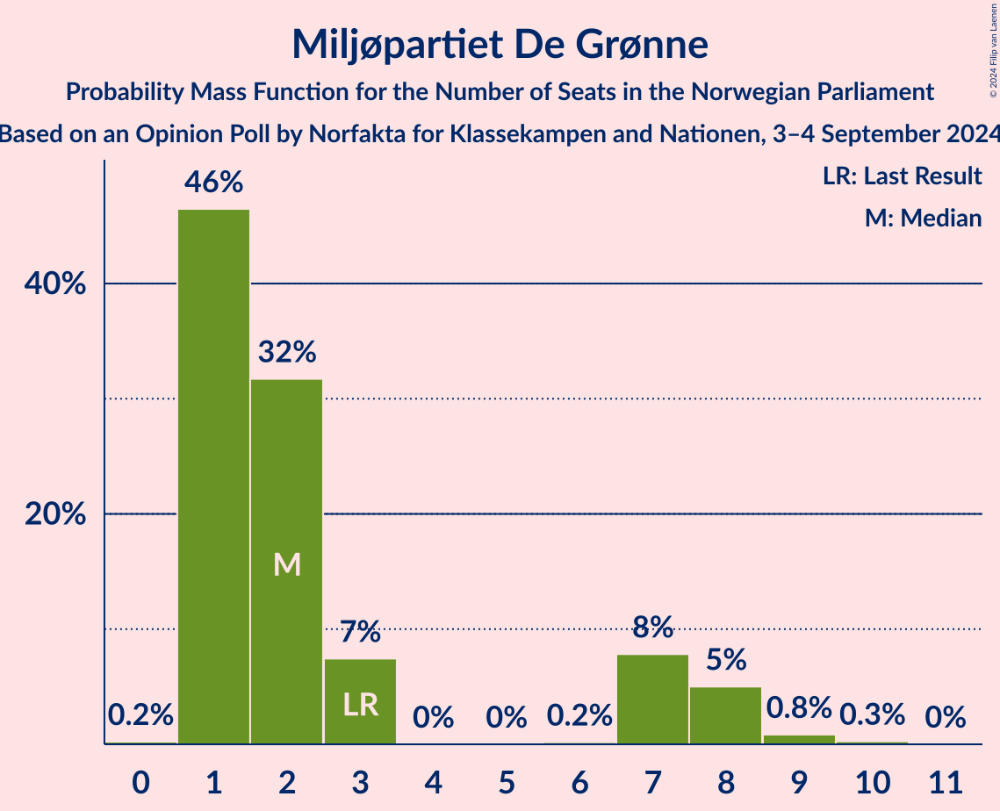

| Number of Seats | Probability | Accumulated | Special Marks |
|:---------------:|:-----------:|:-----------:|:-------------:|
| 0 | 0.2% | 100% |  |
| 1 | 46% | 99.8% |  |
| 2 | 32% | 53% | Median |
| 3 | 7% | 22% | Last Result |
| 4 | 0% | 14% |  |
| 5 | 0% | 14% |  |
| 6 | 0.2% | 14% |  |
| 7 | 8% | 14% |  |
| 8 | 5% | 6% |  |
| 9 | 0.8% | 1.1% |  |
| 10 | 0.3% | 0.3% |  |
| 11 | 0% | 0% |  |

### Industri- og Næringspartiet

*For a full overview of the results for this party, see the [Industri- og Næringspartiet](party-industri-ognæringspartiet.html) page.*

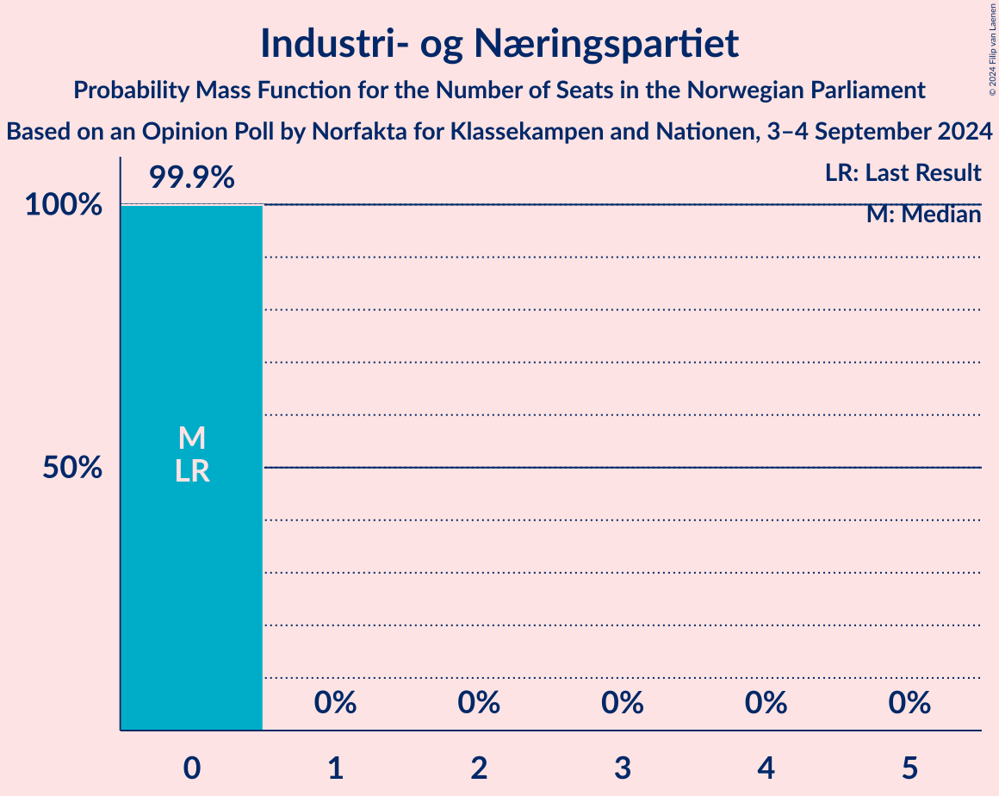

| Number of Seats | Probability | Accumulated | Special Marks |
|:---------------:|:-----------:|:-----------:|:-------------:|
| 0 | 99.9% | 100% | Last Result, Median |
| 1 | 0% | 0.1% |  |
| 2 | 0% | 0% |  |

## Coalitions

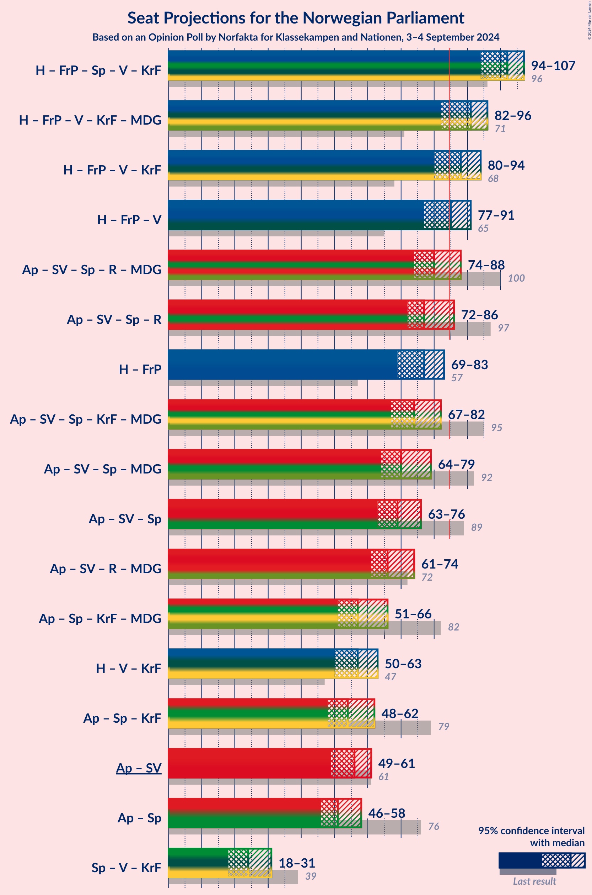

### Confidence Intervals

| Coalition | Last Result | Median | Majority? | 80% Confidence Interval | 90% Confidence Interval | 95% Confidence Interval | 99% Confidence Interval |
|:---------:|:-----------:|:------:|:---------:|:-----------------------:|:-----------------------:|:-----------------------:|:-----------------------:|
| Høyre – Fremskrittspartiet – Senterpartiet – Venstre – Kristelig Folkeparti | 96 | 102 | 100% | 97–106 | 96–106 | 94–107 | 92–111 |
| Høyre – Fremskrittspartiet – Venstre – Kristelig Folkeparti – Miljøpartiet De Grønne | 71 | 91 | 94% | 86–94 | 84–95 | 82–96 | 81–100 |
| Høyre – Fremskrittspartiet – Venstre – Kristelig Folkeparti | 68 | 88 | 82% | 83–91 | 81–93 | 80–94 | 78–97 |
| Høyre – Fremskrittspartiet – Venstre | 65 | 85 | 56% | 79–89 | 78–90 | 77–91 | 74–93 |
| Arbeiderpartiet – Sosialistisk Venstreparti – Senterpartiet – Rødt – Miljøpartiet De Grønne | 100 | 80 | 14% | 77–85 | 75–87 | 74–88 | 71–90 |
| Arbeiderpartiet – Sosialistisk Venstreparti – Senterpartiet – Rødt | 97 | 77 | 5% | 74–83 | 73–84 | 72–86 | 68–88 |
| Høyre – Fremskrittspartiet | 57 | 77 | 0.9% | 72–80 | 71–82 | 69–83 | 67–86 |
| Arbeiderpartiet – Sosialistisk Venstreparti – Senterpartiet – Kristelig Folkeparti – Miljøpartiet De Grønne | 95 | 74 | 1.1% | 70–80 | 68–81 | 67–82 | 65–86 |
| Arbeiderpartiet – Sosialistisk Venstreparti – Senterpartiet – Miljøpartiet De Grønne | 92 | 70 | 0.1% | 67–77 | 66–78 | 64–79 | 62–81 |
| Arbeiderpartiet – Sosialistisk Venstreparti – Senterpartiet | 89 | 69 | 0% | 65–73 | 64–75 | 63–76 | 60–77 |
| Arbeiderpartiet – Sosialistisk Venstreparti – Rødt – Miljøpartiet De Grønne | 72 | 66 | 0% | 63–72 | 62–73 | 61–74 | 57–77 |
| Arbeiderpartiet – Senterpartiet – Kristelig Folkeparti – Miljøpartiet De Grønne | 82 | 57 | 0% | 53–63 | 52–64 | 51–66 | 48–69 |
| Høyre – Venstre – Kristelig Folkeparti | 47 | 57 | 0% | 52–60 | 51–62 | 50–63 | 47–66 |
| Arbeiderpartiet – Senterpartiet – Kristelig Folkeparti | 79 | 54 | 0% | 52–59 | 50–61 | 48–62 | 47–64 |
| Arbeiderpartiet – Sosialistisk Venstreparti | 61 | 56 | 0% | 51–59 | 50–60 | 49–61 | 48–63 |
| Arbeiderpartiet – Senterpartiet | 76 | 51 | 0% | 49–55 | 47–57 | 46–58 | 44–60 |
| Senterpartiet – Venstre – Kristelig Folkeparti | 39 | 24 | 0% | 21–28 | 20–30 | 18–31 | 16–33 |

### Høyre – Fremskrittspartiet – Senterpartiet – Venstre – Kristelig Folkeparti

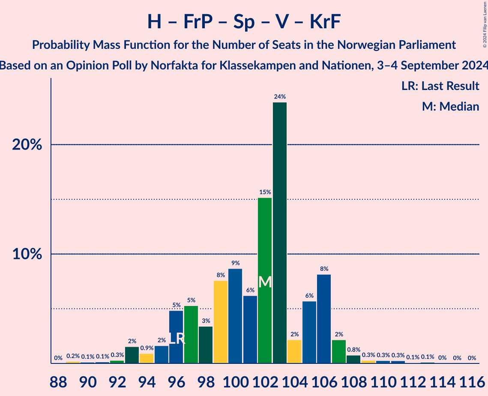

| Number of Seats | Probability | Accumulated | Special Marks |
|:---------------:|:-----------:|:-----------:|:-------------:|
| 89 | 0.2% | 100% |  |
| 90 | 0.1% | 99.8% |  |
| 91 | 0.1% | 99.7% |  |
| 92 | 0.3% | 99.5% |  |
| 93 | 2% | 99.2% |  |
| 94 | 0.9% | 98% |  |
| 95 | 2% | 97% |  |
| 96 | 5% | 95% | Last Result |
| 97 | 5% | 90% |  |
| 98 | 3% | 85% |  |
| 99 | 8% | 82% |  |
| 100 | 9% | 74% |  |
| 101 | 6% | 65% | Median |
| 102 | 15% | 59% |  |
| 103 | 24% | 44% |  |
| 104 | 2% | 20% |  |
| 105 | 6% | 18% |  |
| 106 | 8% | 12% |  |
| 107 | 2% | 4% |  |
| 108 | 0.8% | 2% |  |
| 109 | 0.3% | 1.1% |  |
| 110 | 0.3% | 0.8% |  |
| 111 | 0.3% | 0.5% |  |
| 112 | 0.1% | 0.2% |  |
| 113 | 0.1% | 0.2% |  |
| 114 | 0% | 0.1% |  |
| 115 | 0% | 0% |  |

### Høyre – Fremskrittspartiet – Venstre – Kristelig Folkeparti – Miljøpartiet De Grønne

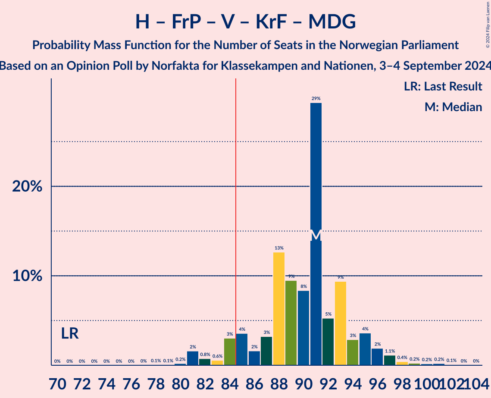

| Number of Seats | Probability | Accumulated | Special Marks |
|:---------------:|:-----------:|:-----------:|:-------------:|
| 71 | 0% | 100% | Last Result |
| 72 | 0% | 100% |  |
| 73 | 0% | 100% |  |
| 74 | 0% | 100% |  |
| 75 | 0% | 100% |  |
| 76 | 0% | 100% |  |
| 77 | 0% | 100% |  |
| 78 | 0.1% | 100% |  |
| 79 | 0.1% | 99.9% |  |
| 80 | 0.2% | 99.9% |  |
| 81 | 2% | 99.6% |  |
| 82 | 0.8% | 98% |  |
| 83 | 0.6% | 97% |  |
| 84 | 3% | 97% |  |
| 85 | 4% | 94% | Majority |
| 86 | 2% | 90% |  |
| 87 | 3% | 89% |  |
| 88 | 13% | 85% |  |
| 89 | 9% | 73% |  |
| 90 | 8% | 63% | Median |
| 91 | 29% | 55% |  |
| 92 | 5% | 25% |  |
| 93 | 9% | 20% |  |
| 94 | 3% | 11% |  |
| 95 | 4% | 8% |  |
| 96 | 2% | 4% |  |
| 97 | 1.1% | 2% |  |
| 98 | 0.4% | 1.2% |  |
| 99 | 0.2% | 0.8% |  |
| 100 | 0.2% | 0.5% |  |
| 101 | 0.2% | 0.4% |  |
| 102 | 0.1% | 0.2% |  |
| 103 | 0% | 0.1% |  |
| 104 | 0% | 0% |  |

### Høyre – Fremskrittspartiet – Venstre – Kristelig Folkeparti

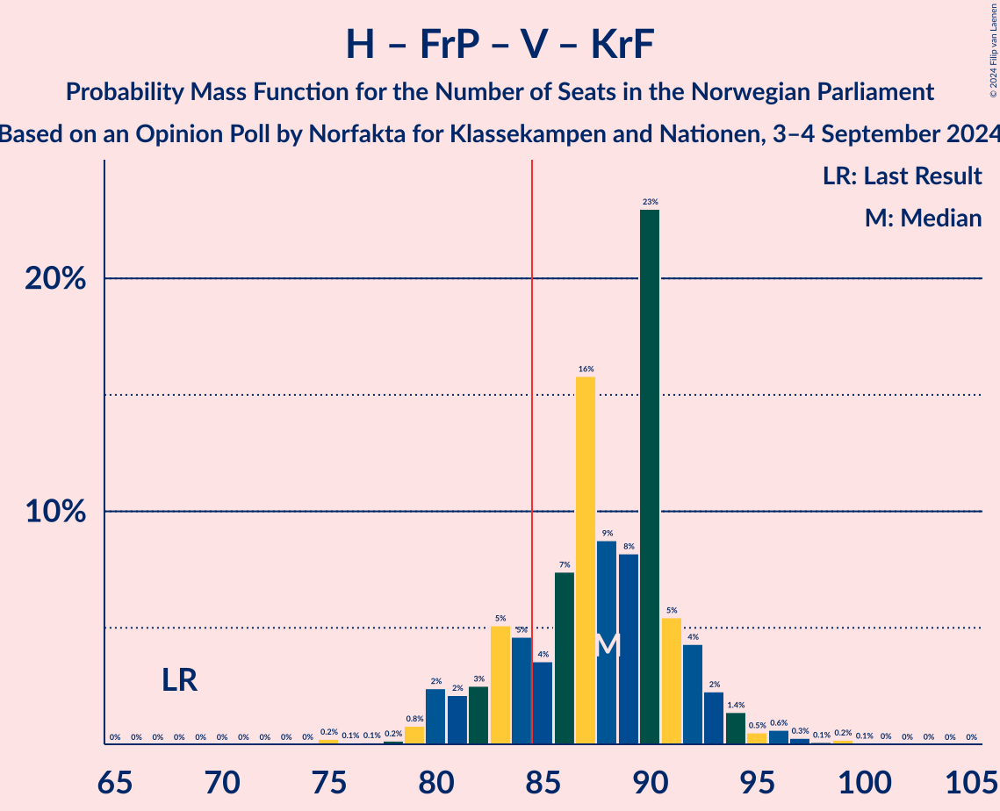

| Number of Seats | Probability | Accumulated | Special Marks |
|:---------------:|:-----------:|:-----------:|:-------------:|
| 68 | 0% | 100% | Last Result |
| 69 | 0% | 100% |  |
| 70 | 0% | 100% |  |
| 71 | 0% | 100% |  |
| 72 | 0% | 100% |  |
| 73 | 0% | 100% |  |
| 74 | 0% | 100% |  |
| 75 | 0.2% | 100% |  |
| 76 | 0.1% | 99.8% |  |
| 77 | 0.1% | 99.7% |  |
| 78 | 0.2% | 99.6% |  |
| 79 | 0.8% | 99.4% |  |
| 80 | 2% | 98.7% |  |
| 81 | 2% | 96% |  |
| 82 | 3% | 94% |  |
| 83 | 5% | 92% |  |
| 84 | 5% | 87% |  |
| 85 | 4% | 82% | Majority |
| 86 | 7% | 78% |  |
| 87 | 16% | 71% |  |
| 88 | 9% | 55% | Median |
| 89 | 8% | 46% |  |
| 90 | 23% | 38% |  |
| 91 | 5% | 15% |  |
| 92 | 4% | 10% |  |
| 93 | 2% | 5% |  |
| 94 | 1.4% | 3% |  |
| 95 | 0.5% | 2% |  |
| 96 | 0.6% | 1.3% |  |
| 97 | 0.3% | 0.7% |  |
| 98 | 0.1% | 0.4% |  |
| 99 | 0.2% | 0.3% |  |
| 100 | 0.1% | 0.1% |  |
| 101 | 0% | 0.1% |  |
| 102 | 0% | 0% |  |

### Høyre – Fremskrittspartiet – Venstre

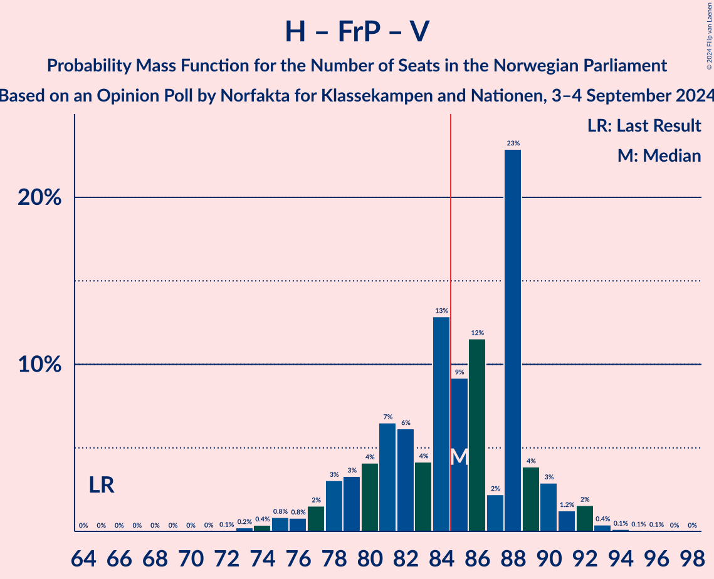

| Number of Seats | Probability | Accumulated | Special Marks |
|:---------------:|:-----------:|:-----------:|:-------------:|
| 65 | 0% | 100% | Last Result |
| 66 | 0% | 100% |  |
| 67 | 0% | 100% |  |
| 68 | 0% | 100% |  |
| 69 | 0% | 100% |  |
| 70 | 0% | 100% |  |
| 71 | 0% | 100% |  |
| 72 | 0.1% | 100% |  |
| 73 | 0.2% | 99.9% |  |
| 74 | 0.4% | 99.7% |  |
| 75 | 0.8% | 99.3% |  |
| 76 | 0.8% | 98% |  |
| 77 | 2% | 98% |  |
| 78 | 3% | 96% |  |
| 79 | 3% | 93% |  |
| 80 | 4% | 90% |  |
| 81 | 7% | 86% |  |
| 82 | 6% | 79% |  |
| 83 | 4% | 73% |  |
| 84 | 13% | 69% |  |
| 85 | 9% | 56% | Majority |
| 86 | 12% | 47% | Median |
| 87 | 2% | 35% |  |
| 88 | 23% | 33% |  |
| 89 | 4% | 10% |  |
| 90 | 3% | 6% |  |
| 91 | 1.2% | 3% |  |
| 92 | 2% | 2% |  |
| 93 | 0.4% | 0.7% |  |
| 94 | 0.1% | 0.3% |  |
| 95 | 0.1% | 0.2% |  |
| 96 | 0.1% | 0.1% |  |
| 97 | 0% | 0% |  |

### Arbeiderpartiet – Sosialistisk Venstreparti – Senterpartiet – Rødt – Miljøpartiet De Grønne

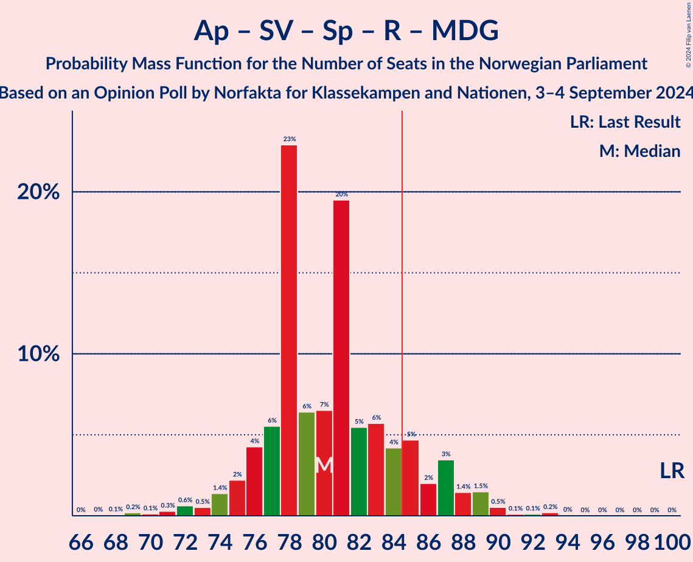

| Number of Seats | Probability | Accumulated | Special Marks |
|:---------------:|:-----------:|:-----------:|:-------------:|
| 67 | 0% | 100% |  |
| 68 | 0.1% | 99.9% |  |
| 69 | 0.2% | 99.9% |  |
| 70 | 0.1% | 99.7% |  |
| 71 | 0.3% | 99.6% |  |
| 72 | 0.6% | 99.3% |  |
| 73 | 0.5% | 98.7% |  |
| 74 | 1.4% | 98% |  |
| 75 | 2% | 97% |  |
| 76 | 4% | 95% |  |
| 77 | 6% | 90% |  |
| 78 | 23% | 85% |  |
| 79 | 6% | 62% | Median |
| 80 | 7% | 55% |  |
| 81 | 20% | 49% |  |
| 82 | 5% | 29% |  |
| 83 | 6% | 24% |  |
| 84 | 4% | 18% |  |
| 85 | 5% | 14% | Majority |
| 86 | 2% | 9% |  |
| 87 | 3% | 7% |  |
| 88 | 1.4% | 4% |  |
| 89 | 1.5% | 2% |  |
| 90 | 0.5% | 1.0% |  |
| 91 | 0.1% | 0.4% |  |
| 92 | 0.1% | 0.3% |  |
| 93 | 0.2% | 0.2% |  |
| 94 | 0% | 0% |  |
| 95 | 0% | 0% |  |
| 96 | 0% | 0% |  |
| 97 | 0% | 0% |  |
| 98 | 0% | 0% |  |
| 99 | 0% | 0% |  |
| 100 | 0% | 0% | Last Result |

### Arbeiderpartiet – Sosialistisk Venstreparti – Senterpartiet – Rødt

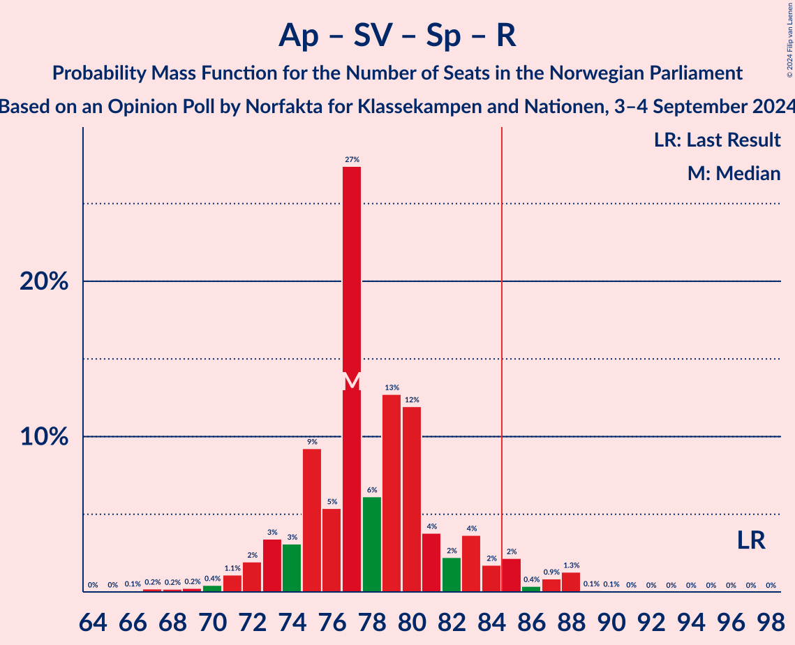

| Number of Seats | Probability | Accumulated | Special Marks |
|:---------------:|:-----------:|:-----------:|:-------------:|
| 65 | 0% | 100% |  |
| 66 | 0.1% | 99.9% |  |
| 67 | 0.2% | 99.8% |  |
| 68 | 0.2% | 99.6% |  |
| 69 | 0.2% | 99.4% |  |
| 70 | 0.4% | 99.2% |  |
| 71 | 1.1% | 98.7% |  |
| 72 | 2% | 98% |  |
| 73 | 3% | 96% |  |
| 74 | 3% | 92% |  |
| 75 | 9% | 89% |  |
| 76 | 5% | 80% |  |
| 77 | 27% | 75% | Median |
| 78 | 6% | 47% |  |
| 79 | 13% | 41% |  |
| 80 | 12% | 28% |  |
| 81 | 4% | 16% |  |
| 82 | 2% | 13% |  |
| 83 | 4% | 10% |  |
| 84 | 2% | 7% |  |
| 85 | 2% | 5% | Majority |
| 86 | 0.4% | 3% |  |
| 87 | 0.9% | 2% |  |
| 88 | 1.3% | 1.5% |  |
| 89 | 0.1% | 0.2% |  |
| 90 | 0.1% | 0.1% |  |
| 91 | 0% | 0% |  |
| 92 | 0% | 0% |  |
| 93 | 0% | 0% |  |
| 94 | 0% | 0% |  |
| 95 | 0% | 0% |  |
| 96 | 0% | 0% |  |
| 97 | 0% | 0% | Last Result |

### Høyre – Fremskrittspartiet

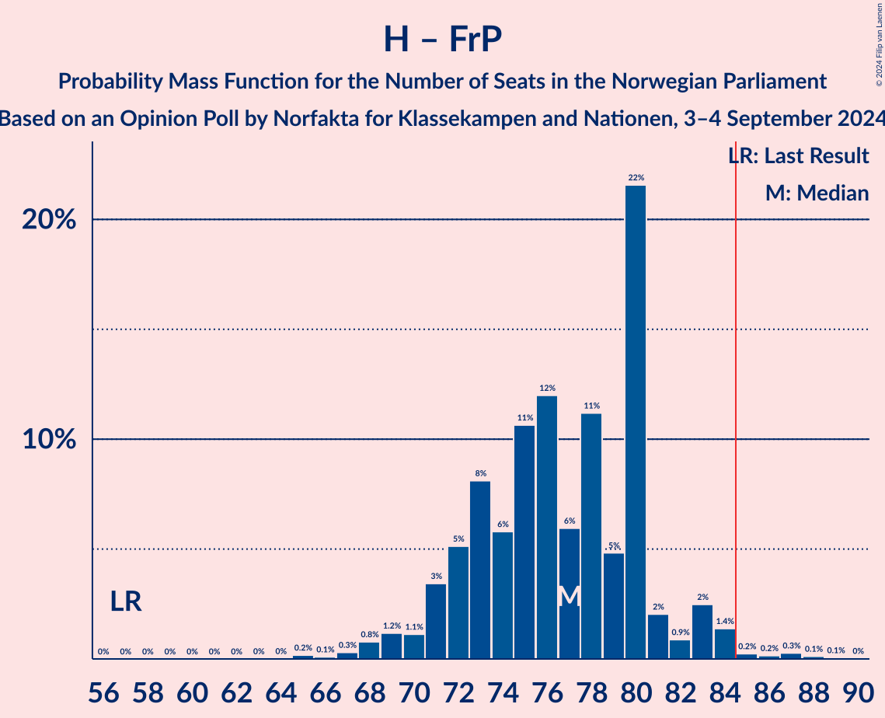

| Number of Seats | Probability | Accumulated | Special Marks |
|:---------------:|:-----------:|:-----------:|:-------------:|
| 57 | 0% | 100% | Last Result |
| 58 | 0% | 100% |  |
| 59 | 0% | 100% |  |
| 60 | 0% | 100% |  |
| 61 | 0% | 100% |  |
| 62 | 0% | 100% |  |
| 63 | 0% | 100% |  |
| 64 | 0% | 100% |  |
| 65 | 0.2% | 100% |  |
| 66 | 0.1% | 99.8% |  |
| 67 | 0.3% | 99.7% |  |
| 68 | 0.8% | 99.4% |  |
| 69 | 1.2% | 98.6% |  |
| 70 | 1.1% | 97% |  |
| 71 | 3% | 96% |  |
| 72 | 5% | 93% |  |
| 73 | 8% | 88% |  |
| 74 | 6% | 80% |  |
| 75 | 11% | 74% |  |
| 76 | 12% | 63% |  |
| 77 | 6% | 51% |  |
| 78 | 11% | 45% | Median |
| 79 | 5% | 34% |  |
| 80 | 22% | 29% |  |
| 81 | 2% | 8% |  |
| 82 | 0.9% | 6% |  |
| 83 | 2% | 5% |  |
| 84 | 1.4% | 2% |  |
| 85 | 0.2% | 0.9% | Majority |
| 86 | 0.2% | 0.6% |  |
| 87 | 0.3% | 0.5% |  |
| 88 | 0.1% | 0.2% |  |
| 89 | 0.1% | 0.1% |  |
| 90 | 0% | 0% |  |

### Arbeiderpartiet – Sosialistisk Venstreparti – Senterpartiet – Kristelig Folkeparti – Miljøpartiet De Grønne

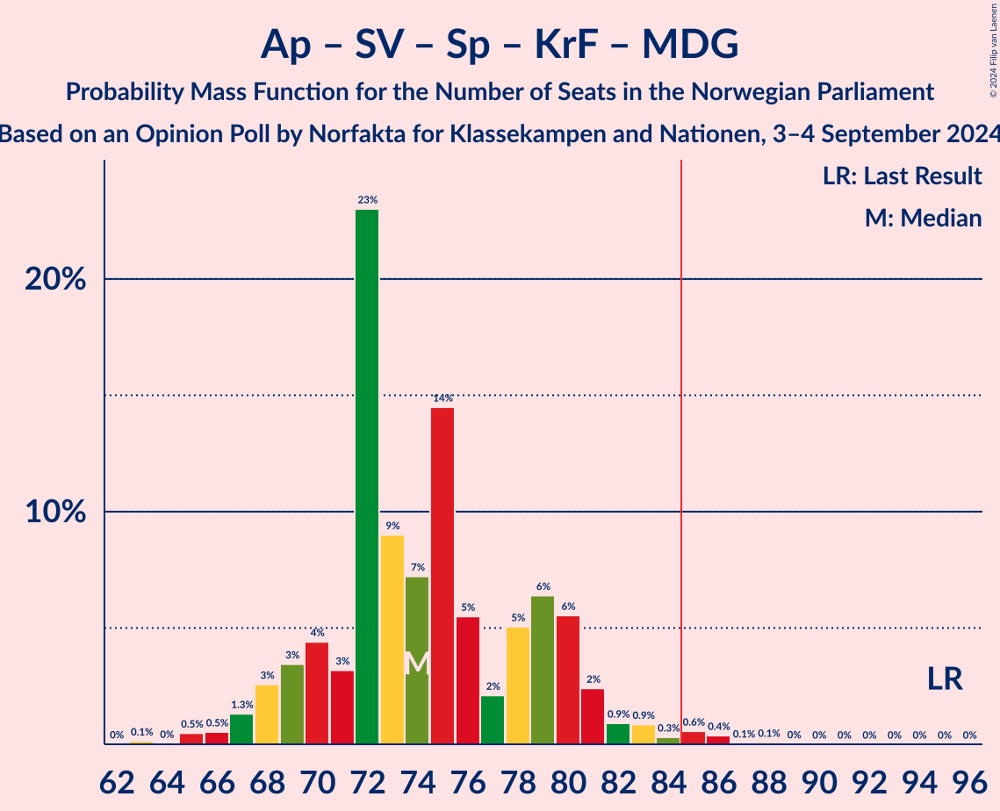

| Number of Seats | Probability | Accumulated | Special Marks |
|:---------------:|:-----------:|:-----------:|:-------------:|
| 63 | 0.1% | 100% |  |
| 64 | 0% | 99.8% |  |
| 65 | 0.5% | 99.8% |  |
| 66 | 0.5% | 99.3% |  |
| 67 | 1.3% | 98.8% |  |
| 68 | 3% | 97% |  |
| 69 | 3% | 95% |  |
| 70 | 4% | 91% |  |
| 71 | 3% | 87% |  |
| 72 | 23% | 84% | Median |
| 73 | 9% | 61% |  |
| 74 | 7% | 52% |  |
| 75 | 14% | 45% |  |
| 76 | 5% | 30% |  |
| 77 | 2% | 25% |  |
| 78 | 5% | 23% |  |
| 79 | 6% | 17% |  |
| 80 | 6% | 11% |  |
| 81 | 2% | 6% |  |
| 82 | 0.9% | 3% |  |
| 83 | 0.9% | 2% |  |
| 84 | 0.3% | 1.4% |  |
| 85 | 0.6% | 1.1% | Majority |
| 86 | 0.4% | 0.5% |  |
| 87 | 0.1% | 0.2% |  |
| 88 | 0.1% | 0.1% |  |
| 89 | 0% | 0% |  |
| 90 | 0% | 0% |  |
| 91 | 0% | 0% |  |
| 92 | 0% | 0% |  |
| 93 | 0% | 0% |  |
| 94 | 0% | 0% |  |
| 95 | 0% | 0% | Last Result |

### Arbeiderpartiet – Sosialistisk Venstreparti – Senterpartiet – Miljøpartiet De Grønne

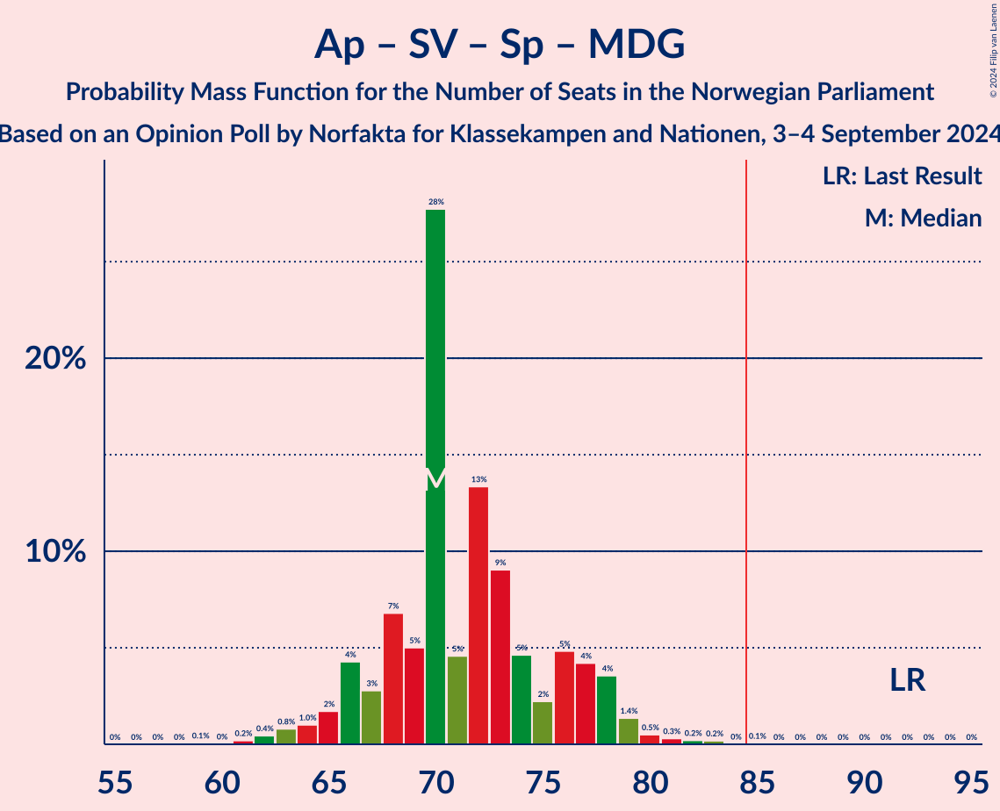

| Number of Seats | Probability | Accumulated | Special Marks |
|:---------------:|:-----------:|:-----------:|:-------------:|
| 59 | 0.1% | 100% |  |
| 60 | 0% | 99.9% |  |
| 61 | 0.2% | 99.9% |  |
| 62 | 0.4% | 99.7% |  |
| 63 | 0.8% | 99.2% |  |
| 64 | 1.0% | 98% |  |
| 65 | 2% | 97% |  |
| 66 | 4% | 96% |  |
| 67 | 3% | 91% |  |
| 68 | 7% | 89% |  |
| 69 | 5% | 82% |  |
| 70 | 28% | 77% | Median |
| 71 | 5% | 49% |  |
| 72 | 13% | 45% |  |
| 73 | 9% | 31% |  |
| 74 | 5% | 22% |  |
| 75 | 2% | 17% |  |
| 76 | 5% | 15% |  |
| 77 | 4% | 10% |  |
| 78 | 4% | 6% |  |
| 79 | 1.4% | 3% |  |
| 80 | 0.5% | 1.3% |  |
| 81 | 0.3% | 0.8% |  |
| 82 | 0.2% | 0.5% |  |
| 83 | 0.2% | 0.3% |  |
| 84 | 0% | 0.1% |  |
| 85 | 0.1% | 0.1% | Majority |
| 86 | 0% | 0% |  |
| 87 | 0% | 0% |  |
| 88 | 0% | 0% |  |
| 89 | 0% | 0% |  |
| 90 | 0% | 0% |  |
| 91 | 0% | 0% |  |
| 92 | 0% | 0% | Last Result |

### Arbeiderpartiet – Sosialistisk Venstreparti – Senterpartiet

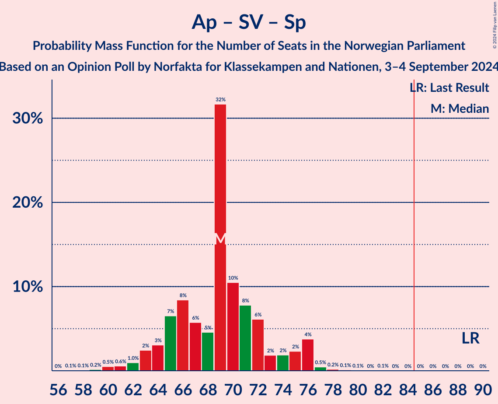

| Number of Seats | Probability | Accumulated | Special Marks |
|:---------------:|:-----------:|:-----------:|:-------------:|
| 57 | 0.1% | 100% |  |
| 58 | 0.1% | 99.9% |  |
| 59 | 0.2% | 99.8% |  |
| 60 | 0.5% | 99.7% |  |
| 61 | 0.6% | 99.1% |  |
| 62 | 1.0% | 98.6% |  |
| 63 | 2% | 98% |  |
| 64 | 3% | 95% |  |
| 65 | 7% | 92% |  |
| 66 | 8% | 86% |  |
| 67 | 6% | 77% |  |
| 68 | 5% | 71% | Median |
| 69 | 32% | 67% |  |
| 70 | 10% | 35% |  |
| 71 | 8% | 25% |  |
| 72 | 6% | 17% |  |
| 73 | 2% | 11% |  |
| 74 | 2% | 9% |  |
| 75 | 2% | 7% |  |
| 76 | 4% | 5% |  |
| 77 | 0.5% | 0.9% |  |
| 78 | 0.2% | 0.4% |  |
| 79 | 0.1% | 0.2% |  |
| 80 | 0.1% | 0.1% |  |
| 81 | 0% | 0.1% |  |
| 82 | 0.1% | 0.1% |  |
| 83 | 0% | 0% |  |
| 84 | 0% | 0% |  |
| 85 | 0% | 0% | Majority |
| 86 | 0% | 0% |  |
| 87 | 0% | 0% |  |
| 88 | 0% | 0% |  |
| 89 | 0% | 0% | Last Result |

### Arbeiderpartiet – Sosialistisk Venstreparti – Rødt – Miljøpartiet De Grønne

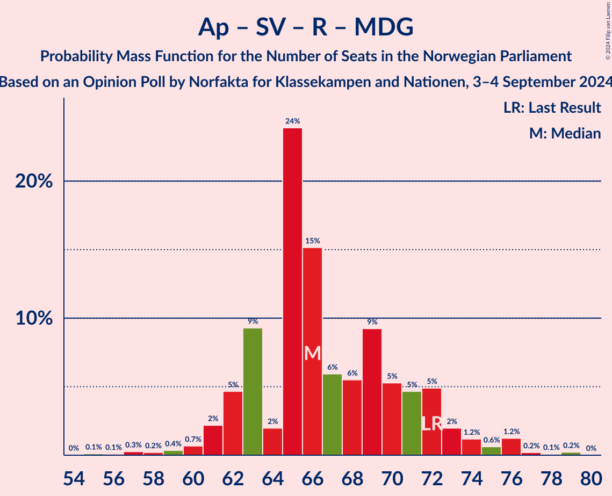

| Number of Seats | Probability | Accumulated | Special Marks |
|:---------------:|:-----------:|:-----------:|:-------------:|
| 54 | 0% | 100% |  |
| 55 | 0.1% | 99.9% |  |
| 56 | 0.1% | 99.8% |  |
| 57 | 0.3% | 99.8% |  |
| 58 | 0.2% | 99.5% |  |
| 59 | 0.4% | 99.3% |  |
| 60 | 0.7% | 98.9% |  |
| 61 | 2% | 98% |  |
| 62 | 5% | 96% |  |
| 63 | 9% | 91% |  |
| 64 | 2% | 82% |  |
| 65 | 24% | 80% |  |
| 66 | 15% | 56% | Median |
| 67 | 6% | 41% |  |
| 68 | 6% | 35% |  |
| 69 | 9% | 30% |  |
| 70 | 5% | 20% |  |
| 71 | 5% | 15% |  |
| 72 | 5% | 10% | Last Result |
| 73 | 2% | 6% |  |
| 74 | 1.2% | 4% |  |
| 75 | 0.6% | 2% |  |
| 76 | 1.2% | 2% |  |
| 77 | 0.2% | 0.5% |  |
| 78 | 0.1% | 0.3% |  |
| 79 | 0.2% | 0.3% |  |
| 80 | 0% | 0% |  |

### Arbeiderpartiet – Senterpartiet – Kristelig Folkeparti – Miljøpartiet De Grønne

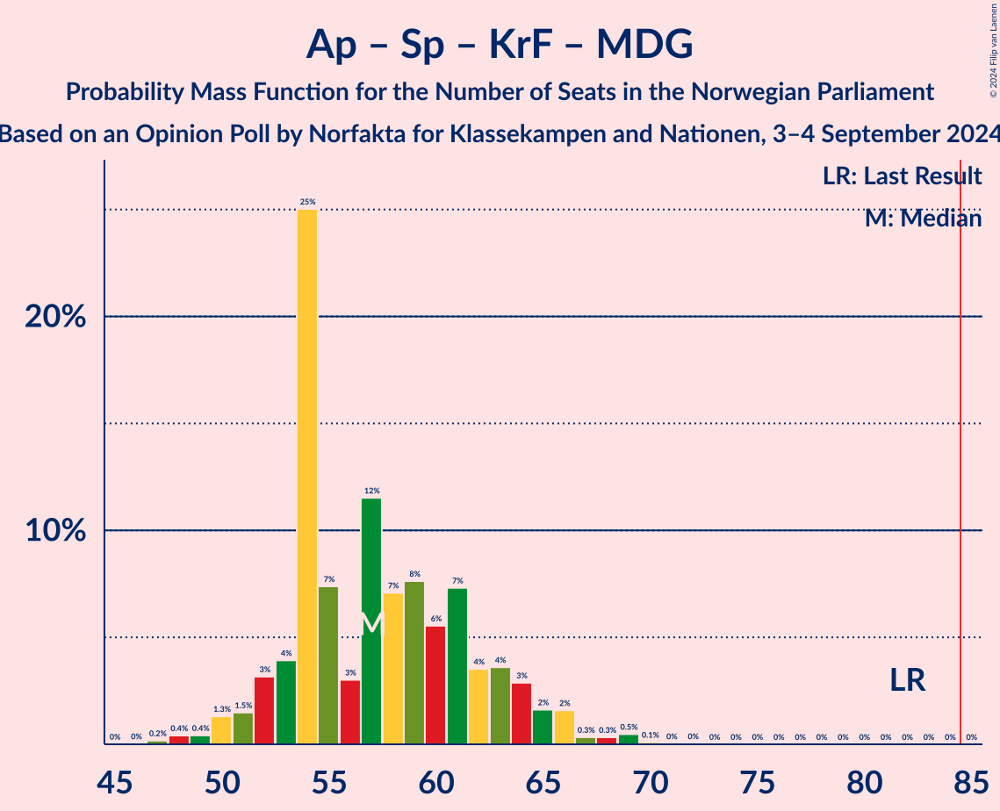

| Number of Seats | Probability | Accumulated | Special Marks |
|:---------------:|:-----------:|:-----------:|:-------------:|
| 47 | 0.2% | 100% |  |
| 48 | 0.4% | 99.8% |  |
| 49 | 0.4% | 99.4% |  |
| 50 | 1.3% | 98.9% |  |
| 51 | 1.5% | 98% |  |
| 52 | 3% | 96% |  |
| 53 | 4% | 93% |  |
| 54 | 25% | 89% |  |
| 55 | 7% | 64% | Median |
| 56 | 3% | 57% |  |
| 57 | 12% | 54% |  |
| 58 | 7% | 42% |  |
| 59 | 8% | 35% |  |
| 60 | 6% | 27% |  |
| 61 | 7% | 22% |  |
| 62 | 4% | 15% |  |
| 63 | 4% | 11% |  |
| 64 | 3% | 7% |  |
| 65 | 2% | 5% |  |
| 66 | 2% | 3% |  |
| 67 | 0.3% | 1.3% |  |
| 68 | 0.3% | 1.0% |  |
| 69 | 0.5% | 0.7% |  |
| 70 | 0.1% | 0.2% |  |
| 71 | 0% | 0.1% |  |
| 72 | 0% | 0% |  |
| 73 | 0% | 0% |  |
| 74 | 0% | 0% |  |
| 75 | 0% | 0% |  |
| 76 | 0% | 0% |  |
| 77 | 0% | 0% |  |
| 78 | 0% | 0% |  |
| 79 | 0% | 0% |  |
| 80 | 0% | 0% |  |
| 81 | 0% | 0% |  |
| 82 | 0% | 0% | Last Result |

### Høyre – Venstre – Kristelig Folkeparti

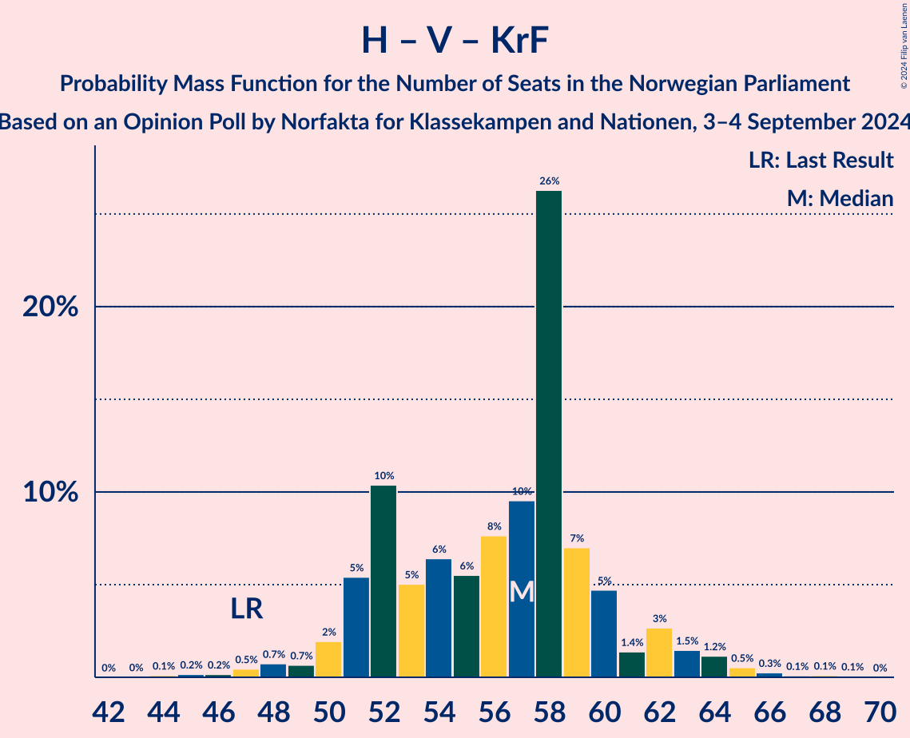

| Number of Seats | Probability | Accumulated | Special Marks |
|:---------------:|:-----------:|:-----------:|:-------------:|
| 44 | 0.1% | 100% |  |
| 45 | 0.2% | 99.9% |  |
| 46 | 0.2% | 99.7% |  |
| 47 | 0.5% | 99.5% | Last Result |
| 48 | 0.7% | 99.1% |  |
| 49 | 0.7% | 98% |  |
| 50 | 2% | 98% |  |
| 51 | 5% | 96% |  |
| 52 | 10% | 90% |  |
| 53 | 5% | 80% |  |
| 54 | 6% | 75% |  |
| 55 | 6% | 68% |  |
| 56 | 8% | 63% | Median |
| 57 | 10% | 55% |  |
| 58 | 26% | 46% |  |
| 59 | 7% | 19% |  |
| 60 | 5% | 12% |  |
| 61 | 1.4% | 8% |  |
| 62 | 3% | 6% |  |
| 63 | 1.5% | 4% |  |
| 64 | 1.2% | 2% |  |
| 65 | 0.5% | 1.1% |  |
| 66 | 0.3% | 0.5% |  |
| 67 | 0.1% | 0.3% |  |
| 68 | 0.1% | 0.2% |  |
| 69 | 0.1% | 0.1% |  |
| 70 | 0% | 0% |  |

### Arbeiderpartiet – Senterpartiet – Kristelig Folkeparti

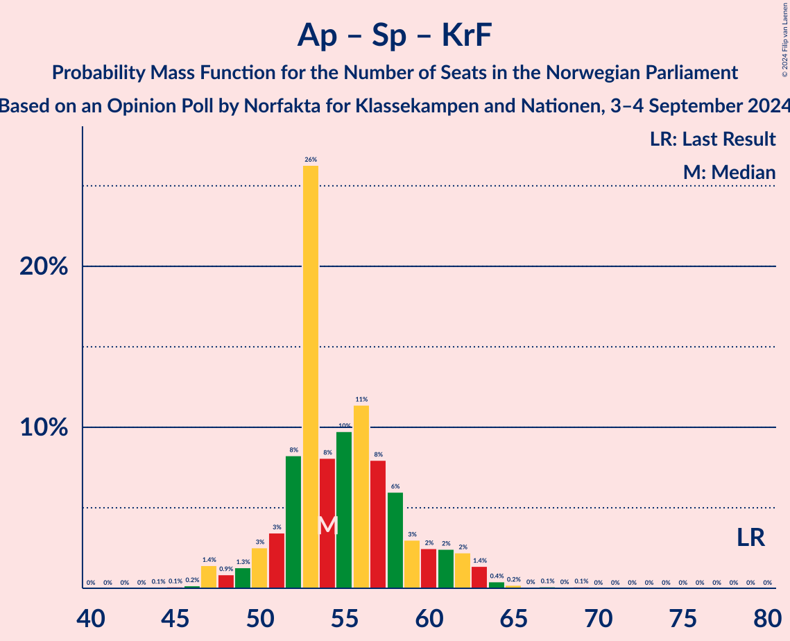

| Number of Seats | Probability | Accumulated | Special Marks |
|:---------------:|:-----------:|:-----------:|:-------------:|
| 44 | 0.1% | 100% |  |
| 45 | 0.1% | 99.9% |  |
| 46 | 0.2% | 99.8% |  |
| 47 | 1.4% | 99.7% |  |
| 48 | 0.9% | 98% |  |
| 49 | 1.3% | 97% |  |
| 50 | 3% | 96% |  |
| 51 | 3% | 94% |  |
| 52 | 8% | 90% |  |
| 53 | 26% | 82% | Median |
| 54 | 8% | 56% |  |
| 55 | 10% | 47% |  |
| 56 | 11% | 38% |  |
| 57 | 8% | 26% |  |
| 58 | 6% | 18% |  |
| 59 | 3% | 12% |  |
| 60 | 2% | 9% |  |
| 61 | 2% | 7% |  |
| 62 | 2% | 4% |  |
| 63 | 1.4% | 2% |  |
| 64 | 0.4% | 0.9% |  |
| 65 | 0.2% | 0.5% |  |
| 66 | 0% | 0.3% |  |
| 67 | 0.1% | 0.2% |  |
| 68 | 0% | 0.1% |  |
| 69 | 0.1% | 0.1% |  |
| 70 | 0% | 0% |  |
| 71 | 0% | 0% |  |
| 72 | 0% | 0% |  |
| 73 | 0% | 0% |  |
| 74 | 0% | 0% |  |
| 75 | 0% | 0% |  |
| 76 | 0% | 0% |  |
| 77 | 0% | 0% |  |
| 78 | 0% | 0% |  |
| 79 | 0% | 0% | Last Result |

### Arbeiderpartiet – Sosialistisk Venstreparti

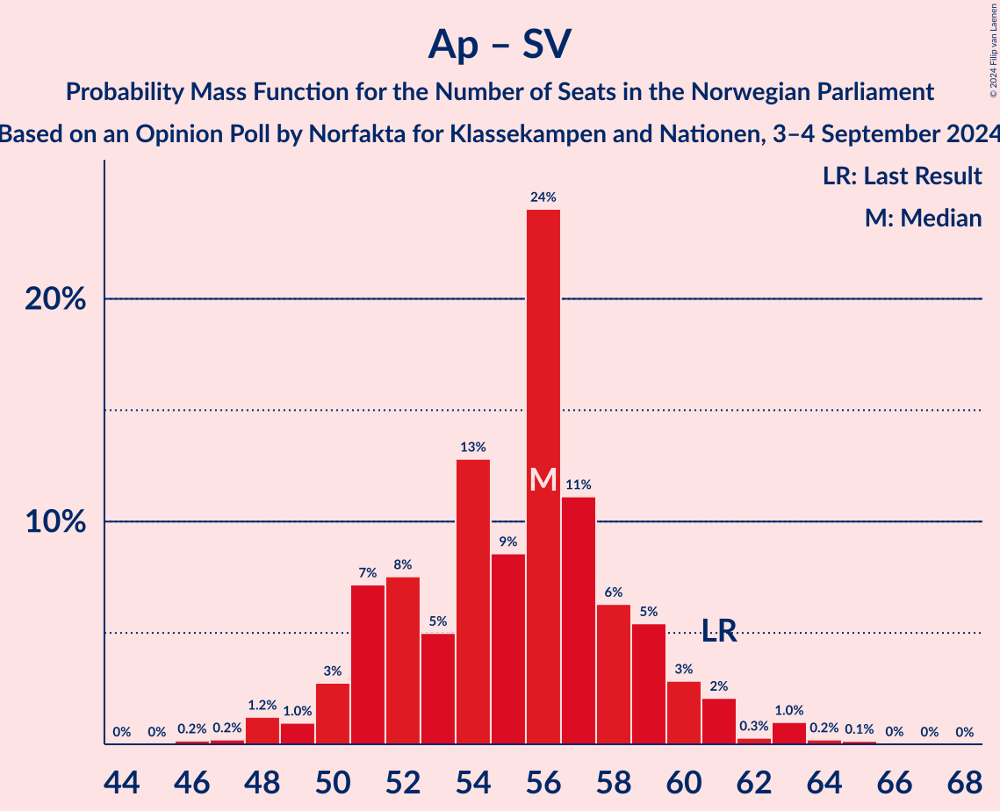

| Number of Seats | Probability | Accumulated | Special Marks |
|:---------------:|:-----------:|:-----------:|:-------------:|
| 45 | 0% | 100% |  |
| 46 | 0.2% | 99.9% |  |
| 47 | 0.2% | 99.8% |  |
| 48 | 1.2% | 99.6% |  |
| 49 | 1.0% | 98% |  |
| 50 | 3% | 97% |  |
| 51 | 7% | 95% |  |
| 52 | 8% | 87% |  |
| 53 | 5% | 80% |  |
| 54 | 13% | 75% |  |
| 55 | 9% | 62% | Median |
| 56 | 24% | 54% |  |
| 57 | 11% | 29% |  |
| 58 | 6% | 18% |  |
| 59 | 5% | 12% |  |
| 60 | 3% | 7% |  |
| 61 | 2% | 4% | Last Result |
| 62 | 0.3% | 2% |  |
| 63 | 1.0% | 1.4% |  |
| 64 | 0.2% | 0.4% |  |
| 65 | 0.1% | 0.2% |  |
| 66 | 0% | 0.1% |  |
| 67 | 0% | 0% |  |

### Arbeiderpartiet – Senterpartiet

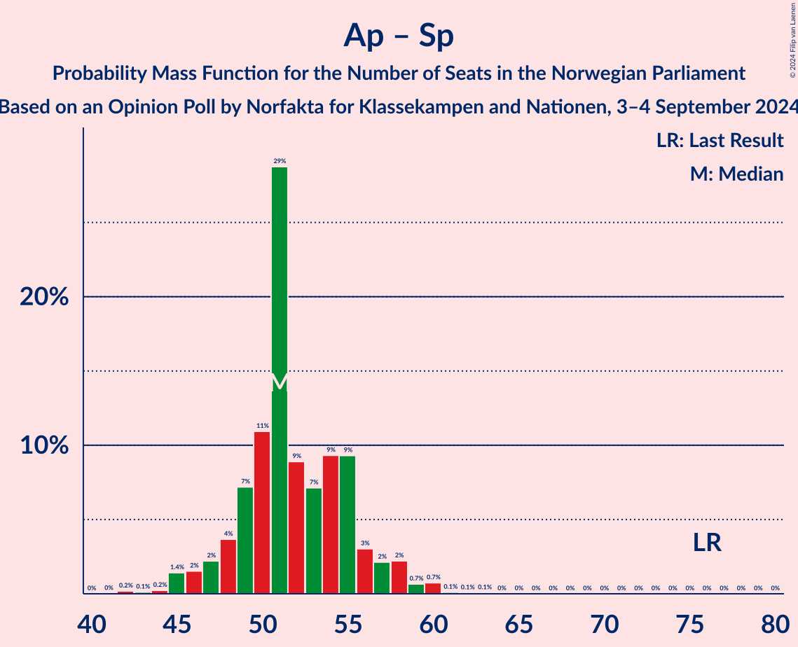

| Number of Seats | Probability | Accumulated | Special Marks |
|:---------------:|:-----------:|:-----------:|:-------------:|
| 42 | 0.2% | 100% |  |
| 43 | 0.1% | 99.8% |  |
| 44 | 0.2% | 99.7% |  |
| 45 | 1.4% | 99.4% |  |
| 46 | 2% | 98% |  |
| 47 | 2% | 96% |  |
| 48 | 4% | 94% |  |
| 49 | 7% | 91% |  |
| 50 | 11% | 83% |  |
| 51 | 29% | 72% | Median |
| 52 | 9% | 44% |  |
| 53 | 7% | 35% |  |
| 54 | 9% | 28% |  |
| 55 | 9% | 18% |  |
| 56 | 3% | 9% |  |
| 57 | 2% | 6% |  |
| 58 | 2% | 4% |  |
| 59 | 0.7% | 2% |  |
| 60 | 0.7% | 1.0% |  |
| 61 | 0.1% | 0.3% |  |
| 62 | 0.1% | 0.2% |  |
| 63 | 0.1% | 0.1% |  |
| 64 | 0% | 0% |  |
| 65 | 0% | 0% |  |
| 66 | 0% | 0% |  |
| 67 | 0% | 0% |  |
| 68 | 0% | 0% |  |
| 69 | 0% | 0% |  |
| 70 | 0% | 0% |  |
| 71 | 0% | 0% |  |
| 72 | 0% | 0% |  |
| 73 | 0% | 0% |  |
| 74 | 0% | 0% |  |
| 75 | 0% | 0% |  |
| 76 | 0% | 0% | Last Result |

### Senterpartiet – Venstre – Kristelig Folkeparti

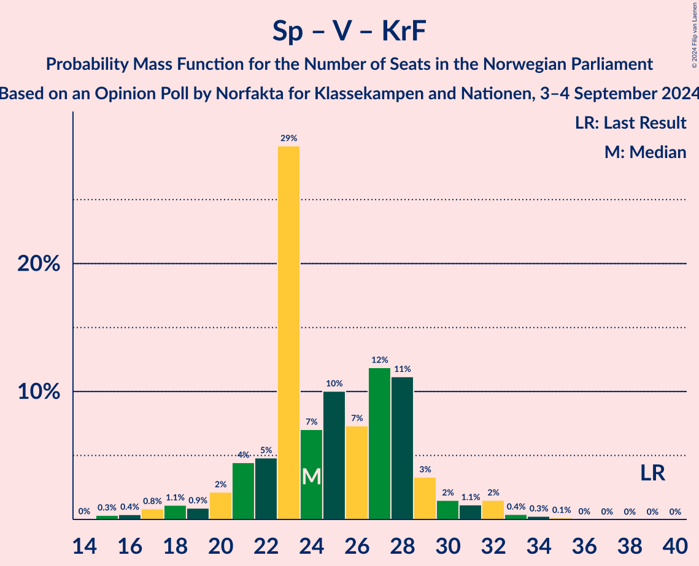

| Number of Seats | Probability | Accumulated | Special Marks |
|:---------------:|:-----------:|:-----------:|:-------------:|
| 14 | 0% | 100% |  |
| 15 | 0.3% | 99.9% |  |
| 16 | 0.4% | 99.6% |  |
| 17 | 0.8% | 99.2% |  |
| 18 | 1.1% | 98% |  |
| 19 | 0.9% | 97% |  |
| 20 | 2% | 96% |  |
| 21 | 4% | 94% |  |
| 22 | 5% | 90% |  |
| 23 | 29% | 85% | Median |
| 24 | 7% | 56% |  |
| 25 | 10% | 49% |  |
| 26 | 7% | 39% |  |
| 27 | 12% | 31% |  |
| 28 | 11% | 19% |  |
| 29 | 3% | 8% |  |
| 30 | 2% | 5% |  |
| 31 | 1.1% | 4% |  |
| 32 | 2% | 2% |  |
| 33 | 0.4% | 0.9% |  |
| 34 | 0.3% | 0.4% |  |
| 35 | 0.1% | 0.2% |  |
| 36 | 0% | 0% |  |
| 37 | 0% | 0% |  |
| 38 | 0% | 0% |  |
| 39 | 0% | 0% | Last Result |

## Technical Information

### Opinion Poll

+ **Polling firm:** Norfakta
+ **Commissioner(s):** Klassekampen and Nationen
+ **Fieldwork period:** 3–4 September 2024

### Calculations

+ **Sample size:** 760
+ **Simulations done:** 1,048,576
+ **Error estimate:** 2.06%

