# Opinion Poll by Opinion Perduco for Dagsavisen, Fagbladet and FriFagbevegelse, 3–9 September 2024

<a href="#voting-intentions">Voting Intentions</a> | <a href="#seats">Seats</a> | <a href="#coalitions">Coalitions</a> | <a href="#technical-information">Technical Information</a>

## Voting Intentions

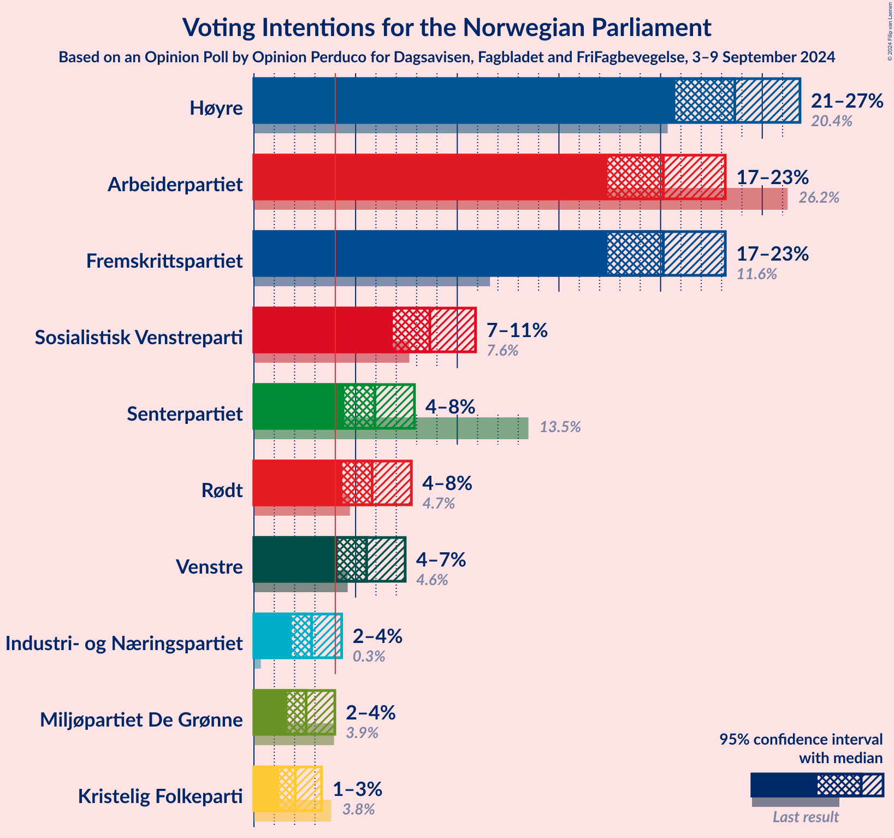

### Confidence Intervals

| Party | Last Result | Poll Result | 80% Confidence Interval | 90% Confidence Interval | 95% Confidence Interval | 99% Confidence Interval |
|:-----:|:-----------:|:-----------:|:-----------------------:|:-----------------------:|:-----------------------:|:-----------------------:|
| Høyre | 20.4% | 23.6% | 21.7–25.7% |21.2–26.3% |20.7–26.9% |19.8–27.9% |
| Arbeiderpartiet | 26.2% | 20.1% | 18.3–22.1% |17.8–22.7% |17.4–23.2% |16.6–24.2% |
| Fremskrittspartiet | 11.6% | 20.1% | 18.3–22.1% |17.8–22.7% |17.4–23.2% |16.6–24.2% |
| Sosialistisk Venstreparti | 7.6% | 8.6% | 7.5–10.1% |7.1–10.5% |6.8–10.9% |6.3–11.6% |
| Senterpartiet | 13.5% | 5.9% | 5.0–7.2% |4.7–7.6% |4.5–7.9% |4.0–8.6% |
| Rødt | 4.7% | 5.8% | 4.8–7.1% |4.6–7.4% |4.3–7.7% |3.9–8.4% |
| Venstre | 4.6% | 5.5% | 4.6–6.8% |4.3–7.1% |4.1–7.4% |3.7–8.1% |
| Industri- og Næringspartiet | 0.3% | 2.8% | 2.2–3.8% |2.0–4.1% |1.9–4.3% |1.6–4.8% |
| Miljøpartiet De Grønne | 3.9% | 2.6% | 2.0–3.5% |1.8–3.7% |1.6–4.0% |1.4–4.5% |
| Kristelig Folkeparti | 3.8% | 2.0% | 1.5–2.9% |1.4–3.1% |1.2–3.3% |1.0–3.8% |

*Note:* The poll result column reflects the actual value used in the calculations. Published results may vary slightly, and in addition be rounded to fewer digits.

## Seats

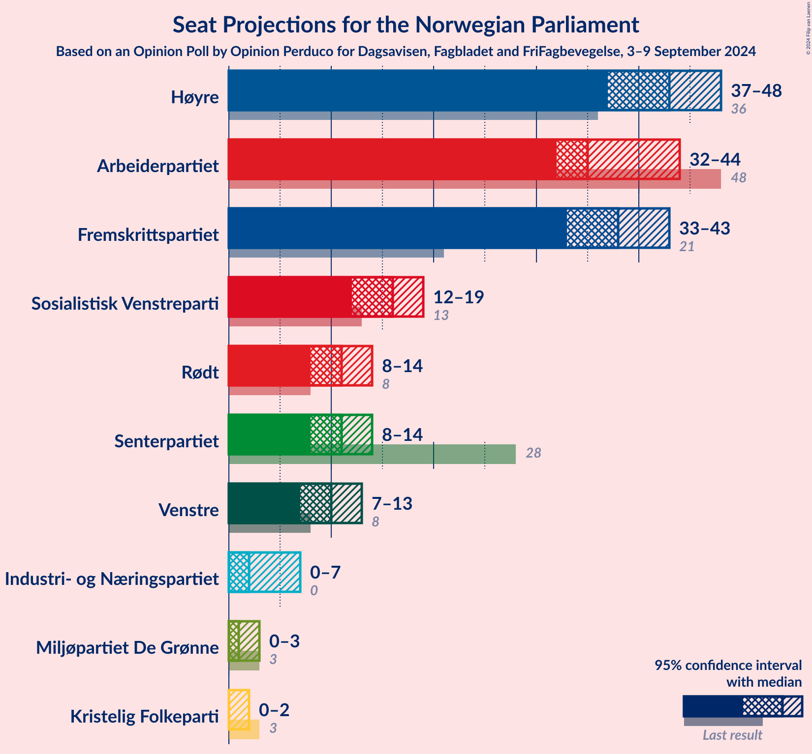

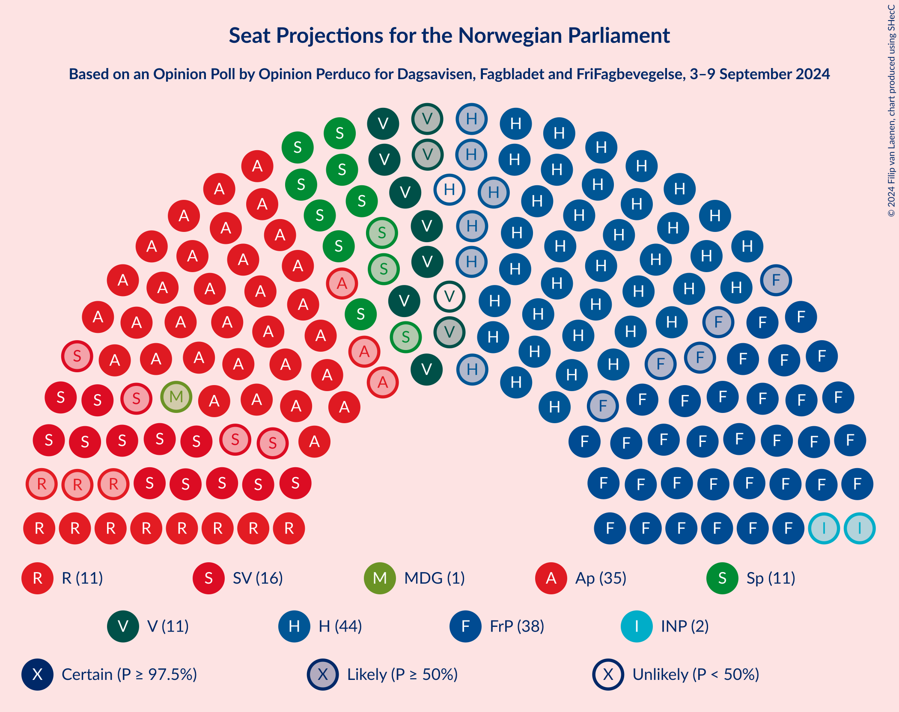

### Confidence Intervals

| Party | Last Result | Median | 80% Confidence Interval | 90% Confidence Interval | 95% Confidence Interval | 99% Confidence Interval |
|:-----:|:-----------:|:------:|:-----------------------:|:-----------------------:|:-----------------------:|:-----------------------:|
| <a href="#høyre">Høyre</a> | 36 | 43 | 39–47 |38–48 |37–48 |35–50 |
| <a href="#arbeiderpartiet">Arbeiderpartiet</a> | 48 | 35 | 33–41 |32–43 |32–44 |31–46 |
| <a href="#fremskrittspartiet">Fremskrittspartiet</a> | 21 | 38 | 36–41 |34–42 |33–43 |31–44 |
| <a href="#sosialistisk-venstreparti">Sosialistisk Venstreparti</a> | 13 | 16 | 13–18 |12–19 |12–19 |11–21 |
| <a href="#senterpartiet">Senterpartiet</a> | 28 | 11 | 9–13 |8–14 |8–14 |7–15 |
| <a href="#rødt">Rødt</a> | 8 | 11 | 8–12 |8–13 |8–14 |1–15 |
| <a href="#venstre">Venstre</a> | 8 | 10 | 8–12 |7–13 |7–13 |3–14 |
| <a href="#industri--og-næringspartiet">Industri- og Næringspartiet</a> | 0 | 2 | 0–3 |0–3 |0–7 |0–8 |
| <a href="#miljøpartiet-de-grønne">Miljøpartiet De Grønne</a> | 3 | 1 | 1–2 |1–3 |0–3 |0–7 |
| <a href="#kristelig-folkeparti">Kristelig Folkeparti</a> | 3 | 0 | 0–1 |0–2 |0–2 |0–3 |

### Høyre

*For a full overview of the results for this party, see the [Høyre](party-høyre.html) page.*

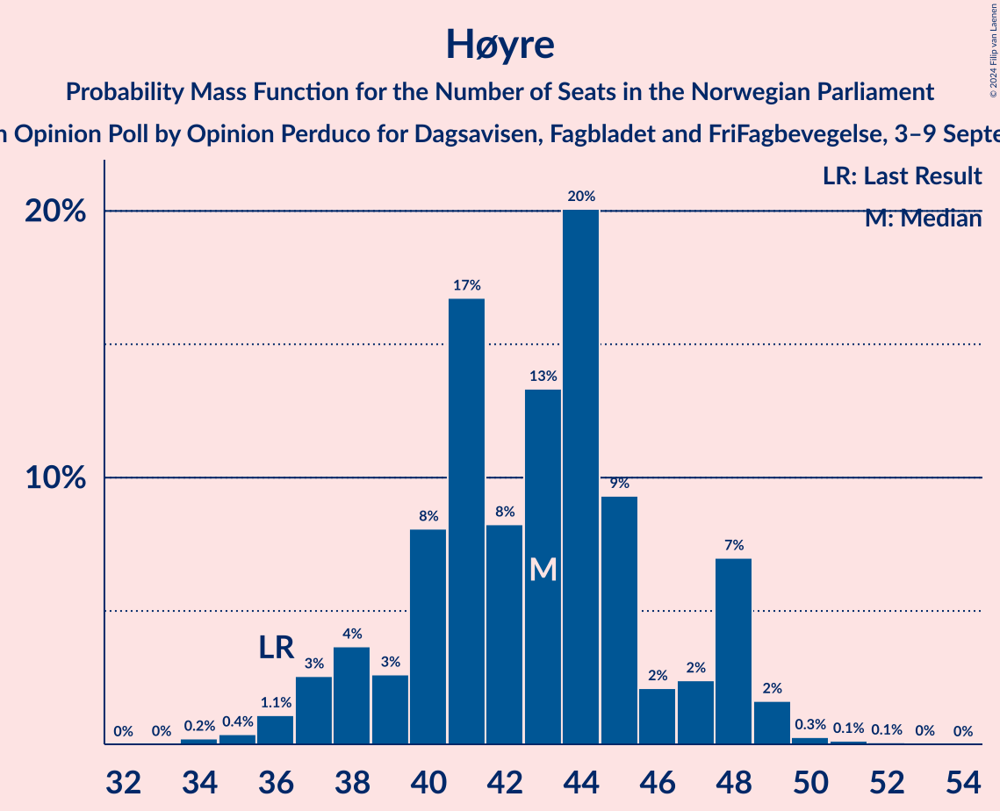

| Number of Seats | Probability | Accumulated | Special Marks |
|:---------------:|:-----------:|:-----------:|:-------------:|
| 34 | 0.2% | 100% |  |
| 35 | 0.4% | 99.8% |  |
| 36 | 1.1% | 99.4% | Last Result |
| 37 | 3% | 98% |  |
| 38 | 4% | 96% |  |
| 39 | 3% | 92% |  |
| 40 | 8% | 89% |  |
| 41 | 17% | 81% |  |
| 42 | 8% | 65% |  |
| 43 | 13% | 56% | Median |
| 44 | 20% | 43% |  |
| 45 | 9% | 23% |  |
| 46 | 2% | 14% |  |
| 47 | 2% | 12% |  |
| 48 | 7% | 9% |  |
| 49 | 2% | 2% |  |
| 50 | 0.3% | 0.5% |  |
| 51 | 0.1% | 0.3% |  |
| 52 | 0.1% | 0.1% |  |
| 53 | 0% | 0% |  |

### Arbeiderpartiet

*For a full overview of the results for this party, see the [Arbeiderpartiet](party-arbeiderpartiet.html) page.*

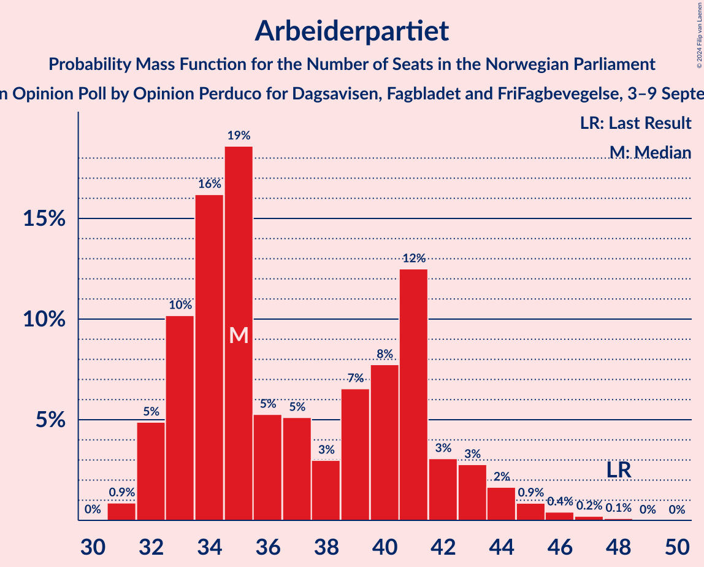

| Number of Seats | Probability | Accumulated | Special Marks |
|:---------------:|:-----------:|:-----------:|:-------------:|
| 31 | 0.9% | 100% |  |
| 32 | 5% | 99.1% |  |
| 33 | 10% | 94% |  |
| 34 | 16% | 84% |  |
| 35 | 19% | 68% | Median |
| 36 | 5% | 49% |  |
| 37 | 5% | 44% |  |
| 38 | 3% | 39% |  |
| 39 | 7% | 36% |  |
| 40 | 8% | 29% |  |
| 41 | 12% | 22% |  |
| 42 | 3% | 9% |  |
| 43 | 3% | 6% |  |
| 44 | 2% | 3% |  |
| 45 | 0.9% | 2% |  |
| 46 | 0.4% | 0.7% |  |
| 47 | 0.2% | 0.3% |  |
| 48 | 0.1% | 0.1% | Last Result |
| 49 | 0% | 0% |  |

### Fremskrittspartiet

*For a full overview of the results for this party, see the [Fremskrittspartiet](party-fremskrittspartiet.html) page.*

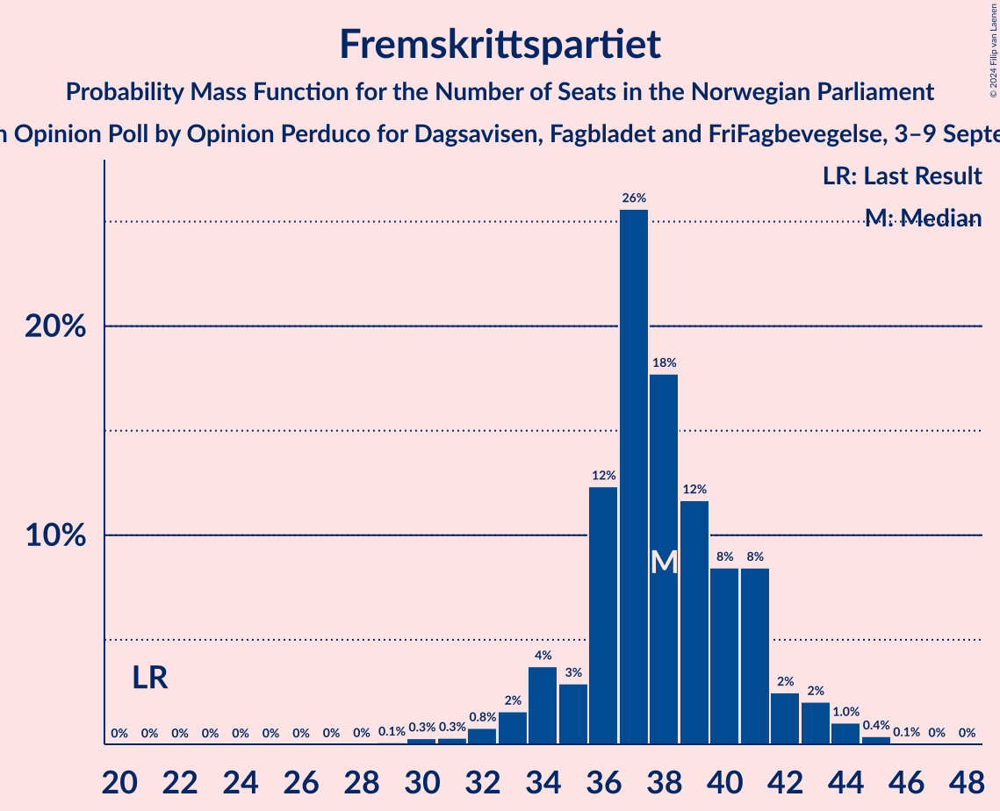

| Number of Seats | Probability | Accumulated | Special Marks |
|:---------------:|:-----------:|:-----------:|:-------------:|
| 21 | 0% | 100% | Last Result |
| 22 | 0% | 100% |  |
| 23 | 0% | 100% |  |
| 24 | 0% | 100% |  |
| 25 | 0% | 100% |  |
| 26 | 0% | 100% |  |
| 27 | 0% | 100% |  |
| 28 | 0% | 100% |  |
| 29 | 0.1% | 100% |  |
| 30 | 0.3% | 99.9% |  |
| 31 | 0.3% | 99.6% |  |
| 32 | 0.8% | 99.3% |  |
| 33 | 2% | 98% |  |
| 34 | 4% | 97% |  |
| 35 | 3% | 93% |  |
| 36 | 12% | 90% |  |
| 37 | 26% | 78% |  |
| 38 | 18% | 52% | Median |
| 39 | 12% | 35% |  |
| 40 | 8% | 23% |  |
| 41 | 8% | 14% |  |
| 42 | 2% | 6% |  |
| 43 | 2% | 4% |  |
| 44 | 1.0% | 2% |  |
| 45 | 0.4% | 0.5% |  |
| 46 | 0.1% | 0.1% |  |
| 47 | 0% | 0.1% |  |
| 48 | 0% | 0% |  |

### Sosialistisk Venstreparti

*For a full overview of the results for this party, see the [Sosialistisk Venstreparti](party-sosialistiskvenstreparti.html) page.*

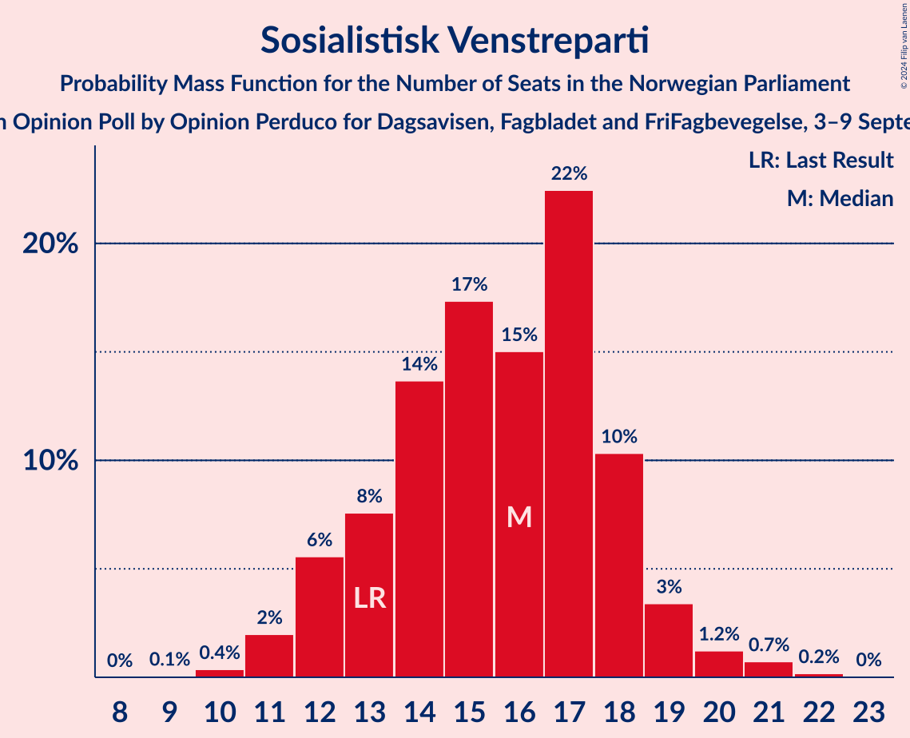

| Number of Seats | Probability | Accumulated | Special Marks |
|:---------------:|:-----------:|:-----------:|:-------------:|
| 9 | 0.1% | 100% |  |
| 10 | 0.4% | 99.9% |  |
| 11 | 2% | 99.6% |  |
| 12 | 6% | 98% |  |
| 13 | 8% | 92% | Last Result |
| 14 | 14% | 84% |  |
| 15 | 17% | 71% |  |
| 16 | 15% | 53% | Median |
| 17 | 22% | 38% |  |
| 18 | 10% | 16% |  |
| 19 | 3% | 6% |  |
| 20 | 1.2% | 2% |  |
| 21 | 0.7% | 1.0% |  |
| 22 | 0.2% | 0.2% |  |
| 23 | 0% | 0% |  |

### Senterpartiet

*For a full overview of the results for this party, see the [Senterpartiet](party-senterpartiet.html) page.*

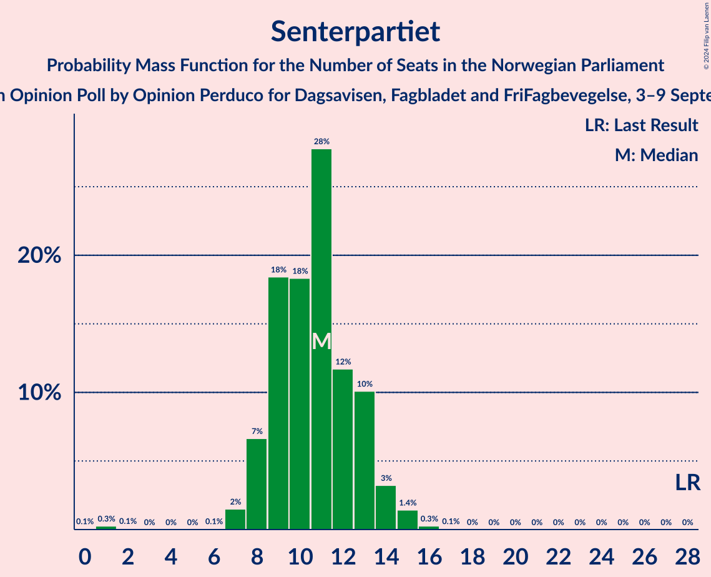

| Number of Seats | Probability | Accumulated | Special Marks |
|:---------------:|:-----------:|:-----------:|:-------------:|
| 0 | 0.1% | 100% |  |
| 1 | 0.3% | 99.9% |  |
| 2 | 0.1% | 99.7% |  |
| 3 | 0% | 99.6% |  |
| 4 | 0% | 99.6% |  |
| 5 | 0% | 99.6% |  |
| 6 | 0.1% | 99.6% |  |
| 7 | 2% | 99.5% |  |
| 8 | 7% | 98% |  |
| 9 | 18% | 91% |  |
| 10 | 18% | 73% |  |
| 11 | 28% | 55% | Median |
| 12 | 12% | 27% |  |
| 13 | 10% | 15% |  |
| 14 | 3% | 5% |  |
| 15 | 1.4% | 2% |  |
| 16 | 0.3% | 0.4% |  |
| 17 | 0.1% | 0.1% |  |
| 18 | 0% | 0% |  |
| 19 | 0% | 0% |  |
| 20 | 0% | 0% |  |
| 21 | 0% | 0% |  |
| 22 | 0% | 0% |  |
| 23 | 0% | 0% |  |
| 24 | 0% | 0% |  |
| 25 | 0% | 0% |  |
| 26 | 0% | 0% |  |
| 27 | 0% | 0% |  |
| 28 | 0% | 0% | Last Result |

### Rødt

*For a full overview of the results for this party, see the [Rødt](party-rødt.html) page.*

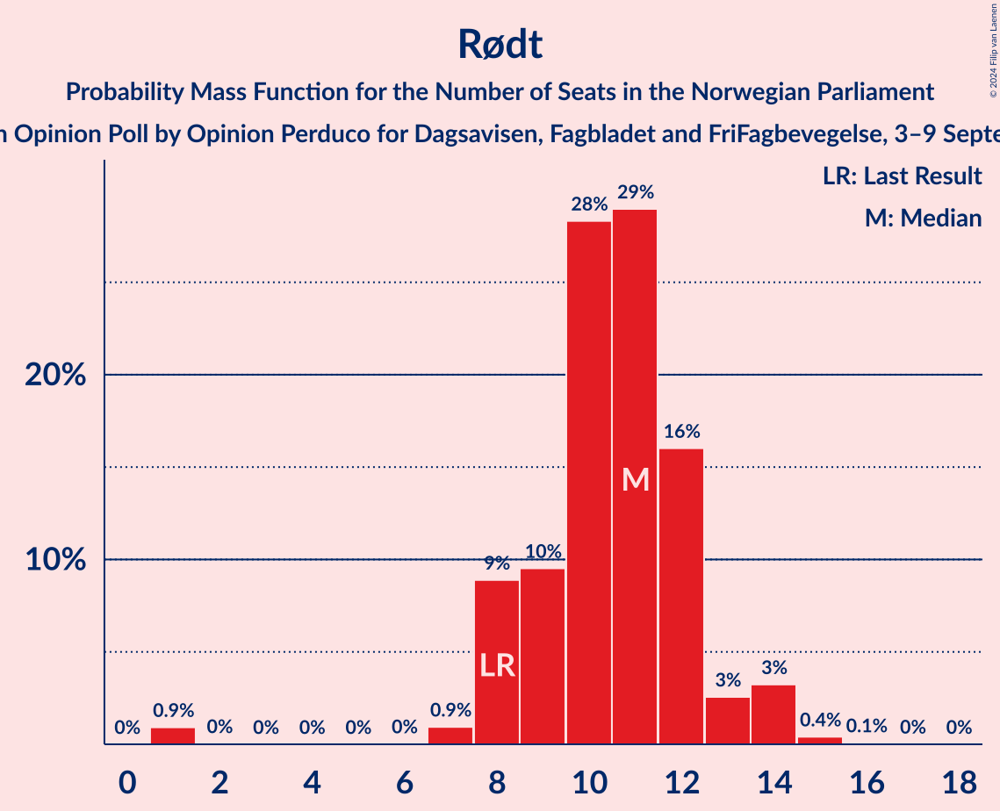

| Number of Seats | Probability | Accumulated | Special Marks |
|:---------------:|:-----------:|:-----------:|:-------------:|
| 1 | 0.9% | 100% |  |
| 2 | 0% | 99.1% |  |
| 3 | 0% | 99.0% |  |
| 4 | 0% | 99.0% |  |
| 5 | 0% | 99.0% |  |
| 6 | 0% | 99.0% |  |
| 7 | 0.9% | 99.0% |  |
| 8 | 9% | 98% | Last Result |
| 9 | 10% | 89% |  |
| 10 | 28% | 80% |  |
| 11 | 29% | 51% | Median |
| 12 | 16% | 22% |  |
| 13 | 3% | 6% |  |
| 14 | 3% | 4% |  |
| 15 | 0.4% | 0.5% |  |
| 16 | 0.1% | 0.1% |  |
| 17 | 0% | 0% |  |

### Venstre

*For a full overview of the results for this party, see the [Venstre](party-venstre.html) page.*

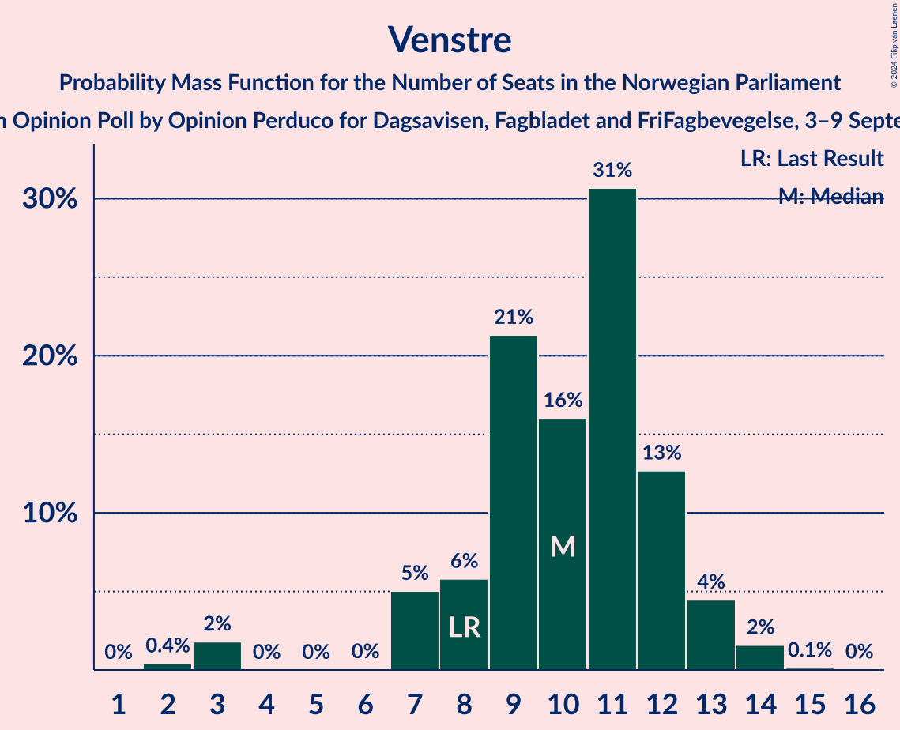

| Number of Seats | Probability | Accumulated | Special Marks |
|:---------------:|:-----------:|:-----------:|:-------------:|
| 2 | 0.4% | 100% |  |
| 3 | 2% | 99.6% |  |
| 4 | 0% | 98% |  |
| 5 | 0% | 98% |  |
| 6 | 0% | 98% |  |
| 7 | 5% | 98% |  |
| 8 | 6% | 93% | Last Result |
| 9 | 21% | 87% |  |
| 10 | 16% | 66% | Median |
| 11 | 31% | 50% |  |
| 12 | 13% | 19% |  |
| 13 | 4% | 6% |  |
| 14 | 2% | 2% |  |
| 15 | 0.1% | 0.2% |  |
| 16 | 0% | 0% |  |

### Industri- og Næringspartiet

*For a full overview of the results for this party, see the [Industri- og Næringspartiet](party-industri-ognæringspartiet.html) page.*

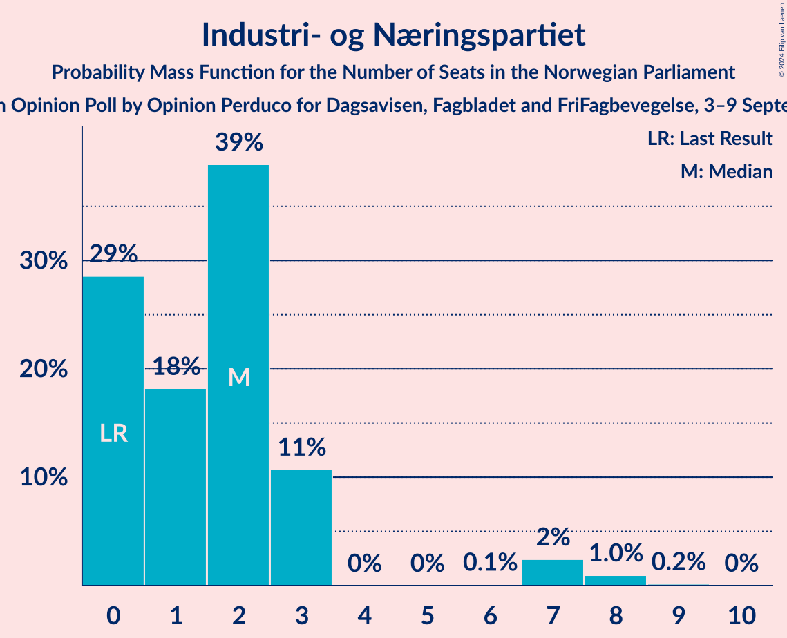

| Number of Seats | Probability | Accumulated | Special Marks |
|:---------------:|:-----------:|:-----------:|:-------------:|
| 0 | 29% | 100% | Last Result |
| 1 | 18% | 71% |  |
| 2 | 39% | 53% | Median |
| 3 | 11% | 14% |  |
| 4 | 0% | 4% |  |
| 5 | 0% | 4% |  |
| 6 | 0.1% | 4% |  |
| 7 | 2% | 4% |  |
| 8 | 1.0% | 1.1% |  |
| 9 | 0.2% | 0.2% |  |
| 10 | 0% | 0% |  |

### Miljøpartiet De Grønne

*For a full overview of the results for this party, see the [Miljøpartiet De Grønne](party-miljøpartietdegrønne.html) page.*

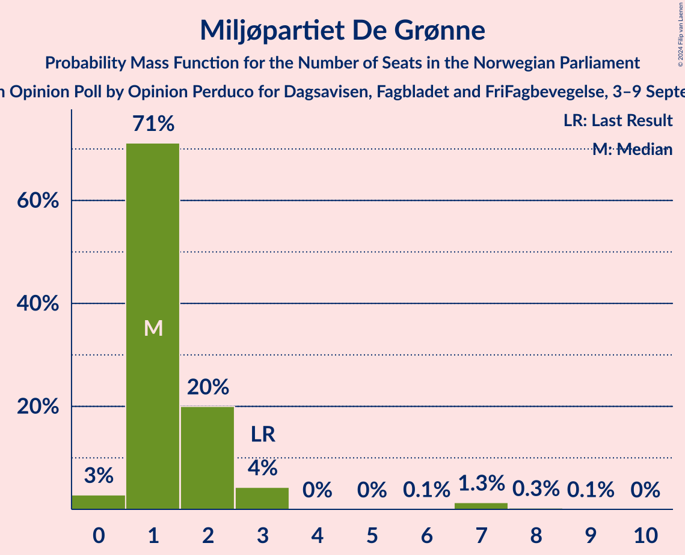

| Number of Seats | Probability | Accumulated | Special Marks |
|:---------------:|:-----------:|:-----------:|:-------------:|
| 0 | 3% | 100% |  |
| 1 | 71% | 97% | Median |
| 2 | 20% | 26% |  |
| 3 | 4% | 6% | Last Result |
| 4 | 0% | 2% |  |
| 5 | 0% | 2% |  |
| 6 | 0.1% | 2% |  |
| 7 | 1.3% | 2% |  |
| 8 | 0.3% | 0.3% |  |
| 9 | 0.1% | 0.1% |  |
| 10 | 0% | 0% |  |

### Kristelig Folkeparti

*For a full overview of the results for this party, see the [Kristelig Folkeparti](party-kristeligfolkeparti.html) page.*

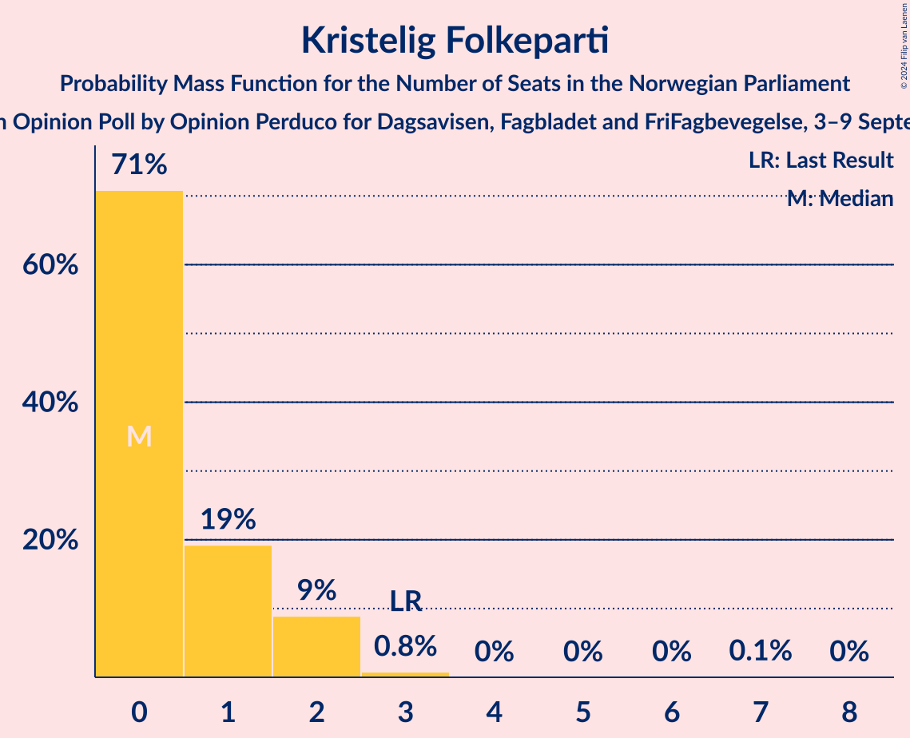

| Number of Seats | Probability | Accumulated | Special Marks |
|:---------------:|:-----------:|:-----------:|:-------------:|
| 0 | 71% | 100% | Median |
| 1 | 19% | 29% |  |
| 2 | 9% | 10% |  |
| 3 | 0.8% | 1.0% | Last Result |
| 4 | 0% | 0.2% |  |
| 5 | 0% | 0.2% |  |
| 6 | 0% | 0.2% |  |
| 7 | 0.1% | 0.2% |  |
| 8 | 0% | 0% |  |

## Coalitions

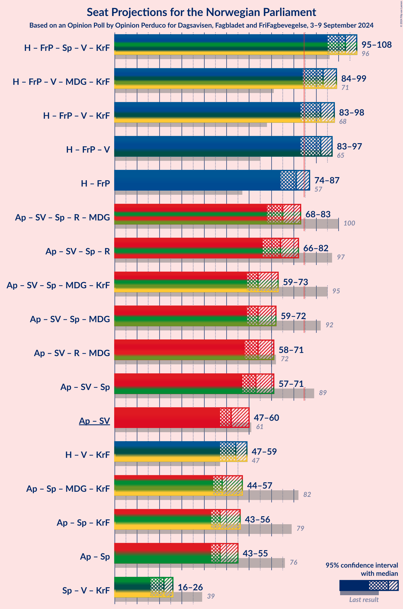

### Confidence Intervals

| Coalition | Last Result | Median | Majority? | 80% Confidence Interval | 90% Confidence Interval | 95% Confidence Interval | 99% Confidence Interval |
|:---------:|:-----------:|:------:|:---------:|:-----------------------:|:-----------------------:|:-----------------------:|:-----------------------:|
| Høyre – Fremskrittspartiet – Senterpartiet – Venstre – Kristelig Folkeparti | 96 | 103 | 100% | 97–106 | 95–107 | 95–108 | 92–111 |
| Høyre – Fremskrittspartiet – Venstre – Miljøpartiet De Grønne – Kristelig Folkeparti | 71 | 93 | 97% | 88–96 | 86–97 | 84–99 | 83–101 |
| Høyre – Fremskrittspartiet – Venstre – Kristelig Folkeparti | 68 | 92 | 95% | 86–95 | 85–96 | 83–98 | 81–100 |
| Høyre – Fremskrittspartiet – Venstre | 65 | 92 | 94% | 86–95 | 84–95 | 83–97 | 81–100 |
| Høyre – Fremskrittspartiet | 57 | 81 | 10% | 76–84 | 75–86 | 74–87 | 71–90 |
| Arbeiderpartiet – Sosialistisk Venstreparti – Senterpartiet – Rødt – Miljøpartiet De Grønne | 100 | 75 | 0.6% | 70–80 | 69–81 | 68–83 | 66–85 |
| Arbeiderpartiet – Sosialistisk Venstreparti – Senterpartiet – Rødt | 97 | 74 | 0.2% | 69–78 | 68–80 | 66–82 | 64–83 |
| Arbeiderpartiet – Sosialistisk Venstreparti – Senterpartiet – Miljøpartiet De Grønne – Kristelig Folkeparti | 95 | 64 | 0% | 60–70 | 60–72 | 59–73 | 57–75 |
| Arbeiderpartiet – Sosialistisk Venstreparti – Senterpartiet – Miljøpartiet De Grønne | 92 | 64 | 0% | 60–69 | 59–71 | 59–72 | 57–74 |
| Arbeiderpartiet – Sosialistisk Venstreparti – Rødt – Miljøpartiet De Grønne | 72 | 64 | 0% | 60–69 | 59–71 | 58–71 | 55–75 |
| Arbeiderpartiet – Sosialistisk Venstreparti – Senterpartiet | 89 | 63 | 0% | 59–68 | 58–70 | 57–71 | 55–73 |
| Arbeiderpartiet – Sosialistisk Venstreparti | 61 | 52 | 0% | 48–57 | 48–59 | 47–60 | 45–61 |
| Høyre – Venstre – Kristelig Folkeparti | 47 | 54 | 0% | 49–58 | 47–59 | 47–59 | 44–61 |
| Arbeiderpartiet – Senterpartiet – Miljøpartiet De Grønne – Kristelig Folkeparti | 82 | 48 | 0% | 45–55 | 45–56 | 44–57 | 42–60 |
| Arbeiderpartiet – Senterpartiet – Kristelig Folkeparti | 79 | 47 | 0% | 44–53 | 43–54 | 43–56 | 41–58 |
| Arbeiderpartiet – Senterpartiet | 76 | 47 | 0% | 44–52 | 43–54 | 43–55 | 41–57 |
| Senterpartiet – Venstre – Kristelig Folkeparti | 39 | 22 | 0% | 18–24 | 16–25 | 16–26 | 13–28 |

### Høyre – Fremskrittspartiet – Senterpartiet – Venstre – Kristelig Folkeparti

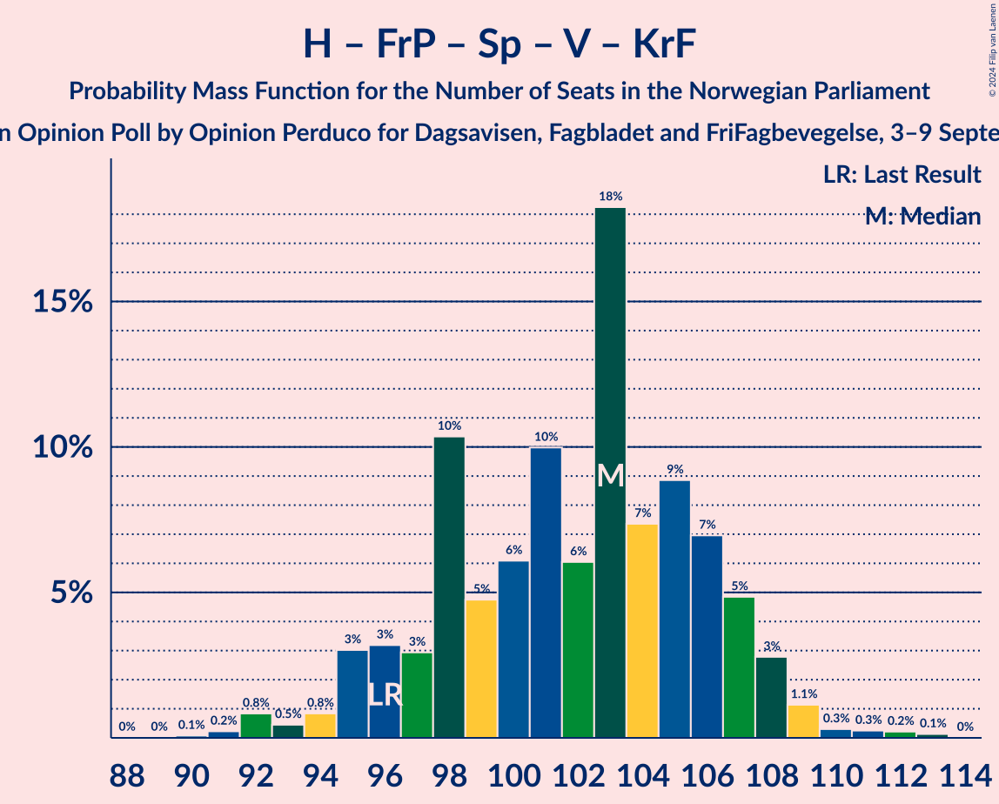

| Number of Seats | Probability | Accumulated | Special Marks |
|:---------------:|:-----------:|:-----------:|:-------------:|
| 90 | 0.1% | 100% |  |
| 91 | 0.2% | 99.9% |  |
| 92 | 0.8% | 99.7% |  |
| 93 | 0.5% | 98.8% |  |
| 94 | 0.8% | 98% |  |
| 95 | 3% | 98% |  |
| 96 | 3% | 94% | Last Result |
| 97 | 3% | 91% |  |
| 98 | 10% | 88% |  |
| 99 | 5% | 78% |  |
| 100 | 6% | 73% |  |
| 101 | 10% | 67% |  |
| 102 | 6% | 57% | Median |
| 103 | 18% | 51% |  |
| 104 | 7% | 33% |  |
| 105 | 9% | 26% |  |
| 106 | 7% | 17% |  |
| 107 | 5% | 10% |  |
| 108 | 3% | 5% |  |
| 109 | 1.1% | 2% |  |
| 110 | 0.3% | 0.9% |  |
| 111 | 0.3% | 0.6% |  |
| 112 | 0.2% | 0.4% |  |
| 113 | 0.1% | 0.2% |  |
| 114 | 0% | 0% |  |

### Høyre – Fremskrittspartiet – Venstre – Miljøpartiet De Grønne – Kristelig Folkeparti

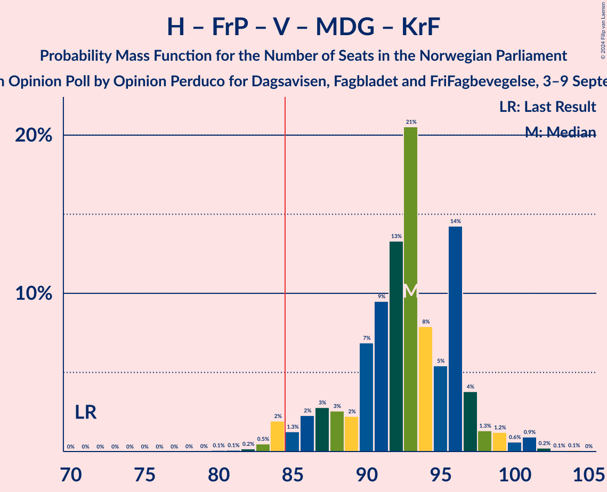

| Number of Seats | Probability | Accumulated | Special Marks |
|:---------------:|:-----------:|:-----------:|:-------------:|
| 71 | 0% | 100% | Last Result |
| 72 | 0% | 100% |  |
| 73 | 0% | 100% |  |
| 74 | 0% | 100% |  |
| 75 | 0% | 100% |  |
| 76 | 0% | 100% |  |
| 77 | 0% | 100% |  |
| 78 | 0% | 100% |  |
| 79 | 0% | 100% |  |
| 80 | 0.1% | 100% |  |
| 81 | 0.1% | 99.9% |  |
| 82 | 0.2% | 99.8% |  |
| 83 | 0.5% | 99.6% |  |
| 84 | 2% | 99.1% |  |
| 85 | 1.3% | 97% | Majority |
| 86 | 2% | 96% |  |
| 87 | 3% | 94% |  |
| 88 | 3% | 91% |  |
| 89 | 2% | 88% |  |
| 90 | 7% | 86% |  |
| 91 | 9% | 79% |  |
| 92 | 13% | 70% | Median |
| 93 | 21% | 56% |  |
| 94 | 8% | 36% |  |
| 95 | 5% | 28% |  |
| 96 | 14% | 23% |  |
| 97 | 4% | 8% |  |
| 98 | 1.3% | 4% |  |
| 99 | 1.2% | 3% |  |
| 100 | 0.6% | 2% |  |
| 101 | 0.9% | 1.3% |  |
| 102 | 0.2% | 0.4% |  |
| 103 | 0.1% | 0.2% |  |
| 104 | 0.1% | 0.1% |  |
| 105 | 0% | 0% |  |

### Høyre – Fremskrittspartiet – Venstre – Kristelig Folkeparti

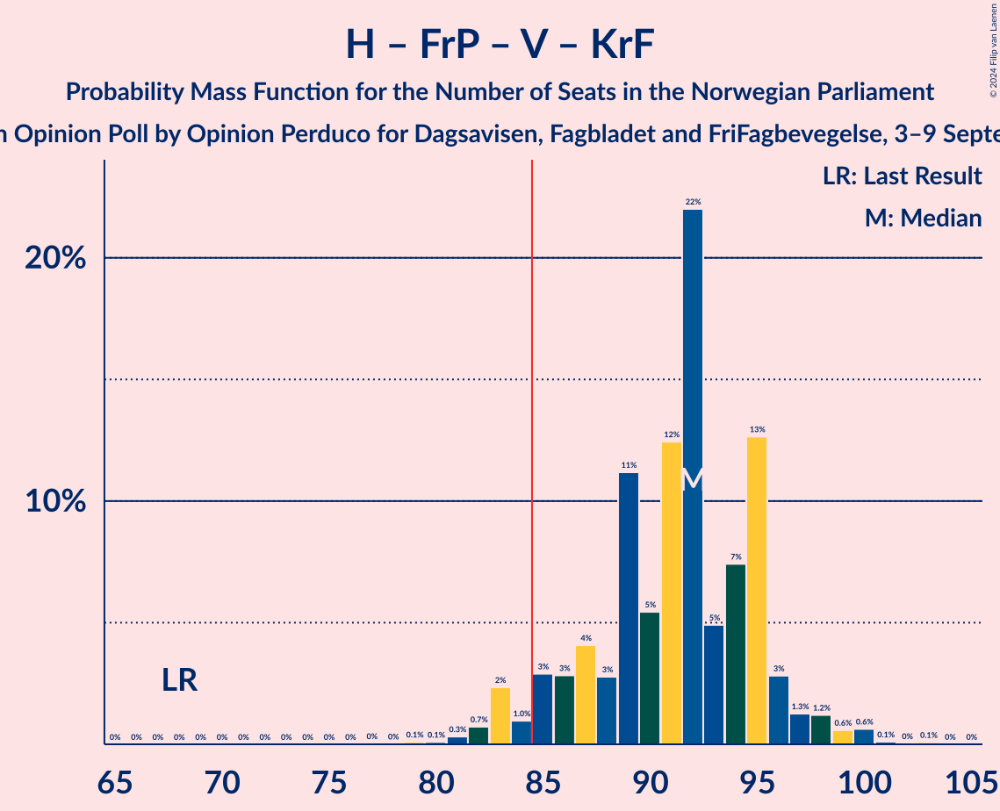

| Number of Seats | Probability | Accumulated | Special Marks |
|:---------------:|:-----------:|:-----------:|:-------------:|
| 68 | 0% | 100% | Last Result |
| 69 | 0% | 100% |  |
| 70 | 0% | 100% |  |
| 71 | 0% | 100% |  |
| 72 | 0% | 100% |  |
| 73 | 0% | 100% |  |
| 74 | 0% | 100% |  |
| 75 | 0% | 100% |  |
| 76 | 0% | 100% |  |
| 77 | 0% | 100% |  |
| 78 | 0% | 100% |  |
| 79 | 0.1% | 99.9% |  |
| 80 | 0.1% | 99.8% |  |
| 81 | 0.3% | 99.8% |  |
| 82 | 0.7% | 99.4% |  |
| 83 | 2% | 98.7% |  |
| 84 | 1.0% | 96% |  |
| 85 | 3% | 95% | Majority |
| 86 | 3% | 92% |  |
| 87 | 4% | 90% |  |
| 88 | 3% | 86% |  |
| 89 | 11% | 83% |  |
| 90 | 5% | 72% |  |
| 91 | 12% | 66% | Median |
| 92 | 22% | 54% |  |
| 93 | 5% | 32% |  |
| 94 | 7% | 27% |  |
| 95 | 13% | 19% |  |
| 96 | 3% | 7% |  |
| 97 | 1.3% | 4% |  |
| 98 | 1.2% | 3% |  |
| 99 | 0.6% | 1.5% |  |
| 100 | 0.6% | 0.9% |  |
| 101 | 0.1% | 0.2% |  |
| 102 | 0% | 0.1% |  |
| 103 | 0.1% | 0.1% |  |
| 104 | 0% | 0% |  |

### Høyre – Fremskrittspartiet – Venstre

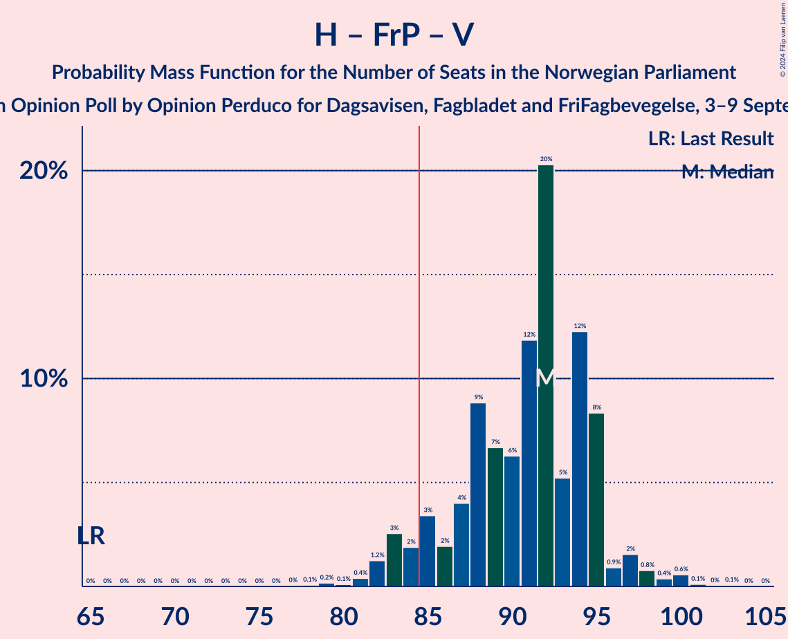

| Number of Seats | Probability | Accumulated | Special Marks |
|:---------------:|:-----------:|:-----------:|:-------------:|
| 65 | 0% | 100% | Last Result |
| 66 | 0% | 100% |  |
| 67 | 0% | 100% |  |
| 68 | 0% | 100% |  |
| 69 | 0% | 100% |  |
| 70 | 0% | 100% |  |
| 71 | 0% | 100% |  |
| 72 | 0% | 100% |  |
| 73 | 0% | 100% |  |
| 74 | 0% | 100% |  |
| 75 | 0% | 100% |  |
| 76 | 0% | 100% |  |
| 77 | 0% | 100% |  |
| 78 | 0.1% | 100% |  |
| 79 | 0.2% | 99.9% |  |
| 80 | 0.1% | 99.7% |  |
| 81 | 0.4% | 99.6% |  |
| 82 | 1.2% | 99.2% |  |
| 83 | 3% | 98% |  |
| 84 | 2% | 95% |  |
| 85 | 3% | 94% | Majority |
| 86 | 2% | 90% |  |
| 87 | 4% | 88% |  |
| 88 | 9% | 84% |  |
| 89 | 7% | 75% |  |
| 90 | 6% | 69% |  |
| 91 | 12% | 62% | Median |
| 92 | 20% | 51% |  |
| 93 | 5% | 30% |  |
| 94 | 12% | 25% |  |
| 95 | 8% | 13% |  |
| 96 | 0.9% | 4% |  |
| 97 | 2% | 3% |  |
| 98 | 0.8% | 2% |  |
| 99 | 0.4% | 1.2% |  |
| 100 | 0.6% | 0.8% |  |
| 101 | 0.1% | 0.2% |  |
| 102 | 0% | 0.1% |  |
| 103 | 0.1% | 0.1% |  |
| 104 | 0% | 0% |  |

### Høyre – Fremskrittspartiet

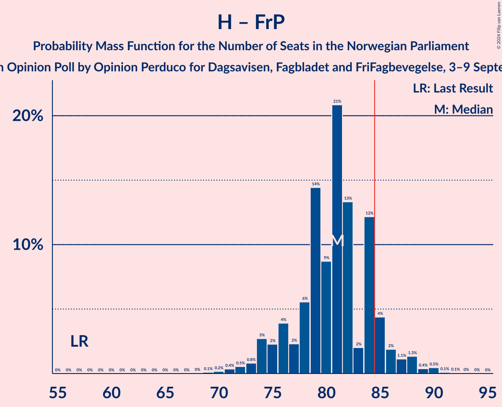

| Number of Seats | Probability | Accumulated | Special Marks |
|:---------------:|:-----------:|:-----------:|:-------------:|
| 57 | 0% | 100% | Last Result |
| 58 | 0% | 100% |  |
| 59 | 0% | 100% |  |
| 60 | 0% | 100% |  |
| 61 | 0% | 100% |  |
| 62 | 0% | 100% |  |
| 63 | 0% | 100% |  |
| 64 | 0% | 100% |  |
| 65 | 0% | 100% |  |
| 66 | 0% | 100% |  |
| 67 | 0% | 100% |  |
| 68 | 0% | 100% |  |
| 69 | 0.1% | 100% |  |
| 70 | 0.2% | 99.9% |  |
| 71 | 0.4% | 99.7% |  |
| 72 | 0.5% | 99.3% |  |
| 73 | 0.8% | 98.8% |  |
| 74 | 3% | 98% |  |
| 75 | 2% | 95% |  |
| 76 | 4% | 93% |  |
| 77 | 2% | 89% |  |
| 78 | 6% | 87% |  |
| 79 | 14% | 81% |  |
| 80 | 9% | 67% |  |
| 81 | 21% | 58% | Median |
| 82 | 13% | 37% |  |
| 83 | 2% | 24% |  |
| 84 | 12% | 22% |  |
| 85 | 4% | 10% | Majority |
| 86 | 2% | 5% |  |
| 87 | 1.1% | 3% |  |
| 88 | 1.3% | 2% |  |
| 89 | 0.4% | 1.0% |  |
| 90 | 0.5% | 0.6% |  |
| 91 | 0.1% | 0.2% |  |
| 92 | 0.1% | 0.1% |  |
| 93 | 0% | 0.1% |  |
| 94 | 0% | 0% |  |

### Arbeiderpartiet – Sosialistisk Venstreparti – Senterpartiet – Rødt – Miljøpartiet De Grønne

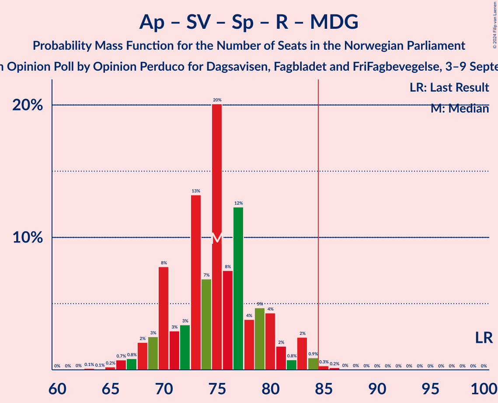

| Number of Seats | Probability | Accumulated | Special Marks |
|:---------------:|:-----------:|:-----------:|:-------------:|
| 63 | 0.1% | 100% |  |
| 64 | 0.1% | 99.8% |  |
| 65 | 0.2% | 99.8% |  |
| 66 | 0.7% | 99.6% |  |
| 67 | 0.8% | 98.8% |  |
| 68 | 2% | 98% |  |
| 69 | 3% | 96% |  |
| 70 | 8% | 93% |  |
| 71 | 3% | 86% |  |
| 72 | 3% | 83% |  |
| 73 | 13% | 79% |  |
| 74 | 7% | 66% | Median |
| 75 | 20% | 59% |  |
| 76 | 8% | 39% |  |
| 77 | 12% | 32% |  |
| 78 | 4% | 19% |  |
| 79 | 5% | 15% |  |
| 80 | 4% | 11% |  |
| 81 | 2% | 6% |  |
| 82 | 0.8% | 5% |  |
| 83 | 2% | 4% |  |
| 84 | 0.9% | 1.5% |  |
| 85 | 0.3% | 0.6% | Majority |
| 86 | 0.2% | 0.3% |  |
| 87 | 0% | 0.1% |  |
| 88 | 0% | 0% |  |
| 89 | 0% | 0% |  |
| 90 | 0% | 0% |  |
| 91 | 0% | 0% |  |
| 92 | 0% | 0% |  |
| 93 | 0% | 0% |  |
| 94 | 0% | 0% |  |
| 95 | 0% | 0% |  |
| 96 | 0% | 0% |  |
| 97 | 0% | 0% |  |
| 98 | 0% | 0% |  |
| 99 | 0% | 0% |  |
| 100 | 0% | 0% | Last Result |

### Arbeiderpartiet – Sosialistisk Venstreparti – Senterpartiet – Rødt

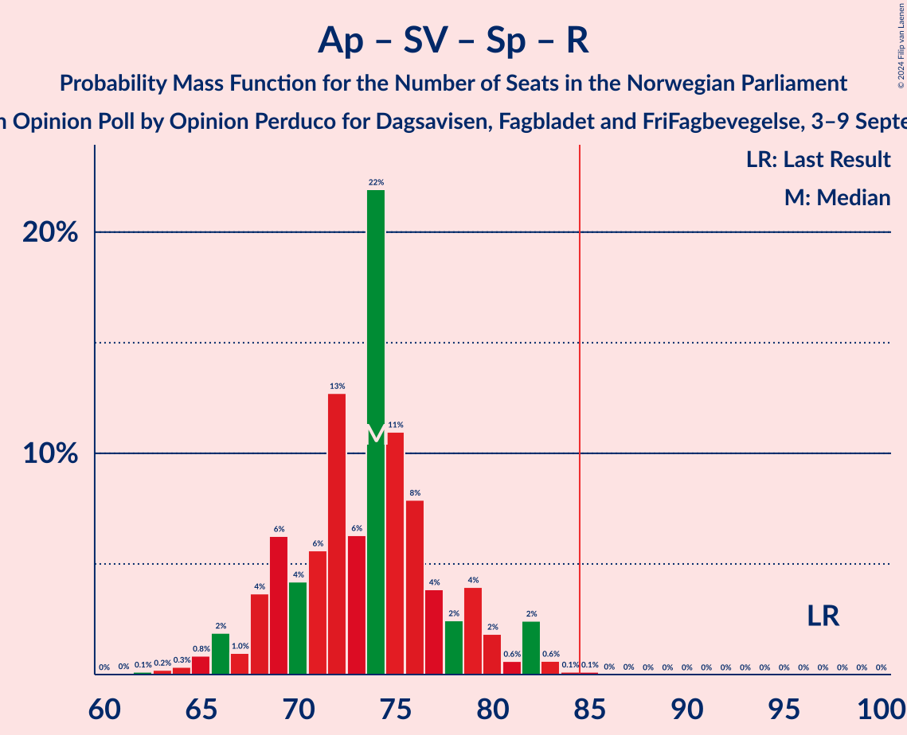

| Number of Seats | Probability | Accumulated | Special Marks |
|:---------------:|:-----------:|:-----------:|:-------------:|
| 61 | 0% | 100% |  |
| 62 | 0.1% | 99.9% |  |
| 63 | 0.2% | 99.8% |  |
| 64 | 0.3% | 99.6% |  |
| 65 | 0.8% | 99.3% |  |
| 66 | 2% | 98% |  |
| 67 | 1.0% | 97% |  |
| 68 | 4% | 96% |  |
| 69 | 6% | 92% |  |
| 70 | 4% | 86% |  |
| 71 | 6% | 81% |  |
| 72 | 13% | 76% |  |
| 73 | 6% | 63% | Median |
| 74 | 22% | 57% |  |
| 75 | 11% | 35% |  |
| 76 | 8% | 24% |  |
| 77 | 4% | 16% |  |
| 78 | 2% | 12% |  |
| 79 | 4% | 10% |  |
| 80 | 2% | 6% |  |
| 81 | 0.6% | 4% |  |
| 82 | 2% | 3% |  |
| 83 | 0.6% | 0.9% |  |
| 84 | 0.1% | 0.3% |  |
| 85 | 0.1% | 0.2% | Majority |
| 86 | 0% | 0.1% |  |
| 87 | 0% | 0% |  |
| 88 | 0% | 0% |  |
| 89 | 0% | 0% |  |
| 90 | 0% | 0% |  |
| 91 | 0% | 0% |  |
| 92 | 0% | 0% |  |
| 93 | 0% | 0% |  |
| 94 | 0% | 0% |  |
| 95 | 0% | 0% |  |
| 96 | 0% | 0% |  |
| 97 | 0% | 0% | Last Result |

### Arbeiderpartiet – Sosialistisk Venstreparti – Senterpartiet – Miljøpartiet De Grønne – Kristelig Folkeparti

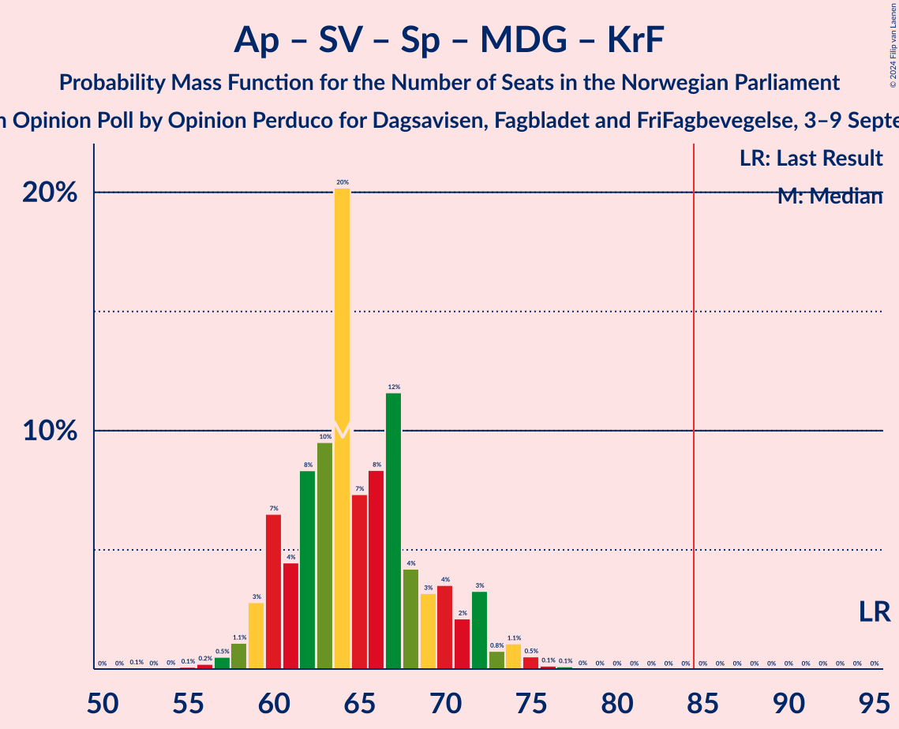

| Number of Seats | Probability | Accumulated | Special Marks |
|:---------------:|:-----------:|:-----------:|:-------------:|
| 52 | 0.1% | 100% |  |
| 53 | 0% | 99.9% |  |
| 54 | 0% | 99.9% |  |
| 55 | 0.1% | 99.9% |  |
| 56 | 0.2% | 99.8% |  |
| 57 | 0.5% | 99.6% |  |
| 58 | 1.1% | 99.1% |  |
| 59 | 3% | 98% |  |
| 60 | 7% | 95% |  |
| 61 | 4% | 89% |  |
| 62 | 8% | 84% |  |
| 63 | 10% | 76% | Median |
| 64 | 20% | 66% |  |
| 65 | 7% | 46% |  |
| 66 | 8% | 39% |  |
| 67 | 12% | 31% |  |
| 68 | 4% | 19% |  |
| 69 | 3% | 15% |  |
| 70 | 4% | 12% |  |
| 71 | 2% | 8% |  |
| 72 | 3% | 6% |  |
| 73 | 0.8% | 3% |  |
| 74 | 1.1% | 2% |  |
| 75 | 0.5% | 0.8% |  |
| 76 | 0.1% | 0.3% |  |
| 77 | 0.1% | 0.1% |  |
| 78 | 0% | 0% |  |
| 79 | 0% | 0% |  |
| 80 | 0% | 0% |  |
| 81 | 0% | 0% |  |
| 82 | 0% | 0% |  |
| 83 | 0% | 0% |  |
| 84 | 0% | 0% |  |
| 85 | 0% | 0% | Majority |
| 86 | 0% | 0% |  |
| 87 | 0% | 0% |  |
| 88 | 0% | 0% |  |
| 89 | 0% | 0% |  |
| 90 | 0% | 0% |  |
| 91 | 0% | 0% |  |
| 92 | 0% | 0% |  |
| 93 | 0% | 0% |  |
| 94 | 0% | 0% |  |
| 95 | 0% | 0% | Last Result |

### Arbeiderpartiet – Sosialistisk Venstreparti – Senterpartiet – Miljøpartiet De Grønne

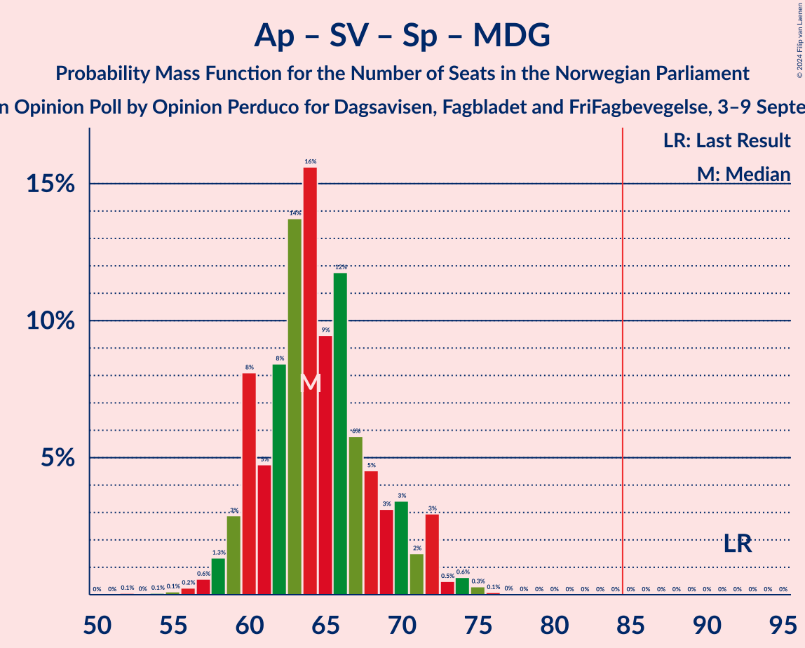

| Number of Seats | Probability | Accumulated | Special Marks |
|:---------------:|:-----------:|:-----------:|:-------------:|
| 52 | 0.1% | 100% |  |
| 53 | 0% | 99.9% |  |
| 54 | 0.1% | 99.9% |  |
| 55 | 0.1% | 99.9% |  |
| 56 | 0.2% | 99.7% |  |
| 57 | 0.6% | 99.5% |  |
| 58 | 1.3% | 98.9% |  |
| 59 | 3% | 98% |  |
| 60 | 8% | 95% |  |
| 61 | 5% | 87% |  |
| 62 | 8% | 82% |  |
| 63 | 14% | 73% | Median |
| 64 | 16% | 60% |  |
| 65 | 9% | 44% |  |
| 66 | 12% | 35% |  |
| 67 | 6% | 23% |  |
| 68 | 5% | 17% |  |
| 69 | 3% | 13% |  |
| 70 | 3% | 9% |  |
| 71 | 2% | 6% |  |
| 72 | 3% | 5% |  |
| 73 | 0.5% | 2% |  |
| 74 | 0.6% | 1.1% |  |
| 75 | 0.3% | 0.4% |  |
| 76 | 0.1% | 0.1% |  |
| 77 | 0% | 0.1% |  |
| 78 | 0% | 0% |  |
| 79 | 0% | 0% |  |
| 80 | 0% | 0% |  |
| 81 | 0% | 0% |  |
| 82 | 0% | 0% |  |
| 83 | 0% | 0% |  |
| 84 | 0% | 0% |  |
| 85 | 0% | 0% | Majority |
| 86 | 0% | 0% |  |
| 87 | 0% | 0% |  |
| 88 | 0% | 0% |  |
| 89 | 0% | 0% |  |
| 90 | 0% | 0% |  |
| 91 | 0% | 0% |  |
| 92 | 0% | 0% | Last Result |

### Arbeiderpartiet – Sosialistisk Venstreparti – Rødt – Miljøpartiet De Grønne

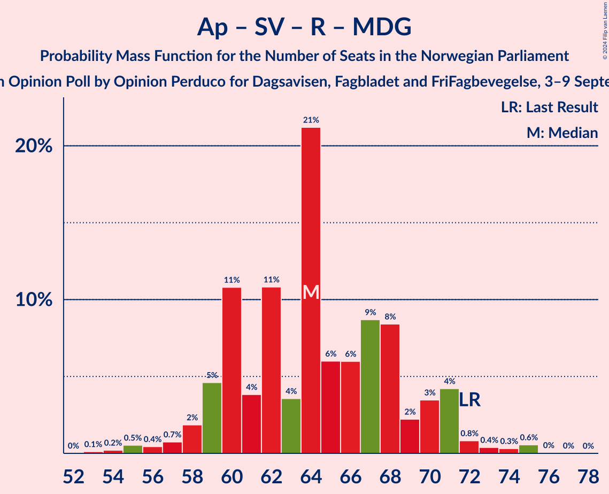

| Number of Seats | Probability | Accumulated | Special Marks |
|:---------------:|:-----------:|:-----------:|:-------------:|
| 53 | 0.1% | 100% |  |
| 54 | 0.2% | 99.8% |  |
| 55 | 0.5% | 99.6% |  |
| 56 | 0.4% | 99.1% |  |
| 57 | 0.7% | 98.7% |  |
| 58 | 2% | 98% |  |
| 59 | 5% | 96% |  |
| 60 | 11% | 91% |  |
| 61 | 4% | 81% |  |
| 62 | 11% | 77% |  |
| 63 | 4% | 66% | Median |
| 64 | 21% | 62% |  |
| 65 | 6% | 41% |  |
| 66 | 6% | 35% |  |
| 67 | 9% | 29% |  |
| 68 | 8% | 21% |  |
| 69 | 2% | 12% |  |
| 70 | 3% | 10% |  |
| 71 | 4% | 6% |  |
| 72 | 0.8% | 2% | Last Result |
| 73 | 0.4% | 1.4% |  |
| 74 | 0.3% | 1.0% |  |
| 75 | 0.6% | 0.7% |  |
| 76 | 0% | 0.1% |  |
| 77 | 0% | 0% |  |

### Arbeiderpartiet – Sosialistisk Venstreparti – Senterpartiet

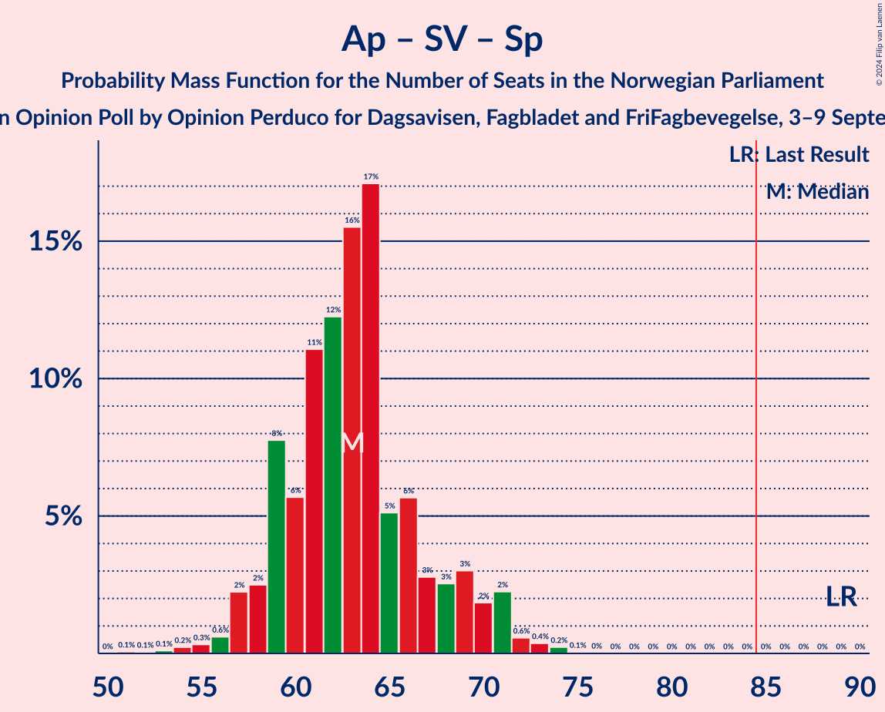

| Number of Seats | Probability | Accumulated | Special Marks |
|:---------------:|:-----------:|:-----------:|:-------------:|
| 51 | 0.1% | 100% |  |
| 52 | 0.1% | 99.9% |  |
| 53 | 0.1% | 99.9% |  |
| 54 | 0.2% | 99.8% |  |
| 55 | 0.3% | 99.5% |  |
| 56 | 0.6% | 99.2% |  |
| 57 | 2% | 98.6% |  |
| 58 | 2% | 96% |  |
| 59 | 8% | 94% |  |
| 60 | 6% | 86% |  |
| 61 | 11% | 80% |  |
| 62 | 12% | 69% | Median |
| 63 | 16% | 57% |  |
| 64 | 17% | 42% |  |
| 65 | 5% | 24% |  |
| 66 | 6% | 19% |  |
| 67 | 3% | 14% |  |
| 68 | 3% | 11% |  |
| 69 | 3% | 8% |  |
| 70 | 2% | 5% |  |
| 71 | 2% | 4% |  |
| 72 | 0.6% | 1.3% |  |
| 73 | 0.4% | 0.7% |  |
| 74 | 0.2% | 0.3% |  |
| 75 | 0.1% | 0.1% |  |
| 76 | 0% | 0% |  |
| 77 | 0% | 0% |  |
| 78 | 0% | 0% |  |
| 79 | 0% | 0% |  |
| 80 | 0% | 0% |  |
| 81 | 0% | 0% |  |
| 82 | 0% | 0% |  |
| 83 | 0% | 0% |  |
| 84 | 0% | 0% |  |
| 85 | 0% | 0% | Majority |
| 86 | 0% | 0% |  |
| 87 | 0% | 0% |  |
| 88 | 0% | 0% |  |
| 89 | 0% | 0% | Last Result |

### Arbeiderpartiet – Sosialistisk Venstreparti

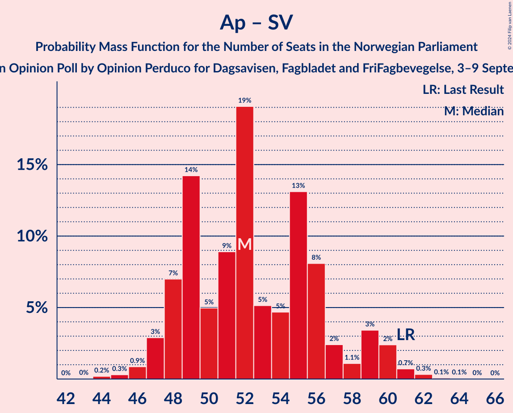

| Number of Seats | Probability | Accumulated | Special Marks |
|:---------------:|:-----------:|:-----------:|:-------------:|
| 44 | 0.2% | 100% |  |
| 45 | 0.3% | 99.8% |  |
| 46 | 0.9% | 99.5% |  |
| 47 | 3% | 98.6% |  |
| 48 | 7% | 96% |  |
| 49 | 14% | 89% |  |
| 50 | 5% | 74% |  |
| 51 | 9% | 70% | Median |
| 52 | 19% | 61% |  |
| 53 | 5% | 42% |  |
| 54 | 5% | 36% |  |
| 55 | 13% | 32% |  |
| 56 | 8% | 19% |  |
| 57 | 2% | 11% |  |
| 58 | 1.1% | 8% |  |
| 59 | 3% | 7% |  |
| 60 | 2% | 4% |  |
| 61 | 0.7% | 1.2% | Last Result |
| 62 | 0.3% | 0.5% |  |
| 63 | 0.1% | 0.2% |  |
| 64 | 0.1% | 0.1% |  |
| 65 | 0% | 0% |  |

### Høyre – Venstre – Kristelig Folkeparti

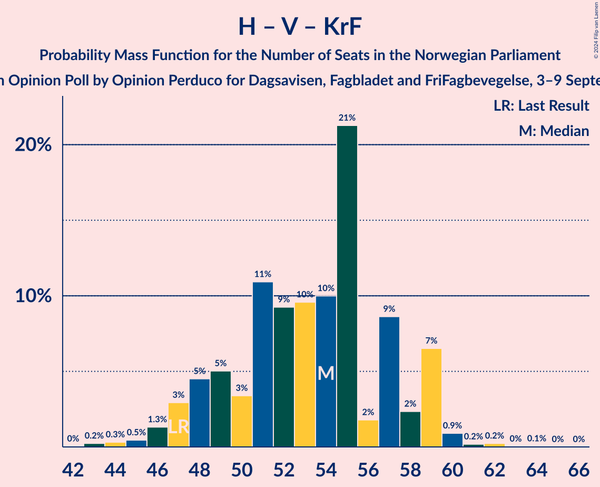

| Number of Seats | Probability | Accumulated | Special Marks |
|:---------------:|:-----------:|:-----------:|:-------------:|
| 42 | 0% | 100% |  |
| 43 | 0.2% | 99.9% |  |
| 44 | 0.3% | 99.7% |  |
| 45 | 0.5% | 99.4% |  |
| 46 | 1.3% | 98.9% |  |
| 47 | 3% | 98% | Last Result |
| 48 | 5% | 95% |  |
| 49 | 5% | 90% |  |
| 50 | 3% | 85% |  |
| 51 | 11% | 82% |  |
| 52 | 9% | 71% |  |
| 53 | 10% | 62% | Median |
| 54 | 10% | 52% |  |
| 55 | 21% | 42% |  |
| 56 | 2% | 21% |  |
| 57 | 9% | 19% |  |
| 58 | 2% | 10% |  |
| 59 | 7% | 8% |  |
| 60 | 0.9% | 1.4% |  |
| 61 | 0.2% | 0.5% |  |
| 62 | 0.2% | 0.3% |  |
| 63 | 0% | 0.1% |  |
| 64 | 0.1% | 0.1% |  |
| 65 | 0% | 0% |  |

### Arbeiderpartiet – Senterpartiet – Miljøpartiet De Grønne – Kristelig Folkeparti

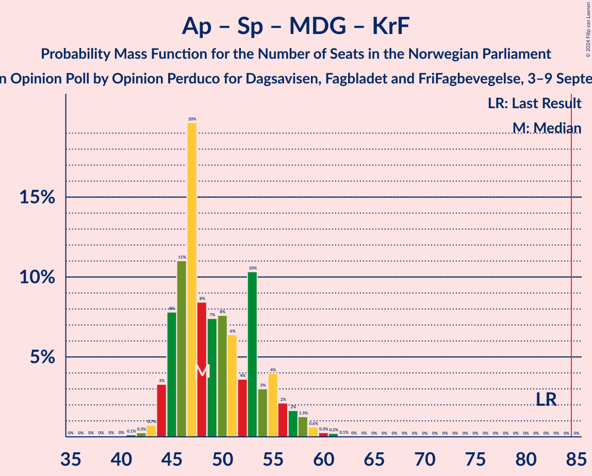

| Number of Seats | Probability | Accumulated | Special Marks |
|:---------------:|:-----------:|:-----------:|:-------------:|
| 37 | 0% | 100% |  |
| 38 | 0% | 99.9% |  |
| 39 | 0% | 99.9% |  |
| 40 | 0% | 99.9% |  |
| 41 | 0.1% | 99.8% |  |
| 42 | 0.3% | 99.7% |  |
| 43 | 0.7% | 99.5% |  |
| 44 | 3% | 98.7% |  |
| 45 | 8% | 95% |  |
| 46 | 11% | 88% |  |
| 47 | 20% | 77% | Median |
| 48 | 8% | 57% |  |
| 49 | 7% | 49% |  |
| 50 | 8% | 41% |  |
| 51 | 6% | 34% |  |
| 52 | 4% | 27% |  |
| 53 | 10% | 24% |  |
| 54 | 3% | 13% |  |
| 55 | 4% | 10% |  |
| 56 | 2% | 6% |  |
| 57 | 2% | 4% |  |
| 58 | 1.3% | 2% |  |
| 59 | 0.6% | 1.2% |  |
| 60 | 0.3% | 0.6% |  |
| 61 | 0.2% | 0.3% |  |
| 62 | 0.1% | 0.1% |  |
| 63 | 0% | 0% |  |
| 64 | 0% | 0% |  |
| 65 | 0% | 0% |  |
| 66 | 0% | 0% |  |
| 67 | 0% | 0% |  |
| 68 | 0% | 0% |  |
| 69 | 0% | 0% |  |
| 70 | 0% | 0% |  |
| 71 | 0% | 0% |  |
| 72 | 0% | 0% |  |
| 73 | 0% | 0% |  |
| 74 | 0% | 0% |  |
| 75 | 0% | 0% |  |
| 76 | 0% | 0% |  |
| 77 | 0% | 0% |  |
| 78 | 0% | 0% |  |
| 79 | 0% | 0% |  |
| 80 | 0% | 0% |  |
| 81 | 0% | 0% |  |
| 82 | 0% | 0% | Last Result |

### Arbeiderpartiet – Senterpartiet – Kristelig Folkeparti

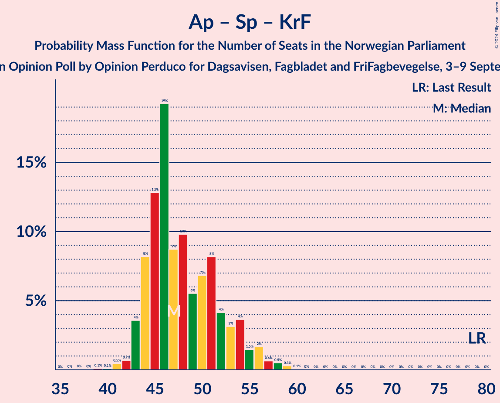

| Number of Seats | Probability | Accumulated | Special Marks |
|:---------------:|:-----------:|:-----------:|:-------------:|
| 36 | 0% | 100% |  |
| 37 | 0% | 99.9% |  |
| 38 | 0% | 99.9% |  |
| 39 | 0.1% | 99.9% |  |
| 40 | 0.1% | 99.8% |  |
| 41 | 0.5% | 99.7% |  |
| 42 | 0.7% | 99.2% |  |
| 43 | 4% | 98.5% |  |
| 44 | 8% | 95% |  |
| 45 | 13% | 87% |  |
| 46 | 19% | 74% | Median |
| 47 | 9% | 55% |  |
| 48 | 10% | 46% |  |
| 49 | 6% | 36% |  |
| 50 | 7% | 31% |  |
| 51 | 8% | 24% |  |
| 52 | 4% | 16% |  |
| 53 | 3% | 11% |  |
| 54 | 4% | 8% |  |
| 55 | 1.5% | 5% |  |
| 56 | 2% | 3% |  |
| 57 | 0.6% | 2% |  |
| 58 | 0.5% | 0.9% |  |
| 59 | 0.3% | 0.4% |  |
| 60 | 0.1% | 0.1% |  |
| 61 | 0% | 0% |  |
| 62 | 0% | 0% |  |
| 63 | 0% | 0% |  |
| 64 | 0% | 0% |  |
| 65 | 0% | 0% |  |
| 66 | 0% | 0% |  |
| 67 | 0% | 0% |  |
| 68 | 0% | 0% |  |
| 69 | 0% | 0% |  |
| 70 | 0% | 0% |  |
| 71 | 0% | 0% |  |
| 72 | 0% | 0% |  |
| 73 | 0% | 0% |  |
| 74 | 0% | 0% |  |
| 75 | 0% | 0% |  |
| 76 | 0% | 0% |  |
| 77 | 0% | 0% |  |
| 78 | 0% | 0% |  |
| 79 | 0% | 0% | Last Result |

### Arbeiderpartiet – Senterpartiet

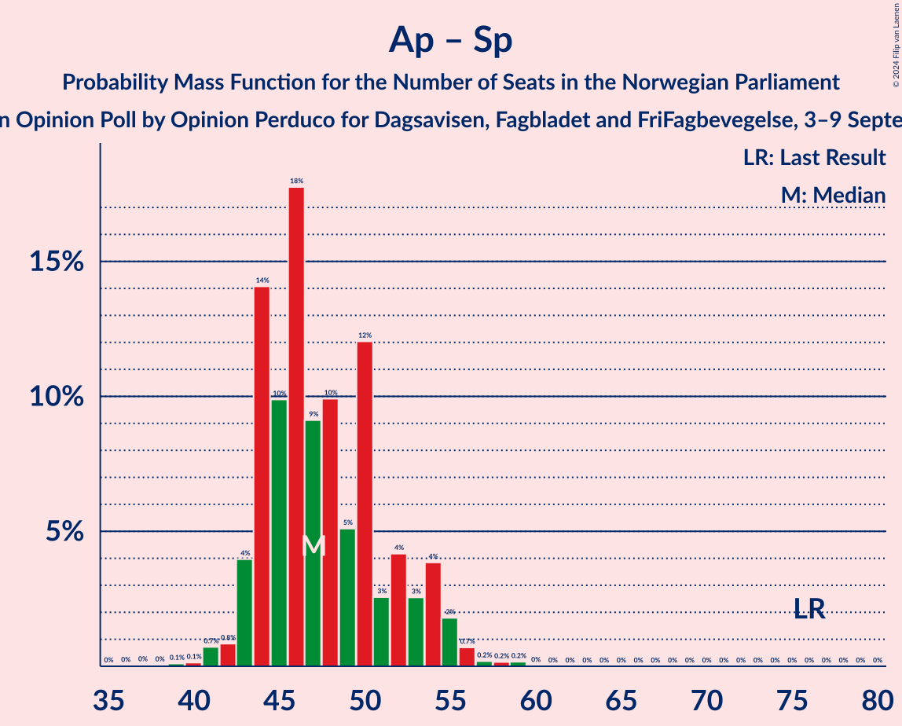

| Number of Seats | Probability | Accumulated | Special Marks |
|:---------------:|:-----------:|:-----------:|:-------------:|
| 36 | 0% | 100% |  |
| 37 | 0% | 99.9% |  |
| 38 | 0% | 99.9% |  |
| 39 | 0.1% | 99.8% |  |
| 40 | 0.1% | 99.7% |  |
| 41 | 0.7% | 99.6% |  |
| 42 | 0.8% | 98.9% |  |
| 43 | 4% | 98% |  |
| 44 | 14% | 94% |  |
| 45 | 10% | 80% |  |
| 46 | 18% | 70% | Median |
| 47 | 9% | 52% |  |
| 48 | 10% | 43% |  |
| 49 | 5% | 33% |  |
| 50 | 12% | 28% |  |
| 51 | 3% | 16% |  |
| 52 | 4% | 14% |  |
| 53 | 3% | 9% |  |
| 54 | 4% | 7% |  |
| 55 | 2% | 3% |  |
| 56 | 0.7% | 1.2% |  |
| 57 | 0.2% | 0.5% |  |
| 58 | 0.2% | 0.4% |  |
| 59 | 0.2% | 0.2% |  |
| 60 | 0% | 0% |  |
| 61 | 0% | 0% |  |
| 62 | 0% | 0% |  |
| 63 | 0% | 0% |  |
| 64 | 0% | 0% |  |
| 65 | 0% | 0% |  |
| 66 | 0% | 0% |  |
| 67 | 0% | 0% |  |
| 68 | 0% | 0% |  |
| 69 | 0% | 0% |  |
| 70 | 0% | 0% |  |
| 71 | 0% | 0% |  |
| 72 | 0% | 0% |  |
| 73 | 0% | 0% |  |
| 74 | 0% | 0% |  |
| 75 | 0% | 0% |  |
| 76 | 0% | 0% | Last Result |

### Senterpartiet – Venstre – Kristelig Folkeparti

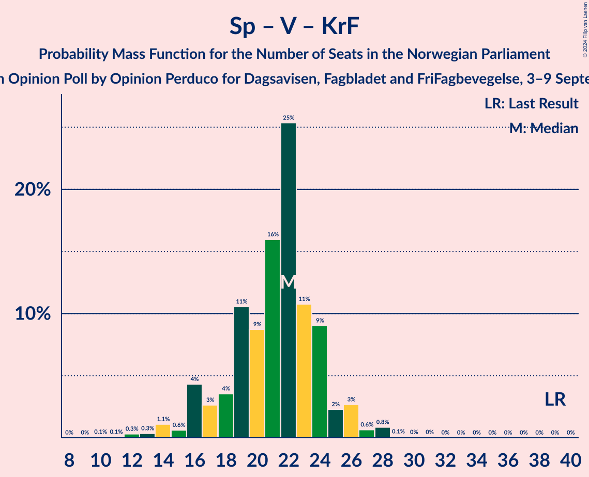

| Number of Seats | Probability | Accumulated | Special Marks |
|:---------------:|:-----------:|:-----------:|:-------------:|
| 10 | 0.1% | 100% |  |
| 11 | 0.1% | 99.9% |  |
| 12 | 0.3% | 99.9% |  |
| 13 | 0.3% | 99.5% |  |
| 14 | 1.1% | 99.2% |  |
| 15 | 0.6% | 98% |  |
| 16 | 4% | 98% |  |
| 17 | 3% | 93% |  |
| 18 | 4% | 91% |  |
| 19 | 11% | 87% |  |
| 20 | 9% | 76% |  |
| 21 | 16% | 68% | Median |
| 22 | 25% | 52% |  |
| 23 | 11% | 26% |  |
| 24 | 9% | 16% |  |
| 25 | 2% | 7% |  |
| 26 | 3% | 4% |  |
| 27 | 0.6% | 2% |  |
| 28 | 0.8% | 1.0% |  |
| 29 | 0.1% | 0.2% |  |
| 30 | 0% | 0.1% |  |
| 31 | 0% | 0.1% |  |
| 32 | 0% | 0% |  |
| 33 | 0% | 0% |  |
| 34 | 0% | 0% |  |
| 35 | 0% | 0% |  |
| 36 | 0% | 0% |  |
| 37 | 0% | 0% |  |
| 38 | 0% | 0% |  |
| 39 | 0% | 0% | Last Result |

## Technical Information

### Opinion Poll

+ **Polling firm:** Opinion Perduco
+ **Commissioner(s):** Dagsavisen, Fagbladet and FriFagbevegelse
+ **Fieldwork period:** 3–9 September 2024

### Calculations

+ **Sample size:** 740
+ **Simulations done:** 1,048,576
+ **Error estimate:** 1.78%

