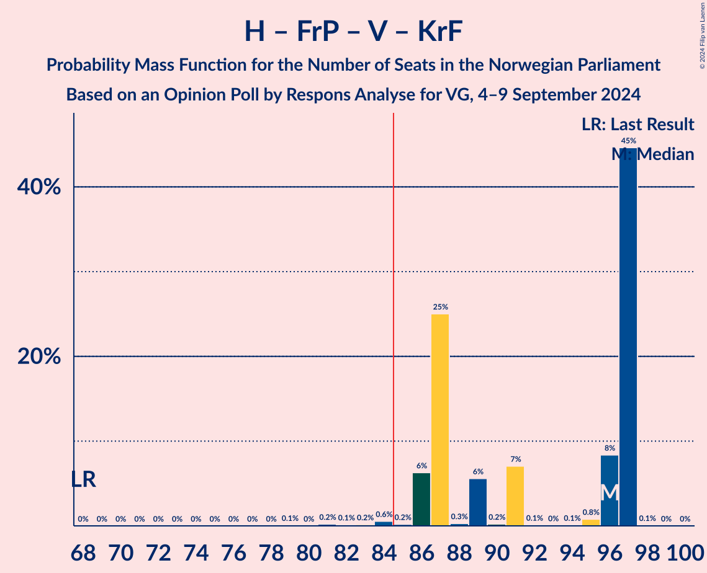
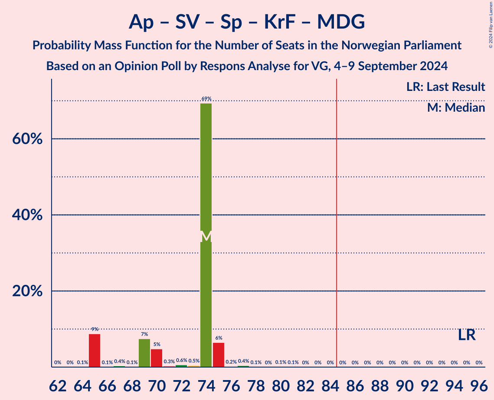

# Opinion Poll by Respons Analyse for VG, 4–9 September 2024

<a href="#voting-intentions">Voting Intentions</a> | <a href="#seats">Seats</a> | <a href="#coalitions">Coalitions</a> | <a href="#technical-information">Technical Information</a>

## Voting Intentions

### Confidence Intervals

| Party | Last Result | Poll Result | 80% Confidence Interval | 90% Confidence Interval | 95% Confidence Interval | 99% Confidence Interval |
|:-----:|:-----------:|:-----------:|:-----------------------:|:-----------------------:|:-----------------------:|:-----------------------:|
| Høyre | 20.4% | 23.6% | 21.9–25.4% |21.5–25.9% |21.1–26.3% |20.3–27.2% |
| Arbeiderpartiet | 26.2% | 21.9% | 20.3–23.7% |19.8–24.1% |19.4–24.6% |18.7–25.4% |
| Fremskrittspartiet | 11.6% | 19.8% | 18.2–21.5% |17.8–22.0% |17.4–22.4% |16.7–23.2% |
| Sosialistisk Venstreparti | 7.6% | 10.6% | 9.4–11.9% |9.1–12.3% |8.8–12.7% |8.3–13.3% |
| Rødt | 4.7% | 5.1% | 4.3–6.1% |4.1–6.4% |3.9–6.6% |3.6–7.2% |
| Venstre | 4.6% | 5.0% | 4.2–6.0% |4.0–6.3% |3.8–6.5% |3.5–7.1% |
| Senterpartiet | 13.5% | 5.0% | 4.2–6.0% |4.0–6.3% |3.8–6.5% |3.5–7.1% |
| Kristelig Folkeparti | 3.8% | 2.9% | 2.3–3.7% |2.2–3.9% |2.0–4.1% |1.8–4.6% |
| Miljøpartiet De Grønne | 3.9% | 2.6% | 2.1–3.4% |1.9–3.6% |1.8–3.8% |1.6–4.2% |
| Industri- og Næringspartiet | 0.3% | 1.7% | 1.3–2.4% |1.2–2.5% |1.1–2.7% |0.9–3.1% |
| Norgesdemokratene | 1.1% | 0.7% | 0.5–1.2% |0.4–1.3% |0.3–1.4% |0.2–1.7% |
| Konservativt | 0.4% | 0.5% | 0.3–0.9% |0.3–1.1% |0.2–1.2% |0.2–1.4% |
| Liberalistene | 0.2% | 0.3% | 0.2–0.7% |0.1–0.8% |0.1–0.9% |0.1–1.1% |
| Pensjonistpartiet | 0.6% | 0.1% | 0.0–0.4% |0.0–0.5% |0.0–0.6% |0.0–0.7% |

*Note:* The poll result column reflects the actual value used in the calculations. Published results may vary slightly, and in addition be rounded to fewer digits.

## Seats

### Confidence Intervals

| Party | Last Result | Median | 80% Confidence Interval | 90% Confidence Interval | 95% Confidence Interval | 99% Confidence Interval |
|:-----:|:-----------:|:------:|:-----------------------:|:-----------------------:|:-----------------------:|:-----------------------:|
| <a href="#høyre">Høyre</a> | 36 | 44 | 38–45 |38–47 |38–47 |38–47 |
| <a href="#arbeiderpartiet">Arbeiderpartiet</a> | 48 | 46 | 38–46 |37–46 |37–46 |37–46 |
| <a href="#fremskrittspartiet">Fremskrittspartiet</a> | 21 | 39 | 35–39 |32–39 |32–39 |31–44 |
| <a href="#sosialistisk-venstreparti">Sosialistisk Venstreparti</a> | 13 | 16 | 16–19 |16–22 |16–22 |16–23 |
| <a href="#rødt">Rødt</a> | 8 | 9 | 1–10 |1–11 |1–11 |1–12 |
| <a href="#venstre">Venstre</a> | 8 | 9 | 8–11 |8–11 |8–11 |3–11 |
| <a href="#senterpartiet">Senterpartiet</a> | 28 | 8 | 8–11 |7–11 |7–11 |7–12 |
| <a href="#kristelig-folkeparti">Kristelig Folkeparti</a> | 3 | 3 | 2–3 |1–3 |1–3 |0–7 |
| <a href="#miljøpartiet-de-grønne">Miljøpartiet De Grønne</a> | 3 | 1 | 1–2 |1–2 |1–2 |1–2 |
| <a href="#industri--og-næringspartiet">Industri- og Næringspartiet</a> | 0 | 0 | 0 |0 |0 |0–2 |
| <a href="#norgesdemokratene">Norgesdemokratene</a> | 0 | 0 | 0 |0 |0 |0 |
| <a href="#konservativt">Konservativt</a> | 0 | 0 | 0 |0 |0 |0 |
| <a href="#liberalistene">Liberalistene</a> | 0 | 0 | 0 |0 |0 |0 |
| <a href="#pensjonistpartiet">Pensjonistpartiet</a> | 0 | 0 | 0 |0 |0 |0 |

### Høyre

*For a full overview of the results for this party, see the [Høyre](party-høyre.html) page.*

| Number of Seats | Probability | Accumulated | Special Marks |
|:---------------:|:-----------:|:-----------:|:-------------:|
| 35 | 0% | 100% |  |
| 36 | 0.2% | 99.9% | Last Result |
| 37 | 0% | 99.8% |  |
| 38 | 19% | 99.7% |  |
| 39 | 0.4% | 81% |  |
| 40 | 2% | 80% |  |
| 41 | 5% | 78% |  |
| 42 | 13% | 73% |  |
| 43 | 0.3% | 61% |  |
| 44 | 45% | 60% | Median |
| 45 | 7% | 15% |  |
| 46 | 0.2% | 9% |  |
| 47 | 8% | 8% |  |
| 48 | 0.1% | 0.3% |  |
| 49 | 0.1% | 0.2% |  |
| 50 | 0% | 0.1% |  |
| 51 | 0% | 0.1% |  |
| 52 | 0% | 0% |  |

### Arbeiderpartiet

*For a full overview of the results for this party, see the [Arbeiderpartiet](party-arbeiderpartiet.html) page.*

| Number of Seats | Probability | Accumulated | Special Marks |
|:---------------:|:-----------:|:-----------:|:-------------:|
| 34 | 0% | 100% |  |
| 35 | 0.3% | 99.9% |  |
| 36 | 0.1% | 99.6% |  |
| 37 | 9% | 99.6% |  |
| 38 | 6% | 91% |  |
| 39 | 0.5% | 85% |  |
| 40 | 32% | 85% |  |
| 41 | 0.3% | 52% |  |
| 42 | 0.3% | 52% |  |
| 43 | 0.2% | 52% |  |
| 44 | 0.2% | 51% |  |
| 45 | 0.1% | 51% |  |
| 46 | 51% | 51% | Median |
| 47 | 0.1% | 0.3% |  |
| 48 | 0% | 0.2% | Last Result |
| 49 | 0.1% | 0.2% |  |
| 50 | 0% | 0% |  |

### Fremskrittspartiet

*For a full overview of the results for this party, see the [Fremskrittspartiet](party-fremskrittspartiet.html) page.*

| Number of Seats | Probability | Accumulated | Special Marks |
|:---------------:|:-----------:|:-----------:|:-------------:|
| 21 | 0% | 100% | Last Result |
| 22 | 0% | 100% |  |
| 23 | 0% | 100% |  |
| 24 | 0% | 100% |  |
| 25 | 0% | 100% |  |
| 26 | 0% | 100% |  |
| 27 | 0% | 100% |  |
| 28 | 0% | 100% |  |
| 29 | 0% | 100% |  |
| 30 | 0% | 100% |  |
| 31 | 0.5% | 99.9% |  |
| 32 | 6% | 99.5% |  |
| 33 | 0.3% | 93% |  |
| 34 | 0.1% | 93% |  |
| 35 | 7% | 93% |  |
| 36 | 6% | 86% |  |
| 37 | 0.3% | 79% |  |
| 38 | 14% | 79% |  |
| 39 | 64% | 65% | Median |
| 40 | 0.2% | 1.3% |  |
| 41 | 0.2% | 1.1% |  |
| 42 | 0.2% | 0.9% |  |
| 43 | 0% | 0.7% |  |
| 44 | 0.7% | 0.7% |  |
| 45 | 0% | 0% |  |

### Sosialistisk Venstreparti

*For a full overview of the results for this party, see the [Sosialistisk Venstreparti](party-sosialistiskvenstreparti.html) page.*

| Number of Seats | Probability | Accumulated | Special Marks |
|:---------------:|:-----------:|:-----------:|:-------------:|
| 13 | 0% | 100% | Last Result |
| 14 | 0% | 100% |  |
| 15 | 0.4% | 100% |  |
| 16 | 53% | 99.5% | Median |
| 17 | 7% | 46% |  |
| 18 | 7% | 39% |  |
| 19 | 24% | 32% |  |
| 20 | 0.5% | 8% |  |
| 21 | 0.4% | 7% |  |
| 22 | 6% | 7% |  |
| 23 | 0.5% | 0.8% |  |
| 24 | 0.1% | 0.3% |  |
| 25 | 0.1% | 0.1% |  |
| 26 | 0% | 0% |  |

### Rødt

*For a full overview of the results for this party, see the [Rødt](party-rødt.html) page.*

| Number of Seats | Probability | Accumulated | Special Marks |
|:---------------:|:-----------:|:-----------:|:-------------:|
| 1 | 45% | 100% |  |
| 2 | 0.1% | 55% |  |
| 3 | 0% | 55% |  |
| 4 | 0% | 55% |  |
| 5 | 0% | 55% |  |
| 6 | 0% | 55% |  |
| 7 | 0.3% | 55% |  |
| 8 | 0.4% | 55% | Last Result |
| 9 | 25% | 54% | Median |
| 10 | 23% | 29% |  |
| 11 | 6% | 6% |  |
| 12 | 0.2% | 0.5% |  |
| 13 | 0.3% | 0.3% |  |
| 14 | 0% | 0% |  |

### Venstre

*For a full overview of the results for this party, see the [Venstre](party-venstre.html) page.*

| Number of Seats | Probability | Accumulated | Special Marks |
|:---------------:|:-----------:|:-----------:|:-------------:|
| 2 | 0.2% | 100% |  |
| 3 | 0.5% | 99.8% |  |
| 4 | 0% | 99.3% |  |
| 5 | 0% | 99.3% |  |
| 6 | 0% | 99.3% |  |
| 7 | 0.4% | 99.3% |  |
| 8 | 38% | 98.9% | Last Result |
| 9 | 15% | 61% | Median |
| 10 | 0.9% | 46% |  |
| 11 | 45% | 45% |  |
| 12 | 0.1% | 0.2% |  |
| 13 | 0.1% | 0.1% |  |
| 14 | 0.1% | 0.1% |  |
| 15 | 0% | 0% |  |

### Senterpartiet

*For a full overview of the results for this party, see the [Senterpartiet](party-senterpartiet.html) page.*

| Number of Seats | Probability | Accumulated | Special Marks |
|:---------------:|:-----------:|:-----------:|:-------------:|
| 0 | 0.2% | 100% |  |
| 1 | 0.2% | 99.8% |  |
| 2 | 0% | 99.5% |  |
| 3 | 0% | 99.5% |  |
| 4 | 0% | 99.5% |  |
| 5 | 0% | 99.5% |  |
| 6 | 0% | 99.5% |  |
| 7 | 7% | 99.5% |  |
| 8 | 60% | 93% | Median |
| 9 | 13% | 33% |  |
| 10 | 0.4% | 20% |  |
| 11 | 19% | 19% |  |
| 12 | 0.4% | 0.7% |  |
| 13 | 0.3% | 0.3% |  |
| 14 | 0% | 0% |  |
| 15 | 0% | 0% |  |
| 16 | 0% | 0% |  |
| 17 | 0% | 0% |  |
| 18 | 0% | 0% |  |
| 19 | 0% | 0% |  |
| 20 | 0% | 0% |  |
| 21 | 0% | 0% |  |
| 22 | 0% | 0% |  |
| 23 | 0% | 0% |  |
| 24 | 0% | 0% |  |
| 25 | 0% | 0% |  |
| 26 | 0% | 0% |  |
| 27 | 0% | 0% |  |
| 28 | 0% | 0% | Last Result |

### Kristelig Folkeparti

*For a full overview of the results for this party, see the [Kristelig Folkeparti](party-kristeligfolkeparti.html) page.*

| Number of Seats | Probability | Accumulated | Special Marks |
|:---------------:|:-----------:|:-----------:|:-------------:|
| 0 | 0.9% | 100% |  |
| 1 | 7% | 99.1% |  |
| 2 | 32% | 92% |  |
| 3 | 59% | 60% | Last Result, Median |
| 4 | 0% | 0.6% |  |
| 5 | 0% | 0.6% |  |
| 6 | 0% | 0.6% |  |
| 7 | 0.1% | 0.6% |  |
| 8 | 0.3% | 0.4% |  |
| 9 | 0.1% | 0.1% |  |
| 10 | 0% | 0% |  |

### Miljøpartiet De Grønne

*For a full overview of the results for this party, see the [Miljøpartiet De Grønne](party-miljøpartietdegrønne.html) page.*

| Number of Seats | Probability | Accumulated | Special Marks |
|:---------------:|:-----------:|:-----------:|:-------------:|
| 0 | 0.2% | 100% |  |
| 1 | 63% | 99.8% | Median |
| 2 | 36% | 37% |  |
| 3 | 0% | 0.5% | Last Result |
| 4 | 0% | 0.4% |  |
| 5 | 0% | 0.4% |  |
| 6 | 0% | 0.4% |  |
| 7 | 0.1% | 0.4% |  |
| 8 | 0.3% | 0.3% |  |
| 9 | 0% | 0% |  |

### Industri- og Næringspartiet

*For a full overview of the results for this party, see the [Industri- og Næringspartiet](party-industri-ognæringspartiet.html) page.*

| Number of Seats | Probability | Accumulated | Special Marks |
|:---------------:|:-----------:|:-----------:|:-------------:|
| 0 | 98.5% | 100% | Last Result, Median |
| 1 | 0.1% | 1.5% |  |
| 2 | 1.3% | 1.3% |  |
| 3 | 0% | 0% |  |

### Norgesdemokratene

*For a full overview of the results for this party, see the [Norgesdemokratene](party-norgesdemokratene.html) page.*

| Number of Seats | Probability | Accumulated | Special Marks |
|:---------------:|:-----------:|:-----------:|:-------------:|
| 0 | 100% | 100% | Last Result, Median |

### Konservativt

*For a full overview of the results for this party, see the [Konservativt](party-konservativt.html) page.*

| Number of Seats | Probability | Accumulated | Special Marks |
|:---------------:|:-----------:|:-----------:|:-------------:|
| 0 | 100% | 100% | Last Result, Median |

### Liberalistene

*For a full overview of the results for this party, see the [Liberalistene](party-liberalistene.html) page.*

| Number of Seats | Probability | Accumulated | Special Marks |
|:---------------:|:-----------:|:-----------:|:-------------:|
| 0 | 100% | 100% | Last Result, Median |

### Pensjonistpartiet

*For a full overview of the results for this party, see the [Pensjonistpartiet](party-pensjonistpartiet.html) page.*

| Number of Seats | Probability | Accumulated | Special Marks |
|:---------------:|:-----------:|:-----------:|:-------------:|
| 0 | 100% | 100% | Last Result, Median |

## Coalitions

### Confidence Intervals

| Coalition | Last Result | Median | Majority? | 80% Confidence Interval | 90% Confidence Interval | 95% Confidence Interval | 99% Confidence Interval |
|:---------:|:-----------:|:------:|:---------:|:-----------------------:|:-----------------------:|:-----------------------:|:-----------------------:|
| Høyre – Fremskrittspartiet – Senterpartiet – Venstre – Kristelig Folkeparti | 96 | 104 | 100% | 94–105 | 94–105 | 94–105 | 92–105 |
| Høyre – Fremskrittspartiet – Venstre – Kristelig Folkeparti – Miljøpartiet De Grønne | 71 | 97 | 99.5% | 89–98 | 88–98 | 88–98 | 84–98 |
| Høyre – Fremskrittspartiet – Venstre – Kristelig Folkeparti | 68 | 96 | 98.8% | 87–97 | 86–97 | 86–97 | 83–97 |
| Høyre – Fremskrittspartiet – Venstre | 65 | 93 | 92% | 85–94 | 83–94 | 83–94 | 80–94 |
| Høyre – Fremskrittspartiet | 57 | 83 | 8% | 77–83 | 74–85 | 74–85 | 73–85 |
| Arbeiderpartiet – Sosialistisk Venstreparti – Rødt – Senterpartiet – Miljøpartiet De Grønne | 100 | 72 | 0.6% | 72–82 | 72–82 | 72–82 | 72–86 |
| Arbeiderpartiet – Sosialistisk Venstreparti – Rødt – Senterpartiet | 97 | 71 | 0.4% | 71–80 | 71–80 | 71–80 | 71–84 |
| Arbeiderpartiet – Sosialistisk Venstreparti – Senterpartiet – Kristelig Folkeparti – Miljøpartiet De Grønne | 95 | 74 | 0% | 69–74 | 65–75 | 65–75 | 65–77 |
| Arbeiderpartiet – Sosialistisk Venstreparti – Rødt – Miljøpartiet De Grønne | 72 | 64 | 0% | 64–74 | 64–75 | 64–75 | 64–76 |
| Arbeiderpartiet – Sosialistisk Venstreparti – Senterpartiet – Miljøpartiet De Grønne | 92 | 71 | 0% | 67–72 | 62–73 | 62–73 | 62–74 |
| Arbeiderpartiet – Sosialistisk Venstreparti – Senterpartiet | 89 | 70 | 0% | 66–70 | 61–71 | 61–71 | 61–73 |
| Arbeiderpartiet – Sosialistisk Venstreparti | 61 | 62 | 0% | 57–62 | 53–64 | 53–64 | 53–64 |
| Arbeiderpartiet – Senterpartiet – Kristelig Folkeparti – Miljøpartiet De Grønne | 82 | 56 | 0% | 50–58 | 49–58 | 49–58 | 47–59 |
| Høyre – Venstre – Kristelig Folkeparti | 47 | 58 | 0% | 48–58 | 48–58 | 48–58 | 48–58 |
| Arbeiderpartiet – Senterpartiet – Kristelig Folkeparti | 79 | 54 | 0% | 48–57 | 48–57 | 48–57 | 46–57 |
| Arbeiderpartiet – Senterpartiet | 76 | 53 | 0% | 47–54 | 45–54 | 45–54 | 45–54 |
| Senterpartiet – Venstre – Kristelig Folkeparti | 39 | 21 | 0% | 19–22 | 16–22 | 16–22 | 13–25 |

### Høyre – Fremskrittspartiet – Senterpartiet – Venstre – Kristelig Folkeparti

| Number of Seats | Probability | Accumulated | Special Marks |
|:---------------:|:-----------:|:-----------:|:-------------:|
| 87 | 0.1% | 100% |  |
| 88 | 0% | 99.9% |  |
| 89 | 0.1% | 99.9% |  |
| 90 | 0% | 99.8% |  |
| 91 | 0.1% | 99.8% |  |
| 92 | 0.6% | 99.7% |  |
| 93 | 0.5% | 99.1% |  |
| 94 | 12% | 98.6% |  |
| 95 | 0.4% | 86% |  |
| 96 | 0.3% | 86% | Last Result |
| 97 | 0.4% | 86% |  |
| 98 | 24% | 85% |  |
| 99 | 0.1% | 61% |  |
| 100 | 7% | 61% |  |
| 101 | 0.2% | 54% |  |
| 102 | 0.1% | 54% |  |
| 103 | 0.9% | 54% | Median |
| 104 | 8% | 53% |  |
| 105 | 45% | 45% |  |
| 106 | 0% | 0.1% |  |
| 107 | 0% | 0% |  |

### Høyre – Fremskrittspartiet – Venstre – Kristelig Folkeparti – Miljøpartiet De Grønne

| Number of Seats | Probability | Accumulated | Special Marks |
|:---------------:|:-----------:|:-----------:|:-------------:|
| 71 | 0% | 100% | Last Result |
| 72 | 0% | 100% |  |
| 73 | 0% | 100% |  |
| 74 | 0% | 100% |  |
| 75 | 0% | 100% |  |
| 76 | 0% | 100% |  |
| 77 | 0% | 100% |  |
| 78 | 0% | 100% |  |
| 79 | 0% | 100% |  |
| 80 | 0% | 100% |  |
| 81 | 0% | 100% |  |
| 82 | 0.2% | 100% |  |
| 83 | 0% | 99.8% |  |
| 84 | 0.3% | 99.8% |  |
| 85 | 0.4% | 99.5% | Majority |
| 86 | 0.4% | 99.1% |  |
| 87 | 0.2% | 98.8% |  |
| 88 | 6% | 98.5% |  |
| 89 | 25% | 92% |  |
| 90 | 0.8% | 67% |  |
| 91 | 5% | 67% |  |
| 92 | 7% | 62% |  |
| 93 | 0.2% | 55% |  |
| 94 | 0.1% | 54% |  |
| 95 | 0.1% | 54% |  |
| 96 | 0.8% | 54% | Median |
| 97 | 9% | 53% |  |
| 98 | 45% | 45% |  |
| 99 | 0.1% | 0.2% |  |
| 100 | 0% | 0% |  |

### Høyre – Fremskrittspartiet – Venstre – Kristelig Folkeparti

| Number of Seats | Probability | Accumulated | Special Marks |
|:---------------:|:-----------:|:-----------:|:-------------:|
| 68 | 0% | 100% | Last Result |
| 69 | 0% | 100% |  |
| 70 | 0% | 100% |  |
| 71 | 0% | 100% |  |
| 72 | 0% | 100% |  |
| 73 | 0% | 100% |  |
| 74 | 0% | 100% |  |
| 75 | 0% | 100% |  |
| 76 | 0% | 100% |  |
| 77 | 0% | 100% |  |
| 78 | 0% | 100% |  |
| 79 | 0.1% | 100% |  |
| 80 | 0% | 99.9% |  |
| 81 | 0.2% | 99.9% |  |
| 82 | 0.1% | 99.7% |  |
| 83 | 0.2% | 99.6% |  |
| 84 | 0.6% | 99.4% |  |
| 85 | 0.2% | 98.8% | Majority |
| 86 | 6% | 98.7% |  |
| 87 | 25% | 92% |  |
| 88 | 0.3% | 67% |  |
| 89 | 6% | 67% |  |
| 90 | 0.2% | 61% |  |
| 91 | 7% | 61% |  |
| 92 | 0.1% | 54% |  |
| 93 | 0% | 54% |  |
| 94 | 0.1% | 54% |  |
| 95 | 0.8% | 54% | Median |
| 96 | 8% | 53% |  |
| 97 | 45% | 45% |  |
| 98 | 0.1% | 0.1% |  |
| 99 | 0% | 0% |  |

### Høyre – Fremskrittspartiet – Venstre

| Number of Seats | Probability | Accumulated | Special Marks |
|:---------------:|:-----------:|:-----------:|:-------------:|
| 65 | 0% | 100% | Last Result |
| 66 | 0% | 100% |  |
| 67 | 0% | 100% |  |
| 68 | 0% | 100% |  |
| 69 | 0% | 100% |  |
| 70 | 0% | 100% |  |
| 71 | 0% | 100% |  |
| 72 | 0% | 100% |  |
| 73 | 0% | 100% |  |
| 74 | 0% | 100% |  |
| 75 | 0% | 100% |  |
| 76 | 0% | 100% |  |
| 77 | 0.1% | 100% |  |
| 78 | 0.2% | 99.9% |  |
| 79 | 0.2% | 99.7% |  |
| 80 | 0.1% | 99.5% |  |
| 81 | 0.2% | 99.4% |  |
| 82 | 0.3% | 99.2% |  |
| 83 | 6% | 98.9% |  |
| 84 | 0.7% | 93% |  |
| 85 | 19% | 92% | Majority |
| 86 | 6% | 73% |  |
| 87 | 5% | 67% |  |
| 88 | 0.6% | 62% |  |
| 89 | 7% | 61% |  |
| 90 | 0.3% | 54% |  |
| 91 | 0.2% | 54% |  |
| 92 | 0.1% | 54% | Median |
| 93 | 9% | 54% |  |
| 94 | 45% | 45% |  |
| 95 | 0.1% | 0.2% |  |
| 96 | 0% | 0.1% |  |
| 97 | 0.1% | 0.1% |  |
| 98 | 0% | 0% |  |

### Høyre – Fremskrittspartiet

| Number of Seats | Probability | Accumulated | Special Marks |
|:---------------:|:-----------:|:-----------:|:-------------:|
| 57 | 0% | 100% | Last Result |
| 58 | 0% | 100% |  |
| 59 | 0% | 100% |  |
| 60 | 0% | 100% |  |
| 61 | 0% | 100% |  |
| 62 | 0% | 100% |  |
| 63 | 0% | 100% |  |
| 64 | 0% | 100% |  |
| 65 | 0% | 100% |  |
| 66 | 0% | 100% |  |
| 67 | 0% | 100% |  |
| 68 | 0% | 100% |  |
| 69 | 0.2% | 100% |  |
| 70 | 0% | 99.8% |  |
| 71 | 0.2% | 99.8% |  |
| 72 | 0.1% | 99.6% |  |
| 73 | 0.3% | 99.5% |  |
| 74 | 6% | 99.2% |  |
| 75 | 0.5% | 93% |  |
| 76 | 0.4% | 93% |  |
| 77 | 19% | 92% |  |
| 78 | 7% | 73% |  |
| 79 | 5% | 66% |  |
| 80 | 7% | 61% |  |
| 81 | 0.2% | 54% |  |
| 82 | 0.2% | 54% |  |
| 83 | 45% | 54% | Median |
| 84 | 0.8% | 9% |  |
| 85 | 8% | 8% | Majority |
| 86 | 0.1% | 0.3% |  |
| 87 | 0.1% | 0.2% |  |
| 88 | 0% | 0.1% |  |
| 89 | 0% | 0.1% |  |
| 90 | 0% | 0% |  |

### Arbeiderpartiet – Sosialistisk Venstreparti – Rødt – Senterpartiet – Miljøpartiet De Grønne

| Number of Seats | Probability | Accumulated | Special Marks |
|:---------------:|:-----------:|:-----------:|:-------------:|
| 70 | 0% | 100% |  |
| 71 | 0.1% | 99.9% |  |
| 72 | 53% | 99.8% |  |
| 73 | 0.8% | 47% |  |
| 74 | 0.1% | 46% |  |
| 75 | 0% | 46% |  |
| 76 | 0.1% | 46% |  |
| 77 | 8% | 46% |  |
| 78 | 0.3% | 38% |  |
| 79 | 5% | 38% |  |
| 80 | 0.3% | 33% | Median |
| 81 | 19% | 32% |  |
| 82 | 13% | 14% |  |
| 83 | 0.2% | 1.0% |  |
| 84 | 0.2% | 0.8% |  |
| 85 | 0% | 0.6% | Majority |
| 86 | 0.3% | 0.6% |  |
| 87 | 0.2% | 0.3% |  |
| 88 | 0% | 0.1% |  |
| 89 | 0.1% | 0.1% |  |
| 90 | 0% | 0% |  |
| 91 | 0% | 0% |  |
| 92 | 0% | 0% |  |
| 93 | 0% | 0% |  |
| 94 | 0% | 0% |  |
| 95 | 0% | 0% |  |
| 96 | 0% | 0% |  |
| 97 | 0% | 0% |  |
| 98 | 0% | 0% |  |
| 99 | 0% | 0% |  |
| 100 | 0% | 0% | Last Result |

### Arbeiderpartiet – Sosialistisk Venstreparti – Rødt – Senterpartiet

| Number of Seats | Probability | Accumulated | Special Marks |
|:---------------:|:-----------:|:-----------:|:-------------:|
| 69 | 0.1% | 100% |  |
| 70 | 0.1% | 99.9% |  |
| 71 | 53% | 99.8% |  |
| 72 | 0.8% | 47% |  |
| 73 | 0.2% | 46% |  |
| 74 | 0.1% | 46% |  |
| 75 | 0.1% | 46% |  |
| 76 | 8% | 45% |  |
| 77 | 5% | 38% |  |
| 78 | 0.2% | 33% |  |
| 79 | 19% | 33% | Median |
| 80 | 12% | 14% |  |
| 81 | 0.5% | 1.4% |  |
| 82 | 0.4% | 0.9% |  |
| 83 | 0% | 0.6% |  |
| 84 | 0.1% | 0.5% |  |
| 85 | 0.2% | 0.4% | Majority |
| 86 | 0.2% | 0.2% |  |
| 87 | 0% | 0% |  |
| 88 | 0% | 0% |  |
| 89 | 0% | 0% |  |
| 90 | 0% | 0% |  |
| 91 | 0% | 0% |  |
| 92 | 0% | 0% |  |
| 93 | 0% | 0% |  |
| 94 | 0% | 0% |  |
| 95 | 0% | 0% |  |
| 96 | 0% | 0% |  |
| 97 | 0% | 0% | Last Result |

### Arbeiderpartiet – Sosialistisk Venstreparti – Senterpartiet – Kristelig Folkeparti – Miljøpartiet De Grønne

| Number of Seats | Probability | Accumulated | Special Marks |
|:---------------:|:-----------:|:-----------:|:-------------:|
| 62 | 0% | 100% |  |
| 63 | 0% | 99.9% |  |
| 64 | 0.1% | 99.9% |  |
| 65 | 9% | 99.8% |  |
| 66 | 0.1% | 91% |  |
| 67 | 0.4% | 91% |  |
| 68 | 0.1% | 91% |  |
| 69 | 7% | 91% |  |
| 70 | 5% | 83% |  |
| 71 | 0.3% | 78% |  |
| 72 | 0.6% | 78% |  |
| 73 | 0.5% | 77% |  |
| 74 | 69% | 77% | Median |
| 75 | 6% | 7% |  |
| 76 | 0.2% | 1.0% |  |
| 77 | 0.4% | 0.8% |  |
| 78 | 0.1% | 0.3% |  |
| 79 | 0% | 0.3% |  |
| 80 | 0.1% | 0.3% |  |
| 81 | 0.1% | 0.1% |  |
| 82 | 0% | 0% |  |
| 83 | 0% | 0% |  |
| 84 | 0% | 0% |  |
| 85 | 0% | 0% | Majority |
| 86 | 0% | 0% |  |
| 87 | 0% | 0% |  |
| 88 | 0% | 0% |  |
| 89 | 0% | 0% |  |
| 90 | 0% | 0% |  |
| 91 | 0% | 0% |  |
| 92 | 0% | 0% |  |
| 93 | 0% | 0% |  |
| 94 | 0% | 0% |  |
| 95 | 0% | 0% | Last Result |

### Arbeiderpartiet – Sosialistisk Venstreparti – Rødt – Miljøpartiet De Grønne

| Number of Seats | Probability | Accumulated | Special Marks |
|:---------------:|:-----------:|:-----------:|:-------------:|
| 62 | 0% | 100% |  |
| 63 | 0.1% | 99.9% |  |
| 64 | 53% | 99.8% |  |
| 65 | 0.9% | 47% |  |
| 66 | 0.1% | 46% |  |
| 67 | 0.2% | 46% |  |
| 68 | 8% | 46% |  |
| 69 | 0.2% | 38% |  |
| 70 | 23% | 38% |  |
| 71 | 0.4% | 15% |  |
| 72 | 0.3% | 14% | Last Result, Median |
| 73 | 0.4% | 14% |  |
| 74 | 6% | 14% |  |
| 75 | 6% | 7% |  |
| 76 | 0.3% | 0.7% |  |
| 77 | 0.2% | 0.4% |  |
| 78 | 0.1% | 0.2% |  |
| 79 | 0% | 0.1% |  |
| 80 | 0% | 0.1% |  |
| 81 | 0.1% | 0.1% |  |
| 82 | 0% | 0% |  |

### Arbeiderpartiet – Sosialistisk Venstreparti – Senterpartiet – Miljøpartiet De Grønne

| Number of Seats | Probability | Accumulated | Special Marks |
|:---------------:|:-----------:|:-----------:|:-------------:|
| 61 | 0% | 100% |  |
| 62 | 8% | 99.9% |  |
| 63 | 0.7% | 92% |  |
| 64 | 0.1% | 91% |  |
| 65 | 0.3% | 91% |  |
| 66 | 0.2% | 91% |  |
| 67 | 8% | 91% |  |
| 68 | 5% | 83% |  |
| 69 | 0.1% | 78% |  |
| 70 | 0.5% | 78% |  |
| 71 | 45% | 77% | Median |
| 72 | 25% | 33% |  |
| 73 | 6% | 7% |  |
| 74 | 0.3% | 0.8% |  |
| 75 | 0.2% | 0.5% |  |
| 76 | 0.1% | 0.3% |  |
| 77 | 0% | 0.2% |  |
| 78 | 0% | 0.2% |  |
| 79 | 0.1% | 0.1% |  |
| 80 | 0% | 0% |  |
| 81 | 0% | 0% |  |
| 82 | 0% | 0% |  |
| 83 | 0% | 0% |  |
| 84 | 0% | 0% |  |
| 85 | 0% | 0% | Majority |
| 86 | 0% | 0% |  |
| 87 | 0% | 0% |  |
| 88 | 0% | 0% |  |
| 89 | 0% | 0% |  |
| 90 | 0% | 0% |  |
| 91 | 0% | 0% |  |
| 92 | 0% | 0% | Last Result |

### Arbeiderpartiet – Sosialistisk Venstreparti – Senterpartiet

| Number of Seats | Probability | Accumulated | Special Marks |
|:---------------:|:-----------:|:-----------:|:-------------:|
| 59 | 0.1% | 100% |  |
| 60 | 0% | 99.9% |  |
| 61 | 8% | 99.9% |  |
| 62 | 0.9% | 92% |  |
| 63 | 0.1% | 91% |  |
| 64 | 0.3% | 91% |  |
| 65 | 0.4% | 91% |  |
| 66 | 12% | 90% |  |
| 67 | 0.2% | 78% |  |
| 68 | 0.2% | 78% |  |
| 69 | 0.2% | 77% |  |
| 70 | 69% | 77% | Median |
| 71 | 7% | 8% |  |
| 72 | 0.2% | 0.8% |  |
| 73 | 0.3% | 0.7% |  |
| 74 | 0.3% | 0.4% |  |
| 75 | 0% | 0.1% |  |
| 76 | 0% | 0.1% |  |
| 77 | 0% | 0% |  |
| 78 | 0% | 0% |  |
| 79 | 0% | 0% |  |
| 80 | 0% | 0% |  |
| 81 | 0% | 0% |  |
| 82 | 0% | 0% |  |
| 83 | 0% | 0% |  |
| 84 | 0% | 0% |  |
| 85 | 0% | 0% | Majority |
| 86 | 0% | 0% |  |
| 87 | 0% | 0% |  |
| 88 | 0% | 0% |  |
| 89 | 0% | 0% | Last Result |

### Arbeiderpartiet – Sosialistisk Venstreparti

| Number of Seats | Probability | Accumulated | Special Marks |
|:---------------:|:-----------:|:-----------:|:-------------:|
| 52 | 0% | 100% |  |
| 53 | 8% | 99.9% |  |
| 54 | 0.8% | 92% |  |
| 55 | 0.2% | 91% |  |
| 56 | 0.2% | 91% |  |
| 57 | 13% | 91% |  |
| 58 | 0.4% | 78% |  |
| 59 | 19% | 78% |  |
| 60 | 0.1% | 59% |  |
| 61 | 0.3% | 59% | Last Result |
| 62 | 51% | 58% | Median |
| 63 | 0.7% | 8% |  |
| 64 | 7% | 7% |  |
| 65 | 0.1% | 0.4% |  |
| 66 | 0.2% | 0.3% |  |
| 67 | 0% | 0.1% |  |
| 68 | 0% | 0.1% |  |
| 69 | 0.1% | 0.1% |  |
| 70 | 0% | 0% |  |

### Arbeiderpartiet – Senterpartiet – Kristelig Folkeparti – Miljøpartiet De Grønne

| Number of Seats | Probability | Accumulated | Special Marks |
|:---------------:|:-----------:|:-----------:|:-------------:|
| 43 | 0% | 100% |  |
| 44 | 0.1% | 99.9% |  |
| 45 | 0% | 99.8% |  |
| 46 | 0.1% | 99.8% |  |
| 47 | 0.1% | 99.6% |  |
| 48 | 0.7% | 99.5% |  |
| 49 | 9% | 98.8% |  |
| 50 | 0.8% | 90% |  |
| 51 | 5% | 89% |  |
| 52 | 7% | 85% |  |
| 53 | 6% | 78% |  |
| 54 | 0.1% | 71% |  |
| 55 | 19% | 71% |  |
| 56 | 6% | 52% |  |
| 57 | 0.4% | 46% |  |
| 58 | 45% | 45% | Median |
| 59 | 0.2% | 0.5% |  |
| 60 | 0.2% | 0.3% |  |
| 61 | 0.1% | 0.1% |  |
| 62 | 0% | 0.1% |  |
| 63 | 0% | 0% |  |
| 64 | 0% | 0% |  |
| 65 | 0% | 0% |  |
| 66 | 0% | 0% |  |
| 67 | 0% | 0% |  |
| 68 | 0% | 0% |  |
| 69 | 0% | 0% |  |
| 70 | 0% | 0% |  |
| 71 | 0% | 0% |  |
| 72 | 0% | 0% |  |
| 73 | 0% | 0% |  |
| 74 | 0% | 0% |  |
| 75 | 0% | 0% |  |
| 76 | 0% | 0% |  |
| 77 | 0% | 0% |  |
| 78 | 0% | 0% |  |
| 79 | 0% | 0% |  |
| 80 | 0% | 0% |  |
| 81 | 0% | 0% |  |
| 82 | 0% | 0% | Last Result |

### Høyre – Venstre – Kristelig Folkeparti

| Number of Seats | Probability | Accumulated | Special Marks |
|:---------------:|:-----------:|:-----------:|:-------------:|
| 45 | 0.1% | 100% |  |
| 46 | 0.2% | 99.9% |  |
| 47 | 0.1% | 99.7% | Last Result |
| 48 | 19% | 99.6% |  |
| 49 | 0.6% | 81% |  |
| 50 | 0.9% | 80% |  |
| 51 | 12% | 79% |  |
| 52 | 0.3% | 67% |  |
| 53 | 0.4% | 67% |  |
| 54 | 6% | 66% |  |
| 55 | 0.2% | 60% |  |
| 56 | 7% | 60% | Median |
| 57 | 0.2% | 53% |  |
| 58 | 53% | 53% |  |
| 59 | 0.1% | 0.2% |  |
| 60 | 0.1% | 0.1% |  |
| 61 | 0% | 0% |  |

### Arbeiderpartiet – Senterpartiet – Kristelig Folkeparti

| Number of Seats | Probability | Accumulated | Special Marks |
|:---------------:|:-----------:|:-----------:|:-------------:|
| 41 | 0% | 100% |  |
| 42 | 0.1% | 99.9% |  |
| 43 | 0.1% | 99.9% |  |
| 44 | 0% | 99.8% |  |
| 45 | 0.2% | 99.8% |  |
| 46 | 0.1% | 99.5% |  |
| 47 | 1.0% | 99.5% |  |
| 48 | 9% | 98.5% |  |
| 49 | 5% | 90% |  |
| 50 | 0.3% | 84% |  |
| 51 | 13% | 84% |  |
| 52 | 0.4% | 71% |  |
| 53 | 19% | 71% |  |
| 54 | 6% | 52% |  |
| 55 | 0.5% | 46% |  |
| 56 | 0.2% | 45% |  |
| 57 | 45% | 45% | Median |
| 58 | 0.2% | 0.5% |  |
| 59 | 0.1% | 0.3% |  |
| 60 | 0.1% | 0.2% |  |
| 61 | 0% | 0% |  |
| 62 | 0% | 0% |  |
| 63 | 0% | 0% |  |
| 64 | 0% | 0% |  |
| 65 | 0% | 0% |  |
| 66 | 0% | 0% |  |
| 67 | 0% | 0% |  |
| 68 | 0% | 0% |  |
| 69 | 0% | 0% |  |
| 70 | 0% | 0% |  |
| 71 | 0% | 0% |  |
| 72 | 0% | 0% |  |
| 73 | 0% | 0% |  |
| 74 | 0% | 0% |  |
| 75 | 0% | 0% |  |
| 76 | 0% | 0% |  |
| 77 | 0% | 0% |  |
| 78 | 0% | 0% |  |
| 79 | 0% | 0% | Last Result |

### Arbeiderpartiet – Senterpartiet

| Number of Seats | Probability | Accumulated | Special Marks |
|:---------------:|:-----------:|:-----------:|:-------------:|
| 40 | 0.1% | 100% |  |
| 41 | 0% | 99.9% |  |
| 42 | 0.1% | 99.9% |  |
| 43 | 0% | 99.7% |  |
| 44 | 0.2% | 99.7% |  |
| 45 | 9% | 99.5% |  |
| 46 | 0.5% | 91% |  |
| 47 | 6% | 90% |  |
| 48 | 7% | 85% |  |
| 49 | 7% | 78% |  |
| 50 | 0.3% | 71% |  |
| 51 | 19% | 71% |  |
| 52 | 0.2% | 52% |  |
| 53 | 6% | 51% |  |
| 54 | 45% | 45% | Median |
| 55 | 0.1% | 0.4% |  |
| 56 | 0.2% | 0.3% |  |
| 57 | 0% | 0.1% |  |
| 58 | 0.1% | 0.1% |  |
| 59 | 0% | 0% |  |
| 60 | 0% | 0% |  |
| 61 | 0% | 0% |  |
| 62 | 0% | 0% |  |
| 63 | 0% | 0% |  |
| 64 | 0% | 0% |  |
| 65 | 0% | 0% |  |
| 66 | 0% | 0% |  |
| 67 | 0% | 0% |  |
| 68 | 0% | 0% |  |
| 69 | 0% | 0% |  |
| 70 | 0% | 0% |  |
| 71 | 0% | 0% |  |
| 72 | 0% | 0% |  |
| 73 | 0% | 0% |  |
| 74 | 0% | 0% |  |
| 75 | 0% | 0% |  |
| 76 | 0% | 0% | Last Result |

### Senterpartiet – Venstre – Kristelig Folkeparti

| Number of Seats | Probability | Accumulated | Special Marks |
|:---------------:|:-----------:|:-----------:|:-------------:|
| 5 | 0% | 100% |  |
| 6 | 0% | 99.9% |  |
| 7 | 0% | 99.9% |  |
| 8 | 0% | 99.9% |  |
| 9 | 0% | 99.9% |  |
| 10 | 0.1% | 99.9% |  |
| 11 | 0.1% | 99.8% |  |
| 12 | 0.3% | 99.8% |  |
| 13 | 0.1% | 99.5% |  |
| 14 | 0.3% | 99.4% |  |
| 15 | 0.1% | 99.2% |  |
| 16 | 6% | 99.1% |  |
| 17 | 0.5% | 93% |  |
| 18 | 0.6% | 92% |  |
| 19 | 14% | 92% |  |
| 20 | 13% | 78% | Median |
| 21 | 19% | 65% |  |
| 22 | 45% | 46% |  |
| 23 | 0.1% | 1.1% |  |
| 24 | 0.4% | 1.0% |  |
| 25 | 0.5% | 0.6% |  |
| 26 | 0% | 0.1% |  |
| 27 | 0% | 0.1% |  |
| 28 | 0% | 0% |  |
| 29 | 0% | 0% |  |
| 30 | 0% | 0% |  |
| 31 | 0% | 0% |  |
| 32 | 0% | 0% |  |
| 33 | 0% | 0% |  |
| 34 | 0% | 0% |  |
| 35 | 0% | 0% |  |
| 36 | 0% | 0% |  |
| 37 | 0% | 0% |  |
| 38 | 0% | 0% |  |
| 39 | 0% | 0% | Last Result |

## Technical Information

### Opinion Poll

+ **Polling firm:** Respons Analyse
+ **Commissioner(s):** VG
+ **Fieldwork period:** 4–9 September 2024

### Calculations

+ **Sample size:** 1000
+ **Simulations done:** 1,048,576
+ **Error estimate:** 2.99%

