# Opinion Poll by Norstat for Aftenposten and NRK, 17–21 September 2024

<a href="#voting-intentions">Voting Intentions</a> | <a href="#seats">Seats</a> | <a href="#coalitions">Coalitions</a> | <a href="#technical-information">Technical Information</a>

## Voting Intentions

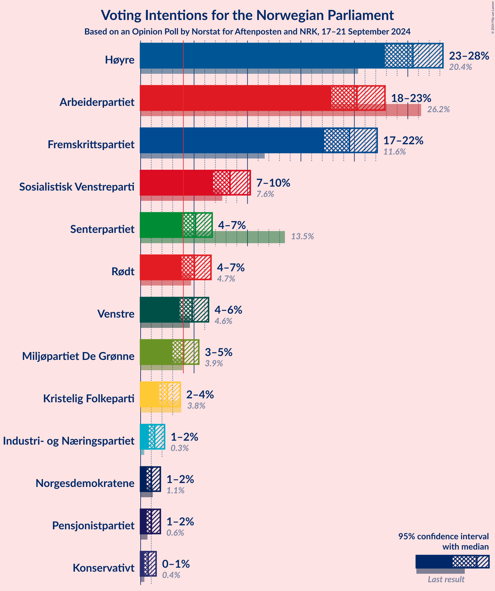

### Confidence Intervals

| Party | Last Result | Poll Result | 80% Confidence Interval | 90% Confidence Interval | 95% Confidence Interval | 99% Confidence Interval |
|:-----:|:-----------:|:-----------:|:-----------------------:|:-----------------------:|:-----------------------:|:-----------------------:|
| Høyre | 20.4% | 25.5% | 23.8–27.3% |23.3–27.8% |22.9–28.3% |22.1–29.2% |
| Arbeiderpartiet | 26.2% | 20.2% | 18.7–21.9% |18.2–22.4% |17.8–22.9% |17.1–23.7% |
| Fremskrittspartiet | 11.6% | 19.5% | 18.0–21.2% |17.6–21.7% |17.2–22.1% |16.5–23.0% |
| Sosialistisk Venstreparti | 7.6% | 8.4% | 7.3–9.6% |7.0–9.9% |6.8–10.3% |6.3–10.9% |
| Senterpartiet | 13.5% | 5.1% | 4.3–6.2% |4.1–6.4% |3.9–6.7% |3.6–7.2% |
| Rødt | 4.7% | 5.0% | 4.2–6.1% |4.0–6.3% |3.8–6.6% |3.5–7.1% |
| Venstre | 4.6% | 4.8% | 4.1–5.8% |3.8–6.1% |3.7–6.4% |3.3–6.9% |
| Miljøpartiet De Grønne | 3.9% | 4.0% | 3.3–5.0% |3.1–5.2% |3.0–5.4% |2.7–5.9% |
| Kristelig Folkeparti | 3.8% | 2.5% | 2.0–3.3% |1.8–3.5% |1.7–3.7% |1.5–4.1% |
| Industri- og Næringspartiet | 0.3% | 1.3% | 0.9–1.9% |0.9–2.1% |0.8–2.2% |0.6–2.6% |
| Norgesdemokratene | 1.1% | 1.0% | 0.7–1.6% |0.6–1.7% |0.5–1.8% |0.4–2.1% |
| Pensjonistpartiet | 0.6% | 1.0% | 0.7–1.6% |0.6–1.7% |0.5–1.8% |0.4–2.1% |
| Konservativt | 0.4% | 0.7% | 0.5–1.2% |0.4–1.3% |0.3–1.4% |0.3–1.7% |

*Note:* The poll result column reflects the actual value used in the calculations. Published results may vary slightly, and in addition be rounded to fewer digits.

## Seats

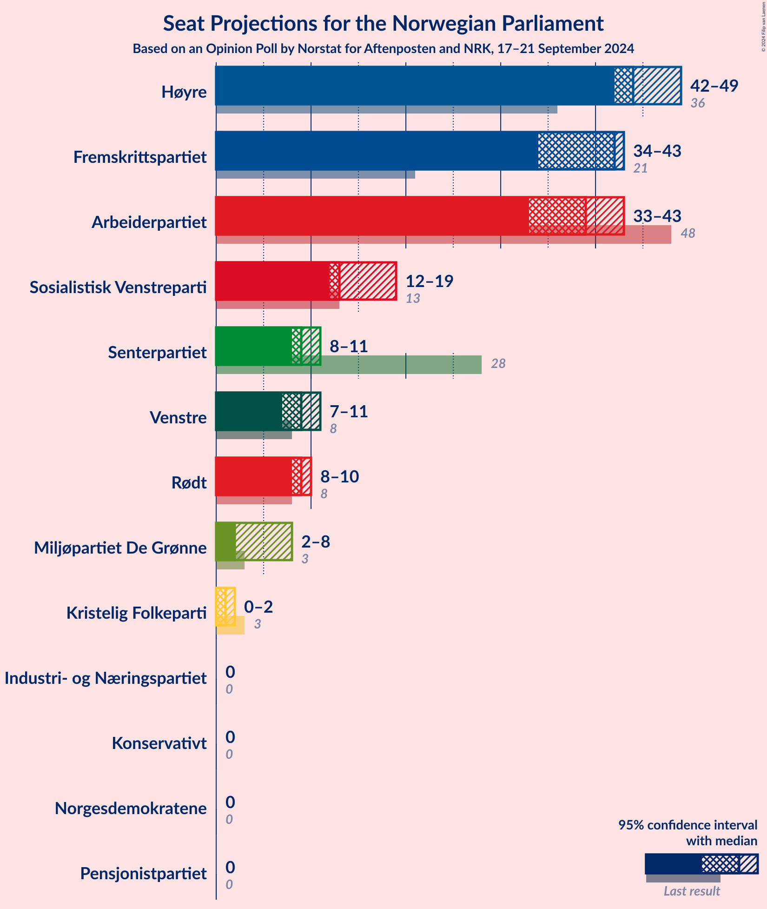

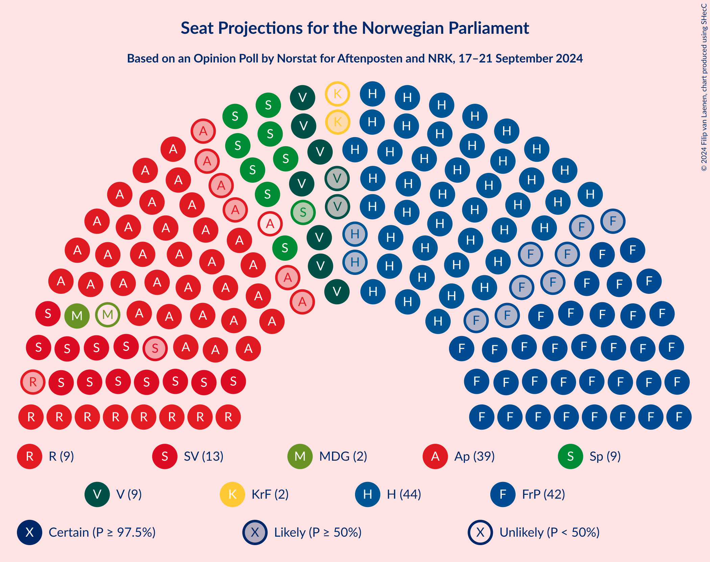

### Confidence Intervals

| Party | Last Result | Median | 80% Confidence Interval | 90% Confidence Interval | 95% Confidence Interval | 99% Confidence Interval |
|:-----:|:-----------:|:------:|:-----------------------:|:-----------------------:|:-----------------------:|:-----------------------:|
| <a href="#høyre">Høyre</a> | 36 | 44 | 42–47 |42–49 |42–49 |40–53 |
| <a href="#arbeiderpartiet">Arbeiderpartiet</a> | 48 | 39 | 37–39 |36–40 |33–43 |33–47 |
| <a href="#fremskrittspartiet">Fremskrittspartiet</a> | 21 | 42 | 36–43 |35–43 |34–43 |32–43 |
| <a href="#sosialistisk-venstreparti">Sosialistisk Venstreparti</a> | 13 | 13 | 12–15 |12–19 |12–19 |10–19 |
| <a href="#senterpartiet">Senterpartiet</a> | 28 | 9 | 8–11 |8–11 |8–11 |1–12 |
| <a href="#rødt">Rødt</a> | 8 | 9 | 8–9 |8–10 |8–10 |1–12 |
| <a href="#venstre">Venstre</a> | 8 | 9 | 8–11 |7–11 |7–11 |3–12 |
| <a href="#miljøpartiet-de-grønne">Miljøpartiet De Grønne</a> | 3 | 2 | 2–7 |2–8 |2–8 |1–9 |
| <a href="#kristelig-folkeparti">Kristelig Folkeparti</a> | 3 | 1 | 0–2 |0–2 |0–2 |0–3 |
| <a href="#industri--og-næringspartiet">Industri- og Næringspartiet</a> | 0 | 0 | 0 |0 |0 |0 |
| <a href="#norgesdemokratene">Norgesdemokratene</a> | 0 | 0 | 0 |0 |0 |0 |
| <a href="#pensjonistpartiet">Pensjonistpartiet</a> | 0 | 0 | 0 |0 |0 |0 |
| <a href="#konservativt">Konservativt</a> | 0 | 0 | 0 |0 |0 |0 |

### Høyre

*For a full overview of the results for this party, see the [Høyre](party-høyre.html) page.*

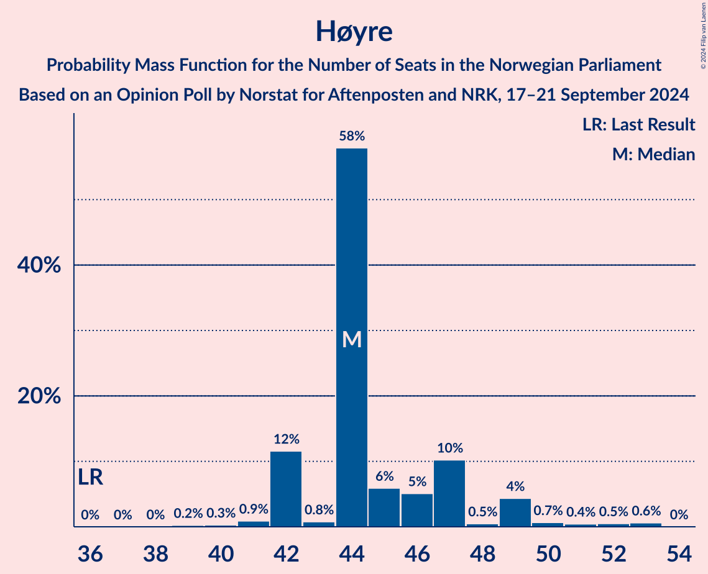

| Number of Seats | Probability | Accumulated | Special Marks |
|:---------------:|:-----------:|:-----------:|:-------------:|
| 36 | 0% | 100% | Last Result |
| 37 | 0% | 100% |  |
| 38 | 0% | 100% |  |
| 39 | 0.2% | 100% |  |
| 40 | 0.3% | 99.7% |  |
| 41 | 0.9% | 99.5% |  |
| 42 | 12% | 98.6% |  |
| 43 | 0.8% | 87% |  |
| 44 | 58% | 86% | Median |
| 45 | 6% | 28% |  |
| 46 | 5% | 22% |  |
| 47 | 10% | 17% |  |
| 48 | 0.5% | 7% |  |
| 49 | 4% | 7% |  |
| 50 | 0.7% | 2% |  |
| 51 | 0.4% | 2% |  |
| 52 | 0.5% | 1.1% |  |
| 53 | 0.6% | 0.6% |  |
| 54 | 0% | 0% |  |

### Arbeiderpartiet

*For a full overview of the results for this party, see the [Arbeiderpartiet](party-arbeiderpartiet.html) page.*

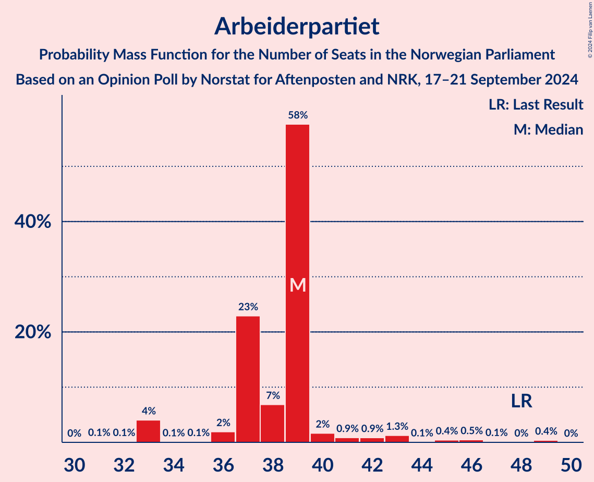

| Number of Seats | Probability | Accumulated | Special Marks |
|:---------------:|:-----------:|:-----------:|:-------------:|
| 31 | 0.1% | 100% |  |
| 32 | 0.1% | 99.8% |  |
| 33 | 4% | 99.7% |  |
| 34 | 0.1% | 96% |  |
| 35 | 0.1% | 96% |  |
| 36 | 2% | 95% |  |
| 37 | 23% | 94% |  |
| 38 | 7% | 71% |  |
| 39 | 58% | 64% | Median |
| 40 | 2% | 6% |  |
| 41 | 0.9% | 4% |  |
| 42 | 0.9% | 4% |  |
| 43 | 1.3% | 3% |  |
| 44 | 0.1% | 2% |  |
| 45 | 0.4% | 1.5% |  |
| 46 | 0.5% | 1.0% |  |
| 47 | 0.1% | 0.5% |  |
| 48 | 0% | 0.4% | Last Result |
| 49 | 0.4% | 0.4% |  |
| 50 | 0% | 0% |  |

### Fremskrittspartiet

*For a full overview of the results for this party, see the [Fremskrittspartiet](party-fremskrittspartiet.html) page.*

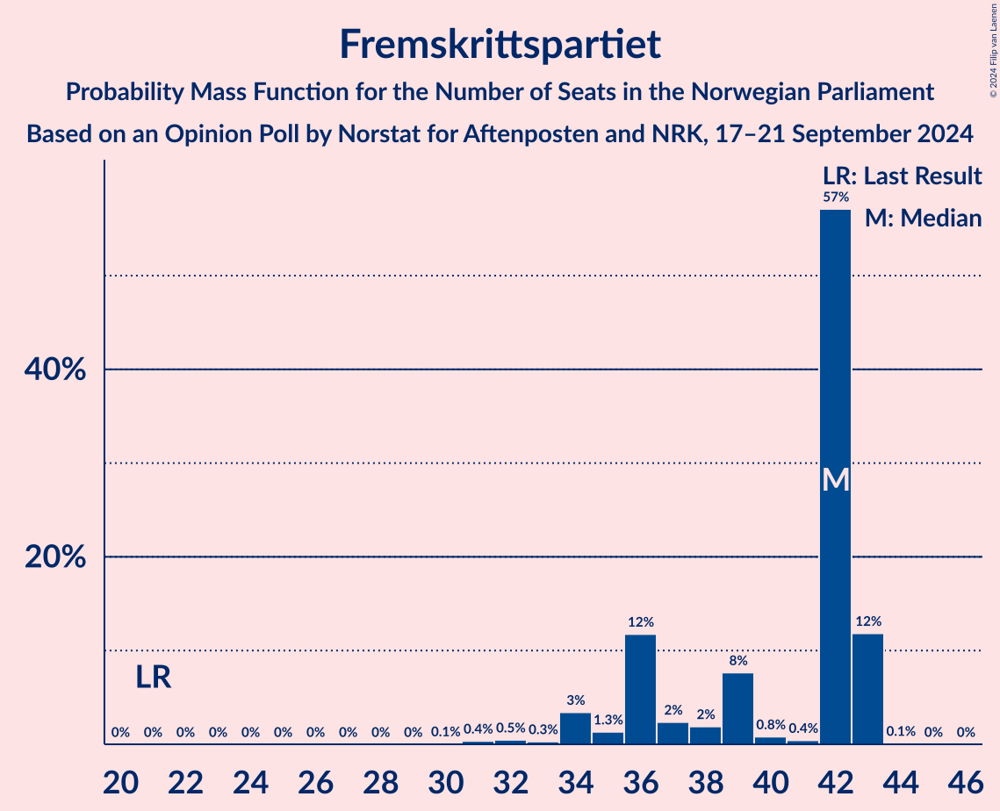

| Number of Seats | Probability | Accumulated | Special Marks |
|:---------------:|:-----------:|:-----------:|:-------------:|
| 21 | 0% | 100% | Last Result |
| 22 | 0% | 100% |  |
| 23 | 0% | 100% |  |
| 24 | 0% | 100% |  |
| 25 | 0% | 100% |  |
| 26 | 0% | 100% |  |
| 27 | 0% | 100% |  |
| 28 | 0% | 100% |  |
| 29 | 0% | 100% |  |
| 30 | 0.1% | 100% |  |
| 31 | 0.4% | 99.9% |  |
| 32 | 0.5% | 99.6% |  |
| 33 | 0.3% | 99.1% |  |
| 34 | 3% | 98.8% |  |
| 35 | 1.3% | 95% |  |
| 36 | 12% | 94% |  |
| 37 | 2% | 82% |  |
| 38 | 2% | 80% |  |
| 39 | 8% | 78% |  |
| 40 | 0.8% | 70% |  |
| 41 | 0.4% | 70% |  |
| 42 | 57% | 69% | Median |
| 43 | 12% | 12% |  |
| 44 | 0.1% | 0.1% |  |
| 45 | 0% | 0% |  |

### Sosialistisk Venstreparti

*For a full overview of the results for this party, see the [Sosialistisk Venstreparti](party-sosialistiskvenstreparti.html) page.*

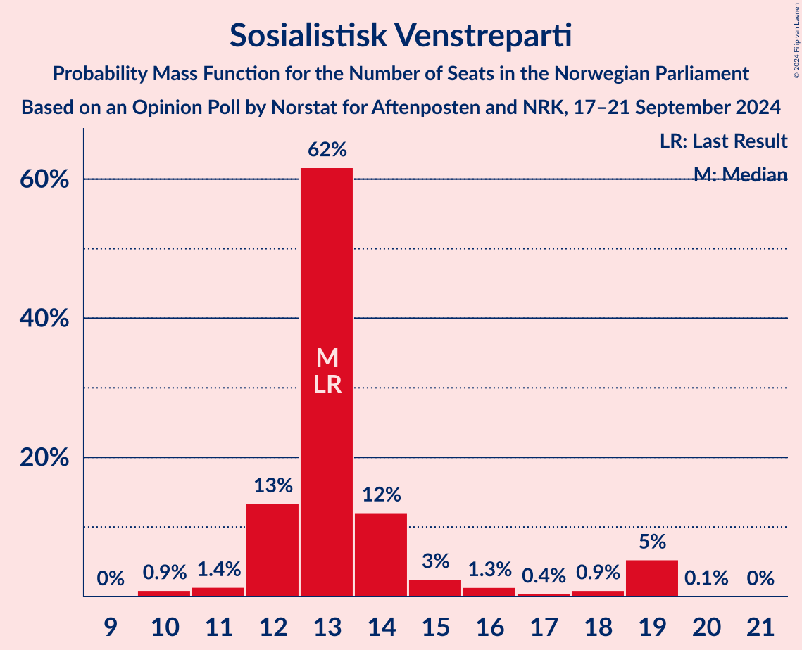

| Number of Seats | Probability | Accumulated | Special Marks |
|:---------------:|:-----------:|:-----------:|:-------------:|
| 10 | 0.9% | 100% |  |
| 11 | 1.4% | 99.1% |  |
| 12 | 13% | 98% |  |
| 13 | 62% | 84% | Last Result, Median |
| 14 | 12% | 23% |  |
| 15 | 3% | 11% |  |
| 16 | 1.3% | 8% |  |
| 17 | 0.4% | 7% |  |
| 18 | 0.9% | 6% |  |
| 19 | 5% | 5% |  |
| 20 | 0.1% | 0.1% |  |
| 21 | 0% | 0% |  |

### Senterpartiet

*For a full overview of the results for this party, see the [Senterpartiet](party-senterpartiet.html) page.*

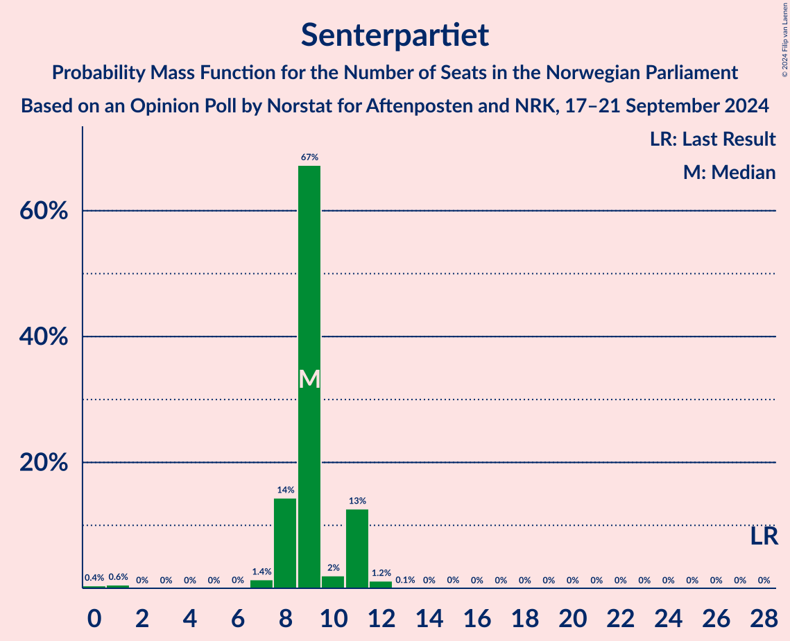

| Number of Seats | Probability | Accumulated | Special Marks |
|:---------------:|:-----------:|:-----------:|:-------------:|
| 0 | 0.4% | 100% |  |
| 1 | 0.6% | 99.6% |  |
| 2 | 0% | 99.0% |  |
| 3 | 0% | 99.0% |  |
| 4 | 0% | 99.0% |  |
| 5 | 0% | 99.0% |  |
| 6 | 0% | 99.0% |  |
| 7 | 1.4% | 99.0% |  |
| 8 | 14% | 98% |  |
| 9 | 67% | 83% | Median |
| 10 | 2% | 16% |  |
| 11 | 13% | 14% |  |
| 12 | 1.2% | 1.3% |  |
| 13 | 0.1% | 0.1% |  |
| 14 | 0% | 0.1% |  |
| 15 | 0% | 0% |  |
| 16 | 0% | 0% |  |
| 17 | 0% | 0% |  |
| 18 | 0% | 0% |  |
| 19 | 0% | 0% |  |
| 20 | 0% | 0% |  |
| 21 | 0% | 0% |  |
| 22 | 0% | 0% |  |
| 23 | 0% | 0% |  |
| 24 | 0% | 0% |  |
| 25 | 0% | 0% |  |
| 26 | 0% | 0% |  |
| 27 | 0% | 0% |  |
| 28 | 0% | 0% | Last Result |

### Rødt

*For a full overview of the results for this party, see the [Rødt](party-rødt.html) page.*

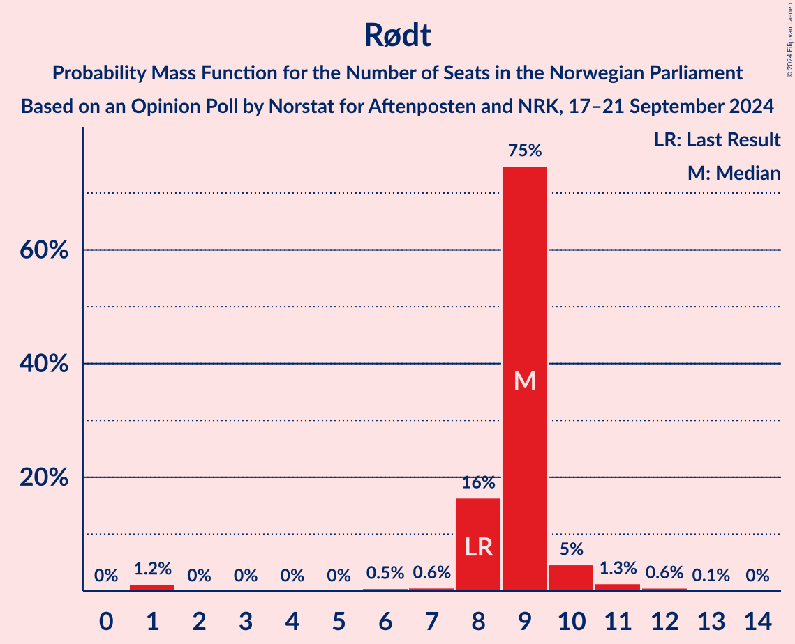

| Number of Seats | Probability | Accumulated | Special Marks |
|:---------------:|:-----------:|:-----------:|:-------------:|
| 1 | 1.2% | 100% |  |
| 2 | 0% | 98.8% |  |
| 3 | 0% | 98.8% |  |
| 4 | 0% | 98.8% |  |
| 5 | 0% | 98.8% |  |
| 6 | 0.5% | 98.8% |  |
| 7 | 0.6% | 98% |  |
| 8 | 16% | 98% | Last Result |
| 9 | 75% | 81% | Median |
| 10 | 5% | 7% |  |
| 11 | 1.3% | 2% |  |
| 12 | 0.6% | 0.6% |  |
| 13 | 0.1% | 0.1% |  |
| 14 | 0% | 0% |  |

### Venstre

*For a full overview of the results for this party, see the [Venstre](party-venstre.html) page.*

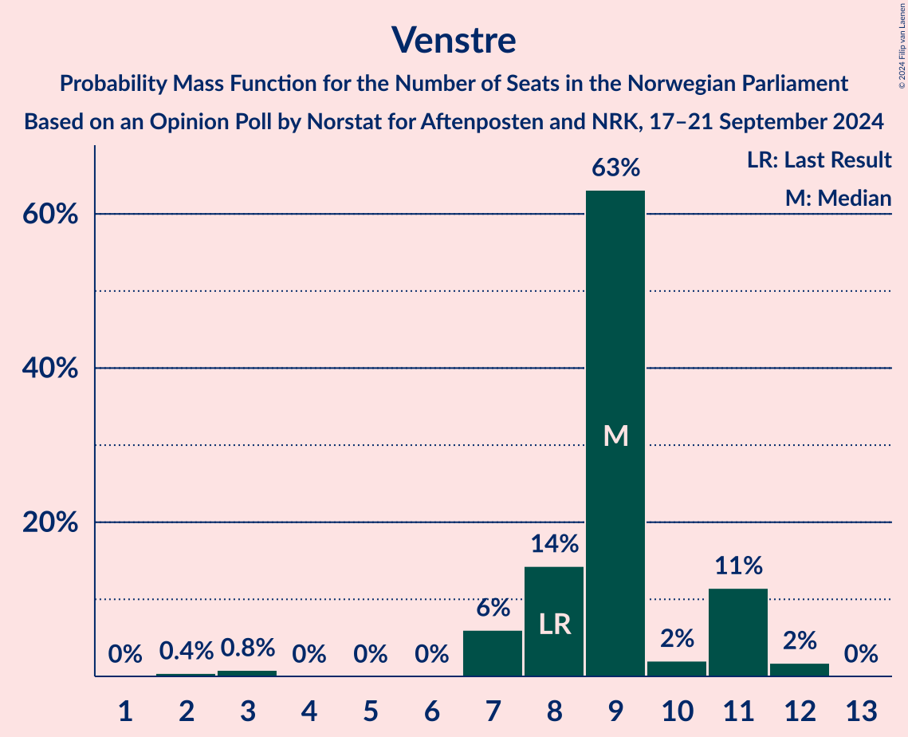

| Number of Seats | Probability | Accumulated | Special Marks |
|:---------------:|:-----------:|:-----------:|:-------------:|
| 2 | 0.4% | 100% |  |
| 3 | 0.8% | 99.6% |  |
| 4 | 0% | 98.7% |  |
| 5 | 0% | 98.7% |  |
| 6 | 0% | 98.7% |  |
| 7 | 6% | 98.7% |  |
| 8 | 14% | 93% | Last Result |
| 9 | 63% | 78% | Median |
| 10 | 2% | 15% |  |
| 11 | 11% | 13% |  |
| 12 | 2% | 2% |  |
| 13 | 0% | 0% |  |

### Miljøpartiet De Grønne

*For a full overview of the results for this party, see the [Miljøpartiet De Grønne](party-miljøpartietdegrønne.html) page.*

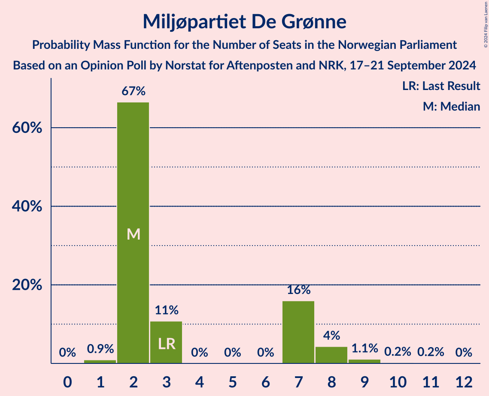

| Number of Seats | Probability | Accumulated | Special Marks |
|:---------------:|:-----------:|:-----------:|:-------------:|
| 1 | 0.9% | 100% |  |
| 2 | 67% | 99.1% | Median |
| 3 | 11% | 33% | Last Result |
| 4 | 0% | 22% |  |
| 5 | 0% | 22% |  |
| 6 | 0% | 22% |  |
| 7 | 16% | 22% |  |
| 8 | 4% | 6% |  |
| 9 | 1.1% | 1.5% |  |
| 10 | 0.2% | 0.4% |  |
| 11 | 0.2% | 0.2% |  |
| 12 | 0% | 0% |  |

### Kristelig Folkeparti

*For a full overview of the results for this party, see the [Kristelig Folkeparti](party-kristeligfolkeparti.html) page.*

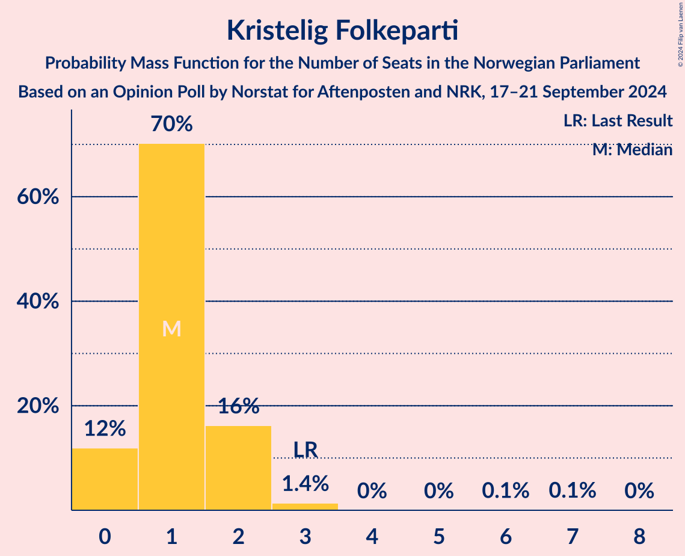

| Number of Seats | Probability | Accumulated | Special Marks |
|:---------------:|:-----------:|:-----------:|:-------------:|
| 0 | 12% | 100% |  |
| 1 | 70% | 88% | Median |
| 2 | 16% | 18% |  |
| 3 | 1.4% | 2% | Last Result |
| 4 | 0% | 0.2% |  |
| 5 | 0% | 0.2% |  |
| 6 | 0.1% | 0.2% |  |
| 7 | 0.1% | 0.1% |  |
| 8 | 0% | 0% |  |

### Industri- og Næringspartiet

*For a full overview of the results for this party, see the [Industri- og Næringspartiet](party-industri-ognæringspartiet.html) page.*

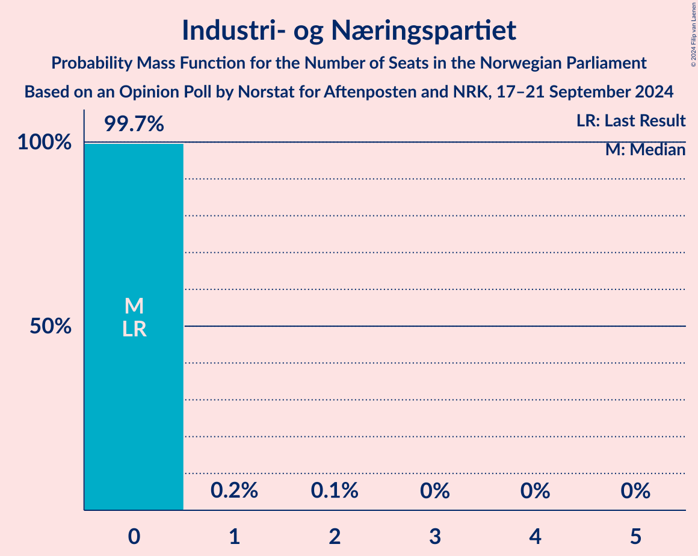

| Number of Seats | Probability | Accumulated | Special Marks |
|:---------------:|:-----------:|:-----------:|:-------------:|
| 0 | 99.7% | 100% | Last Result, Median |
| 1 | 0.2% | 0.3% |  |
| 2 | 0.1% | 0.1% |  |
| 3 | 0% | 0% |  |

### Norgesdemokratene

*For a full overview of the results for this party, see the [Norgesdemokratene](party-norgesdemokratene.html) page.*

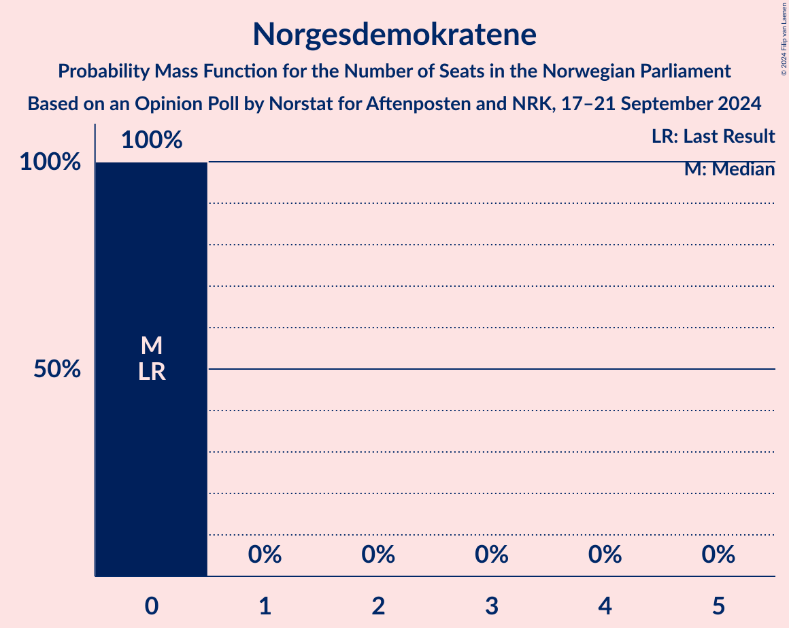

| Number of Seats | Probability | Accumulated | Special Marks |
|:---------------:|:-----------:|:-----------:|:-------------:|
| 0 | 100% | 100% | Last Result, Median |

### Pensjonistpartiet

*For a full overview of the results for this party, see the [Pensjonistpartiet](party-pensjonistpartiet.html) page.*

| Number of Seats | Probability | Accumulated | Special Marks |
|:---------------:|:-----------:|:-----------:|:-------------:|
| 0 | 99.9% | 100% | Last Result, Median |
| 1 | 0.1% | 0.1% |  |
| 2 | 0% | 0% |  |

### Konservativt

*For a full overview of the results for this party, see the [Konservativt](party-konservativt.html) page.*

| Number of Seats | Probability | Accumulated | Special Marks |
|:---------------:|:-----------:|:-----------:|:-------------:|
| 0 | 100% | 100% | Last Result, Median |

## Coalitions

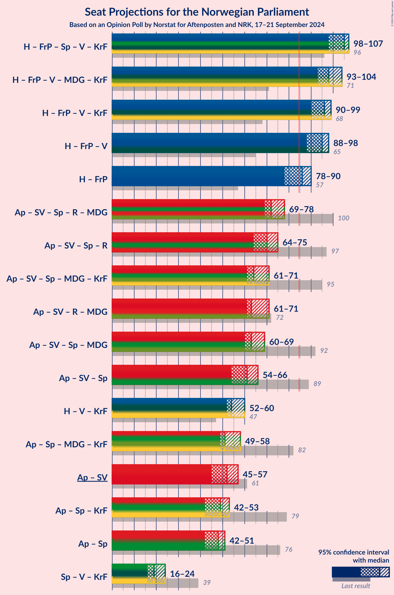

### Confidence Intervals

| Coalition | Last Result | Median | Majority? | 80% Confidence Interval | 90% Confidence Interval | 95% Confidence Interval | 99% Confidence Interval |
|:---------:|:-----------:|:------:|:---------:|:-----------------------:|:-----------------------:|:-----------------------:|:-----------------------:|
| Høyre – Fremskrittspartiet – Senterpartiet – Venstre – Kristelig Folkeparti | 96 | 105 | 100% | 100–107 | 100–107 | 98–107 | 94–110 |
| Høyre – Fremskrittspartiet – Venstre – Miljøpartiet De Grønne – Kristelig Folkeparti | 71 | 98 | 100% | 96–102 | 93–102 | 93–104 | 89–107 |
| Høyre – Fremskrittspartiet – Venstre – Kristelig Folkeparti | 68 | 96 | 99.6% | 91–98 | 91–99 | 90–99 | 87–102 |
| Høyre – Fremskrittspartiet – Venstre | 65 | 95 | 99.5% | 89–97 | 89–98 | 88–98 | 85–100 |
| Høyre – Fremskrittspartiet | 57 | 86 | 74% | 78–89 | 78–90 | 78–90 | 76–93 |
| Arbeiderpartiet – Sosialistisk Venstreparti – Senterpartiet – Rødt – Miljøpartiet De Grønne | 100 | 72 | 0.1% | 71–77 | 69–77 | 69–78 | 66–82 |
| Arbeiderpartiet – Sosialistisk Venstreparti – Senterpartiet – Rødt | 97 | 70 | 0% | 66–71 | 66–75 | 64–75 | 61–79 |
| Arbeiderpartiet – Sosialistisk Venstreparti – Senterpartiet – Miljøpartiet De Grønne – Kristelig Folkeparti | 95 | 64 | 0% | 61–71 | 61–71 | 61–71 | 60–76 |
| Arbeiderpartiet – Sosialistisk Venstreparti – Rødt – Miljøpartiet De Grønne | 72 | 63 | 0% | 61–68 | 61–68 | 61–71 | 58–75 |
| Arbeiderpartiet – Sosialistisk Venstreparti – Senterpartiet – Miljøpartiet De Grønne | 92 | 63 | 0% | 61–69 | 60–69 | 60–69 | 59–75 |
| Arbeiderpartiet – Sosialistisk Venstreparti – Senterpartiet | 89 | 61 | 0% | 57–63 | 57–66 | 54–66 | 54–71 |
| Høyre – Venstre – Kristelig Folkeparti | 47 | 54 | 0% | 54–56 | 52–59 | 52–60 | 48–65 |
| Arbeiderpartiet – Senterpartiet – Miljøpartiet De Grønne – Kristelig Folkeparti | 82 | 51 | 0% | 49–57 | 49–57 | 49–58 | 46–62 |
| Arbeiderpartiet – Sosialistisk Venstreparti | 61 | 52 | 0% | 49–54 | 49–57 | 45–57 | 45–63 |
| Arbeiderpartiet – Senterpartiet – Kristelig Folkeparti | 79 | 49 | 0% | 46–50 | 45–51 | 42–53 | 41–57 |
| Arbeiderpartiet – Senterpartiet | 76 | 48 | 0% | 45–48 | 44–49 | 42–51 | 40–56 |
| Senterpartiet – Venstre – Kristelig Folkeparti | 39 | 19 | 0% | 17–24 | 16–24 | 16–24 | 9–24 |

### Høyre – Fremskrittspartiet – Senterpartiet – Venstre – Kristelig Folkeparti

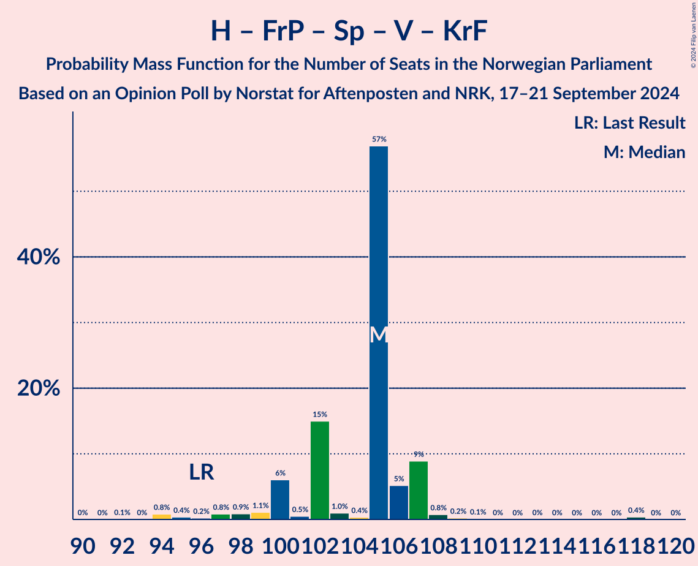

| Number of Seats | Probability | Accumulated | Special Marks |
|:---------------:|:-----------:|:-----------:|:-------------:|
| 91 | 0% | 100% |  |
| 92 | 0.1% | 99.9% |  |
| 93 | 0% | 99.9% |  |
| 94 | 0.8% | 99.9% |  |
| 95 | 0.4% | 99.0% |  |
| 96 | 0.2% | 98.6% | Last Result |
| 97 | 0.8% | 98% |  |
| 98 | 0.9% | 98% |  |
| 99 | 1.1% | 97% |  |
| 100 | 6% | 96% |  |
| 101 | 0.5% | 90% |  |
| 102 | 15% | 89% |  |
| 103 | 1.0% | 74% |  |
| 104 | 0.4% | 73% |  |
| 105 | 57% | 73% | Median |
| 106 | 5% | 16% |  |
| 107 | 9% | 11% |  |
| 108 | 0.8% | 2% |  |
| 109 | 0.2% | 0.8% |  |
| 110 | 0.1% | 0.6% |  |
| 111 | 0% | 0.5% |  |
| 112 | 0% | 0.4% |  |
| 113 | 0% | 0.4% |  |
| 114 | 0% | 0.4% |  |
| 115 | 0% | 0.4% |  |
| 116 | 0% | 0.4% |  |
| 117 | 0% | 0.4% |  |
| 118 | 0.4% | 0.4% |  |
| 119 | 0% | 0% |  |

### Høyre – Fremskrittspartiet – Venstre – Miljøpartiet De Grønne – Kristelig Folkeparti

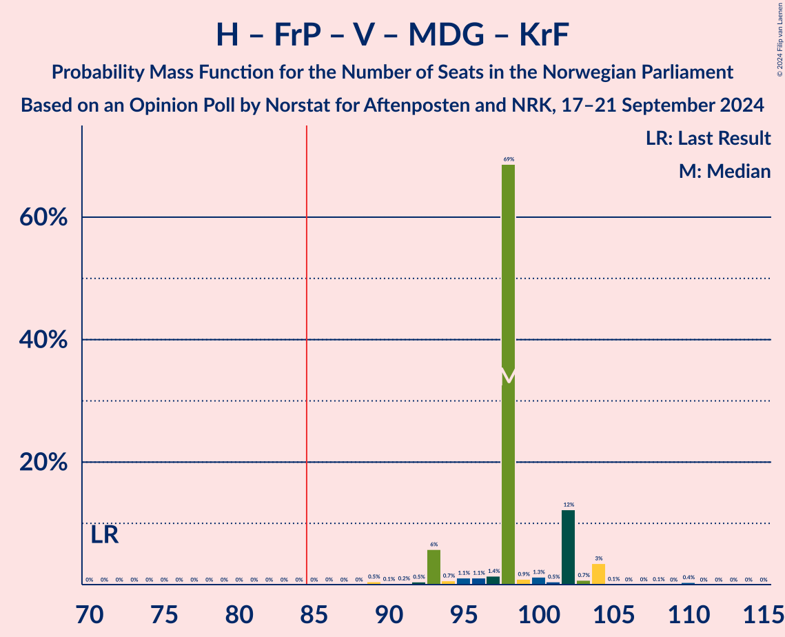

| Number of Seats | Probability | Accumulated | Special Marks |
|:---------------:|:-----------:|:-----------:|:-------------:|
| 71 | 0% | 100% | Last Result |
| 72 | 0% | 100% |  |
| 73 | 0% | 100% |  |
| 74 | 0% | 100% |  |
| 75 | 0% | 100% |  |
| 76 | 0% | 100% |  |
| 77 | 0% | 100% |  |
| 78 | 0% | 100% |  |
| 79 | 0% | 100% |  |
| 80 | 0% | 100% |  |
| 81 | 0% | 100% |  |
| 82 | 0% | 100% |  |
| 83 | 0% | 100% |  |
| 84 | 0% | 100% |  |
| 85 | 0% | 100% | Majority |
| 86 | 0% | 100% |  |
| 87 | 0% | 100% |  |
| 88 | 0% | 100% |  |
| 89 | 0.5% | 99.9% |  |
| 90 | 0.1% | 99.4% |  |
| 91 | 0.2% | 99.3% |  |
| 92 | 0.5% | 99.1% |  |
| 93 | 6% | 98.6% |  |
| 94 | 0.7% | 93% |  |
| 95 | 1.1% | 92% |  |
| 96 | 1.1% | 91% |  |
| 97 | 1.4% | 90% |  |
| 98 | 69% | 89% | Median |
| 99 | 0.9% | 20% |  |
| 100 | 1.3% | 19% |  |
| 101 | 0.5% | 18% |  |
| 102 | 12% | 17% |  |
| 103 | 0.7% | 5% |  |
| 104 | 3% | 4% |  |
| 105 | 0.1% | 0.7% |  |
| 106 | 0% | 0.6% |  |
| 107 | 0% | 0.5% |  |
| 108 | 0.1% | 0.5% |  |
| 109 | 0% | 0.4% |  |
| 110 | 0.4% | 0.4% |  |
| 111 | 0% | 0% |  |

### Høyre – Fremskrittspartiet – Venstre – Kristelig Folkeparti

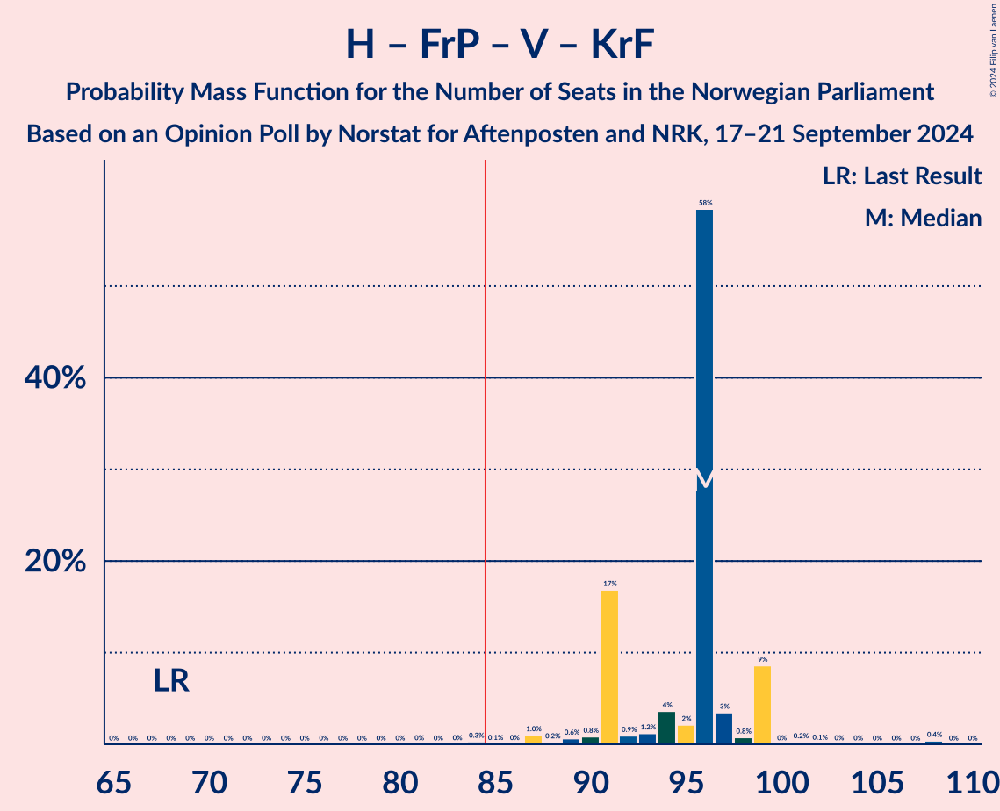

| Number of Seats | Probability | Accumulated | Special Marks |
|:---------------:|:-----------:|:-----------:|:-------------:|
| 68 | 0% | 100% | Last Result |
| 69 | 0% | 100% |  |
| 70 | 0% | 100% |  |
| 71 | 0% | 100% |  |
| 72 | 0% | 100% |  |
| 73 | 0% | 100% |  |
| 74 | 0% | 100% |  |
| 75 | 0% | 100% |  |
| 76 | 0% | 100% |  |
| 77 | 0% | 100% |  |
| 78 | 0% | 100% |  |
| 79 | 0% | 100% |  |
| 80 | 0% | 100% |  |
| 81 | 0% | 100% |  |
| 82 | 0% | 100% |  |
| 83 | 0% | 100% |  |
| 84 | 0.3% | 99.9% |  |
| 85 | 0.1% | 99.6% | Majority |
| 86 | 0% | 99.6% |  |
| 87 | 1.0% | 99.5% |  |
| 88 | 0.2% | 98.5% |  |
| 89 | 0.6% | 98% |  |
| 90 | 0.8% | 98% |  |
| 91 | 17% | 97% |  |
| 92 | 0.9% | 80% |  |
| 93 | 1.2% | 79% |  |
| 94 | 4% | 78% |  |
| 95 | 2% | 74% |  |
| 96 | 58% | 72% | Median |
| 97 | 3% | 14% |  |
| 98 | 0.8% | 10% |  |
| 99 | 9% | 9% |  |
| 100 | 0% | 0.8% |  |
| 101 | 0.2% | 0.8% |  |
| 102 | 0.1% | 0.5% |  |
| 103 | 0% | 0.4% |  |
| 104 | 0% | 0.4% |  |
| 105 | 0% | 0.4% |  |
| 106 | 0% | 0.4% |  |
| 107 | 0% | 0.4% |  |
| 108 | 0.4% | 0.4% |  |
| 109 | 0% | 0% |  |

### Høyre – Fremskrittspartiet – Venstre

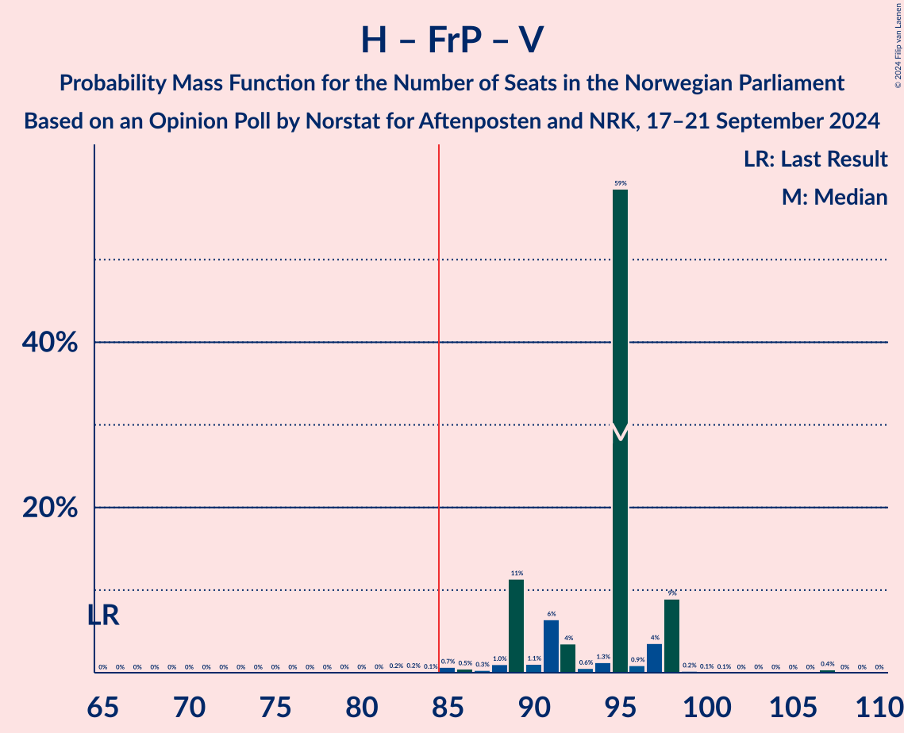

| Number of Seats | Probability | Accumulated | Special Marks |
|:---------------:|:-----------:|:-----------:|:-------------:|
| 65 | 0% | 100% | Last Result |
| 66 | 0% | 100% |  |
| 67 | 0% | 100% |  |
| 68 | 0% | 100% |  |
| 69 | 0% | 100% |  |
| 70 | 0% | 100% |  |
| 71 | 0% | 100% |  |
| 72 | 0% | 100% |  |
| 73 | 0% | 100% |  |
| 74 | 0% | 100% |  |
| 75 | 0% | 100% |  |
| 76 | 0% | 100% |  |
| 77 | 0% | 100% |  |
| 78 | 0% | 100% |  |
| 79 | 0% | 100% |  |
| 80 | 0% | 100% |  |
| 81 | 0% | 100% |  |
| 82 | 0.2% | 99.9% |  |
| 83 | 0.2% | 99.8% |  |
| 84 | 0.1% | 99.6% |  |
| 85 | 0.7% | 99.5% | Majority |
| 86 | 0.5% | 98.8% |  |
| 87 | 0.3% | 98% |  |
| 88 | 1.0% | 98% |  |
| 89 | 11% | 97% |  |
| 90 | 1.1% | 86% |  |
| 91 | 6% | 85% |  |
| 92 | 4% | 78% |  |
| 93 | 0.6% | 75% |  |
| 94 | 1.3% | 74% |  |
| 95 | 59% | 73% | Median |
| 96 | 0.9% | 14% |  |
| 97 | 4% | 13% |  |
| 98 | 9% | 10% |  |
| 99 | 0.2% | 0.8% |  |
| 100 | 0.1% | 0.6% |  |
| 101 | 0.1% | 0.5% |  |
| 102 | 0% | 0.4% |  |
| 103 | 0% | 0.4% |  |
| 104 | 0% | 0.4% |  |
| 105 | 0% | 0.4% |  |
| 106 | 0% | 0.4% |  |
| 107 | 0.4% | 0.4% |  |
| 108 | 0% | 0% |  |

### Høyre – Fremskrittspartiet

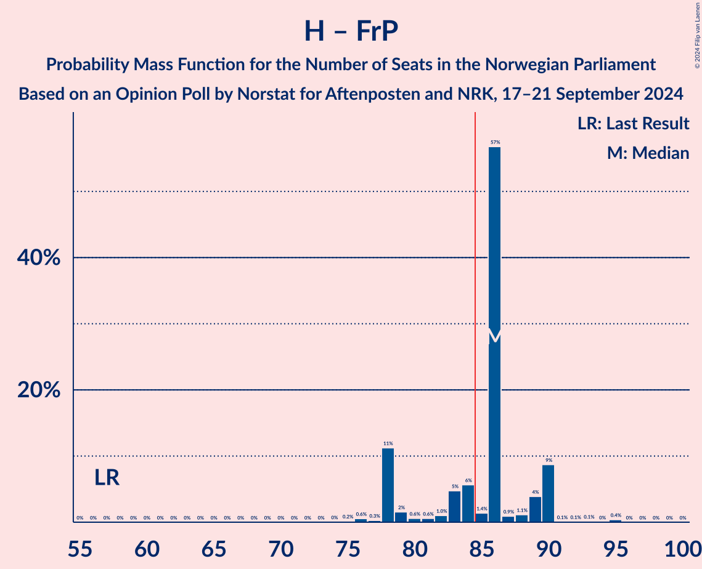

| Number of Seats | Probability | Accumulated | Special Marks |
|:---------------:|:-----------:|:-----------:|:-------------:|
| 57 | 0% | 100% | Last Result |
| 58 | 0% | 100% |  |
| 59 | 0% | 100% |  |
| 60 | 0% | 100% |  |
| 61 | 0% | 100% |  |
| 62 | 0% | 100% |  |
| 63 | 0% | 100% |  |
| 64 | 0% | 100% |  |
| 65 | 0% | 100% |  |
| 66 | 0% | 100% |  |
| 67 | 0% | 100% |  |
| 68 | 0% | 100% |  |
| 69 | 0% | 100% |  |
| 70 | 0% | 100% |  |
| 71 | 0% | 100% |  |
| 72 | 0% | 100% |  |
| 73 | 0% | 100% |  |
| 74 | 0% | 100% |  |
| 75 | 0.2% | 100% |  |
| 76 | 0.6% | 99.8% |  |
| 77 | 0.3% | 99.2% |  |
| 78 | 11% | 98.9% |  |
| 79 | 2% | 88% |  |
| 80 | 0.6% | 86% |  |
| 81 | 0.6% | 86% |  |
| 82 | 1.0% | 85% |  |
| 83 | 5% | 84% |  |
| 84 | 6% | 79% |  |
| 85 | 1.4% | 74% | Majority |
| 86 | 57% | 72% | Median |
| 87 | 0.9% | 15% |  |
| 88 | 1.1% | 14% |  |
| 89 | 4% | 13% |  |
| 90 | 9% | 9% |  |
| 91 | 0.1% | 0.7% |  |
| 92 | 0.1% | 0.6% |  |
| 93 | 0.1% | 0.6% |  |
| 94 | 0% | 0.4% |  |
| 95 | 0.4% | 0.4% |  |
| 96 | 0% | 0% |  |

### Arbeiderpartiet – Sosialistisk Venstreparti – Senterpartiet – Rødt – Miljøpartiet De Grønne

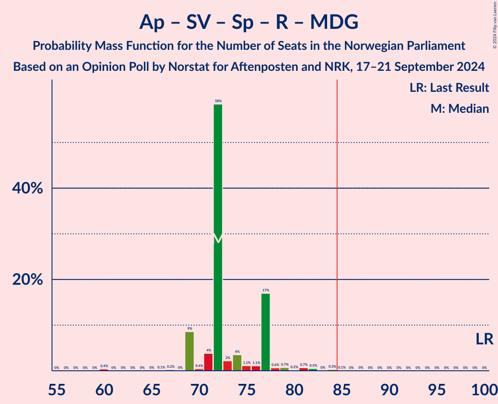

| Number of Seats | Probability | Accumulated | Special Marks |
|:---------------:|:-----------:|:-----------:|:-------------:|
| 60 | 0.4% | 100% |  |
| 61 | 0% | 99.6% |  |
| 62 | 0% | 99.6% |  |
| 63 | 0% | 99.6% |  |
| 64 | 0% | 99.6% |  |
| 65 | 0% | 99.6% |  |
| 66 | 0.1% | 99.6% |  |
| 67 | 0.2% | 99.5% |  |
| 68 | 0% | 99.2% |  |
| 69 | 9% | 99.2% |  |
| 70 | 0.4% | 91% |  |
| 71 | 4% | 90% |  |
| 72 | 58% | 86% | Median |
| 73 | 2% | 28% |  |
| 74 | 4% | 26% |  |
| 75 | 1.1% | 22% |  |
| 76 | 1.1% | 21% |  |
| 77 | 17% | 20% |  |
| 78 | 0.6% | 3% |  |
| 79 | 0.7% | 2% |  |
| 80 | 0.2% | 2% |  |
| 81 | 0.7% | 2% |  |
| 82 | 0.5% | 0.9% |  |
| 83 | 0% | 0.4% |  |
| 84 | 0.3% | 0.4% |  |
| 85 | 0.1% | 0.1% | Majority |
| 86 | 0% | 0% |  |
| 87 | 0% | 0% |  |
| 88 | 0% | 0% |  |
| 89 | 0% | 0% |  |
| 90 | 0% | 0% |  |
| 91 | 0% | 0% |  |
| 92 | 0% | 0% |  |
| 93 | 0% | 0% |  |
| 94 | 0% | 0% |  |
| 95 | 0% | 0% |  |
| 96 | 0% | 0% |  |
| 97 | 0% | 0% |  |
| 98 | 0% | 0% |  |
| 99 | 0% | 0% |  |
| 100 | 0% | 0% | Last Result |

### Arbeiderpartiet – Sosialistisk Venstreparti – Senterpartiet – Rødt

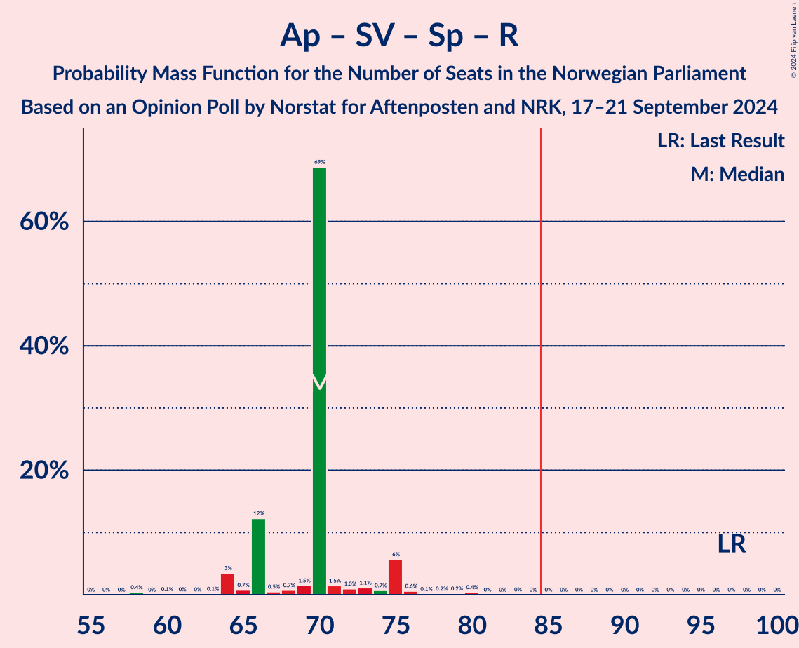

| Number of Seats | Probability | Accumulated | Special Marks |
|:---------------:|:-----------:|:-----------:|:-------------:|
| 58 | 0.4% | 100% |  |
| 59 | 0% | 99.6% |  |
| 60 | 0.1% | 99.6% |  |
| 61 | 0% | 99.5% |  |
| 62 | 0% | 99.5% |  |
| 63 | 0.1% | 99.4% |  |
| 64 | 3% | 99.3% |  |
| 65 | 0.7% | 96% |  |
| 66 | 12% | 95% |  |
| 67 | 0.5% | 83% |  |
| 68 | 0.7% | 82% |  |
| 69 | 1.5% | 82% |  |
| 70 | 69% | 80% | Median |
| 71 | 1.5% | 11% |  |
| 72 | 1.0% | 10% |  |
| 73 | 1.1% | 9% |  |
| 74 | 0.7% | 8% |  |
| 75 | 6% | 7% |  |
| 76 | 0.6% | 1.5% |  |
| 77 | 0.1% | 0.9% |  |
| 78 | 0.2% | 0.8% |  |
| 79 | 0.2% | 0.6% |  |
| 80 | 0.4% | 0.4% |  |
| 81 | 0% | 0% |  |
| 82 | 0% | 0% |  |
| 83 | 0% | 0% |  |
| 84 | 0% | 0% |  |
| 85 | 0% | 0% | Majority |
| 86 | 0% | 0% |  |
| 87 | 0% | 0% |  |
| 88 | 0% | 0% |  |
| 89 | 0% | 0% |  |
| 90 | 0% | 0% |  |
| 91 | 0% | 0% |  |
| 92 | 0% | 0% |  |
| 93 | 0% | 0% |  |
| 94 | 0% | 0% |  |
| 95 | 0% | 0% |  |
| 96 | 0% | 0% |  |
| 97 | 0% | 0% | Last Result |

### Arbeiderpartiet – Sosialistisk Venstreparti – Senterpartiet – Miljøpartiet De Grønne – Kristelig Folkeparti

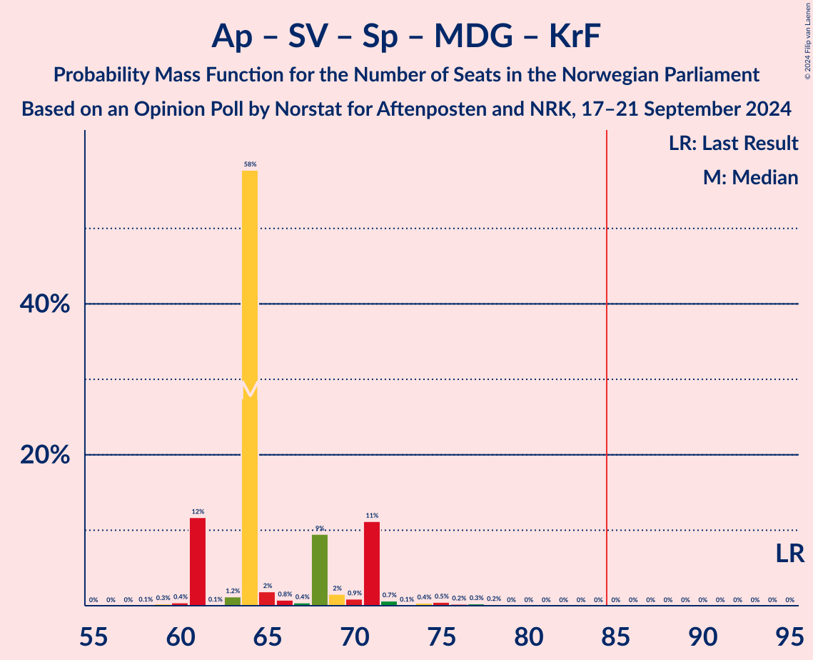

| Number of Seats | Probability | Accumulated | Special Marks |
|:---------------:|:-----------:|:-----------:|:-------------:|
| 58 | 0.1% | 100% |  |
| 59 | 0.3% | 99.9% |  |
| 60 | 0.4% | 99.6% |  |
| 61 | 12% | 99.2% |  |
| 62 | 0.1% | 88% |  |
| 63 | 1.2% | 87% |  |
| 64 | 58% | 86% | Median |
| 65 | 2% | 28% |  |
| 66 | 0.8% | 27% |  |
| 67 | 0.4% | 26% |  |
| 68 | 9% | 25% |  |
| 69 | 2% | 16% |  |
| 70 | 0.9% | 14% |  |
| 71 | 11% | 13% |  |
| 72 | 0.7% | 2% |  |
| 73 | 0.1% | 2% |  |
| 74 | 0.4% | 2% |  |
| 75 | 0.5% | 1.2% |  |
| 76 | 0.2% | 0.7% |  |
| 77 | 0.3% | 0.5% |  |
| 78 | 0.2% | 0.2% |  |
| 79 | 0% | 0% |  |
| 80 | 0% | 0% |  |
| 81 | 0% | 0% |  |
| 82 | 0% | 0% |  |
| 83 | 0% | 0% |  |
| 84 | 0% | 0% |  |
| 85 | 0% | 0% | Majority |
| 86 | 0% | 0% |  |
| 87 | 0% | 0% |  |
| 88 | 0% | 0% |  |
| 89 | 0% | 0% |  |
| 90 | 0% | 0% |  |
| 91 | 0% | 0% |  |
| 92 | 0% | 0% |  |
| 93 | 0% | 0% |  |
| 94 | 0% | 0% |  |
| 95 | 0% | 0% | Last Result |

### Arbeiderpartiet – Sosialistisk Venstreparti – Rødt – Miljøpartiet De Grønne

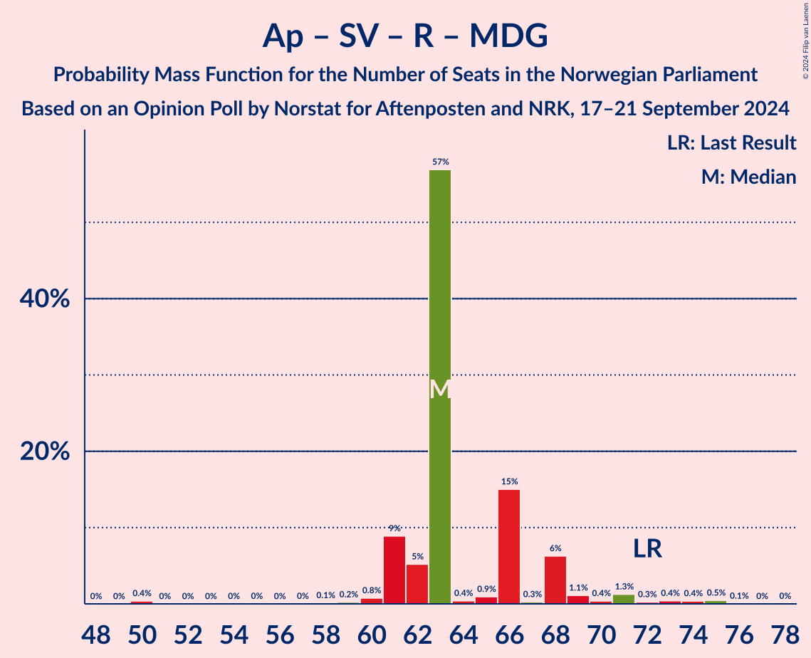

| Number of Seats | Probability | Accumulated | Special Marks |
|:---------------:|:-----------:|:-----------:|:-------------:|
| 50 | 0.4% | 100% |  |
| 51 | 0% | 99.6% |  |
| 52 | 0% | 99.6% |  |
| 53 | 0% | 99.6% |  |
| 54 | 0% | 99.6% |  |
| 55 | 0% | 99.6% |  |
| 56 | 0% | 99.6% |  |
| 57 | 0% | 99.6% |  |
| 58 | 0.1% | 99.5% |  |
| 59 | 0.2% | 99.4% |  |
| 60 | 0.8% | 99.2% |  |
| 61 | 9% | 98% |  |
| 62 | 5% | 89% |  |
| 63 | 57% | 84% | Median |
| 64 | 0.4% | 27% |  |
| 65 | 0.9% | 27% |  |
| 66 | 15% | 26% |  |
| 67 | 0.3% | 11% |  |
| 68 | 6% | 11% |  |
| 69 | 1.1% | 4% |  |
| 70 | 0.4% | 3% |  |
| 71 | 1.3% | 3% |  |
| 72 | 0.3% | 2% | Last Result |
| 73 | 0.4% | 1.4% |  |
| 74 | 0.4% | 1.0% |  |
| 75 | 0.5% | 0.6% |  |
| 76 | 0.1% | 0.1% |  |
| 77 | 0% | 0.1% |  |
| 78 | 0% | 0% |  |

### Arbeiderpartiet – Sosialistisk Venstreparti – Senterpartiet – Miljøpartiet De Grønne

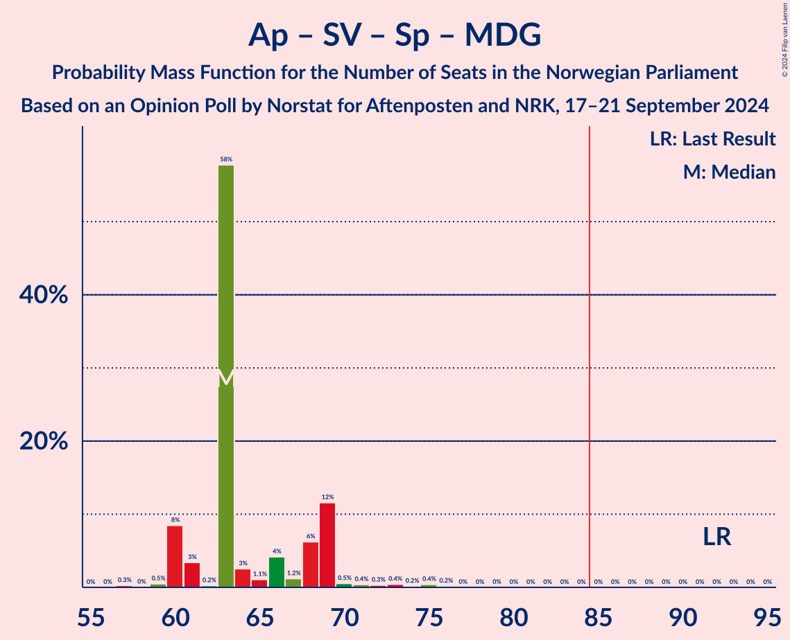

| Number of Seats | Probability | Accumulated | Special Marks |
|:---------------:|:-----------:|:-----------:|:-------------:|
| 57 | 0.3% | 100% |  |
| 58 | 0% | 99.7% |  |
| 59 | 0.5% | 99.7% |  |
| 60 | 8% | 99.2% |  |
| 61 | 3% | 91% |  |
| 62 | 0.2% | 87% |  |
| 63 | 58% | 87% | Median |
| 64 | 3% | 29% |  |
| 65 | 1.1% | 27% |  |
| 66 | 4% | 26% |  |
| 67 | 1.2% | 21% |  |
| 68 | 6% | 20% |  |
| 69 | 12% | 14% |  |
| 70 | 0.5% | 2% |  |
| 71 | 0.4% | 2% |  |
| 72 | 0.3% | 2% |  |
| 73 | 0.4% | 1.2% |  |
| 74 | 0.2% | 0.8% |  |
| 75 | 0.4% | 0.6% |  |
| 76 | 0.2% | 0.2% |  |
| 77 | 0% | 0% |  |
| 78 | 0% | 0% |  |
| 79 | 0% | 0% |  |
| 80 | 0% | 0% |  |
| 81 | 0% | 0% |  |
| 82 | 0% | 0% |  |
| 83 | 0% | 0% |  |
| 84 | 0% | 0% |  |
| 85 | 0% | 0% | Majority |
| 86 | 0% | 0% |  |
| 87 | 0% | 0% |  |
| 88 | 0% | 0% |  |
| 89 | 0% | 0% |  |
| 90 | 0% | 0% |  |
| 91 | 0% | 0% |  |
| 92 | 0% | 0% | Last Result |

### Arbeiderpartiet – Sosialistisk Venstreparti – Senterpartiet

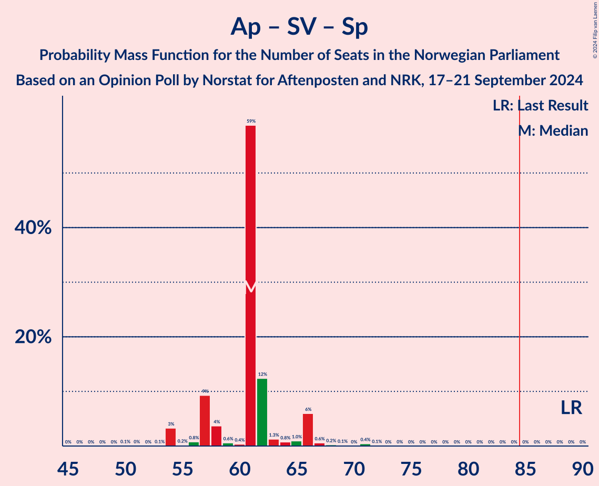

| Number of Seats | Probability | Accumulated | Special Marks |
|:---------------:|:-----------:|:-----------:|:-------------:|
| 50 | 0.1% | 100% |  |
| 51 | 0% | 99.9% |  |
| 52 | 0% | 99.9% |  |
| 53 | 0.1% | 99.9% |  |
| 54 | 3% | 99.8% |  |
| 55 | 0.2% | 97% |  |
| 56 | 0.8% | 96% |  |
| 57 | 9% | 96% |  |
| 58 | 4% | 86% |  |
| 59 | 0.6% | 83% |  |
| 60 | 0.4% | 82% |  |
| 61 | 59% | 82% | Median |
| 62 | 12% | 23% |  |
| 63 | 1.3% | 10% |  |
| 64 | 0.8% | 9% |  |
| 65 | 1.0% | 8% |  |
| 66 | 6% | 8% |  |
| 67 | 0.6% | 2% |  |
| 68 | 0.2% | 0.9% |  |
| 69 | 0.1% | 0.7% |  |
| 70 | 0% | 0.6% |  |
| 71 | 0.4% | 0.6% |  |
| 72 | 0.1% | 0.1% |  |
| 73 | 0% | 0% |  |
| 74 | 0% | 0% |  |
| 75 | 0% | 0% |  |
| 76 | 0% | 0% |  |
| 77 | 0% | 0% |  |
| 78 | 0% | 0% |  |
| 79 | 0% | 0% |  |
| 80 | 0% | 0% |  |
| 81 | 0% | 0% |  |
| 82 | 0% | 0% |  |
| 83 | 0% | 0% |  |
| 84 | 0% | 0% |  |
| 85 | 0% | 0% | Majority |
| 86 | 0% | 0% |  |
| 87 | 0% | 0% |  |
| 88 | 0% | 0% |  |
| 89 | 0% | 0% | Last Result |

### Høyre – Venstre – Kristelig Folkeparti

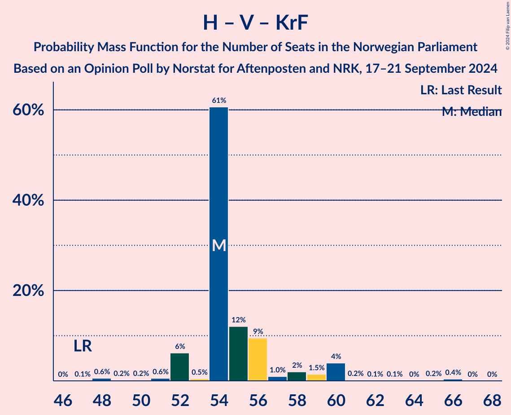

| Number of Seats | Probability | Accumulated | Special Marks |
|:---------------:|:-----------:|:-----------:|:-------------:|
| 47 | 0.1% | 100% | Last Result |
| 48 | 0.6% | 99.9% |  |
| 49 | 0.2% | 99.3% |  |
| 50 | 0.2% | 99.1% |  |
| 51 | 0.6% | 98.9% |  |
| 52 | 6% | 98% |  |
| 53 | 0.5% | 92% |  |
| 54 | 61% | 92% | Median |
| 55 | 12% | 31% |  |
| 56 | 9% | 19% |  |
| 57 | 1.0% | 9% |  |
| 58 | 2% | 8% |  |
| 59 | 1.5% | 6% |  |
| 60 | 4% | 5% |  |
| 61 | 0.2% | 1.0% |  |
| 62 | 0.1% | 0.8% |  |
| 63 | 0.1% | 0.7% |  |
| 64 | 0% | 0.6% |  |
| 65 | 0.2% | 0.6% |  |
| 66 | 0.4% | 0.4% |  |
| 67 | 0% | 0% |  |

### Arbeiderpartiet – Senterpartiet – Miljøpartiet De Grønne – Kristelig Folkeparti

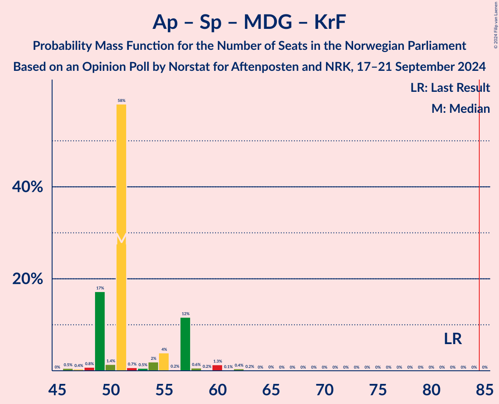

| Number of Seats | Probability | Accumulated | Special Marks |
|:---------------:|:-----------:|:-----------:|:-------------:|
| 45 | 0% | 100% |  |
| 46 | 0.5% | 99.9% |  |
| 47 | 0.4% | 99.4% |  |
| 48 | 0.8% | 99.0% |  |
| 49 | 17% | 98% |  |
| 50 | 1.4% | 81% |  |
| 51 | 58% | 80% | Median |
| 52 | 0.7% | 22% |  |
| 53 | 0.5% | 21% |  |
| 54 | 2% | 20% |  |
| 55 | 4% | 19% |  |
| 56 | 0.2% | 15% |  |
| 57 | 12% | 14% |  |
| 58 | 0.6% | 3% |  |
| 59 | 0.2% | 2% |  |
| 60 | 1.3% | 2% |  |
| 61 | 0.1% | 0.8% |  |
| 62 | 0.4% | 0.6% |  |
| 63 | 0.2% | 0.2% |  |
| 64 | 0% | 0.1% |  |
| 65 | 0% | 0% |  |
| 66 | 0% | 0% |  |
| 67 | 0% | 0% |  |
| 68 | 0% | 0% |  |
| 69 | 0% | 0% |  |
| 70 | 0% | 0% |  |
| 71 | 0% | 0% |  |
| 72 | 0% | 0% |  |
| 73 | 0% | 0% |  |
| 74 | 0% | 0% |  |
| 75 | 0% | 0% |  |
| 76 | 0% | 0% |  |
| 77 | 0% | 0% |  |
| 78 | 0% | 0% |  |
| 79 | 0% | 0% |  |
| 80 | 0% | 0% |  |
| 81 | 0% | 0% |  |
| 82 | 0% | 0% | Last Result |

### Arbeiderpartiet – Sosialistisk Venstreparti

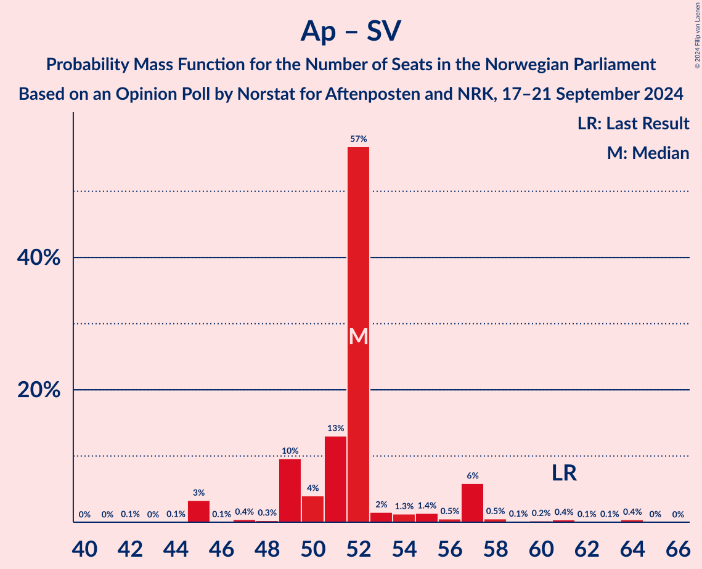

| Number of Seats | Probability | Accumulated | Special Marks |
|:---------------:|:-----------:|:-----------:|:-------------:|
| 42 | 0.1% | 100% |  |
| 43 | 0% | 99.9% |  |
| 44 | 0.1% | 99.9% |  |
| 45 | 3% | 99.9% |  |
| 46 | 0.1% | 97% |  |
| 47 | 0.4% | 97% |  |
| 48 | 0.3% | 96% |  |
| 49 | 10% | 96% |  |
| 50 | 4% | 86% |  |
| 51 | 13% | 82% |  |
| 52 | 57% | 69% | Median |
| 53 | 2% | 12% |  |
| 54 | 1.3% | 11% |  |
| 55 | 1.4% | 10% |  |
| 56 | 0.5% | 8% |  |
| 57 | 6% | 8% |  |
| 58 | 0.5% | 2% |  |
| 59 | 0.1% | 1.3% |  |
| 60 | 0.2% | 1.2% |  |
| 61 | 0.4% | 1.0% | Last Result |
| 62 | 0.1% | 0.6% |  |
| 63 | 0.1% | 0.5% |  |
| 64 | 0.4% | 0.5% |  |
| 65 | 0% | 0% |  |

### Arbeiderpartiet – Senterpartiet – Kristelig Folkeparti

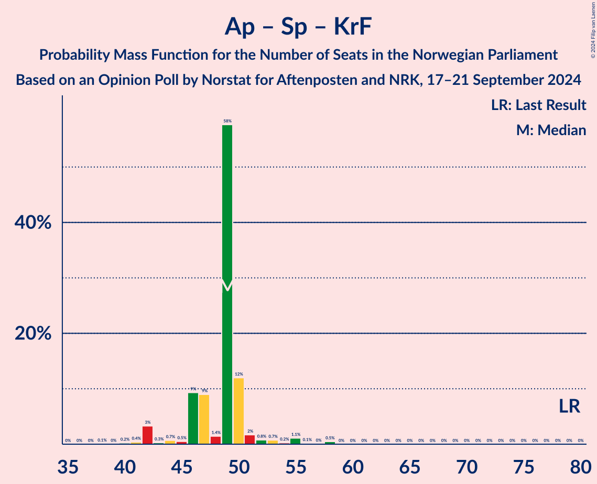

| Number of Seats | Probability | Accumulated | Special Marks |
|:---------------:|:-----------:|:-----------:|:-------------:|
| 38 | 0.1% | 100% |  |
| 39 | 0% | 99.9% |  |
| 40 | 0.2% | 99.9% |  |
| 41 | 0.4% | 99.7% |  |
| 42 | 3% | 99.3% |  |
| 43 | 0.3% | 96% |  |
| 44 | 0.7% | 96% |  |
| 45 | 0.5% | 95% |  |
| 46 | 9% | 95% |  |
| 47 | 9% | 85% |  |
| 48 | 1.4% | 76% |  |
| 49 | 58% | 75% | Median |
| 50 | 12% | 17% |  |
| 51 | 2% | 5% |  |
| 52 | 0.8% | 4% |  |
| 53 | 0.7% | 3% |  |
| 54 | 0.2% | 2% |  |
| 55 | 1.1% | 2% |  |
| 56 | 0.1% | 0.7% |  |
| 57 | 0% | 0.5% |  |
| 58 | 0.5% | 0.5% |  |
| 59 | 0% | 0% |  |
| 60 | 0% | 0% |  |
| 61 | 0% | 0% |  |
| 62 | 0% | 0% |  |
| 63 | 0% | 0% |  |
| 64 | 0% | 0% |  |
| 65 | 0% | 0% |  |
| 66 | 0% | 0% |  |
| 67 | 0% | 0% |  |
| 68 | 0% | 0% |  |
| 69 | 0% | 0% |  |
| 70 | 0% | 0% |  |
| 71 | 0% | 0% |  |
| 72 | 0% | 0% |  |
| 73 | 0% | 0% |  |
| 74 | 0% | 0% |  |
| 75 | 0% | 0% |  |
| 76 | 0% | 0% |  |
| 77 | 0% | 0% |  |
| 78 | 0% | 0% |  |
| 79 | 0% | 0% | Last Result |

### Arbeiderpartiet – Senterpartiet

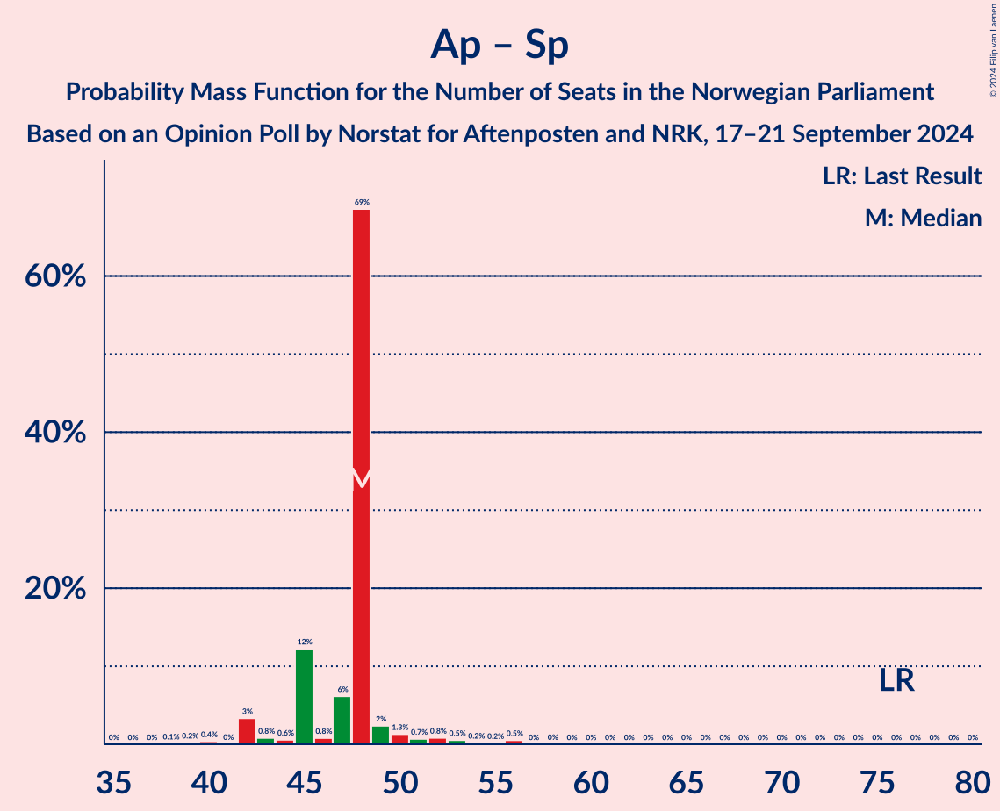

| Number of Seats | Probability | Accumulated | Special Marks |
|:---------------:|:-----------:|:-----------:|:-------------:|
| 38 | 0.1% | 100% |  |
| 39 | 0.2% | 99.9% |  |
| 40 | 0.4% | 99.7% |  |
| 41 | 0% | 99.3% |  |
| 42 | 3% | 99.3% |  |
| 43 | 0.8% | 96% |  |
| 44 | 0.6% | 95% |  |
| 45 | 12% | 95% |  |
| 46 | 0.8% | 82% |  |
| 47 | 6% | 81% |  |
| 48 | 69% | 75% | Median |
| 49 | 2% | 7% |  |
| 50 | 1.3% | 4% |  |
| 51 | 0.7% | 3% |  |
| 52 | 0.8% | 2% |  |
| 53 | 0.5% | 1.4% |  |
| 54 | 0.2% | 0.9% |  |
| 55 | 0.2% | 0.7% |  |
| 56 | 0.5% | 0.6% |  |
| 57 | 0% | 0% |  |
| 58 | 0% | 0% |  |
| 59 | 0% | 0% |  |
| 60 | 0% | 0% |  |
| 61 | 0% | 0% |  |
| 62 | 0% | 0% |  |
| 63 | 0% | 0% |  |
| 64 | 0% | 0% |  |
| 65 | 0% | 0% |  |
| 66 | 0% | 0% |  |
| 67 | 0% | 0% |  |
| 68 | 0% | 0% |  |
| 69 | 0% | 0% |  |
| 70 | 0% | 0% |  |
| 71 | 0% | 0% |  |
| 72 | 0% | 0% |  |
| 73 | 0% | 0% |  |
| 74 | 0% | 0% |  |
| 75 | 0% | 0% |  |
| 76 | 0% | 0% | Last Result |

### Senterpartiet – Venstre – Kristelig Folkeparti

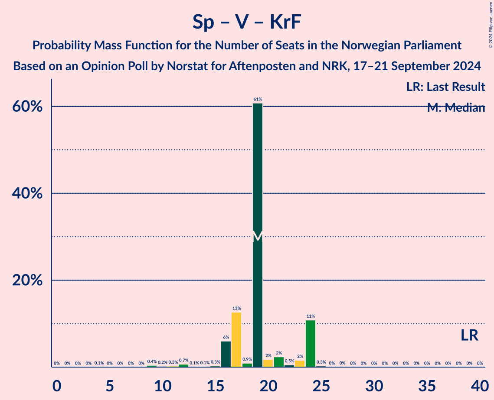

| Number of Seats | Probability | Accumulated | Special Marks |
|:---------------:|:-----------:|:-----------:|:-------------:|
| 4 | 0.1% | 100% |  |
| 5 | 0% | 99.9% |  |
| 6 | 0% | 99.9% |  |
| 7 | 0% | 99.9% |  |
| 8 | 0% | 99.9% |  |
| 9 | 0.4% | 99.9% |  |
| 10 | 0.2% | 99.5% |  |
| 11 | 0.3% | 99.3% |  |
| 12 | 0.7% | 99.0% |  |
| 13 | 0.1% | 98% |  |
| 14 | 0.1% | 98% |  |
| 15 | 0.3% | 98% |  |
| 16 | 6% | 98% |  |
| 17 | 13% | 92% |  |
| 18 | 0.9% | 79% |  |
| 19 | 61% | 78% | Median |
| 20 | 2% | 17% |  |
| 21 | 2% | 16% |  |
| 22 | 0.5% | 13% |  |
| 23 | 2% | 13% |  |
| 24 | 11% | 11% |  |
| 25 | 0.3% | 0.4% |  |
| 26 | 0% | 0.1% |  |
| 27 | 0% | 0.1% |  |
| 28 | 0% | 0% |  |
| 29 | 0% | 0% |  |
| 30 | 0% | 0% |  |
| 31 | 0% | 0% |  |
| 32 | 0% | 0% |  |
| 33 | 0% | 0% |  |
| 34 | 0% | 0% |  |
| 35 | 0% | 0% |  |
| 36 | 0% | 0% |  |
| 37 | 0% | 0% |  |
| 38 | 0% | 0% |  |
| 39 | 0% | 0% | Last Result |

## Technical Information

### Opinion Poll

+ **Polling firm:** Norstat
+ **Commissioner(s):** Aftenposten and NRK
+ **Fieldwork period:** 17–21 September 2024

### Calculations

+ **Sample size:** 993
+ **Simulations done:** 1,048,576
+ **Error estimate:** 2.61%

