# Opinion Poll by Opinion Perduco for ABC Nyheter and Altinget, 23–30 September 2024

<a href="#voting-intentions">Voting Intentions</a> | <a href="#seats">Seats</a> | <a href="#coalitions">Coalitions</a> | <a href="#technical-information">Technical Information</a>

## Voting Intentions

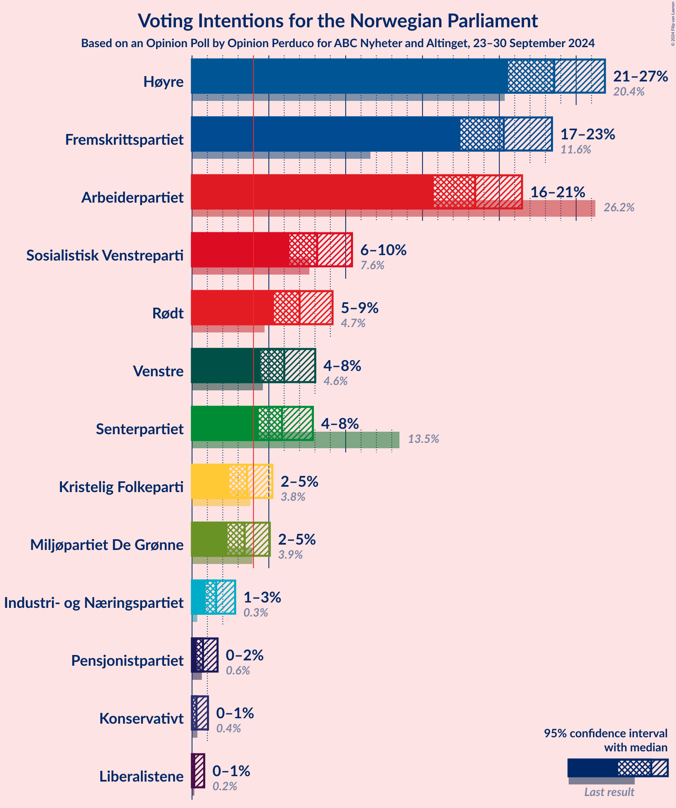

### Confidence Intervals

| Party | Last Result | Poll Result | 80% Confidence Interval | 90% Confidence Interval | 95% Confidence Interval | 99% Confidence Interval |
|:-----:|:-----------:|:-----------:|:-----------------------:|:-----------------------:|:-----------------------:|:-----------------------:|
| Høyre | 20.4% | 23.6% | 21.6–25.7% |21.0–26.3% |20.6–26.9% |19.7–27.9% |
| Fremskrittspartiet | 11.6% | 20.3% | 18.4–22.3% |17.9–22.9% |17.5–23.4% |16.6–24.4% |
| Arbeiderpartiet | 26.2% | 18.4% | 16.7–20.4% |16.2–21.0% |15.7–21.5% |14.9–22.5% |
| Sosialistisk Venstreparti | 7.6% | 8.1% | 7.0–9.6% |6.6–10.0% |6.3–10.4% |5.8–11.2% |
| Rødt | 4.7% | 7.0% | 5.9–8.4% |5.6–8.8% |5.3–9.1% |4.8–9.8% |
| Venstre | 4.6% | 6.0% | 5.0–7.3% |4.7–7.7% |4.5–8.0% |4.0–8.7% |
| Senterpartiet | 13.5% | 5.9% | 4.9–7.2% |4.6–7.5% |4.3–7.9% |3.9–8.5% |
| Kristelig Folkeparti | 3.8% | 3.6% | 2.8–4.6% |2.6–5.0% |2.4–5.2% |2.1–5.8% |
| Miljøpartiet De Grønne | 3.9% | 3.4% | 2.7–4.5% |2.5–4.8% |2.3–5.1% |2.0–5.6% |
| Industri- og Næringspartiet | 0.3% | 1.6% | 1.1–2.4% |1.0–2.6% |0.9–2.8% |0.7–3.2% |
| Pensjonistpartiet | 0.6% | 0.7% | 0.4–1.3% |0.4–1.5% |0.3–1.7% |0.2–2.0% |
| Konservativt | 0.4% | 0.3% | 0.2–0.8% |0.1–0.9% |0.1–1.0% |0.0–1.3% |
| Liberalistene | 0.2% | 0.1% | 0.1–0.6% |0.0–0.7% |0.0–0.8% |0.0–1.1% |

*Note:* The poll result column reflects the actual value used in the calculations. Published results may vary slightly, and in addition be rounded to fewer digits.

## Seats

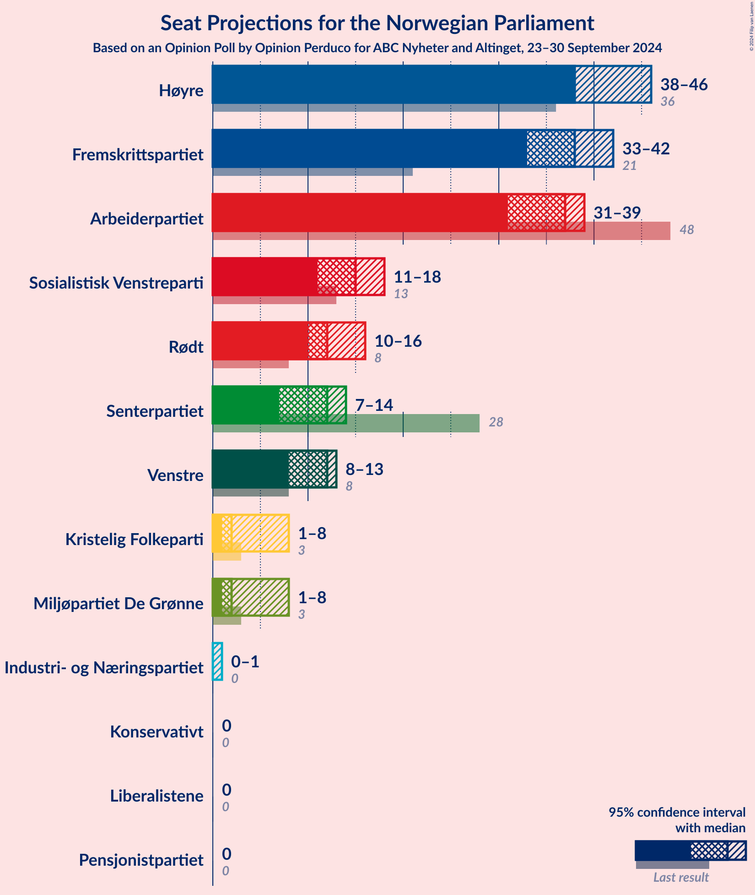

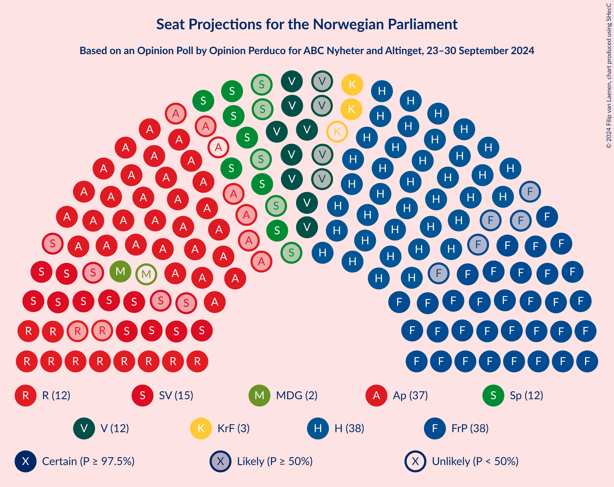

### Confidence Intervals

| Party | Last Result | Median | 80% Confidence Interval | 90% Confidence Interval | 95% Confidence Interval | 99% Confidence Interval |
|:-----:|:-----------:|:------:|:-----------------------:|:-----------------------:|:-----------------------:|:-----------------------:|
| <a href="#høyre">Høyre</a> | 36 | 38 | 38–44 |38–46 |38–46 |35–49 |
| <a href="#fremskrittspartiet">Fremskrittspartiet</a> | 21 | 38 | 35–42 |34–42 |33–42 |31–45 |
| <a href="#arbeiderpartiet">Arbeiderpartiet</a> | 48 | 37 | 32–37 |31–38 |31–39 |30–40 |
| <a href="#sosialistisk-venstreparti">Sosialistisk Venstreparti</a> | 13 | 15 | 11–16 |11–17 |11–18 |10–20 |
| <a href="#rødt">Rødt</a> | 8 | 12 | 11–15 |10–16 |10–16 |8–18 |
| <a href="#venstre">Venstre</a> | 8 | 12 | 8–12 |8–12 |8–13 |7–14 |
| <a href="#senterpartiet">Senterpartiet</a> | 28 | 12 | 9–12 |8–14 |7–14 |1–15 |
| <a href="#kristelig-folkeparti">Kristelig Folkeparti</a> | 3 | 2 | 2–7 |1–8 |1–8 |0–9 |
| <a href="#miljøpartiet-de-grønne">Miljøpartiet De Grønne</a> | 3 | 2 | 1–3 |1–7 |1–8 |1–9 |
| <a href="#industri--og-næringspartiet">Industri- og Næringspartiet</a> | 0 | 0 | 0 |0 |0–1 |0–2 |
| <a href="#pensjonistpartiet">Pensjonistpartiet</a> | 0 | 0 | 0 |0 |0 |0 |
| <a href="#konservativt">Konservativt</a> | 0 | 0 | 0 |0 |0 |0 |
| <a href="#liberalistene">Liberalistene</a> | 0 | 0 | 0 |0 |0 |0 |

### Høyre

*For a full overview of the results for this party, see the [Høyre](party-høyre.html) page.*

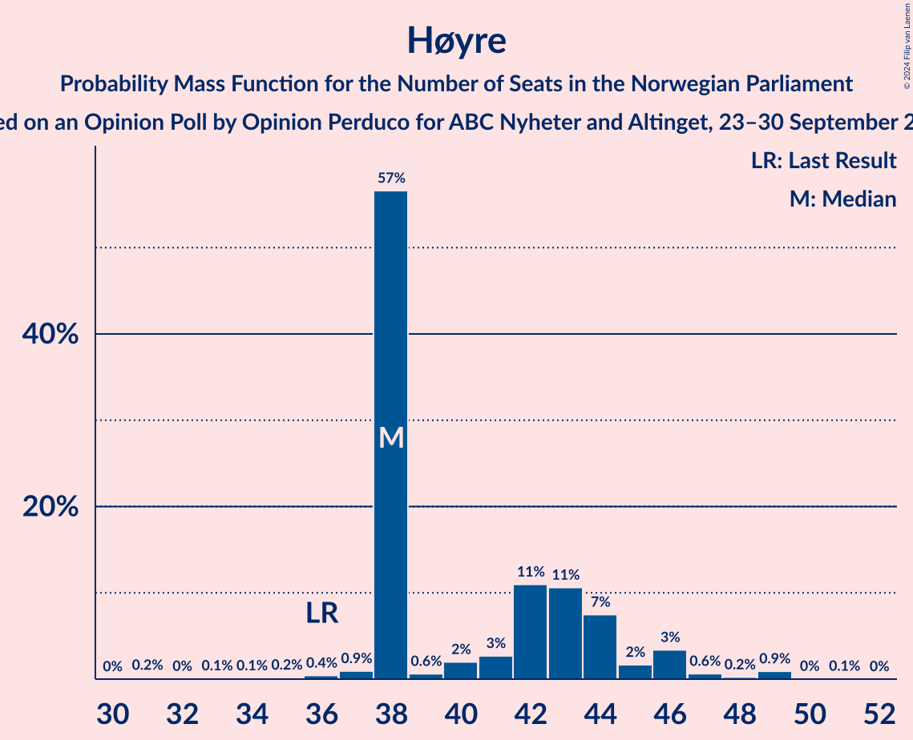

| Number of Seats | Probability | Accumulated | Special Marks |
|:---------------:|:-----------:|:-----------:|:-------------:|
| 31 | 0.2% | 100% |  |
| 32 | 0% | 99.8% |  |
| 33 | 0.1% | 99.8% |  |
| 34 | 0.1% | 99.7% |  |
| 35 | 0.2% | 99.5% |  |
| 36 | 0.4% | 99.4% | Last Result |
| 37 | 0.9% | 98.9% |  |
| 38 | 57% | 98% | Median |
| 39 | 0.6% | 41% |  |
| 40 | 2% | 41% |  |
| 41 | 3% | 39% |  |
| 42 | 11% | 36% |  |
| 43 | 11% | 25% |  |
| 44 | 7% | 14% |  |
| 45 | 2% | 7% |  |
| 46 | 3% | 5% |  |
| 47 | 0.6% | 2% |  |
| 48 | 0.2% | 1.3% |  |
| 49 | 0.9% | 1.0% |  |
| 50 | 0% | 0.1% |  |
| 51 | 0.1% | 0.1% |  |
| 52 | 0% | 0% |  |

### Fremskrittspartiet

*For a full overview of the results for this party, see the [Fremskrittspartiet](party-fremskrittspartiet.html) page.*

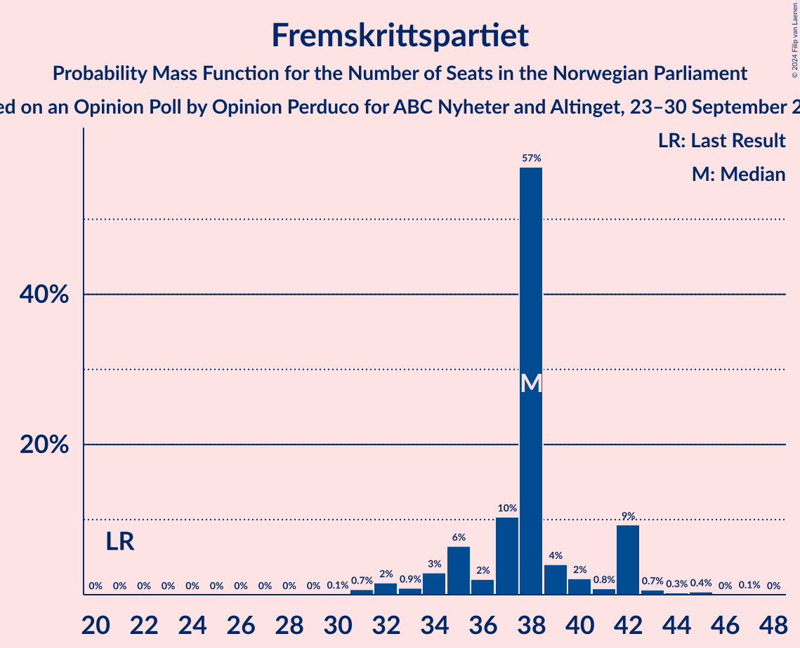

| Number of Seats | Probability | Accumulated | Special Marks |
|:---------------:|:-----------:|:-----------:|:-------------:|
| 21 | 0% | 100% | Last Result |
| 22 | 0% | 100% |  |
| 23 | 0% | 100% |  |
| 24 | 0% | 100% |  |
| 25 | 0% | 100% |  |
| 26 | 0% | 100% |  |
| 27 | 0% | 100% |  |
| 28 | 0% | 100% |  |
| 29 | 0% | 100% |  |
| 30 | 0.1% | 100% |  |
| 31 | 0.7% | 99.9% |  |
| 32 | 2% | 99.1% |  |
| 33 | 0.9% | 98% |  |
| 34 | 3% | 97% |  |
| 35 | 6% | 94% |  |
| 36 | 2% | 87% |  |
| 37 | 10% | 85% |  |
| 38 | 57% | 75% | Median |
| 39 | 4% | 18% |  |
| 40 | 2% | 14% |  |
| 41 | 0.8% | 12% |  |
| 42 | 9% | 11% |  |
| 43 | 0.7% | 1.5% |  |
| 44 | 0.3% | 0.8% |  |
| 45 | 0.4% | 0.6% |  |
| 46 | 0% | 0.2% |  |
| 47 | 0.1% | 0.1% |  |
| 48 | 0% | 0% |  |

### Arbeiderpartiet

*For a full overview of the results for this party, see the [Arbeiderpartiet](party-arbeiderpartiet.html) page.*

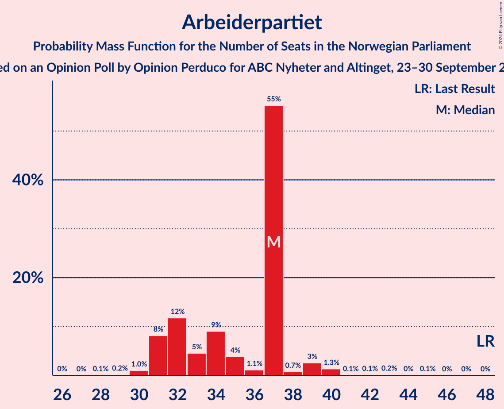

| Number of Seats | Probability | Accumulated | Special Marks |
|:---------------:|:-----------:|:-----------:|:-------------:|
| 27 | 0% | 100% |  |
| 28 | 0.1% | 99.9% |  |
| 29 | 0.2% | 99.9% |  |
| 30 | 1.0% | 99.7% |  |
| 31 | 8% | 98.7% |  |
| 32 | 12% | 91% |  |
| 33 | 5% | 79% |  |
| 34 | 9% | 74% |  |
| 35 | 4% | 65% |  |
| 36 | 1.1% | 61% |  |
| 37 | 55% | 60% | Median |
| 38 | 0.7% | 5% |  |
| 39 | 3% | 4% |  |
| 40 | 1.3% | 2% |  |
| 41 | 0.1% | 0.4% |  |
| 42 | 0.1% | 0.4% |  |
| 43 | 0.2% | 0.3% |  |
| 44 | 0% | 0.1% |  |
| 45 | 0.1% | 0.1% |  |
| 46 | 0% | 0% |  |
| 47 | 0% | 0% |  |
| 48 | 0% | 0% | Last Result |

### Sosialistisk Venstreparti

*For a full overview of the results for this party, see the [Sosialistisk Venstreparti](party-sosialistiskvenstreparti.html) page.*

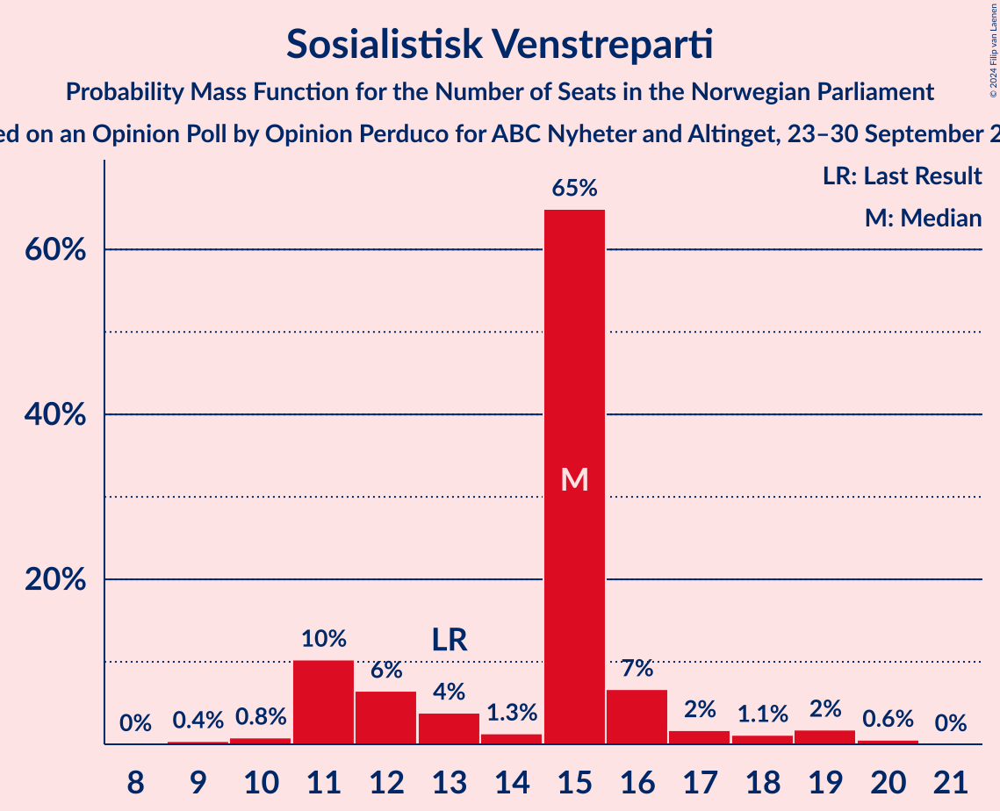

| Number of Seats | Probability | Accumulated | Special Marks |
|:---------------:|:-----------:|:-----------:|:-------------:|
| 8 | 0% | 100% |  |
| 9 | 0.4% | 99.9% |  |
| 10 | 0.8% | 99.5% |  |
| 11 | 10% | 98.7% |  |
| 12 | 6% | 88% |  |
| 13 | 4% | 82% | Last Result |
| 14 | 1.3% | 78% |  |
| 15 | 65% | 77% | Median |
| 16 | 7% | 12% |  |
| 17 | 2% | 5% |  |
| 18 | 1.1% | 4% |  |
| 19 | 2% | 2% |  |
| 20 | 0.6% | 0.6% |  |
| 21 | 0% | 0% |  |

### Rødt

*For a full overview of the results for this party, see the [Rødt](party-rødt.html) page.*

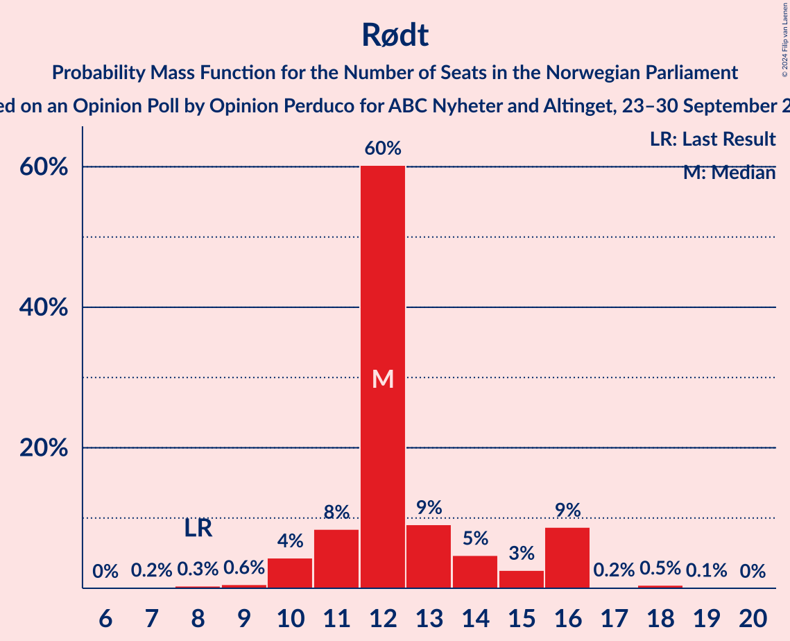

| Number of Seats | Probability | Accumulated | Special Marks |
|:---------------:|:-----------:|:-----------:|:-------------:|
| 7 | 0.2% | 100% |  |
| 8 | 0.3% | 99.8% | Last Result |
| 9 | 0.6% | 99.5% |  |
| 10 | 4% | 98.9% |  |
| 11 | 8% | 95% |  |
| 12 | 60% | 86% | Median |
| 13 | 9% | 26% |  |
| 14 | 5% | 17% |  |
| 15 | 3% | 12% |  |
| 16 | 9% | 10% |  |
| 17 | 0.2% | 0.8% |  |
| 18 | 0.5% | 0.6% |  |
| 19 | 0.1% | 0.2% |  |
| 20 | 0% | 0% |  |

### Venstre

*For a full overview of the results for this party, see the [Venstre](party-venstre.html) page.*

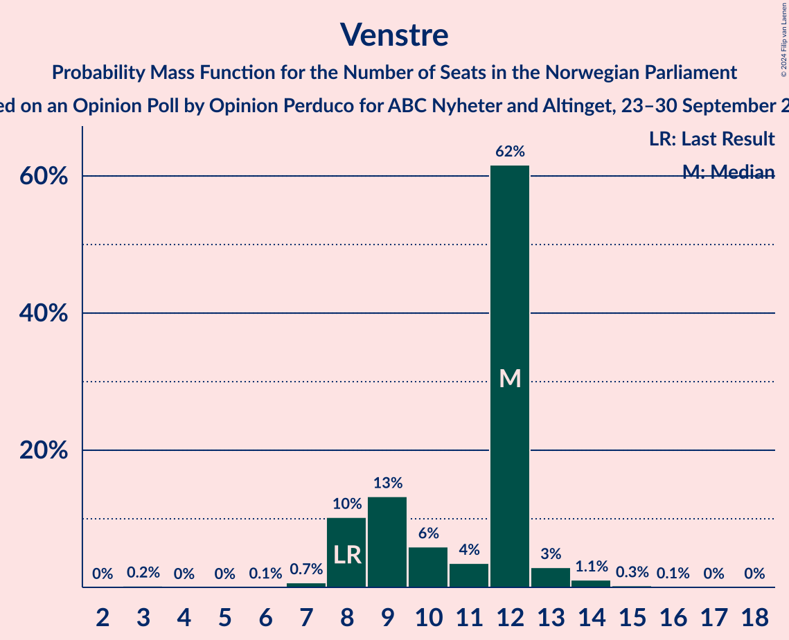

| Number of Seats | Probability | Accumulated | Special Marks |
|:---------------:|:-----------:|:-----------:|:-------------:|
| 3 | 0.2% | 100% |  |
| 4 | 0% | 99.8% |  |
| 5 | 0% | 99.8% |  |
| 6 | 0.1% | 99.8% |  |
| 7 | 0.7% | 99.7% |  |
| 8 | 10% | 99.0% | Last Result |
| 9 | 13% | 89% |  |
| 10 | 6% | 76% |  |
| 11 | 4% | 70% |  |
| 12 | 62% | 66% | Median |
| 13 | 3% | 4% |  |
| 14 | 1.1% | 2% |  |
| 15 | 0.3% | 0.4% |  |
| 16 | 0.1% | 0.2% |  |
| 17 | 0% | 0.1% |  |
| 18 | 0% | 0% |  |

### Senterpartiet

*For a full overview of the results for this party, see the [Senterpartiet](party-senterpartiet.html) page.*

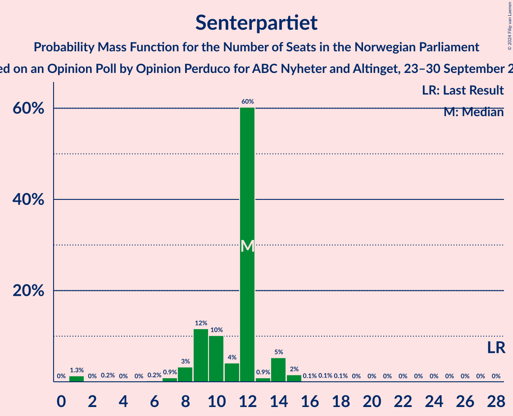

| Number of Seats | Probability | Accumulated | Special Marks |
|:---------------:|:-----------:|:-----------:|:-------------:|
| 1 | 1.3% | 100% |  |
| 2 | 0% | 98.7% |  |
| 3 | 0.2% | 98.7% |  |
| 4 | 0% | 98% |  |
| 5 | 0% | 98% |  |
| 6 | 0.2% | 98% |  |
| 7 | 0.9% | 98% |  |
| 8 | 3% | 97% |  |
| 9 | 12% | 94% |  |
| 10 | 10% | 82% |  |
| 11 | 4% | 72% |  |
| 12 | 60% | 68% | Median |
| 13 | 0.9% | 8% |  |
| 14 | 5% | 7% |  |
| 15 | 2% | 2% |  |
| 16 | 0.1% | 0.3% |  |
| 17 | 0.1% | 0.2% |  |
| 18 | 0.1% | 0.1% |  |
| 19 | 0% | 0% |  |
| 20 | 0% | 0% |  |
| 21 | 0% | 0% |  |
| 22 | 0% | 0% |  |
| 23 | 0% | 0% |  |
| 24 | 0% | 0% |  |
| 25 | 0% | 0% |  |
| 26 | 0% | 0% |  |
| 27 | 0% | 0% |  |
| 28 | 0% | 0% | Last Result |

### Kristelig Folkeparti

*For a full overview of the results for this party, see the [Kristelig Folkeparti](party-kristeligfolkeparti.html) page.*

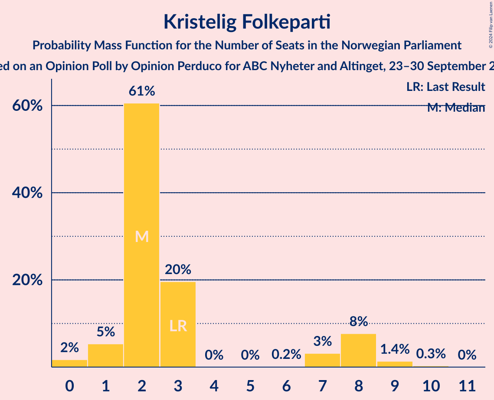

| Number of Seats | Probability | Accumulated | Special Marks |
|:---------------:|:-----------:|:-----------:|:-------------:|
| 0 | 2% | 100% |  |
| 1 | 5% | 98% |  |
| 2 | 61% | 93% | Median |
| 3 | 20% | 32% | Last Result |
| 4 | 0% | 13% |  |
| 5 | 0% | 13% |  |
| 6 | 0.2% | 13% |  |
| 7 | 3% | 13% |  |
| 8 | 8% | 9% |  |
| 9 | 1.4% | 2% |  |
| 10 | 0.3% | 0.4% |  |
| 11 | 0% | 0% |  |

### Miljøpartiet De Grønne

*For a full overview of the results for this party, see the [Miljøpartiet De Grønne](party-miljøpartietdegrønne.html) page.*

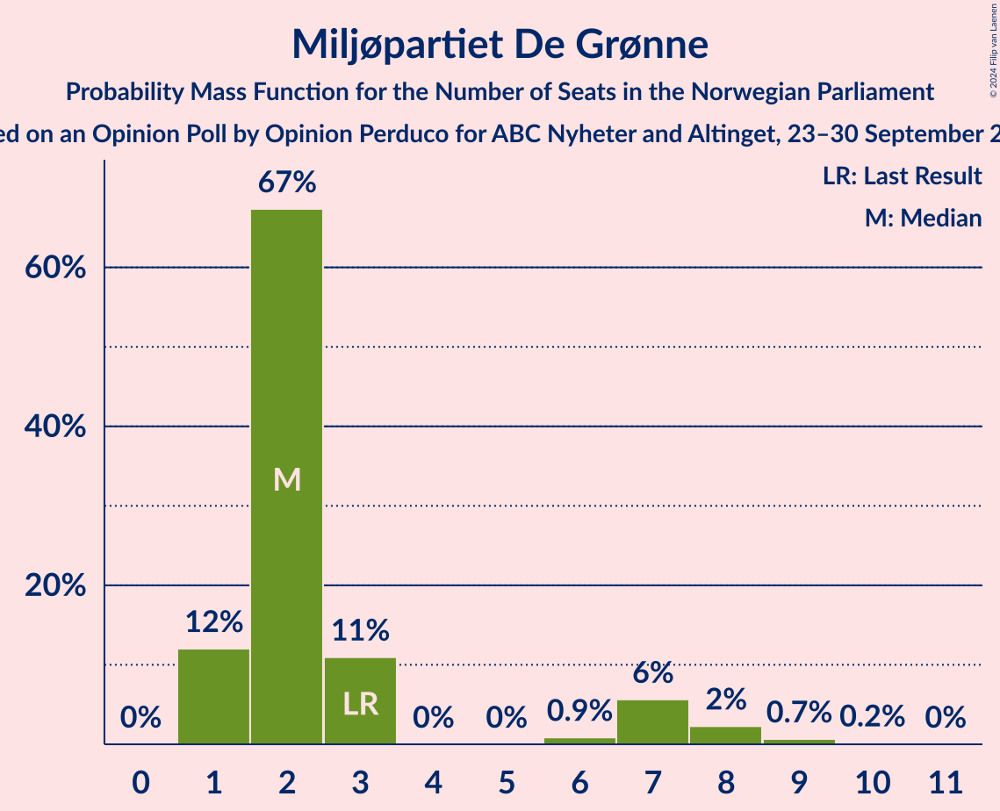

| Number of Seats | Probability | Accumulated | Special Marks |
|:---------------:|:-----------:|:-----------:|:-------------:|
| 1 | 12% | 100% |  |
| 2 | 67% | 88% | Median |
| 3 | 11% | 21% | Last Result |
| 4 | 0% | 10% |  |
| 5 | 0% | 10% |  |
| 6 | 0.9% | 10% |  |
| 7 | 6% | 9% |  |
| 8 | 2% | 3% |  |
| 9 | 0.7% | 0.8% |  |
| 10 | 0.2% | 0.2% |  |
| 11 | 0% | 0% |  |

### Industri- og Næringspartiet

*For a full overview of the results for this party, see the [Industri- og Næringspartiet](party-industri-ognæringspartiet.html) page.*

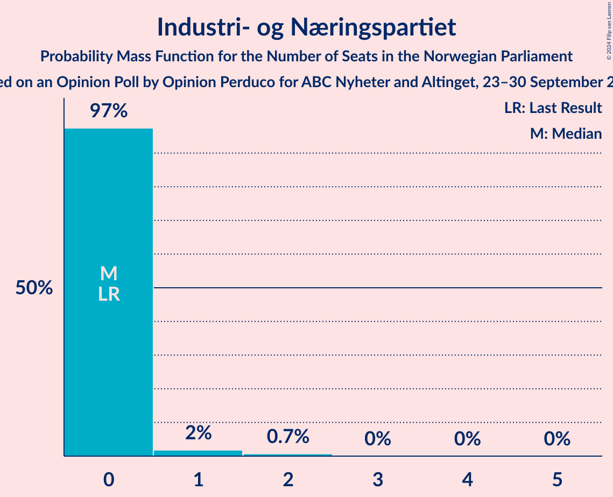

| Number of Seats | Probability | Accumulated | Special Marks |
|:---------------:|:-----------:|:-----------:|:-------------:|
| 0 | 97% | 100% | Last Result, Median |
| 1 | 2% | 3% |  |
| 2 | 0.7% | 0.7% |  |
| 3 | 0% | 0% |  |

### Pensjonistpartiet

*For a full overview of the results for this party, see the [Pensjonistpartiet](party-pensjonistpartiet.html) page.*

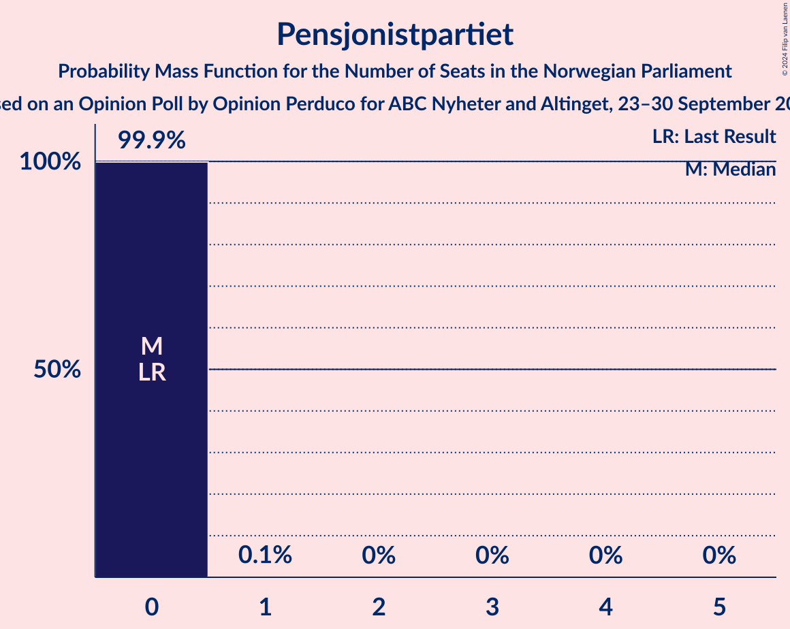

| Number of Seats | Probability | Accumulated | Special Marks |
|:---------------:|:-----------:|:-----------:|:-------------:|
| 0 | 99.9% | 100% | Last Result, Median |
| 1 | 0.1% | 0.1% |  |
| 2 | 0% | 0% |  |

### Konservativt

*For a full overview of the results for this party, see the [Konservativt](party-konservativt.html) page.*

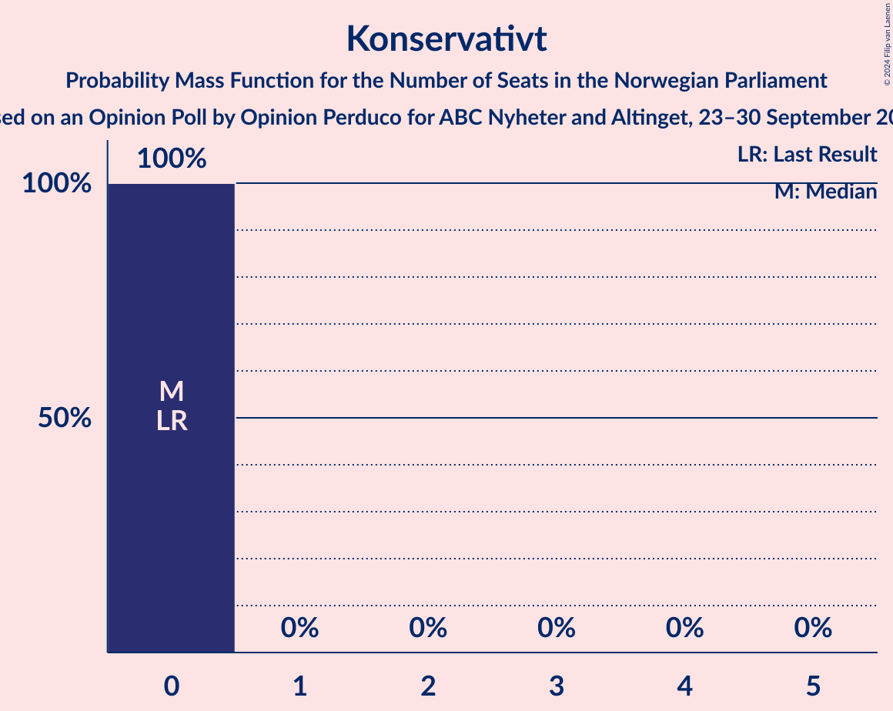

| Number of Seats | Probability | Accumulated | Special Marks |
|:---------------:|:-----------:|:-----------:|:-------------:|
| 0 | 100% | 100% | Last Result, Median |

### Liberalistene

*For a full overview of the results for this party, see the [Liberalistene](party-liberalistene.html) page.*

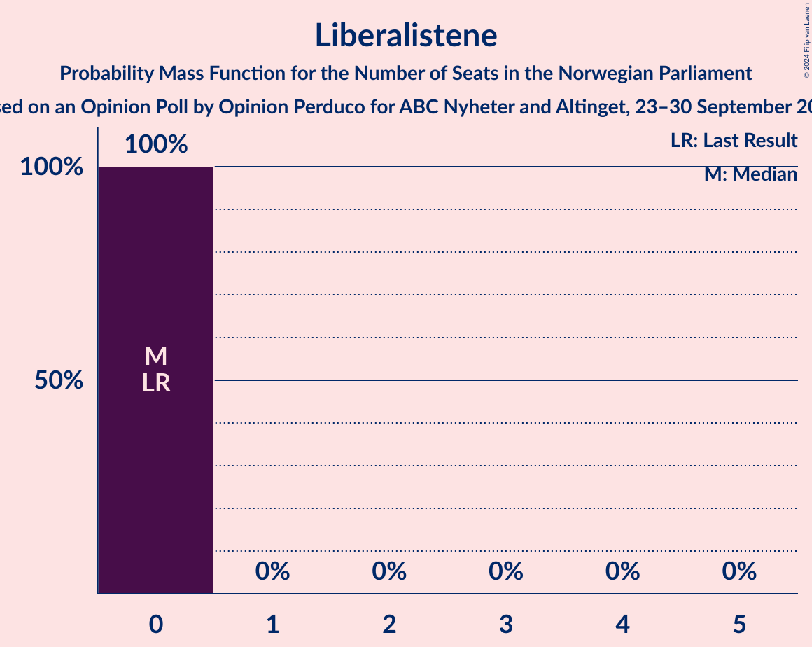

| Number of Seats | Probability | Accumulated | Special Marks |
|:---------------:|:-----------:|:-----------:|:-------------:|
| 0 | 100% | 100% | Last Result, Median |

## Coalitions

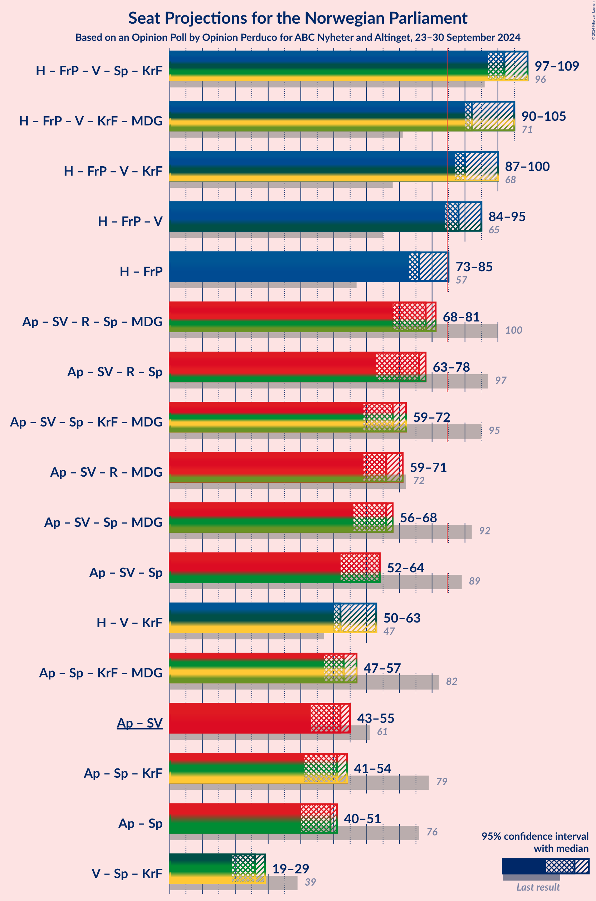

### Confidence Intervals

| Coalition | Last Result | Median | Majority? | 80% Confidence Interval | 90% Confidence Interval | 95% Confidence Interval | 99% Confidence Interval |
|:---------:|:-----------:|:------:|:---------:|:-----------------------:|:-----------------------:|:-----------------------:|:-----------------------:|
| Høyre – Fremskrittspartiet – Venstre – Senterpartiet – Kristelig Folkeparti | 96 | 102 | 100% | 102–107 | 101–108 | 97–109 | 96–111 |
| Høyre – Fremskrittspartiet – Venstre – Kristelig Folkeparti – Miljøpartiet De Grønne | 71 | 92 | 100% | 92–99 | 92–102 | 90–105 | 87–109 |
| Høyre – Fremskrittspartiet – Venstre – Kristelig Folkeparti | 68 | 90 | 98.5% | 90–96 | 89–97 | 87–100 | 84–107 |
| Høyre – Fremskrittspartiet – Venstre | 65 | 88 | 97% | 88–93 | 87–94 | 84–95 | 81–101 |
| Høyre – Fremskrittspartiet | 57 | 76 | 12% | 76–85 | 76–85 | 73–85 | 71–89 |
| Arbeiderpartiet – Sosialistisk Venstreparti – Rødt – Senterpartiet – Miljøpartiet De Grønne | 100 | 78 | 0.1% | 72–78 | 70–79 | 68–81 | 61–84 |
| Arbeiderpartiet – Sosialistisk Venstreparti – Rødt – Senterpartiet | 97 | 76 | 0% | 69–76 | 66–76 | 63–78 | 59–81 |
| Arbeiderpartiet – Sosialistisk Venstreparti – Senterpartiet – Kristelig Folkeparti – Miljøpartiet De Grønne | 95 | 68 | 0% | 59–68 | 59–69 | 59–72 | 57–76 |
| Arbeiderpartiet – Sosialistisk Venstreparti – Rødt – Miljøpartiet De Grønne | 72 | 66 | 0% | 61–66 | 60–67 | 59–71 | 57–72 |
| Arbeiderpartiet – Sosialistisk Venstreparti – Senterpartiet – Miljøpartiet De Grønne | 92 | 66 | 0% | 56–66 | 56–66 | 56–68 | 50–73 |
| Arbeiderpartiet – Sosialistisk Venstreparti – Senterpartiet | 89 | 64 | 0% | 53–64 | 53–64 | 52–64 | 48–70 |
| Høyre – Venstre – Kristelig Folkeparti | 47 | 52 | 0% | 52–59 | 52–60 | 50–63 | 46–67 |
| Arbeiderpartiet – Senterpartiet – Kristelig Folkeparti – Miljøpartiet De Grønne | 82 | 53 | 0% | 48–53 | 48–55 | 47–57 | 41–60 |
| Arbeiderpartiet – Sosialistisk Venstreparti | 61 | 52 | 0% | 43–52 | 43–52 | 43–55 | 42–58 |
| Arbeiderpartiet – Senterpartiet – Kristelig Folkeparti | 79 | 51 | 0% | 45–51 | 43–52 | 41–54 | 39–58 |
| Arbeiderpartiet – Senterpartiet | 76 | 49 | 0% | 42–49 | 40–49 | 40–51 | 33–52 |
| Venstre – Senterpartiet – Kristelig Folkeparti | 39 | 26 | 0% | 21–26 | 21–29 | 19–29 | 18–36 |

### Høyre – Fremskrittspartiet – Venstre – Senterpartiet – Kristelig Folkeparti

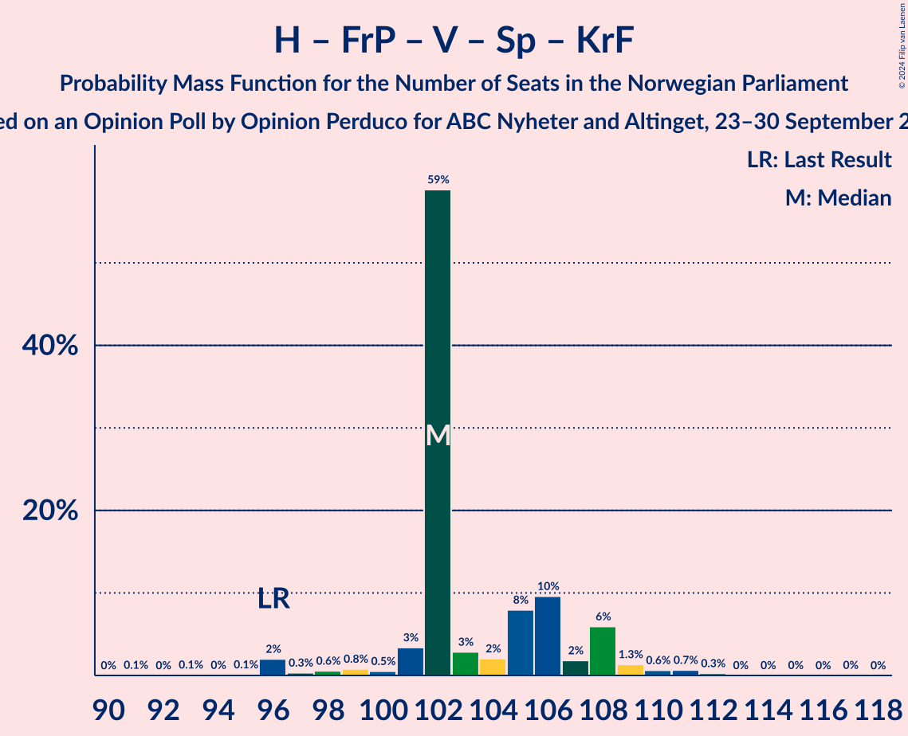

| Number of Seats | Probability | Accumulated | Special Marks |
|:---------------:|:-----------:|:-----------:|:-------------:|
| 91 | 0.1% | 100% |  |
| 92 | 0% | 99.9% |  |
| 93 | 0.1% | 99.9% |  |
| 94 | 0% | 99.8% |  |
| 95 | 0.1% | 99.8% |  |
| 96 | 2% | 99.7% | Last Result |
| 97 | 0.3% | 98% |  |
| 98 | 0.6% | 97% |  |
| 99 | 0.8% | 97% |  |
| 100 | 0.5% | 96% |  |
| 101 | 3% | 95% |  |
| 102 | 59% | 92% | Median |
| 103 | 3% | 33% |  |
| 104 | 2% | 30% |  |
| 105 | 8% | 28% |  |
| 106 | 10% | 20% |  |
| 107 | 2% | 11% |  |
| 108 | 6% | 9% |  |
| 109 | 1.3% | 3% |  |
| 110 | 0.6% | 2% |  |
| 111 | 0.7% | 1.0% |  |
| 112 | 0.3% | 0.4% |  |
| 113 | 0% | 0.1% |  |
| 114 | 0% | 0.1% |  |
| 115 | 0% | 0.1% |  |
| 116 | 0% | 0.1% |  |
| 117 | 0% | 0% |  |

### Høyre – Fremskrittspartiet – Venstre – Kristelig Folkeparti – Miljøpartiet De Grønne

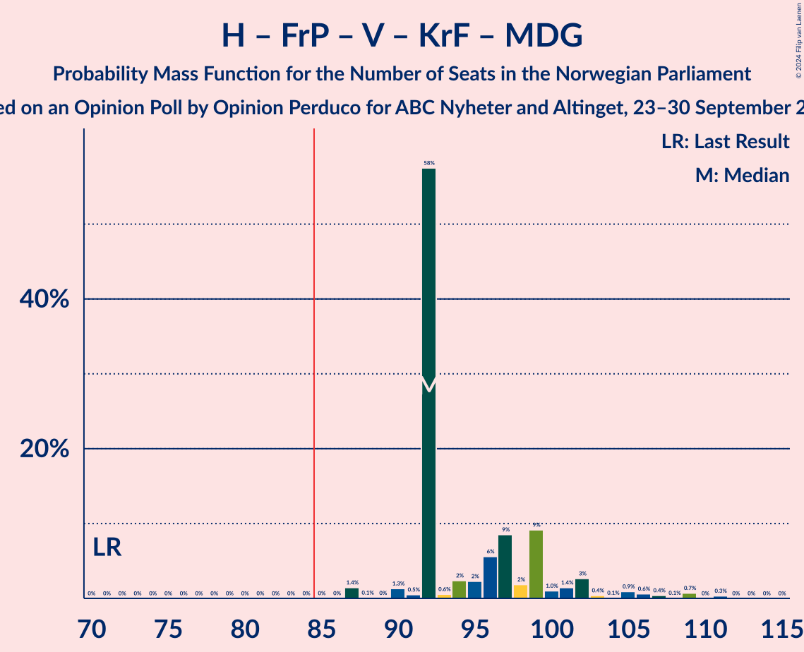

| Number of Seats | Probability | Accumulated | Special Marks |
|:---------------:|:-----------:|:-----------:|:-------------:|
| 71 | 0% | 100% | Last Result |
| 72 | 0% | 100% |  |
| 73 | 0% | 100% |  |
| 74 | 0% | 100% |  |
| 75 | 0% | 100% |  |
| 76 | 0% | 100% |  |
| 77 | 0% | 100% |  |
| 78 | 0% | 100% |  |
| 79 | 0% | 100% |  |
| 80 | 0% | 100% |  |
| 81 | 0% | 100% |  |
| 82 | 0% | 100% |  |
| 83 | 0% | 100% |  |
| 84 | 0% | 100% |  |
| 85 | 0% | 100% | Majority |
| 86 | 0% | 100% |  |
| 87 | 1.4% | 99.9% |  |
| 88 | 0.1% | 98% |  |
| 89 | 0% | 98% |  |
| 90 | 1.3% | 98% |  |
| 91 | 0.5% | 97% |  |
| 92 | 58% | 97% | Median |
| 93 | 0.6% | 39% |  |
| 94 | 2% | 38% |  |
| 95 | 2% | 36% |  |
| 96 | 6% | 34% |  |
| 97 | 9% | 28% |  |
| 98 | 2% | 20% |  |
| 99 | 9% | 18% |  |
| 100 | 1.0% | 9% |  |
| 101 | 1.4% | 8% |  |
| 102 | 3% | 6% |  |
| 103 | 0.4% | 4% |  |
| 104 | 0.1% | 3% |  |
| 105 | 0.9% | 3% |  |
| 106 | 0.6% | 2% |  |
| 107 | 0.4% | 2% |  |
| 108 | 0.1% | 1.1% |  |
| 109 | 0.7% | 1.1% |  |
| 110 | 0% | 0.3% |  |
| 111 | 0.3% | 0.3% |  |
| 112 | 0% | 0% |  |

### Høyre – Fremskrittspartiet – Venstre – Kristelig Folkeparti

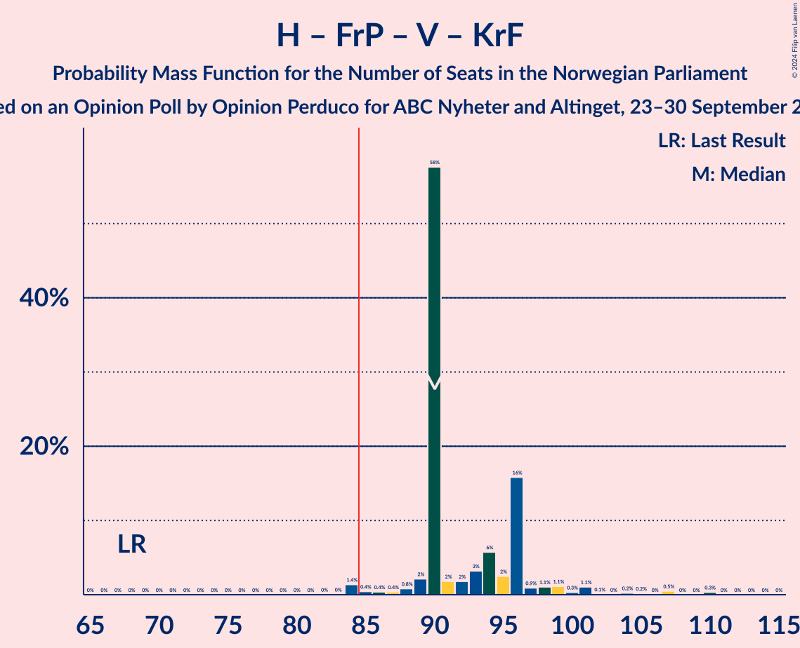

| Number of Seats | Probability | Accumulated | Special Marks |
|:---------------:|:-----------:|:-----------:|:-------------:|
| 68 | 0% | 100% | Last Result |
| 69 | 0% | 100% |  |
| 70 | 0% | 100% |  |
| 71 | 0% | 100% |  |
| 72 | 0% | 100% |  |
| 73 | 0% | 100% |  |
| 74 | 0% | 100% |  |
| 75 | 0% | 100% |  |
| 76 | 0% | 100% |  |
| 77 | 0% | 100% |  |
| 78 | 0% | 100% |  |
| 79 | 0% | 100% |  |
| 80 | 0% | 100% |  |
| 81 | 0% | 100% |  |
| 82 | 0% | 100% |  |
| 83 | 0% | 100% |  |
| 84 | 1.4% | 99.9% |  |
| 85 | 0.4% | 98.5% | Majority |
| 86 | 0.4% | 98% |  |
| 87 | 0.4% | 98% |  |
| 88 | 0.8% | 97% |  |
| 89 | 2% | 97% |  |
| 90 | 58% | 94% | Median |
| 91 | 2% | 37% |  |
| 92 | 2% | 35% |  |
| 93 | 3% | 33% |  |
| 94 | 6% | 30% |  |
| 95 | 2% | 24% |  |
| 96 | 16% | 22% |  |
| 97 | 0.9% | 6% |  |
| 98 | 1.1% | 5% |  |
| 99 | 1.1% | 4% |  |
| 100 | 0.3% | 3% |  |
| 101 | 1.1% | 2% |  |
| 102 | 0.1% | 1.3% |  |
| 103 | 0% | 1.3% |  |
| 104 | 0.2% | 1.2% |  |
| 105 | 0.2% | 1.0% |  |
| 106 | 0% | 0.8% |  |
| 107 | 0.5% | 0.8% |  |
| 108 | 0% | 0.3% |  |
| 109 | 0% | 0.3% |  |
| 110 | 0.3% | 0.3% |  |
| 111 | 0% | 0% |  |

### Høyre – Fremskrittspartiet – Venstre

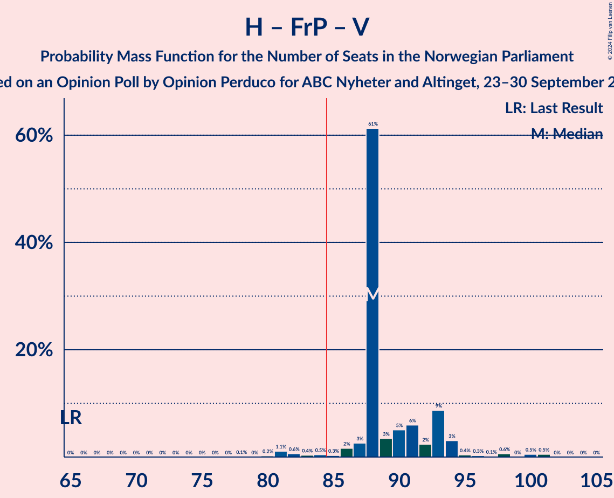

| Number of Seats | Probability | Accumulated | Special Marks |
|:---------------:|:-----------:|:-----------:|:-------------:|
| 65 | 0% | 100% | Last Result |
| 66 | 0% | 100% |  |
| 67 | 0% | 100% |  |
| 68 | 0% | 100% |  |
| 69 | 0% | 100% |  |
| 70 | 0% | 100% |  |
| 71 | 0% | 100% |  |
| 72 | 0% | 100% |  |
| 73 | 0% | 100% |  |
| 74 | 0% | 100% |  |
| 75 | 0% | 100% |  |
| 76 | 0% | 100% |  |
| 77 | 0% | 100% |  |
| 78 | 0.1% | 100% |  |
| 79 | 0% | 99.9% |  |
| 80 | 0.2% | 99.9% |  |
| 81 | 1.1% | 99.7% |  |
| 82 | 0.6% | 98.6% |  |
| 83 | 0.4% | 98% |  |
| 84 | 0.5% | 98% |  |
| 85 | 0.3% | 97% | Majority |
| 86 | 2% | 97% |  |
| 87 | 3% | 95% |  |
| 88 | 61% | 93% | Median |
| 89 | 3% | 31% |  |
| 90 | 5% | 28% |  |
| 91 | 6% | 23% |  |
| 92 | 2% | 17% |  |
| 93 | 9% | 14% |  |
| 94 | 3% | 6% |  |
| 95 | 0.4% | 3% |  |
| 96 | 0.3% | 2% |  |
| 97 | 0.1% | 2% |  |
| 98 | 0.6% | 2% |  |
| 99 | 0% | 1.1% |  |
| 100 | 0.5% | 1.1% |  |
| 101 | 0.5% | 0.5% |  |
| 102 | 0% | 0% |  |

### Høyre – Fremskrittspartiet

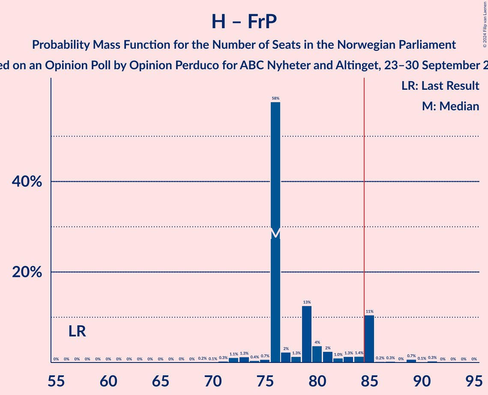

| Number of Seats | Probability | Accumulated | Special Marks |
|:---------------:|:-----------:|:-----------:|:-------------:|
| 57 | 0% | 100% | Last Result |
| 58 | 0% | 100% |  |
| 59 | 0% | 100% |  |
| 60 | 0% | 100% |  |
| 61 | 0% | 100% |  |
| 62 | 0% | 100% |  |
| 63 | 0% | 100% |  |
| 64 | 0% | 100% |  |
| 65 | 0% | 100% |  |
| 66 | 0% | 100% |  |
| 67 | 0% | 100% |  |
| 68 | 0% | 100% |  |
| 69 | 0.2% | 100% |  |
| 70 | 0.1% | 99.8% |  |
| 71 | 0.3% | 99.8% |  |
| 72 | 1.1% | 99.4% |  |
| 73 | 1.3% | 98% |  |
| 74 | 0.4% | 97% |  |
| 75 | 0.7% | 97% |  |
| 76 | 58% | 96% | Median |
| 77 | 2% | 38% |  |
| 78 | 1.3% | 36% |  |
| 79 | 13% | 35% |  |
| 80 | 4% | 22% |  |
| 81 | 2% | 18% |  |
| 82 | 1.0% | 16% |  |
| 83 | 1.3% | 15% |  |
| 84 | 1.4% | 14% |  |
| 85 | 11% | 12% | Majority |
| 86 | 0.2% | 2% |  |
| 87 | 0.3% | 1.5% |  |
| 88 | 0% | 1.2% |  |
| 89 | 0.7% | 1.2% |  |
| 90 | 0.1% | 0.5% |  |
| 91 | 0.3% | 0.3% |  |
| 92 | 0% | 0% |  |

### Arbeiderpartiet – Sosialistisk Venstreparti – Rødt – Senterpartiet – Miljøpartiet De Grønne

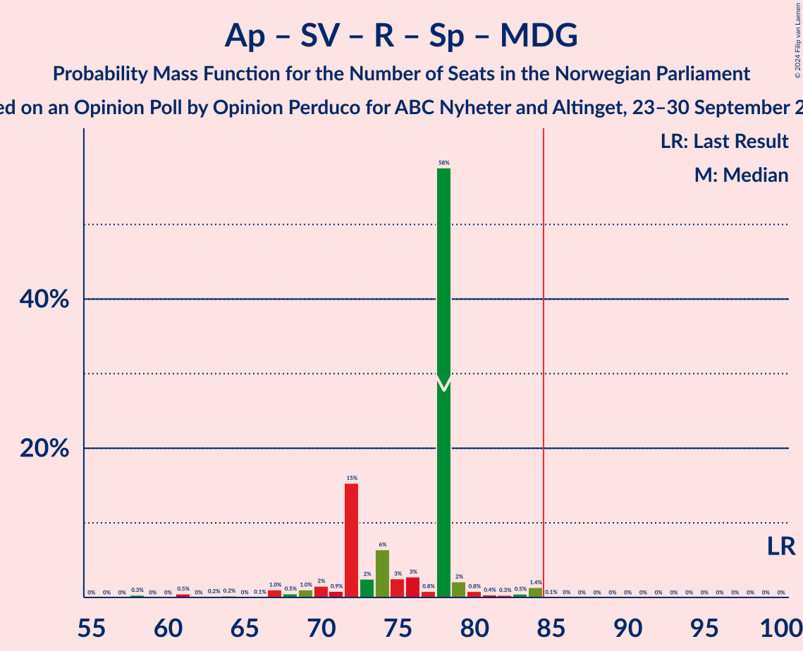

| Number of Seats | Probability | Accumulated | Special Marks |
|:---------------:|:-----------:|:-----------:|:-------------:|
| 58 | 0.3% | 100% |  |
| 59 | 0% | 99.7% |  |
| 60 | 0% | 99.7% |  |
| 61 | 0.5% | 99.7% |  |
| 62 | 0% | 99.2% |  |
| 63 | 0.2% | 99.2% |  |
| 64 | 0.2% | 99.0% |  |
| 65 | 0% | 98.7% |  |
| 66 | 0.1% | 98.7% |  |
| 67 | 1.0% | 98.6% |  |
| 68 | 0.5% | 98% |  |
| 69 | 1.0% | 97% |  |
| 70 | 2% | 96% |  |
| 71 | 0.9% | 94% |  |
| 72 | 15% | 94% |  |
| 73 | 2% | 78% |  |
| 74 | 6% | 76% |  |
| 75 | 3% | 69% |  |
| 76 | 3% | 67% |  |
| 77 | 0.8% | 64% |  |
| 78 | 58% | 63% | Median |
| 79 | 2% | 6% |  |
| 80 | 0.8% | 3% |  |
| 81 | 0.4% | 3% |  |
| 82 | 0.3% | 2% |  |
| 83 | 0.5% | 2% |  |
| 84 | 1.4% | 1.5% |  |
| 85 | 0.1% | 0.1% | Majority |
| 86 | 0% | 0% |  |
| 87 | 0% | 0% |  |
| 88 | 0% | 0% |  |
| 89 | 0% | 0% |  |
| 90 | 0% | 0% |  |
| 91 | 0% | 0% |  |
| 92 | 0% | 0% |  |
| 93 | 0% | 0% |  |
| 94 | 0% | 0% |  |
| 95 | 0% | 0% |  |
| 96 | 0% | 0% |  |
| 97 | 0% | 0% |  |
| 98 | 0% | 0% |  |
| 99 | 0% | 0% |  |
| 100 | 0% | 0% | Last Result |

### Arbeiderpartiet – Sosialistisk Venstreparti – Rødt – Senterpartiet

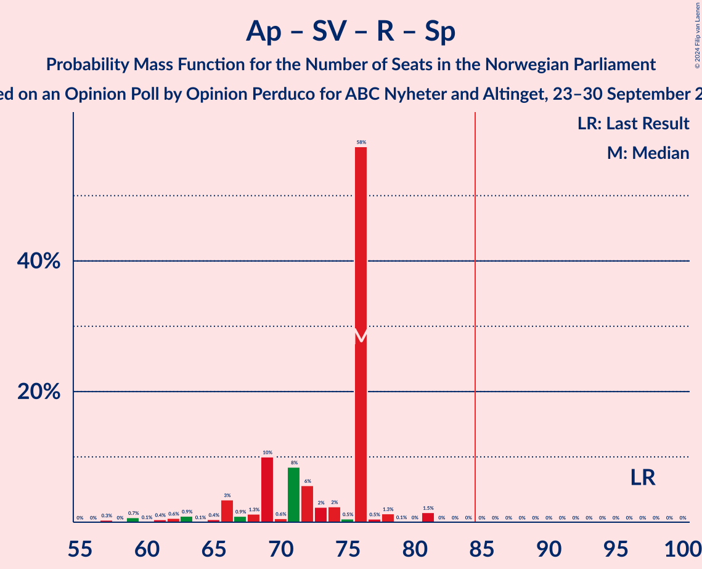

| Number of Seats | Probability | Accumulated | Special Marks |
|:---------------:|:-----------:|:-----------:|:-------------:|
| 57 | 0.3% | 100% |  |
| 58 | 0% | 99.7% |  |
| 59 | 0.7% | 99.7% |  |
| 60 | 0.1% | 98.9% |  |
| 61 | 0.4% | 98.9% |  |
| 62 | 0.6% | 98% |  |
| 63 | 0.9% | 98% |  |
| 64 | 0.1% | 97% |  |
| 65 | 0.4% | 97% |  |
| 66 | 3% | 96% |  |
| 67 | 0.9% | 93% |  |
| 68 | 1.3% | 92% |  |
| 69 | 10% | 91% |  |
| 70 | 0.6% | 81% |  |
| 71 | 8% | 80% |  |
| 72 | 6% | 72% |  |
| 73 | 2% | 66% |  |
| 74 | 2% | 64% |  |
| 75 | 0.5% | 61% |  |
| 76 | 58% | 61% | Median |
| 77 | 0.5% | 3% |  |
| 78 | 1.3% | 3% |  |
| 79 | 0.1% | 2% |  |
| 80 | 0% | 2% |  |
| 81 | 1.5% | 2% |  |
| 82 | 0% | 0.1% |  |
| 83 | 0% | 0% |  |
| 84 | 0% | 0% |  |
| 85 | 0% | 0% | Majority |
| 86 | 0% | 0% |  |
| 87 | 0% | 0% |  |
| 88 | 0% | 0% |  |
| 89 | 0% | 0% |  |
| 90 | 0% | 0% |  |
| 91 | 0% | 0% |  |
| 92 | 0% | 0% |  |
| 93 | 0% | 0% |  |
| 94 | 0% | 0% |  |
| 95 | 0% | 0% |  |
| 96 | 0% | 0% |  |
| 97 | 0% | 0% | Last Result |

### Arbeiderpartiet – Sosialistisk Venstreparti – Senterpartiet – Kristelig Folkeparti – Miljøpartiet De Grønne

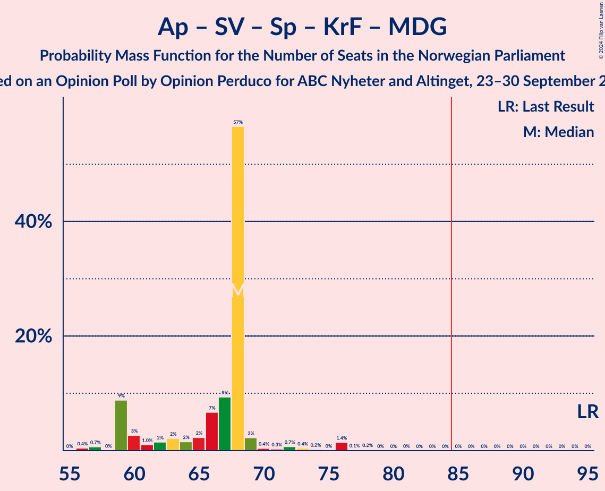

| Number of Seats | Probability | Accumulated | Special Marks |
|:---------------:|:-----------:|:-----------:|:-------------:|
| 56 | 0.4% | 100% |  |
| 57 | 0.7% | 99.5% |  |
| 58 | 0% | 98.8% |  |
| 59 | 9% | 98.8% |  |
| 60 | 3% | 90% |  |
| 61 | 1.0% | 87% |  |
| 62 | 2% | 86% |  |
| 63 | 2% | 85% |  |
| 64 | 2% | 83% |  |
| 65 | 2% | 81% |  |
| 66 | 7% | 79% |  |
| 67 | 9% | 72% |  |
| 68 | 57% | 63% | Median |
| 69 | 2% | 6% |  |
| 70 | 0.4% | 4% |  |
| 71 | 0.3% | 3% |  |
| 72 | 0.7% | 3% |  |
| 73 | 0.4% | 2% |  |
| 74 | 0.2% | 2% |  |
| 75 | 0% | 2% |  |
| 76 | 1.4% | 2% |  |
| 77 | 0.1% | 0.3% |  |
| 78 | 0.2% | 0.2% |  |
| 79 | 0% | 0% |  |
| 80 | 0% | 0% |  |
| 81 | 0% | 0% |  |
| 82 | 0% | 0% |  |
| 83 | 0% | 0% |  |
| 84 | 0% | 0% |  |
| 85 | 0% | 0% | Majority |
| 86 | 0% | 0% |  |
| 87 | 0% | 0% |  |
| 88 | 0% | 0% |  |
| 89 | 0% | 0% |  |
| 90 | 0% | 0% |  |
| 91 | 0% | 0% |  |
| 92 | 0% | 0% |  |
| 93 | 0% | 0% |  |
| 94 | 0% | 0% |  |
| 95 | 0% | 0% | Last Result |

### Arbeiderpartiet – Sosialistisk Venstreparti – Rødt – Miljøpartiet De Grønne

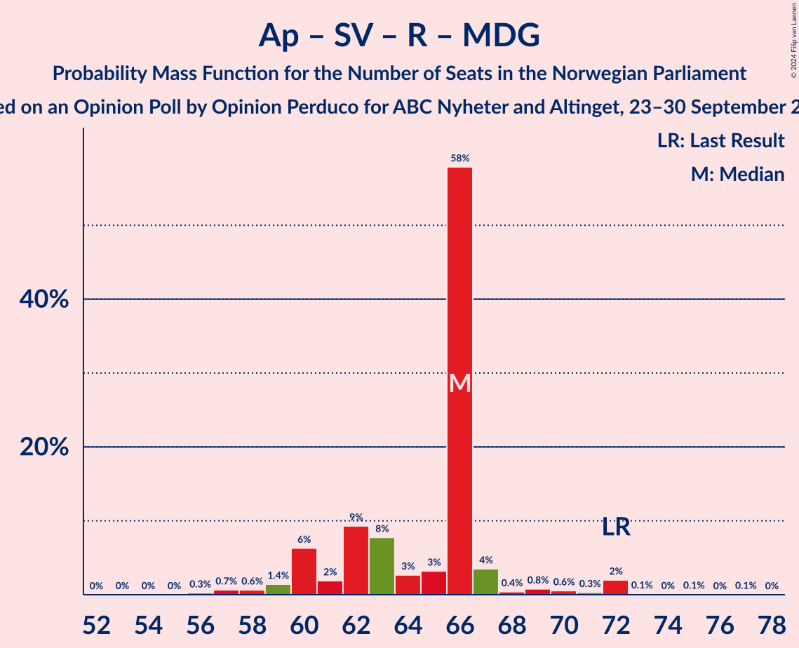

| Number of Seats | Probability | Accumulated | Special Marks |
|:---------------:|:-----------:|:-----------:|:-------------:|
| 52 | 0% | 100% |  |
| 53 | 0% | 99.9% |  |
| 54 | 0% | 99.9% |  |
| 55 | 0% | 99.9% |  |
| 56 | 0.3% | 99.9% |  |
| 57 | 0.7% | 99.6% |  |
| 58 | 0.6% | 99.0% |  |
| 59 | 1.4% | 98% |  |
| 60 | 6% | 97% |  |
| 61 | 2% | 91% |  |
| 62 | 9% | 89% |  |
| 63 | 8% | 79% |  |
| 64 | 3% | 72% |  |
| 65 | 3% | 69% |  |
| 66 | 58% | 66% | Median |
| 67 | 4% | 8% |  |
| 68 | 0.4% | 4% |  |
| 69 | 0.8% | 4% |  |
| 70 | 0.6% | 3% |  |
| 71 | 0.3% | 3% |  |
| 72 | 2% | 2% | Last Result |
| 73 | 0.1% | 0.3% |  |
| 74 | 0% | 0.2% |  |
| 75 | 0.1% | 0.2% |  |
| 76 | 0% | 0.1% |  |
| 77 | 0.1% | 0.1% |  |
| 78 | 0% | 0% |  |

### Arbeiderpartiet – Sosialistisk Venstreparti – Senterpartiet – Miljøpartiet De Grønne

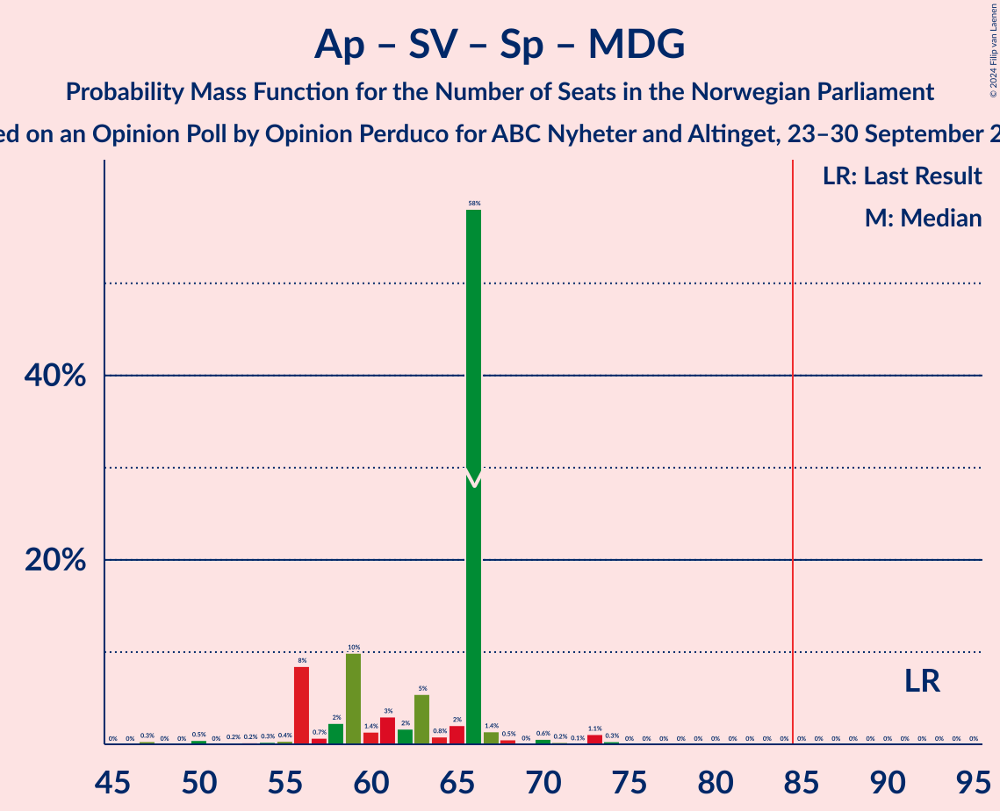

| Number of Seats | Probability | Accumulated | Special Marks |
|:---------------:|:-----------:|:-----------:|:-------------:|
| 47 | 0.3% | 100% |  |
| 48 | 0% | 99.7% |  |
| 49 | 0% | 99.7% |  |
| 50 | 0.5% | 99.7% |  |
| 51 | 0% | 99.2% |  |
| 52 | 0.2% | 99.2% |  |
| 53 | 0.2% | 99.0% |  |
| 54 | 0.3% | 98.8% |  |
| 55 | 0.4% | 98.5% |  |
| 56 | 8% | 98% |  |
| 57 | 0.7% | 90% |  |
| 58 | 2% | 89% |  |
| 59 | 10% | 87% |  |
| 60 | 1.4% | 77% |  |
| 61 | 3% | 75% |  |
| 62 | 2% | 72% |  |
| 63 | 5% | 71% |  |
| 64 | 0.8% | 65% |  |
| 65 | 2% | 64% |  |
| 66 | 58% | 62% | Median |
| 67 | 1.4% | 4% |  |
| 68 | 0.5% | 3% |  |
| 69 | 0% | 2% |  |
| 70 | 0.6% | 2% |  |
| 71 | 0.2% | 2% |  |
| 72 | 0.1% | 2% |  |
| 73 | 1.1% | 1.4% |  |
| 74 | 0.3% | 0.3% |  |
| 75 | 0% | 0% |  |
| 76 | 0% | 0% |  |
| 77 | 0% | 0% |  |
| 78 | 0% | 0% |  |
| 79 | 0% | 0% |  |
| 80 | 0% | 0% |  |
| 81 | 0% | 0% |  |
| 82 | 0% | 0% |  |
| 83 | 0% | 0% |  |
| 84 | 0% | 0% |  |
| 85 | 0% | 0% | Majority |
| 86 | 0% | 0% |  |
| 87 | 0% | 0% |  |
| 88 | 0% | 0% |  |
| 89 | 0% | 0% |  |
| 90 | 0% | 0% |  |
| 91 | 0% | 0% |  |
| 92 | 0% | 0% | Last Result |

### Arbeiderpartiet – Sosialistisk Venstreparti – Senterpartiet

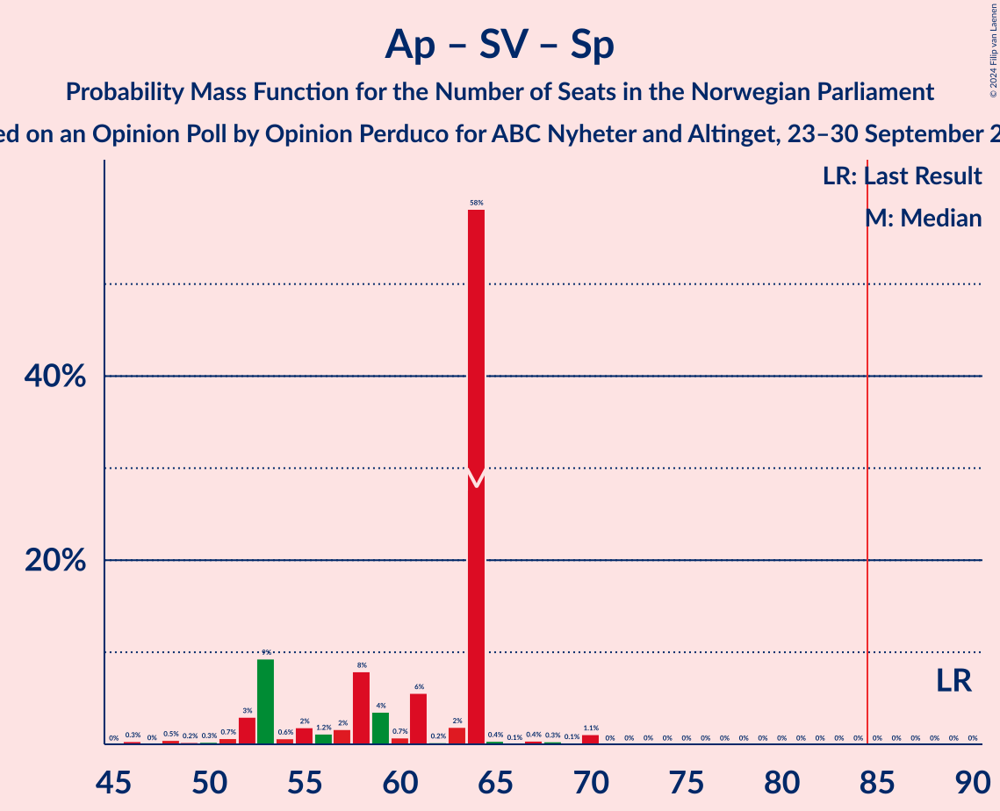

| Number of Seats | Probability | Accumulated | Special Marks |
|:---------------:|:-----------:|:-----------:|:-------------:|
| 46 | 0.3% | 100% |  |
| 47 | 0% | 99.7% |  |
| 48 | 0.5% | 99.6% |  |
| 49 | 0.2% | 99.2% |  |
| 50 | 0.3% | 98.9% |  |
| 51 | 0.7% | 98.7% |  |
| 52 | 3% | 98% |  |
| 53 | 9% | 95% |  |
| 54 | 0.6% | 86% |  |
| 55 | 2% | 85% |  |
| 56 | 1.2% | 83% |  |
| 57 | 2% | 82% |  |
| 58 | 8% | 80% |  |
| 59 | 4% | 72% |  |
| 60 | 0.7% | 69% |  |
| 61 | 6% | 68% |  |
| 62 | 0.2% | 63% |  |
| 63 | 2% | 62% |  |
| 64 | 58% | 61% | Median |
| 65 | 0.4% | 2% |  |
| 66 | 0.1% | 2% |  |
| 67 | 0.4% | 2% |  |
| 68 | 0.3% | 2% |  |
| 69 | 0.1% | 1.3% |  |
| 70 | 1.1% | 1.1% |  |
| 71 | 0% | 0% |  |
| 72 | 0% | 0% |  |
| 73 | 0% | 0% |  |
| 74 | 0% | 0% |  |
| 75 | 0% | 0% |  |
| 76 | 0% | 0% |  |
| 77 | 0% | 0% |  |
| 78 | 0% | 0% |  |
| 79 | 0% | 0% |  |
| 80 | 0% | 0% |  |
| 81 | 0% | 0% |  |
| 82 | 0% | 0% |  |
| 83 | 0% | 0% |  |
| 84 | 0% | 0% |  |
| 85 | 0% | 0% | Majority |
| 86 | 0% | 0% |  |
| 87 | 0% | 0% |  |
| 88 | 0% | 0% |  |
| 89 | 0% | 0% | Last Result |

### Høyre – Venstre – Kristelig Folkeparti

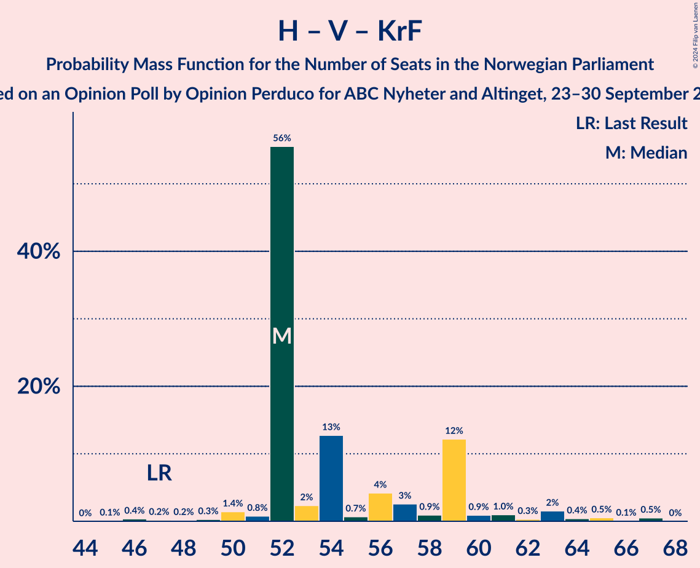

| Number of Seats | Probability | Accumulated | Special Marks |
|:---------------:|:-----------:|:-----------:|:-------------:|
| 45 | 0.1% | 100% |  |
| 46 | 0.4% | 99.9% |  |
| 47 | 0.2% | 99.5% | Last Result |
| 48 | 0.2% | 99.3% |  |
| 49 | 0.3% | 99.1% |  |
| 50 | 1.4% | 98.8% |  |
| 51 | 0.8% | 97% |  |
| 52 | 56% | 97% | Median |
| 53 | 2% | 41% |  |
| 54 | 13% | 39% |  |
| 55 | 0.7% | 26% |  |
| 56 | 4% | 25% |  |
| 57 | 3% | 21% |  |
| 58 | 0.9% | 18% |  |
| 59 | 12% | 18% |  |
| 60 | 0.9% | 5% |  |
| 61 | 1.0% | 4% |  |
| 62 | 0.3% | 3% |  |
| 63 | 2% | 3% |  |
| 64 | 0.4% | 2% |  |
| 65 | 0.5% | 1.2% |  |
| 66 | 0.1% | 0.6% |  |
| 67 | 0.5% | 0.5% |  |
| 68 | 0% | 0% |  |

### Arbeiderpartiet – Senterpartiet – Kristelig Folkeparti – Miljøpartiet De Grønne

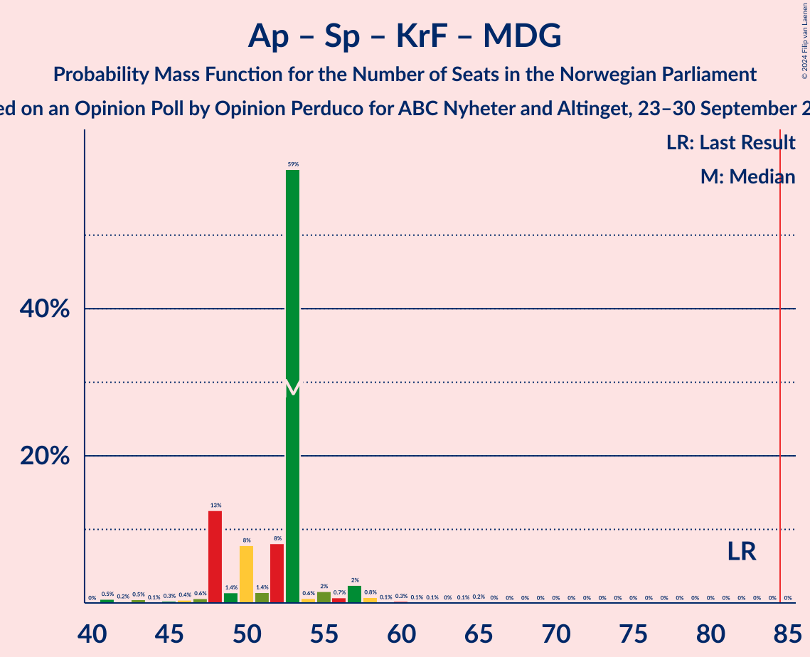

| Number of Seats | Probability | Accumulated | Special Marks |
|:---------------:|:-----------:|:-----------:|:-------------:|
| 41 | 0.5% | 100% |  |
| 42 | 0.2% | 99.4% |  |
| 43 | 0.5% | 99.2% |  |
| 44 | 0.1% | 98.8% |  |
| 45 | 0.3% | 98.7% |  |
| 46 | 0.4% | 98% |  |
| 47 | 0.6% | 98% |  |
| 48 | 13% | 97% |  |
| 49 | 1.4% | 85% |  |
| 50 | 8% | 83% |  |
| 51 | 1.4% | 75% |  |
| 52 | 8% | 74% |  |
| 53 | 59% | 66% | Median |
| 54 | 0.6% | 7% |  |
| 55 | 2% | 6% |  |
| 56 | 0.7% | 5% |  |
| 57 | 2% | 4% |  |
| 58 | 0.8% | 2% |  |
| 59 | 0.1% | 0.8% |  |
| 60 | 0.3% | 0.7% |  |
| 61 | 0.1% | 0.5% |  |
| 62 | 0.1% | 0.4% |  |
| 63 | 0% | 0.3% |  |
| 64 | 0.1% | 0.3% |  |
| 65 | 0.2% | 0.2% |  |
| 66 | 0% | 0% |  |
| 67 | 0% | 0% |  |
| 68 | 0% | 0% |  |
| 69 | 0% | 0% |  |
| 70 | 0% | 0% |  |
| 71 | 0% | 0% |  |
| 72 | 0% | 0% |  |
| 73 | 0% | 0% |  |
| 74 | 0% | 0% |  |
| 75 | 0% | 0% |  |
| 76 | 0% | 0% |  |
| 77 | 0% | 0% |  |
| 78 | 0% | 0% |  |
| 79 | 0% | 0% |  |
| 80 | 0% | 0% |  |
| 81 | 0% | 0% |  |
| 82 | 0% | 0% | Last Result |

### Arbeiderpartiet – Sosialistisk Venstreparti

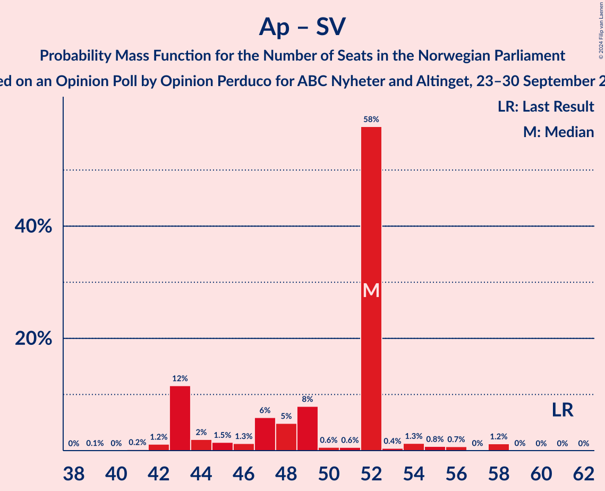

| Number of Seats | Probability | Accumulated | Special Marks |
|:---------------:|:-----------:|:-----------:|:-------------:|
| 39 | 0.1% | 100% |  |
| 40 | 0% | 99.9% |  |
| 41 | 0.2% | 99.9% |  |
| 42 | 1.2% | 99.7% |  |
| 43 | 12% | 98.5% |  |
| 44 | 2% | 87% |  |
| 45 | 1.5% | 85% |  |
| 46 | 1.3% | 83% |  |
| 47 | 6% | 82% |  |
| 48 | 5% | 76% |  |
| 49 | 8% | 71% |  |
| 50 | 0.6% | 64% |  |
| 51 | 0.6% | 63% |  |
| 52 | 58% | 62% | Median |
| 53 | 0.4% | 5% |  |
| 54 | 1.3% | 4% |  |
| 55 | 0.8% | 3% |  |
| 56 | 0.7% | 2% |  |
| 57 | 0% | 1.3% |  |
| 58 | 1.2% | 1.3% |  |
| 59 | 0% | 0.1% |  |
| 60 | 0% | 0% |  |
| 61 | 0% | 0% | Last Result |

### Arbeiderpartiet – Senterpartiet – Kristelig Folkeparti

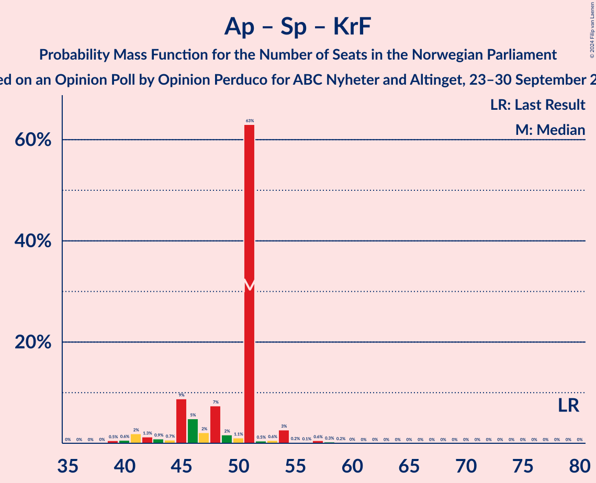

| Number of Seats | Probability | Accumulated | Special Marks |
|:---------------:|:-----------:|:-----------:|:-------------:|
| 39 | 0.5% | 100% |  |
| 40 | 0.6% | 99.4% |  |
| 41 | 2% | 98.8% |  |
| 42 | 1.3% | 97% |  |
| 43 | 0.9% | 96% |  |
| 44 | 0.7% | 95% |  |
| 45 | 9% | 94% |  |
| 46 | 5% | 85% |  |
| 47 | 2% | 80% |  |
| 48 | 7% | 78% |  |
| 49 | 2% | 71% |  |
| 50 | 1.1% | 69% |  |
| 51 | 63% | 68% | Median |
| 52 | 0.5% | 5% |  |
| 53 | 0.6% | 5% |  |
| 54 | 3% | 4% |  |
| 55 | 0.2% | 1.4% |  |
| 56 | 0.1% | 1.2% |  |
| 57 | 0.6% | 1.1% |  |
| 58 | 0.3% | 0.5% |  |
| 59 | 0.2% | 0.2% |  |
| 60 | 0% | 0.1% |  |
| 61 | 0% | 0% |  |
| 62 | 0% | 0% |  |
| 63 | 0% | 0% |  |
| 64 | 0% | 0% |  |
| 65 | 0% | 0% |  |
| 66 | 0% | 0% |  |
| 67 | 0% | 0% |  |
| 68 | 0% | 0% |  |
| 69 | 0% | 0% |  |
| 70 | 0% | 0% |  |
| 71 | 0% | 0% |  |
| 72 | 0% | 0% |  |
| 73 | 0% | 0% |  |
| 74 | 0% | 0% |  |
| 75 | 0% | 0% |  |
| 76 | 0% | 0% |  |
| 77 | 0% | 0% |  |
| 78 | 0% | 0% |  |
| 79 | 0% | 0% | Last Result |

### Arbeiderpartiet – Senterpartiet

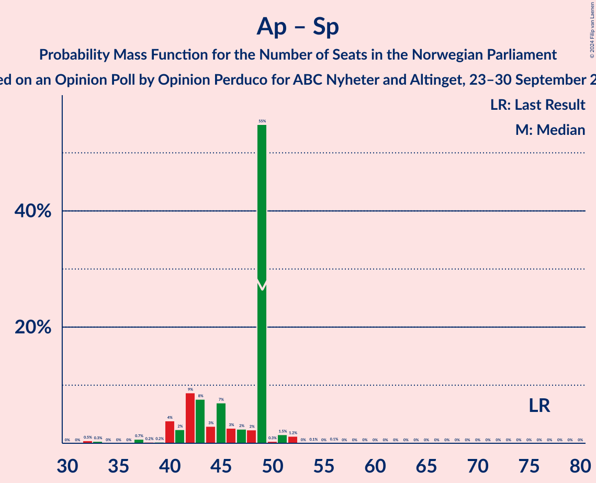

| Number of Seats | Probability | Accumulated | Special Marks |
|:---------------:|:-----------:|:-----------:|:-------------:|
| 32 | 0.5% | 100% |  |
| 33 | 0.3% | 99.5% |  |
| 34 | 0% | 99.2% |  |
| 35 | 0% | 99.2% |  |
| 36 | 0% | 99.2% |  |
| 37 | 0.7% | 99.2% |  |
| 38 | 0.2% | 98% |  |
| 39 | 0.2% | 98% |  |
| 40 | 4% | 98% |  |
| 41 | 2% | 94% |  |
| 42 | 9% | 92% |  |
| 43 | 8% | 83% |  |
| 44 | 3% | 75% |  |
| 45 | 7% | 73% |  |
| 46 | 3% | 66% |  |
| 47 | 2% | 63% |  |
| 48 | 2% | 61% |  |
| 49 | 55% | 58% | Median |
| 50 | 0.3% | 3% |  |
| 51 | 1.5% | 3% |  |
| 52 | 1.2% | 1.5% |  |
| 53 | 0% | 0.3% |  |
| 54 | 0.1% | 0.2% |  |
| 55 | 0% | 0.2% |  |
| 56 | 0.1% | 0.1% |  |
| 57 | 0% | 0% |  |
| 58 | 0% | 0% |  |
| 59 | 0% | 0% |  |
| 60 | 0% | 0% |  |
| 61 | 0% | 0% |  |
| 62 | 0% | 0% |  |
| 63 | 0% | 0% |  |
| 64 | 0% | 0% |  |
| 65 | 0% | 0% |  |
| 66 | 0% | 0% |  |
| 67 | 0% | 0% |  |
| 68 | 0% | 0% |  |
| 69 | 0% | 0% |  |
| 70 | 0% | 0% |  |
| 71 | 0% | 0% |  |
| 72 | 0% | 0% |  |
| 73 | 0% | 0% |  |
| 74 | 0% | 0% |  |
| 75 | 0% | 0% |  |
| 76 | 0% | 0% | Last Result |

### Venstre – Senterpartiet – Kristelig Folkeparti

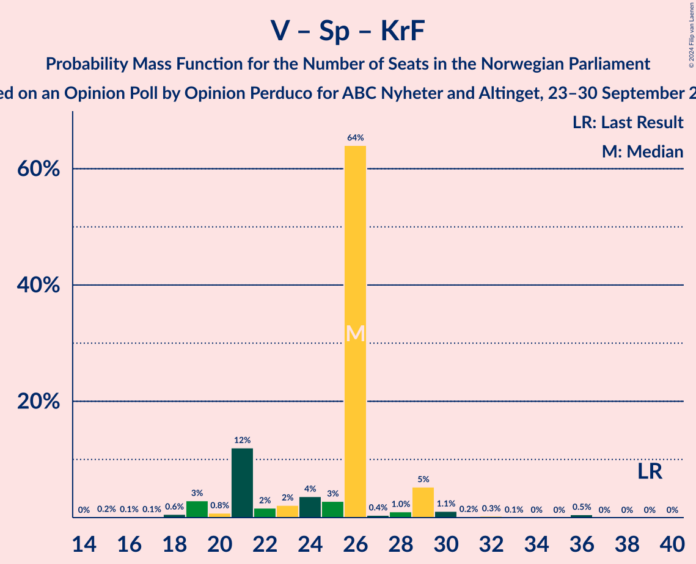

| Number of Seats | Probability | Accumulated | Special Marks |
|:---------------:|:-----------:|:-----------:|:-------------:|
| 15 | 0.2% | 100% |  |
| 16 | 0.1% | 99.8% |  |
| 17 | 0.1% | 99.7% |  |
| 18 | 0.6% | 99.5% |  |
| 19 | 3% | 98.9% |  |
| 20 | 0.8% | 96% |  |
| 21 | 12% | 95% |  |
| 22 | 2% | 83% |  |
| 23 | 2% | 82% |  |
| 24 | 4% | 79% |  |
| 25 | 3% | 76% |  |
| 26 | 64% | 73% | Median |
| 27 | 0.4% | 9% |  |
| 28 | 1.0% | 8% |  |
| 29 | 5% | 7% |  |
| 30 | 1.1% | 2% |  |
| 31 | 0.2% | 1.1% |  |
| 32 | 0.3% | 0.9% |  |
| 33 | 0.1% | 0.6% |  |
| 34 | 0% | 0.6% |  |
| 35 | 0% | 0.6% |  |
| 36 | 0.5% | 0.5% |  |
| 37 | 0% | 0% |  |
| 38 | 0% | 0% |  |
| 39 | 0% | 0% | Last Result |

## Technical Information

### Opinion Poll

+ **Polling firm:** Opinion Perduco
+ **Commissioner(s):** ABC Nyheter and Altinget
+ **Fieldwork period:** 23–30 September 2024

### Calculations

+ **Sample size:** 700
+ **Simulations done:** 1,048,576
+ **Error estimate:** 5.49%

