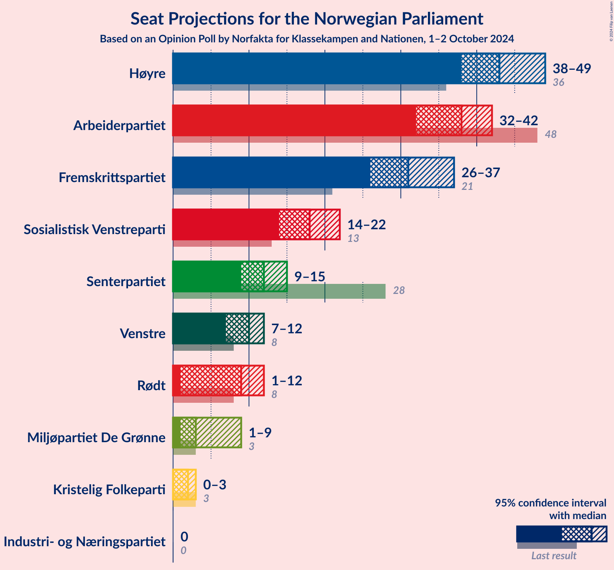
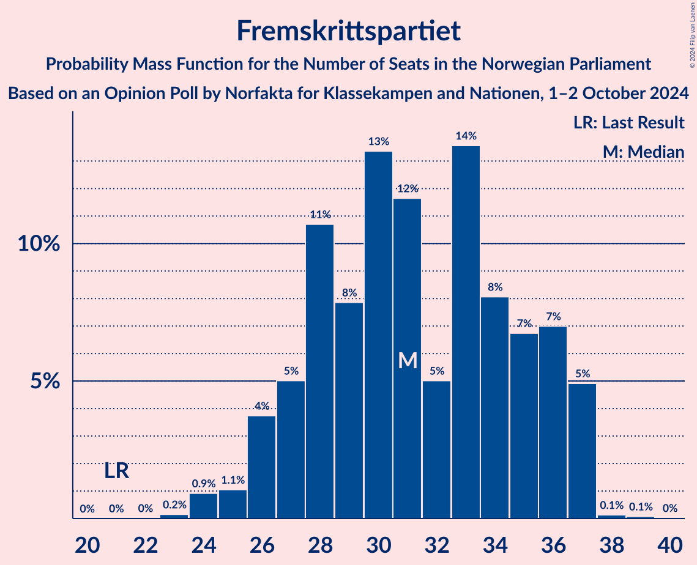
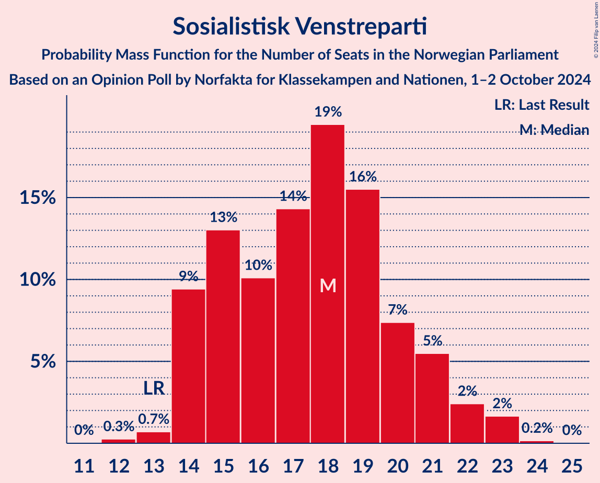

# Opinion Poll by Norfakta for Klassekampen and Nationen, 1–2 October 2024

<a href="#voting-intentions">Voting Intentions</a> | <a href="#seats">Seats</a> | <a href="#coalitions">Coalitions</a> | <a href="#technical-information">Technical Information</a>

## Voting Intentions

### Confidence Intervals

| Party | Last Result | Poll Result | 80% Confidence Interval | 90% Confidence Interval | 95% Confidence Interval | 99% Confidence Interval |
|:-----:|:-----------:|:-----------:|:-----------------------:|:-----------------------:|:-----------------------:|:-----------------------:|
| Høyre | 20.4% | 24.0% | 22.3–25.8% |21.8–26.3% |21.4–26.7% |20.7–27.6% |
| Arbeiderpartiet | 26.2% | 20.3% | 18.7–22.0% |18.3–22.5% |17.9–22.9% |17.2–23.7% |
| Fremskrittspartiet | 11.6% | 16.6% | 15.2–18.2% |14.8–18.6% |14.4–19.0% |13.7–19.8% |
| Sosialistisk Venstreparti | 7.6% | 10.2% | 9.1–11.5% |8.7–11.9% |8.5–12.2% |7.9–12.9% |
| Senterpartiet | 13.5% | 6.9% | 6.0–8.0% |5.7–8.4% |5.5–8.6% |5.1–9.2% |
| Venstre | 4.6% | 5.4% | 4.6–6.4% |4.3–6.7% |4.2–7.0% |3.8–7.5% |
| Rødt | 4.7% | 5.3% | 4.5–6.3% |4.3–6.6% |4.1–6.9% |3.7–7.4% |
| Miljøpartiet De Grønne | 3.9% | 3.7% | 3.0–4.6% |2.9–4.8% |2.7–5.1% |2.4–5.5% |
| Kristelig Folkeparti | 3.8% | 2.5% | 2.0–3.3% |1.8–3.5% |1.7–3.7% |1.5–4.1% |
| Industri- og Næringspartiet | 0.3% | 1.6% | 1.2–2.2% |1.1–2.4% |1.0–2.6% |0.8–2.9% |

*Note:* The poll result column reflects the actual value used in the calculations. Published results may vary slightly, and in addition be rounded to fewer digits.

## Seats

### Confidence Intervals

| Party | Last Result | Median | 80% Confidence Interval | 90% Confidence Interval | 95% Confidence Interval | 99% Confidence Interval |
|:-----:|:-----------:|:------:|:-----------------------:|:-----------------------:|:-----------------------:|:-----------------------:|
| <a href="#høyre">Høyre</a> | 36 | 43 | 40–47 |39–48 |38–49 |36–50 |
| <a href="#arbeiderpartiet">Arbeiderpartiet</a> | 48 | 38 | 34–40 |33–41 |32–42 |32–44 |
| <a href="#fremskrittspartiet">Fremskrittspartiet</a> | 21 | 31 | 27–36 |26–37 |26–37 |24–37 |
| <a href="#sosialistisk-venstreparti">Sosialistisk Venstreparti</a> | 13 | 18 | 14–20 |14–21 |14–22 |13–23 |
| <a href="#senterpartiet">Senterpartiet</a> | 28 | 12 | 10–14 |9–15 |9–15 |8–16 |
| <a href="#venstre">Venstre</a> | 8 | 10 | 8–12 |7–12 |7–12 |3–14 |
| <a href="#rødt">Rødt</a> | 8 | 9 | 8–11 |7–12 |1–12 |1–13 |
| <a href="#miljøpartiet-de-grønne">Miljøpartiet De Grønne</a> | 3 | 3 | 2–8 |1–9 |1–9 |1–9 |
| <a href="#kristelig-folkeparti">Kristelig Folkeparti</a> | 3 | 2 | 0–2 |0–2 |0–3 |0–7 |
| <a href="#industri--og-næringspartiet">Industri- og Næringspartiet</a> | 0 | 0 | 0 |0 |0 |0–2 |

### Høyre

*For a full overview of the results for this party, see the [Høyre](party-høyre.html) page.*

| Number of Seats | Probability | Accumulated | Special Marks |
|:---------------:|:-----------:|:-----------:|:-------------:|
| 34 | 0.1% | 100% |  |
| 35 | 0.2% | 99.9% |  |
| 36 | 0.5% | 99.7% | Last Result |
| 37 | 0.8% | 99.2% |  |
| 38 | 1.5% | 98% |  |
| 39 | 5% | 97% |  |
| 40 | 12% | 91% |  |
| 41 | 10% | 80% |  |
| 42 | 12% | 70% |  |
| 43 | 12% | 58% | Median |
| 44 | 22% | 45% |  |
| 45 | 6% | 24% |  |
| 46 | 5% | 17% |  |
| 47 | 6% | 13% |  |
| 48 | 3% | 6% |  |
| 49 | 2% | 3% |  |
| 50 | 0.5% | 0.8% |  |
| 51 | 0.2% | 0.3% |  |
| 52 | 0.1% | 0.1% |  |
| 53 | 0% | 0% |  |

### Arbeiderpartiet

*For a full overview of the results for this party, see the [Arbeiderpartiet](party-arbeiderpartiet.html) page.*

| Number of Seats | Probability | Accumulated | Special Marks |
|:---------------:|:-----------:|:-----------:|:-------------:|
| 31 | 0.2% | 100% |  |
| 32 | 3% | 99.8% |  |
| 33 | 3% | 97% |  |
| 34 | 6% | 94% |  |
| 35 | 9% | 88% |  |
| 36 | 15% | 79% |  |
| 37 | 9% | 65% |  |
| 38 | 9% | 56% | Median |
| 39 | 14% | 47% |  |
| 40 | 23% | 32% |  |
| 41 | 5% | 9% |  |
| 42 | 2% | 4% |  |
| 43 | 0.9% | 2% |  |
| 44 | 0.8% | 1.1% |  |
| 45 | 0.2% | 0.3% |  |
| 46 | 0% | 0.1% |  |
| 47 | 0% | 0.1% |  |
| 48 | 0% | 0% | Last Result |

### Fremskrittspartiet

*For a full overview of the results for this party, see the [Fremskrittspartiet](party-fremskrittspartiet.html) page.*

| Number of Seats | Probability | Accumulated | Special Marks |
|:---------------:|:-----------:|:-----------:|:-------------:|
| 21 | 0% | 100% | Last Result |
| 22 | 0% | 100% |  |
| 23 | 0.2% | 100% |  |
| 24 | 0.9% | 99.8% |  |
| 25 | 1.1% | 98.9% |  |
| 26 | 4% | 98% |  |
| 27 | 5% | 94% |  |
| 28 | 11% | 89% |  |
| 29 | 8% | 78% |  |
| 30 | 13% | 71% |  |
| 31 | 12% | 57% | Median |
| 32 | 5% | 46% |  |
| 33 | 14% | 41% |  |
| 34 | 8% | 27% |  |
| 35 | 7% | 19% |  |
| 36 | 7% | 12% |  |
| 37 | 5% | 5% |  |
| 38 | 0.1% | 0.2% |  |
| 39 | 0.1% | 0.1% |  |
| 40 | 0% | 0% |  |

### Sosialistisk Venstreparti

*For a full overview of the results for this party, see the [Sosialistisk Venstreparti](party-sosialistiskvenstreparti.html) page.*

| Number of Seats | Probability | Accumulated | Special Marks |
|:---------------:|:-----------:|:-----------:|:-------------:|
| 12 | 0.3% | 100% |  |
| 13 | 0.7% | 99.7% | Last Result |
| 14 | 9% | 99.0% |  |
| 15 | 13% | 90% |  |
| 16 | 10% | 77% |  |
| 17 | 14% | 66% |  |
| 18 | 19% | 52% | Median |
| 19 | 16% | 33% |  |
| 20 | 7% | 17% |  |
| 21 | 5% | 10% |  |
| 22 | 2% | 4% |  |
| 23 | 2% | 2% |  |
| 24 | 0.2% | 0.2% |  |
| 25 | 0% | 0% |  |

### Senterpartiet

*For a full overview of the results for this party, see the [Senterpartiet](party-senterpartiet.html) page.*

| Number of Seats | Probability | Accumulated | Special Marks |
|:---------------:|:-----------:|:-----------:|:-------------:|
| 7 | 0.1% | 100% |  |
| 8 | 2% | 99.9% |  |
| 9 | 8% | 98% |  |
| 10 | 7% | 91% |  |
| 11 | 23% | 84% |  |
| 12 | 17% | 61% | Median |
| 13 | 20% | 44% |  |
| 14 | 15% | 24% |  |
| 15 | 8% | 10% |  |
| 16 | 2% | 2% |  |
| 17 | 0.4% | 0.4% |  |
| 18 | 0% | 0% |  |
| 19 | 0% | 0% |  |
| 20 | 0% | 0% |  |
| 21 | 0% | 0% |  |
| 22 | 0% | 0% |  |
| 23 | 0% | 0% |  |
| 24 | 0% | 0% |  |
| 25 | 0% | 0% |  |
| 26 | 0% | 0% |  |
| 27 | 0% | 0% |  |
| 28 | 0% | 0% | Last Result |

### Venstre

*For a full overview of the results for this party, see the [Venstre](party-venstre.html) page.*

| Number of Seats | Probability | Accumulated | Special Marks |
|:---------------:|:-----------:|:-----------:|:-------------:|
| 2 | 0.2% | 100% |  |
| 3 | 2% | 99.8% |  |
| 4 | 0% | 98% |  |
| 5 | 0% | 98% |  |
| 6 | 0.6% | 98% |  |
| 7 | 6% | 98% |  |
| 8 | 21% | 91% | Last Result |
| 9 | 16% | 71% |  |
| 10 | 35% | 55% | Median |
| 11 | 9% | 20% |  |
| 12 | 8% | 11% |  |
| 13 | 1.2% | 2% |  |
| 14 | 1.1% | 1.2% |  |
| 15 | 0.1% | 0.1% |  |
| 16 | 0% | 0% |  |

### Rødt

*For a full overview of the results for this party, see the [Rødt](party-rødt.html) page.*

| Number of Seats | Probability | Accumulated | Special Marks |
|:---------------:|:-----------:|:-----------:|:-------------:|
| 1 | 4% | 100% |  |
| 2 | 0% | 96% |  |
| 3 | 0% | 96% |  |
| 4 | 0% | 96% |  |
| 5 | 0% | 96% |  |
| 6 | 0.2% | 96% |  |
| 7 | 6% | 96% |  |
| 8 | 25% | 90% | Last Result |
| 9 | 22% | 65% | Median |
| 10 | 28% | 43% |  |
| 11 | 8% | 14% |  |
| 12 | 5% | 6% |  |
| 13 | 1.4% | 2% |  |
| 14 | 0.3% | 0.3% |  |
| 15 | 0% | 0% |  |

### Miljøpartiet De Grønne

*For a full overview of the results for this party, see the [Miljøpartiet De Grønne](party-miljøpartietdegrønne.html) page.*

| Number of Seats | Probability | Accumulated | Special Marks |
|:---------------:|:-----------:|:-----------:|:-------------:|
| 1 | 10% | 100% |  |
| 2 | 35% | 90% |  |
| 3 | 14% | 56% | Last Result, Median |
| 4 | 0% | 41% |  |
| 5 | 0% | 41% |  |
| 6 | 7% | 41% |  |
| 7 | 17% | 34% |  |
| 8 | 10% | 17% |  |
| 9 | 7% | 7% |  |
| 10 | 0.3% | 0.4% |  |
| 11 | 0.1% | 0.1% |  |
| 12 | 0% | 0% |  |

### Kristelig Folkeparti

*For a full overview of the results for this party, see the [Kristelig Folkeparti](party-kristeligfolkeparti.html) page.*

| Number of Seats | Probability | Accumulated | Special Marks |
|:---------------:|:-----------:|:-----------:|:-------------:|
| 0 | 32% | 100% |  |
| 1 | 17% | 68% |  |
| 2 | 48% | 51% | Median |
| 3 | 2% | 3% | Last Result |
| 4 | 0% | 0.8% |  |
| 5 | 0% | 0.8% |  |
| 6 | 0.2% | 0.8% |  |
| 7 | 0.5% | 0.6% |  |
| 8 | 0.1% | 0.1% |  |
| 9 | 0% | 0% |  |

### Industri- og Næringspartiet

*For a full overview of the results for this party, see the [Industri- og Næringspartiet](party-industri-ognæringspartiet.html) page.*

| Number of Seats | Probability | Accumulated | Special Marks |
|:---------------:|:-----------:|:-----------:|:-------------:|
| 0 | 98% | 100% | Last Result, Median |
| 1 | 0.7% | 2% |  |
| 2 | 1.1% | 1.1% |  |
| 3 | 0% | 0% |  |

## Coalitions

### Confidence Intervals

| Coalition | Last Result | Median | Majority? | 80% Confidence Interval | 90% Confidence Interval | 95% Confidence Interval | 99% Confidence Interval |
|:---------:|:-----------:|:------:|:---------:|:-----------------------:|:-----------------------:|:-----------------------:|:-----------------------:|
| Høyre – Fremskrittspartiet – Senterpartiet – Venstre – Kristelig Folkeparti | 96 | 97 | 100% | 93–103 | 91–104 | 90–104 | 88–107 |
| Høyre – Fremskrittspartiet – Venstre – Miljøpartiet De Grønne – Kristelig Folkeparti | 71 | 90 | 88% | 84–95 | 83–95 | 80–95 | 78–98 |
| Høyre – Fremskrittspartiet – Venstre – Kristelig Folkeparti | 68 | 85 | 51% | 80–91 | 79–92 | 77–92 | 75–94 |
| Høyre – Fremskrittspartiet – Venstre | 65 | 83 | 42% | 79–90 | 77–90 | 75–91 | 74–92 |
| Arbeiderpartiet – Sosialistisk Venstreparti – Senterpartiet – Rødt – Miljøpartiet De Grønne | 100 | 81 | 21% | 76–87 | 74–88 | 72–89 | 72–92 |
| Arbeiderpartiet – Sosialistisk Venstreparti – Senterpartiet – Rødt | 97 | 76 | 3% | 71–82 | 70–84 | 70–85 | 68–86 |
| Arbeiderpartiet – Sosialistisk Venstreparti – Senterpartiet – Miljøpartiet De Grønne – Kristelig Folkeparti | 95 | 72 | 0.1% | 68–79 | 66–80 | 64–82 | 64–83 |
| Høyre – Fremskrittspartiet | 57 | 74 | 0.1% | 70–79 | 68–80 | 67–81 | 66–83 |
| Arbeiderpartiet – Sosialistisk Venstreparti – Senterpartiet – Miljøpartiet De Grønne | 92 | 71 | 0% | 67–77 | 65–78 | 63–80 | 63–81 |
| Arbeiderpartiet – Sosialistisk Venstreparti – Rødt – Miljøpartiet De Grønne | 72 | 69 | 0% | 64–74 | 62–75 | 61–75 | 59–80 |
| Arbeiderpartiet – Sosialistisk Venstreparti – Senterpartiet | 89 | 68 | 0% | 63–72 | 62–74 | 61–75 | 60–76 |
| Arbeiderpartiet – Senterpartiet – Miljøpartiet De Grønne – Kristelig Folkeparti | 82 | 56 | 0% | 50–60 | 49–62 | 49–63 | 48–65 |
| Arbeiderpartiet – Sosialistisk Venstreparti | 61 | 55 | 0% | 51–59 | 50–60 | 50–62 | 48–63 |
| Høyre – Venstre – Kristelig Folkeparti | 47 | 54 | 0% | 50–58 | 49–60 | 47–61 | 45–61 |
| Arbeiderpartiet – Senterpartiet – Kristelig Folkeparti | 79 | 51 | 0% | 48–55 | 47–56 | 46–57 | 45–59 |
| Arbeiderpartiet – Senterpartiet | 76 | 50 | 0% | 46–53 | 45–54 | 44–56 | 43–58 |
| Senterpartiet – Venstre – Kristelig Folkeparti | 39 | 23 | 0% | 19–26 | 19–27 | 18–27 | 15–29 |

### Høyre – Fremskrittspartiet – Senterpartiet – Venstre – Kristelig Folkeparti

| Number of Seats | Probability | Accumulated | Special Marks |
|:---------------:|:-----------:|:-----------:|:-------------:|
| 86 | 0.1% | 100% |  |
| 87 | 0.3% | 99.9% |  |
| 88 | 1.2% | 99.6% |  |
| 89 | 0.5% | 98% |  |
| 90 | 2% | 98% |  |
| 91 | 1.4% | 96% |  |
| 92 | 2% | 95% |  |
| 93 | 12% | 93% |  |
| 94 | 6% | 81% |  |
| 95 | 9% | 75% |  |
| 96 | 9% | 65% | Last Result |
| 97 | 8% | 57% |  |
| 98 | 14% | 48% | Median |
| 99 | 12% | 34% |  |
| 100 | 3% | 22% |  |
| 101 | 3% | 19% |  |
| 102 | 5% | 17% |  |
| 103 | 7% | 12% |  |
| 104 | 3% | 5% |  |
| 105 | 0.8% | 2% |  |
| 106 | 0.2% | 1.3% |  |
| 107 | 0.8% | 1.1% |  |
| 108 | 0% | 0.3% |  |
| 109 | 0.3% | 0.3% |  |
| 110 | 0% | 0% |  |

### Høyre – Fremskrittspartiet – Venstre – Miljøpartiet De Grønne – Kristelig Folkeparti

| Number of Seats | Probability | Accumulated | Special Marks |
|:---------------:|:-----------:|:-----------:|:-------------:|
| 71 | 0% | 100% | Last Result |
| 72 | 0% | 100% |  |
| 73 | 0% | 100% |  |
| 74 | 0% | 100% |  |
| 75 | 0% | 100% |  |
| 76 | 0% | 100% |  |
| 77 | 0.1% | 100% |  |
| 78 | 0.4% | 99.8% |  |
| 79 | 0.2% | 99.4% |  |
| 80 | 2% | 99.2% |  |
| 81 | 0.8% | 97% |  |
| 82 | 1.4% | 97% |  |
| 83 | 3% | 95% |  |
| 84 | 5% | 93% |  |
| 85 | 6% | 88% | Majority |
| 86 | 6% | 82% |  |
| 87 | 5% | 76% |  |
| 88 | 4% | 71% |  |
| 89 | 16% | 67% | Median |
| 90 | 18% | 51% |  |
| 91 | 6% | 33% |  |
| 92 | 4% | 27% |  |
| 93 | 6% | 23% |  |
| 94 | 5% | 17% |  |
| 95 | 10% | 13% |  |
| 96 | 1.0% | 2% |  |
| 97 | 0.4% | 1.5% |  |
| 98 | 0.9% | 1.1% |  |
| 99 | 0.1% | 0.2% |  |
| 100 | 0% | 0% |  |

### Høyre – Fremskrittspartiet – Venstre – Kristelig Folkeparti

| Number of Seats | Probability | Accumulated | Special Marks |
|:---------------:|:-----------:|:-----------:|:-------------:|
| 68 | 0% | 100% | Last Result |
| 69 | 0% | 100% |  |
| 70 | 0% | 100% |  |
| 71 | 0% | 100% |  |
| 72 | 0% | 100% |  |
| 73 | 0.1% | 100% |  |
| 74 | 0.3% | 99.9% |  |
| 75 | 0.3% | 99.6% |  |
| 76 | 1.4% | 99.3% |  |
| 77 | 1.4% | 98% |  |
| 78 | 1.4% | 97% |  |
| 79 | 3% | 95% |  |
| 80 | 5% | 92% |  |
| 81 | 5% | 88% |  |
| 82 | 4% | 83% |  |
| 83 | 18% | 79% |  |
| 84 | 9% | 60% |  |
| 85 | 7% | 51% | Majority |
| 86 | 7% | 44% | Median |
| 87 | 13% | 38% |  |
| 88 | 7% | 25% |  |
| 89 | 4% | 18% |  |
| 90 | 2% | 14% |  |
| 91 | 4% | 12% |  |
| 92 | 7% | 8% |  |
| 93 | 0.6% | 2% |  |
| 94 | 1.0% | 1.1% |  |
| 95 | 0.1% | 0.2% |  |
| 96 | 0.1% | 0.1% |  |
| 97 | 0% | 0% |  |

### Høyre – Fremskrittspartiet – Venstre

| Number of Seats | Probability | Accumulated | Special Marks |
|:---------------:|:-----------:|:-----------:|:-------------:|
| 65 | 0% | 100% | Last Result |
| 66 | 0% | 100% |  |
| 67 | 0% | 100% |  |
| 68 | 0% | 100% |  |
| 69 | 0% | 100% |  |
| 70 | 0% | 100% |  |
| 71 | 0% | 100% |  |
| 72 | 0% | 99.9% |  |
| 73 | 0.2% | 99.9% |  |
| 74 | 2% | 99.8% |  |
| 75 | 1.1% | 98% |  |
| 76 | 1.3% | 97% |  |
| 77 | 3% | 96% |  |
| 78 | 3% | 93% |  |
| 79 | 4% | 90% |  |
| 80 | 3% | 86% |  |
| 81 | 11% | 83% |  |
| 82 | 11% | 71% |  |
| 83 | 11% | 60% |  |
| 84 | 7% | 49% | Median |
| 85 | 5% | 42% | Majority |
| 86 | 4% | 37% |  |
| 87 | 18% | 33% |  |
| 88 | 3% | 16% |  |
| 89 | 3% | 13% |  |
| 90 | 6% | 10% |  |
| 91 | 3% | 4% |  |
| 92 | 1.2% | 2% |  |
| 93 | 0.1% | 0.4% |  |
| 94 | 0.3% | 0.3% |  |
| 95 | 0% | 0% |  |

### Arbeiderpartiet – Sosialistisk Venstreparti – Senterpartiet – Rødt – Miljøpartiet De Grønne

| Number of Seats | Probability | Accumulated | Special Marks |
|:---------------:|:-----------:|:-----------:|:-------------:|
| 68 | 0% | 100% |  |
| 69 | 0.1% | 99.9% |  |
| 70 | 0% | 99.8% |  |
| 71 | 0.1% | 99.8% |  |
| 72 | 3% | 99.7% |  |
| 73 | 0.7% | 97% |  |
| 74 | 1.2% | 96% |  |
| 75 | 2% | 95% |  |
| 76 | 10% | 93% |  |
| 77 | 8% | 83% |  |
| 78 | 9% | 75% |  |
| 79 | 9% | 66% |  |
| 80 | 5% | 57% | Median |
| 81 | 13% | 52% |  |
| 82 | 8% | 39% |  |
| 83 | 5% | 31% |  |
| 84 | 5% | 26% |  |
| 85 | 8% | 21% | Majority |
| 86 | 3% | 13% |  |
| 87 | 3% | 10% |  |
| 88 | 3% | 7% |  |
| 89 | 2% | 3% |  |
| 90 | 0.4% | 1.5% |  |
| 91 | 0.1% | 1.0% |  |
| 92 | 0.7% | 0.9% |  |
| 93 | 0.2% | 0.2% |  |
| 94 | 0% | 0% |  |
| 95 | 0% | 0% |  |
| 96 | 0% | 0% |  |
| 97 | 0% | 0% |  |
| 98 | 0% | 0% |  |
| 99 | 0% | 0% |  |
| 100 | 0% | 0% | Last Result |

### Arbeiderpartiet – Sosialistisk Venstreparti – Senterpartiet – Rødt

| Number of Seats | Probability | Accumulated | Special Marks |
|:---------------:|:-----------:|:-----------:|:-------------:|
| 65 | 0.1% | 100% |  |
| 66 | 0.1% | 99.9% |  |
| 67 | 0.1% | 99.8% |  |
| 68 | 0.3% | 99.7% |  |
| 69 | 0.6% | 99.5% |  |
| 70 | 4% | 98.9% |  |
| 71 | 6% | 95% |  |
| 72 | 7% | 89% |  |
| 73 | 10% | 82% |  |
| 74 | 10% | 71% |  |
| 75 | 7% | 62% |  |
| 76 | 7% | 55% |  |
| 77 | 6% | 47% | Median |
| 78 | 9% | 42% |  |
| 79 | 13% | 33% |  |
| 80 | 5% | 20% |  |
| 81 | 3% | 15% |  |
| 82 | 4% | 12% |  |
| 83 | 3% | 8% |  |
| 84 | 3% | 6% |  |
| 85 | 1.3% | 3% | Majority |
| 86 | 1.2% | 1.4% |  |
| 87 | 0.1% | 0.2% |  |
| 88 | 0.1% | 0.1% |  |
| 89 | 0% | 0% |  |
| 90 | 0% | 0% |  |
| 91 | 0% | 0% |  |
| 92 | 0% | 0% |  |
| 93 | 0% | 0% |  |
| 94 | 0% | 0% |  |
| 95 | 0% | 0% |  |
| 96 | 0% | 0% |  |
| 97 | 0% | 0% | Last Result |

### Arbeiderpartiet – Sosialistisk Venstreparti – Senterpartiet – Miljøpartiet De Grønne – Kristelig Folkeparti

| Number of Seats | Probability | Accumulated | Special Marks |
|:---------------:|:-----------:|:-----------:|:-------------:|
| 60 | 0% | 100% |  |
| 61 | 0% | 99.9% |  |
| 62 | 0% | 99.9% |  |
| 63 | 0% | 99.9% |  |
| 64 | 3% | 99.9% |  |
| 65 | 0.5% | 97% |  |
| 66 | 1.5% | 96% |  |
| 67 | 4% | 95% |  |
| 68 | 3% | 91% |  |
| 69 | 5% | 88% |  |
| 70 | 7% | 83% |  |
| 71 | 17% | 76% |  |
| 72 | 13% | 59% |  |
| 73 | 6% | 46% | Median |
| 74 | 4% | 40% |  |
| 75 | 10% | 36% |  |
| 76 | 9% | 27% |  |
| 77 | 4% | 18% |  |
| 78 | 3% | 14% |  |
| 79 | 3% | 11% |  |
| 80 | 4% | 7% |  |
| 81 | 0.6% | 3% |  |
| 82 | 2% | 3% |  |
| 83 | 0.3% | 0.6% |  |
| 84 | 0.1% | 0.3% |  |
| 85 | 0.1% | 0.1% | Majority |
| 86 | 0% | 0% |  |
| 87 | 0% | 0% |  |
| 88 | 0% | 0% |  |
| 89 | 0% | 0% |  |
| 90 | 0% | 0% |  |
| 91 | 0% | 0% |  |
| 92 | 0% | 0% |  |
| 93 | 0% | 0% |  |
| 94 | 0% | 0% |  |
| 95 | 0% | 0% | Last Result |

### Høyre – Fremskrittspartiet

| Number of Seats | Probability | Accumulated | Special Marks |
|:---------------:|:-----------:|:-----------:|:-------------:|
| 57 | 0% | 100% | Last Result |
| 58 | 0% | 100% |  |
| 59 | 0% | 100% |  |
| 60 | 0% | 100% |  |
| 61 | 0% | 100% |  |
| 62 | 0% | 100% |  |
| 63 | 0% | 100% |  |
| 64 | 0.1% | 99.9% |  |
| 65 | 0.2% | 99.8% |  |
| 66 | 1.4% | 99.6% |  |
| 67 | 2% | 98% |  |
| 68 | 2% | 96% |  |
| 69 | 4% | 94% |  |
| 70 | 4% | 91% |  |
| 71 | 12% | 87% |  |
| 72 | 6% | 74% |  |
| 73 | 7% | 68% |  |
| 74 | 16% | 61% | Median |
| 75 | 6% | 45% |  |
| 76 | 5% | 39% |  |
| 77 | 18% | 34% |  |
| 78 | 3% | 17% |  |
| 79 | 4% | 14% |  |
| 80 | 5% | 10% |  |
| 81 | 3% | 5% |  |
| 82 | 1.5% | 2% |  |
| 83 | 0.4% | 0.7% |  |
| 84 | 0.2% | 0.3% |  |
| 85 | 0.1% | 0.1% | Majority |
| 86 | 0% | 0% |  |

### Arbeiderpartiet – Sosialistisk Venstreparti – Senterpartiet – Miljøpartiet De Grønne

| Number of Seats | Probability | Accumulated | Special Marks |
|:---------------:|:-----------:|:-----------:|:-------------:|
| 60 | 0% | 100% |  |
| 61 | 0% | 99.9% |  |
| 62 | 0.3% | 99.9% |  |
| 63 | 3% | 99.6% |  |
| 64 | 0.6% | 97% |  |
| 65 | 3% | 96% |  |
| 66 | 0.6% | 93% |  |
| 67 | 6% | 93% |  |
| 68 | 8% | 87% |  |
| 69 | 9% | 79% |  |
| 70 | 10% | 70% |  |
| 71 | 16% | 60% | Median |
| 72 | 4% | 44% |  |
| 73 | 6% | 40% |  |
| 74 | 7% | 34% |  |
| 75 | 11% | 27% |  |
| 76 | 3% | 16% |  |
| 77 | 5% | 14% |  |
| 78 | 4% | 9% |  |
| 79 | 2% | 5% |  |
| 80 | 2% | 3% |  |
| 81 | 0.3% | 0.6% |  |
| 82 | 0.1% | 0.3% |  |
| 83 | 0.1% | 0.3% |  |
| 84 | 0.1% | 0.1% |  |
| 85 | 0% | 0% | Majority |
| 86 | 0% | 0% |  |
| 87 | 0% | 0% |  |
| 88 | 0% | 0% |  |
| 89 | 0% | 0% |  |
| 90 | 0% | 0% |  |
| 91 | 0% | 0% |  |
| 92 | 0% | 0% | Last Result |

### Arbeiderpartiet – Sosialistisk Venstreparti – Rødt – Miljøpartiet De Grønne

| Number of Seats | Probability | Accumulated | Special Marks |
|:---------------:|:-----------:|:-----------:|:-------------:|
| 57 | 0.1% | 100% |  |
| 58 | 0.1% | 99.9% |  |
| 59 | 0.5% | 99.9% |  |
| 60 | 0.3% | 99.4% |  |
| 61 | 4% | 99.1% |  |
| 62 | 3% | 95% |  |
| 63 | 2% | 92% |  |
| 64 | 7% | 90% |  |
| 65 | 8% | 84% |  |
| 66 | 10% | 75% |  |
| 67 | 5% | 66% |  |
| 68 | 10% | 61% | Median |
| 69 | 9% | 51% |  |
| 70 | 14% | 42% |  |
| 71 | 5% | 29% |  |
| 72 | 5% | 23% | Last Result |
| 73 | 6% | 18% |  |
| 74 | 5% | 12% |  |
| 75 | 5% | 7% |  |
| 76 | 0.7% | 2% |  |
| 77 | 0.3% | 1.5% |  |
| 78 | 0.2% | 1.1% |  |
| 79 | 0.1% | 0.9% |  |
| 80 | 0.7% | 0.8% |  |
| 81 | 0.1% | 0.1% |  |
| 82 | 0% | 0% |  |

### Arbeiderpartiet – Sosialistisk Venstreparti – Senterpartiet

| Number of Seats | Probability | Accumulated | Special Marks |
|:---------------:|:-----------:|:-----------:|:-------------:|
| 57 | 0% | 100% |  |
| 58 | 0.1% | 99.9% |  |
| 59 | 0.2% | 99.8% |  |
| 60 | 1.1% | 99.7% |  |
| 61 | 3% | 98.6% |  |
| 62 | 2% | 95% |  |
| 63 | 8% | 93% |  |
| 64 | 9% | 86% |  |
| 65 | 9% | 77% |  |
| 66 | 10% | 67% |  |
| 67 | 6% | 57% |  |
| 68 | 11% | 51% | Median |
| 69 | 16% | 40% |  |
| 70 | 5% | 24% |  |
| 71 | 7% | 19% |  |
| 72 | 4% | 12% |  |
| 73 | 3% | 9% |  |
| 74 | 3% | 6% |  |
| 75 | 2% | 3% |  |
| 76 | 0.7% | 1.1% |  |
| 77 | 0.2% | 0.4% |  |
| 78 | 0.1% | 0.2% |  |
| 79 | 0.1% | 0.1% |  |
| 80 | 0% | 0% |  |
| 81 | 0% | 0% |  |
| 82 | 0% | 0% |  |
| 83 | 0% | 0% |  |
| 84 | 0% | 0% |  |
| 85 | 0% | 0% | Majority |
| 86 | 0% | 0% |  |
| 87 | 0% | 0% |  |
| 88 | 0% | 0% |  |
| 89 | 0% | 0% | Last Result |

### Arbeiderpartiet – Senterpartiet – Miljøpartiet De Grønne – Kristelig Folkeparti

| Number of Seats | Probability | Accumulated | Special Marks |
|:---------------:|:-----------:|:-----------:|:-------------:|
| 45 | 0.1% | 100% |  |
| 46 | 0.1% | 99.9% |  |
| 47 | 0.2% | 99.8% |  |
| 48 | 0.9% | 99.6% |  |
| 49 | 4% | 98.8% |  |
| 50 | 6% | 95% |  |
| 51 | 8% | 89% |  |
| 52 | 3% | 80% |  |
| 53 | 13% | 77% |  |
| 54 | 7% | 64% |  |
| 55 | 4% | 57% | Median |
| 56 | 8% | 53% |  |
| 57 | 14% | 44% |  |
| 58 | 13% | 31% |  |
| 59 | 3% | 17% |  |
| 60 | 6% | 15% |  |
| 61 | 4% | 9% |  |
| 62 | 1.1% | 5% |  |
| 63 | 2% | 4% |  |
| 64 | 2% | 2% |  |
| 65 | 0.5% | 0.6% |  |
| 66 | 0% | 0.1% |  |
| 67 | 0.1% | 0.1% |  |
| 68 | 0% | 0% |  |
| 69 | 0% | 0% |  |
| 70 | 0% | 0% |  |
| 71 | 0% | 0% |  |
| 72 | 0% | 0% |  |
| 73 | 0% | 0% |  |
| 74 | 0% | 0% |  |
| 75 | 0% | 0% |  |
| 76 | 0% | 0% |  |
| 77 | 0% | 0% |  |
| 78 | 0% | 0% |  |
| 79 | 0% | 0% |  |
| 80 | 0% | 0% |  |
| 81 | 0% | 0% |  |
| 82 | 0% | 0% | Last Result |

### Arbeiderpartiet – Sosialistisk Venstreparti

| Number of Seats | Probability | Accumulated | Special Marks |
|:---------------:|:-----------:|:-----------:|:-------------:|
| 47 | 0.2% | 100% |  |
| 48 | 0.6% | 99.8% |  |
| 49 | 1.4% | 99.2% |  |
| 50 | 7% | 98% |  |
| 51 | 4% | 91% |  |
| 52 | 11% | 86% |  |
| 53 | 5% | 75% |  |
| 54 | 12% | 70% |  |
| 55 | 10% | 58% |  |
| 56 | 13% | 48% | Median |
| 57 | 5% | 35% |  |
| 58 | 15% | 30% |  |
| 59 | 5% | 15% |  |
| 60 | 5% | 10% |  |
| 61 | 2% | 5% | Last Result |
| 62 | 2% | 3% |  |
| 63 | 0.7% | 1.1% |  |
| 64 | 0.2% | 0.4% |  |
| 65 | 0.1% | 0.2% |  |
| 66 | 0.1% | 0.1% |  |
| 67 | 0% | 0% |  |

### Høyre – Venstre – Kristelig Folkeparti

| Number of Seats | Probability | Accumulated | Special Marks |
|:---------------:|:-----------:|:-----------:|:-------------:|
| 43 | 0% | 100% |  |
| 44 | 0.2% | 99.9% |  |
| 45 | 0.7% | 99.8% |  |
| 46 | 1.0% | 99.1% |  |
| 47 | 0.7% | 98% | Last Result |
| 48 | 2% | 97% |  |
| 49 | 4% | 96% |  |
| 50 | 6% | 92% |  |
| 51 | 13% | 86% |  |
| 52 | 7% | 73% |  |
| 53 | 6% | 66% |  |
| 54 | 25% | 61% |  |
| 55 | 13% | 36% | Median |
| 56 | 7% | 22% |  |
| 57 | 4% | 16% |  |
| 58 | 3% | 12% |  |
| 59 | 3% | 8% |  |
| 60 | 2% | 5% |  |
| 61 | 2% | 3% |  |
| 62 | 0.1% | 0.3% |  |
| 63 | 0.1% | 0.2% |  |
| 64 | 0.1% | 0.1% |  |
| 65 | 0% | 0% |  |

### Arbeiderpartiet – Senterpartiet – Kristelig Folkeparti

| Number of Seats | Probability | Accumulated | Special Marks |
|:---------------:|:-----------:|:-----------:|:-------------:|
| 42 | 0% | 100% |  |
| 43 | 0.2% | 99.9% |  |
| 44 | 0.2% | 99.8% |  |
| 45 | 1.0% | 99.6% |  |
| 46 | 2% | 98.6% |  |
| 47 | 2% | 96% |  |
| 48 | 12% | 94% |  |
| 49 | 8% | 82% |  |
| 50 | 10% | 74% |  |
| 51 | 28% | 64% |  |
| 52 | 7% | 36% | Median |
| 53 | 11% | 29% |  |
| 54 | 8% | 18% |  |
| 55 | 5% | 11% |  |
| 56 | 2% | 5% |  |
| 57 | 0.6% | 3% |  |
| 58 | 1.3% | 2% |  |
| 59 | 0.4% | 0.7% |  |
| 60 | 0.2% | 0.3% |  |
| 61 | 0.1% | 0.1% |  |
| 62 | 0% | 0% |  |
| 63 | 0% | 0% |  |
| 64 | 0% | 0% |  |
| 65 | 0% | 0% |  |
| 66 | 0% | 0% |  |
| 67 | 0% | 0% |  |
| 68 | 0% | 0% |  |
| 69 | 0% | 0% |  |
| 70 | 0% | 0% |  |
| 71 | 0% | 0% |  |
| 72 | 0% | 0% |  |
| 73 | 0% | 0% |  |
| 74 | 0% | 0% |  |
| 75 | 0% | 0% |  |
| 76 | 0% | 0% |  |
| 77 | 0% | 0% |  |
| 78 | 0% | 0% |  |
| 79 | 0% | 0% | Last Result |

### Arbeiderpartiet – Senterpartiet

| Number of Seats | Probability | Accumulated | Special Marks |
|:---------------:|:-----------:|:-----------:|:-------------:|
| 41 | 0.1% | 100% |  |
| 42 | 0.1% | 99.9% |  |
| 43 | 1.0% | 99.8% |  |
| 44 | 2% | 98.8% |  |
| 45 | 2% | 97% |  |
| 46 | 6% | 95% |  |
| 47 | 11% | 89% |  |
| 48 | 6% | 78% |  |
| 49 | 15% | 72% |  |
| 50 | 9% | 57% | Median |
| 51 | 26% | 48% |  |
| 52 | 7% | 23% |  |
| 53 | 9% | 16% |  |
| 54 | 3% | 7% |  |
| 55 | 1.0% | 4% |  |
| 56 | 1.4% | 3% |  |
| 57 | 0.5% | 1.3% |  |
| 58 | 0.7% | 0.8% |  |
| 59 | 0% | 0.1% |  |
| 60 | 0% | 0% |  |
| 61 | 0% | 0% |  |
| 62 | 0% | 0% |  |
| 63 | 0% | 0% |  |
| 64 | 0% | 0% |  |
| 65 | 0% | 0% |  |
| 66 | 0% | 0% |  |
| 67 | 0% | 0% |  |
| 68 | 0% | 0% |  |
| 69 | 0% | 0% |  |
| 70 | 0% | 0% |  |
| 71 | 0% | 0% |  |
| 72 | 0% | 0% |  |
| 73 | 0% | 0% |  |
| 74 | 0% | 0% |  |
| 75 | 0% | 0% |  |
| 76 | 0% | 0% | Last Result |

### Senterpartiet – Venstre – Kristelig Folkeparti

| Number of Seats | Probability | Accumulated | Special Marks |
|:---------------:|:-----------:|:-----------:|:-------------:|
| 13 | 0.2% | 100% |  |
| 14 | 0.1% | 99.8% |  |
| 15 | 0.3% | 99.7% |  |
| 16 | 0.3% | 99.5% |  |
| 17 | 1.2% | 99.2% |  |
| 18 | 1.2% | 98% |  |
| 19 | 8% | 97% |  |
| 20 | 4% | 89% |  |
| 21 | 18% | 85% |  |
| 22 | 14% | 67% |  |
| 23 | 12% | 53% |  |
| 24 | 13% | 41% | Median |
| 25 | 12% | 28% |  |
| 26 | 8% | 16% |  |
| 27 | 5% | 7% |  |
| 28 | 1.3% | 2% |  |
| 29 | 0.6% | 1.0% |  |
| 30 | 0.2% | 0.4% |  |
| 31 | 0.1% | 0.2% |  |
| 32 | 0.1% | 0.1% |  |
| 33 | 0% | 0% |  |
| 34 | 0% | 0% |  |
| 35 | 0% | 0% |  |
| 36 | 0% | 0% |  |
| 37 | 0% | 0% |  |
| 38 | 0% | 0% |  |
| 39 | 0% | 0% | Last Result |

## Technical Information

### Opinion Poll

+ **Polling firm:** Norfakta
+ **Commissioner(s):** Klassekampen and Nationen
+ **Fieldwork period:** 1–2 October 2024

### Calculations

+ **Sample size:** 1001
+ **Simulations done:** 1,048,576
+ **Error estimate:** 1.55%

