# Opinion Poll by InFact for Nettavisen, 3 October 2024

<a href="#voting-intentions">Voting Intentions</a> | <a href="#seats">Seats</a> | <a href="#coalitions">Coalitions</a> | <a href="#technical-information">Technical Information</a>

## Voting Intentions

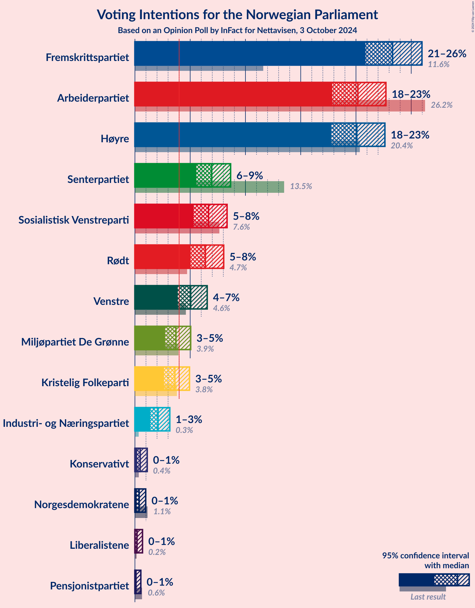

### Confidence Intervals

| Party | Last Result | Poll Result | 80% Confidence Interval | 90% Confidence Interval | 95% Confidence Interval | 99% Confidence Interval |
|:-----:|:-----------:|:-----------:|:-----------------------:|:-----------------------:|:-----------------------:|:-----------------------:|
| Fremskrittspartiet | 11.6% | 23.3% | 21.7–25.1% |21.2–25.5% |20.9–26.0% |20.1–26.8% |
| Arbeiderpartiet | 26.2% | 20.2% | 18.6–21.8% |18.2–22.3% |17.8–22.7% |17.1–23.5% |
| Høyre | 20.4% | 20.1% | 18.5–21.7% |18.1–22.2% |17.8–22.6% |17.1–23.4% |
| Senterpartiet | 13.5% | 6.9% | 6.0–8.1% |5.8–8.4% |5.6–8.7% |5.2–9.2% |
| Sosialistisk Venstreparti | 7.6% | 6.7% | 5.8–7.8% |5.5–8.1% |5.3–8.3% |4.9–8.9% |
| Rødt | 4.7% | 6.4% | 5.5–7.5% |5.3–7.8% |5.0–8.0% |4.7–8.6% |
| Venstre | 4.6% | 5.0% | 4.3–6.0% |4.1–6.3% |3.9–6.5% |3.5–7.0% |
| Miljøpartiet De Grønne | 3.9% | 3.7% | 3.1–4.6% |2.9–4.8% |2.7–5.0% |2.4–5.5% |
| Kristelig Folkeparti | 3.8% | 3.6% | 3.0–4.5% |2.8–4.7% |2.6–4.9% |2.4–5.4% |
| Industri- og Næringspartiet | 0.3% | 2.1% | 1.6–2.8% |1.5–3.0% |1.4–3.2% |1.2–3.5% |
| Konservativt | 0.4% | 0.5% | 0.3–0.9% |0.2–1.0% |0.2–1.1% |0.1–1.3% |
| Norgesdemokratene | 1.1% | 0.4% | 0.2–0.8% |0.2–0.9% |0.2–1.0% |0.1–1.2% |
| Liberalistene | 0.2% | 0.2% | 0.1–0.5% |0.1–0.6% |0.0–0.7% |0.0–0.9% |
| Pensjonistpartiet | 0.6% | 0.1% | 0.0–0.4% |0.0–0.5% |0.0–0.5% |0.0–0.7% |

*Note:* The poll result column reflects the actual value used in the calculations. Published results may vary slightly, and in addition be rounded to fewer digits.

## Seats

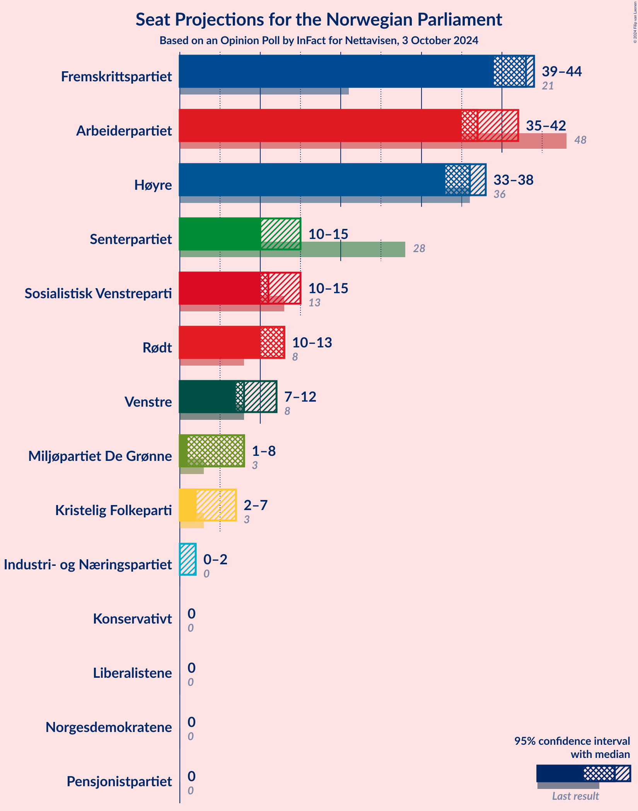

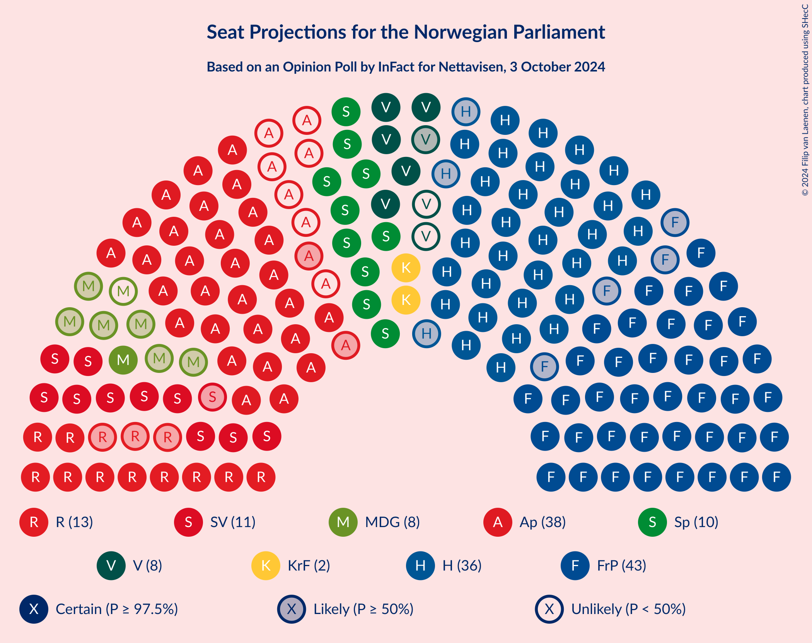

### Confidence Intervals

| Party | Last Result | Median | 80% Confidence Interval | 90% Confidence Interval | 95% Confidence Interval | 99% Confidence Interval |
|:-----:|:-----------:|:------:|:-----------------------:|:-----------------------:|:-----------------------:|:-----------------------:|
| <a href="#fremskrittspartiet">Fremskrittspartiet</a> | 21 | 43 | 42–43 |40–43 |39–44 |37–47 |
| <a href="#arbeiderpartiet">Arbeiderpartiet</a> | 48 | 37 | 37–38 |36–41 |35–42 |34–44 |
| <a href="#høyre">Høyre</a> | 36 | 36 | 36 |35–36 |33–38 |31–40 |
| <a href="#senterpartiet">Senterpartiet</a> | 28 | 10 | 10–13 |10–13 |10–15 |9–16 |
| <a href="#sosialistisk-venstreparti">Sosialistisk Venstreparti</a> | 13 | 11 | 11–12 |11–13 |10–15 |9–17 |
| <a href="#rødt">Rødt</a> | 8 | 13 | 11–13 |10–13 |10–13 |8–14 |
| <a href="#venstre">Venstre</a> | 8 | 8 | 8–9 |8–11 |7–12 |3–12 |
| <a href="#miljøpartiet-de-grønne">Miljøpartiet De Grønne</a> | 3 | 8 | 3–8 |1–8 |1–8 |1–9 |
| <a href="#kristelig-folkeparti">Kristelig Folkeparti</a> | 3 | 2 | 2 |2–3 |2–7 |1–8 |
| <a href="#industri--og-næringspartiet">Industri- og Næringspartiet</a> | 0 | 0 | 0 |0–2 |0–2 |0–2 |
| <a href="#konservativt">Konservativt</a> | 0 | 0 | 0 |0 |0 |0 |
| <a href="#norgesdemokratene">Norgesdemokratene</a> | 0 | 0 | 0 |0 |0 |0 |
| <a href="#liberalistene">Liberalistene</a> | 0 | 0 | 0 |0 |0 |0 |
| <a href="#pensjonistpartiet">Pensjonistpartiet</a> | 0 | 0 | 0 |0 |0 |0 |

### Fremskrittspartiet

*For a full overview of the results for this party, see the [Fremskrittspartiet](party-fremskrittspartiet.html) page.*

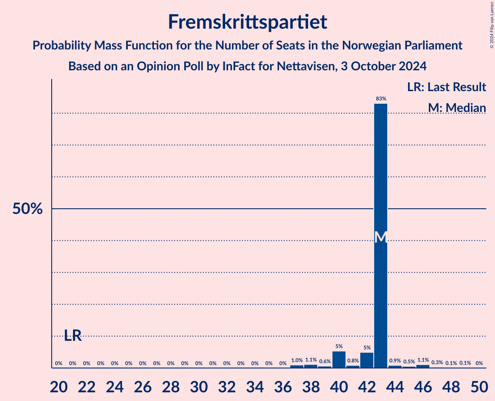

| Number of Seats | Probability | Accumulated | Special Marks |
|:---------------:|:-----------:|:-----------:|:-------------:|
| 21 | 0% | 100% | Last Result |
| 22 | 0% | 100% |  |
| 23 | 0% | 100% |  |
| 24 | 0% | 100% |  |
| 25 | 0% | 100% |  |
| 26 | 0% | 100% |  |
| 27 | 0% | 100% |  |
| 28 | 0% | 100% |  |
| 29 | 0% | 100% |  |
| 30 | 0% | 100% |  |
| 31 | 0% | 100% |  |
| 32 | 0% | 100% |  |
| 33 | 0% | 100% |  |
| 34 | 0% | 100% |  |
| 35 | 0% | 100% |  |
| 36 | 0% | 100% |  |
| 37 | 1.0% | 100% |  |
| 38 | 1.1% | 99.0% |  |
| 39 | 0.6% | 98% |  |
| 40 | 5% | 97% |  |
| 41 | 0.8% | 92% |  |
| 42 | 5% | 91% |  |
| 43 | 83% | 86% | Median |
| 44 | 0.9% | 3% |  |
| 45 | 0.5% | 2% |  |
| 46 | 1.1% | 2% |  |
| 47 | 0.3% | 0.5% |  |
| 48 | 0.1% | 0.2% |  |
| 49 | 0.1% | 0.2% |  |
| 50 | 0% | 0% |  |

### Arbeiderpartiet

*For a full overview of the results for this party, see the [Arbeiderpartiet](party-arbeiderpartiet.html) page.*

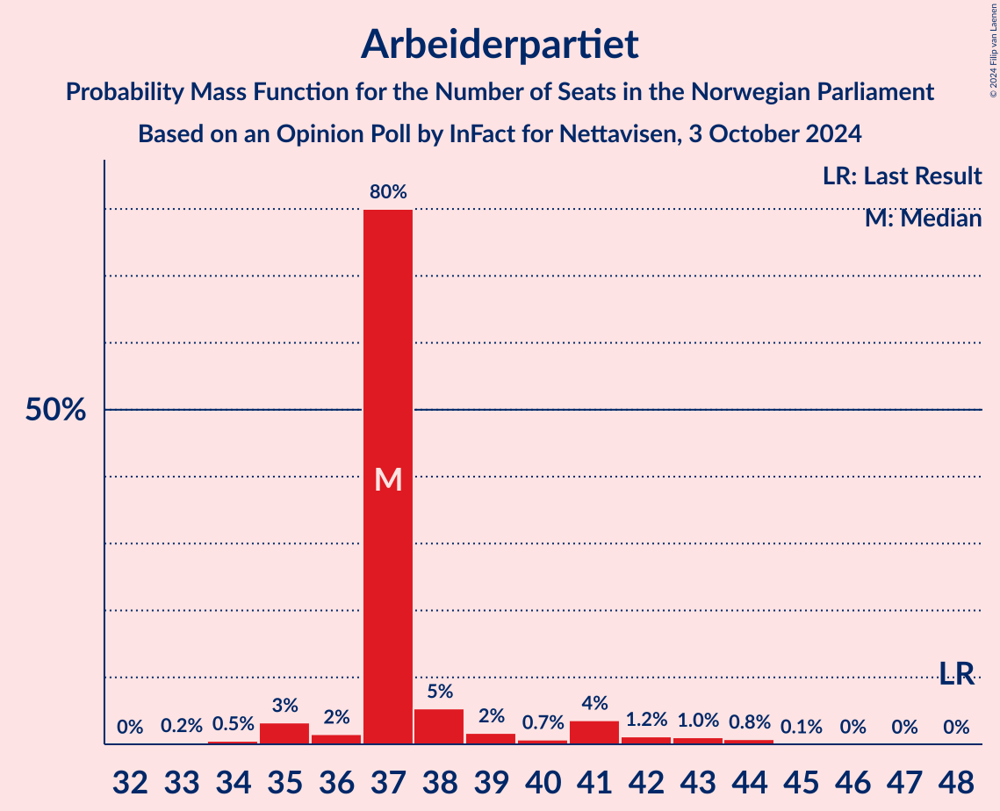

| Number of Seats | Probability | Accumulated | Special Marks |
|:---------------:|:-----------:|:-----------:|:-------------:|
| 33 | 0.2% | 100% |  |
| 34 | 0.5% | 99.7% |  |
| 35 | 3% | 99.2% |  |
| 36 | 2% | 96% |  |
| 37 | 80% | 94% | Median |
| 38 | 5% | 14% |  |
| 39 | 2% | 9% |  |
| 40 | 0.7% | 7% |  |
| 41 | 4% | 7% |  |
| 42 | 1.2% | 3% |  |
| 43 | 1.0% | 2% |  |
| 44 | 0.8% | 0.9% |  |
| 45 | 0.1% | 0.1% |  |
| 46 | 0% | 0.1% |  |
| 47 | 0% | 0% |  |
| 48 | 0% | 0% | Last Result |

### Høyre

*For a full overview of the results for this party, see the [Høyre](party-høyre.html) page.*

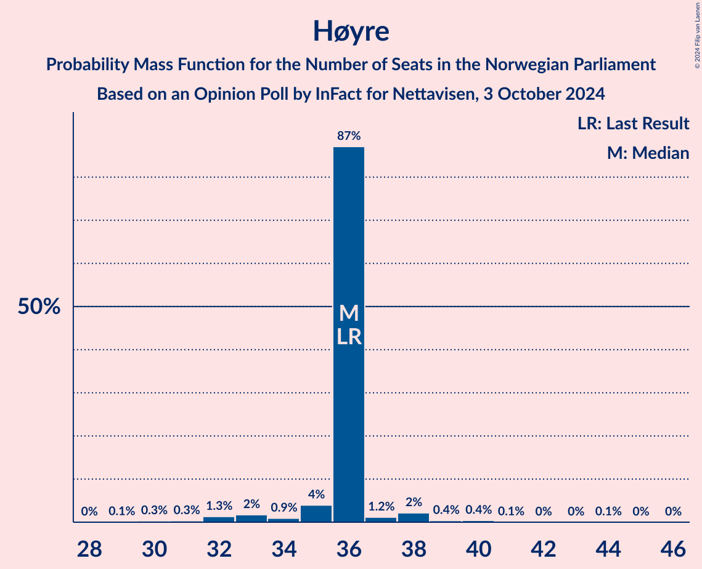

| Number of Seats | Probability | Accumulated | Special Marks |
|:---------------:|:-----------:|:-----------:|:-------------:|
| 29 | 0.1% | 100% |  |
| 30 | 0.3% | 99.9% |  |
| 31 | 0.3% | 99.6% |  |
| 32 | 1.3% | 99.3% |  |
| 33 | 2% | 98% |  |
| 34 | 0.9% | 96% |  |
| 35 | 4% | 95% |  |
| 36 | 87% | 91% | Last Result, Median |
| 37 | 1.2% | 4% |  |
| 38 | 2% | 3% |  |
| 39 | 0.4% | 0.9% |  |
| 40 | 0.4% | 0.5% |  |
| 41 | 0.1% | 0.1% |  |
| 42 | 0% | 0.1% |  |
| 43 | 0% | 0.1% |  |
| 44 | 0.1% | 0.1% |  |
| 45 | 0% | 0% |  |

### Senterpartiet

*For a full overview of the results for this party, see the [Senterpartiet](party-senterpartiet.html) page.*

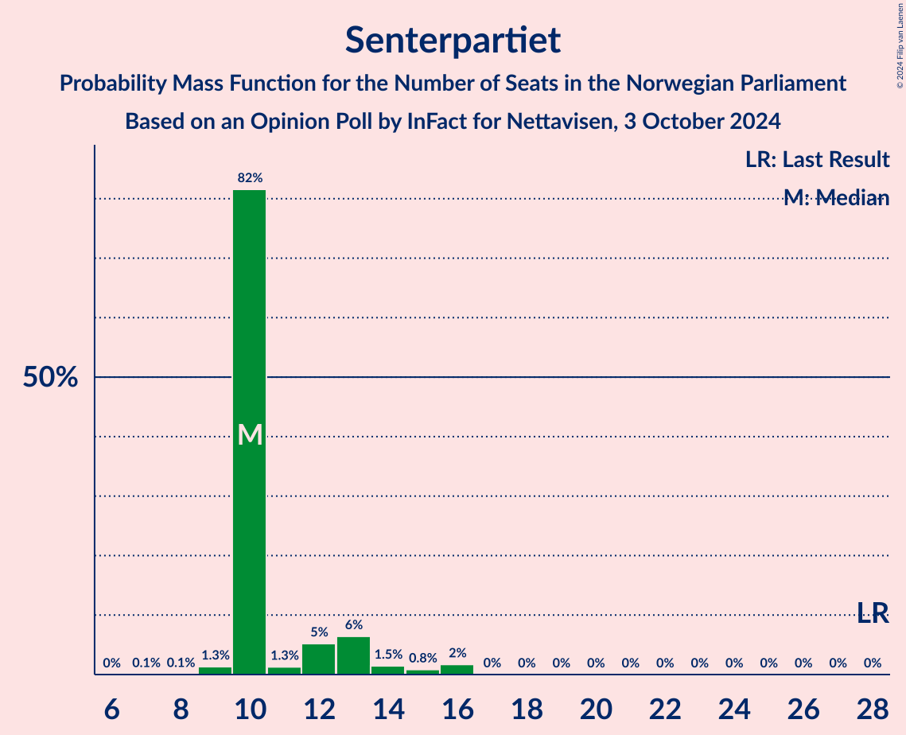

| Number of Seats | Probability | Accumulated | Special Marks |
|:---------------:|:-----------:|:-----------:|:-------------:|
| 7 | 0.1% | 100% |  |
| 8 | 0.1% | 99.9% |  |
| 9 | 1.3% | 99.9% |  |
| 10 | 82% | 98.5% | Median |
| 11 | 1.3% | 17% |  |
| 12 | 5% | 16% |  |
| 13 | 6% | 10% |  |
| 14 | 1.5% | 4% |  |
| 15 | 0.8% | 3% |  |
| 16 | 2% | 2% |  |
| 17 | 0% | 0% |  |
| 18 | 0% | 0% |  |
| 19 | 0% | 0% |  |
| 20 | 0% | 0% |  |
| 21 | 0% | 0% |  |
| 22 | 0% | 0% |  |
| 23 | 0% | 0% |  |
| 24 | 0% | 0% |  |
| 25 | 0% | 0% |  |
| 26 | 0% | 0% |  |
| 27 | 0% | 0% |  |
| 28 | 0% | 0% | Last Result |

### Sosialistisk Venstreparti

*For a full overview of the results for this party, see the [Sosialistisk Venstreparti](party-sosialistiskvenstreparti.html) page.*

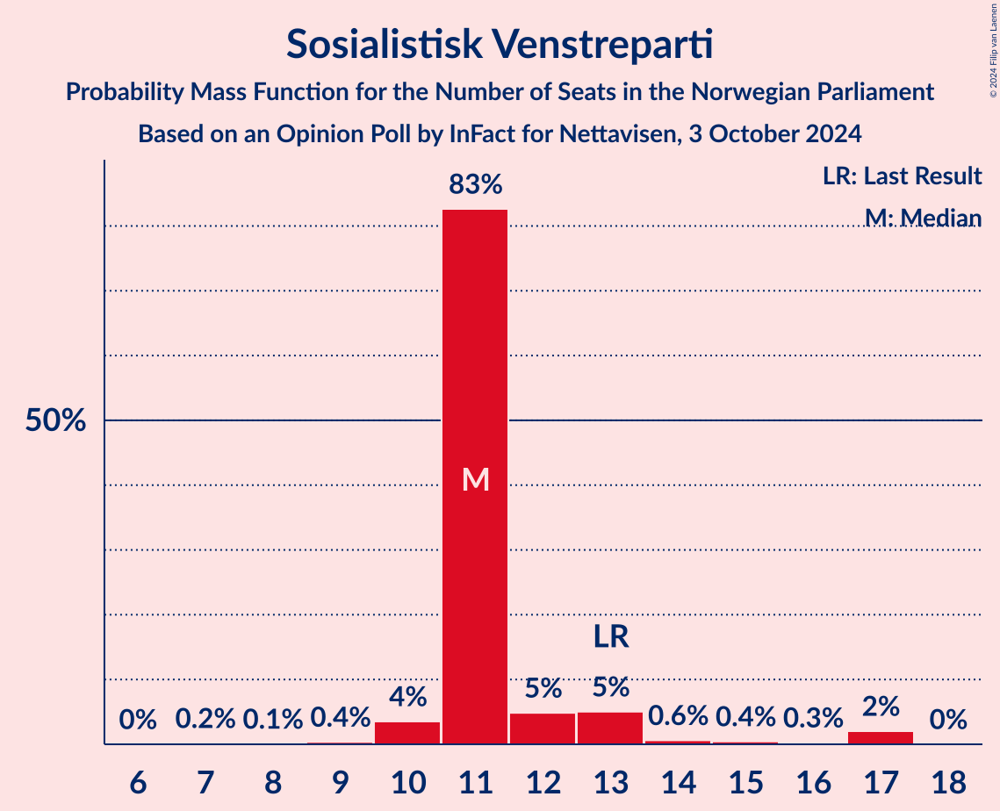

| Number of Seats | Probability | Accumulated | Special Marks |
|:---------------:|:-----------:|:-----------:|:-------------:|
| 7 | 0.2% | 100% |  |
| 8 | 0.1% | 99.8% |  |
| 9 | 0.4% | 99.8% |  |
| 10 | 4% | 99.4% |  |
| 11 | 83% | 96% | Median |
| 12 | 5% | 13% |  |
| 13 | 5% | 8% | Last Result |
| 14 | 0.6% | 3% |  |
| 15 | 0.4% | 3% |  |
| 16 | 0.3% | 2% |  |
| 17 | 2% | 2% |  |
| 18 | 0% | 0% |  |

### Rødt

*For a full overview of the results for this party, see the [Rødt](party-rødt.html) page.*

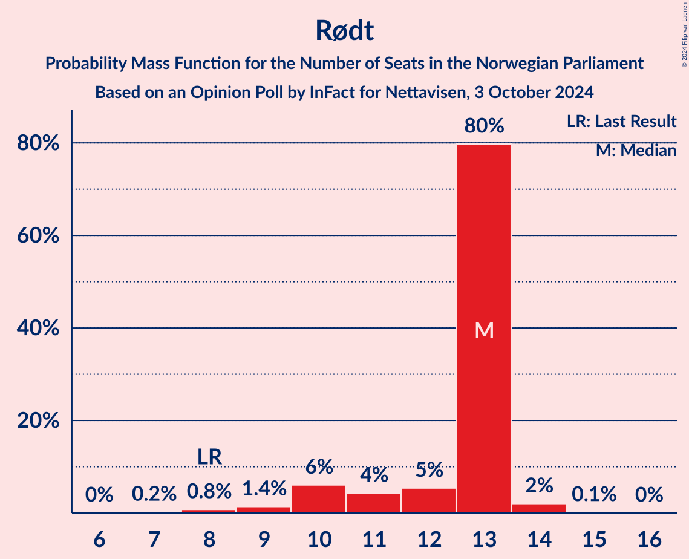

| Number of Seats | Probability | Accumulated | Special Marks |
|:---------------:|:-----------:|:-----------:|:-------------:|
| 7 | 0.2% | 100% |  |
| 8 | 0.8% | 99.8% | Last Result |
| 9 | 1.4% | 99.0% |  |
| 10 | 6% | 98% |  |
| 11 | 4% | 92% |  |
| 12 | 5% | 87% |  |
| 13 | 80% | 82% | Median |
| 14 | 2% | 2% |  |
| 15 | 0.1% | 0.1% |  |
| 16 | 0% | 0% |  |

### Venstre

*For a full overview of the results for this party, see the [Venstre](party-venstre.html) page.*

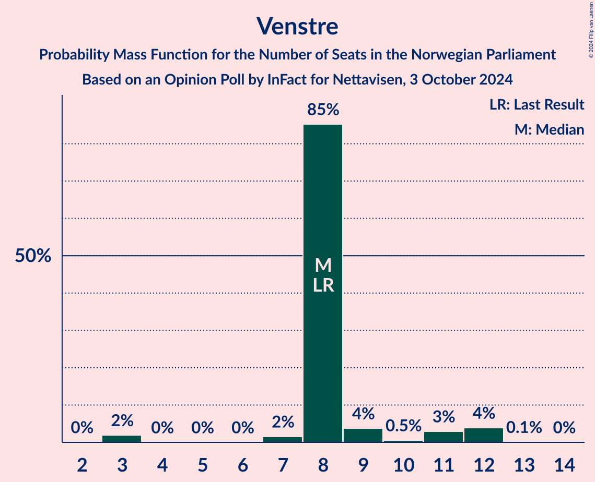

| Number of Seats | Probability | Accumulated | Special Marks |
|:---------------:|:-----------:|:-----------:|:-------------:|
| 3 | 2% | 100% |  |
| 4 | 0% | 98% |  |
| 5 | 0% | 98% |  |
| 6 | 0% | 98% |  |
| 7 | 2% | 98% |  |
| 8 | 85% | 96% | Last Result, Median |
| 9 | 4% | 11% |  |
| 10 | 0.5% | 7% |  |
| 11 | 3% | 7% |  |
| 12 | 4% | 4% |  |
| 13 | 0.1% | 0.1% |  |
| 14 | 0% | 0% |  |

### Miljøpartiet De Grønne

*For a full overview of the results for this party, see the [Miljøpartiet De Grønne](party-miljøpartietdegrønne.html) page.*

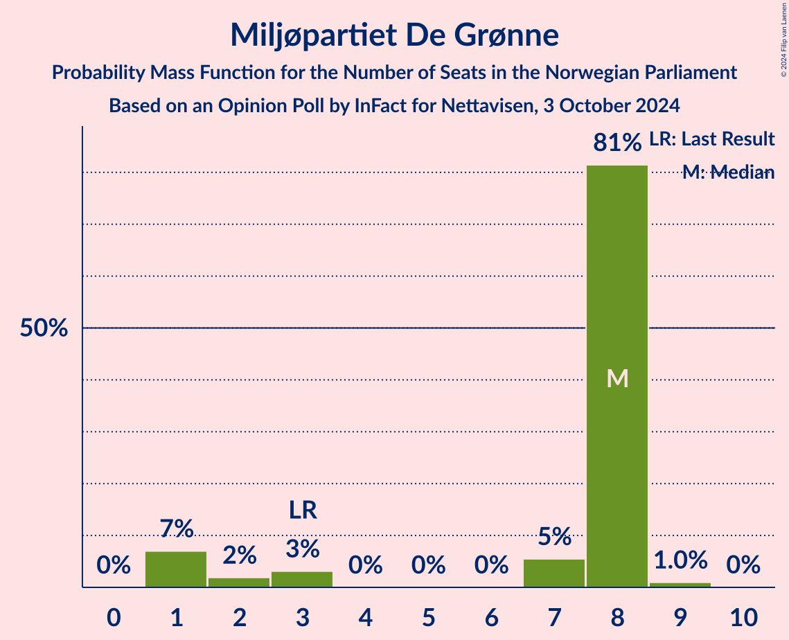

| Number of Seats | Probability | Accumulated | Special Marks |
|:---------------:|:-----------:|:-----------:|:-------------:|
| 1 | 7% | 100% |  |
| 2 | 2% | 93% |  |
| 3 | 3% | 91% | Last Result |
| 4 | 0% | 88% |  |
| 5 | 0% | 88% |  |
| 6 | 0% | 88% |  |
| 7 | 5% | 88% |  |
| 8 | 81% | 82% | Median |
| 9 | 1.0% | 1.0% |  |
| 10 | 0% | 0% |  |

### Kristelig Folkeparti

*For a full overview of the results for this party, see the [Kristelig Folkeparti](party-kristeligfolkeparti.html) page.*

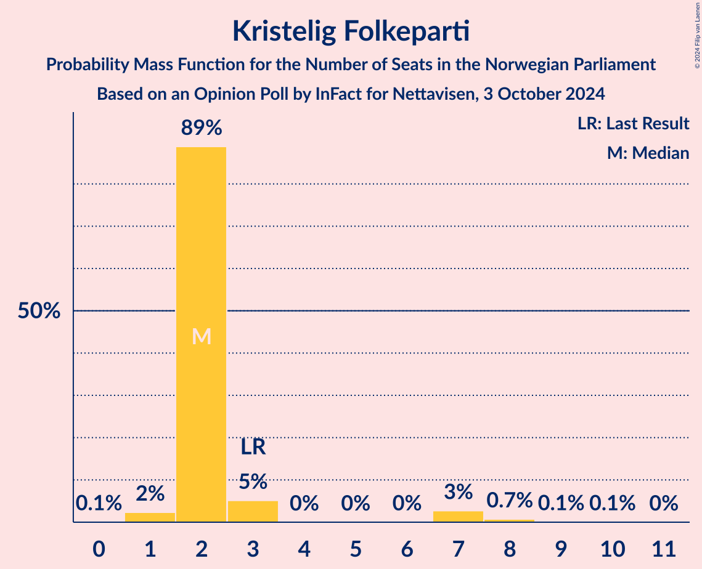

| Number of Seats | Probability | Accumulated | Special Marks |
|:---------------:|:-----------:|:-----------:|:-------------:|
| 0 | 0.1% | 100% |  |
| 1 | 2% | 99.9% |  |
| 2 | 89% | 98% | Median |
| 3 | 5% | 9% | Last Result |
| 4 | 0% | 4% |  |
| 5 | 0% | 4% |  |
| 6 | 0% | 4% |  |
| 7 | 3% | 4% |  |
| 8 | 0.7% | 0.9% |  |
| 9 | 0.1% | 0.1% |  |
| 10 | 0.1% | 0.1% |  |
| 11 | 0% | 0% |  |

### Industri- og Næringspartiet

*For a full overview of the results for this party, see the [Industri- og Næringspartiet](party-industri-ognæringspartiet.html) page.*

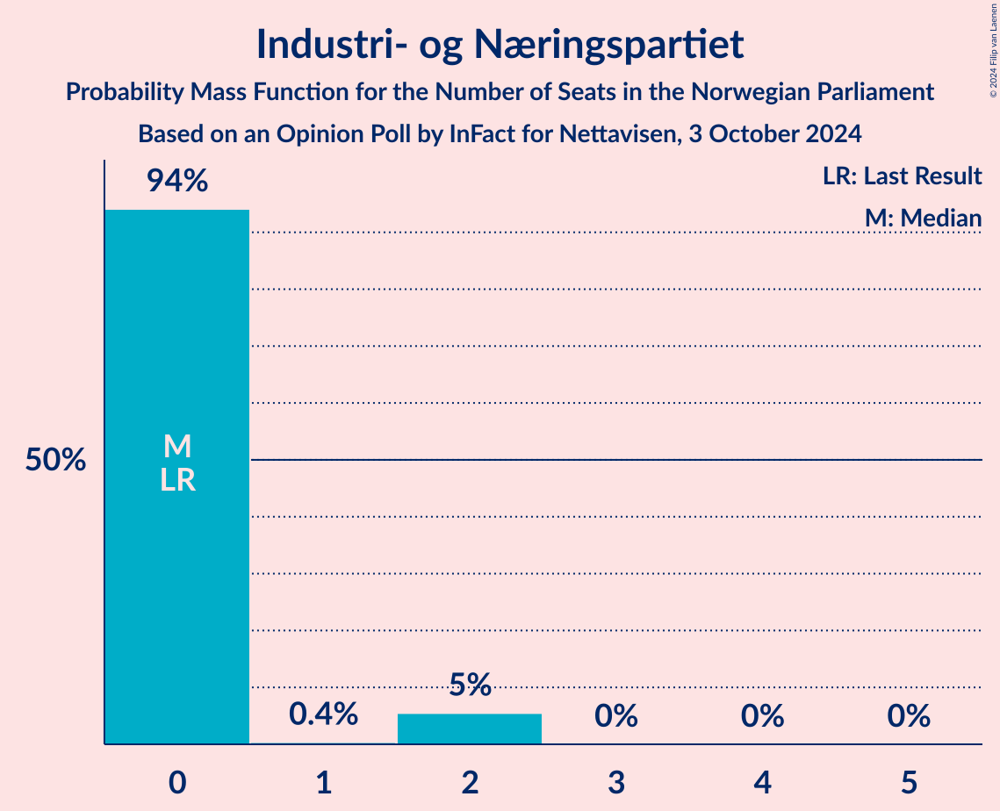

| Number of Seats | Probability | Accumulated | Special Marks |
|:---------------:|:-----------:|:-----------:|:-------------:|
| 0 | 94% | 100% | Last Result, Median |
| 1 | 0.4% | 6% |  |
| 2 | 5% | 6% |  |
| 3 | 0% | 0% |  |

### Konservativt

*For a full overview of the results for this party, see the [Konservativt](party-konservativt.html) page.*

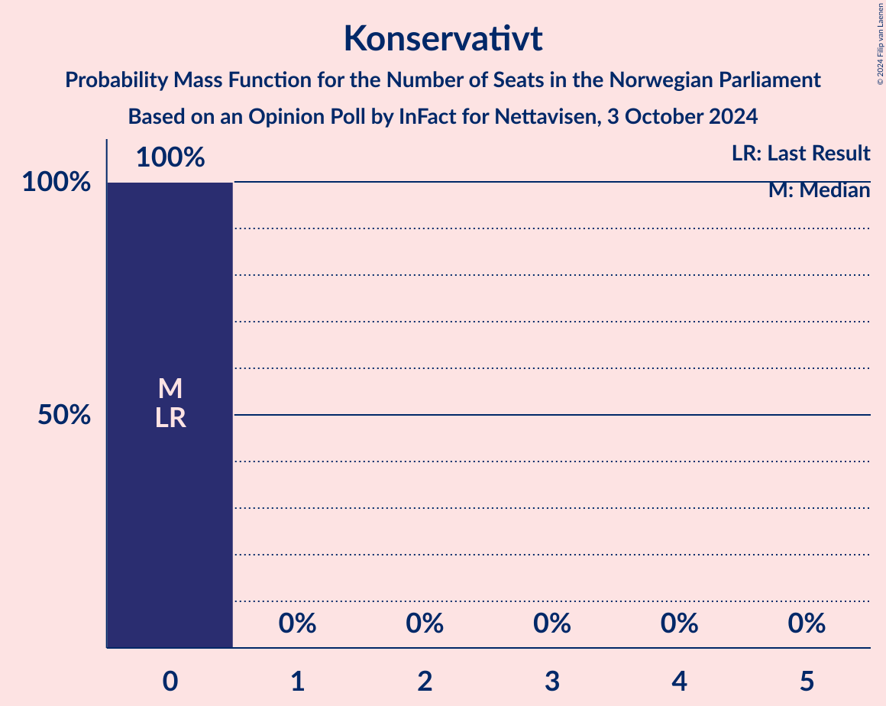

| Number of Seats | Probability | Accumulated | Special Marks |
|:---------------:|:-----------:|:-----------:|:-------------:|
| 0 | 100% | 100% | Last Result, Median |

### Norgesdemokratene

*For a full overview of the results for this party, see the [Norgesdemokratene](party-norgesdemokratene.html) page.*

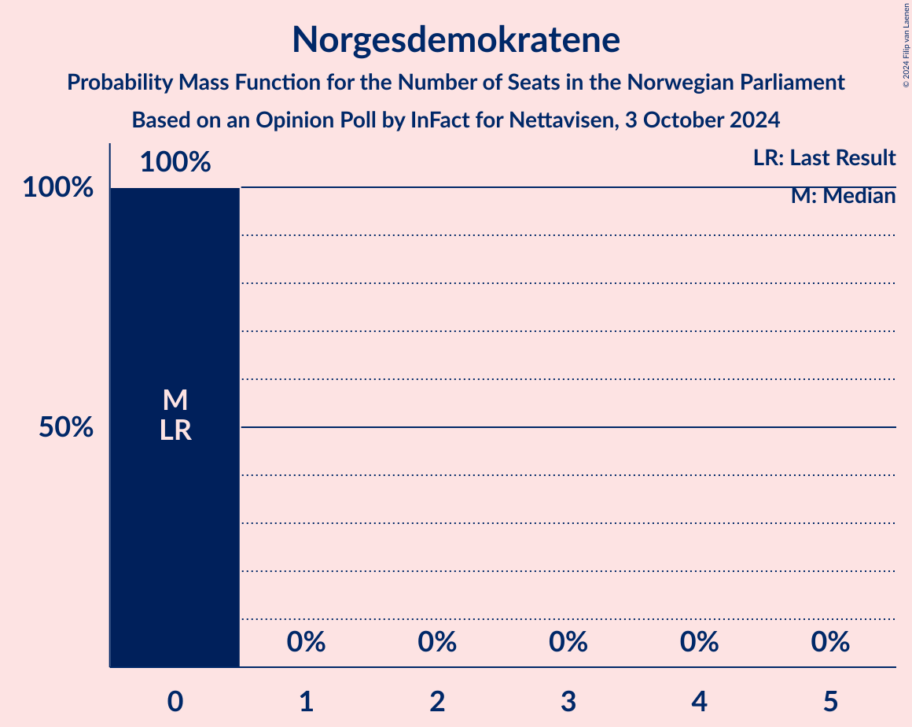

| Number of Seats | Probability | Accumulated | Special Marks |
|:---------------:|:-----------:|:-----------:|:-------------:|
| 0 | 100% | 100% | Last Result, Median |

### Liberalistene

*For a full overview of the results for this party, see the [Liberalistene](party-liberalistene.html) page.*

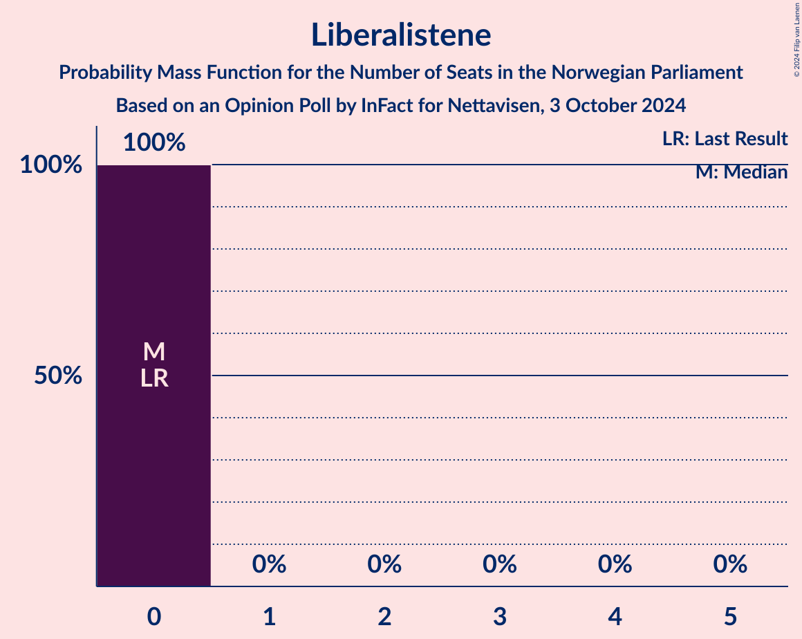

| Number of Seats | Probability | Accumulated | Special Marks |
|:---------------:|:-----------:|:-----------:|:-------------:|
| 0 | 100% | 100% | Last Result, Median |

### Pensjonistpartiet

*For a full overview of the results for this party, see the [Pensjonistpartiet](party-pensjonistpartiet.html) page.*

| Number of Seats | Probability | Accumulated | Special Marks |
|:---------------:|:-----------:|:-----------:|:-------------:|
| 0 | 100% | 100% | Last Result, Median |

## Coalitions

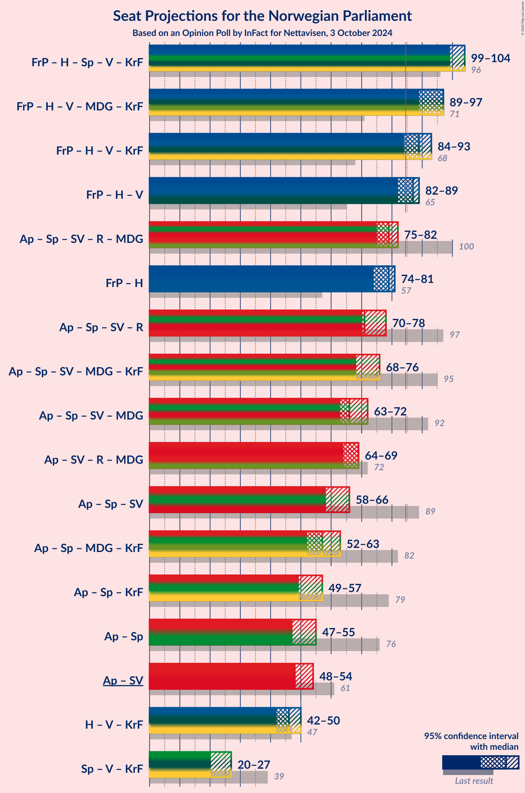

### Confidence Intervals

| Coalition | Last Result | Median | Majority? | 80% Confidence Interval | 90% Confidence Interval | 95% Confidence Interval | 99% Confidence Interval |
|:---------:|:-----------:|:------:|:---------:|:-----------------------:|:-----------------------:|:-----------------------:|:-----------------------:|
| Fremskrittspartiet – Høyre – Senterpartiet – Venstre – Kristelig Folkeparti | 96 | 99 | 100% | 99–101 | 99–103 | 99–104 | 95–109 |
| Fremskrittspartiet – Høyre – Venstre – Miljøpartiet De Grønne – Kristelig Folkeparti | 71 | 97 | 100% | 91–97 | 91–97 | 89–97 | 87–101 |
| Fremskrittspartiet – Høyre – Venstre – Kristelig Folkeparti | 68 | 89 | 97% | 89–90 | 87–90 | 84–93 | 83–97 |
| Fremskrittspartiet – Høyre – Venstre | 65 | 87 | 95% | 86–87 | 84–88 | 82–89 | 79–92 |
| Arbeiderpartiet – Senterpartiet – Sosialistisk Venstreparti – Rødt – Miljøpartiet De Grønne | 100 | 79 | 2% | 78–79 | 77–81 | 75–82 | 70–85 |
| Fremskrittspartiet – Høyre | 57 | 79 | 0.2% | 77–79 | 76–79 | 74–81 | 70–83 |
| Arbeiderpartiet – Senterpartiet – Sosialistisk Venstreparti – Rødt | 97 | 71 | 0% | 71–76 | 71–77 | 70–78 | 67–79 |
| Arbeiderpartiet – Senterpartiet – Sosialistisk Venstreparti – Miljøpartiet De Grønne – Kristelig Folkeparti | 95 | 68 | 0% | 68–70 | 68–72 | 68–76 | 64–79 |
| Arbeiderpartiet – Senterpartiet – Sosialistisk Venstreparti – Miljøpartiet De Grønne | 92 | 66 | 0% | 66–67 | 66–69 | 63–72 | 61–75 |
| Arbeiderpartiet – Sosialistisk Venstreparti – Rødt – Miljøpartiet De Grønne | 72 | 69 | 0% | 66–69 | 65–69 | 64–69 | 59–71 |
| Arbeiderpartiet – Senterpartiet – Sosialistisk Venstreparti | 89 | 58 | 0% | 58–65 | 58–66 | 58–66 | 56–67 |
| Arbeiderpartiet – Senterpartiet – Miljøpartiet De Grønne – Kristelig Folkeparti | 82 | 57 | 0% | 57 | 57–61 | 52–63 | 51–69 |
| Arbeiderpartiet – Senterpartiet – Kristelig Folkeparti | 79 | 49 | 0% | 49–55 | 49–56 | 49–57 | 49–62 |
| Arbeiderpartiet – Senterpartiet | 76 | 47 | 0% | 47–51 | 47–54 | 47–55 | 45–55 |
| Arbeiderpartiet – Sosialistisk Venstreparti | 61 | 48 | 0% | 48–51 | 48–53 | 48–54 | 46–55 |
| Høyre – Venstre – Kristelig Folkeparti | 47 | 46 | 0% | 46–48 | 45–50 | 42–50 | 40–54 |
| Senterpartiet – Venstre – Kristelig Folkeparti | 39 | 20 | 0% | 20–24 | 20–27 | 20–27 | 20–29 |

### Fremskrittspartiet – Høyre – Senterpartiet – Venstre – Kristelig Folkeparti

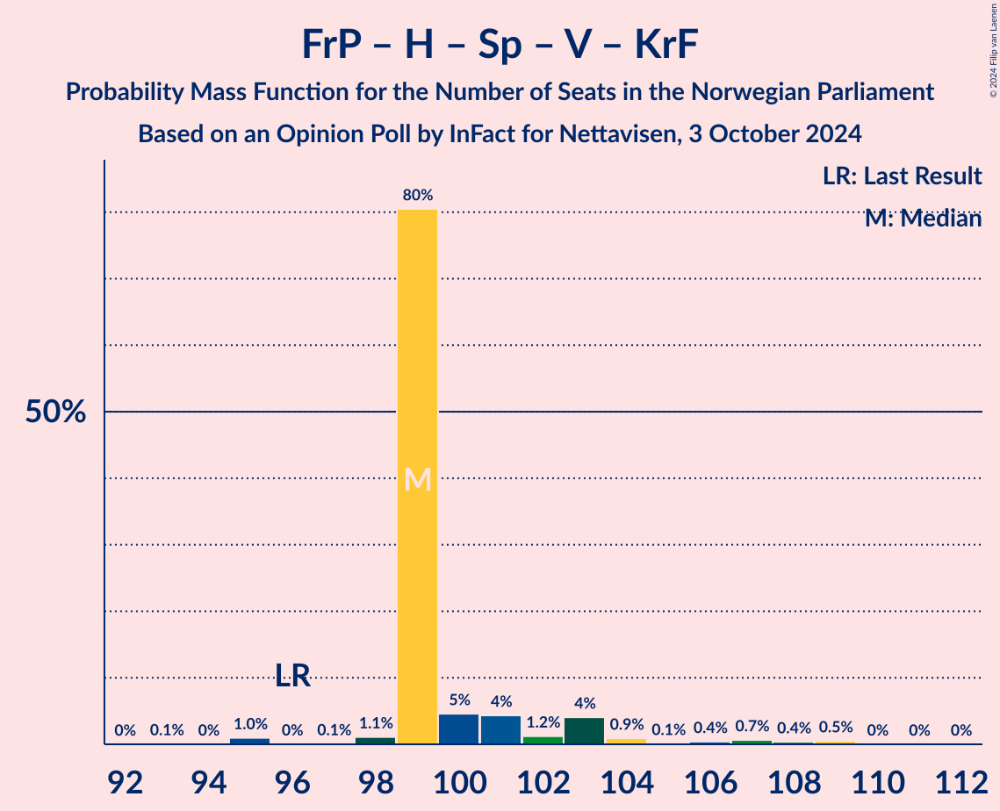

| Number of Seats | Probability | Accumulated | Special Marks |
|:---------------:|:-----------:|:-----------:|:-------------:|
| 93 | 0.1% | 100% |  |
| 94 | 0% | 99.9% |  |
| 95 | 1.0% | 99.9% |  |
| 96 | 0% | 98.9% | Last Result |
| 97 | 0.1% | 98.9% |  |
| 98 | 1.1% | 98.8% |  |
| 99 | 80% | 98% | Median |
| 100 | 5% | 17% |  |
| 101 | 4% | 13% |  |
| 102 | 1.2% | 8% |  |
| 103 | 4% | 7% |  |
| 104 | 0.9% | 3% |  |
| 105 | 0.1% | 2% |  |
| 106 | 0.4% | 2% |  |
| 107 | 0.7% | 2% |  |
| 108 | 0.4% | 0.9% |  |
| 109 | 0.5% | 0.6% |  |
| 110 | 0% | 0.1% |  |
| 111 | 0% | 0% |  |

### Fremskrittspartiet – Høyre – Venstre – Miljøpartiet De Grønne – Kristelig Folkeparti

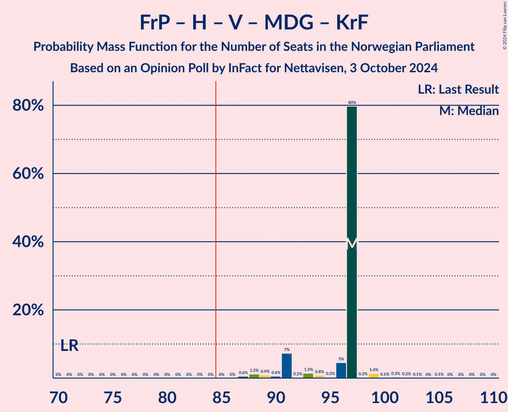

| Number of Seats | Probability | Accumulated | Special Marks |
|:---------------:|:-----------:|:-----------:|:-------------:|
| 71 | 0% | 100% | Last Result |
| 72 | 0% | 100% |  |
| 73 | 0% | 100% |  |
| 74 | 0% | 100% |  |
| 75 | 0% | 100% |  |
| 76 | 0% | 100% |  |
| 77 | 0% | 100% |  |
| 78 | 0% | 100% |  |
| 79 | 0% | 100% |  |
| 80 | 0% | 100% |  |
| 81 | 0% | 100% |  |
| 82 | 0% | 100% |  |
| 83 | 0% | 100% |  |
| 84 | 0% | 100% |  |
| 85 | 0% | 100% | Majority |
| 86 | 0% | 100% |  |
| 87 | 0.6% | 99.9% |  |
| 88 | 1.2% | 99.4% |  |
| 89 | 0.9% | 98% |  |
| 90 | 0.6% | 97% |  |
| 91 | 7% | 97% |  |
| 92 | 0.2% | 89% |  |
| 93 | 1.5% | 89% |  |
| 94 | 0.8% | 88% |  |
| 95 | 0.3% | 87% |  |
| 96 | 5% | 87% |  |
| 97 | 80% | 82% | Median |
| 98 | 0.2% | 2% |  |
| 99 | 1.4% | 2% |  |
| 100 | 0.1% | 0.7% |  |
| 101 | 0.3% | 0.6% |  |
| 102 | 0.2% | 0.3% |  |
| 103 | 0.1% | 0.1% |  |
| 104 | 0% | 0.1% |  |
| 105 | 0.1% | 0.1% |  |
| 106 | 0% | 0% |  |

### Fremskrittspartiet – Høyre – Venstre – Kristelig Folkeparti

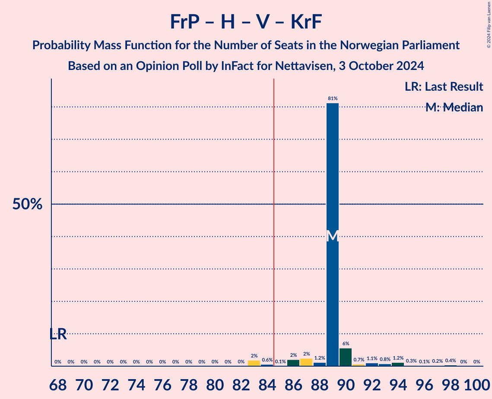

| Number of Seats | Probability | Accumulated | Special Marks |
|:---------------:|:-----------:|:-----------:|:-------------:|
| 68 | 0% | 100% | Last Result |
| 69 | 0% | 100% |  |
| 70 | 0% | 100% |  |
| 71 | 0% | 100% |  |
| 72 | 0% | 100% |  |
| 73 | 0% | 100% |  |
| 74 | 0% | 100% |  |
| 75 | 0% | 100% |  |
| 76 | 0% | 100% |  |
| 77 | 0% | 100% |  |
| 78 | 0% | 100% |  |
| 79 | 0% | 100% |  |
| 80 | 0% | 100% |  |
| 81 | 0% | 100% |  |
| 82 | 0% | 100% |  |
| 83 | 2% | 99.9% |  |
| 84 | 0.6% | 98% |  |
| 85 | 0.1% | 97% | Majority |
| 86 | 2% | 97% |  |
| 87 | 2% | 95% |  |
| 88 | 1.2% | 93% |  |
| 89 | 81% | 92% | Median |
| 90 | 6% | 10% |  |
| 91 | 0.7% | 5% |  |
| 92 | 1.1% | 4% |  |
| 93 | 0.8% | 3% |  |
| 94 | 1.2% | 2% |  |
| 95 | 0.3% | 1.1% |  |
| 96 | 0.1% | 0.8% |  |
| 97 | 0.2% | 0.7% |  |
| 98 | 0.4% | 0.5% |  |
| 99 | 0% | 0.1% |  |
| 100 | 0% | 0% |  |

### Fremskrittspartiet – Høyre – Venstre

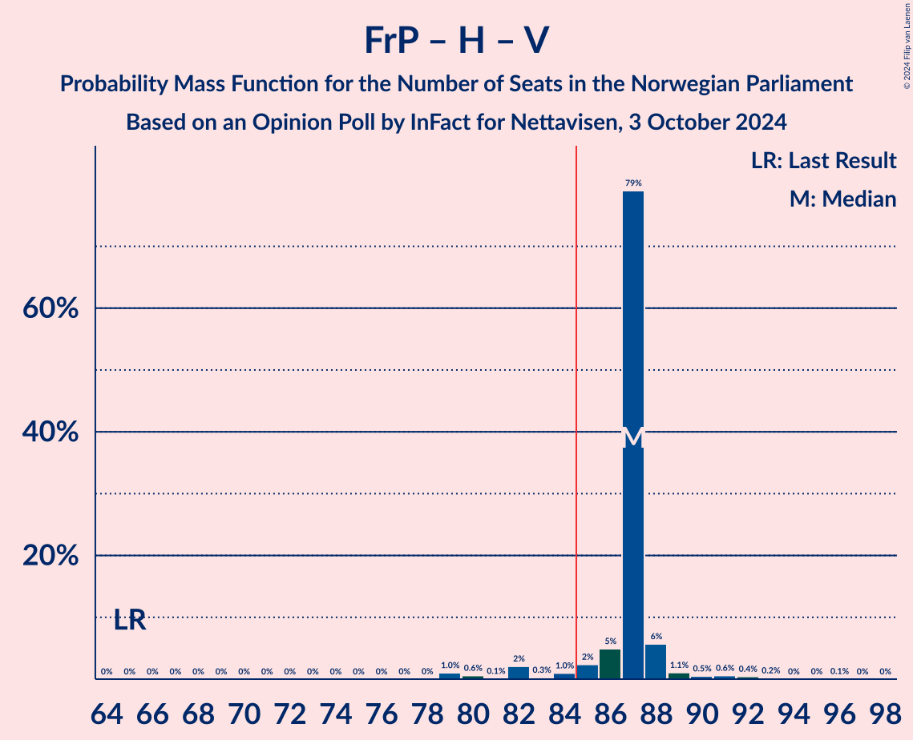

| Number of Seats | Probability | Accumulated | Special Marks |
|:---------------:|:-----------:|:-----------:|:-------------:|
| 65 | 0% | 100% | Last Result |
| 66 | 0% | 100% |  |
| 67 | 0% | 100% |  |
| 68 | 0% | 100% |  |
| 69 | 0% | 100% |  |
| 70 | 0% | 100% |  |
| 71 | 0% | 100% |  |
| 72 | 0% | 100% |  |
| 73 | 0% | 100% |  |
| 74 | 0% | 100% |  |
| 75 | 0% | 100% |  |
| 76 | 0% | 100% |  |
| 77 | 0% | 100% |  |
| 78 | 0% | 100% |  |
| 79 | 1.0% | 99.9% |  |
| 80 | 0.6% | 98.9% |  |
| 81 | 0.1% | 98% |  |
| 82 | 2% | 98% |  |
| 83 | 0.3% | 96% |  |
| 84 | 1.0% | 96% |  |
| 85 | 2% | 95% | Majority |
| 86 | 5% | 92% |  |
| 87 | 79% | 88% | Median |
| 88 | 6% | 9% |  |
| 89 | 1.1% | 3% |  |
| 90 | 0.5% | 2% |  |
| 91 | 0.6% | 1.3% |  |
| 92 | 0.4% | 0.7% |  |
| 93 | 0.2% | 0.3% |  |
| 94 | 0% | 0.1% |  |
| 95 | 0% | 0.1% |  |
| 96 | 0.1% | 0.1% |  |
| 97 | 0% | 0% |  |

### Arbeiderpartiet – Senterpartiet – Sosialistisk Venstreparti – Rødt – Miljøpartiet De Grønne

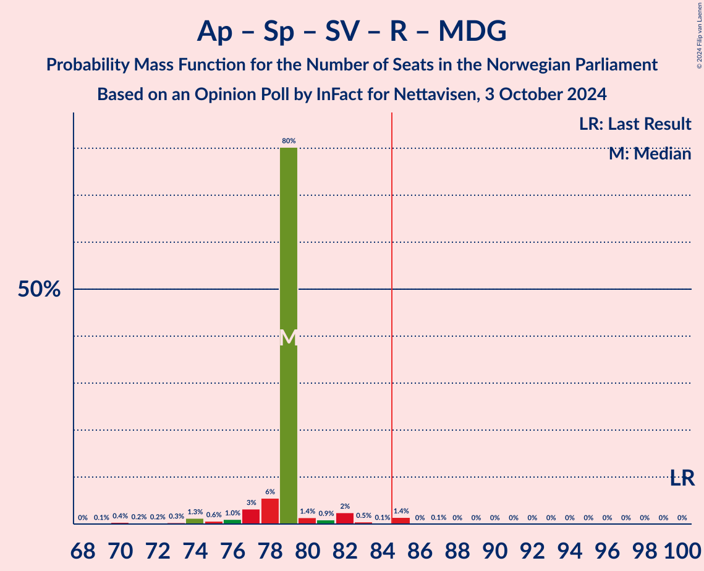

| Number of Seats | Probability | Accumulated | Special Marks |
|:---------------:|:-----------:|:-----------:|:-------------:|
| 68 | 0% | 100% |  |
| 69 | 0.1% | 99.9% |  |
| 70 | 0.4% | 99.9% |  |
| 71 | 0.2% | 99.5% |  |
| 72 | 0.2% | 99.3% |  |
| 73 | 0.3% | 99.1% |  |
| 74 | 1.3% | 98.8% |  |
| 75 | 0.6% | 98% |  |
| 76 | 1.0% | 97% |  |
| 77 | 3% | 96% |  |
| 78 | 6% | 93% |  |
| 79 | 80% | 87% | Median |
| 80 | 1.4% | 7% |  |
| 81 | 0.9% | 5% |  |
| 82 | 2% | 5% |  |
| 83 | 0.5% | 2% |  |
| 84 | 0.1% | 2% |  |
| 85 | 1.4% | 2% | Majority |
| 86 | 0% | 0.1% |  |
| 87 | 0.1% | 0.1% |  |
| 88 | 0% | 0% |  |
| 89 | 0% | 0% |  |
| 90 | 0% | 0% |  |
| 91 | 0% | 0% |  |
| 92 | 0% | 0% |  |
| 93 | 0% | 0% |  |
| 94 | 0% | 0% |  |
| 95 | 0% | 0% |  |
| 96 | 0% | 0% |  |
| 97 | 0% | 0% |  |
| 98 | 0% | 0% |  |
| 99 | 0% | 0% |  |
| 100 | 0% | 0% | Last Result |

### Fremskrittspartiet – Høyre

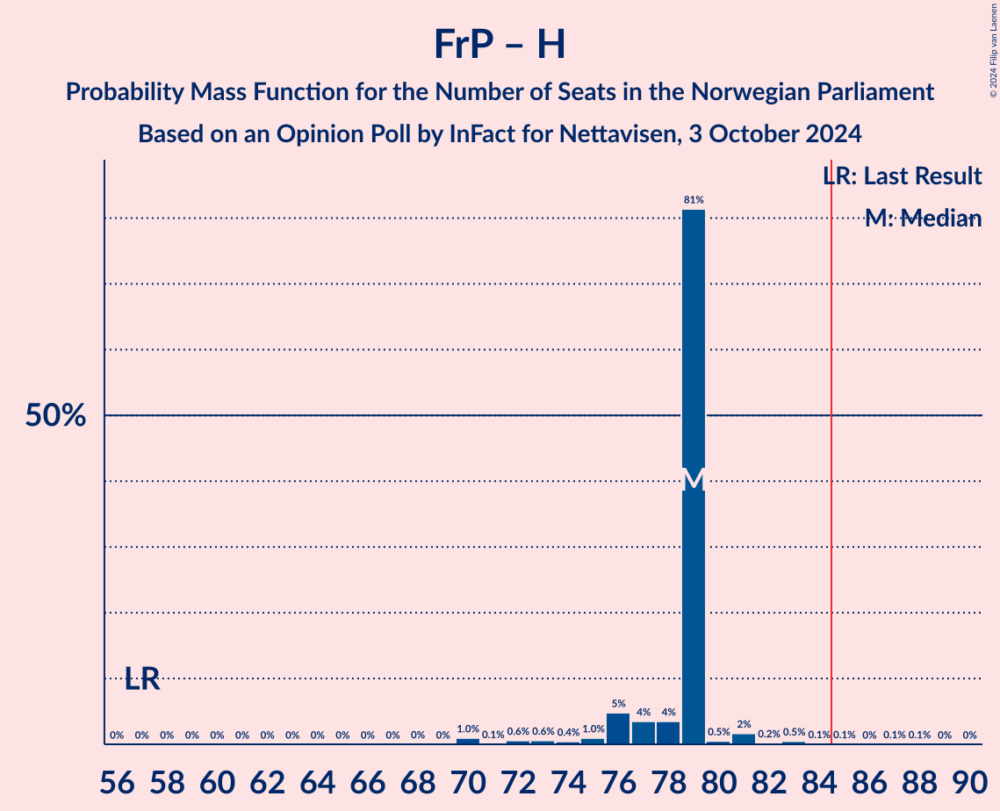

| Number of Seats | Probability | Accumulated | Special Marks |
|:---------------:|:-----------:|:-----------:|:-------------:|
| 57 | 0% | 100% | Last Result |
| 58 | 0% | 100% |  |
| 59 | 0% | 100% |  |
| 60 | 0% | 100% |  |
| 61 | 0% | 100% |  |
| 62 | 0% | 100% |  |
| 63 | 0% | 100% |  |
| 64 | 0% | 100% |  |
| 65 | 0% | 100% |  |
| 66 | 0% | 100% |  |
| 67 | 0% | 100% |  |
| 68 | 0% | 100% |  |
| 69 | 0% | 100% |  |
| 70 | 1.0% | 100% |  |
| 71 | 0.1% | 99.0% |  |
| 72 | 0.6% | 98.9% |  |
| 73 | 0.6% | 98% |  |
| 74 | 0.4% | 98% |  |
| 75 | 1.0% | 97% |  |
| 76 | 5% | 96% |  |
| 77 | 4% | 92% |  |
| 78 | 4% | 88% |  |
| 79 | 81% | 85% | Median |
| 80 | 0.5% | 3% |  |
| 81 | 2% | 3% |  |
| 82 | 0.2% | 0.9% |  |
| 83 | 0.5% | 0.7% |  |
| 84 | 0.1% | 0.3% |  |
| 85 | 0.1% | 0.2% | Majority |
| 86 | 0% | 0.1% |  |
| 87 | 0.1% | 0.1% |  |
| 88 | 0.1% | 0.1% |  |
| 89 | 0% | 0% |  |

### Arbeiderpartiet – Senterpartiet – Sosialistisk Venstreparti – Rødt

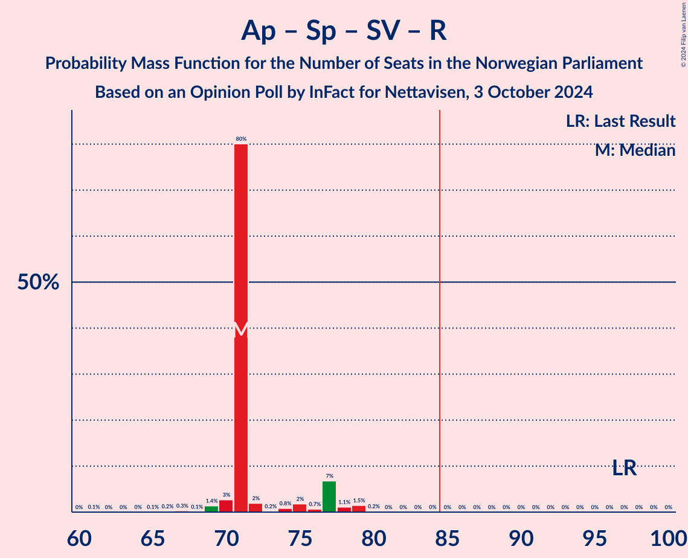

| Number of Seats | Probability | Accumulated | Special Marks |
|:---------------:|:-----------:|:-----------:|:-------------:|
| 61 | 0.1% | 100% |  |
| 62 | 0% | 99.9% |  |
| 63 | 0% | 99.9% |  |
| 64 | 0% | 99.9% |  |
| 65 | 0.1% | 99.9% |  |
| 66 | 0.2% | 99.8% |  |
| 67 | 0.3% | 99.7% |  |
| 68 | 0.1% | 99.3% |  |
| 69 | 1.4% | 99.3% |  |
| 70 | 3% | 98% |  |
| 71 | 80% | 95% | Median |
| 72 | 2% | 15% |  |
| 73 | 0.2% | 13% |  |
| 74 | 0.8% | 13% |  |
| 75 | 2% | 12% |  |
| 76 | 0.7% | 10% |  |
| 77 | 7% | 10% |  |
| 78 | 1.1% | 3% |  |
| 79 | 1.5% | 2% |  |
| 80 | 0.2% | 0.3% |  |
| 81 | 0% | 0.1% |  |
| 82 | 0% | 0.1% |  |
| 83 | 0% | 0.1% |  |
| 84 | 0% | 0% |  |
| 85 | 0% | 0% | Majority |
| 86 | 0% | 0% |  |
| 87 | 0% | 0% |  |
| 88 | 0% | 0% |  |
| 89 | 0% | 0% |  |
| 90 | 0% | 0% |  |
| 91 | 0% | 0% |  |
| 92 | 0% | 0% |  |
| 93 | 0% | 0% |  |
| 94 | 0% | 0% |  |
| 95 | 0% | 0% |  |
| 96 | 0% | 0% |  |
| 97 | 0% | 0% | Last Result |

### Arbeiderpartiet – Senterpartiet – Sosialistisk Venstreparti – Miljøpartiet De Grønne – Kristelig Folkeparti

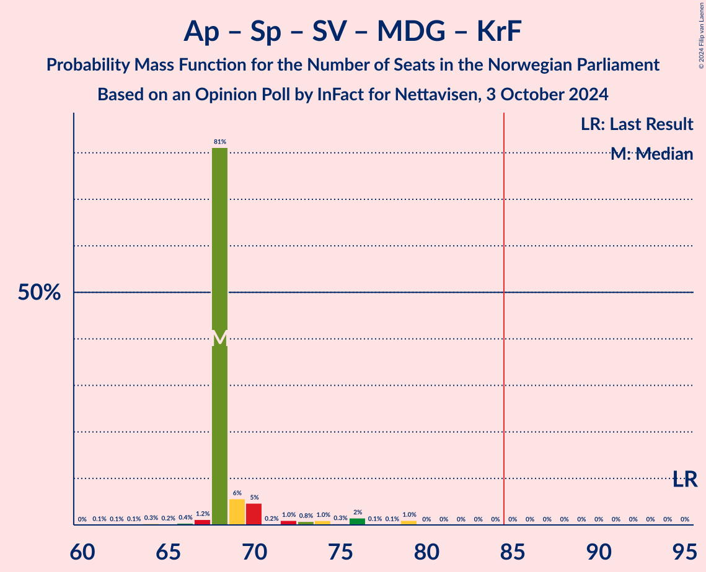

| Number of Seats | Probability | Accumulated | Special Marks |
|:---------------:|:-----------:|:-----------:|:-------------:|
| 61 | 0.1% | 100% |  |
| 62 | 0.1% | 99.9% |  |
| 63 | 0.1% | 99.8% |  |
| 64 | 0.3% | 99.7% |  |
| 65 | 0.2% | 99.4% |  |
| 66 | 0.4% | 99.2% |  |
| 67 | 1.2% | 98.7% |  |
| 68 | 81% | 98% | Median |
| 69 | 6% | 16% |  |
| 70 | 5% | 11% |  |
| 71 | 0.2% | 6% |  |
| 72 | 1.0% | 6% |  |
| 73 | 0.8% | 5% |  |
| 74 | 1.0% | 4% |  |
| 75 | 0.3% | 3% |  |
| 76 | 2% | 3% |  |
| 77 | 0.1% | 1.2% |  |
| 78 | 0.1% | 1.1% |  |
| 79 | 1.0% | 1.0% |  |
| 80 | 0% | 0% |  |
| 81 | 0% | 0% |  |
| 82 | 0% | 0% |  |
| 83 | 0% | 0% |  |
| 84 | 0% | 0% |  |
| 85 | 0% | 0% | Majority |
| 86 | 0% | 0% |  |
| 87 | 0% | 0% |  |
| 88 | 0% | 0% |  |
| 89 | 0% | 0% |  |
| 90 | 0% | 0% |  |
| 91 | 0% | 0% |  |
| 92 | 0% | 0% |  |
| 93 | 0% | 0% |  |
| 94 | 0% | 0% |  |
| 95 | 0% | 0% | Last Result |

### Arbeiderpartiet – Senterpartiet – Sosialistisk Venstreparti – Miljøpartiet De Grønne

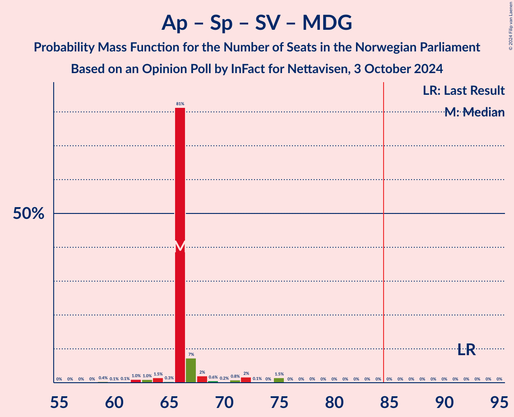

| Number of Seats | Probability | Accumulated | Special Marks |
|:---------------:|:-----------:|:-----------:|:-------------:|
| 59 | 0.4% | 100% |  |
| 60 | 0.1% | 99.6% |  |
| 61 | 0.1% | 99.5% |  |
| 62 | 1.0% | 99.4% |  |
| 63 | 1.0% | 98% |  |
| 64 | 1.5% | 97% |  |
| 65 | 0.3% | 96% |  |
| 66 | 81% | 96% | Median |
| 67 | 7% | 14% |  |
| 68 | 2% | 7% |  |
| 69 | 0.6% | 5% |  |
| 70 | 0.2% | 4% |  |
| 71 | 0.8% | 4% |  |
| 72 | 2% | 3% |  |
| 73 | 0.1% | 2% |  |
| 74 | 0% | 2% |  |
| 75 | 1.5% | 2% |  |
| 76 | 0% | 0% |  |
| 77 | 0% | 0% |  |
| 78 | 0% | 0% |  |
| 79 | 0% | 0% |  |
| 80 | 0% | 0% |  |
| 81 | 0% | 0% |  |
| 82 | 0% | 0% |  |
| 83 | 0% | 0% |  |
| 84 | 0% | 0% |  |
| 85 | 0% | 0% | Majority |
| 86 | 0% | 0% |  |
| 87 | 0% | 0% |  |
| 88 | 0% | 0% |  |
| 89 | 0% | 0% |  |
| 90 | 0% | 0% |  |
| 91 | 0% | 0% |  |
| 92 | 0% | 0% | Last Result |

### Arbeiderpartiet – Sosialistisk Venstreparti – Rødt – Miljøpartiet De Grønne

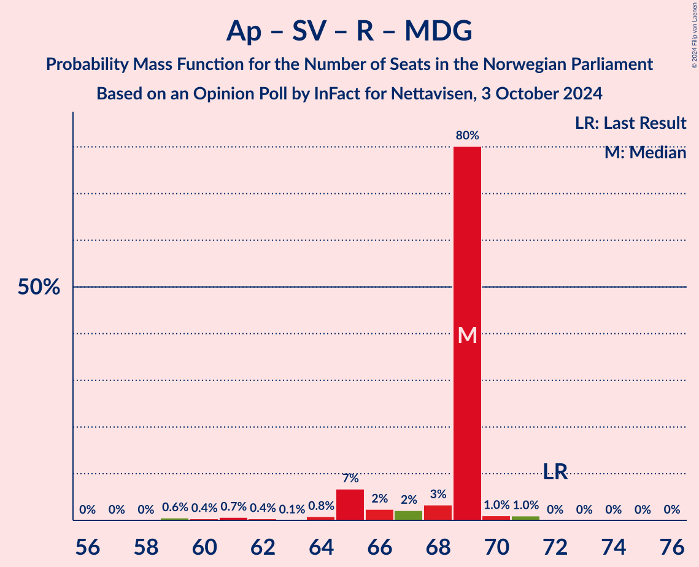

| Number of Seats | Probability | Accumulated | Special Marks |
|:---------------:|:-----------:|:-----------:|:-------------:|
| 57 | 0% | 100% |  |
| 58 | 0% | 99.9% |  |
| 59 | 0.6% | 99.9% |  |
| 60 | 0.4% | 99.4% |  |
| 61 | 0.7% | 99.0% |  |
| 62 | 0.4% | 98% |  |
| 63 | 0.1% | 98% |  |
| 64 | 0.8% | 98% |  |
| 65 | 7% | 97% |  |
| 66 | 2% | 90% |  |
| 67 | 2% | 88% |  |
| 68 | 3% | 86% |  |
| 69 | 80% | 82% | Median |
| 70 | 1.0% | 2% |  |
| 71 | 1.0% | 1.1% |  |
| 72 | 0% | 0.1% | Last Result |
| 73 | 0% | 0.1% |  |
| 74 | 0% | 0.1% |  |
| 75 | 0% | 0% |  |

### Arbeiderpartiet – Senterpartiet – Sosialistisk Venstreparti

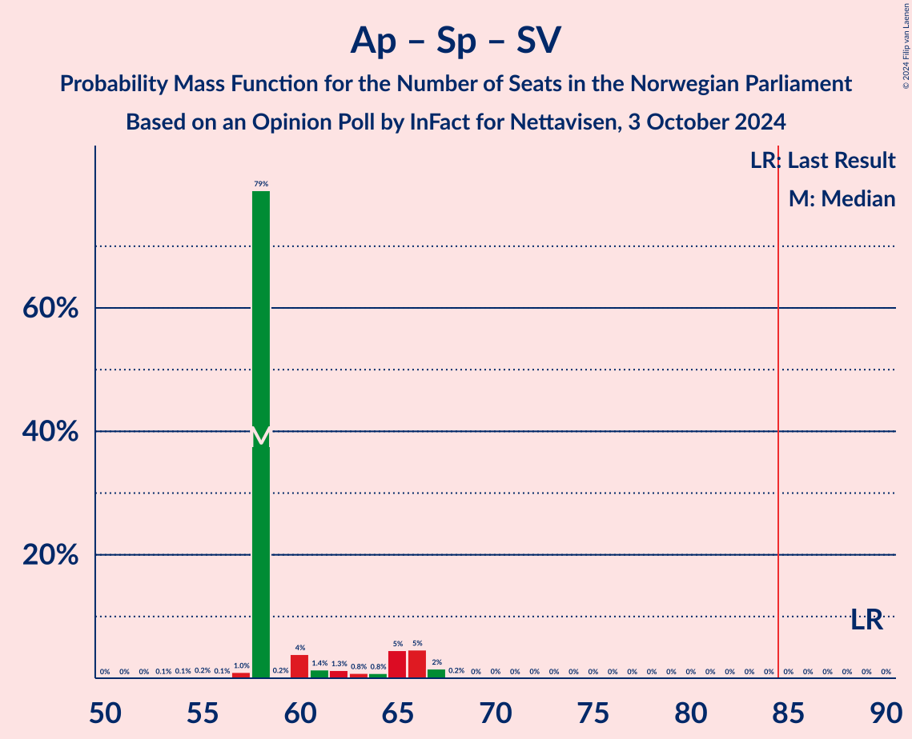

| Number of Seats | Probability | Accumulated | Special Marks |
|:---------------:|:-----------:|:-----------:|:-------------:|
| 53 | 0.1% | 100% |  |
| 54 | 0.1% | 99.9% |  |
| 55 | 0.2% | 99.8% |  |
| 56 | 0.1% | 99.6% |  |
| 57 | 1.0% | 99.5% |  |
| 58 | 79% | 98.5% | Median |
| 59 | 0.2% | 19% |  |
| 60 | 4% | 19% |  |
| 61 | 1.4% | 15% |  |
| 62 | 1.3% | 14% |  |
| 63 | 0.8% | 13% |  |
| 64 | 0.8% | 12% |  |
| 65 | 5% | 11% |  |
| 66 | 5% | 6% |  |
| 67 | 2% | 2% |  |
| 68 | 0.2% | 0.3% |  |
| 69 | 0% | 0.1% |  |
| 70 | 0% | 0.1% |  |
| 71 | 0% | 0.1% |  |
| 72 | 0% | 0% |  |
| 73 | 0% | 0% |  |
| 74 | 0% | 0% |  |
| 75 | 0% | 0% |  |
| 76 | 0% | 0% |  |
| 77 | 0% | 0% |  |
| 78 | 0% | 0% |  |
| 79 | 0% | 0% |  |
| 80 | 0% | 0% |  |
| 81 | 0% | 0% |  |
| 82 | 0% | 0% |  |
| 83 | 0% | 0% |  |
| 84 | 0% | 0% |  |
| 85 | 0% | 0% | Majority |
| 86 | 0% | 0% |  |
| 87 | 0% | 0% |  |
| 88 | 0% | 0% |  |
| 89 | 0% | 0% | Last Result |

### Arbeiderpartiet – Senterpartiet – Miljøpartiet De Grønne – Kristelig Folkeparti

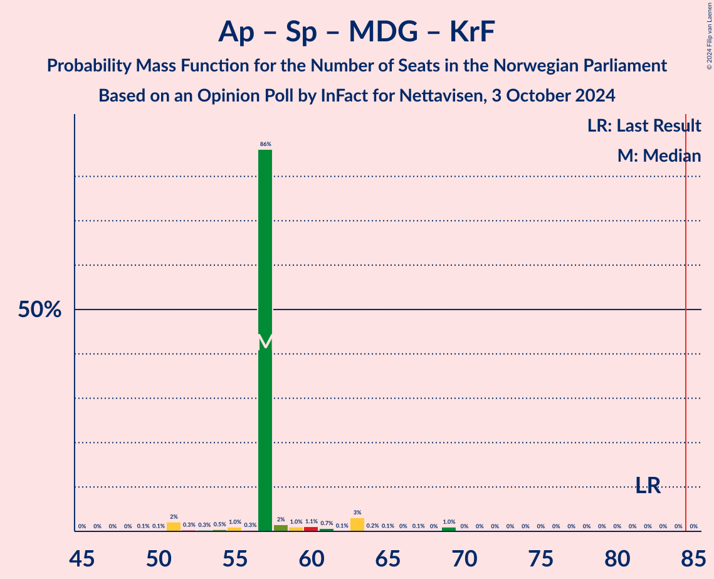

| Number of Seats | Probability | Accumulated | Special Marks |
|:---------------:|:-----------:|:-----------:|:-------------:|
| 49 | 0.1% | 100% |  |
| 50 | 0.1% | 99.9% |  |
| 51 | 2% | 99.9% |  |
| 52 | 0.3% | 98% |  |
| 53 | 0.3% | 97% |  |
| 54 | 0.5% | 97% |  |
| 55 | 1.0% | 97% |  |
| 56 | 0.3% | 96% |  |
| 57 | 86% | 95% | Median |
| 58 | 2% | 9% |  |
| 59 | 1.0% | 8% |  |
| 60 | 1.1% | 7% |  |
| 61 | 0.7% | 5% |  |
| 62 | 0.1% | 5% |  |
| 63 | 3% | 5% |  |
| 64 | 0.2% | 1.4% |  |
| 65 | 0.1% | 1.3% |  |
| 66 | 0% | 1.2% |  |
| 67 | 0.1% | 1.1% |  |
| 68 | 0% | 1.1% |  |
| 69 | 1.0% | 1.0% |  |
| 70 | 0% | 0% |  |
| 71 | 0% | 0% |  |
| 72 | 0% | 0% |  |
| 73 | 0% | 0% |  |
| 74 | 0% | 0% |  |
| 75 | 0% | 0% |  |
| 76 | 0% | 0% |  |
| 77 | 0% | 0% |  |
| 78 | 0% | 0% |  |
| 79 | 0% | 0% |  |
| 80 | 0% | 0% |  |
| 81 | 0% | 0% |  |
| 82 | 0% | 0% | Last Result |

### Arbeiderpartiet – Senterpartiet – Kristelig Folkeparti

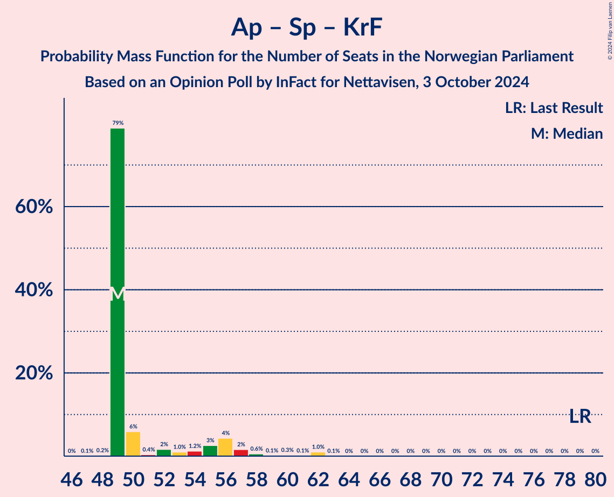

| Number of Seats | Probability | Accumulated | Special Marks |
|:---------------:|:-----------:|:-----------:|:-------------:|
| 46 | 0% | 100% |  |
| 47 | 0.1% | 99.9% |  |
| 48 | 0.2% | 99.9% |  |
| 49 | 79% | 99.7% | Median |
| 50 | 6% | 21% |  |
| 51 | 0.4% | 15% |  |
| 52 | 2% | 15% |  |
| 53 | 1.0% | 13% |  |
| 54 | 1.2% | 12% |  |
| 55 | 3% | 11% |  |
| 56 | 4% | 8% |  |
| 57 | 2% | 4% |  |
| 58 | 0.6% | 2% |  |
| 59 | 0.1% | 2% |  |
| 60 | 0.3% | 1.5% |  |
| 61 | 0.1% | 1.2% |  |
| 62 | 1.0% | 1.1% |  |
| 63 | 0.1% | 0.1% |  |
| 64 | 0% | 0% |  |
| 65 | 0% | 0% |  |
| 66 | 0% | 0% |  |
| 67 | 0% | 0% |  |
| 68 | 0% | 0% |  |
| 69 | 0% | 0% |  |
| 70 | 0% | 0% |  |
| 71 | 0% | 0% |  |
| 72 | 0% | 0% |  |
| 73 | 0% | 0% |  |
| 74 | 0% | 0% |  |
| 75 | 0% | 0% |  |
| 76 | 0% | 0% |  |
| 77 | 0% | 0% |  |
| 78 | 0% | 0% |  |
| 79 | 0% | 0% | Last Result |

### Arbeiderpartiet – Senterpartiet

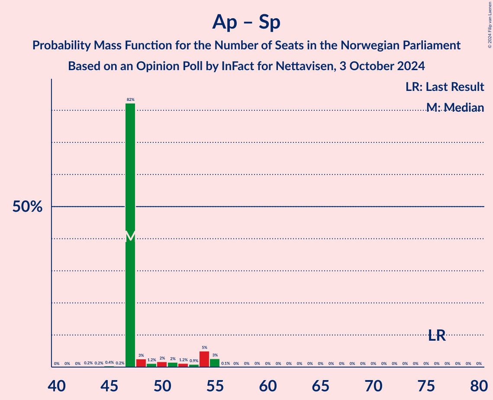

| Number of Seats | Probability | Accumulated | Special Marks |
|:---------------:|:-----------:|:-----------:|:-------------:|
| 43 | 0.2% | 100% |  |
| 44 | 0.2% | 99.8% |  |
| 45 | 0.4% | 99.6% |  |
| 46 | 0.2% | 99.3% |  |
| 47 | 82% | 99.1% | Median |
| 48 | 3% | 17% |  |
| 49 | 1.2% | 14% |  |
| 50 | 2% | 13% |  |
| 51 | 2% | 11% |  |
| 52 | 1.2% | 10% |  |
| 53 | 0.9% | 9% |  |
| 54 | 5% | 8% |  |
| 55 | 3% | 3% |  |
| 56 | 0.1% | 0.1% |  |
| 57 | 0% | 0.1% |  |
| 58 | 0% | 0.1% |  |
| 59 | 0% | 0% |  |
| 60 | 0% | 0% |  |
| 61 | 0% | 0% |  |
| 62 | 0% | 0% |  |
| 63 | 0% | 0% |  |
| 64 | 0% | 0% |  |
| 65 | 0% | 0% |  |
| 66 | 0% | 0% |  |
| 67 | 0% | 0% |  |
| 68 | 0% | 0% |  |
| 69 | 0% | 0% |  |
| 70 | 0% | 0% |  |
| 71 | 0% | 0% |  |
| 72 | 0% | 0% |  |
| 73 | 0% | 0% |  |
| 74 | 0% | 0% |  |
| 75 | 0% | 0% |  |
| 76 | 0% | 0% | Last Result |

### Arbeiderpartiet – Sosialistisk Venstreparti

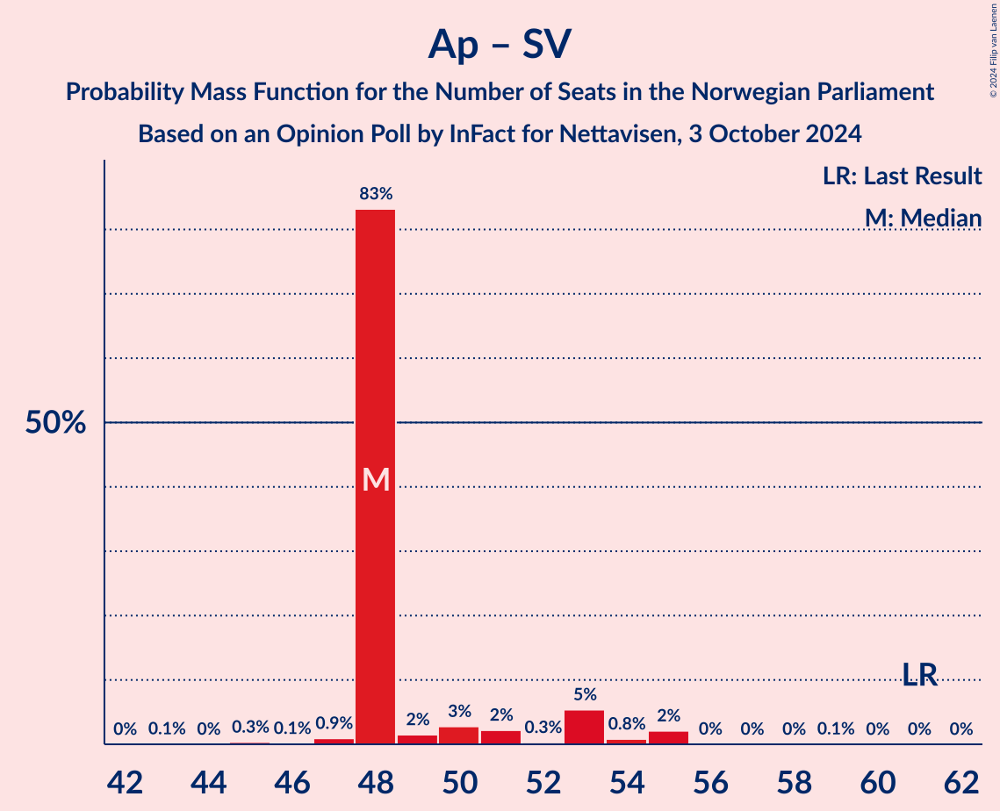

| Number of Seats | Probability | Accumulated | Special Marks |
|:---------------:|:-----------:|:-----------:|:-------------:|
| 43 | 0.1% | 100% |  |
| 44 | 0% | 99.9% |  |
| 45 | 0.3% | 99.9% |  |
| 46 | 0.1% | 99.5% |  |
| 47 | 0.9% | 99.4% |  |
| 48 | 83% | 98% | Median |
| 49 | 2% | 15% |  |
| 50 | 3% | 14% |  |
| 51 | 2% | 11% |  |
| 52 | 0.3% | 9% |  |
| 53 | 5% | 8% |  |
| 54 | 0.8% | 3% |  |
| 55 | 2% | 2% |  |
| 56 | 0% | 0.2% |  |
| 57 | 0% | 0.1% |  |
| 58 | 0% | 0.1% |  |
| 59 | 0.1% | 0.1% |  |
| 60 | 0% | 0% |  |
| 61 | 0% | 0% | Last Result |

### Høyre – Venstre – Kristelig Folkeparti

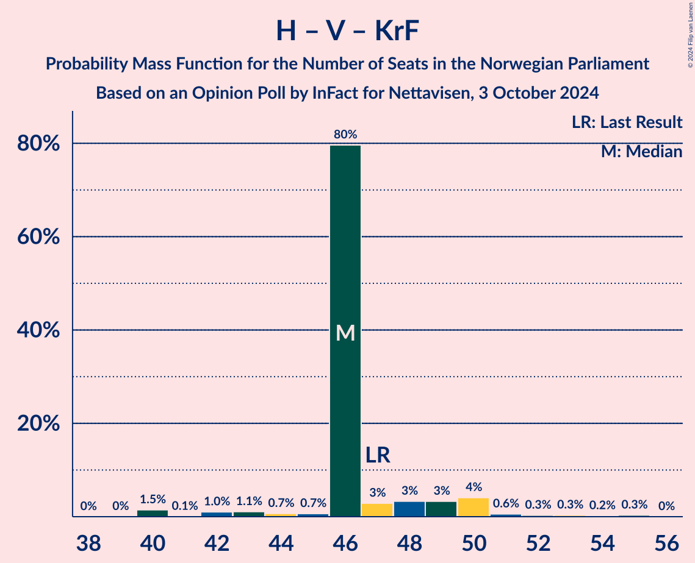

| Number of Seats | Probability | Accumulated | Special Marks |
|:---------------:|:-----------:|:-----------:|:-------------:|
| 40 | 1.5% | 100% |  |
| 41 | 0.1% | 98% |  |
| 42 | 1.0% | 98% |  |
| 43 | 1.1% | 97% |  |
| 44 | 0.7% | 96% |  |
| 45 | 0.7% | 96% |  |
| 46 | 80% | 95% | Median |
| 47 | 3% | 15% | Last Result |
| 48 | 3% | 12% |  |
| 49 | 3% | 9% |  |
| 50 | 4% | 6% |  |
| 51 | 0.6% | 2% |  |
| 52 | 0.3% | 1.2% |  |
| 53 | 0.3% | 0.9% |  |
| 54 | 0.2% | 0.5% |  |
| 55 | 0.3% | 0.4% |  |
| 56 | 0% | 0% |  |

### Senterpartiet – Venstre – Kristelig Folkeparti

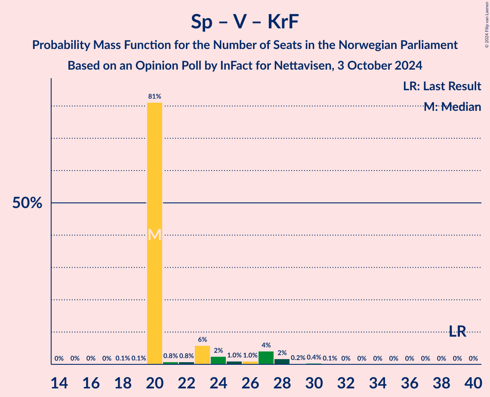

| Number of Seats | Probability | Accumulated | Special Marks |
|:---------------:|:-----------:|:-----------:|:-------------:|
| 15 | 0% | 100% |  |
| 16 | 0% | 99.9% |  |
| 17 | 0% | 99.9% |  |
| 18 | 0.1% | 99.9% |  |
| 19 | 0.1% | 99.8% |  |
| 20 | 81% | 99.7% | Median |
| 21 | 0.8% | 19% |  |
| 22 | 0.8% | 18% |  |
| 23 | 6% | 17% |  |
| 24 | 2% | 11% |  |
| 25 | 1.0% | 9% |  |
| 26 | 1.0% | 8% |  |
| 27 | 4% | 7% |  |
| 28 | 2% | 2% |  |
| 29 | 0.2% | 0.7% |  |
| 30 | 0.4% | 0.5% |  |
| 31 | 0.1% | 0.1% |  |
| 32 | 0% | 0% |  |
| 33 | 0% | 0% |  |
| 34 | 0% | 0% |  |
| 35 | 0% | 0% |  |
| 36 | 0% | 0% |  |
| 37 | 0% | 0% |  |
| 38 | 0% | 0% |  |
| 39 | 0% | 0% | Last Result |

## Technical Information

### Opinion Poll

+ **Polling firm:** InFact
+ **Commissioner(s):** Nettavisen
+ **Fieldwork period:** 3 October 2024

### Calculations

+ **Sample size:** 1051
+ **Simulations done:** 1,048,576
+ **Error estimate:** 2.15%

