# Opinion Poll by Verian for TV2, 4 October 2024

<a href="#voting-intentions">Voting Intentions</a> | <a href="#seats">Seats</a> | <a href="#coalitions">Coalitions</a> | <a href="#technical-information">Technical Information</a>

## Voting Intentions

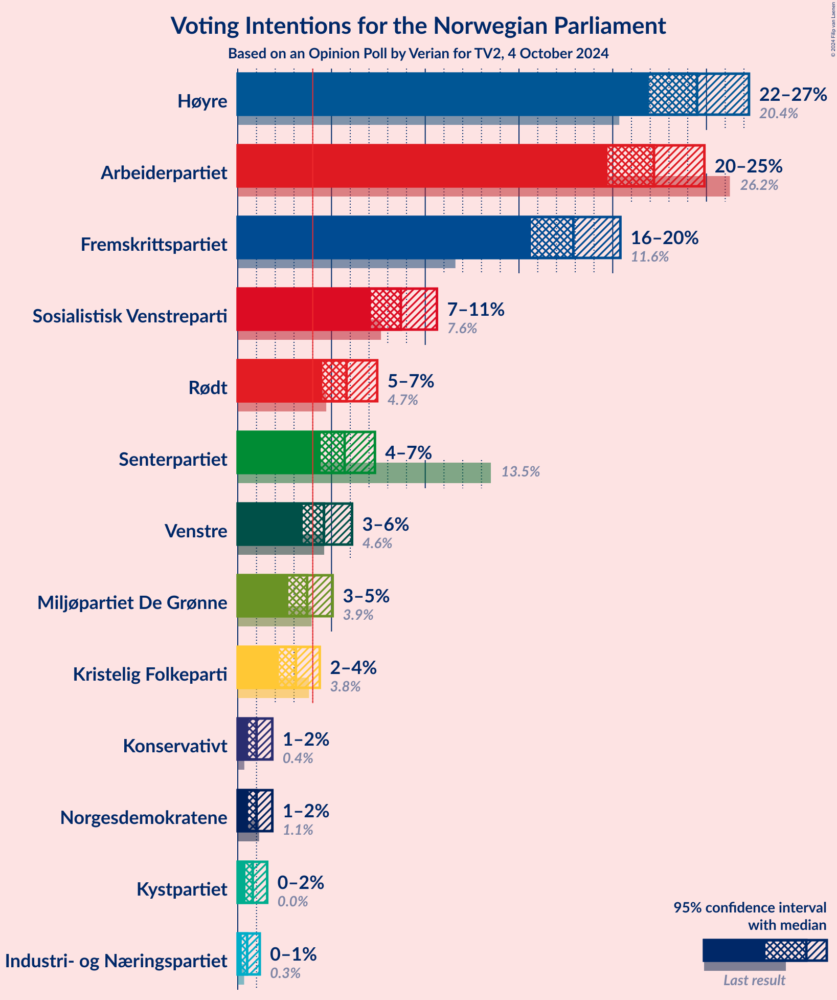

### Confidence Intervals

| Party | Last Result | Poll Result | 80% Confidence Interval | 90% Confidence Interval | 95% Confidence Interval | 99% Confidence Interval |
|:-----:|:-----------:|:-----------:|:-----------------------:|:-----------------------:|:-----------------------:|:-----------------------:|
| Høyre | 20.4% | 24.5% | 22.8–26.3% |22.3–26.8% |21.9–27.3% |21.1–28.2% |
| Arbeiderpartiet | 26.2% | 22.2% | 20.6–24.0% |20.1–24.4% |19.7–24.9% |19.0–25.7% |
| Fremskrittspartiet | 11.6% | 17.9% | 16.4–19.5% |16.0–20.0% |15.6–20.4% |15.0–21.2% |
| Sosialistisk Venstreparti | 7.6% | 8.7% | 7.7–10.0% |7.3–10.3% |7.1–10.6% |6.6–11.2% |
| Rødt | 4.7% | 5.8% | 5.0–6.9% |4.7–7.2% |4.5–7.4% |4.1–8.0% |
| Senterpartiet | 13.5% | 5.7% | 4.9–6.8% |4.6–7.1% |4.4–7.3% |4.1–7.9% |
| Venstre | 4.6% | 4.6% | 3.9–5.6% |3.6–5.9% |3.5–6.1% |3.1–6.6% |
| Miljøpartiet De Grønne | 3.9% | 3.7% | 3.0–4.6% |2.9–4.8% |2.7–5.1% |2.4–5.5% |
| Kristelig Folkeparti | 3.8% | 3.1% | 2.5–3.9% |2.3–4.2% |2.2–4.4% |1.9–4.8% |
| Norgesdemokratene | 1.1% | 1.0% | 0.7–1.5% |0.6–1.7% |0.5–1.8% |0.4–2.1% |
| Konservativt | 0.4% | 1.0% | 0.7–1.5% |0.6–1.7% |0.5–1.8% |0.4–2.1% |
| Kystpartiet | 0.0% | 0.8% | 0.5–1.3% |0.5–1.4% |0.4–1.6% |0.3–1.9% |
| Industri- og Næringspartiet | 0.3% | 0.5% | 0.3–0.9% |0.3–1.1% |0.2–1.2% |0.2–1.4% |

*Note:* The poll result column reflects the actual value used in the calculations. Published results may vary slightly, and in addition be rounded to fewer digits.

## Seats

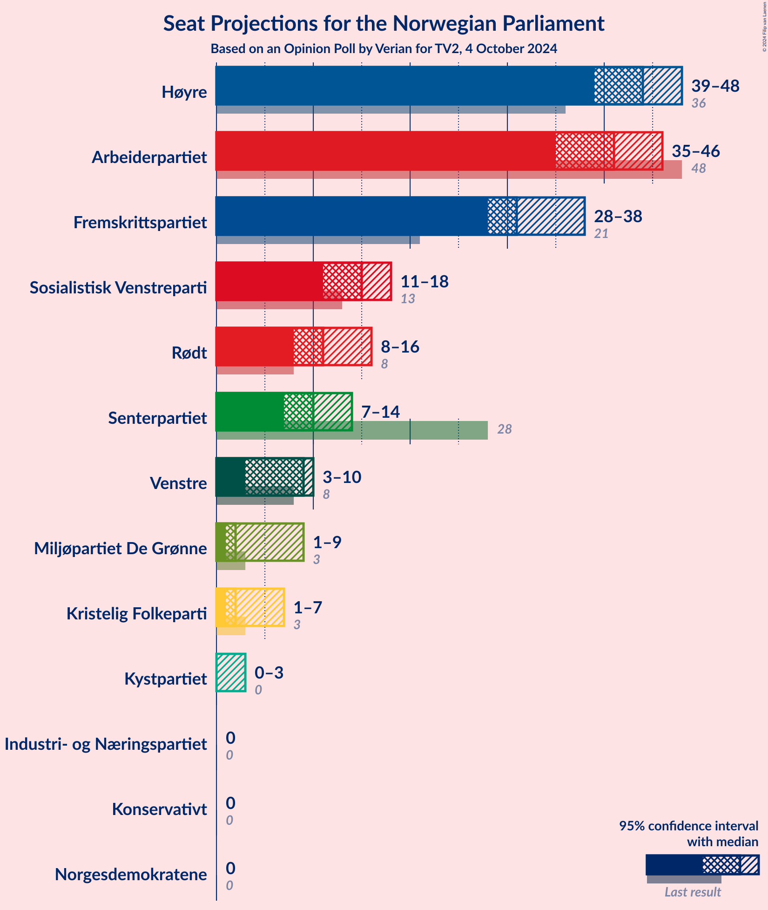

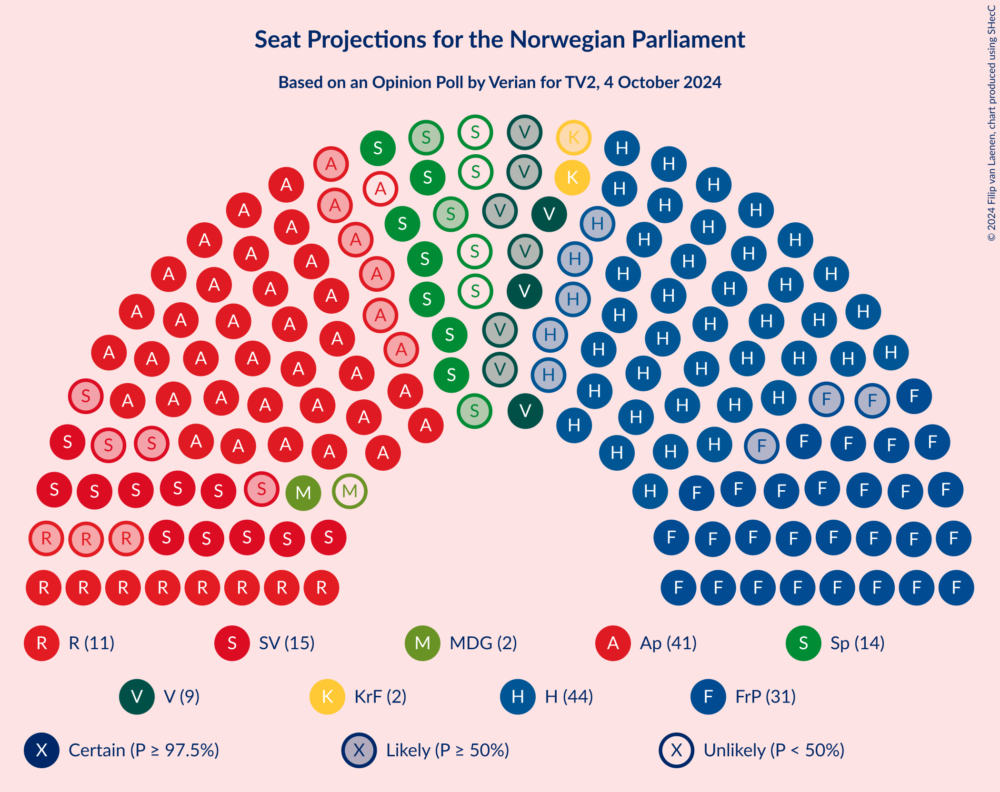

### Confidence Intervals

| Party | Last Result | Median | 80% Confidence Interval | 90% Confidence Interval | 95% Confidence Interval | 99% Confidence Interval |
|:-----:|:-----------:|:------:|:-----------------------:|:-----------------------:|:-----------------------:|:-----------------------:|
| <a href="#høyre">Høyre</a> | 36 | 44 | 40–45 |39–47 |39–48 |35–49 |
| <a href="#arbeiderpartiet">Arbeiderpartiet</a> | 48 | 41 | 38–46 |35–46 |35–46 |34–47 |
| <a href="#fremskrittspartiet">Fremskrittspartiet</a> | 21 | 31 | 29–35 |29–37 |28–38 |26–39 |
| <a href="#sosialistisk-venstreparti">Sosialistisk Venstreparti</a> | 13 | 15 | 13–16 |12–17 |11–18 |10–19 |
| <a href="#rødt">Rødt</a> | 8 | 11 | 8–12 |8–12 |8–16 |7–16 |
| <a href="#senterpartiet">Senterpartiet</a> | 28 | 10 | 9–14 |9–14 |7–14 |1–15 |
| <a href="#venstre">Venstre</a> | 8 | 9 | 7–10 |6–10 |3–10 |2–11 |
| <a href="#miljøpartiet-de-grønne">Miljøpartiet De Grønne</a> | 3 | 2 | 1–8 |1–9 |1–9 |1–9 |
| <a href="#kristelig-folkeparti">Kristelig Folkeparti</a> | 3 | 2 | 1–3 |1–7 |1–7 |0–8 |
| <a href="#norgesdemokratene">Norgesdemokratene</a> | 0 | 0 | 0 |0 |0 |0 |
| <a href="#konservativt">Konservativt</a> | 0 | 0 | 0 |0 |0 |0 |
| <a href="#kystpartiet">Kystpartiet</a> | 0 | 0 | 0–1 |0–1 |0–3 |0–3 |
| <a href="#industri--og-næringspartiet">Industri- og Næringspartiet</a> | 0 | 0 | 0 |0 |0 |0 |

### Høyre

*For a full overview of the results for this party, see the [Høyre](party-høyre.html) page.*

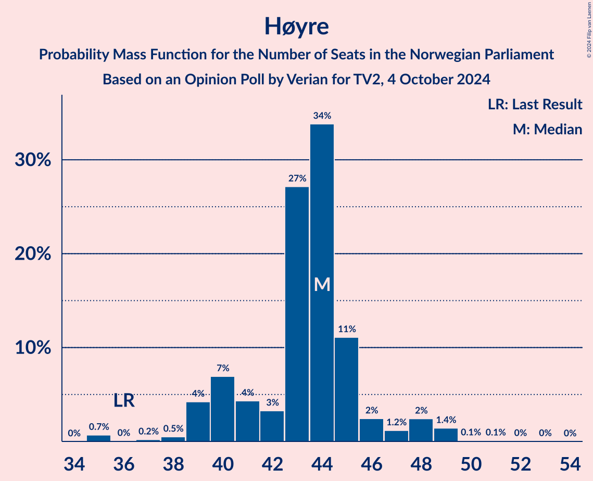

| Number of Seats | Probability | Accumulated | Special Marks |
|:---------------:|:-----------:|:-----------:|:-------------:|
| 35 | 0.7% | 100% |  |
| 36 | 0% | 99.3% | Last Result |
| 37 | 0.2% | 99.3% |  |
| 38 | 0.5% | 99.1% |  |
| 39 | 4% | 98.6% |  |
| 40 | 7% | 94% |  |
| 41 | 4% | 87% |  |
| 42 | 3% | 83% |  |
| 43 | 27% | 80% |  |
| 44 | 34% | 53% | Median |
| 45 | 11% | 19% |  |
| 46 | 2% | 8% |  |
| 47 | 1.2% | 5% |  |
| 48 | 2% | 4% |  |
| 49 | 1.4% | 2% |  |
| 50 | 0.1% | 0.3% |  |
| 51 | 0.1% | 0.2% |  |
| 52 | 0% | 0.1% |  |
| 53 | 0% | 0% |  |

### Arbeiderpartiet

*For a full overview of the results for this party, see the [Arbeiderpartiet](party-arbeiderpartiet.html) page.*

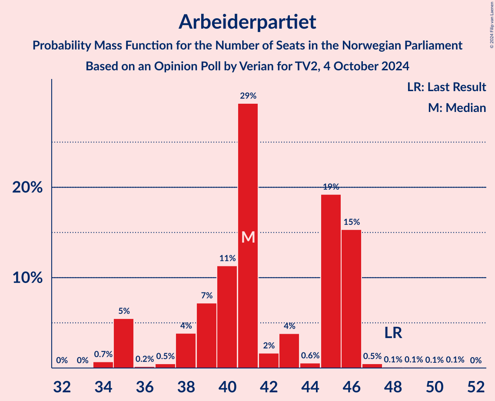

| Number of Seats | Probability | Accumulated | Special Marks |
|:---------------:|:-----------:|:-----------:|:-------------:|
| 34 | 0.7% | 100% |  |
| 35 | 5% | 99.3% |  |
| 36 | 0.2% | 94% |  |
| 37 | 0.5% | 94% |  |
| 38 | 4% | 93% |  |
| 39 | 7% | 89% |  |
| 40 | 11% | 82% |  |
| 41 | 29% | 71% | Median |
| 42 | 2% | 41% |  |
| 43 | 4% | 40% |  |
| 44 | 0.6% | 36% |  |
| 45 | 19% | 35% |  |
| 46 | 15% | 16% |  |
| 47 | 0.5% | 0.9% |  |
| 48 | 0.1% | 0.4% | Last Result |
| 49 | 0.1% | 0.3% |  |
| 50 | 0.1% | 0.2% |  |
| 51 | 0.1% | 0.1% |  |
| 52 | 0% | 0% |  |

### Fremskrittspartiet

*For a full overview of the results for this party, see the [Fremskrittspartiet](party-fremskrittspartiet.html) page.*

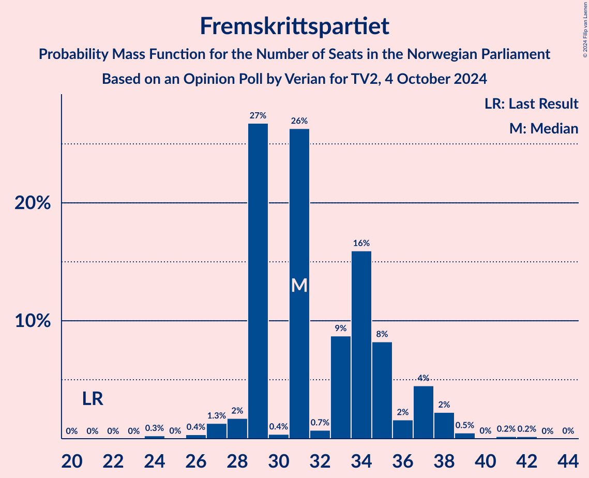

| Number of Seats | Probability | Accumulated | Special Marks |
|:---------------:|:-----------:|:-----------:|:-------------:|
| 21 | 0% | 100% | Last Result |
| 22 | 0% | 100% |  |
| 23 | 0% | 100% |  |
| 24 | 0.3% | 100% |  |
| 25 | 0% | 99.7% |  |
| 26 | 0.4% | 99.7% |  |
| 27 | 1.3% | 99.4% |  |
| 28 | 2% | 98% |  |
| 29 | 27% | 96% |  |
| 30 | 0.4% | 70% |  |
| 31 | 26% | 69% | Median |
| 32 | 0.7% | 43% |  |
| 33 | 9% | 42% |  |
| 34 | 16% | 33% |  |
| 35 | 8% | 17% |  |
| 36 | 2% | 9% |  |
| 37 | 4% | 8% |  |
| 38 | 2% | 3% |  |
| 39 | 0.5% | 0.9% |  |
| 40 | 0% | 0.4% |  |
| 41 | 0.2% | 0.4% |  |
| 42 | 0.2% | 0.2% |  |
| 43 | 0% | 0% |  |

### Sosialistisk Venstreparti

*For a full overview of the results for this party, see the [Sosialistisk Venstreparti](party-sosialistiskvenstreparti.html) page.*

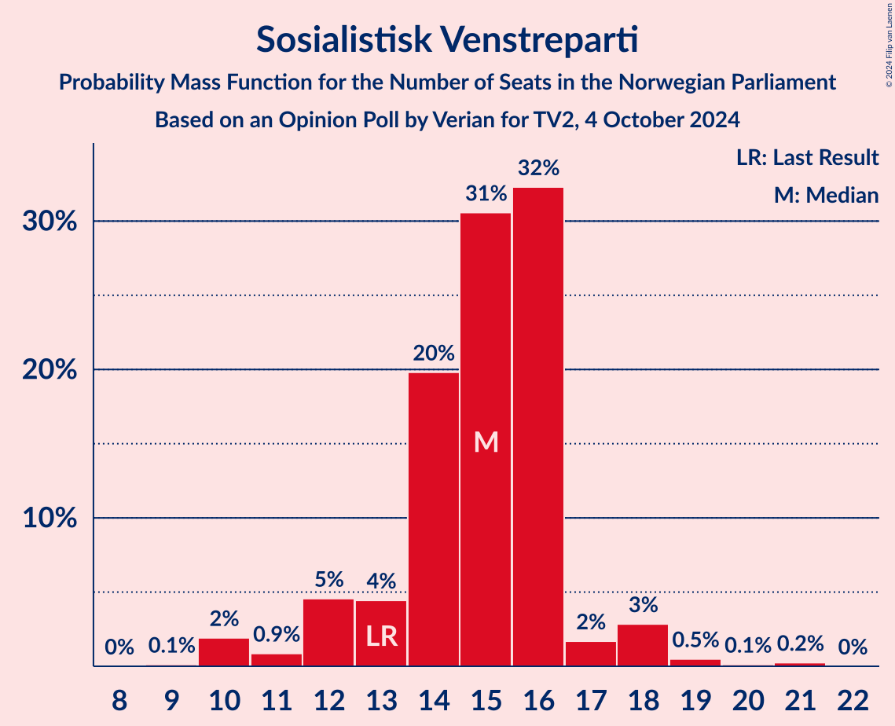

| Number of Seats | Probability | Accumulated | Special Marks |
|:---------------:|:-----------:|:-----------:|:-------------:|
| 9 | 0.1% | 100% |  |
| 10 | 2% | 99.9% |  |
| 11 | 0.9% | 98% |  |
| 12 | 5% | 97% |  |
| 13 | 4% | 93% | Last Result |
| 14 | 20% | 88% |  |
| 15 | 31% | 68% | Median |
| 16 | 32% | 38% |  |
| 17 | 2% | 5% |  |
| 18 | 3% | 4% |  |
| 19 | 0.5% | 0.9% |  |
| 20 | 0.1% | 0.4% |  |
| 21 | 0.2% | 0.3% |  |
| 22 | 0% | 0% |  |

### Rødt

*For a full overview of the results for this party, see the [Rødt](party-rødt.html) page.*

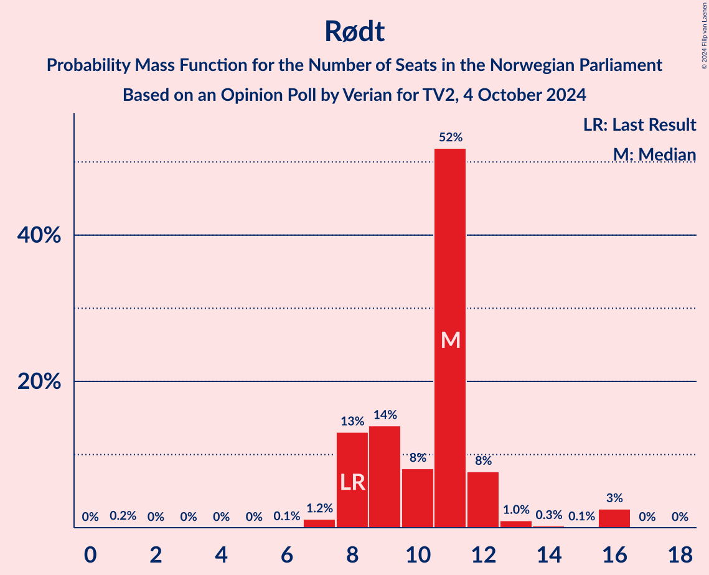

| Number of Seats | Probability | Accumulated | Special Marks |
|:---------------:|:-----------:|:-----------:|:-------------:|
| 1 | 0.2% | 100% |  |
| 2 | 0% | 99.8% |  |
| 3 | 0% | 99.8% |  |
| 4 | 0% | 99.8% |  |
| 5 | 0% | 99.8% |  |
| 6 | 0.1% | 99.8% |  |
| 7 | 1.2% | 99.7% |  |
| 8 | 13% | 98.6% | Last Result |
| 9 | 14% | 85% |  |
| 10 | 8% | 72% |  |
| 11 | 52% | 63% | Median |
| 12 | 8% | 12% |  |
| 13 | 1.0% | 4% |  |
| 14 | 0.3% | 3% |  |
| 15 | 0.1% | 3% |  |
| 16 | 3% | 3% |  |
| 17 | 0% | 0% |  |

### Senterpartiet

*For a full overview of the results for this party, see the [Senterpartiet](party-senterpartiet.html) page.*

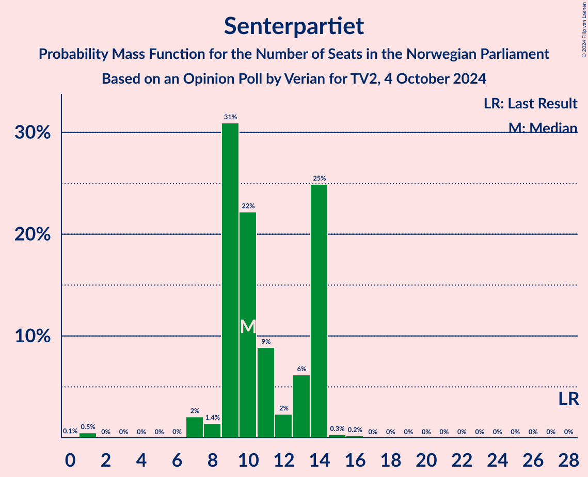

| Number of Seats | Probability | Accumulated | Special Marks |
|:---------------:|:-----------:|:-----------:|:-------------:|
| 0 | 0.1% | 100% |  |
| 1 | 0.5% | 99.9% |  |
| 2 | 0% | 99.4% |  |
| 3 | 0% | 99.4% |  |
| 4 | 0% | 99.4% |  |
| 5 | 0% | 99.4% |  |
| 6 | 0% | 99.4% |  |
| 7 | 2% | 99.4% |  |
| 8 | 1.4% | 97% |  |
| 9 | 31% | 96% |  |
| 10 | 22% | 65% | Median |
| 11 | 9% | 43% |  |
| 12 | 2% | 34% |  |
| 13 | 6% | 32% |  |
| 14 | 25% | 25% |  |
| 15 | 0.3% | 0.5% |  |
| 16 | 0.2% | 0.2% |  |
| 17 | 0% | 0% |  |
| 18 | 0% | 0% |  |
| 19 | 0% | 0% |  |
| 20 | 0% | 0% |  |
| 21 | 0% | 0% |  |
| 22 | 0% | 0% |  |
| 23 | 0% | 0% |  |
| 24 | 0% | 0% |  |
| 25 | 0% | 0% |  |
| 26 | 0% | 0% |  |
| 27 | 0% | 0% |  |
| 28 | 0% | 0% | Last Result |

### Venstre

*For a full overview of the results for this party, see the [Venstre](party-venstre.html) page.*

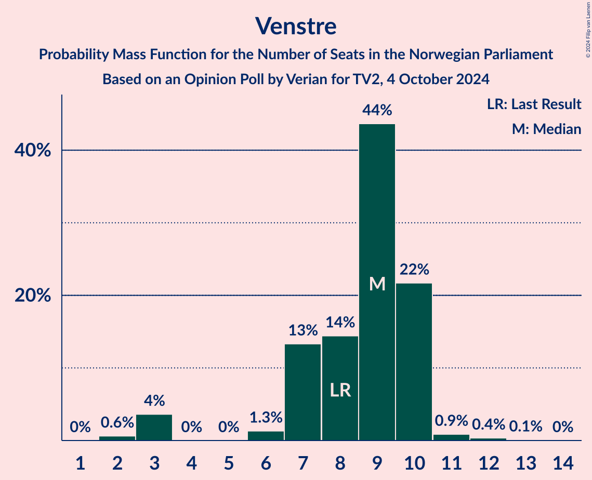

| Number of Seats | Probability | Accumulated | Special Marks |
|:---------------:|:-----------:|:-----------:|:-------------:|
| 2 | 0.6% | 100% |  |
| 3 | 4% | 99.4% |  |
| 4 | 0% | 96% |  |
| 5 | 0% | 96% |  |
| 6 | 1.3% | 96% |  |
| 7 | 13% | 94% |  |
| 8 | 14% | 81% | Last Result |
| 9 | 44% | 67% | Median |
| 10 | 22% | 23% |  |
| 11 | 0.9% | 1.3% |  |
| 12 | 0.4% | 0.5% |  |
| 13 | 0.1% | 0.1% |  |
| 14 | 0% | 0% |  |

### Miljøpartiet De Grønne

*For a full overview of the results for this party, see the [Miljøpartiet De Grønne](party-miljøpartietdegrønne.html) page.*

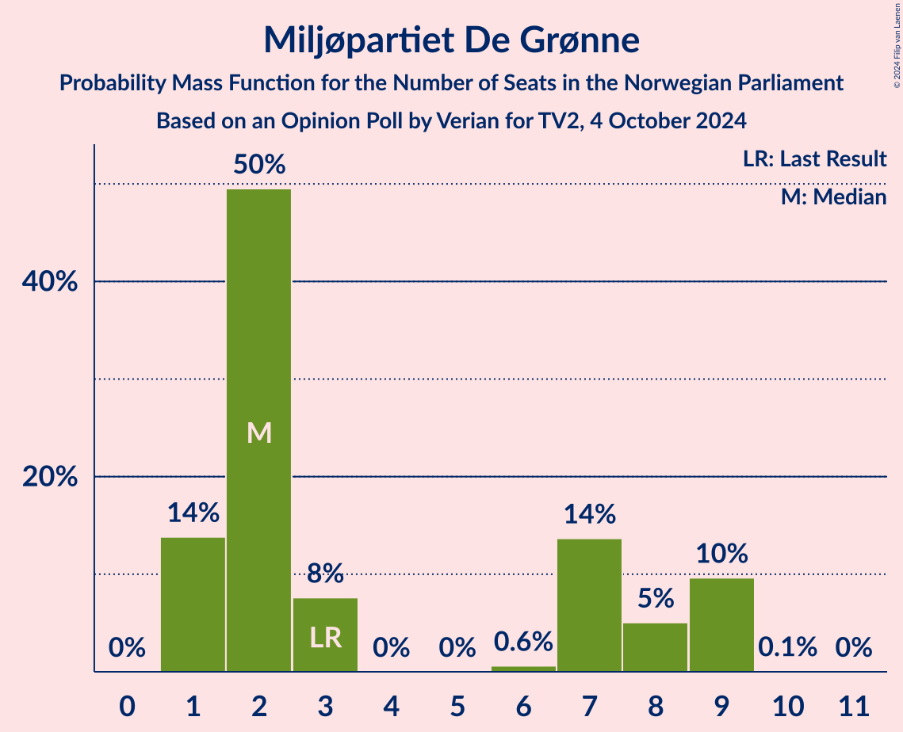

| Number of Seats | Probability | Accumulated | Special Marks |
|:---------------:|:-----------:|:-----------:|:-------------:|
| 1 | 14% | 100% |  |
| 2 | 50% | 86% | Median |
| 3 | 8% | 37% | Last Result |
| 4 | 0% | 29% |  |
| 5 | 0% | 29% |  |
| 6 | 0.6% | 29% |  |
| 7 | 14% | 28% |  |
| 8 | 5% | 15% |  |
| 9 | 10% | 10% |  |
| 10 | 0.1% | 0.1% |  |
| 11 | 0% | 0% |  |

### Kristelig Folkeparti

*For a full overview of the results for this party, see the [Kristelig Folkeparti](party-kristeligfolkeparti.html) page.*

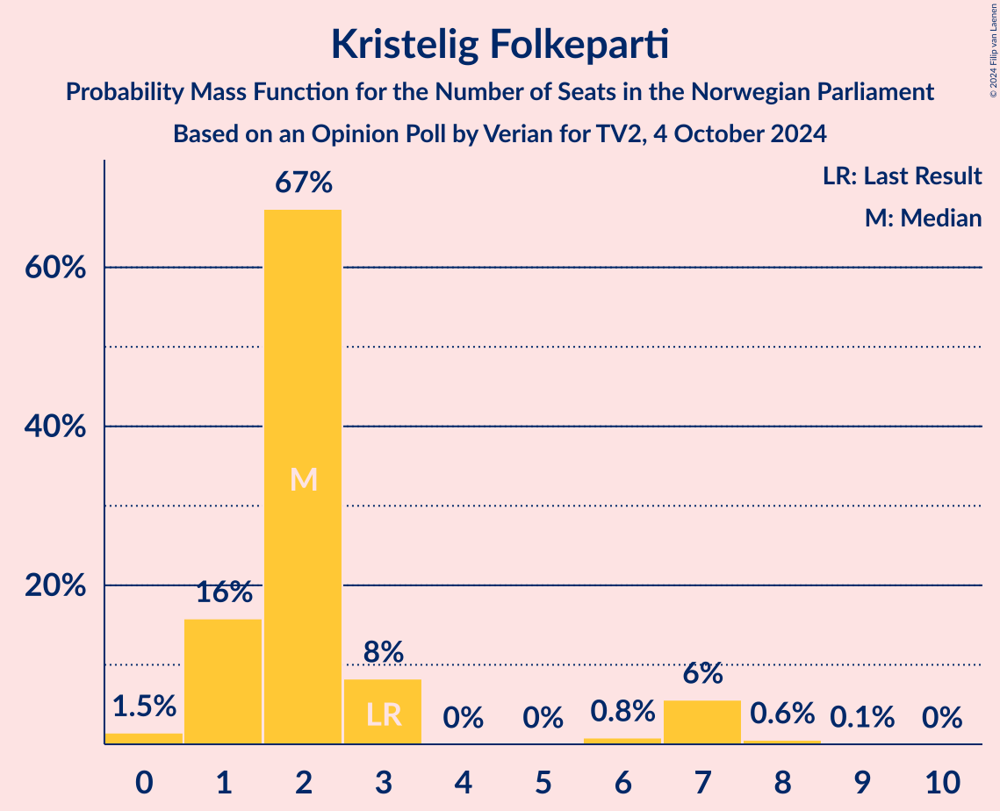

| Number of Seats | Probability | Accumulated | Special Marks |
|:---------------:|:-----------:|:-----------:|:-------------:|
| 0 | 1.5% | 100% |  |
| 1 | 16% | 98.5% |  |
| 2 | 67% | 83% | Median |
| 3 | 8% | 15% | Last Result |
| 4 | 0% | 7% |  |
| 5 | 0% | 7% |  |
| 6 | 0.8% | 7% |  |
| 7 | 6% | 6% |  |
| 8 | 0.6% | 0.6% |  |
| 9 | 0.1% | 0.1% |  |
| 10 | 0% | 0% |  |

### Norgesdemokratene

*For a full overview of the results for this party, see the [Norgesdemokratene](party-norgesdemokratene.html) page.*

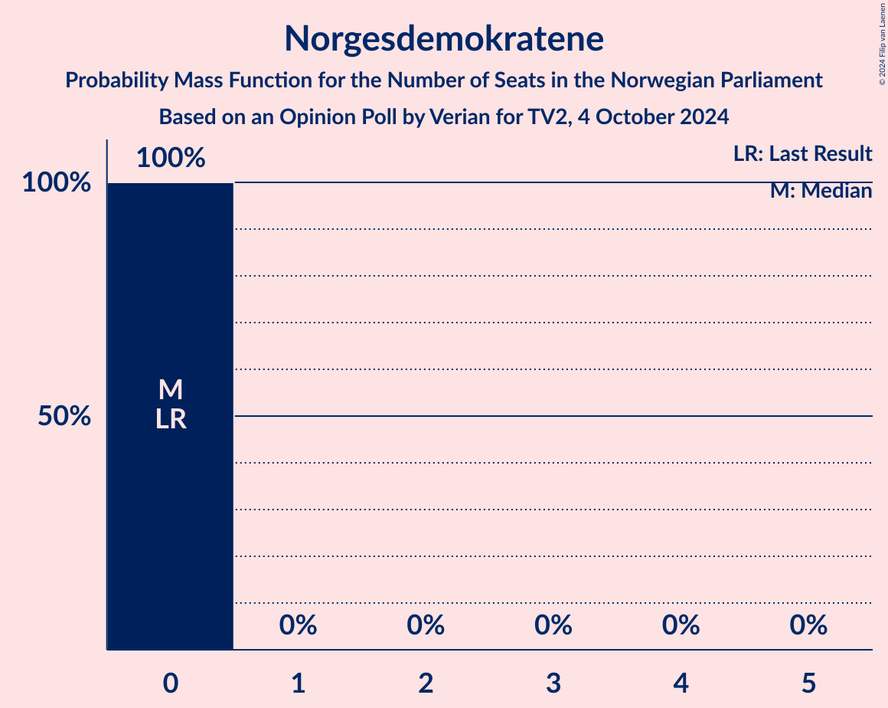

| Number of Seats | Probability | Accumulated | Special Marks |
|:---------------:|:-----------:|:-----------:|:-------------:|
| 0 | 100% | 100% | Last Result, Median |

### Konservativt

*For a full overview of the results for this party, see the [Konservativt](party-konservativt.html) page.*

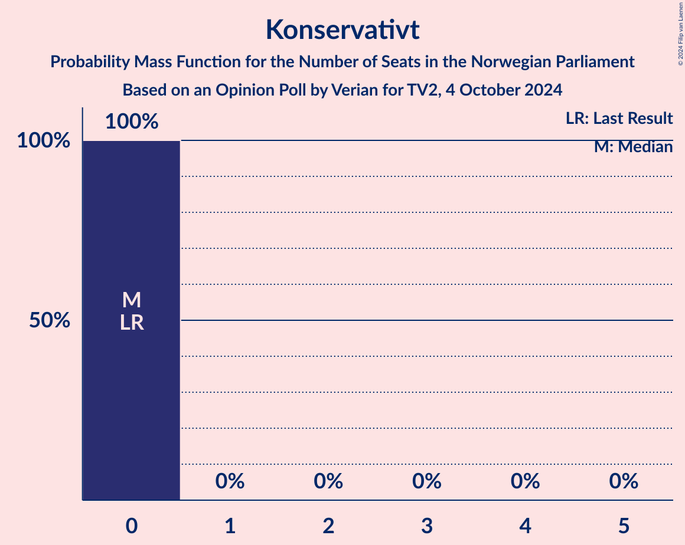

| Number of Seats | Probability | Accumulated | Special Marks |
|:---------------:|:-----------:|:-----------:|:-------------:|
| 0 | 100% | 100% | Last Result, Median |

### Kystpartiet

*For a full overview of the results for this party, see the [Kystpartiet](party-kystpartiet.html) page.*

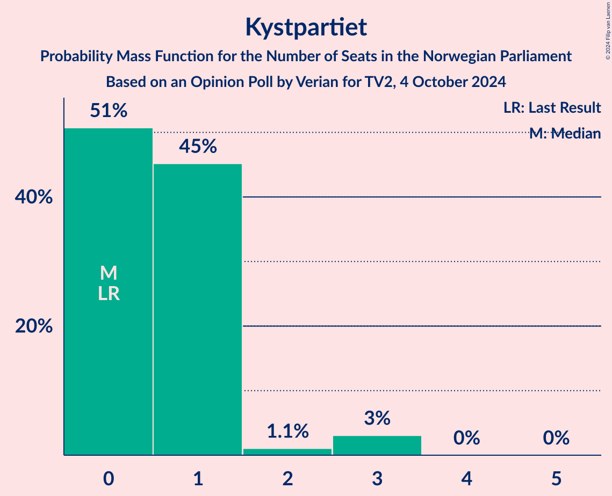

| Number of Seats | Probability | Accumulated | Special Marks |
|:---------------:|:-----------:|:-----------:|:-------------:|
| 0 | 51% | 100% | Last Result, Median |
| 1 | 45% | 49% |  |
| 2 | 1.1% | 4% |  |
| 3 | 3% | 3% |  |
| 4 | 0% | 0% |  |

### Industri- og Næringspartiet

*For a full overview of the results for this party, see the [Industri- og Næringspartiet](party-industri-ognæringspartiet.html) page.*

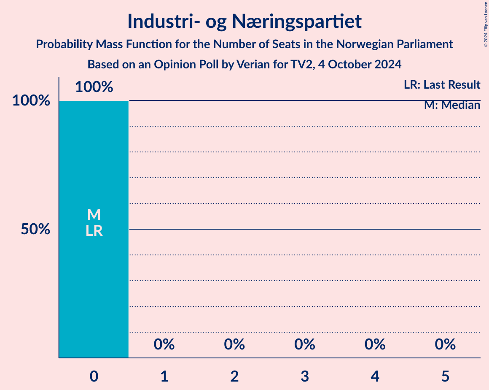

| Number of Seats | Probability | Accumulated | Special Marks |
|:---------------:|:-----------:|:-----------:|:-------------:|
| 0 | 100% | 100% | Last Result, Median |

## Coalitions

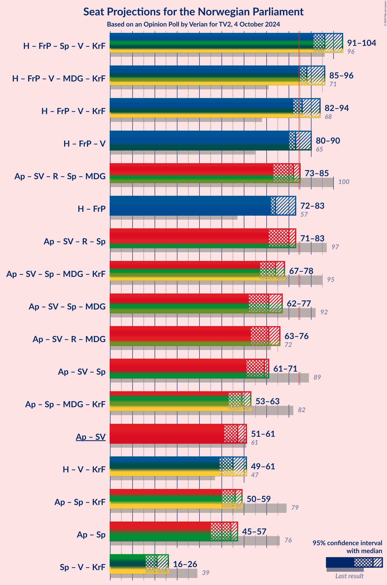

### Confidence Intervals

| Coalition | Last Result | Median | Majority? | 80% Confidence Interval | 90% Confidence Interval | 95% Confidence Interval | 99% Confidence Interval |
|:---------:|:-----------:|:------:|:---------:|:-----------------------:|:-----------------------:|:-----------------------:|:-----------------------:|
| Høyre – Fremskrittspartiet – Senterpartiet – Venstre – Kristelig Folkeparti | 96 | 96 | 100% | 93–101 | 93–104 | 91–104 | 89–106 |
| Høyre – Fremskrittspartiet – Venstre – Miljøpartiet De Grønne – Kristelig Folkeparti | 71 | 88 | 99.7% | 86–95 | 86–96 | 85–96 | 85–103 |
| Høyre – Fremskrittspartiet – Venstre – Kristelig Folkeparti | 68 | 86 | 62% | 84–91 | 83–94 | 82–94 | 78–96 |
| Høyre – Fremskrittspartiet – Venstre | 65 | 83 | 22% | 82–87 | 81–89 | 80–90 | 76–92 |
| Arbeiderpartiet – Sosialistisk Venstreparti – Rødt – Senterpartiet – Miljøpartiet De Grønne | 100 | 82 | 15% | 76–85 | 73–85 | 73–85 | 72–89 |
| Høyre – Fremskrittspartiet | 57 | 74 | 0.1% | 73–79 | 73–81 | 72–83 | 67–83 |
| Arbeiderpartiet – Sosialistisk Venstreparti – Rødt – Senterpartiet | 97 | 80 | 0.2% | 72–82 | 72–82 | 71–83 | 65–83 |
| Arbeiderpartiet – Sosialistisk Venstreparti – Senterpartiet – Miljøpartiet De Grønne – Kristelig Folkeparti | 95 | 74 | 0.1% | 70–78 | 69–78 | 67–78 | 65–82 |
| Arbeiderpartiet – Sosialistisk Venstreparti – Senterpartiet – Miljøpartiet De Grønne | 92 | 71 | 0% | 67–76 | 63–77 | 62–77 | 62–80 |
| Arbeiderpartiet – Sosialistisk Venstreparti – Rødt – Miljøpartiet De Grønne | 72 | 71 | 0% | 66–76 | 63–76 | 63–76 | 62–78 |
| Arbeiderpartiet – Sosialistisk Venstreparti – Senterpartiet | 89 | 69 | 0% | 63–71 | 61–71 | 61–71 | 58–73 |
| Arbeiderpartiet – Senterpartiet – Miljøpartiet De Grønne – Kristelig Folkeparti | 82 | 59 | 0% | 55–63 | 53–63 | 53–63 | 50–67 |
| Arbeiderpartiet – Sosialistisk Venstreparti | 61 | 57 | 0% | 53–60 | 51–61 | 51–61 | 48–62 |
| Høyre – Venstre – Kristelig Folkeparti | 47 | 55 | 0% | 50–56 | 50–61 | 49–61 | 47–62 |
| Arbeiderpartiet – Senterpartiet – Kristelig Folkeparti | 79 | 56 | 0% | 52–58 | 50–59 | 50–59 | 47–62 |
| Arbeiderpartiet – Senterpartiet | 76 | 54 | 0% | 49–55 | 45–56 | 45–57 | 45–58 |
| Senterpartiet – Venstre – Kristelig Folkeparti | 39 | 21 | 0% | 18–25 | 18–26 | 16–26 | 12–27 |

### Høyre – Fremskrittspartiet – Senterpartiet – Venstre – Kristelig Folkeparti

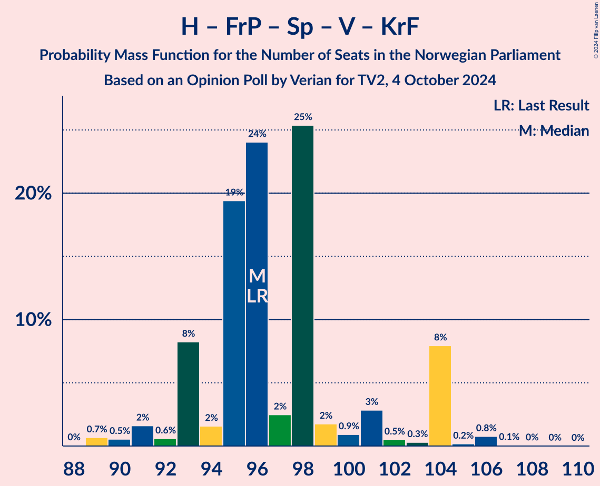

| Number of Seats | Probability | Accumulated | Special Marks |
|:---------------:|:-----------:|:-----------:|:-------------:|
| 88 | 0% | 100% |  |
| 89 | 0.7% | 99.9% |  |
| 90 | 0.5% | 99.2% |  |
| 91 | 2% | 98.7% |  |
| 92 | 0.6% | 97% |  |
| 93 | 8% | 96% |  |
| 94 | 2% | 88% |  |
| 95 | 19% | 87% |  |
| 96 | 24% | 67% | Last Result, Median |
| 97 | 2% | 43% |  |
| 98 | 25% | 41% |  |
| 99 | 2% | 15% |  |
| 100 | 0.9% | 14% |  |
| 101 | 3% | 13% |  |
| 102 | 0.5% | 10% |  |
| 103 | 0.3% | 9% |  |
| 104 | 8% | 9% |  |
| 105 | 0.2% | 1.1% |  |
| 106 | 0.8% | 0.9% |  |
| 107 | 0.1% | 0.1% |  |
| 108 | 0% | 0.1% |  |
| 109 | 0% | 0% |  |

### Høyre – Fremskrittspartiet – Venstre – Miljøpartiet De Grønne – Kristelig Folkeparti

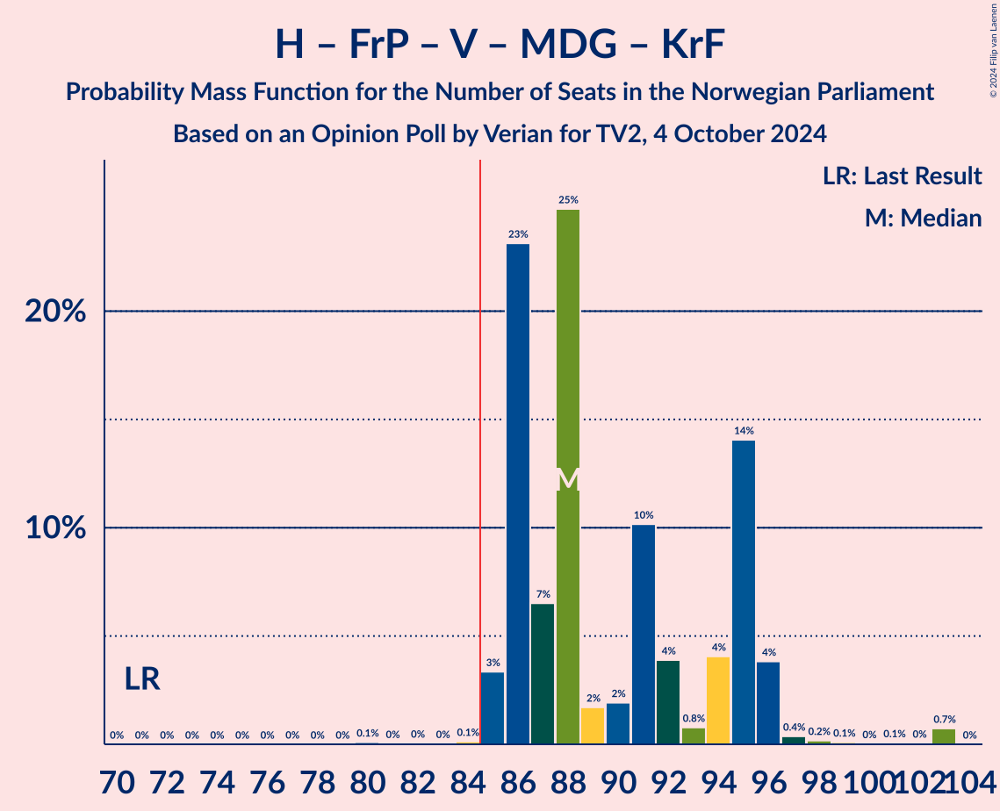

| Number of Seats | Probability | Accumulated | Special Marks |
|:---------------:|:-----------:|:-----------:|:-------------:|
| 71 | 0% | 100% | Last Result |
| 72 | 0% | 100% |  |
| 73 | 0% | 100% |  |
| 74 | 0% | 100% |  |
| 75 | 0% | 100% |  |
| 76 | 0% | 100% |  |
| 77 | 0% | 100% |  |
| 78 | 0% | 100% |  |
| 79 | 0% | 100% |  |
| 80 | 0.1% | 100% |  |
| 81 | 0% | 99.9% |  |
| 82 | 0% | 99.9% |  |
| 83 | 0% | 99.8% |  |
| 84 | 0.1% | 99.8% |  |
| 85 | 3% | 99.7% | Majority |
| 86 | 23% | 96% |  |
| 87 | 7% | 73% |  |
| 88 | 25% | 67% | Median |
| 89 | 2% | 42% |  |
| 90 | 2% | 40% |  |
| 91 | 10% | 38% |  |
| 92 | 4% | 28% |  |
| 93 | 0.8% | 24% |  |
| 94 | 4% | 23% |  |
| 95 | 14% | 19% |  |
| 96 | 4% | 5% |  |
| 97 | 0.4% | 2% |  |
| 98 | 0.2% | 1.1% |  |
| 99 | 0.1% | 1.0% |  |
| 100 | 0% | 0.9% |  |
| 101 | 0.1% | 0.9% |  |
| 102 | 0% | 0.8% |  |
| 103 | 0.7% | 0.7% |  |
| 104 | 0% | 0% |  |

### Høyre – Fremskrittspartiet – Venstre – Kristelig Folkeparti

| Number of Seats | Probability | Accumulated | Special Marks |
|:---------------:|:-----------:|:-----------:|:-------------:|
| 68 | 0% | 100% | Last Result |
| 69 | 0% | 100% |  |
| 70 | 0% | 100% |  |
| 71 | 0% | 100% |  |
| 72 | 0% | 100% |  |
| 73 | 0% | 100% |  |
| 74 | 0% | 100% |  |
| 75 | 0% | 100% |  |
| 76 | 0.2% | 100% |  |
| 77 | 0.1% | 99.8% |  |
| 78 | 0.5% | 99.7% |  |
| 79 | 0.4% | 99.2% |  |
| 80 | 0.4% | 98.8% |  |
| 81 | 0.3% | 98% |  |
| 82 | 1.3% | 98% |  |
| 83 | 4% | 97% |  |
| 84 | 31% | 93% |  |
| 85 | 8% | 62% | Majority |
| 86 | 31% | 53% | Median |
| 87 | 4% | 22% |  |
| 88 | 3% | 18% |  |
| 89 | 2% | 15% |  |
| 90 | 1.3% | 13% |  |
| 91 | 5% | 12% |  |
| 92 | 0.5% | 7% |  |
| 93 | 0.5% | 6% |  |
| 94 | 5% | 6% |  |
| 95 | 0.2% | 1.1% |  |
| 96 | 0.8% | 0.9% |  |
| 97 | 0% | 0.1% |  |
| 98 | 0% | 0.1% |  |
| 99 | 0% | 0% |  |

### Høyre – Fremskrittspartiet – Venstre

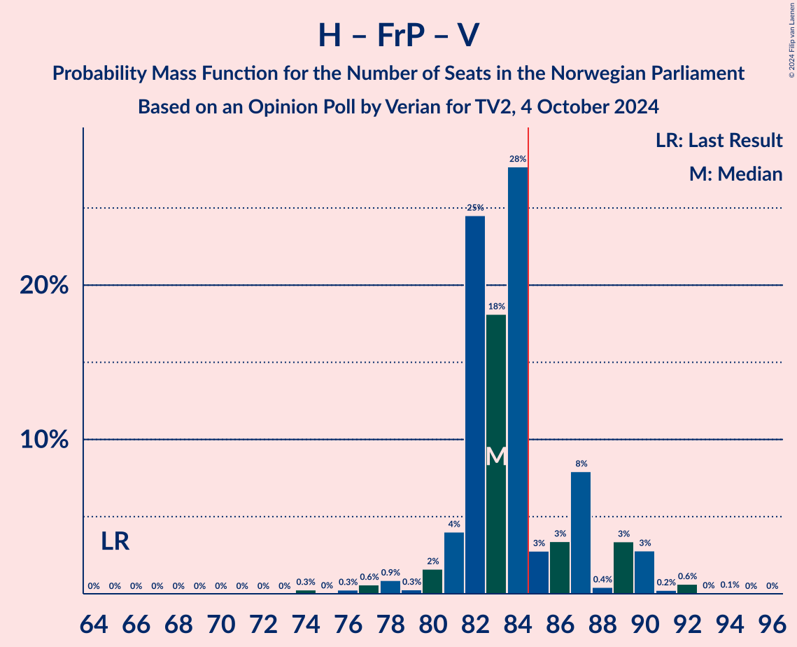

| Number of Seats | Probability | Accumulated | Special Marks |
|:---------------:|:-----------:|:-----------:|:-------------:|
| 65 | 0% | 100% | Last Result |
| 66 | 0% | 100% |  |
| 67 | 0% | 100% |  |
| 68 | 0% | 100% |  |
| 69 | 0% | 100% |  |
| 70 | 0% | 100% |  |
| 71 | 0% | 100% |  |
| 72 | 0% | 100% |  |
| 73 | 0% | 100% |  |
| 74 | 0.3% | 100% |  |
| 75 | 0% | 99.7% |  |
| 76 | 0.3% | 99.7% |  |
| 77 | 0.6% | 99.4% |  |
| 78 | 0.9% | 98.8% |  |
| 79 | 0.3% | 98% |  |
| 80 | 2% | 98% |  |
| 81 | 4% | 96% |  |
| 82 | 25% | 92% |  |
| 83 | 18% | 68% |  |
| 84 | 28% | 49% | Median |
| 85 | 3% | 22% | Majority |
| 86 | 3% | 19% |  |
| 87 | 8% | 16% |  |
| 88 | 0.4% | 8% |  |
| 89 | 3% | 7% |  |
| 90 | 3% | 4% |  |
| 91 | 0.2% | 1.0% |  |
| 92 | 0.6% | 0.8% |  |
| 93 | 0% | 0.1% |  |
| 94 | 0.1% | 0.1% |  |
| 95 | 0% | 0% |  |

### Arbeiderpartiet – Sosialistisk Venstreparti – Rødt – Senterpartiet – Miljøpartiet De Grønne

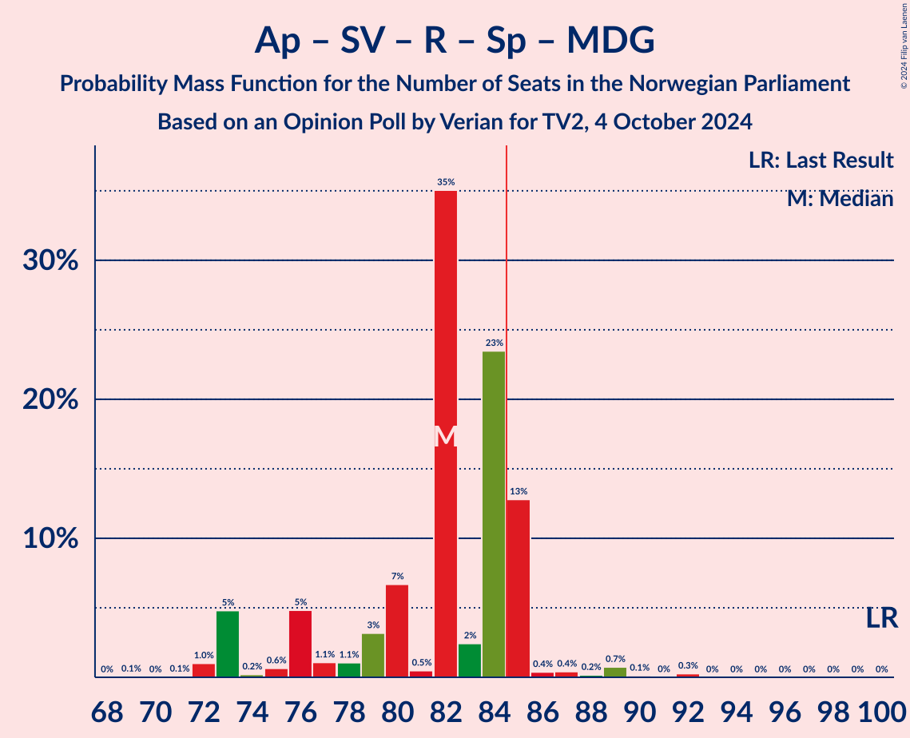

| Number of Seats | Probability | Accumulated | Special Marks |
|:---------------:|:-----------:|:-----------:|:-------------:|
| 69 | 0.1% | 100% |  |
| 70 | 0% | 99.9% |  |
| 71 | 0.1% | 99.9% |  |
| 72 | 1.0% | 99.9% |  |
| 73 | 5% | 98.9% |  |
| 74 | 0.2% | 94% |  |
| 75 | 0.6% | 94% |  |
| 76 | 5% | 93% |  |
| 77 | 1.1% | 88% |  |
| 78 | 1.1% | 87% |  |
| 79 | 3% | 86% | Median |
| 80 | 7% | 83% |  |
| 81 | 0.5% | 76% |  |
| 82 | 35% | 76% |  |
| 83 | 2% | 41% |  |
| 84 | 23% | 38% |  |
| 85 | 13% | 15% | Majority |
| 86 | 0.4% | 2% |  |
| 87 | 0.4% | 2% |  |
| 88 | 0.2% | 1.3% |  |
| 89 | 0.7% | 1.2% |  |
| 90 | 0.1% | 0.4% |  |
| 91 | 0% | 0.3% |  |
| 92 | 0.3% | 0.3% |  |
| 93 | 0% | 0% |  |
| 94 | 0% | 0% |  |
| 95 | 0% | 0% |  |
| 96 | 0% | 0% |  |
| 97 | 0% | 0% |  |
| 98 | 0% | 0% |  |
| 99 | 0% | 0% |  |
| 100 | 0% | 0% | Last Result |

### Høyre – Fremskrittspartiet

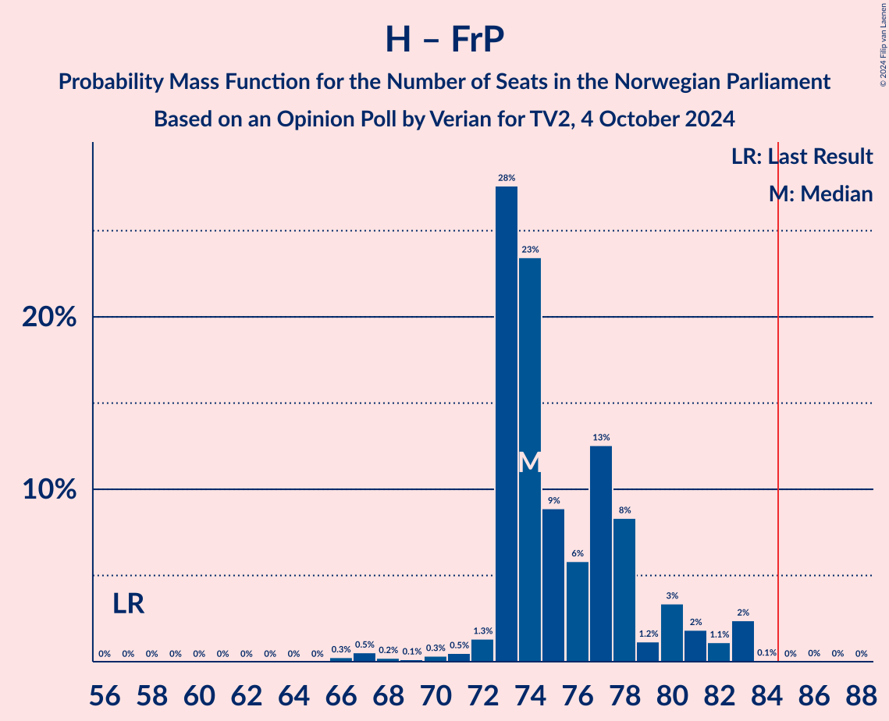

| Number of Seats | Probability | Accumulated | Special Marks |
|:---------------:|:-----------:|:-----------:|:-------------:|
| 57 | 0% | 100% | Last Result |
| 58 | 0% | 100% |  |
| 59 | 0% | 100% |  |
| 60 | 0% | 100% |  |
| 61 | 0% | 100% |  |
| 62 | 0% | 100% |  |
| 63 | 0% | 100% |  |
| 64 | 0% | 100% |  |
| 65 | 0% | 100% |  |
| 66 | 0.3% | 100% |  |
| 67 | 0.5% | 99.7% |  |
| 68 | 0.2% | 99.2% |  |
| 69 | 0.1% | 99.0% |  |
| 70 | 0.3% | 98.9% |  |
| 71 | 0.5% | 98.5% |  |
| 72 | 1.3% | 98% |  |
| 73 | 28% | 97% |  |
| 74 | 23% | 69% |  |
| 75 | 9% | 46% | Median |
| 76 | 6% | 37% |  |
| 77 | 13% | 31% |  |
| 78 | 8% | 18% |  |
| 79 | 1.2% | 10% |  |
| 80 | 3% | 9% |  |
| 81 | 2% | 5% |  |
| 82 | 1.1% | 4% |  |
| 83 | 2% | 3% |  |
| 84 | 0.1% | 0.1% |  |
| 85 | 0% | 0.1% | Majority |
| 86 | 0% | 0.1% |  |
| 87 | 0% | 0% |  |

### Arbeiderpartiet – Sosialistisk Venstreparti – Rødt – Senterpartiet

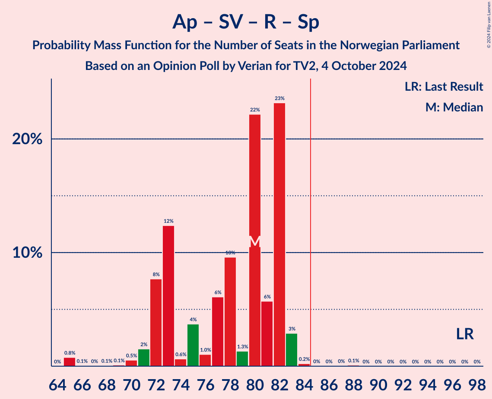

| Number of Seats | Probability | Accumulated | Special Marks |
|:---------------:|:-----------:|:-----------:|:-------------:|
| 65 | 0.8% | 100% |  |
| 66 | 0.1% | 99.2% |  |
| 67 | 0% | 99.2% |  |
| 68 | 0.1% | 99.1% |  |
| 69 | 0.1% | 99.1% |  |
| 70 | 0.5% | 99.0% |  |
| 71 | 2% | 98% |  |
| 72 | 8% | 97% |  |
| 73 | 12% | 89% |  |
| 74 | 0.6% | 77% |  |
| 75 | 4% | 76% |  |
| 76 | 1.0% | 72% |  |
| 77 | 6% | 71% | Median |
| 78 | 10% | 65% |  |
| 79 | 1.3% | 56% |  |
| 80 | 22% | 54% |  |
| 81 | 6% | 32% |  |
| 82 | 23% | 27% |  |
| 83 | 3% | 3% |  |
| 84 | 0.2% | 0.4% |  |
| 85 | 0% | 0.2% | Majority |
| 86 | 0% | 0.2% |  |
| 87 | 0% | 0.1% |  |
| 88 | 0.1% | 0.1% |  |
| 89 | 0% | 0% |  |
| 90 | 0% | 0% |  |
| 91 | 0% | 0% |  |
| 92 | 0% | 0% |  |
| 93 | 0% | 0% |  |
| 94 | 0% | 0% |  |
| 95 | 0% | 0% |  |
| 96 | 0% | 0% |  |
| 97 | 0% | 0% | Last Result |

### Arbeiderpartiet – Sosialistisk Venstreparti – Senterpartiet – Miljøpartiet De Grønne – Kristelig Folkeparti

| Number of Seats | Probability | Accumulated | Special Marks |
|:---------------:|:-----------:|:-----------:|:-------------:|
| 63 | 0.3% | 100% |  |
| 64 | 0.1% | 99.7% |  |
| 65 | 0.2% | 99.7% |  |
| 66 | 0.5% | 99.5% |  |
| 67 | 2% | 98.9% |  |
| 68 | 0.8% | 97% |  |
| 69 | 5% | 96% |  |
| 70 | 7% | 90% | Median |
| 71 | 7% | 84% |  |
| 72 | 1.3% | 77% |  |
| 73 | 21% | 76% |  |
| 74 | 7% | 54% |  |
| 75 | 34% | 47% |  |
| 76 | 0.7% | 13% |  |
| 77 | 0.6% | 12% |  |
| 78 | 10% | 12% |  |
| 79 | 1.0% | 2% |  |
| 80 | 0.2% | 1.2% |  |
| 81 | 0.2% | 1.0% |  |
| 82 | 0.5% | 0.8% |  |
| 83 | 0.2% | 0.3% |  |
| 84 | 0% | 0.1% |  |
| 85 | 0.1% | 0.1% | Majority |
| 86 | 0% | 0% |  |
| 87 | 0% | 0% |  |
| 88 | 0% | 0% |  |
| 89 | 0% | 0% |  |
| 90 | 0% | 0% |  |
| 91 | 0% | 0% |  |
| 92 | 0% | 0% |  |
| 93 | 0% | 0% |  |
| 94 | 0% | 0% |  |
| 95 | 0% | 0% | Last Result |

### Arbeiderpartiet – Sosialistisk Venstreparti – Senterpartiet – Miljøpartiet De Grønne

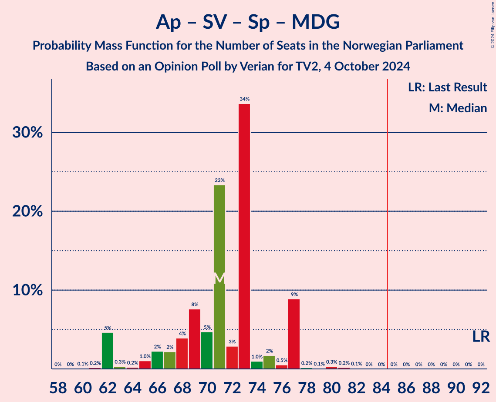

| Number of Seats | Probability | Accumulated | Special Marks |
|:---------------:|:-----------:|:-----------:|:-------------:|
| 60 | 0.1% | 100% |  |
| 61 | 0.2% | 99.9% |  |
| 62 | 5% | 99.7% |  |
| 63 | 0.3% | 95% |  |
| 64 | 0.2% | 95% |  |
| 65 | 1.0% | 95% |  |
| 66 | 2% | 94% |  |
| 67 | 2% | 91% |  |
| 68 | 4% | 89% | Median |
| 69 | 8% | 85% |  |
| 70 | 5% | 78% |  |
| 71 | 23% | 73% |  |
| 72 | 3% | 49% |  |
| 73 | 34% | 47% |  |
| 74 | 1.0% | 13% |  |
| 75 | 2% | 12% |  |
| 76 | 0.5% | 10% |  |
| 77 | 9% | 10% |  |
| 78 | 0.2% | 0.8% |  |
| 79 | 0.1% | 0.7% |  |
| 80 | 0.3% | 0.6% |  |
| 81 | 0.2% | 0.3% |  |
| 82 | 0.1% | 0.1% |  |
| 83 | 0% | 0% |  |
| 84 | 0% | 0% |  |
| 85 | 0% | 0% | Majority |
| 86 | 0% | 0% |  |
| 87 | 0% | 0% |  |
| 88 | 0% | 0% |  |
| 89 | 0% | 0% |  |
| 90 | 0% | 0% |  |
| 91 | 0% | 0% |  |
| 92 | 0% | 0% | Last Result |

### Arbeiderpartiet – Sosialistisk Venstreparti – Rødt – Miljøpartiet De Grønne

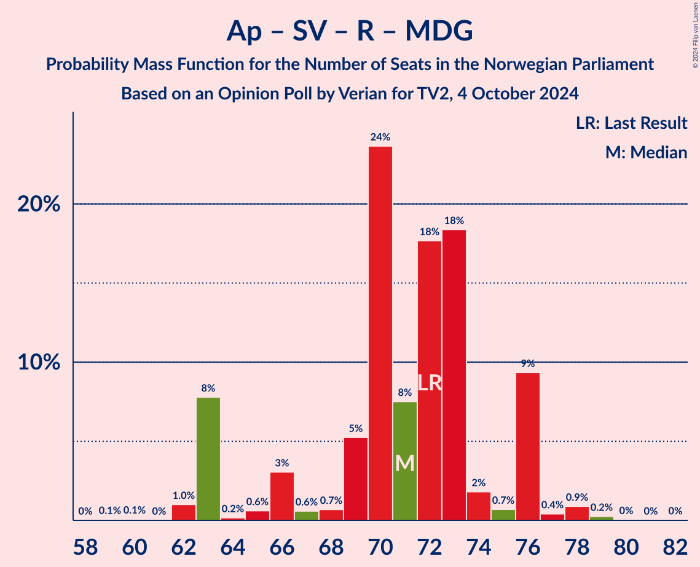

| Number of Seats | Probability | Accumulated | Special Marks |
|:---------------:|:-----------:|:-----------:|:-------------:|
| 59 | 0.1% | 100% |  |
| 60 | 0.1% | 99.9% |  |
| 61 | 0% | 99.9% |  |
| 62 | 1.0% | 99.9% |  |
| 63 | 8% | 98.9% |  |
| 64 | 0.2% | 91% |  |
| 65 | 0.6% | 91% |  |
| 66 | 3% | 90% |  |
| 67 | 0.6% | 87% |  |
| 68 | 0.7% | 87% |  |
| 69 | 5% | 86% | Median |
| 70 | 24% | 81% |  |
| 71 | 8% | 57% |  |
| 72 | 18% | 50% | Last Result |
| 73 | 18% | 32% |  |
| 74 | 2% | 13% |  |
| 75 | 0.7% | 12% |  |
| 76 | 9% | 11% |  |
| 77 | 0.4% | 2% |  |
| 78 | 0.9% | 1.2% |  |
| 79 | 0.2% | 0.3% |  |
| 80 | 0% | 0.1% |  |
| 81 | 0% | 0% |  |

### Arbeiderpartiet – Sosialistisk Venstreparti – Senterpartiet

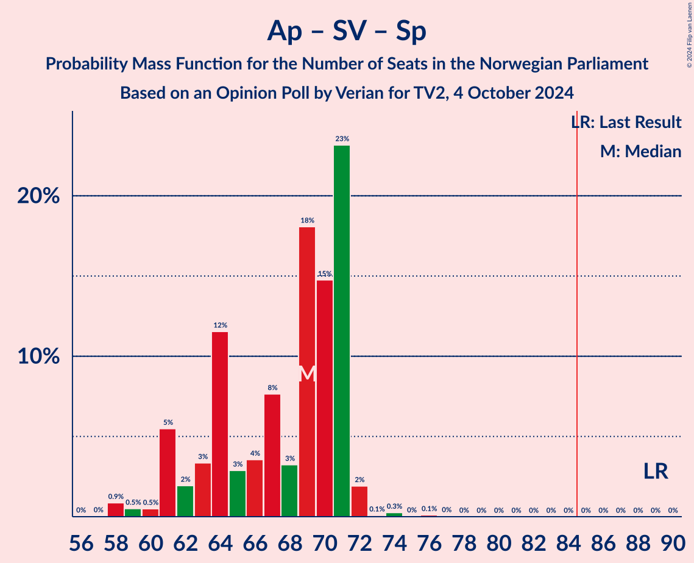

| Number of Seats | Probability | Accumulated | Special Marks |
|:---------------:|:-----------:|:-----------:|:-------------:|
| 57 | 0% | 100% |  |
| 58 | 0.9% | 99.9% |  |
| 59 | 0.5% | 99.1% |  |
| 60 | 0.5% | 98.6% |  |
| 61 | 5% | 98% |  |
| 62 | 2% | 93% |  |
| 63 | 3% | 91% |  |
| 64 | 12% | 87% |  |
| 65 | 3% | 76% |  |
| 66 | 4% | 73% | Median |
| 67 | 8% | 69% |  |
| 68 | 3% | 62% |  |
| 69 | 18% | 58% |  |
| 70 | 15% | 40% |  |
| 71 | 23% | 26% |  |
| 72 | 2% | 2% |  |
| 73 | 0.1% | 0.5% |  |
| 74 | 0.3% | 0.4% |  |
| 75 | 0% | 0.2% |  |
| 76 | 0.1% | 0.2% |  |
| 77 | 0% | 0% |  |
| 78 | 0% | 0% |  |
| 79 | 0% | 0% |  |
| 80 | 0% | 0% |  |
| 81 | 0% | 0% |  |
| 82 | 0% | 0% |  |
| 83 | 0% | 0% |  |
| 84 | 0% | 0% |  |
| 85 | 0% | 0% | Majority |
| 86 | 0% | 0% |  |
| 87 | 0% | 0% |  |
| 88 | 0% | 0% |  |
| 89 | 0% | 0% | Last Result |

### Arbeiderpartiet – Senterpartiet – Miljøpartiet De Grønne – Kristelig Folkeparti

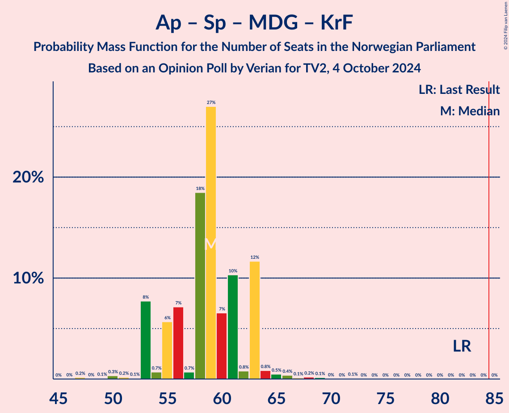

| Number of Seats | Probability | Accumulated | Special Marks |
|:---------------:|:-----------:|:-----------:|:-------------:|
| 47 | 0.2% | 100% |  |
| 48 | 0% | 99.8% |  |
| 49 | 0.1% | 99.8% |  |
| 50 | 0.3% | 99.7% |  |
| 51 | 0.2% | 99.4% |  |
| 52 | 0.1% | 99.2% |  |
| 53 | 8% | 99.1% |  |
| 54 | 0.7% | 91% |  |
| 55 | 6% | 91% | Median |
| 56 | 7% | 85% |  |
| 57 | 0.7% | 78% |  |
| 58 | 18% | 77% |  |
| 59 | 27% | 59% |  |
| 60 | 7% | 32% |  |
| 61 | 10% | 25% |  |
| 62 | 0.8% | 15% |  |
| 63 | 12% | 14% |  |
| 64 | 0.8% | 2% |  |
| 65 | 0.5% | 1.5% |  |
| 66 | 0.4% | 1.0% |  |
| 67 | 0.1% | 0.6% |  |
| 68 | 0.2% | 0.5% |  |
| 69 | 0.1% | 0.3% |  |
| 70 | 0% | 0.1% |  |
| 71 | 0% | 0.1% |  |
| 72 | 0.1% | 0.1% |  |
| 73 | 0% | 0% |  |
| 74 | 0% | 0% |  |
| 75 | 0% | 0% |  |
| 76 | 0% | 0% |  |
| 77 | 0% | 0% |  |
| 78 | 0% | 0% |  |
| 79 | 0% | 0% |  |
| 80 | 0% | 0% |  |
| 81 | 0% | 0% |  |
| 82 | 0% | 0% | Last Result |

### Arbeiderpartiet – Sosialistisk Venstreparti

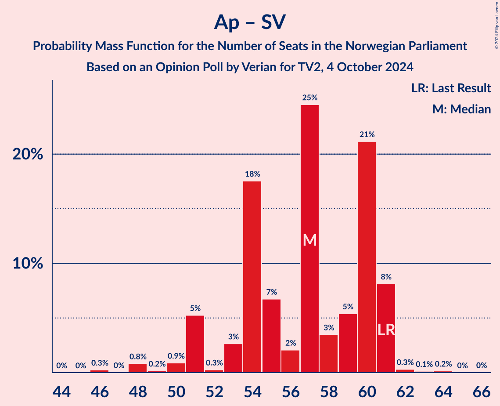

| Number of Seats | Probability | Accumulated | Special Marks |
|:---------------:|:-----------:|:-----------:|:-------------:|
| 46 | 0.3% | 100% |  |
| 47 | 0% | 99.7% |  |
| 48 | 0.8% | 99.7% |  |
| 49 | 0.2% | 98.9% |  |
| 50 | 0.9% | 98.7% |  |
| 51 | 5% | 98% |  |
| 52 | 0.3% | 93% |  |
| 53 | 3% | 92% |  |
| 54 | 18% | 90% |  |
| 55 | 7% | 72% |  |
| 56 | 2% | 65% | Median |
| 57 | 25% | 63% |  |
| 58 | 3% | 39% |  |
| 59 | 5% | 35% |  |
| 60 | 21% | 30% |  |
| 61 | 8% | 9% | Last Result |
| 62 | 0.3% | 0.6% |  |
| 63 | 0.1% | 0.3% |  |
| 64 | 0.2% | 0.2% |  |
| 65 | 0% | 0.1% |  |
| 66 | 0% | 0% |  |

### Høyre – Venstre – Kristelig Folkeparti

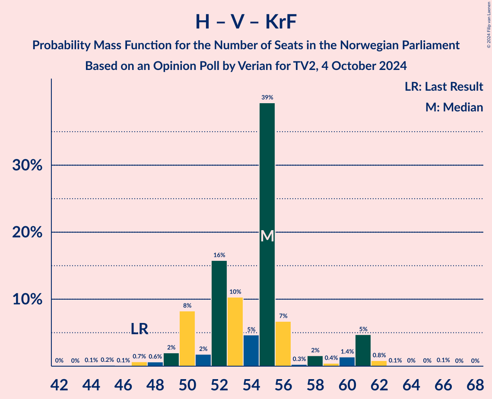

| Number of Seats | Probability | Accumulated | Special Marks |
|:---------------:|:-----------:|:-----------:|:-------------:|
| 42 | 0% | 100% |  |
| 43 | 0% | 99.9% |  |
| 44 | 0.1% | 99.9% |  |
| 45 | 0.2% | 99.8% |  |
| 46 | 0.1% | 99.7% |  |
| 47 | 0.7% | 99.6% | Last Result |
| 48 | 0.6% | 98.9% |  |
| 49 | 2% | 98% |  |
| 50 | 8% | 96% |  |
| 51 | 2% | 88% |  |
| 52 | 16% | 86% |  |
| 53 | 10% | 70% |  |
| 54 | 5% | 60% |  |
| 55 | 39% | 55% | Median |
| 56 | 7% | 16% |  |
| 57 | 0.3% | 9% |  |
| 58 | 2% | 9% |  |
| 59 | 0.4% | 8% |  |
| 60 | 1.4% | 7% |  |
| 61 | 5% | 6% |  |
| 62 | 0.8% | 1.1% |  |
| 63 | 0.1% | 0.2% |  |
| 64 | 0% | 0.2% |  |
| 65 | 0% | 0.1% |  |
| 66 | 0.1% | 0.1% |  |
| 67 | 0% | 0% |  |

### Arbeiderpartiet – Senterpartiet – Kristelig Folkeparti

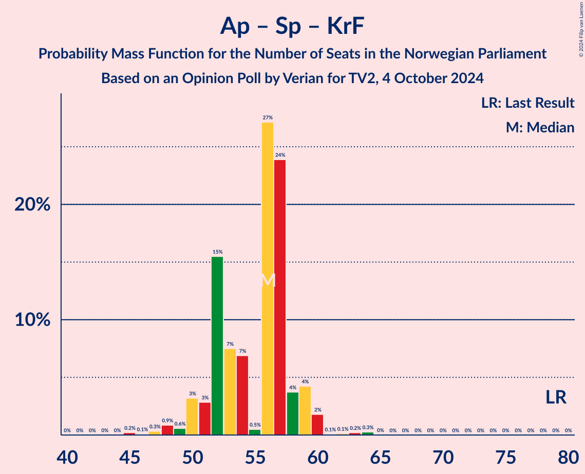

| Number of Seats | Probability | Accumulated | Special Marks |
|:---------------:|:-----------:|:-----------:|:-------------:|
| 45 | 0.2% | 100% |  |
| 46 | 0.1% | 99.8% |  |
| 47 | 0.3% | 99.7% |  |
| 48 | 0.9% | 99.3% |  |
| 49 | 0.6% | 98% |  |
| 50 | 3% | 98% |  |
| 51 | 3% | 95% |  |
| 52 | 15% | 92% |  |
| 53 | 7% | 76% | Median |
| 54 | 7% | 69% |  |
| 55 | 0.5% | 62% |  |
| 56 | 27% | 61% |  |
| 57 | 24% | 34% |  |
| 58 | 4% | 10% |  |
| 59 | 4% | 7% |  |
| 60 | 2% | 2% |  |
| 61 | 0.1% | 0.7% |  |
| 62 | 0.1% | 0.6% |  |
| 63 | 0.2% | 0.5% |  |
| 64 | 0.3% | 0.3% |  |
| 65 | 0% | 0% |  |
| 66 | 0% | 0% |  |
| 67 | 0% | 0% |  |
| 68 | 0% | 0% |  |
| 69 | 0% | 0% |  |
| 70 | 0% | 0% |  |
| 71 | 0% | 0% |  |
| 72 | 0% | 0% |  |
| 73 | 0% | 0% |  |
| 74 | 0% | 0% |  |
| 75 | 0% | 0% |  |
| 76 | 0% | 0% |  |
| 77 | 0% | 0% |  |
| 78 | 0% | 0% |  |
| 79 | 0% | 0% | Last Result |

### Arbeiderpartiet – Senterpartiet

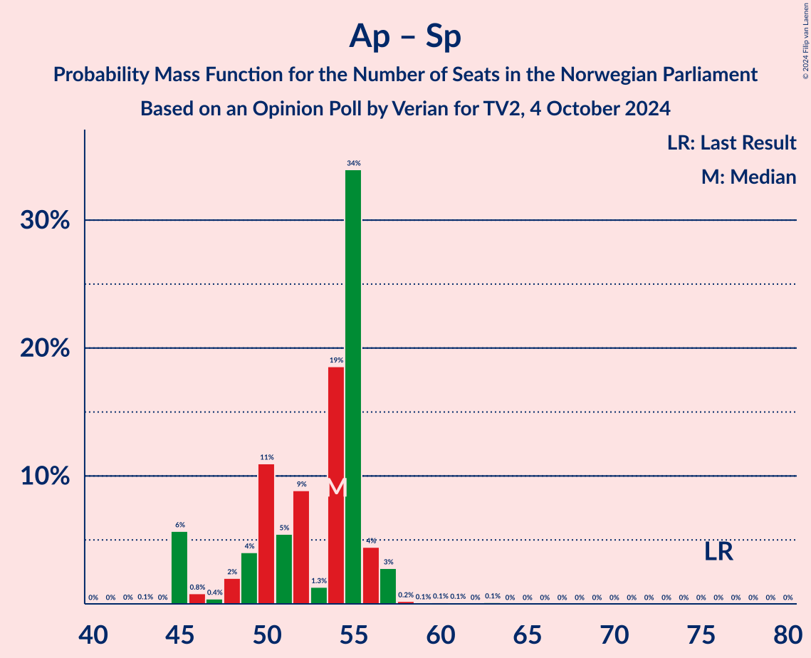

| Number of Seats | Probability | Accumulated | Special Marks |
|:---------------:|:-----------:|:-----------:|:-------------:|
| 43 | 0.1% | 100% |  |
| 44 | 0% | 99.9% |  |
| 45 | 6% | 99.9% |  |
| 46 | 0.8% | 94% |  |
| 47 | 0.4% | 93% |  |
| 48 | 2% | 93% |  |
| 49 | 4% | 91% |  |
| 50 | 11% | 87% |  |
| 51 | 5% | 76% | Median |
| 52 | 9% | 71% |  |
| 53 | 1.3% | 62% |  |
| 54 | 19% | 60% |  |
| 55 | 34% | 42% |  |
| 56 | 4% | 8% |  |
| 57 | 3% | 3% |  |
| 58 | 0.2% | 0.6% |  |
| 59 | 0.1% | 0.4% |  |
| 60 | 0.1% | 0.3% |  |
| 61 | 0.1% | 0.2% |  |
| 62 | 0% | 0.1% |  |
| 63 | 0.1% | 0.1% |  |
| 64 | 0% | 0% |  |
| 65 | 0% | 0% |  |
| 66 | 0% | 0% |  |
| 67 | 0% | 0% |  |
| 68 | 0% | 0% |  |
| 69 | 0% | 0% |  |
| 70 | 0% | 0% |  |
| 71 | 0% | 0% |  |
| 72 | 0% | 0% |  |
| 73 | 0% | 0% |  |
| 74 | 0% | 0% |  |
| 75 | 0% | 0% |  |
| 76 | 0% | 0% | Last Result |

### Senterpartiet – Venstre – Kristelig Folkeparti

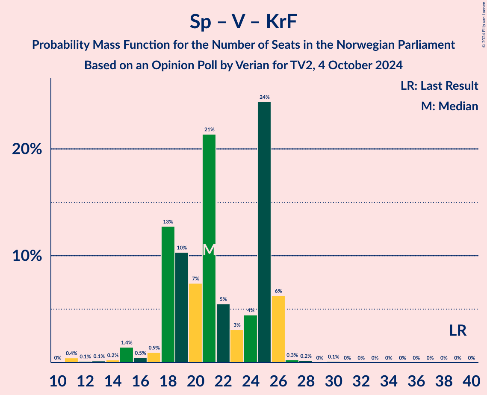

| Number of Seats | Probability | Accumulated | Special Marks |
|:---------------:|:-----------:|:-----------:|:-------------:|
| 11 | 0.4% | 100% |  |
| 12 | 0.1% | 99.5% |  |
| 13 | 0.1% | 99.4% |  |
| 14 | 0.2% | 99.2% |  |
| 15 | 1.4% | 99.0% |  |
| 16 | 0.5% | 98% |  |
| 17 | 0.9% | 97% |  |
| 18 | 13% | 96% |  |
| 19 | 10% | 83% |  |
| 20 | 7% | 73% |  |
| 21 | 21% | 66% | Median |
| 22 | 5% | 44% |  |
| 23 | 3% | 39% |  |
| 24 | 4% | 36% |  |
| 25 | 24% | 31% |  |
| 26 | 6% | 7% |  |
| 27 | 0.3% | 0.5% |  |
| 28 | 0.2% | 0.3% |  |
| 29 | 0% | 0.1% |  |
| 30 | 0.1% | 0.1% |  |
| 31 | 0% | 0% |  |
| 32 | 0% | 0% |  |
| 33 | 0% | 0% |  |
| 34 | 0% | 0% |  |
| 35 | 0% | 0% |  |
| 36 | 0% | 0% |  |
| 37 | 0% | 0% |  |
| 38 | 0% | 0% |  |
| 39 | 0% | 0% | Last Result |

## Technical Information

### Opinion Poll

+ **Polling firm:** Verian
+ **Commissioner(s):** TV2
+ **Fieldwork period:** 4 October 2024

### Calculations

+ **Sample size:** 1000
+ **Simulations done:** 1,048,576
+ **Error estimate:** 3.11%

