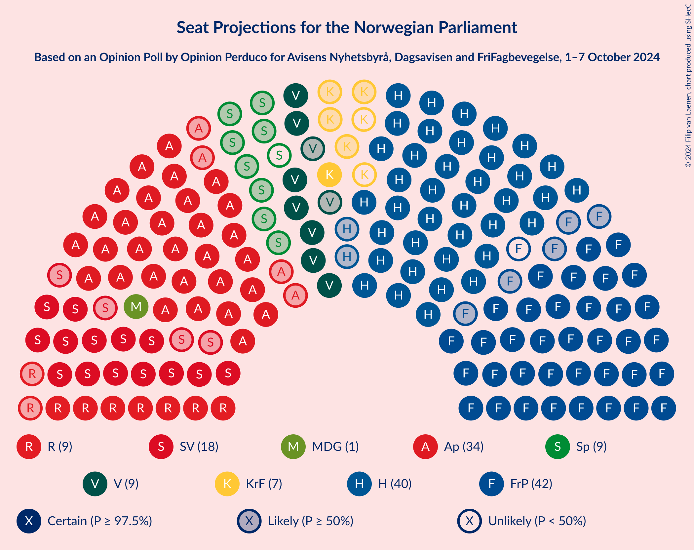
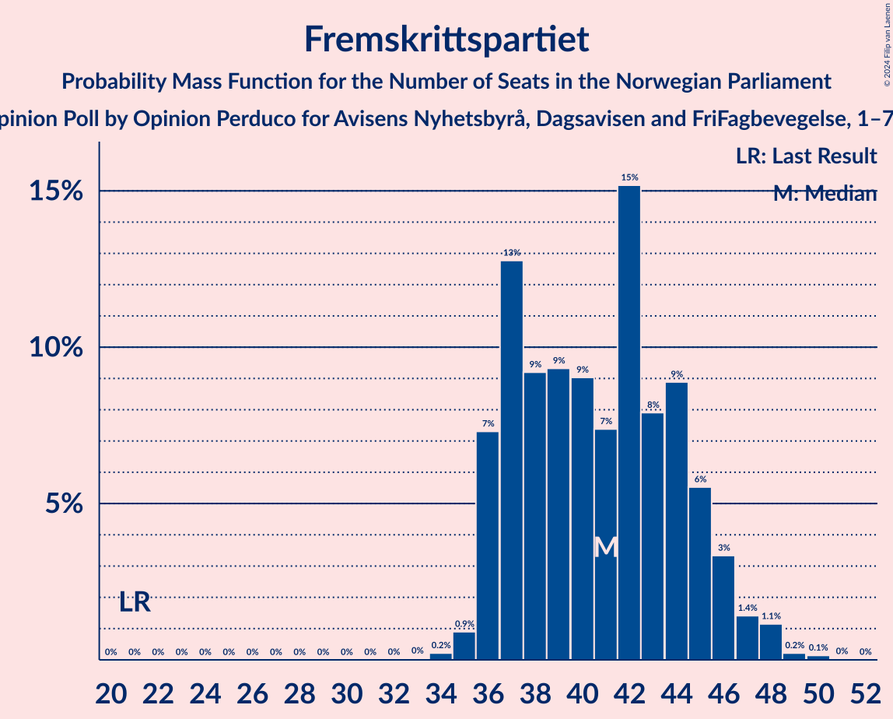
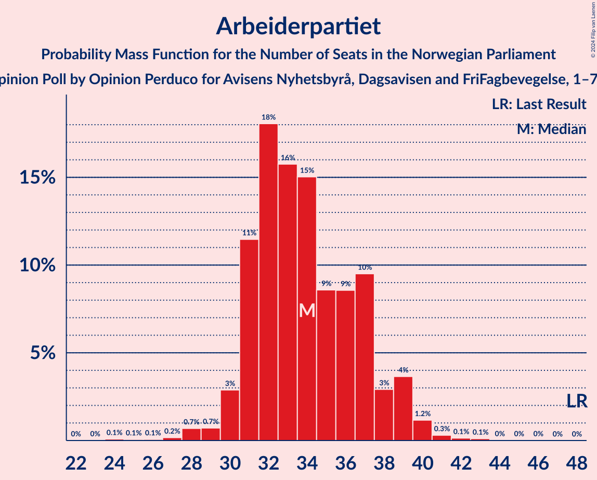
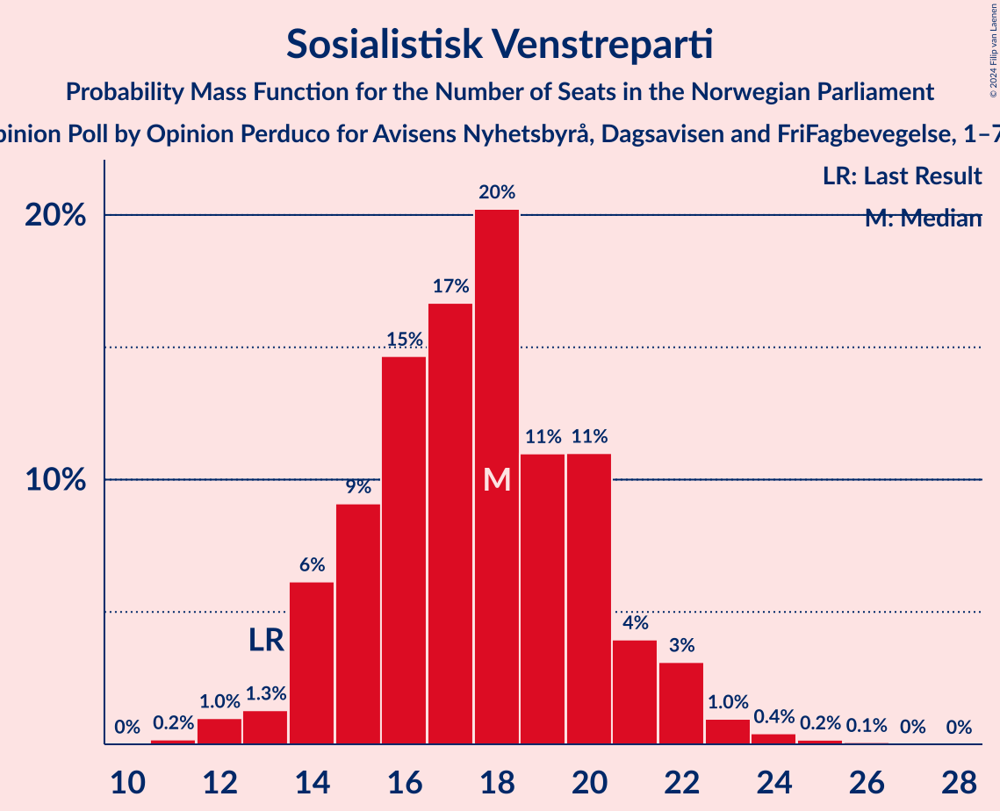
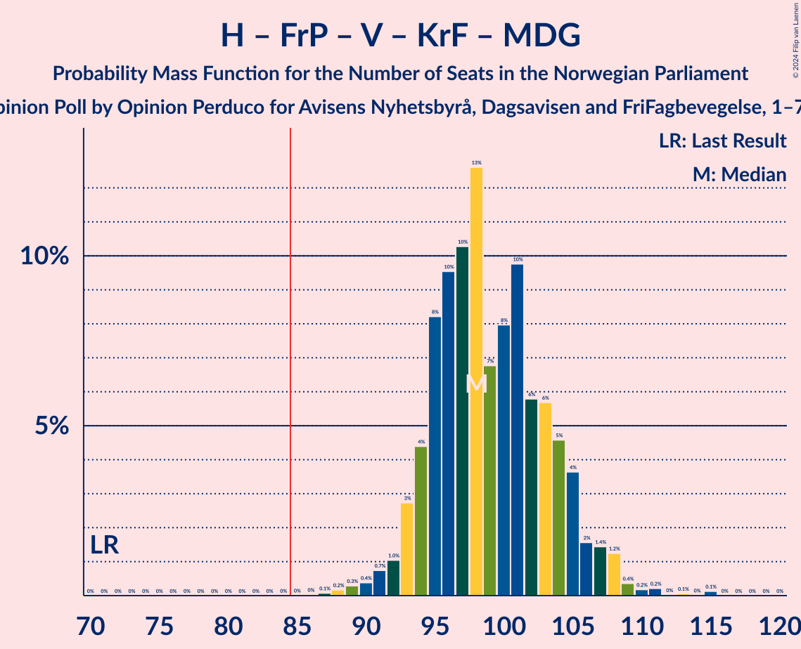
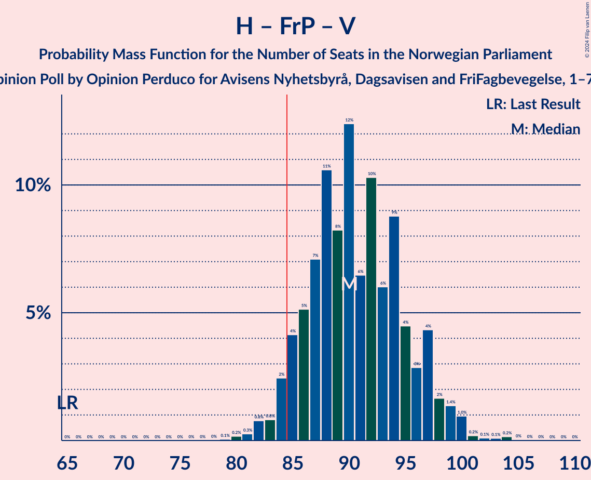
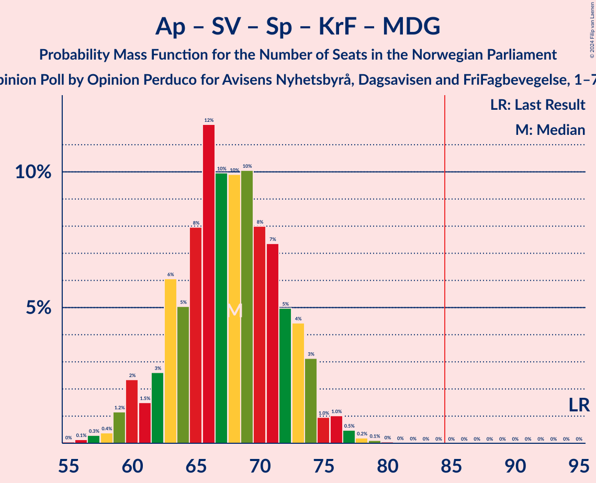
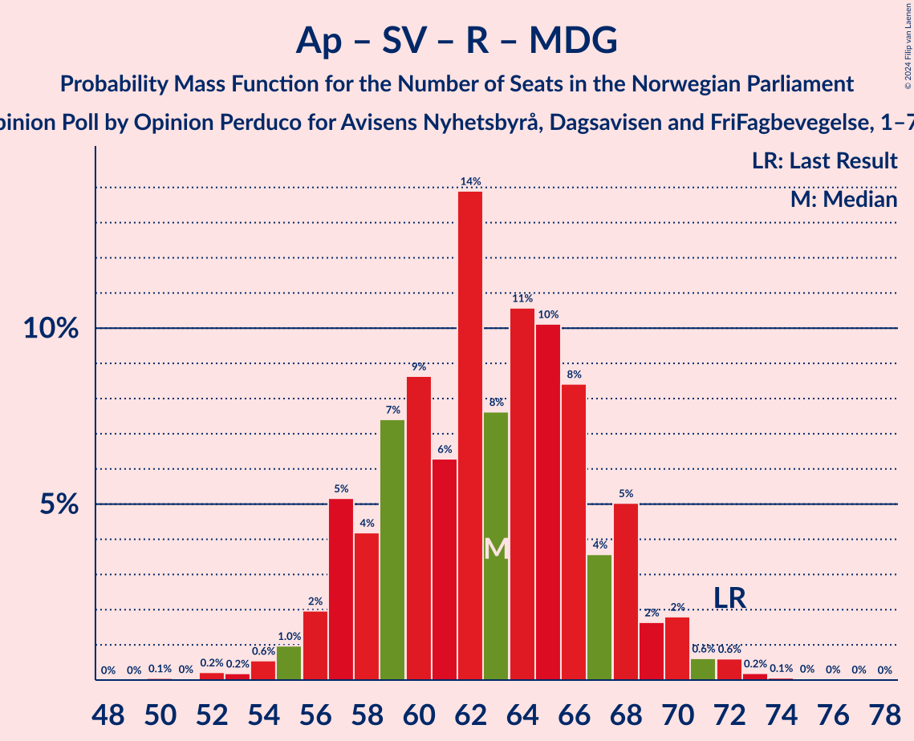
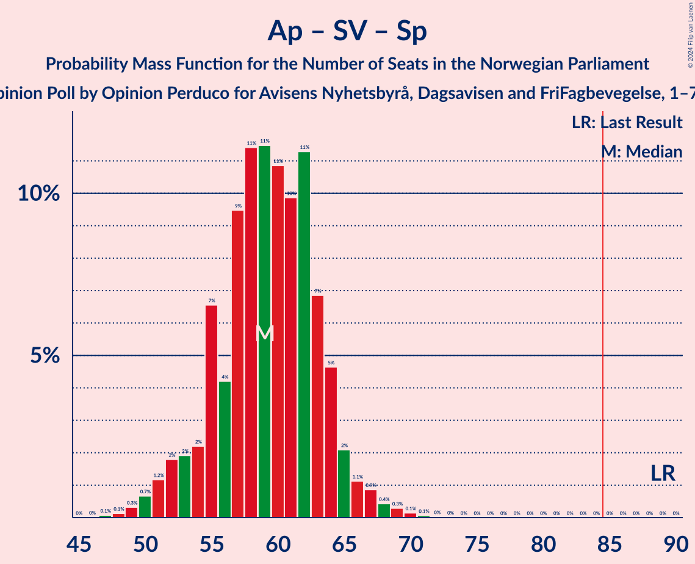
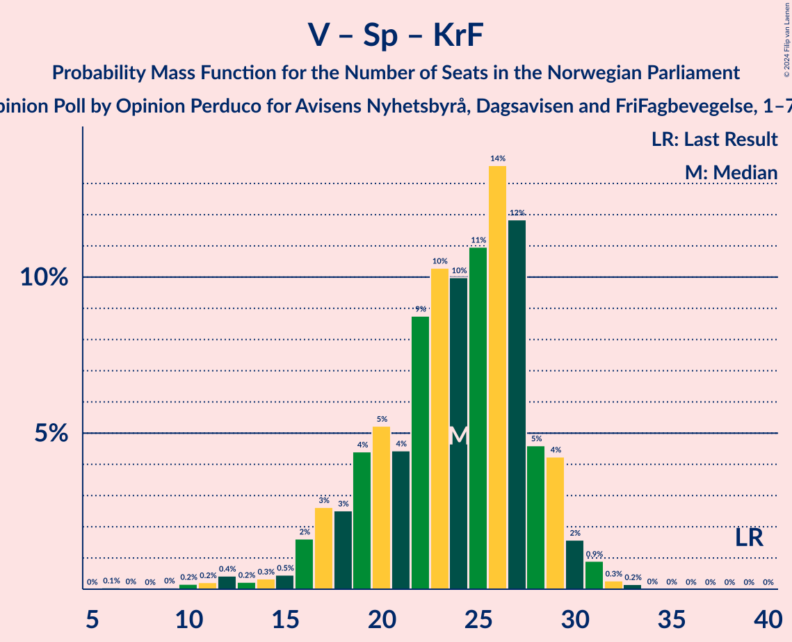

# Opinion Poll by Opinion Perduco for Avisens Nyhetsbyrå, Dagsavisen and FriFagbevegelse, 1–7 October 2024

<a href="#voting-intentions">Voting Intentions</a> | <a href="#seats">Seats</a> | <a href="#coalitions">Coalitions</a> | <a href="#technical-information">Technical Information</a>

## Voting Intentions

### Confidence Intervals

| Party | Last Result | Poll Result | 80% Confidence Interval | 90% Confidence Interval | 95% Confidence Interval | 99% Confidence Interval |
|:-----:|:-----------:|:-----------:|:-----------------------:|:-----------------------:|:-----------------------:|:-----------------------:|
| Høyre | 20.4% | 23.1% | 21.2–25.2% |20.6–25.8% |20.1–26.4% |19.3–27.4% |
| Fremskrittspartiet | 11.6% | 22.5% | 20.6–24.6% |20.1–25.2% |19.6–25.8% |18.7–26.8% |
| Arbeiderpartiet | 26.2% | 18.0% | 16.3–20.0% |15.8–20.5% |15.4–21.0% |14.6–22.0% |
| Sosialistisk Venstreparti | 7.6% | 10.6% | 9.2–12.2% |8.8–12.7% |8.5–13.0% |7.9–13.9% |
| Rødt | 4.7% | 5.6% | 4.7–6.9% |4.4–7.3% |4.2–7.6% |3.7–8.2% |
| Venstre | 4.6% | 5.5% | 4.5–6.8% |4.3–7.1% |4.0–7.4% |3.6–8.1% |
| Senterpartiet | 13.5% | 4.9% | 4.0–6.1% |3.8–6.5% |3.6–6.8% |3.2–7.4% |
| Kristelig Folkeparti | 3.8% | 4.4% | 3.5–5.5% |3.3–5.9% |3.1–6.1% |2.7–6.7% |
| Miljøpartiet De Grønne | 3.9% | 2.8% | 2.2–3.8% |2.0–4.1% |1.8–4.3% |1.6–4.8% |

*Note:* The poll result column reflects the actual value used in the calculations. Published results may vary slightly, and in addition be rounded to fewer digits.

## Seats

### Confidence Intervals

| Party | Last Result | Median | 80% Confidence Interval | 90% Confidence Interval | 95% Confidence Interval | 99% Confidence Interval |
|:-----:|:-----------:|:------:|:-----------------------:|:-----------------------:|:-----------------------:|:-----------------------:|
| <a href="#høyre">Høyre</a> | 36 | 40 | 37–45 |36–47 |35–47 |33–49 |
| <a href="#fremskrittspartiet">Fremskrittspartiet</a> | 21 | 41 | 37–45 |36–46 |36–47 |35–48 |
| <a href="#arbeiderpartiet">Arbeiderpartiet</a> | 48 | 34 | 31–37 |31–39 |30–39 |28–41 |
| <a href="#sosialistisk-venstreparti">Sosialistisk Venstreparti</a> | 13 | 18 | 15–20 |14–21 |14–22 |12–24 |
| <a href="#rødt">Rødt</a> | 8 | 9 | 8–12 |7–13 |7–13 |1–14 |
| <a href="#venstre">Venstre</a> | 8 | 9 | 8–12 |7–12 |7–13 |3–14 |
| <a href="#senterpartiet">Senterpartiet</a> | 28 | 8 | 6–10 |0–11 |0–12 |0–13 |
| <a href="#kristelig-folkeparti">Kristelig Folkeparti</a> | 3 | 7 | 2–9 |2–10 |1–10 |1–11 |
| <a href="#miljøpartiet-de-grønne">Miljøpartiet De Grønne</a> | 3 | 1 | 1–3 |1–7 |1–7 |0–8 |

### Høyre

*For a full overview of the results for this party, see the [Høyre](party-høyre.html) page.*

| Number of Seats | Probability | Accumulated | Special Marks |
|:---------------:|:-----------:|:-----------:|:-------------:|
| 32 | 0.2% | 100% |  |
| 33 | 0.8% | 99.8% |  |
| 34 | 1.2% | 99.0% |  |
| 35 | 2% | 98% |  |
| 36 | 4% | 96% | Last Result |
| 37 | 5% | 92% |  |
| 38 | 10% | 86% |  |
| 39 | 15% | 77% |  |
| 40 | 17% | 62% | Median |
| 41 | 8% | 44% |  |
| 42 | 10% | 36% |  |
| 43 | 7% | 26% |  |
| 44 | 4% | 19% |  |
| 45 | 6% | 15% |  |
| 46 | 4% | 10% |  |
| 47 | 3% | 6% |  |
| 48 | 2% | 2% |  |
| 49 | 0.6% | 0.8% |  |
| 50 | 0.1% | 0.2% |  |
| 51 | 0% | 0.1% |  |
| 52 | 0% | 0% |  |

### Fremskrittspartiet

*For a full overview of the results for this party, see the [Fremskrittspartiet](party-fremskrittspartiet.html) page.*

| Number of Seats | Probability | Accumulated | Special Marks |
|:---------------:|:-----------:|:-----------:|:-------------:|
| 21 | 0% | 100% | Last Result |
| 22 | 0% | 100% |  |
| 23 | 0% | 100% |  |
| 24 | 0% | 100% |  |
| 25 | 0% | 100% |  |
| 26 | 0% | 100% |  |
| 27 | 0% | 100% |  |
| 28 | 0% | 100% |  |
| 29 | 0% | 100% |  |
| 30 | 0% | 100% |  |
| 31 | 0% | 100% |  |
| 32 | 0% | 100% |  |
| 33 | 0% | 100% |  |
| 34 | 0.2% | 99.9% |  |
| 35 | 0.9% | 99.7% |  |
| 36 | 7% | 98.8% |  |
| 37 | 13% | 92% |  |
| 38 | 9% | 79% |  |
| 39 | 9% | 70% |  |
| 40 | 9% | 60% |  |
| 41 | 7% | 51% | Median |
| 42 | 15% | 44% |  |
| 43 | 8% | 29% |  |
| 44 | 9% | 21% |  |
| 45 | 6% | 12% |  |
| 46 | 3% | 6% |  |
| 47 | 1.4% | 3% |  |
| 48 | 1.1% | 2% |  |
| 49 | 0.2% | 0.4% |  |
| 50 | 0.1% | 0.2% |  |
| 51 | 0% | 0% |  |

### Arbeiderpartiet

*For a full overview of the results for this party, see the [Arbeiderpartiet](party-arbeiderpartiet.html) page.*

| Number of Seats | Probability | Accumulated | Special Marks |
|:---------------:|:-----------:|:-----------:|:-------------:|
| 24 | 0.1% | 100% |  |
| 25 | 0.1% | 99.9% |  |
| 26 | 0.1% | 99.8% |  |
| 27 | 0.2% | 99.8% |  |
| 28 | 0.7% | 99.6% |  |
| 29 | 0.7% | 98.9% |  |
| 30 | 3% | 98% |  |
| 31 | 11% | 95% |  |
| 32 | 18% | 84% |  |
| 33 | 16% | 66% |  |
| 34 | 15% | 50% | Median |
| 35 | 9% | 35% |  |
| 36 | 9% | 26% |  |
| 37 | 10% | 18% |  |
| 38 | 3% | 8% |  |
| 39 | 4% | 5% |  |
| 40 | 1.2% | 2% |  |
| 41 | 0.3% | 0.6% |  |
| 42 | 0.1% | 0.3% |  |
| 43 | 0.1% | 0.2% |  |
| 44 | 0% | 0.1% |  |
| 45 | 0% | 0% |  |
| 46 | 0% | 0% |  |
| 47 | 0% | 0% |  |
| 48 | 0% | 0% | Last Result |

### Sosialistisk Venstreparti

*For a full overview of the results for this party, see the [Sosialistisk Venstreparti](party-sosialistiskvenstreparti.html) page.*

| Number of Seats | Probability | Accumulated | Special Marks |
|:---------------:|:-----------:|:-----------:|:-------------:|
| 11 | 0.2% | 100% |  |
| 12 | 1.0% | 99.8% |  |
| 13 | 1.3% | 98.8% | Last Result |
| 14 | 6% | 98% |  |
| 15 | 9% | 91% |  |
| 16 | 15% | 82% |  |
| 17 | 17% | 68% |  |
| 18 | 20% | 51% | Median |
| 19 | 11% | 31% |  |
| 20 | 11% | 20% |  |
| 21 | 4% | 9% |  |
| 22 | 3% | 5% |  |
| 23 | 1.0% | 2% |  |
| 24 | 0.4% | 0.7% |  |
| 25 | 0.2% | 0.3% |  |
| 26 | 0.1% | 0.1% |  |
| 27 | 0% | 0% |  |

### Rødt

*For a full overview of the results for this party, see the [Rødt](party-rødt.html) page.*

| Number of Seats | Probability | Accumulated | Special Marks |
|:---------------:|:-----------:|:-----------:|:-------------:|
| 1 | 2% | 100% |  |
| 2 | 0% | 98% |  |
| 3 | 0% | 98% |  |
| 4 | 0% | 98% |  |
| 5 | 0% | 98% |  |
| 6 | 0.4% | 98% |  |
| 7 | 6% | 98% |  |
| 8 | 18% | 92% | Last Result |
| 9 | 26% | 74% | Median |
| 10 | 18% | 48% |  |
| 11 | 19% | 30% |  |
| 12 | 6% | 11% |  |
| 13 | 4% | 5% |  |
| 14 | 0.8% | 1.1% |  |
| 15 | 0.2% | 0.3% |  |
| 16 | 0.1% | 0.1% |  |
| 17 | 0% | 0% |  |

### Venstre

*For a full overview of the results for this party, see the [Venstre](party-venstre.html) page.*

| Number of Seats | Probability | Accumulated | Special Marks |
|:---------------:|:-----------:|:-----------:|:-------------:|
| 2 | 0.3% | 100% |  |
| 3 | 2% | 99.7% |  |
| 4 | 0% | 98% |  |
| 5 | 0% | 98% |  |
| 6 | 0.2% | 98% |  |
| 7 | 8% | 98% |  |
| 8 | 20% | 90% | Last Result |
| 9 | 26% | 70% | Median |
| 10 | 19% | 44% |  |
| 11 | 15% | 25% |  |
| 12 | 6% | 10% |  |
| 13 | 3% | 4% |  |
| 14 | 0.8% | 0.9% |  |
| 15 | 0.2% | 0.2% |  |
| 16 | 0% | 0% |  |

### Senterpartiet

*For a full overview of the results for this party, see the [Senterpartiet](party-senterpartiet.html) page.*

| Number of Seats | Probability | Accumulated | Special Marks |
|:---------------:|:-----------:|:-----------:|:-------------:|
| 0 | 5% | 100% |  |
| 1 | 4% | 95% |  |
| 2 | 0.2% | 91% |  |
| 3 | 0% | 91% |  |
| 4 | 0% | 91% |  |
| 5 | 0% | 91% |  |
| 6 | 2% | 91% |  |
| 7 | 22% | 89% |  |
| 8 | 20% | 67% | Median |
| 9 | 27% | 47% |  |
| 10 | 13% | 20% |  |
| 11 | 4% | 8% |  |
| 12 | 3% | 3% |  |
| 13 | 0.6% | 0.9% |  |
| 14 | 0.2% | 0.3% |  |
| 15 | 0% | 0% |  |
| 16 | 0% | 0% |  |
| 17 | 0% | 0% |  |
| 18 | 0% | 0% |  |
| 19 | 0% | 0% |  |
| 20 | 0% | 0% |  |
| 21 | 0% | 0% |  |
| 22 | 0% | 0% |  |
| 23 | 0% | 0% |  |
| 24 | 0% | 0% |  |
| 25 | 0% | 0% |  |
| 26 | 0% | 0% |  |
| 27 | 0% | 0% |  |
| 28 | 0% | 0% | Last Result |

### Kristelig Folkeparti

*For a full overview of the results for this party, see the [Kristelig Folkeparti](party-kristeligfolkeparti.html) page.*

| Number of Seats | Probability | Accumulated | Special Marks |
|:---------------:|:-----------:|:-----------:|:-------------:|
| 0 | 0.1% | 100% |  |
| 1 | 3% | 99.9% |  |
| 2 | 7% | 97% |  |
| 3 | 15% | 90% | Last Result |
| 4 | 0% | 74% |  |
| 5 | 0% | 74% |  |
| 6 | 0.7% | 74% |  |
| 7 | 27% | 74% | Median |
| 8 | 24% | 46% |  |
| 9 | 15% | 22% |  |
| 10 | 5% | 7% |  |
| 11 | 1.0% | 1.4% |  |
| 12 | 0.3% | 0.4% |  |
| 13 | 0.1% | 0.1% |  |
| 14 | 0% | 0% |  |

### Miljøpartiet De Grønne

*For a full overview of the results for this party, see the [Miljøpartiet De Grønne](party-miljøpartietdegrønne.html) page.*

| Number of Seats | Probability | Accumulated | Special Marks |
|:---------------:|:-----------:|:-----------:|:-------------:|
| 0 | 1.4% | 100% |  |
| 1 | 61% | 98.6% | Median |
| 2 | 27% | 38% |  |
| 3 | 5% | 11% | Last Result |
| 4 | 0% | 6% |  |
| 5 | 0% | 6% |  |
| 6 | 0.8% | 6% |  |
| 7 | 3% | 5% |  |
| 8 | 2% | 2% |  |
| 9 | 0.2% | 0.2% |  |
| 10 | 0% | 0% |  |

## Coalitions

### Confidence Intervals

| Coalition | Last Result | Median | Majority? | 80% Confidence Interval | 90% Confidence Interval | 95% Confidence Interval | 99% Confidence Interval |
|:---------:|:-----------:|:------:|:---------:|:-----------------------:|:-----------------------:|:-----------------------:|:-----------------------:|
| Høyre – Fremskrittspartiet – Venstre – Senterpartiet – Kristelig Folkeparti | 96 | 105 | 100% | 100–110 | 99–111 | 98–112 | 95–114 |
| Høyre – Fremskrittspartiet – Venstre – Kristelig Folkeparti – Miljøpartiet De Grønne | 71 | 98 | 100% | 95–104 | 93–106 | 92–107 | 89–110 |
| Høyre – Fremskrittspartiet – Venstre – Kristelig Folkeparti | 68 | 97 | 99.9% | 93–102 | 91–104 | 90–106 | 87–108 |
| Høyre – Fremskrittspartiet – Venstre | 65 | 90 | 95% | 86–96 | 85–97 | 84–99 | 81–101 |
| Høyre – Fremskrittspartiet | 57 | 81 | 20% | 76–87 | 76–89 | 75–90 | 72–91 |
| Arbeiderpartiet – Sosialistisk Venstreparti – Rødt – Senterpartiet – Miljøpartiet De Grønne | 100 | 71 | 0% | 65–75 | 64–76 | 62–78 | 60–81 |
| Arbeiderpartiet – Sosialistisk Venstreparti – Rødt – Senterpartiet | 97 | 69 | 0% | 64–73 | 62–75 | 61–75 | 58–79 |
| Arbeiderpartiet – Sosialistisk Venstreparti – Senterpartiet – Kristelig Folkeparti – Miljøpartiet De Grønne | 95 | 68 | 0% | 63–73 | 61–74 | 60–75 | 57–77 |
| Arbeiderpartiet – Sosialistisk Venstreparti – Rødt – Miljøpartiet De Grønne | 72 | 63 | 0% | 58–68 | 57–69 | 56–70 | 53–72 |
| Arbeiderpartiet – Sosialistisk Venstreparti – Senterpartiet – Miljøpartiet De Grønne | 92 | 61 | 0% | 56–65 | 55–67 | 53–68 | 51–71 |
| Arbeiderpartiet – Sosialistisk Venstreparti – Senterpartiet | 89 | 59 | 0% | 55–63 | 53–65 | 52–66 | 49–69 |
| Høyre – Venstre – Kristelig Folkeparti | 47 | 57 | 0% | 50–61 | 49–62 | 48–64 | 47–65 |
| Arbeiderpartiet – Senterpartiet – Kristelig Folkeparti – Miljøpartiet De Grønne | 82 | 50 | 0% | 45–55 | 43–56 | 42–58 | 38–59 |
| Arbeiderpartiet – Sosialistisk Venstreparti | 61 | 51 | 0% | 48–55 | 47–56 | 46–57 | 44–60 |
| Arbeiderpartiet – Senterpartiet – Kristelig Folkeparti | 79 | 49 | 0% | 43–53 | 42–54 | 40–56 | 36–58 |
| Arbeiderpartiet – Senterpartiet | 76 | 42 | 0% | 38–45 | 35–47 | 33–48 | 32–50 |
| Venstre – Senterpartiet – Kristelig Folkeparti | 39 | 24 | 0% | 19–28 | 17–29 | 16–30 | 11–31 |

### Høyre – Fremskrittspartiet – Venstre – Senterpartiet – Kristelig Folkeparti

| Number of Seats | Probability | Accumulated | Special Marks |
|:---------------:|:-----------:|:-----------:|:-------------:|
| 92 | 0% | 100% |  |
| 93 | 0.1% | 99.9% |  |
| 94 | 0.1% | 99.9% |  |
| 95 | 0.3% | 99.7% |  |
| 96 | 0.6% | 99.5% | Last Result |
| 97 | 0.9% | 98.8% |  |
| 98 | 2% | 98% |  |
| 99 | 2% | 96% |  |
| 100 | 5% | 94% |  |
| 101 | 4% | 89% |  |
| 102 | 9% | 85% |  |
| 103 | 10% | 76% |  |
| 104 | 11% | 66% |  |
| 105 | 8% | 55% | Median |
| 106 | 14% | 47% |  |
| 107 | 6% | 34% |  |
| 108 | 8% | 28% |  |
| 109 | 7% | 19% |  |
| 110 | 4% | 12% |  |
| 111 | 5% | 9% |  |
| 112 | 2% | 4% |  |
| 113 | 0.9% | 2% |  |
| 114 | 0.5% | 1.0% |  |
| 115 | 0.2% | 0.5% |  |
| 116 | 0.2% | 0.3% |  |
| 117 | 0% | 0.1% |  |
| 118 | 0.1% | 0.1% |  |
| 119 | 0% | 0% |  |

### Høyre – Fremskrittspartiet – Venstre – Kristelig Folkeparti – Miljøpartiet De Grønne

| Number of Seats | Probability | Accumulated | Special Marks |
|:---------------:|:-----------:|:-----------:|:-------------:|
| 71 | 0% | 100% | Last Result |
| 72 | 0% | 100% |  |
| 73 | 0% | 100% |  |
| 74 | 0% | 100% |  |
| 75 | 0% | 100% |  |
| 76 | 0% | 100% |  |
| 77 | 0% | 100% |  |
| 78 | 0% | 100% |  |
| 79 | 0% | 100% |  |
| 80 | 0% | 100% |  |
| 81 | 0% | 100% |  |
| 82 | 0% | 100% |  |
| 83 | 0% | 100% |  |
| 84 | 0% | 100% |  |
| 85 | 0% | 100% | Majority |
| 86 | 0% | 100% |  |
| 87 | 0.1% | 100% |  |
| 88 | 0.2% | 99.9% |  |
| 89 | 0.3% | 99.7% |  |
| 90 | 0.4% | 99.4% |  |
| 91 | 0.7% | 99.0% |  |
| 92 | 1.0% | 98% |  |
| 93 | 3% | 97% |  |
| 94 | 4% | 95% |  |
| 95 | 8% | 90% |  |
| 96 | 10% | 82% |  |
| 97 | 10% | 72% |  |
| 98 | 13% | 62% | Median |
| 99 | 7% | 49% |  |
| 100 | 8% | 43% |  |
| 101 | 10% | 35% |  |
| 102 | 6% | 25% |  |
| 103 | 6% | 19% |  |
| 104 | 5% | 13% |  |
| 105 | 4% | 9% |  |
| 106 | 2% | 5% |  |
| 107 | 1.4% | 4% |  |
| 108 | 1.2% | 2% |  |
| 109 | 0.4% | 1.0% |  |
| 110 | 0.2% | 0.6% |  |
| 111 | 0.2% | 0.4% |  |
| 112 | 0% | 0.2% |  |
| 113 | 0.1% | 0.2% |  |
| 114 | 0% | 0.1% |  |
| 115 | 0.1% | 0.1% |  |
| 116 | 0% | 0% |  |

### Høyre – Fremskrittspartiet – Venstre – Kristelig Folkeparti

| Number of Seats | Probability | Accumulated | Special Marks |
|:---------------:|:-----------:|:-----------:|:-------------:|
| 68 | 0% | 100% | Last Result |
| 69 | 0% | 100% |  |
| 70 | 0% | 100% |  |
| 71 | 0% | 100% |  |
| 72 | 0% | 100% |  |
| 73 | 0% | 100% |  |
| 74 | 0% | 100% |  |
| 75 | 0% | 100% |  |
| 76 | 0% | 100% |  |
| 77 | 0% | 100% |  |
| 78 | 0% | 100% |  |
| 79 | 0% | 100% |  |
| 80 | 0% | 100% |  |
| 81 | 0% | 100% |  |
| 82 | 0% | 100% |  |
| 83 | 0% | 100% |  |
| 84 | 0% | 100% |  |
| 85 | 0.1% | 99.9% | Majority |
| 86 | 0.2% | 99.9% |  |
| 87 | 0.4% | 99.7% |  |
| 88 | 0.5% | 99.2% |  |
| 89 | 0.8% | 98.7% |  |
| 90 | 1.1% | 98% |  |
| 91 | 2% | 97% |  |
| 92 | 4% | 95% |  |
| 93 | 6% | 91% |  |
| 94 | 8% | 85% |  |
| 95 | 13% | 77% |  |
| 96 | 10% | 64% |  |
| 97 | 11% | 54% | Median |
| 98 | 6% | 43% |  |
| 99 | 9% | 37% |  |
| 100 | 7% | 28% |  |
| 101 | 5% | 21% |  |
| 102 | 6% | 16% |  |
| 103 | 2% | 10% |  |
| 104 | 4% | 8% |  |
| 105 | 0.8% | 4% |  |
| 106 | 1.2% | 3% |  |
| 107 | 0.9% | 2% |  |
| 108 | 0.4% | 0.7% |  |
| 109 | 0.1% | 0.3% |  |
| 110 | 0% | 0.2% |  |
| 111 | 0% | 0.2% |  |
| 112 | 0% | 0.2% |  |
| 113 | 0.1% | 0.1% |  |
| 114 | 0% | 0% |  |

### Høyre – Fremskrittspartiet – Venstre

| Number of Seats | Probability | Accumulated | Special Marks |
|:---------------:|:-----------:|:-----------:|:-------------:|
| 65 | 0% | 100% | Last Result |
| 66 | 0% | 100% |  |
| 67 | 0% | 100% |  |
| 68 | 0% | 100% |  |
| 69 | 0% | 100% |  |
| 70 | 0% | 100% |  |
| 71 | 0% | 100% |  |
| 72 | 0% | 100% |  |
| 73 | 0% | 100% |  |
| 74 | 0% | 100% |  |
| 75 | 0% | 100% |  |
| 76 | 0% | 100% |  |
| 77 | 0% | 100% |  |
| 78 | 0% | 100% |  |
| 79 | 0.1% | 100% |  |
| 80 | 0.2% | 99.9% |  |
| 81 | 0.3% | 99.7% |  |
| 82 | 0.8% | 99.5% |  |
| 83 | 0.8% | 98.7% |  |
| 84 | 2% | 98% |  |
| 85 | 4% | 95% | Majority |
| 86 | 5% | 91% |  |
| 87 | 7% | 86% |  |
| 88 | 11% | 79% |  |
| 89 | 8% | 68% |  |
| 90 | 12% | 60% | Median |
| 91 | 6% | 48% |  |
| 92 | 10% | 41% |  |
| 93 | 6% | 31% |  |
| 94 | 9% | 25% |  |
| 95 | 4% | 16% |  |
| 96 | 3% | 12% |  |
| 97 | 4% | 9% |  |
| 98 | 2% | 5% |  |
| 99 | 1.4% | 3% |  |
| 100 | 1.0% | 2% |  |
| 101 | 0.2% | 0.6% |  |
| 102 | 0.1% | 0.4% |  |
| 103 | 0.1% | 0.3% |  |
| 104 | 0.2% | 0.2% |  |
| 105 | 0% | 0.1% |  |
| 106 | 0% | 0% |  |

### Høyre – Fremskrittspartiet

| Number of Seats | Probability | Accumulated | Special Marks |
|:---------------:|:-----------:|:-----------:|:-------------:|
| 57 | 0% | 100% | Last Result |
| 58 | 0% | 100% |  |
| 59 | 0% | 100% |  |
| 60 | 0% | 100% |  |
| 61 | 0% | 100% |  |
| 62 | 0% | 100% |  |
| 63 | 0% | 100% |  |
| 64 | 0% | 100% |  |
| 65 | 0% | 100% |  |
| 66 | 0% | 100% |  |
| 67 | 0% | 100% |  |
| 68 | 0% | 100% |  |
| 69 | 0% | 100% |  |
| 70 | 0% | 100% |  |
| 71 | 0.1% | 99.9% |  |
| 72 | 0.5% | 99.9% |  |
| 73 | 0.7% | 99.4% |  |
| 74 | 0.9% | 98.7% |  |
| 75 | 2% | 98% |  |
| 76 | 6% | 96% |  |
| 77 | 5% | 90% |  |
| 78 | 10% | 85% |  |
| 79 | 14% | 75% |  |
| 80 | 8% | 61% |  |
| 81 | 8% | 53% | Median |
| 82 | 8% | 45% |  |
| 83 | 8% | 37% |  |
| 84 | 10% | 30% |  |
| 85 | 4% | 20% | Majority |
| 86 | 4% | 15% |  |
| 87 | 4% | 12% |  |
| 88 | 2% | 8% |  |
| 89 | 3% | 6% |  |
| 90 | 1.3% | 3% |  |
| 91 | 1.0% | 1.5% |  |
| 92 | 0.2% | 0.5% |  |
| 93 | 0.2% | 0.3% |  |
| 94 | 0% | 0.1% |  |
| 95 | 0% | 0.1% |  |
| 96 | 0% | 0% |  |

### Arbeiderpartiet – Sosialistisk Venstreparti – Rødt – Senterpartiet – Miljøpartiet De Grønne

| Number of Seats | Probability | Accumulated | Special Marks |
|:---------------:|:-----------:|:-----------:|:-------------:|
| 55 | 0.1% | 100% |  |
| 56 | 0% | 99.9% |  |
| 57 | 0% | 99.8% |  |
| 58 | 0% | 99.8% |  |
| 59 | 0.1% | 99.8% |  |
| 60 | 0.4% | 99.6% |  |
| 61 | 0.9% | 99.2% |  |
| 62 | 1.2% | 98% |  |
| 63 | 1.0% | 97% |  |
| 64 | 4% | 96% |  |
| 65 | 2% | 92% |  |
| 66 | 7% | 89% |  |
| 67 | 6% | 83% |  |
| 68 | 7% | 77% |  |
| 69 | 9% | 70% |  |
| 70 | 6% | 61% | Median |
| 71 | 11% | 54% |  |
| 72 | 10% | 44% |  |
| 73 | 12% | 34% |  |
| 74 | 8% | 22% |  |
| 75 | 6% | 14% |  |
| 76 | 4% | 9% |  |
| 77 | 2% | 5% |  |
| 78 | 0.9% | 3% |  |
| 79 | 0.7% | 2% |  |
| 80 | 0.5% | 1.2% |  |
| 81 | 0.4% | 0.7% |  |
| 82 | 0.2% | 0.3% |  |
| 83 | 0.1% | 0.1% |  |
| 84 | 0% | 0.1% |  |
| 85 | 0% | 0% | Majority |
| 86 | 0% | 0% |  |
| 87 | 0% | 0% |  |
| 88 | 0% | 0% |  |
| 89 | 0% | 0% |  |
| 90 | 0% | 0% |  |
| 91 | 0% | 0% |  |
| 92 | 0% | 0% |  |
| 93 | 0% | 0% |  |
| 94 | 0% | 0% |  |
| 95 | 0% | 0% |  |
| 96 | 0% | 0% |  |
| 97 | 0% | 0% |  |
| 98 | 0% | 0% |  |
| 99 | 0% | 0% |  |
| 100 | 0% | 0% | Last Result |

### Arbeiderpartiet – Sosialistisk Venstreparti – Rødt – Senterpartiet

| Number of Seats | Probability | Accumulated | Special Marks |
|:---------------:|:-----------:|:-----------:|:-------------:|
| 53 | 0.1% | 100% |  |
| 54 | 0% | 99.9% |  |
| 55 | 0.1% | 99.9% |  |
| 56 | 0% | 99.8% |  |
| 57 | 0.2% | 99.8% |  |
| 58 | 0.2% | 99.5% |  |
| 59 | 0.4% | 99.3% |  |
| 60 | 1.3% | 98.9% |  |
| 61 | 1.5% | 98% |  |
| 62 | 2% | 96% |  |
| 63 | 4% | 94% |  |
| 64 | 5% | 91% |  |
| 65 | 6% | 85% |  |
| 66 | 6% | 79% |  |
| 67 | 10% | 73% |  |
| 68 | 8% | 63% |  |
| 69 | 7% | 55% | Median |
| 70 | 12% | 48% |  |
| 71 | 10% | 36% |  |
| 72 | 9% | 26% |  |
| 73 | 8% | 17% |  |
| 74 | 4% | 9% |  |
| 75 | 3% | 5% |  |
| 76 | 0.9% | 2% |  |
| 77 | 0.7% | 2% |  |
| 78 | 0.4% | 0.9% |  |
| 79 | 0.3% | 0.5% |  |
| 80 | 0.1% | 0.3% |  |
| 81 | 0.1% | 0.1% |  |
| 82 | 0% | 0% |  |
| 83 | 0% | 0% |  |
| 84 | 0% | 0% |  |
| 85 | 0% | 0% | Majority |
| 86 | 0% | 0% |  |
| 87 | 0% | 0% |  |
| 88 | 0% | 0% |  |
| 89 | 0% | 0% |  |
| 90 | 0% | 0% |  |
| 91 | 0% | 0% |  |
| 92 | 0% | 0% |  |
| 93 | 0% | 0% |  |
| 94 | 0% | 0% |  |
| 95 | 0% | 0% |  |
| 96 | 0% | 0% |  |
| 97 | 0% | 0% | Last Result |

### Arbeiderpartiet – Sosialistisk Venstreparti – Senterpartiet – Kristelig Folkeparti – Miljøpartiet De Grønne

| Number of Seats | Probability | Accumulated | Special Marks |
|:---------------:|:-----------:|:-----------:|:-------------:|
| 55 | 0% | 100% |  |
| 56 | 0.1% | 99.9% |  |
| 57 | 0.3% | 99.8% |  |
| 58 | 0.4% | 99.5% |  |
| 59 | 1.2% | 99.1% |  |
| 60 | 2% | 98% |  |
| 61 | 1.5% | 96% |  |
| 62 | 3% | 94% |  |
| 63 | 6% | 91% |  |
| 64 | 5% | 85% |  |
| 65 | 8% | 80% |  |
| 66 | 12% | 72% |  |
| 67 | 10% | 61% |  |
| 68 | 10% | 51% | Median |
| 69 | 10% | 41% |  |
| 70 | 8% | 31% |  |
| 71 | 7% | 23% |  |
| 72 | 5% | 15% |  |
| 73 | 4% | 10% |  |
| 74 | 3% | 6% |  |
| 75 | 1.0% | 3% |  |
| 76 | 1.0% | 2% |  |
| 77 | 0.5% | 0.9% |  |
| 78 | 0.2% | 0.4% |  |
| 79 | 0.1% | 0.2% |  |
| 80 | 0% | 0.1% |  |
| 81 | 0% | 0% |  |
| 82 | 0% | 0% |  |
| 83 | 0% | 0% |  |
| 84 | 0% | 0% |  |
| 85 | 0% | 0% | Majority |
| 86 | 0% | 0% |  |
| 87 | 0% | 0% |  |
| 88 | 0% | 0% |  |
| 89 | 0% | 0% |  |
| 90 | 0% | 0% |  |
| 91 | 0% | 0% |  |
| 92 | 0% | 0% |  |
| 93 | 0% | 0% |  |
| 94 | 0% | 0% |  |
| 95 | 0% | 0% | Last Result |

### Arbeiderpartiet – Sosialistisk Venstreparti – Rødt – Miljøpartiet De Grønne

| Number of Seats | Probability | Accumulated | Special Marks |
|:---------------:|:-----------:|:-----------:|:-------------:|
| 50 | 0.1% | 100% |  |
| 51 | 0% | 99.9% |  |
| 52 | 0.2% | 99.9% |  |
| 53 | 0.2% | 99.7% |  |
| 54 | 0.6% | 99.5% |  |
| 55 | 1.0% | 98.9% |  |
| 56 | 2% | 98% |  |
| 57 | 5% | 96% |  |
| 58 | 4% | 91% |  |
| 59 | 7% | 87% |  |
| 60 | 9% | 79% |  |
| 61 | 6% | 71% |  |
| 62 | 14% | 64% | Median |
| 63 | 8% | 50% |  |
| 64 | 11% | 43% |  |
| 65 | 10% | 32% |  |
| 66 | 8% | 22% |  |
| 67 | 4% | 14% |  |
| 68 | 5% | 10% |  |
| 69 | 2% | 5% |  |
| 70 | 2% | 3% |  |
| 71 | 0.6% | 2% |  |
| 72 | 0.6% | 1.0% | Last Result |
| 73 | 0.2% | 0.4% |  |
| 74 | 0.1% | 0.2% |  |
| 75 | 0% | 0.1% |  |
| 76 | 0% | 0.1% |  |
| 77 | 0% | 0% |  |

### Arbeiderpartiet – Sosialistisk Venstreparti – Senterpartiet – Miljøpartiet De Grønne

| Number of Seats | Probability | Accumulated | Special Marks |
|:---------------:|:-----------:|:-----------:|:-------------:|
| 49 | 0.1% | 100% |  |
| 50 | 0.1% | 99.9% |  |
| 51 | 0.5% | 99.7% |  |
| 52 | 1.1% | 99.2% |  |
| 53 | 1.3% | 98% |  |
| 54 | 1.2% | 97% |  |
| 55 | 2% | 96% |  |
| 56 | 4% | 93% |  |
| 57 | 5% | 90% |  |
| 58 | 7% | 84% |  |
| 59 | 11% | 78% |  |
| 60 | 12% | 67% |  |
| 61 | 9% | 55% | Median |
| 62 | 13% | 46% |  |
| 63 | 9% | 33% |  |
| 64 | 9% | 25% |  |
| 65 | 7% | 16% |  |
| 66 | 4% | 9% |  |
| 67 | 2% | 6% |  |
| 68 | 1.2% | 3% |  |
| 69 | 0.9% | 2% |  |
| 70 | 0.6% | 1.2% |  |
| 71 | 0.3% | 0.7% |  |
| 72 | 0.2% | 0.3% |  |
| 73 | 0.1% | 0.1% |  |
| 74 | 0% | 0.1% |  |
| 75 | 0% | 0% |  |
| 76 | 0% | 0% |  |
| 77 | 0% | 0% |  |
| 78 | 0% | 0% |  |
| 79 | 0% | 0% |  |
| 80 | 0% | 0% |  |
| 81 | 0% | 0% |  |
| 82 | 0% | 0% |  |
| 83 | 0% | 0% |  |
| 84 | 0% | 0% |  |
| 85 | 0% | 0% | Majority |
| 86 | 0% | 0% |  |
| 87 | 0% | 0% |  |
| 88 | 0% | 0% |  |
| 89 | 0% | 0% |  |
| 90 | 0% | 0% |  |
| 91 | 0% | 0% |  |
| 92 | 0% | 0% | Last Result |

### Arbeiderpartiet – Sosialistisk Venstreparti – Senterpartiet

| Number of Seats | Probability | Accumulated | Special Marks |
|:---------------:|:-----------:|:-----------:|:-------------:|
| 47 | 0.1% | 100% |  |
| 48 | 0.1% | 99.9% |  |
| 49 | 0.3% | 99.8% |  |
| 50 | 0.7% | 99.5% |  |
| 51 | 1.2% | 98.8% |  |
| 52 | 2% | 98% |  |
| 53 | 2% | 96% |  |
| 54 | 2% | 94% |  |
| 55 | 7% | 92% |  |
| 56 | 4% | 85% |  |
| 57 | 9% | 81% |  |
| 58 | 11% | 71% |  |
| 59 | 11% | 60% |  |
| 60 | 11% | 49% | Median |
| 61 | 10% | 38% |  |
| 62 | 11% | 28% |  |
| 63 | 7% | 17% |  |
| 64 | 5% | 10% |  |
| 65 | 2% | 5% |  |
| 66 | 1.1% | 3% |  |
| 67 | 0.9% | 2% |  |
| 68 | 0.4% | 1.0% |  |
| 69 | 0.3% | 0.5% |  |
| 70 | 0.1% | 0.3% |  |
| 71 | 0.1% | 0.1% |  |
| 72 | 0% | 0% |  |
| 73 | 0% | 0% |  |
| 74 | 0% | 0% |  |
| 75 | 0% | 0% |  |
| 76 | 0% | 0% |  |
| 77 | 0% | 0% |  |
| 78 | 0% | 0% |  |
| 79 | 0% | 0% |  |
| 80 | 0% | 0% |  |
| 81 | 0% | 0% |  |
| 82 | 0% | 0% |  |
| 83 | 0% | 0% |  |
| 84 | 0% | 0% |  |
| 85 | 0% | 0% | Majority |
| 86 | 0% | 0% |  |
| 87 | 0% | 0% |  |
| 88 | 0% | 0% |  |
| 89 | 0% | 0% | Last Result |

### Høyre – Venstre – Kristelig Folkeparti

| Number of Seats | Probability | Accumulated | Special Marks |
|:---------------:|:-----------:|:-----------:|:-------------:|
| 44 | 0% | 100% |  |
| 45 | 0.2% | 99.9% |  |
| 46 | 0.3% | 99.8% |  |
| 47 | 0.7% | 99.5% | Last Result |
| 48 | 2% | 98.8% |  |
| 49 | 2% | 97% |  |
| 50 | 6% | 95% |  |
| 51 | 2% | 89% |  |
| 52 | 2% | 87% |  |
| 53 | 4% | 85% |  |
| 54 | 4% | 81% |  |
| 55 | 7% | 77% |  |
| 56 | 14% | 70% | Median |
| 57 | 13% | 56% |  |
| 58 | 11% | 43% |  |
| 59 | 8% | 32% |  |
| 60 | 9% | 23% |  |
| 61 | 6% | 14% |  |
| 62 | 4% | 8% |  |
| 63 | 1.2% | 4% |  |
| 64 | 1.1% | 3% |  |
| 65 | 1.2% | 2% |  |
| 66 | 0.1% | 0.4% |  |
| 67 | 0.1% | 0.3% |  |
| 68 | 0.1% | 0.2% |  |
| 69 | 0.1% | 0.1% |  |
| 70 | 0% | 0% |  |

### Arbeiderpartiet – Senterpartiet – Kristelig Folkeparti – Miljøpartiet De Grønne

| Number of Seats | Probability | Accumulated | Special Marks |
|:---------------:|:-----------:|:-----------:|:-------------:|
| 35 | 0.1% | 100% |  |
| 36 | 0.1% | 99.9% |  |
| 37 | 0.1% | 99.8% |  |
| 38 | 0.2% | 99.7% |  |
| 39 | 0.4% | 99.5% |  |
| 40 | 0.5% | 99.0% |  |
| 41 | 0.8% | 98.5% |  |
| 42 | 1.1% | 98% |  |
| 43 | 2% | 97% |  |
| 44 | 4% | 95% |  |
| 45 | 4% | 91% |  |
| 46 | 5% | 87% |  |
| 47 | 7% | 82% |  |
| 48 | 9% | 76% |  |
| 49 | 9% | 67% |  |
| 50 | 10% | 58% | Median |
| 51 | 12% | 48% |  |
| 52 | 9% | 35% |  |
| 53 | 7% | 26% |  |
| 54 | 7% | 19% |  |
| 55 | 4% | 12% |  |
| 56 | 3% | 8% |  |
| 57 | 1.3% | 4% |  |
| 58 | 2% | 3% |  |
| 59 | 0.9% | 1.3% |  |
| 60 | 0.2% | 0.5% |  |
| 61 | 0.1% | 0.2% |  |
| 62 | 0.1% | 0.1% |  |
| 63 | 0% | 0.1% |  |
| 64 | 0% | 0% |  |
| 65 | 0% | 0% |  |
| 66 | 0% | 0% |  |
| 67 | 0% | 0% |  |
| 68 | 0% | 0% |  |
| 69 | 0% | 0% |  |
| 70 | 0% | 0% |  |
| 71 | 0% | 0% |  |
| 72 | 0% | 0% |  |
| 73 | 0% | 0% |  |
| 74 | 0% | 0% |  |
| 75 | 0% | 0% |  |
| 76 | 0% | 0% |  |
| 77 | 0% | 0% |  |
| 78 | 0% | 0% |  |
| 79 | 0% | 0% |  |
| 80 | 0% | 0% |  |
| 81 | 0% | 0% |  |
| 82 | 0% | 0% | Last Result |

### Arbeiderpartiet – Sosialistisk Venstreparti

| Number of Seats | Probability | Accumulated | Special Marks |
|:---------------:|:-----------:|:-----------:|:-------------:|
| 41 | 0.1% | 100% |  |
| 42 | 0.1% | 99.9% |  |
| 43 | 0.3% | 99.9% |  |
| 44 | 0.2% | 99.6% |  |
| 45 | 1.0% | 99.4% |  |
| 46 | 3% | 98% |  |
| 47 | 4% | 96% |  |
| 48 | 9% | 92% |  |
| 49 | 7% | 83% |  |
| 50 | 16% | 76% |  |
| 51 | 14% | 60% |  |
| 52 | 11% | 45% | Median |
| 53 | 7% | 35% |  |
| 54 | 12% | 27% |  |
| 55 | 6% | 15% |  |
| 56 | 5% | 9% |  |
| 57 | 2% | 4% |  |
| 58 | 0.9% | 2% |  |
| 59 | 0.7% | 1.3% |  |
| 60 | 0.3% | 0.6% |  |
| 61 | 0.1% | 0.3% | Last Result |
| 62 | 0.1% | 0.2% |  |
| 63 | 0% | 0.1% |  |
| 64 | 0% | 0.1% |  |
| 65 | 0% | 0% |  |

### Arbeiderpartiet – Senterpartiet – Kristelig Folkeparti

| Number of Seats | Probability | Accumulated | Special Marks |
|:---------------:|:-----------:|:-----------:|:-------------:|
| 33 | 0.1% | 100% |  |
| 34 | 0.1% | 99.9% |  |
| 35 | 0.2% | 99.8% |  |
| 36 | 0.2% | 99.6% |  |
| 37 | 0.3% | 99.4% |  |
| 38 | 0.4% | 99.1% |  |
| 39 | 0.7% | 98.7% |  |
| 40 | 1.0% | 98% |  |
| 41 | 2% | 97% |  |
| 42 | 4% | 95% |  |
| 43 | 3% | 91% |  |
| 44 | 5% | 88% |  |
| 45 | 6% | 83% |  |
| 46 | 8% | 77% |  |
| 47 | 10% | 70% |  |
| 48 | 9% | 60% |  |
| 49 | 11% | 50% | Median |
| 50 | 11% | 40% |  |
| 51 | 6% | 28% |  |
| 52 | 6% | 22% |  |
| 53 | 7% | 16% |  |
| 54 | 5% | 10% |  |
| 55 | 2% | 5% |  |
| 56 | 0.9% | 3% |  |
| 57 | 2% | 2% |  |
| 58 | 0.5% | 0.7% |  |
| 59 | 0.1% | 0.2% |  |
| 60 | 0% | 0.1% |  |
| 61 | 0% | 0% |  |
| 62 | 0% | 0% |  |
| 63 | 0% | 0% |  |
| 64 | 0% | 0% |  |
| 65 | 0% | 0% |  |
| 66 | 0% | 0% |  |
| 67 | 0% | 0% |  |
| 68 | 0% | 0% |  |
| 69 | 0% | 0% |  |
| 70 | 0% | 0% |  |
| 71 | 0% | 0% |  |
| 72 | 0% | 0% |  |
| 73 | 0% | 0% |  |
| 74 | 0% | 0% |  |
| 75 | 0% | 0% |  |
| 76 | 0% | 0% |  |
| 77 | 0% | 0% |  |
| 78 | 0% | 0% |  |
| 79 | 0% | 0% | Last Result |

### Arbeiderpartiet – Senterpartiet

| Number of Seats | Probability | Accumulated | Special Marks |
|:---------------:|:-----------:|:-----------:|:-------------:|
| 29 | 0% | 100% |  |
| 30 | 0.1% | 99.9% |  |
| 31 | 0.3% | 99.8% |  |
| 32 | 0.9% | 99.5% |  |
| 33 | 1.4% | 98.6% |  |
| 34 | 1.3% | 97% |  |
| 35 | 2% | 96% |  |
| 36 | 1.4% | 94% |  |
| 37 | 2% | 92% |  |
| 38 | 2% | 91% |  |
| 39 | 9% | 88% |  |
| 40 | 12% | 79% |  |
| 41 | 13% | 67% |  |
| 42 | 12% | 54% | Median |
| 43 | 10% | 42% |  |
| 44 | 11% | 32% |  |
| 45 | 11% | 21% |  |
| 46 | 4% | 9% |  |
| 47 | 2% | 6% |  |
| 48 | 2% | 4% |  |
| 49 | 0.9% | 1.5% |  |
| 50 | 0.4% | 0.6% |  |
| 51 | 0.1% | 0.2% |  |
| 52 | 0% | 0.1% |  |
| 53 | 0% | 0% |  |
| 54 | 0% | 0% |  |
| 55 | 0% | 0% |  |
| 56 | 0% | 0% |  |
| 57 | 0% | 0% |  |
| 58 | 0% | 0% |  |
| 59 | 0% | 0% |  |
| 60 | 0% | 0% |  |
| 61 | 0% | 0% |  |
| 62 | 0% | 0% |  |
| 63 | 0% | 0% |  |
| 64 | 0% | 0% |  |
| 65 | 0% | 0% |  |
| 66 | 0% | 0% |  |
| 67 | 0% | 0% |  |
| 68 | 0% | 0% |  |
| 69 | 0% | 0% |  |
| 70 | 0% | 0% |  |
| 71 | 0% | 0% |  |
| 72 | 0% | 0% |  |
| 73 | 0% | 0% |  |
| 74 | 0% | 0% |  |
| 75 | 0% | 0% |  |
| 76 | 0% | 0% | Last Result |

### Venstre – Senterpartiet – Kristelig Folkeparti

| Number of Seats | Probability | Accumulated | Special Marks |
|:---------------:|:-----------:|:-----------:|:-------------:|
| 6 | 0.1% | 100% |  |
| 7 | 0% | 99.9% |  |
| 8 | 0% | 99.9% |  |
| 9 | 0% | 99.9% |  |
| 10 | 0.2% | 99.9% |  |
| 11 | 0.2% | 99.7% |  |
| 12 | 0.4% | 99.5% |  |
| 13 | 0.2% | 99.1% |  |
| 14 | 0.3% | 98.8% |  |
| 15 | 0.5% | 98% |  |
| 16 | 2% | 98% |  |
| 17 | 3% | 96% |  |
| 18 | 3% | 94% |  |
| 19 | 4% | 91% |  |
| 20 | 5% | 87% |  |
| 21 | 4% | 82% |  |
| 22 | 9% | 77% |  |
| 23 | 10% | 68% |  |
| 24 | 10% | 58% | Median |
| 25 | 11% | 48% |  |
| 26 | 14% | 37% |  |
| 27 | 12% | 24% |  |
| 28 | 5% | 12% |  |
| 29 | 4% | 7% |  |
| 30 | 2% | 3% |  |
| 31 | 0.9% | 1.4% |  |
| 32 | 0.3% | 0.5% |  |
| 33 | 0.2% | 0.2% |  |
| 34 | 0% | 0% |  |
| 35 | 0% | 0% |  |
| 36 | 0% | 0% |  |
| 37 | 0% | 0% |  |
| 38 | 0% | 0% |  |
| 39 | 0% | 0% | Last Result |

## Technical Information

### Opinion Poll

+ **Polling firm:** Opinion Perduco
+ **Commissioner(s):** Avisens Nyhetsbyrå, Dagsavisen and FriFagbevegelse
+ **Fieldwork period:** 1–7 October 2024

### Calculations

+ **Sample size:** 710
+ **Simulations done:** 1,048,576
+ **Error estimate:** 2.62%

