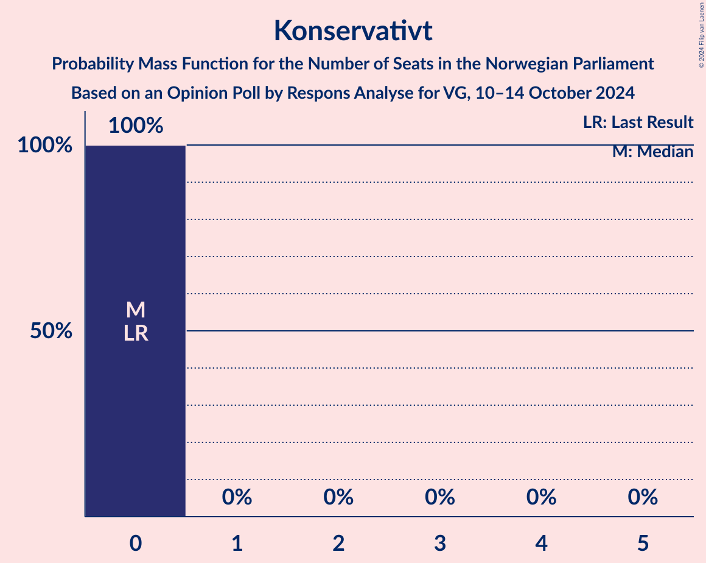

# Opinion Poll by Respons Analyse for VG, 10–14 October 2024

<a href="#voting-intentions">Voting Intentions</a> | <a href="#seats">Seats</a> | <a href="#coalitions">Coalitions</a> | <a href="#technical-information">Technical Information</a>

## Voting Intentions

### Confidence Intervals

| Party | Last Result | Poll Result | 80% Confidence Interval | 90% Confidence Interval | 95% Confidence Interval | 99% Confidence Interval |
|:-----:|:-----------:|:-----------:|:-----------------------:|:-----------------------:|:-----------------------:|:-----------------------:|
| Høyre | 20.4% | 25.7% | 24.0–27.5% |23.5–28.1% |23.1–28.5% |22.3–29.4% |
| Arbeiderpartiet | 26.2% | 20.7% | 19.1–22.4% |18.7–22.9% |18.3–23.3% |17.6–24.2% |
| Fremskrittspartiet | 11.6% | 19.2% | 17.7–20.9% |17.2–21.4% |16.9–21.8% |16.2–22.6% |
| Sosialistisk Venstreparti | 7.6% | 8.3% | 7.3–9.5% |7.0–9.9% |6.7–10.2% |6.3–10.8% |
| Venstre | 4.6% | 6.3% | 5.4–7.4% |5.2–7.7% |5.0–8.0% |4.6–8.6% |
| Senterpartiet | 13.5% | 5.3% | 4.5–6.3% |4.3–6.6% |4.1–6.9% |3.7–7.4% |
| Rødt | 4.7% | 4.7% | 3.9–5.7% |3.7–6.0% |3.6–6.2% |3.2–6.7% |
| Miljøpartiet De Grønne | 3.9% | 3.5% | 2.9–4.4% |2.7–4.6% |2.5–4.8% |2.2–5.3% |
| Kristelig Folkeparti | 3.8% | 3.5% | 2.9–4.4% |2.7–4.6% |2.5–4.8% |2.2–5.3% |
| Industri- og Næringspartiet | 0.3% | 1.4% | 1.0–2.0% |0.9–2.2% |0.8–2.3% |0.7–2.7% |
| Norgesdemokratene | 1.1% | 0.5% | 0.3–0.9% |0.3–1.1% |0.2–1.2% |0.2–1.4% |
| Konservativt | 0.4% | 0.4% | 0.2–0.8% |0.2–0.9% |0.2–1.0% |0.1–1.3% |
| Pensjonistpartiet | 0.6% | 0.1% | 0.0–0.4% |0.0–0.5% |0.0–0.6% |0.0–0.7% |

*Note:* The poll result column reflects the actual value used in the calculations. Published results may vary slightly, and in addition be rounded to fewer digits.

## Seats

### Confidence Intervals

| Party | Last Result | Median | 80% Confidence Interval | 90% Confidence Interval | 95% Confidence Interval | 99% Confidence Interval |
|:-----:|:-----------:|:------:|:-----------------------:|:-----------------------:|:-----------------------:|:-----------------------:|
| <a href="#høyre">Høyre</a> | 36 | 44 | 41–48 |41–49 |41–51 |39–52 |
| <a href="#arbeiderpartiet">Arbeiderpartiet</a> | 48 | 40 | 36–46 |35–47 |34–47 |32–48 |
| <a href="#fremskrittspartiet">Fremskrittspartiet</a> | 21 | 35 | 34–39 |33–40 |32–40 |30–41 |
| <a href="#sosialistisk-venstreparti">Sosialistisk Venstreparti</a> | 13 | 12 | 11–17 |11–17 |10–18 |10–19 |
| <a href="#venstre">Venstre</a> | 8 | 11 | 9–13 |8–13 |8–14 |7–15 |
| <a href="#senterpartiet">Senterpartiet</a> | 28 | 9 | 8–11 |7–11 |6–12 |0–13 |
| <a href="#rødt">Rødt</a> | 8 | 7 | 1–9 |1–10 |1–10 |1–11 |
| <a href="#miljøpartiet-de-grønne">Miljøpartiet De Grønne</a> | 3 | 2 | 1–7 |1–8 |1–9 |1–9 |
| <a href="#kristelig-folkeparti">Kristelig Folkeparti</a> | 3 | 7 | 1–7 |1–7 |1–7 |1–8 |
| <a href="#industri--og-næringspartiet">Industri- og Næringspartiet</a> | 0 | 0 | 0 |0 |0–2 |0–2 |
| <a href="#norgesdemokratene">Norgesdemokratene</a> | 0 | 0 | 0 |0 |0 |0 |
| <a href="#konservativt">Konservativt</a> | 0 | 0 | 0 |0 |0 |0 |
| <a href="#pensjonistpartiet">Pensjonistpartiet</a> | 0 | 0 | 0 |0 |0 |0 |

### Høyre

*For a full overview of the results for this party, see the [Høyre](party-høyre.html) page.*

| Number of Seats | Probability | Accumulated | Special Marks |
|:---------------:|:-----------:|:-----------:|:-------------:|
| 36 | 0% | 100% | Last Result |
| 37 | 0.1% | 100% |  |
| 38 | 0.1% | 99.9% |  |
| 39 | 0.4% | 99.9% |  |
| 40 | 1.4% | 99.5% |  |
| 41 | 10% | 98% |  |
| 42 | 1.0% | 88% |  |
| 43 | 4% | 87% |  |
| 44 | 42% | 83% | Median |
| 45 | 10% | 41% |  |
| 46 | 12% | 31% |  |
| 47 | 6% | 19% |  |
| 48 | 7% | 14% |  |
| 49 | 2% | 6% |  |
| 50 | 1.1% | 4% |  |
| 51 | 1.1% | 3% |  |
| 52 | 1.4% | 2% |  |
| 53 | 0.1% | 0.2% |  |
| 54 | 0.1% | 0.1% |  |
| 55 | 0% | 0.1% |  |
| 56 | 0.1% | 0.1% |  |
| 57 | 0% | 0% |  |

### Arbeiderpartiet

*For a full overview of the results for this party, see the [Arbeiderpartiet](party-arbeiderpartiet.html) page.*

| Number of Seats | Probability | Accumulated | Special Marks |
|:---------------:|:-----------:|:-----------:|:-------------:|
| 30 | 0.1% | 100% |  |
| 31 | 0.1% | 99.9% |  |
| 32 | 2% | 99.9% |  |
| 33 | 0.3% | 98% |  |
| 34 | 0.5% | 98% |  |
| 35 | 3% | 97% |  |
| 36 | 8% | 94% |  |
| 37 | 9% | 86% |  |
| 38 | 14% | 77% |  |
| 39 | 0.9% | 63% |  |
| 40 | 39% | 62% | Median |
| 41 | 2% | 23% |  |
| 42 | 2% | 21% |  |
| 43 | 2% | 19% |  |
| 44 | 1.5% | 17% |  |
| 45 | 0.2% | 15% |  |
| 46 | 9% | 15% |  |
| 47 | 5% | 6% |  |
| 48 | 0.6% | 0.6% | Last Result |
| 49 | 0% | 0% |  |

### Fremskrittspartiet

*For a full overview of the results for this party, see the [Fremskrittspartiet](party-fremskrittspartiet.html) page.*

| Number of Seats | Probability | Accumulated | Special Marks |
|:---------------:|:-----------:|:-----------:|:-------------:|
| 21 | 0% | 100% | Last Result |
| 22 | 0% | 100% |  |
| 23 | 0% | 100% |  |
| 24 | 0% | 100% |  |
| 25 | 0% | 100% |  |
| 26 | 0% | 100% |  |
| 27 | 0% | 100% |  |
| 28 | 0% | 100% |  |
| 29 | 0.4% | 100% |  |
| 30 | 0.3% | 99.5% |  |
| 31 | 0.6% | 99.2% |  |
| 32 | 2% | 98.6% |  |
| 33 | 4% | 97% |  |
| 34 | 35% | 93% |  |
| 35 | 11% | 58% | Median |
| 36 | 11% | 47% |  |
| 37 | 14% | 36% |  |
| 38 | 5% | 22% |  |
| 39 | 12% | 17% |  |
| 40 | 3% | 5% |  |
| 41 | 1.4% | 2% |  |
| 42 | 0.2% | 0.4% |  |
| 43 | 0.1% | 0.2% |  |
| 44 | 0.1% | 0.1% |  |
| 45 | 0% | 0% |  |

### Sosialistisk Venstreparti

*For a full overview of the results for this party, see the [Sosialistisk Venstreparti](party-sosialistiskvenstreparti.html) page.*

| Number of Seats | Probability | Accumulated | Special Marks |
|:---------------:|:-----------:|:-----------:|:-------------:|
| 9 | 0.2% | 100% |  |
| 10 | 3% | 99.8% |  |
| 11 | 12% | 97% |  |
| 12 | 37% | 85% | Median |
| 13 | 25% | 48% | Last Result |
| 14 | 3% | 23% |  |
| 15 | 6% | 21% |  |
| 16 | 3% | 15% |  |
| 17 | 8% | 11% |  |
| 18 | 3% | 4% |  |
| 19 | 0.8% | 0.8% |  |
| 20 | 0% | 0.1% |  |
| 21 | 0% | 0% |  |

### Venstre

*For a full overview of the results for this party, see the [Venstre](party-venstre.html) page.*

| Number of Seats | Probability | Accumulated | Special Marks |
|:---------------:|:-----------:|:-----------:|:-------------:|
| 7 | 0.6% | 100% |  |
| 8 | 5% | 99.4% | Last Result |
| 9 | 13% | 95% |  |
| 10 | 18% | 81% |  |
| 11 | 19% | 63% | Median |
| 12 | 5% | 44% |  |
| 13 | 36% | 39% |  |
| 14 | 1.4% | 3% |  |
| 15 | 1.3% | 1.4% |  |
| 16 | 0.1% | 0.1% |  |
| 17 | 0% | 0% |  |

### Senterpartiet

*For a full overview of the results for this party, see the [Senterpartiet](party-senterpartiet.html) page.*

| Number of Seats | Probability | Accumulated | Special Marks |
|:---------------:|:-----------:|:-----------:|:-------------:|
| 0 | 0.7% | 100% |  |
| 1 | 2% | 99.3% |  |
| 2 | 0.1% | 98% |  |
| 3 | 0% | 98% |  |
| 4 | 0% | 98% |  |
| 5 | 0% | 98% |  |
| 6 | 0.3% | 98% |  |
| 7 | 3% | 97% |  |
| 8 | 27% | 94% |  |
| 9 | 47% | 67% | Median |
| 10 | 10% | 21% |  |
| 11 | 6% | 11% |  |
| 12 | 3% | 4% |  |
| 13 | 0.6% | 1.1% |  |
| 14 | 0.3% | 0.5% |  |
| 15 | 0.2% | 0.2% |  |
| 16 | 0% | 0% |  |
| 17 | 0% | 0% |  |
| 18 | 0% | 0% |  |
| 19 | 0% | 0% |  |
| 20 | 0% | 0% |  |
| 21 | 0% | 0% |  |
| 22 | 0% | 0% |  |
| 23 | 0% | 0% |  |
| 24 | 0% | 0% |  |
| 25 | 0% | 0% |  |
| 26 | 0% | 0% |  |
| 27 | 0% | 0% |  |
| 28 | 0% | 0% | Last Result |

### Rødt

*For a full overview of the results for this party, see the [Rødt](party-rødt.html) page.*

| Number of Seats | Probability | Accumulated | Special Marks |
|:---------------:|:-----------:|:-----------:|:-------------:|
| 1 | 13% | 100% |  |
| 2 | 0% | 87% |  |
| 3 | 0% | 87% |  |
| 4 | 0% | 87% |  |
| 5 | 0% | 87% |  |
| 6 | 1.4% | 87% |  |
| 7 | 50% | 86% | Median |
| 8 | 12% | 36% | Last Result |
| 9 | 18% | 24% |  |
| 10 | 3% | 6% |  |
| 11 | 2% | 2% |  |
| 12 | 0% | 0.1% |  |
| 13 | 0.1% | 0.1% |  |
| 14 | 0% | 0% |  |

### Miljøpartiet De Grønne

*For a full overview of the results for this party, see the [Miljøpartiet De Grønne](party-miljøpartietdegrønne.html) page.*

| Number of Seats | Probability | Accumulated | Special Marks |
|:---------------:|:-----------:|:-----------:|:-------------:|
| 1 | 31% | 100% |  |
| 2 | 52% | 69% | Median |
| 3 | 2% | 16% | Last Result |
| 4 | 0% | 15% |  |
| 5 | 0% | 15% |  |
| 6 | 2% | 15% |  |
| 7 | 3% | 13% |  |
| 8 | 6% | 9% |  |
| 9 | 4% | 4% |  |
| 10 | 0% | 0% |  |

### Kristelig Folkeparti

*For a full overview of the results for this party, see the [Kristelig Folkeparti](party-kristeligfolkeparti.html) page.*

| Number of Seats | Probability | Accumulated | Special Marks |
|:---------------:|:-----------:|:-----------:|:-------------:|
| 1 | 10% | 100% |  |
| 2 | 12% | 90% |  |
| 3 | 17% | 78% | Last Result |
| 4 | 0% | 61% |  |
| 5 | 0% | 61% |  |
| 6 | 5% | 61% |  |
| 7 | 54% | 56% | Median |
| 8 | 1.3% | 2% |  |
| 9 | 0.1% | 0.5% |  |
| 10 | 0.4% | 0.4% |  |
| 11 | 0% | 0% |  |

### Industri- og Næringspartiet

*For a full overview of the results for this party, see the [Industri- og Næringspartiet](party-industri-ognæringspartiet.html) page.*

| Number of Seats | Probability | Accumulated | Special Marks |
|:---------------:|:-----------:|:-----------:|:-------------:|
| 0 | 97% | 100% | Last Result, Median |
| 1 | 0.5% | 3% |  |
| 2 | 3% | 3% |  |
| 3 | 0% | 0% |  |

### Norgesdemokratene

*For a full overview of the results for this party, see the [Norgesdemokratene](party-norgesdemokratene.html) page.*

| Number of Seats | Probability | Accumulated | Special Marks |
|:---------------:|:-----------:|:-----------:|:-------------:|
| 0 | 100% | 100% | Last Result, Median |

### Konservativt

*For a full overview of the results for this party, see the [Konservativt](party-konservativt.html) page.*

| Number of Seats | Probability | Accumulated | Special Marks |
|:---------------:|:-----------:|:-----------:|:-------------:|
| 0 | 100% | 100% | Last Result, Median |

### Pensjonistpartiet

*For a full overview of the results for this party, see the [Pensjonistpartiet](party-pensjonistpartiet.html) page.*

| Number of Seats | Probability | Accumulated | Special Marks |
|:---------------:|:-----------:|:-----------:|:-------------:|
| 0 | 100% | 100% | Last Result, Median |

## Coalitions

### Confidence Intervals

| Coalition | Last Result | Median | Majority? | 80% Confidence Interval | 90% Confidence Interval | 95% Confidence Interval | 99% Confidence Interval |
|:---------:|:-----------:|:------:|:---------:|:-----------------------:|:-----------------------:|:-----------------------:|:-----------------------:|
| Høyre – Fremskrittspartiet – Venstre – Senterpartiet – Kristelig Folkeparti | 96 | 107 | 100% | 101–109 | 100–109 | 99–111 | 94–113 |
| Høyre – Fremskrittspartiet – Venstre – Kristelig Folkeparti – Miljøpartiet De Grønne | 71 | 100 | 100% | 94–102 | 94–104 | 93–108 | 91–108 |
| Høyre – Fremskrittspartiet – Venstre – Kristelig Folkeparti | 68 | 98 | 100% | 91–101 | 89–101 | 89–101 | 86–103 |
| Høyre – Fremskrittspartiet – Venstre | 65 | 91 | 97% | 88–96 | 87–97 | 84–99 | 82–100 |
| Høyre – Fremskrittspartiet | 57 | 79 | 18% | 78–85 | 77–87 | 76–89 | 71–89 |
| Arbeiderpartiet – Sosialistisk Venstreparti – Senterpartiet – Rødt – Miljøpartiet De Grønne | 100 | 70 | 0% | 67–78 | 67–79 | 67–80 | 65–83 |
| Arbeiderpartiet – Sosialistisk Venstreparti – Senterpartiet – Kristelig Folkeparti – Miljøpartiet De Grønne | 95 | 70 | 0% | 65–72 | 63–76 | 62–76 | 58–79 |
| Arbeiderpartiet – Sosialistisk Venstreparti – Senterpartiet – Rødt | 97 | 68 | 0% | 66–75 | 64–75 | 60–76 | 60–77 |
| Arbeiderpartiet – Sosialistisk Venstreparti – Senterpartiet – Miljøpartiet De Grønne | 92 | 63 | 0% | 58–70 | 58–70 | 58–74 | 56–77 |
| Arbeiderpartiet – Sosialistisk Venstreparti – Rødt – Miljøpartiet De Grønne | 72 | 61 | 0% | 59–68 | 59–68 | 57–69 | 55–75 |
| Arbeiderpartiet – Sosialistisk Venstreparti – Senterpartiet | 89 | 61 | 0% | 57–68 | 57–68 | 56–68 | 54–72 |
| Høyre – Venstre – Kristelig Folkeparti | 47 | 63 | 0% | 55–64 | 52–64 | 52–65 | 51–67 |
| Arbeiderpartiet – Senterpartiet – Kristelig Folkeparti – Miljøpartiet De Grønne | 82 | 58 | 0% | 52–59 | 49–63 | 45–64 | 41–64 |
| Arbeiderpartiet – Senterpartiet – Kristelig Folkeparti | 79 | 56 | 0% | 48–58 | 47–58 | 43–61 | 39–62 |
| Arbeiderpartiet – Sosialistisk Venstreparti | 61 | 52 | 0% | 49–59 | 49–59 | 47–60 | 47–63 |
| Arbeiderpartiet – Senterpartiet | 76 | 49 | 0% | 45–55 | 43–55 | 42–55 | 37–56 |
| Venstre – Senterpartiet – Kristelig Folkeparti | 39 | 26 | 0% | 21–29 | 19–29 | 18–29 | 13–32 |

### Høyre – Fremskrittspartiet – Venstre – Senterpartiet – Kristelig Folkeparti

| Number of Seats | Probability | Accumulated | Special Marks |
|:---------------:|:-----------:|:-----------:|:-------------:|
| 94 | 2% | 100% |  |
| 95 | 0% | 98% |  |
| 96 | 0.1% | 98% | Last Result |
| 97 | 0.1% | 98% |  |
| 98 | 0.2% | 98% |  |
| 99 | 1.2% | 98% |  |
| 100 | 6% | 96% |  |
| 101 | 2% | 91% |  |
| 102 | 12% | 88% |  |
| 103 | 1.2% | 76% |  |
| 104 | 3% | 75% |  |
| 105 | 5% | 72% |  |
| 106 | 3% | 67% | Median |
| 107 | 41% | 65% |  |
| 108 | 8% | 24% |  |
| 109 | 12% | 16% |  |
| 110 | 0.9% | 4% |  |
| 111 | 3% | 3% |  |
| 112 | 0.1% | 0.8% |  |
| 113 | 0.2% | 0.7% |  |
| 114 | 0.4% | 0.5% |  |
| 115 | 0% | 0% |  |

### Høyre – Fremskrittspartiet – Venstre – Kristelig Folkeparti – Miljøpartiet De Grønne

| Number of Seats | Probability | Accumulated | Special Marks |
|:---------------:|:-----------:|:-----------:|:-------------:|
| 71 | 0% | 100% | Last Result |
| 72 | 0% | 100% |  |
| 73 | 0% | 100% |  |
| 74 | 0% | 100% |  |
| 75 | 0% | 100% |  |
| 76 | 0% | 100% |  |
| 77 | 0% | 100% |  |
| 78 | 0% | 100% |  |
| 79 | 0% | 100% |  |
| 80 | 0% | 100% |  |
| 81 | 0% | 100% |  |
| 82 | 0% | 100% |  |
| 83 | 0% | 100% |  |
| 84 | 0% | 100% |  |
| 85 | 0% | 100% | Majority |
| 86 | 0% | 100% |  |
| 87 | 0% | 100% |  |
| 88 | 0% | 100% |  |
| 89 | 0% | 100% |  |
| 90 | 0.1% | 100% |  |
| 91 | 1.0% | 99.9% |  |
| 92 | 0.1% | 98.9% |  |
| 93 | 3% | 98.8% |  |
| 94 | 10% | 96% |  |
| 95 | 2% | 86% |  |
| 96 | 1.5% | 84% |  |
| 97 | 8% | 83% |  |
| 98 | 4% | 75% |  |
| 99 | 4% | 71% | Median |
| 100 | 40% | 67% |  |
| 101 | 4% | 28% |  |
| 102 | 14% | 24% |  |
| 103 | 4% | 9% |  |
| 104 | 2% | 5% |  |
| 105 | 0.1% | 4% |  |
| 106 | 0.7% | 4% |  |
| 107 | 0.2% | 3% |  |
| 108 | 2% | 3% |  |
| 109 | 0.1% | 0.3% |  |
| 110 | 0% | 0.1% |  |
| 111 | 0% | 0.1% |  |
| 112 | 0.1% | 0.1% |  |
| 113 | 0% | 0% |  |

### Høyre – Fremskrittspartiet – Venstre – Kristelig Folkeparti

| Number of Seats | Probability | Accumulated | Special Marks |
|:---------------:|:-----------:|:-----------:|:-------------:|
| 68 | 0% | 100% | Last Result |
| 69 | 0% | 100% |  |
| 70 | 0% | 100% |  |
| 71 | 0% | 100% |  |
| 72 | 0% | 100% |  |
| 73 | 0% | 100% |  |
| 74 | 0% | 100% |  |
| 75 | 0% | 100% |  |
| 76 | 0% | 100% |  |
| 77 | 0% | 100% |  |
| 78 | 0% | 100% |  |
| 79 | 0% | 100% |  |
| 80 | 0% | 100% |  |
| 81 | 0% | 100% |  |
| 82 | 0% | 100% |  |
| 83 | 0% | 100% |  |
| 84 | 0% | 100% |  |
| 85 | 0% | 100% | Majority |
| 86 | 2% | 99.9% |  |
| 87 | 0% | 98% |  |
| 88 | 0.1% | 98% |  |
| 89 | 6% | 98% |  |
| 90 | 0.7% | 91% |  |
| 91 | 1.2% | 91% |  |
| 92 | 0.8% | 89% |  |
| 93 | 11% | 89% |  |
| 94 | 2% | 78% |  |
| 95 | 0.6% | 76% |  |
| 96 | 2% | 75% |  |
| 97 | 6% | 73% | Median |
| 98 | 38% | 67% |  |
| 99 | 10% | 28% |  |
| 100 | 6% | 19% |  |
| 101 | 11% | 12% |  |
| 102 | 0.9% | 2% |  |
| 103 | 0.4% | 0.8% |  |
| 104 | 0% | 0.5% |  |
| 105 | 0.1% | 0.4% |  |
| 106 | 0.2% | 0.3% |  |
| 107 | 0% | 0.1% |  |
| 108 | 0% | 0.1% |  |
| 109 | 0.1% | 0.1% |  |
| 110 | 0% | 0% |  |

### Høyre – Fremskrittspartiet – Venstre

| Number of Seats | Probability | Accumulated | Special Marks |
|:---------------:|:-----------:|:-----------:|:-------------:|
| 65 | 0% | 100% | Last Result |
| 66 | 0% | 100% |  |
| 67 | 0% | 100% |  |
| 68 | 0% | 100% |  |
| 69 | 0% | 100% |  |
| 70 | 0% | 100% |  |
| 71 | 0% | 100% |  |
| 72 | 0% | 100% |  |
| 73 | 0% | 100% |  |
| 74 | 0% | 100% |  |
| 75 | 0% | 100% |  |
| 76 | 0% | 100% |  |
| 77 | 0% | 100% |  |
| 78 | 0% | 100% |  |
| 79 | 0% | 100% |  |
| 80 | 0% | 100% |  |
| 81 | 0.2% | 100% |  |
| 82 | 0.3% | 99.8% |  |
| 83 | 0.1% | 99.4% |  |
| 84 | 2% | 99.3% |  |
| 85 | 0.8% | 97% | Majority |
| 86 | 1.1% | 97% |  |
| 87 | 2% | 95% |  |
| 88 | 6% | 93% |  |
| 89 | 0.5% | 87% |  |
| 90 | 13% | 86% | Median |
| 91 | 35% | 73% |  |
| 92 | 3% | 38% |  |
| 93 | 6% | 35% |  |
| 94 | 11% | 29% |  |
| 95 | 3% | 18% |  |
| 96 | 9% | 15% |  |
| 97 | 2% | 6% |  |
| 98 | 1.4% | 4% |  |
| 99 | 2% | 3% |  |
| 100 | 0.4% | 0.6% |  |
| 101 | 0% | 0.2% |  |
| 102 | 0.1% | 0.2% |  |
| 103 | 0% | 0% |  |

### Høyre – Fremskrittspartiet

| Number of Seats | Probability | Accumulated | Special Marks |
|:---------------:|:-----------:|:-----------:|:-------------:|
| 57 | 0% | 100% | Last Result |
| 58 | 0% | 100% |  |
| 59 | 0% | 100% |  |
| 60 | 0% | 100% |  |
| 61 | 0% | 100% |  |
| 62 | 0% | 100% |  |
| 63 | 0% | 100% |  |
| 64 | 0% | 100% |  |
| 65 | 0% | 100% |  |
| 66 | 0% | 100% |  |
| 67 | 0% | 100% |  |
| 68 | 0% | 100% |  |
| 69 | 0% | 100% |  |
| 70 | 0.4% | 100% |  |
| 71 | 0.2% | 99.6% |  |
| 72 | 0% | 99.4% |  |
| 73 | 0.1% | 99.4% |  |
| 74 | 1.1% | 99.3% |  |
| 75 | 0.6% | 98% |  |
| 76 | 2% | 98% |  |
| 77 | 1.2% | 95% |  |
| 78 | 40% | 94% |  |
| 79 | 9% | 54% | Median |
| 80 | 5% | 45% |  |
| 81 | 6% | 40% |  |
| 82 | 7% | 35% |  |
| 83 | 3% | 28% |  |
| 84 | 6% | 25% |  |
| 85 | 9% | 18% | Majority |
| 86 | 4% | 10% |  |
| 87 | 2% | 5% |  |
| 88 | 0.5% | 4% |  |
| 89 | 3% | 3% |  |
| 90 | 0.1% | 0.3% |  |
| 91 | 0.1% | 0.3% |  |
| 92 | 0.1% | 0.1% |  |
| 93 | 0% | 0% |  |

### Arbeiderpartiet – Sosialistisk Venstreparti – Senterpartiet – Rødt – Miljøpartiet De Grønne

| Number of Seats | Probability | Accumulated | Special Marks |
|:---------------:|:-----------:|:-----------:|:-------------:|
| 59 | 0.1% | 100% |  |
| 60 | 0% | 99.9% |  |
| 61 | 0% | 99.9% |  |
| 62 | 0.2% | 99.9% |  |
| 63 | 0.1% | 99.7% |  |
| 64 | 0% | 99.6% |  |
| 65 | 0.7% | 99.5% |  |
| 66 | 0.7% | 98.8% |  |
| 67 | 11% | 98% |  |
| 68 | 6% | 87% |  |
| 69 | 9% | 81% |  |
| 70 | 42% | 73% | Median |
| 71 | 4% | 31% |  |
| 72 | 2% | 27% |  |
| 73 | 0.6% | 25% |  |
| 74 | 1.4% | 24% |  |
| 75 | 2% | 23% |  |
| 76 | 10% | 20% |  |
| 77 | 0.2% | 11% |  |
| 78 | 2% | 10% |  |
| 79 | 6% | 9% |  |
| 80 | 0.5% | 3% |  |
| 81 | 0.1% | 2% |  |
| 82 | 0% | 2% |  |
| 83 | 2% | 2% |  |
| 84 | 0% | 0% |  |
| 85 | 0% | 0% | Majority |
| 86 | 0% | 0% |  |
| 87 | 0% | 0% |  |
| 88 | 0% | 0% |  |
| 89 | 0% | 0% |  |
| 90 | 0% | 0% |  |
| 91 | 0% | 0% |  |
| 92 | 0% | 0% |  |
| 93 | 0% | 0% |  |
| 94 | 0% | 0% |  |
| 95 | 0% | 0% |  |
| 96 | 0% | 0% |  |
| 97 | 0% | 0% |  |
| 98 | 0% | 0% |  |
| 99 | 0% | 0% |  |
| 100 | 0% | 0% | Last Result |

### Arbeiderpartiet – Sosialistisk Venstreparti – Senterpartiet – Kristelig Folkeparti – Miljøpartiet De Grønne

| Number of Seats | Probability | Accumulated | Special Marks |
|:---------------:|:-----------:|:-----------:|:-------------:|
| 58 | 2% | 100% |  |
| 59 | 0.1% | 98% |  |
| 60 | 0.1% | 98% |  |
| 61 | 0.4% | 98% |  |
| 62 | 3% | 98% |  |
| 63 | 2% | 95% |  |
| 64 | 0.1% | 94% |  |
| 65 | 11% | 94% |  |
| 66 | 0.6% | 83% |  |
| 67 | 8% | 82% |  |
| 68 | 1.1% | 74% |  |
| 69 | 5% | 73% |  |
| 70 | 35% | 68% | Median |
| 71 | 11% | 33% |  |
| 72 | 13% | 22% |  |
| 73 | 0.7% | 9% |  |
| 74 | 1.1% | 9% |  |
| 75 | 2% | 7% |  |
| 76 | 3% | 5% |  |
| 77 | 0.3% | 2% |  |
| 78 | 1.4% | 2% |  |
| 79 | 0.2% | 0.7% |  |
| 80 | 0% | 0.4% |  |
| 81 | 0.4% | 0.4% |  |
| 82 | 0% | 0% |  |
| 83 | 0% | 0% |  |
| 84 | 0% | 0% |  |
| 85 | 0% | 0% | Majority |
| 86 | 0% | 0% |  |
| 87 | 0% | 0% |  |
| 88 | 0% | 0% |  |
| 89 | 0% | 0% |  |
| 90 | 0% | 0% |  |
| 91 | 0% | 0% |  |
| 92 | 0% | 0% |  |
| 93 | 0% | 0% |  |
| 94 | 0% | 0% |  |
| 95 | 0% | 0% | Last Result |

### Arbeiderpartiet – Sosialistisk Venstreparti – Senterpartiet – Rødt

| Number of Seats | Probability | Accumulated | Special Marks |
|:---------------:|:-----------:|:-----------:|:-------------:|
| 56 | 0.1% | 100% |  |
| 57 | 0% | 99.9% |  |
| 58 | 0% | 99.9% |  |
| 59 | 0.1% | 99.9% |  |
| 60 | 2% | 99.7% |  |
| 61 | 0.2% | 97% |  |
| 62 | 0.7% | 97% |  |
| 63 | 0.5% | 96% |  |
| 64 | 1.3% | 96% |  |
| 65 | 4% | 95% |  |
| 66 | 14% | 90% |  |
| 67 | 4% | 76% |  |
| 68 | 38% | 72% | Median |
| 69 | 9% | 35% |  |
| 70 | 1.3% | 26% |  |
| 71 | 8% | 25% |  |
| 72 | 1.2% | 17% |  |
| 73 | 0.4% | 16% |  |
| 74 | 4% | 15% |  |
| 75 | 8% | 11% |  |
| 76 | 2% | 3% |  |
| 77 | 0.6% | 1.1% |  |
| 78 | 0.5% | 0.5% |  |
| 79 | 0% | 0% |  |
| 80 | 0% | 0% |  |
| 81 | 0% | 0% |  |
| 82 | 0% | 0% |  |
| 83 | 0% | 0% |  |
| 84 | 0% | 0% |  |
| 85 | 0% | 0% | Majority |
| 86 | 0% | 0% |  |
| 87 | 0% | 0% |  |
| 88 | 0% | 0% |  |
| 89 | 0% | 0% |  |
| 90 | 0% | 0% |  |
| 91 | 0% | 0% |  |
| 92 | 0% | 0% |  |
| 93 | 0% | 0% |  |
| 94 | 0% | 0% |  |
| 95 | 0% | 0% |  |
| 96 | 0% | 0% |  |
| 97 | 0% | 0% | Last Result |

### Arbeiderpartiet – Sosialistisk Venstreparti – Senterpartiet – Miljøpartiet De Grønne

| Number of Seats | Probability | Accumulated | Special Marks |
|:---------------:|:-----------:|:-----------:|:-------------:|
| 51 | 0.1% | 100% |  |
| 52 | 0% | 99.9% |  |
| 53 | 0% | 99.9% |  |
| 54 | 0% | 99.9% |  |
| 55 | 0% | 99.9% |  |
| 56 | 2% | 99.9% |  |
| 57 | 0% | 98% |  |
| 58 | 9% | 98% |  |
| 59 | 0.8% | 90% |  |
| 60 | 7% | 89% |  |
| 61 | 3% | 81% |  |
| 62 | 3% | 78% |  |
| 63 | 37% | 75% | Median |
| 64 | 3% | 38% |  |
| 65 | 2% | 35% |  |
| 66 | 0.7% | 33% |  |
| 67 | 2% | 32% |  |
| 68 | 5% | 30% |  |
| 69 | 15% | 26% |  |
| 70 | 6% | 11% |  |
| 71 | 0.7% | 5% |  |
| 72 | 0.3% | 4% |  |
| 73 | 0.1% | 4% |  |
| 74 | 2% | 4% |  |
| 75 | 0.1% | 2% |  |
| 76 | 0% | 1.5% |  |
| 77 | 1.0% | 1.4% |  |
| 78 | 0% | 0.4% |  |
| 79 | 0.4% | 0.4% |  |
| 80 | 0% | 0% |  |
| 81 | 0% | 0% |  |
| 82 | 0% | 0% |  |
| 83 | 0% | 0% |  |
| 84 | 0% | 0% |  |
| 85 | 0% | 0% | Majority |
| 86 | 0% | 0% |  |
| 87 | 0% | 0% |  |
| 88 | 0% | 0% |  |
| 89 | 0% | 0% |  |
| 90 | 0% | 0% |  |
| 91 | 0% | 0% |  |
| 92 | 0% | 0% | Last Result |

### Arbeiderpartiet – Sosialistisk Venstreparti – Rødt – Miljøpartiet De Grønne

| Number of Seats | Probability | Accumulated | Special Marks |
|:---------------:|:-----------:|:-----------:|:-------------:|
| 54 | 0.4% | 100% |  |
| 55 | 0.2% | 99.5% |  |
| 56 | 0.1% | 99.3% |  |
| 57 | 3% | 99.2% |  |
| 58 | 0.6% | 96% |  |
| 59 | 14% | 96% |  |
| 60 | 8% | 81% |  |
| 61 | 35% | 74% | Median |
| 62 | 6% | 39% |  |
| 63 | 5% | 33% |  |
| 64 | 3% | 28% |  |
| 65 | 1.0% | 25% |  |
| 66 | 3% | 24% |  |
| 67 | 10% | 21% |  |
| 68 | 7% | 11% |  |
| 69 | 1.2% | 4% |  |
| 70 | 0.2% | 2% |  |
| 71 | 0.1% | 2% |  |
| 72 | 0% | 2% | Last Result |
| 73 | 0% | 2% |  |
| 74 | 0% | 2% |  |
| 75 | 2% | 2% |  |
| 76 | 0% | 0% |  |

### Arbeiderpartiet – Sosialistisk Venstreparti – Senterpartiet

| Number of Seats | Probability | Accumulated | Special Marks |
|:---------------:|:-----------:|:-----------:|:-------------:|
| 48 | 0.1% | 100% |  |
| 49 | 0% | 99.9% |  |
| 50 | 0% | 99.9% |  |
| 51 | 0% | 99.9% |  |
| 52 | 0% | 99.8% |  |
| 53 | 0.1% | 99.8% |  |
| 54 | 2% | 99.7% |  |
| 55 | 0.2% | 98% |  |
| 56 | 0.2% | 98% |  |
| 57 | 9% | 97% |  |
| 58 | 9% | 88% |  |
| 59 | 5% | 79% |  |
| 60 | 1.2% | 74% |  |
| 61 | 38% | 73% | Median |
| 62 | 8% | 35% |  |
| 63 | 1.2% | 27% |  |
| 64 | 2% | 26% |  |
| 65 | 1.1% | 24% |  |
| 66 | 3% | 23% |  |
| 67 | 5% | 20% |  |
| 68 | 14% | 15% |  |
| 69 | 0.7% | 1.5% |  |
| 70 | 0% | 0.8% |  |
| 71 | 0% | 0.8% |  |
| 72 | 0.2% | 0.7% |  |
| 73 | 0.1% | 0.5% |  |
| 74 | 0% | 0.4% |  |
| 75 | 0% | 0.4% |  |
| 76 | 0% | 0.4% |  |
| 77 | 0.4% | 0.4% |  |
| 78 | 0% | 0% |  |
| 79 | 0% | 0% |  |
| 80 | 0% | 0% |  |
| 81 | 0% | 0% |  |
| 82 | 0% | 0% |  |
| 83 | 0% | 0% |  |
| 84 | 0% | 0% |  |
| 85 | 0% | 0% | Majority |
| 86 | 0% | 0% |  |
| 87 | 0% | 0% |  |
| 88 | 0% | 0% |  |
| 89 | 0% | 0% | Last Result |

### Høyre – Venstre – Kristelig Folkeparti

| Number of Seats | Probability | Accumulated | Special Marks |
|:---------------:|:-----------:|:-----------:|:-------------:|
| 47 | 0% | 100% | Last Result |
| 48 | 0% | 100% |  |
| 49 | 0.1% | 100% |  |
| 50 | 0% | 99.9% |  |
| 51 | 2% | 99.9% |  |
| 52 | 5% | 98% |  |
| 53 | 0.1% | 93% |  |
| 54 | 2% | 93% |  |
| 55 | 1.4% | 91% |  |
| 56 | 0.3% | 90% |  |
| 57 | 7% | 89% |  |
| 58 | 8% | 82% |  |
| 59 | 1.2% | 74% |  |
| 60 | 1.4% | 73% |  |
| 61 | 8% | 71% |  |
| 62 | 13% | 64% | Median |
| 63 | 12% | 51% |  |
| 64 | 36% | 39% |  |
| 65 | 1.4% | 3% |  |
| 66 | 0.7% | 1.4% |  |
| 67 | 0.3% | 0.7% |  |
| 68 | 0.2% | 0.3% |  |
| 69 | 0.1% | 0.1% |  |
| 70 | 0% | 0% |  |

### Arbeiderpartiet – Senterpartiet – Kristelig Folkeparti – Miljøpartiet De Grønne

| Number of Seats | Probability | Accumulated | Special Marks |
|:---------------:|:-----------:|:-----------:|:-------------:|
| 41 | 1.5% | 100% |  |
| 42 | 0% | 98% |  |
| 43 | 0% | 98% |  |
| 44 | 0% | 98% |  |
| 45 | 1.3% | 98% |  |
| 46 | 0.5% | 97% |  |
| 47 | 0.3% | 97% |  |
| 48 | 0.6% | 96% |  |
| 49 | 1.2% | 96% |  |
| 50 | 1.3% | 94% |  |
| 51 | 1.2% | 93% |  |
| 52 | 3% | 92% |  |
| 53 | 6% | 89% |  |
| 54 | 15% | 83% |  |
| 55 | 0.9% | 68% |  |
| 56 | 8% | 67% |  |
| 57 | 2% | 59% |  |
| 58 | 34% | 57% | Median |
| 59 | 14% | 23% |  |
| 60 | 0.9% | 10% |  |
| 61 | 2% | 9% |  |
| 62 | 0.7% | 7% |  |
| 63 | 3% | 6% |  |
| 64 | 3% | 4% |  |
| 65 | 0.3% | 0.3% |  |
| 66 | 0% | 0% |  |
| 67 | 0% | 0% |  |
| 68 | 0% | 0% |  |
| 69 | 0% | 0% |  |
| 70 | 0% | 0% |  |
| 71 | 0% | 0% |  |
| 72 | 0% | 0% |  |
| 73 | 0% | 0% |  |
| 74 | 0% | 0% |  |
| 75 | 0% | 0% |  |
| 76 | 0% | 0% |  |
| 77 | 0% | 0% |  |
| 78 | 0% | 0% |  |
| 79 | 0% | 0% |  |
| 80 | 0% | 0% |  |
| 81 | 0% | 0% |  |
| 82 | 0% | 0% | Last Result |

### Arbeiderpartiet – Senterpartiet – Kristelig Folkeparti

| Number of Seats | Probability | Accumulated | Special Marks |
|:---------------:|:-----------:|:-----------:|:-------------:|
| 39 | 2% | 100% |  |
| 40 | 0% | 98% |  |
| 41 | 0.4% | 98% |  |
| 42 | 0% | 98% |  |
| 43 | 1.5% | 98% |  |
| 44 | 0.1% | 97% |  |
| 45 | 0.7% | 97% |  |
| 46 | 0.4% | 96% |  |
| 47 | 0.8% | 95% |  |
| 48 | 6% | 95% |  |
| 49 | 2% | 88% |  |
| 50 | 3% | 86% |  |
| 51 | 7% | 83% |  |
| 52 | 9% | 77% |  |
| 53 | 9% | 68% |  |
| 54 | 0.8% | 59% |  |
| 55 | 6% | 58% |  |
| 56 | 37% | 52% | Median |
| 57 | 0.7% | 15% |  |
| 58 | 11% | 15% |  |
| 59 | 0.1% | 3% |  |
| 60 | 0.5% | 3% |  |
| 61 | 0.3% | 3% |  |
| 62 | 2% | 2% |  |
| 63 | 0.3% | 0.3% |  |
| 64 | 0% | 0% |  |
| 65 | 0% | 0% |  |
| 66 | 0% | 0% |  |
| 67 | 0% | 0% |  |
| 68 | 0% | 0% |  |
| 69 | 0% | 0% |  |
| 70 | 0% | 0% |  |
| 71 | 0% | 0% |  |
| 72 | 0% | 0% |  |
| 73 | 0% | 0% |  |
| 74 | 0% | 0% |  |
| 75 | 0% | 0% |  |
| 76 | 0% | 0% |  |
| 77 | 0% | 0% |  |
| 78 | 0% | 0% |  |
| 79 | 0% | 0% | Last Result |

### Arbeiderpartiet – Sosialistisk Venstreparti

| Number of Seats | Probability | Accumulated | Special Marks |
|:---------------:|:-----------:|:-----------:|:-------------:|
| 44 | 0.2% | 100% |  |
| 45 | 0% | 99.7% |  |
| 46 | 0.1% | 99.7% |  |
| 47 | 3% | 99.6% |  |
| 48 | 0.4% | 97% |  |
| 49 | 11% | 96% |  |
| 50 | 8% | 85% |  |
| 51 | 10% | 77% |  |
| 52 | 33% | 67% | Median |
| 53 | 6% | 34% |  |
| 54 | 2% | 28% |  |
| 55 | 3% | 26% |  |
| 56 | 3% | 23% |  |
| 57 | 0.7% | 20% |  |
| 58 | 4% | 20% |  |
| 59 | 11% | 16% |  |
| 60 | 4% | 5% |  |
| 61 | 0.1% | 0.8% | Last Result |
| 62 | 0% | 0.7% |  |
| 63 | 0.2% | 0.7% |  |
| 64 | 0% | 0.5% |  |
| 65 | 0.4% | 0.4% |  |
| 66 | 0% | 0% |  |

### Arbeiderpartiet – Senterpartiet

| Number of Seats | Probability | Accumulated | Special Marks |
|:---------------:|:-----------:|:-----------:|:-------------:|
| 36 | 0.1% | 100% |  |
| 37 | 2% | 99.8% |  |
| 38 | 0.1% | 98% |  |
| 39 | 0.4% | 98% |  |
| 40 | 0% | 98% |  |
| 41 | 0.1% | 98% |  |
| 42 | 2% | 98% |  |
| 43 | 1.2% | 96% |  |
| 44 | 0.7% | 95% |  |
| 45 | 9% | 94% |  |
| 46 | 10% | 85% |  |
| 47 | 10% | 76% |  |
| 48 | 7% | 66% |  |
| 49 | 36% | 59% | Median |
| 50 | 2% | 22% |  |
| 51 | 2% | 21% |  |
| 52 | 0.2% | 19% |  |
| 53 | 1.3% | 18% |  |
| 54 | 4% | 17% |  |
| 55 | 11% | 13% |  |
| 56 | 2% | 2% |  |
| 57 | 0% | 0.4% |  |
| 58 | 0% | 0.4% |  |
| 59 | 0% | 0.4% |  |
| 60 | 0.4% | 0.4% |  |
| 61 | 0% | 0% |  |
| 62 | 0% | 0% |  |
| 63 | 0% | 0% |  |
| 64 | 0% | 0% |  |
| 65 | 0% | 0% |  |
| 66 | 0% | 0% |  |
| 67 | 0% | 0% |  |
| 68 | 0% | 0% |  |
| 69 | 0% | 0% |  |
| 70 | 0% | 0% |  |
| 71 | 0% | 0% |  |
| 72 | 0% | 0% |  |
| 73 | 0% | 0% |  |
| 74 | 0% | 0% |  |
| 75 | 0% | 0% |  |
| 76 | 0% | 0% | Last Result |

### Venstre – Senterpartiet – Kristelig Folkeparti

| Number of Seats | Probability | Accumulated | Special Marks |
|:---------------:|:-----------:|:-----------:|:-------------:|
| 13 | 2% | 100% |  |
| 14 | 0% | 98% |  |
| 15 | 0.3% | 98% |  |
| 16 | 0% | 98% |  |
| 17 | 0.2% | 98% |  |
| 18 | 2% | 98% |  |
| 19 | 1.4% | 96% |  |
| 20 | 3% | 94% |  |
| 21 | 7% | 92% |  |
| 22 | 8% | 85% |  |
| 23 | 11% | 77% |  |
| 24 | 13% | 66% |  |
| 25 | 3% | 54% |  |
| 26 | 8% | 50% |  |
| 27 | 8% | 42% | Median |
| 28 | 0.3% | 34% |  |
| 29 | 33% | 34% |  |
| 30 | 0.1% | 1.1% |  |
| 31 | 0% | 1.0% |  |
| 32 | 0.6% | 1.0% |  |
| 33 | 0% | 0.4% |  |
| 34 | 0% | 0.4% |  |
| 35 | 0.4% | 0.4% |  |
| 36 | 0% | 0% |  |
| 37 | 0% | 0% |  |
| 38 | 0% | 0% |  |
| 39 | 0% | 0% | Last Result |

## Technical Information

### Opinion Poll

+ **Polling firm:** Respons Analyse
+ **Commissioner(s):** VG
+ **Fieldwork period:** 10–14 October 2024

### Calculations

+ **Sample size:** 1000
+ **Simulations done:** 1,048,576
+ **Error estimate:** 3.02%

