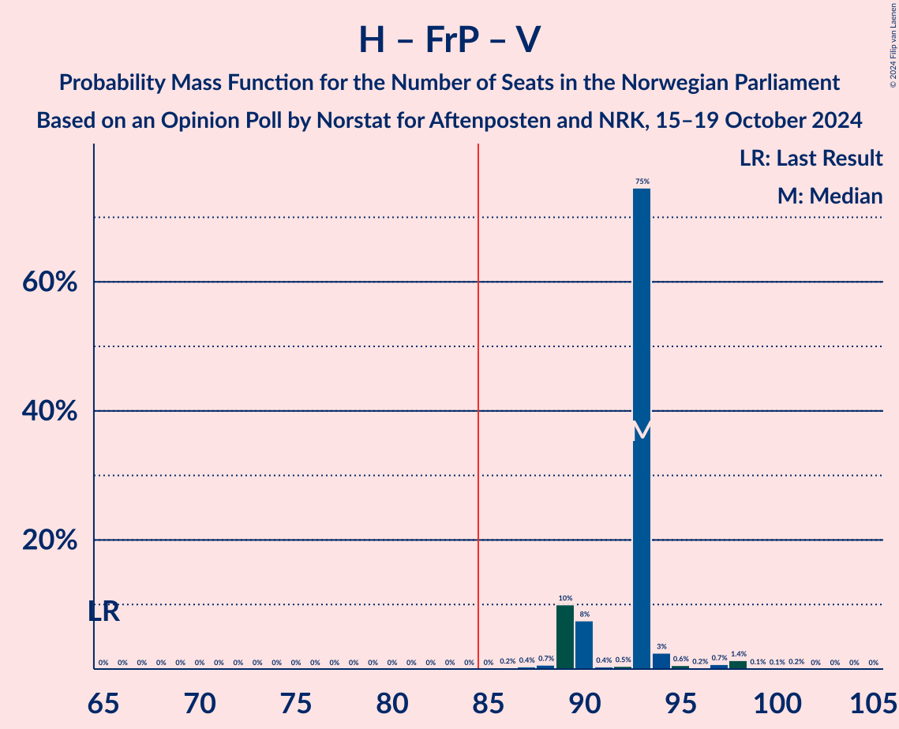

# Opinion Poll by Norstat for Aftenposten and NRK, 15–19 October 2024

<a href="#voting-intentions">Voting Intentions</a> | <a href="#seats">Seats</a> | <a href="#coalitions">Coalitions</a> | <a href="#technical-information">Technical Information</a>

## Voting Intentions

### Confidence Intervals

| Party | Last Result | Poll Result | 80% Confidence Interval | 90% Confidence Interval | 95% Confidence Interval | 99% Confidence Interval |
|:-----:|:-----------:|:-----------:|:-----------------------:|:-----------------------:|:-----------------------:|:-----------------------:|
| Høyre | 20.4% | 22.7% | 21.0–24.5% |20.6–25.0% |20.2–25.4% |19.4–26.3% |
| Fremskrittspartiet | 11.6% | 22.0% | 20.3–23.7% |19.9–24.2% |19.5–24.7% |18.7–25.5% |
| Arbeiderpartiet | 26.2% | 19.3% | 17.7–20.9% |17.3–21.4% |16.9–21.8% |16.2–22.7% |
| Sosialistisk Venstreparti | 7.6% | 9.0% | 7.9–10.2% |7.6–10.6% |7.3–10.9% |6.9–11.6% |
| Rødt | 4.7% | 6.1% | 5.3–7.2% |5.0–7.6% |4.8–7.8% |4.4–8.4% |
| Venstre | 4.6% | 5.9% | 5.1–7.0% |4.8–7.3% |4.6–7.6% |4.3–8.2% |
| Senterpartiet | 13.5% | 4.9% | 4.2–5.9% |3.9–6.2% |3.7–6.5% |3.4–7.0% |
| Miljøpartiet De Grønne | 3.9% | 3.5% | 2.9–4.4% |2.7–4.6% |2.5–4.9% |2.3–5.3% |
| Kristelig Folkeparti | 3.8% | 2.4% | 1.9–3.2% |1.8–3.4% |1.6–3.6% |1.4–4.0% |
| Industri- og Næringspartiet | 0.3% | 1.4% | 1.0–2.0% |0.9–2.2% |0.8–2.4% |0.7–2.7% |
| Konservativt | 0.4% | 0.8% | 0.5–1.3% |0.5–1.5% |0.4–1.6% |0.3–1.9% |
| Pensjonistpartiet | 0.6% | 0.5% | 0.3–0.9% |0.3–1.1% |0.2–1.2% |0.2–1.4% |
| Norgesdemokratene | 1.1% | 0.2% | 0.1–0.5% |0.1–0.6% |0.1–0.7% |0.0–0.9% |

*Note:* The poll result column reflects the actual value used in the calculations. Published results may vary slightly, and in addition be rounded to fewer digits.

## Seats

### Confidence Intervals

| Party | Last Result | Median | 80% Confidence Interval | 90% Confidence Interval | 95% Confidence Interval | 99% Confidence Interval |
|:-----:|:-----------:|:------:|:-----------------------:|:-----------------------:|:-----------------------:|:-----------------------:|
| <a href="#høyre">Høyre</a> | 36 | 40 | 38–41 |38–42 |37–44 |35–46 |
| <a href="#fremskrittspartiet">Fremskrittspartiet</a> | 21 | 42 | 41–42 |39–43 |38–43 |37–46 |
| <a href="#arbeiderpartiet">Arbeiderpartiet</a> | 48 | 34 | 34–37 |34–37 |34–38 |32–41 |
| <a href="#sosialistisk-venstreparti">Sosialistisk Venstreparti</a> | 13 | 18 | 15–18 |13–18 |13–18 |12–19 |
| <a href="#rødt">Rødt</a> | 8 | 10 | 10–13 |9–13 |9–13 |8–14 |
| <a href="#venstre">Venstre</a> | 8 | 11 | 10–11 |9–11 |9–13 |8–14 |
| <a href="#senterpartiet">Senterpartiet</a> | 28 | 9 | 8–10 |8–10 |7–12 |1–12 |
| <a href="#miljøpartiet-de-grønne">Miljøpartiet De Grønne</a> | 3 | 2 | 2–3 |2–7 |1–7 |1–9 |
| <a href="#kristelig-folkeparti">Kristelig Folkeparti</a> | 3 | 2 | 1–2 |0–2 |0–2 |0–3 |
| <a href="#industri--og-næringspartiet">Industri- og Næringspartiet</a> | 0 | 0 | 0 |0 |0 |0 |
| <a href="#konservativt">Konservativt</a> | 0 | 0 | 0 |0 |0 |0 |
| <a href="#pensjonistpartiet">Pensjonistpartiet</a> | 0 | 0 | 0 |0 |0 |0 |
| <a href="#norgesdemokratene">Norgesdemokratene</a> | 0 | 0 | 0 |0 |0 |0 |

### Høyre

*For a full overview of the results for this party, see the [Høyre](party-høyre.html) page.*

| Number of Seats | Probability | Accumulated | Special Marks |
|:---------------:|:-----------:|:-----------:|:-------------:|
| 33 | 0.1% | 100% |  |
| 34 | 0.2% | 99.9% |  |
| 35 | 0.4% | 99.7% |  |
| 36 | 0.3% | 99.3% | Last Result |
| 37 | 3% | 99.0% |  |
| 38 | 10% | 96% |  |
| 39 | 1.0% | 86% |  |
| 40 | 71% | 85% | Median |
| 41 | 6% | 15% |  |
| 42 | 4% | 9% |  |
| 43 | 2% | 5% |  |
| 44 | 2% | 3% |  |
| 45 | 0.2% | 0.8% |  |
| 46 | 0.2% | 0.5% |  |
| 47 | 0.1% | 0.4% |  |
| 48 | 0.3% | 0.3% |  |
| 49 | 0% | 0% |  |

### Fremskrittspartiet

*For a full overview of the results for this party, see the [Fremskrittspartiet](party-fremskrittspartiet.html) page.*

| Number of Seats | Probability | Accumulated | Special Marks |
|:---------------:|:-----------:|:-----------:|:-------------:|
| 21 | 0% | 100% | Last Result |
| 22 | 0% | 100% |  |
| 23 | 0% | 100% |  |
| 24 | 0% | 100% |  |
| 25 | 0% | 100% |  |
| 26 | 0% | 100% |  |
| 27 | 0% | 100% |  |
| 28 | 0% | 100% |  |
| 29 | 0% | 100% |  |
| 30 | 0% | 100% |  |
| 31 | 0% | 100% |  |
| 32 | 0% | 100% |  |
| 33 | 0% | 100% |  |
| 34 | 0% | 100% |  |
| 35 | 0% | 100% |  |
| 36 | 0.2% | 99.9% |  |
| 37 | 0.4% | 99.7% |  |
| 38 | 2% | 99.3% |  |
| 39 | 3% | 97% |  |
| 40 | 2% | 95% |  |
| 41 | 15% | 93% |  |
| 42 | 70% | 77% | Median |
| 43 | 6% | 7% |  |
| 44 | 0.6% | 2% |  |
| 45 | 0.5% | 1.1% |  |
| 46 | 0.4% | 0.6% |  |
| 47 | 0.1% | 0.2% |  |
| 48 | 0% | 0% |  |

### Arbeiderpartiet

*For a full overview of the results for this party, see the [Arbeiderpartiet](party-arbeiderpartiet.html) page.*

| Number of Seats | Probability | Accumulated | Special Marks |
|:---------------:|:-----------:|:-----------:|:-------------:|
| 32 | 0.8% | 100% |  |
| 33 | 1.3% | 99.2% |  |
| 34 | 71% | 98% | Median |
| 35 | 1.2% | 27% |  |
| 36 | 12% | 26% |  |
| 37 | 10% | 14% |  |
| 38 | 2% | 3% |  |
| 39 | 0.5% | 1.4% |  |
| 40 | 0.2% | 0.9% |  |
| 41 | 0.4% | 0.7% |  |
| 42 | 0.1% | 0.3% |  |
| 43 | 0.1% | 0.2% |  |
| 44 | 0% | 0.1% |  |
| 45 | 0% | 0.1% |  |
| 46 | 0% | 0.1% |  |
| 47 | 0% | 0% |  |
| 48 | 0% | 0% | Last Result |

### Sosialistisk Venstreparti

*For a full overview of the results for this party, see the [Sosialistisk Venstreparti](party-sosialistiskvenstreparti.html) page.*

| Number of Seats | Probability | Accumulated | Special Marks |
|:---------------:|:-----------:|:-----------:|:-------------:|
| 10 | 0.1% | 100% |  |
| 11 | 0.2% | 99.9% |  |
| 12 | 0.5% | 99.7% |  |
| 13 | 4% | 99.2% | Last Result |
| 14 | 2% | 95% |  |
| 15 | 5% | 93% |  |
| 16 | 16% | 88% |  |
| 17 | 0.9% | 72% |  |
| 18 | 70% | 71% | Median |
| 19 | 1.0% | 1.4% |  |
| 20 | 0.2% | 0.4% |  |
| 21 | 0.2% | 0.2% |  |
| 22 | 0% | 0% |  |

### Rødt

*For a full overview of the results for this party, see the [Rødt](party-rødt.html) page.*

| Number of Seats | Probability | Accumulated | Special Marks |
|:---------------:|:-----------:|:-----------:|:-------------:|
| 7 | 0.1% | 100% |  |
| 8 | 0.6% | 99.9% | Last Result |
| 9 | 5% | 99.3% |  |
| 10 | 71% | 94% | Median |
| 11 | 6% | 23% |  |
| 12 | 5% | 17% |  |
| 13 | 11% | 12% |  |
| 14 | 1.5% | 2% |  |
| 15 | 0.1% | 0.1% |  |
| 16 | 0% | 0% |  |

### Venstre

*For a full overview of the results for this party, see the [Venstre](party-venstre.html) page.*

| Number of Seats | Probability | Accumulated | Special Marks |
|:---------------:|:-----------:|:-----------:|:-------------:|
| 7 | 0.2% | 100% |  |
| 8 | 2% | 99.8% | Last Result |
| 9 | 5% | 98% |  |
| 10 | 14% | 93% |  |
| 11 | 76% | 79% | Median |
| 12 | 0.6% | 3% |  |
| 13 | 1.5% | 3% |  |
| 14 | 1.0% | 1.0% |  |
| 15 | 0% | 0.1% |  |
| 16 | 0% | 0% |  |

### Senterpartiet

*For a full overview of the results for this party, see the [Senterpartiet](party-senterpartiet.html) page.*

| Number of Seats | Probability | Accumulated | Special Marks |
|:---------------:|:-----------:|:-----------:|:-------------:|
| 0 | 0.2% | 100% |  |
| 1 | 0.8% | 99.8% |  |
| 2 | 0.1% | 99.0% |  |
| 3 | 0.7% | 98.9% |  |
| 4 | 0% | 98% |  |
| 5 | 0% | 98% |  |
| 6 | 0% | 98% |  |
| 7 | 1.4% | 98% |  |
| 8 | 9% | 97% |  |
| 9 | 71% | 87% | Median |
| 10 | 13% | 17% |  |
| 11 | 1.1% | 4% |  |
| 12 | 2% | 3% |  |
| 13 | 0.1% | 0.1% |  |
| 14 | 0% | 0% |  |
| 15 | 0% | 0% |  |
| 16 | 0% | 0% |  |
| 17 | 0% | 0% |  |
| 18 | 0% | 0% |  |
| 19 | 0% | 0% |  |
| 20 | 0% | 0% |  |
| 21 | 0% | 0% |  |
| 22 | 0% | 0% |  |
| 23 | 0% | 0% |  |
| 24 | 0% | 0% |  |
| 25 | 0% | 0% |  |
| 26 | 0% | 0% |  |
| 27 | 0% | 0% |  |
| 28 | 0% | 0% | Last Result |

### Miljøpartiet De Grønne

*For a full overview of the results for this party, see the [Miljøpartiet De Grønne](party-miljøpartietdegrønne.html) page.*

| Number of Seats | Probability | Accumulated | Special Marks |
|:---------------:|:-----------:|:-----------:|:-------------:|
| 1 | 4% | 100% |  |
| 2 | 85% | 96% | Median |
| 3 | 4% | 11% | Last Result |
| 4 | 0% | 8% |  |
| 5 | 0% | 8% |  |
| 6 | 0.8% | 8% |  |
| 7 | 5% | 7% |  |
| 8 | 1.4% | 2% |  |
| 9 | 0.7% | 0.7% |  |
| 10 | 0% | 0% |  |

### Kristelig Folkeparti

*For a full overview of the results for this party, see the [Kristelig Folkeparti](party-kristeligfolkeparti.html) page.*

| Number of Seats | Probability | Accumulated | Special Marks |
|:---------------:|:-----------:|:-----------:|:-------------:|
| 0 | 8% | 100% |  |
| 1 | 8% | 92% |  |
| 2 | 83% | 84% | Median |
| 3 | 1.0% | 1.3% | Last Result |
| 4 | 0% | 0.3% |  |
| 5 | 0% | 0.3% |  |
| 6 | 0% | 0.3% |  |
| 7 | 0.3% | 0.3% |  |
| 8 | 0% | 0% |  |

### Industri- og Næringspartiet

*For a full overview of the results for this party, see the [Industri- og Næringspartiet](party-industri-ognæringspartiet.html) page.*

| Number of Seats | Probability | Accumulated | Special Marks |
|:---------------:|:-----------:|:-----------:|:-------------:|
| 0 | 99.5% | 100% | Last Result, Median |
| 1 | 0.4% | 0.5% |  |
| 2 | 0.1% | 0.1% |  |
| 3 | 0% | 0% |  |

### Konservativt

*For a full overview of the results for this party, see the [Konservativt](party-konservativt.html) page.*

| Number of Seats | Probability | Accumulated | Special Marks |
|:---------------:|:-----------:|:-----------:|:-------------:|
| 0 | 100% | 100% | Last Result, Median |

### Pensjonistpartiet

*For a full overview of the results for this party, see the [Pensjonistpartiet](party-pensjonistpartiet.html) page.*

| Number of Seats | Probability | Accumulated | Special Marks |
|:---------------:|:-----------:|:-----------:|:-------------:|
| 0 | 100% | 100% | Last Result, Median |

### Norgesdemokratene

*For a full overview of the results for this party, see the [Norgesdemokratene](party-norgesdemokratene.html) page.*

| Number of Seats | Probability | Accumulated | Special Marks |
|:---------------:|:-----------:|:-----------:|:-------------:|
| 0 | 100% | 100% | Last Result, Median |

## Coalitions

### Confidence Intervals

| Coalition | Last Result | Median | Majority? | 80% Confidence Interval | 90% Confidence Interval | 95% Confidence Interval | 99% Confidence Interval |
|:---------:|:-----------:|:------:|:---------:|:-----------------------:|:-----------------------:|:-----------------------:|:-----------------------:|
| Høyre – Fremskrittspartiet – Venstre – Senterpartiet – Kristelig Folkeparti | 96 | 104 | 100% | 101–104 | 101–104 | 98–105 | 95–107 |
| Høyre – Fremskrittspartiet – Venstre – Miljøpartiet De Grønne – Kristelig Folkeparti | 71 | 97 | 100% | 93–97 | 93–99 | 93–101 | 92–103 |
| Høyre – Fremskrittspartiet – Venstre – Kristelig Folkeparti | 68 | 95 | 100% | 91–95 | 91–95 | 90–97 | 88–100 |
| Høyre – Fremskrittspartiet – Venstre | 65 | 93 | 100% | 89–93 | 89–94 | 89–96 | 87–98 |
| Høyre – Fremskrittspartiet | 57 | 82 | 3% | 79–82 | 79–83 | 79–85 | 77–87 |
| Arbeiderpartiet – Sosialistisk Venstreparti – Rødt – Senterpartiet – Miljøpartiet De Grønne | 100 | 73 | 0% | 73–77 | 73–77 | 71–78 | 68–80 |
| Arbeiderpartiet – Sosialistisk Venstreparti – Rødt – Senterpartiet | 97 | 71 | 0% | 71–75 | 69–75 | 67–75 | 65–76 |
| Arbeiderpartiet – Sosialistisk Venstreparti – Rødt – Miljøpartiet De Grønne | 72 | 64 | 0% | 64–67 | 64–67 | 63–70 | 61–73 |
| Arbeiderpartiet – Sosialistisk Venstreparti – Senterpartiet – Miljøpartiet De Grønne – Kristelig Folkeparti | 95 | 65 | 0% | 64–66 | 63–68 | 60–69 | 58–71 |
| Arbeiderpartiet – Sosialistisk Venstreparti – Senterpartiet – Miljøpartiet De Grønne | 92 | 63 | 0% | 63–64 | 62–67 | 60–67 | 57–70 |
| Arbeiderpartiet – Sosialistisk Venstreparti – Senterpartiet | 89 | 61 | 0% | 60–62 | 58–62 | 57–63 | 54–66 |
| Høyre – Venstre – Kristelig Folkeparti | 47 | 53 | 0% | 50–53 | 49–53 | 49–56 | 47–58 |
| Arbeiderpartiet – Senterpartiet – Miljøpartiet De Grønne – Kristelig Folkeparti | 82 | 47 | 0% | 47–50 | 47–52 | 46–56 | 42–56 |
| Arbeiderpartiet – Sosialistisk Venstreparti | 61 | 52 | 0% | 51–52 | 50–53 | 49–54 | 48–57 |
| Arbeiderpartiet – Senterpartiet – Kristelig Folkeparti | 79 | 45 | 0% | 45–48 | 44–48 | 42–49 | 40–50 |
| Arbeiderpartiet – Senterpartiet | 76 | 43 | 0% | 43–46 | 43–47 | 41–48 | 38–48 |
| Venstre – Senterpartiet – Kristelig Folkeparti | 39 | 22 | 0% | 20–22 | 18–22 | 16–22 | 12–26 |

### Høyre – Fremskrittspartiet – Venstre – Senterpartiet – Kristelig Folkeparti

| Number of Seats | Probability | Accumulated | Special Marks |
|:---------------:|:-----------:|:-----------:|:-------------:|
| 93 | 0.1% | 100% |  |
| 94 | 0.1% | 99.9% |  |
| 95 | 0.3% | 99.8% |  |
| 96 | 0.4% | 99.5% | Last Result |
| 97 | 1.2% | 99.1% |  |
| 98 | 0.4% | 98% |  |
| 99 | 1.2% | 97% |  |
| 100 | 1.1% | 96% |  |
| 101 | 11% | 95% |  |
| 102 | 11% | 84% |  |
| 103 | 0.8% | 74% |  |
| 104 | 70% | 73% | Median |
| 105 | 0.5% | 3% |  |
| 106 | 1.1% | 2% |  |
| 107 | 0.9% | 1.1% |  |
| 108 | 0.1% | 0.2% |  |
| 109 | 0% | 0.1% |  |
| 110 | 0% | 0% |  |

### Høyre – Fremskrittspartiet – Venstre – Miljøpartiet De Grønne – Kristelig Folkeparti

| Number of Seats | Probability | Accumulated | Special Marks |
|:---------------:|:-----------:|:-----------:|:-------------:|
| 71 | 0% | 100% | Last Result |
| 72 | 0% | 100% |  |
| 73 | 0% | 100% |  |
| 74 | 0% | 100% |  |
| 75 | 0% | 100% |  |
| 76 | 0% | 100% |  |
| 77 | 0% | 100% |  |
| 78 | 0% | 100% |  |
| 79 | 0% | 100% |  |
| 80 | 0% | 100% |  |
| 81 | 0% | 100% |  |
| 82 | 0% | 100% |  |
| 83 | 0% | 100% |  |
| 84 | 0% | 100% |  |
| 85 | 0% | 100% | Majority |
| 86 | 0% | 100% |  |
| 87 | 0% | 100% |  |
| 88 | 0% | 100% |  |
| 89 | 0.1% | 100% |  |
| 90 | 0% | 99.9% |  |
| 91 | 0.3% | 99.8% |  |
| 92 | 0.4% | 99.6% |  |
| 93 | 12% | 99.1% |  |
| 94 | 0.3% | 87% |  |
| 95 | 3% | 87% |  |
| 96 | 5% | 85% |  |
| 97 | 71% | 80% | Median |
| 98 | 0.8% | 9% |  |
| 99 | 4% | 8% |  |
| 100 | 1.2% | 4% |  |
| 101 | 0.7% | 3% |  |
| 102 | 1.4% | 2% |  |
| 103 | 0.3% | 0.6% |  |
| 104 | 0.2% | 0.3% |  |
| 105 | 0% | 0.1% |  |
| 106 | 0% | 0.1% |  |
| 107 | 0% | 0.1% |  |
| 108 | 0% | 0% |  |

### Høyre – Fremskrittspartiet – Venstre – Kristelig Folkeparti

| Number of Seats | Probability | Accumulated | Special Marks |
|:---------------:|:-----------:|:-----------:|:-------------:|
| 68 | 0% | 100% | Last Result |
| 69 | 0% | 100% |  |
| 70 | 0% | 100% |  |
| 71 | 0% | 100% |  |
| 72 | 0% | 100% |  |
| 73 | 0% | 100% |  |
| 74 | 0% | 100% |  |
| 75 | 0% | 100% |  |
| 76 | 0% | 100% |  |
| 77 | 0% | 100% |  |
| 78 | 0% | 100% |  |
| 79 | 0% | 100% |  |
| 80 | 0% | 100% |  |
| 81 | 0% | 100% |  |
| 82 | 0% | 100% |  |
| 83 | 0% | 100% |  |
| 84 | 0% | 100% |  |
| 85 | 0% | 100% | Majority |
| 86 | 0.1% | 100% |  |
| 87 | 0.2% | 99.9% |  |
| 88 | 0.5% | 99.7% |  |
| 89 | 0.7% | 99.2% |  |
| 90 | 3% | 98% |  |
| 91 | 11% | 96% |  |
| 92 | 4% | 85% |  |
| 93 | 0.7% | 81% |  |
| 94 | 7% | 80% |  |
| 95 | 70% | 74% | Median |
| 96 | 0.9% | 4% |  |
| 97 | 0.2% | 3% |  |
| 98 | 1.2% | 2% |  |
| 99 | 0.7% | 1.2% |  |
| 100 | 0.3% | 0.6% |  |
| 101 | 0.3% | 0.3% |  |
| 102 | 0% | 0% |  |

### Høyre – Fremskrittspartiet – Venstre

| Number of Seats | Probability | Accumulated | Special Marks |
|:---------------:|:-----------:|:-----------:|:-------------:|
| 65 | 0% | 100% | Last Result |
| 66 | 0% | 100% |  |
| 67 | 0% | 100% |  |
| 68 | 0% | 100% |  |
| 69 | 0% | 100% |  |
| 70 | 0% | 100% |  |
| 71 | 0% | 100% |  |
| 72 | 0% | 100% |  |
| 73 | 0% | 100% |  |
| 74 | 0% | 100% |  |
| 75 | 0% | 100% |  |
| 76 | 0% | 100% |  |
| 77 | 0% | 100% |  |
| 78 | 0% | 100% |  |
| 79 | 0% | 100% |  |
| 80 | 0% | 100% |  |
| 81 | 0% | 100% |  |
| 82 | 0% | 100% |  |
| 83 | 0% | 100% |  |
| 84 | 0% | 100% |  |
| 85 | 0% | 100% | Majority |
| 86 | 0.2% | 99.9% |  |
| 87 | 0.4% | 99.7% |  |
| 88 | 0.7% | 99.3% |  |
| 89 | 10% | 98.7% |  |
| 90 | 8% | 89% |  |
| 91 | 0.4% | 81% |  |
| 92 | 0.5% | 81% |  |
| 93 | 75% | 80% | Median |
| 94 | 3% | 6% |  |
| 95 | 0.6% | 3% |  |
| 96 | 0.2% | 3% |  |
| 97 | 0.7% | 2% |  |
| 98 | 1.4% | 2% |  |
| 99 | 0.1% | 0.4% |  |
| 100 | 0.1% | 0.3% |  |
| 101 | 0.2% | 0.2% |  |
| 102 | 0% | 0% |  |

### Høyre – Fremskrittspartiet

| Number of Seats | Probability | Accumulated | Special Marks |
|:---------------:|:-----------:|:-----------:|:-------------:|
| 57 | 0% | 100% | Last Result |
| 58 | 0% | 100% |  |
| 59 | 0% | 100% |  |
| 60 | 0% | 100% |  |
| 61 | 0% | 100% |  |
| 62 | 0% | 100% |  |
| 63 | 0% | 100% |  |
| 64 | 0% | 100% |  |
| 65 | 0% | 100% |  |
| 66 | 0% | 100% |  |
| 67 | 0% | 100% |  |
| 68 | 0% | 100% |  |
| 69 | 0% | 100% |  |
| 70 | 0% | 100% |  |
| 71 | 0% | 100% |  |
| 72 | 0% | 100% |  |
| 73 | 0% | 100% |  |
| 74 | 0% | 100% |  |
| 75 | 0% | 100% |  |
| 76 | 0.2% | 99.9% |  |
| 77 | 0.7% | 99.8% |  |
| 78 | 0.6% | 99.1% |  |
| 79 | 10% | 98% |  |
| 80 | 4% | 89% |  |
| 81 | 4% | 85% |  |
| 82 | 75% | 81% | Median |
| 83 | 1.1% | 6% |  |
| 84 | 1.5% | 5% |  |
| 85 | 1.0% | 3% | Majority |
| 86 | 1.3% | 2% |  |
| 87 | 0.6% | 0.9% |  |
| 88 | 0% | 0.3% |  |
| 89 | 0.1% | 0.3% |  |
| 90 | 0% | 0.2% |  |
| 91 | 0% | 0.2% |  |
| 92 | 0.1% | 0.2% |  |
| 93 | 0% | 0% |  |

### Arbeiderpartiet – Sosialistisk Venstreparti – Rødt – Senterpartiet – Miljøpartiet De Grønne

| Number of Seats | Probability | Accumulated | Special Marks |
|:---------------:|:-----------:|:-----------:|:-------------:|
| 67 | 0.3% | 100% |  |
| 68 | 0.3% | 99.7% |  |
| 69 | 0.7% | 99.4% |  |
| 70 | 1.2% | 98.7% |  |
| 71 | 0.2% | 98% |  |
| 72 | 0.9% | 97% |  |
| 73 | 70% | 96% | Median |
| 74 | 7% | 26% |  |
| 75 | 0.7% | 20% |  |
| 76 | 4% | 19% |  |
| 77 | 10% | 15% |  |
| 78 | 3% | 4% |  |
| 79 | 0.8% | 2% |  |
| 80 | 0.4% | 0.7% |  |
| 81 | 0.1% | 0.3% |  |
| 82 | 0.1% | 0.1% |  |
| 83 | 0% | 0% |  |
| 84 | 0% | 0% |  |
| 85 | 0% | 0% | Majority |
| 86 | 0% | 0% |  |
| 87 | 0% | 0% |  |
| 88 | 0% | 0% |  |
| 89 | 0% | 0% |  |
| 90 | 0% | 0% |  |
| 91 | 0% | 0% |  |
| 92 | 0% | 0% |  |
| 93 | 0% | 0% |  |
| 94 | 0% | 0% |  |
| 95 | 0% | 0% |  |
| 96 | 0% | 0% |  |
| 97 | 0% | 0% |  |
| 98 | 0% | 0% |  |
| 99 | 0% | 0% |  |
| 100 | 0% | 0% | Last Result |

### Arbeiderpartiet – Sosialistisk Venstreparti – Rødt – Senterpartiet

| Number of Seats | Probability | Accumulated | Special Marks |
|:---------------:|:-----------:|:-----------:|:-------------:|
| 61 | 0% | 100% |  |
| 62 | 0% | 99.9% |  |
| 63 | 0% | 99.9% |  |
| 64 | 0.2% | 99.9% |  |
| 65 | 0.3% | 99.7% |  |
| 66 | 1.4% | 99.4% |  |
| 67 | 0.7% | 98% |  |
| 68 | 1.2% | 97% |  |
| 69 | 4% | 96% |  |
| 70 | 0.8% | 92% |  |
| 71 | 71% | 91% | Median |
| 72 | 5% | 20% |  |
| 73 | 3% | 15% |  |
| 74 | 0.6% | 13% |  |
| 75 | 11% | 12% |  |
| 76 | 0.4% | 0.9% |  |
| 77 | 0.3% | 0.5% |  |
| 78 | 0.1% | 0.2% |  |
| 79 | 0.1% | 0.1% |  |
| 80 | 0% | 0% |  |
| 81 | 0% | 0% |  |
| 82 | 0% | 0% |  |
| 83 | 0% | 0% |  |
| 84 | 0% | 0% |  |
| 85 | 0% | 0% | Majority |
| 86 | 0% | 0% |  |
| 87 | 0% | 0% |  |
| 88 | 0% | 0% |  |
| 89 | 0% | 0% |  |
| 90 | 0% | 0% |  |
| 91 | 0% | 0% |  |
| 92 | 0% | 0% |  |
| 93 | 0% | 0% |  |
| 94 | 0% | 0% |  |
| 95 | 0% | 0% |  |
| 96 | 0% | 0% |  |
| 97 | 0% | 0% | Last Result |

### Arbeiderpartiet – Sosialistisk Venstreparti – Rødt – Miljøpartiet De Grønne

| Number of Seats | Probability | Accumulated | Special Marks |
|:---------------:|:-----------:|:-----------:|:-------------:|
| 59 | 0% | 100% |  |
| 60 | 0.1% | 99.9% |  |
| 61 | 0.9% | 99.8% |  |
| 62 | 1.1% | 98.9% |  |
| 63 | 0.5% | 98% |  |
| 64 | 70% | 97% | Median |
| 65 | 1.1% | 27% |  |
| 66 | 10% | 26% |  |
| 67 | 11% | 16% |  |
| 68 | 1.1% | 5% |  |
| 69 | 1.1% | 4% |  |
| 70 | 0.5% | 3% |  |
| 71 | 1.2% | 2% |  |
| 72 | 0.4% | 0.9% | Last Result |
| 73 | 0.3% | 0.5% |  |
| 74 | 0% | 0.2% |  |
| 75 | 0.1% | 0.2% |  |
| 76 | 0% | 0.1% |  |
| 77 | 0% | 0% |  |

### Arbeiderpartiet – Sosialistisk Venstreparti – Senterpartiet – Miljøpartiet De Grønne – Kristelig Folkeparti

| Number of Seats | Probability | Accumulated | Special Marks |
|:---------------:|:-----------:|:-----------:|:-------------:|
| 53 | 0.1% | 100% |  |
| 54 | 0.2% | 99.9% |  |
| 55 | 0% | 99.8% |  |
| 56 | 0% | 99.8% |  |
| 57 | 0.1% | 99.7% |  |
| 58 | 0.7% | 99.7% |  |
| 59 | 0.4% | 99.0% |  |
| 60 | 2% | 98.6% |  |
| 61 | 0.2% | 96% |  |
| 62 | 0.5% | 96% |  |
| 63 | 1.1% | 96% |  |
| 64 | 5% | 95% |  |
| 65 | 71% | 90% | Median |
| 66 | 13% | 19% |  |
| 67 | 0.6% | 6% |  |
| 68 | 0.4% | 5% |  |
| 69 | 4% | 5% |  |
| 70 | 0.3% | 0.8% |  |
| 71 | 0.2% | 0.6% |  |
| 72 | 0.3% | 0.4% |  |
| 73 | 0% | 0.1% |  |
| 74 | 0% | 0% |  |
| 75 | 0% | 0% |  |
| 76 | 0% | 0% |  |
| 77 | 0% | 0% |  |
| 78 | 0% | 0% |  |
| 79 | 0% | 0% |  |
| 80 | 0% | 0% |  |
| 81 | 0% | 0% |  |
| 82 | 0% | 0% |  |
| 83 | 0% | 0% |  |
| 84 | 0% | 0% |  |
| 85 | 0% | 0% | Majority |
| 86 | 0% | 0% |  |
| 87 | 0% | 0% |  |
| 88 | 0% | 0% |  |
| 89 | 0% | 0% |  |
| 90 | 0% | 0% |  |
| 91 | 0% | 0% |  |
| 92 | 0% | 0% |  |
| 93 | 0% | 0% |  |
| 94 | 0% | 0% |  |
| 95 | 0% | 0% | Last Result |

### Arbeiderpartiet – Sosialistisk Venstreparti – Senterpartiet – Miljøpartiet De Grønne

| Number of Seats | Probability | Accumulated | Special Marks |
|:---------------:|:-----------:|:-----------:|:-------------:|
| 52 | 0.1% | 100% |  |
| 53 | 0% | 99.9% |  |
| 54 | 0.2% | 99.9% |  |
| 55 | 0% | 99.8% |  |
| 56 | 0% | 99.7% |  |
| 57 | 0.4% | 99.7% |  |
| 58 | 0.9% | 99.4% |  |
| 59 | 0.9% | 98% |  |
| 60 | 2% | 98% |  |
| 61 | 0.8% | 96% |  |
| 62 | 0.4% | 95% |  |
| 63 | 74% | 95% | Median |
| 64 | 12% | 20% |  |
| 65 | 1.3% | 9% |  |
| 66 | 2% | 7% |  |
| 67 | 3% | 5% |  |
| 68 | 0.4% | 2% |  |
| 69 | 1.0% | 2% |  |
| 70 | 0.3% | 0.6% |  |
| 71 | 0.2% | 0.3% |  |
| 72 | 0% | 0% |  |
| 73 | 0% | 0% |  |
| 74 | 0% | 0% |  |
| 75 | 0% | 0% |  |
| 76 | 0% | 0% |  |
| 77 | 0% | 0% |  |
| 78 | 0% | 0% |  |
| 79 | 0% | 0% |  |
| 80 | 0% | 0% |  |
| 81 | 0% | 0% |  |
| 82 | 0% | 0% |  |
| 83 | 0% | 0% |  |
| 84 | 0% | 0% |  |
| 85 | 0% | 0% | Majority |
| 86 | 0% | 0% |  |
| 87 | 0% | 0% |  |
| 88 | 0% | 0% |  |
| 89 | 0% | 0% |  |
| 90 | 0% | 0% |  |
| 91 | 0% | 0% |  |
| 92 | 0% | 0% | Last Result |

### Arbeiderpartiet – Sosialistisk Venstreparti – Senterpartiet

| Number of Seats | Probability | Accumulated | Special Marks |
|:---------------:|:-----------:|:-----------:|:-------------:|
| 51 | 0.1% | 100% |  |
| 52 | 0% | 99.9% |  |
| 53 | 0.3% | 99.8% |  |
| 54 | 0.2% | 99.6% |  |
| 55 | 0.5% | 99.4% |  |
| 56 | 1.1% | 98.9% |  |
| 57 | 2% | 98% |  |
| 58 | 2% | 96% |  |
| 59 | 2% | 95% |  |
| 60 | 4% | 92% |  |
| 61 | 75% | 89% | Median |
| 62 | 11% | 14% |  |
| 63 | 2% | 3% |  |
| 64 | 0.4% | 1.0% |  |
| 65 | 0.1% | 0.7% |  |
| 66 | 0.2% | 0.6% |  |
| 67 | 0.2% | 0.4% |  |
| 68 | 0.2% | 0.2% |  |
| 69 | 0% | 0% |  |
| 70 | 0% | 0% |  |
| 71 | 0% | 0% |  |
| 72 | 0% | 0% |  |
| 73 | 0% | 0% |  |
| 74 | 0% | 0% |  |
| 75 | 0% | 0% |  |
| 76 | 0% | 0% |  |
| 77 | 0% | 0% |  |
| 78 | 0% | 0% |  |
| 79 | 0% | 0% |  |
| 80 | 0% | 0% |  |
| 81 | 0% | 0% |  |
| 82 | 0% | 0% |  |
| 83 | 0% | 0% |  |
| 84 | 0% | 0% |  |
| 85 | 0% | 0% | Majority |
| 86 | 0% | 0% |  |
| 87 | 0% | 0% |  |
| 88 | 0% | 0% |  |
| 89 | 0% | 0% | Last Result |

### Høyre – Venstre – Kristelig Folkeparti

| Number of Seats | Probability | Accumulated | Special Marks |
|:---------------:|:-----------:|:-----------:|:-------------:|
| 44 | 0.1% | 100% |  |
| 45 | 0% | 99.9% |  |
| 46 | 0.1% | 99.9% |  |
| 47 | 0.9% | 99.7% | Last Result |
| 48 | 0.3% | 98.9% |  |
| 49 | 4% | 98.6% |  |
| 50 | 10% | 95% |  |
| 51 | 5% | 85% |  |
| 52 | 0.7% | 80% |  |
| 53 | 75% | 80% | Median |
| 54 | 0.4% | 4% |  |
| 55 | 0.8% | 4% |  |
| 56 | 0.9% | 3% |  |
| 57 | 0.7% | 2% |  |
| 58 | 1.3% | 2% |  |
| 59 | 0.1% | 0.3% |  |
| 60 | 0.1% | 0.2% |  |
| 61 | 0% | 0.1% |  |
| 62 | 0.1% | 0.1% |  |
| 63 | 0% | 0% |  |

### Arbeiderpartiet – Senterpartiet – Miljøpartiet De Grønne – Kristelig Folkeparti

| Number of Seats | Probability | Accumulated | Special Marks |
|:---------------:|:-----------:|:-----------:|:-------------:|
| 39 | 0.2% | 100% |  |
| 40 | 0.1% | 99.8% |  |
| 41 | 0% | 99.7% |  |
| 42 | 0.8% | 99.7% |  |
| 43 | 0.2% | 98.9% |  |
| 44 | 0.3% | 98.7% |  |
| 45 | 0.9% | 98% |  |
| 46 | 2% | 98% |  |
| 47 | 70% | 96% | Median |
| 48 | 5% | 26% |  |
| 49 | 0.9% | 21% |  |
| 50 | 10% | 20% |  |
| 51 | 3% | 9% |  |
| 52 | 2% | 6% |  |
| 53 | 0.1% | 5% |  |
| 54 | 0.6% | 5% |  |
| 55 | 0.7% | 4% |  |
| 56 | 3% | 3% |  |
| 57 | 0.1% | 0.2% |  |
| 58 | 0% | 0.1% |  |
| 59 | 0% | 0.1% |  |
| 60 | 0% | 0% |  |
| 61 | 0% | 0% |  |
| 62 | 0% | 0% |  |
| 63 | 0% | 0% |  |
| 64 | 0% | 0% |  |
| 65 | 0% | 0% |  |
| 66 | 0% | 0% |  |
| 67 | 0% | 0% |  |
| 68 | 0% | 0% |  |
| 69 | 0% | 0% |  |
| 70 | 0% | 0% |  |
| 71 | 0% | 0% |  |
| 72 | 0% | 0% |  |
| 73 | 0% | 0% |  |
| 74 | 0% | 0% |  |
| 75 | 0% | 0% |  |
| 76 | 0% | 0% |  |
| 77 | 0% | 0% |  |
| 78 | 0% | 0% |  |
| 79 | 0% | 0% |  |
| 80 | 0% | 0% |  |
| 81 | 0% | 0% |  |
| 82 | 0% | 0% | Last Result |

### Arbeiderpartiet – Sosialistisk Venstreparti

| Number of Seats | Probability | Accumulated | Special Marks |
|:---------------:|:-----------:|:-----------:|:-------------:|
| 46 | 0.1% | 100% |  |
| 47 | 0.4% | 99.9% |  |
| 48 | 0.2% | 99.5% |  |
| 49 | 2% | 99.3% |  |
| 50 | 5% | 97% |  |
| 51 | 5% | 92% |  |
| 52 | 80% | 87% | Median |
| 53 | 5% | 8% |  |
| 54 | 2% | 3% |  |
| 55 | 0.2% | 1.3% |  |
| 56 | 0.5% | 1.0% |  |
| 57 | 0.1% | 0.6% |  |
| 58 | 0.2% | 0.5% |  |
| 59 | 0.1% | 0.3% |  |
| 60 | 0.1% | 0.2% |  |
| 61 | 0.1% | 0.1% | Last Result |
| 62 | 0% | 0% |  |

### Arbeiderpartiet – Senterpartiet – Kristelig Folkeparti

| Number of Seats | Probability | Accumulated | Special Marks |
|:---------------:|:-----------:|:-----------:|:-------------:|
| 36 | 0.1% | 100% |  |
| 37 | 0% | 99.8% |  |
| 38 | 0.2% | 99.8% |  |
| 39 | 0.1% | 99.6% |  |
| 40 | 0.2% | 99.5% |  |
| 41 | 1.5% | 99.3% |  |
| 42 | 1.0% | 98% |  |
| 43 | 0.5% | 97% |  |
| 44 | 2% | 96% |  |
| 45 | 71% | 95% | Median |
| 46 | 6% | 23% |  |
| 47 | 1.1% | 18% |  |
| 48 | 12% | 16% |  |
| 49 | 3% | 4% |  |
| 50 | 0.4% | 0.9% |  |
| 51 | 0.2% | 0.5% |  |
| 52 | 0.1% | 0.3% |  |
| 53 | 0.1% | 0.2% |  |
| 54 | 0% | 0.1% |  |
| 55 | 0% | 0.1% |  |
| 56 | 0% | 0% |  |
| 57 | 0% | 0% |  |
| 58 | 0% | 0% |  |
| 59 | 0% | 0% |  |
| 60 | 0% | 0% |  |
| 61 | 0% | 0% |  |
| 62 | 0% | 0% |  |
| 63 | 0% | 0% |  |
| 64 | 0% | 0% |  |
| 65 | 0% | 0% |  |
| 66 | 0% | 0% |  |
| 67 | 0% | 0% |  |
| 68 | 0% | 0% |  |
| 69 | 0% | 0% |  |
| 70 | 0% | 0% |  |
| 71 | 0% | 0% |  |
| 72 | 0% | 0% |  |
| 73 | 0% | 0% |  |
| 74 | 0% | 0% |  |
| 75 | 0% | 0% |  |
| 76 | 0% | 0% |  |
| 77 | 0% | 0% |  |
| 78 | 0% | 0% |  |
| 79 | 0% | 0% | Last Result |

### Arbeiderpartiet – Senterpartiet

| Number of Seats | Probability | Accumulated | Special Marks |
|:---------------:|:-----------:|:-----------:|:-------------:|
| 35 | 0% | 100% |  |
| 36 | 0.2% | 99.9% |  |
| 37 | 0% | 99.8% |  |
| 38 | 0.3% | 99.8% |  |
| 39 | 0.2% | 99.5% |  |
| 40 | 0.2% | 99.3% |  |
| 41 | 2% | 99.1% |  |
| 42 | 0.5% | 97% |  |
| 43 | 71% | 96% | Median |
| 44 | 1.2% | 25% |  |
| 45 | 7% | 24% |  |
| 46 | 11% | 17% |  |
| 47 | 3% | 6% |  |
| 48 | 2% | 3% |  |
| 49 | 0.1% | 0.5% |  |
| 50 | 0% | 0.4% |  |
| 51 | 0.1% | 0.3% |  |
| 52 | 0.1% | 0.2% |  |
| 53 | 0% | 0.1% |  |
| 54 | 0% | 0% |  |
| 55 | 0% | 0% |  |
| 56 | 0% | 0% |  |
| 57 | 0% | 0% |  |
| 58 | 0% | 0% |  |
| 59 | 0% | 0% |  |
| 60 | 0% | 0% |  |
| 61 | 0% | 0% |  |
| 62 | 0% | 0% |  |
| 63 | 0% | 0% |  |
| 64 | 0% | 0% |  |
| 65 | 0% | 0% |  |
| 66 | 0% | 0% |  |
| 67 | 0% | 0% |  |
| 68 | 0% | 0% |  |
| 69 | 0% | 0% |  |
| 70 | 0% | 0% |  |
| 71 | 0% | 0% |  |
| 72 | 0% | 0% |  |
| 73 | 0% | 0% |  |
| 74 | 0% | 0% |  |
| 75 | 0% | 0% |  |
| 76 | 0% | 0% | Last Result |

### Venstre – Senterpartiet – Kristelig Folkeparti

| Number of Seats | Probability | Accumulated | Special Marks |
|:---------------:|:-----------:|:-----------:|:-------------:|
| 10 | 0.3% | 100% |  |
| 11 | 0.1% | 99.7% |  |
| 12 | 0.1% | 99.6% |  |
| 13 | 0.2% | 99.5% |  |
| 14 | 0.3% | 99.3% |  |
| 15 | 0.8% | 99.0% |  |
| 16 | 1.3% | 98% |  |
| 17 | 0.4% | 97% |  |
| 18 | 2% | 97% |  |
| 19 | 2% | 94% |  |
| 20 | 5% | 92% |  |
| 21 | 3% | 88% |  |
| 22 | 83% | 85% | Median |
| 23 | 0.4% | 1.3% |  |
| 24 | 0.3% | 0.9% |  |
| 25 | 0.1% | 0.6% |  |
| 26 | 0.1% | 0.5% |  |
| 27 | 0.4% | 0.5% |  |
| 28 | 0% | 0% |  |
| 29 | 0% | 0% |  |
| 30 | 0% | 0% |  |
| 31 | 0% | 0% |  |
| 32 | 0% | 0% |  |
| 33 | 0% | 0% |  |
| 34 | 0% | 0% |  |
| 35 | 0% | 0% |  |
| 36 | 0% | 0% |  |
| 37 | 0% | 0% |  |
| 38 | 0% | 0% |  |
| 39 | 0% | 0% | Last Result |

## Technical Information

### Opinion Poll

+ **Polling firm:** Norstat
+ **Commissioner(s):** Aftenposten and NRK
+ **Fieldwork period:** 15–19 October 2024

### Calculations

+ **Sample size:** 992
+ **Simulations done:** 1,048,576
+ **Error estimate:** 1.74%

