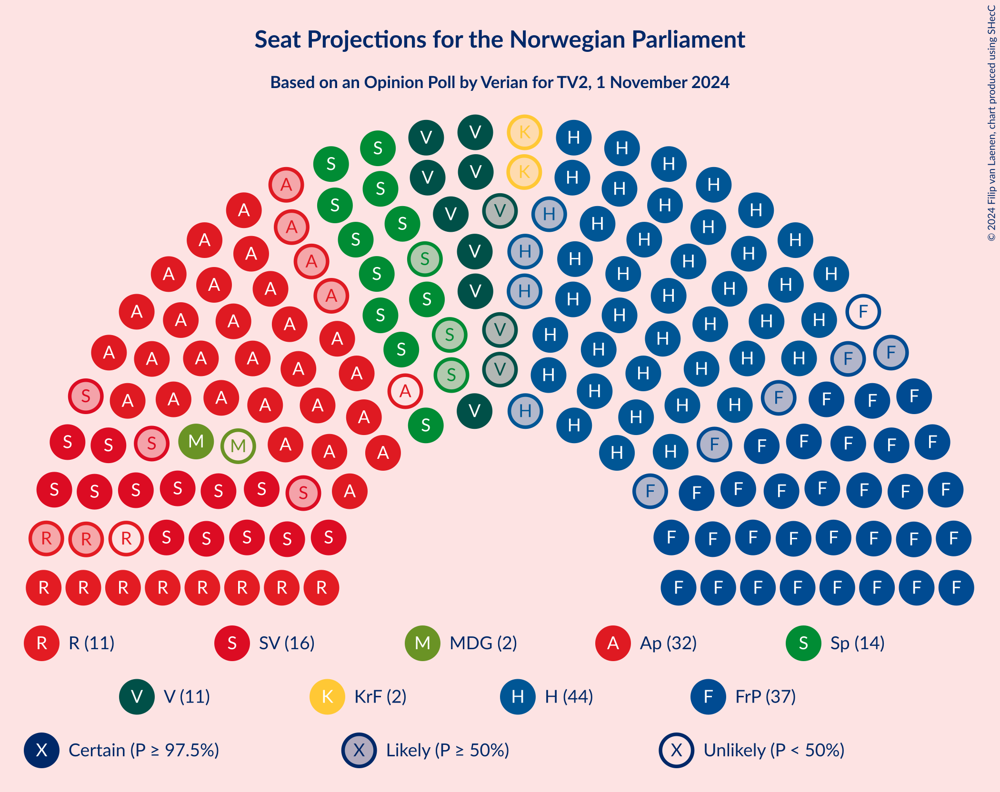

# Opinion Poll by Verian for TV2, 1 November 2024

<a href="#voting-intentions">Voting Intentions</a> | <a href="#seats">Seats</a> | <a href="#coalitions">Coalitions</a> | <a href="#technical-information">Technical Information</a>

## Voting Intentions

### Confidence Intervals

| Party | Last Result | Poll Result | 80% Confidence Interval | 90% Confidence Interval | 95% Confidence Interval | 99% Confidence Interval |
|:-----:|:-----------:|:-----------:|:-----------------------:|:-----------------------:|:-----------------------:|:-----------------------:|
| Høyre | 20.4% | 25.6% | 23.9–27.5% |23.4–28.0% |23.0–28.4% |22.2–29.3% |
| Fremskrittspartiet | 11.6% | 19.7% | 18.2–21.4% |17.7–21.9% |17.4–22.3% |16.6–23.1% |
| Arbeiderpartiet | 26.2% | 17.7% | 16.2–19.4% |15.8–19.8% |15.5–20.2% |14.8–21.0% |
| Sosialistisk Venstreparti | 7.6% | 9.1% | 8.0–10.4% |7.7–10.7% |7.5–11.1% |7.0–11.7% |
| Senterpartiet | 13.5% | 7.7% | 6.7–8.9% |6.4–9.2% |6.2–9.5% |5.8–10.1% |
| Venstre | 4.6% | 6.1% | 5.2–7.2% |5.0–7.5% |4.8–7.8% |4.4–8.3% |
| Rødt | 4.7% | 5.7% | 4.9–6.8% |4.6–7.1% |4.4–7.3% |4.1–7.9% |
| Miljøpartiet De Grønne | 3.9% | 3.4% | 2.8–4.3% |2.6–4.5% |2.4–4.7% |2.2–5.2% |
| Kristelig Folkeparti | 3.8% | 2.8% | 2.2–3.6% |2.1–3.8% |1.9–4.0% |1.7–4.5% |
| Industri- og Næringspartiet | 0.3% | 1.0% | 0.7–1.5% |0.6–1.7% |0.5–1.8% |0.4–2.1% |

*Note:* The poll result column reflects the actual value used in the calculations. Published results may vary slightly, and in addition be rounded to fewer digits.

## Seats

### Confidence Intervals

| Party | Last Result | Median | 80% Confidence Interval | 90% Confidence Interval | 95% Confidence Interval | 99% Confidence Interval |
|:-----:|:-----------:|:------:|:-----------------------:|:-----------------------:|:-----------------------:|:-----------------------:|
| <a href="#høyre">Høyre</a> | 36 | 44 | 41–49 |41–49 |40–49 |39–51 |
| <a href="#fremskrittspartiet">Fremskrittspartiet</a> | 21 | 36 | 33–38 |32–39 |31–40 |30–42 |
| <a href="#arbeiderpartiet">Arbeiderpartiet</a> | 48 | 32 | 31–35 |30–35 |28–37 |28–38 |
| <a href="#sosialistisk-venstreparti">Sosialistisk Venstreparti</a> | 13 | 16 | 14–18 |13–18 |13–19 |12–20 |
| <a href="#senterpartiet">Senterpartiet</a> | 28 | 14 | 12–16 |11–16 |11–17 |10–18 |
| <a href="#venstre">Venstre</a> | 8 | 11 | 9–13 |9–13 |8–14 |7–15 |
| <a href="#rødt">Rødt</a> | 8 | 10 | 9–12 |8–12 |8–12 |7–14 |
| <a href="#miljøpartiet-de-grønne">Miljøpartiet De Grønne</a> | 3 | 2 | 1–7 |1–7 |1–8 |1–9 |
| <a href="#kristelig-folkeparti">Kristelig Folkeparti</a> | 3 | 2 | 0–2 |0–3 |0–3 |0–8 |
| <a href="#industri--og-næringspartiet">Industri- og Næringspartiet</a> | 0 | 0 | 0 |0 |0 |0 |

### Høyre

*For a full overview of the results for this party, see the [Høyre](party-høyre.html) page.*

| Number of Seats | Probability | Accumulated | Special Marks |
|:---------------:|:-----------:|:-----------:|:-------------:|
| 36 | 0% | 100% | Last Result |
| 37 | 0.1% | 99.9% |  |
| 38 | 0.3% | 99.9% |  |
| 39 | 1.3% | 99.6% |  |
| 40 | 3% | 98% |  |
| 41 | 6% | 95% |  |
| 42 | 16% | 89% |  |
| 43 | 13% | 74% |  |
| 44 | 17% | 60% | Median |
| 45 | 9% | 44% |  |
| 46 | 5% | 35% |  |
| 47 | 7% | 29% |  |
| 48 | 13% | 23% |  |
| 49 | 8% | 10% |  |
| 50 | 0.9% | 2% |  |
| 51 | 0.4% | 0.9% |  |
| 52 | 0.3% | 0.5% |  |
| 53 | 0.1% | 0.2% |  |
| 54 | 0% | 0% |  |

### Fremskrittspartiet

*For a full overview of the results for this party, see the [Fremskrittspartiet](party-fremskrittspartiet.html) page.*

| Number of Seats | Probability | Accumulated | Special Marks |
|:---------------:|:-----------:|:-----------:|:-------------:|
| 21 | 0% | 100% | Last Result |
| 22 | 0% | 100% |  |
| 23 | 0% | 100% |  |
| 24 | 0% | 100% |  |
| 25 | 0% | 100% |  |
| 26 | 0% | 100% |  |
| 27 | 0% | 100% |  |
| 28 | 0.1% | 100% |  |
| 29 | 0.2% | 99.9% |  |
| 30 | 0.8% | 99.7% |  |
| 31 | 2% | 98.9% |  |
| 32 | 2% | 96% |  |
| 33 | 11% | 94% |  |
| 34 | 14% | 83% |  |
| 35 | 11% | 69% |  |
| 36 | 12% | 58% | Median |
| 37 | 18% | 47% |  |
| 38 | 19% | 29% |  |
| 39 | 5% | 10% |  |
| 40 | 2% | 4% |  |
| 41 | 1.0% | 2% |  |
| 42 | 1.3% | 1.4% |  |
| 43 | 0.1% | 0.1% |  |
| 44 | 0% | 0% |  |

### Arbeiderpartiet

*For a full overview of the results for this party, see the [Arbeiderpartiet](party-arbeiderpartiet.html) page.*

| Number of Seats | Probability | Accumulated | Special Marks |
|:---------------:|:-----------:|:-----------:|:-------------:|
| 26 | 0.1% | 100% |  |
| 27 | 0.2% | 99.9% |  |
| 28 | 3% | 99.7% |  |
| 29 | 1.5% | 97% |  |
| 30 | 3% | 96% |  |
| 31 | 24% | 93% |  |
| 32 | 28% | 69% | Median |
| 33 | 11% | 41% |  |
| 34 | 15% | 29% |  |
| 35 | 10% | 14% |  |
| 36 | 2% | 4% |  |
| 37 | 1.5% | 3% |  |
| 38 | 0.8% | 1.1% |  |
| 39 | 0.3% | 0.3% |  |
| 40 | 0% | 0.1% |  |
| 41 | 0% | 0% |  |
| 42 | 0% | 0% |  |
| 43 | 0% | 0% |  |
| 44 | 0% | 0% |  |
| 45 | 0% | 0% |  |
| 46 | 0% | 0% |  |
| 47 | 0% | 0% |  |
| 48 | 0% | 0% | Last Result |

### Sosialistisk Venstreparti

*For a full overview of the results for this party, see the [Sosialistisk Venstreparti](party-sosialistiskvenstreparti.html) page.*

| Number of Seats | Probability | Accumulated | Special Marks |
|:---------------:|:-----------:|:-----------:|:-------------:|
| 11 | 0.1% | 100% |  |
| 12 | 0.8% | 99.9% |  |
| 13 | 6% | 99.1% | Last Result |
| 14 | 13% | 93% |  |
| 15 | 13% | 80% |  |
| 16 | 25% | 67% | Median |
| 17 | 26% | 41% |  |
| 18 | 11% | 15% |  |
| 19 | 2% | 4% |  |
| 20 | 1.1% | 2% |  |
| 21 | 0.4% | 0.5% |  |
| 22 | 0% | 0.1% |  |
| 23 | 0% | 0% |  |

### Senterpartiet

*For a full overview of the results for this party, see the [Senterpartiet](party-senterpartiet.html) page.*

| Number of Seats | Probability | Accumulated | Special Marks |
|:---------------:|:-----------:|:-----------:|:-------------:|
| 9 | 0.3% | 100% |  |
| 10 | 2% | 99.7% |  |
| 11 | 8% | 98% |  |
| 12 | 20% | 90% |  |
| 13 | 17% | 70% |  |
| 14 | 26% | 53% | Median |
| 15 | 17% | 27% |  |
| 16 | 7% | 10% |  |
| 17 | 3% | 3% |  |
| 18 | 0.6% | 0.7% |  |
| 19 | 0.1% | 0.1% |  |
| 20 | 0% | 0% |  |
| 21 | 0% | 0% |  |
| 22 | 0% | 0% |  |
| 23 | 0% | 0% |  |
| 24 | 0% | 0% |  |
| 25 | 0% | 0% |  |
| 26 | 0% | 0% |  |
| 27 | 0% | 0% |  |
| 28 | 0% | 0% | Last Result |

### Venstre

*For a full overview of the results for this party, see the [Venstre](party-venstre.html) page.*

| Number of Seats | Probability | Accumulated | Special Marks |
|:---------------:|:-----------:|:-----------:|:-------------:|
| 3 | 0.1% | 100% |  |
| 4 | 0% | 99.9% |  |
| 5 | 0% | 99.9% |  |
| 6 | 0% | 99.9% |  |
| 7 | 0.6% | 99.9% |  |
| 8 | 3% | 99.3% | Last Result |
| 9 | 7% | 97% |  |
| 10 | 27% | 90% |  |
| 11 | 25% | 62% | Median |
| 12 | 23% | 37% |  |
| 13 | 12% | 15% |  |
| 14 | 2% | 3% |  |
| 15 | 0.8% | 1.0% |  |
| 16 | 0.2% | 0.2% |  |
| 17 | 0% | 0% |  |

### Rødt

*For a full overview of the results for this party, see the [Rødt](party-rødt.html) page.*

| Number of Seats | Probability | Accumulated | Special Marks |
|:---------------:|:-----------:|:-----------:|:-------------:|
| 1 | 0.4% | 100% |  |
| 2 | 0% | 99.6% |  |
| 3 | 0% | 99.6% |  |
| 4 | 0% | 99.6% |  |
| 5 | 0% | 99.6% |  |
| 6 | 0% | 99.6% |  |
| 7 | 0.9% | 99.6% |  |
| 8 | 8% | 98.7% | Last Result |
| 9 | 25% | 90% |  |
| 10 | 25% | 65% | Median |
| 11 | 28% | 41% |  |
| 12 | 10% | 12% |  |
| 13 | 2% | 2% |  |
| 14 | 0.4% | 0.5% |  |
| 15 | 0.1% | 0.1% |  |
| 16 | 0% | 0% |  |

### Miljøpartiet De Grønne

*For a full overview of the results for this party, see the [Miljøpartiet De Grønne](party-miljøpartietdegrønne.html) page.*

| Number of Seats | Probability | Accumulated | Special Marks |
|:---------------:|:-----------:|:-----------:|:-------------:|
| 1 | 34% | 100% |  |
| 2 | 33% | 66% | Median |
| 3 | 15% | 34% | Last Result |
| 4 | 0% | 19% |  |
| 5 | 0% | 19% |  |
| 6 | 0.1% | 19% |  |
| 7 | 14% | 19% |  |
| 8 | 4% | 5% |  |
| 9 | 0.8% | 0.9% |  |
| 10 | 0.1% | 0.1% |  |
| 11 | 0% | 0% |  |

### Kristelig Folkeparti

*For a full overview of the results for this party, see the [Kristelig Folkeparti](party-kristeligfolkeparti.html) page.*

| Number of Seats | Probability | Accumulated | Special Marks |
|:---------------:|:-----------:|:-----------:|:-------------:|
| 0 | 14% | 100% |  |
| 1 | 31% | 86% |  |
| 2 | 46% | 54% | Median |
| 3 | 6% | 8% | Last Result |
| 4 | 0% | 2% |  |
| 5 | 0% | 2% |  |
| 6 | 0.2% | 2% |  |
| 7 | 1.5% | 2% |  |
| 8 | 0.5% | 0.6% |  |
| 9 | 0% | 0% |  |

### Industri- og Næringspartiet

*For a full overview of the results for this party, see the [Industri- og Næringspartiet](party-industri-ognæringspartiet.html) page.*

| Number of Seats | Probability | Accumulated | Special Marks |
|:---------------:|:-----------:|:-----------:|:-------------:|
| 0 | 100% | 100% | Last Result, Median |

## Coalitions

### Confidence Intervals

| Coalition | Last Result | Median | Majority? | 80% Confidence Interval | 90% Confidence Interval | 95% Confidence Interval | 99% Confidence Interval |
|:---------:|:-----------:|:------:|:---------:|:-----------------------:|:-----------------------:|:-----------------------:|:-----------------------:|
| Høyre – Fremskrittspartiet – Senterpartiet – Venstre – Kristelig Folkeparti | 96 | 107 | 100% | 103–110 | 102–111 | 101–112 | 99–114 |
| Høyre – Fremskrittspartiet – Venstre – Miljøpartiet De Grønne – Kristelig Folkeparti | 71 | 96 | 100% | 92–100 | 92–101 | 91–102 | 89–103 |
| Høyre – Fremskrittspartiet – Venstre – Kristelig Folkeparti | 68 | 93 | 99.6% | 89–97 | 89–98 | 87–99 | 85–101 |
| Høyre – Fremskrittspartiet – Venstre | 65 | 92 | 97% | 87–96 | 87–97 | 84–98 | 83–100 |
| Høyre – Fremskrittspartiet | 57 | 81 | 13% | 76–86 | 76–86 | 74–87 | 73–90 |
| Arbeiderpartiet – Sosialistisk Venstreparti – Senterpartiet – Rødt – Miljøpartiet De Grønne | 100 | 75 | 0.2% | 71–79 | 70–79 | 69–82 | 67–83 |
| Arbeiderpartiet – Sosialistisk Venstreparti – Senterpartiet – Rødt | 97 | 72 | 0% | 68–76 | 67–76 | 66–77 | 65–79 |
| Arbeiderpartiet – Sosialistisk Venstreparti – Senterpartiet – Miljøpartiet De Grønne – Kristelig Folkeparti | 95 | 66 | 0% | 62–70 | 62–72 | 61–73 | 59–75 |
| Arbeiderpartiet – Sosialistisk Venstreparti – Senterpartiet – Miljøpartiet De Grønne | 92 | 65 | 0% | 61–68 | 61–70 | 60–71 | 57–73 |
| Arbeiderpartiet – Sosialistisk Venstreparti – Senterpartiet | 89 | 62 | 0% | 59–65 | 58–66 | 57–67 | 55–69 |
| Arbeiderpartiet – Sosialistisk Venstreparti – Rødt – Miljøpartiet De Grønne | 72 | 61 | 0% | 58–65 | 57–66 | 56–67 | 54–69 |
| Høyre – Venstre – Kristelig Folkeparti | 47 | 57 | 0% | 53–61 | 53–63 | 52–63 | 50–64 |
| Arbeiderpartiet – Senterpartiet – Miljøpartiet De Grønne – Kristelig Folkeparti | 82 | 51 | 0% | 46–55 | 45–56 | 45–58 | 44–59 |
| Arbeiderpartiet – Senterpartiet – Kristelig Folkeparti | 79 | 47 | 0% | 44–51 | 44–52 | 43–54 | 41–55 |
| Arbeiderpartiet – Sosialistisk Venstreparti | 61 | 48 | 0% | 46–51 | 45–52 | 44–53 | 43–55 |
| Arbeiderpartiet – Senterpartiet | 76 | 46 | 0% | 43–49 | 42–50 | 42–51 | 41–52 |
| Senterpartiet – Venstre – Kristelig Folkeparti | 39 | 26 | 0% | 23–29 | 23–30 | 21–31 | 20–33 |

### Høyre – Fremskrittspartiet – Senterpartiet – Venstre – Kristelig Folkeparti

| Number of Seats | Probability | Accumulated | Special Marks |
|:---------------:|:-----------:|:-----------:|:-------------:|
| 96 | 0% | 100% | Last Result |
| 97 | 0.1% | 100% |  |
| 98 | 0.2% | 99.9% |  |
| 99 | 0.4% | 99.7% |  |
| 100 | 0.3% | 99.3% |  |
| 101 | 3% | 99.0% |  |
| 102 | 4% | 96% |  |
| 103 | 10% | 92% |  |
| 104 | 9% | 82% |  |
| 105 | 5% | 73% |  |
| 106 | 6% | 68% |  |
| 107 | 26% | 62% | Median |
| 108 | 10% | 36% |  |
| 109 | 5% | 26% |  |
| 110 | 13% | 20% |  |
| 111 | 4% | 7% |  |
| 112 | 1.5% | 3% |  |
| 113 | 1.1% | 2% |  |
| 114 | 0.2% | 0.6% |  |
| 115 | 0.4% | 0.4% |  |
| 116 | 0% | 0.1% |  |
| 117 | 0% | 0% |  |

### Høyre – Fremskrittspartiet – Venstre – Miljøpartiet De Grønne – Kristelig Folkeparti

| Number of Seats | Probability | Accumulated | Special Marks |
|:---------------:|:-----------:|:-----------:|:-------------:|
| 71 | 0% | 100% | Last Result |
| 72 | 0% | 100% |  |
| 73 | 0% | 100% |  |
| 74 | 0% | 100% |  |
| 75 | 0% | 100% |  |
| 76 | 0% | 100% |  |
| 77 | 0% | 100% |  |
| 78 | 0% | 100% |  |
| 79 | 0% | 100% |  |
| 80 | 0% | 100% |  |
| 81 | 0% | 100% |  |
| 82 | 0% | 100% |  |
| 83 | 0% | 100% |  |
| 84 | 0% | 100% |  |
| 85 | 0% | 100% | Majority |
| 86 | 0.1% | 100% |  |
| 87 | 0.1% | 99.9% |  |
| 88 | 0.1% | 99.8% |  |
| 89 | 0.6% | 99.7% |  |
| 90 | 0.6% | 99.0% |  |
| 91 | 2% | 98% |  |
| 92 | 11% | 97% |  |
| 93 | 5% | 85% |  |
| 94 | 18% | 80% |  |
| 95 | 5% | 62% | Median |
| 96 | 13% | 57% |  |
| 97 | 13% | 44% |  |
| 98 | 12% | 31% |  |
| 99 | 7% | 19% |  |
| 100 | 6% | 12% |  |
| 101 | 3% | 6% |  |
| 102 | 2% | 3% |  |
| 103 | 0.6% | 0.9% |  |
| 104 | 0.2% | 0.3% |  |
| 105 | 0% | 0.1% |  |
| 106 | 0% | 0.1% |  |
| 107 | 0% | 0% |  |

### Høyre – Fremskrittspartiet – Venstre – Kristelig Folkeparti

| Number of Seats | Probability | Accumulated | Special Marks |
|:---------------:|:-----------:|:-----------:|:-------------:|
| 68 | 0% | 100% | Last Result |
| 69 | 0% | 100% |  |
| 70 | 0% | 100% |  |
| 71 | 0% | 100% |  |
| 72 | 0% | 100% |  |
| 73 | 0% | 100% |  |
| 74 | 0% | 100% |  |
| 75 | 0% | 100% |  |
| 76 | 0% | 100% |  |
| 77 | 0% | 100% |  |
| 78 | 0% | 100% |  |
| 79 | 0% | 100% |  |
| 80 | 0% | 100% |  |
| 81 | 0% | 100% |  |
| 82 | 0% | 100% |  |
| 83 | 0.2% | 100% |  |
| 84 | 0.1% | 99.8% |  |
| 85 | 0.2% | 99.6% | Majority |
| 86 | 2% | 99.5% |  |
| 87 | 0.6% | 98% |  |
| 88 | 1.5% | 97% |  |
| 89 | 9% | 96% |  |
| 90 | 7% | 86% |  |
| 91 | 7% | 79% |  |
| 92 | 20% | 73% |  |
| 93 | 11% | 53% | Median |
| 94 | 5% | 42% |  |
| 95 | 13% | 37% |  |
| 96 | 8% | 25% |  |
| 97 | 10% | 17% |  |
| 98 | 2% | 7% |  |
| 99 | 2% | 4% |  |
| 100 | 1.3% | 2% |  |
| 101 | 0.5% | 0.6% |  |
| 102 | 0.1% | 0.1% |  |
| 103 | 0% | 0% |  |

### Høyre – Fremskrittspartiet – Venstre

| Number of Seats | Probability | Accumulated | Special Marks |
|:---------------:|:-----------:|:-----------:|:-------------:|
| 65 | 0% | 100% | Last Result |
| 66 | 0% | 100% |  |
| 67 | 0% | 100% |  |
| 68 | 0% | 100% |  |
| 69 | 0% | 100% |  |
| 70 | 0% | 100% |  |
| 71 | 0% | 100% |  |
| 72 | 0% | 100% |  |
| 73 | 0% | 100% |  |
| 74 | 0% | 100% |  |
| 75 | 0% | 100% |  |
| 76 | 0% | 100% |  |
| 77 | 0% | 100% |  |
| 78 | 0% | 100% |  |
| 79 | 0% | 100% |  |
| 80 | 0% | 100% |  |
| 81 | 0.1% | 100% |  |
| 82 | 0.2% | 99.9% |  |
| 83 | 0.3% | 99.7% |  |
| 84 | 2% | 99.3% |  |
| 85 | 0.8% | 97% | Majority |
| 86 | 1.0% | 97% |  |
| 87 | 10% | 96% |  |
| 88 | 5% | 86% |  |
| 89 | 10% | 82% |  |
| 90 | 11% | 72% |  |
| 91 | 10% | 61% | Median |
| 92 | 14% | 51% |  |
| 93 | 4% | 37% |  |
| 94 | 14% | 33% |  |
| 95 | 5% | 19% |  |
| 96 | 7% | 13% |  |
| 97 | 2% | 6% |  |
| 98 | 3% | 4% |  |
| 99 | 0.3% | 2% |  |
| 100 | 1.2% | 1.3% |  |
| 101 | 0.1% | 0.1% |  |
| 102 | 0% | 0% |  |

### Høyre – Fremskrittspartiet

| Number of Seats | Probability | Accumulated | Special Marks |
|:---------------:|:-----------:|:-----------:|:-------------:|
| 57 | 0% | 100% | Last Result |
| 58 | 0% | 100% |  |
| 59 | 0% | 100% |  |
| 60 | 0% | 100% |  |
| 61 | 0% | 100% |  |
| 62 | 0% | 100% |  |
| 63 | 0% | 100% |  |
| 64 | 0% | 100% |  |
| 65 | 0% | 100% |  |
| 66 | 0% | 100% |  |
| 67 | 0% | 100% |  |
| 68 | 0% | 100% |  |
| 69 | 0% | 100% |  |
| 70 | 0% | 100% |  |
| 71 | 0.1% | 99.9% |  |
| 72 | 0.1% | 99.9% |  |
| 73 | 0.7% | 99.7% |  |
| 74 | 2% | 99.0% |  |
| 75 | 1.3% | 97% |  |
| 76 | 10% | 96% |  |
| 77 | 8% | 86% |  |
| 78 | 5% | 78% |  |
| 79 | 6% | 73% |  |
| 80 | 13% | 67% | Median |
| 81 | 22% | 54% |  |
| 82 | 10% | 32% |  |
| 83 | 5% | 23% |  |
| 84 | 5% | 18% |  |
| 85 | 1.3% | 13% | Majority |
| 86 | 8% | 11% |  |
| 87 | 2% | 3% |  |
| 88 | 0.3% | 1.3% |  |
| 89 | 0.2% | 1.0% |  |
| 90 | 0.7% | 0.8% |  |
| 91 | 0% | 0% |  |

### Arbeiderpartiet – Sosialistisk Venstreparti – Senterpartiet – Rødt – Miljøpartiet De Grønne

| Number of Seats | Probability | Accumulated | Special Marks |
|:---------------:|:-----------:|:-----------:|:-------------:|
| 66 | 0.1% | 100% |  |
| 67 | 0.5% | 99.9% |  |
| 68 | 1.3% | 99.4% |  |
| 69 | 2% | 98% |  |
| 70 | 2% | 96% |  |
| 71 | 10% | 93% |  |
| 72 | 8% | 83% |  |
| 73 | 12% | 75% |  |
| 74 | 5% | 63% | Median |
| 75 | 10% | 58% |  |
| 76 | 20% | 48% |  |
| 77 | 7% | 28% |  |
| 78 | 7% | 21% |  |
| 79 | 10% | 15% |  |
| 80 | 1.5% | 5% |  |
| 81 | 0.6% | 3% |  |
| 82 | 2% | 3% |  |
| 83 | 0.2% | 0.6% |  |
| 84 | 0.2% | 0.4% |  |
| 85 | 0.1% | 0.2% | Majority |
| 86 | 0.1% | 0.1% |  |
| 87 | 0% | 0% |  |
| 88 | 0% | 0% |  |
| 89 | 0% | 0% |  |
| 90 | 0% | 0% |  |
| 91 | 0% | 0% |  |
| 92 | 0% | 0% |  |
| 93 | 0% | 0% |  |
| 94 | 0% | 0% |  |
| 95 | 0% | 0% |  |
| 96 | 0% | 0% |  |
| 97 | 0% | 0% |  |
| 98 | 0% | 0% |  |
| 99 | 0% | 0% |  |
| 100 | 0% | 0% | Last Result |

### Arbeiderpartiet – Sosialistisk Venstreparti – Senterpartiet – Rødt

| Number of Seats | Probability | Accumulated | Special Marks |
|:---------------:|:-----------:|:-----------:|:-------------:|
| 62 | 0% | 100% |  |
| 63 | 0% | 99.9% |  |
| 64 | 0.2% | 99.9% |  |
| 65 | 0.6% | 99.7% |  |
| 66 | 2% | 99.1% |  |
| 67 | 3% | 97% |  |
| 68 | 6% | 94% |  |
| 69 | 7% | 88% |  |
| 70 | 12% | 81% |  |
| 71 | 13% | 69% |  |
| 72 | 13% | 56% | Median |
| 73 | 5% | 43% |  |
| 74 | 18% | 38% |  |
| 75 | 5% | 20% |  |
| 76 | 11% | 15% |  |
| 77 | 3% | 4% |  |
| 78 | 0.6% | 2% |  |
| 79 | 0.7% | 1.0% |  |
| 80 | 0.1% | 0.3% |  |
| 81 | 0.1% | 0.2% |  |
| 82 | 0.1% | 0.1% |  |
| 83 | 0% | 0% |  |
| 84 | 0% | 0% |  |
| 85 | 0% | 0% | Majority |
| 86 | 0% | 0% |  |
| 87 | 0% | 0% |  |
| 88 | 0% | 0% |  |
| 89 | 0% | 0% |  |
| 90 | 0% | 0% |  |
| 91 | 0% | 0% |  |
| 92 | 0% | 0% |  |
| 93 | 0% | 0% |  |
| 94 | 0% | 0% |  |
| 95 | 0% | 0% |  |
| 96 | 0% | 0% |  |
| 97 | 0% | 0% | Last Result |

### Arbeiderpartiet – Sosialistisk Venstreparti – Senterpartiet – Miljøpartiet De Grønne – Kristelig Folkeparti

| Number of Seats | Probability | Accumulated | Special Marks |
|:---------------:|:-----------:|:-----------:|:-------------:|
| 57 | 0.1% | 100% |  |
| 58 | 0.4% | 99.9% |  |
| 59 | 0.9% | 99.6% |  |
| 60 | 1.0% | 98.6% |  |
| 61 | 0.9% | 98% |  |
| 62 | 12% | 97% |  |
| 63 | 13% | 85% |  |
| 64 | 6% | 72% |  |
| 65 | 7% | 66% |  |
| 66 | 9% | 59% | Median |
| 67 | 7% | 50% |  |
| 68 | 13% | 43% |  |
| 69 | 10% | 29% |  |
| 70 | 10% | 19% |  |
| 71 | 2% | 9% |  |
| 72 | 2% | 6% |  |
| 73 | 3% | 4% |  |
| 74 | 0.7% | 1.3% |  |
| 75 | 0.3% | 0.6% |  |
| 76 | 0.1% | 0.3% |  |
| 77 | 0.1% | 0.1% |  |
| 78 | 0% | 0% |  |
| 79 | 0% | 0% |  |
| 80 | 0% | 0% |  |
| 81 | 0% | 0% |  |
| 82 | 0% | 0% |  |
| 83 | 0% | 0% |  |
| 84 | 0% | 0% |  |
| 85 | 0% | 0% | Majority |
| 86 | 0% | 0% |  |
| 87 | 0% | 0% |  |
| 88 | 0% | 0% |  |
| 89 | 0% | 0% |  |
| 90 | 0% | 0% |  |
| 91 | 0% | 0% |  |
| 92 | 0% | 0% |  |
| 93 | 0% | 0% |  |
| 94 | 0% | 0% |  |
| 95 | 0% | 0% | Last Result |

### Arbeiderpartiet – Sosialistisk Venstreparti – Senterpartiet – Miljøpartiet De Grønne

| Number of Seats | Probability | Accumulated | Special Marks |
|:---------------:|:-----------:|:-----------:|:-------------:|
| 56 | 0.1% | 100% |  |
| 57 | 0.4% | 99.9% |  |
| 58 | 0.5% | 99.5% |  |
| 59 | 1.4% | 98.9% |  |
| 60 | 2% | 98% |  |
| 61 | 13% | 96% |  |
| 62 | 11% | 82% |  |
| 63 | 9% | 72% |  |
| 64 | 12% | 63% | Median |
| 65 | 6% | 51% |  |
| 66 | 11% | 44% |  |
| 67 | 12% | 33% |  |
| 68 | 13% | 21% |  |
| 69 | 2% | 9% |  |
| 70 | 3% | 7% |  |
| 71 | 3% | 4% |  |
| 72 | 0.5% | 1.2% |  |
| 73 | 0.3% | 0.7% |  |
| 74 | 0.3% | 0.4% |  |
| 75 | 0.1% | 0.2% |  |
| 76 | 0% | 0% |  |
| 77 | 0% | 0% |  |
| 78 | 0% | 0% |  |
| 79 | 0% | 0% |  |
| 80 | 0% | 0% |  |
| 81 | 0% | 0% |  |
| 82 | 0% | 0% |  |
| 83 | 0% | 0% |  |
| 84 | 0% | 0% |  |
| 85 | 0% | 0% | Majority |
| 86 | 0% | 0% |  |
| 87 | 0% | 0% |  |
| 88 | 0% | 0% |  |
| 89 | 0% | 0% |  |
| 90 | 0% | 0% |  |
| 91 | 0% | 0% |  |
| 92 | 0% | 0% | Last Result |

### Arbeiderpartiet – Sosialistisk Venstreparti – Senterpartiet

| Number of Seats | Probability | Accumulated | Special Marks |
|:---------------:|:-----------:|:-----------:|:-------------:|
| 54 | 0.1% | 100% |  |
| 55 | 0.6% | 99.9% |  |
| 56 | 2% | 99.3% |  |
| 57 | 2% | 98% |  |
| 58 | 2% | 96% |  |
| 59 | 7% | 94% |  |
| 60 | 18% | 87% |  |
| 61 | 17% | 69% |  |
| 62 | 14% | 52% | Median |
| 63 | 8% | 38% |  |
| 64 | 8% | 30% |  |
| 65 | 14% | 22% |  |
| 66 | 3% | 7% |  |
| 67 | 1.3% | 4% |  |
| 68 | 2% | 2% |  |
| 69 | 0.5% | 0.9% |  |
| 70 | 0.3% | 0.5% |  |
| 71 | 0.1% | 0.2% |  |
| 72 | 0.1% | 0.1% |  |
| 73 | 0% | 0% |  |
| 74 | 0% | 0% |  |
| 75 | 0% | 0% |  |
| 76 | 0% | 0% |  |
| 77 | 0% | 0% |  |
| 78 | 0% | 0% |  |
| 79 | 0% | 0% |  |
| 80 | 0% | 0% |  |
| 81 | 0% | 0% |  |
| 82 | 0% | 0% |  |
| 83 | 0% | 0% |  |
| 84 | 0% | 0% |  |
| 85 | 0% | 0% | Majority |
| 86 | 0% | 0% |  |
| 87 | 0% | 0% |  |
| 88 | 0% | 0% |  |
| 89 | 0% | 0% | Last Result |

### Arbeiderpartiet – Sosialistisk Venstreparti – Rødt – Miljøpartiet De Grønne

| Number of Seats | Probability | Accumulated | Special Marks |
|:---------------:|:-----------:|:-----------:|:-------------:|
| 52 | 0% | 100% |  |
| 53 | 0.3% | 99.9% |  |
| 54 | 0.2% | 99.6% |  |
| 55 | 1.1% | 99.4% |  |
| 56 | 1.4% | 98% |  |
| 57 | 4% | 97% |  |
| 58 | 13% | 93% |  |
| 59 | 5% | 80% |  |
| 60 | 10% | 74% | Median |
| 61 | 26% | 65% |  |
| 62 | 7% | 39% |  |
| 63 | 5% | 32% |  |
| 64 | 9% | 27% |  |
| 65 | 10% | 18% |  |
| 66 | 4% | 8% |  |
| 67 | 3% | 4% |  |
| 68 | 0.3% | 1.0% |  |
| 69 | 0.4% | 0.7% |  |
| 70 | 0.2% | 0.3% |  |
| 71 | 0.1% | 0.1% |  |
| 72 | 0% | 0% | Last Result |

### Høyre – Venstre – Kristelig Folkeparti

| Number of Seats | Probability | Accumulated | Special Marks |
|:---------------:|:-----------:|:-----------:|:-------------:|
| 47 | 0% | 100% | Last Result |
| 48 | 0.1% | 100% |  |
| 49 | 0.1% | 99.9% |  |
| 50 | 0.8% | 99.8% |  |
| 51 | 1.1% | 99.0% |  |
| 52 | 2% | 98% |  |
| 53 | 8% | 96% |  |
| 54 | 3% | 88% |  |
| 55 | 15% | 85% |  |
| 56 | 12% | 71% |  |
| 57 | 17% | 59% | Median |
| 58 | 10% | 43% |  |
| 59 | 14% | 33% |  |
| 60 | 5% | 19% |  |
| 61 | 6% | 14% |  |
| 62 | 2% | 8% |  |
| 63 | 5% | 6% |  |
| 64 | 0.7% | 1.2% |  |
| 65 | 0.3% | 0.4% |  |
| 66 | 0.1% | 0.1% |  |
| 67 | 0% | 0.1% |  |
| 68 | 0% | 0% |  |

### Arbeiderpartiet – Senterpartiet – Miljøpartiet De Grønne – Kristelig Folkeparti

| Number of Seats | Probability | Accumulated | Special Marks |
|:---------------:|:-----------:|:-----------:|:-------------:|
| 42 | 0% | 100% |  |
| 43 | 0.2% | 99.9% |  |
| 44 | 2% | 99.7% |  |
| 45 | 3% | 98% |  |
| 46 | 17% | 95% |  |
| 47 | 5% | 78% |  |
| 48 | 7% | 73% |  |
| 49 | 9% | 67% |  |
| 50 | 6% | 57% | Median |
| 51 | 10% | 51% |  |
| 52 | 10% | 41% |  |
| 53 | 11% | 31% |  |
| 54 | 9% | 20% |  |
| 55 | 4% | 11% |  |
| 56 | 3% | 7% |  |
| 57 | 1.2% | 4% |  |
| 58 | 0.3% | 3% |  |
| 59 | 2% | 2% |  |
| 60 | 0.2% | 0.5% |  |
| 61 | 0.2% | 0.2% |  |
| 62 | 0% | 0.1% |  |
| 63 | 0% | 0% |  |
| 64 | 0% | 0% |  |
| 65 | 0% | 0% |  |
| 66 | 0% | 0% |  |
| 67 | 0% | 0% |  |
| 68 | 0% | 0% |  |
| 69 | 0% | 0% |  |
| 70 | 0% | 0% |  |
| 71 | 0% | 0% |  |
| 72 | 0% | 0% |  |
| 73 | 0% | 0% |  |
| 74 | 0% | 0% |  |
| 75 | 0% | 0% |  |
| 76 | 0% | 0% |  |
| 77 | 0% | 0% |  |
| 78 | 0% | 0% |  |
| 79 | 0% | 0% |  |
| 80 | 0% | 0% |  |
| 81 | 0% | 0% |  |
| 82 | 0% | 0% | Last Result |

### Arbeiderpartiet – Senterpartiet – Kristelig Folkeparti

| Number of Seats | Probability | Accumulated | Special Marks |
|:---------------:|:-----------:|:-----------:|:-------------:|
| 40 | 0.1% | 100% |  |
| 41 | 0.7% | 99.9% |  |
| 42 | 1.3% | 99.2% |  |
| 43 | 2% | 98% |  |
| 44 | 10% | 96% |  |
| 45 | 20% | 87% |  |
| 46 | 5% | 67% |  |
| 47 | 12% | 62% |  |
| 48 | 12% | 50% | Median |
| 49 | 8% | 38% |  |
| 50 | 18% | 30% |  |
| 51 | 3% | 13% |  |
| 52 | 5% | 9% |  |
| 53 | 1.4% | 4% |  |
| 54 | 2% | 3% |  |
| 55 | 0.4% | 0.6% |  |
| 56 | 0.1% | 0.3% |  |
| 57 | 0% | 0.1% |  |
| 58 | 0.1% | 0.1% |  |
| 59 | 0% | 0% |  |
| 60 | 0% | 0% |  |
| 61 | 0% | 0% |  |
| 62 | 0% | 0% |  |
| 63 | 0% | 0% |  |
| 64 | 0% | 0% |  |
| 65 | 0% | 0% |  |
| 66 | 0% | 0% |  |
| 67 | 0% | 0% |  |
| 68 | 0% | 0% |  |
| 69 | 0% | 0% |  |
| 70 | 0% | 0% |  |
| 71 | 0% | 0% |  |
| 72 | 0% | 0% |  |
| 73 | 0% | 0% |  |
| 74 | 0% | 0% |  |
| 75 | 0% | 0% |  |
| 76 | 0% | 0% |  |
| 77 | 0% | 0% |  |
| 78 | 0% | 0% |  |
| 79 | 0% | 0% | Last Result |

### Arbeiderpartiet – Sosialistisk Venstreparti

| Number of Seats | Probability | Accumulated | Special Marks |
|:---------------:|:-----------:|:-----------:|:-------------:|
| 41 | 0.1% | 100% |  |
| 42 | 0.3% | 99.9% |  |
| 43 | 1.0% | 99.6% |  |
| 44 | 2% | 98.5% |  |
| 45 | 7% | 97% |  |
| 46 | 5% | 90% |  |
| 47 | 14% | 85% |  |
| 48 | 26% | 71% | Median |
| 49 | 17% | 45% |  |
| 50 | 9% | 28% |  |
| 51 | 13% | 20% |  |
| 52 | 4% | 7% |  |
| 53 | 2% | 3% |  |
| 54 | 0.3% | 1.2% |  |
| 55 | 0.7% | 1.0% |  |
| 56 | 0.1% | 0.3% |  |
| 57 | 0.1% | 0.1% |  |
| 58 | 0% | 0.1% |  |
| 59 | 0% | 0% |  |
| 60 | 0% | 0% |  |
| 61 | 0% | 0% | Last Result |

### Arbeiderpartiet – Senterpartiet

| Number of Seats | Probability | Accumulated | Special Marks |
|:---------------:|:-----------:|:-----------:|:-------------:|
| 39 | 0.1% | 100% |  |
| 40 | 0.3% | 99.9% |  |
| 41 | 1.3% | 99.6% |  |
| 42 | 4% | 98% |  |
| 43 | 5% | 94% |  |
| 44 | 22% | 89% |  |
| 45 | 11% | 67% |  |
| 46 | 15% | 56% | Median |
| 47 | 11% | 41% |  |
| 48 | 17% | 30% |  |
| 49 | 7% | 13% |  |
| 50 | 3% | 6% |  |
| 51 | 1.3% | 3% |  |
| 52 | 2% | 2% |  |
| 53 | 0.1% | 0.4% |  |
| 54 | 0.2% | 0.3% |  |
| 55 | 0% | 0% |  |
| 56 | 0% | 0% |  |
| 57 | 0% | 0% |  |
| 58 | 0% | 0% |  |
| 59 | 0% | 0% |  |
| 60 | 0% | 0% |  |
| 61 | 0% | 0% |  |
| 62 | 0% | 0% |  |
| 63 | 0% | 0% |  |
| 64 | 0% | 0% |  |
| 65 | 0% | 0% |  |
| 66 | 0% | 0% |  |
| 67 | 0% | 0% |  |
| 68 | 0% | 0% |  |
| 69 | 0% | 0% |  |
| 70 | 0% | 0% |  |
| 71 | 0% | 0% |  |
| 72 | 0% | 0% |  |
| 73 | 0% | 0% |  |
| 74 | 0% | 0% |  |
| 75 | 0% | 0% |  |
| 76 | 0% | 0% | Last Result |

### Senterpartiet – Venstre – Kristelig Folkeparti

| Number of Seats | Probability | Accumulated | Special Marks |
|:---------------:|:-----------:|:-----------:|:-------------:|
| 18 | 0% | 100% |  |
| 19 | 0.1% | 99.9% |  |
| 20 | 0.9% | 99.8% |  |
| 21 | 2% | 98.9% |  |
| 22 | 2% | 97% |  |
| 23 | 7% | 95% |  |
| 24 | 16% | 88% |  |
| 25 | 7% | 72% |  |
| 26 | 20% | 66% |  |
| 27 | 21% | 45% | Median |
| 28 | 13% | 25% |  |
| 29 | 3% | 12% |  |
| 30 | 5% | 8% |  |
| 31 | 2% | 3% |  |
| 32 | 0.8% | 2% |  |
| 33 | 0.6% | 0.7% |  |
| 34 | 0.1% | 0.2% |  |
| 35 | 0% | 0% |  |
| 36 | 0% | 0% |  |
| 37 | 0% | 0% |  |
| 38 | 0% | 0% |  |
| 39 | 0% | 0% | Last Result |

## Technical Information

### Opinion Poll

+ **Polling firm:** Verian
+ **Commissioner(s):** TV2
+ **Fieldwork period:** 1 November 2024

### Calculations

+ **Sample size:** 999
+ **Simulations done:** 1,048,576
+ **Error estimate:** 2.71%

