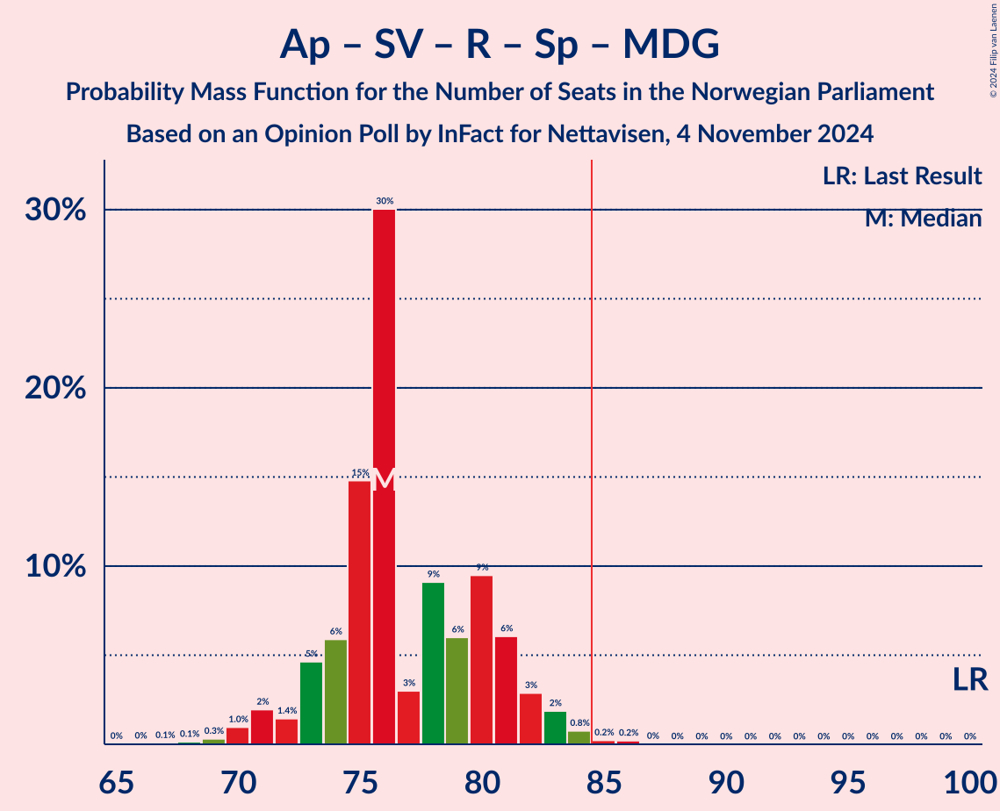

# Opinion Poll by InFact for Nettavisen, 4 November 2024

<a href="#voting-intentions">Voting Intentions</a> | <a href="#seats">Seats</a> | <a href="#coalitions">Coalitions</a> | <a href="#technical-information">Technical Information</a>

## Voting Intentions

### Confidence Intervals

| Party | Last Result | Poll Result | 80% Confidence Interval | 90% Confidence Interval | 95% Confidence Interval | 99% Confidence Interval |
|:-----:|:-----------:|:-----------:|:-----------------------:|:-----------------------:|:-----------------------:|:-----------------------:|
| Fremskrittspartiet | 11.6% | 24.2% | 22.6–25.9% |22.2–26.4% |21.8–26.8% |21.0–27.6% |
| Høyre | 20.4% | 20.3% | 18.8–21.9% |18.4–22.3% |18.0–22.7% |17.3–23.5% |
| Arbeiderpartiet | 26.2% | 17.7% | 16.3–19.2% |15.9–19.7% |15.6–20.1% |14.9–20.8% |
| Sosialistisk Venstreparti | 7.6% | 8.4% | 7.4–9.5% |7.1–9.8% |6.9–10.1% |6.4–10.7% |
| Rødt | 4.7% | 7.0% | 6.1–8.1% |5.9–8.4% |5.7–8.7% |5.3–9.2% |
| Senterpartiet | 13.5% | 6.2% | 5.4–7.3% |5.2–7.5% |5.0–7.8% |4.6–8.3% |
| Venstre | 4.6% | 5.1% | 4.3–6.0% |4.1–6.3% |3.9–6.5% |3.6–7.0% |
| Miljøpartiet De Grønne | 3.9% | 4.3% | 3.6–5.2% |3.4–5.4% |3.2–5.6% |2.9–6.1% |
| Kristelig Folkeparti | 3.8% | 3.5% | 2.9–4.3% |2.7–4.5% |2.5–4.7% |2.3–5.1% |
| Industri- og Næringspartiet | 0.3% | 1.5% | 1.1–2.1% |1.0–2.3% |0.9–2.4% |0.8–2.7% |

*Note:* The poll result column reflects the actual value used in the calculations. Published results may vary slightly, and in addition be rounded to fewer digits.

## Seats

### Confidence Intervals

| Party | Last Result | Median | 80% Confidence Interval | 90% Confidence Interval | 95% Confidence Interval | 99% Confidence Interval |
|:-----:|:-----------:|:------:|:-----------------------:|:-----------------------:|:-----------------------:|:-----------------------:|
| <a href="#fremskrittspartiet">Fremskrittspartiet</a> | 21 | 44 | 42–46 |40–48 |40–49 |39–50 |
| <a href="#høyre">Høyre</a> | 36 | 36 | 32–38 |32–39 |31–40 |31–41 |
| <a href="#arbeiderpartiet">Arbeiderpartiet</a> | 48 | 33 | 33–36 |32–36 |32–37 |30–38 |
| <a href="#sosialistisk-venstreparti">Sosialistisk Venstreparti</a> | 13 | 14 | 12–16 |12–17 |11–17 |10–19 |
| <a href="#rødt">Rødt</a> | 8 | 12 | 11–14 |10–14 |10–14 |9–16 |
| <a href="#senterpartiet">Senterpartiet</a> | 28 | 10 | 9–12 |8–13 |8–14 |7–14 |
| <a href="#venstre">Venstre</a> | 8 | 8 | 7–10 |7–10 |7–11 |3–12 |
| <a href="#miljøpartiet-de-grønne">Miljøpartiet De Grønne</a> | 3 | 7 | 3–8 |2–9 |2–9 |1–10 |
| <a href="#kristelig-folkeparti">Kristelig Folkeparti</a> | 3 | 2 | 2–7 |1–7 |1–7 |0–8 |
| <a href="#industri--og-næringspartiet">Industri- og Næringspartiet</a> | 0 | 0 | 0 |0 |0 |0–1 |

### Fremskrittspartiet

*For a full overview of the results for this party, see the [Fremskrittspartiet](party-fremskrittspartiet.html) page.*

| Number of Seats | Probability | Accumulated | Special Marks |
|:---------------:|:-----------:|:-----------:|:-------------:|
| 21 | 0% | 100% | Last Result |
| 22 | 0% | 100% |  |
| 23 | 0% | 100% |  |
| 24 | 0% | 100% |  |
| 25 | 0% | 100% |  |
| 26 | 0% | 100% |  |
| 27 | 0% | 100% |  |
| 28 | 0% | 100% |  |
| 29 | 0% | 100% |  |
| 30 | 0% | 100% |  |
| 31 | 0% | 100% |  |
| 32 | 0% | 100% |  |
| 33 | 0% | 100% |  |
| 34 | 0% | 100% |  |
| 35 | 0% | 100% |  |
| 36 | 0% | 100% |  |
| 37 | 0% | 100% |  |
| 38 | 0.2% | 100% |  |
| 39 | 2% | 99.8% |  |
| 40 | 4% | 98% |  |
| 41 | 3% | 94% |  |
| 42 | 17% | 91% |  |
| 43 | 17% | 74% |  |
| 44 | 12% | 57% | Median |
| 45 | 27% | 45% |  |
| 46 | 8% | 18% |  |
| 47 | 3% | 10% |  |
| 48 | 4% | 6% |  |
| 49 | 1.2% | 3% |  |
| 50 | 1.1% | 1.4% |  |
| 51 | 0.2% | 0.3% |  |
| 52 | 0.1% | 0.1% |  |
| 53 | 0% | 0% |  |

### Høyre

*For a full overview of the results for this party, see the [Høyre](party-høyre.html) page.*

| Number of Seats | Probability | Accumulated | Special Marks |
|:---------------:|:-----------:|:-----------:|:-------------:|
| 29 | 0% | 100% |  |
| 30 | 0.3% | 99.9% |  |
| 31 | 3% | 99.6% |  |
| 32 | 7% | 97% |  |
| 33 | 13% | 90% |  |
| 34 | 10% | 77% |  |
| 35 | 12% | 66% |  |
| 36 | 9% | 54% | Last Result, Median |
| 37 | 33% | 46% |  |
| 38 | 5% | 12% |  |
| 39 | 4% | 7% |  |
| 40 | 2% | 3% |  |
| 41 | 0.6% | 1.0% |  |
| 42 | 0.4% | 0.5% |  |
| 43 | 0.1% | 0.1% |  |
| 44 | 0% | 0% |  |

### Arbeiderpartiet

*For a full overview of the results for this party, see the [Arbeiderpartiet](party-arbeiderpartiet.html) page.*

| Number of Seats | Probability | Accumulated | Special Marks |
|:---------------:|:-----------:|:-----------:|:-------------:|
| 26 | 0.1% | 100% |  |
| 27 | 0.1% | 99.9% |  |
| 28 | 0.1% | 99.8% |  |
| 29 | 0.1% | 99.8% |  |
| 30 | 0.3% | 99.7% |  |
| 31 | 0.7% | 99.4% |  |
| 32 | 6% | 98.7% |  |
| 33 | 45% | 92% | Median |
| 34 | 27% | 48% |  |
| 35 | 10% | 21% |  |
| 36 | 7% | 11% |  |
| 37 | 3% | 4% |  |
| 38 | 0.9% | 1.3% |  |
| 39 | 0.2% | 0.4% |  |
| 40 | 0.1% | 0.2% |  |
| 41 | 0% | 0.1% |  |
| 42 | 0% | 0% |  |
| 43 | 0% | 0% |  |
| 44 | 0% | 0% |  |
| 45 | 0% | 0% |  |
| 46 | 0% | 0% |  |
| 47 | 0% | 0% |  |
| 48 | 0% | 0% | Last Result |

### Sosialistisk Venstreparti

*For a full overview of the results for this party, see the [Sosialistisk Venstreparti](party-sosialistiskvenstreparti.html) page.*

| Number of Seats | Probability | Accumulated | Special Marks |
|:---------------:|:-----------:|:-----------:|:-------------:|
| 10 | 0.5% | 100% |  |
| 11 | 3% | 99.4% |  |
| 12 | 12% | 97% |  |
| 13 | 14% | 85% | Last Result |
| 14 | 28% | 71% | Median |
| 15 | 21% | 43% |  |
| 16 | 16% | 22% |  |
| 17 | 4% | 6% |  |
| 18 | 1.4% | 2% |  |
| 19 | 0.5% | 0.6% |  |
| 20 | 0.1% | 0.1% |  |
| 21 | 0% | 0% |  |

### Rødt

*For a full overview of the results for this party, see the [Rødt](party-rødt.html) page.*

| Number of Seats | Probability | Accumulated | Special Marks |
|:---------------:|:-----------:|:-----------:|:-------------:|
| 8 | 0.3% | 100% | Last Result |
| 9 | 2% | 99.7% |  |
| 10 | 7% | 98% |  |
| 11 | 30% | 90% |  |
| 12 | 32% | 60% | Median |
| 13 | 11% | 28% |  |
| 14 | 16% | 18% |  |
| 15 | 2% | 2% |  |
| 16 | 0.4% | 0.6% |  |
| 17 | 0.2% | 0.2% |  |
| 18 | 0% | 0% |  |

### Senterpartiet

*For a full overview of the results for this party, see the [Senterpartiet](party-senterpartiet.html) page.*

| Number of Seats | Probability | Accumulated | Special Marks |
|:---------------:|:-----------:|:-----------:|:-------------:|
| 6 | 0.2% | 100% |  |
| 7 | 0.5% | 99.8% |  |
| 8 | 5% | 99.3% |  |
| 9 | 17% | 94% |  |
| 10 | 28% | 78% | Median |
| 11 | 15% | 50% |  |
| 12 | 26% | 35% |  |
| 13 | 6% | 10% |  |
| 14 | 3% | 4% |  |
| 15 | 0.3% | 0.4% |  |
| 16 | 0% | 0% |  |
| 17 | 0% | 0% |  |
| 18 | 0% | 0% |  |
| 19 | 0% | 0% |  |
| 20 | 0% | 0% |  |
| 21 | 0% | 0% |  |
| 22 | 0% | 0% |  |
| 23 | 0% | 0% |  |
| 24 | 0% | 0% |  |
| 25 | 0% | 0% |  |
| 26 | 0% | 0% |  |
| 27 | 0% | 0% |  |
| 28 | 0% | 0% | Last Result |

### Venstre

*For a full overview of the results for this party, see the [Venstre](party-venstre.html) page.*

| Number of Seats | Probability | Accumulated | Special Marks |
|:---------------:|:-----------:|:-----------:|:-------------:|
| 2 | 0.3% | 100% |  |
| 3 | 1.4% | 99.7% |  |
| 4 | 0% | 98% |  |
| 5 | 0% | 98% |  |
| 6 | 0.2% | 98% |  |
| 7 | 12% | 98% |  |
| 8 | 45% | 86% | Last Result, Median |
| 9 | 25% | 41% |  |
| 10 | 11% | 16% |  |
| 11 | 4% | 5% |  |
| 12 | 1.2% | 1.3% |  |
| 13 | 0.1% | 0.1% |  |
| 14 | 0% | 0% |  |

### Miljøpartiet De Grønne

*For a full overview of the results for this party, see the [Miljøpartiet De Grønne](party-miljøpartietdegrønne.html) page.*

| Number of Seats | Probability | Accumulated | Special Marks |
|:---------------:|:-----------:|:-----------:|:-------------:|
| 1 | 0.5% | 100% |  |
| 2 | 7% | 99.5% |  |
| 3 | 22% | 92% | Last Result |
| 4 | 0% | 70% |  |
| 5 | 0% | 70% |  |
| 6 | 1.1% | 70% |  |
| 7 | 38% | 69% | Median |
| 8 | 23% | 31% |  |
| 9 | 7% | 8% |  |
| 10 | 0.9% | 1.0% |  |
| 11 | 0.1% | 0.1% |  |
| 12 | 0% | 0% |  |

### Kristelig Folkeparti

*For a full overview of the results for this party, see the [Kristelig Folkeparti](party-kristeligfolkeparti.html) page.*

| Number of Seats | Probability | Accumulated | Special Marks |
|:---------------:|:-----------:|:-----------:|:-------------:|
| 0 | 0.6% | 100% |  |
| 1 | 5% | 99.4% |  |
| 2 | 54% | 94% | Median |
| 3 | 18% | 40% | Last Result |
| 4 | 0% | 22% |  |
| 5 | 0% | 22% |  |
| 6 | 3% | 22% |  |
| 7 | 17% | 19% |  |
| 8 | 2% | 2% |  |
| 9 | 0.3% | 0.3% |  |
| 10 | 0% | 0% |  |

### Industri- og Næringspartiet

*For a full overview of the results for this party, see the [Industri- og Næringspartiet](party-industri-ognæringspartiet.html) page.*

| Number of Seats | Probability | Accumulated | Special Marks |
|:---------------:|:-----------:|:-----------:|:-------------:|
| 0 | 99.1% | 100% | Last Result, Median |
| 1 | 0.6% | 0.9% |  |
| 2 | 0.3% | 0.3% |  |
| 3 | 0% | 0% |  |

## Coalitions

### Confidence Intervals

| Coalition | Last Result | Median | Majority? | 80% Confidence Interval | 90% Confidence Interval | 95% Confidence Interval | 99% Confidence Interval |
|:---------:|:-----------:|:------:|:---------:|:-----------------------:|:-----------------------:|:-----------------------:|:-----------------------:|
| Fremskrittspartiet – Høyre – Senterpartiet – Venstre – Kristelig Folkeparti | 96 | 102 | 100% | 98–105 | 96–106 | 96–107 | 95–109 |
| Fremskrittspartiet – Høyre – Venstre – Miljøpartiet De Grønne – Kristelig Folkeparti | 71 | 97 | 100% | 94–101 | 92–102 | 91–103 | 90–105 |
| Fremskrittspartiet – Høyre – Venstre – Kristelig Folkeparti | 68 | 92 | 98.7% | 87–94 | 86–95 | 85–97 | 84–99 |
| Fremskrittspartiet – Høyre – Venstre | 65 | 88 | 91% | 85–91 | 83–92 | 82–93 | 80–96 |
| Fremskrittspartiet – Høyre | 57 | 80 | 2% | 76–82 | 74–84 | 74–84 | 72–87 |
| Arbeiderpartiet – Sosialistisk Venstreparti – Rødt – Senterpartiet – Miljøpartiet De Grønne | 100 | 76 | 0.5% | 74–81 | 73–82 | 71–83 | 69–84 |
| Arbeiderpartiet – Sosialistisk Venstreparti – Rødt – Senterpartiet | 97 | 71 | 0% | 67–74 | 66–76 | 65–77 | 63–78 |
| Arbeiderpartiet – Sosialistisk Venstreparti – Senterpartiet – Miljøpartiet De Grønne – Kristelig Folkeparti | 95 | 68 | 0% | 65–71 | 64–73 | 63–74 | 60–76 |
| Arbeiderpartiet – Sosialistisk Venstreparti – Rødt – Miljøpartiet De Grønne | 72 | 66 | 0% | 63–70 | 62–72 | 61–72 | 59–73 |
| Arbeiderpartiet – Sosialistisk Venstreparti – Senterpartiet – Miljøpartiet De Grønne | 92 | 64 | 0% | 62–69 | 61–69 | 60–70 | 58–72 |
| Arbeiderpartiet – Sosialistisk Venstreparti – Senterpartiet | 89 | 58 | 0% | 56–62 | 55–63 | 54–63 | 52–66 |
| Arbeiderpartiet – Senterpartiet – Miljøpartiet De Grønne – Kristelig Folkeparti | 82 | 54 | 0% | 50–58 | 49–59 | 48–60 | 47–62 |
| Arbeiderpartiet – Senterpartiet – Kristelig Folkeparti | 79 | 48 | 0% | 45–52 | 44–52 | 44–53 | 42–55 |
| Arbeiderpartiet – Sosialistisk Venstreparti | 61 | 48 | 0% | 46–51 | 45–51 | 44–52 | 43–54 |
| Høyre – Venstre – Kristelig Folkeparti | 47 | 47 | 0% | 44–51 | 43–51 | 42–52 | 40–54 |
| Arbeiderpartiet – Senterpartiet | 76 | 45 | 0% | 42–47 | 42–48 | 42–48 | 40–50 |
| Senterpartiet – Venstre – Kristelig Folkeparti | 39 | 22 | 0% | 20–26 | 20–27 | 18–27 | 15–29 |

### Fremskrittspartiet – Høyre – Senterpartiet – Venstre – Kristelig Folkeparti

| Number of Seats | Probability | Accumulated | Special Marks |
|:---------------:|:-----------:|:-----------:|:-------------:|
| 92 | 0.1% | 100% |  |
| 93 | 0.1% | 99.9% |  |
| 94 | 0.2% | 99.8% |  |
| 95 | 0.7% | 99.6% |  |
| 96 | 4% | 98.9% | Last Result |
| 97 | 1.2% | 95% |  |
| 98 | 4% | 94% |  |
| 99 | 7% | 89% |  |
| 100 | 10% | 83% | Median |
| 101 | 5% | 73% |  |
| 102 | 33% | 68% |  |
| 103 | 7% | 35% |  |
| 104 | 17% | 28% |  |
| 105 | 3% | 11% |  |
| 106 | 4% | 7% |  |
| 107 | 1.4% | 3% |  |
| 108 | 1.1% | 2% |  |
| 109 | 0.4% | 0.7% |  |
| 110 | 0.2% | 0.3% |  |
| 111 | 0.1% | 0.1% |  |
| 112 | 0% | 0% |  |

### Fremskrittspartiet – Høyre – Venstre – Miljøpartiet De Grønne – Kristelig Folkeparti

| Number of Seats | Probability | Accumulated | Special Marks |
|:---------------:|:-----------:|:-----------:|:-------------:|
| 71 | 0% | 100% | Last Result |
| 72 | 0% | 100% |  |
| 73 | 0% | 100% |  |
| 74 | 0% | 100% |  |
| 75 | 0% | 100% |  |
| 76 | 0% | 100% |  |
| 77 | 0% | 100% |  |
| 78 | 0% | 100% |  |
| 79 | 0% | 100% |  |
| 80 | 0% | 100% |  |
| 81 | 0% | 100% |  |
| 82 | 0% | 100% |  |
| 83 | 0% | 100% |  |
| 84 | 0% | 100% |  |
| 85 | 0% | 100% | Majority |
| 86 | 0% | 100% |  |
| 87 | 0.1% | 100% |  |
| 88 | 0.1% | 99.9% |  |
| 89 | 0.2% | 99.8% |  |
| 90 | 0.7% | 99.6% |  |
| 91 | 2% | 99.0% |  |
| 92 | 2% | 97% |  |
| 93 | 3% | 95% |  |
| 94 | 6% | 91% |  |
| 95 | 18% | 85% |  |
| 96 | 11% | 67% |  |
| 97 | 10% | 56% | Median |
| 98 | 4% | 46% |  |
| 99 | 17% | 42% |  |
| 100 | 12% | 25% |  |
| 101 | 7% | 13% |  |
| 102 | 2% | 6% |  |
| 103 | 2% | 4% |  |
| 104 | 1.2% | 2% |  |
| 105 | 0.4% | 0.6% |  |
| 106 | 0.2% | 0.3% |  |
| 107 | 0% | 0.1% |  |
| 108 | 0% | 0% |  |

### Fremskrittspartiet – Høyre – Venstre – Kristelig Folkeparti

| Number of Seats | Probability | Accumulated | Special Marks |
|:---------------:|:-----------:|:-----------:|:-------------:|
| 68 | 0% | 100% | Last Result |
| 69 | 0% | 100% |  |
| 70 | 0% | 100% |  |
| 71 | 0% | 100% |  |
| 72 | 0% | 100% |  |
| 73 | 0% | 100% |  |
| 74 | 0% | 100% |  |
| 75 | 0% | 100% |  |
| 76 | 0% | 100% |  |
| 77 | 0% | 100% |  |
| 78 | 0% | 100% |  |
| 79 | 0% | 100% |  |
| 80 | 0% | 100% |  |
| 81 | 0% | 100% |  |
| 82 | 0.2% | 100% |  |
| 83 | 0.2% | 99.7% |  |
| 84 | 0.8% | 99.5% |  |
| 85 | 2% | 98.7% | Majority |
| 86 | 3% | 97% |  |
| 87 | 6% | 94% |  |
| 88 | 9% | 88% |  |
| 89 | 6% | 78% |  |
| 90 | 9% | 72% | Median |
| 91 | 3% | 63% |  |
| 92 | 30% | 60% |  |
| 93 | 15% | 30% |  |
| 94 | 6% | 15% |  |
| 95 | 5% | 10% |  |
| 96 | 1.5% | 5% |  |
| 97 | 2% | 3% |  |
| 98 | 0.9% | 2% |  |
| 99 | 0.3% | 0.6% |  |
| 100 | 0.1% | 0.3% |  |
| 101 | 0.1% | 0.2% |  |
| 102 | 0% | 0.1% |  |
| 103 | 0% | 0% |  |

### Fremskrittspartiet – Høyre – Venstre

| Number of Seats | Probability | Accumulated | Special Marks |
|:---------------:|:-----------:|:-----------:|:-------------:|
| 65 | 0% | 100% | Last Result |
| 66 | 0% | 100% |  |
| 67 | 0% | 100% |  |
| 68 | 0% | 100% |  |
| 69 | 0% | 100% |  |
| 70 | 0% | 100% |  |
| 71 | 0% | 100% |  |
| 72 | 0% | 100% |  |
| 73 | 0% | 100% |  |
| 74 | 0% | 100% |  |
| 75 | 0% | 100% |  |
| 76 | 0% | 100% |  |
| 77 | 0% | 100% |  |
| 78 | 0% | 100% |  |
| 79 | 0.1% | 99.9% |  |
| 80 | 0.4% | 99.8% |  |
| 81 | 1.2% | 99.4% |  |
| 82 | 2% | 98% |  |
| 83 | 2% | 96% |  |
| 84 | 4% | 94% |  |
| 85 | 9% | 91% | Majority |
| 86 | 19% | 82% |  |
| 87 | 7% | 63% |  |
| 88 | 9% | 56% | Median |
| 89 | 8% | 47% |  |
| 90 | 25% | 39% |  |
| 91 | 7% | 14% |  |
| 92 | 3% | 7% |  |
| 93 | 2% | 4% |  |
| 94 | 0.9% | 2% |  |
| 95 | 0.4% | 1.1% |  |
| 96 | 0.4% | 0.8% |  |
| 97 | 0.3% | 0.4% |  |
| 98 | 0% | 0.1% |  |
| 99 | 0% | 0% |  |

### Fremskrittspartiet – Høyre

| Number of Seats | Probability | Accumulated | Special Marks |
|:---------------:|:-----------:|:-----------:|:-------------:|
| 57 | 0% | 100% | Last Result |
| 58 | 0% | 100% |  |
| 59 | 0% | 100% |  |
| 60 | 0% | 100% |  |
| 61 | 0% | 100% |  |
| 62 | 0% | 100% |  |
| 63 | 0% | 100% |  |
| 64 | 0% | 100% |  |
| 65 | 0% | 100% |  |
| 66 | 0% | 100% |  |
| 67 | 0% | 100% |  |
| 68 | 0% | 100% |  |
| 69 | 0% | 100% |  |
| 70 | 0% | 100% |  |
| 71 | 0.2% | 100% |  |
| 72 | 0.5% | 99.8% |  |
| 73 | 2% | 99.3% |  |
| 74 | 3% | 98% |  |
| 75 | 3% | 95% |  |
| 76 | 4% | 92% |  |
| 77 | 11% | 88% |  |
| 78 | 14% | 77% |  |
| 79 | 12% | 62% |  |
| 80 | 11% | 51% | Median |
| 81 | 6% | 40% |  |
| 82 | 26% | 34% |  |
| 83 | 3% | 8% |  |
| 84 | 3% | 5% |  |
| 85 | 0.8% | 2% | Majority |
| 86 | 0.6% | 1.5% |  |
| 87 | 0.5% | 0.9% |  |
| 88 | 0.2% | 0.3% |  |
| 89 | 0.1% | 0.1% |  |
| 90 | 0% | 0% |  |

### Arbeiderpartiet – Sosialistisk Venstreparti – Rødt – Senterpartiet – Miljøpartiet De Grønne

| Number of Seats | Probability | Accumulated | Special Marks |
|:---------------:|:-----------:|:-----------:|:-------------:|
| 66 | 0% | 100% |  |
| 67 | 0.1% | 99.9% |  |
| 68 | 0.1% | 99.8% |  |
| 69 | 0.3% | 99.7% |  |
| 70 | 1.0% | 99.4% |  |
| 71 | 2% | 98% |  |
| 72 | 1.4% | 96% |  |
| 73 | 5% | 95% |  |
| 74 | 6% | 90% |  |
| 75 | 15% | 84% |  |
| 76 | 30% | 70% | Median |
| 77 | 3% | 40% |  |
| 78 | 9% | 37% |  |
| 79 | 6% | 28% |  |
| 80 | 9% | 22% |  |
| 81 | 6% | 12% |  |
| 82 | 3% | 6% |  |
| 83 | 2% | 3% |  |
| 84 | 0.8% | 1.2% |  |
| 85 | 0.2% | 0.5% | Majority |
| 86 | 0.2% | 0.3% |  |
| 87 | 0% | 0% |  |
| 88 | 0% | 0% |  |
| 89 | 0% | 0% |  |
| 90 | 0% | 0% |  |
| 91 | 0% | 0% |  |
| 92 | 0% | 0% |  |
| 93 | 0% | 0% |  |
| 94 | 0% | 0% |  |
| 95 | 0% | 0% |  |
| 96 | 0% | 0% |  |
| 97 | 0% | 0% |  |
| 98 | 0% | 0% |  |
| 99 | 0% | 0% |  |
| 100 | 0% | 0% | Last Result |

### Arbeiderpartiet – Sosialistisk Venstreparti – Rødt – Senterpartiet

| Number of Seats | Probability | Accumulated | Special Marks |
|:---------------:|:-----------:|:-----------:|:-------------:|
| 61 | 0% | 100% |  |
| 62 | 0.2% | 99.9% |  |
| 63 | 0.4% | 99.7% |  |
| 64 | 1.2% | 99.4% |  |
| 65 | 2% | 98% |  |
| 66 | 2% | 96% |  |
| 67 | 7% | 94% |  |
| 68 | 12% | 87% |  |
| 69 | 17% | 75% | Median |
| 70 | 4% | 58% |  |
| 71 | 11% | 54% |  |
| 72 | 11% | 43% |  |
| 73 | 18% | 32% |  |
| 74 | 6% | 15% |  |
| 75 | 3% | 9% |  |
| 76 | 2% | 5% |  |
| 77 | 2% | 3% |  |
| 78 | 0.7% | 1.0% |  |
| 79 | 0.2% | 0.4% |  |
| 80 | 0.1% | 0.2% |  |
| 81 | 0.1% | 0.1% |  |
| 82 | 0% | 0% |  |
| 83 | 0% | 0% |  |
| 84 | 0% | 0% |  |
| 85 | 0% | 0% | Majority |
| 86 | 0% | 0% |  |
| 87 | 0% | 0% |  |
| 88 | 0% | 0% |  |
| 89 | 0% | 0% |  |
| 90 | 0% | 0% |  |
| 91 | 0% | 0% |  |
| 92 | 0% | 0% |  |
| 93 | 0% | 0% |  |
| 94 | 0% | 0% |  |
| 95 | 0% | 0% |  |
| 96 | 0% | 0% |  |
| 97 | 0% | 0% | Last Result |

### Arbeiderpartiet – Sosialistisk Venstreparti – Senterpartiet – Miljøpartiet De Grønne – Kristelig Folkeparti

| Number of Seats | Probability | Accumulated | Special Marks |
|:---------------:|:-----------:|:-----------:|:-------------:|
| 58 | 0.1% | 100% |  |
| 59 | 0.4% | 99.9% |  |
| 60 | 0.2% | 99.5% |  |
| 61 | 0.3% | 99.4% |  |
| 62 | 1.2% | 99.0% |  |
| 63 | 3% | 98% |  |
| 64 | 3% | 95% |  |
| 65 | 7% | 92% |  |
| 66 | 20% | 85% | Median |
| 67 | 12% | 65% |  |
| 68 | 10% | 53% |  |
| 69 | 10% | 43% |  |
| 70 | 7% | 33% |  |
| 71 | 18% | 26% |  |
| 72 | 3% | 8% |  |
| 73 | 3% | 6% |  |
| 74 | 1.3% | 3% |  |
| 75 | 0.4% | 1.4% |  |
| 76 | 0.8% | 1.0% |  |
| 77 | 0.2% | 0.2% |  |
| 78 | 0.1% | 0.1% |  |
| 79 | 0% | 0% |  |
| 80 | 0% | 0% |  |
| 81 | 0% | 0% |  |
| 82 | 0% | 0% |  |
| 83 | 0% | 0% |  |
| 84 | 0% | 0% |  |
| 85 | 0% | 0% | Majority |
| 86 | 0% | 0% |  |
| 87 | 0% | 0% |  |
| 88 | 0% | 0% |  |
| 89 | 0% | 0% |  |
| 90 | 0% | 0% |  |
| 91 | 0% | 0% |  |
| 92 | 0% | 0% |  |
| 93 | 0% | 0% |  |
| 94 | 0% | 0% |  |
| 95 | 0% | 0% | Last Result |

### Arbeiderpartiet – Sosialistisk Venstreparti – Rødt – Miljøpartiet De Grønne

| Number of Seats | Probability | Accumulated | Special Marks |
|:---------------:|:-----------:|:-----------:|:-------------:|
| 57 | 0.1% | 100% |  |
| 58 | 0.2% | 99.9% |  |
| 59 | 0.4% | 99.7% |  |
| 60 | 1.1% | 99.3% |  |
| 61 | 1.4% | 98% |  |
| 62 | 4% | 97% |  |
| 63 | 3% | 92% |  |
| 64 | 17% | 89% |  |
| 65 | 7% | 72% |  |
| 66 | 33% | 65% | Median |
| 67 | 5% | 32% |  |
| 68 | 10% | 27% |  |
| 69 | 7% | 17% |  |
| 70 | 4% | 10% |  |
| 71 | 1.2% | 6% |  |
| 72 | 4% | 5% | Last Result |
| 73 | 0.7% | 1.1% |  |
| 74 | 0.2% | 0.4% |  |
| 75 | 0.1% | 0.2% |  |
| 76 | 0.1% | 0.1% |  |
| 77 | 0% | 0% |  |

### Arbeiderpartiet – Sosialistisk Venstreparti – Senterpartiet – Miljøpartiet De Grønne

| Number of Seats | Probability | Accumulated | Special Marks |
|:---------------:|:-----------:|:-----------:|:-------------:|
| 54 | 0% | 100% |  |
| 55 | 0% | 99.9% |  |
| 56 | 0.1% | 99.9% |  |
| 57 | 0.2% | 99.8% |  |
| 58 | 0.8% | 99.6% |  |
| 59 | 0.8% | 98.8% |  |
| 60 | 1.3% | 98% |  |
| 61 | 4% | 97% |  |
| 62 | 9% | 92% |  |
| 63 | 6% | 83% |  |
| 64 | 31% | 77% | Median |
| 65 | 11% | 46% |  |
| 66 | 10% | 34% |  |
| 67 | 7% | 24% |  |
| 68 | 6% | 17% |  |
| 69 | 7% | 11% |  |
| 70 | 2% | 4% |  |
| 71 | 1.4% | 2% |  |
| 72 | 0.6% | 0.8% |  |
| 73 | 0.1% | 0.2% |  |
| 74 | 0% | 0.1% |  |
| 75 | 0% | 0% |  |
| 76 | 0% | 0% |  |
| 77 | 0% | 0% |  |
| 78 | 0% | 0% |  |
| 79 | 0% | 0% |  |
| 80 | 0% | 0% |  |
| 81 | 0% | 0% |  |
| 82 | 0% | 0% |  |
| 83 | 0% | 0% |  |
| 84 | 0% | 0% |  |
| 85 | 0% | 0% | Majority |
| 86 | 0% | 0% |  |
| 87 | 0% | 0% |  |
| 88 | 0% | 0% |  |
| 89 | 0% | 0% |  |
| 90 | 0% | 0% |  |
| 91 | 0% | 0% |  |
| 92 | 0% | 0% | Last Result |

### Arbeiderpartiet – Sosialistisk Venstreparti – Senterpartiet

| Number of Seats | Probability | Accumulated | Special Marks |
|:---------------:|:-----------:|:-----------:|:-------------:|
| 50 | 0.1% | 100% |  |
| 51 | 0.1% | 99.9% |  |
| 52 | 0.3% | 99.8% |  |
| 53 | 0.6% | 99.4% |  |
| 54 | 2% | 98.8% |  |
| 55 | 6% | 96% |  |
| 56 | 4% | 90% |  |
| 57 | 26% | 86% | Median |
| 58 | 12% | 61% |  |
| 59 | 11% | 49% |  |
| 60 | 9% | 38% |  |
| 61 | 12% | 28% |  |
| 62 | 10% | 16% |  |
| 63 | 4% | 6% |  |
| 64 | 0.9% | 2% |  |
| 65 | 0.7% | 1.2% |  |
| 66 | 0.4% | 0.5% |  |
| 67 | 0.1% | 0.1% |  |
| 68 | 0% | 0% |  |
| 69 | 0% | 0% |  |
| 70 | 0% | 0% |  |
| 71 | 0% | 0% |  |
| 72 | 0% | 0% |  |
| 73 | 0% | 0% |  |
| 74 | 0% | 0% |  |
| 75 | 0% | 0% |  |
| 76 | 0% | 0% |  |
| 77 | 0% | 0% |  |
| 78 | 0% | 0% |  |
| 79 | 0% | 0% |  |
| 80 | 0% | 0% |  |
| 81 | 0% | 0% |  |
| 82 | 0% | 0% |  |
| 83 | 0% | 0% |  |
| 84 | 0% | 0% |  |
| 85 | 0% | 0% | Majority |
| 86 | 0% | 0% |  |
| 87 | 0% | 0% |  |
| 88 | 0% | 0% |  |
| 89 | 0% | 0% | Last Result |

### Arbeiderpartiet – Senterpartiet – Miljøpartiet De Grønne – Kristelig Folkeparti

| Number of Seats | Probability | Accumulated | Special Marks |
|:---------------:|:-----------:|:-----------:|:-------------:|
| 43 | 0% | 100% |  |
| 44 | 0% | 99.9% |  |
| 45 | 0.1% | 99.9% |  |
| 46 | 0.3% | 99.8% |  |
| 47 | 1.2% | 99.6% |  |
| 48 | 2% | 98% |  |
| 49 | 4% | 96% |  |
| 50 | 5% | 93% |  |
| 51 | 11% | 88% |  |
| 52 | 21% | 77% | Median |
| 53 | 4% | 56% |  |
| 54 | 8% | 51% |  |
| 55 | 11% | 43% |  |
| 56 | 14% | 33% |  |
| 57 | 6% | 19% |  |
| 58 | 5% | 13% |  |
| 59 | 5% | 8% |  |
| 60 | 2% | 3% |  |
| 61 | 0.8% | 2% |  |
| 62 | 0.8% | 1.0% |  |
| 63 | 0.1% | 0.2% |  |
| 64 | 0.1% | 0.1% |  |
| 65 | 0% | 0% |  |
| 66 | 0% | 0% |  |
| 67 | 0% | 0% |  |
| 68 | 0% | 0% |  |
| 69 | 0% | 0% |  |
| 70 | 0% | 0% |  |
| 71 | 0% | 0% |  |
| 72 | 0% | 0% |  |
| 73 | 0% | 0% |  |
| 74 | 0% | 0% |  |
| 75 | 0% | 0% |  |
| 76 | 0% | 0% |  |
| 77 | 0% | 0% |  |
| 78 | 0% | 0% |  |
| 79 | 0% | 0% |  |
| 80 | 0% | 0% |  |
| 81 | 0% | 0% |  |
| 82 | 0% | 0% | Last Result |

### Arbeiderpartiet – Senterpartiet – Kristelig Folkeparti

| Number of Seats | Probability | Accumulated | Special Marks |
|:---------------:|:-----------:|:-----------:|:-------------:|
| 39 | 0.1% | 100% |  |
| 40 | 0.1% | 99.9% |  |
| 41 | 0.1% | 99.8% |  |
| 42 | 0.3% | 99.7% |  |
| 43 | 0.7% | 99.5% |  |
| 44 | 5% | 98.7% |  |
| 45 | 19% | 94% | Median |
| 46 | 10% | 75% |  |
| 47 | 11% | 65% |  |
| 48 | 21% | 54% |  |
| 49 | 15% | 33% |  |
| 50 | 5% | 18% |  |
| 51 | 3% | 13% |  |
| 52 | 7% | 11% |  |
| 53 | 2% | 4% |  |
| 54 | 2% | 2% |  |
| 55 | 0.3% | 0.6% |  |
| 56 | 0.2% | 0.3% |  |
| 57 | 0.1% | 0.1% |  |
| 58 | 0% | 0% |  |
| 59 | 0% | 0% |  |
| 60 | 0% | 0% |  |
| 61 | 0% | 0% |  |
| 62 | 0% | 0% |  |
| 63 | 0% | 0% |  |
| 64 | 0% | 0% |  |
| 65 | 0% | 0% |  |
| 66 | 0% | 0% |  |
| 67 | 0% | 0% |  |
| 68 | 0% | 0% |  |
| 69 | 0% | 0% |  |
| 70 | 0% | 0% |  |
| 71 | 0% | 0% |  |
| 72 | 0% | 0% |  |
| 73 | 0% | 0% |  |
| 74 | 0% | 0% |  |
| 75 | 0% | 0% |  |
| 76 | 0% | 0% |  |
| 77 | 0% | 0% |  |
| 78 | 0% | 0% |  |
| 79 | 0% | 0% | Last Result |

### Arbeiderpartiet – Sosialistisk Venstreparti

| Number of Seats | Probability | Accumulated | Special Marks |
|:---------------:|:-----------:|:-----------:|:-------------:|
| 41 | 0.1% | 100% |  |
| 42 | 0.2% | 99.9% |  |
| 43 | 0.7% | 99.7% |  |
| 44 | 2% | 99.0% |  |
| 45 | 2% | 97% |  |
| 46 | 15% | 95% |  |
| 47 | 25% | 79% | Median |
| 48 | 15% | 54% |  |
| 49 | 16% | 39% |  |
| 50 | 13% | 23% |  |
| 51 | 6% | 10% |  |
| 52 | 3% | 4% |  |
| 53 | 0.8% | 2% |  |
| 54 | 0.5% | 1.0% |  |
| 55 | 0.4% | 0.5% |  |
| 56 | 0% | 0% |  |
| 57 | 0% | 0% |  |
| 58 | 0% | 0% |  |
| 59 | 0% | 0% |  |
| 60 | 0% | 0% |  |
| 61 | 0% | 0% | Last Result |

### Høyre – Venstre – Kristelig Folkeparti

| Number of Seats | Probability | Accumulated | Special Marks |
|:---------------:|:-----------:|:-----------:|:-------------:|
| 38 | 0.1% | 100% |  |
| 39 | 0.1% | 99.9% |  |
| 40 | 0.4% | 99.8% |  |
| 41 | 0.7% | 99.4% |  |
| 42 | 1.3% | 98.7% |  |
| 43 | 3% | 97% |  |
| 44 | 8% | 94% |  |
| 45 | 8% | 86% |  |
| 46 | 9% | 78% | Median |
| 47 | 35% | 69% | Last Result |
| 48 | 10% | 34% |  |
| 49 | 6% | 24% |  |
| 50 | 4% | 18% |  |
| 51 | 9% | 14% |  |
| 52 | 3% | 5% |  |
| 53 | 0.6% | 2% |  |
| 54 | 0.8% | 1.2% |  |
| 55 | 0.2% | 0.4% |  |
| 56 | 0.2% | 0.2% |  |
| 57 | 0% | 0.1% |  |
| 58 | 0% | 0% |  |

### Arbeiderpartiet – Senterpartiet

| Number of Seats | Probability | Accumulated | Special Marks |
|:---------------:|:-----------:|:-----------:|:-------------:|
| 36 | 0% | 100% |  |
| 37 | 0.1% | 99.9% |  |
| 38 | 0.1% | 99.9% |  |
| 39 | 0.2% | 99.8% |  |
| 40 | 0.4% | 99.6% |  |
| 41 | 2% | 99.2% |  |
| 42 | 12% | 98% |  |
| 43 | 24% | 85% | Median |
| 44 | 10% | 61% |  |
| 45 | 19% | 51% |  |
| 46 | 20% | 33% |  |
| 47 | 7% | 12% |  |
| 48 | 3% | 5% |  |
| 49 | 1.3% | 2% |  |
| 50 | 0.5% | 0.7% |  |
| 51 | 0.1% | 0.2% |  |
| 52 | 0% | 0% |  |
| 53 | 0% | 0% |  |
| 54 | 0% | 0% |  |
| 55 | 0% | 0% |  |
| 56 | 0% | 0% |  |
| 57 | 0% | 0% |  |
| 58 | 0% | 0% |  |
| 59 | 0% | 0% |  |
| 60 | 0% | 0% |  |
| 61 | 0% | 0% |  |
| 62 | 0% | 0% |  |
| 63 | 0% | 0% |  |
| 64 | 0% | 0% |  |
| 65 | 0% | 0% |  |
| 66 | 0% | 0% |  |
| 67 | 0% | 0% |  |
| 68 | 0% | 0% |  |
| 69 | 0% | 0% |  |
| 70 | 0% | 0% |  |
| 71 | 0% | 0% |  |
| 72 | 0% | 0% |  |
| 73 | 0% | 0% |  |
| 74 | 0% | 0% |  |
| 75 | 0% | 0% |  |
| 76 | 0% | 0% | Last Result |

### Senterpartiet – Venstre – Kristelig Folkeparti

| Number of Seats | Probability | Accumulated | Special Marks |
|:---------------:|:-----------:|:-----------:|:-------------:|
| 13 | 0% | 100% |  |
| 14 | 0.2% | 99.9% |  |
| 15 | 0.2% | 99.7% |  |
| 16 | 0.3% | 99.5% |  |
| 17 | 0.5% | 99.2% |  |
| 18 | 1.2% | 98.6% |  |
| 19 | 2% | 97% |  |
| 20 | 22% | 95% | Median |
| 21 | 10% | 73% |  |
| 22 | 21% | 64% |  |
| 23 | 17% | 43% |  |
| 24 | 7% | 26% |  |
| 25 | 6% | 19% |  |
| 26 | 8% | 13% |  |
| 27 | 4% | 5% |  |
| 28 | 1.0% | 2% |  |
| 29 | 0.6% | 0.8% |  |
| 30 | 0.2% | 0.2% |  |
| 31 | 0% | 0.1% |  |
| 32 | 0% | 0% |  |
| 33 | 0% | 0% |  |
| 34 | 0% | 0% |  |
| 35 | 0% | 0% |  |
| 36 | 0% | 0% |  |
| 37 | 0% | 0% |  |
| 38 | 0% | 0% |  |
| 39 | 0% | 0% | Last Result |

## Technical Information

### Opinion Poll

+ **Polling firm:** InFact
+ **Commissioner(s):** Nettavisen
+ **Fieldwork period:** 4 November 2024

### Calculations

+ **Sample size:** 1124
+ **Simulations done:** 2,097,152
+ **Error estimate:** 1.27%

