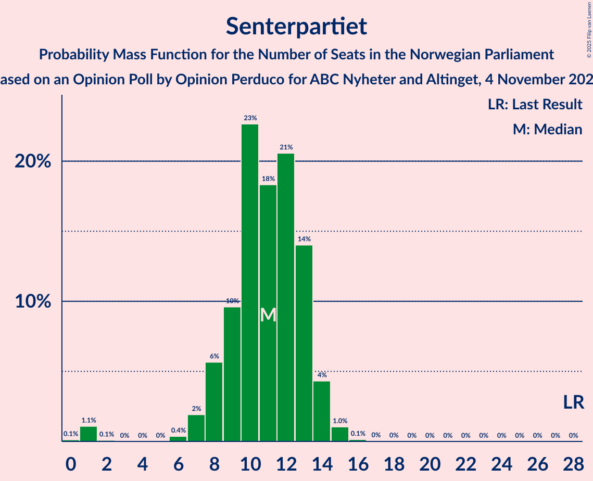
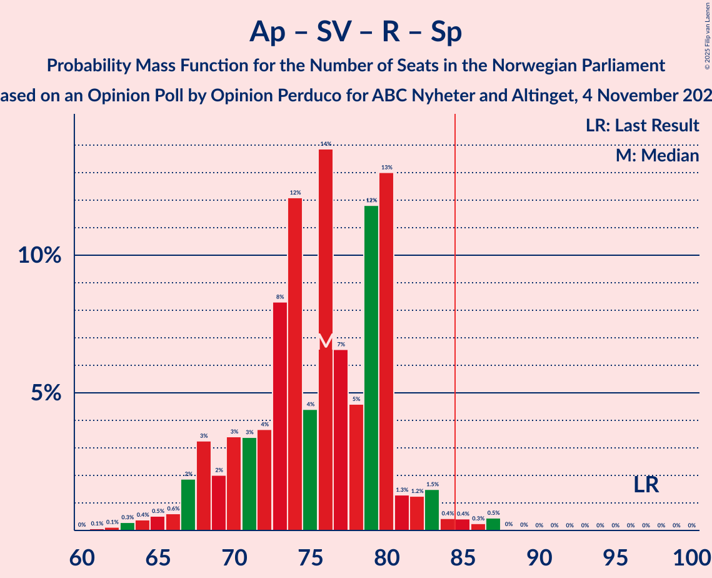
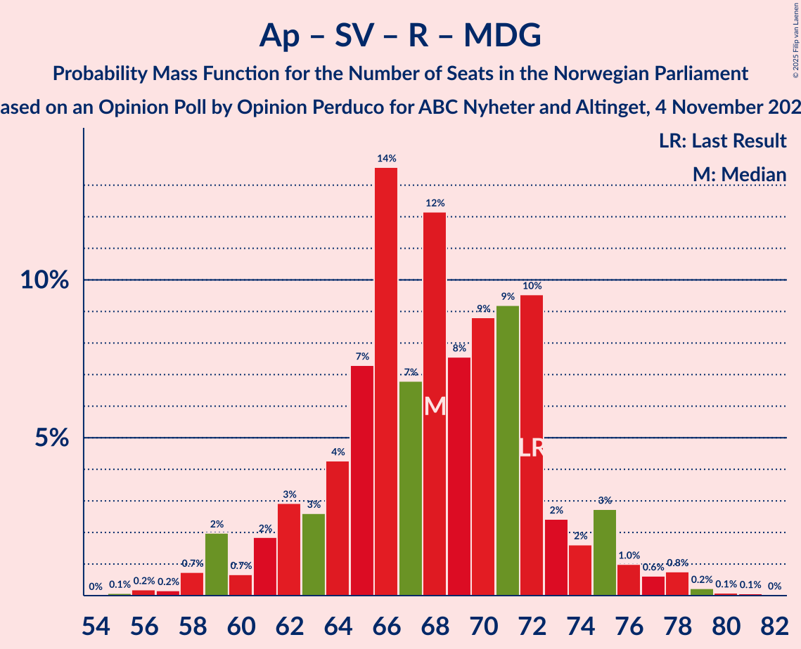
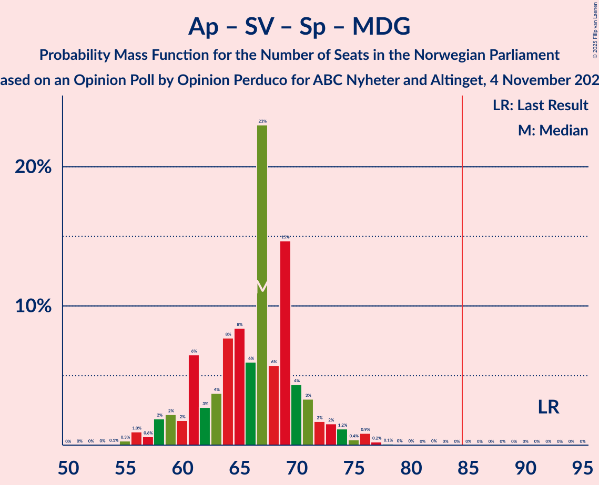
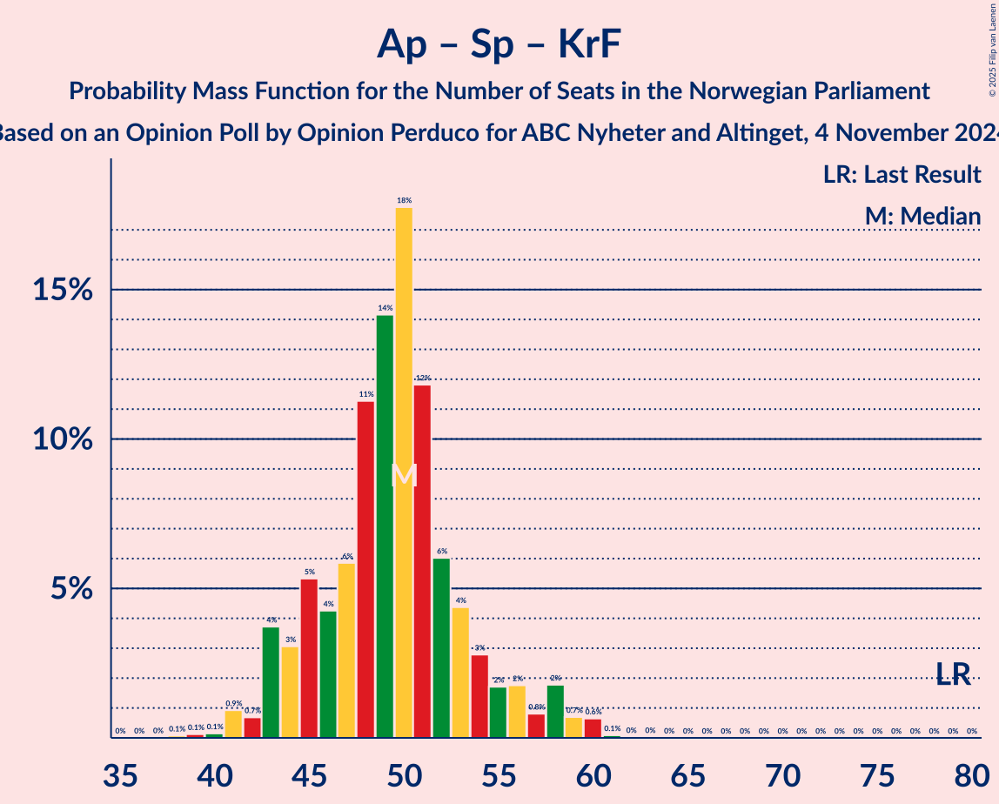

# Opinion Poll by Opinion Perduco for ABC Nyheter and Altinget, 4 November 2024

<a href="#voting-intentions">Voting Intentions</a> | <a href="#seats">Seats</a> | <a href="#coalitions">Coalitions</a> | <a href="#technical-information">Technical Information</a>

## Voting Intentions

### Confidence Intervals

| Party | Last Result | Poll Result | 80% Confidence Interval | 90% Confidence Interval | 95% Confidence Interval | 99% Confidence Interval |
|:-----:|:-----------:|:-----------:|:-----------------------:|:-----------------------:|:-----------------------:|:-----------------------:|
| Høyre | 20.4% | 24.1% | 22.1–26.2% |21.5–26.9% |21.0–27.4% |20.1–28.5% |
| Fremskrittspartiet | 11.6% | 20.1% | 18.3–22.2% |17.8–22.8% |17.3–23.3% |16.5–24.3% |
| Arbeiderpartiet | 26.2% | 19.4% | 17.6–21.5% |17.1–22.0% |16.6–22.5% |15.8–23.5% |
| Sosialistisk Venstreparti | 7.6% | 8.6% | 7.3–10.1% |7.0–10.5% |6.7–10.9% |6.1–11.6% |
| Rødt | 4.7% | 7.1% | 6.0–8.5% |5.7–8.9% |5.4–9.3% |4.9–10.0% |
| Senterpartiet | 13.5% | 5.8% | 4.8–7.1% |4.5–7.5% |4.3–7.8% |3.9–8.5% |
| Venstre | 4.6% | 3.8% | 3.0–4.9% |2.8–5.2% |2.6–5.5% |2.3–6.1% |
| Miljøpartiet De Grønne | 3.9% | 3.5% | 2.7–4.6% |2.5–4.9% |2.3–5.1% |2.0–5.7% |
| Kristelig Folkeparti | 3.8% | 3.0% | 2.3–4.1% |2.2–4.4% |2.0–4.6% |1.7–5.2% |
| Industri- og Næringspartiet | 0.3% | 1.4% | 1.0–2.2% |0.9–2.5% |0.8–2.7% |0.6–3.1% |

*Note:* The poll result column reflects the actual value used in the calculations. Published results may vary slightly, and in addition be rounded to fewer digits.

## Seats

### Confidence Intervals

| Party | Last Result | Median | 80% Confidence Interval | 90% Confidence Interval | 95% Confidence Interval | 99% Confidence Interval |
|:-----:|:-----------:|:------:|:-----------------------:|:-----------------------:|:-----------------------:|:-----------------------:|
| <a href="#høyre">Høyre</a> | 36 | 44 | 40–48 |39–50 |38–50 |36–51 |
| <a href="#fremskrittspartiet">Fremskrittspartiet</a> | 21 | 38 | 34–40 |33–42 |32–43 |30–44 |
| <a href="#arbeiderpartiet">Arbeiderpartiet</a> | 48 | 36 | 32–40 |32–41 |32–42 |31–45 |
| <a href="#sosialistisk-venstreparti">Sosialistisk Venstreparti</a> | 13 | 16 | 13–18 |12–19 |11–20 |10–21 |
| <a href="#rødt">Rødt</a> | 8 | 13 | 11–15 |10–15 |9–16 |8–18 |
| <a href="#senterpartiet">Senterpartiet</a> | 28 | 11 | 9–13 |8–13 |8–14 |6–15 |
| <a href="#venstre">Venstre</a> | 8 | 3 | 2–9 |2–9 |2–10 |1–11 |
| <a href="#miljøpartiet-de-grønne">Miljøpartiet De Grønne</a> | 3 | 2 | 1–8 |1–8 |1–8 |1–10 |
| <a href="#kristelig-folkeparti">Kristelig Folkeparti</a> | 3 | 1 | 1–3 |0–7 |0–8 |0–8 |
| <a href="#industri--og-næringspartiet">Industri- og Næringspartiet</a> | 0 | 0 | 0 |0 |0–1 |0–2 |

### Høyre

*For a full overview of the results for this party, see the [Høyre](party-høyre.html) page.*

| Number of Seats | Probability | Accumulated | Special Marks |
|:---------------:|:-----------:|:-----------:|:-------------:|
| 33 | 0.1% | 100% |  |
| 34 | 0.1% | 99.9% |  |
| 35 | 0.1% | 99.8% |  |
| 36 | 0.4% | 99.7% | Last Result |
| 37 | 0.9% | 99.2% |  |
| 38 | 3% | 98% |  |
| 39 | 3% | 96% |  |
| 40 | 4% | 92% |  |
| 41 | 7% | 88% |  |
| 42 | 6% | 81% |  |
| 43 | 9% | 75% |  |
| 44 | 23% | 65% | Median |
| 45 | 17% | 42% |  |
| 46 | 8% | 26% |  |
| 47 | 5% | 18% |  |
| 48 | 6% | 13% |  |
| 49 | 2% | 7% |  |
| 50 | 5% | 5% |  |
| 51 | 0.5% | 0.8% |  |
| 52 | 0.2% | 0.3% |  |
| 53 | 0% | 0.1% |  |
| 54 | 0% | 0% |  |

### Fremskrittspartiet

*For a full overview of the results for this party, see the [Fremskrittspartiet](party-fremskrittspartiet.html) page.*

| Number of Seats | Probability | Accumulated | Special Marks |
|:---------------:|:-----------:|:-----------:|:-------------:|
| 21 | 0% | 100% | Last Result |
| 22 | 0% | 100% |  |
| 23 | 0% | 100% |  |
| 24 | 0% | 100% |  |
| 25 | 0% | 100% |  |
| 26 | 0% | 100% |  |
| 27 | 0% | 100% |  |
| 28 | 0% | 100% |  |
| 29 | 0.3% | 100% |  |
| 30 | 0.2% | 99.6% |  |
| 31 | 2% | 99.4% |  |
| 32 | 2% | 98% |  |
| 33 | 2% | 96% |  |
| 34 | 5% | 94% |  |
| 35 | 3% | 90% |  |
| 36 | 11% | 87% |  |
| 37 | 14% | 76% |  |
| 38 | 25% | 62% | Median |
| 39 | 19% | 36% |  |
| 40 | 9% | 17% |  |
| 41 | 3% | 9% |  |
| 42 | 2% | 6% |  |
| 43 | 3% | 4% |  |
| 44 | 0.8% | 1.2% |  |
| 45 | 0.1% | 0.4% |  |
| 46 | 0.1% | 0.2% |  |
| 47 | 0.1% | 0.1% |  |
| 48 | 0% | 0.1% |  |
| 49 | 0% | 0% |  |

### Arbeiderpartiet

*For a full overview of the results for this party, see the [Arbeiderpartiet](party-arbeiderpartiet.html) page.*

| Number of Seats | Probability | Accumulated | Special Marks |
|:---------------:|:-----------:|:-----------:|:-------------:|
| 28 | 0.1% | 100% |  |
| 29 | 0.1% | 99.9% |  |
| 30 | 0.1% | 99.8% |  |
| 31 | 2% | 99.7% |  |
| 32 | 9% | 98% |  |
| 33 | 5% | 89% |  |
| 34 | 4% | 84% |  |
| 35 | 10% | 80% |  |
| 36 | 32% | 70% | Median |
| 37 | 7% | 38% |  |
| 38 | 4% | 30% |  |
| 39 | 2% | 26% |  |
| 40 | 17% | 24% |  |
| 41 | 3% | 7% |  |
| 42 | 1.4% | 3% |  |
| 43 | 0.5% | 2% |  |
| 44 | 0.3% | 2% |  |
| 45 | 1.0% | 1.3% |  |
| 46 | 0.3% | 0.4% |  |
| 47 | 0% | 0.1% |  |
| 48 | 0% | 0% | Last Result |

### Sosialistisk Venstreparti

*For a full overview of the results for this party, see the [Sosialistisk Venstreparti](party-sosialistiskvenstreparti.html) page.*

| Number of Seats | Probability | Accumulated | Special Marks |
|:---------------:|:-----------:|:-----------:|:-------------:|
| 9 | 0.1% | 100% |  |
| 10 | 0.4% | 99.9% |  |
| 11 | 2% | 99.4% |  |
| 12 | 5% | 97% |  |
| 13 | 9% | 93% | Last Result |
| 14 | 20% | 84% |  |
| 15 | 6% | 64% |  |
| 16 | 18% | 57% | Median |
| 17 | 26% | 39% |  |
| 18 | 5% | 13% |  |
| 19 | 5% | 8% |  |
| 20 | 3% | 4% |  |
| 21 | 0.8% | 1.1% |  |
| 22 | 0.2% | 0.3% |  |
| 23 | 0.1% | 0.1% |  |
| 24 | 0% | 0% |  |

### Rødt

*For a full overview of the results for this party, see the [Rødt](party-rødt.html) page.*

| Number of Seats | Probability | Accumulated | Special Marks |
|:---------------:|:-----------:|:-----------:|:-------------:|
| 7 | 0.3% | 100% |  |
| 8 | 0.5% | 99.7% | Last Result |
| 9 | 3% | 99.1% |  |
| 10 | 3% | 96% |  |
| 11 | 7% | 92% |  |
| 12 | 18% | 85% |  |
| 13 | 27% | 67% | Median |
| 14 | 29% | 40% |  |
| 15 | 7% | 11% |  |
| 16 | 2% | 4% |  |
| 17 | 1.1% | 2% |  |
| 18 | 0.5% | 0.7% |  |
| 19 | 0.2% | 0.2% |  |
| 20 | 0% | 0% |  |

### Senterpartiet

*For a full overview of the results for this party, see the [Senterpartiet](party-senterpartiet.html) page.*

| Number of Seats | Probability | Accumulated | Special Marks |
|:---------------:|:-----------:|:-----------:|:-------------:|
| 0 | 0.1% | 100% |  |
| 1 | 0.2% | 99.9% |  |
| 2 | 0.1% | 99.7% |  |
| 3 | 0% | 99.6% |  |
| 4 | 0% | 99.6% |  |
| 5 | 0% | 99.6% |  |
| 6 | 0.4% | 99.6% |  |
| 7 | 0.9% | 99.2% |  |
| 8 | 6% | 98% |  |
| 9 | 7% | 93% |  |
| 10 | 30% | 85% |  |
| 11 | 23% | 55% | Median |
| 12 | 13% | 32% |  |
| 13 | 17% | 20% |  |
| 14 | 2% | 3% |  |
| 15 | 0.5% | 0.7% |  |
| 16 | 0.1% | 0.2% |  |
| 17 | 0% | 0.1% |  |
| 18 | 0% | 0% |  |
| 19 | 0% | 0% |  |
| 20 | 0% | 0% |  |
| 21 | 0% | 0% |  |
| 22 | 0% | 0% |  |
| 23 | 0% | 0% |  |
| 24 | 0% | 0% |  |
| 25 | 0% | 0% |  |
| 26 | 0% | 0% |  |
| 27 | 0% | 0% |  |
| 28 | 0% | 0% | Last Result |

### Venstre

*For a full overview of the results for this party, see the [Venstre](party-venstre.html) page.*

| Number of Seats | Probability | Accumulated | Special Marks |
|:---------------:|:-----------:|:-----------:|:-------------:|
| 1 | 0.6% | 100% |  |
| 2 | 37% | 99.4% |  |
| 3 | 35% | 63% | Median |
| 4 | 0% | 28% |  |
| 5 | 0% | 28% |  |
| 6 | 1.3% | 28% |  |
| 7 | 8% | 27% |  |
| 8 | 8% | 19% | Last Result |
| 9 | 8% | 11% |  |
| 10 | 2% | 3% |  |
| 11 | 0.5% | 0.6% |  |
| 12 | 0.1% | 0.1% |  |
| 13 | 0% | 0% |  |

### Miljøpartiet De Grønne

*For a full overview of the results for this party, see the [Miljøpartiet De Grønne](party-miljøpartietdegrønne.html) page.*

| Number of Seats | Probability | Accumulated | Special Marks |
|:---------------:|:-----------:|:-----------:|:-------------:|
| 1 | 18% | 100% |  |
| 2 | 46% | 82% | Median |
| 3 | 12% | 37% | Last Result |
| 4 | 0% | 25% |  |
| 5 | 0% | 25% |  |
| 6 | 2% | 25% |  |
| 7 | 8% | 23% |  |
| 8 | 13% | 15% |  |
| 9 | 2% | 2% |  |
| 10 | 0.5% | 0.6% |  |
| 11 | 0.1% | 0.1% |  |
| 12 | 0% | 0% |  |

### Kristelig Folkeparti

*For a full overview of the results for this party, see the [Kristelig Folkeparti](party-kristeligfolkeparti.html) page.*

| Number of Seats | Probability | Accumulated | Special Marks |
|:---------------:|:-----------:|:-----------:|:-------------:|
| 0 | 7% | 100% |  |
| 1 | 45% | 93% | Median |
| 2 | 21% | 48% |  |
| 3 | 19% | 27% | Last Result |
| 4 | 0% | 9% |  |
| 5 | 0% | 9% |  |
| 6 | 0.3% | 9% |  |
| 7 | 4% | 8% |  |
| 8 | 4% | 4% |  |
| 9 | 0.3% | 0.4% |  |
| 10 | 0.1% | 0.1% |  |
| 11 | 0% | 0% |  |

### Industri- og Næringspartiet

*For a full overview of the results for this party, see the [Industri- og Næringspartiet](party-industri-ognæringspartiet.html) page.*

| Number of Seats | Probability | Accumulated | Special Marks |
|:---------------:|:-----------:|:-----------:|:-------------:|
| 0 | 96% | 100% | Last Result, Median |
| 1 | 2% | 4% |  |
| 2 | 2% | 2% |  |
| 3 | 0% | 0% |  |

## Coalitions

### Confidence Intervals

| Coalition | Last Result | Median | Majority? | 80% Confidence Interval | 90% Confidence Interval | 95% Confidence Interval | 99% Confidence Interval |
|:---------:|:-----------:|:------:|:---------:|:-----------------------:|:-----------------------:|:-----------------------:|:-----------------------:|
| Høyre – Fremskrittspartiet – Senterpartiet – Venstre – Kristelig Folkeparti | 96 | 99 | 100% | 95–103 | 93–105 | 91–106 | 88–110 |
| Høyre – Fremskrittspartiet – Venstre – Miljøpartiet De Grønne – Kristelig Folkeparti | 71 | 91 | 97% | 88–95 | 85–97 | 84–99 | 81–102 |
| Høyre – Fremskrittspartiet – Venstre – Kristelig Folkeparti | 68 | 87 | 88% | 84–93 | 82–94 | 80–96 | 77–99 |
| Høyre – Fremskrittspartiet – Venstre | 65 | 85 | 71% | 81–91 | 79–92 | 78–94 | 75–97 |
| Høyre – Fremskrittspartiet | 57 | 82 | 16% | 77–87 | 76–89 | 75–90 | 72–91 |
| Arbeiderpartiet – Sosialistisk Venstreparti – Rødt – Senterpartiet – Miljøpartiet De Grønne | 100 | 81 | 7% | 74–83 | 72–85 | 70–88 | 67–89 |
| Arbeiderpartiet – Sosialistisk Venstreparti – Rødt – Senterpartiet | 97 | 76 | 1.0% | 71–80 | 68–81 | 67–83 | 64–87 |
| Arbeiderpartiet – Sosialistisk Venstreparti – Senterpartiet – Miljøpartiet De Grønne – Kristelig Folkeparti | 95 | 69 | 0% | 63–73 | 62–75 | 61–76 | 58–78 |
| Arbeiderpartiet – Sosialistisk Venstreparti – Rødt – Miljøpartiet De Grønne | 72 | 68 | 0% | 64–72 | 62–74 | 61–75 | 58–78 |
| Arbeiderpartiet – Sosialistisk Venstreparti – Senterpartiet – Miljøpartiet De Grønne | 92 | 67 | 0% | 61–70 | 60–72 | 58–74 | 56–76 |
| Arbeiderpartiet – Sosialistisk Venstreparti – Senterpartiet | 89 | 63 | 0% | 59–67 | 57–68 | 55–70 | 53–73 |
| Arbeiderpartiet – Senterpartiet – Miljøpartiet De Grønne – Kristelig Folkeparti | 82 | 53 | 0% | 48–58 | 45–60 | 45–62 | 44–63 |
| Arbeiderpartiet – Sosialistisk Venstreparti | 61 | 52 | 0% | 48–57 | 47–57 | 45–59 | 44–62 |
| Arbeiderpartiet – Senterpartiet – Kristelig Folkeparti | 79 | 50 | 0% | 45–53 | 43–56 | 43–58 | 41–60 |
| Høyre – Venstre – Kristelig Folkeparti | 47 | 49 | 0% | 46–54 | 44–56 | 43–58 | 41–61 |
| Arbeiderpartiet – Senterpartiet | 76 | 48 | 0% | 43–50 | 42–52 | 42–53 | 40–57 |
| Senterpartiet – Venstre – Kristelig Folkeparti | 39 | 16 | 0% | 14–22 | 13–23 | 12–25 | 11–28 |

### Høyre – Fremskrittspartiet – Senterpartiet – Venstre – Kristelig Folkeparti

| Number of Seats | Probability | Accumulated | Special Marks |
|:---------------:|:-----------:|:-----------:|:-------------:|
| 86 | 0% | 100% |  |
| 87 | 0.1% | 99.9% |  |
| 88 | 0.5% | 99.9% |  |
| 89 | 0.2% | 99.4% |  |
| 90 | 0.9% | 99.2% |  |
| 91 | 1.1% | 98% |  |
| 92 | 0.8% | 97% |  |
| 93 | 3% | 96% |  |
| 94 | 3% | 93% |  |
| 95 | 4% | 90% |  |
| 96 | 14% | 86% | Last Result |
| 97 | 12% | 72% | Median |
| 98 | 8% | 60% |  |
| 99 | 8% | 52% |  |
| 100 | 14% | 43% |  |
| 101 | 7% | 29% |  |
| 102 | 5% | 22% |  |
| 103 | 9% | 17% |  |
| 104 | 3% | 8% |  |
| 105 | 2% | 5% |  |
| 106 | 1.3% | 3% |  |
| 107 | 0.6% | 2% |  |
| 108 | 0.2% | 1.4% |  |
| 109 | 0.7% | 1.2% |  |
| 110 | 0.4% | 0.5% |  |
| 111 | 0.1% | 0.1% |  |
| 112 | 0% | 0% |  |

### Høyre – Fremskrittspartiet – Venstre – Miljøpartiet De Grønne – Kristelig Folkeparti

| Number of Seats | Probability | Accumulated | Special Marks |
|:---------------:|:-----------:|:-----------:|:-------------:|
| 71 | 0% | 100% | Last Result |
| 72 | 0% | 100% |  |
| 73 | 0% | 100% |  |
| 74 | 0% | 100% |  |
| 75 | 0% | 100% |  |
| 76 | 0% | 100% |  |
| 77 | 0% | 100% |  |
| 78 | 0.1% | 100% |  |
| 79 | 0% | 99.9% |  |
| 80 | 0.2% | 99.9% |  |
| 81 | 0.3% | 99.7% |  |
| 82 | 0.5% | 99.4% |  |
| 83 | 0.7% | 98.9% |  |
| 84 | 1.1% | 98% |  |
| 85 | 2% | 97% | Majority |
| 86 | 2% | 95% |  |
| 87 | 3% | 93% |  |
| 88 | 15% | 90% | Median |
| 89 | 17% | 75% |  |
| 90 | 5% | 58% |  |
| 91 | 8% | 53% |  |
| 92 | 5% | 45% |  |
| 93 | 3% | 40% |  |
| 94 | 17% | 37% |  |
| 95 | 9% | 19% |  |
| 96 | 3% | 10% |  |
| 97 | 3% | 7% |  |
| 98 | 1.3% | 5% |  |
| 99 | 1.0% | 3% |  |
| 100 | 1.2% | 2% |  |
| 101 | 0.4% | 1.3% |  |
| 102 | 0.5% | 0.9% |  |
| 103 | 0.2% | 0.3% |  |
| 104 | 0% | 0.1% |  |
| 105 | 0% | 0.1% |  |
| 106 | 0% | 0.1% |  |
| 107 | 0% | 0% |  |

### Høyre – Fremskrittspartiet – Venstre – Kristelig Folkeparti

| Number of Seats | Probability | Accumulated | Special Marks |
|:---------------:|:-----------:|:-----------:|:-------------:|
| 68 | 0% | 100% | Last Result |
| 69 | 0% | 100% |  |
| 70 | 0% | 100% |  |
| 71 | 0% | 100% |  |
| 72 | 0% | 100% |  |
| 73 | 0% | 100% |  |
| 74 | 0% | 100% |  |
| 75 | 0.1% | 100% |  |
| 76 | 0.1% | 99.9% |  |
| 77 | 0.4% | 99.8% |  |
| 78 | 0.2% | 99.5% |  |
| 79 | 0.4% | 99.3% |  |
| 80 | 2% | 98.8% |  |
| 81 | 1.3% | 97% |  |
| 82 | 2% | 96% |  |
| 83 | 3% | 93% |  |
| 84 | 2% | 90% |  |
| 85 | 3% | 88% | Majority |
| 86 | 24% | 85% | Median |
| 87 | 19% | 61% |  |
| 88 | 5% | 41% |  |
| 89 | 7% | 37% |  |
| 90 | 4% | 29% |  |
| 91 | 6% | 25% |  |
| 92 | 4% | 19% |  |
| 93 | 9% | 15% |  |
| 94 | 1.2% | 6% |  |
| 95 | 1.2% | 5% |  |
| 96 | 2% | 4% |  |
| 97 | 0.2% | 2% |  |
| 98 | 1.1% | 2% |  |
| 99 | 0.5% | 0.6% |  |
| 100 | 0.1% | 0.2% |  |
| 101 | 0.1% | 0.1% |  |
| 102 | 0% | 0.1% |  |
| 103 | 0% | 0% |  |

### Høyre – Fremskrittspartiet – Venstre

| Number of Seats | Probability | Accumulated | Special Marks |
|:---------------:|:-----------:|:-----------:|:-------------:|
| 65 | 0% | 100% | Last Result |
| 66 | 0% | 100% |  |
| 67 | 0% | 100% |  |
| 68 | 0% | 100% |  |
| 69 | 0% | 100% |  |
| 70 | 0% | 100% |  |
| 71 | 0% | 100% |  |
| 72 | 0% | 100% |  |
| 73 | 0.1% | 100% |  |
| 74 | 0.1% | 99.9% |  |
| 75 | 0.3% | 99.8% |  |
| 76 | 0.3% | 99.5% |  |
| 77 | 0.4% | 99.2% |  |
| 78 | 2% | 98.8% |  |
| 79 | 3% | 97% |  |
| 80 | 2% | 94% |  |
| 81 | 3% | 92% |  |
| 82 | 3% | 89% |  |
| 83 | 6% | 86% |  |
| 84 | 9% | 80% |  |
| 85 | 21% | 71% | Median, Majority |
| 86 | 18% | 50% |  |
| 87 | 5% | 31% |  |
| 88 | 5% | 27% |  |
| 89 | 3% | 21% |  |
| 90 | 6% | 19% |  |
| 91 | 4% | 13% |  |
| 92 | 5% | 9% |  |
| 93 | 0.9% | 4% |  |
| 94 | 0.9% | 3% |  |
| 95 | 1.1% | 2% |  |
| 96 | 0.3% | 0.8% |  |
| 97 | 0.4% | 0.5% |  |
| 98 | 0% | 0.1% |  |
| 99 | 0% | 0.1% |  |
| 100 | 0.1% | 0.1% |  |
| 101 | 0% | 0% |  |

### Høyre – Fremskrittspartiet

| Number of Seats | Probability | Accumulated | Special Marks |
|:---------------:|:-----------:|:-----------:|:-------------:|
| 57 | 0% | 100% | Last Result |
| 58 | 0% | 100% |  |
| 59 | 0% | 100% |  |
| 60 | 0% | 100% |  |
| 61 | 0% | 100% |  |
| 62 | 0% | 100% |  |
| 63 | 0% | 100% |  |
| 64 | 0% | 100% |  |
| 65 | 0% | 100% |  |
| 66 | 0% | 100% |  |
| 67 | 0% | 100% |  |
| 68 | 0% | 100% |  |
| 69 | 0.1% | 100% |  |
| 70 | 0.1% | 99.9% |  |
| 71 | 0.3% | 99.8% |  |
| 72 | 0.3% | 99.6% |  |
| 73 | 0.8% | 99.3% |  |
| 74 | 0.9% | 98.6% |  |
| 75 | 2% | 98% |  |
| 76 | 3% | 95% |  |
| 77 | 4% | 92% |  |
| 78 | 5% | 87% |  |
| 79 | 5% | 82% |  |
| 80 | 10% | 77% |  |
| 81 | 7% | 66% |  |
| 82 | 25% | 59% | Median |
| 83 | 2% | 34% |  |
| 84 | 16% | 32% |  |
| 85 | 3% | 16% | Majority |
| 86 | 2% | 14% |  |
| 87 | 5% | 12% |  |
| 88 | 2% | 7% |  |
| 89 | 1.0% | 6% |  |
| 90 | 4% | 5% |  |
| 91 | 0.2% | 0.6% |  |
| 92 | 0.1% | 0.4% |  |
| 93 | 0.2% | 0.2% |  |
| 94 | 0% | 0.1% |  |
| 95 | 0% | 0% |  |

### Arbeiderpartiet – Sosialistisk Venstreparti – Rødt – Senterpartiet – Miljøpartiet De Grønne

| Number of Seats | Probability | Accumulated | Special Marks |
|:---------------:|:-----------:|:-----------:|:-------------:|
| 64 | 0.1% | 100% |  |
| 65 | 0.1% | 99.9% |  |
| 66 | 0.3% | 99.8% |  |
| 67 | 0.1% | 99.5% |  |
| 68 | 0.3% | 99.4% |  |
| 69 | 0.8% | 99.1% |  |
| 70 | 2% | 98% |  |
| 71 | 0.8% | 97% |  |
| 72 | 2% | 96% |  |
| 73 | 3% | 93% |  |
| 74 | 2% | 91% |  |
| 75 | 10% | 89% |  |
| 76 | 5% | 79% |  |
| 77 | 6% | 74% |  |
| 78 | 5% | 68% | Median |
| 79 | 7% | 63% |  |
| 80 | 3% | 56% |  |
| 81 | 18% | 53% |  |
| 82 | 25% | 35% |  |
| 83 | 2% | 10% |  |
| 84 | 1.2% | 9% |  |
| 85 | 3% | 7% | Majority |
| 86 | 1.2% | 4% |  |
| 87 | 0.5% | 3% |  |
| 88 | 2% | 3% |  |
| 89 | 0.4% | 0.8% |  |
| 90 | 0.3% | 0.4% |  |
| 91 | 0.1% | 0.1% |  |
| 92 | 0% | 0.1% |  |
| 93 | 0% | 0.1% |  |
| 94 | 0.1% | 0.1% |  |
| 95 | 0% | 0% |  |
| 96 | 0% | 0% |  |
| 97 | 0% | 0% |  |
| 98 | 0% | 0% |  |
| 99 | 0% | 0% |  |
| 100 | 0% | 0% | Last Result |

### Arbeiderpartiet – Sosialistisk Venstreparti – Rødt – Senterpartiet

| Number of Seats | Probability | Accumulated | Special Marks |
|:---------------:|:-----------:|:-----------:|:-------------:|
| 60 | 0% | 100% |  |
| 61 | 0% | 99.9% |  |
| 62 | 0.1% | 99.9% |  |
| 63 | 0.1% | 99.8% |  |
| 64 | 0.5% | 99.7% |  |
| 65 | 0.4% | 99.2% |  |
| 66 | 0.7% | 98.8% |  |
| 67 | 2% | 98% |  |
| 68 | 2% | 96% |  |
| 69 | 2% | 95% |  |
| 70 | 2% | 93% |  |
| 71 | 3% | 91% |  |
| 72 | 4% | 88% |  |
| 73 | 10% | 84% |  |
| 74 | 18% | 75% |  |
| 75 | 3% | 57% |  |
| 76 | 5% | 54% | Median |
| 77 | 8% | 49% |  |
| 78 | 3% | 41% |  |
| 79 | 16% | 37% |  |
| 80 | 15% | 21% |  |
| 81 | 1.3% | 6% |  |
| 82 | 0.9% | 4% |  |
| 83 | 2% | 4% |  |
| 84 | 0.3% | 1.3% |  |
| 85 | 0.3% | 1.0% | Majority |
| 86 | 0.1% | 0.7% |  |
| 87 | 0.5% | 0.6% |  |
| 88 | 0.1% | 0.1% |  |
| 89 | 0% | 0% |  |
| 90 | 0% | 0% |  |
| 91 | 0% | 0% |  |
| 92 | 0% | 0% |  |
| 93 | 0% | 0% |  |
| 94 | 0% | 0% |  |
| 95 | 0% | 0% |  |
| 96 | 0% | 0% |  |
| 97 | 0% | 0% | Last Result |

### Arbeiderpartiet – Sosialistisk Venstreparti – Senterpartiet – Miljøpartiet De Grønne – Kristelig Folkeparti

| Number of Seats | Probability | Accumulated | Special Marks |
|:---------------:|:-----------:|:-----------:|:-------------:|
| 55 | 0% | 100% |  |
| 56 | 0.1% | 99.9% |  |
| 57 | 0.2% | 99.9% |  |
| 58 | 0.5% | 99.6% |  |
| 59 | 0.7% | 99.1% |  |
| 60 | 0.7% | 98% |  |
| 61 | 2% | 98% |  |
| 62 | 5% | 96% |  |
| 63 | 2% | 91% |  |
| 64 | 7% | 89% |  |
| 65 | 5% | 82% |  |
| 66 | 3% | 76% | Median |
| 67 | 6% | 73% |  |
| 68 | 16% | 67% |  |
| 69 | 4% | 51% |  |
| 70 | 28% | 47% |  |
| 71 | 3% | 19% |  |
| 72 | 3% | 16% |  |
| 73 | 4% | 12% |  |
| 74 | 1.2% | 8% |  |
| 75 | 2% | 7% |  |
| 76 | 3% | 4% |  |
| 77 | 0.7% | 2% |  |
| 78 | 0.8% | 1.2% |  |
| 79 | 0.1% | 0.4% |  |
| 80 | 0.1% | 0.3% |  |
| 81 | 0.1% | 0.2% |  |
| 82 | 0% | 0.1% |  |
| 83 | 0% | 0.1% |  |
| 84 | 0% | 0.1% |  |
| 85 | 0% | 0% | Majority |
| 86 | 0% | 0% |  |
| 87 | 0% | 0% |  |
| 88 | 0% | 0% |  |
| 89 | 0% | 0% |  |
| 90 | 0% | 0% |  |
| 91 | 0% | 0% |  |
| 92 | 0% | 0% |  |
| 93 | 0% | 0% |  |
| 94 | 0% | 0% |  |
| 95 | 0% | 0% | Last Result |

### Arbeiderpartiet – Sosialistisk Venstreparti – Rødt – Miljøpartiet De Grønne

| Number of Seats | Probability | Accumulated | Special Marks |
|:---------------:|:-----------:|:-----------:|:-------------:|
| 55 | 0.1% | 100% |  |
| 56 | 0.1% | 99.9% |  |
| 57 | 0.2% | 99.8% |  |
| 58 | 0.8% | 99.6% |  |
| 59 | 0.8% | 98.9% |  |
| 60 | 0.5% | 98% |  |
| 61 | 2% | 98% |  |
| 62 | 3% | 96% |  |
| 63 | 3% | 93% |  |
| 64 | 4% | 90% |  |
| 65 | 9% | 86% |  |
| 66 | 6% | 77% |  |
| 67 | 8% | 71% | Median |
| 68 | 14% | 63% |  |
| 69 | 7% | 49% |  |
| 70 | 9% | 42% |  |
| 71 | 10% | 33% |  |
| 72 | 14% | 23% | Last Result |
| 73 | 2% | 9% |  |
| 74 | 2% | 7% |  |
| 75 | 3% | 5% |  |
| 76 | 0.3% | 2% |  |
| 77 | 0.7% | 2% |  |
| 78 | 0.7% | 1.1% |  |
| 79 | 0.2% | 0.4% |  |
| 80 | 0.1% | 0.2% |  |
| 81 | 0.1% | 0.1% |  |
| 82 | 0% | 0% |  |

### Arbeiderpartiet – Sosialistisk Venstreparti – Senterpartiet – Miljøpartiet De Grønne

| Number of Seats | Probability | Accumulated | Special Marks |
|:---------------:|:-----------:|:-----------:|:-------------:|
| 54 | 0.1% | 100% |  |
| 55 | 0.1% | 99.9% |  |
| 56 | 0.5% | 99.7% |  |
| 57 | 0.6% | 99.2% |  |
| 58 | 2% | 98.6% |  |
| 59 | 1.4% | 97% |  |
| 60 | 2% | 95% |  |
| 61 | 9% | 94% |  |
| 62 | 3% | 85% |  |
| 63 | 3% | 82% |  |
| 64 | 8% | 79% |  |
| 65 | 8% | 71% | Median |
| 66 | 4% | 63% |  |
| 67 | 20% | 59% |  |
| 68 | 5% | 39% |  |
| 69 | 22% | 34% |  |
| 70 | 4% | 12% |  |
| 71 | 1.4% | 8% |  |
| 72 | 2% | 6% |  |
| 73 | 2% | 5% |  |
| 74 | 1.5% | 3% |  |
| 75 | 0.2% | 2% |  |
| 76 | 1.0% | 1.4% |  |
| 77 | 0.3% | 0.5% |  |
| 78 | 0.1% | 0.2% |  |
| 79 | 0% | 0.1% |  |
| 80 | 0% | 0.1% |  |
| 81 | 0% | 0.1% |  |
| 82 | 0% | 0% |  |
| 83 | 0% | 0% |  |
| 84 | 0% | 0% |  |
| 85 | 0% | 0% | Majority |
| 86 | 0% | 0% |  |
| 87 | 0% | 0% |  |
| 88 | 0% | 0% |  |
| 89 | 0% | 0% |  |
| 90 | 0% | 0% |  |
| 91 | 0% | 0% |  |
| 92 | 0% | 0% | Last Result |

### Arbeiderpartiet – Sosialistisk Venstreparti – Senterpartiet

| Number of Seats | Probability | Accumulated | Special Marks |
|:---------------:|:-----------:|:-----------:|:-------------:|
| 50 | 0% | 100% |  |
| 51 | 0.1% | 99.9% |  |
| 52 | 0.1% | 99.9% |  |
| 53 | 0.5% | 99.8% |  |
| 54 | 0.5% | 99.3% |  |
| 55 | 1.4% | 98.8% |  |
| 56 | 2% | 97% |  |
| 57 | 1.3% | 96% |  |
| 58 | 3% | 94% |  |
| 59 | 8% | 91% |  |
| 60 | 10% | 84% |  |
| 61 | 12% | 73% |  |
| 62 | 8% | 62% |  |
| 63 | 6% | 53% | Median |
| 64 | 4% | 47% |  |
| 65 | 20% | 43% |  |
| 66 | 4% | 24% |  |
| 67 | 15% | 20% |  |
| 68 | 1.3% | 5% |  |
| 69 | 0.9% | 4% |  |
| 70 | 2% | 3% |  |
| 71 | 0.7% | 1.4% |  |
| 72 | 0.1% | 0.7% |  |
| 73 | 0.1% | 0.5% |  |
| 74 | 0.1% | 0.4% |  |
| 75 | 0.3% | 0.4% |  |
| 76 | 0% | 0% |  |
| 77 | 0% | 0% |  |
| 78 | 0% | 0% |  |
| 79 | 0% | 0% |  |
| 80 | 0% | 0% |  |
| 81 | 0% | 0% |  |
| 82 | 0% | 0% |  |
| 83 | 0% | 0% |  |
| 84 | 0% | 0% |  |
| 85 | 0% | 0% | Majority |
| 86 | 0% | 0% |  |
| 87 | 0% | 0% |  |
| 88 | 0% | 0% |  |
| 89 | 0% | 0% | Last Result |

### Arbeiderpartiet – Senterpartiet – Miljøpartiet De Grønne – Kristelig Folkeparti

| Number of Seats | Probability | Accumulated | Special Marks |
|:---------------:|:-----------:|:-----------:|:-------------:|
| 42 | 0.1% | 100% |  |
| 43 | 0.2% | 99.8% |  |
| 44 | 0.8% | 99.6% |  |
| 45 | 5% | 98.8% |  |
| 46 | 0.7% | 94% |  |
| 47 | 3% | 93% |  |
| 48 | 3% | 91% |  |
| 49 | 4% | 87% |  |
| 50 | 10% | 83% | Median |
| 51 | 6% | 73% |  |
| 52 | 14% | 68% |  |
| 53 | 18% | 53% |  |
| 54 | 6% | 35% |  |
| 55 | 4% | 29% |  |
| 56 | 10% | 26% |  |
| 57 | 5% | 15% |  |
| 58 | 2% | 10% |  |
| 59 | 2% | 8% |  |
| 60 | 2% | 6% |  |
| 61 | 0.8% | 3% |  |
| 62 | 1.3% | 3% |  |
| 63 | 0.9% | 1.3% |  |
| 64 | 0.1% | 0.4% |  |
| 65 | 0.1% | 0.3% |  |
| 66 | 0.1% | 0.2% |  |
| 67 | 0% | 0.1% |  |
| 68 | 0.1% | 0.1% |  |
| 69 | 0% | 0% |  |
| 70 | 0% | 0% |  |
| 71 | 0% | 0% |  |
| 72 | 0% | 0% |  |
| 73 | 0% | 0% |  |
| 74 | 0% | 0% |  |
| 75 | 0% | 0% |  |
| 76 | 0% | 0% |  |
| 77 | 0% | 0% |  |
| 78 | 0% | 0% |  |
| 79 | 0% | 0% |  |
| 80 | 0% | 0% |  |
| 81 | 0% | 0% |  |
| 82 | 0% | 0% | Last Result |

### Arbeiderpartiet – Sosialistisk Venstreparti

| Number of Seats | Probability | Accumulated | Special Marks |
|:---------------:|:-----------:|:-----------:|:-------------:|
| 41 | 0% | 100% |  |
| 42 | 0.2% | 99.9% |  |
| 43 | 0.1% | 99.8% |  |
| 44 | 0.4% | 99.6% |  |
| 45 | 2% | 99.2% |  |
| 46 | 0.9% | 97% |  |
| 47 | 4% | 96% |  |
| 48 | 3% | 93% |  |
| 49 | 12% | 90% |  |
| 50 | 16% | 78% |  |
| 51 | 5% | 62% |  |
| 52 | 16% | 56% | Median |
| 53 | 8% | 40% |  |
| 54 | 8% | 32% |  |
| 55 | 4% | 24% |  |
| 56 | 3% | 20% |  |
| 57 | 13% | 17% |  |
| 58 | 0.9% | 4% |  |
| 59 | 0.6% | 3% |  |
| 60 | 2% | 2% |  |
| 61 | 0.1% | 0.6% | Last Result |
| 62 | 0.4% | 0.5% |  |
| 63 | 0.1% | 0.2% |  |
| 64 | 0% | 0% |  |

### Arbeiderpartiet – Senterpartiet – Kristelig Folkeparti

| Number of Seats | Probability | Accumulated | Special Marks |
|:---------------:|:-----------:|:-----------:|:-------------:|
| 39 | 0% | 100% |  |
| 40 | 0.1% | 99.9% |  |
| 41 | 0.3% | 99.8% |  |
| 42 | 0.5% | 99.5% |  |
| 43 | 5% | 98.9% |  |
| 44 | 2% | 93% |  |
| 45 | 5% | 91% |  |
| 46 | 4% | 86% |  |
| 47 | 5% | 82% |  |
| 48 | 14% | 77% | Median |
| 49 | 9% | 64% |  |
| 50 | 20% | 54% |  |
| 51 | 15% | 34% |  |
| 52 | 6% | 19% |  |
| 53 | 3% | 13% |  |
| 54 | 3% | 9% |  |
| 55 | 1.2% | 6% |  |
| 56 | 0.6% | 5% |  |
| 57 | 1.0% | 5% |  |
| 58 | 2% | 4% |  |
| 59 | 0.4% | 2% |  |
| 60 | 1.0% | 1.1% |  |
| 61 | 0.1% | 0.1% |  |
| 62 | 0% | 0.1% |  |
| 63 | 0% | 0% |  |
| 64 | 0% | 0% |  |
| 65 | 0% | 0% |  |
| 66 | 0% | 0% |  |
| 67 | 0% | 0% |  |
| 68 | 0% | 0% |  |
| 69 | 0% | 0% |  |
| 70 | 0% | 0% |  |
| 71 | 0% | 0% |  |
| 72 | 0% | 0% |  |
| 73 | 0% | 0% |  |
| 74 | 0% | 0% |  |
| 75 | 0% | 0% |  |
| 76 | 0% | 0% |  |
| 77 | 0% | 0% |  |
| 78 | 0% | 0% |  |
| 79 | 0% | 0% | Last Result |

### Høyre – Venstre – Kristelig Folkeparti

| Number of Seats | Probability | Accumulated | Special Marks |
|:---------------:|:-----------:|:-----------:|:-------------:|
| 39 | 0% | 100% |  |
| 40 | 0.2% | 99.9% |  |
| 41 | 0.4% | 99.8% |  |
| 42 | 0.5% | 99.4% |  |
| 43 | 3% | 98.9% |  |
| 44 | 2% | 96% |  |
| 45 | 1.4% | 94% |  |
| 46 | 3% | 93% |  |
| 47 | 3% | 90% | Last Result |
| 48 | 34% | 87% | Median |
| 49 | 4% | 53% |  |
| 50 | 8% | 49% |  |
| 51 | 4% | 41% |  |
| 52 | 5% | 37% |  |
| 53 | 13% | 32% |  |
| 54 | 10% | 19% |  |
| 55 | 3% | 9% |  |
| 56 | 2% | 6% |  |
| 57 | 1.0% | 4% |  |
| 58 | 1.5% | 3% |  |
| 59 | 0.9% | 2% |  |
| 60 | 0.2% | 1.1% |  |
| 61 | 0.7% | 0.9% |  |
| 62 | 0.1% | 0.1% |  |
| 63 | 0% | 0.1% |  |
| 64 | 0% | 0% |  |

### Arbeiderpartiet – Senterpartiet

| Number of Seats | Probability | Accumulated | Special Marks |
|:---------------:|:-----------:|:-----------:|:-------------:|
| 37 | 0% | 100% |  |
| 38 | 0.2% | 99.9% |  |
| 39 | 0.2% | 99.8% |  |
| 40 | 0.5% | 99.6% |  |
| 41 | 1.0% | 99.1% |  |
| 42 | 7% | 98% |  |
| 43 | 3% | 91% |  |
| 44 | 4% | 88% |  |
| 45 | 8% | 83% |  |
| 46 | 10% | 75% |  |
| 47 | 14% | 65% | Median |
| 48 | 11% | 51% |  |
| 49 | 15% | 41% |  |
| 50 | 17% | 26% |  |
| 51 | 4% | 9% |  |
| 52 | 2% | 5% |  |
| 53 | 1.3% | 3% |  |
| 54 | 0.3% | 2% |  |
| 55 | 0.4% | 2% |  |
| 56 | 0.6% | 1.2% |  |
| 57 | 0.3% | 0.6% |  |
| 58 | 0.3% | 0.3% |  |
| 59 | 0% | 0% |  |
| 60 | 0% | 0% |  |
| 61 | 0% | 0% |  |
| 62 | 0% | 0% |  |
| 63 | 0% | 0% |  |
| 64 | 0% | 0% |  |
| 65 | 0% | 0% |  |
| 66 | 0% | 0% |  |
| 67 | 0% | 0% |  |
| 68 | 0% | 0% |  |
| 69 | 0% | 0% |  |
| 70 | 0% | 0% |  |
| 71 | 0% | 0% |  |
| 72 | 0% | 0% |  |
| 73 | 0% | 0% |  |
| 74 | 0% | 0% |  |
| 75 | 0% | 0% |  |
| 76 | 0% | 0% | Last Result |

### Senterpartiet – Venstre – Kristelig Folkeparti

| Number of Seats | Probability | Accumulated | Special Marks |
|:---------------:|:-----------:|:-----------:|:-------------:|
| 5 | 0% | 100% |  |
| 6 | 0% | 99.9% |  |
| 7 | 0.1% | 99.9% |  |
| 8 | 0% | 99.8% |  |
| 9 | 0% | 99.8% |  |
| 10 | 0.2% | 99.8% |  |
| 11 | 0.7% | 99.6% |  |
| 12 | 2% | 98.9% |  |
| 13 | 7% | 97% |  |
| 14 | 15% | 90% |  |
| 15 | 13% | 75% | Median |
| 16 | 20% | 62% |  |
| 17 | 10% | 42% |  |
| 18 | 5% | 33% |  |
| 19 | 3% | 27% |  |
| 20 | 5% | 24% |  |
| 21 | 6% | 19% |  |
| 22 | 8% | 13% |  |
| 23 | 2% | 5% |  |
| 24 | 1.0% | 4% |  |
| 25 | 0.7% | 3% |  |
| 26 | 1.2% | 2% |  |
| 27 | 0.1% | 0.7% |  |
| 28 | 0.3% | 0.6% |  |
| 29 | 0.2% | 0.3% |  |
| 30 | 0% | 0% |  |
| 31 | 0% | 0% |  |
| 32 | 0% | 0% |  |
| 33 | 0% | 0% |  |
| 34 | 0% | 0% |  |
| 35 | 0% | 0% |  |
| 36 | 0% | 0% |  |
| 37 | 0% | 0% |  |
| 38 | 0% | 0% |  |
| 39 | 0% | 0% | Last Result |

## Technical Information

### Opinion Poll

+ **Polling firm:** Opinion Perduco
+ **Commissioner(s):** ABC Nyheter and Altinget
+ **Fieldwork period:** 4 November 2024

### Calculations

+ **Sample size:** 690
+ **Simulations done:** 1,048,576
+ **Error estimate:** 1.63%

