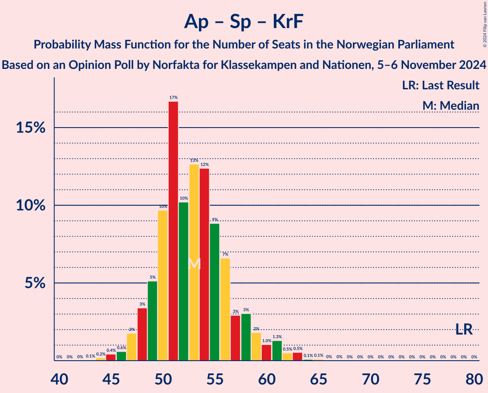

# Opinion Poll by Norfakta for Klassekampen and Nationen, 5–6 November 2024

<a href="#voting-intentions">Voting Intentions</a> | <a href="#seats">Seats</a> | <a href="#coalitions">Coalitions</a> | <a href="#technical-information">Technical Information</a>

## Voting Intentions

### Confidence Intervals

| Party | Last Result | Poll Result | 80% Confidence Interval | 90% Confidence Interval | 95% Confidence Interval | 99% Confidence Interval |
|:-----:|:-----------:|:-----------:|:-----------------------:|:-----------------------:|:-----------------------:|:-----------------------:|
| Høyre | 20.4% | 22.4% | 20.6–24.4% |20.1–25.0% |19.6–25.5% |18.8–26.5% |
| Fremskrittspartiet | 11.6% | 21.3% | 19.5–23.3% |19.0–23.8% |18.5–24.3% |17.7–25.3% |
| Arbeiderpartiet | 26.2% | 20.9% | 19.1–22.9% |18.6–23.4% |18.2–23.9% |17.4–24.9% |
| Sosialistisk Venstreparti | 7.6% | 9.4% | 8.1–10.8% |7.8–11.2% |7.5–11.6% |7.0–12.4% |
| Senterpartiet | 13.5% | 7.4% | 6.4–8.8% |6.1–9.2% |5.8–9.5% |5.3–10.2% |
| Rødt | 4.7% | 4.7% | 3.9–5.9% |3.7–6.2% |3.5–6.5% |3.1–7.1% |
| Venstre | 4.6% | 4.4% | 3.6–5.5% |3.3–5.8% |3.1–6.0% |2.8–6.6% |
| Miljøpartiet De Grønne | 3.9% | 3.3% | 2.6–4.3% |2.4–4.6% |2.3–4.8% |2.0–5.4% |
| Kristelig Folkeparti | 3.8% | 2.6% | 2.0–3.5% |1.8–3.7% |1.7–3.9% |1.4–4.4% |
| Industri- og Næringspartiet | 0.3% | 0.6% | 0.4–1.2% |0.3–1.3% |0.3–1.5% |0.2–1.8% |

*Note:* The poll result column reflects the actual value used in the calculations. Published results may vary slightly, and in addition be rounded to fewer digits.

## Seats

### Confidence Intervals

| Party | Last Result | Median | 80% Confidence Interval | 90% Confidence Interval | 95% Confidence Interval | 99% Confidence Interval |
|:-----:|:-----------:|:------:|:-----------------------:|:-----------------------:|:-----------------------:|:-----------------------:|
| <a href="#høyre">Høyre</a> | 36 | 41 | 37–44 |35–46 |35–47 |33–49 |
| <a href="#fremskrittspartiet">Fremskrittspartiet</a> | 21 | 39 | 35–43 |35–44 |34–45 |32–46 |
| <a href="#arbeiderpartiet">Arbeiderpartiet</a> | 48 | 38 | 35–41 |35–43 |33–45 |32–46 |
| <a href="#sosialistisk-venstreparti">Sosialistisk Venstreparti</a> | 13 | 17 | 14–20 |13–21 |13–21 |12–23 |
| <a href="#senterpartiet">Senterpartiet</a> | 28 | 14 | 11–16 |11–17 |10–17 |9–19 |
| <a href="#rødt">Rødt</a> | 8 | 8 | 1–10 |1–11 |1–12 |1–13 |
| <a href="#venstre">Venstre</a> | 8 | 8 | 3–10 |2–10 |2–11 |2–11 |
| <a href="#miljøpartiet-de-grønne">Miljøpartiet De Grønne</a> | 3 | 2 | 1–8 |1–8 |1–9 |1–9 |
| <a href="#kristelig-folkeparti">Kristelig Folkeparti</a> | 3 | 1 | 0–2 |0–3 |0–3 |0–8 |
| <a href="#industri--og-næringspartiet">Industri- og Næringspartiet</a> | 0 | 0 | 0 |0 |0 |0 |

### Høyre

*For a full overview of the results for this party, see the [Høyre](party-høyre.html) page.*

| Number of Seats | Probability | Accumulated | Special Marks |
|:---------------:|:-----------:|:-----------:|:-------------:|
| 32 | 0.1% | 100% |  |
| 33 | 0.8% | 99.8% |  |
| 34 | 1.1% | 99.0% |  |
| 35 | 3% | 98% |  |
| 36 | 3% | 95% | Last Result |
| 37 | 11% | 92% |  |
| 38 | 8% | 81% |  |
| 39 | 11% | 73% |  |
| 40 | 11% | 62% |  |
| 41 | 9% | 51% | Median |
| 42 | 9% | 42% |  |
| 43 | 9% | 33% |  |
| 44 | 14% | 23% |  |
| 45 | 2% | 10% |  |
| 46 | 4% | 7% |  |
| 47 | 2% | 3% |  |
| 48 | 0.3% | 1.0% |  |
| 49 | 0.5% | 0.7% |  |
| 50 | 0.1% | 0.2% |  |
| 51 | 0.1% | 0.1% |  |
| 52 | 0% | 0% |  |

### Fremskrittspartiet

*For a full overview of the results for this party, see the [Fremskrittspartiet](party-fremskrittspartiet.html) page.*

| Number of Seats | Probability | Accumulated | Special Marks |
|:---------------:|:-----------:|:-----------:|:-------------:|
| 21 | 0% | 100% | Last Result |
| 22 | 0% | 100% |  |
| 23 | 0% | 100% |  |
| 24 | 0% | 100% |  |
| 25 | 0% | 100% |  |
| 26 | 0% | 100% |  |
| 27 | 0% | 100% |  |
| 28 | 0% | 100% |  |
| 29 | 0% | 100% |  |
| 30 | 0.1% | 100% |  |
| 31 | 0.1% | 99.9% |  |
| 32 | 0.4% | 99.8% |  |
| 33 | 1.1% | 99.4% |  |
| 34 | 3% | 98% |  |
| 35 | 6% | 96% |  |
| 36 | 5% | 89% |  |
| 37 | 6% | 85% |  |
| 38 | 8% | 78% |  |
| 39 | 24% | 71% | Median |
| 40 | 13% | 47% |  |
| 41 | 10% | 34% |  |
| 42 | 11% | 24% |  |
| 43 | 6% | 14% |  |
| 44 | 3% | 7% |  |
| 45 | 3% | 4% |  |
| 46 | 0.8% | 1.3% |  |
| 47 | 0.4% | 0.5% |  |
| 48 | 0.1% | 0.1% |  |
| 49 | 0% | 0% |  |

### Arbeiderpartiet

*For a full overview of the results for this party, see the [Arbeiderpartiet](party-arbeiderpartiet.html) page.*

| Number of Seats | Probability | Accumulated | Special Marks |
|:---------------:|:-----------:|:-----------:|:-------------:|
| 31 | 0.3% | 100% |  |
| 32 | 1.5% | 99.6% |  |
| 33 | 1.2% | 98% |  |
| 34 | 2% | 97% |  |
| 35 | 6% | 95% |  |
| 36 | 17% | 89% |  |
| 37 | 13% | 73% |  |
| 38 | 19% | 60% | Median |
| 39 | 14% | 41% |  |
| 40 | 10% | 27% |  |
| 41 | 8% | 18% |  |
| 42 | 3% | 10% |  |
| 43 | 3% | 7% |  |
| 44 | 2% | 4% |  |
| 45 | 0.9% | 3% |  |
| 46 | 1.1% | 2% |  |
| 47 | 0.3% | 0.5% |  |
| 48 | 0.2% | 0.2% | Last Result |
| 49 | 0% | 0% |  |

### Sosialistisk Venstreparti

*For a full overview of the results for this party, see the [Sosialistisk Venstreparti](party-sosialistiskvenstreparti.html) page.*

| Number of Seats | Probability | Accumulated | Special Marks |
|:---------------:|:-----------:|:-----------:|:-------------:|
| 10 | 0.1% | 100% |  |
| 11 | 0.3% | 99.9% |  |
| 12 | 0.8% | 99.6% |  |
| 13 | 4% | 98.8% | Last Result |
| 14 | 6% | 95% |  |
| 15 | 10% | 89% |  |
| 16 | 15% | 78% |  |
| 17 | 27% | 64% | Median |
| 18 | 15% | 37% |  |
| 19 | 8% | 22% |  |
| 20 | 8% | 14% |  |
| 21 | 4% | 6% |  |
| 22 | 1.3% | 2% |  |
| 23 | 0.6% | 0.7% |  |
| 24 | 0.1% | 0.1% |  |
| 25 | 0% | 0% |  |

### Senterpartiet

*For a full overview of the results for this party, see the [Senterpartiet](party-senterpartiet.html) page.*

| Number of Seats | Probability | Accumulated | Special Marks |
|:---------------:|:-----------:|:-----------:|:-------------:|
| 8 | 0.1% | 100% |  |
| 9 | 1.3% | 99.9% |  |
| 10 | 3% | 98.6% |  |
| 11 | 11% | 96% |  |
| 12 | 14% | 85% |  |
| 13 | 19% | 71% |  |
| 14 | 24% | 52% | Median |
| 15 | 13% | 28% |  |
| 16 | 9% | 15% |  |
| 17 | 4% | 5% |  |
| 18 | 1.4% | 2% |  |
| 19 | 0.4% | 0.5% |  |
| 20 | 0.1% | 0.2% |  |
| 21 | 0% | 0% |  |
| 22 | 0% | 0% |  |
| 23 | 0% | 0% |  |
| 24 | 0% | 0% |  |
| 25 | 0% | 0% |  |
| 26 | 0% | 0% |  |
| 27 | 0% | 0% |  |
| 28 | 0% | 0% | Last Result |

### Rødt

*For a full overview of the results for this party, see the [Rødt](party-rødt.html) page.*

| Number of Seats | Probability | Accumulated | Special Marks |
|:---------------:|:-----------:|:-----------:|:-------------:|
| 1 | 17% | 100% |  |
| 2 | 0.3% | 83% |  |
| 3 | 0% | 83% |  |
| 4 | 0% | 83% |  |
| 5 | 0% | 83% |  |
| 6 | 0.2% | 83% |  |
| 7 | 10% | 83% |  |
| 8 | 29% | 73% | Last Result, Median |
| 9 | 22% | 44% |  |
| 10 | 13% | 22% |  |
| 11 | 6% | 9% |  |
| 12 | 2% | 3% |  |
| 13 | 0.5% | 0.6% |  |
| 14 | 0.1% | 0.2% |  |
| 15 | 0% | 0% |  |

### Venstre

*For a full overview of the results for this party, see the [Venstre](party-venstre.html) page.*

| Number of Seats | Probability | Accumulated | Special Marks |
|:---------------:|:-----------:|:-----------:|:-------------:|
| 2 | 8% | 100% |  |
| 3 | 21% | 92% |  |
| 4 | 0% | 71% |  |
| 5 | 0% | 71% |  |
| 6 | 0.2% | 71% |  |
| 7 | 11% | 71% |  |
| 8 | 29% | 60% | Last Result, Median |
| 9 | 21% | 31% |  |
| 10 | 7% | 10% |  |
| 11 | 3% | 3% |  |
| 12 | 0.4% | 0.5% |  |
| 13 | 0.1% | 0.1% |  |
| 14 | 0% | 0% |  |

### Miljøpartiet De Grønne

*For a full overview of the results for this party, see the [Miljøpartiet De Grønne](party-miljøpartietdegrønne.html) page.*

| Number of Seats | Probability | Accumulated | Special Marks |
|:---------------:|:-----------:|:-----------:|:-------------:|
| 1 | 37% | 100% |  |
| 2 | 25% | 63% | Median |
| 3 | 15% | 37% | Last Result |
| 4 | 0.1% | 22% |  |
| 5 | 0% | 22% |  |
| 6 | 0.8% | 22% |  |
| 7 | 8% | 21% |  |
| 8 | 10% | 13% |  |
| 9 | 2% | 3% |  |
| 10 | 0.4% | 0.4% |  |
| 11 | 0.1% | 0.1% |  |
| 12 | 0% | 0% |  |

### Kristelig Folkeparti

*For a full overview of the results for this party, see the [Kristelig Folkeparti](party-kristeligfolkeparti.html) page.*

| Number of Seats | Probability | Accumulated | Special Marks |
|:---------------:|:-----------:|:-----------:|:-------------:|
| 0 | 33% | 100% |  |
| 1 | 37% | 67% | Median |
| 2 | 22% | 29% |  |
| 3 | 5% | 7% | Last Result |
| 4 | 0% | 1.5% |  |
| 5 | 0% | 1.5% |  |
| 6 | 0.1% | 1.5% |  |
| 7 | 0.8% | 1.4% |  |
| 8 | 0.5% | 0.6% |  |
| 9 | 0.1% | 0.1% |  |
| 10 | 0% | 0% |  |

### Industri- og Næringspartiet

*For a full overview of the results for this party, see the [Industri- og Næringspartiet](party-industri-ognæringspartiet.html) page.*

| Number of Seats | Probability | Accumulated | Special Marks |
|:---------------:|:-----------:|:-----------:|:-------------:|
| 0 | 100% | 100% | Last Result, Median |

## Coalitions

### Confidence Intervals

| Coalition | Last Result | Median | Majority? | 80% Confidence Interval | 90% Confidence Interval | 95% Confidence Interval | 99% Confidence Interval |
|:---------:|:-----------:|:------:|:---------:|:-----------------------:|:-----------------------:|:-----------------------:|:-----------------------:|
| Høyre – Fremskrittspartiet – Senterpartiet – Venstre – Kristelig Folkeparti | 96 | 102 | 100% | 96–106 | 95–108 | 94–110 | 92–112 |
| Høyre – Fremskrittspartiet – Venstre – Miljøpartiet De Grønne – Kristelig Folkeparti | 71 | 91 | 95% | 86–96 | 84–98 | 83–99 | 81–102 |
| Høyre – Fremskrittspartiet – Venstre – Kristelig Folkeparti | 68 | 88 | 82% | 83–92 | 81–95 | 80–96 | 78–99 |
| Høyre – Fremskrittspartiet – Venstre | 65 | 87 | 73% | 81–92 | 80–93 | 79–95 | 77–97 |
| Høyre – Fremskrittspartiet | 57 | 80 | 15% | 75–85 | 74–87 | 72–88 | 70–91 |
| Arbeiderpartiet – Sosialistisk Venstreparti – Senterpartiet – Rødt – Miljøpartiet De Grønne | 100 | 79 | 10% | 75–84 | 73–86 | 72–87 | 69–90 |
| Arbeiderpartiet – Sosialistisk Venstreparti – Senterpartiet – Rødt | 97 | 76 | 2% | 71–81 | 70–82 | 68–84 | 66–86 |
| Arbeiderpartiet – Sosialistisk Venstreparti – Senterpartiet – Miljøpartiet De Grønne – Kristelig Folkeparti | 95 | 73 | 0.4% | 69–79 | 67–80 | 66–82 | 63–84 |
| Arbeiderpartiet – Sosialistisk Venstreparti – Senterpartiet – Miljøpartiet De Grønne | 92 | 72 | 0.3% | 67–77 | 66–79 | 65–81 | 62–82 |
| Arbeiderpartiet – Sosialistisk Venstreparti – Senterpartiet | 89 | 69 | 0% | 65–73 | 63–75 | 62–76 | 60–78 |
| Arbeiderpartiet – Sosialistisk Venstreparti – Rødt – Miljøpartiet De Grønne | 72 | 66 | 0% | 61–71 | 59–73 | 58–74 | 56–76 |
| Arbeiderpartiet – Senterpartiet – Miljøpartiet De Grønne – Kristelig Folkeparti | 82 | 55 | 0% | 52–62 | 51–63 | 49–64 | 48–67 |
| Arbeiderpartiet – Sosialistisk Venstreparti | 61 | 55 | 0% | 52–60 | 50–61 | 50–62 | 48–64 |
| Arbeiderpartiet – Senterpartiet – Kristelig Folkeparti | 79 | 53 | 0% | 49–57 | 48–59 | 47–61 | 45–63 |
| Arbeiderpartiet – Senterpartiet | 76 | 52 | 0% | 48–56 | 47–57 | 46–59 | 45–61 |
| Høyre – Venstre – Kristelig Folkeparti | 47 | 49 | 0% | 44–53 | 42–53 | 41–55 | 39–58 |
| Senterpartiet – Venstre – Kristelig Folkeparti | 39 | 21 | 0% | 17–26 | 16–27 | 15–28 | 14–30 |

### Høyre – Fremskrittspartiet – Senterpartiet – Venstre – Kristelig Folkeparti

| Number of Seats | Probability | Accumulated | Special Marks |
|:---------------:|:-----------:|:-----------:|:-------------:|
| 89 | 0% | 100% |  |
| 90 | 0.1% | 99.9% |  |
| 91 | 0.2% | 99.8% |  |
| 92 | 0.4% | 99.6% |  |
| 93 | 0.9% | 99.3% |  |
| 94 | 2% | 98% |  |
| 95 | 5% | 96% |  |
| 96 | 3% | 91% | Last Result |
| 97 | 5% | 88% |  |
| 98 | 7% | 83% |  |
| 99 | 9% | 76% |  |
| 100 | 9% | 67% |  |
| 101 | 5% | 59% |  |
| 102 | 12% | 54% |  |
| 103 | 7% | 42% | Median |
| 104 | 8% | 35% |  |
| 105 | 7% | 27% |  |
| 106 | 11% | 20% |  |
| 107 | 2% | 9% |  |
| 108 | 2% | 6% |  |
| 109 | 2% | 5% |  |
| 110 | 2% | 3% |  |
| 111 | 0.5% | 2% |  |
| 112 | 0.7% | 1.1% |  |
| 113 | 0.2% | 0.4% |  |
| 114 | 0.1% | 0.2% |  |
| 115 | 0% | 0.1% |  |
| 116 | 0% | 0% |  |

### Høyre – Fremskrittspartiet – Venstre – Miljøpartiet De Grønne – Kristelig Folkeparti

| Number of Seats | Probability | Accumulated | Special Marks |
|:---------------:|:-----------:|:-----------:|:-------------:|
| 71 | 0% | 100% | Last Result |
| 72 | 0% | 100% |  |
| 73 | 0% | 100% |  |
| 74 | 0% | 100% |  |
| 75 | 0% | 100% |  |
| 76 | 0% | 100% |  |
| 77 | 0% | 100% |  |
| 78 | 0% | 100% |  |
| 79 | 0% | 99.9% |  |
| 80 | 0.1% | 99.9% |  |
| 81 | 0.7% | 99.8% |  |
| 82 | 0.3% | 99.1% |  |
| 83 | 1.5% | 98.8% |  |
| 84 | 3% | 97% |  |
| 85 | 3% | 95% | Majority |
| 86 | 4% | 92% |  |
| 87 | 4% | 88% |  |
| 88 | 10% | 84% |  |
| 89 | 11% | 74% |  |
| 90 | 8% | 63% |  |
| 91 | 7% | 55% | Median |
| 92 | 7% | 48% |  |
| 93 | 19% | 41% |  |
| 94 | 6% | 22% |  |
| 95 | 2% | 17% |  |
| 96 | 5% | 14% |  |
| 97 | 4% | 9% |  |
| 98 | 3% | 5% |  |
| 99 | 1.3% | 3% |  |
| 100 | 0.5% | 2% |  |
| 101 | 0.4% | 1.1% |  |
| 102 | 0.5% | 0.7% |  |
| 103 | 0.1% | 0.1% |  |
| 104 | 0.1% | 0.1% |  |
| 105 | 0% | 0% |  |

### Høyre – Fremskrittspartiet – Venstre – Kristelig Folkeparti

| Number of Seats | Probability | Accumulated | Special Marks |
|:---------------:|:-----------:|:-----------:|:-------------:|
| 68 | 0% | 100% | Last Result |
| 69 | 0% | 100% |  |
| 70 | 0% | 100% |  |
| 71 | 0% | 100% |  |
| 72 | 0% | 100% |  |
| 73 | 0% | 100% |  |
| 74 | 0% | 100% |  |
| 75 | 0.1% | 100% |  |
| 76 | 0.1% | 99.9% |  |
| 77 | 0.2% | 99.8% |  |
| 78 | 0.4% | 99.6% |  |
| 79 | 1.0% | 99.2% |  |
| 80 | 1.1% | 98% |  |
| 81 | 2% | 97% |  |
| 82 | 3% | 95% |  |
| 83 | 5% | 92% |  |
| 84 | 4% | 87% |  |
| 85 | 6% | 82% | Majority |
| 86 | 10% | 76% |  |
| 87 | 10% | 66% |  |
| 88 | 9% | 56% |  |
| 89 | 9% | 46% | Median |
| 90 | 10% | 37% |  |
| 91 | 6% | 28% |  |
| 92 | 12% | 22% |  |
| 93 | 3% | 9% |  |
| 94 | 1.4% | 7% |  |
| 95 | 2% | 5% |  |
| 96 | 2% | 3% |  |
| 97 | 0.5% | 1.4% |  |
| 98 | 0.3% | 0.9% |  |
| 99 | 0.5% | 0.6% |  |
| 100 | 0.1% | 0.1% |  |
| 101 | 0.1% | 0.1% |  |
| 102 | 0% | 0% |  |

### Høyre – Fremskrittspartiet – Venstre

| Number of Seats | Probability | Accumulated | Special Marks |
|:---------------:|:-----------:|:-----------:|:-------------:|
| 65 | 0% | 100% | Last Result |
| 66 | 0% | 100% |  |
| 67 | 0% | 100% |  |
| 68 | 0% | 100% |  |
| 69 | 0% | 100% |  |
| 70 | 0% | 100% |  |
| 71 | 0% | 100% |  |
| 72 | 0% | 100% |  |
| 73 | 0% | 100% |  |
| 74 | 0% | 99.9% |  |
| 75 | 0.1% | 99.9% |  |
| 76 | 0.2% | 99.8% |  |
| 77 | 0.5% | 99.6% |  |
| 78 | 0.9% | 99.0% |  |
| 79 | 2% | 98% |  |
| 80 | 4% | 96% |  |
| 81 | 3% | 92% |  |
| 82 | 4% | 90% |  |
| 83 | 6% | 86% |  |
| 84 | 6% | 80% |  |
| 85 | 7% | 73% | Majority |
| 86 | 8% | 66% |  |
| 87 | 10% | 58% |  |
| 88 | 14% | 48% | Median |
| 89 | 8% | 35% |  |
| 90 | 4% | 27% |  |
| 91 | 11% | 22% |  |
| 92 | 5% | 11% |  |
| 93 | 2% | 6% |  |
| 94 | 2% | 5% |  |
| 95 | 0.5% | 3% |  |
| 96 | 2% | 2% |  |
| 97 | 0.4% | 0.9% |  |
| 98 | 0.3% | 0.5% |  |
| 99 | 0.1% | 0.2% |  |
| 100 | 0% | 0.1% |  |
| 101 | 0% | 0% |  |

### Høyre – Fremskrittspartiet

| Number of Seats | Probability | Accumulated | Special Marks |
|:---------------:|:-----------:|:-----------:|:-------------:|
| 57 | 0% | 100% | Last Result |
| 58 | 0% | 100% |  |
| 59 | 0% | 100% |  |
| 60 | 0% | 100% |  |
| 61 | 0% | 100% |  |
| 62 | 0% | 100% |  |
| 63 | 0% | 100% |  |
| 64 | 0% | 100% |  |
| 65 | 0% | 100% |  |
| 66 | 0% | 100% |  |
| 67 | 0% | 100% |  |
| 68 | 0.1% | 100% |  |
| 69 | 0.1% | 99.9% |  |
| 70 | 0.3% | 99.8% |  |
| 71 | 0.8% | 99.5% |  |
| 72 | 1.4% | 98.7% |  |
| 73 | 1.2% | 97% |  |
| 74 | 4% | 96% |  |
| 75 | 4% | 92% |  |
| 76 | 5% | 88% |  |
| 77 | 7% | 83% |  |
| 78 | 12% | 76% |  |
| 79 | 11% | 65% |  |
| 80 | 10% | 54% | Median |
| 81 | 7% | 43% |  |
| 82 | 5% | 37% |  |
| 83 | 12% | 32% |  |
| 84 | 5% | 20% |  |
| 85 | 6% | 15% | Majority |
| 86 | 4% | 9% |  |
| 87 | 2% | 5% |  |
| 88 | 2% | 3% |  |
| 89 | 0.7% | 1.5% |  |
| 90 | 0.3% | 0.8% |  |
| 91 | 0.1% | 0.5% |  |
| 92 | 0.2% | 0.4% |  |
| 93 | 0.2% | 0.2% |  |
| 94 | 0% | 0.1% |  |
| 95 | 0% | 0.1% |  |
| 96 | 0% | 0% |  |

### Arbeiderpartiet – Sosialistisk Venstreparti – Senterpartiet – Rødt – Miljøpartiet De Grønne

| Number of Seats | Probability | Accumulated | Special Marks |
|:---------------:|:-----------:|:-----------:|:-------------:|
| 67 | 0.1% | 100% |  |
| 68 | 0.1% | 99.9% |  |
| 69 | 0.5% | 99.8% |  |
| 70 | 0.7% | 99.2% |  |
| 71 | 0.7% | 98.6% |  |
| 72 | 2% | 98% |  |
| 73 | 3% | 96% |  |
| 74 | 2% | 93% |  |
| 75 | 4% | 91% |  |
| 76 | 13% | 87% |  |
| 77 | 6% | 75% |  |
| 78 | 12% | 68% |  |
| 79 | 9% | 57% | Median |
| 80 | 9% | 48% |  |
| 81 | 11% | 39% |  |
| 82 | 7% | 28% |  |
| 83 | 6% | 20% |  |
| 84 | 4% | 14% |  |
| 85 | 3% | 10% | Majority |
| 86 | 2% | 7% |  |
| 87 | 2% | 4% |  |
| 88 | 0.9% | 2% |  |
| 89 | 0.9% | 2% |  |
| 90 | 0.4% | 0.7% |  |
| 91 | 0.1% | 0.3% |  |
| 92 | 0.1% | 0.2% |  |
| 93 | 0.1% | 0.1% |  |
| 94 | 0% | 0% |  |
| 95 | 0% | 0% |  |
| 96 | 0% | 0% |  |
| 97 | 0% | 0% |  |
| 98 | 0% | 0% |  |
| 99 | 0% | 0% |  |
| 100 | 0% | 0% | Last Result |

### Arbeiderpartiet – Sosialistisk Venstreparti – Senterpartiet – Rødt

| Number of Seats | Probability | Accumulated | Special Marks |
|:---------------:|:-----------:|:-----------:|:-------------:|
| 64 | 0.1% | 100% |  |
| 65 | 0.1% | 99.8% |  |
| 66 | 0.6% | 99.7% |  |
| 67 | 0.9% | 99.1% |  |
| 68 | 0.7% | 98% |  |
| 69 | 2% | 97% |  |
| 70 | 3% | 95% |  |
| 71 | 4% | 93% |  |
| 72 | 5% | 88% |  |
| 73 | 3% | 83% |  |
| 74 | 6% | 80% |  |
| 75 | 19% | 74% |  |
| 76 | 7% | 55% |  |
| 77 | 8% | 48% | Median |
| 78 | 8% | 40% |  |
| 79 | 11% | 32% |  |
| 80 | 9% | 21% |  |
| 81 | 5% | 13% |  |
| 82 | 4% | 8% |  |
| 83 | 2% | 5% |  |
| 84 | 1.2% | 3% |  |
| 85 | 0.9% | 2% | Majority |
| 86 | 0.4% | 0.7% |  |
| 87 | 0.2% | 0.3% |  |
| 88 | 0.1% | 0.2% |  |
| 89 | 0.1% | 0.1% |  |
| 90 | 0% | 0% |  |
| 91 | 0% | 0% |  |
| 92 | 0% | 0% |  |
| 93 | 0% | 0% |  |
| 94 | 0% | 0% |  |
| 95 | 0% | 0% |  |
| 96 | 0% | 0% |  |
| 97 | 0% | 0% | Last Result |

### Arbeiderpartiet – Sosialistisk Venstreparti – Senterpartiet – Miljøpartiet De Grønne – Kristelig Folkeparti

| Number of Seats | Probability | Accumulated | Special Marks |
|:---------------:|:-----------:|:-----------:|:-------------:|
| 62 | 0.1% | 100% |  |
| 63 | 0.5% | 99.9% |  |
| 64 | 0.5% | 99.4% |  |
| 65 | 0.6% | 98.9% |  |
| 66 | 0.9% | 98% |  |
| 67 | 4% | 97% |  |
| 68 | 2% | 93% |  |
| 69 | 14% | 91% |  |
| 70 | 6% | 76% |  |
| 71 | 7% | 70% |  |
| 72 | 12% | 63% | Median |
| 73 | 13% | 51% |  |
| 74 | 8% | 38% |  |
| 75 | 5% | 31% |  |
| 76 | 7% | 25% |  |
| 77 | 4% | 19% |  |
| 78 | 4% | 15% |  |
| 79 | 5% | 11% |  |
| 80 | 2% | 6% |  |
| 81 | 1.3% | 4% |  |
| 82 | 0.8% | 3% |  |
| 83 | 0.6% | 2% |  |
| 84 | 1.4% | 2% |  |
| 85 | 0.1% | 0.4% | Majority |
| 86 | 0.2% | 0.3% |  |
| 87 | 0.1% | 0.1% |  |
| 88 | 0% | 0% |  |
| 89 | 0% | 0% |  |
| 90 | 0% | 0% |  |
| 91 | 0% | 0% |  |
| 92 | 0% | 0% |  |
| 93 | 0% | 0% |  |
| 94 | 0% | 0% |  |
| 95 | 0% | 0% | Last Result |

### Arbeiderpartiet – Sosialistisk Venstreparti – Senterpartiet – Miljøpartiet De Grønne

| Number of Seats | Probability | Accumulated | Special Marks |
|:---------------:|:-----------:|:-----------:|:-------------:|
| 61 | 0.1% | 100% |  |
| 62 | 0.4% | 99.9% |  |
| 63 | 0.4% | 99.5% |  |
| 64 | 1.0% | 99.0% |  |
| 65 | 0.7% | 98% |  |
| 66 | 3% | 97% |  |
| 67 | 5% | 95% |  |
| 68 | 12% | 89% |  |
| 69 | 8% | 78% |  |
| 70 | 8% | 70% |  |
| 71 | 9% | 62% | Median |
| 72 | 14% | 52% |  |
| 73 | 11% | 39% |  |
| 74 | 6% | 28% |  |
| 75 | 4% | 23% |  |
| 76 | 4% | 19% |  |
| 77 | 6% | 15% |  |
| 78 | 3% | 9% |  |
| 79 | 1.4% | 5% |  |
| 80 | 1.2% | 4% |  |
| 81 | 0.8% | 3% |  |
| 82 | 2% | 2% |  |
| 83 | 0.1% | 0.5% |  |
| 84 | 0% | 0.3% |  |
| 85 | 0% | 0.3% | Majority |
| 86 | 0.2% | 0.2% |  |
| 87 | 0% | 0% |  |
| 88 | 0% | 0% |  |
| 89 | 0% | 0% |  |
| 90 | 0% | 0% |  |
| 91 | 0% | 0% |  |
| 92 | 0% | 0% | Last Result |

### Arbeiderpartiet – Sosialistisk Venstreparti – Senterpartiet

| Number of Seats | Probability | Accumulated | Special Marks |
|:---------------:|:-----------:|:-----------:|:-------------:|
| 57 | 0% | 100% |  |
| 58 | 0.1% | 99.9% |  |
| 59 | 0.1% | 99.9% |  |
| 60 | 0.2% | 99.7% |  |
| 61 | 1.3% | 99.5% |  |
| 62 | 2% | 98% |  |
| 63 | 2% | 96% |  |
| 64 | 2% | 94% |  |
| 65 | 8% | 92% |  |
| 66 | 8% | 84% |  |
| 67 | 14% | 76% |  |
| 68 | 10% | 62% |  |
| 69 | 10% | 52% | Median |
| 70 | 14% | 42% |  |
| 71 | 6% | 28% |  |
| 72 | 6% | 22% |  |
| 73 | 6% | 16% |  |
| 74 | 3% | 9% |  |
| 75 | 3% | 6% |  |
| 76 | 1.4% | 4% |  |
| 77 | 0.9% | 2% |  |
| 78 | 0.8% | 1.3% |  |
| 79 | 0.3% | 0.5% |  |
| 80 | 0.1% | 0.1% |  |
| 81 | 0% | 0.1% |  |
| 82 | 0% | 0% |  |
| 83 | 0% | 0% |  |
| 84 | 0% | 0% |  |
| 85 | 0% | 0% | Majority |
| 86 | 0% | 0% |  |
| 87 | 0% | 0% |  |
| 88 | 0% | 0% |  |
| 89 | 0% | 0% | Last Result |

### Arbeiderpartiet – Sosialistisk Venstreparti – Rødt – Miljøpartiet De Grønne

| Number of Seats | Probability | Accumulated | Special Marks |
|:---------------:|:-----------:|:-----------:|:-------------:|
| 53 | 0% | 100% |  |
| 54 | 0.1% | 99.9% |  |
| 55 | 0.2% | 99.8% |  |
| 56 | 0.8% | 99.6% |  |
| 57 | 0.6% | 98.8% |  |
| 58 | 2% | 98% |  |
| 59 | 2% | 97% |  |
| 60 | 2% | 95% |  |
| 61 | 3% | 92% |  |
| 62 | 11% | 89% |  |
| 63 | 8% | 78% |  |
| 64 | 9% | 70% |  |
| 65 | 8% | 62% | Median |
| 66 | 14% | 54% |  |
| 67 | 5% | 40% |  |
| 68 | 9% | 35% |  |
| 69 | 8% | 26% |  |
| 70 | 7% | 19% |  |
| 71 | 4% | 12% |  |
| 72 | 2% | 8% | Last Result |
| 73 | 3% | 6% |  |
| 74 | 1.4% | 3% |  |
| 75 | 0.5% | 1.1% |  |
| 76 | 0.3% | 0.6% |  |
| 77 | 0.2% | 0.3% |  |
| 78 | 0% | 0.1% |  |
| 79 | 0.1% | 0.1% |  |
| 80 | 0% | 0% |  |

### Arbeiderpartiet – Senterpartiet – Miljøpartiet De Grønne – Kristelig Folkeparti

| Number of Seats | Probability | Accumulated | Special Marks |
|:---------------:|:-----------:|:-----------:|:-------------:|
| 46 | 0.1% | 100% |  |
| 47 | 0.3% | 99.8% |  |
| 48 | 0.6% | 99.5% |  |
| 49 | 1.4% | 98.9% |  |
| 50 | 2% | 97% |  |
| 51 | 3% | 95% |  |
| 52 | 16% | 92% |  |
| 53 | 5% | 76% |  |
| 54 | 12% | 71% |  |
| 55 | 9% | 59% | Median |
| 56 | 12% | 50% |  |
| 57 | 7% | 37% |  |
| 58 | 7% | 31% |  |
| 59 | 5% | 23% |  |
| 60 | 4% | 18% |  |
| 61 | 4% | 15% |  |
| 62 | 4% | 11% |  |
| 63 | 1.5% | 6% |  |
| 64 | 3% | 5% |  |
| 65 | 1.0% | 2% |  |
| 66 | 0.5% | 1.0% |  |
| 67 | 0.4% | 0.6% |  |
| 68 | 0.1% | 0.2% |  |
| 69 | 0% | 0.1% |  |
| 70 | 0% | 0% |  |
| 71 | 0% | 0% |  |
| 72 | 0% | 0% |  |
| 73 | 0% | 0% |  |
| 74 | 0% | 0% |  |
| 75 | 0% | 0% |  |
| 76 | 0% | 0% |  |
| 77 | 0% | 0% |  |
| 78 | 0% | 0% |  |
| 79 | 0% | 0% |  |
| 80 | 0% | 0% |  |
| 81 | 0% | 0% |  |
| 82 | 0% | 0% | Last Result |

### Arbeiderpartiet – Sosialistisk Venstreparti

| Number of Seats | Probability | Accumulated | Special Marks |
|:---------------:|:-----------:|:-----------:|:-------------:|
| 45 | 0.1% | 100% |  |
| 46 | 0.1% | 99.9% |  |
| 47 | 0.2% | 99.8% |  |
| 48 | 0.7% | 99.6% |  |
| 49 | 0.9% | 98.9% |  |
| 50 | 4% | 98% |  |
| 51 | 3% | 94% |  |
| 52 | 8% | 91% |  |
| 53 | 13% | 83% |  |
| 54 | 11% | 70% |  |
| 55 | 15% | 59% | Median |
| 56 | 13% | 43% |  |
| 57 | 7% | 30% |  |
| 58 | 7% | 23% |  |
| 59 | 4% | 16% |  |
| 60 | 7% | 12% |  |
| 61 | 1.4% | 5% | Last Result |
| 62 | 2% | 4% |  |
| 63 | 1.0% | 2% |  |
| 64 | 0.6% | 0.9% |  |
| 65 | 0.1% | 0.2% |  |
| 66 | 0.1% | 0.1% |  |
| 67 | 0% | 0.1% |  |
| 68 | 0% | 0% |  |

### Arbeiderpartiet – Senterpartiet – Kristelig Folkeparti

| Number of Seats | Probability | Accumulated | Special Marks |
|:---------------:|:-----------:|:-----------:|:-------------:|
| 43 | 0.1% | 100% |  |
| 44 | 0.2% | 99.9% |  |
| 45 | 0.4% | 99.7% |  |
| 46 | 0.6% | 99.3% |  |
| 47 | 2% | 98.7% |  |
| 48 | 3% | 97% |  |
| 49 | 5% | 94% |  |
| 50 | 10% | 88% |  |
| 51 | 17% | 79% |  |
| 52 | 10% | 62% |  |
| 53 | 13% | 52% | Median |
| 54 | 12% | 39% |  |
| 55 | 9% | 27% |  |
| 56 | 7% | 18% |  |
| 57 | 3% | 11% |  |
| 58 | 3% | 8% |  |
| 59 | 2% | 5% |  |
| 60 | 1.0% | 4% |  |
| 61 | 1.3% | 3% |  |
| 62 | 0.5% | 1.3% |  |
| 63 | 0.5% | 0.8% |  |
| 64 | 0.1% | 0.2% |  |
| 65 | 0.1% | 0.1% |  |
| 66 | 0% | 0% |  |
| 67 | 0% | 0% |  |
| 68 | 0% | 0% |  |
| 69 | 0% | 0% |  |
| 70 | 0% | 0% |  |
| 71 | 0% | 0% |  |
| 72 | 0% | 0% |  |
| 73 | 0% | 0% |  |
| 74 | 0% | 0% |  |
| 75 | 0% | 0% |  |
| 76 | 0% | 0% |  |
| 77 | 0% | 0% |  |
| 78 | 0% | 0% |  |
| 79 | 0% | 0% | Last Result |

### Arbeiderpartiet – Senterpartiet

| Number of Seats | Probability | Accumulated | Special Marks |
|:---------------:|:-----------:|:-----------:|:-------------:|
| 43 | 0.1% | 100% |  |
| 44 | 0.3% | 99.8% |  |
| 45 | 1.2% | 99.5% |  |
| 46 | 1.0% | 98% |  |
| 47 | 4% | 97% |  |
| 48 | 5% | 93% |  |
| 49 | 11% | 88% |  |
| 50 | 14% | 78% |  |
| 51 | 11% | 63% |  |
| 52 | 14% | 53% | Median |
| 53 | 14% | 39% |  |
| 54 | 8% | 25% |  |
| 55 | 6% | 17% |  |
| 56 | 4% | 10% |  |
| 57 | 2% | 7% |  |
| 58 | 1.4% | 4% |  |
| 59 | 2% | 3% |  |
| 60 | 0.4% | 1.2% |  |
| 61 | 0.3% | 0.8% |  |
| 62 | 0.4% | 0.4% |  |
| 63 | 0% | 0.1% |  |
| 64 | 0% | 0% |  |
| 65 | 0% | 0% |  |
| 66 | 0% | 0% |  |
| 67 | 0% | 0% |  |
| 68 | 0% | 0% |  |
| 69 | 0% | 0% |  |
| 70 | 0% | 0% |  |
| 71 | 0% | 0% |  |
| 72 | 0% | 0% |  |
| 73 | 0% | 0% |  |
| 74 | 0% | 0% |  |
| 75 | 0% | 0% |  |
| 76 | 0% | 0% | Last Result |

### Høyre – Venstre – Kristelig Folkeparti

| Number of Seats | Probability | Accumulated | Special Marks |
|:---------------:|:-----------:|:-----------:|:-------------:|
| 37 | 0.1% | 100% |  |
| 38 | 0.1% | 99.9% |  |
| 39 | 0.4% | 99.8% |  |
| 40 | 1.0% | 99.4% |  |
| 41 | 2% | 98% |  |
| 42 | 2% | 96% |  |
| 43 | 4% | 95% |  |
| 44 | 6% | 91% |  |
| 45 | 5% | 85% |  |
| 46 | 6% | 80% |  |
| 47 | 12% | 74% | Last Result |
| 48 | 11% | 62% |  |
| 49 | 11% | 52% |  |
| 50 | 5% | 41% | Median |
| 51 | 13% | 36% |  |
| 52 | 8% | 23% |  |
| 53 | 11% | 15% |  |
| 54 | 1.5% | 5% |  |
| 55 | 1.3% | 3% |  |
| 56 | 0.3% | 2% |  |
| 57 | 0.7% | 1.5% |  |
| 58 | 0.5% | 0.7% |  |
| 59 | 0.2% | 0.3% |  |
| 60 | 0.1% | 0.1% |  |
| 61 | 0% | 0% |  |

### Senterpartiet – Venstre – Kristelig Folkeparti

| Number of Seats | Probability | Accumulated | Special Marks |
|:---------------:|:-----------:|:-----------:|:-------------:|
| 12 | 0.2% | 100% |  |
| 13 | 0.3% | 99.8% |  |
| 14 | 0.9% | 99.5% |  |
| 15 | 2% | 98.6% |  |
| 16 | 6% | 96% |  |
| 17 | 3% | 91% |  |
| 18 | 7% | 88% |  |
| 19 | 10% | 81% |  |
| 20 | 11% | 71% |  |
| 21 | 11% | 60% |  |
| 22 | 7% | 49% |  |
| 23 | 14% | 42% | Median |
| 24 | 10% | 28% |  |
| 25 | 7% | 18% |  |
| 26 | 5% | 10% |  |
| 27 | 3% | 6% |  |
| 28 | 1.3% | 3% |  |
| 29 | 0.9% | 2% |  |
| 30 | 0.4% | 0.7% |  |
| 31 | 0.2% | 0.3% |  |
| 32 | 0.1% | 0.1% |  |
| 33 | 0% | 0% |  |
| 34 | 0% | 0% |  |
| 35 | 0% | 0% |  |
| 36 | 0% | 0% |  |
| 37 | 0% | 0% |  |
| 38 | 0% | 0% |  |
| 39 | 0% | 0% | Last Result |

## Technical Information

### Opinion Poll

+ **Polling firm:** Norfakta
+ **Commissioner(s):** Klassekampen and Nationen
+ **Fieldwork period:** 5–6 November 2024

### Calculations

+ **Sample size:** 780
+ **Simulations done:** 2,097,152
+ **Error estimate:** 1.16%

