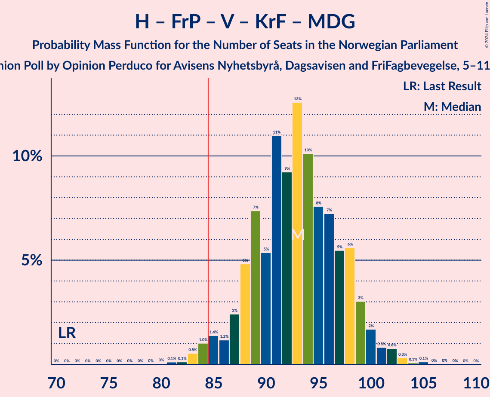

# Opinion Poll by Opinion Perduco for Avisens Nyhetsbyrå, Dagsavisen and FriFagbevegelse, 5–11 November 2024

<a href="#voting-intentions">Voting Intentions</a> | <a href="#seats">Seats</a> | <a href="#coalitions">Coalitions</a> | <a href="#technical-information">Technical Information</a>

## Voting Intentions

### Confidence Intervals

| Party | Last Result | Poll Result | 80% Confidence Interval | 90% Confidence Interval | 95% Confidence Interval | 99% Confidence Interval |
|:-----:|:-----------:|:-----------:|:-----------------------:|:-----------------------:|:-----------------------:|:-----------------------:|
| Høyre | 20.4% | 22.4% | 20.5–24.5% |19.9–25.1% |19.5–25.6% |18.6–26.6% |
| Fremskrittspartiet | 11.6% | 21.3% | 19.4–23.3% |18.9–23.9% |18.4–24.4% |17.5–25.5% |
| Arbeiderpartiet | 26.2% | 18.7% | 16.9–20.7% |16.5–21.3% |16.0–21.8% |15.2–22.8% |
| Sosialistisk Venstreparti | 7.6% | 9.2% | 7.9–10.7% |7.5–11.1% |7.2–11.5% |6.7–12.3% |
| Senterpartiet | 13.5% | 6.8% | 5.7–8.1% |5.4–8.5% |5.1–8.9% |4.7–9.6% |
| Rødt | 4.7% | 6.1% | 5.0–7.4% |4.8–7.7% |4.5–8.1% |4.1–8.7% |
| Venstre | 4.6% | 5.6% | 4.7–6.9% |4.4–7.3% |4.2–7.6% |3.7–8.2% |
| Kristelig Folkeparti | 3.8% | 3.1% | 2.4–4.1% |2.2–4.4% |2.1–4.6% |1.8–5.2% |
| Miljøpartiet De Grønne | 3.9% | 3.1% | 2.4–4.1% |2.2–4.4% |2.1–4.6% |1.8–5.2% |

*Note:* The poll result column reflects the actual value used in the calculations. Published results may vary slightly, and in addition be rounded to fewer digits.

## Seats

### Confidence Intervals

| Party | Last Result | Median | 80% Confidence Interval | 90% Confidence Interval | 95% Confidence Interval | 99% Confidence Interval |
|:-----:|:-----------:|:------:|:-----------------------:|:-----------------------:|:-----------------------:|:-----------------------:|
| <a href="#høyre">Høyre</a> | 36 | 39 | 35–44 |34–45 |33–45 |31–47 |
| <a href="#fremskrittspartiet">Fremskrittspartiet</a> | 21 | 39 | 36–43 |35–43 |34–44 |32–45 |
| <a href="#arbeiderpartiet">Arbeiderpartiet</a> | 48 | 34 | 32–38 |31–39 |31–40 |30–42 |
| <a href="#sosialistisk-venstreparti">Sosialistisk Venstreparti</a> | 13 | 15 | 13–19 |12–19 |11–20 |10–21 |
| <a href="#senterpartiet">Senterpartiet</a> | 28 | 12 | 9–14 |9–15 |8–16 |7–17 |
| <a href="#rødt">Rødt</a> | 8 | 10 | 8–12 |8–13 |7–14 |6–15 |
| <a href="#venstre">Venstre</a> | 8 | 10 | 8–12 |7–12 |7–13 |3–14 |
| <a href="#kristelig-folkeparti">Kristelig Folkeparti</a> | 3 | 2 | 1–7 |0–7 |0–8 |0–8 |
| <a href="#miljøpartiet-de-grønne">Miljøpartiet De Grønne</a> | 3 | 2 | 1–6 |1–7 |1–8 |1–9 |

### Høyre

*For a full overview of the results for this party, see the [Høyre](party-høyre.html) page.*

| Number of Seats | Probability | Accumulated | Special Marks |
|:---------------:|:-----------:|:-----------:|:-------------:|
| 30 | 0.1% | 100% |  |
| 31 | 0.4% | 99.9% |  |
| 32 | 0.9% | 99.5% |  |
| 33 | 2% | 98.6% |  |
| 34 | 3% | 97% |  |
| 35 | 5% | 94% |  |
| 36 | 8% | 89% | Last Result |
| 37 | 8% | 81% |  |
| 38 | 14% | 73% |  |
| 39 | 12% | 60% | Median |
| 40 | 15% | 48% |  |
| 41 | 11% | 33% |  |
| 42 | 6% | 22% |  |
| 43 | 7% | 17% |  |
| 44 | 5% | 10% |  |
| 45 | 3% | 5% |  |
| 46 | 1.0% | 2% |  |
| 47 | 0.4% | 0.9% |  |
| 48 | 0.3% | 0.4% |  |
| 49 | 0.1% | 0.1% |  |
| 50 | 0% | 0% |  |

### Fremskrittspartiet

*For a full overview of the results for this party, see the [Fremskrittspartiet](party-fremskrittspartiet.html) page.*

| Number of Seats | Probability | Accumulated | Special Marks |
|:---------------:|:-----------:|:-----------:|:-------------:|
| 21 | 0% | 100% | Last Result |
| 22 | 0% | 100% |  |
| 23 | 0% | 100% |  |
| 24 | 0% | 100% |  |
| 25 | 0% | 100% |  |
| 26 | 0% | 100% |  |
| 27 | 0% | 100% |  |
| 28 | 0% | 100% |  |
| 29 | 0% | 100% |  |
| 30 | 0.1% | 100% |  |
| 31 | 0.2% | 99.9% |  |
| 32 | 0.6% | 99.7% |  |
| 33 | 1.0% | 99.1% |  |
| 34 | 2% | 98% |  |
| 35 | 2% | 96% |  |
| 36 | 10% | 94% |  |
| 37 | 8% | 84% |  |
| 38 | 14% | 76% |  |
| 39 | 15% | 63% | Median |
| 40 | 13% | 48% |  |
| 41 | 11% | 35% |  |
| 42 | 10% | 24% |  |
| 43 | 10% | 14% |  |
| 44 | 2% | 4% |  |
| 45 | 1.0% | 1.4% |  |
| 46 | 0.2% | 0.4% |  |
| 47 | 0.1% | 0.2% |  |
| 48 | 0.1% | 0.1% |  |
| 49 | 0% | 0% |  |

### Arbeiderpartiet

*For a full overview of the results for this party, see the [Arbeiderpartiet](party-arbeiderpartiet.html) page.*

| Number of Seats | Probability | Accumulated | Special Marks |
|:---------------:|:-----------:|:-----------:|:-------------:|
| 27 | 0% | 100% |  |
| 28 | 0.1% | 99.9% |  |
| 29 | 0.3% | 99.9% |  |
| 30 | 0.9% | 99.6% |  |
| 31 | 5% | 98.7% |  |
| 32 | 14% | 94% |  |
| 33 | 23% | 80% |  |
| 34 | 12% | 57% | Median |
| 35 | 11% | 45% |  |
| 36 | 15% | 34% |  |
| 37 | 8% | 19% |  |
| 38 | 4% | 11% |  |
| 39 | 2% | 6% |  |
| 40 | 2% | 5% |  |
| 41 | 1.1% | 2% |  |
| 42 | 0.7% | 1.1% |  |
| 43 | 0.2% | 0.4% |  |
| 44 | 0.1% | 0.2% |  |
| 45 | 0% | 0.1% |  |
| 46 | 0.1% | 0.1% |  |
| 47 | 0% | 0% |  |
| 48 | 0% | 0% | Last Result |

### Sosialistisk Venstreparti

*For a full overview of the results for this party, see the [Sosialistisk Venstreparti](party-sosialistiskvenstreparti.html) page.*

| Number of Seats | Probability | Accumulated | Special Marks |
|:---------------:|:-----------:|:-----------:|:-------------:|
| 9 | 0.2% | 100% |  |
| 10 | 0.6% | 99.8% |  |
| 11 | 2% | 99.2% |  |
| 12 | 7% | 97% |  |
| 13 | 10% | 91% | Last Result |
| 14 | 16% | 81% |  |
| 15 | 15% | 65% | Median |
| 16 | 17% | 49% |  |
| 17 | 9% | 32% |  |
| 18 | 11% | 23% |  |
| 19 | 9% | 12% |  |
| 20 | 2% | 3% |  |
| 21 | 0.5% | 0.9% |  |
| 22 | 0.2% | 0.4% |  |
| 23 | 0.2% | 0.2% |  |
| 24 | 0% | 0% |  |

### Senterpartiet

*For a full overview of the results for this party, see the [Senterpartiet](party-senterpartiet.html) page.*

| Number of Seats | Probability | Accumulated | Special Marks |
|:---------------:|:-----------:|:-----------:|:-------------:|
| 6 | 0.1% | 100% |  |
| 7 | 0.8% | 99.8% |  |
| 8 | 3% | 99.0% |  |
| 9 | 9% | 96% |  |
| 10 | 16% | 86% |  |
| 11 | 18% | 70% |  |
| 12 | 17% | 52% | Median |
| 13 | 19% | 35% |  |
| 14 | 10% | 16% |  |
| 15 | 3% | 6% |  |
| 16 | 2% | 3% |  |
| 17 | 0.6% | 0.7% |  |
| 18 | 0.1% | 0.2% |  |
| 19 | 0% | 0% |  |
| 20 | 0% | 0% |  |
| 21 | 0% | 0% |  |
| 22 | 0% | 0% |  |
| 23 | 0% | 0% |  |
| 24 | 0% | 0% |  |
| 25 | 0% | 0% |  |
| 26 | 0% | 0% |  |
| 27 | 0% | 0% |  |
| 28 | 0% | 0% | Last Result |

### Rødt

*For a full overview of the results for this party, see the [Rødt](party-rødt.html) page.*

| Number of Seats | Probability | Accumulated | Special Marks |
|:---------------:|:-----------:|:-----------:|:-------------:|
| 1 | 0.4% | 100% |  |
| 2 | 0% | 99.6% |  |
| 3 | 0% | 99.6% |  |
| 4 | 0% | 99.6% |  |
| 5 | 0% | 99.6% |  |
| 6 | 0.3% | 99.6% |  |
| 7 | 3% | 99.3% |  |
| 8 | 9% | 96% | Last Result |
| 9 | 17% | 87% |  |
| 10 | 23% | 70% | Median |
| 11 | 25% | 47% |  |
| 12 | 13% | 22% |  |
| 13 | 6% | 9% |  |
| 14 | 3% | 4% |  |
| 15 | 0.7% | 0.9% |  |
| 16 | 0.2% | 0.2% |  |
| 17 | 0% | 0% |  |

### Venstre

*For a full overview of the results for this party, see the [Venstre](party-venstre.html) page.*

| Number of Seats | Probability | Accumulated | Special Marks |
|:---------------:|:-----------:|:-----------:|:-------------:|
| 2 | 0.1% | 100% |  |
| 3 | 2% | 99.9% |  |
| 4 | 0% | 98% |  |
| 5 | 0% | 98% |  |
| 6 | 0.4% | 98% |  |
| 7 | 6% | 98% |  |
| 8 | 17% | 91% | Last Result |
| 9 | 25% | 75% |  |
| 10 | 25% | 50% | Median |
| 11 | 15% | 25% |  |
| 12 | 6% | 10% |  |
| 13 | 3% | 4% |  |
| 14 | 1.4% | 2% |  |
| 15 | 0.2% | 0.3% |  |
| 16 | 0.1% | 0.1% |  |
| 17 | 0% | 0% |  |

### Kristelig Folkeparti

*For a full overview of the results for this party, see the [Kristelig Folkeparti](party-kristeligfolkeparti.html) page.*

| Number of Seats | Probability | Accumulated | Special Marks |
|:---------------:|:-----------:|:-----------:|:-------------:|
| 0 | 9% | 100% |  |
| 1 | 25% | 91% |  |
| 2 | 33% | 67% | Median |
| 3 | 19% | 34% | Last Result |
| 4 | 0% | 15% |  |
| 5 | 0% | 15% |  |
| 6 | 4% | 14% |  |
| 7 | 8% | 10% |  |
| 8 | 2% | 3% |  |
| 9 | 0.4% | 0.5% |  |
| 10 | 0.1% | 0.1% |  |
| 11 | 0% | 0% |  |

### Miljøpartiet De Grønne

*For a full overview of the results for this party, see the [Miljøpartiet De Grønne](party-miljøpartietdegrønne.html) page.*

| Number of Seats | Probability | Accumulated | Special Marks |
|:---------------:|:-----------:|:-----------:|:-------------:|
| 0 | 0.3% | 100% |  |
| 1 | 42% | 99.7% |  |
| 2 | 34% | 58% | Median |
| 3 | 12% | 23% | Last Result |
| 4 | 0% | 11% |  |
| 5 | 0% | 11% |  |
| 6 | 3% | 11% |  |
| 7 | 6% | 8% |  |
| 8 | 2% | 3% |  |
| 9 | 0.5% | 0.6% |  |
| 10 | 0.1% | 0.1% |  |
| 11 | 0% | 0% |  |

## Coalitions

### Confidence Intervals

| Coalition | Last Result | Median | Majority? | 80% Confidence Interval | 90% Confidence Interval | 95% Confidence Interval | 99% Confidence Interval |
|:---------:|:-----------:|:------:|:---------:|:-----------------------:|:-----------------------:|:-----------------------:|:-----------------------:|
| Høyre – Fremskrittspartiet – Senterpartiet – Venstre – Kristelig Folkeparti | 96 | 102 | 100% | 97–107 | 96–109 | 95–109 | 92–111 |
| Høyre – Fremskrittspartiet – Venstre – Kristelig Folkeparti – Miljøpartiet De Grønne | 71 | 93 | 98% | 88–98 | 87–99 | 85–100 | 83–103 |
| Høyre – Fremskrittspartiet – Venstre – Kristelig Folkeparti | 68 | 91 | 94% | 86–96 | 84–97 | 83–98 | 80–100 |
| Høyre – Fremskrittspartiet – Venstre | 65 | 88 | 85% | 83–93 | 81–95 | 80–96 | 78–97 |
| Høyre – Fremskrittspartiet | 57 | 79 | 6% | 74–83 | 73–85 | 71–86 | 69–88 |
| Arbeiderpartiet – Sosialistisk Venstreparti – Senterpartiet – Rødt – Miljøpartiet De Grønne | 100 | 74 | 0.7% | 69–79 | 68–81 | 66–82 | 64–85 |
| Arbeiderpartiet – Sosialistisk Venstreparti – Senterpartiet – Rødt | 97 | 72 | 0.1% | 67–77 | 66–78 | 64–80 | 61–82 |
| Arbeiderpartiet – Sosialistisk Venstreparti – Senterpartiet – Kristelig Folkeparti – Miljøpartiet De Grønne | 95 | 66 | 0% | 62–71 | 61–73 | 59–74 | 57–77 |
| Arbeiderpartiet – Sosialistisk Venstreparti – Senterpartiet – Miljøpartiet De Grønne | 92 | 64 | 0% | 59–69 | 59–70 | 57–71 | 55–74 |
| Arbeiderpartiet – Sosialistisk Venstreparti – Rødt – Miljøpartiet De Grønne | 72 | 63 | 0% | 58–67 | 57–69 | 56–70 | 54–73 |
| Arbeiderpartiet – Sosialistisk Venstreparti – Senterpartiet | 89 | 62 | 0% | 57–66 | 56–67 | 55–69 | 52–71 |
| Arbeiderpartiet – Senterpartiet – Kristelig Folkeparti – Miljøpartiet De Grønne | 82 | 50 | 0% | 47–56 | 46–57 | 45–59 | 43–62 |
| Høyre – Venstre – Kristelig Folkeparti | 47 | 51 | 0% | 47–55 | 45–57 | 44–59 | 42–61 |
| Arbeiderpartiet – Sosialistisk Venstreparti | 61 | 50 | 0% | 46–54 | 45–55 | 45–57 | 43–58 |
| Arbeiderpartiet – Senterpartiet – Kristelig Folkeparti | 79 | 48 | 0% | 45–53 | 44–54 | 43–56 | 41–58 |
| Arbeiderpartiet – Senterpartiet | 76 | 46 | 0% | 43–50 | 42–51 | 41–52 | 40–54 |
| Senterpartiet – Venstre – Kristelig Folkeparti | 39 | 24 | 0% | 20–28 | 19–29 | 18–30 | 15–32 |

### Høyre – Fremskrittspartiet – Senterpartiet – Venstre – Kristelig Folkeparti

| Number of Seats | Probability | Accumulated | Special Marks |
|:---------------:|:-----------:|:-----------:|:-------------:|
| 90 | 0% | 100% |  |
| 91 | 0.2% | 99.9% |  |
| 92 | 0.3% | 99.7% |  |
| 93 | 0.5% | 99.4% |  |
| 94 | 0.9% | 98.9% |  |
| 95 | 2% | 98% |  |
| 96 | 3% | 96% | Last Result |
| 97 | 5% | 94% |  |
| 98 | 5% | 89% |  |
| 99 | 10% | 84% |  |
| 100 | 7% | 74% |  |
| 101 | 9% | 67% |  |
| 102 | 9% | 58% | Median |
| 103 | 8% | 50% |  |
| 104 | 12% | 41% |  |
| 105 | 9% | 30% |  |
| 106 | 5% | 21% |  |
| 107 | 7% | 16% |  |
| 108 | 4% | 9% |  |
| 109 | 3% | 5% |  |
| 110 | 0.9% | 2% |  |
| 111 | 0.6% | 1.0% |  |
| 112 | 0.3% | 0.4% |  |
| 113 | 0.1% | 0.1% |  |
| 114 | 0% | 0.1% |  |
| 115 | 0% | 0% |  |

### Høyre – Fremskrittspartiet – Venstre – Kristelig Folkeparti – Miljøpartiet De Grønne

| Number of Seats | Probability | Accumulated | Special Marks |
|:---------------:|:-----------:|:-----------:|:-------------:|
| 71 | 0% | 100% | Last Result |
| 72 | 0% | 100% |  |
| 73 | 0% | 100% |  |
| 74 | 0% | 100% |  |
| 75 | 0% | 100% |  |
| 76 | 0% | 100% |  |
| 77 | 0% | 100% |  |
| 78 | 0% | 100% |  |
| 79 | 0% | 100% |  |
| 80 | 0% | 100% |  |
| 81 | 0.1% | 99.9% |  |
| 82 | 0.1% | 99.8% |  |
| 83 | 0.5% | 99.7% |  |
| 84 | 1.0% | 99.2% |  |
| 85 | 1.4% | 98% | Majority |
| 86 | 1.2% | 97% |  |
| 87 | 2% | 96% |  |
| 88 | 5% | 93% |  |
| 89 | 7% | 88% |  |
| 90 | 5% | 81% |  |
| 91 | 11% | 76% |  |
| 92 | 9% | 65% | Median |
| 93 | 13% | 55% |  |
| 94 | 10% | 43% |  |
| 95 | 8% | 33% |  |
| 96 | 7% | 25% |  |
| 97 | 5% | 18% |  |
| 98 | 6% | 12% |  |
| 99 | 3% | 7% |  |
| 100 | 2% | 4% |  |
| 101 | 0.8% | 2% |  |
| 102 | 0.8% | 1.3% |  |
| 103 | 0.3% | 0.6% |  |
| 104 | 0.1% | 0.2% |  |
| 105 | 0.1% | 0.2% |  |
| 106 | 0% | 0% |  |

### Høyre – Fremskrittspartiet – Venstre – Kristelig Folkeparti

| Number of Seats | Probability | Accumulated | Special Marks |
|:---------------:|:-----------:|:-----------:|:-------------:|
| 68 | 0% | 100% | Last Result |
| 69 | 0% | 100% |  |
| 70 | 0% | 100% |  |
| 71 | 0% | 100% |  |
| 72 | 0% | 100% |  |
| 73 | 0% | 100% |  |
| 74 | 0% | 100% |  |
| 75 | 0% | 100% |  |
| 76 | 0% | 100% |  |
| 77 | 0% | 100% |  |
| 78 | 0.1% | 100% |  |
| 79 | 0.1% | 99.9% |  |
| 80 | 0.3% | 99.8% |  |
| 81 | 0.4% | 99.5% |  |
| 82 | 1.1% | 99.1% |  |
| 83 | 2% | 98% |  |
| 84 | 2% | 96% |  |
| 85 | 3% | 94% | Majority |
| 86 | 4% | 91% |  |
| 87 | 7% | 87% |  |
| 88 | 6% | 80% |  |
| 89 | 12% | 74% |  |
| 90 | 11% | 62% | Median |
| 91 | 12% | 51% |  |
| 92 | 9% | 39% |  |
| 93 | 6% | 30% |  |
| 94 | 7% | 24% |  |
| 95 | 4% | 16% |  |
| 96 | 5% | 12% |  |
| 97 | 4% | 7% |  |
| 98 | 1.1% | 3% |  |
| 99 | 1.1% | 2% |  |
| 100 | 0.3% | 0.7% |  |
| 101 | 0.2% | 0.3% |  |
| 102 | 0.1% | 0.1% |  |
| 103 | 0% | 0.1% |  |
| 104 | 0% | 0% |  |

### Høyre – Fremskrittspartiet – Venstre

| Number of Seats | Probability | Accumulated | Special Marks |
|:---------------:|:-----------:|:-----------:|:-------------:|
| 65 | 0% | 100% | Last Result |
| 66 | 0% | 100% |  |
| 67 | 0% | 100% |  |
| 68 | 0% | 100% |  |
| 69 | 0% | 100% |  |
| 70 | 0% | 100% |  |
| 71 | 0% | 100% |  |
| 72 | 0% | 100% |  |
| 73 | 0% | 100% |  |
| 74 | 0% | 100% |  |
| 75 | 0% | 100% |  |
| 76 | 0.1% | 99.9% |  |
| 77 | 0.1% | 99.9% |  |
| 78 | 0.4% | 99.7% |  |
| 79 | 0.6% | 99.4% |  |
| 80 | 1.5% | 98.7% |  |
| 81 | 3% | 97% |  |
| 82 | 2% | 95% |  |
| 83 | 4% | 92% |  |
| 84 | 4% | 89% |  |
| 85 | 5% | 85% | Majority |
| 86 | 8% | 80% |  |
| 87 | 10% | 71% |  |
| 88 | 14% | 61% | Median |
| 89 | 16% | 47% |  |
| 90 | 7% | 31% |  |
| 91 | 8% | 25% |  |
| 92 | 5% | 16% |  |
| 93 | 3% | 12% |  |
| 94 | 3% | 9% |  |
| 95 | 3% | 6% |  |
| 96 | 2% | 3% |  |
| 97 | 0.5% | 0.9% |  |
| 98 | 0.3% | 0.5% |  |
| 99 | 0.1% | 0.2% |  |
| 100 | 0% | 0.1% |  |
| 101 | 0% | 0% |  |

### Høyre – Fremskrittspartiet

| Number of Seats | Probability | Accumulated | Special Marks |
|:---------------:|:-----------:|:-----------:|:-------------:|
| 57 | 0% | 100% | Last Result |
| 58 | 0% | 100% |  |
| 59 | 0% | 100% |  |
| 60 | 0% | 100% |  |
| 61 | 0% | 100% |  |
| 62 | 0% | 100% |  |
| 63 | 0% | 100% |  |
| 64 | 0% | 100% |  |
| 65 | 0% | 100% |  |
| 66 | 0% | 100% |  |
| 67 | 0.1% | 100% |  |
| 68 | 0.2% | 99.9% |  |
| 69 | 0.2% | 99.7% |  |
| 70 | 0.9% | 99.4% |  |
| 71 | 1.0% | 98.5% |  |
| 72 | 2% | 97% |  |
| 73 | 3% | 96% |  |
| 74 | 4% | 92% |  |
| 75 | 6% | 88% |  |
| 76 | 7% | 82% |  |
| 77 | 12% | 75% |  |
| 78 | 10% | 63% | Median |
| 79 | 14% | 53% |  |
| 80 | 8% | 39% |  |
| 81 | 11% | 30% |  |
| 82 | 7% | 19% |  |
| 83 | 3% | 13% |  |
| 84 | 3% | 9% |  |
| 85 | 2% | 6% | Majority |
| 86 | 3% | 4% |  |
| 87 | 1.1% | 2% |  |
| 88 | 0.3% | 0.5% |  |
| 89 | 0.2% | 0.3% |  |
| 90 | 0% | 0.1% |  |
| 91 | 0% | 0% |  |

### Arbeiderpartiet – Sosialistisk Venstreparti – Senterpartiet – Rødt – Miljøpartiet De Grønne

| Number of Seats | Probability | Accumulated | Special Marks |
|:---------------:|:-----------:|:-----------:|:-------------:|
| 61 | 0.1% | 100% |  |
| 62 | 0.1% | 99.9% |  |
| 63 | 0.3% | 99.8% |  |
| 64 | 0.4% | 99.5% |  |
| 65 | 0.6% | 99.2% |  |
| 66 | 1.1% | 98.6% |  |
| 67 | 1.3% | 97% |  |
| 68 | 2% | 96% |  |
| 69 | 6% | 94% |  |
| 70 | 6% | 89% |  |
| 71 | 8% | 83% |  |
| 72 | 10% | 75% |  |
| 73 | 10% | 65% | Median |
| 74 | 10% | 55% |  |
| 75 | 7% | 45% |  |
| 76 | 8% | 39% |  |
| 77 | 8% | 31% |  |
| 78 | 8% | 23% |  |
| 79 | 6% | 15% |  |
| 80 | 3% | 9% |  |
| 81 | 2% | 6% |  |
| 82 | 2% | 4% |  |
| 83 | 1.2% | 2% |  |
| 84 | 0.4% | 1.2% |  |
| 85 | 0.3% | 0.7% | Majority |
| 86 | 0.3% | 0.5% |  |
| 87 | 0.1% | 0.2% |  |
| 88 | 0% | 0.1% |  |
| 89 | 0% | 0% |  |
| 90 | 0% | 0% |  |
| 91 | 0% | 0% |  |
| 92 | 0% | 0% |  |
| 93 | 0% | 0% |  |
| 94 | 0% | 0% |  |
| 95 | 0% | 0% |  |
| 96 | 0% | 0% |  |
| 97 | 0% | 0% |  |
| 98 | 0% | 0% |  |
| 99 | 0% | 0% |  |
| 100 | 0% | 0% | Last Result |

### Arbeiderpartiet – Sosialistisk Venstreparti – Senterpartiet – Rødt

| Number of Seats | Probability | Accumulated | Special Marks |
|:---------------:|:-----------:|:-----------:|:-------------:|
| 57 | 0.1% | 100% |  |
| 58 | 0% | 99.9% |  |
| 59 | 0.1% | 99.9% |  |
| 60 | 0.2% | 99.8% |  |
| 61 | 0.3% | 99.6% |  |
| 62 | 0.3% | 99.4% |  |
| 63 | 0.7% | 99.1% |  |
| 64 | 2% | 98% |  |
| 65 | 1.2% | 96% |  |
| 66 | 3% | 95% |  |
| 67 | 6% | 93% |  |
| 68 | 5% | 87% |  |
| 69 | 7% | 82% |  |
| 70 | 11% | 74% |  |
| 71 | 8% | 64% | Median |
| 72 | 11% | 56% |  |
| 73 | 10% | 45% |  |
| 74 | 7% | 36% |  |
| 75 | 11% | 29% |  |
| 76 | 5% | 18% |  |
| 77 | 6% | 13% |  |
| 78 | 3% | 8% |  |
| 79 | 2% | 5% |  |
| 80 | 1.0% | 3% |  |
| 81 | 1.0% | 2% |  |
| 82 | 0.3% | 0.7% |  |
| 83 | 0.2% | 0.4% |  |
| 84 | 0.1% | 0.2% |  |
| 85 | 0% | 0.1% | Majority |
| 86 | 0% | 0% |  |
| 87 | 0% | 0% |  |
| 88 | 0% | 0% |  |
| 89 | 0% | 0% |  |
| 90 | 0% | 0% |  |
| 91 | 0% | 0% |  |
| 92 | 0% | 0% |  |
| 93 | 0% | 0% |  |
| 94 | 0% | 0% |  |
| 95 | 0% | 0% |  |
| 96 | 0% | 0% |  |
| 97 | 0% | 0% | Last Result |

### Arbeiderpartiet – Sosialistisk Venstreparti – Senterpartiet – Kristelig Folkeparti – Miljøpartiet De Grønne

| Number of Seats | Probability | Accumulated | Special Marks |
|:---------------:|:-----------:|:-----------:|:-------------:|
| 54 | 0.1% | 100% |  |
| 55 | 0% | 99.9% |  |
| 56 | 0.2% | 99.9% |  |
| 57 | 0.2% | 99.7% |  |
| 58 | 0.5% | 99.5% |  |
| 59 | 2% | 99.0% |  |
| 60 | 2% | 97% |  |
| 61 | 4% | 95% |  |
| 62 | 7% | 91% |  |
| 63 | 7% | 84% |  |
| 64 | 8% | 76% |  |
| 65 | 10% | 68% | Median |
| 66 | 12% | 59% |  |
| 67 | 6% | 47% |  |
| 68 | 11% | 41% |  |
| 69 | 11% | 30% |  |
| 70 | 5% | 19% |  |
| 71 | 4% | 14% |  |
| 72 | 4% | 9% |  |
| 73 | 2% | 6% |  |
| 74 | 1.4% | 3% |  |
| 75 | 0.8% | 2% |  |
| 76 | 0.4% | 1.3% |  |
| 77 | 0.4% | 0.9% |  |
| 78 | 0.2% | 0.5% |  |
| 79 | 0.1% | 0.3% |  |
| 80 | 0.1% | 0.1% |  |
| 81 | 0% | 0% |  |
| 82 | 0% | 0% |  |
| 83 | 0% | 0% |  |
| 84 | 0% | 0% |  |
| 85 | 0% | 0% | Majority |
| 86 | 0% | 0% |  |
| 87 | 0% | 0% |  |
| 88 | 0% | 0% |  |
| 89 | 0% | 0% |  |
| 90 | 0% | 0% |  |
| 91 | 0% | 0% |  |
| 92 | 0% | 0% |  |
| 93 | 0% | 0% |  |
| 94 | 0% | 0% |  |
| 95 | 0% | 0% | Last Result |

### Arbeiderpartiet – Sosialistisk Venstreparti – Senterpartiet – Miljøpartiet De Grønne

| Number of Seats | Probability | Accumulated | Special Marks |
|:---------------:|:-----------:|:-----------:|:-------------:|
| 53 | 0.2% | 100% |  |
| 54 | 0.1% | 99.7% |  |
| 55 | 0.3% | 99.6% |  |
| 56 | 0.8% | 99.3% |  |
| 57 | 1.3% | 98% |  |
| 58 | 2% | 97% |  |
| 59 | 6% | 95% |  |
| 60 | 8% | 90% |  |
| 61 | 8% | 82% |  |
| 62 | 10% | 74% |  |
| 63 | 13% | 64% | Median |
| 64 | 8% | 51% |  |
| 65 | 10% | 44% |  |
| 66 | 11% | 34% |  |
| 67 | 6% | 23% |  |
| 68 | 7% | 17% |  |
| 69 | 3% | 10% |  |
| 70 | 3% | 7% |  |
| 71 | 2% | 5% |  |
| 72 | 1.0% | 2% |  |
| 73 | 0.5% | 1.3% |  |
| 74 | 0.3% | 0.7% |  |
| 75 | 0.3% | 0.5% |  |
| 76 | 0.1% | 0.2% |  |
| 77 | 0.1% | 0.1% |  |
| 78 | 0% | 0% |  |
| 79 | 0% | 0% |  |
| 80 | 0% | 0% |  |
| 81 | 0% | 0% |  |
| 82 | 0% | 0% |  |
| 83 | 0% | 0% |  |
| 84 | 0% | 0% |  |
| 85 | 0% | 0% | Majority |
| 86 | 0% | 0% |  |
| 87 | 0% | 0% |  |
| 88 | 0% | 0% |  |
| 89 | 0% | 0% |  |
| 90 | 0% | 0% |  |
| 91 | 0% | 0% |  |
| 92 | 0% | 0% | Last Result |

### Arbeiderpartiet – Sosialistisk Venstreparti – Rødt – Miljøpartiet De Grønne

| Number of Seats | Probability | Accumulated | Special Marks |
|:---------------:|:-----------:|:-----------:|:-------------:|
| 51 | 0% | 100% |  |
| 52 | 0.1% | 99.9% |  |
| 53 | 0.2% | 99.9% |  |
| 54 | 0.4% | 99.7% |  |
| 55 | 0.9% | 99.2% |  |
| 56 | 2% | 98% |  |
| 57 | 4% | 97% |  |
| 58 | 5% | 93% |  |
| 59 | 7% | 88% |  |
| 60 | 8% | 81% |  |
| 61 | 13% | 73% | Median |
| 62 | 9% | 60% |  |
| 63 | 14% | 51% |  |
| 64 | 11% | 38% |  |
| 65 | 7% | 27% |  |
| 66 | 5% | 20% |  |
| 67 | 5% | 15% |  |
| 68 | 2% | 10% |  |
| 69 | 4% | 7% |  |
| 70 | 2% | 4% |  |
| 71 | 1.1% | 2% |  |
| 72 | 0.5% | 1.1% | Last Result |
| 73 | 0.3% | 0.6% |  |
| 74 | 0.1% | 0.3% |  |
| 75 | 0.1% | 0.2% |  |
| 76 | 0% | 0.1% |  |
| 77 | 0% | 0% |  |

### Arbeiderpartiet – Sosialistisk Venstreparti – Senterpartiet

| Number of Seats | Probability | Accumulated | Special Marks |
|:---------------:|:-----------:|:-----------:|:-------------:|
| 50 | 0.2% | 100% |  |
| 51 | 0.1% | 99.8% |  |
| 52 | 0.2% | 99.7% |  |
| 53 | 0.3% | 99.5% |  |
| 54 | 0.9% | 99.2% |  |
| 55 | 1.4% | 98% |  |
| 56 | 3% | 97% |  |
| 57 | 4% | 94% |  |
| 58 | 9% | 90% |  |
| 59 | 7% | 81% |  |
| 60 | 11% | 74% |  |
| 61 | 10% | 63% | Median |
| 62 | 12% | 53% |  |
| 63 | 13% | 41% |  |
| 64 | 10% | 29% |  |
| 65 | 5% | 19% |  |
| 66 | 4% | 14% |  |
| 67 | 4% | 9% |  |
| 68 | 2% | 5% |  |
| 69 | 1.2% | 3% |  |
| 70 | 0.8% | 1.3% |  |
| 71 | 0.2% | 0.5% |  |
| 72 | 0.1% | 0.3% |  |
| 73 | 0.1% | 0.2% |  |
| 74 | 0% | 0.1% |  |
| 75 | 0% | 0% |  |
| 76 | 0% | 0% |  |
| 77 | 0% | 0% |  |
| 78 | 0% | 0% |  |
| 79 | 0% | 0% |  |
| 80 | 0% | 0% |  |
| 81 | 0% | 0% |  |
| 82 | 0% | 0% |  |
| 83 | 0% | 0% |  |
| 84 | 0% | 0% |  |
| 85 | 0% | 0% | Majority |
| 86 | 0% | 0% |  |
| 87 | 0% | 0% |  |
| 88 | 0% | 0% |  |
| 89 | 0% | 0% | Last Result |

### Arbeiderpartiet – Senterpartiet – Kristelig Folkeparti – Miljøpartiet De Grønne

| Number of Seats | Probability | Accumulated | Special Marks |
|:---------------:|:-----------:|:-----------:|:-------------:|
| 41 | 0.1% | 100% |  |
| 42 | 0.1% | 99.9% |  |
| 43 | 0.6% | 99.8% |  |
| 44 | 1.3% | 99.2% |  |
| 45 | 2% | 98% |  |
| 46 | 4% | 96% |  |
| 47 | 8% | 92% |  |
| 48 | 12% | 84% |  |
| 49 | 11% | 72% |  |
| 50 | 11% | 61% | Median |
| 51 | 9% | 49% |  |
| 52 | 10% | 41% |  |
| 53 | 8% | 31% |  |
| 54 | 7% | 23% |  |
| 55 | 6% | 16% |  |
| 56 | 2% | 10% |  |
| 57 | 3% | 8% |  |
| 58 | 2% | 5% |  |
| 59 | 1.0% | 3% |  |
| 60 | 0.8% | 2% |  |
| 61 | 0.4% | 0.9% |  |
| 62 | 0.2% | 0.5% |  |
| 63 | 0.1% | 0.3% |  |
| 64 | 0.1% | 0.2% |  |
| 65 | 0.1% | 0.1% |  |
| 66 | 0% | 0% |  |
| 67 | 0% | 0% |  |
| 68 | 0% | 0% |  |
| 69 | 0% | 0% |  |
| 70 | 0% | 0% |  |
| 71 | 0% | 0% |  |
| 72 | 0% | 0% |  |
| 73 | 0% | 0% |  |
| 74 | 0% | 0% |  |
| 75 | 0% | 0% |  |
| 76 | 0% | 0% |  |
| 77 | 0% | 0% |  |
| 78 | 0% | 0% |  |
| 79 | 0% | 0% |  |
| 80 | 0% | 0% |  |
| 81 | 0% | 0% |  |
| 82 | 0% | 0% | Last Result |

### Høyre – Venstre – Kristelig Folkeparti

| Number of Seats | Probability | Accumulated | Special Marks |
|:---------------:|:-----------:|:-----------:|:-------------:|
| 40 | 0.1% | 100% |  |
| 41 | 0.1% | 99.9% |  |
| 42 | 0.2% | 99.7% |  |
| 43 | 0.8% | 99.5% |  |
| 44 | 2% | 98.7% |  |
| 45 | 3% | 97% |  |
| 46 | 3% | 94% |  |
| 47 | 7% | 91% | Last Result |
| 48 | 8% | 85% |  |
| 49 | 11% | 77% |  |
| 50 | 8% | 66% |  |
| 51 | 10% | 58% | Median |
| 52 | 8% | 48% |  |
| 53 | 8% | 40% |  |
| 54 | 13% | 32% |  |
| 55 | 9% | 19% |  |
| 56 | 3% | 10% |  |
| 57 | 2% | 7% |  |
| 58 | 1.1% | 4% |  |
| 59 | 2% | 3% |  |
| 60 | 0.7% | 1.4% |  |
| 61 | 0.5% | 0.8% |  |
| 62 | 0.1% | 0.2% |  |
| 63 | 0.1% | 0.1% |  |
| 64 | 0% | 0% |  |

### Arbeiderpartiet – Sosialistisk Venstreparti

| Number of Seats | Probability | Accumulated | Special Marks |
|:---------------:|:-----------:|:-----------:|:-------------:|
| 41 | 0.1% | 100% |  |
| 42 | 0.3% | 99.9% |  |
| 43 | 0.5% | 99.6% |  |
| 44 | 0.8% | 99.2% |  |
| 45 | 4% | 98% |  |
| 46 | 6% | 95% |  |
| 47 | 10% | 88% |  |
| 48 | 9% | 79% |  |
| 49 | 9% | 69% | Median |
| 50 | 13% | 60% |  |
| 51 | 21% | 47% |  |
| 52 | 9% | 26% |  |
| 53 | 7% | 17% |  |
| 54 | 4% | 11% |  |
| 55 | 2% | 7% |  |
| 56 | 2% | 4% |  |
| 57 | 2% | 3% |  |
| 58 | 0.3% | 0.8% |  |
| 59 | 0.3% | 0.5% |  |
| 60 | 0.1% | 0.2% |  |
| 61 | 0% | 0.1% | Last Result |
| 62 | 0% | 0% |  |

### Arbeiderpartiet – Senterpartiet – Kristelig Folkeparti

| Number of Seats | Probability | Accumulated | Special Marks |
|:---------------:|:-----------:|:-----------:|:-------------:|
| 40 | 0.1% | 100% |  |
| 41 | 0.4% | 99.8% |  |
| 42 | 1.1% | 99.4% |  |
| 43 | 2% | 98% |  |
| 44 | 5% | 96% |  |
| 45 | 7% | 91% |  |
| 46 | 10% | 84% |  |
| 47 | 15% | 74% |  |
| 48 | 11% | 59% | Median |
| 49 | 13% | 48% |  |
| 50 | 8% | 35% |  |
| 51 | 9% | 28% |  |
| 52 | 6% | 19% |  |
| 53 | 5% | 13% |  |
| 54 | 3% | 8% |  |
| 55 | 2% | 5% |  |
| 56 | 1.3% | 3% |  |
| 57 | 0.7% | 2% |  |
| 58 | 0.6% | 1.0% |  |
| 59 | 0.2% | 0.4% |  |
| 60 | 0.1% | 0.2% |  |
| 61 | 0% | 0.1% |  |
| 62 | 0% | 0.1% |  |
| 63 | 0% | 0% |  |
| 64 | 0% | 0% |  |
| 65 | 0% | 0% |  |
| 66 | 0% | 0% |  |
| 67 | 0% | 0% |  |
| 68 | 0% | 0% |  |
| 69 | 0% | 0% |  |
| 70 | 0% | 0% |  |
| 71 | 0% | 0% |  |
| 72 | 0% | 0% |  |
| 73 | 0% | 0% |  |
| 74 | 0% | 0% |  |
| 75 | 0% | 0% |  |
| 76 | 0% | 0% |  |
| 77 | 0% | 0% |  |
| 78 | 0% | 0% |  |
| 79 | 0% | 0% | Last Result |

### Arbeiderpartiet – Senterpartiet

| Number of Seats | Probability | Accumulated | Special Marks |
|:---------------:|:-----------:|:-----------:|:-------------:|
| 38 | 0% | 100% |  |
| 39 | 0.2% | 99.9% |  |
| 40 | 0.9% | 99.7% |  |
| 41 | 2% | 98.8% |  |
| 42 | 4% | 97% |  |
| 43 | 9% | 93% |  |
| 44 | 13% | 84% |  |
| 45 | 17% | 71% |  |
| 46 | 11% | 54% | Median |
| 47 | 12% | 42% |  |
| 48 | 10% | 30% |  |
| 49 | 9% | 20% |  |
| 50 | 4% | 11% |  |
| 51 | 4% | 7% |  |
| 52 | 2% | 4% |  |
| 53 | 1.1% | 2% |  |
| 54 | 0.4% | 0.8% |  |
| 55 | 0.2% | 0.4% |  |
| 56 | 0.1% | 0.2% |  |
| 57 | 0.1% | 0.1% |  |
| 58 | 0% | 0.1% |  |
| 59 | 0% | 0% |  |
| 60 | 0% | 0% |  |
| 61 | 0% | 0% |  |
| 62 | 0% | 0% |  |
| 63 | 0% | 0% |  |
| 64 | 0% | 0% |  |
| 65 | 0% | 0% |  |
| 66 | 0% | 0% |  |
| 67 | 0% | 0% |  |
| 68 | 0% | 0% |  |
| 69 | 0% | 0% |  |
| 70 | 0% | 0% |  |
| 71 | 0% | 0% |  |
| 72 | 0% | 0% |  |
| 73 | 0% | 0% |  |
| 74 | 0% | 0% |  |
| 75 | 0% | 0% |  |
| 76 | 0% | 0% | Last Result |

### Senterpartiet – Venstre – Kristelig Folkeparti

| Number of Seats | Probability | Accumulated | Special Marks |
|:---------------:|:-----------:|:-----------:|:-------------:|
| 14 | 0.1% | 100% |  |
| 15 | 0.4% | 99.8% |  |
| 16 | 0.5% | 99.4% |  |
| 17 | 1.4% | 98.9% |  |
| 18 | 2% | 98% |  |
| 19 | 5% | 95% |  |
| 20 | 8% | 91% |  |
| 21 | 7% | 83% |  |
| 22 | 11% | 76% |  |
| 23 | 13% | 65% |  |
| 24 | 15% | 52% | Median |
| 25 | 12% | 37% |  |
| 26 | 9% | 26% |  |
| 27 | 5% | 17% |  |
| 28 | 4% | 11% |  |
| 29 | 3% | 7% |  |
| 30 | 2% | 4% |  |
| 31 | 1.0% | 2% |  |
| 32 | 0.5% | 0.9% |  |
| 33 | 0.3% | 0.4% |  |
| 34 | 0.1% | 0.1% |  |
| 35 | 0% | 0.1% |  |
| 36 | 0% | 0% |  |
| 37 | 0% | 0% |  |
| 38 | 0% | 0% |  |
| 39 | 0% | 0% | Last Result |

## Technical Information

### Opinion Poll

+ **Polling firm:** Opinion Perduco
+ **Commissioner(s):** Avisens Nyhetsbyrå, Dagsavisen and FriFagbevegelse
+ **Fieldwork period:** 5–11 November 2024

### Calculations

+ **Sample size:** 710
+ **Simulations done:** 2,097,152
+ **Error estimate:** 2.10%

