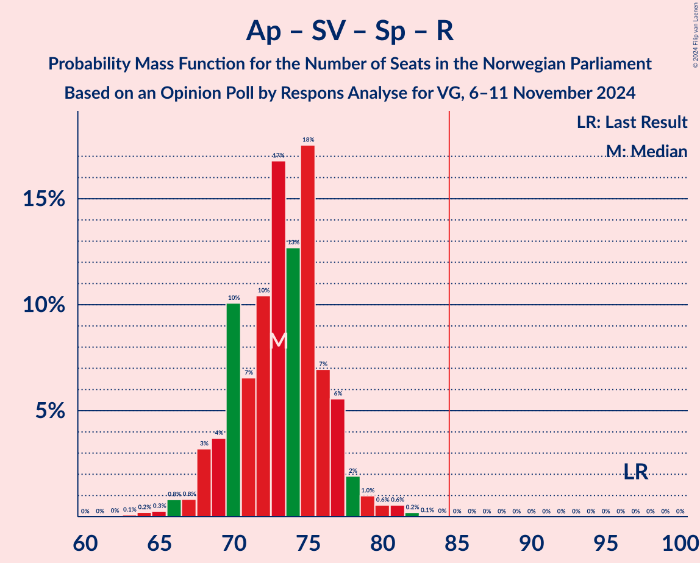
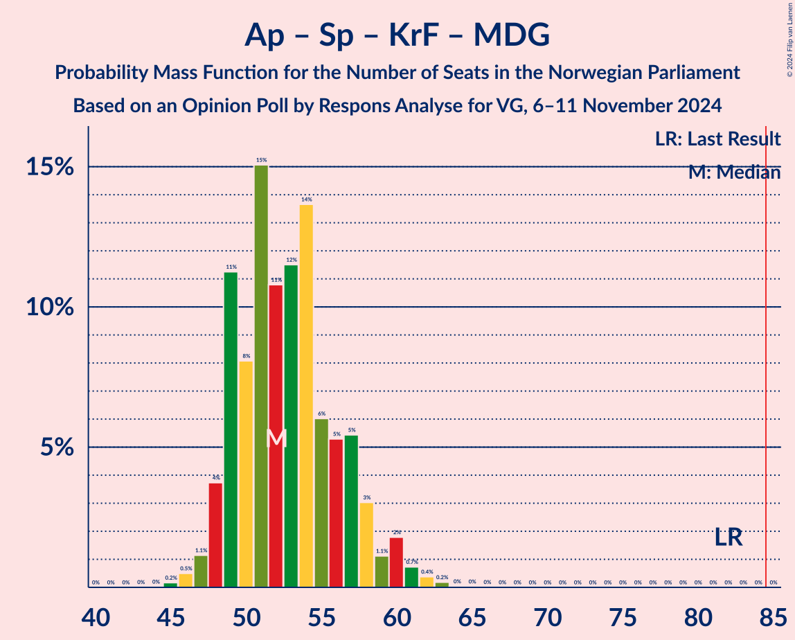
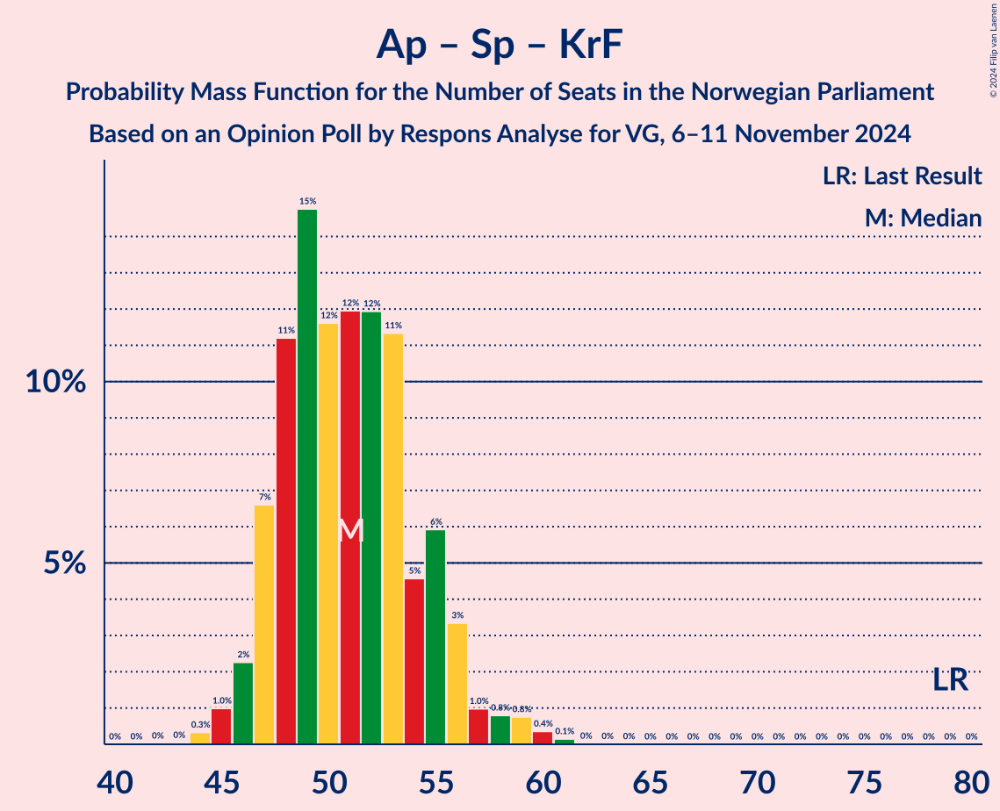

# Opinion Poll by Respons Analyse for VG, 6–11 November 2024

<a href="#voting-intentions">Voting Intentions</a> | <a href="#seats">Seats</a> | <a href="#coalitions">Coalitions</a> | <a href="#technical-information">Technical Information</a>

## Voting Intentions

### Confidence Intervals

| Party | Last Result | Poll Result | 80% Confidence Interval | 90% Confidence Interval | 95% Confidence Interval | 99% Confidence Interval |
|:-----:|:-----------:|:-----------:|:-----------------------:|:-----------------------:|:-----------------------:|:-----------------------:|
| Fremskrittspartiet | 11.6% | 22.4% | 20.8–24.2% |20.3–24.7% |20.0–25.1% |19.2–26.0% |
| Høyre | 20.4% | 20.9% | 19.4–22.7% |18.9–23.2% |18.5–23.6% |17.8–24.4% |
| Arbeiderpartiet | 26.2% | 19.0% | 17.5–20.7% |17.1–21.2% |16.7–21.6% |16.0–22.4% |
| Sosialistisk Venstreparti | 7.6% | 9.4% | 8.3–10.7% |8.0–11.0% |7.7–11.3% |7.2–12.0% |
| Senterpartiet | 13.5% | 6.8% | 5.9–7.9% |5.6–8.2% |5.4–8.5% |5.0–9.1% |
| Venstre | 4.6% | 6.3% | 5.4–7.4% |5.2–7.7% |4.9–8.0% |4.5–8.5% |
| Rødt | 4.7% | 5.6% | 4.8–6.6% |4.5–6.9% |4.3–7.2% |3.9–7.7% |
| Kristelig Folkeparti | 3.8% | 3.7% | 3.0–4.6% |2.8–4.8% |2.7–5.0% |2.4–5.5% |
| Miljøpartiet De Grønne | 3.9% | 3.0% | 2.4–3.8% |2.2–4.0% |2.1–4.3% |1.8–4.7% |

*Note:* The poll result column reflects the actual value used in the calculations. Published results may vary slightly, and in addition be rounded to fewer digits.

## Seats

### Confidence Intervals

| Party | Last Result | Median | 80% Confidence Interval | 90% Confidence Interval | 95% Confidence Interval | 99% Confidence Interval |
|:-----:|:-----------:|:------:|:-----------------------:|:-----------------------:|:-----------------------:|:-----------------------:|
| <a href="#fremskrittspartiet">Fremskrittspartiet</a> | 21 | 41 | 38–43 |37–44 |36–45 |35–46 |
| <a href="#høyre">Høyre</a> | 36 | 37 | 34–40 |33–41 |32–41 |31–43 |
| <a href="#arbeiderpartiet">Arbeiderpartiet</a> | 48 | 35 | 33–37 |32–38 |32–40 |31–41 |
| <a href="#sosialistisk-venstreparti">Sosialistisk Venstreparti</a> | 13 | 17 | 14–18 |14–19 |13–20 |12–21 |
| <a href="#senterpartiet">Senterpartiet</a> | 28 | 12 | 10–13 |10–14 |9–15 |8–16 |
| <a href="#venstre">Venstre</a> | 8 | 11 | 10–13 |9–13 |9–14 |8–15 |
| <a href="#rødt">Rødt</a> | 8 | 10 | 8–12 |8–12 |7–13 |1–13 |
| <a href="#kristelig-folkeparti">Kristelig Folkeparti</a> | 3 | 3 | 2–8 |1–8 |1–8 |1–9 |
| <a href="#miljøpartiet-de-grønne">Miljøpartiet De Grønne</a> | 3 | 1 | 1–3 |1–3 |1–7 |1–8 |

### Fremskrittspartiet

*For a full overview of the results for this party, see the [Fremskrittspartiet](party-fremskrittspartiet.html) page.*

| Number of Seats | Probability | Accumulated | Special Marks |
|:---------------:|:-----------:|:-----------:|:-------------:|
| 21 | 0% | 100% | Last Result |
| 22 | 0% | 100% |  |
| 23 | 0% | 100% |  |
| 24 | 0% | 100% |  |
| 25 | 0% | 100% |  |
| 26 | 0% | 100% |  |
| 27 | 0% | 100% |  |
| 28 | 0% | 100% |  |
| 29 | 0% | 100% |  |
| 30 | 0% | 100% |  |
| 31 | 0% | 100% |  |
| 32 | 0% | 100% |  |
| 33 | 0% | 100% |  |
| 34 | 0.1% | 99.9% |  |
| 35 | 0.4% | 99.8% |  |
| 36 | 2% | 99.4% |  |
| 37 | 4% | 97% |  |
| 38 | 10% | 93% |  |
| 39 | 14% | 83% |  |
| 40 | 10% | 70% |  |
| 41 | 15% | 59% | Median |
| 42 | 22% | 44% |  |
| 43 | 11% | 21% |  |
| 44 | 6% | 10% |  |
| 45 | 2% | 4% |  |
| 46 | 1.2% | 2% |  |
| 47 | 0.3% | 0.4% |  |
| 48 | 0.1% | 0.1% |  |
| 49 | 0% | 0% |  |

### Høyre

*For a full overview of the results for this party, see the [Høyre](party-høyre.html) page.*

| Number of Seats | Probability | Accumulated | Special Marks |
|:---------------:|:-----------:|:-----------:|:-------------:|
| 30 | 0.2% | 100% |  |
| 31 | 0.8% | 99.8% |  |
| 32 | 2% | 99.0% |  |
| 33 | 5% | 97% |  |
| 34 | 9% | 91% |  |
| 35 | 9% | 83% |  |
| 36 | 18% | 74% | Last Result |
| 37 | 17% | 56% | Median |
| 38 | 15% | 39% |  |
| 39 | 10% | 24% |  |
| 40 | 8% | 14% |  |
| 41 | 5% | 6% |  |
| 42 | 0.9% | 2% |  |
| 43 | 0.4% | 0.7% |  |
| 44 | 0.2% | 0.3% |  |
| 45 | 0.1% | 0.1% |  |
| 46 | 0% | 0% |  |

### Arbeiderpartiet

*For a full overview of the results for this party, see the [Arbeiderpartiet](party-arbeiderpartiet.html) page.*

| Number of Seats | Probability | Accumulated | Special Marks |
|:---------------:|:-----------:|:-----------:|:-------------:|
| 30 | 0.1% | 100% |  |
| 31 | 0.8% | 99.8% |  |
| 32 | 5% | 99.1% |  |
| 33 | 26% | 94% |  |
| 34 | 11% | 68% |  |
| 35 | 17% | 57% | Median |
| 36 | 16% | 40% |  |
| 37 | 16% | 24% |  |
| 38 | 3% | 8% |  |
| 39 | 2% | 5% |  |
| 40 | 2% | 3% |  |
| 41 | 0.6% | 1.1% |  |
| 42 | 0.3% | 0.4% |  |
| 43 | 0.1% | 0.1% |  |
| 44 | 0.1% | 0.1% |  |
| 45 | 0% | 0% |  |
| 46 | 0% | 0% |  |
| 47 | 0% | 0% |  |
| 48 | 0% | 0% | Last Result |

### Sosialistisk Venstreparti

*For a full overview of the results for this party, see the [Sosialistisk Venstreparti](party-sosialistiskvenstreparti.html) page.*

| Number of Seats | Probability | Accumulated | Special Marks |
|:---------------:|:-----------:|:-----------:|:-------------:|
| 11 | 0.2% | 100% |  |
| 12 | 0.9% | 99.8% |  |
| 13 | 3% | 98.9% | Last Result |
| 14 | 9% | 96% |  |
| 15 | 12% | 87% |  |
| 16 | 24% | 74% |  |
| 17 | 21% | 50% | Median |
| 18 | 20% | 29% |  |
| 19 | 5% | 9% |  |
| 20 | 2% | 3% |  |
| 21 | 1.1% | 1.3% |  |
| 22 | 0.2% | 0.2% |  |
| 23 | 0% | 0% |  |

### Senterpartiet

*For a full overview of the results for this party, see the [Senterpartiet](party-senterpartiet.html) page.*

| Number of Seats | Probability | Accumulated | Special Marks |
|:---------------:|:-----------:|:-----------:|:-------------:|
| 7 | 0.1% | 100% |  |
| 8 | 0.6% | 99.9% |  |
| 9 | 3% | 99.3% |  |
| 10 | 11% | 96% |  |
| 11 | 25% | 85% |  |
| 12 | 24% | 59% | Median |
| 13 | 25% | 35% |  |
| 14 | 7% | 10% |  |
| 15 | 3% | 3% |  |
| 16 | 0.5% | 0.7% |  |
| 17 | 0.2% | 0.2% |  |
| 18 | 0% | 0% |  |
| 19 | 0% | 0% |  |
| 20 | 0% | 0% |  |
| 21 | 0% | 0% |  |
| 22 | 0% | 0% |  |
| 23 | 0% | 0% |  |
| 24 | 0% | 0% |  |
| 25 | 0% | 0% |  |
| 26 | 0% | 0% |  |
| 27 | 0% | 0% |  |
| 28 | 0% | 0% | Last Result |

### Venstre

*For a full overview of the results for this party, see the [Venstre](party-venstre.html) page.*

| Number of Seats | Probability | Accumulated | Special Marks |
|:---------------:|:-----------:|:-----------:|:-------------:|
| 7 | 0.3% | 100% |  |
| 8 | 2% | 99.6% | Last Result |
| 9 | 6% | 98% |  |
| 10 | 20% | 92% |  |
| 11 | 44% | 72% | Median |
| 12 | 17% | 28% |  |
| 13 | 7% | 11% |  |
| 14 | 3% | 4% |  |
| 15 | 0.9% | 0.9% |  |
| 16 | 0.1% | 0.1% |  |
| 17 | 0% | 0% |  |

### Rødt

*For a full overview of the results for this party, see the [Rødt](party-rødt.html) page.*

| Number of Seats | Probability | Accumulated | Special Marks |
|:---------------:|:-----------:|:-----------:|:-------------:|
| 1 | 0.7% | 100% |  |
| 2 | 0% | 99.3% |  |
| 3 | 0% | 99.3% |  |
| 4 | 0% | 99.3% |  |
| 5 | 0% | 99.3% |  |
| 6 | 0.1% | 99.3% |  |
| 7 | 2% | 99.2% |  |
| 8 | 15% | 97% | Last Result |
| 9 | 23% | 83% |  |
| 10 | 28% | 59% | Median |
| 11 | 19% | 31% |  |
| 12 | 9% | 12% |  |
| 13 | 2% | 3% |  |
| 14 | 0.4% | 0.5% |  |
| 15 | 0% | 0.1% |  |
| 16 | 0% | 0% |  |

### Kristelig Folkeparti

*For a full overview of the results for this party, see the [Kristelig Folkeparti](party-kristeligfolkeparti.html) page.*

| Number of Seats | Probability | Accumulated | Special Marks |
|:---------------:|:-----------:|:-----------:|:-------------:|
| 0 | 0.4% | 100% |  |
| 1 | 5% | 99.6% |  |
| 2 | 37% | 95% |  |
| 3 | 23% | 57% | Last Result, Median |
| 4 | 0% | 34% |  |
| 5 | 0% | 34% |  |
| 6 | 0.7% | 34% |  |
| 7 | 22% | 33% |  |
| 8 | 9% | 12% |  |
| 9 | 2% | 2% |  |
| 10 | 0.2% | 0.2% |  |
| 11 | 0% | 0% |  |

### Miljøpartiet De Grønne

*For a full overview of the results for this party, see the [Miljøpartiet De Grønne](party-miljøpartietdegrønne.html) page.*

| Number of Seats | Probability | Accumulated | Special Marks |
|:---------------:|:-----------:|:-----------:|:-------------:|
| 0 | 0.1% | 100% |  |
| 1 | 53% | 99.9% | Median |
| 2 | 33% | 46% |  |
| 3 | 8% | 13% | Last Result |
| 4 | 0% | 5% |  |
| 5 | 0% | 5% |  |
| 6 | 0.3% | 5% |  |
| 7 | 4% | 4% |  |
| 8 | 0.7% | 0.8% |  |
| 9 | 0.1% | 0.1% |  |
| 10 | 0% | 0% |  |

## Coalitions

### Confidence Intervals

| Coalition | Last Result | Median | Majority? | 80% Confidence Interval | 90% Confidence Interval | 95% Confidence Interval | 99% Confidence Interval |
|:---------:|:-----------:|:------:|:---------:|:-----------------------:|:-----------------------:|:-----------------------:|:-----------------------:|
| Fremskrittspartiet – Høyre – Senterpartiet – Venstre – Kristelig Folkeparti | 96 | 105 | 100% | 101–108 | 100–109 | 99–109 | 96–112 |
| Fremskrittspartiet – Høyre – Venstre – Kristelig Folkeparti – Miljøpartiet De Grønne | 71 | 94 | 99.9% | 91–98 | 90–99 | 89–100 | 86–102 |
| Fremskrittspartiet – Høyre – Venstre – Kristelig Folkeparti | 68 | 93 | 99.6% | 89–97 | 88–97 | 87–98 | 85–100 |
| Fremskrittspartiet – Høyre – Venstre | 65 | 89 | 93% | 85–91 | 84–93 | 82–94 | 80–96 |
| Fremskrittspartiet – Høyre | 57 | 78 | 0.5% | 75–81 | 73–82 | 72–83 | 70–84 |
| Arbeiderpartiet – Sosialistisk Venstreparti – Senterpartiet – Rødt – Miljøpartiet De Grønne | 100 | 75 | 0.1% | 71–78 | 70–79 | 70–81 | 67–83 |
| Arbeiderpartiet – Sosialistisk Venstreparti – Senterpartiet – Rødt | 97 | 73 | 0% | 70–76 | 68–77 | 68–78 | 65–81 |
| Arbeiderpartiet – Sosialistisk Venstreparti – Senterpartiet – Kristelig Folkeparti – Miljøpartiet De Grønne | 95 | 69 | 0% | 66–73 | 65–74 | 64–76 | 62–78 |
| Arbeiderpartiet – Sosialistisk Venstreparti – Senterpartiet – Miljøpartiet De Grønne | 92 | 65 | 0% | 62–68 | 61–70 | 60–71 | 58–73 |
| Arbeiderpartiet – Sosialistisk Venstreparti – Senterpartiet | 89 | 64 | 0% | 60–66 | 59–67 | 58–69 | 57–71 |
| Arbeiderpartiet – Sosialistisk Venstreparti – Rødt – Miljøpartiet De Grønne | 72 | 63 | 0% | 60–66 | 59–67 | 58–68 | 56–71 |
| Arbeiderpartiet – Senterpartiet – Kristelig Folkeparti – Miljøpartiet De Grønne | 82 | 52 | 0% | 49–57 | 48–58 | 48–60 | 46–62 |
| Høyre – Venstre – Kristelig Folkeparti | 47 | 52 | 0% | 48–56 | 47–57 | 46–58 | 44–60 |
| Arbeiderpartiet – Senterpartiet – Kristelig Folkeparti | 79 | 51 | 0% | 47–55 | 47–56 | 46–57 | 45–60 |
| Arbeiderpartiet – Sosialistisk Venstreparti | 61 | 51 | 0% | 49–54 | 48–56 | 47–56 | 46–58 |
| Arbeiderpartiet – Senterpartiet | 76 | 47 | 0% | 44–50 | 44–51 | 43–52 | 42–54 |
| Senterpartiet – Venstre – Kristelig Folkeparti | 39 | 26 | 0% | 24–31 | 24–31 | 23–32 | 21–34 |

### Fremskrittspartiet – Høyre – Senterpartiet – Venstre – Kristelig Folkeparti

| Number of Seats | Probability | Accumulated | Special Marks |
|:---------------:|:-----------:|:-----------:|:-------------:|
| 94 | 0% | 100% |  |
| 95 | 0.1% | 99.9% |  |
| 96 | 0.4% | 99.8% | Last Result |
| 97 | 0.7% | 99.4% |  |
| 98 | 1.0% | 98.8% |  |
| 99 | 2% | 98% |  |
| 100 | 2% | 96% |  |
| 101 | 6% | 94% |  |
| 102 | 8% | 88% |  |
| 103 | 12% | 81% |  |
| 104 | 17% | 69% | Median |
| 105 | 17% | 52% |  |
| 106 | 6% | 35% |  |
| 107 | 13% | 29% |  |
| 108 | 9% | 16% |  |
| 109 | 4% | 6% |  |
| 110 | 1.3% | 2% |  |
| 111 | 0.5% | 1.0% |  |
| 112 | 0.3% | 0.5% |  |
| 113 | 0.1% | 0.2% |  |
| 114 | 0.1% | 0.1% |  |
| 115 | 0% | 0% |  |

### Fremskrittspartiet – Høyre – Venstre – Kristelig Folkeparti – Miljøpartiet De Grønne

| Number of Seats | Probability | Accumulated | Special Marks |
|:---------------:|:-----------:|:-----------:|:-------------:|
| 71 | 0% | 100% | Last Result |
| 72 | 0% | 100% |  |
| 73 | 0% | 100% |  |
| 74 | 0% | 100% |  |
| 75 | 0% | 100% |  |
| 76 | 0% | 100% |  |
| 77 | 0% | 100% |  |
| 78 | 0% | 100% |  |
| 79 | 0% | 100% |  |
| 80 | 0% | 100% |  |
| 81 | 0% | 100% |  |
| 82 | 0% | 100% |  |
| 83 | 0% | 100% |  |
| 84 | 0% | 100% |  |
| 85 | 0.1% | 99.9% | Majority |
| 86 | 0.5% | 99.9% |  |
| 87 | 0.7% | 99.4% |  |
| 88 | 0.8% | 98.7% |  |
| 89 | 2% | 98% |  |
| 90 | 2% | 96% |  |
| 91 | 6% | 94% |  |
| 92 | 8% | 88% |  |
| 93 | 17% | 80% | Median |
| 94 | 13% | 63% |  |
| 95 | 17% | 50% |  |
| 96 | 10% | 33% |  |
| 97 | 6% | 23% |  |
| 98 | 9% | 17% |  |
| 99 | 3% | 8% |  |
| 100 | 3% | 4% |  |
| 101 | 0.5% | 1.3% |  |
| 102 | 0.5% | 0.8% |  |
| 103 | 0.2% | 0.3% |  |
| 104 | 0.1% | 0.1% |  |
| 105 | 0% | 0.1% |  |
| 106 | 0% | 0% |  |

### Fremskrittspartiet – Høyre – Venstre – Kristelig Folkeparti

| Number of Seats | Probability | Accumulated | Special Marks |
|:---------------:|:-----------:|:-----------:|:-------------:|
| 68 | 0% | 100% | Last Result |
| 69 | 0% | 100% |  |
| 70 | 0% | 100% |  |
| 71 | 0% | 100% |  |
| 72 | 0% | 100% |  |
| 73 | 0% | 100% |  |
| 74 | 0% | 100% |  |
| 75 | 0% | 100% |  |
| 76 | 0% | 100% |  |
| 77 | 0% | 100% |  |
| 78 | 0% | 100% |  |
| 79 | 0% | 100% |  |
| 80 | 0% | 100% |  |
| 81 | 0% | 100% |  |
| 82 | 0% | 100% |  |
| 83 | 0.1% | 99.9% |  |
| 84 | 0.3% | 99.8% |  |
| 85 | 0.9% | 99.6% | Majority |
| 86 | 0.9% | 98.7% |  |
| 87 | 2% | 98% |  |
| 88 | 2% | 96% |  |
| 89 | 5% | 94% |  |
| 90 | 8% | 89% |  |
| 91 | 8% | 81% |  |
| 92 | 22% | 73% | Median |
| 93 | 14% | 51% |  |
| 94 | 13% | 37% |  |
| 95 | 6% | 24% |  |
| 96 | 8% | 18% |  |
| 97 | 6% | 10% |  |
| 98 | 3% | 5% |  |
| 99 | 0.6% | 1.2% |  |
| 100 | 0.2% | 0.6% |  |
| 101 | 0.3% | 0.5% |  |
| 102 | 0.1% | 0.1% |  |
| 103 | 0% | 0.1% |  |
| 104 | 0% | 0% |  |

### Fremskrittspartiet – Høyre – Venstre

| Number of Seats | Probability | Accumulated | Special Marks |
|:---------------:|:-----------:|:-----------:|:-------------:|
| 65 | 0% | 100% | Last Result |
| 66 | 0% | 100% |  |
| 67 | 0% | 100% |  |
| 68 | 0% | 100% |  |
| 69 | 0% | 100% |  |
| 70 | 0% | 100% |  |
| 71 | 0% | 100% |  |
| 72 | 0% | 100% |  |
| 73 | 0% | 100% |  |
| 74 | 0% | 100% |  |
| 75 | 0% | 100% |  |
| 76 | 0% | 100% |  |
| 77 | 0% | 100% |  |
| 78 | 0% | 100% |  |
| 79 | 0.2% | 100% |  |
| 80 | 0.3% | 99.8% |  |
| 81 | 0.8% | 99.5% |  |
| 82 | 1.4% | 98.7% |  |
| 83 | 2% | 97% |  |
| 84 | 2% | 95% |  |
| 85 | 3% | 93% | Majority |
| 86 | 5% | 90% |  |
| 87 | 13% | 85% |  |
| 88 | 12% | 72% |  |
| 89 | 20% | 60% | Median |
| 90 | 20% | 40% |  |
| 91 | 11% | 21% |  |
| 92 | 4% | 10% |  |
| 93 | 2% | 5% |  |
| 94 | 1.5% | 4% |  |
| 95 | 1.1% | 2% |  |
| 96 | 0.7% | 1.0% |  |
| 97 | 0.2% | 0.3% |  |
| 98 | 0.1% | 0.1% |  |
| 99 | 0% | 0% |  |

### Fremskrittspartiet – Høyre

| Number of Seats | Probability | Accumulated | Special Marks |
|:---------------:|:-----------:|:-----------:|:-------------:|
| 57 | 0% | 100% | Last Result |
| 58 | 0% | 100% |  |
| 59 | 0% | 100% |  |
| 60 | 0% | 100% |  |
| 61 | 0% | 100% |  |
| 62 | 0% | 100% |  |
| 63 | 0% | 100% |  |
| 64 | 0% | 100% |  |
| 65 | 0% | 100% |  |
| 66 | 0% | 100% |  |
| 67 | 0% | 100% |  |
| 68 | 0.1% | 100% |  |
| 69 | 0.2% | 99.9% |  |
| 70 | 0.4% | 99.8% |  |
| 71 | 1.0% | 99.4% |  |
| 72 | 2% | 98% |  |
| 73 | 2% | 97% |  |
| 74 | 4% | 94% |  |
| 75 | 6% | 90% |  |
| 76 | 13% | 84% |  |
| 77 | 12% | 71% |  |
| 78 | 23% | 59% | Median |
| 79 | 16% | 36% |  |
| 80 | 9% | 19% |  |
| 81 | 4% | 10% |  |
| 82 | 3% | 6% |  |
| 83 | 1.4% | 3% |  |
| 84 | 0.6% | 1.1% |  |
| 85 | 0.3% | 0.5% | Majority |
| 86 | 0.1% | 0.2% |  |
| 87 | 0.1% | 0.1% |  |
| 88 | 0% | 0% |  |

### Arbeiderpartiet – Sosialistisk Venstreparti – Senterpartiet – Rødt – Miljøpartiet De Grønne

| Number of Seats | Probability | Accumulated | Special Marks |
|:---------------:|:-----------:|:-----------:|:-------------:|
| 64 | 0% | 100% |  |
| 65 | 0.1% | 99.9% |  |
| 66 | 0.2% | 99.9% |  |
| 67 | 0.5% | 99.7% |  |
| 68 | 0.4% | 99.2% |  |
| 69 | 0.8% | 98.7% |  |
| 70 | 4% | 98% |  |
| 71 | 6% | 94% |  |
| 72 | 9% | 88% |  |
| 73 | 6% | 79% |  |
| 74 | 13% | 73% |  |
| 75 | 14% | 60% | Median |
| 76 | 22% | 46% |  |
| 77 | 8% | 24% |  |
| 78 | 7% | 16% |  |
| 79 | 4% | 9% |  |
| 80 | 1.4% | 4% |  |
| 81 | 1.4% | 3% |  |
| 82 | 0.6% | 1.5% |  |
| 83 | 0.6% | 0.9% |  |
| 84 | 0.2% | 0.3% |  |
| 85 | 0.1% | 0.1% | Majority |
| 86 | 0% | 0% |  |
| 87 | 0% | 0% |  |
| 88 | 0% | 0% |  |
| 89 | 0% | 0% |  |
| 90 | 0% | 0% |  |
| 91 | 0% | 0% |  |
| 92 | 0% | 0% |  |
| 93 | 0% | 0% |  |
| 94 | 0% | 0% |  |
| 95 | 0% | 0% |  |
| 96 | 0% | 0% |  |
| 97 | 0% | 0% |  |
| 98 | 0% | 0% |  |
| 99 | 0% | 0% |  |
| 100 | 0% | 0% | Last Result |

### Arbeiderpartiet – Sosialistisk Venstreparti – Senterpartiet – Rødt

| Number of Seats | Probability | Accumulated | Special Marks |
|:---------------:|:-----------:|:-----------:|:-------------:|
| 63 | 0.1% | 100% |  |
| 64 | 0.2% | 99.9% |  |
| 65 | 0.3% | 99.7% |  |
| 66 | 0.8% | 99.4% |  |
| 67 | 0.8% | 98.6% |  |
| 68 | 3% | 98% |  |
| 69 | 4% | 95% |  |
| 70 | 10% | 91% |  |
| 71 | 7% | 81% |  |
| 72 | 10% | 74% |  |
| 73 | 17% | 64% |  |
| 74 | 13% | 47% | Median |
| 75 | 18% | 34% |  |
| 76 | 7% | 17% |  |
| 77 | 6% | 10% |  |
| 78 | 2% | 4% |  |
| 79 | 1.0% | 2% |  |
| 80 | 0.6% | 1.4% |  |
| 81 | 0.6% | 0.8% |  |
| 82 | 0.2% | 0.3% |  |
| 83 | 0.1% | 0.1% |  |
| 84 | 0% | 0% |  |
| 85 | 0% | 0% | Majority |
| 86 | 0% | 0% |  |
| 87 | 0% | 0% |  |
| 88 | 0% | 0% |  |
| 89 | 0% | 0% |  |
| 90 | 0% | 0% |  |
| 91 | 0% | 0% |  |
| 92 | 0% | 0% |  |
| 93 | 0% | 0% |  |
| 94 | 0% | 0% |  |
| 95 | 0% | 0% |  |
| 96 | 0% | 0% |  |
| 97 | 0% | 0% | Last Result |

### Arbeiderpartiet – Sosialistisk Venstreparti – Senterpartiet – Kristelig Folkeparti – Miljøpartiet De Grønne

| Number of Seats | Probability | Accumulated | Special Marks |
|:---------------:|:-----------:|:-----------:|:-------------:|
| 60 | 0.1% | 100% |  |
| 61 | 0.2% | 99.9% |  |
| 62 | 0.5% | 99.7% |  |
| 63 | 1.3% | 99.2% |  |
| 64 | 1.1% | 98% |  |
| 65 | 3% | 97% |  |
| 66 | 9% | 94% |  |
| 67 | 18% | 85% |  |
| 68 | 12% | 68% | Median |
| 69 | 16% | 56% |  |
| 70 | 11% | 40% |  |
| 71 | 8% | 29% |  |
| 72 | 9% | 21% |  |
| 73 | 5% | 13% |  |
| 74 | 4% | 8% |  |
| 75 | 1.4% | 4% |  |
| 76 | 1.0% | 3% |  |
| 77 | 0.9% | 2% |  |
| 78 | 0.4% | 0.7% |  |
| 79 | 0.2% | 0.3% |  |
| 80 | 0.1% | 0.1% |  |
| 81 | 0% | 0% |  |
| 82 | 0% | 0% |  |
| 83 | 0% | 0% |  |
| 84 | 0% | 0% |  |
| 85 | 0% | 0% | Majority |
| 86 | 0% | 0% |  |
| 87 | 0% | 0% |  |
| 88 | 0% | 0% |  |
| 89 | 0% | 0% |  |
| 90 | 0% | 0% |  |
| 91 | 0% | 0% |  |
| 92 | 0% | 0% |  |
| 93 | 0% | 0% |  |
| 94 | 0% | 0% |  |
| 95 | 0% | 0% | Last Result |

### Arbeiderpartiet – Sosialistisk Venstreparti – Senterpartiet – Miljøpartiet De Grønne

| Number of Seats | Probability | Accumulated | Special Marks |
|:---------------:|:-----------:|:-----------:|:-------------:|
| 56 | 0% | 100% |  |
| 57 | 0.2% | 99.9% |  |
| 58 | 0.4% | 99.8% |  |
| 59 | 0.4% | 99.4% |  |
| 60 | 2% | 99.0% |  |
| 61 | 4% | 97% |  |
| 62 | 8% | 93% |  |
| 63 | 11% | 85% |  |
| 64 | 11% | 75% |  |
| 65 | 23% | 64% | Median |
| 66 | 15% | 41% |  |
| 67 | 11% | 26% |  |
| 68 | 6% | 15% |  |
| 69 | 3% | 9% |  |
| 70 | 2% | 6% |  |
| 71 | 1.4% | 3% |  |
| 72 | 1.1% | 2% |  |
| 73 | 0.5% | 0.9% |  |
| 74 | 0.3% | 0.4% |  |
| 75 | 0.1% | 0.2% |  |
| 76 | 0% | 0.1% |  |
| 77 | 0% | 0% |  |
| 78 | 0% | 0% |  |
| 79 | 0% | 0% |  |
| 80 | 0% | 0% |  |
| 81 | 0% | 0% |  |
| 82 | 0% | 0% |  |
| 83 | 0% | 0% |  |
| 84 | 0% | 0% |  |
| 85 | 0% | 0% | Majority |
| 86 | 0% | 0% |  |
| 87 | 0% | 0% |  |
| 88 | 0% | 0% |  |
| 89 | 0% | 0% |  |
| 90 | 0% | 0% |  |
| 91 | 0% | 0% |  |
| 92 | 0% | 0% | Last Result |

### Arbeiderpartiet – Sosialistisk Venstreparti – Senterpartiet

| Number of Seats | Probability | Accumulated | Special Marks |
|:---------------:|:-----------:|:-----------:|:-------------:|
| 54 | 0% | 100% |  |
| 55 | 0.2% | 99.9% |  |
| 56 | 0.3% | 99.8% |  |
| 57 | 0.5% | 99.5% |  |
| 58 | 2% | 99.0% |  |
| 59 | 3% | 97% |  |
| 60 | 7% | 94% |  |
| 61 | 9% | 87% |  |
| 62 | 11% | 78% |  |
| 63 | 14% | 67% |  |
| 64 | 27% | 53% | Median |
| 65 | 8% | 26% |  |
| 66 | 9% | 18% |  |
| 67 | 3% | 8% |  |
| 68 | 2% | 5% |  |
| 69 | 0.9% | 3% |  |
| 70 | 1.2% | 2% |  |
| 71 | 0.3% | 0.6% |  |
| 72 | 0.2% | 0.4% |  |
| 73 | 0.1% | 0.1% |  |
| 74 | 0% | 0% |  |
| 75 | 0% | 0% |  |
| 76 | 0% | 0% |  |
| 77 | 0% | 0% |  |
| 78 | 0% | 0% |  |
| 79 | 0% | 0% |  |
| 80 | 0% | 0% |  |
| 81 | 0% | 0% |  |
| 82 | 0% | 0% |  |
| 83 | 0% | 0% |  |
| 84 | 0% | 0% |  |
| 85 | 0% | 0% | Majority |
| 86 | 0% | 0% |  |
| 87 | 0% | 0% |  |
| 88 | 0% | 0% |  |
| 89 | 0% | 0% | Last Result |

### Arbeiderpartiet – Sosialistisk Venstreparti – Rødt – Miljøpartiet De Grønne

| Number of Seats | Probability | Accumulated | Special Marks |
|:---------------:|:-----------:|:-----------:|:-------------:|
| 53 | 0% | 100% |  |
| 54 | 0.1% | 99.9% |  |
| 55 | 0.1% | 99.8% |  |
| 56 | 0.4% | 99.7% |  |
| 57 | 0.8% | 99.3% |  |
| 58 | 2% | 98% |  |
| 59 | 4% | 97% |  |
| 60 | 10% | 92% |  |
| 61 | 14% | 82% |  |
| 62 | 7% | 68% |  |
| 63 | 17% | 62% | Median |
| 64 | 17% | 45% |  |
| 65 | 12% | 28% |  |
| 66 | 7% | 16% |  |
| 67 | 5% | 9% |  |
| 68 | 2% | 4% |  |
| 69 | 1.0% | 2% |  |
| 70 | 0.8% | 1.3% |  |
| 71 | 0.3% | 0.6% |  |
| 72 | 0.2% | 0.2% | Last Result |
| 73 | 0% | 0.1% |  |
| 74 | 0% | 0% |  |

### Arbeiderpartiet – Senterpartiet – Kristelig Folkeparti – Miljøpartiet De Grønne

| Number of Seats | Probability | Accumulated | Special Marks |
|:---------------:|:-----------:|:-----------:|:-------------:|
| 45 | 0.2% | 100% |  |
| 46 | 0.5% | 99.8% |  |
| 47 | 1.1% | 99.3% |  |
| 48 | 4% | 98% |  |
| 49 | 11% | 94% |  |
| 50 | 8% | 83% |  |
| 51 | 15% | 75% | Median |
| 52 | 11% | 60% |  |
| 53 | 12% | 49% |  |
| 54 | 14% | 38% |  |
| 55 | 6% | 24% |  |
| 56 | 5% | 18% |  |
| 57 | 5% | 13% |  |
| 58 | 3% | 7% |  |
| 59 | 1.1% | 4% |  |
| 60 | 2% | 3% |  |
| 61 | 0.7% | 1.4% |  |
| 62 | 0.4% | 0.6% |  |
| 63 | 0.2% | 0.3% |  |
| 64 | 0% | 0.1% |  |
| 65 | 0% | 0% |  |
| 66 | 0% | 0% |  |
| 67 | 0% | 0% |  |
| 68 | 0% | 0% |  |
| 69 | 0% | 0% |  |
| 70 | 0% | 0% |  |
| 71 | 0% | 0% |  |
| 72 | 0% | 0% |  |
| 73 | 0% | 0% |  |
| 74 | 0% | 0% |  |
| 75 | 0% | 0% |  |
| 76 | 0% | 0% |  |
| 77 | 0% | 0% |  |
| 78 | 0% | 0% |  |
| 79 | 0% | 0% |  |
| 80 | 0% | 0% |  |
| 81 | 0% | 0% |  |
| 82 | 0% | 0% | Last Result |

### Høyre – Venstre – Kristelig Folkeparti

| Number of Seats | Probability | Accumulated | Special Marks |
|:---------------:|:-----------:|:-----------:|:-------------:|
| 42 | 0% | 100% |  |
| 43 | 0.1% | 99.9% |  |
| 44 | 0.4% | 99.8% |  |
| 45 | 0.7% | 99.4% |  |
| 46 | 2% | 98.7% |  |
| 47 | 3% | 97% | Last Result |
| 48 | 5% | 94% |  |
| 49 | 10% | 89% |  |
| 50 | 12% | 79% |  |
| 51 | 17% | 68% | Median |
| 52 | 10% | 51% |  |
| 53 | 8% | 41% |  |
| 54 | 12% | 33% |  |
| 55 | 11% | 22% |  |
| 56 | 5% | 11% |  |
| 57 | 3% | 5% |  |
| 58 | 1.4% | 3% |  |
| 59 | 0.5% | 1.4% |  |
| 60 | 0.7% | 0.8% |  |
| 61 | 0.1% | 0.2% |  |
| 62 | 0% | 0% |  |

### Arbeiderpartiet – Senterpartiet – Kristelig Folkeparti

| Number of Seats | Probability | Accumulated | Special Marks |
|:---------------:|:-----------:|:-----------:|:-------------:|
| 43 | 0% | 100% |  |
| 44 | 0.3% | 99.9% |  |
| 45 | 1.0% | 99.6% |  |
| 46 | 2% | 98.6% |  |
| 47 | 7% | 96% |  |
| 48 | 11% | 90% |  |
| 49 | 15% | 79% |  |
| 50 | 12% | 64% | Median |
| 51 | 12% | 52% |  |
| 52 | 12% | 40% |  |
| 53 | 11% | 28% |  |
| 54 | 5% | 17% |  |
| 55 | 6% | 12% |  |
| 56 | 3% | 6% |  |
| 57 | 1.0% | 3% |  |
| 58 | 0.8% | 2% |  |
| 59 | 0.8% | 1.3% |  |
| 60 | 0.4% | 0.6% |  |
| 61 | 0.1% | 0.2% |  |
| 62 | 0% | 0% |  |
| 63 | 0% | 0% |  |
| 64 | 0% | 0% |  |
| 65 | 0% | 0% |  |
| 66 | 0% | 0% |  |
| 67 | 0% | 0% |  |
| 68 | 0% | 0% |  |
| 69 | 0% | 0% |  |
| 70 | 0% | 0% |  |
| 71 | 0% | 0% |  |
| 72 | 0% | 0% |  |
| 73 | 0% | 0% |  |
| 74 | 0% | 0% |  |
| 75 | 0% | 0% |  |
| 76 | 0% | 0% |  |
| 77 | 0% | 0% |  |
| 78 | 0% | 0% |  |
| 79 | 0% | 0% | Last Result |

### Arbeiderpartiet – Sosialistisk Venstreparti

| Number of Seats | Probability | Accumulated | Special Marks |
|:---------------:|:-----------:|:-----------:|:-------------:|
| 44 | 0.1% | 100% |  |
| 45 | 0.2% | 99.9% |  |
| 46 | 0.7% | 99.7% |  |
| 47 | 2% | 99.0% |  |
| 48 | 7% | 97% |  |
| 49 | 11% | 91% |  |
| 50 | 12% | 80% |  |
| 51 | 21% | 68% |  |
| 52 | 16% | 47% | Median |
| 53 | 14% | 31% |  |
| 54 | 8% | 17% |  |
| 55 | 4% | 9% |  |
| 56 | 3% | 5% |  |
| 57 | 0.9% | 2% |  |
| 58 | 0.6% | 0.8% |  |
| 59 | 0.1% | 0.2% |  |
| 60 | 0.1% | 0.1% |  |
| 61 | 0% | 0% | Last Result |

### Arbeiderpartiet – Senterpartiet

| Number of Seats | Probability | Accumulated | Special Marks |
|:---------------:|:-----------:|:-----------:|:-------------:|
| 41 | 0.3% | 100% |  |
| 42 | 1.0% | 99.7% |  |
| 43 | 3% | 98.7% |  |
| 44 | 10% | 95% |  |
| 45 | 10% | 86% |  |
| 46 | 21% | 75% |  |
| 47 | 21% | 54% | Median |
| 48 | 11% | 33% |  |
| 49 | 11% | 23% |  |
| 50 | 6% | 12% |  |
| 51 | 3% | 6% |  |
| 52 | 2% | 3% |  |
| 53 | 0.6% | 1.2% |  |
| 54 | 0.4% | 0.6% |  |
| 55 | 0.1% | 0.2% |  |
| 56 | 0% | 0.1% |  |
| 57 | 0% | 0% |  |
| 58 | 0% | 0% |  |
| 59 | 0% | 0% |  |
| 60 | 0% | 0% |  |
| 61 | 0% | 0% |  |
| 62 | 0% | 0% |  |
| 63 | 0% | 0% |  |
| 64 | 0% | 0% |  |
| 65 | 0% | 0% |  |
| 66 | 0% | 0% |  |
| 67 | 0% | 0% |  |
| 68 | 0% | 0% |  |
| 69 | 0% | 0% |  |
| 70 | 0% | 0% |  |
| 71 | 0% | 0% |  |
| 72 | 0% | 0% |  |
| 73 | 0% | 0% |  |
| 74 | 0% | 0% |  |
| 75 | 0% | 0% |  |
| 76 | 0% | 0% | Last Result |

### Senterpartiet – Venstre – Kristelig Folkeparti

| Number of Seats | Probability | Accumulated | Special Marks |
|:---------------:|:-----------:|:-----------:|:-------------:|
| 19 | 0.1% | 100% |  |
| 20 | 0.3% | 99.9% |  |
| 21 | 0.6% | 99.5% |  |
| 22 | 1.2% | 98.9% |  |
| 23 | 2% | 98% |  |
| 24 | 8% | 96% |  |
| 25 | 26% | 87% |  |
| 26 | 18% | 61% | Median |
| 27 | 4% | 44% |  |
| 28 | 5% | 40% |  |
| 29 | 14% | 35% |  |
| 30 | 10% | 21% |  |
| 31 | 7% | 10% |  |
| 32 | 1.4% | 4% |  |
| 33 | 1.1% | 2% |  |
| 34 | 0.7% | 1.1% |  |
| 35 | 0.3% | 0.4% |  |
| 36 | 0.1% | 0.1% |  |
| 37 | 0% | 0% |  |
| 38 | 0% | 0% |  |
| 39 | 0% | 0% | Last Result |

## Technical Information

### Opinion Poll

+ **Polling firm:** Respons Analyse
+ **Commissioner(s):** VG
+ **Fieldwork period:** 6–11 November 2024

### Calculations

+ **Sample size:** 1003
+ **Simulations done:** 2,097,152
+ **Error estimate:** 1.33%

