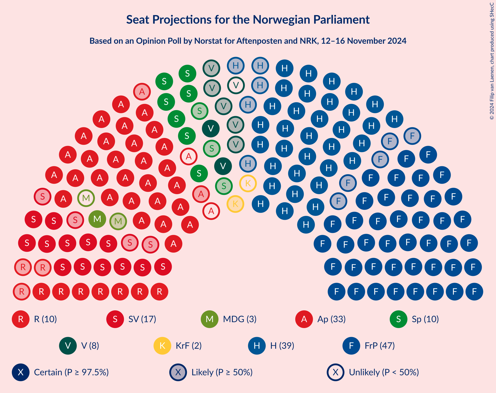
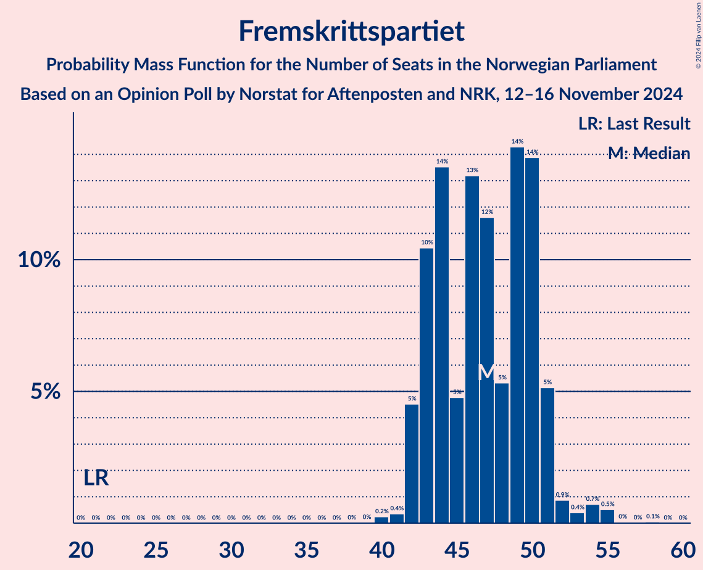
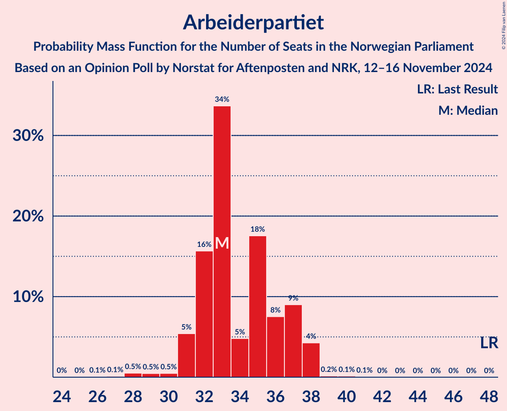
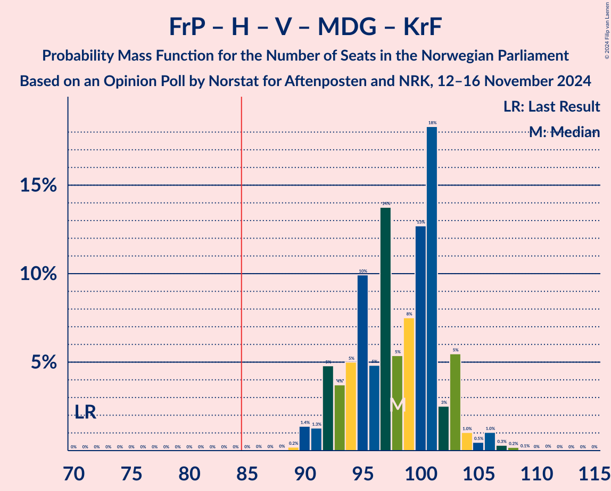
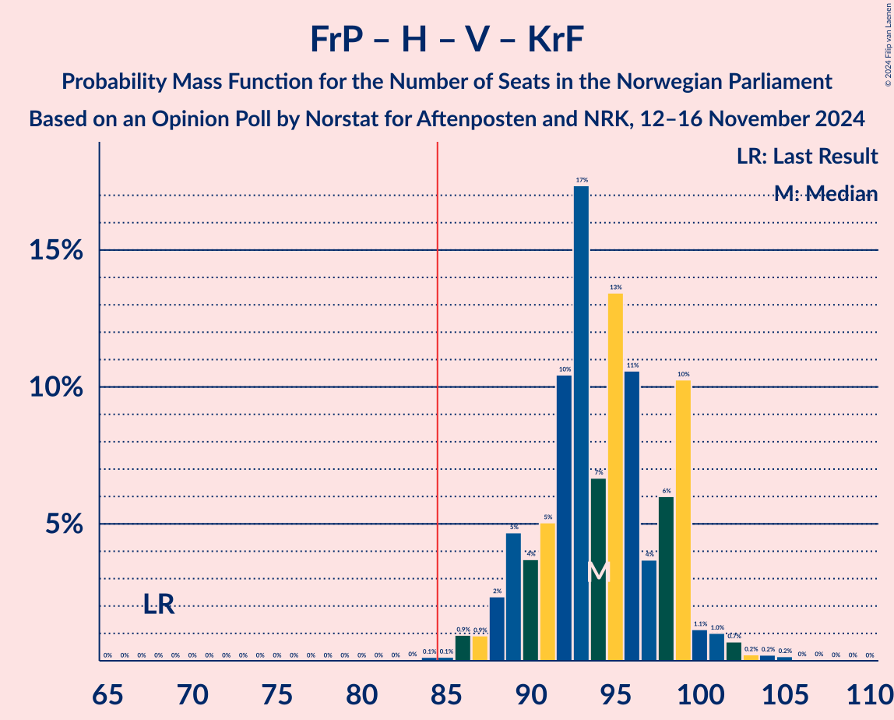
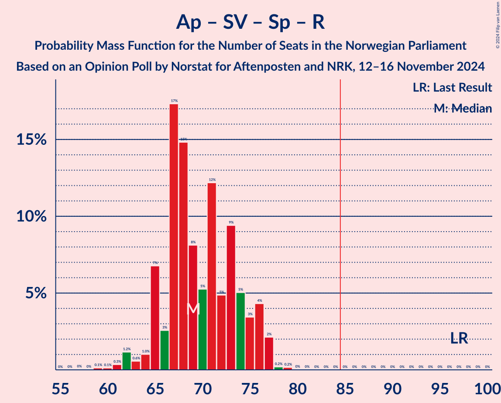
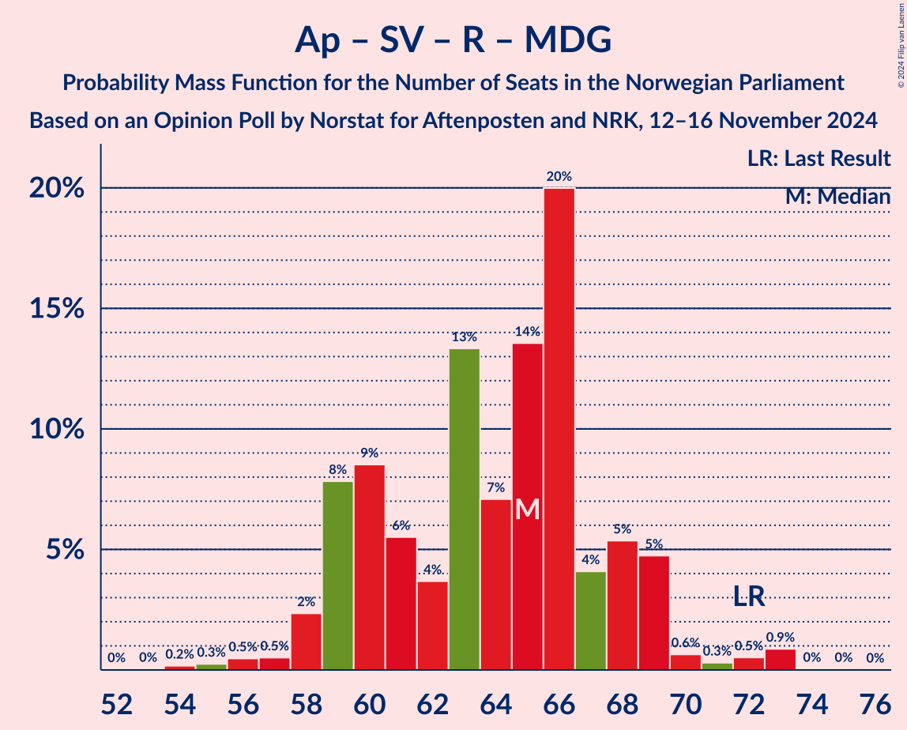
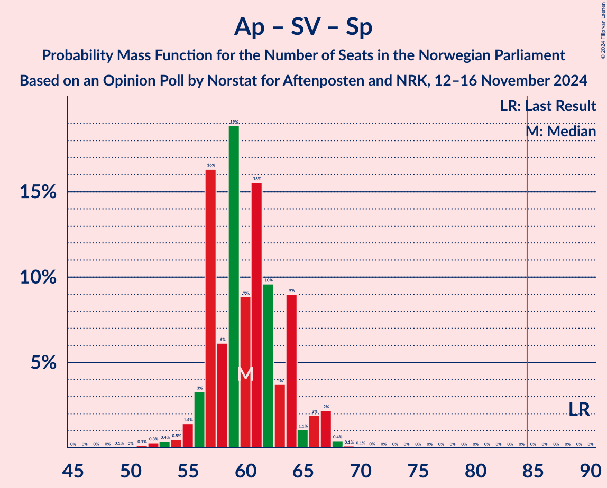

# Opinion Poll by Norstat for Aftenposten and NRK, 12–16 November 2024

<a href="#voting-intentions">Voting Intentions</a> | <a href="#seats">Seats</a> | <a href="#coalitions">Coalitions</a> | <a href="#technical-information">Technical Information</a>

## Voting Intentions

### Confidence Intervals

| Party | Last Result | Poll Result | 80% Confidence Interval | 90% Confidence Interval | 95% Confidence Interval | 99% Confidence Interval |
|:-----:|:-----------:|:-----------:|:-----------------------:|:-----------------------:|:-----------------------:|:-----------------------:|
| Fremskrittspartiet | 11.6% | 25.3% | 23.6–27.1% |23.1–27.6% |22.7–28.1% |21.9–29.0% |
| Høyre | 20.4% | 21.0% | 19.4–22.7% |19.0–23.2% |18.6–23.6% |17.8–24.5% |
| Arbeiderpartiet | 26.2% | 17.5% | 16.0–19.1% |15.6–19.6% |15.3–20.0% |14.6–20.8% |
| Sosialistisk Venstreparti | 7.6% | 9.3% | 8.2–10.6% |7.9–10.9% |7.7–11.3% |7.2–11.9% |
| Senterpartiet | 13.5% | 5.4% | 4.6–6.4% |4.3–6.7% |4.2–7.0% |3.8–7.5% |
| Rødt | 4.7% | 5.3% | 4.5–6.3% |4.3–6.6% |4.1–6.9% |3.7–7.4% |
| Venstre | 4.6% | 4.4% | 3.7–5.3% |3.5–5.6% |3.3–5.9% |3.0–6.4% |
| Miljøpartiet De Grønne | 3.9% | 3.5% | 2.9–4.4% |2.7–4.6% |2.5–4.8% |2.2–5.3% |
| Kristelig Folkeparti | 3.8% | 2.9% | 2.3–3.7% |2.2–3.9% |2.0–4.1% |1.8–4.6% |
| Industri- og Næringspartiet | 0.3% | 2.0% | 1.5–2.7% |1.4–2.9% |1.3–3.1% |1.1–3.4% |
| Norgesdemokratene | 1.1% | 1.1% | 0.8–1.7% |0.7–1.8% |0.6–2.0% |0.5–2.3% |

*Note:* The poll result column reflects the actual value used in the calculations. Published results may vary slightly, and in addition be rounded to fewer digits.

## Seats

### Confidence Intervals

| Party | Last Result | Median | 80% Confidence Interval | 90% Confidence Interval | 95% Confidence Interval | 99% Confidence Interval |
|:-----:|:-----------:|:------:|:-----------------------:|:-----------------------:|:-----------------------:|:-----------------------:|
| <a href="#fremskrittspartiet">Fremskrittspartiet</a> | 21 | 47 | 43–50 |42–51 |42–52 |41–55 |
| <a href="#høyre">Høyre</a> | 36 | 39 | 34–41 |34–42 |33–43 |32–45 |
| <a href="#arbeiderpartiet">Arbeiderpartiet</a> | 48 | 33 | 32–37 |31–37 |31–38 |28–38 |
| <a href="#sosialistisk-venstreparti">Sosialistisk Venstreparti</a> | 13 | 17 | 14–19 |14–20 |13–21 |12–22 |
| <a href="#senterpartiet">Senterpartiet</a> | 28 | 10 | 8–11 |7–12 |7–13 |0–14 |
| <a href="#rødt">Rødt</a> | 8 | 10 | 8–11 |8–12 |7–12 |1–13 |
| <a href="#venstre">Venstre</a> | 8 | 8 | 3–10 |3–10 |2–10 |2–12 |
| <a href="#miljøpartiet-de-grønne">Miljøpartiet De Grønne</a> | 3 | 3 | 1–8 |1–8 |1–8 |1–9 |
| <a href="#kristelig-folkeparti">Kristelig Folkeparti</a> | 3 | 2 | 1–3 |0–3 |0–7 |0–8 |
| <a href="#industri--og-næringspartiet">Industri- og Næringspartiet</a> | 0 | 0 | 0–1 |0–2 |0–2 |0–2 |
| <a href="#norgesdemokratene">Norgesdemokratene</a> | 0 | 0 | 0 |0 |0 |0 |

### Fremskrittspartiet

*For a full overview of the results for this party, see the [Fremskrittspartiet](party-fremskrittspartiet.html) page.*

| Number of Seats | Probability | Accumulated | Special Marks |
|:---------------:|:-----------:|:-----------:|:-------------:|
| 21 | 0% | 100% | Last Result |
| 22 | 0% | 100% |  |
| 23 | 0% | 100% |  |
| 24 | 0% | 100% |  |
| 25 | 0% | 100% |  |
| 26 | 0% | 100% |  |
| 27 | 0% | 100% |  |
| 28 | 0% | 100% |  |
| 29 | 0% | 100% |  |
| 30 | 0% | 100% |  |
| 31 | 0% | 100% |  |
| 32 | 0% | 100% |  |
| 33 | 0% | 100% |  |
| 34 | 0% | 100% |  |
| 35 | 0% | 100% |  |
| 36 | 0% | 100% |  |
| 37 | 0% | 100% |  |
| 38 | 0% | 100% |  |
| 39 | 0% | 100% |  |
| 40 | 0.2% | 100% |  |
| 41 | 0.4% | 99.7% |  |
| 42 | 5% | 99.4% |  |
| 43 | 10% | 95% |  |
| 44 | 14% | 84% |  |
| 45 | 5% | 71% |  |
| 46 | 13% | 66% |  |
| 47 | 12% | 53% | Median |
| 48 | 5% | 41% |  |
| 49 | 14% | 36% |  |
| 50 | 14% | 22% |  |
| 51 | 5% | 8% |  |
| 52 | 0.9% | 3% |  |
| 53 | 0.4% | 2% |  |
| 54 | 0.7% | 1.4% |  |
| 55 | 0.5% | 0.6% |  |
| 56 | 0% | 0.1% |  |
| 57 | 0% | 0.1% |  |
| 58 | 0.1% | 0.1% |  |
| 59 | 0% | 0% |  |

### Høyre

*For a full overview of the results for this party, see the [Høyre](party-høyre.html) page.*

| Number of Seats | Probability | Accumulated | Special Marks |
|:---------------:|:-----------:|:-----------:|:-------------:|
| 31 | 0.1% | 100% |  |
| 32 | 0.7% | 99.9% |  |
| 33 | 2% | 99.2% |  |
| 34 | 8% | 97% |  |
| 35 | 3% | 89% |  |
| 36 | 7% | 86% | Last Result |
| 37 | 18% | 79% |  |
| 38 | 9% | 61% |  |
| 39 | 28% | 52% | Median |
| 40 | 12% | 24% |  |
| 41 | 6% | 12% |  |
| 42 | 3% | 6% |  |
| 43 | 2% | 3% |  |
| 44 | 0.7% | 1.4% |  |
| 45 | 0.3% | 0.8% |  |
| 46 | 0.2% | 0.4% |  |
| 47 | 0.2% | 0.2% |  |
| 48 | 0.1% | 0.1% |  |
| 49 | 0% | 0% |  |

### Arbeiderpartiet

*For a full overview of the results for this party, see the [Arbeiderpartiet](party-arbeiderpartiet.html) page.*

| Number of Seats | Probability | Accumulated | Special Marks |
|:---------------:|:-----------:|:-----------:|:-------------:|
| 25 | 0% | 100% |  |
| 26 | 0.1% | 99.9% |  |
| 27 | 0.1% | 99.9% |  |
| 28 | 0.5% | 99.7% |  |
| 29 | 0.5% | 99.2% |  |
| 30 | 0.5% | 98.8% |  |
| 31 | 5% | 98% |  |
| 32 | 16% | 93% |  |
| 33 | 34% | 77% | Median |
| 34 | 5% | 44% |  |
| 35 | 18% | 39% |  |
| 36 | 8% | 21% |  |
| 37 | 9% | 14% |  |
| 38 | 4% | 5% |  |
| 39 | 0.2% | 0.4% |  |
| 40 | 0.1% | 0.2% |  |
| 41 | 0.1% | 0.1% |  |
| 42 | 0% | 0% |  |
| 43 | 0% | 0% |  |
| 44 | 0% | 0% |  |
| 45 | 0% | 0% |  |
| 46 | 0% | 0% |  |
| 47 | 0% | 0% |  |
| 48 | 0% | 0% | Last Result |

### Sosialistisk Venstreparti

*For a full overview of the results for this party, see the [Sosialistisk Venstreparti](party-sosialistiskvenstreparti.html) page.*

| Number of Seats | Probability | Accumulated | Special Marks |
|:---------------:|:-----------:|:-----------:|:-------------:|
| 11 | 0.1% | 100% |  |
| 12 | 0.5% | 99.9% |  |
| 13 | 4% | 99.4% | Last Result |
| 14 | 6% | 95% |  |
| 15 | 25% | 89% |  |
| 16 | 12% | 65% |  |
| 17 | 20% | 52% | Median |
| 18 | 16% | 32% |  |
| 19 | 7% | 15% |  |
| 20 | 4% | 8% |  |
| 21 | 3% | 4% |  |
| 22 | 0.5% | 0.6% |  |
| 23 | 0.1% | 0.1% |  |
| 24 | 0% | 0% |  |

### Senterpartiet

*For a full overview of the results for this party, see the [Senterpartiet](party-senterpartiet.html) page.*

| Number of Seats | Probability | Accumulated | Special Marks |
|:---------------:|:-----------:|:-----------:|:-------------:|
| 0 | 0.7% | 100% |  |
| 1 | 0.4% | 99.3% |  |
| 2 | 0% | 99.0% |  |
| 3 | 0% | 99.0% |  |
| 4 | 0% | 99.0% |  |
| 5 | 0% | 99.0% |  |
| 6 | 0% | 99.0% |  |
| 7 | 7% | 98.9% |  |
| 8 | 8% | 91% |  |
| 9 | 24% | 83% |  |
| 10 | 40% | 59% | Median |
| 11 | 9% | 19% |  |
| 12 | 6% | 10% |  |
| 13 | 3% | 4% |  |
| 14 | 0.6% | 0.7% |  |
| 15 | 0.1% | 0.1% |  |
| 16 | 0% | 0% |  |
| 17 | 0% | 0% |  |
| 18 | 0% | 0% |  |
| 19 | 0% | 0% |  |
| 20 | 0% | 0% |  |
| 21 | 0% | 0% |  |
| 22 | 0% | 0% |  |
| 23 | 0% | 0% |  |
| 24 | 0% | 0% |  |
| 25 | 0% | 0% |  |
| 26 | 0% | 0% |  |
| 27 | 0% | 0% |  |
| 28 | 0% | 0% | Last Result |

### Rødt

*For a full overview of the results for this party, see the [Rødt](party-rødt.html) page.*

| Number of Seats | Probability | Accumulated | Special Marks |
|:---------------:|:-----------:|:-----------:|:-------------:|
| 1 | 1.2% | 100% |  |
| 2 | 0% | 98.8% |  |
| 3 | 0% | 98.7% |  |
| 4 | 0% | 98.7% |  |
| 5 | 0% | 98.7% |  |
| 6 | 0.1% | 98.7% |  |
| 7 | 2% | 98.6% |  |
| 8 | 18% | 97% | Last Result |
| 9 | 17% | 79% |  |
| 10 | 39% | 62% | Median |
| 11 | 16% | 24% |  |
| 12 | 7% | 8% |  |
| 13 | 1.2% | 1.3% |  |
| 14 | 0.1% | 0.1% |  |
| 15 | 0% | 0% |  |

### Venstre

*For a full overview of the results for this party, see the [Venstre](party-venstre.html) page.*

| Number of Seats | Probability | Accumulated | Special Marks |
|:---------------:|:-----------:|:-----------:|:-------------:|
| 2 | 4% | 100% |  |
| 3 | 14% | 96% |  |
| 4 | 0% | 83% |  |
| 5 | 0% | 83% |  |
| 6 | 0.1% | 83% |  |
| 7 | 10% | 83% |  |
| 8 | 44% | 73% | Last Result, Median |
| 9 | 17% | 29% |  |
| 10 | 10% | 12% |  |
| 11 | 2% | 2% |  |
| 12 | 0.8% | 0.9% |  |
| 13 | 0% | 0% |  |

### Miljøpartiet De Grønne

*For a full overview of the results for this party, see the [Miljøpartiet De Grønne](party-miljøpartietdegrønne.html) page.*

| Number of Seats | Probability | Accumulated | Special Marks |
|:---------------:|:-----------:|:-----------:|:-------------:|
| 1 | 14% | 100% |  |
| 2 | 31% | 86% |  |
| 3 | 25% | 55% | Last Result, Median |
| 4 | 0% | 30% |  |
| 5 | 0% | 30% |  |
| 6 | 0% | 30% |  |
| 7 | 13% | 30% |  |
| 8 | 15% | 17% |  |
| 9 | 1.4% | 2% |  |
| 10 | 0.2% | 0.2% |  |
| 11 | 0% | 0% |  |

### Kristelig Folkeparti

*For a full overview of the results for this party, see the [Kristelig Folkeparti](party-kristeligfolkeparti.html) page.*

| Number of Seats | Probability | Accumulated | Special Marks |
|:---------------:|:-----------:|:-----------:|:-------------:|
| 0 | 6% | 100% |  |
| 1 | 29% | 94% |  |
| 2 | 49% | 65% | Median |
| 3 | 13% | 16% | Last Result |
| 4 | 0% | 3% |  |
| 5 | 0% | 3% |  |
| 6 | 0% | 3% |  |
| 7 | 3% | 3% |  |
| 8 | 0.5% | 0.5% |  |
| 9 | 0% | 0.1% |  |
| 10 | 0% | 0% |  |

### Industri- og Næringspartiet

*For a full overview of the results for this party, see the [Industri- og Næringspartiet](party-industri-ognæringspartiet.html) page.*

| Number of Seats | Probability | Accumulated | Special Marks |
|:---------------:|:-----------:|:-----------:|:-------------:|
| 0 | 87% | 100% | Last Result, Median |
| 1 | 4% | 13% |  |
| 2 | 9% | 9% |  |
| 3 | 0% | 0.1% |  |
| 4 | 0% | 0% |  |

### Norgesdemokratene

*For a full overview of the results for this party, see the [Norgesdemokratene](party-norgesdemokratene.html) page.*

| Number of Seats | Probability | Accumulated | Special Marks |
|:---------------:|:-----------:|:-----------:|:-------------:|
| 0 | 100% | 100% | Last Result, Median |

## Coalitions

### Confidence Intervals

| Coalition | Last Result | Median | Majority? | 80% Confidence Interval | 90% Confidence Interval | 95% Confidence Interval | 99% Confidence Interval |
|:---------:|:-----------:|:------:|:---------:|:-----------------------:|:-----------------------:|:-----------------------:|:-----------------------:|
| Fremskrittspartiet – Høyre – Senterpartiet – Venstre – Kristelig Folkeparti | 96 | 103 | 100% | 100–109 | 99–109 | 98–110 | 95–112 |
| Fremskrittspartiet – Høyre – Venstre – Miljøpartiet De Grønne – Kristelig Folkeparti | 71 | 98 | 100% | 93–102 | 92–103 | 91–104 | 90–107 |
| Fremskrittspartiet – Høyre – Venstre – Kristelig Folkeparti | 68 | 94 | 99.8% | 90–99 | 89–99 | 88–100 | 86–103 |
| Fremskrittspartiet – Høyre – Venstre | 65 | 92 | 99.1% | 88–97 | 87–97 | 86–98 | 83–101 |
| Fremskrittspartiet – Høyre | 57 | 85 | 54% | 81–88 | 80–90 | 79–92 | 77–93 |
| Arbeiderpartiet – Sosialistisk Venstreparti – Senterpartiet – Rødt – Miljøpartiet De Grønne | 100 | 74 | 0% | 69–78 | 68–79 | 67–80 | 64–82 |
| Arbeiderpartiet – Sosialistisk Venstreparti – Senterpartiet – Rødt | 97 | 69 | 0% | 65–75 | 65–76 | 64–77 | 61–77 |
| Arbeiderpartiet – Sosialistisk Venstreparti – Senterpartiet – Miljøpartiet De Grønne – Kristelig Folkeparti | 95 | 66 | 0% | 62–70 | 62–71 | 60–73 | 57–74 |
| Arbeiderpartiet – Sosialistisk Venstreparti – Senterpartiet – Miljøpartiet De Grønne | 92 | 64 | 0% | 60–67 | 59–69 | 58–71 | 55–72 |
| Arbeiderpartiet – Sosialistisk Venstreparti – Rødt – Miljøpartiet De Grønne | 72 | 65 | 0% | 59–68 | 59–69 | 58–69 | 55–73 |
| Arbeiderpartiet – Sosialistisk Venstreparti – Senterpartiet | 89 | 60 | 0% | 57–64 | 56–65 | 55–67 | 52–68 |
| Arbeiderpartiet – Sosialistisk Venstreparti | 61 | 50 | 0% | 48–54 | 47–55 | 46–56 | 45–57 |
| Arbeiderpartiet – Senterpartiet – Miljøpartiet De Grønne – Kristelig Folkeparti | 82 | 50 | 0% | 45–54 | 45–54 | 43–55 | 39–57 |
| Høyre – Venstre – Kristelig Folkeparti | 47 | 49 | 0% | 43–51 | 42–52 | 41–54 | 38–55 |
| Arbeiderpartiet – Senterpartiet – Kristelig Folkeparti | 79 | 45 | 0% | 43–49 | 41–49 | 41–51 | 37–53 |
| Arbeiderpartiet – Senterpartiet | 76 | 43 | 0% | 41–46 | 40–47 | 40–48 | 35–50 |
| Senterpartiet – Venstre – Kristelig Folkeparti | 39 | 19 | 0% | 15–22 | 14–23 | 13–24 | 11–26 |

### Fremskrittspartiet – Høyre – Senterpartiet – Venstre – Kristelig Folkeparti

| Number of Seats | Probability | Accumulated | Special Marks |
|:---------------:|:-----------:|:-----------:|:-------------:|
| 93 | 0.1% | 100% |  |
| 94 | 0.2% | 99.9% |  |
| 95 | 0.9% | 99.7% |  |
| 96 | 0.4% | 98.8% | Last Result |
| 97 | 0.3% | 98% |  |
| 98 | 2% | 98% |  |
| 99 | 5% | 96% |  |
| 100 | 6% | 91% |  |
| 101 | 3% | 85% |  |
| 102 | 20% | 82% |  |
| 103 | 14% | 62% |  |
| 104 | 8% | 49% |  |
| 105 | 14% | 40% |  |
| 106 | 4% | 26% | Median |
| 107 | 4% | 23% |  |
| 108 | 8% | 18% |  |
| 109 | 8% | 10% |  |
| 110 | 1.3% | 3% |  |
| 111 | 0.4% | 1.3% |  |
| 112 | 0.4% | 0.9% |  |
| 113 | 0.2% | 0.5% |  |
| 114 | 0.2% | 0.2% |  |
| 115 | 0% | 0.1% |  |
| 116 | 0% | 0% |  |

### Fremskrittspartiet – Høyre – Venstre – Miljøpartiet De Grønne – Kristelig Folkeparti

| Number of Seats | Probability | Accumulated | Special Marks |
|:---------------:|:-----------:|:-----------:|:-------------:|
| 71 | 0% | 100% | Last Result |
| 72 | 0% | 100% |  |
| 73 | 0% | 100% |  |
| 74 | 0% | 100% |  |
| 75 | 0% | 100% |  |
| 76 | 0% | 100% |  |
| 77 | 0% | 100% |  |
| 78 | 0% | 100% |  |
| 79 | 0% | 100% |  |
| 80 | 0% | 100% |  |
| 81 | 0% | 100% |  |
| 82 | 0% | 100% |  |
| 83 | 0% | 100% |  |
| 84 | 0% | 100% |  |
| 85 | 0% | 100% | Majority |
| 86 | 0% | 100% |  |
| 87 | 0% | 100% |  |
| 88 | 0% | 100% |  |
| 89 | 0.2% | 99.9% |  |
| 90 | 1.4% | 99.7% |  |
| 91 | 1.3% | 98% |  |
| 92 | 5% | 97% |  |
| 93 | 4% | 92% |  |
| 94 | 5% | 89% |  |
| 95 | 10% | 84% |  |
| 96 | 5% | 74% |  |
| 97 | 14% | 69% |  |
| 98 | 5% | 55% |  |
| 99 | 8% | 50% | Median |
| 100 | 13% | 42% |  |
| 101 | 18% | 29% |  |
| 102 | 3% | 11% |  |
| 103 | 5% | 9% |  |
| 104 | 1.0% | 3% |  |
| 105 | 0.5% | 2% |  |
| 106 | 1.0% | 2% |  |
| 107 | 0.3% | 0.6% |  |
| 108 | 0.2% | 0.3% |  |
| 109 | 0.1% | 0.1% |  |
| 110 | 0% | 0.1% |  |
| 111 | 0% | 0% |  |

### Fremskrittspartiet – Høyre – Venstre – Kristelig Folkeparti

| Number of Seats | Probability | Accumulated | Special Marks |
|:---------------:|:-----------:|:-----------:|:-------------:|
| 68 | 0% | 100% | Last Result |
| 69 | 0% | 100% |  |
| 70 | 0% | 100% |  |
| 71 | 0% | 100% |  |
| 72 | 0% | 100% |  |
| 73 | 0% | 100% |  |
| 74 | 0% | 100% |  |
| 75 | 0% | 100% |  |
| 76 | 0% | 100% |  |
| 77 | 0% | 100% |  |
| 78 | 0% | 100% |  |
| 79 | 0% | 100% |  |
| 80 | 0% | 100% |  |
| 81 | 0% | 100% |  |
| 82 | 0% | 100% |  |
| 83 | 0% | 100% |  |
| 84 | 0.1% | 99.9% |  |
| 85 | 0.1% | 99.8% | Majority |
| 86 | 0.9% | 99.7% |  |
| 87 | 0.9% | 98.7% |  |
| 88 | 2% | 98% |  |
| 89 | 5% | 95% |  |
| 90 | 4% | 91% |  |
| 91 | 5% | 87% |  |
| 92 | 10% | 82% |  |
| 93 | 17% | 72% |  |
| 94 | 7% | 54% |  |
| 95 | 13% | 48% |  |
| 96 | 11% | 34% | Median |
| 97 | 4% | 24% |  |
| 98 | 6% | 20% |  |
| 99 | 10% | 14% |  |
| 100 | 1.1% | 4% |  |
| 101 | 1.0% | 2% |  |
| 102 | 0.7% | 1.4% |  |
| 103 | 0.2% | 0.7% |  |
| 104 | 0.2% | 0.5% |  |
| 105 | 0.2% | 0.3% |  |
| 106 | 0% | 0.1% |  |
| 107 | 0% | 0.1% |  |
| 108 | 0% | 0% |  |

### Fremskrittspartiet – Høyre – Venstre

| Number of Seats | Probability | Accumulated | Special Marks |
|:---------------:|:-----------:|:-----------:|:-------------:|
| 65 | 0% | 100% | Last Result |
| 66 | 0% | 100% |  |
| 67 | 0% | 100% |  |
| 68 | 0% | 100% |  |
| 69 | 0% | 100% |  |
| 70 | 0% | 100% |  |
| 71 | 0% | 100% |  |
| 72 | 0% | 100% |  |
| 73 | 0% | 100% |  |
| 74 | 0% | 100% |  |
| 75 | 0% | 100% |  |
| 76 | 0% | 100% |  |
| 77 | 0% | 100% |  |
| 78 | 0% | 100% |  |
| 79 | 0% | 100% |  |
| 80 | 0% | 100% |  |
| 81 | 0% | 100% |  |
| 82 | 0.2% | 99.9% |  |
| 83 | 0.3% | 99.7% |  |
| 84 | 0.3% | 99.4% |  |
| 85 | 1.2% | 99.1% | Majority |
| 86 | 2% | 98% |  |
| 87 | 5% | 96% |  |
| 88 | 5% | 91% |  |
| 89 | 5% | 86% |  |
| 90 | 8% | 81% |  |
| 91 | 18% | 73% |  |
| 92 | 6% | 54% |  |
| 93 | 5% | 48% |  |
| 94 | 14% | 43% | Median |
| 95 | 10% | 29% |  |
| 96 | 7% | 19% |  |
| 97 | 9% | 12% |  |
| 98 | 0.7% | 3% |  |
| 99 | 1.0% | 2% |  |
| 100 | 0.7% | 1.4% |  |
| 101 | 0.3% | 0.7% |  |
| 102 | 0.2% | 0.4% |  |
| 103 | 0.1% | 0.2% |  |
| 104 | 0% | 0.1% |  |
| 105 | 0.1% | 0.1% |  |
| 106 | 0% | 0% |  |

### Fremskrittspartiet – Høyre

| Number of Seats | Probability | Accumulated | Special Marks |
|:---------------:|:-----------:|:-----------:|:-------------:|
| 57 | 0% | 100% | Last Result |
| 58 | 0% | 100% |  |
| 59 | 0% | 100% |  |
| 60 | 0% | 100% |  |
| 61 | 0% | 100% |  |
| 62 | 0% | 100% |  |
| 63 | 0% | 100% |  |
| 64 | 0% | 100% |  |
| 65 | 0% | 100% |  |
| 66 | 0% | 100% |  |
| 67 | 0% | 100% |  |
| 68 | 0% | 100% |  |
| 69 | 0% | 100% |  |
| 70 | 0% | 100% |  |
| 71 | 0% | 100% |  |
| 72 | 0% | 100% |  |
| 73 | 0% | 100% |  |
| 74 | 0% | 100% |  |
| 75 | 0.1% | 100% |  |
| 76 | 0.3% | 99.8% |  |
| 77 | 0.4% | 99.5% |  |
| 78 | 1.5% | 99.2% |  |
| 79 | 2% | 98% |  |
| 80 | 1.4% | 96% |  |
| 81 | 6% | 95% |  |
| 82 | 8% | 89% |  |
| 83 | 15% | 81% |  |
| 84 | 12% | 66% |  |
| 85 | 8% | 54% | Majority |
| 86 | 14% | 46% | Median |
| 87 | 20% | 32% |  |
| 88 | 3% | 12% |  |
| 89 | 2% | 9% |  |
| 90 | 2% | 7% |  |
| 91 | 1.5% | 4% |  |
| 92 | 2% | 3% |  |
| 93 | 0.6% | 1.1% |  |
| 94 | 0.2% | 0.5% |  |
| 95 | 0% | 0.3% |  |
| 96 | 0% | 0.2% |  |
| 97 | 0.1% | 0.2% |  |
| 98 | 0.1% | 0.1% |  |
| 99 | 0% | 0.1% |  |
| 100 | 0% | 0.1% |  |
| 101 | 0% | 0% |  |

### Arbeiderpartiet – Sosialistisk Venstreparti – Senterpartiet – Rødt – Miljøpartiet De Grønne

| Number of Seats | Probability | Accumulated | Special Marks |
|:---------------:|:-----------:|:-----------:|:-------------:|
| 61 | 0% | 100% |  |
| 62 | 0% | 99.9% |  |
| 63 | 0.2% | 99.9% |  |
| 64 | 0.3% | 99.7% |  |
| 65 | 0.2% | 99.4% |  |
| 66 | 0.7% | 99.1% |  |
| 67 | 2% | 98% |  |
| 68 | 1.4% | 96% |  |
| 69 | 9% | 95% |  |
| 70 | 6% | 86% |  |
| 71 | 7% | 80% |  |
| 72 | 11% | 73% |  |
| 73 | 12% | 62% | Median |
| 74 | 5% | 50% |  |
| 75 | 17% | 45% |  |
| 76 | 12% | 28% |  |
| 77 | 5% | 16% |  |
| 78 | 3% | 11% |  |
| 79 | 6% | 8% |  |
| 80 | 0.8% | 3% |  |
| 81 | 0.8% | 2% |  |
| 82 | 0.9% | 1.1% |  |
| 83 | 0.1% | 0.2% |  |
| 84 | 0.1% | 0.1% |  |
| 85 | 0% | 0% | Majority |
| 86 | 0% | 0% |  |
| 87 | 0% | 0% |  |
| 88 | 0% | 0% |  |
| 89 | 0% | 0% |  |
| 90 | 0% | 0% |  |
| 91 | 0% | 0% |  |
| 92 | 0% | 0% |  |
| 93 | 0% | 0% |  |
| 94 | 0% | 0% |  |
| 95 | 0% | 0% |  |
| 96 | 0% | 0% |  |
| 97 | 0% | 0% |  |
| 98 | 0% | 0% |  |
| 99 | 0% | 0% |  |
| 100 | 0% | 0% | Last Result |

### Arbeiderpartiet – Sosialistisk Venstreparti – Senterpartiet – Rødt

| Number of Seats | Probability | Accumulated | Special Marks |
|:---------------:|:-----------:|:-----------:|:-------------:|
| 57 | 0% | 100% |  |
| 58 | 0% | 99.9% |  |
| 59 | 0.1% | 99.9% |  |
| 60 | 0.1% | 99.8% |  |
| 61 | 0.3% | 99.7% |  |
| 62 | 1.2% | 99.3% |  |
| 63 | 0.6% | 98% |  |
| 64 | 1.0% | 98% |  |
| 65 | 7% | 97% |  |
| 66 | 3% | 90% |  |
| 67 | 17% | 87% |  |
| 68 | 15% | 70% |  |
| 69 | 8% | 55% |  |
| 70 | 5% | 47% | Median |
| 71 | 12% | 42% |  |
| 72 | 5% | 30% |  |
| 73 | 9% | 25% |  |
| 74 | 5% | 15% |  |
| 75 | 3% | 10% |  |
| 76 | 4% | 7% |  |
| 77 | 2% | 3% |  |
| 78 | 0.2% | 0.4% |  |
| 79 | 0.2% | 0.2% |  |
| 80 | 0% | 0% |  |
| 81 | 0% | 0% |  |
| 82 | 0% | 0% |  |
| 83 | 0% | 0% |  |
| 84 | 0% | 0% |  |
| 85 | 0% | 0% | Majority |
| 86 | 0% | 0% |  |
| 87 | 0% | 0% |  |
| 88 | 0% | 0% |  |
| 89 | 0% | 0% |  |
| 90 | 0% | 0% |  |
| 91 | 0% | 0% |  |
| 92 | 0% | 0% |  |
| 93 | 0% | 0% |  |
| 94 | 0% | 0% |  |
| 95 | 0% | 0% |  |
| 96 | 0% | 0% |  |
| 97 | 0% | 0% | Last Result |

### Arbeiderpartiet – Sosialistisk Venstreparti – Senterpartiet – Miljøpartiet De Grønne – Kristelig Folkeparti

| Number of Seats | Probability | Accumulated | Special Marks |
|:---------------:|:-----------:|:-----------:|:-------------:|
| 54 | 0.1% | 100% |  |
| 55 | 0.1% | 99.9% |  |
| 56 | 0.1% | 99.8% |  |
| 57 | 0.3% | 99.7% |  |
| 58 | 0.1% | 99.4% |  |
| 59 | 0.6% | 99.2% |  |
| 60 | 2% | 98.6% |  |
| 61 | 1.0% | 97% |  |
| 62 | 9% | 96% |  |
| 63 | 8% | 86% |  |
| 64 | 19% | 78% |  |
| 65 | 9% | 59% | Median |
| 66 | 5% | 50% |  |
| 67 | 18% | 45% |  |
| 68 | 6% | 27% |  |
| 69 | 11% | 21% |  |
| 70 | 5% | 10% |  |
| 71 | 2% | 6% |  |
| 72 | 1.1% | 4% |  |
| 73 | 2% | 3% |  |
| 74 | 0.4% | 0.8% |  |
| 75 | 0.3% | 0.4% |  |
| 76 | 0.1% | 0.1% |  |
| 77 | 0% | 0.1% |  |
| 78 | 0% | 0% |  |
| 79 | 0% | 0% |  |
| 80 | 0% | 0% |  |
| 81 | 0% | 0% |  |
| 82 | 0% | 0% |  |
| 83 | 0% | 0% |  |
| 84 | 0% | 0% |  |
| 85 | 0% | 0% | Majority |
| 86 | 0% | 0% |  |
| 87 | 0% | 0% |  |
| 88 | 0% | 0% |  |
| 89 | 0% | 0% |  |
| 90 | 0% | 0% |  |
| 91 | 0% | 0% |  |
| 92 | 0% | 0% |  |
| 93 | 0% | 0% |  |
| 94 | 0% | 0% |  |
| 95 | 0% | 0% | Last Result |

### Arbeiderpartiet – Sosialistisk Venstreparti – Senterpartiet – Miljøpartiet De Grønne

| Number of Seats | Probability | Accumulated | Special Marks |
|:---------------:|:-----------:|:-----------:|:-------------:|
| 52 | 0% | 100% |  |
| 53 | 0% | 99.9% |  |
| 54 | 0.2% | 99.9% |  |
| 55 | 0.3% | 99.7% |  |
| 56 | 0.4% | 99.5% |  |
| 57 | 0.4% | 99.1% |  |
| 58 | 2% | 98.7% |  |
| 59 | 2% | 97% |  |
| 60 | 9% | 95% |  |
| 61 | 6% | 86% |  |
| 62 | 10% | 80% |  |
| 63 | 16% | 69% | Median |
| 64 | 7% | 53% |  |
| 65 | 20% | 46% |  |
| 66 | 7% | 25% |  |
| 67 | 8% | 18% |  |
| 68 | 4% | 10% |  |
| 69 | 2% | 6% |  |
| 70 | 0.9% | 4% |  |
| 71 | 2% | 3% |  |
| 72 | 0.9% | 1.2% |  |
| 73 | 0.3% | 0.3% |  |
| 74 | 0% | 0.1% |  |
| 75 | 0% | 0% |  |
| 76 | 0% | 0% |  |
| 77 | 0% | 0% |  |
| 78 | 0% | 0% |  |
| 79 | 0% | 0% |  |
| 80 | 0% | 0% |  |
| 81 | 0% | 0% |  |
| 82 | 0% | 0% |  |
| 83 | 0% | 0% |  |
| 84 | 0% | 0% |  |
| 85 | 0% | 0% | Majority |
| 86 | 0% | 0% |  |
| 87 | 0% | 0% |  |
| 88 | 0% | 0% |  |
| 89 | 0% | 0% |  |
| 90 | 0% | 0% |  |
| 91 | 0% | 0% |  |
| 92 | 0% | 0% | Last Result |

### Arbeiderpartiet – Sosialistisk Venstreparti – Rødt – Miljøpartiet De Grønne

| Number of Seats | Probability | Accumulated | Special Marks |
|:---------------:|:-----------:|:-----------:|:-------------:|
| 53 | 0% | 100% |  |
| 54 | 0.2% | 99.9% |  |
| 55 | 0.3% | 99.7% |  |
| 56 | 0.5% | 99.5% |  |
| 57 | 0.5% | 99.0% |  |
| 58 | 2% | 98.5% |  |
| 59 | 8% | 96% |  |
| 60 | 9% | 88% |  |
| 61 | 6% | 80% |  |
| 62 | 4% | 74% |  |
| 63 | 13% | 71% | Median |
| 64 | 7% | 57% |  |
| 65 | 14% | 50% |  |
| 66 | 20% | 37% |  |
| 67 | 4% | 17% |  |
| 68 | 5% | 13% |  |
| 69 | 5% | 7% |  |
| 70 | 0.6% | 2% |  |
| 71 | 0.3% | 2% |  |
| 72 | 0.5% | 1.5% | Last Result |
| 73 | 0.9% | 1.0% |  |
| 74 | 0% | 0.1% |  |
| 75 | 0% | 0.1% |  |
| 76 | 0% | 0% |  |

### Arbeiderpartiet – Sosialistisk Venstreparti – Senterpartiet

| Number of Seats | Probability | Accumulated | Special Marks |
|:---------------:|:-----------:|:-----------:|:-------------:|
| 49 | 0.1% | 100% |  |
| 50 | 0% | 99.9% |  |
| 51 | 0.1% | 99.9% |  |
| 52 | 0.3% | 99.7% |  |
| 53 | 0.4% | 99.4% |  |
| 54 | 0.5% | 99.0% |  |
| 55 | 1.4% | 98.6% |  |
| 56 | 3% | 97% |  |
| 57 | 16% | 94% |  |
| 58 | 6% | 78% |  |
| 59 | 19% | 71% |  |
| 60 | 9% | 53% | Median |
| 61 | 16% | 44% |  |
| 62 | 10% | 28% |  |
| 63 | 4% | 18% |  |
| 64 | 9% | 15% |  |
| 65 | 1.1% | 6% |  |
| 66 | 2% | 5% |  |
| 67 | 2% | 3% |  |
| 68 | 0.4% | 0.6% |  |
| 69 | 0.1% | 0.2% |  |
| 70 | 0.1% | 0.1% |  |
| 71 | 0% | 0% |  |
| 72 | 0% | 0% |  |
| 73 | 0% | 0% |  |
| 74 | 0% | 0% |  |
| 75 | 0% | 0% |  |
| 76 | 0% | 0% |  |
| 77 | 0% | 0% |  |
| 78 | 0% | 0% |  |
| 79 | 0% | 0% |  |
| 80 | 0% | 0% |  |
| 81 | 0% | 0% |  |
| 82 | 0% | 0% |  |
| 83 | 0% | 0% |  |
| 84 | 0% | 0% |  |
| 85 | 0% | 0% | Majority |
| 86 | 0% | 0% |  |
| 87 | 0% | 0% |  |
| 88 | 0% | 0% |  |
| 89 | 0% | 0% | Last Result |

### Arbeiderpartiet – Sosialistisk Venstreparti

| Number of Seats | Probability | Accumulated | Special Marks |
|:---------------:|:-----------:|:-----------:|:-------------:|
| 41 | 0% | 100% |  |
| 42 | 0% | 99.9% |  |
| 43 | 0.2% | 99.9% |  |
| 44 | 0.2% | 99.7% |  |
| 45 | 0.8% | 99.5% |  |
| 46 | 1.4% | 98.7% |  |
| 47 | 5% | 97% |  |
| 48 | 14% | 93% |  |
| 49 | 16% | 78% |  |
| 50 | 16% | 62% | Median |
| 51 | 17% | 46% |  |
| 52 | 13% | 29% |  |
| 53 | 4% | 16% |  |
| 54 | 4% | 12% |  |
| 55 | 4% | 9% |  |
| 56 | 3% | 5% |  |
| 57 | 1.4% | 2% |  |
| 58 | 0.2% | 0.4% |  |
| 59 | 0.1% | 0.2% |  |
| 60 | 0% | 0% |  |
| 61 | 0% | 0% | Last Result |

### Arbeiderpartiet – Senterpartiet – Miljøpartiet De Grønne – Kristelig Folkeparti

| Number of Seats | Probability | Accumulated | Special Marks |
|:---------------:|:-----------:|:-----------:|:-------------:|
| 37 | 0.1% | 100% |  |
| 38 | 0.1% | 99.9% |  |
| 39 | 0.4% | 99.8% |  |
| 40 | 0.1% | 99.4% |  |
| 41 | 0.3% | 99.3% |  |
| 42 | 0.4% | 99.0% |  |
| 43 | 3% | 98.6% |  |
| 44 | 0.8% | 96% |  |
| 45 | 9% | 95% |  |
| 46 | 14% | 86% |  |
| 47 | 6% | 72% |  |
| 48 | 8% | 67% | Median |
| 49 | 6% | 58% |  |
| 50 | 18% | 52% |  |
| 51 | 6% | 35% |  |
| 52 | 15% | 29% |  |
| 53 | 3% | 13% |  |
| 54 | 6% | 10% |  |
| 55 | 2% | 4% |  |
| 56 | 1.0% | 2% |  |
| 57 | 1.0% | 1.3% |  |
| 58 | 0.2% | 0.4% |  |
| 59 | 0.1% | 0.2% |  |
| 60 | 0.1% | 0.1% |  |
| 61 | 0% | 0% |  |
| 62 | 0% | 0% |  |
| 63 | 0% | 0% |  |
| 64 | 0% | 0% |  |
| 65 | 0% | 0% |  |
| 66 | 0% | 0% |  |
| 67 | 0% | 0% |  |
| 68 | 0% | 0% |  |
| 69 | 0% | 0% |  |
| 70 | 0% | 0% |  |
| 71 | 0% | 0% |  |
| 72 | 0% | 0% |  |
| 73 | 0% | 0% |  |
| 74 | 0% | 0% |  |
| 75 | 0% | 0% |  |
| 76 | 0% | 0% |  |
| 77 | 0% | 0% |  |
| 78 | 0% | 0% |  |
| 79 | 0% | 0% |  |
| 80 | 0% | 0% |  |
| 81 | 0% | 0% |  |
| 82 | 0% | 0% | Last Result |

### Høyre – Venstre – Kristelig Folkeparti

| Number of Seats | Probability | Accumulated | Special Marks |
|:---------------:|:-----------:|:-----------:|:-------------:|
| 38 | 0.7% | 100% |  |
| 39 | 0.9% | 99.3% |  |
| 40 | 0.3% | 98% |  |
| 41 | 2% | 98% |  |
| 42 | 3% | 96% |  |
| 43 | 9% | 93% |  |
| 44 | 3% | 84% |  |
| 45 | 5% | 80% |  |
| 46 | 13% | 75% |  |
| 47 | 3% | 62% | Last Result |
| 48 | 8% | 59% |  |
| 49 | 34% | 52% | Median |
| 50 | 6% | 18% |  |
| 51 | 3% | 12% |  |
| 52 | 6% | 9% |  |
| 53 | 0.6% | 3% |  |
| 54 | 1.5% | 3% |  |
| 55 | 0.8% | 1.1% |  |
| 56 | 0.2% | 0.3% |  |
| 57 | 0.1% | 0.1% |  |
| 58 | 0% | 0% |  |

### Arbeiderpartiet – Senterpartiet – Kristelig Folkeparti

| Number of Seats | Probability | Accumulated | Special Marks |
|:---------------:|:-----------:|:-----------:|:-------------:|
| 34 | 0% | 100% |  |
| 35 | 0.2% | 99.9% |  |
| 36 | 0.1% | 99.7% |  |
| 37 | 0.3% | 99.7% |  |
| 38 | 0.2% | 99.3% |  |
| 39 | 0.4% | 99.1% |  |
| 40 | 0.7% | 98.7% |  |
| 41 | 3% | 98% |  |
| 42 | 1.3% | 95% |  |
| 43 | 8% | 94% |  |
| 44 | 33% | 85% |  |
| 45 | 9% | 53% | Median |
| 46 | 6% | 43% |  |
| 47 | 21% | 37% |  |
| 48 | 5% | 16% |  |
| 49 | 5% | 10% |  |
| 50 | 2% | 5% |  |
| 51 | 2% | 3% |  |
| 52 | 0.7% | 1.4% |  |
| 53 | 0.3% | 0.7% |  |
| 54 | 0.3% | 0.4% |  |
| 55 | 0% | 0.1% |  |
| 56 | 0% | 0% |  |
| 57 | 0% | 0% |  |
| 58 | 0% | 0% |  |
| 59 | 0% | 0% |  |
| 60 | 0% | 0% |  |
| 61 | 0% | 0% |  |
| 62 | 0% | 0% |  |
| 63 | 0% | 0% |  |
| 64 | 0% | 0% |  |
| 65 | 0% | 0% |  |
| 66 | 0% | 0% |  |
| 67 | 0% | 0% |  |
| 68 | 0% | 0% |  |
| 69 | 0% | 0% |  |
| 70 | 0% | 0% |  |
| 71 | 0% | 0% |  |
| 72 | 0% | 0% |  |
| 73 | 0% | 0% |  |
| 74 | 0% | 0% |  |
| 75 | 0% | 0% |  |
| 76 | 0% | 0% |  |
| 77 | 0% | 0% |  |
| 78 | 0% | 0% |  |
| 79 | 0% | 0% | Last Result |

### Arbeiderpartiet – Senterpartiet

| Number of Seats | Probability | Accumulated | Special Marks |
|:---------------:|:-----------:|:-----------:|:-------------:|
| 33 | 0.2% | 100% |  |
| 34 | 0.1% | 99.8% |  |
| 35 | 0.4% | 99.7% |  |
| 36 | 0.1% | 99.3% |  |
| 37 | 0.4% | 99.2% |  |
| 38 | 0.4% | 98.8% |  |
| 39 | 0.8% | 98% |  |
| 40 | 3% | 98% |  |
| 41 | 5% | 95% |  |
| 42 | 27% | 89% |  |
| 43 | 19% | 62% | Median |
| 44 | 8% | 43% |  |
| 45 | 18% | 35% |  |
| 46 | 9% | 17% |  |
| 47 | 4% | 8% |  |
| 48 | 2% | 4% |  |
| 49 | 1.1% | 2% |  |
| 50 | 0.3% | 0.6% |  |
| 51 | 0.2% | 0.3% |  |
| 52 | 0% | 0% |  |
| 53 | 0% | 0% |  |
| 54 | 0% | 0% |  |
| 55 | 0% | 0% |  |
| 56 | 0% | 0% |  |
| 57 | 0% | 0% |  |
| 58 | 0% | 0% |  |
| 59 | 0% | 0% |  |
| 60 | 0% | 0% |  |
| 61 | 0% | 0% |  |
| 62 | 0% | 0% |  |
| 63 | 0% | 0% |  |
| 64 | 0% | 0% |  |
| 65 | 0% | 0% |  |
| 66 | 0% | 0% |  |
| 67 | 0% | 0% |  |
| 68 | 0% | 0% |  |
| 69 | 0% | 0% |  |
| 70 | 0% | 0% |  |
| 71 | 0% | 0% |  |
| 72 | 0% | 0% |  |
| 73 | 0% | 0% |  |
| 74 | 0% | 0% |  |
| 75 | 0% | 0% |  |
| 76 | 0% | 0% | Last Result |

### Senterpartiet – Venstre – Kristelig Folkeparti

| Number of Seats | Probability | Accumulated | Special Marks |
|:---------------:|:-----------:|:-----------:|:-------------:|
| 4 | 0.1% | 100% |  |
| 5 | 0.1% | 99.9% |  |
| 6 | 0% | 99.9% |  |
| 7 | 0% | 99.8% |  |
| 8 | 0% | 99.8% |  |
| 9 | 0% | 99.8% |  |
| 10 | 0.1% | 99.8% |  |
| 11 | 0.6% | 99.6% |  |
| 12 | 1.2% | 99.0% |  |
| 13 | 2% | 98% |  |
| 14 | 3% | 96% |  |
| 15 | 5% | 93% |  |
| 16 | 7% | 87% |  |
| 17 | 5% | 80% |  |
| 18 | 9% | 75% |  |
| 19 | 29% | 67% |  |
| 20 | 10% | 38% | Median |
| 21 | 7% | 28% |  |
| 22 | 13% | 20% |  |
| 23 | 4% | 7% |  |
| 24 | 2% | 4% |  |
| 25 | 1.3% | 2% |  |
| 26 | 0.4% | 0.7% |  |
| 27 | 0.3% | 0.4% |  |
| 28 | 0% | 0% |  |
| 29 | 0% | 0% |  |
| 30 | 0% | 0% |  |
| 31 | 0% | 0% |  |
| 32 | 0% | 0% |  |
| 33 | 0% | 0% |  |
| 34 | 0% | 0% |  |
| 35 | 0% | 0% |  |
| 36 | 0% | 0% |  |
| 37 | 0% | 0% |  |
| 38 | 0% | 0% |  |
| 39 | 0% | 0% | Last Result |

## Technical Information

### Opinion Poll

+ **Polling firm:** Norstat
+ **Commissioner(s):** Aftenposten and NRK
+ **Fieldwork period:** 12–16 November 2024

### Calculations

+ **Sample size:** 1000
+ **Simulations done:** 2,097,152
+ **Error estimate:** 2.26%

