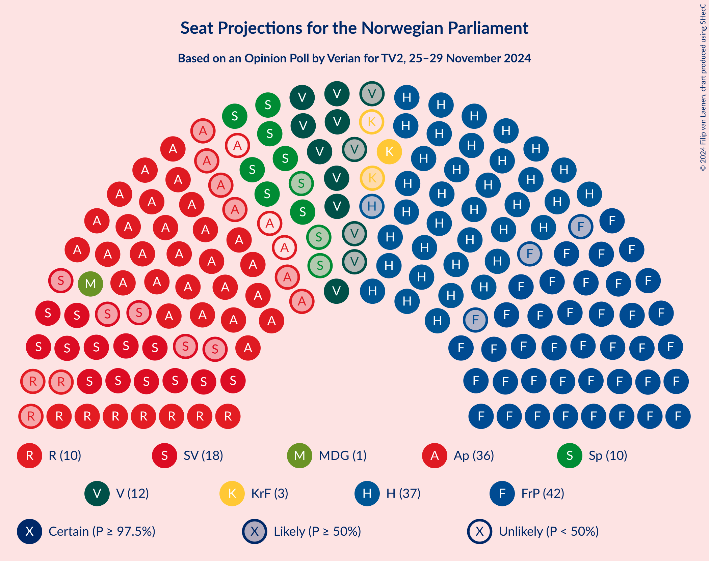
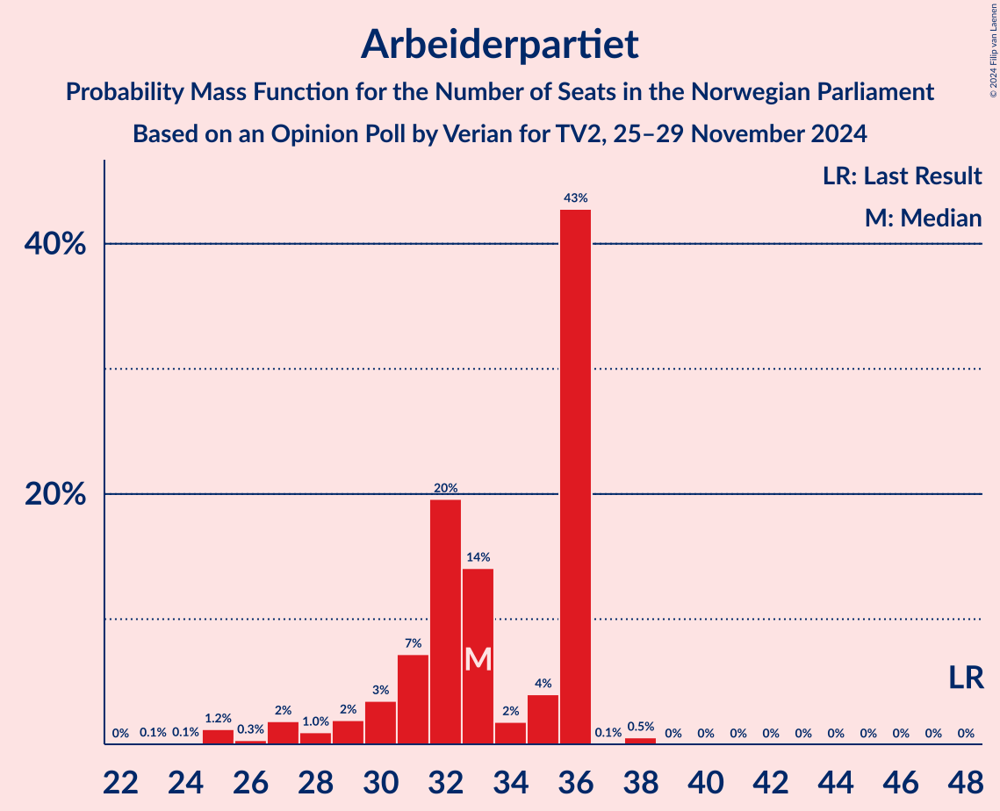
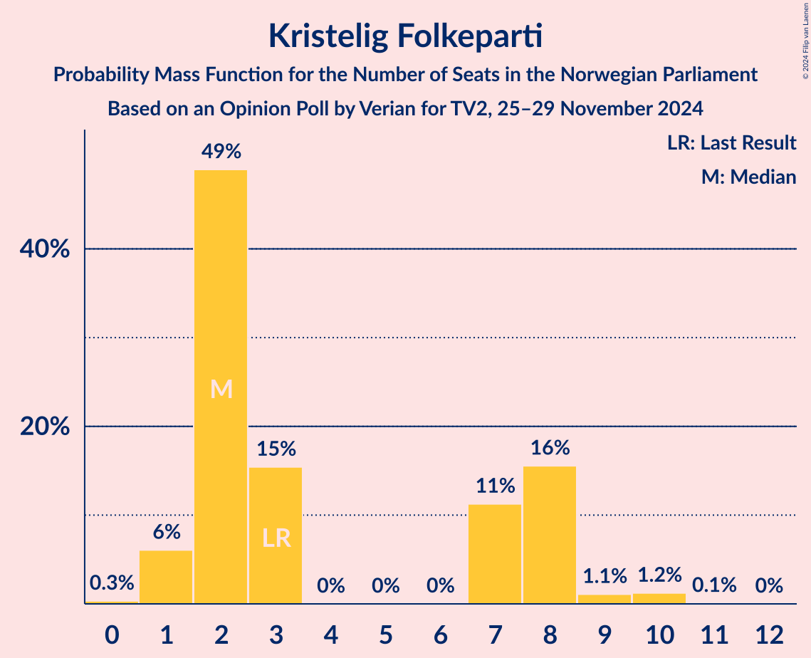
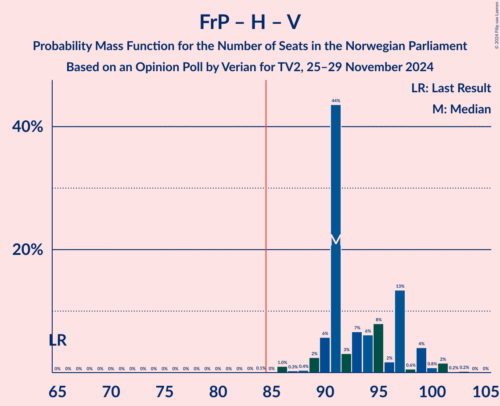

# Opinion Poll by Verian for TV2, 25–29 November 2024

<a href="#voting-intentions">Voting Intentions</a> | <a href="#seats">Seats</a> | <a href="#coalitions">Coalitions</a> | <a href="#technical-information">Technical Information</a>

## Voting Intentions

### Confidence Intervals

| Party | Last Result | Poll Result | 80% Confidence Interval | 90% Confidence Interval | 95% Confidence Interval | 99% Confidence Interval |
|:-----:|:-----------:|:-----------:|:-----------------------:|:-----------------------:|:-----------------------:|:-----------------------:|
| Fremskrittspartiet | 11.6% | 24.1% | 22.4–25.9% |22.0–26.4% |21.6–26.9% |20.8–27.8% |
| Høyre | 20.4% | 23.0% | 21.4–24.8% |20.9–25.3% |20.5–25.7% |19.7–26.6% |
| Arbeiderpartiet | 26.2% | 16.5% | 15.0–18.1% |14.6–18.5% |14.3–18.9% |13.6–19.7% |
| Sosialistisk Venstreparti | 7.6% | 9.9% | 8.8–11.3% |8.5–11.6% |8.2–12.0% |7.7–12.6% |
| Venstre | 4.6% | 6.1% | 5.3–7.2% |5.0–7.5% |4.8–7.8% |4.4–8.4% |
| Senterpartiet | 13.5% | 6.1% | 5.3–7.2% |5.0–7.5% |4.8–7.8% |4.4–8.4% |
| Rødt | 4.7% | 5.5% | 4.7–6.6% |4.5–6.9% |4.3–7.1% |3.9–7.7% |
| Kristelig Folkeparti | 3.8% | 3.8% | 3.1–4.7% |3.0–5.0% |2.8–5.2% |2.5–5.7% |
| Miljøpartiet De Grønne | 3.9% | 2.4% | 1.9–3.2% |1.7–3.4% |1.6–3.6% |1.4–4.0% |
| Industri- og Næringspartiet | 0.3% | 0.9% | 0.6–1.4% |0.5–1.6% |0.5–1.7% |0.4–2.0% |
| Norgesdemokratene | 1.1% | 0.6% | 0.4–1.1% |0.3–1.2% |0.3–1.3% |0.2–1.6% |
| Konservativt | 0.4% | 0.4% | 0.2–0.8% |0.2–0.9% |0.2–1.0% |0.1–1.3% |
| Pensjonistpartiet | 0.6% | 0.1% | 0.0–0.4% |0.0–0.5% |0.0–0.6% |0.0–0.7% |

*Note:* The poll result column reflects the actual value used in the calculations. Published results may vary slightly, and in addition be rounded to fewer digits.

## Seats

### Confidence Intervals

| Party | Last Result | Median | 80% Confidence Interval | 90% Confidence Interval | 95% Confidence Interval | 99% Confidence Interval |
|:-----:|:-----------:|:------:|:-----------------------:|:-----------------------:|:-----------------------:|:-----------------------:|
| <a href="#fremskrittspartiet">Fremskrittspartiet</a> | 21 | 42 | 41–46 |40–48 |39–49 |37–50 |
| <a href="#høyre">Høyre</a> | 36 | 37 | 37–42 |36–44 |35–46 |35–47 |
| <a href="#arbeiderpartiet">Arbeiderpartiet</a> | 48 | 33 | 31–36 |29–36 |27–36 |25–38 |
| <a href="#sosialistisk-venstreparti">Sosialistisk Venstreparti</a> | 13 | 18 | 13–19 |13–20 |13–23 |13–23 |
| <a href="#venstre">Venstre</a> | 8 | 12 | 9–12 |9–12 |8–14 |8–15 |
| <a href="#senterpartiet">Senterpartiet</a> | 28 | 10 | 9–11 |7–13 |7–13 |7–15 |
| <a href="#rødt">Rødt</a> | 8 | 10 | 7–12 |7–12 |7–12 |1–14 |
| <a href="#kristelig-folkeparti">Kristelig Folkeparti</a> | 3 | 2 | 2–8 |1–8 |1–8 |1–10 |
| <a href="#miljøpartiet-de-grønne">Miljøpartiet De Grønne</a> | 3 | 1 | 1 |1–2 |1–3 |0–3 |
| <a href="#industri--og-næringspartiet">Industri- og Næringspartiet</a> | 0 | 0 | 0 |0 |0 |0 |
| <a href="#norgesdemokratene">Norgesdemokratene</a> | 0 | 0 | 0 |0 |0 |0 |
| <a href="#konservativt">Konservativt</a> | 0 | 0 | 0 |0 |0 |0 |
| <a href="#pensjonistpartiet">Pensjonistpartiet</a> | 0 | 0 | 0 |0 |0 |0 |

### Fremskrittspartiet

*For a full overview of the results for this party, see the [Fremskrittspartiet](party-fremskrittspartiet.html) page.*

| Number of Seats | Probability | Accumulated | Special Marks |
|:---------------:|:-----------:|:-----------:|:-------------:|
| 21 | 0% | 100% | Last Result |
| 22 | 0% | 100% |  |
| 23 | 0% | 100% |  |
| 24 | 0% | 100% |  |
| 25 | 0% | 100% |  |
| 26 | 0% | 100% |  |
| 27 | 0% | 100% |  |
| 28 | 0% | 100% |  |
| 29 | 0% | 100% |  |
| 30 | 0% | 100% |  |
| 31 | 0% | 100% |  |
| 32 | 0% | 100% |  |
| 33 | 0% | 100% |  |
| 34 | 0% | 100% |  |
| 35 | 0% | 100% |  |
| 36 | 0.1% | 100% |  |
| 37 | 0.7% | 99.9% |  |
| 38 | 0.8% | 99.2% |  |
| 39 | 2% | 98% |  |
| 40 | 4% | 97% |  |
| 41 | 8% | 93% |  |
| 42 | 53% | 85% | Median |
| 43 | 4% | 32% |  |
| 44 | 2% | 28% |  |
| 45 | 0.4% | 26% |  |
| 46 | 18% | 26% |  |
| 47 | 2% | 7% |  |
| 48 | 0.2% | 5% |  |
| 49 | 3% | 5% |  |
| 50 | 2% | 2% |  |
| 51 | 0.3% | 0.4% |  |
| 52 | 0% | 0.1% |  |
| 53 | 0.1% | 0.1% |  |
| 54 | 0% | 0% |  |

### Høyre

*For a full overview of the results for this party, see the [Høyre](party-høyre.html) page.*

| Number of Seats | Probability | Accumulated | Special Marks |
|:---------------:|:-----------:|:-----------:|:-------------:|
| 32 | 0.1% | 100% |  |
| 33 | 0.1% | 99.9% |  |
| 34 | 0.2% | 99.8% |  |
| 35 | 2% | 99.6% |  |
| 36 | 3% | 97% | Last Result |
| 37 | 45% | 94% | Median |
| 38 | 9% | 49% |  |
| 39 | 5% | 40% |  |
| 40 | 4% | 35% |  |
| 41 | 18% | 31% |  |
| 42 | 6% | 13% |  |
| 43 | 0.9% | 7% |  |
| 44 | 2% | 6% |  |
| 45 | 1.1% | 4% |  |
| 46 | 1.5% | 3% |  |
| 47 | 0.9% | 1.1% |  |
| 48 | 0.1% | 0.3% |  |
| 49 | 0.2% | 0.2% |  |
| 50 | 0% | 0% |  |

### Arbeiderpartiet

*For a full overview of the results for this party, see the [Arbeiderpartiet](party-arbeiderpartiet.html) page.*

| Number of Seats | Probability | Accumulated | Special Marks |
|:---------------:|:-----------:|:-----------:|:-------------:|
| 23 | 0.1% | 100% |  |
| 24 | 0.1% | 99.9% |  |
| 25 | 1.2% | 99.8% |  |
| 26 | 0.3% | 98.6% |  |
| 27 | 2% | 98% |  |
| 28 | 1.0% | 96% |  |
| 29 | 2% | 95% |  |
| 30 | 3% | 94% |  |
| 31 | 7% | 90% |  |
| 32 | 20% | 83% |  |
| 33 | 14% | 63% | Median |
| 34 | 2% | 49% |  |
| 35 | 4% | 47% |  |
| 36 | 43% | 43% |  |
| 37 | 0.1% | 0.6% |  |
| 38 | 0.5% | 0.6% |  |
| 39 | 0% | 0% |  |
| 40 | 0% | 0% |  |
| 41 | 0% | 0% |  |
| 42 | 0% | 0% |  |
| 43 | 0% | 0% |  |
| 44 | 0% | 0% |  |
| 45 | 0% | 0% |  |
| 46 | 0% | 0% |  |
| 47 | 0% | 0% |  |
| 48 | 0% | 0% | Last Result |

### Sosialistisk Venstreparti

*For a full overview of the results for this party, see the [Sosialistisk Venstreparti](party-sosialistiskvenstreparti.html) page.*

| Number of Seats | Probability | Accumulated | Special Marks |
|:---------------:|:-----------:|:-----------:|:-------------:|
| 12 | 0.2% | 100% |  |
| 13 | 15% | 99.8% | Last Result |
| 14 | 2% | 85% |  |
| 15 | 5% | 83% |  |
| 16 | 8% | 78% |  |
| 17 | 9% | 70% |  |
| 18 | 49% | 61% | Median |
| 19 | 5% | 13% |  |
| 20 | 3% | 8% |  |
| 21 | 0.7% | 5% |  |
| 22 | 0.5% | 4% |  |
| 23 | 3% | 3% |  |
| 24 | 0% | 0% |  |

### Venstre

*For a full overview of the results for this party, see the [Venstre](party-venstre.html) page.*

| Number of Seats | Probability | Accumulated | Special Marks |
|:---------------:|:-----------:|:-----------:|:-------------:|
| 3 | 0.1% | 100% |  |
| 4 | 0% | 99.9% |  |
| 5 | 0% | 99.9% |  |
| 6 | 0% | 99.9% |  |
| 7 | 0.2% | 99.9% |  |
| 8 | 4% | 99.7% | Last Result |
| 9 | 9% | 96% |  |
| 10 | 19% | 87% |  |
| 11 | 10% | 68% |  |
| 12 | 53% | 58% | Median |
| 13 | 2% | 5% |  |
| 14 | 2% | 3% |  |
| 15 | 0.5% | 0.5% |  |
| 16 | 0% | 0.1% |  |
| 17 | 0% | 0% |  |

### Senterpartiet

*For a full overview of the results for this party, see the [Senterpartiet](party-senterpartiet.html) page.*

| Number of Seats | Probability | Accumulated | Special Marks |
|:---------------:|:-----------:|:-----------:|:-------------:|
| 0 | 0.1% | 100% |  |
| 1 | 0% | 99.9% |  |
| 2 | 0% | 99.9% |  |
| 3 | 0% | 99.9% |  |
| 4 | 0% | 99.9% |  |
| 5 | 0% | 99.9% |  |
| 6 | 0% | 99.9% |  |
| 7 | 8% | 99.9% |  |
| 8 | 0.9% | 92% |  |
| 9 | 10% | 91% |  |
| 10 | 65% | 81% | Median |
| 11 | 7% | 16% |  |
| 12 | 5% | 10% |  |
| 13 | 3% | 5% |  |
| 14 | 1.2% | 2% |  |
| 15 | 0.6% | 0.7% |  |
| 16 | 0% | 0% |  |
| 17 | 0% | 0% |  |
| 18 | 0% | 0% |  |
| 19 | 0% | 0% |  |
| 20 | 0% | 0% |  |
| 21 | 0% | 0% |  |
| 22 | 0% | 0% |  |
| 23 | 0% | 0% |  |
| 24 | 0% | 0% |  |
| 25 | 0% | 0% |  |
| 26 | 0% | 0% |  |
| 27 | 0% | 0% |  |
| 28 | 0% | 0% | Last Result |

### Rødt

*For a full overview of the results for this party, see the [Rødt](party-rødt.html) page.*

| Number of Seats | Probability | Accumulated | Special Marks |
|:---------------:|:-----------:|:-----------:|:-------------:|
| 1 | 0.6% | 100% |  |
| 2 | 0% | 99.4% |  |
| 3 | 0% | 99.4% |  |
| 4 | 0% | 99.4% |  |
| 5 | 0% | 99.4% |  |
| 6 | 0.1% | 99.4% |  |
| 7 | 15% | 99.4% |  |
| 8 | 7% | 84% | Last Result |
| 9 | 16% | 78% |  |
| 10 | 48% | 62% | Median |
| 11 | 4% | 14% |  |
| 12 | 8% | 10% |  |
| 13 | 2% | 2% |  |
| 14 | 0.8% | 0.8% |  |
| 15 | 0% | 0% |  |

### Kristelig Folkeparti

*For a full overview of the results for this party, see the [Kristelig Folkeparti](party-kristeligfolkeparti.html) page.*

| Number of Seats | Probability | Accumulated | Special Marks |
|:---------------:|:-----------:|:-----------:|:-------------:|
| 0 | 0.3% | 100% |  |
| 1 | 6% | 99.7% |  |
| 2 | 49% | 94% | Median |
| 3 | 15% | 45% | Last Result |
| 4 | 0% | 29% |  |
| 5 | 0% | 29% |  |
| 6 | 0% | 29% |  |
| 7 | 11% | 29% |  |
| 8 | 16% | 18% |  |
| 9 | 1.1% | 2% |  |
| 10 | 1.2% | 1.3% |  |
| 11 | 0.1% | 0.1% |  |
| 12 | 0% | 0% |  |

### Miljøpartiet De Grønne

*For a full overview of the results for this party, see the [Miljøpartiet De Grønne](party-miljøpartietdegrønne.html) page.*

| Number of Seats | Probability | Accumulated | Special Marks |
|:---------------:|:-----------:|:-----------:|:-------------:|
| 0 | 1.2% | 100% |  |
| 1 | 93% | 98.8% | Median |
| 2 | 3% | 5% |  |
| 3 | 2% | 3% | Last Result |
| 4 | 0% | 0.4% |  |
| 5 | 0% | 0.4% |  |
| 6 | 0% | 0.4% |  |
| 7 | 0.4% | 0.4% |  |
| 8 | 0% | 0% |  |

### Industri- og Næringspartiet

*For a full overview of the results for this party, see the [Industri- og Næringspartiet](party-industri-ognæringspartiet.html) page.*

| Number of Seats | Probability | Accumulated | Special Marks |
|:---------------:|:-----------:|:-----------:|:-------------:|
| 0 | 100% | 100% | Last Result, Median |

### Norgesdemokratene

*For a full overview of the results for this party, see the [Norgesdemokratene](party-norgesdemokratene.html) page.*

| Number of Seats | Probability | Accumulated | Special Marks |
|:---------------:|:-----------:|:-----------:|:-------------:|
| 0 | 100% | 100% | Last Result, Median |

### Konservativt

*For a full overview of the results for this party, see the [Konservativt](party-konservativt.html) page.*

| Number of Seats | Probability | Accumulated | Special Marks |
|:---------------:|:-----------:|:-----------:|:-------------:|
| 0 | 100% | 100% | Last Result, Median |

### Pensjonistpartiet

*For a full overview of the results for this party, see the [Pensjonistpartiet](party-pensjonistpartiet.html) page.*

| Number of Seats | Probability | Accumulated | Special Marks |
|:---------------:|:-----------:|:-----------:|:-------------:|
| 0 | 100% | 100% | Last Result, Median |

## Coalitions

### Confidence Intervals

| Coalition | Last Result | Median | Majority? | 80% Confidence Interval | 90% Confidence Interval | 95% Confidence Interval | 99% Confidence Interval |
|:---------:|:-----------:|:------:|:---------:|:-----------------------:|:-----------------------:|:-----------------------:|:-----------------------:|
| Fremskrittspartiet – Høyre – Senterpartiet – Venstre – Kristelig Folkeparti | 96 | 104 | 100% | 103–115 | 103–115 | 103–115 | 102–116 |
| Fremskrittspartiet – Høyre – Venstre – Kristelig Folkeparti – Miljøpartiet De Grønne | 71 | 95 | 100% | 94–106 | 94–106 | 93–107 | 92–107 |
| Fremskrittspartiet – Høyre – Venstre – Kristelig Folkeparti | 68 | 94 | 100% | 93–105 | 93–105 | 92–106 | 91–106 |
| Fremskrittspartiet – Høyre – Venstre | 65 | 91 | 99.9% | 90–97 | 90–99 | 89–100 | 86–101 |
| Fremskrittspartiet – Høyre | 57 | 79 | 26% | 79–87 | 78–88 | 78–88 | 77–91 |
| Arbeiderpartiet – Sosialistisk Venstreparti – Senterpartiet – Rødt – Miljøpartiet De Grønne | 100 | 74 | 0% | 63–75 | 63–75 | 62–76 | 62–77 |
| Arbeiderpartiet – Sosialistisk Venstreparti – Senterpartiet – Rødt | 97 | 73 | 0% | 62–74 | 62–74 | 61–75 | 61–76 |
| Arbeiderpartiet – Sosialistisk Venstreparti – Senterpartiet – Kristelig Folkeparti – Miljøpartiet De Grønne | 95 | 67 | 0% | 62–67 | 60–69 | 60–71 | 57–72 |
| Arbeiderpartiet – Sosialistisk Venstreparti – Senterpartiet – Miljøpartiet De Grønne | 92 | 64 | 0% | 56–65 | 56–66 | 53–67 | 53–68 |
| Arbeiderpartiet – Sosialistisk Venstreparti – Rødt – Miljøpartiet De Grønne | 72 | 64 | 0% | 53–65 | 53–65 | 53–65 | 52–66 |
| Arbeiderpartiet – Sosialistisk Venstreparti – Senterpartiet | 89 | 63 | 0% | 55–64 | 55–64 | 52–65 | 52–67 |
| Høyre – Venstre – Kristelig Folkeparti | 47 | 51 | 0% | 51–59 | 50–60 | 50–61 | 48–65 |
| Arbeiderpartiet – Sosialistisk Venstreparti | 61 | 52 | 0% | 45–54 | 45–54 | 44–54 | 42–55 |
| Arbeiderpartiet – Senterpartiet – Kristelig Folkeparti – Miljøpartiet De Grønne | 82 | 49 | 0% | 46–51 | 43–51 | 42–53 | 40–57 |
| Arbeiderpartiet – Senterpartiet – Kristelig Folkeparti | 79 | 48 | 0% | 45–50 | 42–50 | 41–52 | 38–56 |
| Arbeiderpartiet – Senterpartiet | 76 | 44 | 0% | 40–46 | 39–46 | 38–47 | 36–48 |
| Senterpartiet – Venstre – Kristelig Folkeparti | 39 | 24 | 0% | 23–28 | 21–29 | 21–30 | 19–32 |

### Fremskrittspartiet – Høyre – Senterpartiet – Venstre – Kristelig Folkeparti

| Number of Seats | Probability | Accumulated | Special Marks |
|:---------------:|:-----------:|:-----------:|:-------------:|
| 96 | 0% | 100% | Last Result |
| 97 | 0% | 100% |  |
| 98 | 0% | 100% |  |
| 99 | 0% | 100% |  |
| 100 | 0% | 100% |  |
| 101 | 0.3% | 100% |  |
| 102 | 0.3% | 99.6% |  |
| 103 | 44% | 99.3% | Median |
| 104 | 6% | 55% |  |
| 105 | 7% | 49% |  |
| 106 | 1.4% | 42% |  |
| 107 | 5% | 41% |  |
| 108 | 3% | 36% |  |
| 109 | 7% | 33% |  |
| 110 | 2% | 26% |  |
| 111 | 3% | 24% |  |
| 112 | 1.4% | 20% |  |
| 113 | 3% | 19% |  |
| 114 | 2% | 15% |  |
| 115 | 12% | 14% |  |
| 116 | 1.4% | 2% |  |
| 117 | 0.1% | 0.3% |  |
| 118 | 0.1% | 0.2% |  |
| 119 | 0.1% | 0.1% |  |
| 120 | 0% | 0.1% |  |
| 121 | 0% | 0% |  |

### Fremskrittspartiet – Høyre – Venstre – Kristelig Folkeparti – Miljøpartiet De Grønne

| Number of Seats | Probability | Accumulated | Special Marks |
|:---------------:|:-----------:|:-----------:|:-------------:|
| 71 | 0% | 100% | Last Result |
| 72 | 0% | 100% |  |
| 73 | 0% | 100% |  |
| 74 | 0% | 100% |  |
| 75 | 0% | 100% |  |
| 76 | 0% | 100% |  |
| 77 | 0% | 100% |  |
| 78 | 0% | 100% |  |
| 79 | 0% | 100% |  |
| 80 | 0% | 100% |  |
| 81 | 0% | 100% |  |
| 82 | 0% | 100% |  |
| 83 | 0% | 100% |  |
| 84 | 0% | 100% |  |
| 85 | 0% | 100% | Majority |
| 86 | 0% | 100% |  |
| 87 | 0% | 100% |  |
| 88 | 0% | 100% |  |
| 89 | 0% | 100% |  |
| 90 | 0% | 100% |  |
| 91 | 0.1% | 100% |  |
| 92 | 2% | 99.9% |  |
| 93 | 1.4% | 98% |  |
| 94 | 45% | 97% | Median |
| 95 | 3% | 52% |  |
| 96 | 3% | 49% |  |
| 97 | 6% | 46% |  |
| 98 | 6% | 40% |  |
| 99 | 1.1% | 34% |  |
| 100 | 5% | 33% |  |
| 101 | 0.5% | 28% |  |
| 102 | 1.0% | 28% |  |
| 103 | 8% | 27% |  |
| 104 | 1.0% | 19% |  |
| 105 | 3% | 18% |  |
| 106 | 12% | 15% |  |
| 107 | 3% | 3% |  |
| 108 | 0.1% | 0.3% |  |
| 109 | 0.1% | 0.2% |  |
| 110 | 0% | 0.1% |  |
| 111 | 0% | 0.1% |  |
| 112 | 0% | 0% |  |

### Fremskrittspartiet – Høyre – Venstre – Kristelig Folkeparti

| Number of Seats | Probability | Accumulated | Special Marks |
|:---------------:|:-----------:|:-----------:|:-------------:|
| 68 | 0% | 100% | Last Result |
| 69 | 0% | 100% |  |
| 70 | 0% | 100% |  |
| 71 | 0% | 100% |  |
| 72 | 0% | 100% |  |
| 73 | 0% | 100% |  |
| 74 | 0% | 100% |  |
| 75 | 0% | 100% |  |
| 76 | 0% | 100% |  |
| 77 | 0% | 100% |  |
| 78 | 0% | 100% |  |
| 79 | 0% | 100% |  |
| 80 | 0% | 100% |  |
| 81 | 0% | 100% |  |
| 82 | 0% | 100% |  |
| 83 | 0% | 100% |  |
| 84 | 0% | 100% |  |
| 85 | 0% | 100% | Majority |
| 86 | 0% | 100% |  |
| 87 | 0% | 100% |  |
| 88 | 0% | 100% |  |
| 89 | 0.3% | 100% |  |
| 90 | 0.1% | 99.7% |  |
| 91 | 2% | 99.6% |  |
| 92 | 2% | 98% |  |
| 93 | 45% | 97% | Median |
| 94 | 3% | 51% |  |
| 95 | 3% | 48% |  |
| 96 | 6% | 45% |  |
| 97 | 6% | 39% |  |
| 98 | 1.3% | 33% |  |
| 99 | 4% | 32% |  |
| 100 | 1.2% | 28% |  |
| 101 | 1.4% | 27% |  |
| 102 | 8% | 26% |  |
| 103 | 0.9% | 18% |  |
| 104 | 2% | 17% |  |
| 105 | 12% | 15% |  |
| 106 | 3% | 3% |  |
| 107 | 0.1% | 0.3% |  |
| 108 | 0.1% | 0.2% |  |
| 109 | 0% | 0.1% |  |
| 110 | 0.1% | 0.1% |  |
| 111 | 0% | 0% |  |

### Fremskrittspartiet – Høyre – Venstre

| Number of Seats | Probability | Accumulated | Special Marks |
|:---------------:|:-----------:|:-----------:|:-------------:|
| 65 | 0% | 100% | Last Result |
| 66 | 0% | 100% |  |
| 67 | 0% | 100% |  |
| 68 | 0% | 100% |  |
| 69 | 0% | 100% |  |
| 70 | 0% | 100% |  |
| 71 | 0% | 100% |  |
| 72 | 0% | 100% |  |
| 73 | 0% | 100% |  |
| 74 | 0% | 100% |  |
| 75 | 0% | 100% |  |
| 76 | 0% | 100% |  |
| 77 | 0% | 100% |  |
| 78 | 0% | 100% |  |
| 79 | 0% | 100% |  |
| 80 | 0% | 100% |  |
| 81 | 0% | 100% |  |
| 82 | 0% | 100% |  |
| 83 | 0% | 100% |  |
| 84 | 0.1% | 100% |  |
| 85 | 0% | 99.9% | Majority |
| 86 | 1.0% | 99.8% |  |
| 87 | 0.3% | 98.8% |  |
| 88 | 0.4% | 98.5% |  |
| 89 | 2% | 98% |  |
| 90 | 6% | 96% |  |
| 91 | 44% | 90% | Median |
| 92 | 3% | 46% |  |
| 93 | 7% | 43% |  |
| 94 | 6% | 37% |  |
| 95 | 8% | 30% |  |
| 96 | 2% | 23% |  |
| 97 | 13% | 21% |  |
| 98 | 0.6% | 7% |  |
| 99 | 4% | 7% |  |
| 100 | 0.8% | 3% |  |
| 101 | 2% | 2% |  |
| 102 | 0.2% | 0.4% |  |
| 103 | 0.2% | 0.3% |  |
| 104 | 0% | 0% |  |

### Fremskrittspartiet – Høyre

| Number of Seats | Probability | Accumulated | Special Marks |
|:---------------:|:-----------:|:-----------:|:-------------:|
| 57 | 0% | 100% | Last Result |
| 58 | 0% | 100% |  |
| 59 | 0% | 100% |  |
| 60 | 0% | 100% |  |
| 61 | 0% | 100% |  |
| 62 | 0% | 100% |  |
| 63 | 0% | 100% |  |
| 64 | 0% | 100% |  |
| 65 | 0% | 100% |  |
| 66 | 0% | 100% |  |
| 67 | 0% | 100% |  |
| 68 | 0% | 100% |  |
| 69 | 0% | 100% |  |
| 70 | 0% | 100% |  |
| 71 | 0% | 100% |  |
| 72 | 0% | 100% |  |
| 73 | 0% | 100% |  |
| 74 | 0% | 100% |  |
| 75 | 0.1% | 100% |  |
| 76 | 0.3% | 99.8% |  |
| 77 | 0.8% | 99.6% |  |
| 78 | 4% | 98.7% |  |
| 79 | 46% | 95% | Median |
| 80 | 4% | 49% |  |
| 81 | 2% | 45% |  |
| 82 | 4% | 43% |  |
| 83 | 3% | 40% |  |
| 84 | 11% | 37% |  |
| 85 | 5% | 26% | Majority |
| 86 | 3% | 21% |  |
| 87 | 13% | 19% |  |
| 88 | 4% | 5% |  |
| 89 | 0.3% | 2% |  |
| 90 | 0.8% | 1.4% |  |
| 91 | 0.2% | 0.6% |  |
| 92 | 0.1% | 0.3% |  |
| 93 | 0% | 0.2% |  |
| 94 | 0.1% | 0.2% |  |
| 95 | 0% | 0% |  |

### Arbeiderpartiet – Sosialistisk Venstreparti – Senterpartiet – Rødt – Miljøpartiet De Grønne

| Number of Seats | Probability | Accumulated | Special Marks |
|:---------------:|:-----------:|:-----------:|:-------------:|
| 58 | 0.1% | 100% |  |
| 59 | 0% | 99.9% |  |
| 60 | 0.1% | 99.9% |  |
| 61 | 0.1% | 99.8% |  |
| 62 | 3% | 99.7% |  |
| 63 | 12% | 97% |  |
| 64 | 2% | 85% |  |
| 65 | 0.9% | 83% |  |
| 66 | 8% | 82% |  |
| 67 | 1.4% | 74% |  |
| 68 | 1.2% | 73% |  |
| 69 | 4% | 72% |  |
| 70 | 1.3% | 68% |  |
| 71 | 6% | 67% |  |
| 72 | 6% | 61% | Median |
| 73 | 3% | 55% |  |
| 74 | 3% | 52% |  |
| 75 | 45% | 49% |  |
| 76 | 2% | 3% |  |
| 77 | 2% | 2% |  |
| 78 | 0.1% | 0.4% |  |
| 79 | 0.3% | 0.3% |  |
| 80 | 0% | 0% |  |
| 81 | 0% | 0% |  |
| 82 | 0% | 0% |  |
| 83 | 0% | 0% |  |
| 84 | 0% | 0% |  |
| 85 | 0% | 0% | Majority |
| 86 | 0% | 0% |  |
| 87 | 0% | 0% |  |
| 88 | 0% | 0% |  |
| 89 | 0% | 0% |  |
| 90 | 0% | 0% |  |
| 91 | 0% | 0% |  |
| 92 | 0% | 0% |  |
| 93 | 0% | 0% |  |
| 94 | 0% | 0% |  |
| 95 | 0% | 0% |  |
| 96 | 0% | 0% |  |
| 97 | 0% | 0% |  |
| 98 | 0% | 0% |  |
| 99 | 0% | 0% |  |
| 100 | 0% | 0% | Last Result |

### Arbeiderpartiet – Sosialistisk Venstreparti – Senterpartiet – Rødt

| Number of Seats | Probability | Accumulated | Special Marks |
|:---------------:|:-----------:|:-----------:|:-------------:|
| 57 | 0% | 100% |  |
| 58 | 0% | 99.9% |  |
| 59 | 0.1% | 99.9% |  |
| 60 | 0.1% | 99.8% |  |
| 61 | 3% | 99.7% |  |
| 62 | 12% | 97% |  |
| 63 | 3% | 85% |  |
| 64 | 1.0% | 82% |  |
| 65 | 8% | 81% |  |
| 66 | 1.0% | 73% |  |
| 67 | 0.5% | 72% |  |
| 68 | 5% | 72% |  |
| 69 | 1.1% | 67% |  |
| 70 | 6% | 66% |  |
| 71 | 6% | 60% | Median |
| 72 | 3% | 54% |  |
| 73 | 3% | 51% |  |
| 74 | 45% | 48% |  |
| 75 | 1.4% | 3% |  |
| 76 | 2% | 2% |  |
| 77 | 0.1% | 0.1% |  |
| 78 | 0% | 0% |  |
| 79 | 0% | 0% |  |
| 80 | 0% | 0% |  |
| 81 | 0% | 0% |  |
| 82 | 0% | 0% |  |
| 83 | 0% | 0% |  |
| 84 | 0% | 0% |  |
| 85 | 0% | 0% | Majority |
| 86 | 0% | 0% |  |
| 87 | 0% | 0% |  |
| 88 | 0% | 0% |  |
| 89 | 0% | 0% |  |
| 90 | 0% | 0% |  |
| 91 | 0% | 0% |  |
| 92 | 0% | 0% |  |
| 93 | 0% | 0% |  |
| 94 | 0% | 0% |  |
| 95 | 0% | 0% |  |
| 96 | 0% | 0% |  |
| 97 | 0% | 0% | Last Result |

### Arbeiderpartiet – Sosialistisk Venstreparti – Senterpartiet – Kristelig Folkeparti – Miljøpartiet De Grønne

| Number of Seats | Probability | Accumulated | Special Marks |
|:---------------:|:-----------:|:-----------:|:-------------:|
| 56 | 0.2% | 100% |  |
| 57 | 1.1% | 99.8% |  |
| 58 | 0.3% | 98.7% |  |
| 59 | 0.3% | 98% |  |
| 60 | 4% | 98% |  |
| 61 | 4% | 94% |  |
| 62 | 3% | 90% |  |
| 63 | 7% | 87% |  |
| 64 | 17% | 80% | Median |
| 65 | 2% | 63% |  |
| 66 | 5% | 61% |  |
| 67 | 46% | 56% |  |
| 68 | 2% | 10% |  |
| 69 | 5% | 8% |  |
| 70 | 0.5% | 3% |  |
| 71 | 2% | 3% |  |
| 72 | 0.3% | 0.5% |  |
| 73 | 0.1% | 0.2% |  |
| 74 | 0% | 0.1% |  |
| 75 | 0% | 0.1% |  |
| 76 | 0.1% | 0.1% |  |
| 77 | 0% | 0% |  |
| 78 | 0% | 0% |  |
| 79 | 0% | 0% |  |
| 80 | 0% | 0% |  |
| 81 | 0% | 0% |  |
| 82 | 0% | 0% |  |
| 83 | 0% | 0% |  |
| 84 | 0% | 0% |  |
| 85 | 0% | 0% | Majority |
| 86 | 0% | 0% |  |
| 87 | 0% | 0% |  |
| 88 | 0% | 0% |  |
| 89 | 0% | 0% |  |
| 90 | 0% | 0% |  |
| 91 | 0% | 0% |  |
| 92 | 0% | 0% |  |
| 93 | 0% | 0% |  |
| 94 | 0% | 0% |  |
| 95 | 0% | 0% | Last Result |

### Arbeiderpartiet – Sosialistisk Venstreparti – Senterpartiet – Miljøpartiet De Grønne

| Number of Seats | Probability | Accumulated | Special Marks |
|:---------------:|:-----------:|:-----------:|:-------------:|
| 51 | 0% | 100% |  |
| 52 | 0.3% | 99.9% |  |
| 53 | 3% | 99.7% |  |
| 54 | 0.6% | 97% |  |
| 55 | 0.8% | 96% |  |
| 56 | 13% | 96% |  |
| 57 | 6% | 83% |  |
| 58 | 3% | 77% |  |
| 59 | 5% | 74% |  |
| 60 | 9% | 69% |  |
| 61 | 2% | 60% |  |
| 62 | 2% | 58% | Median |
| 63 | 3% | 55% |  |
| 64 | 2% | 52% |  |
| 65 | 45% | 50% |  |
| 66 | 3% | 5% |  |
| 67 | 0.7% | 3% |  |
| 68 | 2% | 2% |  |
| 69 | 0.1% | 0.1% |  |
| 70 | 0% | 0% |  |
| 71 | 0% | 0% |  |
| 72 | 0% | 0% |  |
| 73 | 0% | 0% |  |
| 74 | 0% | 0% |  |
| 75 | 0% | 0% |  |
| 76 | 0% | 0% |  |
| 77 | 0% | 0% |  |
| 78 | 0% | 0% |  |
| 79 | 0% | 0% |  |
| 80 | 0% | 0% |  |
| 81 | 0% | 0% |  |
| 82 | 0% | 0% |  |
| 83 | 0% | 0% |  |
| 84 | 0% | 0% |  |
| 85 | 0% | 0% | Majority |
| 86 | 0% | 0% |  |
| 87 | 0% | 0% |  |
| 88 | 0% | 0% |  |
| 89 | 0% | 0% |  |
| 90 | 0% | 0% |  |
| 91 | 0% | 0% |  |
| 92 | 0% | 0% | Last Result |

### Arbeiderpartiet – Sosialistisk Venstreparti – Rødt – Miljøpartiet De Grønne

| Number of Seats | Probability | Accumulated | Special Marks |
|:---------------:|:-----------:|:-----------:|:-------------:|
| 48 | 0% | 100% |  |
| 49 | 0.1% | 99.9% |  |
| 50 | 0.1% | 99.9% |  |
| 51 | 0.1% | 99.8% |  |
| 52 | 1.4% | 99.7% |  |
| 53 | 12% | 98% |  |
| 54 | 2% | 86% |  |
| 55 | 3% | 85% |  |
| 56 | 1.4% | 81% |  |
| 57 | 3% | 80% |  |
| 58 | 2% | 76% |  |
| 59 | 7% | 74% |  |
| 60 | 3% | 67% |  |
| 61 | 5% | 64% |  |
| 62 | 1.4% | 59% | Median |
| 63 | 7% | 58% |  |
| 64 | 6% | 51% |  |
| 65 | 44% | 45% |  |
| 66 | 0.3% | 0.7% |  |
| 67 | 0.3% | 0.4% |  |
| 68 | 0% | 0% |  |
| 69 | 0% | 0% |  |
| 70 | 0% | 0% |  |
| 71 | 0% | 0% |  |
| 72 | 0% | 0% | Last Result |

### Arbeiderpartiet – Sosialistisk Venstreparti – Senterpartiet

| Number of Seats | Probability | Accumulated | Special Marks |
|:---------------:|:-----------:|:-----------:|:-------------:|
| 50 | 0.1% | 100% |  |
| 51 | 0.3% | 99.9% |  |
| 52 | 3% | 99.6% |  |
| 53 | 0.2% | 97% |  |
| 54 | 0.9% | 96% |  |
| 55 | 14% | 95% |  |
| 56 | 6% | 82% |  |
| 57 | 2% | 75% |  |
| 58 | 6% | 74% |  |
| 59 | 8% | 68% |  |
| 60 | 3% | 60% |  |
| 61 | 3% | 57% | Median |
| 62 | 3% | 54% |  |
| 63 | 2% | 51% |  |
| 64 | 44% | 49% |  |
| 65 | 3% | 5% |  |
| 66 | 0.7% | 2% |  |
| 67 | 1.5% | 2% |  |
| 68 | 0% | 0% |  |
| 69 | 0% | 0% |  |
| 70 | 0% | 0% |  |
| 71 | 0% | 0% |  |
| 72 | 0% | 0% |  |
| 73 | 0% | 0% |  |
| 74 | 0% | 0% |  |
| 75 | 0% | 0% |  |
| 76 | 0% | 0% |  |
| 77 | 0% | 0% |  |
| 78 | 0% | 0% |  |
| 79 | 0% | 0% |  |
| 80 | 0% | 0% |  |
| 81 | 0% | 0% |  |
| 82 | 0% | 0% |  |
| 83 | 0% | 0% |  |
| 84 | 0% | 0% |  |
| 85 | 0% | 0% | Majority |
| 86 | 0% | 0% |  |
| 87 | 0% | 0% |  |
| 88 | 0% | 0% |  |
| 89 | 0% | 0% | Last Result |

### Høyre – Venstre – Kristelig Folkeparti

| Number of Seats | Probability | Accumulated | Special Marks |
|:---------------:|:-----------:|:-----------:|:-------------:|
| 46 | 0% | 100% |  |
| 47 | 0.1% | 99.9% | Last Result |
| 48 | 0.4% | 99.9% |  |
| 49 | 2% | 99.4% |  |
| 50 | 7% | 98% |  |
| 51 | 48% | 91% | Median |
| 52 | 2% | 43% |  |
| 53 | 2% | 41% |  |
| 54 | 3% | 38% |  |
| 55 | 3% | 35% |  |
| 56 | 3% | 32% |  |
| 57 | 4% | 29% |  |
| 58 | 3% | 26% |  |
| 59 | 13% | 22% |  |
| 60 | 6% | 9% |  |
| 61 | 2% | 3% |  |
| 62 | 0.1% | 2% |  |
| 63 | 1.1% | 2% |  |
| 64 | 0.1% | 0.7% |  |
| 65 | 0.3% | 0.6% |  |
| 66 | 0.2% | 0.3% |  |
| 67 | 0% | 0% |  |

### Arbeiderpartiet – Sosialistisk Venstreparti

| Number of Seats | Probability | Accumulated | Special Marks |
|:---------------:|:-----------:|:-----------:|:-------------:|
| 39 | 0% | 100% |  |
| 40 | 0% | 99.9% |  |
| 41 | 0.3% | 99.9% |  |
| 42 | 0.5% | 99.6% |  |
| 43 | 1.1% | 99.1% |  |
| 44 | 0.8% | 98% |  |
| 45 | 15% | 97% |  |
| 46 | 4% | 82% |  |
| 47 | 1.3% | 78% |  |
| 48 | 4% | 76% |  |
| 49 | 10% | 73% |  |
| 50 | 9% | 63% |  |
| 51 | 2% | 54% | Median |
| 52 | 3% | 52% |  |
| 53 | 2% | 49% |  |
| 54 | 47% | 48% |  |
| 55 | 0.7% | 0.7% |  |
| 56 | 0% | 0% |  |
| 57 | 0% | 0% |  |
| 58 | 0% | 0% |  |
| 59 | 0% | 0% |  |
| 60 | 0% | 0% |  |
| 61 | 0% | 0% | Last Result |

### Arbeiderpartiet – Senterpartiet – Kristelig Folkeparti – Miljøpartiet De Grønne

| Number of Seats | Probability | Accumulated | Special Marks |
|:---------------:|:-----------:|:-----------:|:-------------:|
| 37 | 0% | 100% |  |
| 38 | 0.1% | 99.9% |  |
| 39 | 0.3% | 99.9% |  |
| 40 | 0.3% | 99.6% |  |
| 41 | 0.6% | 99.3% |  |
| 42 | 2% | 98.6% |  |
| 43 | 3% | 97% |  |
| 44 | 2% | 94% |  |
| 45 | 1.3% | 92% |  |
| 46 | 10% | 91% | Median |
| 47 | 8% | 81% |  |
| 48 | 6% | 72% |  |
| 49 | 45% | 66% |  |
| 50 | 4% | 21% |  |
| 51 | 13% | 17% |  |
| 52 | 1.0% | 4% |  |
| 53 | 1.3% | 3% |  |
| 54 | 0.2% | 2% |  |
| 55 | 0.6% | 1.5% |  |
| 56 | 0.2% | 0.8% |  |
| 57 | 0.6% | 0.7% |  |
| 58 | 0% | 0.1% |  |
| 59 | 0% | 0.1% |  |
| 60 | 0.1% | 0.1% |  |
| 61 | 0% | 0% |  |
| 62 | 0% | 0% |  |
| 63 | 0% | 0% |  |
| 64 | 0% | 0% |  |
| 65 | 0% | 0% |  |
| 66 | 0% | 0% |  |
| 67 | 0% | 0% |  |
| 68 | 0% | 0% |  |
| 69 | 0% | 0% |  |
| 70 | 0% | 0% |  |
| 71 | 0% | 0% |  |
| 72 | 0% | 0% |  |
| 73 | 0% | 0% |  |
| 74 | 0% | 0% |  |
| 75 | 0% | 0% |  |
| 76 | 0% | 0% |  |
| 77 | 0% | 0% |  |
| 78 | 0% | 0% |  |
| 79 | 0% | 0% |  |
| 80 | 0% | 0% |  |
| 81 | 0% | 0% |  |
| 82 | 0% | 0% | Last Result |

### Arbeiderpartiet – Senterpartiet – Kristelig Folkeparti

| Number of Seats | Probability | Accumulated | Special Marks |
|:---------------:|:-----------:|:-----------:|:-------------:|
| 36 | 0% | 100% |  |
| 37 | 0.1% | 99.9% |  |
| 38 | 0.6% | 99.9% |  |
| 39 | 0.1% | 99.3% |  |
| 40 | 0.5% | 99.2% |  |
| 41 | 2% | 98.7% |  |
| 42 | 3% | 97% |  |
| 43 | 2% | 94% |  |
| 44 | 2% | 92% |  |
| 45 | 11% | 90% | Median |
| 46 | 7% | 79% |  |
| 47 | 6% | 72% |  |
| 48 | 46% | 66% |  |
| 49 | 4% | 20% |  |
| 50 | 13% | 17% |  |
| 51 | 0.8% | 4% |  |
| 52 | 2% | 3% |  |
| 53 | 0.3% | 1.4% |  |
| 54 | 0.5% | 1.1% |  |
| 55 | 0.1% | 0.6% |  |
| 56 | 0.5% | 0.5% |  |
| 57 | 0% | 0% |  |
| 58 | 0% | 0% |  |
| 59 | 0% | 0% |  |
| 60 | 0% | 0% |  |
| 61 | 0% | 0% |  |
| 62 | 0% | 0% |  |
| 63 | 0% | 0% |  |
| 64 | 0% | 0% |  |
| 65 | 0% | 0% |  |
| 66 | 0% | 0% |  |
| 67 | 0% | 0% |  |
| 68 | 0% | 0% |  |
| 69 | 0% | 0% |  |
| 70 | 0% | 0% |  |
| 71 | 0% | 0% |  |
| 72 | 0% | 0% |  |
| 73 | 0% | 0% |  |
| 74 | 0% | 0% |  |
| 75 | 0% | 0% |  |
| 76 | 0% | 0% |  |
| 77 | 0% | 0% |  |
| 78 | 0% | 0% |  |
| 79 | 0% | 0% | Last Result |

### Arbeiderpartiet – Senterpartiet

| Number of Seats | Probability | Accumulated | Special Marks |
|:---------------:|:-----------:|:-----------:|:-------------:|
| 32 | 0% | 100% |  |
| 33 | 0% | 99.9% |  |
| 34 | 0.1% | 99.9% |  |
| 35 | 0.2% | 99.8% |  |
| 36 | 0.3% | 99.7% |  |
| 37 | 0.7% | 99.3% |  |
| 38 | 2% | 98.6% |  |
| 39 | 7% | 97% |  |
| 40 | 8% | 90% |  |
| 41 | 2% | 82% |  |
| 42 | 22% | 80% |  |
| 43 | 6% | 57% | Median |
| 44 | 2% | 51% |  |
| 45 | 2% | 49% |  |
| 46 | 44% | 47% |  |
| 47 | 1.0% | 3% |  |
| 48 | 2% | 2% |  |
| 49 | 0.1% | 0.1% |  |
| 50 | 0% | 0% |  |
| 51 | 0% | 0% |  |
| 52 | 0% | 0% |  |
| 53 | 0% | 0% |  |
| 54 | 0% | 0% |  |
| 55 | 0% | 0% |  |
| 56 | 0% | 0% |  |
| 57 | 0% | 0% |  |
| 58 | 0% | 0% |  |
| 59 | 0% | 0% |  |
| 60 | 0% | 0% |  |
| 61 | 0% | 0% |  |
| 62 | 0% | 0% |  |
| 63 | 0% | 0% |  |
| 64 | 0% | 0% |  |
| 65 | 0% | 0% |  |
| 66 | 0% | 0% |  |
| 67 | 0% | 0% |  |
| 68 | 0% | 0% |  |
| 69 | 0% | 0% |  |
| 70 | 0% | 0% |  |
| 71 | 0% | 0% |  |
| 72 | 0% | 0% |  |
| 73 | 0% | 0% |  |
| 74 | 0% | 0% |  |
| 75 | 0% | 0% |  |
| 76 | 0% | 0% | Last Result |

### Senterpartiet – Venstre – Kristelig Folkeparti

| Number of Seats | Probability | Accumulated | Special Marks |
|:---------------:|:-----------:|:-----------:|:-------------:|
| 18 | 0% | 100% |  |
| 19 | 1.3% | 99.9% |  |
| 20 | 0.2% | 98.6% |  |
| 21 | 6% | 98% |  |
| 22 | 1.4% | 92% |  |
| 23 | 3% | 91% |  |
| 24 | 46% | 88% | Median |
| 25 | 13% | 42% |  |
| 26 | 9% | 29% |  |
| 27 | 3% | 21% |  |
| 28 | 13% | 18% |  |
| 29 | 1.0% | 6% |  |
| 30 | 3% | 5% |  |
| 31 | 0.8% | 1.5% |  |
| 32 | 0.4% | 0.6% |  |
| 33 | 0.2% | 0.2% |  |
| 34 | 0% | 0% |  |
| 35 | 0% | 0% |  |
| 36 | 0% | 0% |  |
| 37 | 0% | 0% |  |
| 38 | 0% | 0% |  |
| 39 | 0% | 0% | Last Result |

## Technical Information

### Opinion Poll

+ **Polling firm:** Verian
+ **Commissioner(s):** TV2
+ **Fieldwork period:** 25–29 November 2024

### Calculations

+ **Sample size:** 995
+ **Simulations done:** 2,097,152
+ **Error estimate:** 3.25%

