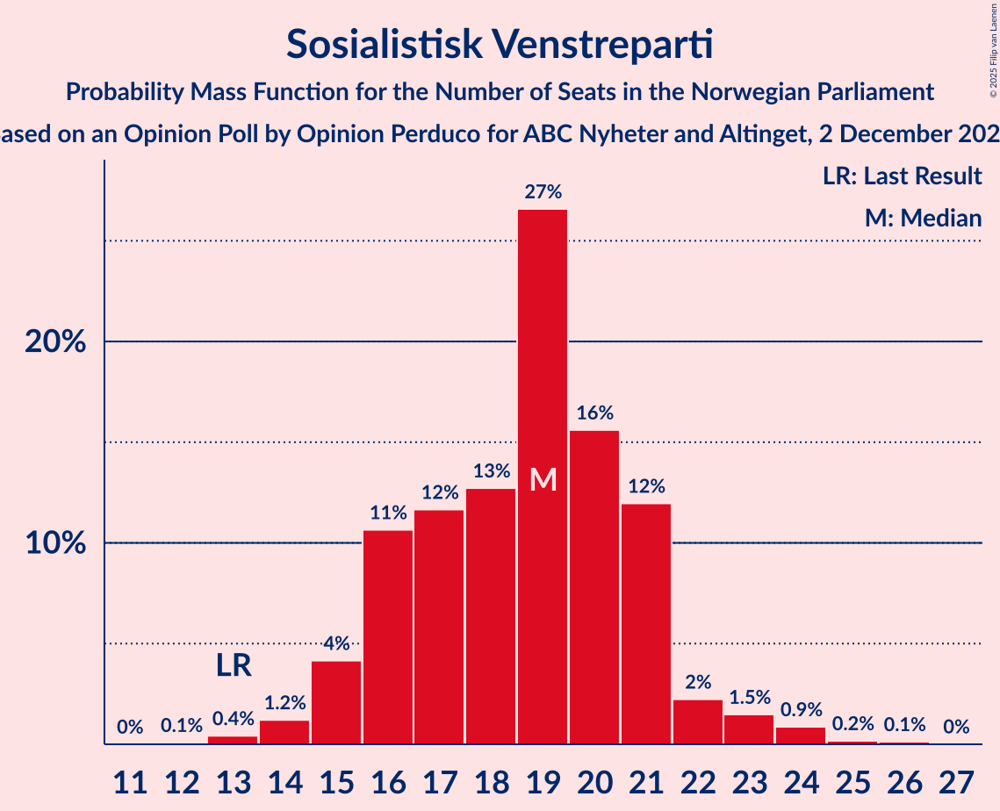
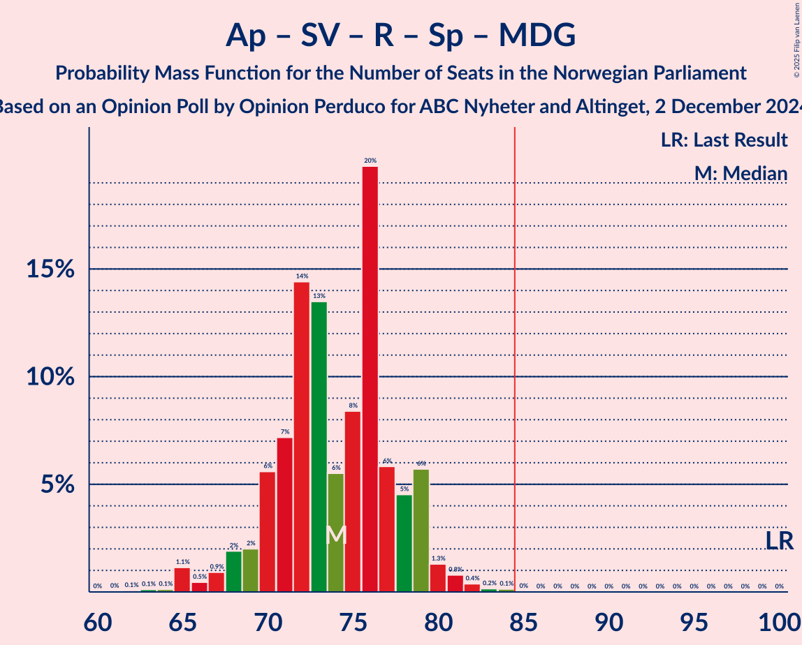
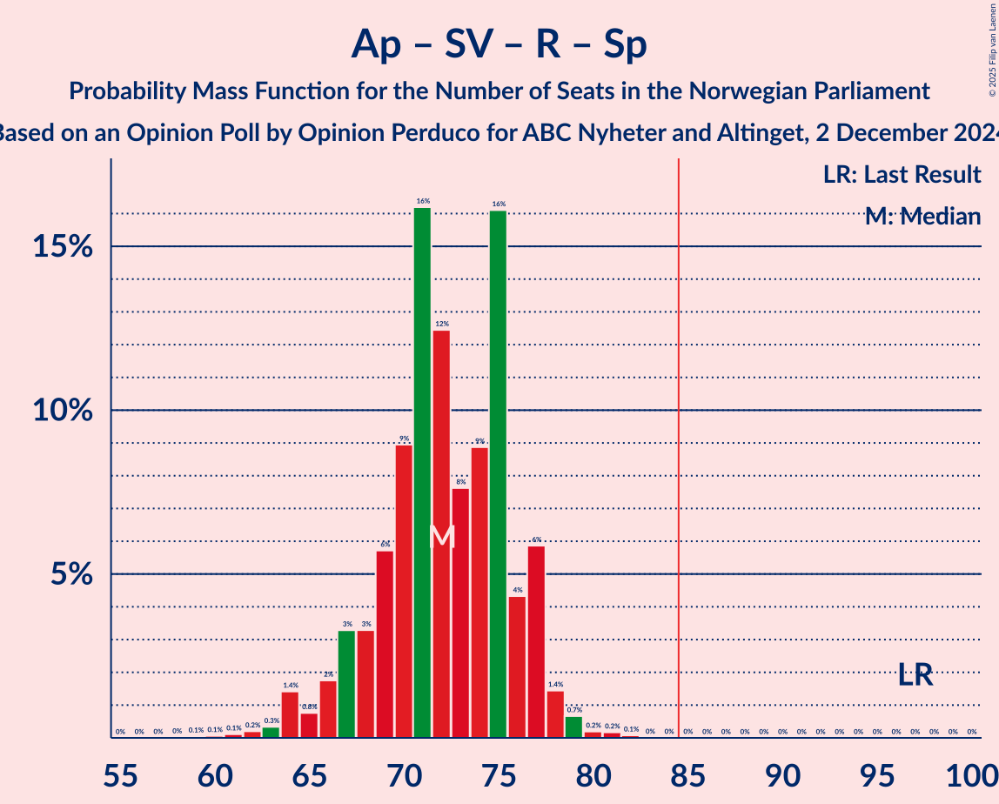
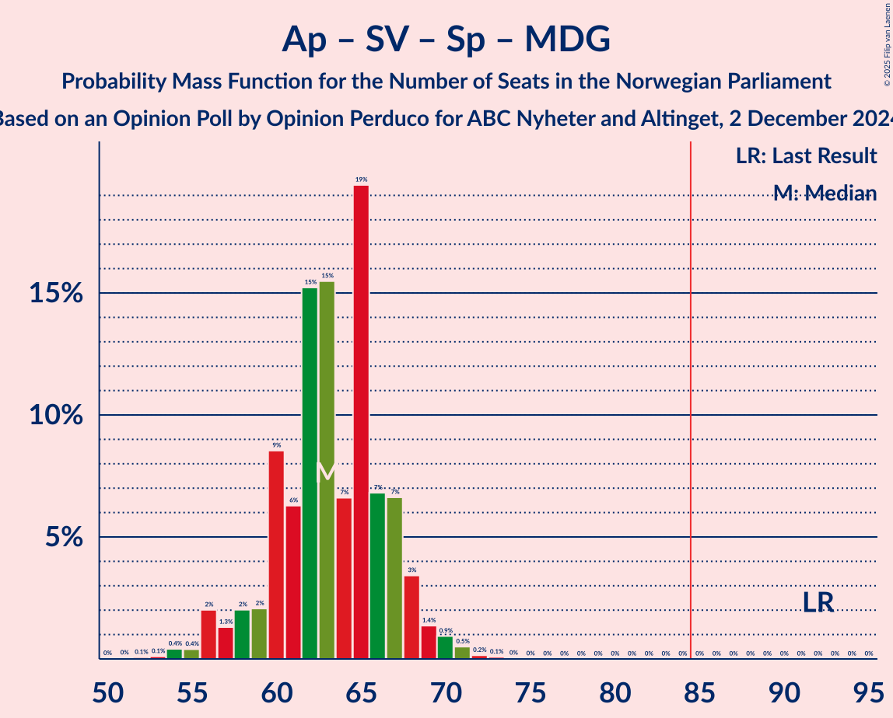
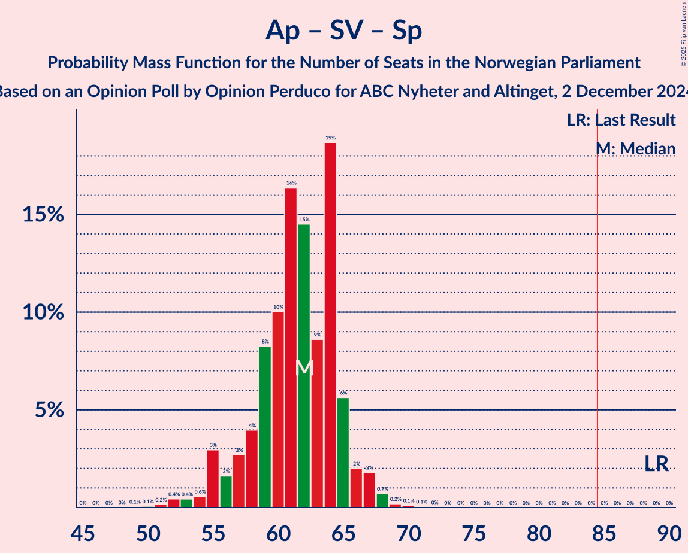

# Opinion Poll by Opinion Perduco for ABC Nyheter and Altinget, 2 December 2024

<a href="#voting-intentions">Voting Intentions</a> | <a href="#seats">Seats</a> | <a href="#coalitions">Coalitions</a> | <a href="#technical-information">Technical Information</a>

## Voting Intentions

### Confidence Intervals

| Party | Last Result | Poll Result | 80% Confidence Interval | 90% Confidence Interval | 95% Confidence Interval | 99% Confidence Interval |
|:-----:|:-----------:|:-----------:|:-----------------------:|:-----------------------:|:-----------------------:|:-----------------------:|
| Fremskrittspartiet | 11.6% | 24.4% | 22.5–26.5% |21.9–27.1% |21.5–27.6% |20.6–28.7% |
| Høyre | 20.4% | 21.0% | 19.1–23.0% |18.6–23.5% |18.2–24.0% |17.3–25.0% |
| Arbeiderpartiet | 26.2% | 17.6% | 15.9–19.5% |15.5–20.1% |15.1–20.5% |14.3–21.5% |
| Sosialistisk Venstreparti | 7.6% | 10.7% | 9.4–12.3% |9.0–12.7% |8.7–13.1% |8.1–13.9% |
| Rødt | 4.7% | 6.1% | 5.2–7.4% |4.9–7.8% |4.6–8.1% |4.2–8.7% |
| Venstre | 4.6% | 5.9% | 4.9–7.1% |4.6–7.5% |4.4–7.8% |4.0–8.4% |
| Senterpartiet | 13.5% | 5.3% | 4.4–6.6% |4.2–6.9% |3.9–7.2% |3.5–7.8% |
| Kristelig Folkeparti | 3.8% | 3.3% | 2.6–4.3% |2.4–4.6% |2.3–4.9% |2.0–5.4% |
| Miljøpartiet De Grønne | 3.9% | 2.9% | 2.3–3.9% |2.1–4.2% |2.0–4.4% |1.7–4.9% |
| Industri- og Næringspartiet | 0.3% | 1.2% | 0.8–1.9% |0.7–2.1% |0.6–2.3% |0.5–2.7% |

*Note:* The poll result column reflects the actual value used in the calculations. Published results may vary slightly, and in addition be rounded to fewer digits.

## Seats

### Confidence Intervals

| Party | Last Result | Median | 80% Confidence Interval | 90% Confidence Interval | 95% Confidence Interval | 99% Confidence Interval |
|:-----:|:-----------:|:------:|:-----------------------:|:-----------------------:|:-----------------------:|:-----------------------:|
| <a href="#fremskrittspartiet">Fremskrittspartiet</a> | 21 | 44 | 41–48 |40–50 |40–51 |38–53 |
| <a href="#høyre">Høyre</a> | 36 | 37 | 33–40 |32–42 |32–43 |30–45 |
| <a href="#arbeiderpartiet">Arbeiderpartiet</a> | 48 | 33 | 31–37 |30–37 |29–38 |26–40 |
| <a href="#sosialistisk-venstreparti">Sosialistisk Venstreparti</a> | 13 | 18 | 15–21 |15–22 |14–22 |13–24 |
| <a href="#rødt">Rødt</a> | 8 | 10 | 8–13 |8–14 |8–15 |7–15 |
| <a href="#venstre">Venstre</a> | 8 | 10 | 8–13 |7–13 |7–14 |3–15 |
| <a href="#senterpartiet">Senterpartiet</a> | 28 | 10 | 7–12 |1–12 |0–13 |0–14 |
| <a href="#kristelig-folkeparti">Kristelig Folkeparti</a> | 3 | 2 | 1–7 |1–8 |0–8 |0–9 |
| <a href="#miljøpartiet-de-grønne">Miljøpartiet De Grønne</a> | 3 | 2 | 1–3 |1–7 |1–8 |0–9 |
| <a href="#industri--og-næringspartiet">Industri- og Næringspartiet</a> | 0 | 0 | 0 |0 |0 |0–1 |

### Fremskrittspartiet

*For a full overview of the results for this party, see the [Fremskrittspartiet](party-fremskrittspartiet.html) page.*

| Number of Seats | Probability | Accumulated | Special Marks |
|:---------------:|:-----------:|:-----------:|:-------------:|
| 21 | 0% | 100% | Last Result |
| 22 | 0% | 100% |  |
| 23 | 0% | 100% |  |
| 24 | 0% | 100% |  |
| 25 | 0% | 100% |  |
| 26 | 0% | 100% |  |
| 27 | 0% | 100% |  |
| 28 | 0% | 100% |  |
| 29 | 0% | 100% |  |
| 30 | 0% | 100% |  |
| 31 | 0% | 100% |  |
| 32 | 0% | 100% |  |
| 33 | 0% | 100% |  |
| 34 | 0% | 100% |  |
| 35 | 0% | 100% |  |
| 36 | 0% | 100% |  |
| 37 | 0.3% | 99.9% |  |
| 38 | 0.5% | 99.6% |  |
| 39 | 1.3% | 99.1% |  |
| 40 | 6% | 98% |  |
| 41 | 11% | 92% |  |
| 42 | 20% | 81% |  |
| 43 | 9% | 61% |  |
| 44 | 14% | 51% | Median |
| 45 | 12% | 38% |  |
| 46 | 10% | 25% |  |
| 47 | 4% | 15% |  |
| 48 | 2% | 12% |  |
| 49 | 3% | 10% |  |
| 50 | 4% | 7% |  |
| 51 | 1.2% | 3% |  |
| 52 | 1.0% | 2% |  |
| 53 | 0.2% | 0.7% |  |
| 54 | 0.2% | 0.5% |  |
| 55 | 0.3% | 0.3% |  |
| 56 | 0% | 0% |  |

### Høyre

*For a full overview of the results for this party, see the [Høyre](party-høyre.html) page.*

| Number of Seats | Probability | Accumulated | Special Marks |
|:---------------:|:-----------:|:-----------:|:-------------:|
| 29 | 0.4% | 100% |  |
| 30 | 0.6% | 99.5% |  |
| 31 | 1.0% | 99.0% |  |
| 32 | 3% | 98% |  |
| 33 | 6% | 95% |  |
| 34 | 13% | 89% |  |
| 35 | 7% | 76% |  |
| 36 | 16% | 69% | Last Result |
| 37 | 10% | 53% | Median |
| 38 | 21% | 43% |  |
| 39 | 11% | 22% |  |
| 40 | 4% | 11% |  |
| 41 | 0.9% | 7% |  |
| 42 | 3% | 6% |  |
| 43 | 1.2% | 3% |  |
| 44 | 0.6% | 2% |  |
| 45 | 0.6% | 0.9% |  |
| 46 | 0.3% | 0.3% |  |
| 47 | 0% | 0% |  |

### Arbeiderpartiet

*For a full overview of the results for this party, see the [Arbeiderpartiet](party-arbeiderpartiet.html) page.*

| Number of Seats | Probability | Accumulated | Special Marks |
|:---------------:|:-----------:|:-----------:|:-------------:|
| 24 | 0% | 100% |  |
| 25 | 0.2% | 99.9% |  |
| 26 | 0.5% | 99.7% |  |
| 27 | 0.2% | 99.2% |  |
| 28 | 0.9% | 98.9% |  |
| 29 | 1.0% | 98% |  |
| 30 | 4% | 97% |  |
| 31 | 4% | 93% |  |
| 32 | 23% | 89% |  |
| 33 | 19% | 65% | Median |
| 34 | 14% | 46% |  |
| 35 | 7% | 32% |  |
| 36 | 10% | 25% |  |
| 37 | 11% | 15% |  |
| 38 | 2% | 4% |  |
| 39 | 1.5% | 2% |  |
| 40 | 0.7% | 1.0% |  |
| 41 | 0.2% | 0.3% |  |
| 42 | 0% | 0% |  |
| 43 | 0% | 0% |  |
| 44 | 0% | 0% |  |
| 45 | 0% | 0% |  |
| 46 | 0% | 0% |  |
| 47 | 0% | 0% |  |
| 48 | 0% | 0% | Last Result |

### Sosialistisk Venstreparti

*For a full overview of the results for this party, see the [Sosialistisk Venstreparti](party-sosialistiskvenstreparti.html) page.*

| Number of Seats | Probability | Accumulated | Special Marks |
|:---------------:|:-----------:|:-----------:|:-------------:|
| 12 | 0.1% | 100% |  |
| 13 | 0.4% | 99.9% | Last Result |
| 14 | 2% | 99.4% |  |
| 15 | 11% | 97% |  |
| 16 | 5% | 87% |  |
| 17 | 27% | 82% |  |
| 18 | 13% | 54% | Median |
| 19 | 18% | 41% |  |
| 20 | 7% | 23% |  |
| 21 | 9% | 16% |  |
| 22 | 5% | 7% |  |
| 23 | 0.9% | 2% |  |
| 24 | 1.0% | 1.3% |  |
| 25 | 0.1% | 0.3% |  |
| 26 | 0.2% | 0.2% |  |
| 27 | 0% | 0% |  |

### Rødt

*For a full overview of the results for this party, see the [Rødt](party-rødt.html) page.*

| Number of Seats | Probability | Accumulated | Special Marks |
|:---------------:|:-----------:|:-----------:|:-------------:|
| 1 | 0.2% | 100% |  |
| 2 | 0% | 99.8% |  |
| 3 | 0% | 99.8% |  |
| 4 | 0% | 99.8% |  |
| 5 | 0% | 99.8% |  |
| 6 | 0.1% | 99.8% |  |
| 7 | 0.9% | 99.8% |  |
| 8 | 9% | 98.9% | Last Result |
| 9 | 11% | 90% |  |
| 10 | 35% | 79% | Median |
| 11 | 14% | 44% |  |
| 12 | 12% | 30% |  |
| 13 | 12% | 17% |  |
| 14 | 2% | 6% |  |
| 15 | 3% | 3% |  |
| 16 | 0.3% | 0.4% |  |
| 17 | 0.1% | 0.1% |  |
| 18 | 0% | 0% |  |

### Venstre

*For a full overview of the results for this party, see the [Venstre](party-venstre.html) page.*

| Number of Seats | Probability | Accumulated | Special Marks |
|:---------------:|:-----------:|:-----------:|:-------------:|
| 2 | 0.1% | 100% |  |
| 3 | 2% | 99.9% |  |
| 4 | 0% | 98% |  |
| 5 | 0% | 98% |  |
| 6 | 0.1% | 98% |  |
| 7 | 4% | 98% |  |
| 8 | 5% | 94% | Last Result |
| 9 | 18% | 89% |  |
| 10 | 23% | 71% | Median |
| 11 | 17% | 47% |  |
| 12 | 19% | 30% |  |
| 13 | 7% | 11% |  |
| 14 | 3% | 4% |  |
| 15 | 0.4% | 0.5% |  |
| 16 | 0.1% | 0.1% |  |
| 17 | 0% | 0% |  |

### Senterpartiet

*For a full overview of the results for this party, see the [Senterpartiet](party-senterpartiet.html) page.*

| Number of Seats | Probability | Accumulated | Special Marks |
|:---------------:|:-----------:|:-----------:|:-------------:|
| 0 | 5% | 100% |  |
| 1 | 0.3% | 95% |  |
| 2 | 0% | 95% |  |
| 3 | 0% | 95% |  |
| 4 | 0% | 95% |  |
| 5 | 0% | 95% |  |
| 6 | 0.1% | 95% |  |
| 7 | 5% | 95% |  |
| 8 | 14% | 89% |  |
| 9 | 19% | 75% |  |
| 10 | 19% | 56% | Median |
| 11 | 26% | 38% |  |
| 12 | 8% | 11% |  |
| 13 | 3% | 4% |  |
| 14 | 0.4% | 0.7% |  |
| 15 | 0.2% | 0.2% |  |
| 16 | 0% | 0% |  |
| 17 | 0% | 0% |  |
| 18 | 0% | 0% |  |
| 19 | 0% | 0% |  |
| 20 | 0% | 0% |  |
| 21 | 0% | 0% |  |
| 22 | 0% | 0% |  |
| 23 | 0% | 0% |  |
| 24 | 0% | 0% |  |
| 25 | 0% | 0% |  |
| 26 | 0% | 0% |  |
| 27 | 0% | 0% |  |
| 28 | 0% | 0% | Last Result |

### Kristelig Folkeparti

*For a full overview of the results for this party, see the [Kristelig Folkeparti](party-kristeligfolkeparti.html) page.*

| Number of Seats | Probability | Accumulated | Special Marks |
|:---------------:|:-----------:|:-----------:|:-------------:|
| 0 | 3% | 100% |  |
| 1 | 11% | 97% |  |
| 2 | 43% | 86% | Median |
| 3 | 24% | 43% | Last Result |
| 4 | 0% | 19% |  |
| 5 | 0% | 19% |  |
| 6 | 0.3% | 19% |  |
| 7 | 12% | 19% |  |
| 8 | 5% | 7% |  |
| 9 | 2% | 2% |  |
| 10 | 0.1% | 0.1% |  |
| 11 | 0% | 0% |  |

### Miljøpartiet De Grønne

*For a full overview of the results for this party, see the [Miljøpartiet De Grønne](party-miljøpartietdegrønne.html) page.*

| Number of Seats | Probability | Accumulated | Special Marks |
|:---------------:|:-----------:|:-----------:|:-------------:|
| 0 | 0.6% | 100% |  |
| 1 | 40% | 99.4% |  |
| 2 | 49% | 60% | Median |
| 3 | 3% | 10% | Last Result |
| 4 | 0% | 7% |  |
| 5 | 0% | 7% |  |
| 6 | 0.3% | 7% |  |
| 7 | 4% | 7% |  |
| 8 | 3% | 3% |  |
| 9 | 0.8% | 0.9% |  |
| 10 | 0% | 0% |  |

### Industri- og Næringspartiet

*For a full overview of the results for this party, see the [Industri- og Næringspartiet](party-industri-ognæringspartiet.html) page.*

| Number of Seats | Probability | Accumulated | Special Marks |
|:---------------:|:-----------:|:-----------:|:-------------:|
| 0 | 99.5% | 100% | Last Result, Median |
| 1 | 0.2% | 0.5% |  |
| 2 | 0.3% | 0.3% |  |
| 3 | 0% | 0% |  |

## Coalitions

### Confidence Intervals

| Coalition | Last Result | Median | Majority? | 80% Confidence Interval | 90% Confidence Interval | 95% Confidence Interval | 99% Confidence Interval |
|:---------:|:-----------:|:------:|:---------:|:-----------------------:|:-----------------------:|:-----------------------:|:-----------------------:|
| Fremskrittspartiet – Høyre – Venstre – Senterpartiet – Kristelig Folkeparti | 96 | 104 | 100% | 99–107 | 98–108 | 97–109 | 95–112 |
| Fremskrittspartiet – Høyre – Venstre – Kristelig Folkeparti – Miljøpartiet De Grønne | 71 | 96 | 100% | 92–101 | 91–102 | 90–103 | 88–106 |
| Fremskrittspartiet – Høyre – Venstre – Kristelig Folkeparti | 68 | 94 | 99.9% | 90–98 | 89–100 | 88–100 | 86–104 |
| Fremskrittspartiet – Høyre – Venstre | 65 | 91 | 98% | 87–95 | 86–97 | 85–98 | 82–100 |
| Fremskrittspartiet – Høyre | 57 | 81 | 12% | 76–85 | 75–87 | 74–88 | 73–91 |
| Arbeiderpartiet – Sosialistisk Venstreparti – Rødt – Senterpartiet – Miljøpartiet De Grønne | 100 | 74 | 0.1% | 70–78 | 68–79 | 68–80 | 64–82 |
| Arbeiderpartiet – Sosialistisk Venstreparti – Rødt – Senterpartiet | 97 | 72 | 0% | 67–76 | 66–77 | 65–78 | 62–80 |
| Arbeiderpartiet – Sosialistisk Venstreparti – Senterpartiet – Kristelig Folkeparti – Miljøpartiet De Grønne | 95 | 67 | 0% | 63–70 | 59–72 | 58–73 | 56–76 |
| Arbeiderpartiet – Sosialistisk Venstreparti – Rødt – Miljøpartiet De Grønne | 72 | 64 | 0% | 61–69 | 60–70 | 59–71 | 56–73 |
| Arbeiderpartiet – Sosialistisk Venstreparti – Senterpartiet – Miljøpartiet De Grønne | 92 | 63 | 0% | 59–67 | 56–68 | 56–69 | 54–72 |
| Arbeiderpartiet – Sosialistisk Venstreparti – Senterpartiet | 89 | 61 | 0% | 57–65 | 55–66 | 53–67 | 52–69 |
| Arbeiderpartiet – Sosialistisk Venstreparti | 61 | 52 | 0% | 49–55 | 48–56 | 47–57 | 44–60 |
| Høyre – Venstre – Kristelig Folkeparti | 47 | 50 | 0% | 46–55 | 45–56 | 43–56 | 42–59 |
| Arbeiderpartiet – Senterpartiet – Kristelig Folkeparti – Miljøpartiet De Grønne | 82 | 49 | 0% | 43–52 | 41–53 | 38–56 | 37–58 |
| Arbeiderpartiet – Senterpartiet – Kristelig Folkeparti | 79 | 46 | 0% | 42–50 | 40–51 | 36–52 | 34–56 |
| Arbeiderpartiet – Senterpartiet | 76 | 43 | 0% | 39–47 | 35–48 | 34–48 | 33–50 |
| Venstre – Senterpartiet – Kristelig Folkeparti | 39 | 23 | 0% | 19–27 | 15–28 | 13–31 | 11–31 |

### Fremskrittspartiet – Høyre – Venstre – Senterpartiet – Kristelig Folkeparti

| Number of Seats | Probability | Accumulated | Special Marks |
|:---------------:|:-----------:|:-----------:|:-------------:|
| 92 | 0% | 100% |  |
| 93 | 0.1% | 99.9% |  |
| 94 | 0.1% | 99.9% |  |
| 95 | 0.3% | 99.8% |  |
| 96 | 1.4% | 99.5% | Last Result |
| 97 | 1.1% | 98% |  |
| 98 | 3% | 97% |  |
| 99 | 8% | 94% |  |
| 100 | 6% | 87% |  |
| 101 | 4% | 81% |  |
| 102 | 7% | 77% |  |
| 103 | 9% | 71% | Median |
| 104 | 31% | 62% |  |
| 105 | 6% | 31% |  |
| 106 | 11% | 25% |  |
| 107 | 6% | 14% |  |
| 108 | 4% | 8% |  |
| 109 | 2% | 5% |  |
| 110 | 1.3% | 2% |  |
| 111 | 0.6% | 1.1% |  |
| 112 | 0.3% | 0.5% |  |
| 113 | 0.1% | 0.2% |  |
| 114 | 0% | 0.1% |  |
| 115 | 0% | 0.1% |  |
| 116 | 0% | 0% |  |

### Fremskrittspartiet – Høyre – Venstre – Kristelig Folkeparti – Miljøpartiet De Grønne

| Number of Seats | Probability | Accumulated | Special Marks |
|:---------------:|:-----------:|:-----------:|:-------------:|
| 71 | 0% | 100% | Last Result |
| 72 | 0% | 100% |  |
| 73 | 0% | 100% |  |
| 74 | 0% | 100% |  |
| 75 | 0% | 100% |  |
| 76 | 0% | 100% |  |
| 77 | 0% | 100% |  |
| 78 | 0% | 100% |  |
| 79 | 0% | 100% |  |
| 80 | 0% | 100% |  |
| 81 | 0% | 100% |  |
| 82 | 0% | 100% |  |
| 83 | 0% | 100% |  |
| 84 | 0% | 100% |  |
| 85 | 0% | 100% | Majority |
| 86 | 0.2% | 100% |  |
| 87 | 0.3% | 99.8% |  |
| 88 | 0.3% | 99.5% |  |
| 89 | 0.8% | 99.2% |  |
| 90 | 2% | 98% |  |
| 91 | 5% | 97% |  |
| 92 | 5% | 92% |  |
| 93 | 4% | 87% |  |
| 94 | 14% | 83% |  |
| 95 | 13% | 68% | Median |
| 96 | 10% | 55% |  |
| 97 | 14% | 45% |  |
| 98 | 10% | 31% |  |
| 99 | 6% | 22% |  |
| 100 | 5% | 15% |  |
| 101 | 4% | 10% |  |
| 102 | 4% | 7% |  |
| 103 | 1.1% | 3% |  |
| 104 | 0.6% | 2% |  |
| 105 | 1.0% | 2% |  |
| 106 | 0.1% | 0.6% |  |
| 107 | 0.2% | 0.4% |  |
| 108 | 0.2% | 0.3% |  |
| 109 | 0.1% | 0.1% |  |
| 110 | 0% | 0% |  |

### Fremskrittspartiet – Høyre – Venstre – Kristelig Folkeparti

| Number of Seats | Probability | Accumulated | Special Marks |
|:---------------:|:-----------:|:-----------:|:-------------:|
| 68 | 0% | 100% | Last Result |
| 69 | 0% | 100% |  |
| 70 | 0% | 100% |  |
| 71 | 0% | 100% |  |
| 72 | 0% | 100% |  |
| 73 | 0% | 100% |  |
| 74 | 0% | 100% |  |
| 75 | 0% | 100% |  |
| 76 | 0% | 100% |  |
| 77 | 0% | 100% |  |
| 78 | 0% | 100% |  |
| 79 | 0% | 100% |  |
| 80 | 0% | 100% |  |
| 81 | 0% | 100% |  |
| 82 | 0% | 100% |  |
| 83 | 0% | 100% |  |
| 84 | 0% | 99.9% |  |
| 85 | 0.3% | 99.9% | Majority |
| 86 | 0.6% | 99.6% |  |
| 87 | 0.8% | 99.1% |  |
| 88 | 1.2% | 98% |  |
| 89 | 5% | 97% |  |
| 90 | 6% | 92% |  |
| 91 | 5% | 86% |  |
| 92 | 8% | 82% |  |
| 93 | 20% | 73% | Median |
| 94 | 8% | 54% |  |
| 95 | 16% | 45% |  |
| 96 | 9% | 30% |  |
| 97 | 6% | 21% |  |
| 98 | 5% | 15% |  |
| 99 | 4% | 10% |  |
| 100 | 3% | 6% |  |
| 101 | 0.8% | 2% |  |
| 102 | 0.7% | 2% |  |
| 103 | 0.3% | 1.0% |  |
| 104 | 0.3% | 0.7% |  |
| 105 | 0.1% | 0.4% |  |
| 106 | 0.1% | 0.3% |  |
| 107 | 0.1% | 0.2% |  |
| 108 | 0% | 0% |  |

### Fremskrittspartiet – Høyre – Venstre

| Number of Seats | Probability | Accumulated | Special Marks |
|:---------------:|:-----------:|:-----------:|:-------------:|
| 65 | 0% | 100% | Last Result |
| 66 | 0% | 100% |  |
| 67 | 0% | 100% |  |
| 68 | 0% | 100% |  |
| 69 | 0% | 100% |  |
| 70 | 0% | 100% |  |
| 71 | 0% | 100% |  |
| 72 | 0% | 100% |  |
| 73 | 0% | 100% |  |
| 74 | 0% | 100% |  |
| 75 | 0% | 100% |  |
| 76 | 0% | 100% |  |
| 77 | 0% | 100% |  |
| 78 | 0% | 100% |  |
| 79 | 0% | 100% |  |
| 80 | 0.1% | 100% |  |
| 81 | 0.2% | 99.9% |  |
| 82 | 0.5% | 99.8% |  |
| 83 | 0.6% | 99.3% |  |
| 84 | 1.1% | 98.7% |  |
| 85 | 2% | 98% | Majority |
| 86 | 4% | 96% |  |
| 87 | 7% | 92% |  |
| 88 | 8% | 85% |  |
| 89 | 10% | 78% |  |
| 90 | 8% | 67% |  |
| 91 | 18% | 59% | Median |
| 92 | 9% | 41% |  |
| 93 | 10% | 32% |  |
| 94 | 9% | 22% |  |
| 95 | 3% | 12% |  |
| 96 | 3% | 9% |  |
| 97 | 3% | 6% |  |
| 98 | 2% | 4% |  |
| 99 | 0.3% | 1.5% |  |
| 100 | 0.6% | 1.1% |  |
| 101 | 0% | 0.5% |  |
| 102 | 0% | 0.4% |  |
| 103 | 0.3% | 0.4% |  |
| 104 | 0% | 0.1% |  |
| 105 | 0.1% | 0.1% |  |
| 106 | 0% | 0% |  |

### Fremskrittspartiet – Høyre

| Number of Seats | Probability | Accumulated | Special Marks |
|:---------------:|:-----------:|:-----------:|:-------------:|
| 57 | 0% | 100% | Last Result |
| 58 | 0% | 100% |  |
| 59 | 0% | 100% |  |
| 60 | 0% | 100% |  |
| 61 | 0% | 100% |  |
| 62 | 0% | 100% |  |
| 63 | 0% | 100% |  |
| 64 | 0% | 100% |  |
| 65 | 0% | 100% |  |
| 66 | 0% | 100% |  |
| 67 | 0% | 100% |  |
| 68 | 0% | 100% |  |
| 69 | 0% | 100% |  |
| 70 | 0% | 100% |  |
| 71 | 0% | 100% |  |
| 72 | 0.4% | 99.9% |  |
| 73 | 1.1% | 99.5% |  |
| 74 | 1.1% | 98% |  |
| 75 | 4% | 97% |  |
| 76 | 5% | 94% |  |
| 77 | 6% | 89% |  |
| 78 | 4% | 83% |  |
| 79 | 15% | 79% |  |
| 80 | 13% | 64% |  |
| 81 | 11% | 50% | Median |
| 82 | 19% | 39% |  |
| 83 | 2% | 20% |  |
| 84 | 6% | 18% |  |
| 85 | 3% | 12% | Majority |
| 86 | 4% | 9% |  |
| 87 | 3% | 6% |  |
| 88 | 2% | 3% |  |
| 89 | 0.1% | 1.3% |  |
| 90 | 0.3% | 1.2% |  |
| 91 | 0.5% | 0.9% |  |
| 92 | 0% | 0.4% |  |
| 93 | 0.3% | 0.4% |  |
| 94 | 0% | 0% |  |

### Arbeiderpartiet – Sosialistisk Venstreparti – Rødt – Senterpartiet – Miljøpartiet De Grønne

| Number of Seats | Probability | Accumulated | Special Marks |
|:---------------:|:-----------:|:-----------:|:-------------:|
| 61 | 0.1% | 100% |  |
| 62 | 0.1% | 99.8% |  |
| 63 | 0.1% | 99.7% |  |
| 64 | 0.3% | 99.6% |  |
| 65 | 0.3% | 99.3% |  |
| 66 | 0.7% | 99.0% |  |
| 67 | 0.8% | 98% |  |
| 68 | 3% | 98% |  |
| 69 | 4% | 94% |  |
| 70 | 5% | 90% |  |
| 71 | 6% | 85% |  |
| 72 | 9% | 79% |  |
| 73 | 16% | 70% | Median |
| 74 | 8% | 55% |  |
| 75 | 19% | 46% |  |
| 76 | 8% | 27% |  |
| 77 | 5% | 18% |  |
| 78 | 6% | 14% |  |
| 79 | 5% | 8% |  |
| 80 | 1.2% | 3% |  |
| 81 | 0.8% | 2% |  |
| 82 | 0.6% | 0.9% |  |
| 83 | 0.2% | 0.4% |  |
| 84 | 0.1% | 0.1% |  |
| 85 | 0% | 0.1% | Majority |
| 86 | 0% | 0% |  |
| 87 | 0% | 0% |  |
| 88 | 0% | 0% |  |
| 89 | 0% | 0% |  |
| 90 | 0% | 0% |  |
| 91 | 0% | 0% |  |
| 92 | 0% | 0% |  |
| 93 | 0% | 0% |  |
| 94 | 0% | 0% |  |
| 95 | 0% | 0% |  |
| 96 | 0% | 0% |  |
| 97 | 0% | 0% |  |
| 98 | 0% | 0% |  |
| 99 | 0% | 0% |  |
| 100 | 0% | 0% | Last Result |

### Arbeiderpartiet – Sosialistisk Venstreparti – Rødt – Senterpartiet

| Number of Seats | Probability | Accumulated | Special Marks |
|:---------------:|:-----------:|:-----------:|:-------------:|
| 59 | 0.1% | 100% |  |
| 60 | 0.1% | 99.9% |  |
| 61 | 0.2% | 99.8% |  |
| 62 | 0.1% | 99.6% |  |
| 63 | 1.0% | 99.4% |  |
| 64 | 0.6% | 98% |  |
| 65 | 1.1% | 98% |  |
| 66 | 4% | 97% |  |
| 67 | 4% | 93% |  |
| 68 | 5% | 90% |  |
| 69 | 6% | 84% |  |
| 70 | 9% | 78% |  |
| 71 | 14% | 69% | Median |
| 72 | 10% | 55% |  |
| 73 | 13% | 45% |  |
| 74 | 14% | 32% |  |
| 75 | 4% | 17% |  |
| 76 | 5% | 13% |  |
| 77 | 5% | 8% |  |
| 78 | 2% | 3% |  |
| 79 | 0.8% | 2% |  |
| 80 | 0.3% | 0.8% |  |
| 81 | 0.3% | 0.5% |  |
| 82 | 0.2% | 0.2% |  |
| 83 | 0% | 0% |  |
| 84 | 0% | 0% |  |
| 85 | 0% | 0% | Majority |
| 86 | 0% | 0% |  |
| 87 | 0% | 0% |  |
| 88 | 0% | 0% |  |
| 89 | 0% | 0% |  |
| 90 | 0% | 0% |  |
| 91 | 0% | 0% |  |
| 92 | 0% | 0% |  |
| 93 | 0% | 0% |  |
| 94 | 0% | 0% |  |
| 95 | 0% | 0% |  |
| 96 | 0% | 0% |  |
| 97 | 0% | 0% | Last Result |

### Arbeiderpartiet – Sosialistisk Venstreparti – Senterpartiet – Kristelig Folkeparti – Miljøpartiet De Grønne

| Number of Seats | Probability | Accumulated | Special Marks |
|:---------------:|:-----------:|:-----------:|:-------------:|
| 54 | 0.1% | 100% |  |
| 55 | 0.2% | 99.8% |  |
| 56 | 0.3% | 99.6% |  |
| 57 | 0.2% | 99.3% |  |
| 58 | 3% | 99.0% |  |
| 59 | 1.4% | 96% |  |
| 60 | 1.2% | 94% |  |
| 61 | 2% | 93% |  |
| 62 | 1.0% | 91% |  |
| 63 | 4% | 90% |  |
| 64 | 15% | 87% |  |
| 65 | 12% | 72% | Median |
| 66 | 10% | 60% |  |
| 67 | 17% | 50% |  |
| 68 | 10% | 33% |  |
| 69 | 8% | 24% |  |
| 70 | 6% | 16% |  |
| 71 | 2% | 10% |  |
| 72 | 4% | 8% |  |
| 73 | 2% | 4% |  |
| 74 | 0.6% | 2% |  |
| 75 | 0.6% | 1.2% |  |
| 76 | 0.3% | 0.6% |  |
| 77 | 0.2% | 0.3% |  |
| 78 | 0.1% | 0.1% |  |
| 79 | 0% | 0% |  |
| 80 | 0% | 0% |  |
| 81 | 0% | 0% |  |
| 82 | 0% | 0% |  |
| 83 | 0% | 0% |  |
| 84 | 0% | 0% |  |
| 85 | 0% | 0% | Majority |
| 86 | 0% | 0% |  |
| 87 | 0% | 0% |  |
| 88 | 0% | 0% |  |
| 89 | 0% | 0% |  |
| 90 | 0% | 0% |  |
| 91 | 0% | 0% |  |
| 92 | 0% | 0% |  |
| 93 | 0% | 0% |  |
| 94 | 0% | 0% |  |
| 95 | 0% | 0% | Last Result |

### Arbeiderpartiet – Sosialistisk Venstreparti – Rødt – Miljøpartiet De Grønne

| Number of Seats | Probability | Accumulated | Special Marks |
|:---------------:|:-----------:|:-----------:|:-------------:|
| 53 | 0% | 100% |  |
| 54 | 0% | 99.9% |  |
| 55 | 0.1% | 99.9% |  |
| 56 | 0.4% | 99.8% |  |
| 57 | 0.6% | 99.5% |  |
| 58 | 1.4% | 98.9% |  |
| 59 | 2% | 98% |  |
| 60 | 4% | 95% |  |
| 61 | 6% | 92% |  |
| 62 | 11% | 86% |  |
| 63 | 6% | 75% | Median |
| 64 | 31% | 69% |  |
| 65 | 9% | 38% |  |
| 66 | 7% | 29% |  |
| 67 | 4% | 23% |  |
| 68 | 5% | 19% |  |
| 69 | 8% | 13% |  |
| 70 | 3% | 6% |  |
| 71 | 1.1% | 3% |  |
| 72 | 1.4% | 2% | Last Result |
| 73 | 0.3% | 0.5% |  |
| 74 | 0.1% | 0.2% |  |
| 75 | 0% | 0.1% |  |
| 76 | 0% | 0.1% |  |
| 77 | 0% | 0% |  |

### Arbeiderpartiet – Sosialistisk Venstreparti – Senterpartiet – Miljøpartiet De Grønne

| Number of Seats | Probability | Accumulated | Special Marks |
|:---------------:|:-----------:|:-----------:|:-------------:|
| 50 | 0.1% | 100% |  |
| 51 | 0% | 99.9% |  |
| 52 | 0.1% | 99.8% |  |
| 53 | 0.1% | 99.7% |  |
| 54 | 1.3% | 99.6% |  |
| 55 | 0.5% | 98% |  |
| 56 | 4% | 98% |  |
| 57 | 1.4% | 94% |  |
| 58 | 0.8% | 93% |  |
| 59 | 3% | 92% |  |
| 60 | 5% | 89% |  |
| 61 | 4% | 85% |  |
| 62 | 16% | 80% |  |
| 63 | 22% | 64% | Median |
| 64 | 7% | 43% |  |
| 65 | 18% | 36% |  |
| 66 | 5% | 18% |  |
| 67 | 6% | 13% |  |
| 68 | 3% | 7% |  |
| 69 | 2% | 4% |  |
| 70 | 0.8% | 2% |  |
| 71 | 1.2% | 2% |  |
| 72 | 0.4% | 0.5% |  |
| 73 | 0.1% | 0.1% |  |
| 74 | 0.1% | 0.1% |  |
| 75 | 0% | 0% |  |
| 76 | 0% | 0% |  |
| 77 | 0% | 0% |  |
| 78 | 0% | 0% |  |
| 79 | 0% | 0% |  |
| 80 | 0% | 0% |  |
| 81 | 0% | 0% |  |
| 82 | 0% | 0% |  |
| 83 | 0% | 0% |  |
| 84 | 0% | 0% |  |
| 85 | 0% | 0% | Majority |
| 86 | 0% | 0% |  |
| 87 | 0% | 0% |  |
| 88 | 0% | 0% |  |
| 89 | 0% | 0% |  |
| 90 | 0% | 0% |  |
| 91 | 0% | 0% |  |
| 92 | 0% | 0% | Last Result |

### Arbeiderpartiet – Sosialistisk Venstreparti – Senterpartiet

| Number of Seats | Probability | Accumulated | Special Marks |
|:---------------:|:-----------:|:-----------:|:-------------:|
| 48 | 0% | 100% |  |
| 49 | 0.1% | 99.9% |  |
| 50 | 0.1% | 99.9% |  |
| 51 | 0.2% | 99.8% |  |
| 52 | 1.5% | 99.6% |  |
| 53 | 0.8% | 98% |  |
| 54 | 1.2% | 97% |  |
| 55 | 4% | 96% |  |
| 56 | 0.9% | 92% |  |
| 57 | 3% | 91% |  |
| 58 | 4% | 89% |  |
| 59 | 5% | 84% |  |
| 60 | 14% | 79% |  |
| 61 | 22% | 65% | Median |
| 62 | 10% | 43% |  |
| 63 | 9% | 32% |  |
| 64 | 11% | 23% |  |
| 65 | 4% | 12% |  |
| 66 | 4% | 8% |  |
| 67 | 2% | 3% |  |
| 68 | 0.5% | 1.5% |  |
| 69 | 0.6% | 1.0% |  |
| 70 | 0.2% | 0.4% |  |
| 71 | 0.2% | 0.2% |  |
| 72 | 0% | 0% |  |
| 73 | 0% | 0% |  |
| 74 | 0% | 0% |  |
| 75 | 0% | 0% |  |
| 76 | 0% | 0% |  |
| 77 | 0% | 0% |  |
| 78 | 0% | 0% |  |
| 79 | 0% | 0% |  |
| 80 | 0% | 0% |  |
| 81 | 0% | 0% |  |
| 82 | 0% | 0% |  |
| 83 | 0% | 0% |  |
| 84 | 0% | 0% |  |
| 85 | 0% | 0% | Majority |
| 86 | 0% | 0% |  |
| 87 | 0% | 0% |  |
| 88 | 0% | 0% |  |
| 89 | 0% | 0% | Last Result |

### Arbeiderpartiet – Sosialistisk Venstreparti

| Number of Seats | Probability | Accumulated | Special Marks |
|:---------------:|:-----------:|:-----------:|:-------------:|
| 41 | 0.1% | 100% |  |
| 42 | 0% | 99.9% |  |
| 43 | 0.3% | 99.9% |  |
| 44 | 0.8% | 99.6% |  |
| 45 | 0.3% | 98.9% |  |
| 46 | 0.5% | 98.5% |  |
| 47 | 0.8% | 98% |  |
| 48 | 5% | 97% |  |
| 49 | 10% | 93% |  |
| 50 | 10% | 83% |  |
| 51 | 19% | 73% | Median |
| 52 | 17% | 54% |  |
| 53 | 19% | 37% |  |
| 54 | 5% | 18% |  |
| 55 | 5% | 12% |  |
| 56 | 3% | 7% |  |
| 57 | 3% | 5% |  |
| 58 | 1.0% | 2% |  |
| 59 | 0.5% | 1.1% |  |
| 60 | 0.4% | 0.6% |  |
| 61 | 0.2% | 0.2% | Last Result |
| 62 | 0% | 0% |  |

### Høyre – Venstre – Kristelig Folkeparti

| Number of Seats | Probability | Accumulated | Special Marks |
|:---------------:|:-----------:|:-----------:|:-------------:|
| 40 | 0% | 100% |  |
| 41 | 0.1% | 99.9% |  |
| 42 | 0.4% | 99.8% |  |
| 43 | 2% | 99.4% |  |
| 44 | 1.0% | 97% |  |
| 45 | 3% | 96% |  |
| 46 | 4% | 93% |  |
| 47 | 14% | 89% | Last Result |
| 48 | 11% | 75% |  |
| 49 | 7% | 64% | Median |
| 50 | 9% | 58% |  |
| 51 | 16% | 49% |  |
| 52 | 6% | 33% |  |
| 53 | 9% | 26% |  |
| 54 | 4% | 17% |  |
| 55 | 6% | 12% |  |
| 56 | 4% | 6% |  |
| 57 | 1.2% | 2% |  |
| 58 | 0.5% | 1.0% |  |
| 59 | 0.3% | 0.5% |  |
| 60 | 0% | 0.2% |  |
| 61 | 0.1% | 0.2% |  |
| 62 | 0% | 0.1% |  |
| 63 | 0.1% | 0.1% |  |
| 64 | 0% | 0% |  |

### Arbeiderpartiet – Senterpartiet – Kristelig Folkeparti – Miljøpartiet De Grønne

| Number of Seats | Probability | Accumulated | Special Marks |
|:---------------:|:-----------:|:-----------:|:-------------:|
| 34 | 0% | 100% |  |
| 35 | 0.1% | 99.9% |  |
| 36 | 0% | 99.9% |  |
| 37 | 2% | 99.8% |  |
| 38 | 0.6% | 98% |  |
| 39 | 0.6% | 97% |  |
| 40 | 0.4% | 97% |  |
| 41 | 2% | 96% |  |
| 42 | 2% | 94% |  |
| 43 | 3% | 92% |  |
| 44 | 2% | 89% |  |
| 45 | 6% | 87% |  |
| 46 | 7% | 81% |  |
| 47 | 17% | 74% | Median |
| 48 | 7% | 57% |  |
| 49 | 5% | 50% |  |
| 50 | 22% | 45% |  |
| 51 | 11% | 24% |  |
| 52 | 3% | 13% |  |
| 53 | 5% | 9% |  |
| 54 | 0.9% | 4% |  |
| 55 | 1.0% | 4% |  |
| 56 | 1.0% | 3% |  |
| 57 | 0.4% | 2% |  |
| 58 | 0.6% | 1.1% |  |
| 59 | 0.4% | 0.5% |  |
| 60 | 0% | 0.1% |  |
| 61 | 0% | 0% |  |
| 62 | 0% | 0% |  |
| 63 | 0% | 0% |  |
| 64 | 0% | 0% |  |
| 65 | 0% | 0% |  |
| 66 | 0% | 0% |  |
| 67 | 0% | 0% |  |
| 68 | 0% | 0% |  |
| 69 | 0% | 0% |  |
| 70 | 0% | 0% |  |
| 71 | 0% | 0% |  |
| 72 | 0% | 0% |  |
| 73 | 0% | 0% |  |
| 74 | 0% | 0% |  |
| 75 | 0% | 0% |  |
| 76 | 0% | 0% |  |
| 77 | 0% | 0% |  |
| 78 | 0% | 0% |  |
| 79 | 0% | 0% |  |
| 80 | 0% | 0% |  |
| 81 | 0% | 0% |  |
| 82 | 0% | 0% | Last Result |

### Arbeiderpartiet – Senterpartiet – Kristelig Folkeparti

| Number of Seats | Probability | Accumulated | Special Marks |
|:---------------:|:-----------:|:-----------:|:-------------:|
| 32 | 0% | 100% |  |
| 33 | 0% | 99.9% |  |
| 34 | 0.6% | 99.9% |  |
| 35 | 0.1% | 99.3% |  |
| 36 | 2% | 99.2% |  |
| 37 | 0.9% | 97% |  |
| 38 | 0.3% | 96% |  |
| 39 | 0.4% | 96% |  |
| 40 | 2% | 95% |  |
| 41 | 2% | 93% |  |
| 42 | 4% | 91% |  |
| 43 | 6% | 87% |  |
| 44 | 8% | 81% |  |
| 45 | 16% | 73% | Median |
| 46 | 8% | 57% |  |
| 47 | 8% | 50% |  |
| 48 | 11% | 42% |  |
| 49 | 18% | 30% |  |
| 50 | 4% | 12% |  |
| 51 | 6% | 8% |  |
| 52 | 0.8% | 3% |  |
| 53 | 0.4% | 2% |  |
| 54 | 0.4% | 1.3% |  |
| 55 | 0.2% | 1.0% |  |
| 56 | 0.5% | 0.7% |  |
| 57 | 0.1% | 0.3% |  |
| 58 | 0.1% | 0.1% |  |
| 59 | 0% | 0% |  |
| 60 | 0% | 0% |  |
| 61 | 0% | 0% |  |
| 62 | 0% | 0% |  |
| 63 | 0% | 0% |  |
| 64 | 0% | 0% |  |
| 65 | 0% | 0% |  |
| 66 | 0% | 0% |  |
| 67 | 0% | 0% |  |
| 68 | 0% | 0% |  |
| 69 | 0% | 0% |  |
| 70 | 0% | 0% |  |
| 71 | 0% | 0% |  |
| 72 | 0% | 0% |  |
| 73 | 0% | 0% |  |
| 74 | 0% | 0% |  |
| 75 | 0% | 0% |  |
| 76 | 0% | 0% |  |
| 77 | 0% | 0% |  |
| 78 | 0% | 0% |  |
| 79 | 0% | 0% | Last Result |

### Arbeiderpartiet – Senterpartiet

| Number of Seats | Probability | Accumulated | Special Marks |
|:---------------:|:-----------:|:-----------:|:-------------:|
| 31 | 0.1% | 100% |  |
| 32 | 0.1% | 99.9% |  |
| 33 | 2% | 99.8% |  |
| 34 | 3% | 98% |  |
| 35 | 0.5% | 96% |  |
| 36 | 0.4% | 95% |  |
| 37 | 0.4% | 95% |  |
| 38 | 2% | 94% |  |
| 39 | 3% | 92% |  |
| 40 | 6% | 90% |  |
| 41 | 5% | 84% |  |
| 42 | 19% | 79% |  |
| 43 | 17% | 59% | Median |
| 44 | 13% | 42% |  |
| 45 | 3% | 30% |  |
| 46 | 10% | 27% |  |
| 47 | 11% | 17% |  |
| 48 | 4% | 6% |  |
| 49 | 1.1% | 2% |  |
| 50 | 0.3% | 0.5% |  |
| 51 | 0.1% | 0.2% |  |
| 52 | 0% | 0% |  |
| 53 | 0% | 0% |  |
| 54 | 0% | 0% |  |
| 55 | 0% | 0% |  |
| 56 | 0% | 0% |  |
| 57 | 0% | 0% |  |
| 58 | 0% | 0% |  |
| 59 | 0% | 0% |  |
| 60 | 0% | 0% |  |
| 61 | 0% | 0% |  |
| 62 | 0% | 0% |  |
| 63 | 0% | 0% |  |
| 64 | 0% | 0% |  |
| 65 | 0% | 0% |  |
| 66 | 0% | 0% |  |
| 67 | 0% | 0% |  |
| 68 | 0% | 0% |  |
| 69 | 0% | 0% |  |
| 70 | 0% | 0% |  |
| 71 | 0% | 0% |  |
| 72 | 0% | 0% |  |
| 73 | 0% | 0% |  |
| 74 | 0% | 0% |  |
| 75 | 0% | 0% |  |
| 76 | 0% | 0% | Last Result |

### Venstre – Senterpartiet – Kristelig Folkeparti

| Number of Seats | Probability | Accumulated | Special Marks |
|:---------------:|:-----------:|:-----------:|:-------------:|
| 10 | 0.1% | 100% |  |
| 11 | 0.8% | 99.9% |  |
| 12 | 0.4% | 99.1% |  |
| 13 | 1.5% | 98.7% |  |
| 14 | 0.7% | 97% |  |
| 15 | 2% | 96% |  |
| 16 | 0.1% | 95% |  |
| 17 | 1.0% | 94% |  |
| 18 | 3% | 94% |  |
| 19 | 5% | 91% |  |
| 20 | 7% | 86% |  |
| 21 | 5% | 79% |  |
| 22 | 21% | 74% | Median |
| 23 | 8% | 52% |  |
| 24 | 9% | 44% |  |
| 25 | 12% | 35% |  |
| 26 | 12% | 23% |  |
| 27 | 2% | 10% |  |
| 28 | 4% | 8% |  |
| 29 | 1.2% | 5% |  |
| 30 | 0.6% | 4% |  |
| 31 | 3% | 3% |  |
| 32 | 0.1% | 0.2% |  |
| 33 | 0.1% | 0.1% |  |
| 34 | 0% | 0% |  |
| 35 | 0% | 0% |  |
| 36 | 0% | 0% |  |
| 37 | 0% | 0% |  |
| 38 | 0% | 0% |  |
| 39 | 0% | 0% | Last Result |

## Technical Information

### Opinion Poll

+ **Polling firm:** Opinion Perduco
+ **Commissioner(s):** ABC Nyheter and Altinget
+ **Fieldwork period:** 2 December 2024

### Calculations

+ **Sample size:** 749
+ **Simulations done:** 524,288
+ **Error estimate:** 1.28%

