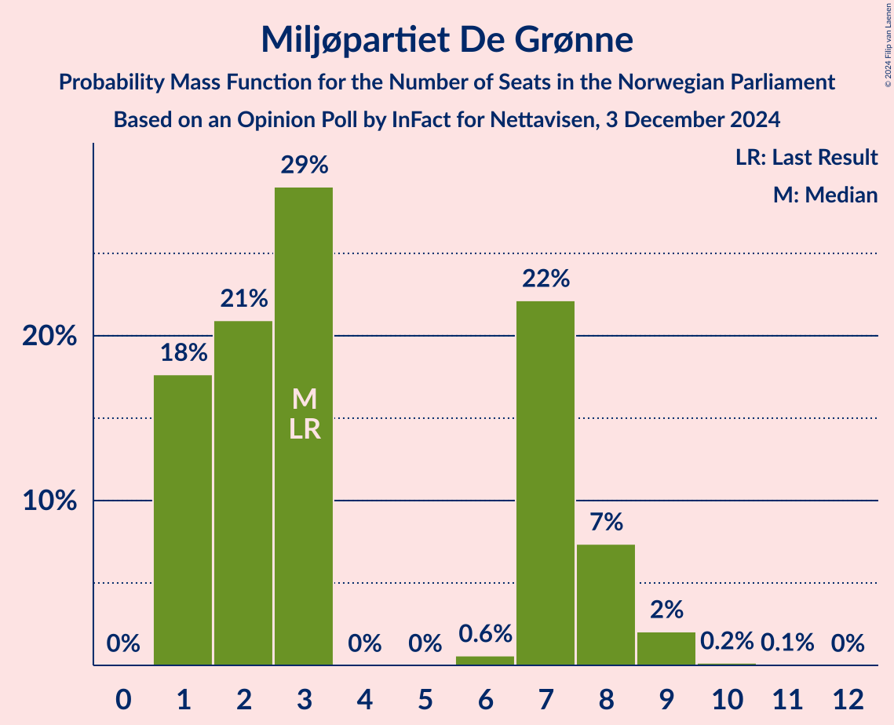
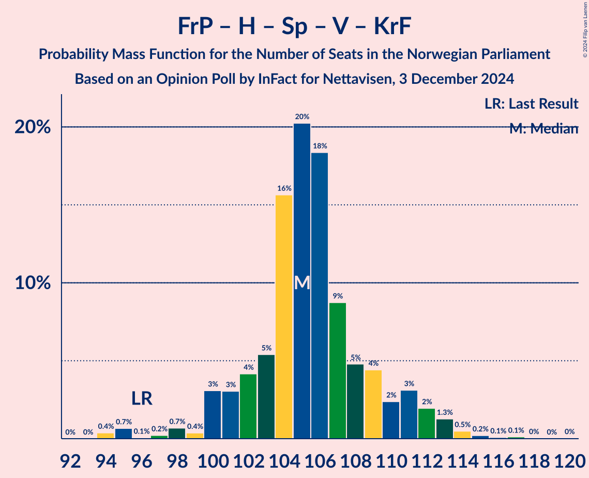
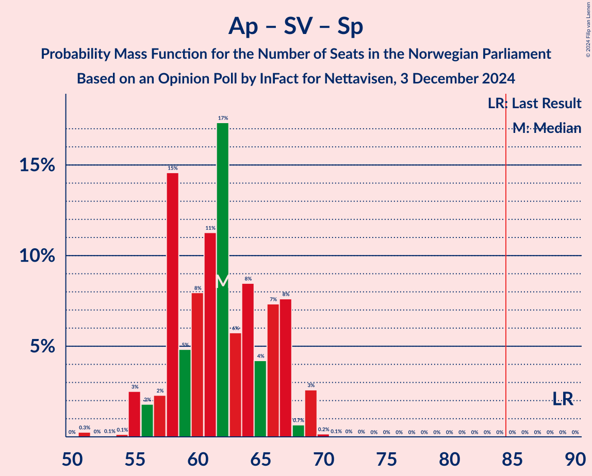
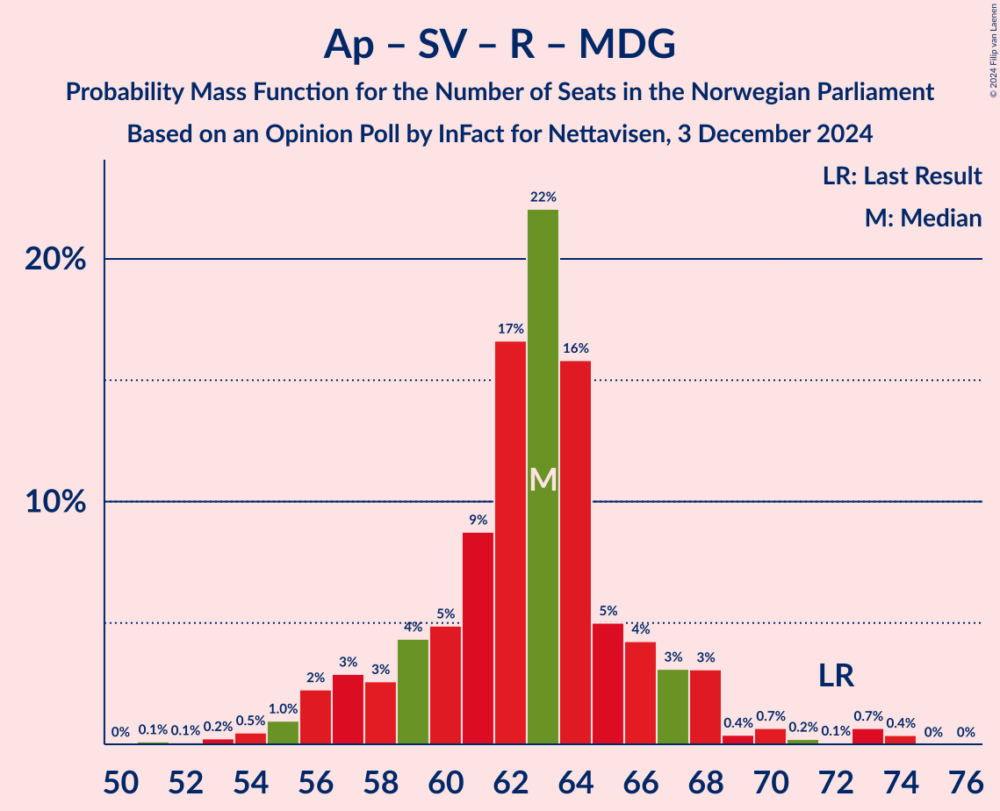
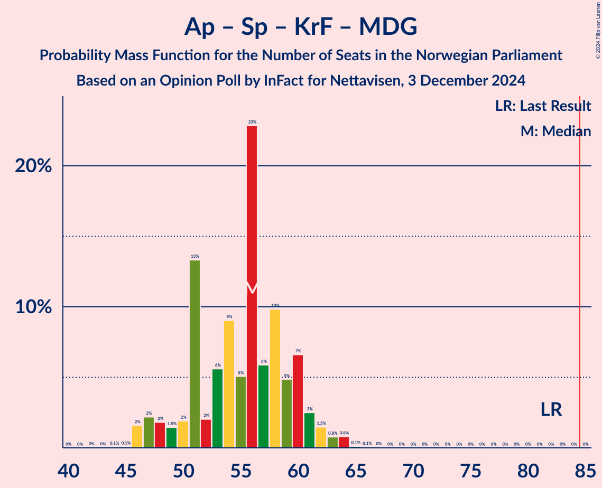
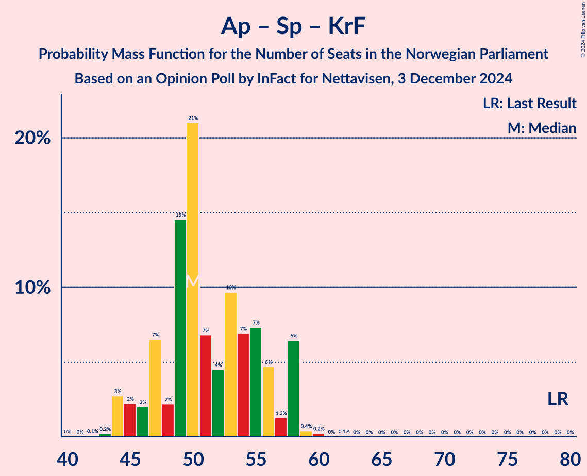

# Opinion Poll by InFact for Nettavisen, 3 December 2024

<a href="#voting-intentions">Voting Intentions</a> | <a href="#seats">Seats</a> | <a href="#coalitions">Coalitions</a> | <a href="#technical-information">Technical Information</a>

## Voting Intentions

### Confidence Intervals

| Party | Last Result | Poll Result | 80% Confidence Interval | 90% Confidence Interval | 95% Confidence Interval | 99% Confidence Interval |
|:-----:|:-----------:|:-----------:|:-----------------------:|:-----------------------:|:-----------------------:|:-----------------------:|
| Fremskrittspartiet | 11.6% | 26.3% | 24.6–28.1% |24.2–28.6% |23.7–29.0% |23.0–29.9% |
| Høyre | 20.4% | 19.3% | 17.8–20.9% |17.4–21.3% |17.0–21.7% |16.3–22.5% |
| Arbeiderpartiet | 26.2% | 18.1% | 16.6–19.6% |16.2–20.1% |15.9–20.5% |15.2–21.2% |
| Sosialistisk Venstreparti | 7.6% | 9.0% | 8.0–10.2% |7.7–10.5% |7.4–10.8% |7.0–11.4% |
| Senterpartiet | 13.5% | 6.7% | 5.8–7.7% |5.5–8.0% |5.3–8.3% |4.9–8.9% |
| Rødt | 4.7% | 5.0% | 4.2–6.0% |4.0–6.2% |3.8–6.5% |3.5–7.0% |
| Venstre | 4.6% | 4.6% | 3.9–5.6% |3.7–5.8% |3.5–6.1% |3.2–6.5% |
| Kristelig Folkeparti | 3.8% | 3.9% | 3.2–4.8% |3.0–5.0% |2.9–5.2% |2.6–5.7% |
| Miljøpartiet De Grønne | 3.9% | 3.6% | 3.0–4.5% |2.8–4.7% |2.7–4.9% |2.4–5.3% |
| Industri- og Næringspartiet | 0.3% | 1.4% | 1.0–2.0% |0.9–2.1% |0.8–2.3% |0.7–2.6% |
| Konservativt | 0.4% | 0.9% | 0.6–1.4% |0.6–1.6% |0.5–1.7% |0.4–2.0% |
| Norgesdemokratene | 1.1% | 0.3% | 0.2–0.6% |0.1–0.7% |0.1–0.8% |0.1–1.0% |

*Note:* The poll result column reflects the actual value used in the calculations. Published results may vary slightly, and in addition be rounded to fewer digits.

## Seats

### Confidence Intervals

| Party | Last Result | Median | 80% Confidence Interval | 90% Confidence Interval | 95% Confidence Interval | 99% Confidence Interval |
|:-----:|:-----------:|:------:|:-----------------------:|:-----------------------:|:-----------------------:|:-----------------------:|
| <a href="#fremskrittspartiet">Fremskrittspartiet</a> | 21 | 48 | 44–51 |42–53 |42–54 |42–55 |
| <a href="#høyre">Høyre</a> | 36 | 34 | 31–39 |31–39 |30–39 |29–41 |
| <a href="#arbeiderpartiet">Arbeiderpartiet</a> | 48 | 35 | 32–38 |31–38 |29–38 |28–39 |
| <a href="#sosialistisk-venstreparti">Sosialistisk Venstreparti</a> | 13 | 16 | 14–18 |13–19 |12–19 |12–21 |
| <a href="#senterpartiet">Senterpartiet</a> | 28 | 12 | 9–14 |9–14 |9–15 |8–16 |
| <a href="#rødt">Rødt</a> | 8 | 9 | 7–11 |1–11 |1–11 |1–12 |
| <a href="#venstre">Venstre</a> | 8 | 8 | 3–9 |3–10 |2–10 |2–12 |
| <a href="#kristelig-folkeparti">Kristelig Folkeparti</a> | 3 | 7 | 2–8 |2–9 |2–9 |1–10 |
| <a href="#miljøpartiet-de-grønne">Miljøpartiet De Grønne</a> | 3 | 3 | 1–7 |1–8 |1–8 |1–9 |
| <a href="#industri--og-næringspartiet">Industri- og Næringspartiet</a> | 0 | 0 | 0 |0 |0 |0 |
| <a href="#konservativt">Konservativt</a> | 0 | 0 | 0 |0 |0 |0 |
| <a href="#norgesdemokratene">Norgesdemokratene</a> | 0 | 0 | 0 |0 |0 |0 |

### Fremskrittspartiet

*For a full overview of the results for this party, see the [Fremskrittspartiet](party-fremskrittspartiet.html) page.*

| Number of Seats | Probability | Accumulated | Special Marks |
|:---------------:|:-----------:|:-----------:|:-------------:|
| 21 | 0% | 100% | Last Result |
| 22 | 0% | 100% |  |
| 23 | 0% | 100% |  |
| 24 | 0% | 100% |  |
| 25 | 0% | 100% |  |
| 26 | 0% | 100% |  |
| 27 | 0% | 100% |  |
| 28 | 0% | 100% |  |
| 29 | 0% | 100% |  |
| 30 | 0% | 100% |  |
| 31 | 0% | 100% |  |
| 32 | 0% | 100% |  |
| 33 | 0% | 100% |  |
| 34 | 0% | 100% |  |
| 35 | 0% | 100% |  |
| 36 | 0% | 100% |  |
| 37 | 0% | 100% |  |
| 38 | 0% | 100% |  |
| 39 | 0% | 100% |  |
| 40 | 0.1% | 100% |  |
| 41 | 0.3% | 99.8% |  |
| 42 | 7% | 99.6% |  |
| 43 | 2% | 92% |  |
| 44 | 11% | 90% |  |
| 45 | 6% | 80% |  |
| 46 | 10% | 73% |  |
| 47 | 8% | 64% |  |
| 48 | 7% | 55% | Median |
| 49 | 20% | 48% |  |
| 50 | 16% | 28% |  |
| 51 | 5% | 12% |  |
| 52 | 1.3% | 7% |  |
| 53 | 1.0% | 5% |  |
| 54 | 2% | 4% |  |
| 55 | 2% | 2% |  |
| 56 | 0% | 0.2% |  |
| 57 | 0% | 0.1% |  |
| 58 | 0.1% | 0.1% |  |
| 59 | 0% | 0% |  |

### Høyre

*For a full overview of the results for this party, see the [Høyre](party-høyre.html) page.*

| Number of Seats | Probability | Accumulated | Special Marks |
|:---------------:|:-----------:|:-----------:|:-------------:|
| 27 | 0.1% | 100% |  |
| 28 | 0.2% | 99.9% |  |
| 29 | 0.8% | 99.7% |  |
| 30 | 2% | 98.8% |  |
| 31 | 20% | 97% |  |
| 32 | 8% | 77% |  |
| 33 | 16% | 69% |  |
| 34 | 11% | 53% | Median |
| 35 | 8% | 42% |  |
| 36 | 6% | 34% | Last Result |
| 37 | 6% | 28% |  |
| 38 | 2% | 21% |  |
| 39 | 17% | 19% |  |
| 40 | 0.5% | 1.4% |  |
| 41 | 0.6% | 0.9% |  |
| 42 | 0.3% | 0.3% |  |
| 43 | 0% | 0% |  |

### Arbeiderpartiet

*For a full overview of the results for this party, see the [Arbeiderpartiet](party-arbeiderpartiet.html) page.*

| Number of Seats | Probability | Accumulated | Special Marks |
|:---------------:|:-----------:|:-----------:|:-------------:|
| 26 | 0.2% | 100% |  |
| 27 | 0.1% | 99.8% |  |
| 28 | 0.8% | 99.8% |  |
| 29 | 2% | 99.0% |  |
| 30 | 1.1% | 97% |  |
| 31 | 3% | 96% |  |
| 32 | 7% | 93% |  |
| 33 | 22% | 86% |  |
| 34 | 13% | 64% |  |
| 35 | 24% | 51% | Median |
| 36 | 6% | 27% |  |
| 37 | 10% | 21% |  |
| 38 | 9% | 11% |  |
| 39 | 2% | 2% |  |
| 40 | 0.3% | 0.4% |  |
| 41 | 0.1% | 0.1% |  |
| 42 | 0% | 0% |  |
| 43 | 0% | 0% |  |
| 44 | 0% | 0% |  |
| 45 | 0% | 0% |  |
| 46 | 0% | 0% |  |
| 47 | 0% | 0% |  |
| 48 | 0% | 0% | Last Result |

### Sosialistisk Venstreparti

*For a full overview of the results for this party, see the [Sosialistisk Venstreparti](party-sosialistiskvenstreparti.html) page.*

| Number of Seats | Probability | Accumulated | Special Marks |
|:---------------:|:-----------:|:-----------:|:-------------:|
| 10 | 0.1% | 100% |  |
| 11 | 0.3% | 99.9% |  |
| 12 | 3% | 99.5% |  |
| 13 | 7% | 97% | Last Result |
| 14 | 9% | 90% |  |
| 15 | 24% | 81% |  |
| 16 | 29% | 57% | Median |
| 17 | 15% | 28% |  |
| 18 | 5% | 12% |  |
| 19 | 6% | 7% |  |
| 20 | 0.5% | 1.1% |  |
| 21 | 0.3% | 0.6% |  |
| 22 | 0.3% | 0.3% |  |
| 23 | 0% | 0% |  |

### Senterpartiet

*For a full overview of the results for this party, see the [Senterpartiet](party-senterpartiet.html) page.*

| Number of Seats | Probability | Accumulated | Special Marks |
|:---------------:|:-----------:|:-----------:|:-------------:|
| 7 | 0% | 100% |  |
| 8 | 1.1% | 99.9% |  |
| 9 | 18% | 98.8% |  |
| 10 | 13% | 81% |  |
| 11 | 10% | 68% |  |
| 12 | 24% | 58% | Median |
| 13 | 20% | 34% |  |
| 14 | 9% | 14% |  |
| 15 | 4% | 5% |  |
| 16 | 0.5% | 0.7% |  |
| 17 | 0.2% | 0.2% |  |
| 18 | 0% | 0% |  |
| 19 | 0% | 0% |  |
| 20 | 0% | 0% |  |
| 21 | 0% | 0% |  |
| 22 | 0% | 0% |  |
| 23 | 0% | 0% |  |
| 24 | 0% | 0% |  |
| 25 | 0% | 0% |  |
| 26 | 0% | 0% |  |
| 27 | 0% | 0% |  |
| 28 | 0% | 0% | Last Result |

### Rødt

*For a full overview of the results for this party, see the [Rødt](party-rødt.html) page.*

| Number of Seats | Probability | Accumulated | Special Marks |
|:---------------:|:-----------:|:-----------:|:-------------:|
| 1 | 8% | 100% |  |
| 2 | 0.1% | 92% |  |
| 3 | 0% | 92% |  |
| 4 | 0% | 92% |  |
| 5 | 0% | 92% |  |
| 6 | 0.1% | 92% |  |
| 7 | 14% | 92% |  |
| 8 | 21% | 78% | Last Result |
| 9 | 22% | 57% | Median |
| 10 | 12% | 35% |  |
| 11 | 20% | 22% |  |
| 12 | 2% | 2% |  |
| 13 | 0.3% | 0.4% |  |
| 14 | 0% | 0% |  |

### Venstre

*For a full overview of the results for this party, see the [Venstre](party-venstre.html) page.*

| Number of Seats | Probability | Accumulated | Special Marks |
|:---------------:|:-----------:|:-----------:|:-------------:|
| 2 | 5% | 100% |  |
| 3 | 27% | 95% |  |
| 4 | 0% | 68% |  |
| 5 | 0% | 68% |  |
| 6 | 0.1% | 68% |  |
| 7 | 10% | 68% |  |
| 8 | 32% | 58% | Last Result, Median |
| 9 | 19% | 27% |  |
| 10 | 6% | 8% |  |
| 11 | 2% | 2% |  |
| 12 | 0.6% | 0.8% |  |
| 13 | 0.2% | 0.2% |  |
| 14 | 0% | 0% |  |

### Kristelig Folkeparti

*For a full overview of the results for this party, see the [Kristelig Folkeparti](party-kristeligfolkeparti.html) page.*

| Number of Seats | Probability | Accumulated | Special Marks |
|:---------------:|:-----------:|:-----------:|:-------------:|
| 0 | 0.3% | 100% |  |
| 1 | 1.0% | 99.7% |  |
| 2 | 15% | 98.8% |  |
| 3 | 31% | 83% | Last Result |
| 4 | 0% | 52% |  |
| 5 | 0% | 52% |  |
| 6 | 2% | 52% |  |
| 7 | 29% | 51% | Median |
| 8 | 15% | 22% |  |
| 9 | 6% | 7% |  |
| 10 | 0.4% | 0.6% |  |
| 11 | 0.1% | 0.1% |  |
| 12 | 0% | 0% |  |

### Miljøpartiet De Grønne

*For a full overview of the results for this party, see the [Miljøpartiet De Grønne](party-miljøpartietdegrønne.html) page.*

| Number of Seats | Probability | Accumulated | Special Marks |
|:---------------:|:-----------:|:-----------:|:-------------:|
| 1 | 18% | 100% |  |
| 2 | 21% | 82% |  |
| 3 | 29% | 61% | Last Result, Median |
| 4 | 0% | 32% |  |
| 5 | 0% | 32% |  |
| 6 | 0.6% | 32% |  |
| 7 | 22% | 32% |  |
| 8 | 7% | 10% |  |
| 9 | 2% | 2% |  |
| 10 | 0.2% | 0.2% |  |
| 11 | 0.1% | 0.1% |  |
| 12 | 0% | 0% |  |

### Industri- og Næringspartiet

*For a full overview of the results for this party, see the [Industri- og Næringspartiet](party-industri-ognæringspartiet.html) page.*

| Number of Seats | Probability | Accumulated | Special Marks |
|:---------------:|:-----------:|:-----------:|:-------------:|
| 0 | 99.5% | 100% | Last Result, Median |
| 1 | 0.1% | 0.5% |  |
| 2 | 0.4% | 0.4% |  |
| 3 | 0% | 0% |  |

### Konservativt

*For a full overview of the results for this party, see the [Konservativt](party-konservativt.html) page.*

| Number of Seats | Probability | Accumulated | Special Marks |
|:---------------:|:-----------:|:-----------:|:-------------:|
| 0 | 100% | 100% | Last Result, Median |

### Norgesdemokratene

*For a full overview of the results for this party, see the [Norgesdemokratene](party-norgesdemokratene.html) page.*

| Number of Seats | Probability | Accumulated | Special Marks |
|:---------------:|:-----------:|:-----------:|:-------------:|
| 0 | 100% | 100% | Last Result, Median |

## Coalitions

### Confidence Intervals

| Coalition | Last Result | Median | Majority? | 80% Confidence Interval | 90% Confidence Interval | 95% Confidence Interval | 99% Confidence Interval |
|:---------:|:-----------:|:------:|:---------:|:-----------------------:|:-----------------------:|:-----------------------:|:-----------------------:|
| Fremskrittspartiet – Høyre – Senterpartiet – Venstre – Kristelig Folkeparti | 96 | 105 | 100% | 102–109 | 100–111 | 100–112 | 95–114 |
| Fremskrittspartiet – Høyre – Venstre – Kristelig Folkeparti – Miljøpartiet De Grønne | 71 | 97 | 100% | 93–103 | 92–103 | 91–104 | 90–108 |
| Fremskrittspartiet – Høyre – Venstre – Kristelig Folkeparti | 68 | 94 | 98.8% | 90–98 | 87–100 | 87–100 | 84–104 |
| Fremskrittspartiet – Høyre – Venstre | 65 | 89 | 82% | 84–93 | 82–95 | 81–97 | 79–100 |
| Fremskrittspartiet – Høyre | 57 | 81 | 26% | 77–88 | 75–88 | 74–89 | 73–92 |
| Arbeiderpartiet – Sosialistisk Venstreparti – Senterpartiet – Rødt – Miljøpartiet De Grønne | 100 | 74 | 0.4% | 70–78 | 68–81 | 68–81 | 64–84 |
| Arbeiderpartiet – Sosialistisk Venstreparti – Senterpartiet – Kristelig Folkeparti – Miljøpartiet De Grønne | 95 | 71 | 0% | 66–76 | 64–76 | 63–79 | 62–80 |
| Arbeiderpartiet – Sosialistisk Venstreparti – Senterpartiet – Rødt | 97 | 71 | 0% | 65–75 | 65–76 | 64–77 | 60–78 |
| Arbeiderpartiet – Sosialistisk Venstreparti – Senterpartiet – Miljøpartiet De Grønne | 92 | 65 | 0% | 62–71 | 60–72 | 59–73 | 57–76 |
| Arbeiderpartiet – Sosialistisk Venstreparti – Senterpartiet | 89 | 62 | 0% | 58–67 | 57–67 | 55–69 | 54–69 |
| Arbeiderpartiet – Sosialistisk Venstreparti – Rødt – Miljøpartiet De Grønne | 72 | 63 | 0% | 59–66 | 57–68 | 56–68 | 54–73 |
| Arbeiderpartiet – Senterpartiet – Kristelig Folkeparti – Miljøpartiet De Grønne | 82 | 56 | 0% | 51–60 | 48–61 | 47–62 | 46–64 |
| Arbeiderpartiet – Senterpartiet – Kristelig Folkeparti | 79 | 50 | 0% | 47–56 | 45–58 | 44–58 | 44–59 |
| Arbeiderpartiet – Sosialistisk Venstreparti | 61 | 50 | 0% | 47–54 | 46–54 | 45–55 | 42–58 |
| Høyre – Venstre – Kristelig Folkeparti | 47 | 46 | 0% | 42–50 | 39–53 | 39–54 | 37–56 |
| Arbeiderpartiet – Senterpartiet | 76 | 47 | 0% | 42–50 | 42–51 | 41–52 | 39–52 |
| Senterpartiet – Venstre – Kristelig Folkeparti | 39 | 23 | 0% | 18–28 | 18–29 | 17–30 | 15–31 |

### Fremskrittspartiet – Høyre – Senterpartiet – Venstre – Kristelig Folkeparti

| Number of Seats | Probability | Accumulated | Special Marks |
|:---------------:|:-----------:|:-----------:|:-------------:|
| 94 | 0.4% | 100% |  |
| 95 | 0.7% | 99.6% |  |
| 96 | 0.1% | 98.9% | Last Result |
| 97 | 0.2% | 98.9% |  |
| 98 | 0.7% | 98.7% |  |
| 99 | 0.4% | 98% |  |
| 100 | 3% | 98% |  |
| 101 | 3% | 95% |  |
| 102 | 4% | 91% |  |
| 103 | 5% | 87% |  |
| 104 | 16% | 82% |  |
| 105 | 20% | 66% |  |
| 106 | 18% | 46% |  |
| 107 | 9% | 28% |  |
| 108 | 5% | 19% |  |
| 109 | 4% | 14% | Median |
| 110 | 2% | 10% |  |
| 111 | 3% | 7% |  |
| 112 | 2% | 4% |  |
| 113 | 1.3% | 2% |  |
| 114 | 0.5% | 1.0% |  |
| 115 | 0.2% | 0.5% |  |
| 116 | 0.1% | 0.3% |  |
| 117 | 0.1% | 0.2% |  |
| 118 | 0% | 0.1% |  |
| 119 | 0% | 0% |  |

### Fremskrittspartiet – Høyre – Venstre – Kristelig Folkeparti – Miljøpartiet De Grønne

| Number of Seats | Probability | Accumulated | Special Marks |
|:---------------:|:-----------:|:-----------:|:-------------:|
| 71 | 0% | 100% | Last Result |
| 72 | 0% | 100% |  |
| 73 | 0% | 100% |  |
| 74 | 0% | 100% |  |
| 75 | 0% | 100% |  |
| 76 | 0% | 100% |  |
| 77 | 0% | 100% |  |
| 78 | 0% | 100% |  |
| 79 | 0% | 100% |  |
| 80 | 0% | 100% |  |
| 81 | 0% | 100% |  |
| 82 | 0% | 100% |  |
| 83 | 0% | 100% |  |
| 84 | 0% | 100% |  |
| 85 | 0% | 100% | Majority |
| 86 | 0% | 100% |  |
| 87 | 0% | 100% |  |
| 88 | 0.1% | 100% |  |
| 89 | 0.1% | 99.9% |  |
| 90 | 2% | 99.8% |  |
| 91 | 1.3% | 98% |  |
| 92 | 2% | 96% |  |
| 93 | 14% | 95% |  |
| 94 | 6% | 81% |  |
| 95 | 12% | 75% |  |
| 96 | 7% | 62% |  |
| 97 | 7% | 55% |  |
| 98 | 10% | 48% |  |
| 99 | 4% | 38% |  |
| 100 | 5% | 34% | Median |
| 101 | 4% | 30% |  |
| 102 | 1.3% | 25% |  |
| 103 | 21% | 24% |  |
| 104 | 1.0% | 3% |  |
| 105 | 1.0% | 2% |  |
| 106 | 0.3% | 1.2% |  |
| 107 | 0.4% | 0.9% |  |
| 108 | 0.2% | 0.5% |  |
| 109 | 0% | 0.4% |  |
| 110 | 0.3% | 0.3% |  |
| 111 | 0% | 0% |  |

### Fremskrittspartiet – Høyre – Venstre – Kristelig Folkeparti

| Number of Seats | Probability | Accumulated | Special Marks |
|:---------------:|:-----------:|:-----------:|:-------------:|
| 68 | 0% | 100% | Last Result |
| 69 | 0% | 100% |  |
| 70 | 0% | 100% |  |
| 71 | 0% | 100% |  |
| 72 | 0% | 100% |  |
| 73 | 0% | 100% |  |
| 74 | 0% | 100% |  |
| 75 | 0% | 100% |  |
| 76 | 0% | 100% |  |
| 77 | 0% | 100% |  |
| 78 | 0% | 100% |  |
| 79 | 0% | 100% |  |
| 80 | 0% | 100% |  |
| 81 | 0.4% | 100% |  |
| 82 | 0% | 99.6% |  |
| 83 | 0% | 99.6% |  |
| 84 | 0.8% | 99.6% |  |
| 85 | 0.5% | 98.8% | Majority |
| 86 | 0.2% | 98% |  |
| 87 | 3% | 98% |  |
| 88 | 0.5% | 95% |  |
| 89 | 2% | 94% |  |
| 90 | 9% | 92% |  |
| 91 | 11% | 84% |  |
| 92 | 4% | 73% |  |
| 93 | 7% | 69% |  |
| 94 | 16% | 62% |  |
| 95 | 12% | 45% |  |
| 96 | 17% | 33% |  |
| 97 | 4% | 16% | Median |
| 98 | 4% | 11% |  |
| 99 | 2% | 8% |  |
| 100 | 3% | 5% |  |
| 101 | 0.5% | 2% |  |
| 102 | 0.8% | 2% |  |
| 103 | 0.1% | 0.7% |  |
| 104 | 0.4% | 0.6% |  |
| 105 | 0.2% | 0.2% |  |
| 106 | 0% | 0.1% |  |
| 107 | 0% | 0.1% |  |
| 108 | 0% | 0% |  |

### Fremskrittspartiet – Høyre – Venstre

| Number of Seats | Probability | Accumulated | Special Marks |
|:---------------:|:-----------:|:-----------:|:-------------:|
| 65 | 0% | 100% | Last Result |
| 66 | 0% | 100% |  |
| 67 | 0% | 100% |  |
| 68 | 0% | 100% |  |
| 69 | 0% | 100% |  |
| 70 | 0% | 100% |  |
| 71 | 0% | 100% |  |
| 72 | 0% | 100% |  |
| 73 | 0% | 100% |  |
| 74 | 0% | 100% |  |
| 75 | 0% | 100% |  |
| 76 | 0% | 100% |  |
| 77 | 0.1% | 100% |  |
| 78 | 0.4% | 99.9% |  |
| 79 | 1.5% | 99.5% |  |
| 80 | 0.1% | 98% |  |
| 81 | 0.8% | 98% |  |
| 82 | 4% | 97% |  |
| 83 | 0.9% | 93% |  |
| 84 | 10% | 92% |  |
| 85 | 5% | 82% | Majority |
| 86 | 2% | 78% |  |
| 87 | 11% | 75% |  |
| 88 | 5% | 64% |  |
| 89 | 19% | 60% |  |
| 90 | 7% | 41% | Median |
| 91 | 15% | 34% |  |
| 92 | 7% | 19% |  |
| 93 | 3% | 12% |  |
| 94 | 4% | 9% |  |
| 95 | 2% | 5% |  |
| 96 | 1.1% | 4% |  |
| 97 | 2% | 3% |  |
| 98 | 0.3% | 0.9% |  |
| 99 | 0.1% | 0.6% |  |
| 100 | 0.3% | 0.5% |  |
| 101 | 0.1% | 0.2% |  |
| 102 | 0% | 0.1% |  |
| 103 | 0.1% | 0.1% |  |
| 104 | 0% | 0% |  |

### Fremskrittspartiet – Høyre

| Number of Seats | Probability | Accumulated | Special Marks |
|:---------------:|:-----------:|:-----------:|:-------------:|
| 57 | 0% | 100% | Last Result |
| 58 | 0% | 100% |  |
| 59 | 0% | 100% |  |
| 60 | 0% | 100% |  |
| 61 | 0% | 100% |  |
| 62 | 0% | 100% |  |
| 63 | 0% | 100% |  |
| 64 | 0% | 100% |  |
| 65 | 0% | 100% |  |
| 66 | 0% | 100% |  |
| 67 | 0% | 100% |  |
| 68 | 0% | 100% |  |
| 69 | 0% | 100% |  |
| 70 | 0% | 100% |  |
| 71 | 0% | 100% |  |
| 72 | 0.1% | 100% |  |
| 73 | 0.6% | 99.9% |  |
| 74 | 3% | 99.3% |  |
| 75 | 4% | 97% |  |
| 76 | 3% | 93% |  |
| 77 | 3% | 90% |  |
| 78 | 5% | 88% |  |
| 79 | 7% | 83% |  |
| 80 | 4% | 76% |  |
| 81 | 27% | 72% |  |
| 82 | 5% | 44% | Median |
| 83 | 6% | 39% |  |
| 84 | 6% | 33% |  |
| 85 | 3% | 26% | Majority |
| 86 | 5% | 23% |  |
| 87 | 3% | 18% |  |
| 88 | 11% | 15% |  |
| 89 | 2% | 4% |  |
| 90 | 0.5% | 2% |  |
| 91 | 0.5% | 1.0% |  |
| 92 | 0.4% | 0.6% |  |
| 93 | 0.1% | 0.2% |  |
| 94 | 0% | 0.1% |  |
| 95 | 0% | 0% |  |

### Arbeiderpartiet – Sosialistisk Venstreparti – Senterpartiet – Rødt – Miljøpartiet De Grønne

| Number of Seats | Probability | Accumulated | Special Marks |
|:---------------:|:-----------:|:-----------:|:-------------:|
| 61 | 0% | 100% |  |
| 62 | 0% | 99.9% |  |
| 63 | 0.1% | 99.9% |  |
| 64 | 0.4% | 99.8% |  |
| 65 | 0.1% | 99.4% |  |
| 66 | 0.5% | 99.3% |  |
| 67 | 0.9% | 98.8% |  |
| 68 | 3% | 98% |  |
| 69 | 2% | 95% |  |
| 70 | 4% | 92% |  |
| 71 | 4% | 89% |  |
| 72 | 17% | 84% |  |
| 73 | 13% | 67% |  |
| 74 | 16% | 54% |  |
| 75 | 5% | 38% | Median |
| 76 | 5% | 33% |  |
| 77 | 11% | 27% |  |
| 78 | 8% | 16% |  |
| 79 | 2% | 8% |  |
| 80 | 0.5% | 6% |  |
| 81 | 3% | 5% |  |
| 82 | 0.2% | 2% |  |
| 83 | 0.5% | 2% |  |
| 84 | 0.8% | 1.2% |  |
| 85 | 0% | 0.4% | Majority |
| 86 | 0% | 0.4% |  |
| 87 | 0.4% | 0.4% |  |
| 88 | 0% | 0% |  |
| 89 | 0% | 0% |  |
| 90 | 0% | 0% |  |
| 91 | 0% | 0% |  |
| 92 | 0% | 0% |  |
| 93 | 0% | 0% |  |
| 94 | 0% | 0% |  |
| 95 | 0% | 0% |  |
| 96 | 0% | 0% |  |
| 97 | 0% | 0% |  |
| 98 | 0% | 0% |  |
| 99 | 0% | 0% |  |
| 100 | 0% | 0% | Last Result |

### Arbeiderpartiet – Sosialistisk Venstreparti – Senterpartiet – Kristelig Folkeparti – Miljøpartiet De Grønne

| Number of Seats | Probability | Accumulated | Special Marks |
|:---------------:|:-----------:|:-----------:|:-------------:|
| 61 | 0.1% | 100% |  |
| 62 | 0.4% | 99.8% |  |
| 63 | 2% | 99.4% |  |
| 64 | 3% | 97% |  |
| 65 | 1.1% | 94% |  |
| 66 | 15% | 93% |  |
| 67 | 2% | 78% |  |
| 68 | 5% | 77% |  |
| 69 | 6% | 72% |  |
| 70 | 7% | 66% |  |
| 71 | 10% | 58% |  |
| 72 | 18% | 48% |  |
| 73 | 6% | 30% | Median |
| 74 | 2% | 25% |  |
| 75 | 10% | 23% |  |
| 76 | 8% | 13% |  |
| 77 | 1.1% | 5% |  |
| 78 | 0.5% | 4% |  |
| 79 | 2% | 3% |  |
| 80 | 1.1% | 1.4% |  |
| 81 | 0.1% | 0.3% |  |
| 82 | 0% | 0.1% |  |
| 83 | 0.1% | 0.1% |  |
| 84 | 0% | 0% |  |
| 85 | 0% | 0% | Majority |
| 86 | 0% | 0% |  |
| 87 | 0% | 0% |  |
| 88 | 0% | 0% |  |
| 89 | 0% | 0% |  |
| 90 | 0% | 0% |  |
| 91 | 0% | 0% |  |
| 92 | 0% | 0% |  |
| 93 | 0% | 0% |  |
| 94 | 0% | 0% |  |
| 95 | 0% | 0% | Last Result |

### Arbeiderpartiet – Sosialistisk Venstreparti – Senterpartiet – Rødt

| Number of Seats | Probability | Accumulated | Special Marks |
|:---------------:|:-----------:|:-----------:|:-------------:|
| 58 | 0.3% | 100% |  |
| 59 | 0% | 99.7% |  |
| 60 | 0.2% | 99.6% |  |
| 61 | 0.4% | 99.5% |  |
| 62 | 0.3% | 99.1% |  |
| 63 | 1.1% | 98.8% |  |
| 64 | 0.6% | 98% |  |
| 65 | 21% | 97% |  |
| 66 | 1.4% | 76% |  |
| 67 | 4% | 75% |  |
| 68 | 5% | 70% |  |
| 69 | 4% | 66% |  |
| 70 | 11% | 62% |  |
| 71 | 7% | 52% |  |
| 72 | 5% | 45% | Median |
| 73 | 14% | 39% |  |
| 74 | 7% | 25% |  |
| 75 | 14% | 19% |  |
| 76 | 1.4% | 5% |  |
| 77 | 1.3% | 4% |  |
| 78 | 2% | 2% |  |
| 79 | 0.1% | 0.2% |  |
| 80 | 0.1% | 0.1% |  |
| 81 | 0% | 0% |  |
| 82 | 0% | 0% |  |
| 83 | 0% | 0% |  |
| 84 | 0% | 0% |  |
| 85 | 0% | 0% | Majority |
| 86 | 0% | 0% |  |
| 87 | 0% | 0% |  |
| 88 | 0% | 0% |  |
| 89 | 0% | 0% |  |
| 90 | 0% | 0% |  |
| 91 | 0% | 0% |  |
| 92 | 0% | 0% |  |
| 93 | 0% | 0% |  |
| 94 | 0% | 0% |  |
| 95 | 0% | 0% |  |
| 96 | 0% | 0% |  |
| 97 | 0% | 0% | Last Result |

### Arbeiderpartiet – Sosialistisk Venstreparti – Senterpartiet – Miljøpartiet De Grønne

| Number of Seats | Probability | Accumulated | Special Marks |
|:---------------:|:-----------:|:-----------:|:-------------:|
| 56 | 0.1% | 100% |  |
| 57 | 0.6% | 99.9% |  |
| 58 | 2% | 99.3% |  |
| 59 | 0.6% | 98% |  |
| 60 | 3% | 97% |  |
| 61 | 3% | 94% |  |
| 62 | 6% | 91% |  |
| 63 | 16% | 84% |  |
| 64 | 8% | 69% |  |
| 65 | 17% | 61% |  |
| 66 | 9% | 44% | Median |
| 67 | 3% | 35% |  |
| 68 | 7% | 32% |  |
| 69 | 11% | 25% |  |
| 70 | 3% | 13% |  |
| 71 | 1.5% | 11% |  |
| 72 | 6% | 9% |  |
| 73 | 1.3% | 3% |  |
| 74 | 0.2% | 2% |  |
| 75 | 0.1% | 1.3% |  |
| 76 | 1.1% | 1.2% |  |
| 77 | 0% | 0.1% |  |
| 78 | 0.1% | 0.1% |  |
| 79 | 0% | 0% |  |
| 80 | 0% | 0% |  |
| 81 | 0% | 0% |  |
| 82 | 0% | 0% |  |
| 83 | 0% | 0% |  |
| 84 | 0% | 0% |  |
| 85 | 0% | 0% | Majority |
| 86 | 0% | 0% |  |
| 87 | 0% | 0% |  |
| 88 | 0% | 0% |  |
| 89 | 0% | 0% |  |
| 90 | 0% | 0% |  |
| 91 | 0% | 0% |  |
| 92 | 0% | 0% | Last Result |

### Arbeiderpartiet – Sosialistisk Venstreparti – Senterpartiet

| Number of Seats | Probability | Accumulated | Special Marks |
|:---------------:|:-----------:|:-----------:|:-------------:|
| 51 | 0.3% | 100% |  |
| 52 | 0% | 99.7% |  |
| 53 | 0.1% | 99.7% |  |
| 54 | 0.1% | 99.6% |  |
| 55 | 3% | 99.5% |  |
| 56 | 2% | 97% |  |
| 57 | 2% | 95% |  |
| 58 | 15% | 93% |  |
| 59 | 5% | 78% |  |
| 60 | 8% | 73% |  |
| 61 | 11% | 66% |  |
| 62 | 17% | 54% |  |
| 63 | 6% | 37% | Median |
| 64 | 8% | 31% |  |
| 65 | 4% | 23% |  |
| 66 | 7% | 18% |  |
| 67 | 8% | 11% |  |
| 68 | 0.7% | 4% |  |
| 69 | 3% | 3% |  |
| 70 | 0.2% | 0.3% |  |
| 71 | 0.1% | 0.1% |  |
| 72 | 0% | 0.1% |  |
| 73 | 0% | 0% |  |
| 74 | 0% | 0% |  |
| 75 | 0% | 0% |  |
| 76 | 0% | 0% |  |
| 77 | 0% | 0% |  |
| 78 | 0% | 0% |  |
| 79 | 0% | 0% |  |
| 80 | 0% | 0% |  |
| 81 | 0% | 0% |  |
| 82 | 0% | 0% |  |
| 83 | 0% | 0% |  |
| 84 | 0% | 0% |  |
| 85 | 0% | 0% | Majority |
| 86 | 0% | 0% |  |
| 87 | 0% | 0% |  |
| 88 | 0% | 0% |  |
| 89 | 0% | 0% | Last Result |

### Arbeiderpartiet – Sosialistisk Venstreparti – Rødt – Miljøpartiet De Grønne

| Number of Seats | Probability | Accumulated | Special Marks |
|:---------------:|:-----------:|:-----------:|:-------------:|
| 50 | 0% | 100% |  |
| 51 | 0.1% | 99.9% |  |
| 52 | 0.1% | 99.8% |  |
| 53 | 0.2% | 99.7% |  |
| 54 | 0.5% | 99.5% |  |
| 55 | 1.0% | 99.0% |  |
| 56 | 2% | 98% |  |
| 57 | 3% | 96% |  |
| 58 | 3% | 93% |  |
| 59 | 4% | 90% |  |
| 60 | 5% | 86% |  |
| 61 | 9% | 81% |  |
| 62 | 17% | 72% |  |
| 63 | 22% | 56% | Median |
| 64 | 16% | 34% |  |
| 65 | 5% | 18% |  |
| 66 | 4% | 13% |  |
| 67 | 3% | 9% |  |
| 68 | 3% | 5% |  |
| 69 | 0.4% | 2% |  |
| 70 | 0.7% | 2% |  |
| 71 | 0.2% | 1.3% |  |
| 72 | 0.1% | 1.1% | Last Result |
| 73 | 0.7% | 1.1% |  |
| 74 | 0.4% | 0.4% |  |
| 75 | 0% | 0% |  |

### Arbeiderpartiet – Senterpartiet – Kristelig Folkeparti – Miljøpartiet De Grønne

| Number of Seats | Probability | Accumulated | Special Marks |
|:---------------:|:-----------:|:-----------:|:-------------:|
| 44 | 0.1% | 100% |  |
| 45 | 0.1% | 99.9% |  |
| 46 | 2% | 99.8% |  |
| 47 | 2% | 98% |  |
| 48 | 2% | 96% |  |
| 49 | 1.5% | 94% |  |
| 50 | 2% | 93% |  |
| 51 | 13% | 91% |  |
| 52 | 2% | 78% |  |
| 53 | 6% | 75% |  |
| 54 | 9% | 70% |  |
| 55 | 5% | 61% |  |
| 56 | 23% | 56% |  |
| 57 | 6% | 33% | Median |
| 58 | 10% | 27% |  |
| 59 | 5% | 17% |  |
| 60 | 7% | 12% |  |
| 61 | 3% | 6% |  |
| 62 | 1.5% | 3% |  |
| 63 | 0.8% | 2% |  |
| 64 | 0.8% | 1.0% |  |
| 65 | 0.1% | 0.2% |  |
| 66 | 0.1% | 0.1% |  |
| 67 | 0% | 0% |  |
| 68 | 0% | 0% |  |
| 69 | 0% | 0% |  |
| 70 | 0% | 0% |  |
| 71 | 0% | 0% |  |
| 72 | 0% | 0% |  |
| 73 | 0% | 0% |  |
| 74 | 0% | 0% |  |
| 75 | 0% | 0% |  |
| 76 | 0% | 0% |  |
| 77 | 0% | 0% |  |
| 78 | 0% | 0% |  |
| 79 | 0% | 0% |  |
| 80 | 0% | 0% |  |
| 81 | 0% | 0% |  |
| 82 | 0% | 0% | Last Result |

### Arbeiderpartiet – Senterpartiet – Kristelig Folkeparti

| Number of Seats | Probability | Accumulated | Special Marks |
|:---------------:|:-----------:|:-----------:|:-------------:|
| 40 | 0% | 100% |  |
| 41 | 0% | 99.9% |  |
| 42 | 0.1% | 99.9% |  |
| 43 | 0.2% | 99.8% |  |
| 44 | 3% | 99.6% |  |
| 45 | 2% | 97% |  |
| 46 | 2% | 95% |  |
| 47 | 7% | 93% |  |
| 48 | 2% | 86% |  |
| 49 | 15% | 84% |  |
| 50 | 21% | 69% |  |
| 51 | 7% | 48% |  |
| 52 | 4% | 42% |  |
| 53 | 10% | 37% |  |
| 54 | 7% | 27% | Median |
| 55 | 7% | 20% |  |
| 56 | 5% | 13% |  |
| 57 | 1.3% | 8% |  |
| 58 | 6% | 7% |  |
| 59 | 0.4% | 0.7% |  |
| 60 | 0.2% | 0.3% |  |
| 61 | 0% | 0.1% |  |
| 62 | 0.1% | 0.1% |  |
| 63 | 0% | 0% |  |
| 64 | 0% | 0% |  |
| 65 | 0% | 0% |  |
| 66 | 0% | 0% |  |
| 67 | 0% | 0% |  |
| 68 | 0% | 0% |  |
| 69 | 0% | 0% |  |
| 70 | 0% | 0% |  |
| 71 | 0% | 0% |  |
| 72 | 0% | 0% |  |
| 73 | 0% | 0% |  |
| 74 | 0% | 0% |  |
| 75 | 0% | 0% |  |
| 76 | 0% | 0% |  |
| 77 | 0% | 0% |  |
| 78 | 0% | 0% |  |
| 79 | 0% | 0% | Last Result |

### Arbeiderpartiet – Sosialistisk Venstreparti

| Number of Seats | Probability | Accumulated | Special Marks |
|:---------------:|:-----------:|:-----------:|:-------------:|
| 41 | 0.4% | 100% |  |
| 42 | 0.1% | 99.6% |  |
| 43 | 0.8% | 99.5% |  |
| 44 | 1.2% | 98.7% |  |
| 45 | 2% | 98% |  |
| 46 | 3% | 96% |  |
| 47 | 5% | 93% |  |
| 48 | 4% | 87% |  |
| 49 | 30% | 84% |  |
| 50 | 16% | 53% |  |
| 51 | 7% | 37% | Median |
| 52 | 10% | 31% |  |
| 53 | 4% | 21% |  |
| 54 | 12% | 17% |  |
| 55 | 2% | 5% |  |
| 56 | 1.2% | 2% |  |
| 57 | 0.3% | 1.2% |  |
| 58 | 0.8% | 0.8% |  |
| 59 | 0% | 0.1% |  |
| 60 | 0% | 0% |  |
| 61 | 0% | 0% | Last Result |

### Høyre – Venstre – Kristelig Folkeparti

| Number of Seats | Probability | Accumulated | Special Marks |
|:---------------:|:-----------:|:-----------:|:-------------:|
| 37 | 0.8% | 100% |  |
| 38 | 0.2% | 99.2% |  |
| 39 | 5% | 99.0% |  |
| 40 | 2% | 94% |  |
| 41 | 1.0% | 92% |  |
| 42 | 2% | 91% |  |
| 43 | 4% | 89% |  |
| 44 | 3% | 85% |  |
| 45 | 18% | 83% |  |
| 46 | 24% | 65% |  |
| 47 | 10% | 40% | Last Result |
| 48 | 11% | 30% |  |
| 49 | 9% | 19% | Median |
| 50 | 2% | 10% |  |
| 51 | 2% | 9% |  |
| 52 | 2% | 7% |  |
| 53 | 2% | 5% |  |
| 54 | 0.7% | 3% |  |
| 55 | 0.6% | 2% |  |
| 56 | 2% | 2% |  |
| 57 | 0% | 0% |  |

### Arbeiderpartiet – Senterpartiet

| Number of Seats | Probability | Accumulated | Special Marks |
|:---------------:|:-----------:|:-----------:|:-------------:|
| 38 | 0.2% | 100% |  |
| 39 | 0.3% | 99.8% |  |
| 40 | 0.3% | 99.5% |  |
| 41 | 2% | 99.2% |  |
| 42 | 16% | 97% |  |
| 43 | 4% | 81% |  |
| 44 | 7% | 77% |  |
| 45 | 12% | 70% |  |
| 46 | 6% | 58% |  |
| 47 | 23% | 52% | Median |
| 48 | 7% | 29% |  |
| 49 | 7% | 21% |  |
| 50 | 5% | 14% |  |
| 51 | 7% | 9% |  |
| 52 | 2% | 3% |  |
| 53 | 0.3% | 0.4% |  |
| 54 | 0.1% | 0.1% |  |
| 55 | 0% | 0% |  |
| 56 | 0% | 0% |  |
| 57 | 0% | 0% |  |
| 58 | 0% | 0% |  |
| 59 | 0% | 0% |  |
| 60 | 0% | 0% |  |
| 61 | 0% | 0% |  |
| 62 | 0% | 0% |  |
| 63 | 0% | 0% |  |
| 64 | 0% | 0% |  |
| 65 | 0% | 0% |  |
| 66 | 0% | 0% |  |
| 67 | 0% | 0% |  |
| 68 | 0% | 0% |  |
| 69 | 0% | 0% |  |
| 70 | 0% | 0% |  |
| 71 | 0% | 0% |  |
| 72 | 0% | 0% |  |
| 73 | 0% | 0% |  |
| 74 | 0% | 0% |  |
| 75 | 0% | 0% |  |
| 76 | 0% | 0% | Last Result |

### Senterpartiet – Venstre – Kristelig Folkeparti

| Number of Seats | Probability | Accumulated | Special Marks |
|:---------------:|:-----------:|:-----------:|:-------------:|
| 14 | 0% | 100% |  |
| 15 | 0.5% | 99.9% |  |
| 16 | 1.0% | 99.4% |  |
| 17 | 2% | 98% |  |
| 18 | 11% | 97% |  |
| 19 | 4% | 86% |  |
| 20 | 1.5% | 82% |  |
| 21 | 9% | 80% |  |
| 22 | 7% | 72% |  |
| 23 | 15% | 65% |  |
| 24 | 17% | 50% |  |
| 25 | 5% | 32% |  |
| 26 | 4% | 27% |  |
| 27 | 5% | 23% | Median |
| 28 | 8% | 17% |  |
| 29 | 5% | 9% |  |
| 30 | 3% | 4% |  |
| 31 | 0.9% | 1.3% |  |
| 32 | 0.1% | 0.4% |  |
| 33 | 0.2% | 0.3% |  |
| 34 | 0.1% | 0.1% |  |
| 35 | 0% | 0% |  |
| 36 | 0% | 0% |  |
| 37 | 0% | 0% |  |
| 38 | 0% | 0% |  |
| 39 | 0% | 0% | Last Result |

## Technical Information

### Opinion Poll

+ **Polling firm:** InFact
+ **Commissioner(s):** Nettavisen
+ **Fieldwork period:** 3 December 2024

### Calculations

+ **Sample size:** 1080
+ **Simulations done:** 2,097,152
+ **Error estimate:** 3.20%

