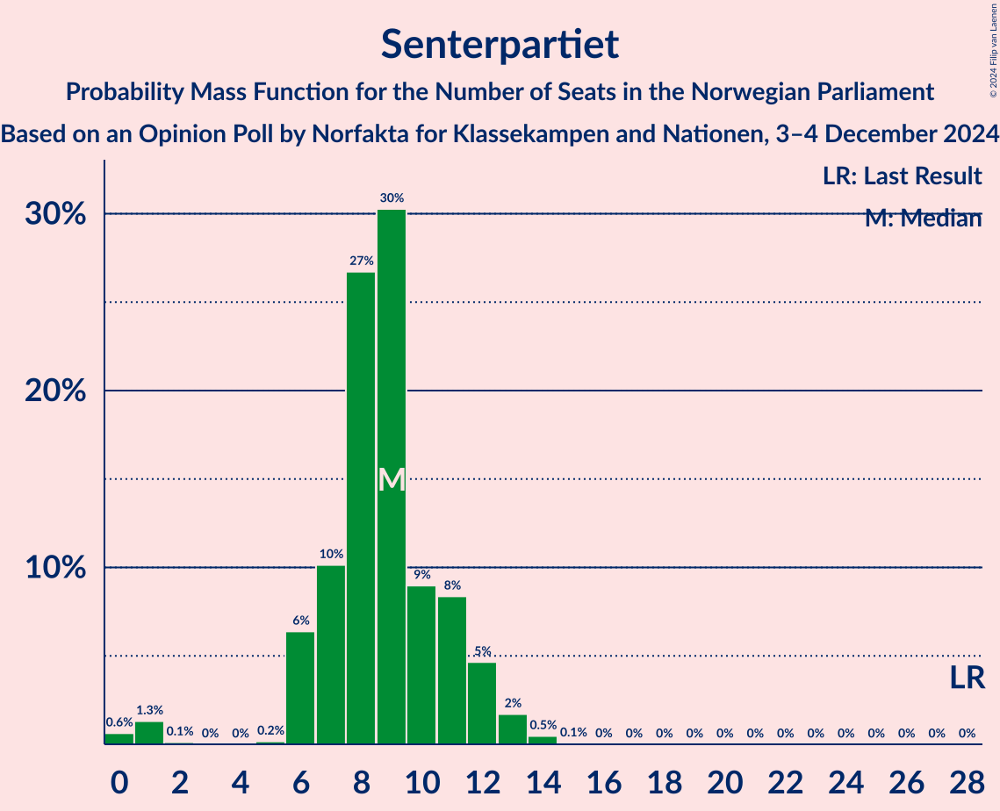
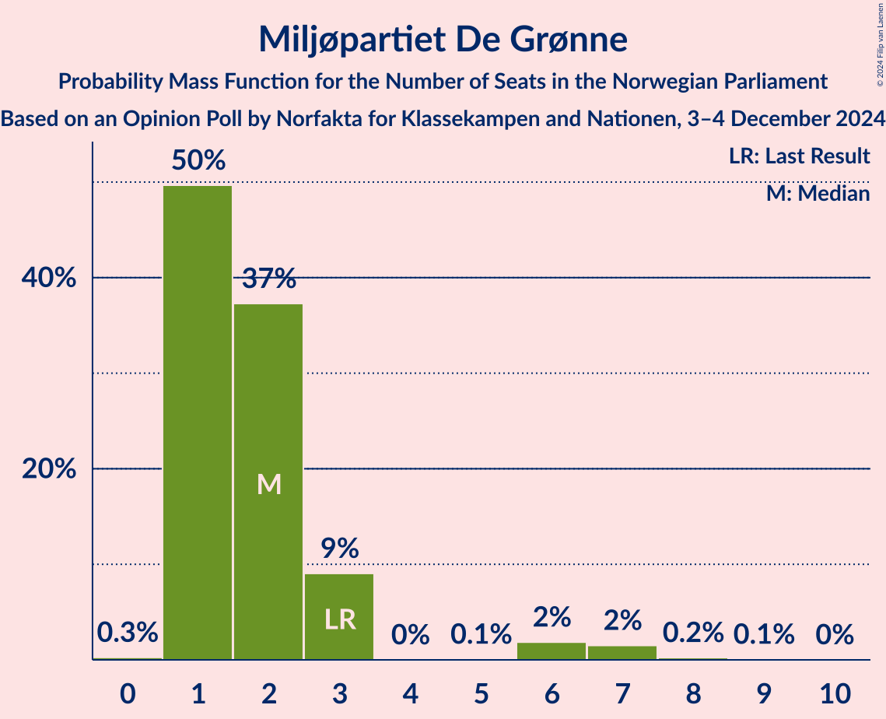
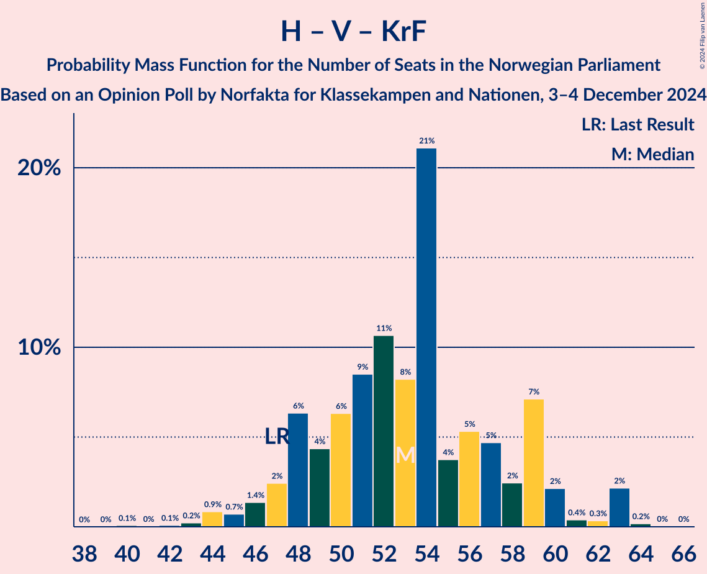
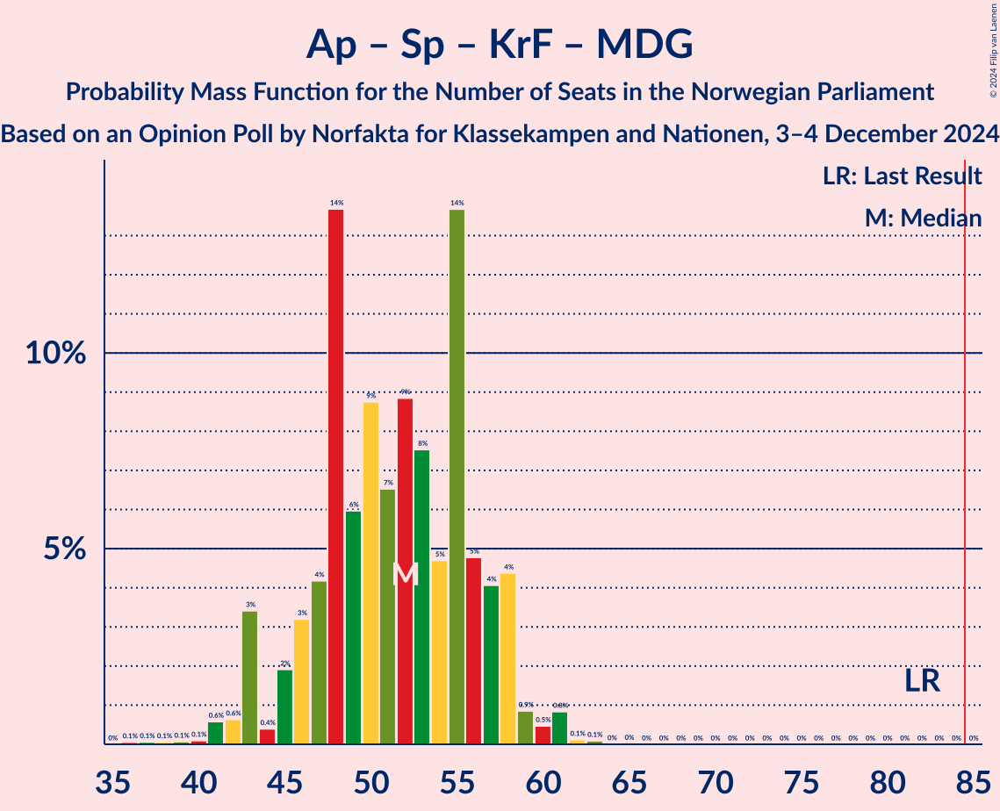

# Opinion Poll by Norfakta for Klassekampen and Nationen, 3–4 December 2024

<a href="#voting-intentions">Voting Intentions</a> | <a href="#seats">Seats</a> | <a href="#coalitions">Coalitions</a> | <a href="#technical-information">Technical Information</a>

## Voting Intentions

### Confidence Intervals

| Party | Last Result | Poll Result | 80% Confidence Interval | 90% Confidence Interval | 95% Confidence Interval | 99% Confidence Interval |
|:-----:|:-----------:|:-----------:|:-----------------------:|:-----------------------:|:-----------------------:|:-----------------------:|
| Fremskrittspartiet | 11.6% | 23.7% | 21.9–25.7% |21.4–26.3% |20.9–26.8% |20.0–27.8% |
| Høyre | 20.4% | 22.8% | 21.0–24.8% |20.5–25.4% |20.1–25.9% |19.2–26.9% |
| Arbeiderpartiet | 26.2% | 18.1% | 16.4–20.0% |16.0–20.5% |15.6–20.9% |14.8–21.8% |
| Sosialistisk Venstreparti | 7.6% | 8.7% | 7.6–10.2% |7.3–10.5% |7.0–10.9% |6.4–11.6% |
| Senterpartiet | 13.5% | 5.4% | 4.5–6.5% |4.2–6.9% |4.0–7.2% |3.6–7.8% |
| Rødt | 4.7% | 5.2% | 4.4–6.4% |4.1–6.7% |3.9–7.0% |3.5–7.6% |
| Venstre | 4.6% | 4.6% | 3.8–5.7% |3.6–6.0% |3.4–6.3% |3.0–6.9% |
| Kristelig Folkeparti | 3.8% | 4.2% | 3.5–5.3% |3.2–5.6% |3.0–5.9% |2.7–6.4% |
| Miljøpartiet De Grønne | 3.9% | 2.9% | 2.2–3.8% |2.1–4.0% |1.9–4.3% |1.7–4.8% |
| Industri- og Næringspartiet | 0.3% | 0.4% | 0.2–0.8% |0.2–1.0% |0.1–1.1% |0.1–1.4% |

*Note:* The poll result column reflects the actual value used in the calculations. Published results may vary slightly, and in addition be rounded to fewer digits.

## Seats

### Confidence Intervals

| Party | Last Result | Median | 80% Confidence Interval | 90% Confidence Interval | 95% Confidence Interval | 99% Confidence Interval |
|:-----:|:-----------:|:------:|:-----------------------:|:-----------------------:|:-----------------------:|:-----------------------:|
| <a href="#fremskrittspartiet">Fremskrittspartiet</a> | 21 | 43 | 41–47 |39–48 |39–50 |37–51 |
| <a href="#høyre">Høyre</a> | 36 | 40 | 37–44 |36–46 |34–47 |33–48 |
| <a href="#arbeiderpartiet">Arbeiderpartiet</a> | 48 | 34 | 32–39 |32–39 |31–39 |28–42 |
| <a href="#sosialistisk-venstreparti">Sosialistisk Venstreparti</a> | 13 | 14 | 12–17 |11–18 |11–19 |9–19 |
| <a href="#senterpartiet">Senterpartiet</a> | 28 | 9 | 7–11 |7–12 |6–13 |0–14 |
| <a href="#rødt">Rødt</a> | 8 | 9 | 7–10 |6–11 |1–12 |1–13 |
| <a href="#venstre">Venstre</a> | 8 | 7 | 3–9 |3–10 |3–10 |2–11 |
| <a href="#kristelig-folkeparti">Kristelig Folkeparti</a> | 3 | 6 | 2–9 |2–9 |1–9 |1–11 |
| <a href="#miljøpartiet-de-grønne">Miljøpartiet De Grønne</a> | 3 | 1 | 1–2 |1–3 |1–6 |1–7 |
| <a href="#industri--og-næringspartiet">Industri- og Næringspartiet</a> | 0 | 0 | 0 |0 |0 |0 |

### Fremskrittspartiet

*For a full overview of the results for this party, see the [Fremskrittspartiet](party-fremskrittspartiet.html) page.*

| Number of Seats | Probability | Accumulated | Special Marks |
|:---------------:|:-----------:|:-----------:|:-------------:|
| 21 | 0% | 100% | Last Result |
| 22 | 0% | 100% |  |
| 23 | 0% | 100% |  |
| 24 | 0% | 100% |  |
| 25 | 0% | 100% |  |
| 26 | 0% | 100% |  |
| 27 | 0% | 100% |  |
| 28 | 0% | 100% |  |
| 29 | 0% | 100% |  |
| 30 | 0% | 100% |  |
| 31 | 0% | 100% |  |
| 32 | 0% | 100% |  |
| 33 | 0% | 100% |  |
| 34 | 0% | 100% |  |
| 35 | 0% | 100% |  |
| 36 | 0.2% | 100% |  |
| 37 | 1.3% | 99.8% |  |
| 38 | 0.9% | 98% |  |
| 39 | 6% | 98% |  |
| 40 | 2% | 92% |  |
| 41 | 8% | 90% |  |
| 42 | 13% | 82% |  |
| 43 | 24% | 69% | Median |
| 44 | 10% | 45% |  |
| 45 | 4% | 35% |  |
| 46 | 16% | 31% |  |
| 47 | 6% | 15% |  |
| 48 | 5% | 9% |  |
| 49 | 1.0% | 4% |  |
| 50 | 1.2% | 3% |  |
| 51 | 2% | 2% |  |
| 52 | 0.1% | 0.3% |  |
| 53 | 0.1% | 0.2% |  |
| 54 | 0% | 0.1% |  |
| 55 | 0% | 0.1% |  |
| 56 | 0% | 0% |  |

### Høyre

*For a full overview of the results for this party, see the [Høyre](party-høyre.html) page.*

| Number of Seats | Probability | Accumulated | Special Marks |
|:---------------:|:-----------:|:-----------:|:-------------:|
| 31 | 0.1% | 100% |  |
| 32 | 0.1% | 99.9% |  |
| 33 | 0.5% | 99.8% |  |
| 34 | 3% | 99.3% |  |
| 35 | 0.8% | 97% |  |
| 36 | 4% | 96% | Last Result |
| 37 | 5% | 92% |  |
| 38 | 16% | 87% |  |
| 39 | 17% | 71% |  |
| 40 | 14% | 55% | Median |
| 41 | 11% | 41% |  |
| 42 | 10% | 29% |  |
| 43 | 3% | 20% |  |
| 44 | 8% | 17% |  |
| 45 | 2% | 8% |  |
| 46 | 4% | 6% |  |
| 47 | 2% | 3% |  |
| 48 | 0.5% | 0.8% |  |
| 49 | 0.2% | 0.3% |  |
| 50 | 0% | 0.1% |  |
| 51 | 0% | 0.1% |  |
| 52 | 0% | 0% |  |

### Arbeiderpartiet

*For a full overview of the results for this party, see the [Arbeiderpartiet](party-arbeiderpartiet.html) page.*

| Number of Seats | Probability | Accumulated | Special Marks |
|:---------------:|:-----------:|:-----------:|:-------------:|
| 27 | 0.1% | 100% |  |
| 28 | 0.4% | 99.9% |  |
| 29 | 0.2% | 99.5% |  |
| 30 | 0.7% | 99.3% |  |
| 31 | 2% | 98.7% |  |
| 32 | 16% | 97% |  |
| 33 | 19% | 81% |  |
| 34 | 12% | 62% | Median |
| 35 | 9% | 50% |  |
| 36 | 13% | 40% |  |
| 37 | 11% | 27% |  |
| 38 | 5% | 15% |  |
| 39 | 9% | 11% |  |
| 40 | 0.4% | 2% |  |
| 41 | 0.5% | 1.4% |  |
| 42 | 0.8% | 0.9% |  |
| 43 | 0.1% | 0.1% |  |
| 44 | 0% | 0% |  |
| 45 | 0% | 0% |  |
| 46 | 0% | 0% |  |
| 47 | 0% | 0% |  |
| 48 | 0% | 0% | Last Result |

### Sosialistisk Venstreparti

*For a full overview of the results for this party, see the [Sosialistisk Venstreparti](party-sosialistiskvenstreparti.html) page.*

| Number of Seats | Probability | Accumulated | Special Marks |
|:---------------:|:-----------:|:-----------:|:-------------:|
| 8 | 0.1% | 100% |  |
| 9 | 0.7% | 99.9% |  |
| 10 | 1.4% | 99.3% |  |
| 11 | 5% | 98% |  |
| 12 | 24% | 93% |  |
| 13 | 10% | 69% | Last Result |
| 14 | 17% | 59% | Median |
| 15 | 17% | 42% |  |
| 16 | 9% | 25% |  |
| 17 | 6% | 16% |  |
| 18 | 4% | 9% |  |
| 19 | 4% | 5% |  |
| 20 | 0.3% | 0.5% |  |
| 21 | 0.1% | 0.2% |  |
| 22 | 0% | 0.1% |  |
| 23 | 0% | 0% |  |

### Senterpartiet

*For a full overview of the results for this party, see the [Senterpartiet](party-senterpartiet.html) page.*

| Number of Seats | Probability | Accumulated | Special Marks |
|:---------------:|:-----------:|:-----------:|:-------------:|
| 0 | 0.6% | 100% |  |
| 1 | 1.2% | 99.4% |  |
| 2 | 0.1% | 98% |  |
| 3 | 0% | 98% |  |
| 4 | 0% | 98% |  |
| 5 | 0.1% | 98% |  |
| 6 | 3% | 98% |  |
| 7 | 12% | 95% |  |
| 8 | 20% | 83% |  |
| 9 | 36% | 63% | Median |
| 10 | 8% | 27% |  |
| 11 | 11% | 19% |  |
| 12 | 5% | 8% |  |
| 13 | 2% | 3% |  |
| 14 | 0.5% | 0.6% |  |
| 15 | 0.1% | 0.1% |  |
| 16 | 0% | 0% |  |
| 17 | 0% | 0% |  |
| 18 | 0% | 0% |  |
| 19 | 0% | 0% |  |
| 20 | 0% | 0% |  |
| 21 | 0% | 0% |  |
| 22 | 0% | 0% |  |
| 23 | 0% | 0% |  |
| 24 | 0% | 0% |  |
| 25 | 0% | 0% |  |
| 26 | 0% | 0% |  |
| 27 | 0% | 0% |  |
| 28 | 0% | 0% | Last Result |

### Rødt

*For a full overview of the results for this party, see the [Rødt](party-rødt.html) page.*

| Number of Seats | Probability | Accumulated | Special Marks |
|:---------------:|:-----------:|:-----------:|:-------------:|
| 1 | 4% | 100% |  |
| 2 | 0.2% | 96% |  |
| 3 | 0% | 96% |  |
| 4 | 0% | 96% |  |
| 5 | 0.1% | 96% |  |
| 6 | 3% | 96% |  |
| 7 | 15% | 93% |  |
| 8 | 26% | 78% | Last Result |
| 9 | 30% | 51% | Median |
| 10 | 14% | 21% |  |
| 11 | 4% | 8% |  |
| 12 | 2% | 3% |  |
| 13 | 1.1% | 1.3% |  |
| 14 | 0.2% | 0.3% |  |
| 15 | 0.1% | 0.1% |  |
| 16 | 0% | 0% |  |

### Venstre

*For a full overview of the results for this party, see the [Venstre](party-venstre.html) page.*

| Number of Seats | Probability | Accumulated | Special Marks |
|:---------------:|:-----------:|:-----------:|:-------------:|
| 2 | 2% | 100% |  |
| 3 | 10% | 98% |  |
| 4 | 0% | 88% |  |
| 5 | 0.2% | 88% |  |
| 6 | 5% | 88% |  |
| 7 | 35% | 83% | Median |
| 8 | 30% | 48% | Last Result |
| 9 | 11% | 18% |  |
| 10 | 5% | 7% |  |
| 11 | 1.3% | 2% |  |
| 12 | 0.3% | 0.3% |  |
| 13 | 0% | 0.1% |  |
| 14 | 0% | 0% |  |

### Kristelig Folkeparti

*For a full overview of the results for this party, see the [Kristelig Folkeparti](party-kristeligfolkeparti.html) page.*

| Number of Seats | Probability | Accumulated | Special Marks |
|:---------------:|:-----------:|:-----------:|:-------------:|
| 1 | 5% | 100% |  |
| 2 | 15% | 95% |  |
| 3 | 19% | 80% | Last Result |
| 4 | 0% | 61% |  |
| 5 | 0% | 61% |  |
| 6 | 12% | 61% | Median |
| 7 | 19% | 49% |  |
| 8 | 19% | 30% |  |
| 9 | 9% | 11% |  |
| 10 | 1.2% | 2% |  |
| 11 | 1.1% | 1.2% |  |
| 12 | 0.1% | 0.1% |  |
| 13 | 0% | 0% |  |

### Miljøpartiet De Grønne

*For a full overview of the results for this party, see the [Miljøpartiet De Grønne](party-miljøpartietdegrønne.html) page.*

| Number of Seats | Probability | Accumulated | Special Marks |
|:---------------:|:-----------:|:-----------:|:-------------:|
| 0 | 0.2% | 100% |  |
| 1 | 59% | 99.8% | Median |
| 2 | 33% | 41% |  |
| 3 | 5% | 9% | Last Result |
| 4 | 0% | 3% |  |
| 5 | 0.1% | 3% |  |
| 6 | 1.2% | 3% |  |
| 7 | 2% | 2% |  |
| 8 | 0.2% | 0.3% |  |
| 9 | 0.1% | 0.1% |  |
| 10 | 0% | 0% |  |

### Industri- og Næringspartiet

*For a full overview of the results for this party, see the [Industri- og Næringspartiet](party-industri-ognæringspartiet.html) page.*

| Number of Seats | Probability | Accumulated | Special Marks |
|:---------------:|:-----------:|:-----------:|:-------------:|
| 0 | 100% | 100% | Last Result, Median |

## Coalitions

### Confidence Intervals

| Coalition | Last Result | Median | Majority? | 80% Confidence Interval | 90% Confidence Interval | 95% Confidence Interval | 99% Confidence Interval |
|:---------:|:-----------:|:------:|:---------:|:-----------------------:|:-----------------------:|:-----------------------:|:-----------------------:|
| Fremskrittspartiet – Høyre – Senterpartiet – Venstre – Kristelig Folkeparti | 96 | 106 | 100% | 101–111 | 99–114 | 99–115 | 96–117 |
| Fremskrittspartiet – Høyre – Venstre – Kristelig Folkeparti – Miljøpartiet De Grønne | 71 | 98 | 100% | 93–103 | 93–107 | 90–108 | 89–109 |
| Fremskrittspartiet – Høyre – Venstre – Kristelig Folkeparti | 68 | 97 | 99.9% | 92–102 | 90–105 | 89–106 | 87–107 |
| Fremskrittspartiet – Høyre – Venstre | 65 | 92 | 96% | 86–97 | 85–98 | 83–100 | 82–102 |
| Fremskrittspartiet – Høyre | 57 | 84 | 49% | 79–89 | 78–90 | 77–92 | 75–95 |
| Arbeiderpartiet – Sosialistisk Venstreparti – Senterpartiet – Rødt – Miljøpartiet De Grønne | 100 | 69 | 0% | 62–73 | 61–74 | 60–75 | 58–78 |
| Arbeiderpartiet – Sosialistisk Venstreparti – Senterpartiet – Rødt | 97 | 67 | 0% | 61–71 | 60–72 | 58–74 | 57–76 |
| Arbeiderpartiet – Sosialistisk Venstreparti – Senterpartiet – Kristelig Folkeparti – Miljøpartiet De Grønne | 95 | 65 | 0% | 60–70 | 58–73 | 57–74 | 54–76 |
| Arbeiderpartiet – Sosialistisk Venstreparti – Senterpartiet – Miljøpartiet De Grønne | 92 | 60 | 0% | 54–64 | 54–65 | 52–66 | 50–69 |
| Arbeiderpartiet – Sosialistisk Venstreparti – Rødt – Miljøpartiet De Grønne | 72 | 59 | 0% | 55–63 | 53–64 | 52–65 | 49–69 |
| Arbeiderpartiet – Sosialistisk Venstreparti – Senterpartiet | 89 | 59 | 0% | 53–62 | 53–63 | 51–65 | 49–67 |
| Høyre – Venstre – Kristelig Folkeparti | 47 | 52 | 0% | 48–58 | 47–60 | 46–63 | 43–63 |
| Arbeiderpartiet – Senterpartiet – Kristelig Folkeparti – Miljøpartiet De Grønne | 82 | 50 | 0% | 46–57 | 43–58 | 43–58 | 41–61 |
| Arbeiderpartiet – Senterpartiet – Kristelig Folkeparti | 79 | 49 | 0% | 44–56 | 42–56 | 42–56 | 40–59 |
| Arbeiderpartiet – Sosialistisk Venstreparti | 61 | 49 | 0% | 45–53 | 44–53 | 44–54 | 41–57 |
| Arbeiderpartiet – Senterpartiet | 76 | 44 | 0% | 40–48 | 40–48 | 38–49 | 35–50 |
| Senterpartiet – Venstre – Kristelig Folkeparti | 39 | 21 | 0% | 18–26 | 17–27 | 14–28 | 13–29 |

### Fremskrittspartiet – Høyre – Senterpartiet – Venstre – Kristelig Folkeparti

| Number of Seats | Probability | Accumulated | Special Marks |
|:---------------:|:-----------:|:-----------:|:-------------:|
| 93 | 0% | 100% |  |
| 94 | 0.1% | 99.9% |  |
| 95 | 0.2% | 99.9% |  |
| 96 | 0.6% | 99.7% | Last Result |
| 97 | 0.4% | 99.1% |  |
| 98 | 0.8% | 98.7% |  |
| 99 | 5% | 98% |  |
| 100 | 2% | 93% |  |
| 101 | 5% | 91% |  |
| 102 | 6% | 85% |  |
| 103 | 8% | 80% |  |
| 104 | 10% | 72% |  |
| 105 | 9% | 62% | Median |
| 106 | 18% | 52% |  |
| 107 | 10% | 35% |  |
| 108 | 8% | 24% |  |
| 109 | 3% | 17% |  |
| 110 | 3% | 13% |  |
| 111 | 2% | 10% |  |
| 112 | 2% | 8% |  |
| 113 | 0.7% | 6% |  |
| 114 | 1.0% | 5% |  |
| 115 | 3% | 4% |  |
| 116 | 0.3% | 1.4% |  |
| 117 | 1.0% | 1.1% |  |
| 118 | 0% | 0.1% |  |
| 119 | 0% | 0.1% |  |
| 120 | 0% | 0.1% |  |
| 121 | 0.1% | 0.1% |  |
| 122 | 0% | 0% |  |

### Fremskrittspartiet – Høyre – Venstre – Kristelig Folkeparti – Miljøpartiet De Grønne

| Number of Seats | Probability | Accumulated | Special Marks |
|:---------------:|:-----------:|:-----------:|:-------------:|
| 71 | 0% | 100% | Last Result |
| 72 | 0% | 100% |  |
| 73 | 0% | 100% |  |
| 74 | 0% | 100% |  |
| 75 | 0% | 100% |  |
| 76 | 0% | 100% |  |
| 77 | 0% | 100% |  |
| 78 | 0% | 100% |  |
| 79 | 0% | 100% |  |
| 80 | 0% | 100% |  |
| 81 | 0% | 100% |  |
| 82 | 0% | 100% |  |
| 83 | 0% | 100% |  |
| 84 | 0% | 100% |  |
| 85 | 0% | 100% | Majority |
| 86 | 0% | 100% |  |
| 87 | 0.2% | 99.9% |  |
| 88 | 0.2% | 99.8% |  |
| 89 | 0.3% | 99.6% |  |
| 90 | 2% | 99.3% |  |
| 91 | 0.8% | 97% |  |
| 92 | 0.8% | 96% |  |
| 93 | 8% | 96% |  |
| 94 | 7% | 88% |  |
| 95 | 7% | 80% |  |
| 96 | 8% | 73% |  |
| 97 | 5% | 65% | Median |
| 98 | 12% | 60% |  |
| 99 | 14% | 48% |  |
| 100 | 11% | 34% |  |
| 101 | 4% | 22% |  |
| 102 | 3% | 19% |  |
| 103 | 6% | 15% |  |
| 104 | 2% | 10% |  |
| 105 | 2% | 8% |  |
| 106 | 0.5% | 6% |  |
| 107 | 0.9% | 5% |  |
| 108 | 3% | 5% |  |
| 109 | 1.1% | 1.4% |  |
| 110 | 0.1% | 0.3% |  |
| 111 | 0.1% | 0.2% |  |
| 112 | 0.1% | 0.1% |  |
| 113 | 0% | 0% |  |

### Fremskrittspartiet – Høyre – Venstre – Kristelig Folkeparti

| Number of Seats | Probability | Accumulated | Special Marks |
|:---------------:|:-----------:|:-----------:|:-------------:|
| 68 | 0% | 100% | Last Result |
| 69 | 0% | 100% |  |
| 70 | 0% | 100% |  |
| 71 | 0% | 100% |  |
| 72 | 0% | 100% |  |
| 73 | 0% | 100% |  |
| 74 | 0% | 100% |  |
| 75 | 0% | 100% |  |
| 76 | 0% | 100% |  |
| 77 | 0% | 100% |  |
| 78 | 0% | 100% |  |
| 79 | 0% | 100% |  |
| 80 | 0% | 100% |  |
| 81 | 0% | 100% |  |
| 82 | 0% | 100% |  |
| 83 | 0% | 100% |  |
| 84 | 0% | 100% |  |
| 85 | 0.2% | 99.9% | Majority |
| 86 | 0.2% | 99.8% |  |
| 87 | 0.5% | 99.6% |  |
| 88 | 0.5% | 99.1% |  |
| 89 | 2% | 98.6% |  |
| 90 | 1.3% | 96% |  |
| 91 | 3% | 95% |  |
| 92 | 7% | 92% |  |
| 93 | 10% | 86% |  |
| 94 | 7% | 76% |  |
| 95 | 9% | 69% |  |
| 96 | 5% | 60% | Median |
| 97 | 11% | 55% |  |
| 98 | 20% | 44% |  |
| 99 | 5% | 24% |  |
| 100 | 3% | 19% |  |
| 101 | 5% | 16% |  |
| 102 | 3% | 11% |  |
| 103 | 1.5% | 8% |  |
| 104 | 1.4% | 7% |  |
| 105 | 0.5% | 5% |  |
| 106 | 3% | 5% |  |
| 107 | 1.0% | 1.5% |  |
| 108 | 0.3% | 0.4% |  |
| 109 | 0% | 0.2% |  |
| 110 | 0.1% | 0.1% |  |
| 111 | 0% | 0.1% |  |
| 112 | 0% | 0% |  |

### Fremskrittspartiet – Høyre – Venstre

| Number of Seats | Probability | Accumulated | Special Marks |
|:---------------:|:-----------:|:-----------:|:-------------:|
| 65 | 0% | 100% | Last Result |
| 66 | 0% | 100% |  |
| 67 | 0% | 100% |  |
| 68 | 0% | 100% |  |
| 69 | 0% | 100% |  |
| 70 | 0% | 100% |  |
| 71 | 0% | 100% |  |
| 72 | 0% | 100% |  |
| 73 | 0% | 100% |  |
| 74 | 0% | 100% |  |
| 75 | 0% | 100% |  |
| 76 | 0% | 100% |  |
| 77 | 0% | 100% |  |
| 78 | 0% | 100% |  |
| 79 | 0% | 100% |  |
| 80 | 0.2% | 99.9% |  |
| 81 | 0.1% | 99.7% |  |
| 82 | 0.4% | 99.6% |  |
| 83 | 2% | 99.2% |  |
| 84 | 2% | 97% |  |
| 85 | 5% | 96% | Majority |
| 86 | 8% | 91% |  |
| 87 | 5% | 83% |  |
| 88 | 3% | 78% |  |
| 89 | 7% | 75% |  |
| 90 | 11% | 67% | Median |
| 91 | 3% | 57% |  |
| 92 | 23% | 54% |  |
| 93 | 6% | 31% |  |
| 94 | 5% | 25% |  |
| 95 | 6% | 20% |  |
| 96 | 4% | 14% |  |
| 97 | 2% | 10% |  |
| 98 | 4% | 8% |  |
| 99 | 2% | 5% |  |
| 100 | 1.1% | 3% |  |
| 101 | 1.1% | 2% |  |
| 102 | 0% | 0.5% |  |
| 103 | 0.4% | 0.5% |  |
| 104 | 0.1% | 0.1% |  |
| 105 | 0% | 0.1% |  |
| 106 | 0% | 0% |  |

### Fremskrittspartiet – Høyre

| Number of Seats | Probability | Accumulated | Special Marks |
|:---------------:|:-----------:|:-----------:|:-------------:|
| 57 | 0% | 100% | Last Result |
| 58 | 0% | 100% |  |
| 59 | 0% | 100% |  |
| 60 | 0% | 100% |  |
| 61 | 0% | 100% |  |
| 62 | 0% | 100% |  |
| 63 | 0% | 100% |  |
| 64 | 0% | 100% |  |
| 65 | 0% | 100% |  |
| 66 | 0% | 100% |  |
| 67 | 0% | 100% |  |
| 68 | 0% | 100% |  |
| 69 | 0% | 100% |  |
| 70 | 0% | 100% |  |
| 71 | 0% | 100% |  |
| 72 | 0% | 100% |  |
| 73 | 0.1% | 100% |  |
| 74 | 0.1% | 99.9% |  |
| 75 | 0.3% | 99.8% |  |
| 76 | 0.5% | 99.5% |  |
| 77 | 2% | 99.0% |  |
| 78 | 2% | 96% |  |
| 79 | 8% | 94% |  |
| 80 | 5% | 87% |  |
| 81 | 7% | 82% |  |
| 82 | 14% | 75% |  |
| 83 | 4% | 60% | Median |
| 84 | 7% | 56% |  |
| 85 | 18% | 49% | Majority |
| 86 | 6% | 31% |  |
| 87 | 11% | 25% |  |
| 88 | 3% | 13% |  |
| 89 | 5% | 11% |  |
| 90 | 2% | 5% |  |
| 91 | 0.5% | 4% |  |
| 92 | 1.2% | 4% |  |
| 93 | 1.4% | 2% |  |
| 94 | 0.4% | 0.9% |  |
| 95 | 0.4% | 0.5% |  |
| 96 | 0% | 0.1% |  |
| 97 | 0% | 0.1% |  |
| 98 | 0% | 0% |  |

### Arbeiderpartiet – Sosialistisk Venstreparti – Senterpartiet – Rødt – Miljøpartiet De Grønne

| Number of Seats | Probability | Accumulated | Special Marks |
|:---------------:|:-----------:|:-----------:|:-------------:|
| 54 | 0% | 100% |  |
| 55 | 0.1% | 99.9% |  |
| 56 | 0.1% | 99.9% |  |
| 57 | 0.2% | 99.8% |  |
| 58 | 0.7% | 99.6% |  |
| 59 | 0.9% | 99.0% |  |
| 60 | 1.3% | 98% |  |
| 61 | 2% | 97% |  |
| 62 | 5% | 94% |  |
| 63 | 9% | 90% |  |
| 64 | 7% | 81% |  |
| 65 | 3% | 74% |  |
| 66 | 6% | 70% |  |
| 67 | 8% | 64% | Median |
| 68 | 5% | 56% |  |
| 69 | 14% | 50% |  |
| 70 | 13% | 37% |  |
| 71 | 6% | 24% |  |
| 72 | 5% | 18% |  |
| 73 | 6% | 14% |  |
| 74 | 3% | 8% |  |
| 75 | 3% | 5% |  |
| 76 | 0.8% | 2% |  |
| 77 | 0.2% | 1.2% |  |
| 78 | 0.6% | 1.0% |  |
| 79 | 0.1% | 0.3% |  |
| 80 | 0.1% | 0.2% |  |
| 81 | 0.1% | 0.1% |  |
| 82 | 0% | 0% |  |
| 83 | 0% | 0% |  |
| 84 | 0% | 0% |  |
| 85 | 0% | 0% | Majority |
| 86 | 0% | 0% |  |
| 87 | 0% | 0% |  |
| 88 | 0% | 0% |  |
| 89 | 0% | 0% |  |
| 90 | 0% | 0% |  |
| 91 | 0% | 0% |  |
| 92 | 0% | 0% |  |
| 93 | 0% | 0% |  |
| 94 | 0% | 0% |  |
| 95 | 0% | 0% |  |
| 96 | 0% | 0% |  |
| 97 | 0% | 0% |  |
| 98 | 0% | 0% |  |
| 99 | 0% | 0% |  |
| 100 | 0% | 0% | Last Result |

### Arbeiderpartiet – Sosialistisk Venstreparti – Senterpartiet – Rødt

| Number of Seats | Probability | Accumulated | Special Marks |
|:---------------:|:-----------:|:-----------:|:-------------:|
| 53 | 0.1% | 100% |  |
| 54 | 0.1% | 99.9% |  |
| 55 | 0.2% | 99.8% |  |
| 56 | 0.2% | 99.7% |  |
| 57 | 0.8% | 99.5% |  |
| 58 | 1.3% | 98.7% |  |
| 59 | 2% | 97% |  |
| 60 | 5% | 95% |  |
| 61 | 2% | 90% |  |
| 62 | 9% | 88% |  |
| 63 | 9% | 79% |  |
| 64 | 3% | 70% |  |
| 65 | 9% | 68% |  |
| 66 | 7% | 58% | Median |
| 67 | 5% | 51% |  |
| 68 | 21% | 46% |  |
| 69 | 5% | 26% |  |
| 70 | 7% | 21% |  |
| 71 | 5% | 14% |  |
| 72 | 4% | 9% |  |
| 73 | 1.0% | 4% |  |
| 74 | 2% | 3% |  |
| 75 | 0.5% | 1.3% |  |
| 76 | 0.3% | 0.7% |  |
| 77 | 0.3% | 0.4% |  |
| 78 | 0.1% | 0.1% |  |
| 79 | 0% | 0.1% |  |
| 80 | 0.1% | 0.1% |  |
| 81 | 0% | 0% |  |
| 82 | 0% | 0% |  |
| 83 | 0% | 0% |  |
| 84 | 0% | 0% |  |
| 85 | 0% | 0% | Majority |
| 86 | 0% | 0% |  |
| 87 | 0% | 0% |  |
| 88 | 0% | 0% |  |
| 89 | 0% | 0% |  |
| 90 | 0% | 0% |  |
| 91 | 0% | 0% |  |
| 92 | 0% | 0% |  |
| 93 | 0% | 0% |  |
| 94 | 0% | 0% |  |
| 95 | 0% | 0% |  |
| 96 | 0% | 0% |  |
| 97 | 0% | 0% | Last Result |

### Arbeiderpartiet – Sosialistisk Venstreparti – Senterpartiet – Kristelig Folkeparti – Miljøpartiet De Grønne

| Number of Seats | Probability | Accumulated | Special Marks |
|:---------------:|:-----------:|:-----------:|:-------------:|
| 52 | 0% | 100% |  |
| 53 | 0.4% | 99.9% |  |
| 54 | 1.0% | 99.5% |  |
| 55 | 0.2% | 98.6% |  |
| 56 | 0.6% | 98% |  |
| 57 | 0.5% | 98% |  |
| 58 | 4% | 97% |  |
| 59 | 0.7% | 93% |  |
| 60 | 11% | 92% |  |
| 61 | 5% | 81% |  |
| 62 | 7% | 76% |  |
| 63 | 7% | 69% |  |
| 64 | 10% | 61% | Median |
| 65 | 6% | 51% |  |
| 66 | 6% | 46% |  |
| 67 | 8% | 39% |  |
| 68 | 7% | 31% |  |
| 69 | 6% | 24% |  |
| 70 | 10% | 19% |  |
| 71 | 2% | 9% |  |
| 72 | 2% | 7% |  |
| 73 | 3% | 5% |  |
| 74 | 1.2% | 3% |  |
| 75 | 0.5% | 1.3% |  |
| 76 | 0.4% | 0.9% |  |
| 77 | 0.1% | 0.4% |  |
| 78 | 0.1% | 0.3% |  |
| 79 | 0.2% | 0.2% |  |
| 80 | 0% | 0% |  |
| 81 | 0% | 0% |  |
| 82 | 0% | 0% |  |
| 83 | 0% | 0% |  |
| 84 | 0% | 0% |  |
| 85 | 0% | 0% | Majority |
| 86 | 0% | 0% |  |
| 87 | 0% | 0% |  |
| 88 | 0% | 0% |  |
| 89 | 0% | 0% |  |
| 90 | 0% | 0% |  |
| 91 | 0% | 0% |  |
| 92 | 0% | 0% |  |
| 93 | 0% | 0% |  |
| 94 | 0% | 0% |  |
| 95 | 0% | 0% | Last Result |

### Arbeiderpartiet – Sosialistisk Venstreparti – Senterpartiet – Miljøpartiet De Grønne

| Number of Seats | Probability | Accumulated | Special Marks |
|:---------------:|:-----------:|:-----------:|:-------------:|
| 47 | 0% | 100% |  |
| 48 | 0.1% | 99.9% |  |
| 49 | 0% | 99.9% |  |
| 50 | 0.6% | 99.8% |  |
| 51 | 1.4% | 99.3% |  |
| 52 | 0.5% | 98% |  |
| 53 | 2% | 97% |  |
| 54 | 9% | 96% |  |
| 55 | 6% | 87% |  |
| 56 | 6% | 81% |  |
| 57 | 8% | 75% |  |
| 58 | 5% | 68% | Median |
| 59 | 6% | 63% |  |
| 60 | 12% | 57% |  |
| 61 | 12% | 45% |  |
| 62 | 12% | 32% |  |
| 63 | 8% | 21% |  |
| 64 | 5% | 13% |  |
| 65 | 3% | 8% |  |
| 66 | 2% | 4% |  |
| 67 | 1.1% | 2% |  |
| 68 | 0.5% | 1.3% |  |
| 69 | 0.2% | 0.7% |  |
| 70 | 0.2% | 0.5% |  |
| 71 | 0.2% | 0.2% |  |
| 72 | 0% | 0% |  |
| 73 | 0% | 0% |  |
| 74 | 0% | 0% |  |
| 75 | 0% | 0% |  |
| 76 | 0% | 0% |  |
| 77 | 0% | 0% |  |
| 78 | 0% | 0% |  |
| 79 | 0% | 0% |  |
| 80 | 0% | 0% |  |
| 81 | 0% | 0% |  |
| 82 | 0% | 0% |  |
| 83 | 0% | 0% |  |
| 84 | 0% | 0% |  |
| 85 | 0% | 0% | Majority |
| 86 | 0% | 0% |  |
| 87 | 0% | 0% |  |
| 88 | 0% | 0% |  |
| 89 | 0% | 0% |  |
| 90 | 0% | 0% |  |
| 91 | 0% | 0% |  |
| 92 | 0% | 0% | Last Result |

### Arbeiderpartiet – Sosialistisk Venstreparti – Rødt – Miljøpartiet De Grønne

| Number of Seats | Probability | Accumulated | Special Marks |
|:---------------:|:-----------:|:-----------:|:-------------:|
| 46 | 0.1% | 100% |  |
| 47 | 0.1% | 99.9% |  |
| 48 | 0% | 99.8% |  |
| 49 | 0.4% | 99.8% |  |
| 50 | 0.2% | 99.4% |  |
| 51 | 2% | 99.3% |  |
| 52 | 1.2% | 98% |  |
| 53 | 4% | 96% |  |
| 54 | 2% | 93% |  |
| 55 | 11% | 90% |  |
| 56 | 9% | 80% |  |
| 57 | 3% | 71% |  |
| 58 | 14% | 69% | Median |
| 59 | 8% | 55% |  |
| 60 | 10% | 47% |  |
| 61 | 11% | 37% |  |
| 62 | 12% | 26% |  |
| 63 | 5% | 15% |  |
| 64 | 6% | 10% |  |
| 65 | 2% | 4% |  |
| 66 | 0.9% | 2% |  |
| 67 | 0.6% | 2% |  |
| 68 | 0.3% | 1.0% |  |
| 69 | 0.3% | 0.7% |  |
| 70 | 0.3% | 0.4% |  |
| 71 | 0% | 0.1% |  |
| 72 | 0% | 0% | Last Result |

### Arbeiderpartiet – Sosialistisk Venstreparti – Senterpartiet

| Number of Seats | Probability | Accumulated | Special Marks |
|:---------------:|:-----------:|:-----------:|:-------------:|
| 46 | 0.1% | 100% |  |
| 47 | 0.1% | 99.9% |  |
| 48 | 0.1% | 99.8% |  |
| 49 | 0.6% | 99.7% |  |
| 50 | 1.5% | 99.0% |  |
| 51 | 1.4% | 98% |  |
| 52 | 1.0% | 96% |  |
| 53 | 13% | 95% |  |
| 54 | 3% | 82% |  |
| 55 | 9% | 79% |  |
| 56 | 5% | 70% |  |
| 57 | 7% | 65% | Median |
| 58 | 7% | 58% |  |
| 59 | 15% | 52% |  |
| 60 | 16% | 37% |  |
| 61 | 4% | 21% |  |
| 62 | 8% | 17% |  |
| 63 | 4% | 9% |  |
| 64 | 1.2% | 5% |  |
| 65 | 2% | 3% |  |
| 66 | 0.8% | 1.4% |  |
| 67 | 0.3% | 0.6% |  |
| 68 | 0.1% | 0.3% |  |
| 69 | 0.2% | 0.2% |  |
| 70 | 0% | 0% |  |
| 71 | 0% | 0% |  |
| 72 | 0% | 0% |  |
| 73 | 0% | 0% |  |
| 74 | 0% | 0% |  |
| 75 | 0% | 0% |  |
| 76 | 0% | 0% |  |
| 77 | 0% | 0% |  |
| 78 | 0% | 0% |  |
| 79 | 0% | 0% |  |
| 80 | 0% | 0% |  |
| 81 | 0% | 0% |  |
| 82 | 0% | 0% |  |
| 83 | 0% | 0% |  |
| 84 | 0% | 0% |  |
| 85 | 0% | 0% | Majority |
| 86 | 0% | 0% |  |
| 87 | 0% | 0% |  |
| 88 | 0% | 0% |  |
| 89 | 0% | 0% | Last Result |

### Høyre – Venstre – Kristelig Folkeparti

| Number of Seats | Probability | Accumulated | Special Marks |
|:---------------:|:-----------:|:-----------:|:-------------:|
| 40 | 0.1% | 100% |  |
| 41 | 0% | 99.8% |  |
| 42 | 0.1% | 99.8% |  |
| 43 | 0.2% | 99.7% |  |
| 44 | 0.4% | 99.5% |  |
| 45 | 0.7% | 99.1% |  |
| 46 | 2% | 98% |  |
| 47 | 2% | 97% | Last Result |
| 48 | 8% | 95% |  |
| 49 | 7% | 87% |  |
| 50 | 4% | 80% |  |
| 51 | 13% | 76% |  |
| 52 | 14% | 64% |  |
| 53 | 6% | 49% | Median |
| 54 | 16% | 43% |  |
| 55 | 3% | 27% |  |
| 56 | 7% | 24% |  |
| 57 | 4% | 16% |  |
| 58 | 3% | 13% |  |
| 59 | 4% | 10% |  |
| 60 | 1.4% | 6% |  |
| 61 | 0.3% | 4% |  |
| 62 | 0.3% | 4% |  |
| 63 | 3% | 4% |  |
| 64 | 0.2% | 0.3% |  |
| 65 | 0% | 0.1% |  |
| 66 | 0% | 0% |  |

### Arbeiderpartiet – Senterpartiet – Kristelig Folkeparti – Miljøpartiet De Grønne

| Number of Seats | Probability | Accumulated | Special Marks |
|:---------------:|:-----------:|:-----------:|:-------------:|
| 37 | 0.1% | 100% |  |
| 38 | 0% | 99.9% |  |
| 39 | 0.1% | 99.9% |  |
| 40 | 0.1% | 99.8% |  |
| 41 | 1.0% | 99.7% |  |
| 42 | 0.2% | 98.8% |  |
| 43 | 5% | 98.6% |  |
| 44 | 0.4% | 94% |  |
| 45 | 2% | 93% |  |
| 46 | 4% | 92% |  |
| 47 | 3% | 88% |  |
| 48 | 21% | 85% |  |
| 49 | 9% | 64% |  |
| 50 | 6% | 55% | Median |
| 51 | 7% | 49% |  |
| 52 | 6% | 42% |  |
| 53 | 9% | 36% |  |
| 54 | 5% | 27% |  |
| 55 | 4% | 22% |  |
| 56 | 5% | 18% |  |
| 57 | 4% | 14% |  |
| 58 | 8% | 10% |  |
| 59 | 0.6% | 2% |  |
| 60 | 0.4% | 1.0% |  |
| 61 | 0.3% | 0.6% |  |
| 62 | 0.2% | 0.3% |  |
| 63 | 0.1% | 0.1% |  |
| 64 | 0% | 0% |  |
| 65 | 0% | 0% |  |
| 66 | 0% | 0% |  |
| 67 | 0% | 0% |  |
| 68 | 0% | 0% |  |
| 69 | 0% | 0% |  |
| 70 | 0% | 0% |  |
| 71 | 0% | 0% |  |
| 72 | 0% | 0% |  |
| 73 | 0% | 0% |  |
| 74 | 0% | 0% |  |
| 75 | 0% | 0% |  |
| 76 | 0% | 0% |  |
| 77 | 0% | 0% |  |
| 78 | 0% | 0% |  |
| 79 | 0% | 0% |  |
| 80 | 0% | 0% |  |
| 81 | 0% | 0% |  |
| 82 | 0% | 0% | Last Result |

### Arbeiderpartiet – Senterpartiet – Kristelig Folkeparti

| Number of Seats | Probability | Accumulated | Special Marks |
|:---------------:|:-----------:|:-----------:|:-------------:|
| 36 | 0.1% | 100% |  |
| 37 | 0.1% | 99.9% |  |
| 38 | 0.1% | 99.8% |  |
| 39 | 0% | 99.7% |  |
| 40 | 1.0% | 99.7% |  |
| 41 | 0.4% | 98.6% |  |
| 42 | 5% | 98% |  |
| 43 | 1.2% | 93% |  |
| 44 | 3% | 92% |  |
| 45 | 4% | 89% |  |
| 46 | 4% | 85% |  |
| 47 | 27% | 81% |  |
| 48 | 4% | 55% |  |
| 49 | 9% | 51% | Median |
| 50 | 4% | 42% |  |
| 51 | 6% | 38% |  |
| 52 | 11% | 32% |  |
| 53 | 3% | 21% |  |
| 54 | 2% | 18% |  |
| 55 | 5% | 16% |  |
| 56 | 10% | 11% |  |
| 57 | 0.6% | 1.3% |  |
| 58 | 0.2% | 0.7% |  |
| 59 | 0.3% | 0.5% |  |
| 60 | 0.2% | 0.3% |  |
| 61 | 0% | 0% |  |
| 62 | 0% | 0% |  |
| 63 | 0% | 0% |  |
| 64 | 0% | 0% |  |
| 65 | 0% | 0% |  |
| 66 | 0% | 0% |  |
| 67 | 0% | 0% |  |
| 68 | 0% | 0% |  |
| 69 | 0% | 0% |  |
| 70 | 0% | 0% |  |
| 71 | 0% | 0% |  |
| 72 | 0% | 0% |  |
| 73 | 0% | 0% |  |
| 74 | 0% | 0% |  |
| 75 | 0% | 0% |  |
| 76 | 0% | 0% |  |
| 77 | 0% | 0% |  |
| 78 | 0% | 0% |  |
| 79 | 0% | 0% | Last Result |

### Arbeiderpartiet – Sosialistisk Venstreparti

| Number of Seats | Probability | Accumulated | Special Marks |
|:---------------:|:-----------:|:-----------:|:-------------:|
| 39 | 0% | 100% |  |
| 40 | 0% | 99.9% |  |
| 41 | 0.5% | 99.9% |  |
| 42 | 0.3% | 99.4% |  |
| 43 | 1.3% | 99.1% |  |
| 44 | 5% | 98% |  |
| 45 | 10% | 92% |  |
| 46 | 3% | 83% |  |
| 47 | 10% | 79% |  |
| 48 | 14% | 70% | Median |
| 49 | 8% | 56% |  |
| 50 | 13% | 48% |  |
| 51 | 17% | 35% |  |
| 52 | 5% | 18% |  |
| 53 | 9% | 13% |  |
| 54 | 1.3% | 4% |  |
| 55 | 1.2% | 2% |  |
| 56 | 0.5% | 1.3% |  |
| 57 | 0.5% | 0.8% |  |
| 58 | 0.2% | 0.3% |  |
| 59 | 0% | 0.1% |  |
| 60 | 0% | 0% |  |
| 61 | 0% | 0% | Last Result |

### Arbeiderpartiet – Senterpartiet

| Number of Seats | Probability | Accumulated | Special Marks |
|:---------------:|:-----------:|:-----------:|:-------------:|
| 33 | 0.2% | 100% |  |
| 34 | 0.3% | 99.8% |  |
| 35 | 0.1% | 99.5% |  |
| 36 | 0.1% | 99.4% |  |
| 37 | 1.4% | 99.3% |  |
| 38 | 0.6% | 98% |  |
| 39 | 2% | 97% |  |
| 40 | 9% | 95% |  |
| 41 | 15% | 86% |  |
| 42 | 7% | 71% |  |
| 43 | 9% | 64% | Median |
| 44 | 12% | 55% |  |
| 45 | 17% | 44% |  |
| 46 | 8% | 27% |  |
| 47 | 6% | 19% |  |
| 48 | 11% | 13% |  |
| 49 | 1.5% | 3% |  |
| 50 | 0.6% | 1.1% |  |
| 51 | 0.2% | 0.5% |  |
| 52 | 0.2% | 0.3% |  |
| 53 | 0.1% | 0.1% |  |
| 54 | 0% | 0% |  |
| 55 | 0% | 0% |  |
| 56 | 0% | 0% |  |
| 57 | 0% | 0% |  |
| 58 | 0% | 0% |  |
| 59 | 0% | 0% |  |
| 60 | 0% | 0% |  |
| 61 | 0% | 0% |  |
| 62 | 0% | 0% |  |
| 63 | 0% | 0% |  |
| 64 | 0% | 0% |  |
| 65 | 0% | 0% |  |
| 66 | 0% | 0% |  |
| 67 | 0% | 0% |  |
| 68 | 0% | 0% |  |
| 69 | 0% | 0% |  |
| 70 | 0% | 0% |  |
| 71 | 0% | 0% |  |
| 72 | 0% | 0% |  |
| 73 | 0% | 0% |  |
| 74 | 0% | 0% |  |
| 75 | 0% | 0% |  |
| 76 | 0% | 0% | Last Result |

### Senterpartiet – Venstre – Kristelig Folkeparti

| Number of Seats | Probability | Accumulated | Special Marks |
|:---------------:|:-----------:|:-----------:|:-------------:|
| 7 | 0% | 100% |  |
| 8 | 0% | 99.9% |  |
| 9 | 0% | 99.9% |  |
| 10 | 0% | 99.9% |  |
| 11 | 0.1% | 99.9% |  |
| 12 | 0.3% | 99.8% |  |
| 13 | 1.2% | 99.5% |  |
| 14 | 0.9% | 98% |  |
| 15 | 0.8% | 97% |  |
| 16 | 2% | 97% |  |
| 17 | 4% | 95% |  |
| 18 | 12% | 91% |  |
| 19 | 11% | 79% |  |
| 20 | 5% | 68% |  |
| 21 | 14% | 64% |  |
| 22 | 12% | 50% | Median |
| 23 | 5% | 38% |  |
| 24 | 6% | 33% |  |
| 25 | 13% | 27% |  |
| 26 | 8% | 14% |  |
| 27 | 2% | 6% |  |
| 28 | 2% | 4% |  |
| 29 | 1.4% | 2% |  |
| 30 | 0.1% | 0.3% |  |
| 31 | 0.1% | 0.2% |  |
| 32 | 0% | 0.1% |  |
| 33 | 0% | 0% |  |
| 34 | 0% | 0% |  |
| 35 | 0% | 0% |  |
| 36 | 0% | 0% |  |
| 37 | 0% | 0% |  |
| 38 | 0% | 0% |  |
| 39 | 0% | 0% | Last Result |

## Technical Information

### Opinion Poll

+ **Polling firm:** Norfakta
+ **Commissioner(s):** Klassekampen and Nationen
+ **Fieldwork period:** 3–4 December 2024

### Calculations

+ **Sample size:** 801
+ **Simulations done:** 1,048,576
+ **Error estimate:** 1.49%

