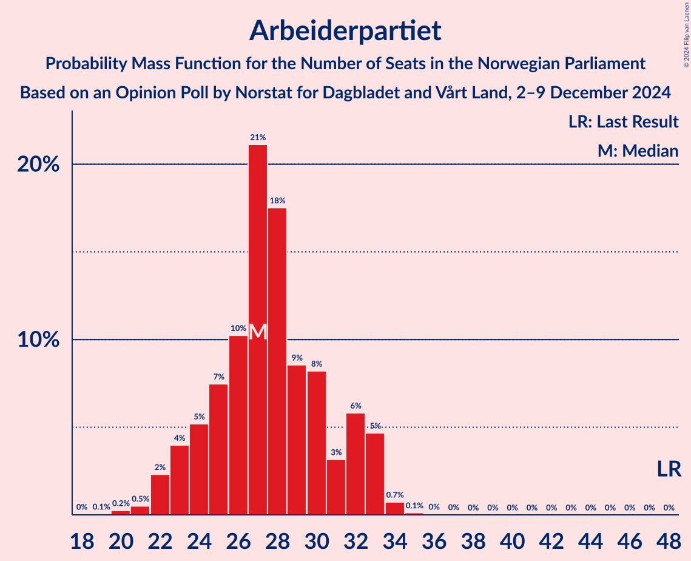
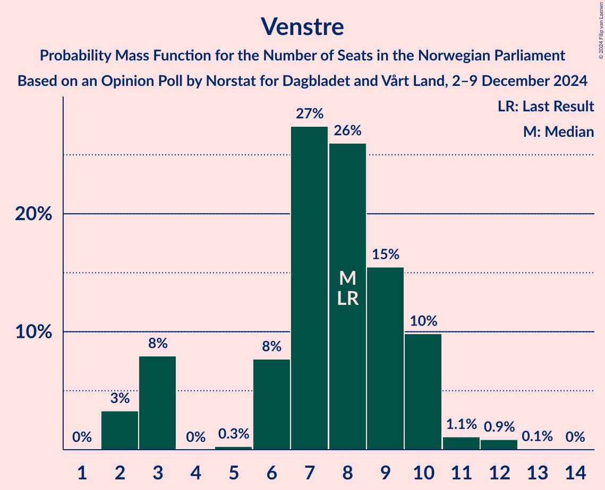
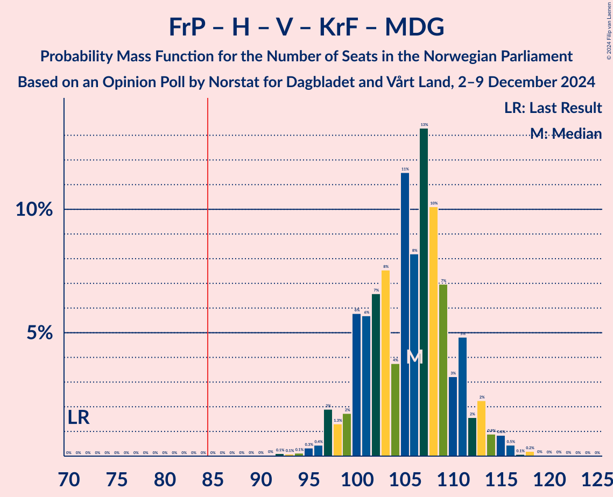
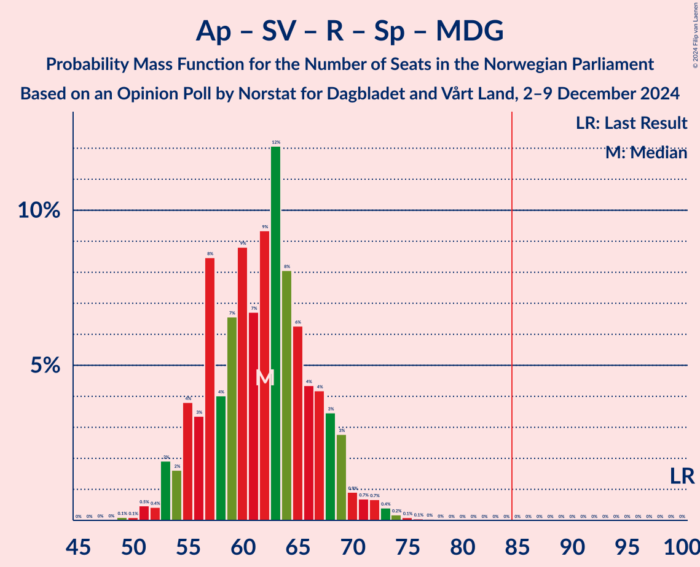
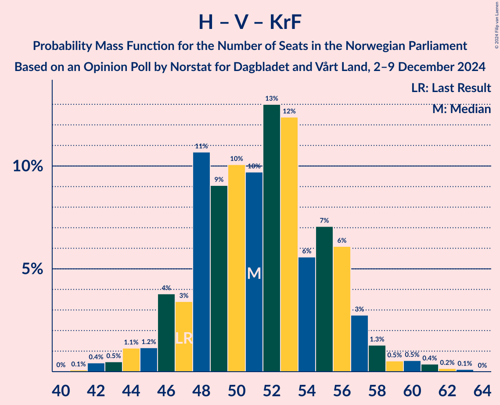

# Opinion Poll by Norstat for Dagbladet and Vårt Land, 2–9 December 2024

<a href="#voting-intentions">Voting Intentions</a> | <a href="#seats">Seats</a> | <a href="#coalitions">Coalitions</a> | <a href="#technical-information">Technical Information</a>

## Voting Intentions

### Confidence Intervals

| Party | Last Result | Poll Result | 80% Confidence Interval | 90% Confidence Interval | 95% Confidence Interval | 99% Confidence Interval |
|:-----:|:-----------:|:-----------:|:-----------------------:|:-----------------------:|:-----------------------:|:-----------------------:|
| Fremskrittspartiet | 11.6% | 27.4% | 25.6–29.3% |25.1–29.8% |24.7–30.3% |23.9–31.2% |
| Høyre | 20.4% | 21.5% | 19.9–23.2% |19.4–23.7% |19.1–24.2% |18.3–25.0% |
| Arbeiderpartiet | 26.2% | 14.2% | 12.9–15.7% |12.5–16.1% |12.2–16.5% |11.6–17.3% |
| Sosialistisk Venstreparti | 7.6% | 11.0% | 9.8–12.4% |9.5–12.8% |9.2–13.1% |8.7–13.8% |
| Rødt | 4.7% | 5.5% | 4.7–6.5% |4.4–6.8% |4.3–7.1% |3.9–7.6% |
| Venstre | 4.6% | 4.7% | 3.9–5.7% |3.7–6.0% |3.6–6.2% |3.2–6.7% |
| Kristelig Folkeparti | 3.8% | 4.3% | 3.6–5.2% |3.4–5.5% |3.2–5.7% |2.9–6.2% |
| Senterpartiet | 13.5% | 3.8% | 3.1–4.7% |2.9–5.0% |2.8–5.2% |2.5–5.6% |
| Miljøpartiet De Grønne | 3.9% | 3.5% | 2.9–4.4% |2.7–4.6% |2.5–4.8% |2.2–5.3% |

*Note:* The poll result column reflects the actual value used in the calculations. Published results may vary slightly, and in addition be rounded to fewer digits.

## Seats

### Confidence Intervals

| Party | Last Result | Median | 80% Confidence Interval | 90% Confidence Interval | 95% Confidence Interval | 99% Confidence Interval |
|:-----:|:-----------:|:------:|:-----------------------:|:-----------------------:|:-----------------------:|:-----------------------:|
| <a href="#fremskrittspartiet">Fremskrittspartiet</a> | 21 | 51 | 47–55 |46–56 |45–57 |43–58 |
| <a href="#høyre">Høyre</a> | 36 | 37 | 35–41 |34–42 |34–43 |33–45 |
| <a href="#arbeiderpartiet">Arbeiderpartiet</a> | 48 | 27 | 25–32 |24–33 |23–33 |21–34 |
| <a href="#sosialistisk-venstreparti">Sosialistisk Venstreparti</a> | 13 | 19 | 16–22 |15–23 |14–23 |13–25 |
| <a href="#rødt">Rødt</a> | 8 | 9 | 7–11 |7–11 |7–12 |1–14 |
| <a href="#venstre">Venstre</a> | 8 | 8 | 3–10 |2–10 |2–10 |2–12 |
| <a href="#kristelig-folkeparti">Kristelig Folkeparti</a> | 3 | 7 | 2–9 |2–9 |2–10 |1–10 |
| <a href="#senterpartiet">Senterpartiet</a> | 28 | 0 | 0–8 |0–8 |0–9 |0–10 |
| <a href="#miljøpartiet-de-grønne">Miljøpartiet De Grønne</a> | 3 | 2 | 1–7 |1–7 |1–8 |1–10 |

### Fremskrittspartiet

*For a full overview of the results for this party, see the [Fremskrittspartiet](party-fremskrittspartiet.html) page.*

| Number of Seats | Probability | Accumulated | Special Marks |
|:---------------:|:-----------:|:-----------:|:-------------:|
| 21 | 0% | 100% | Last Result |
| 22 | 0% | 100% |  |
| 23 | 0% | 100% |  |
| 24 | 0% | 100% |  |
| 25 | 0% | 100% |  |
| 26 | 0% | 100% |  |
| 27 | 0% | 100% |  |
| 28 | 0% | 100% |  |
| 29 | 0% | 100% |  |
| 30 | 0% | 100% |  |
| 31 | 0% | 100% |  |
| 32 | 0% | 100% |  |
| 33 | 0% | 100% |  |
| 34 | 0% | 100% |  |
| 35 | 0% | 100% |  |
| 36 | 0% | 100% |  |
| 37 | 0% | 100% |  |
| 38 | 0% | 100% |  |
| 39 | 0% | 100% |  |
| 40 | 0% | 100% |  |
| 41 | 0% | 100% |  |
| 42 | 0.3% | 99.9% |  |
| 43 | 0.5% | 99.6% |  |
| 44 | 1.4% | 99.1% |  |
| 45 | 1.2% | 98% |  |
| 46 | 6% | 97% |  |
| 47 | 3% | 91% |  |
| 48 | 7% | 88% |  |
| 49 | 7% | 81% |  |
| 50 | 14% | 73% |  |
| 51 | 16% | 59% | Median |
| 52 | 14% | 43% |  |
| 53 | 7% | 29% |  |
| 54 | 9% | 22% |  |
| 55 | 5% | 13% |  |
| 56 | 3% | 8% |  |
| 57 | 3% | 5% |  |
| 58 | 2% | 2% |  |
| 59 | 0.1% | 0.3% |  |
| 60 | 0% | 0.1% |  |
| 61 | 0% | 0.1% |  |
| 62 | 0% | 0% |  |

### Høyre

*For a full overview of the results for this party, see the [Høyre](party-høyre.html) page.*

| Number of Seats | Probability | Accumulated | Special Marks |
|:---------------:|:-----------:|:-----------:|:-------------:|
| 33 | 2% | 100% |  |
| 34 | 5% | 98% |  |
| 35 | 12% | 93% |  |
| 36 | 13% | 81% | Last Result |
| 37 | 23% | 68% | Median |
| 38 | 17% | 45% |  |
| 39 | 8% | 28% |  |
| 40 | 7% | 20% |  |
| 41 | 4% | 13% |  |
| 42 | 6% | 9% |  |
| 43 | 1.4% | 3% |  |
| 44 | 0.9% | 2% |  |
| 45 | 0.4% | 0.9% |  |
| 46 | 0.2% | 0.5% |  |
| 47 | 0.2% | 0.3% |  |
| 48 | 0% | 0.1% |  |
| 49 | 0% | 0% |  |

### Arbeiderpartiet

*For a full overview of the results for this party, see the [Arbeiderpartiet](party-arbeiderpartiet.html) page.*

| Number of Seats | Probability | Accumulated | Special Marks |
|:---------------:|:-----------:|:-----------:|:-------------:|
| 18 | 0.1% | 100% |  |
| 19 | 0.1% | 99.9% |  |
| 20 | 0.1% | 99.8% |  |
| 21 | 0.3% | 99.7% |  |
| 22 | 0.9% | 99.4% |  |
| 23 | 2% | 98.5% |  |
| 24 | 5% | 96% |  |
| 25 | 8% | 91% |  |
| 26 | 11% | 83% |  |
| 27 | 24% | 73% | Median |
| 28 | 12% | 49% |  |
| 29 | 9% | 36% |  |
| 30 | 6% | 28% |  |
| 31 | 5% | 22% |  |
| 32 | 11% | 17% |  |
| 33 | 5% | 6% |  |
| 34 | 0.4% | 0.7% |  |
| 35 | 0.2% | 0.3% |  |
| 36 | 0.1% | 0.1% |  |
| 37 | 0% | 0% |  |
| 38 | 0% | 0% |  |
| 39 | 0% | 0% |  |
| 40 | 0% | 0% |  |
| 41 | 0% | 0% |  |
| 42 | 0% | 0% |  |
| 43 | 0% | 0% |  |
| 44 | 0% | 0% |  |
| 45 | 0% | 0% |  |
| 46 | 0% | 0% |  |
| 47 | 0% | 0% |  |
| 48 | 0% | 0% | Last Result |

### Sosialistisk Venstreparti

*For a full overview of the results for this party, see the [Sosialistisk Venstreparti](party-sosialistiskvenstreparti.html) page.*

| Number of Seats | Probability | Accumulated | Special Marks |
|:---------------:|:-----------:|:-----------:|:-------------:|
| 12 | 0.2% | 100% |  |
| 13 | 2% | 99.8% | Last Result |
| 14 | 2% | 98% |  |
| 15 | 4% | 96% |  |
| 16 | 4% | 92% |  |
| 17 | 6% | 88% |  |
| 18 | 10% | 81% |  |
| 19 | 29% | 72% | Median |
| 20 | 21% | 43% |  |
| 21 | 11% | 22% |  |
| 22 | 5% | 11% |  |
| 23 | 4% | 6% |  |
| 24 | 0.9% | 2% |  |
| 25 | 0.4% | 0.8% |  |
| 26 | 0.1% | 0.3% |  |
| 27 | 0.2% | 0.2% |  |
| 28 | 0% | 0% |  |

### Rødt

*For a full overview of the results for this party, see the [Rødt](party-rødt.html) page.*

| Number of Seats | Probability | Accumulated | Special Marks |
|:---------------:|:-----------:|:-----------:|:-------------:|
| 1 | 0.7% | 100% |  |
| 2 | 0% | 99.3% |  |
| 3 | 0% | 99.3% |  |
| 4 | 0% | 99.3% |  |
| 5 | 0.4% | 99.3% |  |
| 6 | 1.3% | 98.8% |  |
| 7 | 9% | 98% |  |
| 8 | 20% | 89% | Last Result |
| 9 | 25% | 69% | Median |
| 10 | 24% | 44% |  |
| 11 | 15% | 20% |  |
| 12 | 3% | 5% |  |
| 13 | 0.9% | 2% |  |
| 14 | 0.6% | 0.6% |  |
| 15 | 0% | 0% |  |

### Venstre

*For a full overview of the results for this party, see the [Venstre](party-venstre.html) page.*

| Number of Seats | Probability | Accumulated | Special Marks |
|:---------------:|:-----------:|:-----------:|:-------------:|
| 2 | 5% | 100% |  |
| 3 | 11% | 95% |  |
| 4 | 0% | 84% |  |
| 5 | 0.1% | 84% |  |
| 6 | 8% | 84% |  |
| 7 | 21% | 76% |  |
| 8 | 31% | 55% | Last Result, Median |
| 9 | 10% | 24% |  |
| 10 | 12% | 14% |  |
| 11 | 1.2% | 2% |  |
| 12 | 0.5% | 0.6% |  |
| 13 | 0.1% | 0.1% |  |
| 14 | 0% | 0% |  |

### Kristelig Folkeparti

*For a full overview of the results for this party, see the [Kristelig Folkeparti](party-kristeligfolkeparti.html) page.*

| Number of Seats | Probability | Accumulated | Special Marks |
|:---------------:|:-----------:|:-----------:|:-------------:|
| 1 | 0.7% | 100% |  |
| 2 | 13% | 99.3% |  |
| 3 | 21% | 87% | Last Result |
| 4 | 0% | 65% |  |
| 5 | 0% | 65% |  |
| 6 | 11% | 65% |  |
| 7 | 20% | 54% | Median |
| 8 | 22% | 34% |  |
| 9 | 7% | 12% |  |
| 10 | 4% | 5% |  |
| 11 | 0.2% | 0.3% |  |
| 12 | 0.1% | 0.1% |  |
| 13 | 0% | 0% |  |

### Senterpartiet

*For a full overview of the results for this party, see the [Senterpartiet](party-senterpartiet.html) page.*

| Number of Seats | Probability | Accumulated | Special Marks |
|:---------------:|:-----------:|:-----------:|:-------------:|
| 0 | 53% | 100% | Median |
| 1 | 8% | 47% |  |
| 2 | 0.4% | 39% |  |
| 3 | 0% | 39% |  |
| 4 | 0% | 39% |  |
| 5 | 2% | 39% |  |
| 6 | 7% | 37% |  |
| 7 | 19% | 30% |  |
| 8 | 8% | 11% |  |
| 9 | 2% | 3% |  |
| 10 | 0.4% | 0.5% |  |
| 11 | 0.1% | 0.1% |  |
| 12 | 0% | 0% |  |
| 13 | 0% | 0% |  |
| 14 | 0% | 0% |  |
| 15 | 0% | 0% |  |
| 16 | 0% | 0% |  |
| 17 | 0% | 0% |  |
| 18 | 0% | 0% |  |
| 19 | 0% | 0% |  |
| 20 | 0% | 0% |  |
| 21 | 0% | 0% |  |
| 22 | 0% | 0% |  |
| 23 | 0% | 0% |  |
| 24 | 0% | 0% |  |
| 25 | 0% | 0% |  |
| 26 | 0% | 0% |  |
| 27 | 0% | 0% |  |
| 28 | 0% | 0% | Last Result |

### Miljøpartiet De Grønne

*For a full overview of the results for this party, see the [Miljøpartiet De Grønne](party-miljøpartietdegrønne.html) page.*

| Number of Seats | Probability | Accumulated | Special Marks |
|:---------------:|:-----------:|:-----------:|:-------------:|
| 1 | 15% | 100% |  |
| 2 | 38% | 85% | Median |
| 3 | 23% | 47% | Last Result |
| 4 | 0% | 24% |  |
| 5 | 1.3% | 24% |  |
| 6 | 5% | 23% |  |
| 7 | 13% | 18% |  |
| 8 | 3% | 4% |  |
| 9 | 0.5% | 1.3% |  |
| 10 | 0.8% | 0.8% |  |
| 11 | 0% | 0% |  |

## Coalitions

### Confidence Intervals

| Coalition | Last Result | Median | Majority? | 80% Confidence Interval | 90% Confidence Interval | 95% Confidence Interval | 99% Confidence Interval |
|:---------:|:-----------:|:------:|:---------:|:-----------------------:|:-----------------------:|:-----------------------:|:-----------------------:|
| Fremskrittspartiet – Høyre – Venstre – Kristelig Folkeparti – Senterpartiet | 96 | 104 | 100% | 99–110 | 98–111 | 97–114 | 93–116 |
| Fremskrittspartiet – Høyre – Venstre – Kristelig Folkeparti – Miljøpartiet De Grønne | 71 | 105 | 100% | 99–110 | 97–112 | 97–113 | 95–116 |
| Fremskrittspartiet – Høyre – Venstre – Kristelig Folkeparti | 68 | 102 | 100% | 96–107 | 94–109 | 94–109 | 92–112 |
| Fremskrittspartiet – Høyre – Venstre | 65 | 96 | 99.9% | 91–101 | 90–102 | 88–103 | 85–106 |
| Fremskrittspartiet – Høyre | 57 | 89 | 84% | 84–94 | 83–94 | 82–96 | 80–98 |
| Arbeiderpartiet – Sosialistisk Venstreparti – Rødt – Senterpartiet – Miljøpartiet De Grønne | 100 | 63 | 0% | 57–68 | 55–69 | 54–70 | 52–73 |
| Arbeiderpartiet – Sosialistisk Venstreparti – Rødt – Miljøpartiet De Grønne | 72 | 60 | 0% | 54–65 | 52–67 | 51–68 | 46–70 |
| Arbeiderpartiet – Sosialistisk Venstreparti – Kristelig Folkeparti – Senterpartiet – Miljøpartiet De Grønne | 95 | 60 | 0% | 51–66 | 50–67 | 50–67 | 48–70 |
| Arbeiderpartiet – Sosialistisk Venstreparti – Rødt – Senterpartiet | 97 | 60 | 0% | 54–64 | 53–66 | 51–66 | 49–69 |
| Arbeiderpartiet – Sosialistisk Venstreparti – Senterpartiet – Miljøpartiet De Grønne | 92 | 53 | 0% | 48–59 | 46–60 | 45–61 | 42–65 |
| Høyre – Venstre – Kristelig Folkeparti | 47 | 50 | 0% | 46–56 | 45–57 | 44–58 | 43–61 |
| Arbeiderpartiet – Sosialistisk Venstreparti – Senterpartiet | 89 | 50 | 0% | 46–54 | 44–56 | 42–58 | 41–59 |
| Arbeiderpartiet – Sosialistisk Venstreparti | 61 | 47 | 0% | 43–52 | 41–53 | 40–55 | 37–55 |
| Arbeiderpartiet – Kristelig Folkeparti – Senterpartiet – Miljøpartiet De Grønne | 82 | 40 | 0% | 32–47 | 32–48 | 30–49 | 30–52 |
| Arbeiderpartiet – Kristelig Folkeparti – Senterpartiet | 79 | 37 | 0% | 30–42 | 29–44 | 29–45 | 28–48 |
| Arbeiderpartiet – Senterpartiet | 76 | 31 | 0% | 27–35 | 26–37 | 25–39 | 23–40 |
| Venstre – Kristelig Folkeparti – Senterpartiet | 39 | 16 | 0% | 11–22 | 10–23 | 6–24 | 5–26 |

### Fremskrittspartiet – Høyre – Venstre – Kristelig Folkeparti – Senterpartiet

| Number of Seats | Probability | Accumulated | Special Marks |
|:---------------:|:-----------:|:-----------:|:-------------:|
| 92 | 0.1% | 100% |  |
| 93 | 0.5% | 99.9% |  |
| 94 | 0.3% | 99.4% |  |
| 95 | 0.4% | 99.1% |  |
| 96 | 0.6% | 98.7% | Last Result |
| 97 | 2% | 98% |  |
| 98 | 6% | 96% |  |
| 99 | 2% | 91% |  |
| 100 | 10% | 89% |  |
| 101 | 5% | 79% |  |
| 102 | 8% | 74% |  |
| 103 | 8% | 66% | Median |
| 104 | 10% | 59% |  |
| 105 | 8% | 49% |  |
| 106 | 5% | 41% |  |
| 107 | 14% | 36% |  |
| 108 | 4% | 22% |  |
| 109 | 3% | 18% |  |
| 110 | 5% | 15% |  |
| 111 | 5% | 10% |  |
| 112 | 0.9% | 5% |  |
| 113 | 1.5% | 4% |  |
| 114 | 0.4% | 3% |  |
| 115 | 0.9% | 2% |  |
| 116 | 1.0% | 1.2% |  |
| 117 | 0.1% | 0.2% |  |
| 118 | 0% | 0.1% |  |
| 119 | 0% | 0.1% |  |
| 120 | 0% | 0.1% |  |
| 121 | 0% | 0.1% |  |
| 122 | 0% | 0% |  |

### Fremskrittspartiet – Høyre – Venstre – Kristelig Folkeparti – Miljøpartiet De Grønne

| Number of Seats | Probability | Accumulated | Special Marks |
|:---------------:|:-----------:|:-----------:|:-------------:|
| 71 | 0% | 100% | Last Result |
| 72 | 0% | 100% |  |
| 73 | 0% | 100% |  |
| 74 | 0% | 100% |  |
| 75 | 0% | 100% |  |
| 76 | 0% | 100% |  |
| 77 | 0% | 100% |  |
| 78 | 0% | 100% |  |
| 79 | 0% | 100% |  |
| 80 | 0% | 100% |  |
| 81 | 0% | 100% |  |
| 82 | 0% | 100% |  |
| 83 | 0% | 100% |  |
| 84 | 0% | 100% |  |
| 85 | 0% | 100% | Majority |
| 86 | 0% | 100% |  |
| 87 | 0% | 100% |  |
| 88 | 0% | 100% |  |
| 89 | 0% | 100% |  |
| 90 | 0% | 100% |  |
| 91 | 0.1% | 100% |  |
| 92 | 0% | 99.9% |  |
| 93 | 0.1% | 99.9% |  |
| 94 | 0.1% | 99.7% |  |
| 95 | 0.6% | 99.6% |  |
| 96 | 0.4% | 98.9% |  |
| 97 | 5% | 98.5% |  |
| 98 | 1.2% | 93% |  |
| 99 | 3% | 92% |  |
| 100 | 6% | 89% |  |
| 101 | 4% | 83% |  |
| 102 | 6% | 79% |  |
| 103 | 12% | 73% |  |
| 104 | 3% | 61% |  |
| 105 | 8% | 58% | Median |
| 106 | 11% | 50% |  |
| 107 | 12% | 39% |  |
| 108 | 7% | 28% |  |
| 109 | 8% | 21% |  |
| 110 | 3% | 13% |  |
| 111 | 3% | 10% |  |
| 112 | 3% | 6% |  |
| 113 | 2% | 3% |  |
| 114 | 0.5% | 2% |  |
| 115 | 0.4% | 1.2% |  |
| 116 | 0.6% | 0.8% |  |
| 117 | 0.1% | 0.3% |  |
| 118 | 0.1% | 0.2% |  |
| 119 | 0% | 0% |  |

### Fremskrittspartiet – Høyre – Venstre – Kristelig Folkeparti

| Number of Seats | Probability | Accumulated | Special Marks |
|:---------------:|:-----------:|:-----------:|:-------------:|
| 68 | 0% | 100% | Last Result |
| 69 | 0% | 100% |  |
| 70 | 0% | 100% |  |
| 71 | 0% | 100% |  |
| 72 | 0% | 100% |  |
| 73 | 0% | 100% |  |
| 74 | 0% | 100% |  |
| 75 | 0% | 100% |  |
| 76 | 0% | 100% |  |
| 77 | 0% | 100% |  |
| 78 | 0% | 100% |  |
| 79 | 0% | 100% |  |
| 80 | 0% | 100% |  |
| 81 | 0% | 100% |  |
| 82 | 0% | 100% |  |
| 83 | 0% | 100% |  |
| 84 | 0% | 100% |  |
| 85 | 0% | 100% | Majority |
| 86 | 0% | 100% |  |
| 87 | 0% | 100% |  |
| 88 | 0.1% | 100% |  |
| 89 | 0% | 99.9% |  |
| 90 | 0.1% | 99.8% |  |
| 91 | 0.2% | 99.8% |  |
| 92 | 0.3% | 99.6% |  |
| 93 | 0.8% | 99.3% |  |
| 94 | 5% | 98.5% |  |
| 95 | 3% | 94% |  |
| 96 | 2% | 91% |  |
| 97 | 3% | 89% |  |
| 98 | 8% | 85% |  |
| 99 | 6% | 77% |  |
| 100 | 14% | 71% |  |
| 101 | 5% | 57% |  |
| 102 | 8% | 52% |  |
| 103 | 5% | 44% | Median |
| 104 | 14% | 39% |  |
| 105 | 5% | 24% |  |
| 106 | 5% | 19% |  |
| 107 | 8% | 14% |  |
| 108 | 1.1% | 7% |  |
| 109 | 3% | 6% |  |
| 110 | 0.9% | 2% |  |
| 111 | 0.8% | 1.5% |  |
| 112 | 0.3% | 0.7% |  |
| 113 | 0.2% | 0.4% |  |
| 114 | 0.1% | 0.3% |  |
| 115 | 0.1% | 0.1% |  |
| 116 | 0% | 0% |  |

### Fremskrittspartiet – Høyre – Venstre

| Number of Seats | Probability | Accumulated | Special Marks |
|:---------------:|:-----------:|:-----------:|:-------------:|
| 65 | 0% | 100% | Last Result |
| 66 | 0% | 100% |  |
| 67 | 0% | 100% |  |
| 68 | 0% | 100% |  |
| 69 | 0% | 100% |  |
| 70 | 0% | 100% |  |
| 71 | 0% | 100% |  |
| 72 | 0% | 100% |  |
| 73 | 0% | 100% |  |
| 74 | 0% | 100% |  |
| 75 | 0% | 100% |  |
| 76 | 0% | 100% |  |
| 77 | 0% | 100% |  |
| 78 | 0% | 100% |  |
| 79 | 0% | 100% |  |
| 80 | 0% | 100% |  |
| 81 | 0% | 100% |  |
| 82 | 0% | 100% |  |
| 83 | 0% | 100% |  |
| 84 | 0.1% | 100% |  |
| 85 | 0.6% | 99.9% | Majority |
| 86 | 0.2% | 99.3% |  |
| 87 | 0.7% | 99.0% |  |
| 88 | 0.9% | 98% |  |
| 89 | 1.4% | 97% |  |
| 90 | 3% | 96% |  |
| 91 | 11% | 93% |  |
| 92 | 4% | 83% |  |
| 93 | 9% | 79% |  |
| 94 | 6% | 69% |  |
| 95 | 10% | 63% |  |
| 96 | 10% | 53% | Median |
| 97 | 7% | 43% |  |
| 98 | 8% | 36% |  |
| 99 | 7% | 28% |  |
| 100 | 9% | 21% |  |
| 101 | 5% | 12% |  |
| 102 | 4% | 7% |  |
| 103 | 1.3% | 4% |  |
| 104 | 1.2% | 2% |  |
| 105 | 0.5% | 1.2% |  |
| 106 | 0.2% | 0.7% |  |
| 107 | 0.3% | 0.5% |  |
| 108 | 0.1% | 0.2% |  |
| 109 | 0.1% | 0.1% |  |
| 110 | 0% | 0% |  |

### Fremskrittspartiet – Høyre

| Number of Seats | Probability | Accumulated | Special Marks |
|:---------------:|:-----------:|:-----------:|:-------------:|
| 57 | 0% | 100% | Last Result |
| 58 | 0% | 100% |  |
| 59 | 0% | 100% |  |
| 60 | 0% | 100% |  |
| 61 | 0% | 100% |  |
| 62 | 0% | 100% |  |
| 63 | 0% | 100% |  |
| 64 | 0% | 100% |  |
| 65 | 0% | 100% |  |
| 66 | 0% | 100% |  |
| 67 | 0% | 100% |  |
| 68 | 0% | 100% |  |
| 69 | 0% | 100% |  |
| 70 | 0% | 100% |  |
| 71 | 0% | 100% |  |
| 72 | 0% | 100% |  |
| 73 | 0% | 100% |  |
| 74 | 0% | 100% |  |
| 75 | 0% | 100% |  |
| 76 | 0% | 100% |  |
| 77 | 0% | 100% |  |
| 78 | 0.2% | 100% |  |
| 79 | 0.2% | 99.8% |  |
| 80 | 0.3% | 99.6% |  |
| 81 | 1.2% | 99.3% |  |
| 82 | 2% | 98% |  |
| 83 | 4% | 97% |  |
| 84 | 8% | 92% |  |
| 85 | 8% | 84% | Majority |
| 86 | 5% | 77% |  |
| 87 | 9% | 72% |  |
| 88 | 7% | 63% | Median |
| 89 | 14% | 56% |  |
| 90 | 10% | 42% |  |
| 91 | 13% | 32% |  |
| 92 | 5% | 20% |  |
| 93 | 3% | 15% |  |
| 94 | 8% | 12% |  |
| 95 | 2% | 5% |  |
| 96 | 0.8% | 3% |  |
| 97 | 0.8% | 2% |  |
| 98 | 0.6% | 0.9% |  |
| 99 | 0.1% | 0.3% |  |
| 100 | 0.1% | 0.2% |  |
| 101 | 0% | 0.1% |  |
| 102 | 0% | 0% |  |

### Arbeiderpartiet – Sosialistisk Venstreparti – Rødt – Senterpartiet – Miljøpartiet De Grønne

| Number of Seats | Probability | Accumulated | Special Marks |
|:---------------:|:-----------:|:-----------:|:-------------:|
| 49 | 0% | 100% |  |
| 50 | 0.2% | 99.9% |  |
| 51 | 0.1% | 99.8% |  |
| 52 | 1.0% | 99.7% |  |
| 53 | 0.9% | 98.7% |  |
| 54 | 2% | 98% |  |
| 55 | 1.1% | 96% |  |
| 56 | 4% | 95% |  |
| 57 | 5% | 91% | Median |
| 58 | 6% | 86% |  |
| 59 | 5% | 80% |  |
| 60 | 11% | 75% |  |
| 61 | 3% | 65% |  |
| 62 | 10% | 62% |  |
| 63 | 10% | 52% |  |
| 64 | 12% | 41% |  |
| 65 | 5% | 29% |  |
| 66 | 5% | 25% |  |
| 67 | 5% | 20% |  |
| 68 | 8% | 15% |  |
| 69 | 3% | 7% |  |
| 70 | 2% | 4% |  |
| 71 | 0.5% | 2% |  |
| 72 | 0.6% | 2% |  |
| 73 | 0.8% | 1.1% |  |
| 74 | 0.1% | 0.3% |  |
| 75 | 0.1% | 0.2% |  |
| 76 | 0% | 0.1% |  |
| 77 | 0% | 0% |  |
| 78 | 0% | 0% |  |
| 79 | 0% | 0% |  |
| 80 | 0% | 0% |  |
| 81 | 0% | 0% |  |
| 82 | 0% | 0% |  |
| 83 | 0% | 0% |  |
| 84 | 0% | 0% |  |
| 85 | 0% | 0% | Majority |
| 86 | 0% | 0% |  |
| 87 | 0% | 0% |  |
| 88 | 0% | 0% |  |
| 89 | 0% | 0% |  |
| 90 | 0% | 0% |  |
| 91 | 0% | 0% |  |
| 92 | 0% | 0% |  |
| 93 | 0% | 0% |  |
| 94 | 0% | 0% |  |
| 95 | 0% | 0% |  |
| 96 | 0% | 0% |  |
| 97 | 0% | 0% |  |
| 98 | 0% | 0% |  |
| 99 | 0% | 0% |  |
| 100 | 0% | 0% | Last Result |

### Arbeiderpartiet – Sosialistisk Venstreparti – Rødt – Miljøpartiet De Grønne

| Number of Seats | Probability | Accumulated | Special Marks |
|:---------------:|:-----------:|:-----------:|:-------------:|
| 45 | 0% | 100% |  |
| 46 | 0.5% | 99.9% |  |
| 47 | 0.1% | 99.4% |  |
| 48 | 0.1% | 99.3% |  |
| 49 | 0.5% | 99.2% |  |
| 50 | 0.5% | 98.7% |  |
| 51 | 2% | 98% |  |
| 52 | 2% | 96% |  |
| 53 | 3% | 94% |  |
| 54 | 4% | 92% |  |
| 55 | 3% | 88% |  |
| 56 | 4% | 85% |  |
| 57 | 14% | 80% | Median |
| 58 | 5% | 66% |  |
| 59 | 6% | 61% |  |
| 60 | 13% | 55% |  |
| 61 | 9% | 42% |  |
| 62 | 9% | 33% |  |
| 63 | 7% | 24% |  |
| 64 | 7% | 17% |  |
| 65 | 3% | 11% |  |
| 66 | 0.9% | 7% |  |
| 67 | 2% | 6% |  |
| 68 | 4% | 5% |  |
| 69 | 0.4% | 1.0% |  |
| 70 | 0.2% | 0.6% |  |
| 71 | 0.4% | 0.4% |  |
| 72 | 0% | 0% | Last Result |

### Arbeiderpartiet – Sosialistisk Venstreparti – Kristelig Folkeparti – Senterpartiet – Miljøpartiet De Grønne

| Number of Seats | Probability | Accumulated | Special Marks |
|:---------------:|:-----------:|:-----------:|:-------------:|
| 46 | 0.3% | 100% |  |
| 47 | 0.1% | 99.7% |  |
| 48 | 0.4% | 99.6% |  |
| 49 | 1.0% | 99.2% |  |
| 50 | 4% | 98% |  |
| 51 | 5% | 94% |  |
| 52 | 2% | 90% |  |
| 53 | 3% | 88% |  |
| 54 | 2% | 84% |  |
| 55 | 2% | 83% | Median |
| 56 | 6% | 80% |  |
| 57 | 5% | 74% |  |
| 58 | 8% | 69% |  |
| 59 | 9% | 61% |  |
| 60 | 16% | 53% |  |
| 61 | 9% | 37% |  |
| 62 | 5% | 27% |  |
| 63 | 8% | 22% |  |
| 64 | 2% | 14% |  |
| 65 | 2% | 12% |  |
| 66 | 2% | 10% |  |
| 67 | 5% | 8% |  |
| 68 | 0.9% | 2% |  |
| 69 | 0.8% | 2% |  |
| 70 | 0.4% | 0.8% |  |
| 71 | 0.1% | 0.4% |  |
| 72 | 0.2% | 0.3% |  |
| 73 | 0.1% | 0.1% |  |
| 74 | 0% | 0% |  |
| 75 | 0% | 0% |  |
| 76 | 0% | 0% |  |
| 77 | 0% | 0% |  |
| 78 | 0% | 0% |  |
| 79 | 0% | 0% |  |
| 80 | 0% | 0% |  |
| 81 | 0% | 0% |  |
| 82 | 0% | 0% |  |
| 83 | 0% | 0% |  |
| 84 | 0% | 0% |  |
| 85 | 0% | 0% | Majority |
| 86 | 0% | 0% |  |
| 87 | 0% | 0% |  |
| 88 | 0% | 0% |  |
| 89 | 0% | 0% |  |
| 90 | 0% | 0% |  |
| 91 | 0% | 0% |  |
| 92 | 0% | 0% |  |
| 93 | 0% | 0% |  |
| 94 | 0% | 0% |  |
| 95 | 0% | 0% | Last Result |

### Arbeiderpartiet – Sosialistisk Venstreparti – Rødt – Senterpartiet

| Number of Seats | Probability | Accumulated | Special Marks |
|:---------------:|:-----------:|:-----------:|:-------------:|
| 45 | 0% | 100% |  |
| 46 | 0% | 99.9% |  |
| 47 | 0.2% | 99.9% |  |
| 48 | 0.1% | 99.7% |  |
| 49 | 0.3% | 99.6% |  |
| 50 | 1.1% | 99.3% |  |
| 51 | 1.0% | 98% |  |
| 52 | 1.3% | 97% |  |
| 53 | 3% | 96% |  |
| 54 | 4% | 93% |  |
| 55 | 7% | 89% | Median |
| 56 | 7% | 81% |  |
| 57 | 12% | 74% |  |
| 58 | 6% | 62% |  |
| 59 | 4% | 56% |  |
| 60 | 10% | 52% |  |
| 61 | 16% | 43% |  |
| 62 | 7% | 26% |  |
| 63 | 7% | 19% |  |
| 64 | 4% | 12% |  |
| 65 | 2% | 9% |  |
| 66 | 4% | 6% |  |
| 67 | 1.3% | 2% |  |
| 68 | 0.4% | 1.2% |  |
| 69 | 0.5% | 0.8% |  |
| 70 | 0.2% | 0.3% |  |
| 71 | 0.1% | 0.1% |  |
| 72 | 0% | 0% |  |
| 73 | 0% | 0% |  |
| 74 | 0% | 0% |  |
| 75 | 0% | 0% |  |
| 76 | 0% | 0% |  |
| 77 | 0% | 0% |  |
| 78 | 0% | 0% |  |
| 79 | 0% | 0% |  |
| 80 | 0% | 0% |  |
| 81 | 0% | 0% |  |
| 82 | 0% | 0% |  |
| 83 | 0% | 0% |  |
| 84 | 0% | 0% |  |
| 85 | 0% | 0% | Majority |
| 86 | 0% | 0% |  |
| 87 | 0% | 0% |  |
| 88 | 0% | 0% |  |
| 89 | 0% | 0% |  |
| 90 | 0% | 0% |  |
| 91 | 0% | 0% |  |
| 92 | 0% | 0% |  |
| 93 | 0% | 0% |  |
| 94 | 0% | 0% |  |
| 95 | 0% | 0% |  |
| 96 | 0% | 0% |  |
| 97 | 0% | 0% | Last Result |

### Arbeiderpartiet – Sosialistisk Venstreparti – Senterpartiet – Miljøpartiet De Grønne

| Number of Seats | Probability | Accumulated | Special Marks |
|:---------------:|:-----------:|:-----------:|:-------------:|
| 41 | 0.2% | 100% |  |
| 42 | 0.4% | 99.8% |  |
| 43 | 0.4% | 99.5% |  |
| 44 | 0.7% | 99.0% |  |
| 45 | 2% | 98% |  |
| 46 | 3% | 97% |  |
| 47 | 2% | 94% |  |
| 48 | 8% | 92% | Median |
| 49 | 7% | 84% |  |
| 50 | 3% | 78% |  |
| 51 | 8% | 75% |  |
| 52 | 8% | 67% |  |
| 53 | 13% | 59% |  |
| 54 | 9% | 47% |  |
| 55 | 11% | 38% |  |
| 56 | 4% | 27% |  |
| 57 | 8% | 23% |  |
| 58 | 4% | 16% |  |
| 59 | 3% | 12% |  |
| 60 | 5% | 9% |  |
| 61 | 2% | 3% |  |
| 62 | 0.2% | 2% |  |
| 63 | 0.3% | 1.3% |  |
| 64 | 0.2% | 1.1% |  |
| 65 | 0.8% | 0.8% |  |
| 66 | 0% | 0.1% |  |
| 67 | 0% | 0% |  |
| 68 | 0% | 0% |  |
| 69 | 0% | 0% |  |
| 70 | 0% | 0% |  |
| 71 | 0% | 0% |  |
| 72 | 0% | 0% |  |
| 73 | 0% | 0% |  |
| 74 | 0% | 0% |  |
| 75 | 0% | 0% |  |
| 76 | 0% | 0% |  |
| 77 | 0% | 0% |  |
| 78 | 0% | 0% |  |
| 79 | 0% | 0% |  |
| 80 | 0% | 0% |  |
| 81 | 0% | 0% |  |
| 82 | 0% | 0% |  |
| 83 | 0% | 0% |  |
| 84 | 0% | 0% |  |
| 85 | 0% | 0% | Majority |
| 86 | 0% | 0% |  |
| 87 | 0% | 0% |  |
| 88 | 0% | 0% |  |
| 89 | 0% | 0% |  |
| 90 | 0% | 0% |  |
| 91 | 0% | 0% |  |
| 92 | 0% | 0% | Last Result |

### Høyre – Venstre – Kristelig Folkeparti

| Number of Seats | Probability | Accumulated | Special Marks |
|:---------------:|:-----------:|:-----------:|:-------------:|
| 40 | 0.1% | 100% |  |
| 41 | 0% | 99.9% |  |
| 42 | 0.3% | 99.9% |  |
| 43 | 1.2% | 99.6% |  |
| 44 | 3% | 98% |  |
| 45 | 1.2% | 96% |  |
| 46 | 6% | 94% |  |
| 47 | 5% | 88% | Last Result |
| 48 | 13% | 83% |  |
| 49 | 14% | 70% |  |
| 50 | 8% | 57% |  |
| 51 | 9% | 49% |  |
| 52 | 8% | 40% | Median |
| 53 | 13% | 32% |  |
| 54 | 5% | 19% |  |
| 55 | 4% | 14% |  |
| 56 | 3% | 10% |  |
| 57 | 4% | 7% |  |
| 58 | 2% | 4% |  |
| 59 | 0.5% | 2% |  |
| 60 | 0.3% | 1.1% |  |
| 61 | 0.4% | 0.8% |  |
| 62 | 0.3% | 0.4% |  |
| 63 | 0.1% | 0.1% |  |
| 64 | 0% | 0% |  |

### Arbeiderpartiet – Sosialistisk Venstreparti – Senterpartiet

| Number of Seats | Probability | Accumulated | Special Marks |
|:---------------:|:-----------:|:-----------:|:-------------:|
| 38 | 0.1% | 100% |  |
| 39 | 0.2% | 99.9% |  |
| 40 | 0.1% | 99.7% |  |
| 41 | 0.9% | 99.6% |  |
| 42 | 1.2% | 98.7% |  |
| 43 | 1.3% | 97% |  |
| 44 | 2% | 96% |  |
| 45 | 3% | 94% |  |
| 46 | 10% | 90% | Median |
| 47 | 10% | 81% |  |
| 48 | 7% | 71% |  |
| 49 | 7% | 63% |  |
| 50 | 13% | 56% |  |
| 51 | 5% | 43% |  |
| 52 | 11% | 38% |  |
| 53 | 12% | 28% |  |
| 54 | 7% | 16% |  |
| 55 | 4% | 9% |  |
| 56 | 1.1% | 6% |  |
| 57 | 1.3% | 5% |  |
| 58 | 2% | 3% |  |
| 59 | 1.0% | 1.3% |  |
| 60 | 0.2% | 0.3% |  |
| 61 | 0.1% | 0.2% |  |
| 62 | 0% | 0.1% |  |
| 63 | 0% | 0% |  |
| 64 | 0% | 0% |  |
| 65 | 0% | 0% |  |
| 66 | 0% | 0% |  |
| 67 | 0% | 0% |  |
| 68 | 0% | 0% |  |
| 69 | 0% | 0% |  |
| 70 | 0% | 0% |  |
| 71 | 0% | 0% |  |
| 72 | 0% | 0% |  |
| 73 | 0% | 0% |  |
| 74 | 0% | 0% |  |
| 75 | 0% | 0% |  |
| 76 | 0% | 0% |  |
| 77 | 0% | 0% |  |
| 78 | 0% | 0% |  |
| 79 | 0% | 0% |  |
| 80 | 0% | 0% |  |
| 81 | 0% | 0% |  |
| 82 | 0% | 0% |  |
| 83 | 0% | 0% |  |
| 84 | 0% | 0% |  |
| 85 | 0% | 0% | Majority |
| 86 | 0% | 0% |  |
| 87 | 0% | 0% |  |
| 88 | 0% | 0% |  |
| 89 | 0% | 0% | Last Result |

### Arbeiderpartiet – Sosialistisk Venstreparti

| Number of Seats | Probability | Accumulated | Special Marks |
|:---------------:|:-----------:|:-----------:|:-------------:|
| 35 | 0.1% | 100% |  |
| 36 | 0.1% | 99.9% |  |
| 37 | 0.9% | 99.8% |  |
| 38 | 0.5% | 98.9% |  |
| 39 | 0.9% | 98% |  |
| 40 | 2% | 98% |  |
| 41 | 2% | 96% |  |
| 42 | 1.5% | 94% |  |
| 43 | 4% | 92% |  |
| 44 | 6% | 89% |  |
| 45 | 9% | 83% |  |
| 46 | 20% | 73% | Median |
| 47 | 12% | 53% |  |
| 48 | 8% | 41% |  |
| 49 | 8% | 34% |  |
| 50 | 12% | 26% |  |
| 51 | 2% | 14% |  |
| 52 | 6% | 11% |  |
| 53 | 2% | 5% |  |
| 54 | 0.5% | 3% |  |
| 55 | 3% | 3% |  |
| 56 | 0.1% | 0.2% |  |
| 57 | 0.1% | 0.1% |  |
| 58 | 0% | 0% |  |
| 59 | 0% | 0% |  |
| 60 | 0% | 0% |  |
| 61 | 0% | 0% | Last Result |

### Arbeiderpartiet – Kristelig Folkeparti – Senterpartiet – Miljøpartiet De Grønne

| Number of Seats | Probability | Accumulated | Special Marks |
|:---------------:|:-----------:|:-----------:|:-------------:|
| 27 | 0.1% | 100% |  |
| 28 | 0.1% | 99.9% |  |
| 29 | 0.2% | 99.8% |  |
| 30 | 4% | 99.7% |  |
| 31 | 0.4% | 96% |  |
| 32 | 6% | 95% |  |
| 33 | 1.3% | 89% |  |
| 34 | 1.2% | 88% |  |
| 35 | 3% | 87% |  |
| 36 | 2% | 83% | Median |
| 37 | 9% | 82% |  |
| 38 | 4% | 73% |  |
| 39 | 16% | 69% |  |
| 40 | 9% | 53% |  |
| 41 | 12% | 44% |  |
| 42 | 7% | 32% |  |
| 43 | 2% | 25% |  |
| 44 | 3% | 23% |  |
| 45 | 6% | 20% |  |
| 46 | 4% | 14% |  |
| 47 | 2% | 10% |  |
| 48 | 5% | 8% |  |
| 49 | 2% | 3% |  |
| 50 | 0.3% | 1.4% |  |
| 51 | 0.6% | 1.1% |  |
| 52 | 0.4% | 0.5% |  |
| 53 | 0% | 0.2% |  |
| 54 | 0.1% | 0.1% |  |
| 55 | 0% | 0% |  |
| 56 | 0% | 0% |  |
| 57 | 0% | 0% |  |
| 58 | 0% | 0% |  |
| 59 | 0% | 0% |  |
| 60 | 0% | 0% |  |
| 61 | 0% | 0% |  |
| 62 | 0% | 0% |  |
| 63 | 0% | 0% |  |
| 64 | 0% | 0% |  |
| 65 | 0% | 0% |  |
| 66 | 0% | 0% |  |
| 67 | 0% | 0% |  |
| 68 | 0% | 0% |  |
| 69 | 0% | 0% |  |
| 70 | 0% | 0% |  |
| 71 | 0% | 0% |  |
| 72 | 0% | 0% |  |
| 73 | 0% | 0% |  |
| 74 | 0% | 0% |  |
| 75 | 0% | 0% |  |
| 76 | 0% | 0% |  |
| 77 | 0% | 0% |  |
| 78 | 0% | 0% |  |
| 79 | 0% | 0% |  |
| 80 | 0% | 0% |  |
| 81 | 0% | 0% |  |
| 82 | 0% | 0% | Last Result |

### Arbeiderpartiet – Kristelig Folkeparti – Senterpartiet

| Number of Seats | Probability | Accumulated | Special Marks |
|:---------------:|:-----------:|:-----------:|:-------------:|
| 24 | 0% | 100% |  |
| 25 | 0.1% | 99.9% |  |
| 26 | 0.1% | 99.8% |  |
| 27 | 0.1% | 99.8% |  |
| 28 | 1.3% | 99.7% |  |
| 29 | 7% | 98% |  |
| 30 | 2% | 91% |  |
| 31 | 4% | 89% |  |
| 32 | 2% | 85% |  |
| 33 | 5% | 83% |  |
| 34 | 3% | 77% | Median |
| 35 | 8% | 74% |  |
| 36 | 8% | 66% |  |
| 37 | 16% | 59% |  |
| 38 | 10% | 43% |  |
| 39 | 11% | 33% |  |
| 40 | 6% | 22% |  |
| 41 | 5% | 17% |  |
| 42 | 4% | 11% |  |
| 43 | 0.8% | 8% |  |
| 44 | 3% | 7% |  |
| 45 | 1.5% | 4% |  |
| 46 | 0.4% | 2% |  |
| 47 | 1.1% | 2% |  |
| 48 | 0.6% | 0.8% |  |
| 49 | 0.1% | 0.2% |  |
| 50 | 0.2% | 0.2% |  |
| 51 | 0% | 0% |  |
| 52 | 0% | 0% |  |
| 53 | 0% | 0% |  |
| 54 | 0% | 0% |  |
| 55 | 0% | 0% |  |
| 56 | 0% | 0% |  |
| 57 | 0% | 0% |  |
| 58 | 0% | 0% |  |
| 59 | 0% | 0% |  |
| 60 | 0% | 0% |  |
| 61 | 0% | 0% |  |
| 62 | 0% | 0% |  |
| 63 | 0% | 0% |  |
| 64 | 0% | 0% |  |
| 65 | 0% | 0% |  |
| 66 | 0% | 0% |  |
| 67 | 0% | 0% |  |
| 68 | 0% | 0% |  |
| 69 | 0% | 0% |  |
| 70 | 0% | 0% |  |
| 71 | 0% | 0% |  |
| 72 | 0% | 0% |  |
| 73 | 0% | 0% |  |
| 74 | 0% | 0% |  |
| 75 | 0% | 0% |  |
| 76 | 0% | 0% |  |
| 77 | 0% | 0% |  |
| 78 | 0% | 0% |  |
| 79 | 0% | 0% | Last Result |

### Arbeiderpartiet – Senterpartiet

| Number of Seats | Probability | Accumulated | Special Marks |
|:---------------:|:-----------:|:-----------:|:-------------:|
| 21 | 0.1% | 100% |  |
| 22 | 0.2% | 99.9% |  |
| 23 | 0.4% | 99.8% |  |
| 24 | 1.3% | 99.4% |  |
| 25 | 3% | 98% |  |
| 26 | 2% | 95% |  |
| 27 | 15% | 93% | Median |
| 28 | 11% | 78% |  |
| 29 | 9% | 67% |  |
| 30 | 5% | 58% |  |
| 31 | 5% | 53% |  |
| 32 | 15% | 48% |  |
| 33 | 8% | 33% |  |
| 34 | 12% | 25% |  |
| 35 | 4% | 13% |  |
| 36 | 3% | 9% |  |
| 37 | 1.3% | 6% |  |
| 38 | 2% | 5% |  |
| 39 | 2% | 3% |  |
| 40 | 0.8% | 1.3% |  |
| 41 | 0.3% | 0.5% |  |
| 42 | 0.1% | 0.1% |  |
| 43 | 0% | 0% |  |
| 44 | 0% | 0% |  |
| 45 | 0% | 0% |  |
| 46 | 0% | 0% |  |
| 47 | 0% | 0% |  |
| 48 | 0% | 0% |  |
| 49 | 0% | 0% |  |
| 50 | 0% | 0% |  |
| 51 | 0% | 0% |  |
| 52 | 0% | 0% |  |
| 53 | 0% | 0% |  |
| 54 | 0% | 0% |  |
| 55 | 0% | 0% |  |
| 56 | 0% | 0% |  |
| 57 | 0% | 0% |  |
| 58 | 0% | 0% |  |
| 59 | 0% | 0% |  |
| 60 | 0% | 0% |  |
| 61 | 0% | 0% |  |
| 62 | 0% | 0% |  |
| 63 | 0% | 0% |  |
| 64 | 0% | 0% |  |
| 65 | 0% | 0% |  |
| 66 | 0% | 0% |  |
| 67 | 0% | 0% |  |
| 68 | 0% | 0% |  |
| 69 | 0% | 0% |  |
| 70 | 0% | 0% |  |
| 71 | 0% | 0% |  |
| 72 | 0% | 0% |  |
| 73 | 0% | 0% |  |
| 74 | 0% | 0% |  |
| 75 | 0% | 0% |  |
| 76 | 0% | 0% | Last Result |

### Venstre – Kristelig Folkeparti – Senterpartiet

| Number of Seats | Probability | Accumulated | Special Marks |
|:---------------:|:-----------:|:-----------:|:-------------:|
| 4 | 0.1% | 100% |  |
| 5 | 0.7% | 99.9% |  |
| 6 | 3% | 99.3% |  |
| 7 | 0% | 97% |  |
| 8 | 0.2% | 96% |  |
| 9 | 0.8% | 96% |  |
| 10 | 3% | 95% |  |
| 11 | 10% | 92% |  |
| 12 | 4% | 83% |  |
| 13 | 10% | 78% |  |
| 14 | 7% | 68% |  |
| 15 | 3% | 61% | Median |
| 16 | 13% | 58% |  |
| 17 | 10% | 45% |  |
| 18 | 6% | 35% |  |
| 19 | 8% | 29% |  |
| 20 | 8% | 21% |  |
| 21 | 3% | 13% |  |
| 22 | 5% | 10% |  |
| 23 | 2% | 5% |  |
| 24 | 1.1% | 3% |  |
| 25 | 0.7% | 2% |  |
| 26 | 0.6% | 0.9% |  |
| 27 | 0.1% | 0.3% |  |
| 28 | 0.1% | 0.2% |  |
| 29 | 0% | 0% |  |
| 30 | 0% | 0% |  |
| 31 | 0% | 0% |  |
| 32 | 0% | 0% |  |
| 33 | 0% | 0% |  |
| 34 | 0% | 0% |  |
| 35 | 0% | 0% |  |
| 36 | 0% | 0% |  |
| 37 | 0% | 0% |  |
| 38 | 0% | 0% |  |
| 39 | 0% | 0% | Last Result |

## Technical Information

### Opinion Poll

+ **Polling firm:** Norstat
+ **Commissioner(s):** Dagbladet and Vårt Land
+ **Fieldwork period:** 2–9 December 2024

### Calculations

+ **Sample size:** 1000
+ **Simulations done:** 524,288
+ **Error estimate:** 1.33%

