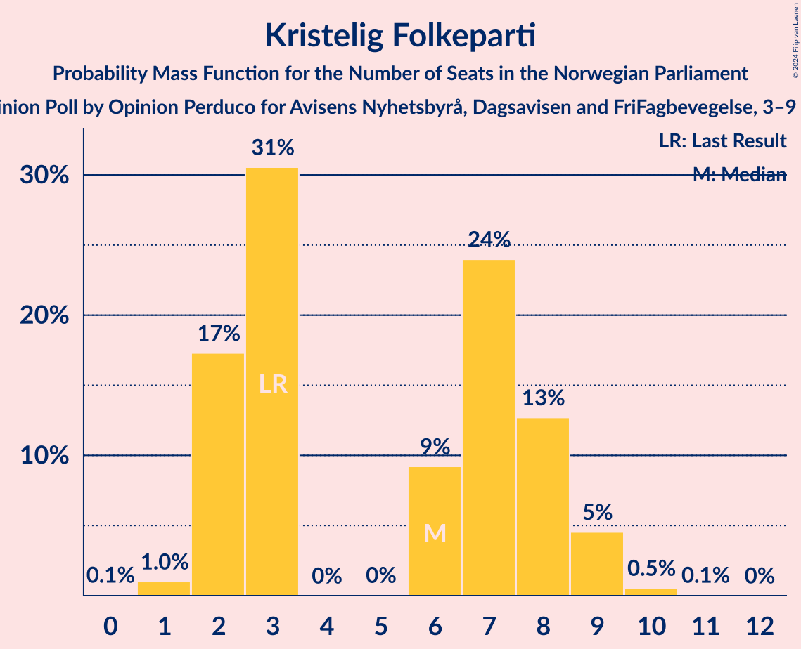
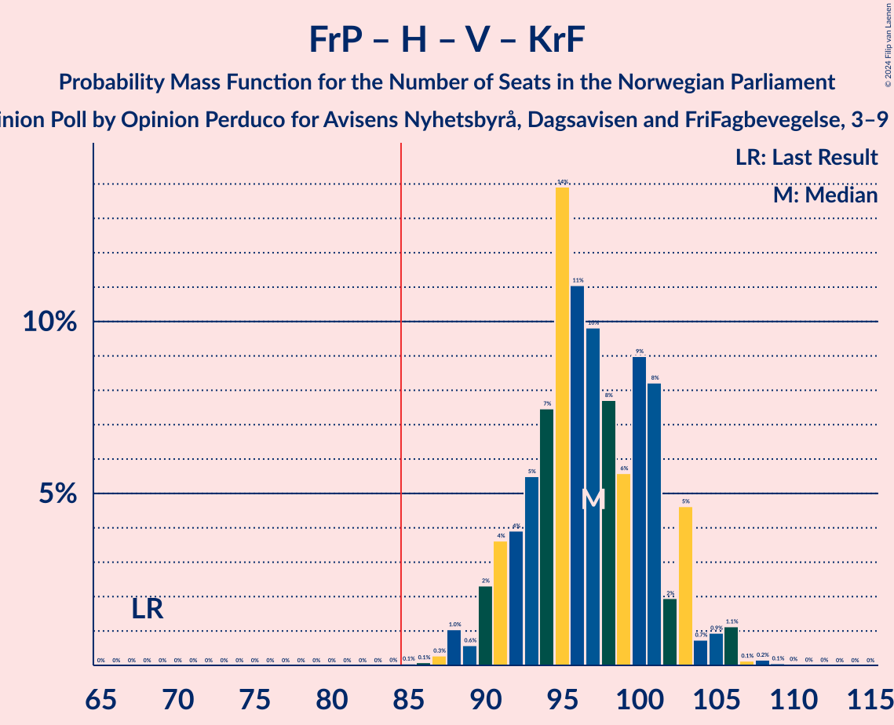
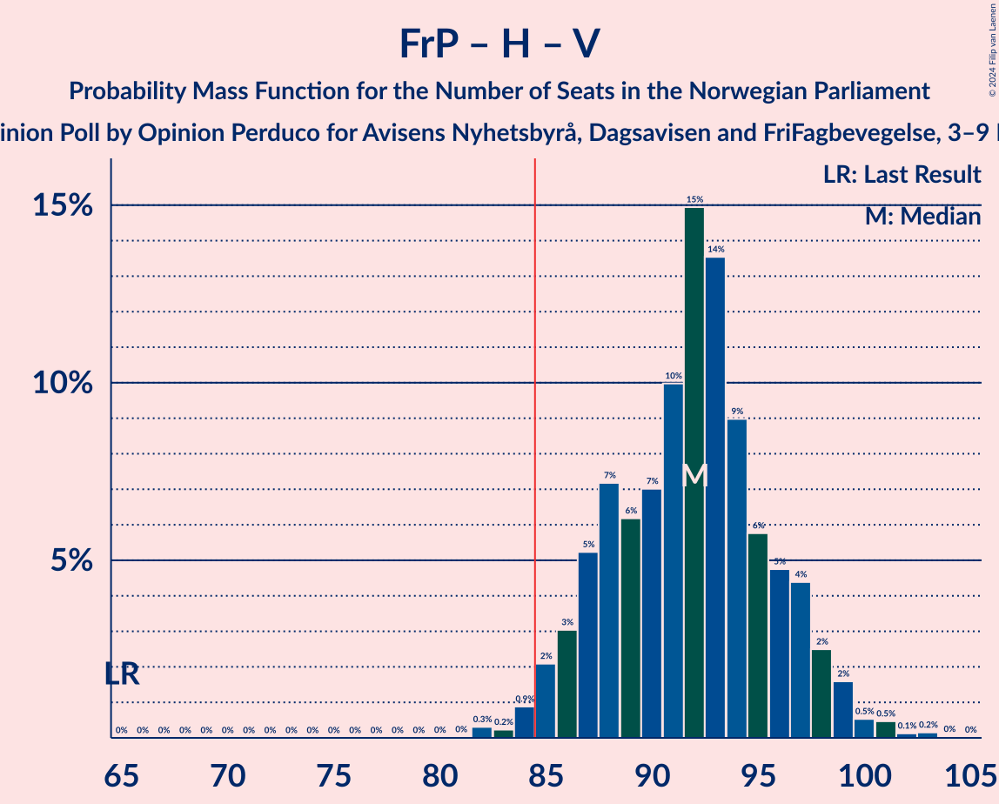
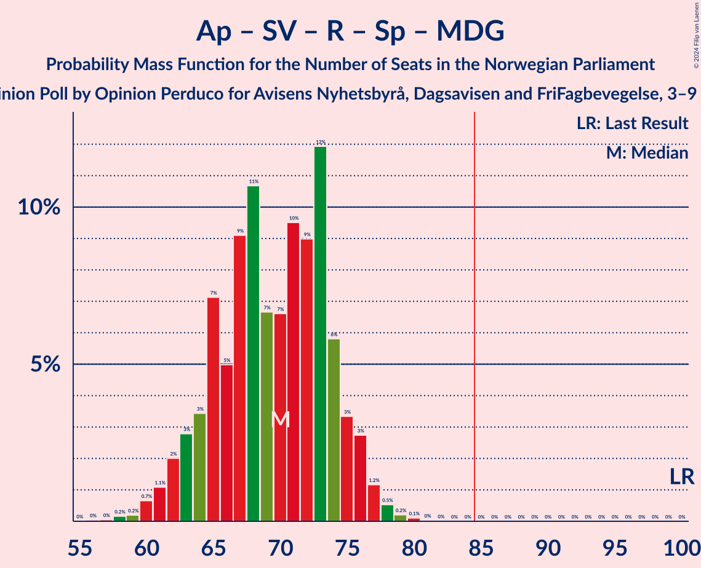
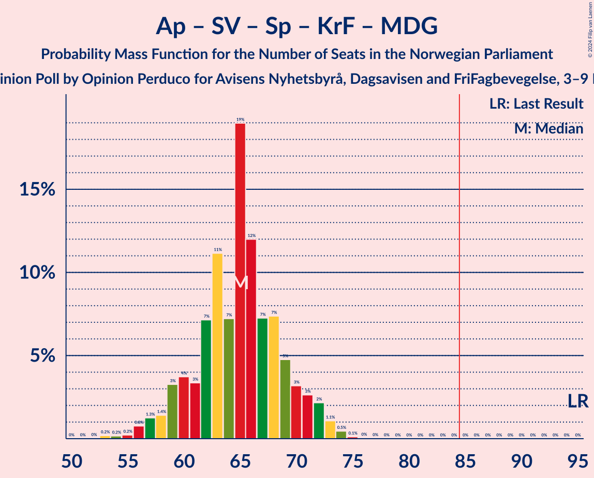
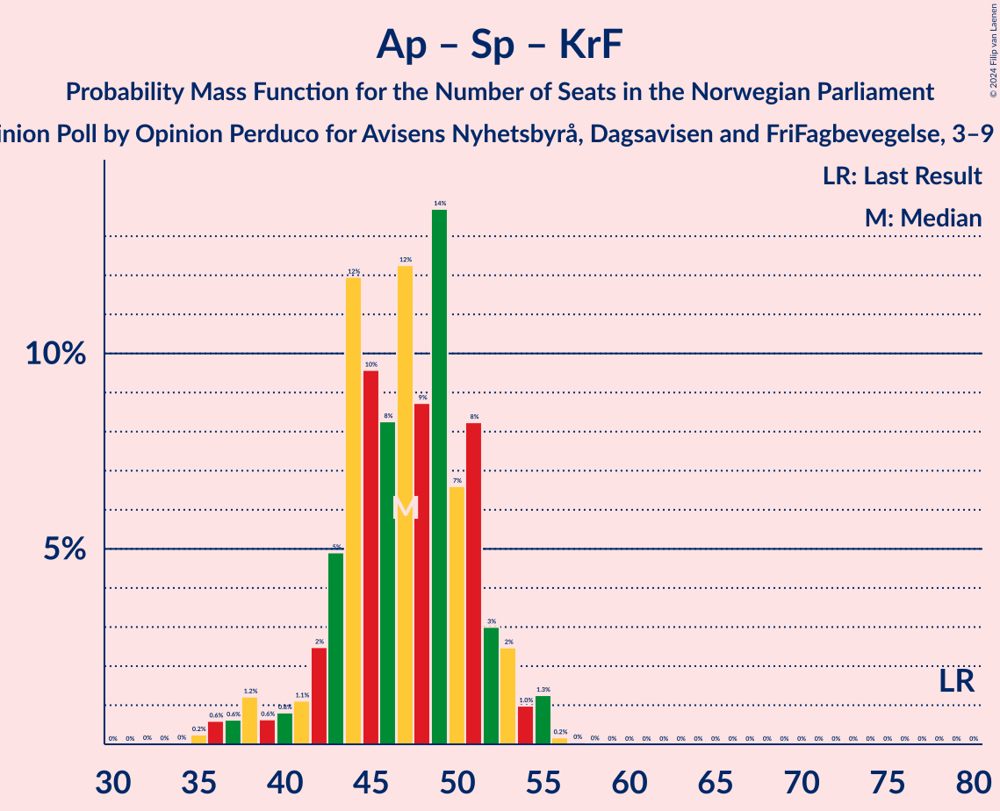

# Opinion Poll by Opinion Perduco for Avisens Nyhetsbyrå, Dagsavisen and FriFagbevegelse, 3–9 December 2024

<a href="#voting-intentions">Voting Intentions</a> | <a href="#seats">Seats</a> | <a href="#coalitions">Coalitions</a> | <a href="#technical-information">Technical Information</a>

## Voting Intentions

### Confidence Intervals

| Party | Last Result | Poll Result | 80% Confidence Interval | 90% Confidence Interval | 95% Confidence Interval | 99% Confidence Interval |
|:-----:|:-----------:|:-----------:|:-----------------------:|:-----------------------:|:-----------------------:|:-----------------------:|
| Fremskrittspartiet | 11.6% | 25.3% | 23.6–27.1% |23.1–27.6% |22.7–28.1% |21.9–29.0% |
| Høyre | 20.4% | 20.5% | 18.9–22.2% |18.5–22.7% |18.1–23.1% |17.4–24.0% |
| Arbeiderpartiet | 26.2% | 17.7% | 16.2–19.3% |15.8–19.8% |15.5–20.2% |14.8–21.0% |
| Sosialistisk Venstreparti | 7.6% | 9.4% | 8.3–10.7% |8.0–11.1% |7.7–11.4% |7.2–12.0% |
| Venstre | 4.6% | 5.8% | 5.0–6.9% |4.7–7.2% |4.5–7.4% |4.1–8.0% |
| Rødt | 4.7% | 5.7% | 4.9–6.8% |4.6–7.1% |4.4–7.3% |4.1–7.9% |
| Senterpartiet | 13.5% | 4.9% | 4.1–5.9% |3.9–6.2% |3.7–6.4% |3.4–6.9% |
| Kristelig Folkeparti | 3.8% | 4.0% | 3.3–4.9% |3.1–5.2% |2.9–5.4% |2.7–5.9% |
| Miljøpartiet De Grønne | 3.9% | 3.1% | 2.5–3.9% |2.3–4.2% |2.2–4.4% |1.9–4.8% |

*Note:* The poll result column reflects the actual value used in the calculations. Published results may vary slightly, and in addition be rounded to fewer digits.

## Seats

### Confidence Intervals

| Party | Last Result | Median | 80% Confidence Interval | 90% Confidence Interval | 95% Confidence Interval | 99% Confidence Interval |
|:-----:|:-----------:|:------:|:-----------------------:|:-----------------------:|:-----------------------:|:-----------------------:|
| <a href="#fremskrittspartiet">Fremskrittspartiet</a> | 21 | 46 | 42–50 |42–52 |42–52 |41–54 |
| <a href="#høyre">Høyre</a> | 36 | 36 | 33–39 |33–40 |32–41 |31–42 |
| <a href="#arbeiderpartiet">Arbeiderpartiet</a> | 48 | 34 | 32–37 |32–37 |31–37 |28–39 |
| <a href="#sosialistisk-venstreparti">Sosialistisk Venstreparti</a> | 13 | 16 | 13–18 |12–19 |12–20 |11–21 |
| <a href="#venstre">Venstre</a> | 8 | 10 | 8–11 |7–12 |7–13 |6–13 |
| <a href="#rødt">Rødt</a> | 8 | 9 | 7–12 |7–12 |7–12 |6–14 |
| <a href="#senterpartiet">Senterpartiet</a> | 28 | 8 | 6–10 |0–10 |0–11 |0–12 |
| <a href="#kristelig-folkeparti">Kristelig Folkeparti</a> | 3 | 6 | 2–8 |2–8 |2–9 |1–10 |
| <a href="#miljøpartiet-de-grønne">Miljøpartiet De Grønne</a> | 3 | 2 | 1–3 |1–6 |1–7 |1–8 |

### Fremskrittspartiet

*For a full overview of the results for this party, see the [Fremskrittspartiet](party-fremskrittspartiet.html) page.*

| Number of Seats | Probability | Accumulated | Special Marks |
|:---------------:|:-----------:|:-----------:|:-------------:|
| 21 | 0% | 100% | Last Result |
| 22 | 0% | 100% |  |
| 23 | 0% | 100% |  |
| 24 | 0% | 100% |  |
| 25 | 0% | 100% |  |
| 26 | 0% | 100% |  |
| 27 | 0% | 100% |  |
| 28 | 0% | 100% |  |
| 29 | 0% | 100% |  |
| 30 | 0% | 100% |  |
| 31 | 0% | 100% |  |
| 32 | 0% | 100% |  |
| 33 | 0% | 100% |  |
| 34 | 0% | 100% |  |
| 35 | 0% | 100% |  |
| 36 | 0% | 100% |  |
| 37 | 0% | 100% |  |
| 38 | 0% | 100% |  |
| 39 | 0.1% | 100% |  |
| 40 | 0.3% | 99.9% |  |
| 41 | 0.9% | 99.6% |  |
| 42 | 10% | 98.7% |  |
| 43 | 5% | 88% |  |
| 44 | 12% | 83% |  |
| 45 | 16% | 71% |  |
| 46 | 8% | 55% | Median |
| 47 | 15% | 47% |  |
| 48 | 15% | 33% |  |
| 49 | 5% | 18% |  |
| 50 | 5% | 12% |  |
| 51 | 2% | 7% |  |
| 52 | 4% | 5% |  |
| 53 | 1.1% | 2% |  |
| 54 | 0.2% | 0.5% |  |
| 55 | 0.2% | 0.4% |  |
| 56 | 0.1% | 0.1% |  |
| 57 | 0% | 0.1% |  |
| 58 | 0% | 0% |  |

### Høyre

*For a full overview of the results for this party, see the [Høyre](party-høyre.html) page.*

| Number of Seats | Probability | Accumulated | Special Marks |
|:---------------:|:-----------:|:-----------:|:-------------:|
| 30 | 0.2% | 100% |  |
| 31 | 0.8% | 99.8% |  |
| 32 | 4% | 99.0% |  |
| 33 | 10% | 95% |  |
| 34 | 18% | 85% |  |
| 35 | 12% | 67% |  |
| 36 | 9% | 55% | Last Result, Median |
| 37 | 15% | 46% |  |
| 38 | 10% | 31% |  |
| 39 | 14% | 21% |  |
| 40 | 3% | 7% |  |
| 41 | 2% | 4% |  |
| 42 | 1.2% | 2% |  |
| 43 | 0.2% | 0.4% |  |
| 44 | 0.1% | 0.2% |  |
| 45 | 0.1% | 0.1% |  |
| 46 | 0% | 0% |  |

### Arbeiderpartiet

*For a full overview of the results for this party, see the [Arbeiderpartiet](party-arbeiderpartiet.html) page.*

| Number of Seats | Probability | Accumulated | Special Marks |
|:---------------:|:-----------:|:-----------:|:-------------:|
| 26 | 0.1% | 100% |  |
| 27 | 0.2% | 99.8% |  |
| 28 | 0.2% | 99.6% |  |
| 29 | 0.4% | 99.4% |  |
| 30 | 0.7% | 99.0% |  |
| 31 | 1.4% | 98% |  |
| 32 | 11% | 97% |  |
| 33 | 23% | 86% |  |
| 34 | 17% | 63% | Median |
| 35 | 16% | 46% |  |
| 36 | 16% | 30% |  |
| 37 | 12% | 15% |  |
| 38 | 2% | 2% |  |
| 39 | 0.4% | 0.7% |  |
| 40 | 0.2% | 0.3% |  |
| 41 | 0.1% | 0.1% |  |
| 42 | 0% | 0% |  |
| 43 | 0% | 0% |  |
| 44 | 0% | 0% |  |
| 45 | 0% | 0% |  |
| 46 | 0% | 0% |  |
| 47 | 0% | 0% |  |
| 48 | 0% | 0% | Last Result |

### Sosialistisk Venstreparti

*For a full overview of the results for this party, see the [Sosialistisk Venstreparti](party-sosialistiskvenstreparti.html) page.*

| Number of Seats | Probability | Accumulated | Special Marks |
|:---------------:|:-----------:|:-----------:|:-------------:|
| 9 | 0.1% | 100% |  |
| 10 | 0.3% | 99.9% |  |
| 11 | 2% | 99.6% |  |
| 12 | 6% | 98% |  |
| 13 | 9% | 92% | Last Result |
| 14 | 10% | 82% |  |
| 15 | 22% | 73% |  |
| 16 | 20% | 50% | Median |
| 17 | 9% | 30% |  |
| 18 | 13% | 21% |  |
| 19 | 5% | 8% |  |
| 20 | 2% | 3% |  |
| 21 | 0.7% | 1.0% |  |
| 22 | 0.3% | 0.3% |  |
| 23 | 0% | 0% |  |

### Venstre

*For a full overview of the results for this party, see the [Venstre](party-venstre.html) page.*

| Number of Seats | Probability | Accumulated | Special Marks |
|:---------------:|:-----------:|:-----------:|:-------------:|
| 3 | 0.4% | 100% |  |
| 4 | 0% | 99.6% |  |
| 5 | 0% | 99.6% |  |
| 6 | 0.5% | 99.6% |  |
| 7 | 5% | 99.2% |  |
| 8 | 16% | 95% | Last Result |
| 9 | 28% | 79% |  |
| 10 | 25% | 51% | Median |
| 11 | 17% | 26% |  |
| 12 | 5% | 9% |  |
| 13 | 4% | 4% |  |
| 14 | 0.3% | 0.4% |  |
| 15 | 0.1% | 0.1% |  |
| 16 | 0% | 0% |  |

### Rødt

*For a full overview of the results for this party, see the [Rødt](party-rødt.html) page.*

| Number of Seats | Probability | Accumulated | Special Marks |
|:---------------:|:-----------:|:-----------:|:-------------:|
| 1 | 0.3% | 100% |  |
| 2 | 0% | 99.7% |  |
| 3 | 0% | 99.7% |  |
| 4 | 0% | 99.7% |  |
| 5 | 0% | 99.7% |  |
| 6 | 0.7% | 99.6% |  |
| 7 | 11% | 98.9% |  |
| 8 | 16% | 88% | Last Result |
| 9 | 30% | 72% | Median |
| 10 | 16% | 42% |  |
| 11 | 12% | 26% |  |
| 12 | 13% | 14% |  |
| 13 | 1.3% | 2% |  |
| 14 | 0.4% | 0.5% |  |
| 15 | 0.1% | 0.1% |  |
| 16 | 0% | 0% |  |

### Senterpartiet

*For a full overview of the results for this party, see the [Senterpartiet](party-senterpartiet.html) page.*

| Number of Seats | Probability | Accumulated | Special Marks |
|:---------------:|:-----------:|:-----------:|:-------------:|
| 0 | 6% | 100% |  |
| 1 | 2% | 94% |  |
| 2 | 0% | 93% |  |
| 3 | 0% | 93% |  |
| 4 | 0% | 93% |  |
| 5 | 0.1% | 93% |  |
| 6 | 7% | 93% |  |
| 7 | 18% | 86% |  |
| 8 | 27% | 67% | Median |
| 9 | 25% | 41% |  |
| 10 | 11% | 15% |  |
| 11 | 3% | 4% |  |
| 12 | 1.1% | 1.3% |  |
| 13 | 0.2% | 0.2% |  |
| 14 | 0% | 0% |  |
| 15 | 0% | 0% |  |
| 16 | 0% | 0% |  |
| 17 | 0% | 0% |  |
| 18 | 0% | 0% |  |
| 19 | 0% | 0% |  |
| 20 | 0% | 0% |  |
| 21 | 0% | 0% |  |
| 22 | 0% | 0% |  |
| 23 | 0% | 0% |  |
| 24 | 0% | 0% |  |
| 25 | 0% | 0% |  |
| 26 | 0% | 0% |  |
| 27 | 0% | 0% |  |
| 28 | 0% | 0% | Last Result |

### Kristelig Folkeparti

*For a full overview of the results for this party, see the [Kristelig Folkeparti](party-kristeligfolkeparti.html) page.*

| Number of Seats | Probability | Accumulated | Special Marks |
|:---------------:|:-----------:|:-----------:|:-------------:|
| 0 | 0.1% | 100% |  |
| 1 | 1.2% | 99.9% |  |
| 2 | 19% | 98.8% |  |
| 3 | 29% | 80% | Last Result |
| 4 | 0% | 51% |  |
| 5 | 0.1% | 51% |  |
| 6 | 10% | 51% | Median |
| 7 | 25% | 42% |  |
| 8 | 14% | 17% |  |
| 9 | 2% | 3% |  |
| 10 | 0.6% | 0.6% |  |
| 11 | 0% | 0.1% |  |
| 12 | 0% | 0% |  |

### Miljøpartiet De Grønne

*For a full overview of the results for this party, see the [Miljøpartiet De Grønne](party-miljøpartietdegrønne.html) page.*

| Number of Seats | Probability | Accumulated | Special Marks |
|:---------------:|:-----------:|:-----------:|:-------------:|
| 0 | 0.1% | 100% |  |
| 1 | 31% | 99.9% |  |
| 2 | 50% | 69% | Median |
| 3 | 13% | 19% | Last Result |
| 4 | 0% | 7% |  |
| 5 | 0.3% | 7% |  |
| 6 | 2% | 6% |  |
| 7 | 3% | 4% |  |
| 8 | 0.9% | 1.0% |  |
| 9 | 0.1% | 0.1% |  |
| 10 | 0% | 0% |  |

## Coalitions

### Confidence Intervals

| Coalition | Last Result | Median | Majority? | 80% Confidence Interval | 90% Confidence Interval | 95% Confidence Interval | 99% Confidence Interval |
|:---------:|:-----------:|:------:|:---------:|:-----------------------:|:-----------------------:|:-----------------------:|:-----------------------:|
| Fremskrittspartiet – Høyre – Venstre – Senterpartiet – Kristelig Folkeparti | 96 | 105 | 100% | 100–110 | 99–111 | 98–111 | 96–114 |
| Fremskrittspartiet – Høyre – Venstre – Kristelig Folkeparti – Miljøpartiet De Grønne | 71 | 99 | 100% | 94–104 | 92–105 | 92–106 | 91–109 |
| Fremskrittspartiet – Høyre – Venstre – Kristelig Folkeparti | 68 | 97 | 100% | 92–102 | 91–103 | 90–103 | 88–106 |
| Fremskrittspartiet – Høyre – Venstre | 65 | 92 | 98% | 87–97 | 86–97 | 85–98 | 84–101 |
| Fremskrittspartiet – Høyre | 57 | 82 | 25% | 78–87 | 76–88 | 76–89 | 75–90 |
| Arbeiderpartiet – Sosialistisk Venstreparti – Rødt – Senterpartiet – Miljøpartiet De Grønne | 100 | 69 | 0% | 64–74 | 63–76 | 62–76 | 60–78 |
| Arbeiderpartiet – Sosialistisk Venstreparti – Rødt – Senterpartiet | 97 | 67 | 0% | 62–72 | 61–74 | 59–74 | 57–76 |
| Arbeiderpartiet – Sosialistisk Venstreparti – Senterpartiet – Kristelig Folkeparti – Miljøpartiet De Grønne | 95 | 65 | 0% | 60–69 | 59–71 | 58–72 | 55–73 |
| Arbeiderpartiet – Sosialistisk Venstreparti – Rødt – Miljøpartiet De Grønne | 72 | 62 | 0% | 57–66 | 57–67 | 55–68 | 54–70 |
| Arbeiderpartiet – Sosialistisk Venstreparti – Senterpartiet – Miljøpartiet De Grønne | 92 | 60 | 0% | 56–64 | 54–65 | 53–66 | 50–68 |
| Arbeiderpartiet – Sosialistisk Venstreparti – Senterpartiet | 89 | 58 | 0% | 54–62 | 52–63 | 51–63 | 49–65 |
| Høyre – Venstre – Kristelig Folkeparti | 47 | 51 | 0% | 46–55 | 45–56 | 45–57 | 43–59 |
| Arbeiderpartiet – Senterpartiet – Kristelig Folkeparti – Miljøpartiet De Grønne | 82 | 49 | 0% | 45–53 | 43–55 | 40–56 | 38–58 |
| Arbeiderpartiet – Sosialistisk Venstreparti | 61 | 50 | 0% | 47–53 | 46–54 | 45–55 | 43–56 |
| Arbeiderpartiet – Senterpartiet – Kristelig Folkeparti | 79 | 47 | 0% | 43–51 | 41–53 | 38–53 | 36–55 |
| Arbeiderpartiet – Senterpartiet | 76 | 42 | 0% | 39–46 | 35–46 | 35–46 | 33–48 |
| Venstre – Senterpartiet – Kristelig Folkeparti | 39 | 22 | 0% | 19–27 | 17–27 | 14–28 | 12–30 |

### Fremskrittspartiet – Høyre – Venstre – Senterpartiet – Kristelig Folkeparti

| Number of Seats | Probability | Accumulated | Special Marks |
|:---------------:|:-----------:|:-----------:|:-------------:|
| 92 | 0.1% | 100% |  |
| 93 | 0% | 99.9% |  |
| 94 | 0.1% | 99.9% |  |
| 95 | 0.2% | 99.8% |  |
| 96 | 0.4% | 99.6% | Last Result |
| 97 | 0.8% | 99.2% |  |
| 98 | 3% | 98% |  |
| 99 | 4% | 95% |  |
| 100 | 5% | 91% |  |
| 101 | 8% | 86% |  |
| 102 | 7% | 78% |  |
| 103 | 11% | 71% |  |
| 104 | 8% | 60% |  |
| 105 | 14% | 52% |  |
| 106 | 7% | 39% | Median |
| 107 | 7% | 31% |  |
| 108 | 5% | 25% |  |
| 109 | 9% | 20% |  |
| 110 | 5% | 11% |  |
| 111 | 4% | 5% |  |
| 112 | 0.7% | 1.3% |  |
| 113 | 0.2% | 0.7% |  |
| 114 | 0.3% | 0.5% |  |
| 115 | 0.1% | 0.2% |  |
| 116 | 0% | 0.1% |  |
| 117 | 0% | 0.1% |  |
| 118 | 0% | 0% |  |

### Fremskrittspartiet – Høyre – Venstre – Kristelig Folkeparti – Miljøpartiet De Grønne

| Number of Seats | Probability | Accumulated | Special Marks |
|:---------------:|:-----------:|:-----------:|:-------------:|
| 71 | 0% | 100% | Last Result |
| 72 | 0% | 100% |  |
| 73 | 0% | 100% |  |
| 74 | 0% | 100% |  |
| 75 | 0% | 100% |  |
| 76 | 0% | 100% |  |
| 77 | 0% | 100% |  |
| 78 | 0% | 100% |  |
| 79 | 0% | 100% |  |
| 80 | 0% | 100% |  |
| 81 | 0% | 100% |  |
| 82 | 0% | 100% |  |
| 83 | 0% | 100% |  |
| 84 | 0% | 100% |  |
| 85 | 0% | 100% | Majority |
| 86 | 0% | 100% |  |
| 87 | 0% | 100% |  |
| 88 | 0% | 99.9% |  |
| 89 | 0.1% | 99.9% |  |
| 90 | 0.2% | 99.8% |  |
| 91 | 1.1% | 99.5% |  |
| 92 | 4% | 98% |  |
| 93 | 3% | 95% |  |
| 94 | 6% | 91% |  |
| 95 | 6% | 86% |  |
| 96 | 9% | 80% |  |
| 97 | 7% | 71% |  |
| 98 | 7% | 64% |  |
| 99 | 11% | 57% |  |
| 100 | 11% | 46% | Median |
| 101 | 5% | 36% |  |
| 102 | 11% | 30% |  |
| 103 | 7% | 20% |  |
| 104 | 3% | 12% |  |
| 105 | 5% | 9% |  |
| 106 | 2% | 4% |  |
| 107 | 0.6% | 2% |  |
| 108 | 1.0% | 1.5% |  |
| 109 | 0.2% | 0.5% |  |
| 110 | 0.2% | 0.3% |  |
| 111 | 0.1% | 0.1% |  |
| 112 | 0% | 0.1% |  |
| 113 | 0% | 0% |  |

### Fremskrittspartiet – Høyre – Venstre – Kristelig Folkeparti

| Number of Seats | Probability | Accumulated | Special Marks |
|:---------------:|:-----------:|:-----------:|:-------------:|
| 68 | 0% | 100% | Last Result |
| 69 | 0% | 100% |  |
| 70 | 0% | 100% |  |
| 71 | 0% | 100% |  |
| 72 | 0% | 100% |  |
| 73 | 0% | 100% |  |
| 74 | 0% | 100% |  |
| 75 | 0% | 100% |  |
| 76 | 0% | 100% |  |
| 77 | 0% | 100% |  |
| 78 | 0% | 100% |  |
| 79 | 0% | 100% |  |
| 80 | 0% | 100% |  |
| 81 | 0% | 100% |  |
| 82 | 0% | 100% |  |
| 83 | 0% | 100% |  |
| 84 | 0% | 100% |  |
| 85 | 0.1% | 100% | Majority |
| 86 | 0.1% | 99.9% |  |
| 87 | 0.2% | 99.8% |  |
| 88 | 0.3% | 99.6% |  |
| 89 | 0.5% | 99.4% |  |
| 90 | 4% | 98.8% |  |
| 91 | 4% | 95% |  |
| 92 | 4% | 91% |  |
| 93 | 6% | 86% |  |
| 94 | 10% | 80% |  |
| 95 | 7% | 70% |  |
| 96 | 11% | 63% |  |
| 97 | 6% | 52% |  |
| 98 | 10% | 46% | Median |
| 99 | 6% | 36% |  |
| 100 | 9% | 29% |  |
| 101 | 10% | 21% |  |
| 102 | 2% | 10% |  |
| 103 | 6% | 8% |  |
| 104 | 0.8% | 2% |  |
| 105 | 0.5% | 2% |  |
| 106 | 0.5% | 1.0% |  |
| 107 | 0.2% | 0.5% |  |
| 108 | 0.2% | 0.3% |  |
| 109 | 0.1% | 0.1% |  |
| 110 | 0% | 0.1% |  |
| 111 | 0% | 0% |  |

### Fremskrittspartiet – Høyre – Venstre

| Number of Seats | Probability | Accumulated | Special Marks |
|:---------------:|:-----------:|:-----------:|:-------------:|
| 65 | 0% | 100% | Last Result |
| 66 | 0% | 100% |  |
| 67 | 0% | 100% |  |
| 68 | 0% | 100% |  |
| 69 | 0% | 100% |  |
| 70 | 0% | 100% |  |
| 71 | 0% | 100% |  |
| 72 | 0% | 100% |  |
| 73 | 0% | 100% |  |
| 74 | 0% | 100% |  |
| 75 | 0% | 100% |  |
| 76 | 0% | 100% |  |
| 77 | 0% | 100% |  |
| 78 | 0% | 100% |  |
| 79 | 0% | 100% |  |
| 80 | 0% | 100% |  |
| 81 | 0% | 100% |  |
| 82 | 0.1% | 100% |  |
| 83 | 0.3% | 99.9% |  |
| 84 | 1.3% | 99.6% |  |
| 85 | 2% | 98% | Majority |
| 86 | 3% | 96% |  |
| 87 | 6% | 93% |  |
| 88 | 7% | 87% |  |
| 89 | 4% | 79% |  |
| 90 | 7% | 76% |  |
| 91 | 12% | 68% |  |
| 92 | 10% | 57% | Median |
| 93 | 13% | 46% |  |
| 94 | 9% | 33% |  |
| 95 | 7% | 24% |  |
| 96 | 5% | 17% |  |
| 97 | 7% | 12% |  |
| 98 | 3% | 5% |  |
| 99 | 1.1% | 2% |  |
| 100 | 0.4% | 1.1% |  |
| 101 | 0.3% | 0.7% |  |
| 102 | 0.1% | 0.4% |  |
| 103 | 0.2% | 0.3% |  |
| 104 | 0% | 0.1% |  |
| 105 | 0% | 0.1% |  |
| 106 | 0% | 0% |  |

### Fremskrittspartiet – Høyre

| Number of Seats | Probability | Accumulated | Special Marks |
|:---------------:|:-----------:|:-----------:|:-------------:|
| 57 | 0% | 100% | Last Result |
| 58 | 0% | 100% |  |
| 59 | 0% | 100% |  |
| 60 | 0% | 100% |  |
| 61 | 0% | 100% |  |
| 62 | 0% | 100% |  |
| 63 | 0% | 100% |  |
| 64 | 0% | 100% |  |
| 65 | 0% | 100% |  |
| 66 | 0% | 100% |  |
| 67 | 0% | 100% |  |
| 68 | 0% | 100% |  |
| 69 | 0% | 100% |  |
| 70 | 0% | 100% |  |
| 71 | 0% | 100% |  |
| 72 | 0% | 100% |  |
| 73 | 0.2% | 100% |  |
| 74 | 0.3% | 99.8% |  |
| 75 | 1.0% | 99.5% |  |
| 76 | 4% | 98.5% |  |
| 77 | 2% | 94% |  |
| 78 | 8% | 92% |  |
| 79 | 7% | 84% |  |
| 80 | 9% | 78% |  |
| 81 | 5% | 68% |  |
| 82 | 16% | 63% | Median |
| 83 | 10% | 47% |  |
| 84 | 12% | 37% |  |
| 85 | 3% | 25% | Majority |
| 86 | 8% | 22% |  |
| 87 | 9% | 14% |  |
| 88 | 3% | 6% |  |
| 89 | 1.4% | 3% |  |
| 90 | 0.9% | 1.4% |  |
| 91 | 0.1% | 0.4% |  |
| 92 | 0.2% | 0.3% |  |
| 93 | 0% | 0.1% |  |
| 94 | 0.1% | 0.1% |  |
| 95 | 0% | 0% |  |

### Arbeiderpartiet – Sosialistisk Venstreparti – Rødt – Senterpartiet – Miljøpartiet De Grønne

| Number of Seats | Probability | Accumulated | Special Marks |
|:---------------:|:-----------:|:-----------:|:-------------:|
| 56 | 0.1% | 100% |  |
| 57 | 0.1% | 99.9% |  |
| 58 | 0.1% | 99.9% |  |
| 59 | 0.3% | 99.8% |  |
| 60 | 0.7% | 99.5% |  |
| 61 | 1.1% | 98.8% |  |
| 62 | 1.4% | 98% |  |
| 63 | 3% | 96% |  |
| 64 | 5% | 94% |  |
| 65 | 8% | 89% |  |
| 66 | 5% | 81% |  |
| 67 | 11% | 75% |  |
| 68 | 11% | 65% |  |
| 69 | 6% | 54% | Median |
| 70 | 8% | 48% |  |
| 71 | 9% | 40% |  |
| 72 | 9% | 31% |  |
| 73 | 5% | 22% |  |
| 74 | 8% | 18% |  |
| 75 | 5% | 10% |  |
| 76 | 3% | 5% |  |
| 77 | 1.1% | 2% |  |
| 78 | 0.3% | 0.7% |  |
| 79 | 0.3% | 0.4% |  |
| 80 | 0.1% | 0.1% |  |
| 81 | 0% | 0% |  |
| 82 | 0% | 0% |  |
| 83 | 0% | 0% |  |
| 84 | 0% | 0% |  |
| 85 | 0% | 0% | Majority |
| 86 | 0% | 0% |  |
| 87 | 0% | 0% |  |
| 88 | 0% | 0% |  |
| 89 | 0% | 0% |  |
| 90 | 0% | 0% |  |
| 91 | 0% | 0% |  |
| 92 | 0% | 0% |  |
| 93 | 0% | 0% |  |
| 94 | 0% | 0% |  |
| 95 | 0% | 0% |  |
| 96 | 0% | 0% |  |
| 97 | 0% | 0% |  |
| 98 | 0% | 0% |  |
| 99 | 0% | 0% |  |
| 100 | 0% | 0% | Last Result |

### Arbeiderpartiet – Sosialistisk Venstreparti – Rødt – Senterpartiet

| Number of Seats | Probability | Accumulated | Special Marks |
|:---------------:|:-----------:|:-----------:|:-------------:|
| 54 | 0% | 100% |  |
| 55 | 0.1% | 99.9% |  |
| 56 | 0.2% | 99.9% |  |
| 57 | 0.4% | 99.7% |  |
| 58 | 0.7% | 99.3% |  |
| 59 | 1.3% | 98.7% |  |
| 60 | 2% | 97% |  |
| 61 | 2% | 96% |  |
| 62 | 8% | 94% |  |
| 63 | 6% | 86% |  |
| 64 | 7% | 80% |  |
| 65 | 8% | 73% |  |
| 66 | 11% | 65% |  |
| 67 | 7% | 54% | Median |
| 68 | 7% | 47% |  |
| 69 | 13% | 40% |  |
| 70 | 5% | 27% |  |
| 71 | 5% | 22% |  |
| 72 | 8% | 17% |  |
| 73 | 3% | 9% |  |
| 74 | 5% | 6% |  |
| 75 | 0.7% | 1.3% |  |
| 76 | 0.4% | 0.6% |  |
| 77 | 0.2% | 0.2% |  |
| 78 | 0% | 0% |  |
| 79 | 0% | 0% |  |
| 80 | 0% | 0% |  |
| 81 | 0% | 0% |  |
| 82 | 0% | 0% |  |
| 83 | 0% | 0% |  |
| 84 | 0% | 0% |  |
| 85 | 0% | 0% | Majority |
| 86 | 0% | 0% |  |
| 87 | 0% | 0% |  |
| 88 | 0% | 0% |  |
| 89 | 0% | 0% |  |
| 90 | 0% | 0% |  |
| 91 | 0% | 0% |  |
| 92 | 0% | 0% |  |
| 93 | 0% | 0% |  |
| 94 | 0% | 0% |  |
| 95 | 0% | 0% |  |
| 96 | 0% | 0% |  |
| 97 | 0% | 0% | Last Result |

### Arbeiderpartiet – Sosialistisk Venstreparti – Senterpartiet – Kristelig Folkeparti – Miljøpartiet De Grønne

| Number of Seats | Probability | Accumulated | Special Marks |
|:---------------:|:-----------:|:-----------:|:-------------:|
| 52 | 0% | 100% |  |
| 53 | 0.1% | 99.9% |  |
| 54 | 0.2% | 99.8% |  |
| 55 | 0.3% | 99.6% |  |
| 56 | 0.7% | 99.3% |  |
| 57 | 1.1% | 98.6% |  |
| 58 | 0.9% | 98% |  |
| 59 | 4% | 97% |  |
| 60 | 5% | 93% |  |
| 61 | 3% | 88% |  |
| 62 | 8% | 85% |  |
| 63 | 9% | 76% |  |
| 64 | 9% | 67% |  |
| 65 | 17% | 58% |  |
| 66 | 15% | 41% | Median |
| 67 | 7% | 26% |  |
| 68 | 6% | 19% |  |
| 69 | 4% | 13% |  |
| 70 | 3% | 9% |  |
| 71 | 3% | 7% |  |
| 72 | 3% | 4% |  |
| 73 | 0.9% | 1.2% |  |
| 74 | 0.1% | 0.3% |  |
| 75 | 0.1% | 0.2% |  |
| 76 | 0% | 0.1% |  |
| 77 | 0% | 0% |  |
| 78 | 0% | 0% |  |
| 79 | 0% | 0% |  |
| 80 | 0% | 0% |  |
| 81 | 0% | 0% |  |
| 82 | 0% | 0% |  |
| 83 | 0% | 0% |  |
| 84 | 0% | 0% |  |
| 85 | 0% | 0% | Majority |
| 86 | 0% | 0% |  |
| 87 | 0% | 0% |  |
| 88 | 0% | 0% |  |
| 89 | 0% | 0% |  |
| 90 | 0% | 0% |  |
| 91 | 0% | 0% |  |
| 92 | 0% | 0% |  |
| 93 | 0% | 0% |  |
| 94 | 0% | 0% |  |
| 95 | 0% | 0% | Last Result |

### Arbeiderpartiet – Sosialistisk Venstreparti – Rødt – Miljøpartiet De Grønne

| Number of Seats | Probability | Accumulated | Special Marks |
|:---------------:|:-----------:|:-----------:|:-------------:|
| 50 | 0.1% | 100% |  |
| 51 | 0.1% | 99.9% |  |
| 52 | 0.1% | 99.8% |  |
| 53 | 0.2% | 99.8% |  |
| 54 | 1.3% | 99.6% |  |
| 55 | 0.8% | 98% |  |
| 56 | 2% | 97% |  |
| 57 | 9% | 95% |  |
| 58 | 8% | 86% |  |
| 59 | 11% | 79% |  |
| 60 | 9% | 67% |  |
| 61 | 8% | 59% | Median |
| 62 | 10% | 51% |  |
| 63 | 12% | 41% |  |
| 64 | 7% | 29% |  |
| 65 | 9% | 22% |  |
| 66 | 3% | 12% |  |
| 67 | 6% | 10% |  |
| 68 | 2% | 3% |  |
| 69 | 0.6% | 1.4% |  |
| 70 | 0.5% | 0.9% |  |
| 71 | 0.2% | 0.4% |  |
| 72 | 0.1% | 0.2% | Last Result |
| 73 | 0.1% | 0.1% |  |
| 74 | 0% | 0% |  |

### Arbeiderpartiet – Sosialistisk Venstreparti – Senterpartiet – Miljøpartiet De Grønne

| Number of Seats | Probability | Accumulated | Special Marks |
|:---------------:|:-----------:|:-----------:|:-------------:|
| 48 | 0.1% | 100% |  |
| 49 | 0% | 99.9% |  |
| 50 | 0.4% | 99.9% |  |
| 51 | 0.4% | 99.5% |  |
| 52 | 0.6% | 99.0% |  |
| 53 | 2% | 98% |  |
| 54 | 2% | 96% |  |
| 55 | 2% | 94% |  |
| 56 | 7% | 93% |  |
| 57 | 12% | 85% |  |
| 58 | 8% | 73% |  |
| 59 | 11% | 65% |  |
| 60 | 11% | 54% | Median |
| 61 | 7% | 43% |  |
| 62 | 16% | 37% |  |
| 63 | 6% | 20% |  |
| 64 | 9% | 14% |  |
| 65 | 3% | 6% |  |
| 66 | 1.3% | 3% |  |
| 67 | 1.3% | 2% |  |
| 68 | 0.2% | 0.6% |  |
| 69 | 0.2% | 0.4% |  |
| 70 | 0.2% | 0.2% |  |
| 71 | 0% | 0% |  |
| 72 | 0% | 0% |  |
| 73 | 0% | 0% |  |
| 74 | 0% | 0% |  |
| 75 | 0% | 0% |  |
| 76 | 0% | 0% |  |
| 77 | 0% | 0% |  |
| 78 | 0% | 0% |  |
| 79 | 0% | 0% |  |
| 80 | 0% | 0% |  |
| 81 | 0% | 0% |  |
| 82 | 0% | 0% |  |
| 83 | 0% | 0% |  |
| 84 | 0% | 0% |  |
| 85 | 0% | 0% | Majority |
| 86 | 0% | 0% |  |
| 87 | 0% | 0% |  |
| 88 | 0% | 0% |  |
| 89 | 0% | 0% |  |
| 90 | 0% | 0% |  |
| 91 | 0% | 0% |  |
| 92 | 0% | 0% | Last Result |

### Arbeiderpartiet – Sosialistisk Venstreparti – Senterpartiet

| Number of Seats | Probability | Accumulated | Special Marks |
|:---------------:|:-----------:|:-----------:|:-------------:|
| 46 | 0% | 100% |  |
| 47 | 0.1% | 99.9% |  |
| 48 | 0.3% | 99.8% |  |
| 49 | 0.6% | 99.5% |  |
| 50 | 1.3% | 98.9% |  |
| 51 | 2% | 98% |  |
| 52 | 1.5% | 96% |  |
| 53 | 3% | 94% |  |
| 54 | 7% | 91% |  |
| 55 | 13% | 85% |  |
| 56 | 6% | 72% |  |
| 57 | 14% | 65% |  |
| 58 | 8% | 52% | Median |
| 59 | 10% | 44% |  |
| 60 | 13% | 34% |  |
| 61 | 7% | 20% |  |
| 62 | 7% | 13% |  |
| 63 | 4% | 6% |  |
| 64 | 0.9% | 2% |  |
| 65 | 0.8% | 1.1% |  |
| 66 | 0.1% | 0.3% |  |
| 67 | 0.1% | 0.1% |  |
| 68 | 0% | 0% |  |
| 69 | 0% | 0% |  |
| 70 | 0% | 0% |  |
| 71 | 0% | 0% |  |
| 72 | 0% | 0% |  |
| 73 | 0% | 0% |  |
| 74 | 0% | 0% |  |
| 75 | 0% | 0% |  |
| 76 | 0% | 0% |  |
| 77 | 0% | 0% |  |
| 78 | 0% | 0% |  |
| 79 | 0% | 0% |  |
| 80 | 0% | 0% |  |
| 81 | 0% | 0% |  |
| 82 | 0% | 0% |  |
| 83 | 0% | 0% |  |
| 84 | 0% | 0% |  |
| 85 | 0% | 0% | Majority |
| 86 | 0% | 0% |  |
| 87 | 0% | 0% |  |
| 88 | 0% | 0% |  |
| 89 | 0% | 0% | Last Result |

### Høyre – Venstre – Kristelig Folkeparti

| Number of Seats | Probability | Accumulated | Special Marks |
|:---------------:|:-----------:|:-----------:|:-------------:|
| 40 | 0.1% | 100% |  |
| 41 | 0% | 99.9% |  |
| 42 | 0.2% | 99.9% |  |
| 43 | 0.3% | 99.7% |  |
| 44 | 2% | 99.4% |  |
| 45 | 4% | 98% |  |
| 46 | 7% | 94% |  |
| 47 | 7% | 87% | Last Result |
| 48 | 6% | 80% |  |
| 49 | 11% | 75% |  |
| 50 | 5% | 63% |  |
| 51 | 18% | 58% |  |
| 52 | 15% | 41% | Median |
| 53 | 6% | 26% |  |
| 54 | 5% | 20% |  |
| 55 | 5% | 15% |  |
| 56 | 7% | 10% |  |
| 57 | 2% | 3% |  |
| 58 | 0.3% | 1.0% |  |
| 59 | 0.4% | 0.7% |  |
| 60 | 0.1% | 0.3% |  |
| 61 | 0.1% | 0.1% |  |
| 62 | 0% | 0.1% |  |
| 63 | 0% | 0% |  |

### Arbeiderpartiet – Senterpartiet – Kristelig Folkeparti – Miljøpartiet De Grønne

| Number of Seats | Probability | Accumulated | Special Marks |
|:---------------:|:-----------:|:-----------:|:-------------:|
| 35 | 0% | 100% |  |
| 36 | 0.1% | 99.9% |  |
| 37 | 0.1% | 99.9% |  |
| 38 | 0.4% | 99.7% |  |
| 39 | 0.9% | 99.3% |  |
| 40 | 1.4% | 98% |  |
| 41 | 0.7% | 97% |  |
| 42 | 0.6% | 96% |  |
| 43 | 2% | 96% |  |
| 44 | 3% | 94% |  |
| 45 | 6% | 92% |  |
| 46 | 4% | 85% |  |
| 47 | 11% | 81% |  |
| 48 | 7% | 70% |  |
| 49 | 16% | 63% |  |
| 50 | 8% | 47% | Median |
| 51 | 15% | 39% |  |
| 52 | 9% | 24% |  |
| 53 | 5% | 15% |  |
| 54 | 4% | 10% |  |
| 55 | 2% | 6% |  |
| 56 | 3% | 4% |  |
| 57 | 0.5% | 1.1% |  |
| 58 | 0.5% | 0.7% |  |
| 59 | 0.1% | 0.2% |  |
| 60 | 0.1% | 0.1% |  |
| 61 | 0% | 0% |  |
| 62 | 0% | 0% |  |
| 63 | 0% | 0% |  |
| 64 | 0% | 0% |  |
| 65 | 0% | 0% |  |
| 66 | 0% | 0% |  |
| 67 | 0% | 0% |  |
| 68 | 0% | 0% |  |
| 69 | 0% | 0% |  |
| 70 | 0% | 0% |  |
| 71 | 0% | 0% |  |
| 72 | 0% | 0% |  |
| 73 | 0% | 0% |  |
| 74 | 0% | 0% |  |
| 75 | 0% | 0% |  |
| 76 | 0% | 0% |  |
| 77 | 0% | 0% |  |
| 78 | 0% | 0% |  |
| 79 | 0% | 0% |  |
| 80 | 0% | 0% |  |
| 81 | 0% | 0% |  |
| 82 | 0% | 0% | Last Result |

### Arbeiderpartiet – Sosialistisk Venstreparti

| Number of Seats | Probability | Accumulated | Special Marks |
|:---------------:|:-----------:|:-----------:|:-------------:|
| 40 | 0% | 100% |  |
| 41 | 0.1% | 99.9% |  |
| 42 | 0.1% | 99.8% |  |
| 43 | 0.7% | 99.7% |  |
| 44 | 0.8% | 99.0% |  |
| 45 | 2% | 98% |  |
| 46 | 4% | 96% |  |
| 47 | 6% | 92% |  |
| 48 | 20% | 86% |  |
| 49 | 10% | 67% |  |
| 50 | 14% | 57% | Median |
| 51 | 13% | 43% |  |
| 52 | 14% | 30% |  |
| 53 | 9% | 16% |  |
| 54 | 5% | 7% |  |
| 55 | 1.4% | 3% |  |
| 56 | 1.1% | 1.5% |  |
| 57 | 0.3% | 0.4% |  |
| 58 | 0.1% | 0.1% |  |
| 59 | 0% | 0% |  |
| 60 | 0% | 0% |  |
| 61 | 0% | 0% | Last Result |

### Arbeiderpartiet – Senterpartiet – Kristelig Folkeparti

| Number of Seats | Probability | Accumulated | Special Marks |
|:---------------:|:-----------:|:-----------:|:-------------:|
| 33 | 0% | 100% |  |
| 34 | 0% | 99.9% |  |
| 35 | 0.2% | 99.9% |  |
| 36 | 0.7% | 99.8% |  |
| 37 | 0.8% | 99.1% |  |
| 38 | 2% | 98% |  |
| 39 | 0.6% | 97% |  |
| 40 | 1.0% | 96% |  |
| 41 | 0.8% | 95% |  |
| 42 | 2% | 94% |  |
| 43 | 7% | 92% |  |
| 44 | 6% | 85% |  |
| 45 | 10% | 79% |  |
| 46 | 6% | 69% |  |
| 47 | 15% | 63% |  |
| 48 | 10% | 49% | Median |
| 49 | 18% | 38% |  |
| 50 | 6% | 21% |  |
| 51 | 6% | 14% |  |
| 52 | 3% | 8% |  |
| 53 | 3% | 5% |  |
| 54 | 1.3% | 2% |  |
| 55 | 0.4% | 0.6% |  |
| 56 | 0.1% | 0.2% |  |
| 57 | 0.1% | 0.1% |  |
| 58 | 0% | 0% |  |
| 59 | 0% | 0% |  |
| 60 | 0% | 0% |  |
| 61 | 0% | 0% |  |
| 62 | 0% | 0% |  |
| 63 | 0% | 0% |  |
| 64 | 0% | 0% |  |
| 65 | 0% | 0% |  |
| 66 | 0% | 0% |  |
| 67 | 0% | 0% |  |
| 68 | 0% | 0% |  |
| 69 | 0% | 0% |  |
| 70 | 0% | 0% |  |
| 71 | 0% | 0% |  |
| 72 | 0% | 0% |  |
| 73 | 0% | 0% |  |
| 74 | 0% | 0% |  |
| 75 | 0% | 0% |  |
| 76 | 0% | 0% |  |
| 77 | 0% | 0% |  |
| 78 | 0% | 0% |  |
| 79 | 0% | 0% | Last Result |

### Arbeiderpartiet – Senterpartiet

| Number of Seats | Probability | Accumulated | Special Marks |
|:---------------:|:-----------:|:-----------:|:-------------:|
| 29 | 0.1% | 100% |  |
| 30 | 0% | 99.9% |  |
| 31 | 0% | 99.9% |  |
| 32 | 0.1% | 99.8% |  |
| 33 | 1.3% | 99.7% |  |
| 34 | 0.7% | 98% |  |
| 35 | 3% | 98% |  |
| 36 | 1.3% | 95% |  |
| 37 | 1.4% | 94% |  |
| 38 | 0.7% | 92% |  |
| 39 | 3% | 91% |  |
| 40 | 11% | 89% |  |
| 41 | 12% | 78% |  |
| 42 | 20% | 66% | Median |
| 43 | 13% | 46% |  |
| 44 | 13% | 32% |  |
| 45 | 8% | 19% |  |
| 46 | 9% | 11% |  |
| 47 | 1.3% | 2% |  |
| 48 | 0.4% | 0.6% |  |
| 49 | 0.1% | 0.2% |  |
| 50 | 0.1% | 0.1% |  |
| 51 | 0% | 0% |  |
| 52 | 0% | 0% |  |
| 53 | 0% | 0% |  |
| 54 | 0% | 0% |  |
| 55 | 0% | 0% |  |
| 56 | 0% | 0% |  |
| 57 | 0% | 0% |  |
| 58 | 0% | 0% |  |
| 59 | 0% | 0% |  |
| 60 | 0% | 0% |  |
| 61 | 0% | 0% |  |
| 62 | 0% | 0% |  |
| 63 | 0% | 0% |  |
| 64 | 0% | 0% |  |
| 65 | 0% | 0% |  |
| 66 | 0% | 0% |  |
| 67 | 0% | 0% |  |
| 68 | 0% | 0% |  |
| 69 | 0% | 0% |  |
| 70 | 0% | 0% |  |
| 71 | 0% | 0% |  |
| 72 | 0% | 0% |  |
| 73 | 0% | 0% |  |
| 74 | 0% | 0% |  |
| 75 | 0% | 0% |  |
| 76 | 0% | 0% | Last Result |

### Venstre – Senterpartiet – Kristelig Folkeparti

| Number of Seats | Probability | Accumulated | Special Marks |
|:---------------:|:-----------:|:-----------:|:-------------:|
| 11 | 0.3% | 100% |  |
| 12 | 0.5% | 99.7% |  |
| 13 | 0.8% | 99.2% |  |
| 14 | 2% | 98% |  |
| 15 | 0.6% | 97% |  |
| 16 | 1.0% | 96% |  |
| 17 | 1.5% | 95% |  |
| 18 | 3% | 94% |  |
| 19 | 5% | 91% |  |
| 20 | 11% | 86% |  |
| 21 | 17% | 75% |  |
| 22 | 12% | 58% |  |
| 23 | 12% | 46% |  |
| 24 | 9% | 34% | Median |
| 25 | 7% | 25% |  |
| 26 | 6% | 18% |  |
| 27 | 7% | 12% |  |
| 28 | 2% | 4% |  |
| 29 | 2% | 2% |  |
| 30 | 0.5% | 0.8% |  |
| 31 | 0.2% | 0.2% |  |
| 32 | 0% | 0% |  |
| 33 | 0% | 0% |  |
| 34 | 0% | 0% |  |
| 35 | 0% | 0% |  |
| 36 | 0% | 0% |  |
| 37 | 0% | 0% |  |
| 38 | 0% | 0% |  |
| 39 | 0% | 0% | Last Result |

## Technical Information

### Opinion Poll

+ **Polling firm:** Opinion Perduco
+ **Commissioner(s):** Avisens Nyhetsbyrå, Dagsavisen and FriFagbevegelse
+ **Fieldwork period:** 3–9 December 2024

### Calculations

+ **Sample size:** 1000
+ **Simulations done:** 1,048,576
+ **Error estimate:** 2.70%

