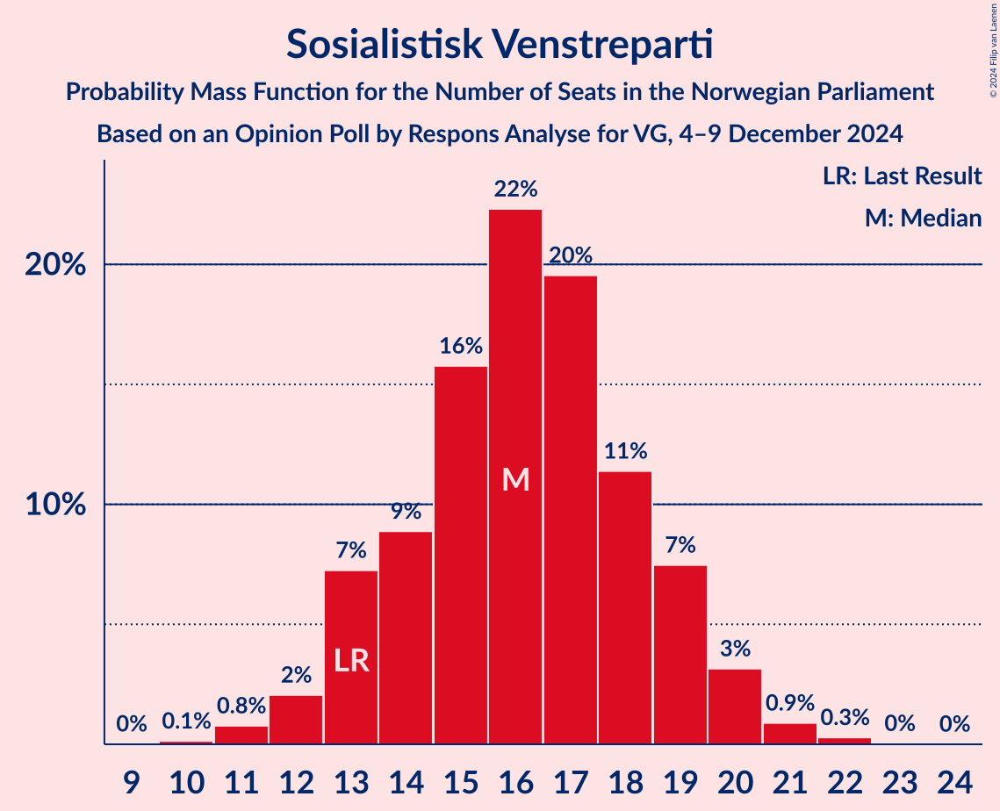
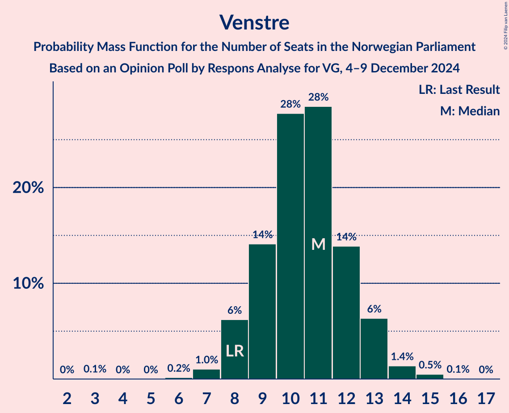
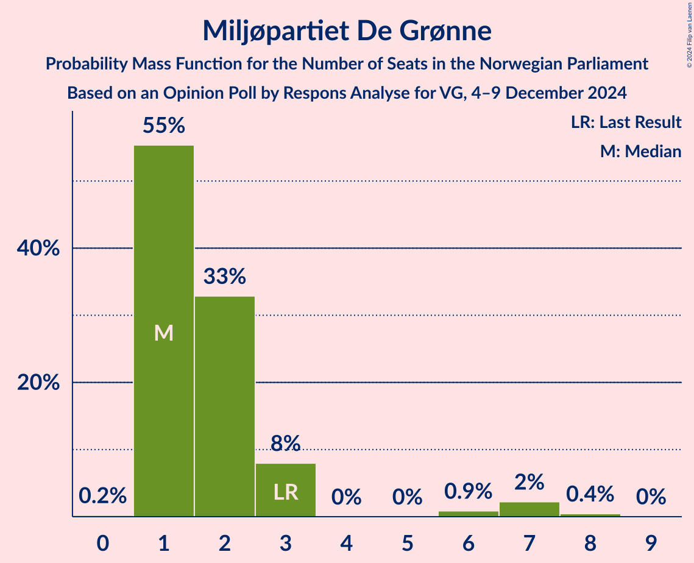
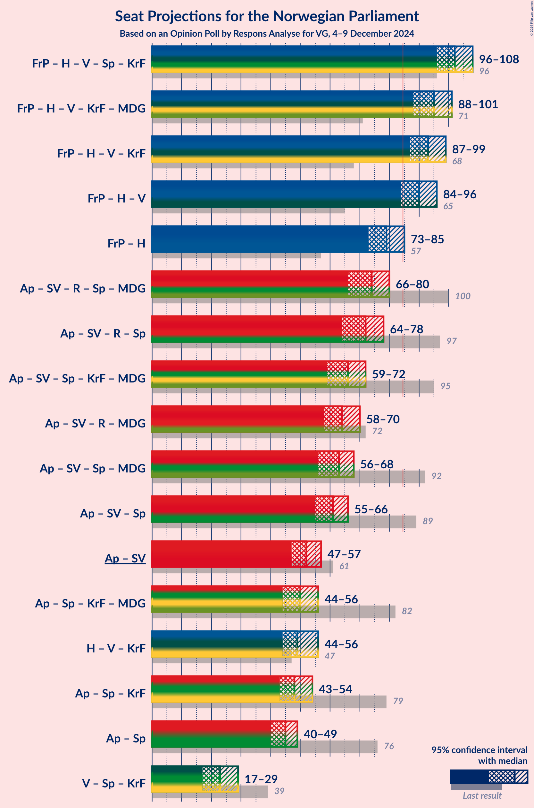
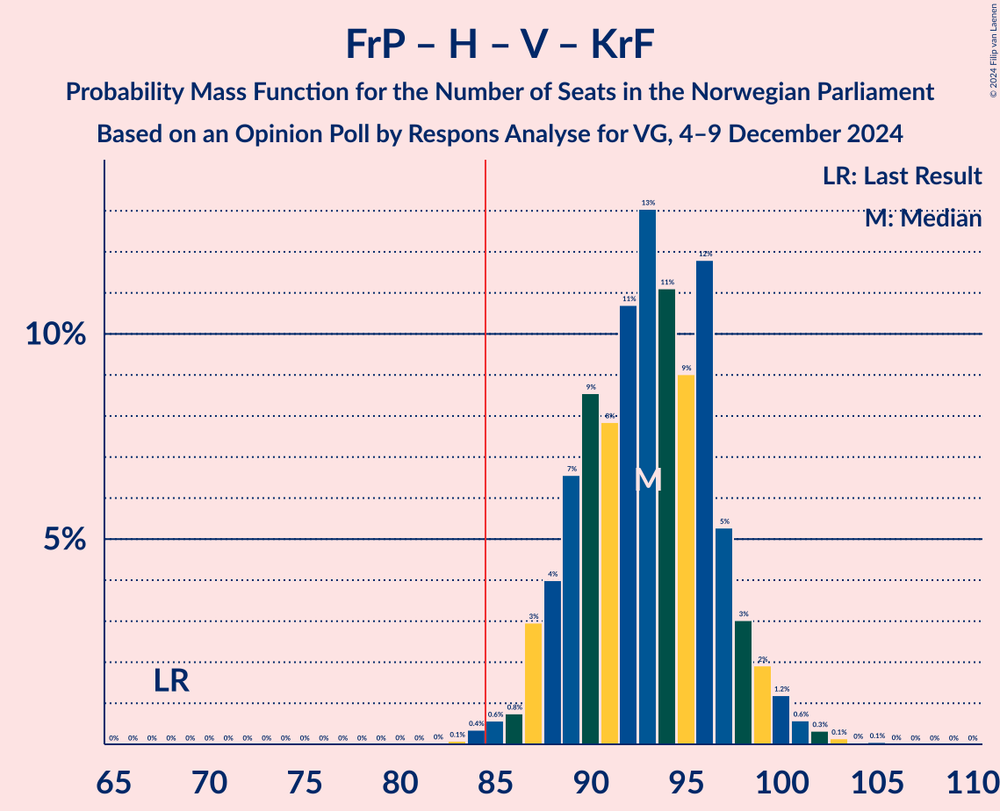
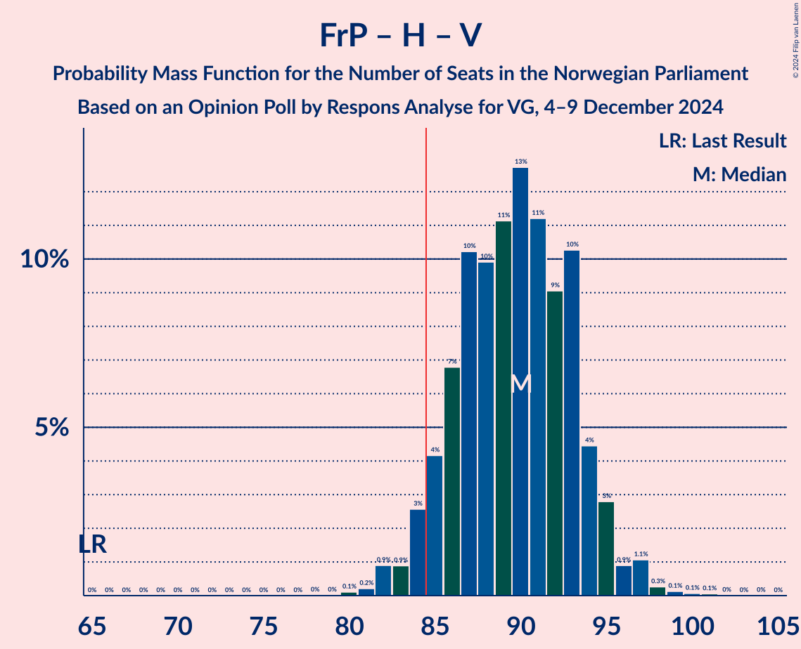
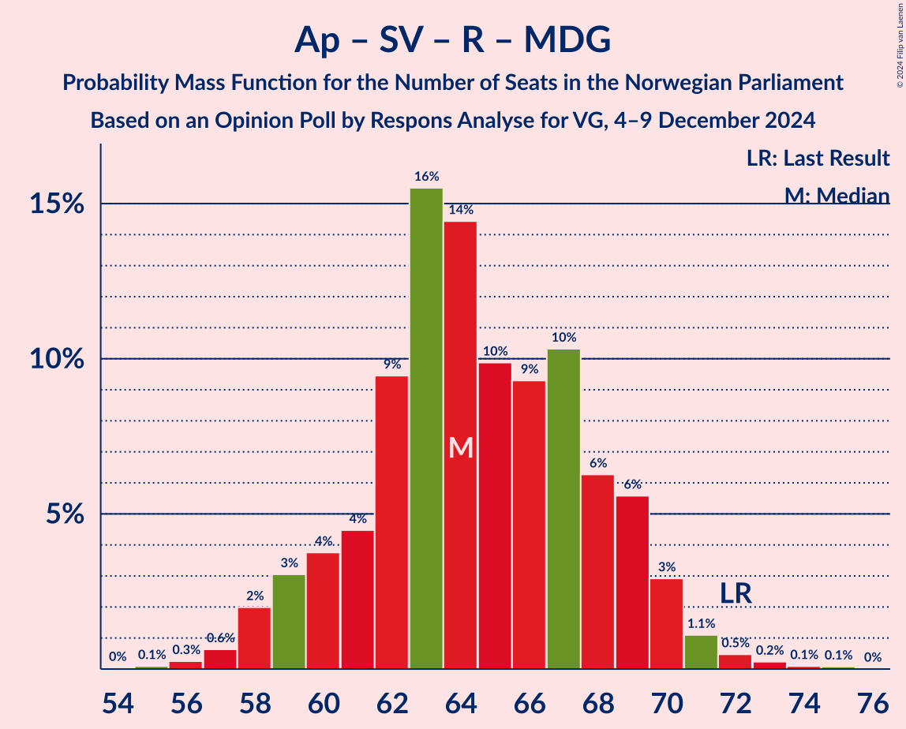
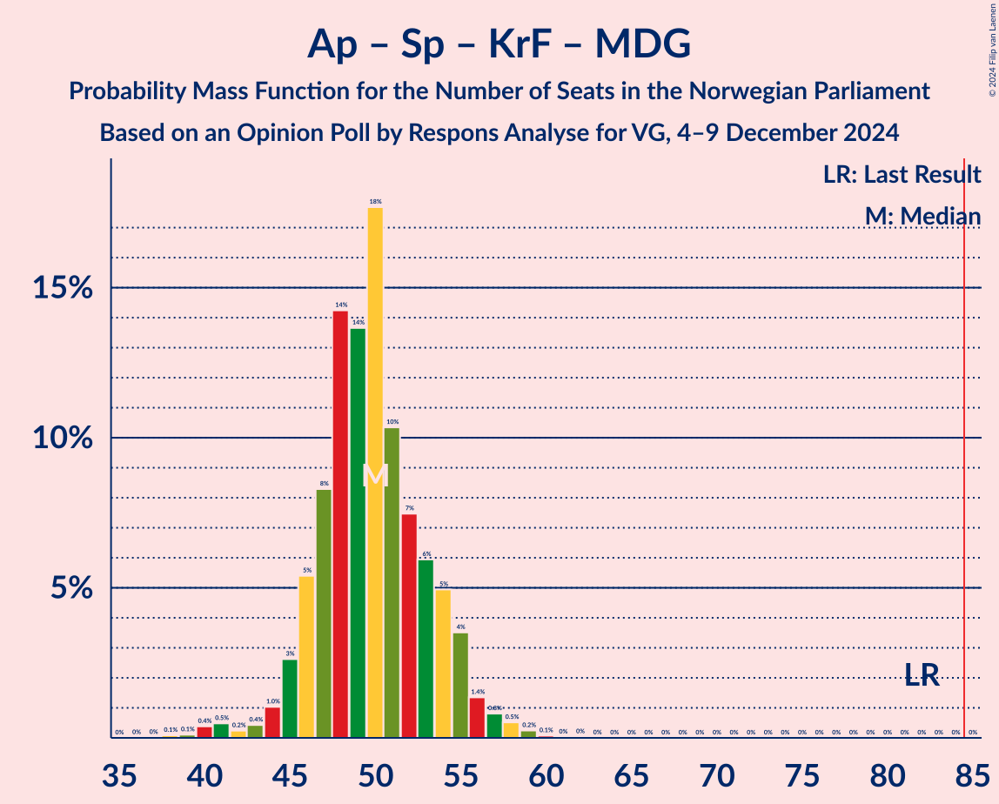
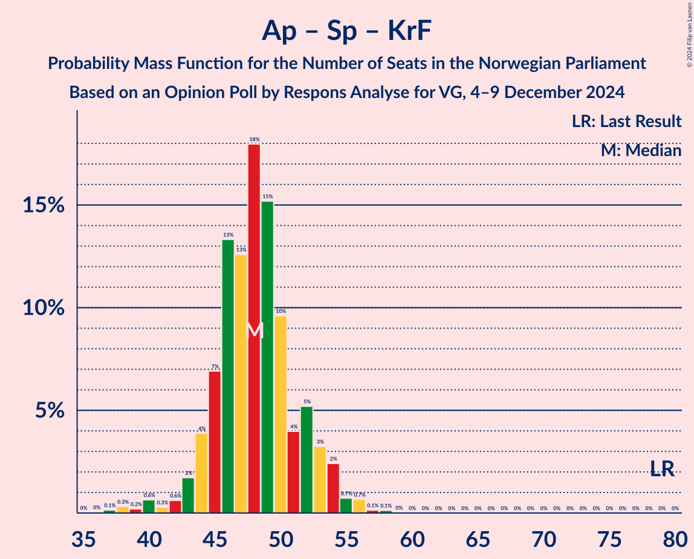

# Opinion Poll by Respons Analyse for VG, 4–9 December 2024

<a href="#voting-intentions">Voting Intentions</a> | <a href="#seats">Seats</a> | <a href="#coalitions">Coalitions</a> | <a href="#technical-information">Technical Information</a>

## Voting Intentions

### Confidence Intervals

| Party | Last Result | Poll Result | 80% Confidence Interval | 90% Confidence Interval | 95% Confidence Interval | 99% Confidence Interval |
|:-----:|:-----------:|:-----------:|:-----------------------:|:-----------------------:|:-----------------------:|:-----------------------:|
| Fremskrittspartiet | 11.6% | 23.9% | 22.2–25.7% |21.7–26.2% |21.3–26.6% |20.5–27.5% |
| Høyre | 20.4% | 20.3% | 18.7–22.0% |18.3–22.5% |17.9–22.9% |17.2–23.7% |
| Arbeiderpartiet | 26.2% | 18.9% | 17.3–20.5% |16.9–21.0% |16.6–21.4% |15.9–22.2% |
| Sosialistisk Venstreparti | 7.6% | 9.4% | 8.3–10.7% |8.0–11.0% |7.7–11.4% |7.2–12.0% |
| Rødt | 4.7% | 6.4% | 5.5–7.5% |5.2–7.8% |5.0–8.1% |4.6–8.6% |
| Venstre | 4.6% | 6.1% | 5.2–7.2% |5.0–7.5% |4.8–7.8% |4.4–8.3% |
| Senterpartiet | 13.5% | 5.3% | 4.5–6.3% |4.3–6.6% |4.1–6.9% |3.7–7.4% |
| Kristelig Folkeparti | 3.8% | 3.5% | 2.9–4.4% |2.7–4.6% |2.5–4.8% |2.2–5.3% |
| Miljøpartiet De Grønne | 3.9% | 2.9% | 2.3–3.7% |2.1–3.9% |2.0–4.1% |1.8–4.6% |

*Note:* The poll result column reflects the actual value used in the calculations. Published results may vary slightly, and in addition be rounded to fewer digits.

## Seats

### Confidence Intervals

| Party | Last Result | Median | 80% Confidence Interval | 90% Confidence Interval | 95% Confidence Interval | 99% Confidence Interval |
|:-----:|:-----------:|:------:|:-----------------------:|:-----------------------:|:-----------------------:|:-----------------------:|
| <a href="#fremskrittspartiet">Fremskrittspartiet</a> | 21 | 43 | 41–47 |40–48 |40–49 |38–50 |
| <a href="#høyre">Høyre</a> | 36 | 35 | 33–39 |32–40 |32–41 |31–42 |
| <a href="#arbeiderpartiet">Arbeiderpartiet</a> | 48 | 36 | 33–38 |32–39 |32–40 |31–41 |
| <a href="#sosialistisk-venstreparti">Sosialistisk Venstreparti</a> | 13 | 16 | 13–19 |13–19 |12–20 |11–21 |
| <a href="#rødt">Rødt</a> | 8 | 11 | 9–13 |9–13 |8–14 |7–15 |
| <a href="#venstre">Venstre</a> | 8 | 11 | 9–12 |8–13 |8–13 |7–15 |
| <a href="#senterpartiet">Senterpartiet</a> | 28 | 9 | 7–11 |7–12 |6–12 |0–13 |
| <a href="#kristelig-folkeparti">Kristelig Folkeparti</a> | 3 | 3 | 2–7 |1–8 |1–8 |0–9 |
| <a href="#miljøpartiet-de-grønne">Miljøpartiet De Grønne</a> | 3 | 1 | 1–3 |1–3 |1–7 |1–7 |

### Fremskrittspartiet

*For a full overview of the results for this party, see the [Fremskrittspartiet](party-fremskrittspartiet.html) page.*

| Number of Seats | Probability | Accumulated | Special Marks |
|:---------------:|:-----------:|:-----------:|:-------------:|
| 21 | 0% | 100% | Last Result |
| 22 | 0% | 100% |  |
| 23 | 0% | 100% |  |
| 24 | 0% | 100% |  |
| 25 | 0% | 100% |  |
| 26 | 0% | 100% |  |
| 27 | 0% | 100% |  |
| 28 | 0% | 100% |  |
| 29 | 0% | 100% |  |
| 30 | 0% | 100% |  |
| 31 | 0% | 100% |  |
| 32 | 0% | 100% |  |
| 33 | 0% | 100% |  |
| 34 | 0% | 100% |  |
| 35 | 0% | 100% |  |
| 36 | 0.1% | 100% |  |
| 37 | 0.2% | 99.9% |  |
| 38 | 0.4% | 99.7% |  |
| 39 | 1.5% | 99.3% |  |
| 40 | 5% | 98% |  |
| 41 | 8% | 93% |  |
| 42 | 26% | 85% |  |
| 43 | 12% | 59% | Median |
| 44 | 17% | 47% |  |
| 45 | 12% | 30% |  |
| 46 | 5% | 18% |  |
| 47 | 8% | 13% |  |
| 48 | 2% | 5% |  |
| 49 | 1.3% | 3% |  |
| 50 | 1.3% | 2% |  |
| 51 | 0.2% | 0.3% |  |
| 52 | 0.1% | 0.1% |  |
| 53 | 0% | 0% |  |

### Høyre

*For a full overview of the results for this party, see the [Høyre](party-høyre.html) page.*

| Number of Seats | Probability | Accumulated | Special Marks |
|:---------------:|:-----------:|:-----------:|:-------------:|
| 29 | 0.1% | 100% |  |
| 30 | 0.4% | 99.9% |  |
| 31 | 2% | 99.5% |  |
| 32 | 7% | 98% |  |
| 33 | 12% | 91% |  |
| 34 | 14% | 80% |  |
| 35 | 16% | 65% | Median |
| 36 | 15% | 49% | Last Result |
| 37 | 11% | 34% |  |
| 38 | 8% | 23% |  |
| 39 | 9% | 15% |  |
| 40 | 3% | 6% |  |
| 41 | 2% | 3% |  |
| 42 | 0.5% | 0.8% |  |
| 43 | 0.2% | 0.3% |  |
| 44 | 0.1% | 0.1% |  |
| 45 | 0% | 0% |  |

### Arbeiderpartiet

*For a full overview of the results for this party, see the [Arbeiderpartiet](party-arbeiderpartiet.html) page.*

| Number of Seats | Probability | Accumulated | Special Marks |
|:---------------:|:-----------:|:-----------:|:-------------:|
| 30 | 0% | 100% |  |
| 31 | 0.5% | 99.9% |  |
| 32 | 5% | 99.5% |  |
| 33 | 7% | 95% |  |
| 34 | 10% | 88% |  |
| 35 | 23% | 78% |  |
| 36 | 24% | 55% | Median |
| 37 | 19% | 31% |  |
| 38 | 7% | 12% |  |
| 39 | 3% | 5% |  |
| 40 | 1.4% | 3% |  |
| 41 | 0.8% | 1.1% |  |
| 42 | 0.2% | 0.4% |  |
| 43 | 0.1% | 0.2% |  |
| 44 | 0% | 0.1% |  |
| 45 | 0% | 0.1% |  |
| 46 | 0% | 0% |  |
| 47 | 0% | 0% |  |
| 48 | 0% | 0% | Last Result |

### Sosialistisk Venstreparti

*For a full overview of the results for this party, see the [Sosialistisk Venstreparti](party-sosialistiskvenstreparti.html) page.*

| Number of Seats | Probability | Accumulated | Special Marks |
|:---------------:|:-----------:|:-----------:|:-------------:|
| 10 | 0.1% | 100% |  |
| 11 | 0.8% | 99.8% |  |
| 12 | 2% | 99.1% |  |
| 13 | 7% | 97% | Last Result |
| 14 | 9% | 90% |  |
| 15 | 16% | 81% |  |
| 16 | 22% | 65% | Median |
| 17 | 20% | 43% |  |
| 18 | 11% | 23% |  |
| 19 | 7% | 12% |  |
| 20 | 3% | 4% |  |
| 21 | 0.9% | 1.2% |  |
| 22 | 0.3% | 0.3% |  |
| 23 | 0% | 0.1% |  |
| 24 | 0% | 0% |  |

### Rødt

*For a full overview of the results for this party, see the [Rødt](party-rødt.html) page.*

| Number of Seats | Probability | Accumulated | Special Marks |
|:---------------:|:-----------:|:-----------:|:-------------:|
| 7 | 0.5% | 100% |  |
| 8 | 4% | 99.5% | Last Result |
| 9 | 15% | 96% |  |
| 10 | 19% | 81% |  |
| 11 | 23% | 62% | Median |
| 12 | 24% | 38% |  |
| 13 | 11% | 15% |  |
| 14 | 2% | 3% |  |
| 15 | 0.9% | 1.1% |  |
| 16 | 0.3% | 0.3% |  |
| 17 | 0% | 0% |  |

### Venstre

*For a full overview of the results for this party, see the [Venstre](party-venstre.html) page.*

| Number of Seats | Probability | Accumulated | Special Marks |
|:---------------:|:-----------:|:-----------:|:-------------:|
| 3 | 0.1% | 100% |  |
| 4 | 0% | 99.9% |  |
| 5 | 0% | 99.9% |  |
| 6 | 0.2% | 99.9% |  |
| 7 | 1.0% | 99.8% |  |
| 8 | 6% | 98.7% | Last Result |
| 9 | 14% | 93% |  |
| 10 | 28% | 78% |  |
| 11 | 28% | 51% | Median |
| 12 | 14% | 22% |  |
| 13 | 6% | 8% |  |
| 14 | 1.4% | 2% |  |
| 15 | 0.5% | 0.6% |  |
| 16 | 0.1% | 0.1% |  |
| 17 | 0% | 0% |  |

### Senterpartiet

*For a full overview of the results for this party, see the [Senterpartiet](party-senterpartiet.html) page.*

| Number of Seats | Probability | Accumulated | Special Marks |
|:---------------:|:-----------:|:-----------:|:-------------:|
| 0 | 0.9% | 100% |  |
| 1 | 1.3% | 99.1% |  |
| 2 | 0% | 98% |  |
| 3 | 0% | 98% |  |
| 4 | 0% | 98% |  |
| 5 | 0% | 98% |  |
| 6 | 1.2% | 98% |  |
| 7 | 8% | 97% |  |
| 8 | 19% | 88% |  |
| 9 | 30% | 69% | Median |
| 10 | 21% | 39% |  |
| 11 | 11% | 18% |  |
| 12 | 6% | 7% |  |
| 13 | 2% | 2% |  |
| 14 | 0.2% | 0.2% |  |
| 15 | 0% | 0% |  |
| 16 | 0% | 0% |  |
| 17 | 0% | 0% |  |
| 18 | 0% | 0% |  |
| 19 | 0% | 0% |  |
| 20 | 0% | 0% |  |
| 21 | 0% | 0% |  |
| 22 | 0% | 0% |  |
| 23 | 0% | 0% |  |
| 24 | 0% | 0% |  |
| 25 | 0% | 0% |  |
| 26 | 0% | 0% |  |
| 27 | 0% | 0% |  |
| 28 | 0% | 0% | Last Result |

### Kristelig Folkeparti

*For a full overview of the results for this party, see the [Kristelig Folkeparti](party-kristeligfolkeparti.html) page.*

| Number of Seats | Probability | Accumulated | Special Marks |
|:---------------:|:-----------:|:-----------:|:-------------:|
| 0 | 1.0% | 100% |  |
| 1 | 6% | 99.0% |  |
| 2 | 41% | 93% |  |
| 3 | 31% | 52% | Last Result, Median |
| 4 | 0% | 21% |  |
| 5 | 0% | 21% |  |
| 6 | 3% | 21% |  |
| 7 | 14% | 19% |  |
| 8 | 4% | 5% |  |
| 9 | 0.6% | 0.7% |  |
| 10 | 0.1% | 0.1% |  |
| 11 | 0% | 0% |  |

### Miljøpartiet De Grønne

*For a full overview of the results for this party, see the [Miljøpartiet De Grønne](party-miljøpartietdegrønne.html) page.*

| Number of Seats | Probability | Accumulated | Special Marks |
|:---------------:|:-----------:|:-----------:|:-------------:|
| 0 | 0.2% | 100% |  |
| 1 | 55% | 99.8% | Median |
| 2 | 33% | 44% |  |
| 3 | 8% | 12% | Last Result |
| 4 | 0% | 4% |  |
| 5 | 0% | 4% |  |
| 6 | 0.9% | 4% |  |
| 7 | 2% | 3% |  |
| 8 | 0.4% | 0.5% |  |
| 9 | 0% | 0% |  |

## Coalitions

### Confidence Intervals

| Coalition | Last Result | Median | Majority? | 80% Confidence Interval | 90% Confidence Interval | 95% Confidence Interval | 99% Confidence Interval |
|:---------:|:-----------:|:------:|:---------:|:-----------------------:|:-----------------------:|:-----------------------:|:-----------------------:|
| Fremskrittspartiet – Høyre – Venstre – Senterpartiet – Kristelig Folkeparti | 96 | 102 | 100% | 98–106 | 97–107 | 96–108 | 93–110 |
| Fremskrittspartiet – Høyre – Venstre – Kristelig Folkeparti – Miljøpartiet De Grønne | 71 | 95 | 99.9% | 90–99 | 89–100 | 88–101 | 86–104 |
| Fremskrittspartiet – Høyre – Venstre – Kristelig Folkeparti | 68 | 93 | 99.5% | 89–97 | 88–98 | 87–99 | 85–102 |
| Fremskrittspartiet – Høyre – Venstre | 65 | 90 | 95% | 86–93 | 85–95 | 84–96 | 82–98 |
| Fremskrittspartiet – Høyre | 57 | 79 | 3% | 75–83 | 74–84 | 73–85 | 72–87 |
| Arbeiderpartiet – Sosialistisk Venstreparti – Rødt – Senterpartiet – Miljøpartiet De Grønne | 100 | 74 | 0% | 69–78 | 67–79 | 66–80 | 63–81 |
| Arbeiderpartiet – Sosialistisk Venstreparti – Rødt – Senterpartiet | 97 | 72 | 0% | 67–76 | 65–77 | 64–78 | 62–80 |
| Arbeiderpartiet – Sosialistisk Venstreparti – Senterpartiet – Kristelig Folkeparti – Miljøpartiet De Grønne | 95 | 66 | 0% | 62–70 | 60–71 | 59–72 | 57–74 |
| Arbeiderpartiet – Sosialistisk Venstreparti – Rødt – Miljøpartiet De Grønne | 72 | 64 | 0% | 61–69 | 59–69 | 58–70 | 57–72 |
| Arbeiderpartiet – Sosialistisk Venstreparti – Senterpartiet – Miljøpartiet De Grønne | 92 | 63 | 0% | 59–67 | 57–67 | 56–68 | 53–70 |
| Arbeiderpartiet – Sosialistisk Venstreparti – Senterpartiet | 89 | 61 | 0% | 57–65 | 56–66 | 55–66 | 52–68 |
| Arbeiderpartiet – Sosialistisk Venstreparti | 61 | 52 | 0% | 49–55 | 48–56 | 47–57 | 46–58 |
| Arbeiderpartiet – Senterpartiet – Kristelig Folkeparti – Miljøpartiet De Grønne | 82 | 50 | 0% | 46–54 | 45–55 | 44–56 | 40–58 |
| Høyre – Venstre – Kristelig Folkeparti | 47 | 49 | 0% | 46–54 | 45–55 | 44–56 | 43–57 |
| Arbeiderpartiet – Senterpartiet – Kristelig Folkeparti | 79 | 48 | 0% | 45–52 | 44–53 | 43–54 | 38–56 |
| Arbeiderpartiet – Senterpartiet | 76 | 45 | 0% | 42–47 | 41–48 | 40–49 | 36–51 |
| Venstre – Senterpartiet – Kristelig Folkeparti | 39 | 23 | 0% | 20–27 | 18–28 | 17–29 | 13–31 |

### Fremskrittspartiet – Høyre – Venstre – Senterpartiet – Kristelig Folkeparti

| Number of Seats | Probability | Accumulated | Special Marks |
|:---------------:|:-----------:|:-----------:|:-------------:|
| 89 | 0.1% | 100% |  |
| 90 | 0% | 99.9% |  |
| 91 | 0% | 99.9% |  |
| 92 | 0.1% | 99.9% |  |
| 93 | 0.5% | 99.8% |  |
| 94 | 0.6% | 99.3% |  |
| 95 | 1.2% | 98.7% |  |
| 96 | 2% | 98% | Last Result |
| 97 | 4% | 95% |  |
| 98 | 4% | 91% |  |
| 99 | 10% | 87% |  |
| 100 | 7% | 77% |  |
| 101 | 11% | 70% | Median |
| 102 | 10% | 58% |  |
| 103 | 10% | 48% |  |
| 104 | 13% | 38% |  |
| 105 | 12% | 25% |  |
| 106 | 7% | 13% |  |
| 107 | 3% | 6% |  |
| 108 | 2% | 4% |  |
| 109 | 1.2% | 2% |  |
| 110 | 0.4% | 0.6% |  |
| 111 | 0.1% | 0.2% |  |
| 112 | 0% | 0.1% |  |
| 113 | 0% | 0% |  |

### Fremskrittspartiet – Høyre – Venstre – Kristelig Folkeparti – Miljøpartiet De Grønne

| Number of Seats | Probability | Accumulated | Special Marks |
|:---------------:|:-----------:|:-----------:|:-------------:|
| 71 | 0% | 100% | Last Result |
| 72 | 0% | 100% |  |
| 73 | 0% | 100% |  |
| 74 | 0% | 100% |  |
| 75 | 0% | 100% |  |
| 76 | 0% | 100% |  |
| 77 | 0% | 100% |  |
| 78 | 0% | 100% |  |
| 79 | 0% | 100% |  |
| 80 | 0% | 100% |  |
| 81 | 0% | 100% |  |
| 82 | 0% | 100% |  |
| 83 | 0% | 100% |  |
| 84 | 0.1% | 100% |  |
| 85 | 0.2% | 99.9% | Majority |
| 86 | 0.3% | 99.7% |  |
| 87 | 0.4% | 99.4% |  |
| 88 | 2% | 99.1% |  |
| 89 | 3% | 97% |  |
| 90 | 4% | 94% |  |
| 91 | 7% | 89% |  |
| 92 | 8% | 83% |  |
| 93 | 9% | 75% | Median |
| 94 | 14% | 66% |  |
| 95 | 11% | 52% |  |
| 96 | 10% | 42% |  |
| 97 | 14% | 32% |  |
| 98 | 7% | 18% |  |
| 99 | 4% | 11% |  |
| 100 | 3% | 6% |  |
| 101 | 2% | 4% |  |
| 102 | 0.7% | 2% |  |
| 103 | 0.6% | 1.3% |  |
| 104 | 0.4% | 0.7% |  |
| 105 | 0.2% | 0.3% |  |
| 106 | 0.1% | 0.1% |  |
| 107 | 0% | 0% |  |

### Fremskrittspartiet – Høyre – Venstre – Kristelig Folkeparti

| Number of Seats | Probability | Accumulated | Special Marks |
|:---------------:|:-----------:|:-----------:|:-------------:|
| 68 | 0% | 100% | Last Result |
| 69 | 0% | 100% |  |
| 70 | 0% | 100% |  |
| 71 | 0% | 100% |  |
| 72 | 0% | 100% |  |
| 73 | 0% | 100% |  |
| 74 | 0% | 100% |  |
| 75 | 0% | 100% |  |
| 76 | 0% | 100% |  |
| 77 | 0% | 100% |  |
| 78 | 0% | 100% |  |
| 79 | 0% | 100% |  |
| 80 | 0% | 100% |  |
| 81 | 0% | 100% |  |
| 82 | 0% | 100% |  |
| 83 | 0.1% | 100% |  |
| 84 | 0.4% | 99.9% |  |
| 85 | 0.6% | 99.5% | Majority |
| 86 | 0.8% | 98.9% |  |
| 87 | 3% | 98% |  |
| 88 | 4% | 95% |  |
| 89 | 7% | 91% |  |
| 90 | 9% | 85% |  |
| 91 | 8% | 76% |  |
| 92 | 11% | 68% | Median |
| 93 | 13% | 58% |  |
| 94 | 11% | 45% |  |
| 95 | 9% | 33% |  |
| 96 | 12% | 24% |  |
| 97 | 5% | 13% |  |
| 98 | 3% | 7% |  |
| 99 | 2% | 4% |  |
| 100 | 1.2% | 2% |  |
| 101 | 0.6% | 1.2% |  |
| 102 | 0.3% | 0.6% |  |
| 103 | 0.1% | 0.3% |  |
| 104 | 0% | 0.1% |  |
| 105 | 0.1% | 0.1% |  |
| 106 | 0% | 0% |  |

### Fremskrittspartiet – Høyre – Venstre

| Number of Seats | Probability | Accumulated | Special Marks |
|:---------------:|:-----------:|:-----------:|:-------------:|
| 65 | 0% | 100% | Last Result |
| 66 | 0% | 100% |  |
| 67 | 0% | 100% |  |
| 68 | 0% | 100% |  |
| 69 | 0% | 100% |  |
| 70 | 0% | 100% |  |
| 71 | 0% | 100% |  |
| 72 | 0% | 100% |  |
| 73 | 0% | 100% |  |
| 74 | 0% | 100% |  |
| 75 | 0% | 100% |  |
| 76 | 0% | 100% |  |
| 77 | 0% | 100% |  |
| 78 | 0% | 100% |  |
| 79 | 0% | 100% |  |
| 80 | 0.1% | 100% |  |
| 81 | 0.2% | 99.9% |  |
| 82 | 0.9% | 99.6% |  |
| 83 | 0.9% | 98.7% |  |
| 84 | 3% | 98% |  |
| 85 | 4% | 95% | Majority |
| 86 | 7% | 91% |  |
| 87 | 10% | 84% |  |
| 88 | 10% | 74% |  |
| 89 | 11% | 64% | Median |
| 90 | 13% | 53% |  |
| 91 | 11% | 40% |  |
| 92 | 9% | 29% |  |
| 93 | 10% | 20% |  |
| 94 | 4% | 10% |  |
| 95 | 3% | 5% |  |
| 96 | 0.9% | 3% |  |
| 97 | 1.1% | 2% |  |
| 98 | 0.3% | 0.5% |  |
| 99 | 0.1% | 0.3% |  |
| 100 | 0.1% | 0.2% |  |
| 101 | 0.1% | 0.1% |  |
| 102 | 0% | 0% |  |

### Fremskrittspartiet – Høyre

| Number of Seats | Probability | Accumulated | Special Marks |
|:---------------:|:-----------:|:-----------:|:-------------:|
| 57 | 0% | 100% | Last Result |
| 58 | 0% | 100% |  |
| 59 | 0% | 100% |  |
| 60 | 0% | 100% |  |
| 61 | 0% | 100% |  |
| 62 | 0% | 100% |  |
| 63 | 0% | 100% |  |
| 64 | 0% | 100% |  |
| 65 | 0% | 100% |  |
| 66 | 0% | 100% |  |
| 67 | 0% | 100% |  |
| 68 | 0% | 100% |  |
| 69 | 0% | 100% |  |
| 70 | 0.1% | 100% |  |
| 71 | 0.2% | 99.9% |  |
| 72 | 0.8% | 99.7% |  |
| 73 | 2% | 98.9% |  |
| 74 | 3% | 97% |  |
| 75 | 5% | 94% |  |
| 76 | 8% | 89% |  |
| 77 | 10% | 81% |  |
| 78 | 14% | 71% | Median |
| 79 | 13% | 57% |  |
| 80 | 9% | 44% |  |
| 81 | 13% | 35% |  |
| 82 | 7% | 21% |  |
| 83 | 7% | 15% |  |
| 84 | 4% | 7% |  |
| 85 | 2% | 3% | Majority |
| 86 | 0.7% | 2% |  |
| 87 | 0.4% | 0.8% |  |
| 88 | 0.3% | 0.5% |  |
| 89 | 0.1% | 0.1% |  |
| 90 | 0% | 0.1% |  |
| 91 | 0% | 0% |  |

### Arbeiderpartiet – Sosialistisk Venstreparti – Rødt – Senterpartiet – Miljøpartiet De Grønne

| Number of Seats | Probability | Accumulated | Special Marks |
|:---------------:|:-----------:|:-----------:|:-------------:|
| 61 | 0% | 100% |  |
| 62 | 0.1% | 99.9% |  |
| 63 | 0.4% | 99.9% |  |
| 64 | 0.2% | 99.5% |  |
| 65 | 0.8% | 99.2% |  |
| 66 | 3% | 98% |  |
| 67 | 2% | 96% |  |
| 68 | 2% | 94% |  |
| 69 | 4% | 92% |  |
| 70 | 5% | 88% |  |
| 71 | 7% | 83% |  |
| 72 | 13% | 76% |  |
| 73 | 10% | 63% | Median |
| 74 | 13% | 53% |  |
| 75 | 12% | 41% |  |
| 76 | 10% | 29% |  |
| 77 | 7% | 20% |  |
| 78 | 5% | 13% |  |
| 79 | 5% | 8% |  |
| 80 | 1.5% | 3% |  |
| 81 | 0.7% | 1.1% |  |
| 82 | 0.2% | 0.4% |  |
| 83 | 0.1% | 0.2% |  |
| 84 | 0% | 0.1% |  |
| 85 | 0% | 0% | Majority |
| 86 | 0% | 0% |  |
| 87 | 0% | 0% |  |
| 88 | 0% | 0% |  |
| 89 | 0% | 0% |  |
| 90 | 0% | 0% |  |
| 91 | 0% | 0% |  |
| 92 | 0% | 0% |  |
| 93 | 0% | 0% |  |
| 94 | 0% | 0% |  |
| 95 | 0% | 0% |  |
| 96 | 0% | 0% |  |
| 97 | 0% | 0% |  |
| 98 | 0% | 0% |  |
| 99 | 0% | 0% |  |
| 100 | 0% | 0% | Last Result |

### Arbeiderpartiet – Sosialistisk Venstreparti – Rødt – Senterpartiet

| Number of Seats | Probability | Accumulated | Special Marks |
|:---------------:|:-----------:|:-----------:|:-------------:|
| 59 | 0% | 100% |  |
| 60 | 0.1% | 99.9% |  |
| 61 | 0.1% | 99.9% |  |
| 62 | 0.4% | 99.7% |  |
| 63 | 0.7% | 99.3% |  |
| 64 | 1.2% | 98.5% |  |
| 65 | 3% | 97% |  |
| 66 | 2% | 94% |  |
| 67 | 3% | 92% |  |
| 68 | 5% | 89% |  |
| 69 | 6% | 84% |  |
| 70 | 8% | 78% |  |
| 71 | 15% | 70% |  |
| 72 | 10% | 55% | Median |
| 73 | 11% | 45% |  |
| 74 | 12% | 34% |  |
| 75 | 7% | 22% |  |
| 76 | 6% | 14% |  |
| 77 | 4% | 9% |  |
| 78 | 3% | 4% |  |
| 79 | 0.8% | 1.3% |  |
| 80 | 0.3% | 0.5% |  |
| 81 | 0.1% | 0.2% |  |
| 82 | 0% | 0% |  |
| 83 | 0% | 0% |  |
| 84 | 0% | 0% |  |
| 85 | 0% | 0% | Majority |
| 86 | 0% | 0% |  |
| 87 | 0% | 0% |  |
| 88 | 0% | 0% |  |
| 89 | 0% | 0% |  |
| 90 | 0% | 0% |  |
| 91 | 0% | 0% |  |
| 92 | 0% | 0% |  |
| 93 | 0% | 0% |  |
| 94 | 0% | 0% |  |
| 95 | 0% | 0% |  |
| 96 | 0% | 0% |  |
| 97 | 0% | 0% | Last Result |

### Arbeiderpartiet – Sosialistisk Venstreparti – Senterpartiet – Kristelig Folkeparti – Miljøpartiet De Grønne

| Number of Seats | Probability | Accumulated | Special Marks |
|:---------------:|:-----------:|:-----------:|:-------------:|
| 54 | 0% | 100% |  |
| 55 | 0.2% | 99.9% |  |
| 56 | 0.1% | 99.7% |  |
| 57 | 0.2% | 99.6% |  |
| 58 | 0.5% | 99.3% |  |
| 59 | 2% | 98.8% |  |
| 60 | 3% | 97% |  |
| 61 | 3% | 94% |  |
| 62 | 4% | 91% |  |
| 63 | 8% | 87% |  |
| 64 | 7% | 79% |  |
| 65 | 18% | 71% | Median |
| 66 | 11% | 53% |  |
| 67 | 10% | 43% |  |
| 68 | 10% | 33% |  |
| 69 | 10% | 22% |  |
| 70 | 5% | 12% |  |
| 71 | 4% | 7% |  |
| 72 | 2% | 3% |  |
| 73 | 1.0% | 2% |  |
| 74 | 0.4% | 0.8% |  |
| 75 | 0.2% | 0.4% |  |
| 76 | 0.1% | 0.2% |  |
| 77 | 0% | 0% |  |
| 78 | 0% | 0% |  |
| 79 | 0% | 0% |  |
| 80 | 0% | 0% |  |
| 81 | 0% | 0% |  |
| 82 | 0% | 0% |  |
| 83 | 0% | 0% |  |
| 84 | 0% | 0% |  |
| 85 | 0% | 0% | Majority |
| 86 | 0% | 0% |  |
| 87 | 0% | 0% |  |
| 88 | 0% | 0% |  |
| 89 | 0% | 0% |  |
| 90 | 0% | 0% |  |
| 91 | 0% | 0% |  |
| 92 | 0% | 0% |  |
| 93 | 0% | 0% |  |
| 94 | 0% | 0% |  |
| 95 | 0% | 0% | Last Result |

### Arbeiderpartiet – Sosialistisk Venstreparti – Rødt – Miljøpartiet De Grønne

| Number of Seats | Probability | Accumulated | Special Marks |
|:---------------:|:-----------:|:-----------:|:-------------:|
| 54 | 0% | 100% |  |
| 55 | 0.1% | 99.9% |  |
| 56 | 0.3% | 99.9% |  |
| 57 | 0.6% | 99.6% |  |
| 58 | 2% | 99.0% |  |
| 59 | 3% | 97% |  |
| 60 | 4% | 94% |  |
| 61 | 4% | 90% |  |
| 62 | 9% | 86% |  |
| 63 | 16% | 76% |  |
| 64 | 14% | 61% | Median |
| 65 | 10% | 46% |  |
| 66 | 9% | 36% |  |
| 67 | 10% | 27% |  |
| 68 | 6% | 17% |  |
| 69 | 6% | 11% |  |
| 70 | 3% | 5% |  |
| 71 | 1.1% | 2% |  |
| 72 | 0.5% | 0.9% | Last Result |
| 73 | 0.2% | 0.4% |  |
| 74 | 0.1% | 0.2% |  |
| 75 | 0.1% | 0.1% |  |
| 76 | 0% | 0% |  |

### Arbeiderpartiet – Sosialistisk Venstreparti – Senterpartiet – Miljøpartiet De Grønne

| Number of Seats | Probability | Accumulated | Special Marks |
|:---------------:|:-----------:|:-----------:|:-------------:|
| 51 | 0% | 100% |  |
| 52 | 0.1% | 99.9% |  |
| 53 | 0.4% | 99.9% |  |
| 54 | 0.4% | 99.5% |  |
| 55 | 0.5% | 99.1% |  |
| 56 | 2% | 98.6% |  |
| 57 | 3% | 97% |  |
| 58 | 4% | 94% |  |
| 59 | 5% | 90% |  |
| 60 | 9% | 86% |  |
| 61 | 9% | 77% |  |
| 62 | 14% | 67% | Median |
| 63 | 15% | 53% |  |
| 64 | 10% | 38% |  |
| 65 | 9% | 27% |  |
| 66 | 6% | 18% |  |
| 67 | 8% | 11% |  |
| 68 | 2% | 4% |  |
| 69 | 0.9% | 2% |  |
| 70 | 0.4% | 0.7% |  |
| 71 | 0.2% | 0.3% |  |
| 72 | 0.1% | 0.1% |  |
| 73 | 0% | 0% |  |
| 74 | 0% | 0% |  |
| 75 | 0% | 0% |  |
| 76 | 0% | 0% |  |
| 77 | 0% | 0% |  |
| 78 | 0% | 0% |  |
| 79 | 0% | 0% |  |
| 80 | 0% | 0% |  |
| 81 | 0% | 0% |  |
| 82 | 0% | 0% |  |
| 83 | 0% | 0% |  |
| 84 | 0% | 0% |  |
| 85 | 0% | 0% | Majority |
| 86 | 0% | 0% |  |
| 87 | 0% | 0% |  |
| 88 | 0% | 0% |  |
| 89 | 0% | 0% |  |
| 90 | 0% | 0% |  |
| 91 | 0% | 0% |  |
| 92 | 0% | 0% | Last Result |

### Arbeiderpartiet – Sosialistisk Venstreparti – Senterpartiet

| Number of Seats | Probability | Accumulated | Special Marks |
|:---------------:|:-----------:|:-----------:|:-------------:|
| 50 | 0.1% | 100% |  |
| 51 | 0.2% | 99.9% |  |
| 52 | 0.5% | 99.7% |  |
| 53 | 0.4% | 99.2% |  |
| 54 | 0.9% | 98.8% |  |
| 55 | 2% | 98% |  |
| 56 | 4% | 96% |  |
| 57 | 5% | 92% |  |
| 58 | 7% | 87% |  |
| 59 | 11% | 80% |  |
| 60 | 11% | 70% |  |
| 61 | 17% | 58% | Median |
| 62 | 11% | 41% |  |
| 63 | 10% | 31% |  |
| 64 | 9% | 21% |  |
| 65 | 6% | 12% |  |
| 66 | 4% | 6% |  |
| 67 | 1.2% | 2% |  |
| 68 | 0.4% | 0.6% |  |
| 69 | 0.2% | 0.3% |  |
| 70 | 0% | 0.1% |  |
| 71 | 0% | 0% |  |
| 72 | 0% | 0% |  |
| 73 | 0% | 0% |  |
| 74 | 0% | 0% |  |
| 75 | 0% | 0% |  |
| 76 | 0% | 0% |  |
| 77 | 0% | 0% |  |
| 78 | 0% | 0% |  |
| 79 | 0% | 0% |  |
| 80 | 0% | 0% |  |
| 81 | 0% | 0% |  |
| 82 | 0% | 0% |  |
| 83 | 0% | 0% |  |
| 84 | 0% | 0% |  |
| 85 | 0% | 0% | Majority |
| 86 | 0% | 0% |  |
| 87 | 0% | 0% |  |
| 88 | 0% | 0% |  |
| 89 | 0% | 0% | Last Result |

### Arbeiderpartiet – Sosialistisk Venstreparti

| Number of Seats | Probability | Accumulated | Special Marks |
|:---------------:|:-----------:|:-----------:|:-------------:|
| 44 | 0.1% | 100% |  |
| 45 | 0.3% | 99.9% |  |
| 46 | 0.5% | 99.6% |  |
| 47 | 3% | 99.0% |  |
| 48 | 5% | 96% |  |
| 49 | 9% | 91% |  |
| 50 | 11% | 82% |  |
| 51 | 16% | 71% |  |
| 52 | 18% | 55% | Median |
| 53 | 13% | 37% |  |
| 54 | 8% | 24% |  |
| 55 | 8% | 16% |  |
| 56 | 5% | 8% |  |
| 57 | 2% | 3% |  |
| 58 | 0.6% | 1.0% |  |
| 59 | 0.2% | 0.3% |  |
| 60 | 0.1% | 0.2% |  |
| 61 | 0.1% | 0.1% | Last Result |
| 62 | 0% | 0% |  |

### Arbeiderpartiet – Senterpartiet – Kristelig Folkeparti – Miljøpartiet De Grønne

| Number of Seats | Probability | Accumulated | Special Marks |
|:---------------:|:-----------:|:-----------:|:-------------:|
| 38 | 0.1% | 100% |  |
| 39 | 0.1% | 99.9% |  |
| 40 | 0.4% | 99.8% |  |
| 41 | 0.5% | 99.4% |  |
| 42 | 0.2% | 98.9% |  |
| 43 | 0.4% | 98.7% |  |
| 44 | 1.0% | 98% |  |
| 45 | 3% | 97% |  |
| 46 | 5% | 95% |  |
| 47 | 8% | 89% |  |
| 48 | 14% | 81% |  |
| 49 | 14% | 67% | Median |
| 50 | 18% | 53% |  |
| 51 | 10% | 35% |  |
| 52 | 7% | 25% |  |
| 53 | 6% | 17% |  |
| 54 | 5% | 12% |  |
| 55 | 4% | 7% |  |
| 56 | 1.4% | 3% |  |
| 57 | 0.8% | 2% |  |
| 58 | 0.5% | 0.9% |  |
| 59 | 0.2% | 0.4% |  |
| 60 | 0.1% | 0.2% |  |
| 61 | 0% | 0.1% |  |
| 62 | 0% | 0% |  |
| 63 | 0% | 0% |  |
| 64 | 0% | 0% |  |
| 65 | 0% | 0% |  |
| 66 | 0% | 0% |  |
| 67 | 0% | 0% |  |
| 68 | 0% | 0% |  |
| 69 | 0% | 0% |  |
| 70 | 0% | 0% |  |
| 71 | 0% | 0% |  |
| 72 | 0% | 0% |  |
| 73 | 0% | 0% |  |
| 74 | 0% | 0% |  |
| 75 | 0% | 0% |  |
| 76 | 0% | 0% |  |
| 77 | 0% | 0% |  |
| 78 | 0% | 0% |  |
| 79 | 0% | 0% |  |
| 80 | 0% | 0% |  |
| 81 | 0% | 0% |  |
| 82 | 0% | 0% | Last Result |

### Høyre – Venstre – Kristelig Folkeparti

| Number of Seats | Probability | Accumulated | Special Marks |
|:---------------:|:-----------:|:-----------:|:-------------:|
| 41 | 0.1% | 100% |  |
| 42 | 0.3% | 99.9% |  |
| 43 | 1.2% | 99.6% |  |
| 44 | 2% | 98% |  |
| 45 | 5% | 97% |  |
| 46 | 9% | 92% |  |
| 47 | 11% | 84% | Last Result |
| 48 | 11% | 73% |  |
| 49 | 13% | 61% | Median |
| 50 | 14% | 49% |  |
| 51 | 11% | 35% |  |
| 52 | 9% | 24% |  |
| 53 | 5% | 15% |  |
| 54 | 5% | 10% |  |
| 55 | 2% | 5% |  |
| 56 | 2% | 3% |  |
| 57 | 1.0% | 1.4% |  |
| 58 | 0.2% | 0.4% |  |
| 59 | 0.2% | 0.2% |  |
| 60 | 0.1% | 0.1% |  |
| 61 | 0% | 0% |  |

### Arbeiderpartiet – Senterpartiet – Kristelig Folkeparti

| Number of Seats | Probability | Accumulated | Special Marks |
|:---------------:|:-----------:|:-----------:|:-------------:|
| 36 | 0% | 100% |  |
| 37 | 0.1% | 99.9% |  |
| 38 | 0.3% | 99.8% |  |
| 39 | 0.2% | 99.5% |  |
| 40 | 0.6% | 99.3% |  |
| 41 | 0.3% | 98.6% |  |
| 42 | 0.6% | 98% |  |
| 43 | 2% | 98% |  |
| 44 | 4% | 96% |  |
| 45 | 7% | 92% |  |
| 46 | 13% | 85% |  |
| 47 | 13% | 72% |  |
| 48 | 18% | 59% | Median |
| 49 | 15% | 41% |  |
| 50 | 10% | 26% |  |
| 51 | 4% | 17% |  |
| 52 | 5% | 13% |  |
| 53 | 3% | 7% |  |
| 54 | 2% | 4% |  |
| 55 | 0.7% | 2% |  |
| 56 | 0.7% | 1.0% |  |
| 57 | 0.1% | 0.3% |  |
| 58 | 0.1% | 0.2% |  |
| 59 | 0% | 0% |  |
| 60 | 0% | 0% |  |
| 61 | 0% | 0% |  |
| 62 | 0% | 0% |  |
| 63 | 0% | 0% |  |
| 64 | 0% | 0% |  |
| 65 | 0% | 0% |  |
| 66 | 0% | 0% |  |
| 67 | 0% | 0% |  |
| 68 | 0% | 0% |  |
| 69 | 0% | 0% |  |
| 70 | 0% | 0% |  |
| 71 | 0% | 0% |  |
| 72 | 0% | 0% |  |
| 73 | 0% | 0% |  |
| 74 | 0% | 0% |  |
| 75 | 0% | 0% |  |
| 76 | 0% | 0% |  |
| 77 | 0% | 0% |  |
| 78 | 0% | 0% |  |
| 79 | 0% | 0% | Last Result |

### Arbeiderpartiet – Senterpartiet

| Number of Seats | Probability | Accumulated | Special Marks |
|:---------------:|:-----------:|:-----------:|:-------------:|
| 33 | 0% | 100% |  |
| 34 | 0.1% | 99.9% |  |
| 35 | 0.2% | 99.8% |  |
| 36 | 0.4% | 99.6% |  |
| 37 | 0.5% | 99.2% |  |
| 38 | 0.5% | 98.7% |  |
| 39 | 0.4% | 98% |  |
| 40 | 1.2% | 98% |  |
| 41 | 4% | 97% |  |
| 42 | 7% | 93% |  |
| 43 | 12% | 86% |  |
| 44 | 17% | 74% |  |
| 45 | 18% | 58% | Median |
| 46 | 20% | 40% |  |
| 47 | 11% | 20% |  |
| 48 | 5% | 9% |  |
| 49 | 2% | 4% |  |
| 50 | 1.1% | 2% |  |
| 51 | 0.6% | 0.8% |  |
| 52 | 0.1% | 0.2% |  |
| 53 | 0.1% | 0.1% |  |
| 54 | 0% | 0.1% |  |
| 55 | 0% | 0% |  |
| 56 | 0% | 0% |  |
| 57 | 0% | 0% |  |
| 58 | 0% | 0% |  |
| 59 | 0% | 0% |  |
| 60 | 0% | 0% |  |
| 61 | 0% | 0% |  |
| 62 | 0% | 0% |  |
| 63 | 0% | 0% |  |
| 64 | 0% | 0% |  |
| 65 | 0% | 0% |  |
| 66 | 0% | 0% |  |
| 67 | 0% | 0% |  |
| 68 | 0% | 0% |  |
| 69 | 0% | 0% |  |
| 70 | 0% | 0% |  |
| 71 | 0% | 0% |  |
| 72 | 0% | 0% |  |
| 73 | 0% | 0% |  |
| 74 | 0% | 0% |  |
| 75 | 0% | 0% |  |
| 76 | 0% | 0% | Last Result |

### Venstre – Senterpartiet – Kristelig Folkeparti

| Number of Seats | Probability | Accumulated | Special Marks |
|:---------------:|:-----------:|:-----------:|:-------------:|
| 11 | 0.1% | 100% |  |
| 12 | 0.3% | 99.9% |  |
| 13 | 0.2% | 99.6% |  |
| 14 | 0.3% | 99.4% |  |
| 15 | 0.4% | 99.1% |  |
| 16 | 0.7% | 98.7% |  |
| 17 | 1.1% | 98% |  |
| 18 | 3% | 97% |  |
| 19 | 3% | 94% |  |
| 20 | 6% | 90% |  |
| 21 | 12% | 84% |  |
| 22 | 16% | 72% |  |
| 23 | 16% | 56% | Median |
| 24 | 13% | 41% |  |
| 25 | 10% | 28% |  |
| 26 | 6% | 18% |  |
| 27 | 6% | 11% |  |
| 28 | 3% | 5% |  |
| 29 | 2% | 3% |  |
| 30 | 0.4% | 0.9% |  |
| 31 | 0.5% | 0.5% |  |
| 32 | 0.1% | 0.1% |  |
| 33 | 0% | 0% |  |
| 34 | 0% | 0% |  |
| 35 | 0% | 0% |  |
| 36 | 0% | 0% |  |
| 37 | 0% | 0% |  |
| 38 | 0% | 0% |  |
| 39 | 0% | 0% | Last Result |

## Technical Information

### Opinion Poll

+ **Polling firm:** Respons Analyse
+ **Commissioner(s):** VG
+ **Fieldwork period:** 4–9 December 2024

### Calculations

+ **Sample size:** 1002
+ **Simulations done:** 2,097,152
+ **Error estimate:** 1.31%

