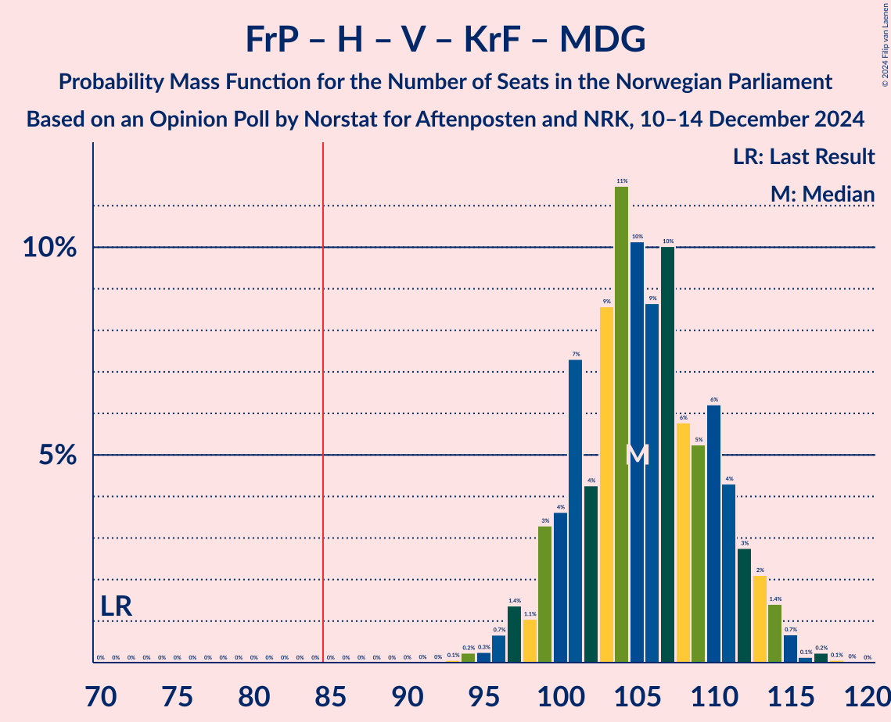
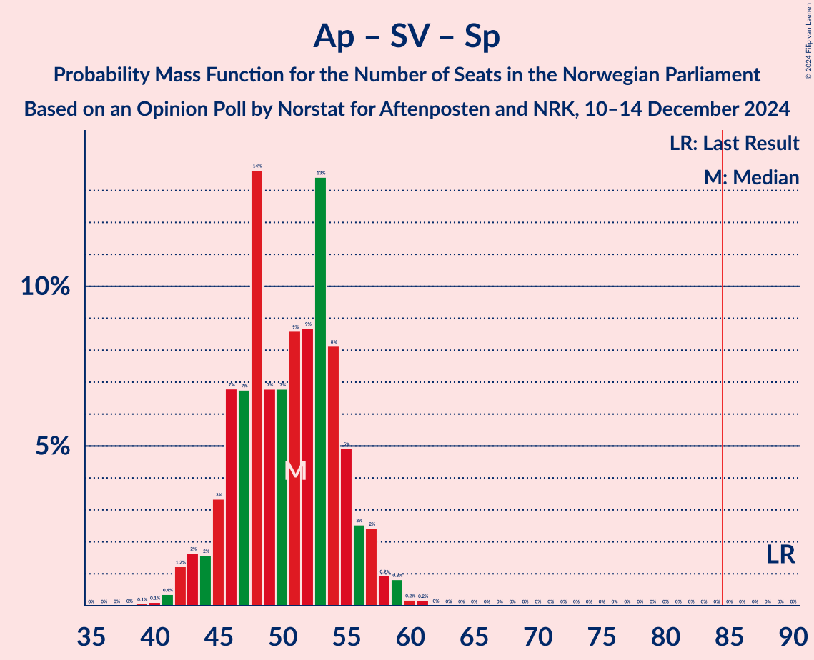

# Opinion Poll by Norstat for Aftenposten and NRK, 10–14 December 2024

<a href="#voting-intentions">Voting Intentions</a> | <a href="#seats">Seats</a> | <a href="#coalitions">Coalitions</a> | <a href="#technical-information">Technical Information</a>

## Voting Intentions

### Confidence Intervals

| Party | Last Result | Poll Result | 80% Confidence Interval | 90% Confidence Interval | 95% Confidence Interval | 99% Confidence Interval |
|:-----:|:-----------:|:-----------:|:-----------------------:|:-----------------------:|:-----------------------:|:-----------------------:|
| Fremskrittspartiet | 11.6% | 27.6% | 25.8–29.5% |25.3–30.0% |24.9–30.5% |24.1–31.4% |
| Høyre | 20.4% | 20.7% | 19.1–22.4% |18.7–22.9% |18.3–23.3% |17.6–24.2% |
| Arbeiderpartiet | 26.2% | 16.8% | 15.4–18.4% |15.0–18.9% |14.6–19.3% |13.9–20.0% |
| Sosialistisk Venstreparti | 7.6% | 6.9% | 6.0–8.0% |5.7–8.4% |5.5–8.7% |5.1–9.2% |
| Rødt | 4.7% | 6.8% | 5.9–7.9% |5.6–8.3% |5.4–8.5% |5.0–9.1% |
| Venstre | 4.6% | 4.8% | 4.0–5.8% |3.8–6.1% |3.6–6.3% |3.3–6.8% |
| Senterpartiet | 13.5% | 4.7% | 3.9–5.7% |3.7–6.0% |3.6–6.2% |3.2–6.7% |
| Kristelig Folkeparti | 3.8% | 4.2% | 3.5–5.1% |3.3–5.4% |3.1–5.6% |2.8–6.1% |
| Miljøpartiet De Grønne | 3.9% | 3.9% | 3.2–4.8% |3.0–5.1% |2.9–5.3% |2.6–5.8% |

*Note:* The poll result column reflects the actual value used in the calculations. Published results may vary slightly, and in addition be rounded to fewer digits.

## Seats

### Confidence Intervals

| Party | Last Result | Median | 80% Confidence Interval | 90% Confidence Interval | 95% Confidence Interval | 99% Confidence Interval |
|:-----:|:-----------:|:------:|:-----------------------:|:-----------------------:|:-----------------------:|:-----------------------:|
| <a href="#fremskrittspartiet">Fremskrittspartiet</a> | 21 | 52 | 48–57 |47–58 |46–59 |44–60 |
| <a href="#høyre">Høyre</a> | 36 | 36 | 34–39 |33–40 |33–41 |32–43 |
| <a href="#arbeiderpartiet">Arbeiderpartiet</a> | 48 | 33 | 30–36 |29–37 |29–38 |27–39 |
| <a href="#sosialistisk-venstreparti">Sosialistisk Venstreparti</a> | 13 | 11 | 9–13 |8–14 |8–14 |7–15 |
| <a href="#rødt">Rødt</a> | 8 | 11 | 8–13 |8–13 |8–14 |7–15 |
| <a href="#venstre">Venstre</a> | 8 | 7 | 5–9 |3–10 |3–10 |2–11 |
| <a href="#senterpartiet">Senterpartiet</a> | 28 | 7 | 1–9 |1–10 |1–10 |0–12 |
| <a href="#kristelig-folkeparti">Kristelig Folkeparti</a> | 3 | 6 | 3–8 |2–8 |2–9 |1–9 |
| <a href="#miljøpartiet-de-grønne">Miljøpartiet De Grønne</a> | 3 | 3 | 2–7 |2–8 |2–8 |1–9 |

### Fremskrittspartiet

*For a full overview of the results for this party, see the [Fremskrittspartiet](party-fremskrittspartiet.html) page.*

| Number of Seats | Probability | Accumulated | Special Marks |
|:---------------:|:-----------:|:-----------:|:-------------:|
| 21 | 0% | 100% | Last Result |
| 22 | 0% | 100% |  |
| 23 | 0% | 100% |  |
| 24 | 0% | 100% |  |
| 25 | 0% | 100% |  |
| 26 | 0% | 100% |  |
| 27 | 0% | 100% |  |
| 28 | 0% | 100% |  |
| 29 | 0% | 100% |  |
| 30 | 0% | 100% |  |
| 31 | 0% | 100% |  |
| 32 | 0% | 100% |  |
| 33 | 0% | 100% |  |
| 34 | 0% | 100% |  |
| 35 | 0% | 100% |  |
| 36 | 0% | 100% |  |
| 37 | 0% | 100% |  |
| 38 | 0% | 100% |  |
| 39 | 0% | 100% |  |
| 40 | 0% | 100% |  |
| 41 | 0% | 100% |  |
| 42 | 0% | 100% |  |
| 43 | 0.2% | 100% |  |
| 44 | 0.6% | 99.8% |  |
| 45 | 1.2% | 99.2% |  |
| 46 | 2% | 98% |  |
| 47 | 3% | 96% |  |
| 48 | 7% | 93% |  |
| 49 | 12% | 87% |  |
| 50 | 6% | 74% |  |
| 51 | 13% | 68% |  |
| 52 | 13% | 55% | Median |
| 53 | 14% | 42% |  |
| 54 | 7% | 28% |  |
| 55 | 4% | 21% |  |
| 56 | 5% | 18% |  |
| 57 | 6% | 13% |  |
| 58 | 3% | 7% |  |
| 59 | 2% | 4% |  |
| 60 | 1.3% | 2% |  |
| 61 | 0.3% | 0.4% |  |
| 62 | 0.1% | 0.1% |  |
| 63 | 0% | 0% |  |

### Høyre

*For a full overview of the results for this party, see the [Høyre](party-høyre.html) page.*

| Number of Seats | Probability | Accumulated | Special Marks |
|:---------------:|:-----------:|:-----------:|:-------------:|
| 31 | 0.3% | 100% |  |
| 32 | 2% | 99.7% |  |
| 33 | 6% | 98% |  |
| 34 | 6% | 91% |  |
| 35 | 28% | 86% |  |
| 36 | 11% | 58% | Last Result, Median |
| 37 | 15% | 47% |  |
| 38 | 14% | 32% |  |
| 39 | 10% | 18% |  |
| 40 | 4% | 8% |  |
| 41 | 2% | 4% |  |
| 42 | 1.1% | 2% |  |
| 43 | 0.4% | 0.7% |  |
| 44 | 0.1% | 0.3% |  |
| 45 | 0.1% | 0.2% |  |
| 46 | 0.1% | 0.1% |  |
| 47 | 0% | 0% |  |

### Arbeiderpartiet

*For a full overview of the results for this party, see the [Arbeiderpartiet](party-arbeiderpartiet.html) page.*

| Number of Seats | Probability | Accumulated | Special Marks |
|:---------------:|:-----------:|:-----------:|:-------------:|
| 25 | 0% | 100% |  |
| 26 | 0.2% | 99.9% |  |
| 27 | 0.5% | 99.7% |  |
| 28 | 1.0% | 99.3% |  |
| 29 | 6% | 98% |  |
| 30 | 8% | 92% |  |
| 31 | 8% | 84% |  |
| 32 | 15% | 77% |  |
| 33 | 18% | 62% | Median |
| 34 | 22% | 44% |  |
| 35 | 8% | 22% |  |
| 36 | 6% | 14% |  |
| 37 | 5% | 8% |  |
| 38 | 2% | 3% |  |
| 39 | 0.7% | 1.1% |  |
| 40 | 0.2% | 0.3% |  |
| 41 | 0.1% | 0.1% |  |
| 42 | 0% | 0% |  |
| 43 | 0% | 0% |  |
| 44 | 0% | 0% |  |
| 45 | 0% | 0% |  |
| 46 | 0% | 0% |  |
| 47 | 0% | 0% |  |
| 48 | 0% | 0% | Last Result |

### Sosialistisk Venstreparti

*For a full overview of the results for this party, see the [Sosialistisk Venstreparti](party-sosialistiskvenstreparti.html) page.*

| Number of Seats | Probability | Accumulated | Special Marks |
|:---------------:|:-----------:|:-----------:|:-------------:|
| 6 | 0.1% | 100% |  |
| 7 | 1.0% | 99.9% |  |
| 8 | 6% | 98.9% |  |
| 9 | 23% | 93% |  |
| 10 | 17% | 70% |  |
| 11 | 16% | 53% | Median |
| 12 | 23% | 37% |  |
| 13 | 8% | 14% | Last Result |
| 14 | 4% | 6% |  |
| 15 | 1.3% | 2% |  |
| 16 | 0.4% | 0.5% |  |
| 17 | 0.1% | 0.1% |  |
| 18 | 0% | 0% |  |

### Rødt

*For a full overview of the results for this party, see the [Rødt](party-rødt.html) page.*

| Number of Seats | Probability | Accumulated | Special Marks |
|:---------------:|:-----------:|:-----------:|:-------------:|
| 6 | 0.2% | 100% |  |
| 7 | 2% | 99.8% |  |
| 8 | 10% | 98% | Last Result |
| 9 | 20% | 88% |  |
| 10 | 17% | 67% |  |
| 11 | 20% | 51% | Median |
| 12 | 17% | 31% |  |
| 13 | 11% | 14% |  |
| 14 | 2% | 3% |  |
| 15 | 0.7% | 0.9% |  |
| 16 | 0.2% | 0.2% |  |
| 17 | 0% | 0% |  |

### Venstre

*For a full overview of the results for this party, see the [Venstre](party-venstre.html) page.*

| Number of Seats | Probability | Accumulated | Special Marks |
|:---------------:|:-----------:|:-----------:|:-------------:|
| 2 | 1.0% | 100% |  |
| 3 | 7% | 99.0% |  |
| 4 | 0% | 92% |  |
| 5 | 3% | 92% |  |
| 6 | 15% | 89% |  |
| 7 | 31% | 73% | Median |
| 8 | 25% | 42% | Last Result |
| 9 | 10% | 17% |  |
| 10 | 5% | 7% |  |
| 11 | 2% | 2% |  |
| 12 | 0.1% | 0.2% |  |
| 13 | 0% | 0% |  |

### Senterpartiet

*For a full overview of the results for this party, see the [Senterpartiet](party-senterpartiet.html) page.*

| Number of Seats | Probability | Accumulated | Special Marks |
|:---------------:|:-----------:|:-----------:|:-------------:|
| 0 | 0.8% | 100% |  |
| 1 | 10% | 99.2% |  |
| 2 | 0% | 89% |  |
| 3 | 0% | 89% |  |
| 4 | 0% | 89% |  |
| 5 | 3% | 89% |  |
| 6 | 20% | 86% |  |
| 7 | 30% | 66% | Median |
| 8 | 19% | 36% |  |
| 9 | 11% | 16% |  |
| 10 | 4% | 5% |  |
| 11 | 0.6% | 1.5% |  |
| 12 | 0.7% | 0.9% |  |
| 13 | 0.1% | 0.2% |  |
| 14 | 0% | 0% |  |
| 15 | 0% | 0% |  |
| 16 | 0% | 0% |  |
| 17 | 0% | 0% |  |
| 18 | 0% | 0% |  |
| 19 | 0% | 0% |  |
| 20 | 0% | 0% |  |
| 21 | 0% | 0% |  |
| 22 | 0% | 0% |  |
| 23 | 0% | 0% |  |
| 24 | 0% | 0% |  |
| 25 | 0% | 0% |  |
| 26 | 0% | 0% |  |
| 27 | 0% | 0% |  |
| 28 | 0% | 0% | Last Result |

### Kristelig Folkeparti

*For a full overview of the results for this party, see the [Kristelig Folkeparti](party-kristeligfolkeparti.html) page.*

| Number of Seats | Probability | Accumulated | Special Marks |
|:---------------:|:-----------:|:-----------:|:-------------:|
| 1 | 0.6% | 100% |  |
| 2 | 7% | 99.4% |  |
| 3 | 29% | 92% | Last Result |
| 4 | 0% | 63% |  |
| 5 | 2% | 63% |  |
| 6 | 22% | 62% | Median |
| 7 | 26% | 40% |  |
| 8 | 11% | 14% |  |
| 9 | 3% | 3% |  |
| 10 | 0.3% | 0.4% |  |
| 11 | 0.1% | 0.1% |  |
| 12 | 0% | 0% |  |

### Miljøpartiet De Grønne

*For a full overview of the results for this party, see the [Miljøpartiet De Grønne](party-miljøpartietdegrønne.html) page.*

| Number of Seats | Probability | Accumulated | Special Marks |
|:---------------:|:-----------:|:-----------:|:-------------:|
| 1 | 2% | 100% |  |
| 2 | 20% | 98% |  |
| 3 | 31% | 77% | Last Result, Median |
| 4 | 0% | 46% |  |
| 5 | 2% | 46% |  |
| 6 | 22% | 44% |  |
| 7 | 15% | 22% |  |
| 8 | 5% | 7% |  |
| 9 | 1.3% | 1.4% |  |
| 10 | 0.1% | 0.2% |  |
| 11 | 0% | 0% |  |

## Coalitions

### Confidence Intervals

| Coalition | Last Result | Median | Majority? | 80% Confidence Interval | 90% Confidence Interval | 95% Confidence Interval | 99% Confidence Interval |
|:---------:|:-----------:|:------:|:---------:|:-----------------------:|:-----------------------:|:-----------------------:|:-----------------------:|
| Fremskrittspartiet – Høyre – Venstre – Senterpartiet – Kristelig Folkeparti | 96 | 108 | 100% | 103–113 | 102–114 | 100–116 | 98–117 |
| Fremskrittspartiet – Høyre – Venstre – Kristelig Folkeparti – Miljøpartiet De Grønne | 71 | 105 | 100% | 100–111 | 99–112 | 98–113 | 95–115 |
| Fremskrittspartiet – Høyre – Venstre – Kristelig Folkeparti | 68 | 101 | 100% | 96–106 | 94–108 | 93–110 | 91–111 |
| Fremskrittspartiet – Høyre – Venstre | 65 | 95 | 99.6% | 90–101 | 89–102 | 88–103 | 86–104 |
| Fremskrittspartiet – Høyre | 57 | 88 | 87% | 84–94 | 82–95 | 82–96 | 80–98 |
| Arbeiderpartiet – Sosialistisk Venstreparti – Rødt – Senterpartiet – Miljøpartiet De Grønne | 100 | 66 | 0% | 59–70 | 58–72 | 56–74 | 55–77 |
| Arbeiderpartiet – Sosialistisk Venstreparti – Rødt – Senterpartiet | 97 | 61 | 0% | 55–67 | 54–68 | 53–69 | 50–71 |
| Arbeiderpartiet – Sosialistisk Venstreparti – Senterpartiet – Kristelig Folkeparti – Miljøpartiet De Grønne | 95 | 60 | 0% | 55–65 | 54–67 | 52–68 | 51–70 |
| Arbeiderpartiet – Sosialistisk Venstreparti – Rødt – Miljøpartiet De Grønne | 72 | 59 | 0% | 53–64 | 52–65 | 51–66 | 49–68 |
| Arbeiderpartiet – Sosialistisk Venstreparti – Senterpartiet – Miljøpartiet De Grønne | 92 | 55 | 0% | 49–60 | 48–61 | 47–62 | 45–65 |
| Arbeiderpartiet – Sosialistisk Venstreparti – Senterpartiet | 89 | 51 | 0% | 46–55 | 45–56 | 43–57 | 41–59 |
| Arbeiderpartiet – Senterpartiet – Kristelig Folkeparti – Miljøpartiet De Grønne | 82 | 50 | 0% | 44–54 | 43–55 | 41–56 | 40–59 |
| Høyre – Venstre – Kristelig Folkeparti | 47 | 49 | 0% | 45–53 | 44–54 | 43–55 | 41–57 |
| Arbeiderpartiet – Senterpartiet – Kristelig Folkeparti | 79 | 45 | 0% | 41–49 | 39–50 | 38–51 | 35–55 |
| Arbeiderpartiet – Sosialistisk Venstreparti | 61 | 44 | 0% | 40–48 | 39–49 | 39–50 | 36–51 |
| Arbeiderpartiet – Senterpartiet | 76 | 40 | 0% | 36–43 | 35–44 | 33–45 | 30–48 |
| Venstre – Senterpartiet – Kristelig Folkeparti | 39 | 19 | 0% | 15–23 | 13–25 | 12–25 | 11–27 |

### Fremskrittspartiet – Høyre – Venstre – Senterpartiet – Kristelig Folkeparti

| Number of Seats | Probability | Accumulated | Special Marks |
|:---------------:|:-----------:|:-----------:|:-------------:|
| 95 | 0.1% | 100% |  |
| 96 | 0.1% | 99.9% | Last Result |
| 97 | 0.1% | 99.8% |  |
| 98 | 0.3% | 99.7% |  |
| 99 | 0.6% | 99.4% |  |
| 100 | 2% | 98.7% |  |
| 101 | 2% | 97% |  |
| 102 | 2% | 95% |  |
| 103 | 7% | 93% |  |
| 104 | 8% | 86% |  |
| 105 | 6% | 78% |  |
| 106 | 13% | 72% |  |
| 107 | 8% | 60% |  |
| 108 | 14% | 51% | Median |
| 109 | 6% | 38% |  |
| 110 | 9% | 31% |  |
| 111 | 6% | 22% |  |
| 112 | 5% | 16% |  |
| 113 | 4% | 12% |  |
| 114 | 3% | 7% |  |
| 115 | 1.3% | 4% |  |
| 116 | 1.2% | 3% |  |
| 117 | 1.1% | 2% |  |
| 118 | 0.4% | 0.5% |  |
| 119 | 0.1% | 0.1% |  |
| 120 | 0% | 0% |  |

### Fremskrittspartiet – Høyre – Venstre – Kristelig Folkeparti – Miljøpartiet De Grønne

| Number of Seats | Probability | Accumulated | Special Marks |
|:---------------:|:-----------:|:-----------:|:-------------:|
| 71 | 0% | 100% | Last Result |
| 72 | 0% | 100% |  |
| 73 | 0% | 100% |  |
| 74 | 0% | 100% |  |
| 75 | 0% | 100% |  |
| 76 | 0% | 100% |  |
| 77 | 0% | 100% |  |
| 78 | 0% | 100% |  |
| 79 | 0% | 100% |  |
| 80 | 0% | 100% |  |
| 81 | 0% | 100% |  |
| 82 | 0% | 100% |  |
| 83 | 0% | 100% |  |
| 84 | 0% | 100% |  |
| 85 | 0% | 100% | Majority |
| 86 | 0% | 100% |  |
| 87 | 0% | 100% |  |
| 88 | 0% | 100% |  |
| 89 | 0% | 100% |  |
| 90 | 0% | 100% |  |
| 91 | 0% | 100% |  |
| 92 | 0% | 100% |  |
| 93 | 0.1% | 100% |  |
| 94 | 0.4% | 99.9% |  |
| 95 | 0.2% | 99.5% |  |
| 96 | 0.6% | 99.3% |  |
| 97 | 0.4% | 98.7% |  |
| 98 | 0.9% | 98% |  |
| 99 | 4% | 97% |  |
| 100 | 4% | 94% |  |
| 101 | 9% | 90% |  |
| 102 | 4% | 80% |  |
| 103 | 8% | 77% |  |
| 104 | 13% | 69% | Median |
| 105 | 8% | 56% |  |
| 106 | 8% | 48% |  |
| 107 | 13% | 40% |  |
| 108 | 6% | 27% |  |
| 109 | 4% | 21% |  |
| 110 | 5% | 17% |  |
| 111 | 5% | 12% |  |
| 112 | 2% | 7% |  |
| 113 | 2% | 5% |  |
| 114 | 1.1% | 2% |  |
| 115 | 0.8% | 1.3% |  |
| 116 | 0.1% | 0.5% |  |
| 117 | 0.3% | 0.4% |  |
| 118 | 0.1% | 0.1% |  |
| 119 | 0% | 0% |  |

### Fremskrittspartiet – Høyre – Venstre – Kristelig Folkeparti

| Number of Seats | Probability | Accumulated | Special Marks |
|:---------------:|:-----------:|:-----------:|:-------------:|
| 68 | 0% | 100% | Last Result |
| 69 | 0% | 100% |  |
| 70 | 0% | 100% |  |
| 71 | 0% | 100% |  |
| 72 | 0% | 100% |  |
| 73 | 0% | 100% |  |
| 74 | 0% | 100% |  |
| 75 | 0% | 100% |  |
| 76 | 0% | 100% |  |
| 77 | 0% | 100% |  |
| 78 | 0% | 100% |  |
| 79 | 0% | 100% |  |
| 80 | 0% | 100% |  |
| 81 | 0% | 100% |  |
| 82 | 0% | 100% |  |
| 83 | 0% | 100% |  |
| 84 | 0% | 100% |  |
| 85 | 0% | 100% | Majority |
| 86 | 0% | 100% |  |
| 87 | 0% | 100% |  |
| 88 | 0% | 100% |  |
| 89 | 0.1% | 99.9% |  |
| 90 | 0.2% | 99.8% |  |
| 91 | 0.8% | 99.5% |  |
| 92 | 0.4% | 98.8% |  |
| 93 | 1.4% | 98% |  |
| 94 | 2% | 97% |  |
| 95 | 2% | 95% |  |
| 96 | 3% | 92% |  |
| 97 | 7% | 89% |  |
| 98 | 11% | 83% |  |
| 99 | 8% | 71% |  |
| 100 | 7% | 64% |  |
| 101 | 14% | 57% | Median |
| 102 | 7% | 42% |  |
| 103 | 8% | 35% |  |
| 104 | 9% | 27% |  |
| 105 | 5% | 17% |  |
| 106 | 3% | 12% |  |
| 107 | 3% | 9% |  |
| 108 | 3% | 6% |  |
| 109 | 0.7% | 3% |  |
| 110 | 1.2% | 3% |  |
| 111 | 0.9% | 1.3% |  |
| 112 | 0.2% | 0.4% |  |
| 113 | 0.2% | 0.2% |  |
| 114 | 0.1% | 0.1% |  |
| 115 | 0% | 0% |  |

### Fremskrittspartiet – Høyre – Venstre

| Number of Seats | Probability | Accumulated | Special Marks |
|:---------------:|:-----------:|:-----------:|:-------------:|
| 65 | 0% | 100% | Last Result |
| 66 | 0% | 100% |  |
| 67 | 0% | 100% |  |
| 68 | 0% | 100% |  |
| 69 | 0% | 100% |  |
| 70 | 0% | 100% |  |
| 71 | 0% | 100% |  |
| 72 | 0% | 100% |  |
| 73 | 0% | 100% |  |
| 74 | 0% | 100% |  |
| 75 | 0% | 100% |  |
| 76 | 0% | 100% |  |
| 77 | 0% | 100% |  |
| 78 | 0% | 100% |  |
| 79 | 0% | 100% |  |
| 80 | 0% | 100% |  |
| 81 | 0% | 100% |  |
| 82 | 0% | 100% |  |
| 83 | 0% | 100% |  |
| 84 | 0.3% | 99.9% |  |
| 85 | 0.1% | 99.6% | Majority |
| 86 | 0.3% | 99.6% |  |
| 87 | 1.3% | 99.2% |  |
| 88 | 1.5% | 98% |  |
| 89 | 2% | 96% |  |
| 90 | 5% | 95% |  |
| 91 | 3% | 89% |  |
| 92 | 3% | 87% |  |
| 93 | 6% | 83% |  |
| 94 | 16% | 78% |  |
| 95 | 16% | 61% | Median |
| 96 | 8% | 46% |  |
| 97 | 10% | 38% |  |
| 98 | 7% | 28% |  |
| 99 | 5% | 21% |  |
| 100 | 3% | 16% |  |
| 101 | 5% | 12% |  |
| 102 | 3% | 7% |  |
| 103 | 2% | 4% |  |
| 104 | 1.4% | 2% |  |
| 105 | 0.2% | 0.4% |  |
| 106 | 0.1% | 0.2% |  |
| 107 | 0% | 0.1% |  |
| 108 | 0% | 0% |  |

### Fremskrittspartiet – Høyre

| Number of Seats | Probability | Accumulated | Special Marks |
|:---------------:|:-----------:|:-----------:|:-------------:|
| 57 | 0% | 100% | Last Result |
| 58 | 0% | 100% |  |
| 59 | 0% | 100% |  |
| 60 | 0% | 100% |  |
| 61 | 0% | 100% |  |
| 62 | 0% | 100% |  |
| 63 | 0% | 100% |  |
| 64 | 0% | 100% |  |
| 65 | 0% | 100% |  |
| 66 | 0% | 100% |  |
| 67 | 0% | 100% |  |
| 68 | 0% | 100% |  |
| 69 | 0% | 100% |  |
| 70 | 0% | 100% |  |
| 71 | 0% | 100% |  |
| 72 | 0% | 100% |  |
| 73 | 0% | 100% |  |
| 74 | 0% | 100% |  |
| 75 | 0% | 100% |  |
| 76 | 0% | 100% |  |
| 77 | 0.1% | 100% |  |
| 78 | 0.1% | 99.9% |  |
| 79 | 0.2% | 99.9% |  |
| 80 | 0.3% | 99.7% |  |
| 81 | 1.4% | 99.4% |  |
| 82 | 3% | 98% |  |
| 83 | 2% | 95% |  |
| 84 | 5% | 93% |  |
| 85 | 6% | 87% | Majority |
| 86 | 13% | 81% |  |
| 87 | 9% | 68% |  |
| 88 | 13% | 59% | Median |
| 89 | 8% | 46% |  |
| 90 | 13% | 38% |  |
| 91 | 5% | 26% |  |
| 92 | 6% | 21% |  |
| 93 | 5% | 15% |  |
| 94 | 4% | 10% |  |
| 95 | 2% | 6% |  |
| 96 | 2% | 3% |  |
| 97 | 0.7% | 1.3% |  |
| 98 | 0.5% | 0.7% |  |
| 99 | 0.1% | 0.1% |  |
| 100 | 0% | 0.1% |  |
| 101 | 0% | 0.1% |  |
| 102 | 0% | 0% |  |

### Arbeiderpartiet – Sosialistisk Venstreparti – Rødt – Senterpartiet – Miljøpartiet De Grønne

| Number of Seats | Probability | Accumulated | Special Marks |
|:---------------:|:-----------:|:-----------:|:-------------:|
| 53 | 0% | 100% |  |
| 54 | 0.1% | 99.9% |  |
| 55 | 1.4% | 99.8% |  |
| 56 | 1.0% | 98% |  |
| 57 | 1.1% | 97% |  |
| 58 | 4% | 96% |  |
| 59 | 2% | 92% |  |
| 60 | 6% | 90% |  |
| 61 | 4% | 84% |  |
| 62 | 4% | 80% |  |
| 63 | 7% | 75% |  |
| 64 | 8% | 68% |  |
| 65 | 9% | 60% | Median |
| 66 | 7% | 50% |  |
| 67 | 11% | 43% |  |
| 68 | 7% | 32% |  |
| 69 | 4% | 25% |  |
| 70 | 11% | 20% |  |
| 71 | 3% | 10% |  |
| 72 | 2% | 7% |  |
| 73 | 2% | 5% |  |
| 74 | 1.2% | 3% |  |
| 75 | 0.9% | 2% |  |
| 76 | 0.1% | 0.7% |  |
| 77 | 0.4% | 0.6% |  |
| 78 | 0.1% | 0.2% |  |
| 79 | 0.1% | 0.1% |  |
| 80 | 0% | 0% |  |
| 81 | 0% | 0% |  |
| 82 | 0% | 0% |  |
| 83 | 0% | 0% |  |
| 84 | 0% | 0% |  |
| 85 | 0% | 0% | Majority |
| 86 | 0% | 0% |  |
| 87 | 0% | 0% |  |
| 88 | 0% | 0% |  |
| 89 | 0% | 0% |  |
| 90 | 0% | 0% |  |
| 91 | 0% | 0% |  |
| 92 | 0% | 0% |  |
| 93 | 0% | 0% |  |
| 94 | 0% | 0% |  |
| 95 | 0% | 0% |  |
| 96 | 0% | 0% |  |
| 97 | 0% | 0% |  |
| 98 | 0% | 0% |  |
| 99 | 0% | 0% |  |
| 100 | 0% | 0% | Last Result |

### Arbeiderpartiet – Sosialistisk Venstreparti – Rødt – Senterpartiet

| Number of Seats | Probability | Accumulated | Special Marks |
|:---------------:|:-----------:|:-----------:|:-------------:|
| 49 | 0% | 100% |  |
| 50 | 0.5% | 99.9% |  |
| 51 | 0.4% | 99.4% |  |
| 52 | 0.6% | 99.0% |  |
| 53 | 2% | 98% |  |
| 54 | 2% | 96% |  |
| 55 | 7% | 95% |  |
| 56 | 5% | 88% |  |
| 57 | 8% | 83% |  |
| 58 | 9% | 75% |  |
| 59 | 4% | 66% |  |
| 60 | 6% | 62% |  |
| 61 | 8% | 56% |  |
| 62 | 11% | 47% | Median |
| 63 | 6% | 37% |  |
| 64 | 10% | 31% |  |
| 65 | 4% | 21% |  |
| 66 | 3% | 17% |  |
| 67 | 9% | 15% |  |
| 68 | 2% | 6% |  |
| 69 | 2% | 4% |  |
| 70 | 0.6% | 1.3% |  |
| 71 | 0.2% | 0.7% |  |
| 72 | 0.3% | 0.5% |  |
| 73 | 0.1% | 0.2% |  |
| 74 | 0% | 0.1% |  |
| 75 | 0% | 0% |  |
| 76 | 0% | 0% |  |
| 77 | 0% | 0% |  |
| 78 | 0% | 0% |  |
| 79 | 0% | 0% |  |
| 80 | 0% | 0% |  |
| 81 | 0% | 0% |  |
| 82 | 0% | 0% |  |
| 83 | 0% | 0% |  |
| 84 | 0% | 0% |  |
| 85 | 0% | 0% | Majority |
| 86 | 0% | 0% |  |
| 87 | 0% | 0% |  |
| 88 | 0% | 0% |  |
| 89 | 0% | 0% |  |
| 90 | 0% | 0% |  |
| 91 | 0% | 0% |  |
| 92 | 0% | 0% |  |
| 93 | 0% | 0% |  |
| 94 | 0% | 0% |  |
| 95 | 0% | 0% |  |
| 96 | 0% | 0% |  |
| 97 | 0% | 0% | Last Result |

### Arbeiderpartiet – Sosialistisk Venstreparti – Senterpartiet – Kristelig Folkeparti – Miljøpartiet De Grønne

| Number of Seats | Probability | Accumulated | Special Marks |
|:---------------:|:-----------:|:-----------:|:-------------:|
| 48 | 0% | 100% |  |
| 49 | 0.2% | 99.9% |  |
| 50 | 0.2% | 99.7% |  |
| 51 | 0.5% | 99.6% |  |
| 52 | 2% | 99.0% |  |
| 53 | 2% | 97% |  |
| 54 | 3% | 95% |  |
| 55 | 6% | 92% |  |
| 56 | 5% | 86% |  |
| 57 | 6% | 81% |  |
| 58 | 6% | 75% |  |
| 59 | 8% | 69% |  |
| 60 | 13% | 61% | Median |
| 61 | 9% | 48% |  |
| 62 | 8% | 39% |  |
| 63 | 14% | 31% |  |
| 64 | 4% | 16% |  |
| 65 | 3% | 13% |  |
| 66 | 4% | 9% |  |
| 67 | 1.2% | 5% |  |
| 68 | 2% | 4% |  |
| 69 | 1.3% | 2% |  |
| 70 | 0.2% | 0.6% |  |
| 71 | 0.3% | 0.4% |  |
| 72 | 0% | 0.1% |  |
| 73 | 0% | 0% |  |
| 74 | 0% | 0% |  |
| 75 | 0% | 0% |  |
| 76 | 0% | 0% |  |
| 77 | 0% | 0% |  |
| 78 | 0% | 0% |  |
| 79 | 0% | 0% |  |
| 80 | 0% | 0% |  |
| 81 | 0% | 0% |  |
| 82 | 0% | 0% |  |
| 83 | 0% | 0% |  |
| 84 | 0% | 0% |  |
| 85 | 0% | 0% | Majority |
| 86 | 0% | 0% |  |
| 87 | 0% | 0% |  |
| 88 | 0% | 0% |  |
| 89 | 0% | 0% |  |
| 90 | 0% | 0% |  |
| 91 | 0% | 0% |  |
| 92 | 0% | 0% |  |
| 93 | 0% | 0% |  |
| 94 | 0% | 0% |  |
| 95 | 0% | 0% | Last Result |

### Arbeiderpartiet – Sosialistisk Venstreparti – Rødt – Miljøpartiet De Grønne

| Number of Seats | Probability | Accumulated | Special Marks |
|:---------------:|:-----------:|:-----------:|:-------------:|
| 48 | 0.1% | 100% |  |
| 49 | 1.5% | 99.9% |  |
| 50 | 0.4% | 98% |  |
| 51 | 1.4% | 98% |  |
| 52 | 5% | 97% |  |
| 53 | 2% | 91% |  |
| 54 | 5% | 89% |  |
| 55 | 5% | 85% |  |
| 56 | 9% | 80% |  |
| 57 | 8% | 71% |  |
| 58 | 10% | 63% | Median |
| 59 | 7% | 54% |  |
| 60 | 14% | 46% |  |
| 61 | 7% | 32% |  |
| 62 | 10% | 25% |  |
| 63 | 3% | 15% |  |
| 64 | 4% | 12% |  |
| 65 | 4% | 7% |  |
| 66 | 2% | 3% |  |
| 67 | 0.6% | 2% |  |
| 68 | 0.7% | 1.1% |  |
| 69 | 0.1% | 0.4% |  |
| 70 | 0.1% | 0.2% |  |
| 71 | 0.1% | 0.2% |  |
| 72 | 0.1% | 0.1% | Last Result |
| 73 | 0% | 0% |  |

### Arbeiderpartiet – Sosialistisk Venstreparti – Senterpartiet – Miljøpartiet De Grønne

| Number of Seats | Probability | Accumulated | Special Marks |
|:---------------:|:-----------:|:-----------:|:-------------:|
| 43 | 0.2% | 100% |  |
| 44 | 0.1% | 99.8% |  |
| 45 | 0.3% | 99.7% |  |
| 46 | 1.0% | 99.4% |  |
| 47 | 2% | 98% |  |
| 48 | 2% | 97% |  |
| 49 | 5% | 94% |  |
| 50 | 4% | 89% |  |
| 51 | 4% | 85% |  |
| 52 | 7% | 81% |  |
| 53 | 8% | 74% |  |
| 54 | 9% | 66% | Median |
| 55 | 12% | 57% |  |
| 56 | 11% | 45% |  |
| 57 | 13% | 34% |  |
| 58 | 4% | 22% |  |
| 59 | 7% | 17% |  |
| 60 | 3% | 10% |  |
| 61 | 5% | 8% |  |
| 62 | 1.2% | 3% |  |
| 63 | 0.9% | 2% |  |
| 64 | 0.3% | 1.0% |  |
| 65 | 0.4% | 0.6% |  |
| 66 | 0.2% | 0.2% |  |
| 67 | 0% | 0% |  |
| 68 | 0% | 0% |  |
| 69 | 0% | 0% |  |
| 70 | 0% | 0% |  |
| 71 | 0% | 0% |  |
| 72 | 0% | 0% |  |
| 73 | 0% | 0% |  |
| 74 | 0% | 0% |  |
| 75 | 0% | 0% |  |
| 76 | 0% | 0% |  |
| 77 | 0% | 0% |  |
| 78 | 0% | 0% |  |
| 79 | 0% | 0% |  |
| 80 | 0% | 0% |  |
| 81 | 0% | 0% |  |
| 82 | 0% | 0% |  |
| 83 | 0% | 0% |  |
| 84 | 0% | 0% |  |
| 85 | 0% | 0% | Majority |
| 86 | 0% | 0% |  |
| 87 | 0% | 0% |  |
| 88 | 0% | 0% |  |
| 89 | 0% | 0% |  |
| 90 | 0% | 0% |  |
| 91 | 0% | 0% |  |
| 92 | 0% | 0% | Last Result |

### Arbeiderpartiet – Sosialistisk Venstreparti – Senterpartiet

| Number of Seats | Probability | Accumulated | Special Marks |
|:---------------:|:-----------:|:-----------:|:-------------:|
| 39 | 0.1% | 100% |  |
| 40 | 0.1% | 99.9% |  |
| 41 | 0.4% | 99.8% |  |
| 42 | 0.8% | 99.4% |  |
| 43 | 2% | 98.6% |  |
| 44 | 1.1% | 97% |  |
| 45 | 3% | 96% |  |
| 46 | 7% | 93% |  |
| 47 | 7% | 86% |  |
| 48 | 14% | 79% |  |
| 49 | 8% | 65% |  |
| 50 | 7% | 57% |  |
| 51 | 10% | 50% | Median |
| 52 | 6% | 40% |  |
| 53 | 12% | 34% |  |
| 54 | 9% | 22% |  |
| 55 | 6% | 13% |  |
| 56 | 2% | 7% |  |
| 57 | 3% | 4% |  |
| 58 | 0.5% | 1.3% |  |
| 59 | 0.4% | 0.8% |  |
| 60 | 0.2% | 0.5% |  |
| 61 | 0.3% | 0.3% |  |
| 62 | 0% | 0% |  |
| 63 | 0% | 0% |  |
| 64 | 0% | 0% |  |
| 65 | 0% | 0% |  |
| 66 | 0% | 0% |  |
| 67 | 0% | 0% |  |
| 68 | 0% | 0% |  |
| 69 | 0% | 0% |  |
| 70 | 0% | 0% |  |
| 71 | 0% | 0% |  |
| 72 | 0% | 0% |  |
| 73 | 0% | 0% |  |
| 74 | 0% | 0% |  |
| 75 | 0% | 0% |  |
| 76 | 0% | 0% |  |
| 77 | 0% | 0% |  |
| 78 | 0% | 0% |  |
| 79 | 0% | 0% |  |
| 80 | 0% | 0% |  |
| 81 | 0% | 0% |  |
| 82 | 0% | 0% |  |
| 83 | 0% | 0% |  |
| 84 | 0% | 0% |  |
| 85 | 0% | 0% | Majority |
| 86 | 0% | 0% |  |
| 87 | 0% | 0% |  |
| 88 | 0% | 0% |  |
| 89 | 0% | 0% | Last Result |

### Arbeiderpartiet – Senterpartiet – Kristelig Folkeparti – Miljøpartiet De Grønne

| Number of Seats | Probability | Accumulated | Special Marks |
|:---------------:|:-----------:|:-----------:|:-------------:|
| 36 | 0% | 100% |  |
| 37 | 0% | 99.9% |  |
| 38 | 0.1% | 99.9% |  |
| 39 | 0.2% | 99.8% |  |
| 40 | 1.3% | 99.7% |  |
| 41 | 0.9% | 98% |  |
| 42 | 1.4% | 97% |  |
| 43 | 3% | 96% |  |
| 44 | 4% | 93% |  |
| 45 | 2% | 89% |  |
| 46 | 8% | 87% |  |
| 47 | 7% | 79% |  |
| 48 | 11% | 72% |  |
| 49 | 7% | 61% | Median |
| 50 | 6% | 53% |  |
| 51 | 18% | 47% |  |
| 52 | 10% | 29% |  |
| 53 | 6% | 19% |  |
| 54 | 5% | 12% |  |
| 55 | 3% | 7% |  |
| 56 | 1.5% | 4% |  |
| 57 | 1.2% | 2% |  |
| 58 | 0.6% | 1.3% |  |
| 59 | 0.3% | 0.7% |  |
| 60 | 0.3% | 0.4% |  |
| 61 | 0.1% | 0.1% |  |
| 62 | 0% | 0% |  |
| 63 | 0% | 0% |  |
| 64 | 0% | 0% |  |
| 65 | 0% | 0% |  |
| 66 | 0% | 0% |  |
| 67 | 0% | 0% |  |
| 68 | 0% | 0% |  |
| 69 | 0% | 0% |  |
| 70 | 0% | 0% |  |
| 71 | 0% | 0% |  |
| 72 | 0% | 0% |  |
| 73 | 0% | 0% |  |
| 74 | 0% | 0% |  |
| 75 | 0% | 0% |  |
| 76 | 0% | 0% |  |
| 77 | 0% | 0% |  |
| 78 | 0% | 0% |  |
| 79 | 0% | 0% |  |
| 80 | 0% | 0% |  |
| 81 | 0% | 0% |  |
| 82 | 0% | 0% | Last Result |

### Høyre – Venstre – Kristelig Folkeparti

| Number of Seats | Probability | Accumulated | Special Marks |
|:---------------:|:-----------:|:-----------:|:-------------:|
| 39 | 0.1% | 100% |  |
| 40 | 0.2% | 99.8% |  |
| 41 | 0.4% | 99.7% |  |
| 42 | 1.0% | 99.3% |  |
| 43 | 2% | 98% |  |
| 44 | 2% | 96% |  |
| 45 | 13% | 95% |  |
| 46 | 4% | 82% |  |
| 47 | 10% | 78% | Last Result |
| 48 | 12% | 69% |  |
| 49 | 12% | 57% | Median |
| 50 | 16% | 45% |  |
| 51 | 11% | 29% |  |
| 52 | 5% | 18% |  |
| 53 | 7% | 13% |  |
| 54 | 4% | 7% |  |
| 55 | 1.1% | 3% |  |
| 56 | 0.8% | 2% |  |
| 57 | 0.7% | 1.0% |  |
| 58 | 0.1% | 0.3% |  |
| 59 | 0.1% | 0.2% |  |
| 60 | 0.1% | 0.1% |  |
| 61 | 0% | 0% |  |

### Arbeiderpartiet – Senterpartiet – Kristelig Folkeparti

| Number of Seats | Probability | Accumulated | Special Marks |
|:---------------:|:-----------:|:-----------:|:-------------:|
| 32 | 0.1% | 100% |  |
| 33 | 0.2% | 99.8% |  |
| 34 | 0.1% | 99.6% |  |
| 35 | 0.1% | 99.5% |  |
| 36 | 0.2% | 99.4% |  |
| 37 | 0.8% | 99.2% |  |
| 38 | 1.2% | 98% |  |
| 39 | 3% | 97% |  |
| 40 | 4% | 95% |  |
| 41 | 5% | 91% |  |
| 42 | 5% | 86% |  |
| 43 | 11% | 81% |  |
| 44 | 6% | 70% |  |
| 45 | 24% | 64% |  |
| 46 | 8% | 40% | Median |
| 47 | 8% | 32% |  |
| 48 | 11% | 24% |  |
| 49 | 5% | 13% |  |
| 50 | 4% | 8% |  |
| 51 | 3% | 5% |  |
| 52 | 0.7% | 2% |  |
| 53 | 0.5% | 2% |  |
| 54 | 0.5% | 1.0% |  |
| 55 | 0.3% | 0.5% |  |
| 56 | 0.2% | 0.2% |  |
| 57 | 0% | 0% |  |
| 58 | 0% | 0% |  |
| 59 | 0% | 0% |  |
| 60 | 0% | 0% |  |
| 61 | 0% | 0% |  |
| 62 | 0% | 0% |  |
| 63 | 0% | 0% |  |
| 64 | 0% | 0% |  |
| 65 | 0% | 0% |  |
| 66 | 0% | 0% |  |
| 67 | 0% | 0% |  |
| 68 | 0% | 0% |  |
| 69 | 0% | 0% |  |
| 70 | 0% | 0% |  |
| 71 | 0% | 0% |  |
| 72 | 0% | 0% |  |
| 73 | 0% | 0% |  |
| 74 | 0% | 0% |  |
| 75 | 0% | 0% |  |
| 76 | 0% | 0% |  |
| 77 | 0% | 0% |  |
| 78 | 0% | 0% |  |
| 79 | 0% | 0% | Last Result |

### Arbeiderpartiet – Sosialistisk Venstreparti

| Number of Seats | Probability | Accumulated | Special Marks |
|:---------------:|:-----------:|:-----------:|:-------------:|
| 35 | 0.1% | 100% |  |
| 36 | 0.4% | 99.9% |  |
| 37 | 0.7% | 99.5% |  |
| 38 | 1.1% | 98.8% |  |
| 39 | 5% | 98% |  |
| 40 | 7% | 93% |  |
| 41 | 11% | 86% |  |
| 42 | 15% | 74% |  |
| 43 | 7% | 60% |  |
| 44 | 8% | 53% | Median |
| 45 | 10% | 45% |  |
| 46 | 20% | 35% |  |
| 47 | 5% | 15% |  |
| 48 | 4% | 10% |  |
| 49 | 3% | 6% |  |
| 50 | 2% | 3% |  |
| 51 | 0.5% | 0.7% |  |
| 52 | 0.2% | 0.2% |  |
| 53 | 0% | 0% |  |
| 54 | 0% | 0% |  |
| 55 | 0% | 0% |  |
| 56 | 0% | 0% |  |
| 57 | 0% | 0% |  |
| 58 | 0% | 0% |  |
| 59 | 0% | 0% |  |
| 60 | 0% | 0% |  |
| 61 | 0% | 0% | Last Result |

### Arbeiderpartiet – Senterpartiet

| Number of Seats | Probability | Accumulated | Special Marks |
|:---------------:|:-----------:|:-----------:|:-------------:|
| 28 | 0.1% | 100% |  |
| 29 | 0.1% | 99.9% |  |
| 30 | 0.6% | 99.8% |  |
| 31 | 0.6% | 99.2% |  |
| 32 | 1.0% | 98.6% |  |
| 33 | 0.4% | 98% |  |
| 34 | 1.4% | 97% |  |
| 35 | 2% | 96% |  |
| 36 | 5% | 94% |  |
| 37 | 10% | 89% |  |
| 38 | 11% | 79% |  |
| 39 | 14% | 68% |  |
| 40 | 10% | 54% | Median |
| 41 | 17% | 44% |  |
| 42 | 16% | 27% |  |
| 43 | 4% | 11% |  |
| 44 | 3% | 7% |  |
| 45 | 1.2% | 4% |  |
| 46 | 1.0% | 2% |  |
| 47 | 0.7% | 1.3% |  |
| 48 | 0.5% | 0.7% |  |
| 49 | 0.1% | 0.1% |  |
| 50 | 0% | 0% |  |
| 51 | 0% | 0% |  |
| 52 | 0% | 0% |  |
| 53 | 0% | 0% |  |
| 54 | 0% | 0% |  |
| 55 | 0% | 0% |  |
| 56 | 0% | 0% |  |
| 57 | 0% | 0% |  |
| 58 | 0% | 0% |  |
| 59 | 0% | 0% |  |
| 60 | 0% | 0% |  |
| 61 | 0% | 0% |  |
| 62 | 0% | 0% |  |
| 63 | 0% | 0% |  |
| 64 | 0% | 0% |  |
| 65 | 0% | 0% |  |
| 66 | 0% | 0% |  |
| 67 | 0% | 0% |  |
| 68 | 0% | 0% |  |
| 69 | 0% | 0% |  |
| 70 | 0% | 0% |  |
| 71 | 0% | 0% |  |
| 72 | 0% | 0% |  |
| 73 | 0% | 0% |  |
| 74 | 0% | 0% |  |
| 75 | 0% | 0% |  |
| 76 | 0% | 0% | Last Result |

### Venstre – Senterpartiet – Kristelig Folkeparti

| Number of Seats | Probability | Accumulated | Special Marks |
|:---------------:|:-----------:|:-----------:|:-------------:|
| 7 | 0% | 100% |  |
| 8 | 0% | 99.9% |  |
| 9 | 0% | 99.9% |  |
| 10 | 0.2% | 99.9% |  |
| 11 | 1.4% | 99.7% |  |
| 12 | 2% | 98% |  |
| 13 | 1.2% | 96% |  |
| 14 | 2% | 95% |  |
| 15 | 5% | 93% |  |
| 16 | 8% | 88% |  |
| 17 | 6% | 80% |  |
| 18 | 15% | 74% |  |
| 19 | 15% | 59% |  |
| 20 | 10% | 44% | Median |
| 21 | 9% | 34% |  |
| 22 | 13% | 25% |  |
| 23 | 3% | 12% |  |
| 24 | 3% | 9% |  |
| 25 | 4% | 6% |  |
| 26 | 2% | 2% |  |
| 27 | 0.2% | 0.6% |  |
| 28 | 0.3% | 0.4% |  |
| 29 | 0.1% | 0.1% |  |
| 30 | 0% | 0% |  |
| 31 | 0% | 0% |  |
| 32 | 0% | 0% |  |
| 33 | 0% | 0% |  |
| 34 | 0% | 0% |  |
| 35 | 0% | 0% |  |
| 36 | 0% | 0% |  |
| 37 | 0% | 0% |  |
| 38 | 0% | 0% |  |
| 39 | 0% | 0% | Last Result |

## Technical Information

### Opinion Poll

+ **Polling firm:** Norstat
+ **Commissioner(s):** Aftenposten and NRK
+ **Fieldwork period:** 10–14 December 2024

### Calculations

+ **Sample size:** 1000
+ **Simulations done:** 1,048,576
+ **Error estimate:** 0.98%

