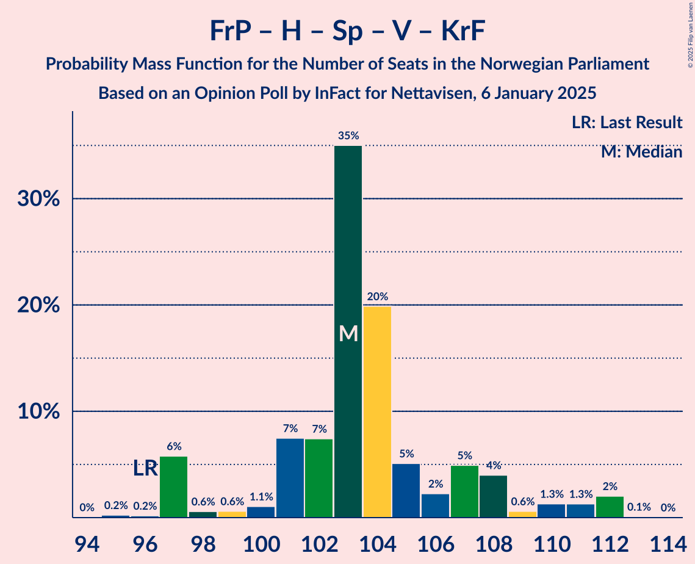
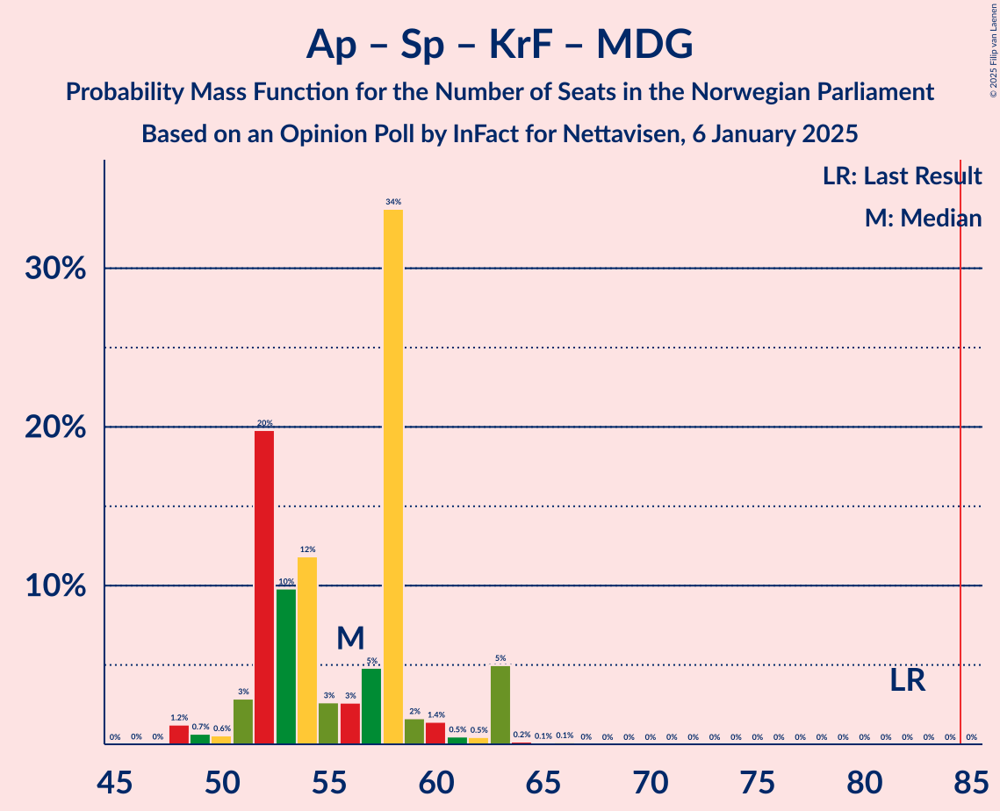
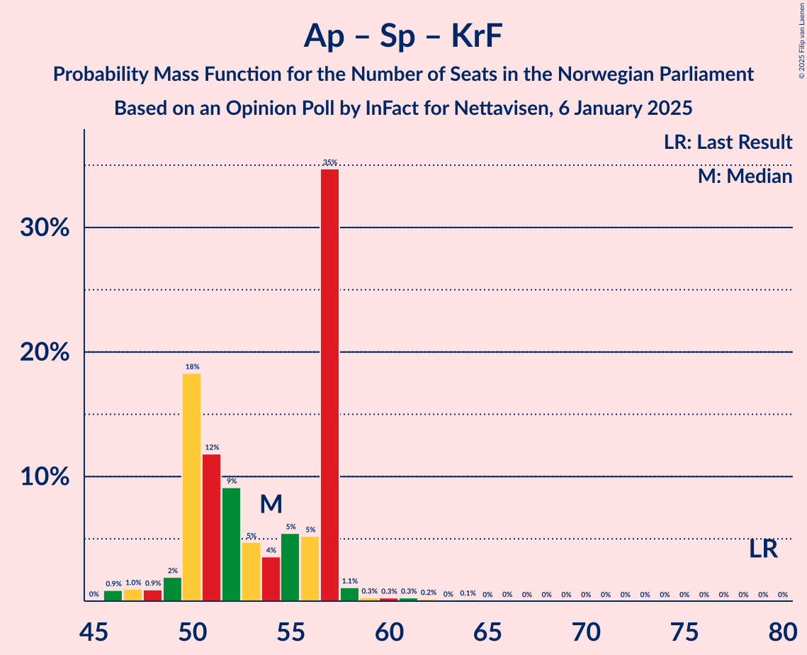
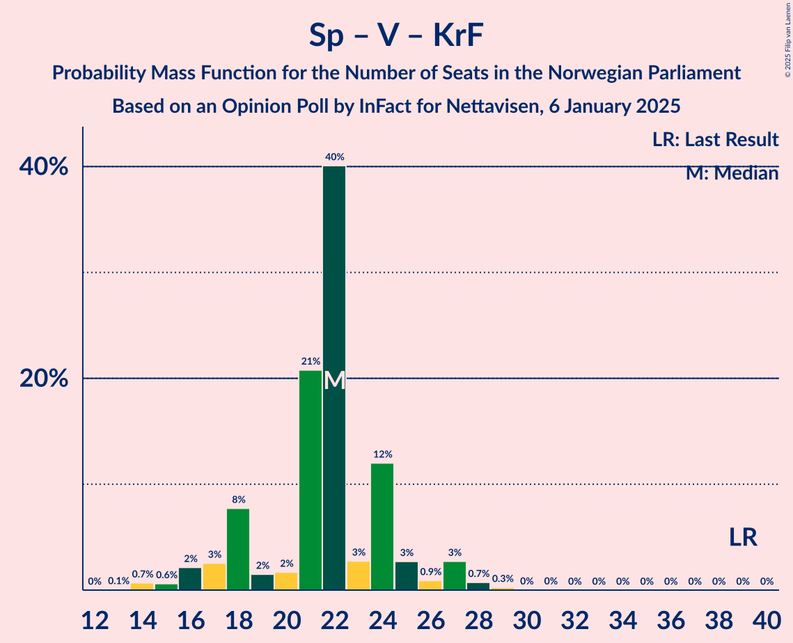

# Opinion Poll by InFact for Nettavisen, 6 January 2025

<a href="#voting-intentions">Voting Intentions</a> | <a href="#seats">Seats</a> | <a href="#coalitions">Coalitions</a> | <a href="#technical-information">Technical Information</a>

## Voting Intentions

### Confidence Intervals

| Party | Last Result | Poll Result | 80% Confidence Interval | 90% Confidence Interval | 95% Confidence Interval | 99% Confidence Interval |
|:-----:|:-----------:|:-----------:|:-----------------------:|:-----------------------:|:-----------------------:|:-----------------------:|
| Fremskrittspartiet | 11.6% | 24.2% | 22.6–25.9% |22.2–26.4% |21.8–26.8% |21.1–27.6% |
| Høyre | 20.4% | 21.0% | 19.5–22.6% |19.1–23.0% |18.7–23.4% |18.0–24.2% |
| Arbeiderpartiet | 26.2% | 20.6% | 19.1–22.2% |18.7–22.7% |18.4–23.1% |17.7–23.9% |
| Sosialistisk Venstreparti | 7.6% | 7.5% | 6.5–8.6% |6.3–8.9% |6.1–9.1% |5.7–9.7% |
| Senterpartiet | 13.5% | 6.5% | 5.6–7.5% |5.4–7.8% |5.2–8.1% |4.8–8.6% |
| Rødt | 4.7% | 5.7% | 4.9–6.7% |4.7–7.0% |4.5–7.2% |4.1–7.7% |
| Venstre | 4.6% | 4.5% | 3.8–5.4% |3.6–5.6% |3.4–5.8% |3.1–6.3% |
| Kristelig Folkeparti | 3.8% | 3.2% | 2.6–3.9% |2.4–4.1% |2.3–4.3% |2.0–4.8% |
| Miljøpartiet De Grønne | 3.9% | 3.0% | 2.4–3.7% |2.3–3.9% |2.1–4.1% |1.9–4.5% |
| Industri- og Næringspartiet | 0.3% | 1.5% | 1.1–2.1% |1.0–2.2% |0.9–2.4% |0.8–2.7% |
| Konservativt | 0.4% | 0.7% | 0.5–1.1% |0.4–1.3% |0.4–1.4% |0.3–1.6% |
| Norgesdemokratene | 1.1% | 0.3% | 0.2–0.6% |0.1–0.7% |0.1–0.8% |0.0–1.0% |
| Pensjonistpartiet | 0.6% | 0.2% | 0.1–0.5% |0.1–0.6% |0.0–0.6% |0.0–0.8% |
| Helsepartiet | 0.2% | 0.2% | 0.1–0.5% |0.1–0.6% |0.0–0.6% |0.0–0.8% |

*Note:* The poll result column reflects the actual value used in the calculations. Published results may vary slightly, and in addition be rounded to fewer digits.

## Seats

### Confidence Intervals

| Party | Last Result | Median | 80% Confidence Interval | 90% Confidence Interval | 95% Confidence Interval | 99% Confidence Interval |
|:-----:|:-----------:|:------:|:-----------------------:|:-----------------------:|:-----------------------:|:-----------------------:|
| <a href="#fremskrittspartiet">Fremskrittspartiet</a> | 21 | 43 | 41–48 |41–48 |41–50 |39–51 |
| <a href="#høyre">Høyre</a> | 36 | 39 | 35–40 |34–41 |33–43 |32–44 |
| <a href="#arbeiderpartiet">Arbeiderpartiet</a> | 48 | 38 | 35–41 |35–41 |35–43 |33–46 |
| <a href="#sosialistisk-venstreparti">Sosialistisk Venstreparti</a> | 13 | 15 | 12–16 |11–16 |10–16 |9–18 |
| <a href="#senterpartiet">Senterpartiet</a> | 28 | 12 | 10–13 |9–14 |9–15 |8–16 |
| <a href="#rødt">Rødt</a> | 8 | 11 | 9–12 |8–12 |8–13 |1–15 |
| <a href="#venstre">Venstre</a> | 8 | 7 | 3–10 |2–10 |2–10 |2–12 |
| <a href="#kristelig-folkeparti">Kristelig Folkeparti</a> | 3 | 3 | 2–7 |1–7 |0–8 |0–8 |
| <a href="#miljøpartiet-de-grønne">Miljøpartiet De Grønne</a> | 3 | 1 | 1–3 |1–8 |1–8 |1–8 |
| <a href="#industri--og-næringspartiet">Industri- og Næringspartiet</a> | 0 | 0 | 0–2 |0–2 |0–2 |0–2 |
| <a href="#konservativt">Konservativt</a> | 0 | 0 | 0 |0 |0 |0 |
| <a href="#norgesdemokratene">Norgesdemokratene</a> | 0 | 0 | 0 |0 |0 |0 |
| <a href="#pensjonistpartiet">Pensjonistpartiet</a> | 0 | 0 | 0 |0 |0 |0 |
| <a href="#helsepartiet">Helsepartiet</a> | 0 | 0 | 0 |0 |0 |0 |

### Fremskrittspartiet

*For a full overview of the results for this party, see the [Fremskrittspartiet](party-fremskrittspartiet.html) page.*

| Number of Seats | Probability | Accumulated | Special Marks |
|:---------------:|:-----------:|:-----------:|:-------------:|
| 21 | 0% | 100% | Last Result |
| 22 | 0% | 100% |  |
| 23 | 0% | 100% |  |
| 24 | 0% | 100% |  |
| 25 | 0% | 100% |  |
| 26 | 0% | 100% |  |
| 27 | 0% | 100% |  |
| 28 | 0% | 100% |  |
| 29 | 0% | 100% |  |
| 30 | 0% | 100% |  |
| 31 | 0% | 100% |  |
| 32 | 0% | 100% |  |
| 33 | 0% | 100% |  |
| 34 | 0% | 100% |  |
| 35 | 0% | 100% |  |
| 36 | 0% | 100% |  |
| 37 | 0% | 100% |  |
| 38 | 0% | 100% |  |
| 39 | 0.5% | 99.9% |  |
| 40 | 0.9% | 99.4% |  |
| 41 | 33% | 98% |  |
| 42 | 2% | 65% |  |
| 43 | 17% | 63% | Median |
| 44 | 6% | 47% |  |
| 45 | 3% | 41% |  |
| 46 | 13% | 38% |  |
| 47 | 0.7% | 25% |  |
| 48 | 21% | 25% |  |
| 49 | 0.6% | 4% |  |
| 50 | 2% | 3% |  |
| 51 | 0.6% | 0.6% |  |
| 52 | 0.1% | 0.1% |  |
| 53 | 0% | 0% |  |

### Høyre

*For a full overview of the results for this party, see the [Høyre](party-høyre.html) page.*

| Number of Seats | Probability | Accumulated | Special Marks |
|:---------------:|:-----------:|:-----------:|:-------------:|
| 31 | 0.1% | 100% |  |
| 32 | 2% | 99.9% |  |
| 33 | 0.5% | 98% |  |
| 34 | 5% | 97% |  |
| 35 | 27% | 93% |  |
| 36 | 8% | 66% | Last Result |
| 37 | 1.0% | 58% |  |
| 38 | 4% | 57% |  |
| 39 | 10% | 53% | Median |
| 40 | 37% | 43% |  |
| 41 | 2% | 6% |  |
| 42 | 0.8% | 3% |  |
| 43 | 0.4% | 3% |  |
| 44 | 2% | 2% |  |
| 45 | 0.4% | 0.4% |  |
| 46 | 0% | 0% |  |

### Arbeiderpartiet

*For a full overview of the results for this party, see the [Arbeiderpartiet](party-arbeiderpartiet.html) page.*

| Number of Seats | Probability | Accumulated | Special Marks |
|:---------------:|:-----------:|:-----------:|:-------------:|
| 32 | 0.1% | 100% |  |
| 33 | 0.5% | 99.9% |  |
| 34 | 2% | 99.4% |  |
| 35 | 8% | 98% |  |
| 36 | 6% | 89% |  |
| 37 | 4% | 84% |  |
| 38 | 56% | 80% | Median |
| 39 | 10% | 24% |  |
| 40 | 3% | 14% |  |
| 41 | 8% | 12% |  |
| 42 | 1.0% | 4% |  |
| 43 | 0.6% | 3% |  |
| 44 | 0.9% | 2% |  |
| 45 | 0.2% | 1.3% |  |
| 46 | 0.7% | 1.1% |  |
| 47 | 0.2% | 0.5% |  |
| 48 | 0.1% | 0.2% | Last Result |
| 49 | 0.1% | 0.1% |  |
| 50 | 0% | 0% |  |

### Sosialistisk Venstreparti

*For a full overview of the results for this party, see the [Sosialistisk Venstreparti](party-sosialistiskvenstreparti.html) page.*

| Number of Seats | Probability | Accumulated | Special Marks |
|:---------------:|:-----------:|:-----------:|:-------------:|
| 9 | 1.2% | 100% |  |
| 10 | 2% | 98.8% |  |
| 11 | 6% | 97% |  |
| 12 | 6% | 91% |  |
| 13 | 20% | 85% | Last Result |
| 14 | 13% | 65% |  |
| 15 | 41% | 52% | Median |
| 16 | 9% | 11% |  |
| 17 | 1.5% | 2% |  |
| 18 | 0.3% | 0.6% |  |
| 19 | 0.3% | 0.3% |  |
| 20 | 0% | 0% |  |

### Senterpartiet

*For a full overview of the results for this party, see the [Senterpartiet](party-senterpartiet.html) page.*

| Number of Seats | Probability | Accumulated | Special Marks |
|:---------------:|:-----------:|:-----------:|:-------------:|
| 7 | 0.1% | 100% |  |
| 8 | 0.7% | 99.9% |  |
| 9 | 7% | 99.2% |  |
| 10 | 18% | 92% |  |
| 11 | 6% | 74% |  |
| 12 | 42% | 68% | Median |
| 13 | 21% | 26% |  |
| 14 | 1.0% | 5% |  |
| 15 | 3% | 4% |  |
| 16 | 0.9% | 1.0% |  |
| 17 | 0.1% | 0.1% |  |
| 18 | 0% | 0% |  |
| 19 | 0% | 0% |  |
| 20 | 0% | 0% |  |
| 21 | 0% | 0% |  |
| 22 | 0% | 0% |  |
| 23 | 0% | 0% |  |
| 24 | 0% | 0% |  |
| 25 | 0% | 0% |  |
| 26 | 0% | 0% |  |
| 27 | 0% | 0% |  |
| 28 | 0% | 0% | Last Result |

### Rødt

*For a full overview of the results for this party, see the [Rødt](party-rødt.html) page.*

| Number of Seats | Probability | Accumulated | Special Marks |
|:---------------:|:-----------:|:-----------:|:-------------:|
| 1 | 2% | 100% |  |
| 2 | 0% | 98% |  |
| 3 | 0% | 98% |  |
| 4 | 0% | 98% |  |
| 5 | 0% | 98% |  |
| 6 | 0% | 98% |  |
| 7 | 0.1% | 98% |  |
| 8 | 5% | 98% | Last Result |
| 9 | 23% | 93% |  |
| 10 | 16% | 70% |  |
| 11 | 42% | 54% | Median |
| 12 | 9% | 12% |  |
| 13 | 1.2% | 3% |  |
| 14 | 0.8% | 2% |  |
| 15 | 1.2% | 1.3% |  |
| 16 | 0% | 0% |  |

### Venstre

*For a full overview of the results for this party, see the [Venstre](party-venstre.html) page.*

| Number of Seats | Probability | Accumulated | Special Marks |
|:---------------:|:-----------:|:-----------:|:-------------:|
| 2 | 6% | 100% |  |
| 3 | 42% | 94% |  |
| 4 | 0% | 52% |  |
| 5 | 0% | 52% |  |
| 6 | 0% | 52% |  |
| 7 | 3% | 52% | Median |
| 8 | 13% | 49% | Last Result |
| 9 | 19% | 35% |  |
| 10 | 15% | 16% |  |
| 11 | 0.8% | 1.5% |  |
| 12 | 0.6% | 0.6% |  |
| 13 | 0% | 0% |  |

### Kristelig Folkeparti

*For a full overview of the results for this party, see the [Kristelig Folkeparti](party-kristeligfolkeparti.html) page.*

| Number of Seats | Probability | Accumulated | Special Marks |
|:---------------:|:-----------:|:-----------:|:-------------:|
| 0 | 4% | 100% |  |
| 1 | 5% | 96% |  |
| 2 | 34% | 91% |  |
| 3 | 20% | 56% | Last Result, Median |
| 4 | 0% | 36% |  |
| 5 | 0% | 36% |  |
| 6 | 0% | 36% |  |
| 7 | 33% | 36% |  |
| 8 | 2% | 3% |  |
| 9 | 0.2% | 0.2% |  |
| 10 | 0% | 0% |  |

### Miljøpartiet De Grønne

*For a full overview of the results for this party, see the [Miljøpartiet De Grønne](party-miljøpartietdegrønne.html) page.*

| Number of Seats | Probability | Accumulated | Special Marks |
|:---------------:|:-----------:|:-----------:|:-------------:|
| 1 | 60% | 100% | Median |
| 2 | 24% | 40% |  |
| 3 | 11% | 17% | Last Result |
| 4 | 0% | 6% |  |
| 5 | 0% | 6% |  |
| 6 | 0% | 6% |  |
| 7 | 0.8% | 6% |  |
| 8 | 5% | 5% |  |
| 9 | 0.1% | 0.1% |  |
| 10 | 0% | 0% |  |

### Industri- og Næringspartiet

*For a full overview of the results for this party, see the [Industri- og Næringspartiet](party-industri-ognæringspartiet.html) page.*

| Number of Seats | Probability | Accumulated | Special Marks |
|:---------------:|:-----------:|:-----------:|:-------------:|
| 0 | 85% | 100% | Last Result, Median |
| 1 | 0.2% | 15% |  |
| 2 | 15% | 15% |  |
| 3 | 0% | 0% |  |

### Konservativt

*For a full overview of the results for this party, see the [Konservativt](party-konservativt.html) page.*

| Number of Seats | Probability | Accumulated | Special Marks |
|:---------------:|:-----------:|:-----------:|:-------------:|
| 0 | 100% | 100% | Last Result, Median |

### Norgesdemokratene

*For a full overview of the results for this party, see the [Norgesdemokratene](party-norgesdemokratene.html) page.*

| Number of Seats | Probability | Accumulated | Special Marks |
|:---------------:|:-----------:|:-----------:|:-------------:|
| 0 | 100% | 100% | Last Result, Median |

### Pensjonistpartiet

*For a full overview of the results for this party, see the [Pensjonistpartiet](party-pensjonistpartiet.html) page.*

| Number of Seats | Probability | Accumulated | Special Marks |
|:---------------:|:-----------:|:-----------:|:-------------:|
| 0 | 100% | 100% | Last Result, Median |

### Helsepartiet

*For a full overview of the results for this party, see the [Helsepartiet](party-helsepartiet.html) page.*

| Number of Seats | Probability | Accumulated | Special Marks |
|:---------------:|:-----------:|:-----------:|:-------------:|
| 0 | 100% | 100% | Last Result, Median |

## Coalitions

### Confidence Intervals

| Coalition | Last Result | Median | Majority? | 80% Confidence Interval | 90% Confidence Interval | 95% Confidence Interval | 99% Confidence Interval |
|:---------:|:-----------:|:------:|:---------:|:-----------------------:|:-----------------------:|:-----------------------:|:-----------------------:|
| Fremskrittspartiet – Høyre – Senterpartiet – Venstre – Kristelig Folkeparti | 96 | 103 | 100% | 101–107 | 97–109 | 97–111 | 97–112 |
| Fremskrittspartiet – Høyre – Venstre – Kristelig Folkeparti – Miljøpartiet De Grønne | 71 | 92 | 99.9% | 92–97 | 90–99 | 89–100 | 87–102 |
| Fremskrittspartiet – Høyre – Venstre – Kristelig Folkeparti | 68 | 91 | 95% | 89–95 | 84–98 | 84–99 | 84–99 |
| Fremskrittspartiet – Høyre – Venstre | 65 | 86 | 60% | 84–93 | 81–95 | 81–97 | 81–97 |
| Fremskrittspartiet – Høyre | 57 | 81 | 12% | 79–86 | 78–87 | 78–88 | 75–90 |
| Arbeiderpartiet – Sosialistisk Venstreparti – Senterpartiet – Rødt – Miljøpartiet De Grønne | 100 | 77 | 0.3% | 72–79 | 70–84 | 69–84 | 69–84 |
| Arbeiderpartiet – Sosialistisk Venstreparti – Senterpartiet – Rødt | 97 | 76 | 0% | 70–76 | 69–78 | 68–79 | 66–81 |
| Arbeiderpartiet – Sosialistisk Venstreparti – Senterpartiet – Kristelig Folkeparti – Miljøpartiet De Grønne | 95 | 70 | 0% | 65–73 | 64–77 | 63–77 | 61–77 |
| Arbeiderpartiet – Sosialistisk Venstreparti – Senterpartiet – Miljøpartiet De Grønne | 92 | 66 | 0% | 63–68 | 62–74 | 61–74 | 59–74 |
| Arbeiderpartiet – Sosialistisk Venstreparti – Rødt – Miljøpartiet De Grønne | 72 | 65 | 0% | 61–67 | 59–71 | 57–71 | 56–72 |
| Arbeiderpartiet – Sosialistisk Venstreparti – Senterpartiet | 89 | 65 | 0% | 61–66 | 61–67 | 59–69 | 57–71 |
| Arbeiderpartiet – Senterpartiet – Kristelig Folkeparti – Miljøpartiet De Grønne | 82 | 56 | 0% | 52–58 | 51–63 | 50–63 | 48–63 |
| Arbeiderpartiet – Senterpartiet – Kristelig Folkeparti | 79 | 54 | 0% | 50–57 | 50–57 | 48–57 | 46–61 |
| Arbeiderpartiet – Sosialistisk Venstreparti | 61 | 53 | 0% | 50–54 | 48–55 | 47–56 | 45–60 |
| Arbeiderpartiet – Senterpartiet | 76 | 50 | 0% | 48–52 | 47–54 | 46–55 | 45–57 |
| Høyre – Venstre – Kristelig Folkeparti | 47 | 48 | 0% | 44–50 | 41–51 | 41–52 | 41–54 |
| Senterpartiet – Venstre – Kristelig Folkeparti | 39 | 22 | 0% | 18–24 | 17–25 | 16–27 | 14–28 |

### Fremskrittspartiet – Høyre – Senterpartiet – Venstre – Kristelig Folkeparti

| Number of Seats | Probability | Accumulated | Special Marks |
|:---------------:|:-----------:|:-----------:|:-------------:|
| 94 | 0% | 100% |  |
| 95 | 0.2% | 99.9% |  |
| 96 | 0.2% | 99.7% | Last Result |
| 97 | 6% | 99.5% |  |
| 98 | 0.6% | 94% |  |
| 99 | 0.6% | 93% |  |
| 100 | 1.1% | 93% |  |
| 101 | 7% | 91% |  |
| 102 | 7% | 84% |  |
| 103 | 35% | 77% |  |
| 104 | 20% | 42% | Median |
| 105 | 5% | 22% |  |
| 106 | 2% | 17% |  |
| 107 | 5% | 14% |  |
| 108 | 4% | 9% |  |
| 109 | 0.6% | 5% |  |
| 110 | 1.3% | 5% |  |
| 111 | 1.3% | 3% |  |
| 112 | 2% | 2% |  |
| 113 | 0.1% | 0.1% |  |
| 114 | 0% | 0% |  |

### Fremskrittspartiet – Høyre – Venstre – Kristelig Folkeparti – Miljøpartiet De Grønne

| Number of Seats | Probability | Accumulated | Special Marks |
|:---------------:|:-----------:|:-----------:|:-------------:|
| 71 | 0% | 100% | Last Result |
| 72 | 0% | 100% |  |
| 73 | 0% | 100% |  |
| 74 | 0% | 100% |  |
| 75 | 0% | 100% |  |
| 76 | 0% | 100% |  |
| 77 | 0% | 100% |  |
| 78 | 0% | 100% |  |
| 79 | 0% | 100% |  |
| 80 | 0% | 100% |  |
| 81 | 0% | 100% |  |
| 82 | 0% | 100% |  |
| 83 | 0.1% | 100% |  |
| 84 | 0.1% | 99.9% |  |
| 85 | 0% | 99.9% | Majority |
| 86 | 0.3% | 99.8% |  |
| 87 | 0.1% | 99.6% |  |
| 88 | 1.1% | 99.4% |  |
| 89 | 2% | 98% |  |
| 90 | 2% | 97% |  |
| 91 | 1.0% | 95% |  |
| 92 | 46% | 94% |  |
| 93 | 7% | 48% | Median |
| 94 | 8% | 40% |  |
| 95 | 3% | 32% |  |
| 96 | 19% | 30% |  |
| 97 | 2% | 10% |  |
| 98 | 1.4% | 9% |  |
| 99 | 3% | 8% |  |
| 100 | 2% | 4% |  |
| 101 | 1.3% | 2% |  |
| 102 | 0.4% | 0.8% |  |
| 103 | 0% | 0.4% |  |
| 104 | 0% | 0.4% |  |
| 105 | 0.3% | 0.3% |  |
| 106 | 0% | 0% |  |

### Fremskrittspartiet – Høyre – Venstre – Kristelig Folkeparti

| Number of Seats | Probability | Accumulated | Special Marks |
|:---------------:|:-----------:|:-----------:|:-------------:|
| 68 | 0% | 100% | Last Result |
| 69 | 0% | 100% |  |
| 70 | 0% | 100% |  |
| 71 | 0% | 100% |  |
| 72 | 0% | 100% |  |
| 73 | 0% | 100% |  |
| 74 | 0% | 100% |  |
| 75 | 0% | 100% |  |
| 76 | 0% | 100% |  |
| 77 | 0% | 100% |  |
| 78 | 0% | 100% |  |
| 79 | 0% | 100% |  |
| 80 | 0.1% | 100% |  |
| 81 | 0% | 99.9% |  |
| 82 | 0.1% | 99.9% |  |
| 83 | 0.2% | 99.8% |  |
| 84 | 5% | 99.7% |  |
| 85 | 0.2% | 95% | Majority |
| 86 | 0.9% | 94% |  |
| 87 | 1.1% | 93% |  |
| 88 | 2% | 92% |  |
| 89 | 8% | 90% |  |
| 90 | 1.2% | 82% |  |
| 91 | 35% | 81% |  |
| 92 | 8% | 46% | Median |
| 93 | 7% | 37% |  |
| 94 | 17% | 30% |  |
| 95 | 5% | 13% |  |
| 96 | 1.4% | 9% |  |
| 97 | 2% | 8% |  |
| 98 | 3% | 5% |  |
| 99 | 2% | 3% |  |
| 100 | 0% | 0.5% |  |
| 101 | 0.3% | 0.4% |  |
| 102 | 0% | 0.1% |  |
| 103 | 0% | 0.1% |  |
| 104 | 0.1% | 0.1% |  |
| 105 | 0% | 0% |  |

### Fremskrittspartiet – Høyre – Venstre

| Number of Seats | Probability | Accumulated | Special Marks |
|:---------------:|:-----------:|:-----------:|:-------------:|
| 65 | 0% | 100% | Last Result |
| 66 | 0% | 100% |  |
| 67 | 0% | 100% |  |
| 68 | 0% | 100% |  |
| 69 | 0% | 100% |  |
| 70 | 0% | 100% |  |
| 71 | 0% | 100% |  |
| 72 | 0% | 100% |  |
| 73 | 0% | 100% |  |
| 74 | 0% | 100% |  |
| 75 | 0% | 100% |  |
| 76 | 0% | 100% |  |
| 77 | 0% | 100% |  |
| 78 | 0% | 100% |  |
| 79 | 0.1% | 99.9% |  |
| 80 | 0.1% | 99.9% |  |
| 81 | 5% | 99.7% |  |
| 82 | 0.3% | 95% |  |
| 83 | 0.4% | 94% |  |
| 84 | 33% | 94% |  |
| 85 | 3% | 60% | Majority |
| 86 | 9% | 58% |  |
| 87 | 2% | 49% |  |
| 88 | 1.3% | 47% |  |
| 89 | 1.5% | 46% | Median |
| 90 | 9% | 44% |  |
| 91 | 4% | 35% |  |
| 92 | 16% | 31% |  |
| 93 | 5% | 14% |  |
| 94 | 3% | 9% |  |
| 95 | 2% | 6% |  |
| 96 | 1.0% | 4% |  |
| 97 | 3% | 4% |  |
| 98 | 0.1% | 0.4% |  |
| 99 | 0% | 0.3% |  |
| 100 | 0.2% | 0.3% |  |
| 101 | 0% | 0% |  |

### Fremskrittspartiet – Høyre

| Number of Seats | Probability | Accumulated | Special Marks |
|:---------------:|:-----------:|:-----------:|:-------------:|
| 57 | 0% | 100% | Last Result |
| 58 | 0% | 100% |  |
| 59 | 0% | 100% |  |
| 60 | 0% | 100% |  |
| 61 | 0% | 100% |  |
| 62 | 0% | 100% |  |
| 63 | 0% | 100% |  |
| 64 | 0% | 100% |  |
| 65 | 0% | 100% |  |
| 66 | 0% | 100% |  |
| 67 | 0% | 100% |  |
| 68 | 0% | 100% |  |
| 69 | 0% | 100% |  |
| 70 | 0% | 100% |  |
| 71 | 0% | 100% |  |
| 72 | 0% | 100% |  |
| 73 | 0% | 100% |  |
| 74 | 0.2% | 99.9% |  |
| 75 | 0.2% | 99.7% |  |
| 76 | 0.4% | 99.5% |  |
| 77 | 0.3% | 99.1% |  |
| 78 | 8% | 98.8% |  |
| 79 | 5% | 91% |  |
| 80 | 6% | 85% |  |
| 81 | 39% | 80% |  |
| 82 | 4% | 41% | Median |
| 83 | 22% | 36% |  |
| 84 | 3% | 15% |  |
| 85 | 1.0% | 12% | Majority |
| 86 | 1.4% | 11% |  |
| 87 | 5% | 10% |  |
| 88 | 3% | 5% |  |
| 89 | 1.3% | 2% |  |
| 90 | 0.7% | 1.0% |  |
| 91 | 0% | 0.3% |  |
| 92 | 0.3% | 0.3% |  |
| 93 | 0% | 0% |  |

### Arbeiderpartiet – Sosialistisk Venstreparti – Senterpartiet – Rødt – Miljøpartiet De Grønne

| Number of Seats | Probability | Accumulated | Special Marks |
|:---------------:|:-----------:|:-----------:|:-------------:|
| 64 | 0.1% | 100% |  |
| 65 | 0% | 99.9% |  |
| 66 | 0% | 99.9% |  |
| 67 | 0.3% | 99.9% |  |
| 68 | 0% | 99.6% |  |
| 69 | 2% | 99.5% |  |
| 70 | 3% | 97% |  |
| 71 | 2% | 95% |  |
| 72 | 16% | 92% |  |
| 73 | 5% | 76% |  |
| 74 | 2% | 72% |  |
| 75 | 7% | 69% |  |
| 76 | 8% | 63% |  |
| 77 | 35% | 54% | Median |
| 78 | 0.4% | 19% |  |
| 79 | 9% | 19% |  |
| 80 | 2% | 10% |  |
| 81 | 0.9% | 8% |  |
| 82 | 0.5% | 7% |  |
| 83 | 0.9% | 6% |  |
| 84 | 5% | 5% |  |
| 85 | 0.2% | 0.3% | Majority |
| 86 | 0.1% | 0.2% |  |
| 87 | 0% | 0.1% |  |
| 88 | 0% | 0.1% |  |
| 89 | 0% | 0% |  |
| 90 | 0% | 0% |  |
| 91 | 0% | 0% |  |
| 92 | 0% | 0% |  |
| 93 | 0% | 0% |  |
| 94 | 0% | 0% |  |
| 95 | 0% | 0% |  |
| 96 | 0% | 0% |  |
| 97 | 0% | 0% |  |
| 98 | 0% | 0% |  |
| 99 | 0% | 0% |  |
| 100 | 0% | 0% | Last Result |

### Arbeiderpartiet – Sosialistisk Venstreparti – Senterpartiet – Rødt

| Number of Seats | Probability | Accumulated | Special Marks |
|:---------------:|:-----------:|:-----------:|:-------------:|
| 63 | 0.3% | 100% |  |
| 64 | 0% | 99.7% |  |
| 65 | 0% | 99.6% |  |
| 66 | 0.4% | 99.6% |  |
| 67 | 1.3% | 99.2% |  |
| 68 | 2% | 98% |  |
| 69 | 3% | 96% |  |
| 70 | 16% | 92% |  |
| 71 | 2% | 76% |  |
| 72 | 5% | 75% |  |
| 73 | 3% | 70% |  |
| 74 | 8% | 67% |  |
| 75 | 7% | 60% |  |
| 76 | 46% | 53% | Median |
| 77 | 1.4% | 7% |  |
| 78 | 2% | 5% |  |
| 79 | 2% | 4% |  |
| 80 | 0.5% | 2% |  |
| 81 | 0.9% | 1.4% |  |
| 82 | 0.3% | 0.5% |  |
| 83 | 0% | 0.2% |  |
| 84 | 0.1% | 0.1% |  |
| 85 | 0% | 0% | Majority |
| 86 | 0% | 0% |  |
| 87 | 0% | 0% |  |
| 88 | 0% | 0% |  |
| 89 | 0% | 0% |  |
| 90 | 0% | 0% |  |
| 91 | 0% | 0% |  |
| 92 | 0% | 0% |  |
| 93 | 0% | 0% |  |
| 94 | 0% | 0% |  |
| 95 | 0% | 0% |  |
| 96 | 0% | 0% |  |
| 97 | 0% | 0% | Last Result |

### Arbeiderpartiet – Sosialistisk Venstreparti – Senterpartiet – Kristelig Folkeparti – Miljøpartiet De Grønne

| Number of Seats | Probability | Accumulated | Special Marks |
|:---------------:|:-----------:|:-----------:|:-------------:|
| 59 | 0.3% | 100% |  |
| 60 | 0% | 99.7% |  |
| 61 | 0.3% | 99.7% |  |
| 62 | 0.6% | 99.4% |  |
| 63 | 3% | 98.8% |  |
| 64 | 2% | 96% |  |
| 65 | 19% | 94% |  |
| 66 | 6% | 75% |  |
| 67 | 6% | 69% |  |
| 68 | 6% | 63% |  |
| 69 | 2% | 57% | Median |
| 70 | 9% | 54% |  |
| 71 | 1.1% | 45% |  |
| 72 | 3% | 44% |  |
| 73 | 35% | 41% |  |
| 74 | 0.7% | 7% |  |
| 75 | 0.2% | 6% |  |
| 76 | 0.2% | 6% |  |
| 77 | 5% | 6% |  |
| 78 | 0.1% | 0.2% |  |
| 79 | 0% | 0.2% |  |
| 80 | 0.1% | 0.1% |  |
| 81 | 0% | 0% |  |
| 82 | 0% | 0% |  |
| 83 | 0% | 0% |  |
| 84 | 0% | 0% |  |
| 85 | 0% | 0% | Majority |
| 86 | 0% | 0% |  |
| 87 | 0% | 0% |  |
| 88 | 0% | 0% |  |
| 89 | 0% | 0% |  |
| 90 | 0% | 0% |  |
| 91 | 0% | 0% |  |
| 92 | 0% | 0% |  |
| 93 | 0% | 0% |  |
| 94 | 0% | 0% |  |
| 95 | 0% | 0% | Last Result |

### Arbeiderpartiet – Sosialistisk Venstreparti – Senterpartiet – Miljøpartiet De Grønne

| Number of Seats | Probability | Accumulated | Special Marks |
|:---------------:|:-----------:|:-----------:|:-------------:|
| 54 | 0.1% | 100% |  |
| 55 | 0% | 99.9% |  |
| 56 | 0% | 99.9% |  |
| 57 | 0% | 99.9% |  |
| 58 | 0.3% | 99.9% |  |
| 59 | 0.1% | 99.5% |  |
| 60 | 1.4% | 99.5% |  |
| 61 | 1.1% | 98% |  |
| 62 | 2% | 97% |  |
| 63 | 21% | 95% |  |
| 64 | 6% | 74% |  |
| 65 | 6% | 68% |  |
| 66 | 40% | 62% | Median |
| 67 | 8% | 22% |  |
| 68 | 3% | 13% |  |
| 69 | 0.9% | 10% |  |
| 70 | 1.0% | 9% |  |
| 71 | 1.5% | 8% |  |
| 72 | 0.3% | 6% |  |
| 73 | 0.8% | 6% |  |
| 74 | 5% | 5% |  |
| 75 | 0.1% | 0.2% |  |
| 76 | 0% | 0.1% |  |
| 77 | 0.1% | 0.1% |  |
| 78 | 0% | 0% |  |
| 79 | 0% | 0% |  |
| 80 | 0% | 0% |  |
| 81 | 0% | 0% |  |
| 82 | 0% | 0% |  |
| 83 | 0% | 0% |  |
| 84 | 0% | 0% |  |
| 85 | 0% | 0% | Majority |
| 86 | 0% | 0% |  |
| 87 | 0% | 0% |  |
| 88 | 0% | 0% |  |
| 89 | 0% | 0% |  |
| 90 | 0% | 0% |  |
| 91 | 0% | 0% |  |
| 92 | 0% | 0% | Last Result |

### Arbeiderpartiet – Sosialistisk Venstreparti – Rødt – Miljøpartiet De Grønne

| Number of Seats | Probability | Accumulated | Special Marks |
|:---------------:|:-----------:|:-----------:|:-------------:|
| 55 | 0.1% | 100% |  |
| 56 | 2% | 99.9% |  |
| 57 | 1.3% | 98% |  |
| 58 | 1.3% | 97% |  |
| 59 | 0.6% | 95% |  |
| 60 | 4% | 95% |  |
| 61 | 5% | 91% |  |
| 62 | 17% | 85% |  |
| 63 | 5% | 69% |  |
| 64 | 5% | 64% |  |
| 65 | 35% | 58% | Median |
| 66 | 7% | 23% |  |
| 67 | 8% | 16% |  |
| 68 | 1.3% | 9% |  |
| 69 | 0.3% | 7% |  |
| 70 | 0.7% | 7% |  |
| 71 | 5% | 6% |  |
| 72 | 0.9% | 1.2% | Last Result |
| 73 | 0.2% | 0.3% |  |
| 74 | 0.1% | 0.1% |  |
| 75 | 0% | 0% |  |

### Arbeiderpartiet – Sosialistisk Venstreparti – Senterpartiet

| Number of Seats | Probability | Accumulated | Special Marks |
|:---------------:|:-----------:|:-----------:|:-------------:|
| 53 | 0.1% | 100% |  |
| 54 | 0% | 99.9% |  |
| 55 | 0.3% | 99.9% |  |
| 56 | 0% | 99.6% |  |
| 57 | 2% | 99.6% |  |
| 58 | 0.2% | 98% |  |
| 59 | 1.2% | 98% |  |
| 60 | 1.4% | 97% |  |
| 61 | 19% | 95% |  |
| 62 | 4% | 76% |  |
| 63 | 5% | 72% |  |
| 64 | 13% | 67% |  |
| 65 | 39% | 53% | Median |
| 66 | 7% | 14% |  |
| 67 | 3% | 7% |  |
| 68 | 0.8% | 4% |  |
| 69 | 1.3% | 3% |  |
| 70 | 0.2% | 1.4% |  |
| 71 | 0.7% | 1.2% |  |
| 72 | 0.3% | 0.4% |  |
| 73 | 0.1% | 0.1% |  |
| 74 | 0.1% | 0.1% |  |
| 75 | 0% | 0% |  |
| 76 | 0% | 0% |  |
| 77 | 0% | 0% |  |
| 78 | 0% | 0% |  |
| 79 | 0% | 0% |  |
| 80 | 0% | 0% |  |
| 81 | 0% | 0% |  |
| 82 | 0% | 0% |  |
| 83 | 0% | 0% |  |
| 84 | 0% | 0% |  |
| 85 | 0% | 0% | Majority |
| 86 | 0% | 0% |  |
| 87 | 0% | 0% |  |
| 88 | 0% | 0% |  |
| 89 | 0% | 0% | Last Result |

### Arbeiderpartiet – Senterpartiet – Kristelig Folkeparti – Miljøpartiet De Grønne

| Number of Seats | Probability | Accumulated | Special Marks |
|:---------------:|:-----------:|:-----------:|:-------------:|
| 47 | 0% | 100% |  |
| 48 | 1.2% | 99.9% |  |
| 49 | 0.7% | 98.7% |  |
| 50 | 0.6% | 98% |  |
| 51 | 3% | 97% |  |
| 52 | 20% | 95% |  |
| 53 | 10% | 75% |  |
| 54 | 12% | 65% | Median |
| 55 | 3% | 53% |  |
| 56 | 3% | 51% |  |
| 57 | 5% | 48% |  |
| 58 | 34% | 43% |  |
| 59 | 2% | 9% |  |
| 60 | 1.4% | 8% |  |
| 61 | 0.5% | 6% |  |
| 62 | 0.5% | 6% |  |
| 63 | 5% | 5% |  |
| 64 | 0.2% | 0.4% |  |
| 65 | 0.1% | 0.2% |  |
| 66 | 0.1% | 0.2% |  |
| 67 | 0% | 0% |  |
| 68 | 0% | 0% |  |
| 69 | 0% | 0% |  |
| 70 | 0% | 0% |  |
| 71 | 0% | 0% |  |
| 72 | 0% | 0% |  |
| 73 | 0% | 0% |  |
| 74 | 0% | 0% |  |
| 75 | 0% | 0% |  |
| 76 | 0% | 0% |  |
| 77 | 0% | 0% |  |
| 78 | 0% | 0% |  |
| 79 | 0% | 0% |  |
| 80 | 0% | 0% |  |
| 81 | 0% | 0% |  |
| 82 | 0% | 0% | Last Result |

### Arbeiderpartiet – Senterpartiet – Kristelig Folkeparti

| Number of Seats | Probability | Accumulated | Special Marks |
|:---------------:|:-----------:|:-----------:|:-------------:|
| 45 | 0% | 100% |  |
| 46 | 0.9% | 99.9% |  |
| 47 | 1.0% | 99.1% |  |
| 48 | 0.9% | 98% |  |
| 49 | 2% | 97% |  |
| 50 | 18% | 95% |  |
| 51 | 12% | 77% |  |
| 52 | 9% | 65% |  |
| 53 | 5% | 56% | Median |
| 54 | 4% | 51% |  |
| 55 | 5% | 48% |  |
| 56 | 5% | 42% |  |
| 57 | 35% | 37% |  |
| 58 | 1.1% | 2% |  |
| 59 | 0.3% | 1.2% |  |
| 60 | 0.3% | 0.9% |  |
| 61 | 0.3% | 0.6% |  |
| 62 | 0.2% | 0.4% |  |
| 63 | 0% | 0.2% |  |
| 64 | 0.1% | 0.1% |  |
| 65 | 0% | 0% |  |
| 66 | 0% | 0% |  |
| 67 | 0% | 0% |  |
| 68 | 0% | 0% |  |
| 69 | 0% | 0% |  |
| 70 | 0% | 0% |  |
| 71 | 0% | 0% |  |
| 72 | 0% | 0% |  |
| 73 | 0% | 0% |  |
| 74 | 0% | 0% |  |
| 75 | 0% | 0% |  |
| 76 | 0% | 0% |  |
| 77 | 0% | 0% |  |
| 78 | 0% | 0% |  |
| 79 | 0% | 0% | Last Result |

### Arbeiderpartiet – Sosialistisk Venstreparti

| Number of Seats | Probability | Accumulated | Special Marks |
|:---------------:|:-----------:|:-----------:|:-------------:|
| 44 | 0.2% | 100% |  |
| 45 | 1.2% | 99.8% |  |
| 46 | 1.0% | 98.6% |  |
| 47 | 1.1% | 98% |  |
| 48 | 1.5% | 96% |  |
| 49 | 2% | 95% |  |
| 50 | 6% | 93% |  |
| 51 | 27% | 87% |  |
| 52 | 4% | 60% |  |
| 53 | 43% | 56% | Median |
| 54 | 4% | 13% |  |
| 55 | 6% | 9% |  |
| 56 | 0.8% | 3% |  |
| 57 | 0.7% | 2% |  |
| 58 | 0.3% | 2% |  |
| 59 | 0.4% | 1.3% |  |
| 60 | 0.7% | 1.0% |  |
| 61 | 0.2% | 0.3% | Last Result |
| 62 | 0% | 0% |  |

### Arbeiderpartiet – Senterpartiet

| Number of Seats | Probability | Accumulated | Special Marks |
|:---------------:|:-----------:|:-----------:|:-------------:|
| 42 | 0.1% | 100% |  |
| 43 | 0% | 99.9% |  |
| 44 | 0.3% | 99.8% |  |
| 45 | 0.3% | 99.5% |  |
| 46 | 2% | 99.2% |  |
| 47 | 2% | 97% |  |
| 48 | 25% | 95% |  |
| 49 | 4% | 69% |  |
| 50 | 44% | 65% | Median |
| 51 | 5% | 21% |  |
| 52 | 9% | 16% |  |
| 53 | 1.0% | 7% |  |
| 54 | 3% | 6% |  |
| 55 | 0.8% | 3% |  |
| 56 | 0.9% | 2% |  |
| 57 | 0.9% | 1.2% |  |
| 58 | 0.1% | 0.3% |  |
| 59 | 0.1% | 0.2% |  |
| 60 | 0% | 0.1% |  |
| 61 | 0% | 0% |  |
| 62 | 0% | 0% |  |
| 63 | 0% | 0% |  |
| 64 | 0% | 0% |  |
| 65 | 0% | 0% |  |
| 66 | 0% | 0% |  |
| 67 | 0% | 0% |  |
| 68 | 0% | 0% |  |
| 69 | 0% | 0% |  |
| 70 | 0% | 0% |  |
| 71 | 0% | 0% |  |
| 72 | 0% | 0% |  |
| 73 | 0% | 0% |  |
| 74 | 0% | 0% |  |
| 75 | 0% | 0% |  |
| 76 | 0% | 0% | Last Result |

### Høyre – Venstre – Kristelig Folkeparti

| Number of Seats | Probability | Accumulated | Special Marks |
|:---------------:|:-----------:|:-----------:|:-------------:|
| 38 | 0.2% | 100% |  |
| 39 | 0.1% | 99.8% |  |
| 40 | 0.1% | 99.6% |  |
| 41 | 5% | 99.5% |  |
| 42 | 1.1% | 94% |  |
| 43 | 3% | 93% |  |
| 44 | 3% | 90% |  |
| 45 | 2% | 87% |  |
| 46 | 28% | 85% |  |
| 47 | 6% | 57% | Last Result |
| 48 | 1.3% | 51% |  |
| 49 | 2% | 49% | Median |
| 50 | 38% | 48% |  |
| 51 | 7% | 10% |  |
| 52 | 0.5% | 3% |  |
| 53 | 0.6% | 2% |  |
| 54 | 2% | 2% |  |
| 55 | 0.1% | 0.2% |  |
| 56 | 0.1% | 0.1% |  |
| 57 | 0% | 0% |  |

### Senterpartiet – Venstre – Kristelig Folkeparti

| Number of Seats | Probability | Accumulated | Special Marks |
|:---------------:|:-----------:|:-----------:|:-------------:|
| 13 | 0.1% | 100% |  |
| 14 | 0.7% | 99.9% |  |
| 15 | 0.6% | 99.3% |  |
| 16 | 2% | 98.6% |  |
| 17 | 3% | 96% |  |
| 18 | 8% | 94% |  |
| 19 | 2% | 86% |  |
| 20 | 2% | 85% |  |
| 21 | 21% | 83% |  |
| 22 | 40% | 62% | Median |
| 23 | 3% | 22% |  |
| 24 | 12% | 19% |  |
| 25 | 3% | 7% |  |
| 26 | 0.9% | 5% |  |
| 27 | 3% | 4% |  |
| 28 | 0.7% | 1.1% |  |
| 29 | 0.3% | 0.3% |  |
| 30 | 0% | 0.1% |  |
| 31 | 0% | 0% |  |
| 32 | 0% | 0% |  |
| 33 | 0% | 0% |  |
| 34 | 0% | 0% |  |
| 35 | 0% | 0% |  |
| 36 | 0% | 0% |  |
| 37 | 0% | 0% |  |
| 38 | 0% | 0% |  |
| 39 | 0% | 0% | Last Result |

## Technical Information

### Opinion Poll

+ **Polling firm:** InFact
+ **Commissioner(s):** Nettavisen
+ **Fieldwork period:** 6 January 2025

### Calculations

+ **Sample size:** 1140
+ **Simulations done:** 2,097,152
+ **Error estimate:** 2.85%

