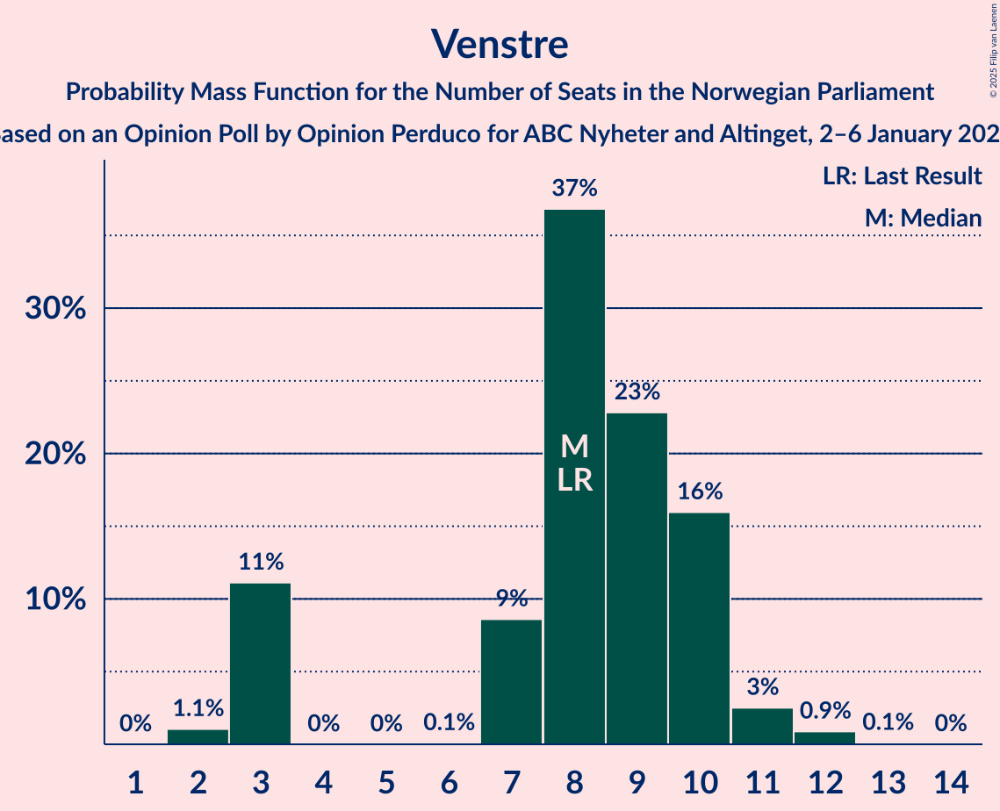
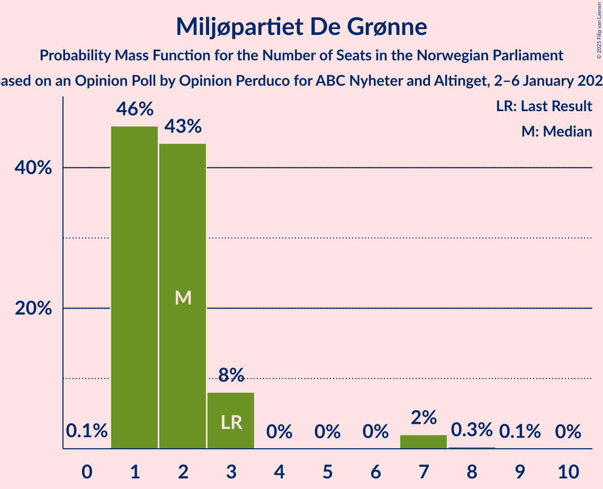
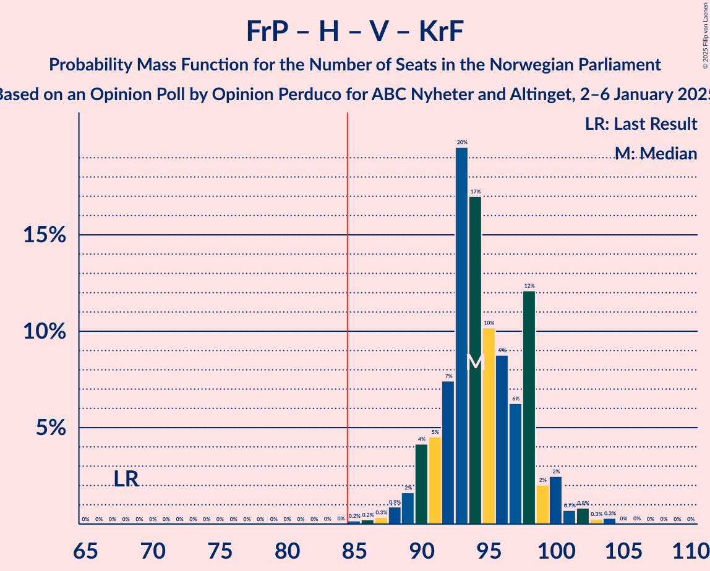
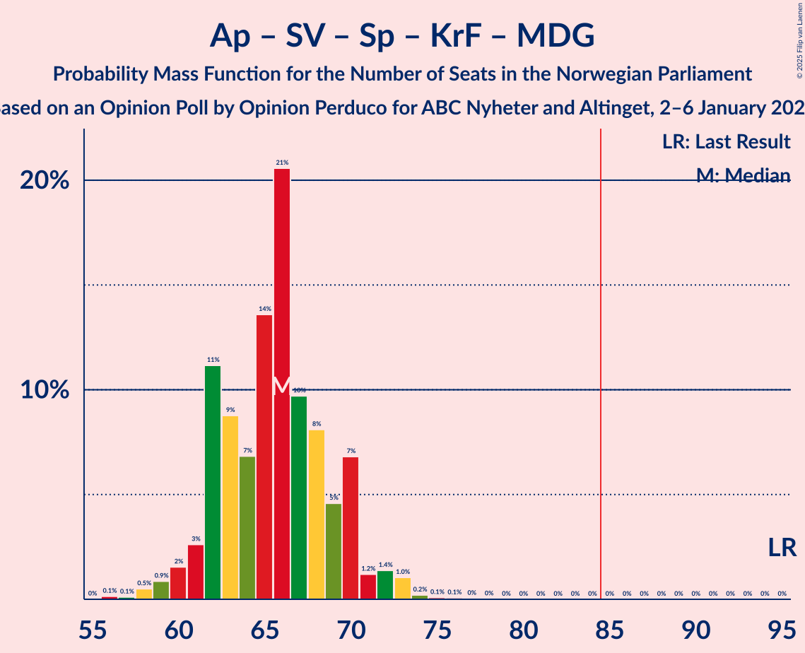

# Opinion Poll by Opinion Perduco for ABC Nyheter and Altinget, 2–6 January 2025

<a href="#voting-intentions">Voting Intentions</a> | <a href="#seats">Seats</a> | <a href="#coalitions">Coalitions</a> | <a href="#technical-information">Technical Information</a>

## Voting Intentions

### Confidence Intervals

| Party | Last Result | Poll Result | 80% Confidence Interval | 90% Confidence Interval | 95% Confidence Interval | 99% Confidence Interval |
|:-----:|:-----------:|:-----------:|:-----------------------:|:-----------------------:|:-----------------------:|:-----------------------:|
| Fremskrittspartiet | 11.6% | 25.0% | 23.3–26.8% |22.8–27.3% |22.4–27.8% |21.6–28.6% |
| Høyre | 20.4% | 21.6% | 20.0–23.3% |19.5–23.8% |19.2–24.2% |18.4–25.1% |
| Arbeiderpartiet | 26.2% | 18.1% | 16.6–19.8% |16.2–20.2% |15.9–20.6% |15.2–21.4% |
| Sosialistisk Venstreparti | 7.6% | 8.7% | 7.6–9.9% |7.3–10.3% |7.1–10.6% |6.6–11.2% |
| Senterpartiet | 13.5% | 6.3% | 5.4–7.4% |5.1–7.7% |4.9–8.0% |4.5–8.5% |
| Rødt | 4.7% | 5.7% | 4.8–6.7% |4.6–7.0% |4.4–7.3% |4.0–7.8% |
| Venstre | 4.6% | 4.7% | 3.9–5.7% |3.7–5.9% |3.5–6.2% |3.2–6.7% |
| Kristelig Folkeparti | 3.8% | 3.2% | 2.6–4.0% |2.4–4.3% |2.3–4.5% |2.0–4.9% |
| Miljøpartiet De Grønne | 3.9% | 2.8% | 2.2–3.6% |2.1–3.8% |1.9–4.0% |1.7–4.4% |
| Industri- og Næringspartiet | 0.3% | 1.5% | 1.1–2.1% |1.0–2.3% |0.9–2.5% |0.7–2.8% |

*Note:* The poll result column reflects the actual value used in the calculations. Published results may vary slightly, and in addition be rounded to fewer digits.

## Seats

### Confidence Intervals

| Party | Last Result | Median | 80% Confidence Interval | 90% Confidence Interval | 95% Confidence Interval | 99% Confidence Interval |
|:-----:|:-----------:|:------:|:-----------------------:|:-----------------------:|:-----------------------:|:-----------------------:|
| <a href="#fremskrittspartiet">Fremskrittspartiet</a> | 21 | 45 | 43–49 |42–49 |41–50 |39–53 |
| <a href="#høyre">Høyre</a> | 36 | 39 | 35–42 |35–43 |34–44 |33–45 |
| <a href="#arbeiderpartiet">Arbeiderpartiet</a> | 48 | 35 | 32–37 |32–38 |31–38 |29–40 |
| <a href="#sosialistisk-venstreparti">Sosialistisk Venstreparti</a> | 13 | 16 | 13–18 |13–18 |13–19 |11–20 |
| <a href="#senterpartiet">Senterpartiet</a> | 28 | 11 | 10–13 |9–14 |9–14 |8–15 |
| <a href="#rødt">Rødt</a> | 8 | 10 | 9–12 |8–12 |8–13 |7–14 |
| <a href="#venstre">Venstre</a> | 8 | 8 | 3–10 |3–10 |3–11 |2–12 |
| <a href="#kristelig-folkeparti">Kristelig Folkeparti</a> | 3 | 2 | 1–3 |1–7 |0–8 |0–8 |
| <a href="#miljøpartiet-de-grønne">Miljøpartiet De Grønne</a> | 3 | 2 | 1–3 |1–3 |1–3 |1–7 |
| <a href="#industri--og-næringspartiet">Industri- og Næringspartiet</a> | 0 | 0 | 0 |0 |0 |0–2 |

### Fremskrittspartiet

*For a full overview of the results for this party, see the [Fremskrittspartiet](party-fremskrittspartiet.html) page.*

| Number of Seats | Probability | Accumulated | Special Marks |
|:---------------:|:-----------:|:-----------:|:-------------:|
| 21 | 0% | 100% | Last Result |
| 22 | 0% | 100% |  |
| 23 | 0% | 100% |  |
| 24 | 0% | 100% |  |
| 25 | 0% | 100% |  |
| 26 | 0% | 100% |  |
| 27 | 0% | 100% |  |
| 28 | 0% | 100% |  |
| 29 | 0% | 100% |  |
| 30 | 0% | 100% |  |
| 31 | 0% | 100% |  |
| 32 | 0% | 100% |  |
| 33 | 0% | 100% |  |
| 34 | 0% | 100% |  |
| 35 | 0% | 100% |  |
| 36 | 0% | 100% |  |
| 37 | 0% | 100% |  |
| 38 | 0% | 100% |  |
| 39 | 0.5% | 99.9% |  |
| 40 | 0.7% | 99.4% |  |
| 41 | 2% | 98.8% |  |
| 42 | 6% | 97% |  |
| 43 | 9% | 91% |  |
| 44 | 24% | 81% |  |
| 45 | 13% | 57% | Median |
| 46 | 10% | 44% |  |
| 47 | 13% | 33% |  |
| 48 | 6% | 21% |  |
| 49 | 10% | 14% |  |
| 50 | 2% | 4% |  |
| 51 | 0.9% | 2% |  |
| 52 | 0.6% | 1.1% |  |
| 53 | 0.2% | 0.5% |  |
| 54 | 0.2% | 0.3% |  |
| 55 | 0.1% | 0.2% |  |
| 56 | 0% | 0% |  |

### Høyre

*For a full overview of the results for this party, see the [Høyre](party-høyre.html) page.*

| Number of Seats | Probability | Accumulated | Special Marks |
|:---------------:|:-----------:|:-----------:|:-------------:|
| 31 | 0.1% | 100% |  |
| 32 | 0.4% | 99.9% |  |
| 33 | 0.9% | 99.6% |  |
| 34 | 2% | 98.7% |  |
| 35 | 7% | 97% |  |
| 36 | 9% | 90% | Last Result |
| 37 | 7% | 81% |  |
| 38 | 17% | 74% |  |
| 39 | 28% | 56% | Median |
| 40 | 7% | 29% |  |
| 41 | 10% | 21% |  |
| 42 | 6% | 12% |  |
| 43 | 3% | 6% |  |
| 44 | 2% | 3% |  |
| 45 | 0.8% | 1.2% |  |
| 46 | 0.3% | 0.4% |  |
| 47 | 0.1% | 0.1% |  |
| 48 | 0% | 0% |  |

### Arbeiderpartiet

*For a full overview of the results for this party, see the [Arbeiderpartiet](party-arbeiderpartiet.html) page.*

| Number of Seats | Probability | Accumulated | Special Marks |
|:---------------:|:-----------:|:-----------:|:-------------:|
| 26 | 0.1% | 100% |  |
| 27 | 0.1% | 99.9% |  |
| 28 | 0.1% | 99.9% |  |
| 29 | 0.3% | 99.8% |  |
| 30 | 0.2% | 99.4% |  |
| 31 | 2% | 99.2% |  |
| 32 | 14% | 97% |  |
| 33 | 21% | 84% |  |
| 34 | 10% | 62% |  |
| 35 | 28% | 52% | Median |
| 36 | 14% | 25% |  |
| 37 | 5% | 11% |  |
| 38 | 3% | 5% |  |
| 39 | 1.2% | 2% |  |
| 40 | 0.5% | 0.7% |  |
| 41 | 0.2% | 0.2% |  |
| 42 | 0% | 0% |  |
| 43 | 0% | 0% |  |
| 44 | 0% | 0% |  |
| 45 | 0% | 0% |  |
| 46 | 0% | 0% |  |
| 47 | 0% | 0% |  |
| 48 | 0% | 0% | Last Result |

### Sosialistisk Venstreparti

*For a full overview of the results for this party, see the [Sosialistisk Venstreparti](party-sosialistiskvenstreparti.html) page.*

| Number of Seats | Probability | Accumulated | Special Marks |
|:---------------:|:-----------:|:-----------:|:-------------:|
| 10 | 0.1% | 100% |  |
| 11 | 0.6% | 99.9% |  |
| 12 | 2% | 99.3% |  |
| 13 | 10% | 98% | Last Result |
| 14 | 11% | 88% |  |
| 15 | 21% | 77% |  |
| 16 | 27% | 56% | Median |
| 17 | 15% | 29% |  |
| 18 | 10% | 14% |  |
| 19 | 3% | 4% |  |
| 20 | 0.7% | 1.1% |  |
| 21 | 0.4% | 0.4% |  |
| 22 | 0% | 0% |  |

### Senterpartiet

*For a full overview of the results for this party, see the [Senterpartiet](party-senterpartiet.html) page.*

| Number of Seats | Probability | Accumulated | Special Marks |
|:---------------:|:-----------:|:-----------:|:-------------:|
| 7 | 0.3% | 100% |  |
| 8 | 2% | 99.7% |  |
| 9 | 6% | 98% |  |
| 10 | 18% | 92% |  |
| 11 | 30% | 75% | Median |
| 12 | 30% | 45% |  |
| 13 | 8% | 15% |  |
| 14 | 5% | 7% |  |
| 15 | 2% | 2% |  |
| 16 | 0.3% | 0.3% |  |
| 17 | 0% | 0% |  |
| 18 | 0% | 0% |  |
| 19 | 0% | 0% |  |
| 20 | 0% | 0% |  |
| 21 | 0% | 0% |  |
| 22 | 0% | 0% |  |
| 23 | 0% | 0% |  |
| 24 | 0% | 0% |  |
| 25 | 0% | 0% |  |
| 26 | 0% | 0% |  |
| 27 | 0% | 0% |  |
| 28 | 0% | 0% | Last Result |

### Rødt

*For a full overview of the results for this party, see the [Rødt](party-rødt.html) page.*

| Number of Seats | Probability | Accumulated | Special Marks |
|:---------------:|:-----------:|:-----------:|:-------------:|
| 1 | 0.4% | 100% |  |
| 2 | 0% | 99.6% |  |
| 3 | 0% | 99.6% |  |
| 4 | 0% | 99.6% |  |
| 5 | 0% | 99.6% |  |
| 6 | 0% | 99.6% |  |
| 7 | 0.7% | 99.6% |  |
| 8 | 8% | 98.9% | Last Result |
| 9 | 20% | 91% |  |
| 10 | 23% | 71% | Median |
| 11 | 34% | 48% |  |
| 12 | 9% | 14% |  |
| 13 | 3% | 4% |  |
| 14 | 1.3% | 1.5% |  |
| 15 | 0.1% | 0.1% |  |
| 16 | 0% | 0% |  |

### Venstre

*For a full overview of the results for this party, see the [Venstre](party-venstre.html) page.*

| Number of Seats | Probability | Accumulated | Special Marks |
|:---------------:|:-----------:|:-----------:|:-------------:|
| 2 | 1.1% | 100% |  |
| 3 | 11% | 98.9% |  |
| 4 | 0% | 88% |  |
| 5 | 0% | 88% |  |
| 6 | 0.1% | 88% |  |
| 7 | 9% | 88% |  |
| 8 | 37% | 79% | Last Result, Median |
| 9 | 23% | 42% |  |
| 10 | 16% | 19% |  |
| 11 | 3% | 4% |  |
| 12 | 0.9% | 1.0% |  |
| 13 | 0.1% | 0.1% |  |
| 14 | 0% | 0% |  |

### Kristelig Folkeparti

*For a full overview of the results for this party, see the [Kristelig Folkeparti](party-kristeligfolkeparti.html) page.*

| Number of Seats | Probability | Accumulated | Special Marks |
|:---------------:|:-----------:|:-----------:|:-------------:|
| 0 | 5% | 100% |  |
| 1 | 16% | 95% |  |
| 2 | 47% | 79% | Median |
| 3 | 23% | 32% | Last Result |
| 4 | 0% | 9% |  |
| 5 | 0% | 9% |  |
| 6 | 0% | 9% |  |
| 7 | 5% | 9% |  |
| 8 | 4% | 4% |  |
| 9 | 0.2% | 0.2% |  |
| 10 | 0% | 0% |  |

### Miljøpartiet De Grønne

*For a full overview of the results for this party, see the [Miljøpartiet De Grønne](party-miljøpartietdegrønne.html) page.*

| Number of Seats | Probability | Accumulated | Special Marks |
|:---------------:|:-----------:|:-----------:|:-------------:|
| 0 | 0.1% | 100% |  |
| 1 | 46% | 99.9% |  |
| 2 | 43% | 54% | Median |
| 3 | 8% | 10% | Last Result |
| 4 | 0% | 2% |  |
| 5 | 0% | 2% |  |
| 6 | 0% | 2% |  |
| 7 | 2% | 2% |  |
| 8 | 0.3% | 0.3% |  |
| 9 | 0.1% | 0.1% |  |
| 10 | 0% | 0% |  |

### Industri- og Næringspartiet

*For a full overview of the results for this party, see the [Industri- og Næringspartiet](party-industri-ognæringspartiet.html) page.*

| Number of Seats | Probability | Accumulated | Special Marks |
|:---------------:|:-----------:|:-----------:|:-------------:|
| 0 | 98% | 100% | Last Result, Median |
| 1 | 1.0% | 2% |  |
| 2 | 0.6% | 0.6% |  |
| 3 | 0% | 0% |  |

## Coalitions

### Confidence Intervals

| Coalition | Last Result | Median | Majority? | 80% Confidence Interval | 90% Confidence Interval | 95% Confidence Interval | 99% Confidence Interval |
|:---------:|:-----------:|:------:|:---------:|:-----------------------:|:-----------------------:|:-----------------------:|:-----------------------:|
| Fremskrittspartiet – Høyre – Senterpartiet – Venstre – Kristelig Folkeparti | 96 | 106 | 100% | 103–110 | 101–110 | 101–111 | 98–114 |
| Fremskrittspartiet – Høyre – Venstre – Kristelig Folkeparti – Miljøpartiet De Grønne | 71 | 96 | 100% | 93–100 | 92–101 | 91–102 | 89–105 |
| Fremskrittspartiet – Høyre – Venstre – Kristelig Folkeparti | 68 | 94 | 99.9% | 91–98 | 90–99 | 89–100 | 87–103 |
| Fremskrittspartiet – Høyre – Venstre | 65 | 92 | 99.3% | 88–96 | 87–96 | 86–97 | 84–101 |
| Fremskrittspartiet – Høyre | 57 | 84 | 41% | 80–88 | 79–89 | 78–90 | 77–93 |
| Arbeiderpartiet – Sosialistisk Venstreparti – Senterpartiet – Rødt – Miljøpartiet De Grønne | 100 | 74 | 0% | 70–77 | 68–78 | 68–79 | 65–81 |
| Arbeiderpartiet – Sosialistisk Venstreparti – Senterpartiet – Rødt | 97 | 72 | 0% | 68–75 | 67–76 | 66–77 | 63–79 |
| Arbeiderpartiet – Sosialistisk Venstreparti – Senterpartiet – Kristelig Folkeparti – Miljøpartiet De Grønne | 95 | 66 | 0% | 62–70 | 61–70 | 60–72 | 58–73 |
| Arbeiderpartiet – Sosialistisk Venstreparti – Senterpartiet – Miljøpartiet De Grønne | 92 | 63 | 0% | 59–67 | 59–67 | 58–68 | 56–70 |
| Arbeiderpartiet – Sosialistisk Venstreparti – Rødt – Miljøpartiet De Grønne | 72 | 62 | 0% | 58–65 | 58–67 | 57–67 | 54–70 |
| Arbeiderpartiet – Sosialistisk Venstreparti – Senterpartiet | 89 | 62 | 0% | 58–65 | 57–65 | 56–66 | 54–68 |
| Arbeiderpartiet – Senterpartiet – Kristelig Folkeparti – Miljøpartiet De Grønne | 82 | 50 | 0% | 47–54 | 46–55 | 45–56 | 43–58 |
| Arbeiderpartiet – Sosialistisk Venstreparti | 61 | 50 | 0% | 47–53 | 46–54 | 46–55 | 44–56 |
| Høyre – Venstre – Kristelig Folkeparti | 47 | 49 | 0% | 46–53 | 45–54 | 43–55 | 40–57 |
| Arbeiderpartiet – Senterpartiet – Kristelig Folkeparti | 79 | 48 | 0% | 45–52 | 44–53 | 44–54 | 42–56 |
| Arbeiderpartiet – Senterpartiet | 76 | 46 | 0% | 44–48 | 42–49 | 42–50 | 40–52 |
| Senterpartiet – Venstre – Kristelig Folkeparti | 39 | 21 | 0% | 18–25 | 17–26 | 16–27 | 14–29 |

### Fremskrittspartiet – Høyre – Senterpartiet – Venstre – Kristelig Folkeparti

| Number of Seats | Probability | Accumulated | Special Marks |
|:---------------:|:-----------:|:-----------:|:-------------:|
| 96 | 0.2% | 100% | Last Result |
| 97 | 0.1% | 99.8% |  |
| 98 | 0.3% | 99.7% |  |
| 99 | 0.7% | 99.4% |  |
| 100 | 0.7% | 98.7% |  |
| 101 | 4% | 98% |  |
| 102 | 3% | 94% |  |
| 103 | 5% | 91% |  |
| 104 | 21% | 86% |  |
| 105 | 12% | 65% | Median |
| 106 | 13% | 53% |  |
| 107 | 15% | 40% |  |
| 108 | 9% | 25% |  |
| 109 | 4% | 17% |  |
| 110 | 8% | 13% |  |
| 111 | 2% | 4% |  |
| 112 | 0.9% | 2% |  |
| 113 | 0.5% | 1.0% |  |
| 114 | 0.2% | 0.5% |  |
| 115 | 0.2% | 0.3% |  |
| 116 | 0% | 0.1% |  |
| 117 | 0% | 0.1% |  |
| 118 | 0% | 0% |  |

### Fremskrittspartiet – Høyre – Venstre – Kristelig Folkeparti – Miljøpartiet De Grønne

| Number of Seats | Probability | Accumulated | Special Marks |
|:---------------:|:-----------:|:-----------:|:-------------:|
| 71 | 0% | 100% | Last Result |
| 72 | 0% | 100% |  |
| 73 | 0% | 100% |  |
| 74 | 0% | 100% |  |
| 75 | 0% | 100% |  |
| 76 | 0% | 100% |  |
| 77 | 0% | 100% |  |
| 78 | 0% | 100% |  |
| 79 | 0% | 100% |  |
| 80 | 0% | 100% |  |
| 81 | 0% | 100% |  |
| 82 | 0% | 100% |  |
| 83 | 0% | 100% |  |
| 84 | 0% | 100% |  |
| 85 | 0% | 100% | Majority |
| 86 | 0% | 100% |  |
| 87 | 0.1% | 100% |  |
| 88 | 0.2% | 99.9% |  |
| 89 | 0.5% | 99.7% |  |
| 90 | 1.0% | 99.2% |  |
| 91 | 3% | 98% |  |
| 92 | 3% | 96% |  |
| 93 | 6% | 93% |  |
| 94 | 8% | 86% |  |
| 95 | 23% | 78% |  |
| 96 | 13% | 55% | Median |
| 97 | 12% | 42% |  |
| 98 | 8% | 31% |  |
| 99 | 10% | 23% |  |
| 100 | 6% | 13% |  |
| 101 | 3% | 7% |  |
| 102 | 2% | 4% |  |
| 103 | 0.9% | 2% |  |
| 104 | 0.5% | 1.1% |  |
| 105 | 0.4% | 0.7% |  |
| 106 | 0.2% | 0.3% |  |
| 107 | 0% | 0.1% |  |
| 108 | 0% | 0% |  |

### Fremskrittspartiet – Høyre – Venstre – Kristelig Folkeparti

| Number of Seats | Probability | Accumulated | Special Marks |
|:---------------:|:-----------:|:-----------:|:-------------:|
| 68 | 0% | 100% | Last Result |
| 69 | 0% | 100% |  |
| 70 | 0% | 100% |  |
| 71 | 0% | 100% |  |
| 72 | 0% | 100% |  |
| 73 | 0% | 100% |  |
| 74 | 0% | 100% |  |
| 75 | 0% | 100% |  |
| 76 | 0% | 100% |  |
| 77 | 0% | 100% |  |
| 78 | 0% | 100% |  |
| 79 | 0% | 100% |  |
| 80 | 0% | 100% |  |
| 81 | 0% | 100% |  |
| 82 | 0% | 100% |  |
| 83 | 0% | 100% |  |
| 84 | 0% | 100% |  |
| 85 | 0.2% | 99.9% | Majority |
| 86 | 0.2% | 99.8% |  |
| 87 | 0.3% | 99.5% |  |
| 88 | 0.9% | 99.2% |  |
| 89 | 2% | 98% |  |
| 90 | 4% | 97% |  |
| 91 | 5% | 93% |  |
| 92 | 7% | 88% |  |
| 93 | 20% | 81% |  |
| 94 | 17% | 61% | Median |
| 95 | 10% | 44% |  |
| 96 | 9% | 34% |  |
| 97 | 6% | 25% |  |
| 98 | 12% | 19% |  |
| 99 | 2% | 7% |  |
| 100 | 2% | 5% |  |
| 101 | 0.7% | 2% |  |
| 102 | 0.8% | 1.5% |  |
| 103 | 0.3% | 0.7% |  |
| 104 | 0.3% | 0.4% |  |
| 105 | 0% | 0.1% |  |
| 106 | 0% | 0.1% |  |
| 107 | 0% | 0% |  |

### Fremskrittspartiet – Høyre – Venstre

| Number of Seats | Probability | Accumulated | Special Marks |
|:---------------:|:-----------:|:-----------:|:-------------:|
| 65 | 0% | 100% | Last Result |
| 66 | 0% | 100% |  |
| 67 | 0% | 100% |  |
| 68 | 0% | 100% |  |
| 69 | 0% | 100% |  |
| 70 | 0% | 100% |  |
| 71 | 0% | 100% |  |
| 72 | 0% | 100% |  |
| 73 | 0% | 100% |  |
| 74 | 0% | 100% |  |
| 75 | 0% | 100% |  |
| 76 | 0% | 100% |  |
| 77 | 0% | 100% |  |
| 78 | 0% | 100% |  |
| 79 | 0% | 100% |  |
| 80 | 0% | 100% |  |
| 81 | 0.1% | 100% |  |
| 82 | 0.1% | 99.9% |  |
| 83 | 0.1% | 99.8% |  |
| 84 | 0.4% | 99.7% |  |
| 85 | 1.1% | 99.3% | Majority |
| 86 | 2% | 98% |  |
| 87 | 2% | 97% |  |
| 88 | 6% | 95% |  |
| 89 | 7% | 89% |  |
| 90 | 6% | 82% |  |
| 91 | 21% | 76% |  |
| 92 | 18% | 55% | Median |
| 93 | 7% | 37% |  |
| 94 | 5% | 30% |  |
| 95 | 9% | 25% |  |
| 96 | 11% | 15% |  |
| 97 | 2% | 4% |  |
| 98 | 1.1% | 2% |  |
| 99 | 0.5% | 1.3% |  |
| 100 | 0.3% | 0.9% |  |
| 101 | 0.4% | 0.6% |  |
| 102 | 0.1% | 0.2% |  |
| 103 | 0.1% | 0.1% |  |
| 104 | 0% | 0% |  |

### Fremskrittspartiet – Høyre

| Number of Seats | Probability | Accumulated | Special Marks |
|:---------------:|:-----------:|:-----------:|:-------------:|
| 57 | 0% | 100% | Last Result |
| 58 | 0% | 100% |  |
| 59 | 0% | 100% |  |
| 60 | 0% | 100% |  |
| 61 | 0% | 100% |  |
| 62 | 0% | 100% |  |
| 63 | 0% | 100% |  |
| 64 | 0% | 100% |  |
| 65 | 0% | 100% |  |
| 66 | 0% | 100% |  |
| 67 | 0% | 100% |  |
| 68 | 0% | 100% |  |
| 69 | 0% | 100% |  |
| 70 | 0% | 100% |  |
| 71 | 0% | 100% |  |
| 72 | 0% | 100% |  |
| 73 | 0% | 100% |  |
| 74 | 0.1% | 100% |  |
| 75 | 0.1% | 99.9% |  |
| 76 | 0.3% | 99.9% |  |
| 77 | 0.7% | 99.6% |  |
| 78 | 2% | 98.9% |  |
| 79 | 2% | 97% |  |
| 80 | 6% | 95% |  |
| 81 | 5% | 89% |  |
| 82 | 11% | 85% |  |
| 83 | 23% | 73% |  |
| 84 | 10% | 51% | Median |
| 85 | 6% | 41% | Majority |
| 86 | 10% | 34% |  |
| 87 | 12% | 24% |  |
| 88 | 6% | 12% |  |
| 89 | 3% | 6% |  |
| 90 | 1.2% | 3% |  |
| 91 | 0.5% | 2% |  |
| 92 | 0.6% | 1.4% |  |
| 93 | 0.4% | 0.8% |  |
| 94 | 0.2% | 0.3% |  |
| 95 | 0.1% | 0.1% |  |
| 96 | 0% | 0% |  |

### Arbeiderpartiet – Sosialistisk Venstreparti – Senterpartiet – Rødt – Miljøpartiet De Grønne

| Number of Seats | Probability | Accumulated | Special Marks |
|:---------------:|:-----------:|:-----------:|:-------------:|
| 62 | 0% | 100% |  |
| 63 | 0% | 99.9% |  |
| 64 | 0.3% | 99.9% |  |
| 65 | 0.3% | 99.6% |  |
| 66 | 1.0% | 99.3% |  |
| 67 | 0.8% | 98% |  |
| 68 | 3% | 98% |  |
| 69 | 2% | 95% |  |
| 70 | 12% | 93% |  |
| 71 | 6% | 81% |  |
| 72 | 9% | 74% |  |
| 73 | 11% | 66% |  |
| 74 | 16% | 55% | Median |
| 75 | 19% | 38% |  |
| 76 | 7% | 19% |  |
| 77 | 4% | 12% |  |
| 78 | 4% | 7% |  |
| 79 | 2% | 3% |  |
| 80 | 0.8% | 2% |  |
| 81 | 0.3% | 0.7% |  |
| 82 | 0.2% | 0.4% |  |
| 83 | 0.2% | 0.2% |  |
| 84 | 0% | 0% |  |
| 85 | 0% | 0% | Majority |
| 86 | 0% | 0% |  |
| 87 | 0% | 0% |  |
| 88 | 0% | 0% |  |
| 89 | 0% | 0% |  |
| 90 | 0% | 0% |  |
| 91 | 0% | 0% |  |
| 92 | 0% | 0% |  |
| 93 | 0% | 0% |  |
| 94 | 0% | 0% |  |
| 95 | 0% | 0% |  |
| 96 | 0% | 0% |  |
| 97 | 0% | 0% |  |
| 98 | 0% | 0% |  |
| 99 | 0% | 0% |  |
| 100 | 0% | 0% | Last Result |

### Arbeiderpartiet – Sosialistisk Venstreparti – Senterpartiet – Rødt

| Number of Seats | Probability | Accumulated | Special Marks |
|:---------------:|:-----------:|:-----------:|:-------------:|
| 61 | 0% | 100% |  |
| 62 | 0.2% | 99.9% |  |
| 63 | 0.4% | 99.7% |  |
| 64 | 0.5% | 99.3% |  |
| 65 | 1.0% | 98.8% |  |
| 66 | 2% | 98% |  |
| 67 | 3% | 96% |  |
| 68 | 6% | 93% |  |
| 69 | 10% | 87% |  |
| 70 | 8% | 77% |  |
| 71 | 12% | 69% |  |
| 72 | 12% | 56% | Median |
| 73 | 23% | 44% |  |
| 74 | 8% | 21% |  |
| 75 | 6% | 13% |  |
| 76 | 3% | 7% |  |
| 77 | 3% | 4% |  |
| 78 | 1.0% | 2% |  |
| 79 | 0.5% | 0.7% |  |
| 80 | 0.2% | 0.2% |  |
| 81 | 0% | 0.1% |  |
| 82 | 0% | 0% |  |
| 83 | 0% | 0% |  |
| 84 | 0% | 0% |  |
| 85 | 0% | 0% | Majority |
| 86 | 0% | 0% |  |
| 87 | 0% | 0% |  |
| 88 | 0% | 0% |  |
| 89 | 0% | 0% |  |
| 90 | 0% | 0% |  |
| 91 | 0% | 0% |  |
| 92 | 0% | 0% |  |
| 93 | 0% | 0% |  |
| 94 | 0% | 0% |  |
| 95 | 0% | 0% |  |
| 96 | 0% | 0% |  |
| 97 | 0% | 0% | Last Result |

### Arbeiderpartiet – Sosialistisk Venstreparti – Senterpartiet – Kristelig Folkeparti – Miljøpartiet De Grønne

| Number of Seats | Probability | Accumulated | Special Marks |
|:---------------:|:-----------:|:-----------:|:-------------:|
| 56 | 0.1% | 100% |  |
| 57 | 0.1% | 99.8% |  |
| 58 | 0.5% | 99.7% |  |
| 59 | 0.9% | 99.2% |  |
| 60 | 2% | 98% |  |
| 61 | 3% | 97% |  |
| 62 | 11% | 94% |  |
| 63 | 9% | 83% |  |
| 64 | 7% | 74% |  |
| 65 | 14% | 67% |  |
| 66 | 21% | 54% | Median |
| 67 | 10% | 33% |  |
| 68 | 8% | 24% |  |
| 69 | 5% | 15% |  |
| 70 | 7% | 11% |  |
| 71 | 1.2% | 4% |  |
| 72 | 1.4% | 3% |  |
| 73 | 1.0% | 1.5% |  |
| 74 | 0.2% | 0.4% |  |
| 75 | 0.1% | 0.2% |  |
| 76 | 0.1% | 0.1% |  |
| 77 | 0% | 0.1% |  |
| 78 | 0% | 0% |  |
| 79 | 0% | 0% |  |
| 80 | 0% | 0% |  |
| 81 | 0% | 0% |  |
| 82 | 0% | 0% |  |
| 83 | 0% | 0% |  |
| 84 | 0% | 0% |  |
| 85 | 0% | 0% | Majority |
| 86 | 0% | 0% |  |
| 87 | 0% | 0% |  |
| 88 | 0% | 0% |  |
| 89 | 0% | 0% |  |
| 90 | 0% | 0% |  |
| 91 | 0% | 0% |  |
| 92 | 0% | 0% |  |
| 93 | 0% | 0% |  |
| 94 | 0% | 0% |  |
| 95 | 0% | 0% | Last Result |

### Arbeiderpartiet – Sosialistisk Venstreparti – Senterpartiet – Miljøpartiet De Grønne

| Number of Seats | Probability | Accumulated | Special Marks |
|:---------------:|:-----------:|:-----------:|:-------------:|
| 53 | 0% | 100% |  |
| 54 | 0.2% | 99.9% |  |
| 55 | 0.2% | 99.8% |  |
| 56 | 0.6% | 99.6% |  |
| 57 | 0.8% | 99.0% |  |
| 58 | 2% | 98% |  |
| 59 | 7% | 96% |  |
| 60 | 9% | 90% |  |
| 61 | 5% | 81% |  |
| 62 | 12% | 75% |  |
| 63 | 15% | 64% |  |
| 64 | 24% | 48% | Median |
| 65 | 6% | 24% |  |
| 66 | 6% | 18% |  |
| 67 | 7% | 12% |  |
| 68 | 3% | 5% |  |
| 69 | 1.1% | 2% |  |
| 70 | 0.5% | 1.0% |  |
| 71 | 0.3% | 0.5% |  |
| 72 | 0.2% | 0.2% |  |
| 73 | 0% | 0.1% |  |
| 74 | 0% | 0% |  |
| 75 | 0% | 0% |  |
| 76 | 0% | 0% |  |
| 77 | 0% | 0% |  |
| 78 | 0% | 0% |  |
| 79 | 0% | 0% |  |
| 80 | 0% | 0% |  |
| 81 | 0% | 0% |  |
| 82 | 0% | 0% |  |
| 83 | 0% | 0% |  |
| 84 | 0% | 0% |  |
| 85 | 0% | 0% | Majority |
| 86 | 0% | 0% |  |
| 87 | 0% | 0% |  |
| 88 | 0% | 0% |  |
| 89 | 0% | 0% |  |
| 90 | 0% | 0% |  |
| 91 | 0% | 0% |  |
| 92 | 0% | 0% | Last Result |

### Arbeiderpartiet – Sosialistisk Venstreparti – Rødt – Miljøpartiet De Grønne

| Number of Seats | Probability | Accumulated | Special Marks |
|:---------------:|:-----------:|:-----------:|:-------------:|
| 51 | 0% | 100% |  |
| 52 | 0% | 99.9% |  |
| 53 | 0.2% | 99.9% |  |
| 54 | 0.2% | 99.7% |  |
| 55 | 0.5% | 99.4% |  |
| 56 | 1.0% | 98.9% |  |
| 57 | 3% | 98% |  |
| 58 | 8% | 95% |  |
| 59 | 4% | 87% |  |
| 60 | 9% | 83% |  |
| 61 | 15% | 74% |  |
| 62 | 13% | 59% |  |
| 63 | 11% | 46% | Median |
| 64 | 21% | 35% |  |
| 65 | 5% | 14% |  |
| 66 | 3% | 9% |  |
| 67 | 4% | 6% |  |
| 68 | 0.6% | 2% |  |
| 69 | 0.6% | 1.2% |  |
| 70 | 0.3% | 0.5% |  |
| 71 | 0.1% | 0.2% |  |
| 72 | 0.1% | 0.2% | Last Result |
| 73 | 0% | 0% |  |

### Arbeiderpartiet – Sosialistisk Venstreparti – Senterpartiet

| Number of Seats | Probability | Accumulated | Special Marks |
|:---------------:|:-----------:|:-----------:|:-------------:|
| 52 | 0.1% | 100% |  |
| 53 | 0.3% | 99.9% |  |
| 54 | 0.3% | 99.6% |  |
| 55 | 0.6% | 99.3% |  |
| 56 | 1.3% | 98.6% |  |
| 57 | 6% | 97% |  |
| 58 | 4% | 91% |  |
| 59 | 10% | 88% |  |
| 60 | 12% | 77% |  |
| 61 | 8% | 66% |  |
| 62 | 31% | 57% | Median |
| 63 | 7% | 26% |  |
| 64 | 6% | 19% |  |
| 65 | 8% | 12% |  |
| 66 | 3% | 5% |  |
| 67 | 1.0% | 2% |  |
| 68 | 0.4% | 0.9% |  |
| 69 | 0.4% | 0.5% |  |
| 70 | 0.1% | 0.1% |  |
| 71 | 0% | 0% |  |
| 72 | 0% | 0% |  |
| 73 | 0% | 0% |  |
| 74 | 0% | 0% |  |
| 75 | 0% | 0% |  |
| 76 | 0% | 0% |  |
| 77 | 0% | 0% |  |
| 78 | 0% | 0% |  |
| 79 | 0% | 0% |  |
| 80 | 0% | 0% |  |
| 81 | 0% | 0% |  |
| 82 | 0% | 0% |  |
| 83 | 0% | 0% |  |
| 84 | 0% | 0% |  |
| 85 | 0% | 0% | Majority |
| 86 | 0% | 0% |  |
| 87 | 0% | 0% |  |
| 88 | 0% | 0% |  |
| 89 | 0% | 0% | Last Result |

### Arbeiderpartiet – Senterpartiet – Kristelig Folkeparti – Miljøpartiet De Grønne

| Number of Seats | Probability | Accumulated | Special Marks |
|:---------------:|:-----------:|:-----------:|:-------------:|
| 41 | 0% | 100% |  |
| 42 | 0.2% | 99.9% |  |
| 43 | 0.4% | 99.8% |  |
| 44 | 0.9% | 99.3% |  |
| 45 | 2% | 98% |  |
| 46 | 4% | 96% |  |
| 47 | 12% | 92% |  |
| 48 | 9% | 80% |  |
| 49 | 12% | 71% |  |
| 50 | 28% | 59% | Median |
| 51 | 7% | 31% |  |
| 52 | 9% | 24% |  |
| 53 | 5% | 15% |  |
| 54 | 4% | 11% |  |
| 55 | 2% | 6% |  |
| 56 | 3% | 4% |  |
| 57 | 0.4% | 1.1% |  |
| 58 | 0.4% | 0.8% |  |
| 59 | 0.2% | 0.4% |  |
| 60 | 0.1% | 0.2% |  |
| 61 | 0.1% | 0.1% |  |
| 62 | 0% | 0% |  |
| 63 | 0% | 0% |  |
| 64 | 0% | 0% |  |
| 65 | 0% | 0% |  |
| 66 | 0% | 0% |  |
| 67 | 0% | 0% |  |
| 68 | 0% | 0% |  |
| 69 | 0% | 0% |  |
| 70 | 0% | 0% |  |
| 71 | 0% | 0% |  |
| 72 | 0% | 0% |  |
| 73 | 0% | 0% |  |
| 74 | 0% | 0% |  |
| 75 | 0% | 0% |  |
| 76 | 0% | 0% |  |
| 77 | 0% | 0% |  |
| 78 | 0% | 0% |  |
| 79 | 0% | 0% |  |
| 80 | 0% | 0% |  |
| 81 | 0% | 0% |  |
| 82 | 0% | 0% | Last Result |

### Arbeiderpartiet – Sosialistisk Venstreparti

| Number of Seats | Probability | Accumulated | Special Marks |
|:---------------:|:-----------:|:-----------:|:-------------:|
| 42 | 0.2% | 100% |  |
| 43 | 0.2% | 99.8% |  |
| 44 | 0.4% | 99.5% |  |
| 45 | 1.0% | 99.2% |  |
| 46 | 4% | 98% |  |
| 47 | 12% | 95% |  |
| 48 | 8% | 82% |  |
| 49 | 12% | 75% |  |
| 50 | 18% | 63% |  |
| 51 | 24% | 45% | Median |
| 52 | 7% | 22% |  |
| 53 | 6% | 14% |  |
| 54 | 5% | 8% |  |
| 55 | 2% | 3% |  |
| 56 | 1.1% | 1.5% |  |
| 57 | 0.2% | 0.3% |  |
| 58 | 0% | 0.1% |  |
| 59 | 0.1% | 0.1% |  |
| 60 | 0% | 0% |  |
| 61 | 0% | 0% | Last Result |

### Høyre – Venstre – Kristelig Folkeparti

| Number of Seats | Probability | Accumulated | Special Marks |
|:---------------:|:-----------:|:-----------:|:-------------:|
| 39 | 0.1% | 100% |  |
| 40 | 0.7% | 99.9% |  |
| 41 | 0.3% | 99.2% |  |
| 42 | 0.4% | 98.9% |  |
| 43 | 1.2% | 98.5% |  |
| 44 | 1.2% | 97% |  |
| 45 | 4% | 96% |  |
| 46 | 8% | 92% |  |
| 47 | 10% | 83% | Last Result |
| 48 | 8% | 73% |  |
| 49 | 28% | 66% | Median |
| 50 | 8% | 38% |  |
| 51 | 14% | 30% |  |
| 52 | 5% | 16% |  |
| 53 | 5% | 11% |  |
| 54 | 2% | 5% |  |
| 55 | 2% | 3% |  |
| 56 | 0.8% | 2% |  |
| 57 | 0.4% | 0.8% |  |
| 58 | 0.3% | 0.4% |  |
| 59 | 0% | 0.1% |  |
| 60 | 0% | 0% |  |

### Arbeiderpartiet – Senterpartiet – Kristelig Folkeparti

| Number of Seats | Probability | Accumulated | Special Marks |
|:---------------:|:-----------:|:-----------:|:-------------:|
| 39 | 0% | 100% |  |
| 40 | 0.1% | 99.9% |  |
| 41 | 0.2% | 99.9% |  |
| 42 | 0.5% | 99.6% |  |
| 43 | 1.4% | 99.2% |  |
| 44 | 5% | 98% |  |
| 45 | 5% | 93% |  |
| 46 | 13% | 88% |  |
| 47 | 13% | 76% |  |
| 48 | 27% | 63% | Median |
| 49 | 12% | 37% |  |
| 50 | 10% | 25% |  |
| 51 | 4% | 14% |  |
| 52 | 4% | 10% |  |
| 53 | 3% | 7% |  |
| 54 | 2% | 4% |  |
| 55 | 1.2% | 2% |  |
| 56 | 0.3% | 0.6% |  |
| 57 | 0.3% | 0.3% |  |
| 58 | 0.1% | 0.1% |  |
| 59 | 0% | 0% |  |
| 60 | 0% | 0% |  |
| 61 | 0% | 0% |  |
| 62 | 0% | 0% |  |
| 63 | 0% | 0% |  |
| 64 | 0% | 0% |  |
| 65 | 0% | 0% |  |
| 66 | 0% | 0% |  |
| 67 | 0% | 0% |  |
| 68 | 0% | 0% |  |
| 69 | 0% | 0% |  |
| 70 | 0% | 0% |  |
| 71 | 0% | 0% |  |
| 72 | 0% | 0% |  |
| 73 | 0% | 0% |  |
| 74 | 0% | 0% |  |
| 75 | 0% | 0% |  |
| 76 | 0% | 0% |  |
| 77 | 0% | 0% |  |
| 78 | 0% | 0% |  |
| 79 | 0% | 0% | Last Result |

### Arbeiderpartiet – Senterpartiet

| Number of Seats | Probability | Accumulated | Special Marks |
|:---------------:|:-----------:|:-----------:|:-------------:|
| 37 | 0.1% | 100% |  |
| 38 | 0.1% | 99.9% |  |
| 39 | 0.1% | 99.8% |  |
| 40 | 0.5% | 99.8% |  |
| 41 | 1.3% | 99.3% |  |
| 42 | 3% | 98% |  |
| 43 | 5% | 95% |  |
| 44 | 18% | 90% |  |
| 45 | 17% | 72% |  |
| 46 | 22% | 54% | Median |
| 47 | 16% | 32% |  |
| 48 | 8% | 16% |  |
| 49 | 4% | 8% |  |
| 50 | 2% | 4% |  |
| 51 | 1.5% | 2% |  |
| 52 | 0.4% | 0.6% |  |
| 53 | 0.2% | 0.2% |  |
| 54 | 0% | 0% |  |
| 55 | 0% | 0% |  |
| 56 | 0% | 0% |  |
| 57 | 0% | 0% |  |
| 58 | 0% | 0% |  |
| 59 | 0% | 0% |  |
| 60 | 0% | 0% |  |
| 61 | 0% | 0% |  |
| 62 | 0% | 0% |  |
| 63 | 0% | 0% |  |
| 64 | 0% | 0% |  |
| 65 | 0% | 0% |  |
| 66 | 0% | 0% |  |
| 67 | 0% | 0% |  |
| 68 | 0% | 0% |  |
| 69 | 0% | 0% |  |
| 70 | 0% | 0% |  |
| 71 | 0% | 0% |  |
| 72 | 0% | 0% |  |
| 73 | 0% | 0% |  |
| 74 | 0% | 0% |  |
| 75 | 0% | 0% |  |
| 76 | 0% | 0% | Last Result |

### Senterpartiet – Venstre – Kristelig Folkeparti

| Number of Seats | Probability | Accumulated | Special Marks |
|:---------------:|:-----------:|:-----------:|:-------------:|
| 12 | 0.1% | 100% |  |
| 13 | 0.4% | 99.9% |  |
| 14 | 0.6% | 99.5% |  |
| 15 | 0.9% | 99.0% |  |
| 16 | 2% | 98% |  |
| 17 | 3% | 96% |  |
| 18 | 4% | 94% |  |
| 19 | 8% | 90% |  |
| 20 | 7% | 82% |  |
| 21 | 26% | 74% | Median |
| 22 | 7% | 48% |  |
| 23 | 14% | 40% |  |
| 24 | 11% | 26% |  |
| 25 | 10% | 16% |  |
| 26 | 2% | 6% |  |
| 27 | 2% | 4% |  |
| 28 | 1.0% | 2% |  |
| 29 | 0.7% | 1.0% |  |
| 30 | 0.1% | 0.2% |  |
| 31 | 0.1% | 0.1% |  |
| 32 | 0% | 0% |  |
| 33 | 0% | 0% |  |
| 34 | 0% | 0% |  |
| 35 | 0% | 0% |  |
| 36 | 0% | 0% |  |
| 37 | 0% | 0% |  |
| 38 | 0% | 0% |  |
| 39 | 0% | 0% | Last Result |

## Technical Information

### Opinion Poll

+ **Polling firm:** Opinion Perduco
+ **Commissioner(s):** ABC Nyheter and Altinget
+ **Fieldwork period:** 2–6 January 2025

### Calculations

+ **Sample size:** 1005
+ **Simulations done:** 2,097,152
+ **Error estimate:** 2.04%

