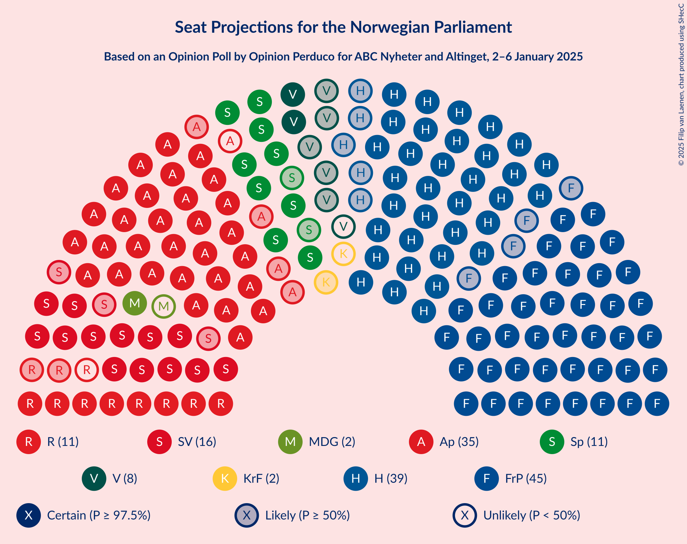
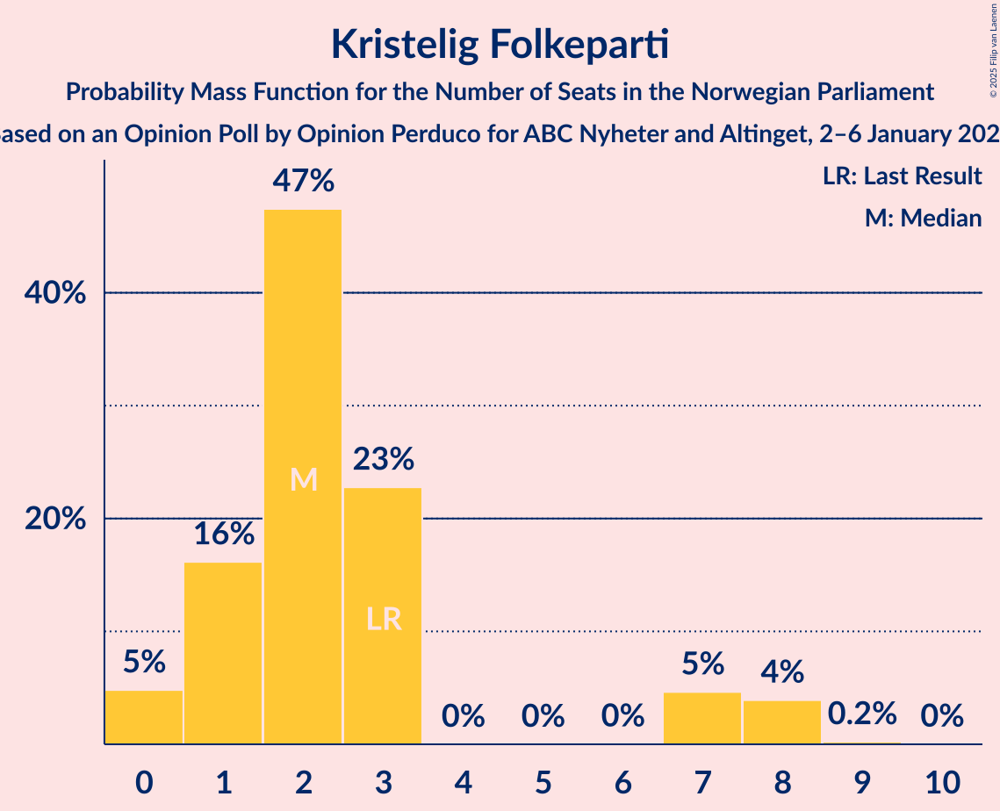
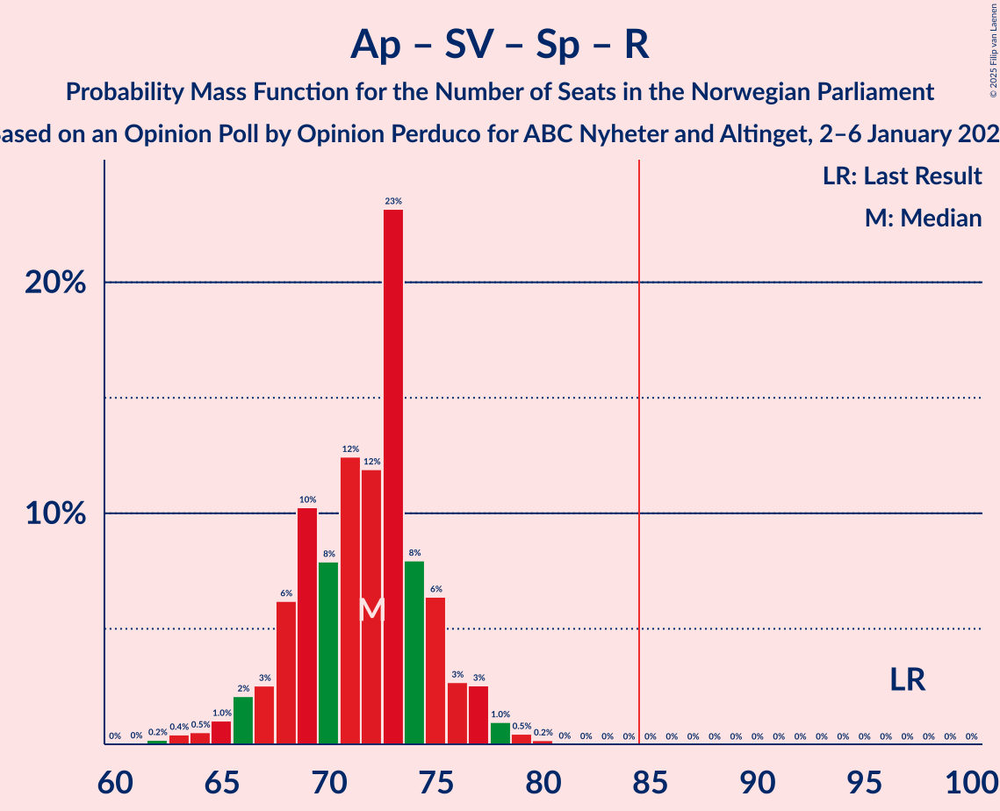
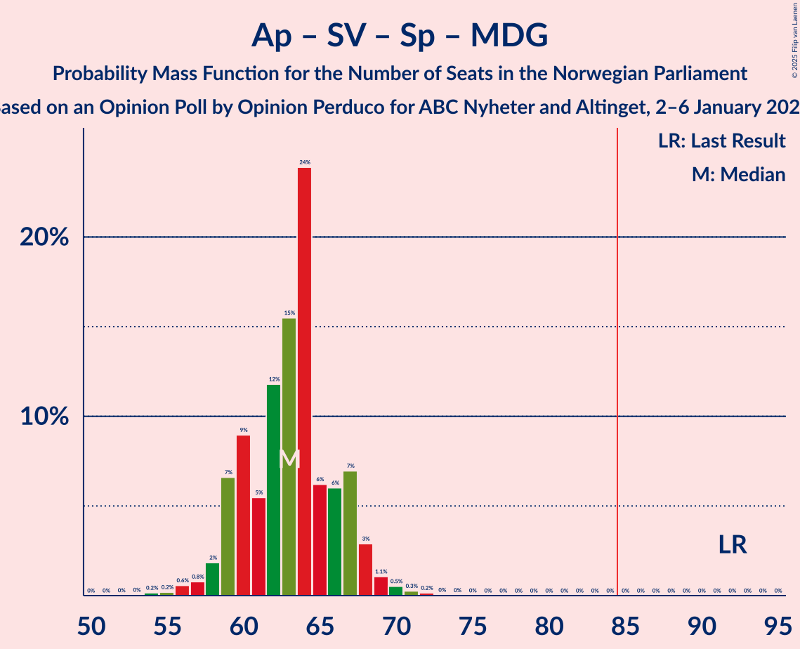
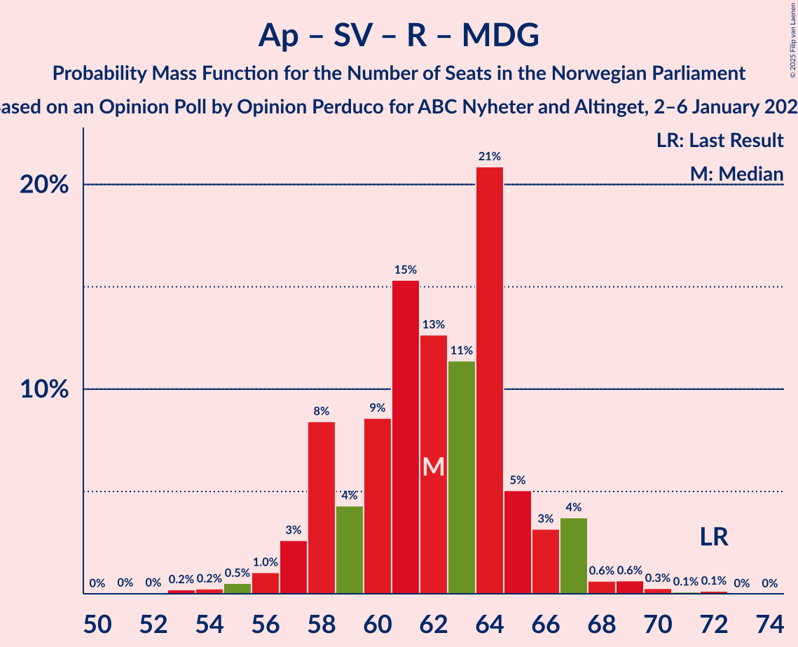
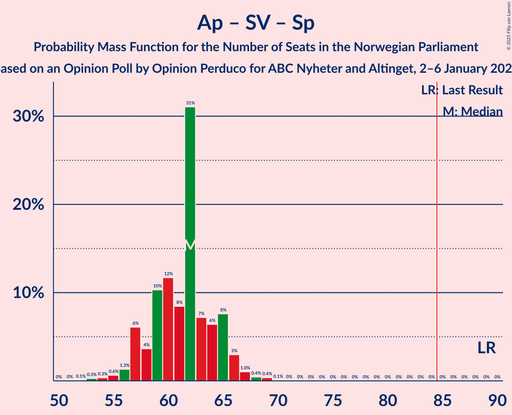
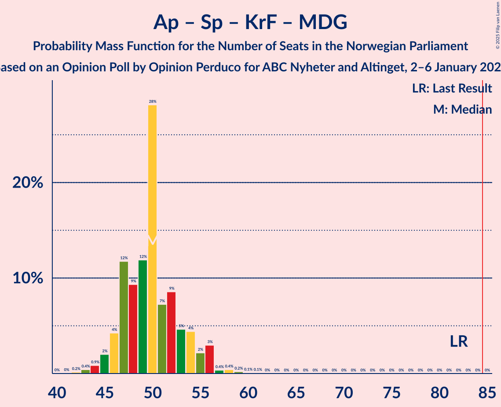
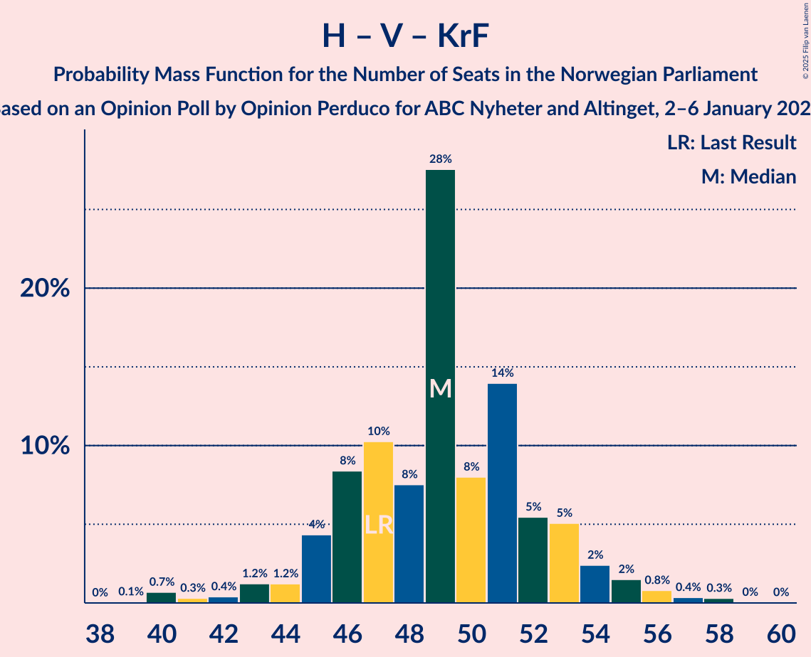

# Opinion Poll by Opinion Perduco for ABC Nyheter and Altinget, 2–6 January 2025

<a href="#voting-intentions">Voting Intentions</a> | <a href="#seats">Seats</a> | <a href="#coalitions">Coalitions</a> | <a href="#technical-information">Technical Information</a>

## Voting Intentions

### Confidence Intervals

| Party | Last Result | Poll Result | 80% Confidence Interval | 90% Confidence Interval | 95% Confidence Interval | 99% Confidence Interval |
|:-----:|:-----------:|:-----------:|:-----------------------:|:-----------------------:|:-----------------------:|:-----------------------:|
| Fremskrittspartiet | 11.6% | 25.0% | 23.3–26.8% |22.8–27.3% |22.4–27.8% |21.6–28.6% |
| Høyre | 20.4% | 21.6% | 20.0–23.3% |19.5–23.8% |19.2–24.2% |18.4–25.1% |
| Arbeiderpartiet | 26.2% | 18.1% | 16.6–19.8% |16.2–20.2% |15.9–20.6% |15.2–21.4% |
| Sosialistisk Venstreparti | 7.6% | 8.7% | 7.6–9.9% |7.3–10.3% |7.1–10.6% |6.6–11.2% |
| Senterpartiet | 13.5% | 6.3% | 5.4–7.4% |5.1–7.7% |4.9–8.0% |4.5–8.5% |
| Rødt | 4.7% | 5.7% | 4.8–6.7% |4.6–7.0% |4.4–7.3% |4.0–7.8% |
| Venstre | 4.6% | 4.7% | 3.9–5.7% |3.7–5.9% |3.5–6.2% |3.2–6.7% |
| Kristelig Folkeparti | 3.8% | 3.2% | 2.6–4.0% |2.4–4.3% |2.3–4.5% |2.0–4.9% |
| Miljøpartiet De Grønne | 3.9% | 2.8% | 2.2–3.6% |2.1–3.8% |1.9–4.0% |1.7–4.4% |
| Industri- og Næringspartiet | 0.3% | 1.5% | 1.1–2.1% |1.0–2.3% |0.9–2.5% |0.7–2.8% |

*Note:* The poll result column reflects the actual value used in the calculations. Published results may vary slightly, and in addition be rounded to fewer digits.

## Seats

### Confidence Intervals

| Party | Last Result | Median | 80% Confidence Interval | 90% Confidence Interval | 95% Confidence Interval | 99% Confidence Interval |
|:-----:|:-----------:|:------:|:-----------------------:|:-----------------------:|:-----------------------:|:-----------------------:|
| <a href="#fremskrittspartiet">Fremskrittspartiet</a> | 21 | 45 | 42–49 |42–50 |41–50 |39–53 |
| <a href="#høyre">Høyre</a> | 36 | 39 | 35–42 |34–43 |34–44 |33–46 |
| <a href="#arbeiderpartiet">Arbeiderpartiet</a> | 48 | 34 | 32–37 |32–38 |31–39 |29–40 |
| <a href="#sosialistisk-venstreparti">Sosialistisk Venstreparti</a> | 13 | 16 | 13–18 |13–18 |12–19 |11–21 |
| <a href="#senterpartiet">Senterpartiet</a> | 28 | 12 | 10–13 |9–14 |9–14 |7–15 |
| <a href="#rødt">Rødt</a> | 8 | 10 | 9–12 |8–13 |8–13 |7–14 |
| <a href="#venstre">Venstre</a> | 8 | 8 | 3–10 |3–10 |3–11 |2–12 |
| <a href="#kristelig-folkeparti">Kristelig Folkeparti</a> | 3 | 2 | 1–3 |0–7 |0–8 |0–8 |
| <a href="#miljøpartiet-de-grønne">Miljøpartiet De Grønne</a> | 3 | 2 | 1–3 |1–3 |1–7 |1–7 |
| <a href="#industri--og-næringspartiet">Industri- og Næringspartiet</a> | 0 | 0 | 0 |0 |0–1 |0–2 |

### Fremskrittspartiet

*For a full overview of the results for this party, see the [Fremskrittspartiet](party-fremskrittspartiet.html) page.*

| Number of Seats | Probability | Accumulated | Special Marks |
|:---------------:|:-----------:|:-----------:|:-------------:|
| 21 | 0% | 100% | Last Result |
| 22 | 0% | 100% |  |
| 23 | 0% | 100% |  |
| 24 | 0% | 100% |  |
| 25 | 0% | 100% |  |
| 26 | 0% | 100% |  |
| 27 | 0% | 100% |  |
| 28 | 0% | 100% |  |
| 29 | 0% | 100% |  |
| 30 | 0% | 100% |  |
| 31 | 0% | 100% |  |
| 32 | 0% | 100% |  |
| 33 | 0% | 100% |  |
| 34 | 0% | 100% |  |
| 35 | 0% | 100% |  |
| 36 | 0% | 100% |  |
| 37 | 0% | 100% |  |
| 38 | 0.1% | 100% |  |
| 39 | 0.8% | 99.9% |  |
| 40 | 1.0% | 99.1% |  |
| 41 | 3% | 98% |  |
| 42 | 6% | 95% |  |
| 43 | 13% | 89% |  |
| 44 | 13% | 77% |  |
| 45 | 17% | 64% | Median |
| 46 | 13% | 48% |  |
| 47 | 15% | 34% |  |
| 48 | 4% | 19% |  |
| 49 | 10% | 16% |  |
| 50 | 3% | 5% |  |
| 51 | 1.1% | 2% |  |
| 52 | 0.7% | 1.4% |  |
| 53 | 0.2% | 0.7% |  |
| 54 | 0.3% | 0.5% |  |
| 55 | 0.1% | 0.1% |  |
| 56 | 0.1% | 0.1% |  |
| 57 | 0% | 0% |  |

### Høyre

*For a full overview of the results for this party, see the [Høyre](party-høyre.html) page.*

| Number of Seats | Probability | Accumulated | Special Marks |
|:---------------:|:-----------:|:-----------:|:-------------:|
| 31 | 0.1% | 100% |  |
| 32 | 0.1% | 99.9% |  |
| 33 | 1.2% | 99.8% |  |
| 34 | 4% | 98.6% |  |
| 35 | 9% | 95% |  |
| 36 | 6% | 86% | Last Result |
| 37 | 9% | 80% |  |
| 38 | 12% | 70% |  |
| 39 | 27% | 58% | Median |
| 40 | 11% | 31% |  |
| 41 | 7% | 20% |  |
| 42 | 6% | 13% |  |
| 43 | 4% | 7% |  |
| 44 | 1.3% | 3% |  |
| 45 | 1.0% | 2% |  |
| 46 | 0.5% | 0.6% |  |
| 47 | 0% | 0.1% |  |
| 48 | 0% | 0.1% |  |
| 49 | 0% | 0% |  |

### Arbeiderpartiet

*For a full overview of the results for this party, see the [Arbeiderpartiet](party-arbeiderpartiet.html) page.*

| Number of Seats | Probability | Accumulated | Special Marks |
|:---------------:|:-----------:|:-----------:|:-------------:|
| 26 | 0.1% | 100% |  |
| 27 | 0% | 99.9% |  |
| 28 | 0.2% | 99.9% |  |
| 29 | 0.4% | 99.6% |  |
| 30 | 0.3% | 99.2% |  |
| 31 | 2% | 98.9% |  |
| 32 | 9% | 97% |  |
| 33 | 26% | 88% |  |
| 34 | 16% | 62% | Median |
| 35 | 22% | 46% |  |
| 36 | 13% | 24% |  |
| 37 | 5% | 12% |  |
| 38 | 4% | 7% |  |
| 39 | 2% | 3% |  |
| 40 | 0.8% | 1.0% |  |
| 41 | 0.2% | 0.2% |  |
| 42 | 0% | 0% |  |
| 43 | 0% | 0% |  |
| 44 | 0% | 0% |  |
| 45 | 0% | 0% |  |
| 46 | 0% | 0% |  |
| 47 | 0% | 0% |  |
| 48 | 0% | 0% | Last Result |

### Sosialistisk Venstreparti

*For a full overview of the results for this party, see the [Sosialistisk Venstreparti](party-sosialistiskvenstreparti.html) page.*

| Number of Seats | Probability | Accumulated | Special Marks |
|:---------------:|:-----------:|:-----------:|:-------------:|
| 10 | 0.1% | 100% |  |
| 11 | 0.7% | 99.9% |  |
| 12 | 2% | 99.2% |  |
| 13 | 14% | 97% | Last Result |
| 14 | 11% | 83% |  |
| 15 | 18% | 72% |  |
| 16 | 18% | 53% | Median |
| 17 | 16% | 35% |  |
| 18 | 15% | 19% |  |
| 19 | 2% | 4% |  |
| 20 | 1.2% | 2% |  |
| 21 | 0.5% | 0.5% |  |
| 22 | 0% | 0% |  |

### Senterpartiet

*For a full overview of the results for this party, see the [Senterpartiet](party-senterpartiet.html) page.*

| Number of Seats | Probability | Accumulated | Special Marks |
|:---------------:|:-----------:|:-----------:|:-------------:|
| 6 | 0% | 100% |  |
| 7 | 0.5% | 99.9% |  |
| 8 | 2% | 99.5% |  |
| 9 | 7% | 98% |  |
| 10 | 23% | 91% |  |
| 11 | 17% | 68% |  |
| 12 | 33% | 51% | Median |
| 13 | 10% | 18% |  |
| 14 | 6% | 8% |  |
| 15 | 2% | 2% |  |
| 16 | 0.3% | 0.3% |  |
| 17 | 0% | 0% |  |
| 18 | 0% | 0% |  |
| 19 | 0% | 0% |  |
| 20 | 0% | 0% |  |
| 21 | 0% | 0% |  |
| 22 | 0% | 0% |  |
| 23 | 0% | 0% |  |
| 24 | 0% | 0% |  |
| 25 | 0% | 0% |  |
| 26 | 0% | 0% |  |
| 27 | 0% | 0% |  |
| 28 | 0% | 0% | Last Result |

### Rødt

*For a full overview of the results for this party, see the [Rødt](party-rødt.html) page.*

| Number of Seats | Probability | Accumulated | Special Marks |
|:---------------:|:-----------:|:-----------:|:-------------:|
| 1 | 0.4% | 100% |  |
| 2 | 0% | 99.6% |  |
| 3 | 0% | 99.6% |  |
| 4 | 0% | 99.6% |  |
| 5 | 0% | 99.6% |  |
| 6 | 0% | 99.6% |  |
| 7 | 0.8% | 99.6% |  |
| 8 | 9% | 98.8% | Last Result |
| 9 | 24% | 90% |  |
| 10 | 21% | 66% | Median |
| 11 | 26% | 45% |  |
| 12 | 14% | 19% |  |
| 13 | 3% | 6% |  |
| 14 | 2% | 2% |  |
| 15 | 0.1% | 0.2% |  |
| 16 | 0% | 0% |  |

### Venstre

*For a full overview of the results for this party, see the [Venstre](party-venstre.html) page.*

| Number of Seats | Probability | Accumulated | Special Marks |
|:---------------:|:-----------:|:-----------:|:-------------:|
| 2 | 2% | 100% |  |
| 3 | 12% | 98% |  |
| 4 | 0% | 87% |  |
| 5 | 0% | 87% |  |
| 6 | 0.1% | 87% |  |
| 7 | 14% | 87% |  |
| 8 | 25% | 73% | Last Result, Median |
| 9 | 28% | 47% |  |
| 10 | 16% | 20% |  |
| 11 | 2% | 4% |  |
| 12 | 1.2% | 1.4% |  |
| 13 | 0.1% | 0.1% |  |
| 14 | 0% | 0% |  |

### Kristelig Folkeparti

*For a full overview of the results for this party, see the [Kristelig Folkeparti](party-kristeligfolkeparti.html) page.*

| Number of Seats | Probability | Accumulated | Special Marks |
|:---------------:|:-----------:|:-----------:|:-------------:|
| 0 | 7% | 100% |  |
| 1 | 15% | 93% |  |
| 2 | 38% | 78% | Median |
| 3 | 31% | 40% | Last Result |
| 4 | 0% | 9% |  |
| 5 | 0% | 9% |  |
| 6 | 0% | 9% |  |
| 7 | 4% | 9% |  |
| 8 | 4% | 5% |  |
| 9 | 0.4% | 0.4% |  |
| 10 | 0% | 0% |  |

### Miljøpartiet De Grønne

*For a full overview of the results for this party, see the [Miljøpartiet De Grønne](party-miljøpartietdegrønne.html) page.*

| Number of Seats | Probability | Accumulated | Special Marks |
|:---------------:|:-----------:|:-----------:|:-------------:|
| 0 | 0.2% | 100% |  |
| 1 | 49% | 99.8% |  |
| 2 | 39% | 51% | Median |
| 3 | 10% | 13% | Last Result |
| 4 | 0% | 3% |  |
| 5 | 0% | 3% |  |
| 6 | 0% | 3% |  |
| 7 | 2% | 3% |  |
| 8 | 0.3% | 0.4% |  |
| 9 | 0% | 0.1% |  |
| 10 | 0% | 0% |  |

### Industri- og Næringspartiet

*For a full overview of the results for this party, see the [Industri- og Næringspartiet](party-industri-ognæringspartiet.html) page.*

| Number of Seats | Probability | Accumulated | Special Marks |
|:---------------:|:-----------:|:-----------:|:-------------:|
| 0 | 97% | 100% | Last Result, Median |
| 1 | 2% | 3% |  |
| 2 | 0.6% | 0.6% |  |
| 3 | 0% | 0% |  |

## Coalitions

### Confidence Intervals

| Coalition | Last Result | Median | Majority? | 80% Confidence Interval | 90% Confidence Interval | 95% Confidence Interval | 99% Confidence Interval |
|:---------:|:-----------:|:------:|:---------:|:-----------------------:|:-----------------------:|:-----------------------:|:-----------------------:|
| Fremskrittspartiet – Høyre – Senterpartiet – Venstre – Kristelig Folkeparti | 96 | 106 | 100% | 102–110 | 101–110 | 101–111 | 99–113 |
| Fremskrittspartiet – Høyre – Venstre – Kristelig Folkeparti – Miljøpartiet De Grønne | 71 | 96 | 100% | 93–100 | 91–101 | 90–102 | 89–104 |
| Fremskrittspartiet – Høyre – Venstre – Kristelig Folkeparti | 68 | 94 | 99.9% | 90–98 | 90–100 | 89–100 | 87–103 |
| Fremskrittspartiet – Høyre – Venstre | 65 | 92 | 99.3% | 88–96 | 87–97 | 86–98 | 84–101 |
| Fremskrittspartiet – Høyre | 57 | 84 | 45% | 80–88 | 79–89 | 78–91 | 77–93 |
| Arbeiderpartiet – Sosialistisk Venstreparti – Senterpartiet – Rødt – Miljøpartiet De Grønne | 100 | 74 | 0% | 70–78 | 68–78 | 67–79 | 65–81 |
| Arbeiderpartiet – Sosialistisk Venstreparti – Senterpartiet – Rødt | 97 | 72 | 0% | 68–75 | 67–77 | 65–78 | 63–79 |
| Arbeiderpartiet – Sosialistisk Venstreparti – Senterpartiet – Kristelig Folkeparti – Miljøpartiet De Grønne | 95 | 65 | 0% | 62–70 | 61–70 | 60–71 | 58–74 |
| Arbeiderpartiet – Sosialistisk Venstreparti – Senterpartiet – Miljøpartiet De Grønne | 92 | 63 | 0% | 59–67 | 59–68 | 58–69 | 56–70 |
| Arbeiderpartiet – Sosialistisk Venstreparti – Rødt – Miljøpartiet De Grønne | 72 | 62 | 0% | 58–66 | 58–67 | 57–67 | 55–69 |
| Arbeiderpartiet – Sosialistisk Venstreparti – Senterpartiet | 89 | 61 | 0% | 57–65 | 57–65 | 56–66 | 54–68 |
| Arbeiderpartiet – Senterpartiet – Kristelig Folkeparti – Miljøpartiet De Grønne | 82 | 50 | 0% | 46–54 | 46–55 | 45–56 | 43–58 |
| Arbeiderpartiet – Sosialistisk Venstreparti | 61 | 50 | 0% | 47–53 | 46–54 | 46–55 | 44–56 |
| Høyre – Venstre – Kristelig Folkeparti | 47 | 49 | 0% | 45–53 | 45–54 | 43–55 | 40–57 |
| Arbeiderpartiet – Senterpartiet – Kristelig Folkeparti | 79 | 48 | 0% | 45–52 | 44–53 | 43–54 | 42–57 |
| Arbeiderpartiet – Senterpartiet | 76 | 45 | 0% | 43–49 | 42–49 | 42–50 | 40–52 |
| Senterpartiet – Venstre – Kristelig Folkeparti | 39 | 22 | 0% | 18–25 | 17–26 | 16–27 | 14–29 |

### Fremskrittspartiet – Høyre – Senterpartiet – Venstre – Kristelig Folkeparti

| Number of Seats | Probability | Accumulated | Special Marks |
|:---------------:|:-----------:|:-----------:|:-------------:|
| 96 | 0.1% | 100% | Last Result |
| 97 | 0.2% | 99.9% |  |
| 98 | 0.2% | 99.7% |  |
| 99 | 0.6% | 99.5% |  |
| 100 | 1.0% | 98.9% |  |
| 101 | 6% | 98% |  |
| 102 | 3% | 92% |  |
| 103 | 6% | 89% |  |
| 104 | 14% | 83% |  |
| 105 | 10% | 69% |  |
| 106 | 17% | 59% | Median |
| 107 | 11% | 41% |  |
| 108 | 15% | 31% |  |
| 109 | 6% | 16% |  |
| 110 | 7% | 10% |  |
| 111 | 1.4% | 4% |  |
| 112 | 1.3% | 2% |  |
| 113 | 0.5% | 0.9% |  |
| 114 | 0.2% | 0.4% |  |
| 115 | 0.1% | 0.2% |  |
| 116 | 0% | 0.1% |  |
| 117 | 0% | 0.1% |  |
| 118 | 0% | 0% |  |

### Fremskrittspartiet – Høyre – Venstre – Kristelig Folkeparti – Miljøpartiet De Grønne

| Number of Seats | Probability | Accumulated | Special Marks |
|:---------------:|:-----------:|:-----------:|:-------------:|
| 71 | 0% | 100% | Last Result |
| 72 | 0% | 100% |  |
| 73 | 0% | 100% |  |
| 74 | 0% | 100% |  |
| 75 | 0% | 100% |  |
| 76 | 0% | 100% |  |
| 77 | 0% | 100% |  |
| 78 | 0% | 100% |  |
| 79 | 0% | 100% |  |
| 80 | 0% | 100% |  |
| 81 | 0% | 100% |  |
| 82 | 0% | 100% |  |
| 83 | 0% | 100% |  |
| 84 | 0% | 100% |  |
| 85 | 0% | 100% | Majority |
| 86 | 0% | 100% |  |
| 87 | 0.1% | 100% |  |
| 88 | 0.2% | 99.9% |  |
| 89 | 0.6% | 99.7% |  |
| 90 | 2% | 99.1% |  |
| 91 | 3% | 97% |  |
| 92 | 4% | 94% |  |
| 93 | 9% | 90% |  |
| 94 | 8% | 81% |  |
| 95 | 12% | 72% |  |
| 96 | 18% | 60% | Median |
| 97 | 10% | 42% |  |
| 98 | 4% | 32% |  |
| 99 | 9% | 28% |  |
| 100 | 12% | 18% |  |
| 101 | 2% | 7% |  |
| 102 | 2% | 4% |  |
| 103 | 0.9% | 2% |  |
| 104 | 0.9% | 1.4% |  |
| 105 | 0.2% | 0.5% |  |
| 106 | 0.1% | 0.3% |  |
| 107 | 0.1% | 0.1% |  |
| 108 | 0% | 0% |  |

### Fremskrittspartiet – Høyre – Venstre – Kristelig Folkeparti

| Number of Seats | Probability | Accumulated | Special Marks |
|:---------------:|:-----------:|:-----------:|:-------------:|
| 68 | 0% | 100% | Last Result |
| 69 | 0% | 100% |  |
| 70 | 0% | 100% |  |
| 71 | 0% | 100% |  |
| 72 | 0% | 100% |  |
| 73 | 0% | 100% |  |
| 74 | 0% | 100% |  |
| 75 | 0% | 100% |  |
| 76 | 0% | 100% |  |
| 77 | 0% | 100% |  |
| 78 | 0% | 100% |  |
| 79 | 0% | 100% |  |
| 80 | 0% | 100% |  |
| 81 | 0% | 100% |  |
| 82 | 0% | 100% |  |
| 83 | 0% | 100% |  |
| 84 | 0.1% | 100% |  |
| 85 | 0.1% | 99.9% | Majority |
| 86 | 0.1% | 99.8% |  |
| 87 | 0.4% | 99.7% |  |
| 88 | 1.1% | 99.3% |  |
| 89 | 2% | 98% |  |
| 90 | 6% | 96% |  |
| 91 | 7% | 90% |  |
| 92 | 10% | 83% |  |
| 93 | 3% | 73% |  |
| 94 | 25% | 69% | Median |
| 95 | 8% | 45% |  |
| 96 | 8% | 37% |  |
| 97 | 7% | 29% |  |
| 98 | 15% | 22% |  |
| 99 | 2% | 7% |  |
| 100 | 3% | 5% |  |
| 101 | 1.0% | 2% |  |
| 102 | 0.9% | 1.5% |  |
| 103 | 0.3% | 0.5% |  |
| 104 | 0.1% | 0.3% |  |
| 105 | 0% | 0.1% |  |
| 106 | 0.1% | 0.1% |  |
| 107 | 0% | 0% |  |

### Fremskrittspartiet – Høyre – Venstre

| Number of Seats | Probability | Accumulated | Special Marks |
|:---------------:|:-----------:|:-----------:|:-------------:|
| 65 | 0% | 100% | Last Result |
| 66 | 0% | 100% |  |
| 67 | 0% | 100% |  |
| 68 | 0% | 100% |  |
| 69 | 0% | 100% |  |
| 70 | 0% | 100% |  |
| 71 | 0% | 100% |  |
| 72 | 0% | 100% |  |
| 73 | 0% | 100% |  |
| 74 | 0% | 100% |  |
| 75 | 0% | 100% |  |
| 76 | 0% | 100% |  |
| 77 | 0% | 100% |  |
| 78 | 0% | 100% |  |
| 79 | 0% | 100% |  |
| 80 | 0% | 100% |  |
| 81 | 0% | 100% |  |
| 82 | 0.3% | 99.9% |  |
| 83 | 0.1% | 99.7% |  |
| 84 | 0.2% | 99.6% |  |
| 85 | 0.7% | 99.3% | Majority |
| 86 | 2% | 98.6% |  |
| 87 | 2% | 97% |  |
| 88 | 9% | 94% |  |
| 89 | 10% | 86% |  |
| 90 | 8% | 76% |  |
| 91 | 8% | 67% |  |
| 92 | 15% | 59% | Median |
| 93 | 11% | 44% |  |
| 94 | 6% | 33% |  |
| 95 | 13% | 27% |  |
| 96 | 8% | 14% |  |
| 97 | 3% | 5% |  |
| 98 | 1.1% | 3% |  |
| 99 | 0.4% | 2% |  |
| 100 | 0.4% | 1.2% |  |
| 101 | 0.8% | 0.9% |  |
| 102 | 0% | 0.1% |  |
| 103 | 0.1% | 0.1% |  |
| 104 | 0% | 0% |  |

### Fremskrittspartiet – Høyre

| Number of Seats | Probability | Accumulated | Special Marks |
|:---------------:|:-----------:|:-----------:|:-------------:|
| 57 | 0% | 100% | Last Result |
| 58 | 0% | 100% |  |
| 59 | 0% | 100% |  |
| 60 | 0% | 100% |  |
| 61 | 0% | 100% |  |
| 62 | 0% | 100% |  |
| 63 | 0% | 100% |  |
| 64 | 0% | 100% |  |
| 65 | 0% | 100% |  |
| 66 | 0% | 100% |  |
| 67 | 0% | 100% |  |
| 68 | 0% | 100% |  |
| 69 | 0% | 100% |  |
| 70 | 0% | 100% |  |
| 71 | 0% | 100% |  |
| 72 | 0% | 100% |  |
| 73 | 0% | 100% |  |
| 74 | 0% | 100% |  |
| 75 | 0.1% | 99.9% |  |
| 76 | 0.3% | 99.9% |  |
| 77 | 0.5% | 99.6% |  |
| 78 | 3% | 99.1% |  |
| 79 | 3% | 96% |  |
| 80 | 11% | 94% |  |
| 81 | 5% | 83% |  |
| 82 | 8% | 78% |  |
| 83 | 15% | 70% |  |
| 84 | 10% | 54% | Median |
| 85 | 8% | 45% | Majority |
| 86 | 9% | 37% |  |
| 87 | 12% | 28% |  |
| 88 | 10% | 16% |  |
| 89 | 2% | 6% |  |
| 90 | 1.1% | 4% |  |
| 91 | 0.6% | 3% |  |
| 92 | 1.0% | 2% |  |
| 93 | 0.8% | 1.0% |  |
| 94 | 0.1% | 0.2% |  |
| 95 | 0.1% | 0.1% |  |
| 96 | 0% | 0% |  |

### Arbeiderpartiet – Sosialistisk Venstreparti – Senterpartiet – Rødt – Miljøpartiet De Grønne

| Number of Seats | Probability | Accumulated | Special Marks |
|:---------------:|:-----------:|:-----------:|:-------------:|
| 62 | 0.1% | 100% |  |
| 63 | 0% | 99.9% |  |
| 64 | 0.2% | 99.9% |  |
| 65 | 0.3% | 99.7% |  |
| 66 | 1.1% | 99.4% |  |
| 67 | 1.0% | 98% |  |
| 68 | 3% | 97% |  |
| 69 | 2% | 95% |  |
| 70 | 15% | 93% |  |
| 71 | 7% | 77% |  |
| 72 | 8% | 70% |  |
| 73 | 9% | 62% |  |
| 74 | 23% | 53% | Median |
| 75 | 3% | 30% |  |
| 76 | 10% | 27% |  |
| 77 | 7% | 17% |  |
| 78 | 6% | 10% |  |
| 79 | 2% | 4% |  |
| 80 | 1.1% | 2% |  |
| 81 | 0.4% | 0.6% |  |
| 82 | 0.1% | 0.2% |  |
| 83 | 0% | 0.1% |  |
| 84 | 0.1% | 0.1% |  |
| 85 | 0% | 0% | Majority |
| 86 | 0% | 0% |  |
| 87 | 0% | 0% |  |
| 88 | 0% | 0% |  |
| 89 | 0% | 0% |  |
| 90 | 0% | 0% |  |
| 91 | 0% | 0% |  |
| 92 | 0% | 0% |  |
| 93 | 0% | 0% |  |
| 94 | 0% | 0% |  |
| 95 | 0% | 0% |  |
| 96 | 0% | 0% |  |
| 97 | 0% | 0% |  |
| 98 | 0% | 0% |  |
| 99 | 0% | 0% |  |
| 100 | 0% | 0% | Last Result |

### Arbeiderpartiet – Sosialistisk Venstreparti – Senterpartiet – Rødt

| Number of Seats | Probability | Accumulated | Special Marks |
|:---------------:|:-----------:|:-----------:|:-------------:|
| 60 | 0% | 100% |  |
| 61 | 0.1% | 99.9% |  |
| 62 | 0.2% | 99.9% |  |
| 63 | 0.2% | 99.7% |  |
| 64 | 1.0% | 99.5% |  |
| 65 | 1.1% | 98% |  |
| 66 | 2% | 97% |  |
| 67 | 2% | 95% |  |
| 68 | 12% | 93% |  |
| 69 | 10% | 81% |  |
| 70 | 5% | 72% |  |
| 71 | 12% | 67% |  |
| 72 | 16% | 56% | Median |
| 73 | 12% | 39% |  |
| 74 | 8% | 27% |  |
| 75 | 9% | 19% |  |
| 76 | 4% | 9% |  |
| 77 | 3% | 5% |  |
| 78 | 2% | 3% |  |
| 79 | 0.5% | 0.7% |  |
| 80 | 0.1% | 0.2% |  |
| 81 | 0% | 0.1% |  |
| 82 | 0% | 0% |  |
| 83 | 0% | 0% |  |
| 84 | 0% | 0% |  |
| 85 | 0% | 0% | Majority |
| 86 | 0% | 0% |  |
| 87 | 0% | 0% |  |
| 88 | 0% | 0% |  |
| 89 | 0% | 0% |  |
| 90 | 0% | 0% |  |
| 91 | 0% | 0% |  |
| 92 | 0% | 0% |  |
| 93 | 0% | 0% |  |
| 94 | 0% | 0% |  |
| 95 | 0% | 0% |  |
| 96 | 0% | 0% |  |
| 97 | 0% | 0% | Last Result |

### Arbeiderpartiet – Sosialistisk Venstreparti – Senterpartiet – Kristelig Folkeparti – Miljøpartiet De Grønne

| Number of Seats | Probability | Accumulated | Special Marks |
|:---------------:|:-----------:|:-----------:|:-------------:|
| 56 | 0.1% | 100% |  |
| 57 | 0.2% | 99.9% |  |
| 58 | 0.6% | 99.7% |  |
| 59 | 1.3% | 99.1% |  |
| 60 | 2% | 98% |  |
| 61 | 2% | 96% |  |
| 62 | 11% | 93% |  |
| 63 | 12% | 83% |  |
| 64 | 8% | 71% |  |
| 65 | 16% | 63% |  |
| 66 | 11% | 48% | Median |
| 67 | 6% | 36% |  |
| 68 | 10% | 30% |  |
| 69 | 4% | 20% |  |
| 70 | 12% | 16% |  |
| 71 | 2% | 4% |  |
| 72 | 1.1% | 2% |  |
| 73 | 0.6% | 1.1% |  |
| 74 | 0.3% | 0.6% |  |
| 75 | 0.1% | 0.3% |  |
| 76 | 0.1% | 0.2% |  |
| 77 | 0.1% | 0.1% |  |
| 78 | 0% | 0% |  |
| 79 | 0% | 0% |  |
| 80 | 0% | 0% |  |
| 81 | 0% | 0% |  |
| 82 | 0% | 0% |  |
| 83 | 0% | 0% |  |
| 84 | 0% | 0% |  |
| 85 | 0% | 0% | Majority |
| 86 | 0% | 0% |  |
| 87 | 0% | 0% |  |
| 88 | 0% | 0% |  |
| 89 | 0% | 0% |  |
| 90 | 0% | 0% |  |
| 91 | 0% | 0% |  |
| 92 | 0% | 0% |  |
| 93 | 0% | 0% |  |
| 94 | 0% | 0% |  |
| 95 | 0% | 0% | Last Result |

### Arbeiderpartiet – Sosialistisk Venstreparti – Senterpartiet – Miljøpartiet De Grønne

| Number of Seats | Probability | Accumulated | Special Marks |
|:---------------:|:-----------:|:-----------:|:-------------:|
| 53 | 0.1% | 100% |  |
| 54 | 0.2% | 99.9% |  |
| 55 | 0.1% | 99.8% |  |
| 56 | 0.4% | 99.6% |  |
| 57 | 0.8% | 99.2% |  |
| 58 | 3% | 98% |  |
| 59 | 11% | 96% |  |
| 60 | 4% | 85% |  |
| 61 | 8% | 81% |  |
| 62 | 14% | 72% |  |
| 63 | 19% | 58% |  |
| 64 | 8% | 39% | Median |
| 65 | 8% | 31% |  |
| 66 | 7% | 24% |  |
| 67 | 9% | 16% |  |
| 68 | 5% | 7% |  |
| 69 | 2% | 3% |  |
| 70 | 0.5% | 0.9% |  |
| 71 | 0.2% | 0.4% |  |
| 72 | 0.1% | 0.2% |  |
| 73 | 0% | 0.1% |  |
| 74 | 0% | 0% |  |
| 75 | 0% | 0% |  |
| 76 | 0% | 0% |  |
| 77 | 0% | 0% |  |
| 78 | 0% | 0% |  |
| 79 | 0% | 0% |  |
| 80 | 0% | 0% |  |
| 81 | 0% | 0% |  |
| 82 | 0% | 0% |  |
| 83 | 0% | 0% |  |
| 84 | 0% | 0% |  |
| 85 | 0% | 0% | Majority |
| 86 | 0% | 0% |  |
| 87 | 0% | 0% |  |
| 88 | 0% | 0% |  |
| 89 | 0% | 0% |  |
| 90 | 0% | 0% |  |
| 91 | 0% | 0% |  |
| 92 | 0% | 0% | Last Result |

### Arbeiderpartiet – Sosialistisk Venstreparti – Rødt – Miljøpartiet De Grønne

| Number of Seats | Probability | Accumulated | Special Marks |
|:---------------:|:-----------:|:-----------:|:-------------:|
| 51 | 0% | 100% |  |
| 52 | 0.1% | 99.9% |  |
| 53 | 0.2% | 99.9% |  |
| 54 | 0.2% | 99.7% |  |
| 55 | 0.5% | 99.6% |  |
| 56 | 2% | 99.1% |  |
| 57 | 1.4% | 98% |  |
| 58 | 7% | 96% |  |
| 59 | 6% | 89% |  |
| 60 | 15% | 84% |  |
| 61 | 13% | 69% |  |
| 62 | 16% | 56% | Median |
| 63 | 10% | 41% |  |
| 64 | 14% | 31% |  |
| 65 | 6% | 17% |  |
| 66 | 3% | 11% |  |
| 67 | 6% | 8% |  |
| 68 | 1.0% | 2% |  |
| 69 | 0.6% | 0.9% |  |
| 70 | 0.2% | 0.3% |  |
| 71 | 0.1% | 0.2% |  |
| 72 | 0% | 0.1% | Last Result |
| 73 | 0% | 0% |  |

### Arbeiderpartiet – Sosialistisk Venstreparti – Senterpartiet

| Number of Seats | Probability | Accumulated | Special Marks |
|:---------------:|:-----------:|:-----------:|:-------------:|
| 51 | 0% | 100% |  |
| 52 | 0.1% | 99.9% |  |
| 53 | 0.2% | 99.8% |  |
| 54 | 0.4% | 99.6% |  |
| 55 | 0.5% | 99.3% |  |
| 56 | 2% | 98.8% |  |
| 57 | 10% | 97% |  |
| 58 | 4% | 87% |  |
| 59 | 6% | 82% |  |
| 60 | 15% | 76% |  |
| 61 | 12% | 61% |  |
| 62 | 16% | 49% | Median |
| 63 | 6% | 33% |  |
| 64 | 9% | 27% |  |
| 65 | 13% | 18% |  |
| 66 | 2% | 4% |  |
| 67 | 1.4% | 2% |  |
| 68 | 0.6% | 1.1% |  |
| 69 | 0.4% | 0.5% |  |
| 70 | 0% | 0.1% |  |
| 71 | 0% | 0% |  |
| 72 | 0% | 0% |  |
| 73 | 0% | 0% |  |
| 74 | 0% | 0% |  |
| 75 | 0% | 0% |  |
| 76 | 0% | 0% |  |
| 77 | 0% | 0% |  |
| 78 | 0% | 0% |  |
| 79 | 0% | 0% |  |
| 80 | 0% | 0% |  |
| 81 | 0% | 0% |  |
| 82 | 0% | 0% |  |
| 83 | 0% | 0% |  |
| 84 | 0% | 0% |  |
| 85 | 0% | 0% | Majority |
| 86 | 0% | 0% |  |
| 87 | 0% | 0% |  |
| 88 | 0% | 0% |  |
| 89 | 0% | 0% | Last Result |

### Arbeiderpartiet – Senterpartiet – Kristelig Folkeparti – Miljøpartiet De Grønne

| Number of Seats | Probability | Accumulated | Special Marks |
|:---------------:|:-----------:|:-----------:|:-------------:|
| 40 | 0% | 100% |  |
| 41 | 0% | 99.9% |  |
| 42 | 0.3% | 99.9% |  |
| 43 | 0.4% | 99.6% |  |
| 44 | 2% | 99.2% |  |
| 45 | 2% | 98% |  |
| 46 | 6% | 95% |  |
| 47 | 5% | 90% |  |
| 48 | 14% | 84% |  |
| 49 | 17% | 71% |  |
| 50 | 15% | 54% | Median |
| 51 | 11% | 39% |  |
| 52 | 14% | 28% |  |
| 53 | 3% | 14% |  |
| 54 | 3% | 11% |  |
| 55 | 2% | 7% |  |
| 56 | 3% | 5% |  |
| 57 | 0.4% | 1.5% |  |
| 58 | 0.6% | 1.0% |  |
| 59 | 0.2% | 0.4% |  |
| 60 | 0.1% | 0.2% |  |
| 61 | 0.1% | 0.1% |  |
| 62 | 0% | 0% |  |
| 63 | 0% | 0% |  |
| 64 | 0% | 0% |  |
| 65 | 0% | 0% |  |
| 66 | 0% | 0% |  |
| 67 | 0% | 0% |  |
| 68 | 0% | 0% |  |
| 69 | 0% | 0% |  |
| 70 | 0% | 0% |  |
| 71 | 0% | 0% |  |
| 72 | 0% | 0% |  |
| 73 | 0% | 0% |  |
| 74 | 0% | 0% |  |
| 75 | 0% | 0% |  |
| 76 | 0% | 0% |  |
| 77 | 0% | 0% |  |
| 78 | 0% | 0% |  |
| 79 | 0% | 0% |  |
| 80 | 0% | 0% |  |
| 81 | 0% | 0% |  |
| 82 | 0% | 0% | Last Result |

### Arbeiderpartiet – Sosialistisk Venstreparti

| Number of Seats | Probability | Accumulated | Special Marks |
|:---------------:|:-----------:|:-----------:|:-------------:|
| 42 | 0.1% | 100% |  |
| 43 | 0.3% | 99.8% |  |
| 44 | 0.4% | 99.5% |  |
| 45 | 1.0% | 99.1% |  |
| 46 | 3% | 98% |  |
| 47 | 11% | 95% |  |
| 48 | 14% | 84% |  |
| 49 | 13% | 70% |  |
| 50 | 18% | 56% | Median |
| 51 | 10% | 38% |  |
| 52 | 8% | 28% |  |
| 53 | 10% | 20% |  |
| 54 | 7% | 10% |  |
| 55 | 2% | 3% |  |
| 56 | 0.4% | 0.9% |  |
| 57 | 0.4% | 0.4% |  |
| 58 | 0% | 0.1% |  |
| 59 | 0% | 0% |  |
| 60 | 0% | 0% |  |
| 61 | 0% | 0% | Last Result |

### Høyre – Venstre – Kristelig Folkeparti

| Number of Seats | Probability | Accumulated | Special Marks |
|:---------------:|:-----------:|:-----------:|:-------------:|
| 39 | 0.1% | 100% |  |
| 40 | 0.9% | 99.9% |  |
| 41 | 0.4% | 99.0% |  |
| 42 | 0.5% | 98.6% |  |
| 43 | 1.5% | 98% |  |
| 44 | 1.3% | 97% |  |
| 45 | 6% | 95% |  |
| 46 | 6% | 89% |  |
| 47 | 16% | 84% | Last Result |
| 48 | 10% | 67% |  |
| 49 | 15% | 58% | Median |
| 50 | 11% | 43% |  |
| 51 | 13% | 32% |  |
| 52 | 7% | 20% |  |
| 53 | 5% | 13% |  |
| 54 | 4% | 8% |  |
| 55 | 2% | 3% |  |
| 56 | 0.8% | 1.3% |  |
| 57 | 0.1% | 0.5% |  |
| 58 | 0.3% | 0.4% |  |
| 59 | 0.1% | 0.1% |  |
| 60 | 0% | 0.1% |  |
| 61 | 0% | 0% |  |

### Arbeiderpartiet – Senterpartiet – Kristelig Folkeparti

| Number of Seats | Probability | Accumulated | Special Marks |
|:---------------:|:-----------:|:-----------:|:-------------:|
| 38 | 0% | 100% |  |
| 39 | 0.1% | 99.9% |  |
| 40 | 0.1% | 99.9% |  |
| 41 | 0.3% | 99.8% |  |
| 42 | 0.6% | 99.5% |  |
| 43 | 3% | 99.0% |  |
| 44 | 6% | 96% |  |
| 45 | 4% | 91% |  |
| 46 | 7% | 87% |  |
| 47 | 21% | 79% |  |
| 48 | 15% | 58% | Median |
| 49 | 14% | 43% |  |
| 50 | 14% | 29% |  |
| 51 | 4% | 15% |  |
| 52 | 4% | 11% |  |
| 53 | 4% | 7% |  |
| 54 | 1.2% | 3% |  |
| 55 | 1.1% | 2% |  |
| 56 | 0.3% | 0.9% |  |
| 57 | 0.5% | 0.6% |  |
| 58 | 0.1% | 0.1% |  |
| 59 | 0% | 0% |  |
| 60 | 0% | 0% |  |
| 61 | 0% | 0% |  |
| 62 | 0% | 0% |  |
| 63 | 0% | 0% |  |
| 64 | 0% | 0% |  |
| 65 | 0% | 0% |  |
| 66 | 0% | 0% |  |
| 67 | 0% | 0% |  |
| 68 | 0% | 0% |  |
| 69 | 0% | 0% |  |
| 70 | 0% | 0% |  |
| 71 | 0% | 0% |  |
| 72 | 0% | 0% |  |
| 73 | 0% | 0% |  |
| 74 | 0% | 0% |  |
| 75 | 0% | 0% |  |
| 76 | 0% | 0% |  |
| 77 | 0% | 0% |  |
| 78 | 0% | 0% |  |
| 79 | 0% | 0% | Last Result |

### Arbeiderpartiet – Senterpartiet

| Number of Seats | Probability | Accumulated | Special Marks |
|:---------------:|:-----------:|:-----------:|:-------------:|
| 37 | 0.1% | 100% |  |
| 38 | 0.1% | 99.9% |  |
| 39 | 0.1% | 99.7% |  |
| 40 | 0.4% | 99.7% |  |
| 41 | 2% | 99.3% |  |
| 42 | 4% | 98% |  |
| 43 | 6% | 93% |  |
| 44 | 16% | 87% |  |
| 45 | 21% | 71% |  |
| 46 | 11% | 50% | Median |
| 47 | 21% | 39% |  |
| 48 | 8% | 18% |  |
| 49 | 5% | 10% |  |
| 50 | 3% | 5% |  |
| 51 | 1.3% | 2% |  |
| 52 | 0.5% | 0.8% |  |
| 53 | 0.2% | 0.2% |  |
| 54 | 0% | 0.1% |  |
| 55 | 0% | 0% |  |
| 56 | 0% | 0% |  |
| 57 | 0% | 0% |  |
| 58 | 0% | 0% |  |
| 59 | 0% | 0% |  |
| 60 | 0% | 0% |  |
| 61 | 0% | 0% |  |
| 62 | 0% | 0% |  |
| 63 | 0% | 0% |  |
| 64 | 0% | 0% |  |
| 65 | 0% | 0% |  |
| 66 | 0% | 0% |  |
| 67 | 0% | 0% |  |
| 68 | 0% | 0% |  |
| 69 | 0% | 0% |  |
| 70 | 0% | 0% |  |
| 71 | 0% | 0% |  |
| 72 | 0% | 0% |  |
| 73 | 0% | 0% |  |
| 74 | 0% | 0% |  |
| 75 | 0% | 0% |  |
| 76 | 0% | 0% | Last Result |

### Senterpartiet – Venstre – Kristelig Folkeparti

| Number of Seats | Probability | Accumulated | Special Marks |
|:---------------:|:-----------:|:-----------:|:-------------:|
| 12 | 0.2% | 100% |  |
| 13 | 0.1% | 99.8% |  |
| 14 | 0.9% | 99.7% |  |
| 15 | 0.8% | 98.8% |  |
| 16 | 1.4% | 98% |  |
| 17 | 5% | 97% |  |
| 18 | 5% | 92% |  |
| 19 | 9% | 87% |  |
| 20 | 11% | 78% |  |
| 21 | 15% | 67% |  |
| 22 | 8% | 52% | Median |
| 23 | 11% | 45% |  |
| 24 | 18% | 33% |  |
| 25 | 10% | 16% |  |
| 26 | 2% | 6% |  |
| 27 | 2% | 4% |  |
| 28 | 1.0% | 2% |  |
| 29 | 1.1% | 1.3% |  |
| 30 | 0% | 0.2% |  |
| 31 | 0.1% | 0.2% |  |
| 32 | 0% | 0% |  |
| 33 | 0% | 0% |  |
| 34 | 0% | 0% |  |
| 35 | 0% | 0% |  |
| 36 | 0% | 0% |  |
| 37 | 0% | 0% |  |
| 38 | 0% | 0% |  |
| 39 | 0% | 0% | Last Result |

## Technical Information

### Opinion Poll

+ **Polling firm:** Opinion Perduco
+ **Commissioner(s):** ABC Nyheter and Altinget
+ **Fieldwork period:** 2–6 January 2025

### Calculations

+ **Sample size:** 1005
+ **Simulations done:** 1,048,576
+ **Error estimate:** 2.61%

