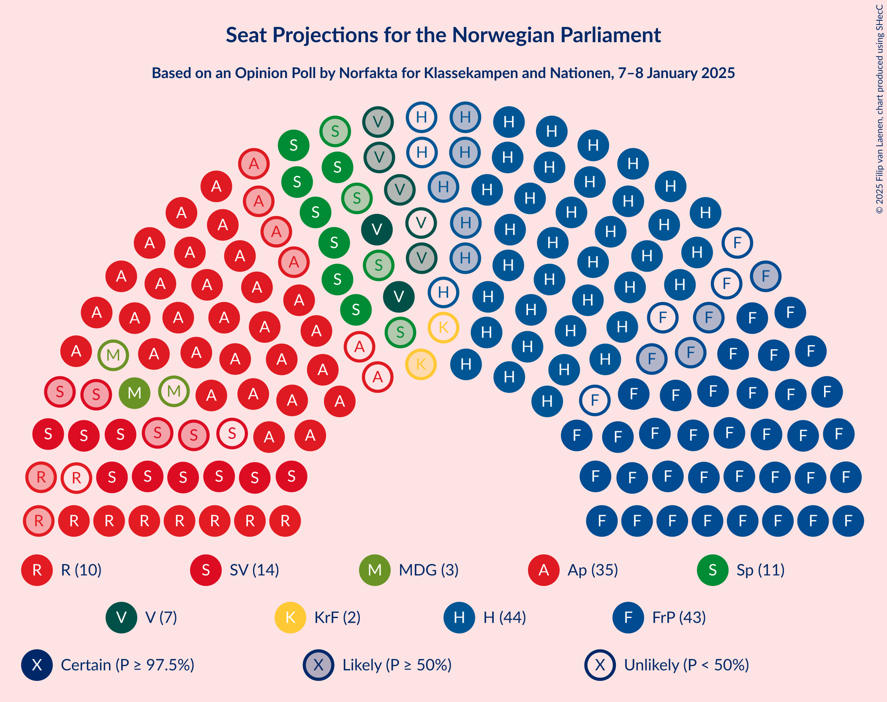
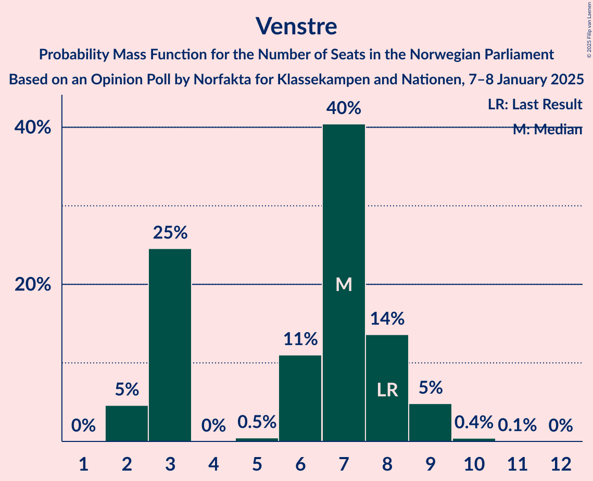
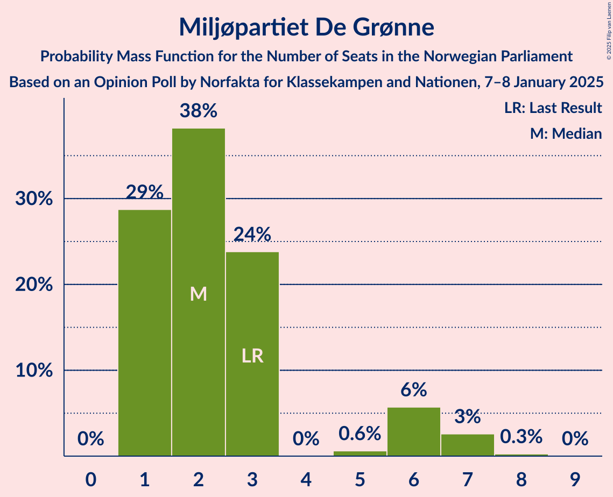
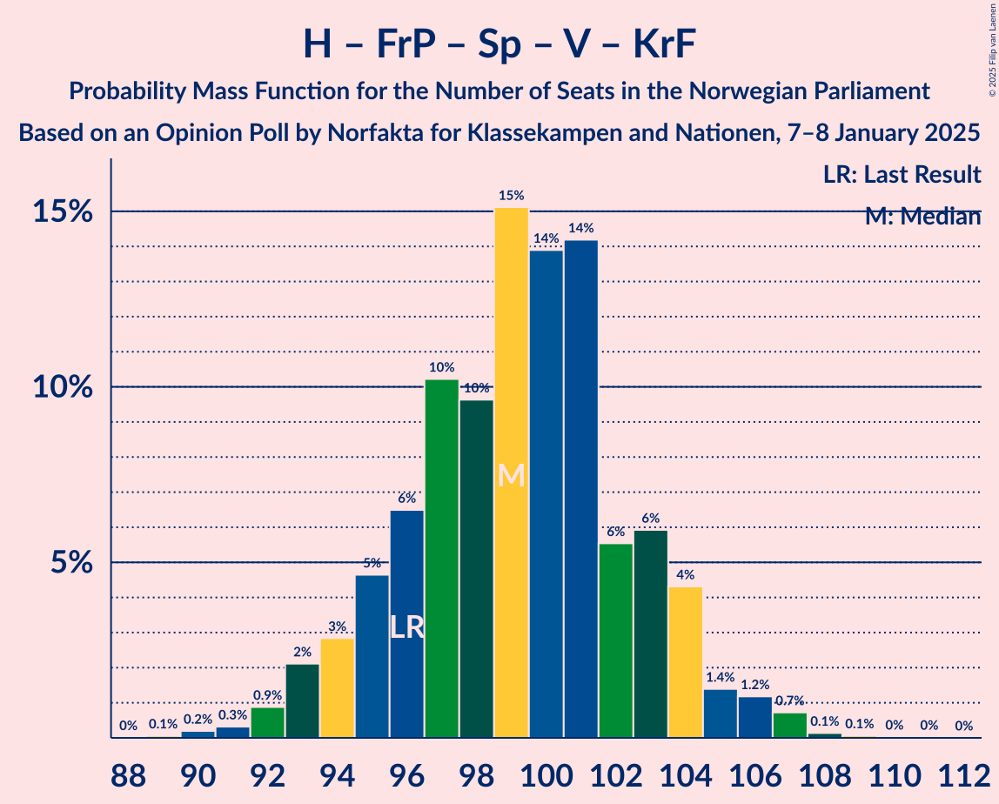
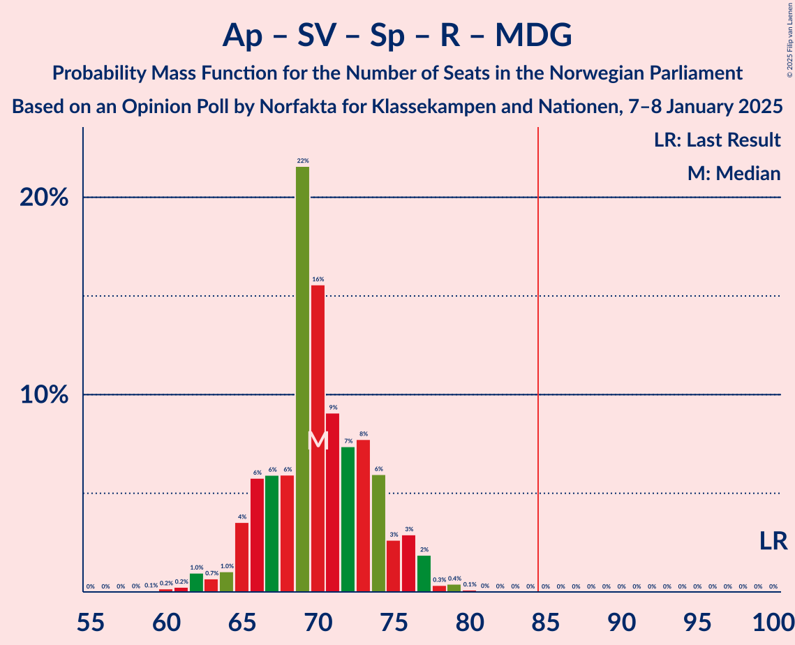
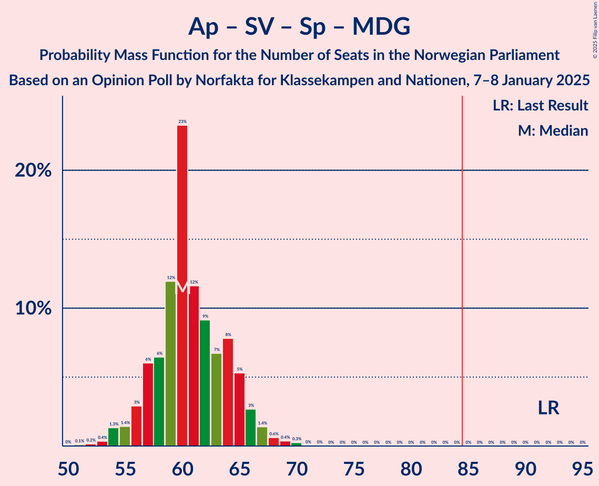
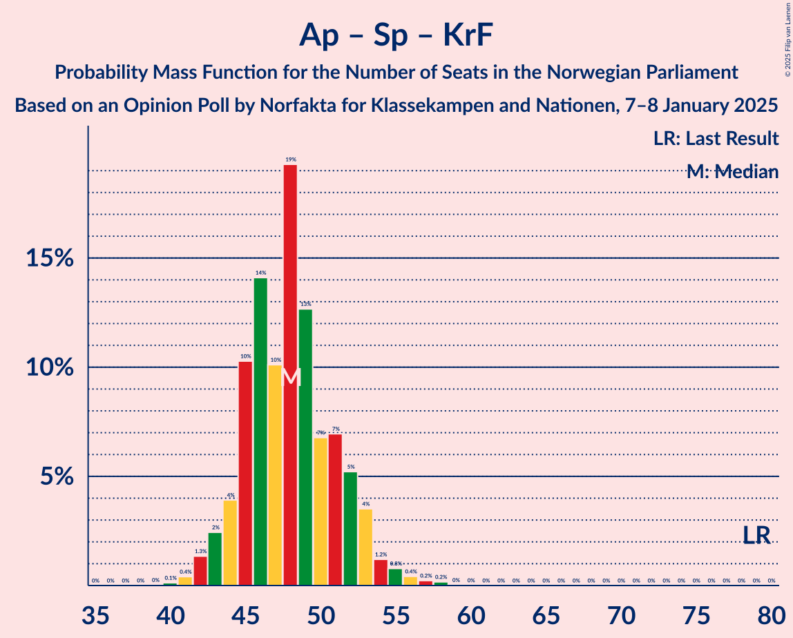

# Opinion Poll by Norfakta for Klassekampen and Nationen, 7–8 January 2025

<a href="#voting-intentions">Voting Intentions</a> | <a href="#seats">Seats</a> | <a href="#coalitions">Coalitions</a> | <a href="#technical-information">Technical Information</a>

## Voting Intentions

### Confidence Intervals

| Party | Last Result | Poll Result | 80% Confidence Interval | 90% Confidence Interval | 95% Confidence Interval | 99% Confidence Interval |
|:-----:|:-----------:|:-----------:|:-----------------------:|:-----------------------:|:-----------------------:|:-----------------------:|
| Høyre | 20.4% | 23.2% | 21.5–24.9% |21.0–25.4% |20.6–25.9% |19.9–26.7% |
| Fremskrittspartiet | 11.6% | 21.1% | 19.5–22.8% |19.0–23.3% |18.6–23.7% |17.9–24.5% |
| Arbeiderpartiet | 26.2% | 18.4% | 16.9–20.0% |16.4–20.5% |16.1–20.9% |15.4–21.7% |
| Sosialistisk Venstreparti | 7.6% | 8.1% | 7.1–9.3% |6.8–9.6% |6.6–9.9% |6.1–10.5% |
| Senterpartiet | 13.5% | 6.6% | 5.7–7.7% |5.4–8.0% |5.2–8.3% |4.8–8.9% |
| Rødt | 4.7% | 6.0% | 5.1–7.1% |4.9–7.4% |4.7–7.6% |4.3–8.2% |
| Venstre | 4.6% | 4.3% | 3.6–5.2% |3.4–5.5% |3.2–5.7% |2.9–6.2% |
| Kristelig Folkeparti | 3.8% | 3.2% | 2.6–4.0% |2.4–4.3% |2.3–4.5% |2.0–4.9% |
| Miljøpartiet De Grønne | 3.9% | 3.2% | 2.6–4.0% |2.4–4.3% |2.3–4.5% |2.0–4.9% |

*Note:* The poll result column reflects the actual value used in the calculations. Published results may vary slightly, and in addition be rounded to fewer digits.

## Seats

### Confidence Intervals

| Party | Last Result | Median | 80% Confidence Interval | 90% Confidence Interval | 95% Confidence Interval | 99% Confidence Interval |
|:-----:|:-----------:|:------:|:-----------------------:|:-----------------------:|:-----------------------:|:-----------------------:|
| <a href="#høyre">Høyre</a> | 36 | 40 | 37–44 |36–45 |35–46 |33–48 |
| <a href="#fremskrittspartiet">Fremskrittspartiet</a> | 21 | 39 | 36–43 |36–43 |35–44 |33–46 |
| <a href="#arbeiderpartiet">Arbeiderpartiet</a> | 48 | 35 | 32–37 |32–39 |31–40 |30–42 |
| <a href="#sosialistisk-venstreparti">Sosialistisk Venstreparti</a> | 13 | 13 | 11–15 |10–15 |9–16 |9–17 |
| <a href="#senterpartiet">Senterpartiet</a> | 28 | 11 | 9–14 |8–14 |7–15 |7–15 |
| <a href="#rødt">Rødt</a> | 8 | 9 | 8–11 |7–11 |7–12 |6–13 |
| <a href="#venstre">Venstre</a> | 8 | 7 | 3–8 |3–9 |2–9 |2–10 |
| <a href="#kristelig-folkeparti">Kristelig Folkeparti</a> | 3 | 2 | 1–3 |1–6 |0–6 |0–7 |
| <a href="#miljøpartiet-de-grønne">Miljøpartiet De Grønne</a> | 3 | 2 | 1–5 |1–6 |1–7 |1–7 |

### Høyre

*For a full overview of the results for this party, see the [Høyre](party-høyre.html) page.*

| Number of Seats | Probability | Accumulated | Special Marks |
|:---------------:|:-----------:|:-----------:|:-------------:|
| 33 | 0.6% | 100% |  |
| 34 | 0.3% | 99.4% |  |
| 35 | 2% | 99.0% |  |
| 36 | 5% | 97% | Last Result |
| 37 | 3% | 93% |  |
| 38 | 8% | 90% |  |
| 39 | 16% | 82% |  |
| 40 | 19% | 66% | Median |
| 41 | 10% | 47% |  |
| 42 | 13% | 37% |  |
| 43 | 10% | 23% |  |
| 44 | 7% | 13% |  |
| 45 | 4% | 7% |  |
| 46 | 2% | 3% |  |
| 47 | 0.9% | 1.4% |  |
| 48 | 0.4% | 0.5% |  |
| 49 | 0.1% | 0.1% |  |
| 50 | 0% | 0.1% |  |
| 51 | 0% | 0% |  |

### Fremskrittspartiet

*For a full overview of the results for this party, see the [Fremskrittspartiet](party-fremskrittspartiet.html) page.*

| Number of Seats | Probability | Accumulated | Special Marks |
|:---------------:|:-----------:|:-----------:|:-------------:|
| 21 | 0% | 100% | Last Result |
| 22 | 0% | 100% |  |
| 23 | 0% | 100% |  |
| 24 | 0% | 100% |  |
| 25 | 0% | 100% |  |
| 26 | 0% | 100% |  |
| 27 | 0% | 100% |  |
| 28 | 0% | 100% |  |
| 29 | 0% | 100% |  |
| 30 | 0% | 100% |  |
| 31 | 0% | 100% |  |
| 32 | 0.4% | 100% |  |
| 33 | 0.5% | 99.5% |  |
| 34 | 0.5% | 99.1% |  |
| 35 | 3% | 98.6% |  |
| 36 | 8% | 96% |  |
| 37 | 7% | 88% |  |
| 38 | 12% | 81% |  |
| 39 | 22% | 69% | Median |
| 40 | 8% | 47% |  |
| 41 | 15% | 38% |  |
| 42 | 9% | 23% |  |
| 43 | 11% | 14% |  |
| 44 | 2% | 3% |  |
| 45 | 0.9% | 1.5% |  |
| 46 | 0.2% | 0.6% |  |
| 47 | 0.2% | 0.4% |  |
| 48 | 0.2% | 0.2% |  |
| 49 | 0% | 0% |  |

### Arbeiderpartiet

*For a full overview of the results for this party, see the [Arbeiderpartiet](party-arbeiderpartiet.html) page.*

| Number of Seats | Probability | Accumulated | Special Marks |
|:---------------:|:-----------:|:-----------:|:-------------:|
| 29 | 0.1% | 100% |  |
| 30 | 0.5% | 99.9% |  |
| 31 | 4% | 99.4% |  |
| 32 | 10% | 96% |  |
| 33 | 10% | 86% |  |
| 34 | 23% | 76% |  |
| 35 | 22% | 53% | Median |
| 36 | 16% | 31% |  |
| 37 | 6% | 15% |  |
| 38 | 3% | 9% |  |
| 39 | 2% | 6% |  |
| 40 | 3% | 4% |  |
| 41 | 0.5% | 1.4% |  |
| 42 | 0.6% | 0.8% |  |
| 43 | 0.2% | 0.2% |  |
| 44 | 0% | 0.1% |  |
| 45 | 0% | 0% |  |
| 46 | 0% | 0% |  |
| 47 | 0% | 0% |  |
| 48 | 0% | 0% | Last Result |

### Sosialistisk Venstreparti

*For a full overview of the results for this party, see the [Sosialistisk Venstreparti](party-sosialistiskvenstreparti.html) page.*

| Number of Seats | Probability | Accumulated | Special Marks |
|:---------------:|:-----------:|:-----------:|:-------------:|
| 8 | 0.5% | 100% |  |
| 9 | 3% | 99.5% |  |
| 10 | 6% | 97% |  |
| 11 | 17% | 91% |  |
| 12 | 23% | 74% |  |
| 13 | 21% | 51% | Last Result, Median |
| 14 | 14% | 29% |  |
| 15 | 10% | 15% |  |
| 16 | 4% | 5% |  |
| 17 | 0.8% | 1.2% |  |
| 18 | 0.4% | 0.4% |  |
| 19 | 0.1% | 0.1% |  |
| 20 | 0% | 0% |  |

### Senterpartiet

*For a full overview of the results for this party, see the [Senterpartiet](party-senterpartiet.html) page.*

| Number of Seats | Probability | Accumulated | Special Marks |
|:---------------:|:-----------:|:-----------:|:-------------:|
| 6 | 0.4% | 100% |  |
| 7 | 2% | 99.6% |  |
| 8 | 7% | 97% |  |
| 9 | 13% | 91% |  |
| 10 | 20% | 77% |  |
| 11 | 28% | 58% | Median |
| 12 | 11% | 30% |  |
| 13 | 6% | 19% |  |
| 14 | 9% | 13% |  |
| 15 | 4% | 4% |  |
| 16 | 0.1% | 0.1% |  |
| 17 | 0% | 0% |  |
| 18 | 0% | 0% |  |
| 19 | 0% | 0% |  |
| 20 | 0% | 0% |  |
| 21 | 0% | 0% |  |
| 22 | 0% | 0% |  |
| 23 | 0% | 0% |  |
| 24 | 0% | 0% |  |
| 25 | 0% | 0% |  |
| 26 | 0% | 0% |  |
| 27 | 0% | 0% |  |
| 28 | 0% | 0% | Last Result |

### Rødt

*For a full overview of the results for this party, see the [Rødt](party-rødt.html) page.*

| Number of Seats | Probability | Accumulated | Special Marks |
|:---------------:|:-----------:|:-----------:|:-------------:|
| 1 | 0.1% | 100% |  |
| 2 | 0% | 99.9% |  |
| 3 | 0% | 99.9% |  |
| 4 | 0% | 99.9% |  |
| 5 | 0% | 99.9% |  |
| 6 | 0.4% | 99.8% |  |
| 7 | 7% | 99.5% |  |
| 8 | 21% | 92% | Last Result |
| 9 | 25% | 72% | Median |
| 10 | 29% | 47% |  |
| 11 | 14% | 18% |  |
| 12 | 3% | 4% |  |
| 13 | 1.0% | 1.2% |  |
| 14 | 0.2% | 0.2% |  |
| 15 | 0% | 0% |  |

### Venstre

*For a full overview of the results for this party, see the [Venstre](party-venstre.html) page.*

| Number of Seats | Probability | Accumulated | Special Marks |
|:---------------:|:-----------:|:-----------:|:-------------:|
| 2 | 4% | 100% |  |
| 3 | 24% | 96% |  |
| 4 | 0% | 72% |  |
| 5 | 0.5% | 72% |  |
| 6 | 13% | 71% |  |
| 7 | 38% | 58% | Median |
| 8 | 14% | 21% | Last Result |
| 9 | 6% | 7% |  |
| 10 | 0.6% | 0.6% |  |
| 11 | 0% | 0% |  |

### Kristelig Folkeparti

*For a full overview of the results for this party, see the [Kristelig Folkeparti](party-kristeligfolkeparti.html) page.*

| Number of Seats | Probability | Accumulated | Special Marks |
|:---------------:|:-----------:|:-----------:|:-------------:|
| 0 | 3% | 100% |  |
| 1 | 14% | 97% |  |
| 2 | 51% | 82% | Median |
| 3 | 25% | 31% | Last Result |
| 4 | 0% | 6% |  |
| 5 | 0.4% | 6% |  |
| 6 | 3% | 5% |  |
| 7 | 2% | 2% |  |
| 8 | 0.3% | 0.3% |  |
| 9 | 0% | 0% |  |

### Miljøpartiet De Grønne

*For a full overview of the results for this party, see the [Miljøpartiet De Grønne](party-miljøpartietdegrønne.html) page.*

| Number of Seats | Probability | Accumulated | Special Marks |
|:---------------:|:-----------:|:-----------:|:-------------:|
| 1 | 33% | 100% |  |
| 2 | 35% | 67% | Median |
| 3 | 22% | 33% | Last Result |
| 4 | 0% | 10% |  |
| 5 | 0.6% | 10% |  |
| 6 | 7% | 10% |  |
| 7 | 2% | 3% |  |
| 8 | 0.3% | 0.4% |  |
| 9 | 0% | 0% |  |

## Coalitions

### Confidence Intervals

| Coalition | Last Result | Median | Majority? | 80% Confidence Interval | 90% Confidence Interval | 95% Confidence Interval | 99% Confidence Interval |
|:---------:|:-----------:|:------:|:---------:|:-----------------------:|:-----------------------:|:-----------------------:|:-----------------------:|
| Høyre – Fremskrittspartiet – Senterpartiet – Venstre – Kristelig Folkeparti | 96 | 99 | 100% | 95–103 | 94–104 | 93–105 | 91–107 |
| Høyre – Fremskrittspartiet – Venstre – Kristelig Folkeparti – Miljøpartiet De Grønne | 71 | 91 | 97% | 86–95 | 85–97 | 84–98 | 81–100 |
| Høyre – Fremskrittspartiet – Venstre – Kristelig Folkeparti | 68 | 88 | 90% | 85–93 | 83–94 | 81–95 | 80–98 |
| Høyre – Fremskrittspartiet – Venstre | 65 | 86 | 71% | 82–90 | 81–92 | 79–94 | 77–95 |
| Høyre – Fremskrittspartiet | 57 | 80 | 11% | 76–85 | 75–86 | 74–87 | 73–89 |
| Arbeiderpartiet – Sosialistisk Venstreparti – Senterpartiet – Rødt – Miljøpartiet De Grønne | 100 | 70 | 0% | 66–74 | 65–76 | 64–77 | 62–79 |
| Arbeiderpartiet – Sosialistisk Venstreparti – Senterpartiet – Rødt | 97 | 68 | 0% | 63–72 | 63–73 | 61–74 | 59–76 |
| Arbeiderpartiet – Sosialistisk Venstreparti – Senterpartiet – Kristelig Folkeparti – Miljøpartiet De Grønne | 95 | 62 | 0% | 60–67 | 58–69 | 57–70 | 54–72 |
| Arbeiderpartiet – Sosialistisk Venstreparti – Senterpartiet – Miljøpartiet De Grønne | 92 | 60 | 0% | 57–65 | 56–66 | 55–67 | 53–69 |
| Arbeiderpartiet – Sosialistisk Venstreparti – Rødt – Miljøpartiet De Grønne | 72 | 59 | 0% | 55–63 | 55–64 | 53–65 | 51–67 |
| Arbeiderpartiet – Sosialistisk Venstreparti – Senterpartiet | 89 | 58 | 0% | 55–62 | 54–63 | 53–64 | 51–66 |
| Arbeiderpartiet – Senterpartiet – Kristelig Folkeparti – Miljøpartiet De Grønne | 82 | 50 | 0% | 47–55 | 46–56 | 45–58 | 43–60 |
| Høyre – Venstre – Kristelig Folkeparti | 47 | 49 | 0% | 45–53 | 43–54 | 42–55 | 41–57 |
| Arbeiderpartiet – Senterpartiet – Kristelig Folkeparti | 79 | 48 | 0% | 45–52 | 44–53 | 43–54 | 41–56 |
| Arbeiderpartiet – Sosialistisk Venstreparti | 61 | 47 | 0% | 45–51 | 44–52 | 42–53 | 41–54 |
| Arbeiderpartiet – Senterpartiet | 76 | 45 | 0% | 43–49 | 42–50 | 41–51 | 40–53 |
| Senterpartiet – Venstre – Kristelig Folkeparti | 39 | 19 | 0% | 15–23 | 14–24 | 13–24 | 12–26 |

### Høyre – Fremskrittspartiet – Senterpartiet – Venstre – Kristelig Folkeparti

| Number of Seats | Probability | Accumulated | Special Marks |
|:---------------:|:-----------:|:-----------:|:-------------:|
| 89 | 0.1% | 100% |  |
| 90 | 0.3% | 99.9% |  |
| 91 | 0.3% | 99.6% |  |
| 92 | 1.0% | 99.2% |  |
| 93 | 3% | 98% |  |
| 94 | 2% | 95% |  |
| 95 | 4% | 94% |  |
| 96 | 8% | 90% | Last Result |
| 97 | 9% | 82% |  |
| 98 | 8% | 73% |  |
| 99 | 22% | 65% | Median |
| 100 | 9% | 42% |  |
| 101 | 9% | 33% |  |
| 102 | 6% | 24% |  |
| 103 | 8% | 18% |  |
| 104 | 6% | 10% |  |
| 105 | 2% | 4% |  |
| 106 | 1.4% | 2% |  |
| 107 | 0.5% | 0.9% |  |
| 108 | 0.2% | 0.3% |  |
| 109 | 0.1% | 0.2% |  |
| 110 | 0% | 0.1% |  |
| 111 | 0% | 0% |  |

### Høyre – Fremskrittspartiet – Venstre – Kristelig Folkeparti – Miljøpartiet De Grønne

| Number of Seats | Probability | Accumulated | Special Marks |
|:---------------:|:-----------:|:-----------:|:-------------:|
| 71 | 0% | 100% | Last Result |
| 72 | 0% | 100% |  |
| 73 | 0% | 100% |  |
| 74 | 0% | 100% |  |
| 75 | 0% | 100% |  |
| 76 | 0% | 100% |  |
| 77 | 0% | 100% |  |
| 78 | 0% | 100% |  |
| 79 | 0% | 100% |  |
| 80 | 0.1% | 99.9% |  |
| 81 | 0.6% | 99.8% |  |
| 82 | 0.5% | 99.2% |  |
| 83 | 0.8% | 98.7% |  |
| 84 | 0.9% | 98% |  |
| 85 | 3% | 97% | Majority |
| 86 | 7% | 94% |  |
| 87 | 4% | 87% |  |
| 88 | 7% | 82% |  |
| 89 | 12% | 75% |  |
| 90 | 8% | 64% | Median |
| 91 | 19% | 55% |  |
| 92 | 7% | 36% |  |
| 93 | 6% | 29% |  |
| 94 | 6% | 23% |  |
| 95 | 9% | 17% |  |
| 96 | 2% | 8% |  |
| 97 | 2% | 5% |  |
| 98 | 2% | 4% |  |
| 99 | 0.9% | 2% |  |
| 100 | 0.5% | 0.8% |  |
| 101 | 0.1% | 0.3% |  |
| 102 | 0.1% | 0.2% |  |
| 103 | 0.1% | 0.1% |  |
| 104 | 0% | 0.1% |  |
| 105 | 0% | 0% |  |

### Høyre – Fremskrittspartiet – Venstre – Kristelig Folkeparti

| Number of Seats | Probability | Accumulated | Special Marks |
|:---------------:|:-----------:|:-----------:|:-------------:|
| 68 | 0% | 100% | Last Result |
| 69 | 0% | 100% |  |
| 70 | 0% | 100% |  |
| 71 | 0% | 100% |  |
| 72 | 0% | 100% |  |
| 73 | 0% | 100% |  |
| 74 | 0% | 100% |  |
| 75 | 0% | 100% |  |
| 76 | 0% | 100% |  |
| 77 | 0.1% | 100% |  |
| 78 | 0.1% | 99.9% |  |
| 79 | 0.2% | 99.8% |  |
| 80 | 1.2% | 99.6% |  |
| 81 | 1.2% | 98% |  |
| 82 | 2% | 97% |  |
| 83 | 3% | 95% |  |
| 84 | 2% | 93% |  |
| 85 | 12% | 90% | Majority |
| 86 | 6% | 79% |  |
| 87 | 7% | 73% |  |
| 88 | 18% | 66% | Median |
| 89 | 16% | 48% |  |
| 90 | 9% | 32% |  |
| 91 | 3% | 23% |  |
| 92 | 7% | 20% |  |
| 93 | 7% | 13% |  |
| 94 | 2% | 6% |  |
| 95 | 3% | 5% |  |
| 96 | 1.0% | 2% |  |
| 97 | 0.3% | 1.0% |  |
| 98 | 0.4% | 0.6% |  |
| 99 | 0.1% | 0.2% |  |
| 100 | 0% | 0.1% |  |
| 101 | 0% | 0% |  |

### Høyre – Fremskrittspartiet – Venstre

| Number of Seats | Probability | Accumulated | Special Marks |
|:---------------:|:-----------:|:-----------:|:-------------:|
| 65 | 0% | 100% | Last Result |
| 66 | 0% | 100% |  |
| 67 | 0% | 100% |  |
| 68 | 0% | 100% |  |
| 69 | 0% | 100% |  |
| 70 | 0% | 100% |  |
| 71 | 0% | 100% |  |
| 72 | 0% | 100% |  |
| 73 | 0% | 100% |  |
| 74 | 0% | 100% |  |
| 75 | 0.1% | 100% |  |
| 76 | 0.1% | 99.9% |  |
| 77 | 0.4% | 99.8% |  |
| 78 | 1.4% | 99.4% |  |
| 79 | 1.0% | 98% |  |
| 80 | 2% | 97% |  |
| 81 | 3% | 95% |  |
| 82 | 8% | 92% |  |
| 83 | 9% | 84% |  |
| 84 | 4% | 75% |  |
| 85 | 7% | 71% | Majority |
| 86 | 17% | 64% | Median |
| 87 | 16% | 46% |  |
| 88 | 9% | 30% |  |
| 89 | 4% | 21% |  |
| 90 | 9% | 18% |  |
| 91 | 2% | 9% |  |
| 92 | 3% | 7% |  |
| 93 | 1.1% | 4% |  |
| 94 | 1.2% | 3% |  |
| 95 | 1.0% | 1.3% |  |
| 96 | 0.2% | 0.4% |  |
| 97 | 0.1% | 0.2% |  |
| 98 | 0.1% | 0.1% |  |
| 99 | 0% | 0% |  |

### Høyre – Fremskrittspartiet

| Number of Seats | Probability | Accumulated | Special Marks |
|:---------------:|:-----------:|:-----------:|:-------------:|
| 57 | 0% | 100% | Last Result |
| 58 | 0% | 100% |  |
| 59 | 0% | 100% |  |
| 60 | 0% | 100% |  |
| 61 | 0% | 100% |  |
| 62 | 0% | 100% |  |
| 63 | 0% | 100% |  |
| 64 | 0% | 100% |  |
| 65 | 0% | 100% |  |
| 66 | 0% | 100% |  |
| 67 | 0% | 100% |  |
| 68 | 0% | 100% |  |
| 69 | 0% | 100% |  |
| 70 | 0% | 100% |  |
| 71 | 0.1% | 99.9% |  |
| 72 | 0.2% | 99.8% |  |
| 73 | 1.0% | 99.6% |  |
| 74 | 1.2% | 98.7% |  |
| 75 | 4% | 97% |  |
| 76 | 4% | 93% |  |
| 77 | 7% | 90% |  |
| 78 | 9% | 83% |  |
| 79 | 21% | 74% | Median |
| 80 | 15% | 54% |  |
| 81 | 12% | 39% |  |
| 82 | 7% | 27% |  |
| 83 | 6% | 20% |  |
| 84 | 4% | 15% |  |
| 85 | 4% | 11% | Majority |
| 86 | 3% | 7% |  |
| 87 | 3% | 4% |  |
| 88 | 0.8% | 1.3% |  |
| 89 | 0.2% | 0.5% |  |
| 90 | 0.2% | 0.3% |  |
| 91 | 0% | 0.1% |  |
| 92 | 0.1% | 0.1% |  |
| 93 | 0% | 0% |  |

### Arbeiderpartiet – Sosialistisk Venstreparti – Senterpartiet – Rødt – Miljøpartiet De Grønne

| Number of Seats | Probability | Accumulated | Special Marks |
|:---------------:|:-----------:|:-----------:|:-------------:|
| 59 | 0.1% | 100% |  |
| 60 | 0.2% | 99.9% |  |
| 61 | 0.2% | 99.7% |  |
| 62 | 1.1% | 99.5% |  |
| 63 | 0.7% | 98% |  |
| 64 | 1.1% | 98% |  |
| 65 | 3% | 97% |  |
| 66 | 8% | 94% |  |
| 67 | 7% | 86% |  |
| 68 | 5% | 79% |  |
| 69 | 24% | 74% |  |
| 70 | 9% | 50% | Median |
| 71 | 12% | 41% |  |
| 72 | 9% | 29% |  |
| 73 | 6% | 20% |  |
| 74 | 7% | 14% |  |
| 75 | 2% | 7% |  |
| 76 | 2% | 5% |  |
| 77 | 2% | 3% |  |
| 78 | 0.5% | 1.1% |  |
| 79 | 0.4% | 0.6% |  |
| 80 | 0.1% | 0.2% |  |
| 81 | 0% | 0.1% |  |
| 82 | 0% | 0% |  |
| 83 | 0% | 0% |  |
| 84 | 0% | 0% |  |
| 85 | 0% | 0% | Majority |
| 86 | 0% | 0% |  |
| 87 | 0% | 0% |  |
| 88 | 0% | 0% |  |
| 89 | 0% | 0% |  |
| 90 | 0% | 0% |  |
| 91 | 0% | 0% |  |
| 92 | 0% | 0% |  |
| 93 | 0% | 0% |  |
| 94 | 0% | 0% |  |
| 95 | 0% | 0% |  |
| 96 | 0% | 0% |  |
| 97 | 0% | 0% |  |
| 98 | 0% | 0% |  |
| 99 | 0% | 0% |  |
| 100 | 0% | 0% | Last Result |

### Arbeiderpartiet – Sosialistisk Venstreparti – Senterpartiet – Rødt

| Number of Seats | Probability | Accumulated | Special Marks |
|:---------------:|:-----------:|:-----------:|:-------------:|
| 56 | 0.1% | 100% |  |
| 57 | 0.1% | 99.9% |  |
| 58 | 0.1% | 99.8% |  |
| 59 | 0.5% | 99.7% |  |
| 60 | 1.2% | 99.2% |  |
| 61 | 0.9% | 98% |  |
| 62 | 2% | 97% |  |
| 63 | 6% | 95% |  |
| 64 | 4% | 89% |  |
| 65 | 9% | 85% |  |
| 66 | 8% | 76% |  |
| 67 | 15% | 68% |  |
| 68 | 18% | 53% | Median |
| 69 | 9% | 35% |  |
| 70 | 8% | 26% |  |
| 71 | 8% | 18% |  |
| 72 | 5% | 10% |  |
| 73 | 2% | 5% |  |
| 74 | 2% | 4% |  |
| 75 | 0.5% | 2% |  |
| 76 | 1.0% | 1.4% |  |
| 77 | 0.1% | 0.3% |  |
| 78 | 0.2% | 0.2% |  |
| 79 | 0% | 0.1% |  |
| 80 | 0% | 0% |  |
| 81 | 0% | 0% |  |
| 82 | 0% | 0% |  |
| 83 | 0% | 0% |  |
| 84 | 0% | 0% |  |
| 85 | 0% | 0% | Majority |
| 86 | 0% | 0% |  |
| 87 | 0% | 0% |  |
| 88 | 0% | 0% |  |
| 89 | 0% | 0% |  |
| 90 | 0% | 0% |  |
| 91 | 0% | 0% |  |
| 92 | 0% | 0% |  |
| 93 | 0% | 0% |  |
| 94 | 0% | 0% |  |
| 95 | 0% | 0% |  |
| 96 | 0% | 0% |  |
| 97 | 0% | 0% | Last Result |

### Arbeiderpartiet – Sosialistisk Venstreparti – Senterpartiet – Kristelig Folkeparti – Miljøpartiet De Grønne

| Number of Seats | Probability | Accumulated | Special Marks |
|:---------------:|:-----------:|:-----------:|:-------------:|
| 52 | 0.1% | 100% |  |
| 53 | 0.1% | 99.9% |  |
| 54 | 0.4% | 99.9% |  |
| 55 | 0.9% | 99.5% |  |
| 56 | 0.6% | 98.6% |  |
| 57 | 2% | 98% |  |
| 58 | 2% | 96% |  |
| 59 | 3% | 94% |  |
| 60 | 11% | 91% |  |
| 61 | 16% | 80% |  |
| 62 | 14% | 64% |  |
| 63 | 11% | 50% | Median |
| 64 | 12% | 39% |  |
| 65 | 6% | 27% |  |
| 66 | 7% | 21% |  |
| 67 | 6% | 14% |  |
| 68 | 3% | 8% |  |
| 69 | 3% | 6% |  |
| 70 | 2% | 3% |  |
| 71 | 0.9% | 1.5% |  |
| 72 | 0.4% | 0.6% |  |
| 73 | 0.1% | 0.2% |  |
| 74 | 0% | 0.1% |  |
| 75 | 0% | 0% |  |
| 76 | 0% | 0% |  |
| 77 | 0% | 0% |  |
| 78 | 0% | 0% |  |
| 79 | 0% | 0% |  |
| 80 | 0% | 0% |  |
| 81 | 0% | 0% |  |
| 82 | 0% | 0% |  |
| 83 | 0% | 0% |  |
| 84 | 0% | 0% |  |
| 85 | 0% | 0% | Majority |
| 86 | 0% | 0% |  |
| 87 | 0% | 0% |  |
| 88 | 0% | 0% |  |
| 89 | 0% | 0% |  |
| 90 | 0% | 0% |  |
| 91 | 0% | 0% |  |
| 92 | 0% | 0% |  |
| 93 | 0% | 0% |  |
| 94 | 0% | 0% |  |
| 95 | 0% | 0% | Last Result |

### Arbeiderpartiet – Sosialistisk Venstreparti – Senterpartiet – Miljøpartiet De Grønne

| Number of Seats | Probability | Accumulated | Special Marks |
|:---------------:|:-----------:|:-----------:|:-------------:|
| 51 | 0.2% | 100% |  |
| 52 | 0.1% | 99.8% |  |
| 53 | 0.4% | 99.7% |  |
| 54 | 1.5% | 99.3% |  |
| 55 | 1.5% | 98% |  |
| 56 | 4% | 96% |  |
| 57 | 3% | 93% |  |
| 58 | 9% | 90% |  |
| 59 | 18% | 80% |  |
| 60 | 16% | 62% |  |
| 61 | 13% | 46% | Median |
| 62 | 8% | 33% |  |
| 63 | 6% | 25% |  |
| 64 | 8% | 19% |  |
| 65 | 5% | 11% |  |
| 66 | 3% | 5% |  |
| 67 | 1.3% | 3% |  |
| 68 | 0.6% | 1.4% |  |
| 69 | 0.4% | 0.8% |  |
| 70 | 0.3% | 0.3% |  |
| 71 | 0% | 0.1% |  |
| 72 | 0% | 0% |  |
| 73 | 0% | 0% |  |
| 74 | 0% | 0% |  |
| 75 | 0% | 0% |  |
| 76 | 0% | 0% |  |
| 77 | 0% | 0% |  |
| 78 | 0% | 0% |  |
| 79 | 0% | 0% |  |
| 80 | 0% | 0% |  |
| 81 | 0% | 0% |  |
| 82 | 0% | 0% |  |
| 83 | 0% | 0% |  |
| 84 | 0% | 0% |  |
| 85 | 0% | 0% | Majority |
| 86 | 0% | 0% |  |
| 87 | 0% | 0% |  |
| 88 | 0% | 0% |  |
| 89 | 0% | 0% |  |
| 90 | 0% | 0% |  |
| 91 | 0% | 0% |  |
| 92 | 0% | 0% | Last Result |

### Arbeiderpartiet – Sosialistisk Venstreparti – Rødt – Miljøpartiet De Grønne

| Number of Seats | Probability | Accumulated | Special Marks |
|:---------------:|:-----------:|:-----------:|:-------------:|
| 49 | 0% | 100% |  |
| 50 | 0.1% | 99.9% |  |
| 51 | 0.5% | 99.8% |  |
| 52 | 0.4% | 99.4% |  |
| 53 | 2% | 99.0% |  |
| 54 | 1.4% | 97% |  |
| 55 | 7% | 96% |  |
| 56 | 5% | 89% |  |
| 57 | 12% | 84% |  |
| 58 | 16% | 73% |  |
| 59 | 14% | 57% | Median |
| 60 | 19% | 42% |  |
| 61 | 5% | 23% |  |
| 62 | 6% | 18% |  |
| 63 | 3% | 12% |  |
| 64 | 5% | 9% |  |
| 65 | 2% | 4% |  |
| 66 | 0.7% | 2% |  |
| 67 | 0.5% | 0.9% |  |
| 68 | 0.3% | 0.4% |  |
| 69 | 0% | 0.1% |  |
| 70 | 0% | 0% |  |
| 71 | 0% | 0% |  |
| 72 | 0% | 0% | Last Result |

### Arbeiderpartiet – Sosialistisk Venstreparti – Senterpartiet

| Number of Seats | Probability | Accumulated | Special Marks |
|:---------------:|:-----------:|:-----------:|:-------------:|
| 48 | 0.1% | 100% |  |
| 49 | 0.1% | 99.9% |  |
| 50 | 0.3% | 99.8% |  |
| 51 | 0.5% | 99.5% |  |
| 52 | 1.3% | 99.0% |  |
| 53 | 2% | 98% |  |
| 54 | 2% | 96% |  |
| 55 | 10% | 93% |  |
| 56 | 6% | 83% |  |
| 57 | 21% | 78% |  |
| 58 | 9% | 57% |  |
| 59 | 13% | 48% | Median |
| 60 | 17% | 34% |  |
| 61 | 6% | 18% |  |
| 62 | 5% | 12% |  |
| 63 | 3% | 7% |  |
| 64 | 2% | 4% |  |
| 65 | 0.9% | 2% |  |
| 66 | 0.3% | 0.7% |  |
| 67 | 0.2% | 0.3% |  |
| 68 | 0.1% | 0.1% |  |
| 69 | 0% | 0% |  |
| 70 | 0% | 0% |  |
| 71 | 0% | 0% |  |
| 72 | 0% | 0% |  |
| 73 | 0% | 0% |  |
| 74 | 0% | 0% |  |
| 75 | 0% | 0% |  |
| 76 | 0% | 0% |  |
| 77 | 0% | 0% |  |
| 78 | 0% | 0% |  |
| 79 | 0% | 0% |  |
| 80 | 0% | 0% |  |
| 81 | 0% | 0% |  |
| 82 | 0% | 0% |  |
| 83 | 0% | 0% |  |
| 84 | 0% | 0% |  |
| 85 | 0% | 0% | Majority |
| 86 | 0% | 0% |  |
| 87 | 0% | 0% |  |
| 88 | 0% | 0% |  |
| 89 | 0% | 0% | Last Result |

### Arbeiderpartiet – Senterpartiet – Kristelig Folkeparti – Miljøpartiet De Grønne

| Number of Seats | Probability | Accumulated | Special Marks |
|:---------------:|:-----------:|:-----------:|:-------------:|
| 42 | 0.2% | 100% |  |
| 43 | 0.4% | 99.8% |  |
| 44 | 1.4% | 99.4% |  |
| 45 | 3% | 98% |  |
| 46 | 2% | 95% |  |
| 47 | 7% | 93% |  |
| 48 | 19% | 86% |  |
| 49 | 14% | 67% |  |
| 50 | 14% | 53% | Median |
| 51 | 7% | 39% |  |
| 52 | 10% | 32% |  |
| 53 | 5% | 22% |  |
| 54 | 6% | 17% |  |
| 55 | 4% | 11% |  |
| 56 | 3% | 7% |  |
| 57 | 1.2% | 4% |  |
| 58 | 2% | 3% |  |
| 59 | 0.4% | 1.3% |  |
| 60 | 0.6% | 0.9% |  |
| 61 | 0.2% | 0.2% |  |
| 62 | 0% | 0.1% |  |
| 63 | 0% | 0% |  |
| 64 | 0% | 0% |  |
| 65 | 0% | 0% |  |
| 66 | 0% | 0% |  |
| 67 | 0% | 0% |  |
| 68 | 0% | 0% |  |
| 69 | 0% | 0% |  |
| 70 | 0% | 0% |  |
| 71 | 0% | 0% |  |
| 72 | 0% | 0% |  |
| 73 | 0% | 0% |  |
| 74 | 0% | 0% |  |
| 75 | 0% | 0% |  |
| 76 | 0% | 0% |  |
| 77 | 0% | 0% |  |
| 78 | 0% | 0% |  |
| 79 | 0% | 0% |  |
| 80 | 0% | 0% |  |
| 81 | 0% | 0% |  |
| 82 | 0% | 0% | Last Result |

### Høyre – Venstre – Kristelig Folkeparti

| Number of Seats | Probability | Accumulated | Special Marks |
|:---------------:|:-----------:|:-----------:|:-------------:|
| 39 | 0.1% | 100% |  |
| 40 | 0.3% | 99.9% |  |
| 41 | 2% | 99.6% |  |
| 42 | 2% | 98% |  |
| 43 | 2% | 96% |  |
| 44 | 3% | 95% |  |
| 45 | 5% | 92% |  |
| 46 | 8% | 87% |  |
| 47 | 10% | 79% | Last Result |
| 48 | 15% | 69% |  |
| 49 | 14% | 54% | Median |
| 50 | 9% | 40% |  |
| 51 | 10% | 31% |  |
| 52 | 8% | 20% |  |
| 53 | 5% | 12% |  |
| 54 | 4% | 7% |  |
| 55 | 1.1% | 3% |  |
| 56 | 0.7% | 2% |  |
| 57 | 0.9% | 1.1% |  |
| 58 | 0.1% | 0.3% |  |
| 59 | 0.1% | 0.1% |  |
| 60 | 0% | 0.1% |  |
| 61 | 0% | 0% |  |

### Arbeiderpartiet – Senterpartiet – Kristelig Folkeparti

| Number of Seats | Probability | Accumulated | Special Marks |
|:---------------:|:-----------:|:-----------:|:-------------:|
| 40 | 0.1% | 100% |  |
| 41 | 0.4% | 99.9% |  |
| 42 | 2% | 99.5% |  |
| 43 | 2% | 98% |  |
| 44 | 5% | 95% |  |
| 45 | 9% | 91% |  |
| 46 | 17% | 82% |  |
| 47 | 9% | 65% |  |
| 48 | 16% | 56% | Median |
| 49 | 12% | 39% |  |
| 50 | 7% | 27% |  |
| 51 | 8% | 20% |  |
| 52 | 7% | 12% |  |
| 53 | 2% | 5% |  |
| 54 | 2% | 3% |  |
| 55 | 0.9% | 2% |  |
| 56 | 0.3% | 0.8% |  |
| 57 | 0.3% | 0.4% |  |
| 58 | 0.1% | 0.2% |  |
| 59 | 0% | 0% |  |
| 60 | 0% | 0% |  |
| 61 | 0% | 0% |  |
| 62 | 0% | 0% |  |
| 63 | 0% | 0% |  |
| 64 | 0% | 0% |  |
| 65 | 0% | 0% |  |
| 66 | 0% | 0% |  |
| 67 | 0% | 0% |  |
| 68 | 0% | 0% |  |
| 69 | 0% | 0% |  |
| 70 | 0% | 0% |  |
| 71 | 0% | 0% |  |
| 72 | 0% | 0% |  |
| 73 | 0% | 0% |  |
| 74 | 0% | 0% |  |
| 75 | 0% | 0% |  |
| 76 | 0% | 0% |  |
| 77 | 0% | 0% |  |
| 78 | 0% | 0% |  |
| 79 | 0% | 0% | Last Result |

### Arbeiderpartiet – Sosialistisk Venstreparti

| Number of Seats | Probability | Accumulated | Special Marks |
|:---------------:|:-----------:|:-----------:|:-------------:|
| 40 | 0.4% | 100% |  |
| 41 | 0.6% | 99.6% |  |
| 42 | 2% | 99.0% |  |
| 43 | 2% | 97% |  |
| 44 | 3% | 95% |  |
| 45 | 8% | 92% |  |
| 46 | 19% | 84% |  |
| 47 | 23% | 65% |  |
| 48 | 17% | 42% | Median |
| 49 | 9% | 25% |  |
| 50 | 4% | 16% |  |
| 51 | 4% | 12% |  |
| 52 | 4% | 7% |  |
| 53 | 2% | 3% |  |
| 54 | 0.7% | 1.1% |  |
| 55 | 0.2% | 0.4% |  |
| 56 | 0.1% | 0.1% |  |
| 57 | 0% | 0% |  |
| 58 | 0% | 0% |  |
| 59 | 0% | 0% |  |
| 60 | 0% | 0% |  |
| 61 | 0% | 0% | Last Result |

### Arbeiderpartiet – Senterpartiet

| Number of Seats | Probability | Accumulated | Special Marks |
|:---------------:|:-----------:|:-----------:|:-------------:|
| 38 | 0% | 100% |  |
| 39 | 0.3% | 99.9% |  |
| 40 | 1.2% | 99.6% |  |
| 41 | 3% | 98% |  |
| 42 | 5% | 96% |  |
| 43 | 10% | 91% |  |
| 44 | 18% | 81% |  |
| 45 | 13% | 63% |  |
| 46 | 13% | 50% | Median |
| 47 | 14% | 37% |  |
| 48 | 6% | 23% |  |
| 49 | 10% | 17% |  |
| 50 | 3% | 7% |  |
| 51 | 2% | 4% |  |
| 52 | 0.6% | 2% |  |
| 53 | 0.5% | 0.9% |  |
| 54 | 0.3% | 0.4% |  |
| 55 | 0.1% | 0.1% |  |
| 56 | 0% | 0% |  |
| 57 | 0% | 0% |  |
| 58 | 0% | 0% |  |
| 59 | 0% | 0% |  |
| 60 | 0% | 0% |  |
| 61 | 0% | 0% |  |
| 62 | 0% | 0% |  |
| 63 | 0% | 0% |  |
| 64 | 0% | 0% |  |
| 65 | 0% | 0% |  |
| 66 | 0% | 0% |  |
| 67 | 0% | 0% |  |
| 68 | 0% | 0% |  |
| 69 | 0% | 0% |  |
| 70 | 0% | 0% |  |
| 71 | 0% | 0% |  |
| 72 | 0% | 0% |  |
| 73 | 0% | 0% |  |
| 74 | 0% | 0% |  |
| 75 | 0% | 0% |  |
| 76 | 0% | 0% | Last Result |

### Senterpartiet – Venstre – Kristelig Folkeparti

| Number of Seats | Probability | Accumulated | Special Marks |
|:---------------:|:-----------:|:-----------:|:-------------:|
| 10 | 0.1% | 100% |  |
| 11 | 0.2% | 99.9% |  |
| 12 | 0.9% | 99.8% |  |
| 13 | 2% | 98.9% |  |
| 14 | 4% | 97% |  |
| 15 | 4% | 93% |  |
| 16 | 7% | 89% |  |
| 17 | 12% | 81% |  |
| 18 | 7% | 70% |  |
| 19 | 14% | 63% |  |
| 20 | 18% | 48% | Median |
| 21 | 10% | 30% |  |
| 22 | 5% | 20% |  |
| 23 | 9% | 15% |  |
| 24 | 4% | 6% |  |
| 25 | 0.8% | 2% |  |
| 26 | 0.7% | 1.0% |  |
| 27 | 0.1% | 0.2% |  |
| 28 | 0.1% | 0.1% |  |
| 29 | 0% | 0% |  |
| 30 | 0% | 0% |  |
| 31 | 0% | 0% |  |
| 32 | 0% | 0% |  |
| 33 | 0% | 0% |  |
| 34 | 0% | 0% |  |
| 35 | 0% | 0% |  |
| 36 | 0% | 0% |  |
| 37 | 0% | 0% |  |
| 38 | 0% | 0% |  |
| 39 | 0% | 0% | Last Result |

## Technical Information

### Opinion Poll

+ **Polling firm:** Norfakta
+ **Commissioner(s):** Klassekampen and Nationen
+ **Fieldwork period:** 7–8 January 2025

### Calculations

+ **Sample size:** 1002
+ **Simulations done:** 1,048,576
+ **Error estimate:** 1.66%

